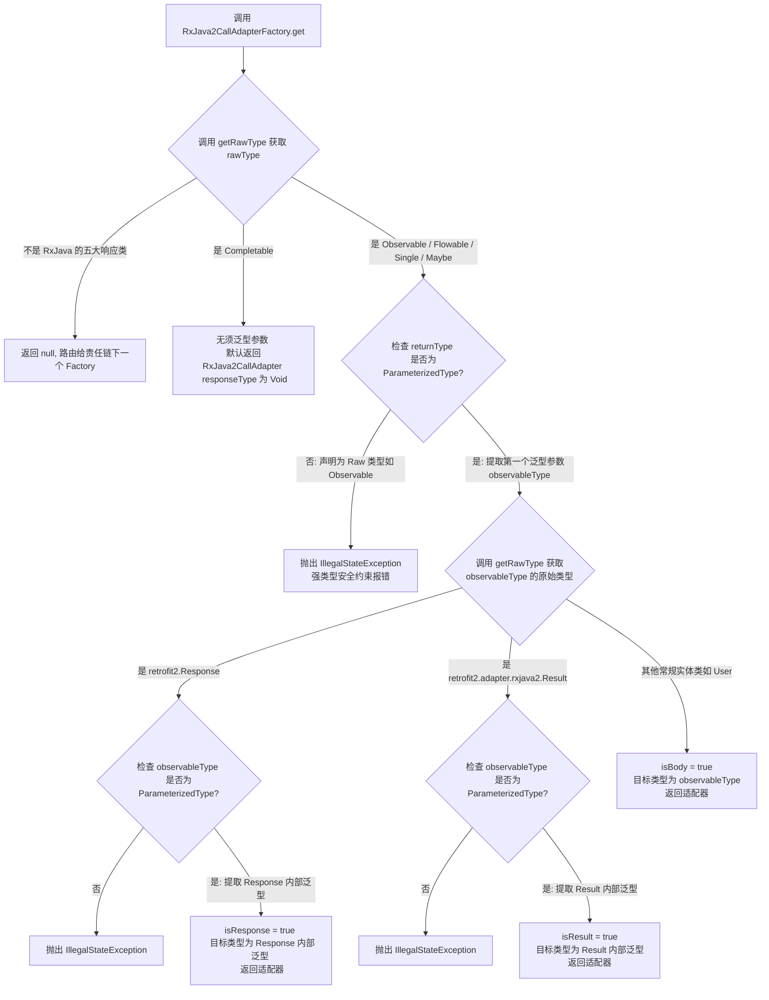
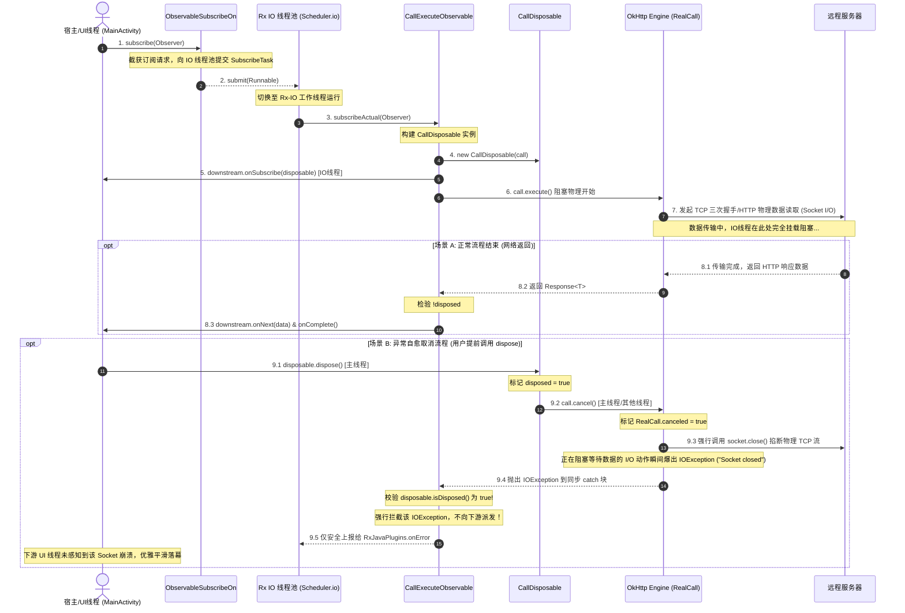

# Retrofit 核心解耦机制：RxJava2CallAdapter 深度源码解密与物理流控制

在现代 Android 异步网络请求开发中，Retrofit + RxJava2（或者 Kotlin 协程）已成为事实上的标准技术栈之一。Retrofit 凭借其惊艳的解耦设计，将原本繁琐的网络请求声明与复杂的异步控制流完全剥离。其中，`CallAdapter`（适配器）机制更是 Retrofit 架构设计中的灵魂所在。

本文将以 `RxJava2CallAdapter` 为核心，从其架构哲学出发，深入剖析泛型与反射提取技术，并逐行解构同步（`CallExecuteObservable`）与异步（`CallEnqueueObservable`）物理流在 RxJava 线程模型下的微观运转过程，最后揭示在组件销毁期 `Disposable.dispose()` 触发时，底层是如何实现物理 Socket 连接强行关闭与异常拦截自愈的源码级闭环。

---

## 1. CallAdapter 适配器设计哲学

在开始剖析源码之前，我们需要理解为什么 Retrofit 需要引入 `CallAdapter` 这一设计？它解决了什么痛点？背后的核心设计思想是什么？

### 1.1 什么是 CallAdapter？

在 Retrofit 的默认设计中，所有的服务接口方法在经过动态代理（Dynamic Proxy）解析后，最终都会被构造成一个 `retrofit2.Call<R>` 对象。这个 `Call` 代表一个可以被执行的、返回类型为 `R` 的 HTTP 网络请求任务（其内部底层封装了 OkHttp 的 `RealCall`）。

`CallAdapter` 是一个泛型接口，其核心定义极其精炼：

```java
public interface CallAdapter<R, T> {
  // 返回 HTTP 响应体反序列化后的目标数据类型（例如，Observable<User> 中的 User）
  Type responseType();

  // 将底层的 retrofit2.Call<R> 适配转换成业务层所需的异步流/包装类型 T（例如，Observable<User>）
  T adapt(Call<R> call);
}
```

- **`responseType()`**：该方法向 Retrofit 核心引擎宣告，底层在解析 HTTP 响应的二进制 Body时，应该使用哪种 `Converter` 将其反序列化为具体的 Java/Kotlin 实体对象。
- **`adapt(Call<R> call)`**：这是适配的核心转换方法。它接收一个能直接发起同步/异步请求的 `Call` 对象，并以非阻塞或响应式的方式，将其重塑并返回成目标包装类型 `T`。

### 1.2 为什么 Retrofit 不绑定在特定的返回类型上？

在早期的 Android 网络请求框架（如 AsyncHttpClient、Volley 等）或者很多开发者自行封装的 OkHttp 框架中，接口返回的数据类型往往是硬编码的。例如：
- 必须传入一个自定义的 `Callback<T>`，在回调方法中处理成功和失败；
- 或者直接返回一个定制好的 `Future<T>`。

这种硬编码的编程模式存在极大的局限性：它将**网络请求的定义**与**具体的并发调度/异步流控框架**死死地绑定在了一起。

随着技术演进，Java 和 Android 的异步编程范式经历了数次变革：
1. **回调地狱时代**：通过传入 Listener 或 Callback 完成异步回调；
2. **并发工具箱时代**：Java 8 的 `CompletableFuture`、Guava 的 `ListenableFuture`；
3. **响应式编程时代**：RxJava 1.x / 2.x / 3.x，支持复杂的冷流、转换操作符、线程切换以及背压控制；
4. **协程时代**：Kotlin 协程中的挂起函数（`suspend`）、`Flow`，以同步的书写方式编写异步非阻塞代码。

如果 Retrofit 在设计之初，就将其返回类型硬编码为 `retrofit2.Call` 或者是某种特定的 Callback，那么当 RxJava 或 Kotlin 协程席卷行业时，整个 Retrofit 核心库将不得不面临颠覆性的重构。而为了支持不同的技术栈，核心库还会变得极度臃肿。

### 1.3 架构解耦思想：依赖倒置与开闭原则

Retrofit 完美的规避了上述问题，它所遵循的是面向对象设计中的两大经典原则：**依赖倒置原则（Dependency Inversion Principle）**与**开闭原则（Open-Closed Principle）**。

- **依赖倒置**：Retrofit 核心引擎（`HttpServiceMethod`）并不直接依赖于具体的第三方异步框架（如 RxJava 的 `Observable` 或 Kotlin 协程的 `Continuation`），而是依赖于抽象的 `CallAdapter` 接口。
- **开闭原则**：Retrofit 核心框架对修改关闭，对扩展开放。当行业诞生了新的异步库（比如新的响应式库 Project Reactor 或者更先进的并发机制），Retrofit 不需要修改任何一行核心代码，开发者只需要编写一个新的 `CallAdapter.Factory` 并通过 `.addCallAdapterFactory()` 注册进 Retrofit，即可无缝支持全新的返回类型。

在这个过程中，`CallAdapter` 扮演了**双向适配器**的桥梁角色：
- **向上**：它满足了声明式接口对返回类型（如 `Observable`、`Single`、`Deferred` 等）的多样化要求；
- **向下**：它屏蔽了底层的网络执行细节，将 OkHttp 的同步/异步请求机制（`Call.execute()` / `Call.enqueue()`）包装进目标响应流的生命周期中。

---

## 2. 核心源码级 CallAdapter.Factory 机制推演

当我们在接口中声明了各种返回类型时，Retrofit 是如何在运行时精确地匹配、实例化对应的 `CallAdapter` 的？这涉及到 Retrofit 的 `CallAdapter.Factory` 路由机制，以及底层高超的反射与泛型边界提取技术。

### 2.1 Factory 接口设计与路由询问

Retrofit 并没有采用硬编码的匹配，而是采用了类似**责任链模式**的工厂设计。`CallAdapter.Factory` 的抽象定义如下：

```java
public abstract static class Factory {
  // 根据方法的返回类型 returnType、注解列表 annotations 以及 Retrofit 实例本身，
  // 返回对应的 CallAdapter。如果无法处理，则返回 null。
  public abstract @Nullable CallAdapter<?, ?> get(
      Type returnType, Annotation[] annotations, Retrofit retrofit);

  // 辅助泛型工具方法：获取一个参数化类型（ParameterizedType）的上限边界
  protected static Type getParameterUpperBound(int index, ParameterizedType type) {
    return Types.getParameterUpperBound(index, type);
  }

  // 辅助泛型工具方法：获取一个 Type 的原始 Class 类型
  protected static Class<?> getRawType(Type type) {
    return Types.getRawType(type);
  }
}
```

### 2.2 核心反射与泛型提取技术

为了对返回类型进行路由匹配，工厂必须在运行时动态解析 Java 泛型类型。例如，当接口返回 `Observable<User>` 时，工厂不仅要识别出这是一个 `Observable`，还要提取出里面的 `User` 类型。

#### 2.2.1 `getRawType(Type type)` 的源码解析与工作原理

由于 Java 的泛型擦除机制，在运行时的 JVM 中，`Type` 接口代表了所有类型的公共接口。`getRawType` 的作用是解析这个 `Type`，并抽取出其泛型擦除后的原始 `Class<?>`：

```java
// 简化自 retrofit2.Utils.getRawType(Type type)
public static Class<?> getRawType(Type type) {
  Objects.requireNonNull(type, "type == null");

  // 1. 如果本身就是普通的 Class 类型，直接强转返回
  if (type instanceof Class<?>) {
    return (Class<?>) type;
  }
  
  // 2. 如果是参数化类型（带有泛型的类，如 Observable<User>）
  if (type instanceof ParameterizedType) {
    ParameterizedType parameterizedType = (ParameterizedType) type;
    // 提取其 RawType。例如 Observable<User> 提取出来的也是 Class<Observable>
    Type rawType = parameterizedType.getRawType();
    if (!(rawType instanceof Class)) throw new IllegalArgumentException();
    return (Class<?>) rawType;
  }
  
  // 3. 如果是泛型数组类型（如 T[]）
  if (type instanceof GenericArrayType) {
    Type componentType = ((GenericArrayType) type).getGenericComponentType();
    return Array.newInstance(getRawType(componentType), 0).getClass();
  }
  
  // 4. 如果是泛型变量（如 <T extends Runnable> 中的 T）
  if (type instanceof TypeVariable) {
    // 泛型擦除后变成它的上限，默认是 Object
    return Object.class;
  }
  
  // 5. 如果是通配符表达式（如 ? extends User）
  if (type instanceof WildcardType) {
    // 获取通配符的上界
    return getRawType(((WildcardType) type).getUpperBounds()[0]);
  }

  throw new IllegalArgumentException("Expected a Class, ParameterizedType, or "
      + "GenericArrayType, but <" + type + "> is of class " + type.getClass().getName());
}
```

#### 2.2.2 `getParameterUpperBound(int index, ParameterizedType type)` 核心逻辑

当我们需要知道 `Observable<User>` 里面的数据实体 `User` 时，这就属于参数化类型（`ParameterizedType`）的泛型参数提取。Retrofit 提供了 `getParameterUpperBound` 方法：

```java
// 简化自 retrofit2.Utils.getParameterUpperBound(int index, ParameterizedType type)
public static Type getParameterUpperBound(int index, ParameterizedType type) {
  // 1. 获取该参数化类型的实际泛型参数列表（例如 Map<String, User> 会返回 [Class<String>, Class<User>]）
  Type[] types = type.getActualTypeArguments();
  if (index < 0 || index >= types.length) {
    throw new IllegalArgumentException(
        "Index " + index + " not in range [0," + types.length + ") for " + type);
  }
  Type paramType = types[index];
  
  // 2. 如果泛型中带有通配符，例如 Observable<? extends User>，我们需要提取它的上界边界
  if (paramType instanceof WildcardType) {
    // 提取通配符的上界（Upper Bounds）。如 ? extends User 的上界就是 User
    return ((WildcardType) paramType).getUpperBounds()[0];
  }
  
  // 3. 否则，直接返回该泛型参数对应的具体 Type（如 User）
  return paramType;
}
```

### 2.3 路由分发与决策机制

为了更直观地展现 Retrofit 在寻找 `CallAdapter` 时的路由逻辑，以下绘制了 `RxJava2CallAdapter.Factory` 针对 `returnType` 的路由分发与泛型边界决策逻辑：



### 2.4 责任链模式在 `Retrofit.nextCallAdapter` 中的具体实现

当我们在构建 Retrofit 时，可以通过 `addCallAdapterFactory` 注入多个适配器工厂。在接口代理方法被调用时，Retrofit 会通过 `nextCallAdapter` 检索合适的适配器。我们来看看这一段检索逻辑：

```java
// 简化自 retrofit2.Retrofit.nextCallAdapter
public CallAdapter<?, ?> nextCallAdapter(
    @Nullable CallAdapter.Factory skipPast, Type returnType, Annotation[] annotations) {
  Objects.requireNonNull(returnType, "returnType == null");
  Objects.requireNonNull(annotations, "annotations == null");

  // 1. 确定遍历的起始位置。如果 skipPast 不为 null，则跳过 skipPast 及其之前的 Factory
  int start = callAdapterFactories.indexOf(skipPast) + 1;
  
  // 2. 依次向后轮询已注册的 CallAdapter.Factory 列表
  for (int i = start, count = callAdapterFactories.size(); i < count; i++) {
    // 3. 询问当前的 Factory 是否支持该 returnType
    CallAdapter<?, ?> adapter = callAdapterFactories.get(i).get(returnType, annotations, this);
    if (adapter != null) {
      // 4. 一旦匹配成功，直接返回，责任链终止
      return adapter;
    }
  }

  // 5. 若检索至链尾均无法处理，则抛出构建异常，指示当前返回类型无法被任何已注册的适配器适配
  StringBuilder builder = new StringBuilder("Could not locate call adapter for ")
      .append(returnType)
      .append(".\n  Tried:");
  for (int i = start, count = callAdapterFactories.size(); i < count; i++) {
    builder.append("\n   * ").append(callAdapterFactories.get(i).getClass().getName());
  }
  throw new IllegalArgumentException(builder.toString());
}
```

在 Retrofit 的默认初始化中，其工厂链的尾部是 `DefaultCallAdapterFactory`。如果用户没有引入 RxJava 适配器，也没有使用协程挂起函数，该方法会最终匹配到 `DefaultCallAdapterFactory`，返回一个适配器，该适配器不执行任何转换，直接将底层 `retrofit2.Call` 对象交回给用户。

---

## 3. RxJava2CallAdapterFactory 核心源码深度解构

引入 `retrofit-adapter-rxjava2` 库后，核心的路由匹配逻辑与转换代码都移交到了 `RxJava2CallAdapterFactory` 与 `RxJava2CallAdapter` 中。我们来深度解构这部分逻辑。

### 3.1 核心工厂的 `get` 路由逻辑

`RxJava2CallAdapterFactory` 在覆写 `get()` 方法时，严格按照上文所述的“决策树”进行了实现。我们来分析其核心源码细节：

```java
@Override
public @Nullable CallAdapter<?, ?> get(
    Type returnType, Annotation[] annotations, Retrofit retrofit) {
  Class<?> rawType = getRawType(returnType);

  // 1. 如果返回类型是 Completable，RxJava 2 中的 Completable 代表没有数据的流，它不需要泛型
  if (rawType == Completable.class) {
    // 传入 responseType 为 Void.class，isBody = false，isResponse = false，isResult = false，isCompletable = true
    return new RxJava2CallAdapter(Void.class, scheduler, isAsync, false, true, false, false, false, true);
  }

  // 2. 检查是否为其他四种流：Flowable, Single, Maybe, Observable
  boolean isFlowable = rawType == Flowable.class;
  boolean isSingle = rawType == Single.class;
  boolean isMaybe = rawType == Maybe.class;
  if (rawType != Observable.class && !isFlowable && !isSingle && !isMaybe) {
    return null; // 非 RxJava 流，路由给链条下一个适配器
  }

  // 3. 强约束校验：RxJava 流返回类型必须为参数化类型，不能写成“原始”的 Observable / Single
  if (!(returnType instanceof ParameterizedType)) {
    String name = isFlowable ? "Flowable"
        : isSingle ? "Single"
        : isMaybe ? "Maybe" : "Observable";
    throw new IllegalStateException(name + " return type must be parameterized"
        + " as " + name + "<Foo> or " + name + "<? extends Foo>");
  }

  // 4. 提取第一层泛型上限边界
  Type observableType = getParameterUpperBound(0, (ParameterizedType) returnType);
  Class<?> rawObservableType = getRawType(observableType);

  boolean isResult = false;
  boolean isResponse = false;
  Type responseType;

  // 5. 再次对泛型内部进行判定
  if (rawObservableType == Response.class) {
    // 5.1 如果是 Observable<Response<User>>，说明需要暴露 HTTP 响应头
    if (!(observableType instanceof ParameterizedType)) {
      throw new IllegalStateException("Response must be parameterized as Response<Foo> or Response<? extends Foo>");
    }
    // 提取 Response 里面的实体类型 User 作为 responseType
    responseType = getParameterUpperBound(0, (ParameterizedType) observableType);
    isResponse = true;
  } else if (rawObservableType == Result.class) {
    // 5.2 如果是 Observable<Result<User>>，说明需要包装网络结果与异常
    if (!(observableType instanceof ParameterizedType)) {
      throw new IllegalStateException("Result must be parameterized as Result<Foo> or Result<? extends Foo>");
    }
    // 同样，提取 Result 里面的实体类型 User 作为 responseType
    responseType = getParameterUpperBound(0, (ParameterizedType) observableType);
    isResult = true;
  } else {
    // 5.3 如果是常规的 Observable<User>
    responseType = observableType;
    isResult = false;
    isResponse = false;
  }

  // 6. 返回 RxJava2CallAdapter 实例
  return new RxJava2CallAdapter(responseType, scheduler, isAsync, isResult, isResponse,
      isFlowable, isSingle, isMaybe, false);
}
```

### 3.2 RxJava2CallAdapter.adapt() 转换逻辑

经过 Factory 的参数解析，我们持有了类型标志位。当动态代理触发接口调用时，会执行 `RxJava2CallAdapter.adapt(Call<R> call)`。以下是该方法的全部转换链路：

```java
@Override
public Object adapt(Call<R> call) {
  // 1. 物理流的包装：根据 isAsync 选择同步还是异步
  // 同步：创建 CallExecuteObservable（利用当前线程阻塞执行 call.execute()）
  // 异步：创建 CallEnqueueObservable（调用非阻塞的 call.enqueue()）
  Observable<Response<R>> responseObservable = isAsync
      ? new CallEnqueueObservable<>(call)
      : new CallExecuteObservable<>(call);

  Observable<?> observable;
  // 2. 装饰器层包装：根据 isResult / isResponse / isBody 决定向上层分发的逻辑
  if (isResult) {
    // 如果返回 Result<T>，包装进 ResultObservable
    observable = new ResultObservable<>(responseObservable);
  } else if (isResponse) {
    // 如果返回 Response<T>，由于物理流本身就发射 Response，故无需包装
    observable = responseObservable;
  } else {
    // 如果返回纯实体 T（如 User），则必须经过 BodyObservable
    observable = new BodyObservable<>(responseObservable);
  }

  // 3. 用户可能在构建 Factory 时指定了全局 Scheduler（很少见，但源码支持）
  if (scheduler != null) {
    observable = observable.subscribeOn(scheduler);
  }

  // 4. 将底层的标准 Observable 转换为业务声明的目标 RxJava 流类型（降维/升维转换）
  if (isFlowable) {
    // 升维为 Flowable，背压策略为最新的 LATEST 丢弃
    return observable.toFlowable(BackpressureStrategy.LATEST);
  }
  if (isSingle) {
    return observable.singleOrError();
  }
  if (isMaybe) {
    return observable.singleElement();
  }
  if (isCompletable) {
    return observable.ignoreElements();
  }
  // 默认直接返回 Observable
  return RxJavaPlugins.onAssembly(observable);
}
```

---

## 4. 内置三大核心包装类（冷流 Cold Observable 设计）

网络请求是非常敏感且代价高昂的 I/O 副作用操作。在响应式编程中，**冷流（Cold Observable）**的设计原则是：在没有订阅者进行 `subscribe` 之前，任何副作用都不能发生。

Retrofit 依靠内部这三大包装类完美实践了这一冷流模型。在 `adapt()` 执行时，仅仅是建立了层层包装，并没有发生任何网络握手。只有当上层真正订阅时，订阅事件会层层下传，最终叩响最底层的物理流 Observable（`CallExecuteObservable` / `CallEnqueueObservable`）。

我们来解密三大核心包装类的内部实现。

### 4.1 BodyObservable 源码级剖析：非 2xx HTTP 状态码的断路器

当我们声明返回 `Observable<User>` 时，底层对应的是 `BodyObservable`。它接收一个数据类型为 `Response<T>` 的上游，并向下游分发 `T`。

```java
// 简化自 retrofit2.adapter.rxjava2.BodyObservable
final class BodyObservable<T> extends Observable<T> {
  private final Observable<Response<T>> upstream;

  BodyObservable(Observable<Response<T>> upstream) {
    this.upstream = upstream;
  }

  @Override
  protected void subscribeActual(Observer<? super T> observer) {
    // 将下游的 Observer 包装为 BodyObserver，随后订阅上游
    upstream.subscribe(new BodyObserver<>(observer));
  }

  // 核心装饰器实现
  static final class BodyObserver<R> implements Observer<Response<R>> {
    private final Observer<? super R> downstream;
    private boolean terminated; // 防止异常后继续发送 onNext/onComplete 的保险丝

    BodyObserver(Observer<? super R> downstream) {
      this.downstream = downstream;
    }

    @Override
    public void onSubscribe(Disposable d) {
      downstream.onSubscribe(d);
    }

    @Override
    public void onNext(Response<R> response) {
      // 1. 判断网络请求是否成功（即 HTTP 状态码在 200 - 299 之间）
      if (response.isSuccessful()) {
        // 成功：将 Response 的反序列化 Body (User 实例) 发射给下游
        downstream.onNext(response.body());
      } else {
        // 2. 核心逻辑：一旦不是 2xx（如 404, 500），设置拦截熔断
        terminated = true;
        // 将 Response 实体封装成 HttpException
        Throwable t = new HttpException(response);
        try {
          // 向下游分发此 HttpException
          downstream.onError(t);
        } catch (Throwable inner) {
          Exceptions.throwIfFatal(inner);
          // 若下游在 onError 中抛出致命错误，交由 RxJavaPlugins 全局兜底
          RxJavaPlugins.onError(new CompositeException(t, inner));
        }
      }
    }

    @Override
    public void onError(Throwable t) {
      if (!terminated) {
        downstream.onError(t);
      } else {
        // 这段代码很关键：如果已经由 onNext 中的 HTTP 状态码触发了 onError，
        // 此时上游物理流（如 OkHttp 线程池异步回调崩溃）又抛出异常时，直接交由 RxJava 插件。
        // 这极大地避免了二次抛出导致不可预测崩溃的问题。
        Throwable broken = new AssertionError(
            "This should never happen! Report user-reported bug to Retrofit.");
        broken.initCause(t);
        RxJavaPlugins.onError(broken);
      }
    }

    @Override
    public void onComplete() {
      if (!terminated) {
        downstream.onComplete();
      }
    }
  }
}
```

`BodyObservable` 对外屏蔽了 HTTP 的协议细节，只关注纯业务实体。当发生 404、502 等业务性网络失败时，它会敏锐地将非 2xx 状态码封装为 `HttpException` 并通过 `onError(t)` 回调，促使业务开发人员可以在统一的 RxJava 错误机制中拦截处理。

### 4.2 ResponseObservable 的透传

`ResponseObservable` 实质上是物理流 Observable 的原生表现。当声明为 `Observable<Response<User>>` 时，因为下游已经明确要求获取 `Response` 的元数据（例如要读取 Response Header、Cookie 或者需要根据不同的 HTTP Code 执行分支逻辑），Retrofit 物理流本身输出的就是 `Response<T>`，所以在此模式下**不做任何过滤和转换**，直接把物理流交给下游。即使返回的是 404，流也不会抛出 `HttpException`，而是会正常将 `Response` 封装派发至 `onNext()`，之后调用 `onComplete()` 结束。

### 4.3 ResultObservable：全自愈防崩溃包装类

RxJava 规范中，任何未捕获的 `onError` 都会导致宿主进程面临崩溃的隐患。在网络请求中，网络闪断、超时、服务器 502 等异常是常态，若是每次都抛出 `onError`，业务层若忘记使用 `onErrorResumeNext` 或 `catch`，就可能直接引发 App 崩溃。

为了从架构层面彻底杜绝这种崩溃，Retrofit 设计了 `ResultObservable`，它将成功、网络失败、HTTP 错误全部转化成一种静态的实体状态——`Result`。

```java
// 简化自 retrofit2.adapter.rxjava2.ResultObservable
final class ResultObservable<T> extends Observable<Result<T>> {
  private final Observable<Response<T>> upstream;

  ResultObservable(Observable<Response<T>> upstream) {
    this.upstream = upstream;
  }

  @Override
  protected void subscribeActual(Observer<? super Result<T>> observer) {
    upstream.subscribe(new ResultObserver<>(observer));
  }

  static final class ResultObserver<R> implements Observer<Response<R>> {
    private final Observer<? super Result<R>> downstream;

    ResultObserver(Observer<? super Result<R>> downstream) {
      this.downstream = downstream;
    }

    @Override
    public void onSubscribe(Disposable d) {
      downstream.onSubscribe(d);
    }

    @Override
    public void onNext(Response<R> response) {
      // 1. 将正常的 HTTP 响应（包括非 2xx 状态码），都包装为 Result.response()
      // 下游收到的是一个正常的 Result 实体，不会走向崩溃性的 onError
      downstream.onNext(Result.response(response));
    }

    @Override
    public void onError(Throwable t) {
      try {
        // 2. 核心逻辑：上游如果发生网络异常（如 SocketTimeoutException、IOException）或反序列化失败，
        // 将 Throwable 包装为 Result.error(t)，然后通过 onNext 发射给下游
        downstream.onNext(Result.<R>error(t));
      } catch (Throwable inner) {
        Exceptions.throwIfFatal(inner);
        // 无法挽回的二次抛错才上报
        RxJavaPlugins.onError(new CompositeException(t, inner));
        return;
      }
      // 3. 拦截 onError 后，以 onComplete() 优雅地将整个数据流收尾
      downstream.onComplete();
    }

    @Override
    public void onComplete() {
      downstream.onComplete();
    }
  }
}
```

使用 `ResultObservable`（接口声明为 `Observable<Result<User>>`），网络请求中的所有风雨异常都化为了下游 `onNext` 中的普通业务分支数据，业务端只需编写：

```kotlin
apiService.getUserResult()
   .subscribe { result ->
       if (result.isError) {
           val error: Throwable = result.error() // 获取真实的异常
       } else {
           val response: Response<User> = result.response() // 获取响应
       }
   }
```

---

## 5. 同步与异步物理流与线程模型控制

现在，我们要进入最深水区的源码：底层的物理流 `CallExecuteObservable`（同步模式）与 `CallEnqueueObservable`（异步模式）在被订阅时的物理流转以及底层的线程模型控制。

### 5.1 同步物理流：CallExecuteObservable 源码剖析

`CallExecuteObservable` 核心是使用 OkHttp 的同步调用 `call.execute()` 来请求网络。我们逐行阅读它的 `subscribeActual` 订阅入口：

```java
// 简化自 retrofit2.adapter.rxjava2.CallExecuteObservable
final class CallExecuteObservable<T> extends Observable<Response<T>> {
  private final Call<T> originalCall;

  CallExecuteObservable(Call<T> originalCall) {
    this.originalCall = originalCall;
  }

  @Override
  protected void subscribeActual(Observer<? super Response<T>> observer) {
    // 1. 网络 Call 是一次性消耗品，若该 Observable 被重复订阅，必须通过 clone() 复制出一个全新的 Call 实例
    Call<T> call = originalCall.clone();
    
    // 2. 创建一个基于同步 Call 的 Disposable 取消器
    CallDisposable disposable = new CallDisposable(call);
    
    // 3. 第一时间回调下游的 onSubscribe，向下游交出 Disposable 取消控制权
    observer.onSubscribe(disposable);
    if (disposable.isDisposed()) {
      return; // 如果在 onSubscribe 回调里下游就直接 dispose 了，直接断流
    }

    boolean terminated = false;
    try {
      // 4. 物理网络请求执行！同步阻塞调用！当前执行线程将会卡死在这里，等待 Socket 网络握手及传输完成
      Response<T> response = call.execute();
      
      // 5. 校验流是否已被解绑。如果未被解绑，发射响应体
      if (!disposable.isDisposed()) {
        observer.onNext(response);
      }
      
      // 6. 顺次发射 onComplete() 信号
      if (!disposable.isDisposed()) {
        terminated = true;
        observer.onComplete();
      }
    } catch (Throwable t) {
      Exceptions.throwIfFatal(t);
      if (terminated) {
        // 如果已触发 complete 阶段，发生异常直接交由全局异常拦截器
        RxJavaPlugins.onError(t);
      } else if (!disposable.isDisposed()) {
        // 7. 如果没有被解绑，且在请求中发生了 IOException / SocketTimeout，则走向下游的 onError
        observer.onError(t);
      } else {
        // 8. 关键：如果在卡死阻塞期间（如 call.execute() 在等数据），下游在别的线程调用了 disposable.dispose()
        // 此时物理 Socket 被断开，本线程的 call.execute() 会瞬间抛出 IOException "Canceled" / "Socket closed"。
        // 此时 disposable.isDisposed() 为 true。该 IOException 会被静默吞掉，交由 RxJavaPlugins 兜底而不向被销毁的下游派发。
        RxJavaPlugins.onError(t);
      }
    }
  }
}
```

- **阻塞机制**：同步模式下，所有的 Socket I/O 操作均在执行 `subscribe()` 动作的当前线程阻塞式发生。如果没有进行线程切换，它将直接阻塞 Android UI 线程并引发 `NetworkOnMainThreadException`。

### 5.2 异步物理流：CallEnqueueObservable 源码剖析

`CallEnqueueObservable` 则是将任务分发到 OkHttp 的内部调度线程池中异步运行：

```java
// 简化自 retrofit2.adapter.rxjava2.CallEnqueueObservable
final class CallEnqueueObservable<T> extends Observable<Response<T>> {
  private final Call<T> originalCall;

  CallEnqueueObservable(Call<T> originalCall) {
    this.originalCall = originalCall;
  }

  @Override
  protected void subscribeActual(Observer<? super Response<T>> observer) {
    // 1. 重建物理 Call 实例
    Call<T> call = originalCall.clone();
    
    // 2. 创建 CallCallback，它不仅实现了 Disposable 接口，还实现了 OkHttp 的 Callback 接口
    CallCallback<T> callback = new CallCallback<>(call, observer);
    
    // 3. 第一时间向下游抛出控制权
    observer.onSubscribe(callback);
    
    // 4. 判断是否已被中途取消，若未取消，把 callback 注册进 OkHttp 的异步队列中
    if (!callback.isDisposed()) {
      call.enqueue(callback); // OkHttp 会将 RealCall 丢给其内部的 Dispatcher 异步线程池运行
    }
  }

  // 内部 Callback 和 Disposable 双重角色类
  static final class CallCallback<T> implements Disposable, Callback<T> {
    private final Call<T> call;
    private final Observer<? super Response<T>> downstream;
    private volatile boolean disposed; // 线程可见的取消标记位
    boolean terminated = false;

    CallCallback(Call<T> call, Observer<? super Response<T>> downstream) {
      this.call = call;
      this.downstream = downstream;
    }

    @Override
    public void dispose() {
      disposed = true; // 1. 标记取消
      call.cancel();   // 2. 强行呼叫底层 OkHttp 取消网络连接
    }

    @Override
    public boolean isDisposed() {
      return disposed;
    }

    // --- OkHttp 线程池的回调入口 (处于 OkHttp 线程池的工作线程中) ---
    @Override
    public void onResponse(Call<T> call, Response<T> response) {
      if (disposed) return; // 一旦已被解绑，直接无视该响应，避免回调泄露

      try {
        downstream.onNext(response);

        if (!disposed) {
          terminated = true;
          downstream.onComplete();
        }
      } catch (Throwable t) {
        Exceptions.throwIfFatal(t);
        if (terminated) {
          RxJavaPlugins.onError(t);
        } else if (!disposed) {
          downstream.onError(t);
        }
      }
    }

    @Override
    public void onFailure(Call<T> call, Throwable t) {
      if (disposed) return; // 一旦解绑，无视网络失败报错
      try {
        downstream.onError(t);
      } catch (Throwable inner) {
        Exceptions.throwIfFatal(inner);
        RxJavaPlugins.onError(new CompositeException(t, inner));
      }
    }
  }
}
```

- **回调所在线程**：`onResponse` 和 `onFailure` 是在 **OkHttp 的后台线程池子线程**里被触发的。因此在此模式下，如果不引入 RxJava 的线程调度器，下游 Observer 所有的 `onNext`、`onComplete`、`onError` 操作全部是在后台子线程运行的，直接在里面操作 View 视图将触发跨线程渲染崩溃。

### 5.3 物理流与线程调度时序流转图

无论是同步流还是异步流，当它们遇到 RxJava 的核心线程调度操作符 `subscribeOn(Schedulers.io())` 与 `observeOn(AndroidSchedulers.mainThread())` 时，会在线程层面形成精妙的流转。

以下时序图完整展示了：从下游发起订阅，经过 RxJava 的 Schedulers.io() 引流，最终在后台线程执行同步 `CallExecuteObservable.subscribeActual()`，以及中途用户调用 `dispose()` 直接引发物理 Socket 关闭，并将报错自愈拦截的微观全生命周期：



### 5.4 RxJava 线程切换机制解密

对于上面的场景，我们要从微观上探寻 `subscribeOn` 与 `observeOn` 是如何协同工作的。

#### 5.4.1 `subscribeOn(Schedulers.io())` 微观引流原理解密

当我们在 Retrofit 转换出的 `Observable` 后面调用 `.subscribeOn(Schedulers.io())` 时：
1. 链条中会生成一个 `ObservableSubscribeOn` 包装对象。
2. 下游订阅时，由于是从尾部向上游溯源订阅，最先被调用的其实是 `ObservableSubscribeOn.subscribeActual(Observer)`。
3. `ObservableSubscribeOn` 内部会持有一个由 `Schedulers.io()` 提供的 `Worker`。它在 `subscribeActual` 内部，将真正的上游订阅动作（即订阅 `CallExecuteObservable`）包装成一个 `SubscribeTask`（它实现了 `Runnable` 接口）：
   ```java
   // 简化自 io.reactivex.internal.operators.observable.ObservableSubscribeOn
   @Override
   public void subscribeActual(final Observer<? super T> observer) {
       final SubscribeOnObserver<T> parent = new SubscribeOnObserver<T>(observer);
       observer.onSubscribe(parent); // 第一时间让下游感知到 Disposable

       // 将订阅任务通过 Worker 派发到 IO 线程池中
       parent.setDisposable(scheduler.scheduleDirect(new SubscribeTask(parent)));
   }
   ```
4. 在 `SubscribeTask.run()` 运行时，它才开始执行 `source.subscribe(parent)`。
5. 此时，`source`（即 `CallExecuteObservable`）的 `subscribeActual` 运行在 `Schedulers.io()` 线程池分配好的那条子线程中。
6. 这就保证了随后的同步网络阻塞方法 `call.execute()` 物理上直接发生在这条 IO 线程上，而完全不会阻塞我们的主线程。

#### 5.4.2 `observeOn(AndroidSchedulers.mainThread())` Handler 邮寄机制

虽然数据请求被引流到了 IO 线程，但如果下游直接在 `onNext` 里修改 UI，会导致崩溃。这时需要使用 `observeOn(AndroidSchedulers.mainThread())`：
1. `observeOn` 会产生一个 `ObservableObserveOn` 包装流。
2. 当 IO 线程的网络请求成功，物理流执行 `observer.onNext(response)` 时，调用的是 `ObservableObserveOn.ObserveOnObserver.onNext()`。
3. 该方法内部持有一个线程安全的先进先出（FIFO）队列以及关联主线程 `Looper` 的 `Handler`。
4. 它将接收到的 `response` 丢入队列中，然后向主线程的 `Handler` 发送一个调度信号：
   ```java
   // 简化自 io.reactivex.internal.operators.observable.ObservableObserveOn
   @Override
   public void onNext(T t) {
       if (done) return;
       if (sourceMode != QueueDisposable.ASYNC) {
           queue.offer(t); // 将数据存入无界队列
       }
       schedule(); // 开启 Handler 邮寄调度
   }

   void schedule() {
       if (getAndIncrement() == 0) {
           // 这里的 scheduler 是 AndroidSchedulers.mainThread()
           // 底层通过主线程 Handler.post(this) 发送任务
           scheduler.scheduleDirect(this); 
       }
   }
   ```
5. 当主线程的 `Looper` 从消息队列中取出并执行该 `ObserveOnObserver` 的 `run` 方法时，它会在主线程的上下文里循环取出刚才丢进队列的数据，依次分发给下游真正的 `observer.onNext(t)`。
6. 这确保了上游物理网络 I/O 在子线程运行，而下游 UI 操作完美且安全地回到了主线程。

### 5.5 销毁期（Disposable.dispose()）防物理连接泄露与取消机制

这是许多开发者容易忽略却极为关键的细节：网络请求不是纯内存操作。如果组件销毁时只断开内存引用，底层的 TCP Socket 物理握手及流读取可能依然挂起并继续下载多余的数据，这会导致极其严重的**物理连接与带宽泄漏**。

#### 5.5.1 内存泄露与物理连接泄露的差异

- **内存泄漏**：在 Android 中，一个 Activity 销毁后，如果 OkHttp 的异步 Callback 还持有着这个 Activity 内部的某个 View 或者匿名内部类，导致该 Activity 无法被垃圾回收（GC）。这通过 `CompositeDisposable.clear()` 切断 RxJava 的链条即可防止回调的派发。
- **物理连接与带宽泄漏**：虽然切断了 RxJava 链条使得 Callback 不会被派发，但是如果不执行底层物理网络的 `cancel()`，OkHttp 的网络线程可能正在通过物理 Socket 读取一个大容量数据包。此时物理 Socket 依然维持握手，数据包依然通过网络源源不断地送入主机的缓存区，这不仅浪费了用户的宝贵流量，也会因为占用客户端的连接通道（OkHttp 的连接池通常有限制）而导致后续的新网络请求被挂起等待。

#### 5.5.2 取消机制的源码级逆向触达

当我们在业务层执行 `disposable.dispose()` 时，以 `CallEnqueueObservable` 为例：
1. `CallCallback.dispose()` 被触发。
2. 内部立刻执行标记：`disposed = true`。
3. 接着调用底层 Retrofit `Call.cancel()`。
4. Retrofit 的 `Call` 本质是对 OkHttp 的 `RealCall` 的包装。它会调用 `RealCall.cancel()`：
   ```java
   // 简化自 okhttp3.internal.connection.RealCall
   @Override 
   public void cancel() {
       if (canceled) return;
       canceled = true;
       // 1. 获取当前正在执行此 Call 的 Exchange（包含底层的 Codec 与物理 Connection）
       Exchange exchange = this.exchange;
       if (exchange != null) {
           exchange.cancel(); // 2. 强行中止当前正在进行的数据流传输 (HTTP/2 Stream 或 HTTP/1.1 Socket 写入)
       }
       // 3. 顺次关闭底层的物理 Socket 管道连接
       connectionToCancel?.cancel(); 
   }
   ```
5. 在 `connectionToCancel.cancel()` 内部，OkHttp 会直接调用 `Util.closeQuietly(rawSocket)`（即 `socket.close()`）。
6. **物理拦截**：一旦物理 Socket 被强行关闭，阻塞在输入流读取中的 I/O 线程（不管是在 `call.execute()` 还是在 OkHttp 线程池的底层 `read` 中）会因 Socket 被破坏而立即抛出 `SocketException` 或 `IOException("Canceled")`。
7. 异常向上传播，最终进入 `CallEnqueueObservable` 的 `onFailure` 回调或者 `CallExecuteObservable` 的 `catch` 代码块中。
8. 此时，物理包装类会执行校验：`if (disposed) return;`（或者 `if (disposable.isDisposed())`）。
9. 因为在第 2 步中我们已经将 `disposed` 设为了 `true`，所以这个异常会被**当场拦截并悄无声息地吞掉**。下游的 Observer 不会收到任何 onError 错误通知。

通过这种“下游解绑 -> 触发 cancel() -> 掐断物理 Socket -> 拦截抛错异常”的逆向链路，Retrofit + OkHttp + RxJava 构成了一个天衣无缝的物理流与线程调度防泄漏闭环。

---

## 6. 核心适配及取消包装类 Kotlin 示例源码

为了让上述复杂的订阅、解绑、物理取消与异常拦截逻辑更加清晰，下面提供了一份高度内聚、经过精简与重构的仿写 `RxJava2CallAdapter` 核心适配及物理取消包装类的 Kotlin 示例源码。它完整呈现了前述的所有底层机制：

```kotlin
import java.io.IOException
import java.net.SocketException

// ==========================================
// 1. 模拟 Retrofit / OkHttp 的核心网络 Call 抽象
// ==========================================
interface FakeCall<T> : Cloneable {
    fun execute(): FakeResponse<T>
    fun cancel()
    fun isCanceled(): Boolean
    public override fun clone(): FakeCall<T>
}

data class FakeResponse<T>(val code: Int, val body: T?, val errorBody: String?) {
    fun isSuccessful() = code in 200..299
}

// 模拟网络请求过程中的异常
class FakeHttpException(val response: FakeResponse<*>) : Exception("HTTP ${response.code}")

// ==========================================
// 2. RxJava 核心契约模拟
// ==========================================
interface FakeObserver<T> {
    fun onSubscribe(d: FakeDisposable)
    fun onNext(value: T)
    fun onError(e: Throwable)
    fun onComplete()
}

interface FakeDisposable {
    fun dispose()
    fun isDisposed(): Boolean
}

abstract class FakeObservable<T> {
    fun subscribe(observer: FakeObserver<T>) {
        subscribeActual(observer)
    }
    protected abstract fun subscribeActual(observer: FakeObserver<T>)
}

// ==========================================
// 3. 核心物理流包装类：CallExecuteObservable
// ==========================================
class FakeCallExecuteObservable<T>(private val originalCall: FakeCall<T>) : FakeObservable<FakeResponse<T>>() {

    override fun subscribeActual(observer: FakeObserver<FakeResponse<T>>) {
        // 由于 Call 是一次性消耗品，订阅时必须 clone
        val call = originalCall.clone()
        val disposable = FakeCallDisposable(call)
        
        // 第一时间向下游交付 Disposable 控制权
        observer.onSubscribe(disposable)
        if (disposable.isDisposed()) {
            return
        }

        var terminated = false
        try {
            // 物理请求开始：阻塞当前线程进行同步 Socket 读写
            val response = call.execute()
            
            // 检查解绑状态
            if (!disposable.isDisposed()) {
                observer.onNext(response)
            }
            if (!disposable.isDisposed()) {
                terminated = true
                observer.onComplete()
            }
        } catch (t: Throwable) {
            if (terminated) {
                // 如果已触发 complete 阶段，发生异常直接交由全局异常拦截器
                println("RxJavaPlugins.onError: $t")
            } else if (!disposable.isDisposed()) {
                // 下游未解绑，正常派发网络异常给下游
                observer.onError(t)
            } else {
                // 关键点：如果中途解绑，物理 Socket 掐断引起的 IOException 被无视并吞掉，防止二次崩溃
                println("拦截成功：检测到物理连接取消引发的异常 [${t.message}]，已被安全吞掉以规避崩溃")
            }
        }
    }

    // 实现物理取消的 Disposable
    class FakeCallDisposable(private val call: FakeCall<*>) : FakeDisposable {
        @Volatile
        private var disposed = false

        override fun dispose() {
            disposed = true
            // 物理自愈：反向掐断底层的 Socket 连接
            call.cancel()
        }

        override fun isDisposed(): Boolean {
            return disposed
        }
    }
}

// ==========================================
// 4. 装饰器层包装类：BodyObservable
// ==========================================
class FakeBodyObservable<T>(private val upstream: FakeObservable<FakeResponse<T>>) : FakeObservable<T>() {

    override fun subscribeActual(observer: FakeObserver<T>) {
        upstream.subscribe(FakeBodyObserver(observer))
    }

    private class FakeBodyObserver<R>(private val downstream: FakeObserver<R>) : FakeObserver<FakeResponse<R>> {
        private var terminated = false

        override fun onSubscribe(d: FakeDisposable) {
            downstream.onSubscribe(d)
        }

        override fun onNext(response: FakeResponse<R>) {
            if (response.isSuccessful()) {
                // 成功：派发实体对象
                downstream.onNext(response.body!!)
            } else {
                // 失败（如404, 500）：设置断路器，抛出异常触发 onError
                terminated = true
                val exception = FakeHttpException(response)
                try {
                    downstream.onError(exception)
                } catch (inner: Throwable) {
                    println("RxJavaPlugins.onError: CompositeException(exception, inner)")
                }
            }
        }

        override fun onError(e: Throwable) {
            if (!terminated) {
                downstream.onError(e)
            }
        }

        override fun onComplete() {
            if (!terminated) {
                downstream.onComplete()
            }
        }
    }
}

// ==========================================
// 5. 极简 CallAdapter 实现
// ==========================================
class FakeRxJava2CallAdapter<R>(
    private val isBody: Boolean,
    private val isResponse: Boolean
) {
    fun adapt(call: FakeCall<R>): FakeObservable<*> {
        // 1. 先生成基础物理流
        val responseObservable = FakeCallExecuteObservable(call)
        
        // 2. 根据泛型解析标志路由至对应的包装流
        return if (isBody) {
            FakeBodyObservable(responseObservable)
        } else {
            responseObservable
        }
    }
}
```

---

## 7. 常见误区与方案权衡

在开发和架构设计过程中，对于 Retrofit 的 `RxJava2CallAdapter` 往往存在许多经典认知误区。同时，随着 Kotlin 协程和 Flow 的崛起，我们也需要评估在现代技术演进中如何做架构上的取舍。

### 7.1 误区一：混淆 `subscribeOn` 对异步网络库（OkHttp）的作用

很多开发者对于 RxJava 线程切换存在这样一个认知偏差：
> “因为 Retrofit 底层是异步的 OkHttp，所以我声明了异步模式，就不需要使用 `subscribeOn(Schedulers.io())` 了。”

这个结论是**错误且危险**的。

- **为什么？**
  虽然 OkHttp 的 `enqueue` 能够在其线程池中执行异步物理请求，但是如果我们不使用 `subscribeOn(Schedulers.io())` 强行切换订阅线程，那么 `CallEnqueueObservable.subscribeActual()` 方法仍然运行在**发起订阅的线程（通常是 Android 主线程）**。
  在 `subscribeActual` 内部，有以下两个关键操作：
  1. 调用 `originalCall.clone()` 深度克隆物理 Call；
  2. 调用 `call.enqueue(callback)` 执行异步任务的分发。
  虽然 `call.enqueue()` 本身非常轻量（只是往 OkHttp 的调度器队列里塞任务），但是在复杂的 RxJava 流链条中，如果存在复杂的反序列化解析（`Converter`）、JSON 字符串读取的前期准备工作，若这些依然挂载在主线程，依然容易造成画面卡顿。更关键的是，如果没有明确指定订阅线程，物理流的初始化完全受控于调用环境，会降低代码的确定性。
  因此，无论使用的是同步流还是异步流，**显式地使用 `subscribeOn(Schedulers.io())`** 进行线程归拢是维持代码可读性与高健壮性的最佳实践。

### 7.2 误区二：在 `BodyObservable` 流中忽略 `HttpException` 的错误处理

在使用 `Retrofit` 时，很多开发者因为图方便，直接定义接口返回 `Observable<User>`（即走了 `BodyObservable` 逻辑）。然而，他们却忘记在 RxJava 的 `subscribe` 链条中写入 `onError` 处理器，或者在拦截时仅仅打印了一条 Log。

- **隐患**：
  前文源码中我们看到，当服务器返回 500、404 等错误码时，`BodyObservable` 会主动在 `onNext` 中拦截并抛出 `HttpException(response)`。
  如果下游没有配置任何 `onError` 处理：
  1. RxJava 会直接判定该异常未被捕获；
  2. 触发全局的 `UncaughtExceptionHandler`；
  3. **直接导致应用程序在前台 Crash 崩溃**。
- **解决方案**：
  对于核心的、必须要感知 HTTP Code 的请求，推荐将其包装为 `Observable<Response<User>>`（即避开 `BodyObservable`，走原始物理流通道，依靠 `response.isSuccessful()` 分支判断），或者使用 `Observable<Result<User>>` 将异常完全中和为 `onNext` 的普通数据包，以保障程序永远不会因为网络层的异常抛错导致闪退。

### 7.3 方案权衡：RxJava 适配器方案 vs Kotlin 协程挂起函数（Suspend）方案

在现代 Android 开发中，Kotlin 协程已成为网络请求的核心。我们来看一下这两者的底层异同与选择：

| 维度 | RxJava2CallAdapter 方案 | Kotlin 协程挂起函数 (suspend) 方案 |
| :--- | :--- | :--- |
| **底层实现机制** | 将 `Call<T>` 封装成各种包装的 Observable，依靠 RxJava 的订阅触发 `execute`/`enqueue`。 | Retrofit 内部通过 `KotlinExtensions.kt` 对 `Call` 扩展了 `await()` 方法，底层通过 `suspendCancellableCoroutine` 实现协程的挂起与恢复。 |
| **异步流控与取消** | 依靠 `Disposable.dispose()` 逆向调用 `Call.cancel()` 中断 Socket。 | 依靠协程的结构化并发，当协程 Scope 被 `cancel` 时，`await()` 会注册 `invokeOnCancellation` 钩子函数，同样逆向调用 `Call.cancel()`。 |
| **物理流阻塞开销** | 如果不慎使用了同步流且没有指定 `subscribeOn`，会产生主线程网络崩溃。 | 挂起函数天然是“非阻塞”的，不需要额外指定后台线程（除非是复杂的数据库/文件 I/O 读写，单纯的网络请求不需要指定 `Dispatchers.IO`）。 |
| **代码可读性** | 链式响应式调用，操作符丰富，但有陡峭的学习曲线和 Callback 既视感。 | 顺序式、类同步的书写方式，易于调试和阅读，天然支持 Try-Catch 捕获异常。 |

#### 总结：
- **老旧及重度响应式项目**：如果项目中已经大量采用了 RxJava 的数据流控制（如 MVI 架构、多路数据源合并与背压分发），使用 `RxJava2CallAdapter` 依然可以带来强悍的操作符编排能力与流控制。
- **全新 Kotlin 项目**：强烈建议直接采用 Retrofit 官方原生支持的 `suspend` 挂起函数（例如直接声明 `suspend fun getUser(): User` 或者是 `suspend fun getUser(): Response<User>`）。这不仅能抛弃臃肿的 CallAdapter 适配包，还能极大减少运行时的 Class 加载与中间件对象创建，让内存更加轻量健康。
