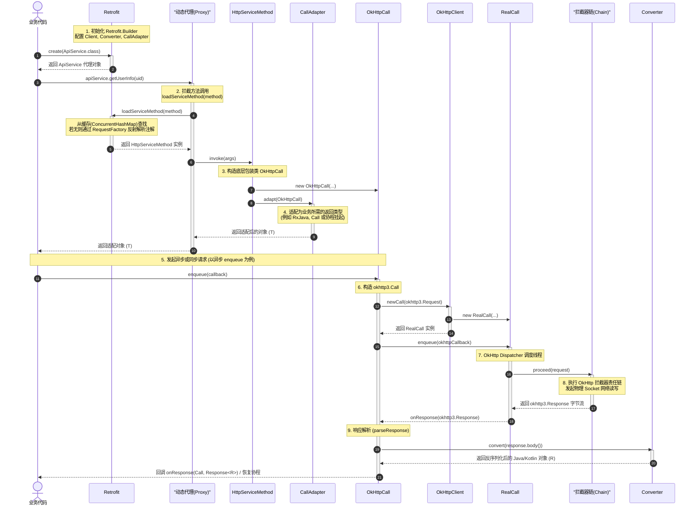

# 5.3.1.3 OkHttp 结合 Retrofit 协同机制与工程实践

在现代 Android 应用开发中，网络请求是支撑业务运转的核心基础设施。虽然开发者习惯将网络请求的实现归功于 Retrofit，但其底层真正的网络连接与传输引擎则是 OkHttp。Retrofit 本质上是一个“套在 OkHttp 外面的精致外壳”（A type-safe HTTP client for Android and Java），它通过动态代理和插件化设计，将原本繁琐、易错的底层网络字节流收发工作，抽象为极其优雅的面向接口的声明式 API。

理解 OkHttp 与 Retrofit 的协同机制，不仅是掌握 Android 高级网络架构的必经之路，也是探究软件工程中“关注点分离（Separation of Concerns）”与“插件化扩展”设计哲学的绝佳范式。本篇文章将深入剖析 OkHttp 与 Retrofit 的协同分工、网络数据通路的底层细节、两者的核心插件协作、现代 Kotlin 协程挂起函数的适配原理，并提供一份生产级别的最佳实践配置。

---

## 1. 协同分工模型（谁在做什么）

在开始探究源码与底层链路之前，我们必须厘清 OkHttp 与 Retrofit 在整个网络请求生命周期中的核心定位和各自的边界。这种精妙的分工使得两个框架能够各司其职，互不干扰，从而达到了极高的内聚性与极低的耦合度。

```
+-----------------------------------------------------------------------+
|                            业务层 (Business)                           |
|  - 调用带有注解的声明式接口方法：suspend fun getUserInfo(): User         |
+------------------------------------+----------------------------------+
                                     |
                                     v
+------------------------------------+----------------------------------+
|                            Retrofit 框架                              |
|  1. 动态代理拦截方法调用 (Dynamic Proxy & InvocationHandler)            |
|  2. 解析方法上的 HTTP 注解 (@GET, @POST, @Query, @Body 等)             |
|  3. 将方法参数适配为网络请求参数 (RequestFactory, ParameterHandler)     |
|  4. 将底层返回的原始响应字节流反序列化为 Java/Kotlin 对象 (Converter)   |
|  5. 将异步调用适配为业务需要的形式 (CallAdapter: 协程/RxJava/Call)      |
+------------------------------------+----------------------------------+
                                     | (通过 okhttp3.Call 交付)
                                     v
+------------------------------------+----------------------------------+
|                             OkHttp 框架                               |
|  1. 并发调度与多路复用控制 (Dispatcher: 同步/异步队列限流管理)          |
|  2. 核心拦截器责任链执行 (RealInterceptorChain)                         |
|     - 重试与重定向 (RetryAndFollowUpInterceptor)                      |
|     - 报文头与 Cookie 组装 (BridgeInterceptor)                        |
|     - 缓存读写与控制 (CacheInterceptor)                              |
|     - TCP/TLS 握手与连接池复用 (ConnectInterceptor & ConnectionPool)  |
|     - 原始报文传输 (CallServerInterceptor)                            |
+-----------------------------------------------------------------------+
```

### 1.1 Retrofit 的核心职责：上层的抽象与契约装配
Retrofit 站在业务开发者的视角，扮演着**契约装配工**和**数据适配者**的角色。它绝不直接触碰底层的 Socket、TCP 握手、TLS 安全传输协议或 HTTP 报文拼接。其核心职责可以概括为以下四个层面：

1. **接口生命周期的动态代理（Dynamic Proxy）**：
   Retrofit 通过运行时 Java 的动态代理机制（`Proxy.newProxyInstance`），在内存中动态生成接口的实现类。它拦截业务层对接口方法的每一次调用，并将其转化为 Retrofit 内部可管理的数据结构。与在编译期生成代码的 APT 方案相比，动态代理虽然具有极微小的反射开销，但它避免了生成海量的类文件，使包体积保持轻量，并且能够在运行时极其灵活地动态绑定各种适配器。
   
2. **声明式配置的静态解析（Annotation Parsing）**：
   通过反射读取接口方法上的各类注解（例如 `@GET`、`@POST`、`@Headers`、`@Multipart`）以及参数注解（例如 `@Path`、`@Query`、`@Part`），并根据这些注解构建起一个标准的 HTTP 请求模板。这一解析过程在反射层面非常昂贵，但 Retrofit 通过内部缓存机制（使用 `ConcurrentHashMap` 进行二次校验锁定缓存）巧妙地规避了重复解析的开销，使得每次方法调用仅在首次被解析，后续调用则直接复用缓存。

3. **数据格式的解包与适配（Converter）**：
   网络传输的本质是不可读的字节流（Byte Stream），但业务层需要的是具有明确语义的结构化对象（POJO）。Retrofit 允许开发者注入不同的数据转换器（如 Gson、Moshi、Jackson、Protobuf 等），将底层的 `ResponseBody` 自动转换为业务层所声明的强类型数据实体。它把反序列化的脏活累活从业务开发中剥离，极大地提高了开发效率和代码的类型安全性。

4. **异步/响应式执行模型的适配（CallAdapter）**：
   不同的项目有不同的异步编程范式，有的使用最基本的回调（Callback），有的使用经典的响应式编程（RxJava / ReactiveStreams），现代开发则更多地使用 Kotlin 协程挂起函数（Coroutine Suspend）。Retrofit 并不强求业务层采用特定的执行模型，而是通过 `CallAdapter` 插件机制，将底层的 `retrofit2.Call` 适配成业务层想要的任何异步封装类型，完美契合开闭原则（Open-Closed Principle）。

### 1.2 OkHttp 的核心职责：底层的连接管理与协议传输
OkHttp 是真正的网络请求执行引擎，它站在操作系统的边缘，负责与网络协议栈及远程服务器直接对话。它对上层应用提供统一的 `okhttp3.Call` 抽象，而在其内部则承载了极其复杂的网络通信和性能优化逻辑：

1. **网络连接的高效调度与并发流控（Dispatcher）**：
   OkHttp 内部维护着一个高效的线程池以及双向队列（同步运行队列、异步运行队列、异步等待队列）。它通过调度器（`Dispatcher`）精细控制最大并发请求数（默认 64）以及单个域名（Host）的最大并发数（默认 5）。这种并发限流算法能够有效防止突发的大量网络请求压垮客户端系统，或因为连接数过多而被服务器封禁。
   
2. **核心拦截器责任链的层层加工（Interceptor Chain）**：
   这是 OkHttp 架构设计中最具魅力的一点。它通过 `RealInterceptorChain` 驱动一系列拦截器协同工作：
   - **重试与重定向拦截器（RetryAndFollowUpInterceptor）**：负责在网络出现瞬时抖动（如网络切换、短暂丢包）时自动重连，或者根据服务器返回的 3xx 状态码进行透明的重定向。
   - **桥接拦截器（BridgeInterceptor）**：自动将业务层的请求参数补充完整，添加如 `Content-Type`、`Keep-Alive`、`User-Agent` 等标准的 HTTP 报文头，并在收到响应后处理 `Gzip` 解压以及 Cookie 的存储与分发。
   - **缓存拦截器（CacheInterceptor）**：严格遵循 HTTP/1.1 协议中的缓存规范，检查本地缓存的有效性，如果命中缓存且未过期则直接返回，避免无谓的网络往返，节省移动端流量。
   - **连接拦截器（ConnectInterceptor）**：与服务器建立物理的 TCP 连接或 TLS 安全握手。它负责在底层寻找可用的连接，并将物理连接抽象为 `RealConnection`，在 HTTP/2 下还会处理多路复用。
   - **报文传输拦截器（CallServerInterceptor）**：利用高效率的 Okio I/O 框架，向已建立好的 Socket 写入请求的头部和 Body 字节流，并从 Socket 中读取服务器返回的原始响应流。

3. **连接池复用与长连接管理（ConnectionPool）**：
   网络建立连接（尤其是 TCP 三次握手和 TLS 安全握手）是网络性能的核心瓶颈，往往需要消耗数百毫秒的时延。OkHttp 内部提供了一个连接池（`ConnectionPool`），支持 HTTP/1.1 协议下的 Keep-Alive 连接复用，以及 HTTP/2 协议下的多路复用（Multiplexing），通过单个 TCP 连接并发传输成百上千个请求，彻底解决了 HTTP/1.1 管道化（Pipelining）导致的队头阻塞问题。

---

## 2. 网络数据请求通路与底层机制

要深入了解 Retrofit 与 OkHttp 的底层集成，必须从它们的数据通路入手。下面是自业务层调用 Retrofit 声明的接口开始，直到数据被 OkHttp 获取、解析并返回的完整底层流向图。

### 2.1 协同工作时序图

下面的 Mermaid 时序图展示了从业务代码调用接口方法，直至数据解包并返回给业务层的全链路调用过程。



### 2.2 数据通路底层步骤详解

#### 步骤一：`Retrofit.create()` 运行时代理拦截
当我们在业务中调用 `retrofit.create(ApiService::class.java)` 时，Retrofit 并没有生成实际的物理类，而是调用了 Java 原生的动态代理。动态代理会在运行时在内存中生成一个名为 `$Proxy0` 的字节码类，它继承自 `java.lang.reflect.Proxy` 并实现了我们的 `ApiService` 接口。
每一次调用接口中的方法，都会流经如下所示的 `InvocationHandler.invoke` 方法：

```java
public <T> T create(final Class<T> service) {
  validateServiceInterface(service);
  return (T)
      Proxy.newProxyInstance(
          service.getClassLoader(),
          new Class<?>[] {service},
          new InvocationHandler() {
            private final Platform platform = Platform.get();
            private final Object[] emptyArgs = new Object[0];

            @Override
            public @Nullable Object invoke(Object proxy, Method method, @Nullable Object[] args)
                throws Throwable {
              // 1. 如果调用的是 Object 的基础方法（例如 toString, equals），直接调用其本身，不进行代理拦截
              if (method.getDeclaringClass() == Object.class) {
                return method.invoke(this, args);
              }
              // 2. 如果是 Java 8+ 的接口默认方法 (Default Method)，在代理中进行特殊的反射路由
              if (platform.isDefaultMethod(method)) {
                return platform.invokeDefaultMethod(method, service, proxy, args);
              }
              // 3. 核心：加载或构建 ServiceMethod，并执行 invoke 发起调用
              return loadServiceMethod(method).invoke(args != null ? args : emptyArgs);
            }
          });
}
```
通过这种拦截机制，Retrofit 成功接管了接口的方法生命周期。它使得声明式的代码能够在运行时动态映射到具体的网络请求逻辑中，实现了接口声明与具体执行的彻底解耦。

在底层实现中，`Platform` 对象充当了跨平台兼容的基础。在 Retrofit 构建时，它会通过反射检测当前的运行时环境（例如尝试加载 `android.os.Build` 类），从而决定是实例化 Android 专有的 Platform 子类还是通用的 Java Platform 类。对于 Android 平台而言，`Platform` 会自动将默认的回调执行器 `callbackExecutor` 指定为主线程 Handler 执行器（`MainThreadExecutor`），并对 Java 8 的接口默认方法（Default Method）提供支持，这使得开发者能够在不额外做线程配置的情况下直接将请求结果抛给 Android 的 UI 线程。

#### 步骤二：`ServiceMethod` 的高并发双重校验缓存与解析
由于运行时反射和注解提取的开销非常高，如果每次请求都进行解析，会导致 CPU 使用率飙升。Retrofit 通过一个名为 `serviceMethodCache` 的缓存 map 来存放已经解析完毕的 `ServiceMethod`：

```java
ServiceMethod<?> loadServiceMethod(Method method) {
  ServiceMethod<?> result = serviceMethodCache.get(method);
  if (result != null) return result;

  synchronized (serviceMethodCache) {
    result = serviceMethodCache.get(method);
    if (result == null) {
      // 核心解析逻辑：解析方法注解与参数
      result = ServiceMethod.parseAnnotations(this, method);
      serviceMethodCache.put(method, result);
    }
  }
  return result;
}
```
在多线程并发场景下（例如 Android App 启动时同时触发多个初始化 API 请求），上述的双重检查锁定（Double-Check Locking, DCL）同步机制能确保同一个 `Method` 仅会被解析一次，极大降低了反射的频率，节省了关键的 CPU 时间。

在 `ServiceMethod.parseAnnotations` 方法中，Retrofit 会调用 `RequestFactory.Builder` 去提取方法上的 `@GET`、`@POST` 等 HTTP 注解。之后，它会检查方法的返回值类型（ReturnType），根据这个返回值类型，去 Retrofit 实例中查找匹配的 `CallAdapter` 以及 `Converter`。最终，它会返回一个 `HttpServiceMethod` 对象（通常是其子类，如 `CallAdapted`）。

#### 步骤三：`RequestFactory` 注解解析与 `ParameterHandler` 策略模式
`RequestFactory` 是请求参数拼装的指挥官。在它的构建过程中，Retrofit 会遍历方法的所有参数，并为每个参数分配一个对应的参数处理器 `ParameterHandler`。
`ParameterHandler` 采用了经典的**策略模式**，每一个具体的参数注解在底层都有一个独立的实现类。其基类定义如下：
```java
abstract class ParameterHandler<T> {
  abstract void apply(RequestBuilder builder, @Nullable T value) throws IOException;
}
```
当你在接口方法里定义了 `@Query("userId") String uid` 时，Retrofit 会在构建期生成一个 `ParameterHandler.Query<String>` 实例。当业务层在运行时传入具体的参数值 `10086` 时，对应参数处理器的 `apply` 方法就会被调用。它会将 `userId` 作为 Key，`10086` 作为 Value，添加到底层的 `RequestBuilder` 中，从而实现了参数拼装的动态流式处理。此外，对于相对路径中的占位符（如 `@Path`），它会使用对应的替换策略将 URL 中的占位符（如 `{id}`）动态替换为真实的参数值。

#### 步骤四：`OkHttpCall` 的状态控制与延迟建连
当 `HttpServiceMethod.invoke()` 被代理拦截触发后，它会在内部实例化一个 `OkHttpCall`：
```java
@Override
final @Nullable ReturnT invoke(Object[] args) {
  Call<ResponseT> call = new OkHttpCall<>(requestFactory, args, callFactory, responseConverter);
  return adapt(call, args);
}
```
`OkHttpCall` 是 `retrofit2.Call` 接口的基石，它扮演着上层适配器与底层 OkHttp 物理连接的中间桥梁。
为了确保严谨性，`OkHttpCall` 内部维护了几个重要的状态标志位：
- `executed`：布尔值，用于记录请求是否已经执行过。
- `canceled`：布尔值，用于记录请求是否被主动取消。

在 `OkHttpCall.enqueue(callback)` 中，它会首先检查状态。由于 HTTP 规范建议一个 Call 只能被发起一次，如果有并发线程重复执行同一个 Call，它会抛出 `IllegalStateException("Already executed.")`。
如果状态校验通过，`OkHttpCall` 才会通过 `callFactory.newCall(...)` 延迟生成底层的 `okhttp3.Call`（也就是 `RealCall`），在此之前它不会占用任何 OkHttp 的连接池与调度器资源：
```java
private okhttp3.Call createRawCall() throws IOException {
  // 利用 RequestFactory 将反射解析出的参数转化为 okhttp3.Request
  okhttp3.Request request = requestFactory.create(args);
  okhttp3.Call call = callFactory.newCall(request);
  if (call == null) {
    throw new NullPointerException("Call.Factory returned null.");
  }
  return call;
}
```

#### 步骤五：OkHttp 核心拦截器链的深度执行机制
一旦底层的 `RealCall` 启动，它会向 OkHttp 的 `Dispatcher` 提交任务。任务在 `Dispatcher` 中经过最大并发数的判断后，会被分配到线程池中运行。
接下来，网络请求会流经 `RealInterceptorChain` 中的五个核心拦截器，我们可以从底层机制层面深入透视这五个拦截器的工作细节：

1. **`RetryAndFollowUpInterceptor` (重试与重定向拦截器)**：
   该拦截器是 OkHttp 的第一道关卡。在它的 `intercept` 方法中，首先会根据当前请求初始化一个 `ExchangeFinder`，用于后续寻找网络连接。随后，拦截器进入一个 `while (true)` 死循环，在循环体中发起请求。如果底层的连接或数据传输发生异常，它会调用 `recover` 方法判定是否可以恢复。重试的判定条件非常严苛，例如：如果由于协议限制（如客户端发送了错误的握手信息）、证书校验失败（`SSLPeerUnverifiedException`）、证书不被信任（`SSLHandshakeException`）或者请求 Body 是一次性的且已被消费，则拦截器会直接抛出异常，不再重试。如果可以恢复，它会重新选择路由并再次循环。此外，当服务器返回 3xx 状态码时，它会从响应头中解析出 `Location` 地址，并根据重定向的最大次数限制（默认 20 次）构建新的 Request 发起重定向请求。

2. **`BridgeInterceptor` (桥接拦截器)**：
   该拦截器充当了上层网络请求模型与 HTTP 协议规范之间的桥梁。它负责把用户定义的、缺少必要报文头的 Request 转换成符合 HTTP 标准规范的 Request。它会自动帮我们在请求头中补全 `Host`、`Connection: Keep-Alive`、`Accept-Encoding: gzip` 等字段。如果在请求中没有显式设置 `User-Agent`，它还会追加 OkHttp 的默认标识。更重要的是，它内部集成了 `CookieJar` 的处理。在发送请求前，它会从 `CookieJar` 中读取与当前域名相匹配的 Cookie 列表并写入请求头；在接收到服务器响应后，它又会解析响应头中的 `Set-Cookie` 字段，并将其保存回 `CookieJar`。如果服务器返回的数据经过了 gzip 压缩，它还会在响应体返回前，使用 `GzipSource` 对其进行自动解压，屏蔽底层的字节码解压细节。

3. **`CacheInterceptor` (缓存拦截器)**：
   这是 OkHttp 用来提升网络性能、节约用户流量的利器。它内部使用 `CacheStrategy` 缓存策略分析器来判定当前缓存是否可用。`CacheStrategy` 遵循了 HTTP 的缓存标准，分析请求头和本地缓存响应头中的 `Cache-Control`、`Expires`、`ETag` 和 `Last-Modified`。如果策略判定当前缓存完全有效（即强缓存命中且未过期），OkHttp 会直接拦截请求并返回本地缓存，根本不会发起任何网络连接。如果缓存已过期，但包含 `ETag` 或 `Last-Modified`，它会构建一个“条件请求”，在请求头中加上 `If-None-Match` 或 `If-Modified-Since`。当服务器返回 `304 Not Modified` 时，拦截器会更新本地缓存的头部信息，并直接将缓存的 Body 返回给上层，从而最小化网络传输消耗。

4. **`ConnectInterceptor` (连接拦截器)**：
   该拦截器是网络连接建立的核心。它只有一行关键代码：调用 `chain.proceed(request, streamAllocation, httpCodec, connection)`。在其底层，它通过 `ExchangeFinder` 从 OkHttp 的连接池（`ConnectionPool`）中寻找一条可用的物理连接。如果连接池中存在可以复用的连接（在 HTTP/1.1 下是同 Host 且未超过保活时间的空闲连接，在 HTTP/2 下则是支持多路复用的单一连接），则直接取出复用；否则，会创建一个新的 `RealConnection` 实例，并调用其 `connect` 方法进行物理 TCP 三次握手和 TLS 安全安全握手。建连成功后，该连接会被存入连接池。随后，它会针对此连接生成对应的 `HttpCodec`（用于对 HTTP 报文进行编码和解码），从而为物理数据的读写铺平道路。

5. **`CallServerInterceptor` (报文传输拦截器)**：
   该拦截器是责任链的最后一环，也是真正发生网络数据传输的地方。它站在 Socket 流的输入输出端，负责执行最底层的网络 I/O 读写。首先，它会利用前面生成的 `HttpCodec` 向 Socket 的输出流写入 HTTP 请求的 Header 信息。如果请求包含了 RequestBody（例如 POST 请求），它会开启输出流的写入通道，通过 Okio 库的高效缓冲区（Buffer）把请求体的字节流源源不断地泵入物理连接中。数据发送完毕后，它会发起一次 Flush 确保数据送达。随后，它会挂起并等待服务器的响应，读取 HTTP 响应的 Status Line 和 Header。如果读取成功，它会构建出 `Response.Builder` 并包装出 `Response` 对象，最后通过 `HttpCodec` 开启响应体的输入流（ResponseBody），把字节流交付给前面的拦截器进行后续的缓存和解压处理。

当服务器的原始响应被拦截器链逐层解析并交回给 `OkHttpCall` 时，`OkHttpCall` 内部的 `parseResponse` 就会被触发。在此方法中，它会判定状态码是否在成功范围，并调用 `responseConverter.convert(body)` 将字节数据转换为 POJO 实体对象。需要强调的是，在反序列化转换完成后，不论成功还是失败，都必须在 finally 块中关闭 `ResponseBody`（即调用 `value.close()`）。因为如果不关闭底层响应流，Socket 连接将一直处于被占用状态而无法归还给连接池，从而导致严重的网络连接泄露，长期运行会导致 App 网络请求彻底被阻塞。

---

## 3. 插件化扩展：Converter 与 CallAdapter 底层协作

Retrofit 最令人称道的便是其高度可定制的插件化设计。它通过两套核心工厂——`CallAdapter.Factory` 和 `Converter.Factory`，在运行时为底层的网络调用披上了各具特色的“外衣”。

### 3.1 `CallAdapter` 机制：返回类型的自由定制
在不配置任何 Adapter 的默认情况下，Retrofit 接口必须返回 `retrofit2.Call<T>`。但这种设计无法直接与主流的响应式编程框架（如 RxJava）或协程生态良好兼容。`CallAdapter` 便是为此设计的适配器。

其接口核心定义如下：
```java
public interface CallAdapter<R, T> {
  // 返回此适配器期望将 ResponseBody 转换成的 Java 类型 (即 Converter 的输出目标类型)
  Type responseType();

  // 将一个原始的 Call<R> 适配包装为另一种类型 T
  T adapt(Call<R> call);
}
```

#### `CallAdapter.Factory` 的查找过滤责任链
当我们定义了方法的返回类型后，Retrofit 会调用其内部的 `nextCallAdapter` 方法。它会遍历用户通过 `addCallAdapterFactory` 注册的所有工厂类。每个工厂类通过实现 `get(...)` 方法，根据返回值类型（如 `Observable<User>`）和方法注解来返回一个适配器实例：
```java
public abstract static class Factory {
  public abstract @Nullable CallAdapter<?, ?> get(
      Type returnType, Annotation[] annotations, Retrofit retrofit);
}
```
这里利用了**泛型反射**。在 Java/Kotlin 编译时，泛型会发生擦除。然而，方法的返回签名信息仍然会保留在字节码中。Retrofit 在运行时利用 `Method.getGenericReturnType()` 获取包含完整泛型信息的 `Type`，然后通过 `Utils.getParameterUpperBound` 底层反射手段，剥离出外层包装（如 `Observable`），精准解析出内部的实体类型 `User`。

##### 常用适配器工厂解析：
- **`RxJava2CallAdapterFactory`**：在其 `get` 方法中，如果匹配到返回类型为 `Observable`、`Single` 或 `Flowable`，它会剥离外层，返回内部泛型作为 `responseType()`。在其 `adapt` 方法中，它会把 `Call` 包装为 RxJava 的对应流对象。当业务端调用 `subscribe()` 时，它会内部触发 `Call.enqueue()`，并且当外部解除订阅（`Disposable.dispose()`）时，它会同步触发 `Call.cancel()`，将协程/响应式框架的取消信号无缝透传至 OkHttp 网络底层。
- **`DefaultCallAdapterFactory`**：当用户未提供任何自定义的 `CallAdapter` 时，Retrofit 内部的默认工厂就会起作用。在 Android 平台上，它会自动注入一个 `ExecutorCallAdapterFactory`。它主要负责对 `Call` 进行一层静态代理，重写其 `enqueue` 方法。在接收到网络成功或失败的回调后，通过 Android 的 `MainThreadExecutor`（其本质就是利用 `new Handler(Looper.getMainLooper())` 绑定了主线程）把回调重新分发至主线程，从而避免了开发者在 Android UI 线程和网络子线程之间手动切换。

### 3.2 `Converter` 机制：数据格式的协议协商
网络传输中传递的只是原生的数据字节。如何把字节解析为具体的 Java/Kotlin 类（反序列化），或把 Java/Kotlin 类转为网络请求体（序列化），是 `Converter` 的工作。

其核心定义极其简单直观：
```java
public interface Converter<F, T> {
  @Nullable T convert(F value) throws IOException;
}
```

与 `CallAdapter` 与之类似，`Converter.Factory` 也有一套责任链查找规则：
- `responseBodyConverter(...)`：查找负责将 HTTP 的 `ResponseBody` 转换为指定数据类型 `T` 的解析器。
- `requestBodyConverter(...)`：查找负责将指定数据类型 `T` 转换为 HTTP 请求体 `RequestBody` 的解析器。
- `stringConverter(...)`：用于 Query、Path 等参数的格式化。

#### `GsonConverterFactory` 的工作流剖析
以最常用的 `GsonConverterFactory` 为例：
1. **查找匹配**：在 `GsonConverterFactory.responseBodyConverter` 中，根据传入的 `Type` 从 Gson 实例中寻找该 `Type` 对应的 `TypeAdapter`。
2. **生成实例**：构建并返回一个 `GsonResponseBodyConverter`。
3. **运行时转换**：当 `OkHttpCall` 收到网络数据后，调用该转换器的 `convert` 方法：
```java
@Override
public T convert(ResponseBody value) throws IOException {
  JsonReader jsonReader = gson.newJsonReader(value.charStream());
  try {
    T result = adapter.read(jsonReader);
    if (jsonReader.peek() != JsonToken.END_DOCUMENT) {
      throw new JsonIOException("JSON document was not fully consumed.");
    }
    return result;
  } finally {
    value.close(); // 必须关闭 ResponseBody，否则底层的 Socket 连接将无法释放，导致连接泄露
  }
}
```

在工程实践中，我们还可以注册**自定义的 Converter**。例如，如果后端在数据为空时返回了空字符串 `""`，而业务声明需要一个 POJO，普通的 Gson 会抛出反序列化异常。我们可以实现一个 `NullOrEmptyConverterFactory`，在发现 `ResponseBody.contentLength() == 0` 时直接拦截，安全地返回 `null`。

### 3.3 两大 Factory 的底层协作
当一个接口方法被调用时，这两个工厂在 `HttpServiceMethod` 内部高度协同：
1. **类型协商**：`HttpServiceMethod` 在被反射解析时，首先利用 `Converter.Factory` 确定如何解包 `ResponseBody`，生成对应的 `responseConverter`。
2. **返回包装**：它调用 `CallAdapter.Factory`，将包含有 `responseConverter` 的 `OkHttpCall` 包装为业务层声明的返回类型。
3. **执行闭环**：当网络数据通过 OkHttp 流回时，`OkHttpCall` 先使用 `responseConverter` 将字节解包为对象，再把该对象作为结果，恢复并呈递给 `CallAdapter` 返回的上层框架。

---

## 4. 现代异步编程：Kotlin 协程挂起函数的适配原理与源码探秘

随着 Kotlin 协程在 Android 开发中的普及，Retrofit 自 2.6.0 起原生支持了在接口方法中直接使用 `suspend` 关键字。这一特性的引入使得我们能够写出像同步代码一样直观的异步网络请求，彻底告别了“回调地狱（Callback Hell）”或繁琐的 RxJava 操作符。

### 4.1 字节码视角的 CPS 变换与 Retrofit 的运行时识别
在 Kotlin 中，我们将网络方法声明为挂起函数：
```kotlin
interface ApiService {
  @GET("users/{id}")
  suspend fun getUserInfo(@Path("id") id: String): User
}
```
然而，JVM 本身并不知道什么是“挂起函数”。Kotlin 编译器在编译这段代码时，会对其进行 **CPS（Continuation Passing Style）变换**。在编译生成的 JVM 字节码中，该方法签名被隐式改写为：
```java
// 伪代码：Kotlin 挂起函数在字节码层面的真实 Java 签名
@GET("users/{id}")
Object getUserInfo(@Path("id") String id, Continuation<? super User> completion);
```
这里的核心改变有两个：
1. **参数追加**：方法的最后一个参数被追加了一个 `Continuation` 类型的参数。它代表了后续需要恢复执行的协程上下文（相当于一个回调）。而整个方法的执行逻辑也会被编译为一个高度优化的状态机（State Machine），每一个挂起点都对应状态机的一个分支，通过传入的 `Continuation` 进行状态的转移与恢复。
2. **返回值类型改变**：返回值类型不再是 `User`，而是变成了 `Object`（在 Kotlin 中为 `Any?`）。因为挂起函数在执行时，如果发现数据未就绪，会返回一个特殊的挂起标记 `IntrinsicsKt.getCOROUTINE_SUSPENDED()`，而当数据就绪时，它会直接返回 `User` 实体对象。

Retrofit 在运行时构建 `RequestFactory` 时，会检测方法的参数列表。若发现最后一个参数的类型是 `Continuation`，它便能识别出这是一个 Kotlin 协程挂起函数：
```java
// Retrofit 源码解析段落：RequestFactory.Builder.build()
int parameterCount = method.getParameterTypes().length;
if (parameterCount > 0 && method.getParameterTypes()[parameterCount - 1] == Continuation.class) {
  isKotlinSuspendFunction = true;
  // ...
}
```

### 4.2 `SuspendForBody` 与 `SuspendForResponse`
当 Retrofit 确认这是一个挂起函数后，它在 `HttpServiceMethod.parseAnnotations()` 中不会再寻找常规的 `CallAdapter`。它在内部设计了两个特殊的子类来处理挂起逻辑：
- **`SuspendForBody`**：如果挂起函数的声明返回值是普通实体类（如 `User`），就会使用该子类。当网络异常或 HTTP 状态码不为 2xx 时，它会直接抛出 `HttpException` 或 `IOException`，需要在业务层用 `try-catch` 捕获。
- **`SuspendForResponse`**：如果返回值是用 `Response` 包装的实体类（如 `Response<User>`），则使用该子类。它即使在网络失败时也会返回一个包装对象，将 HTTP 错误状态透传给业务层自行判断。

这两种子类的内部实现本质上都是通过 `KotlinExtensions.kt` 中的扩展方法来桥接的。

### 4.3 `KotlinExtensions.kt` 源码级深度剖析
在 Retrofit 的底层包中，包含了一个名为 `KotlinExtensions.kt` 的文件。它利用 Kotlin 的协程扩展机制，实现了将传统的 `retrofit2.Call` 转换为挂起函数的关键逻辑。

以下是 `await()` 方法的源码精简与剖析：
```kotlin
suspend fun <T : Any> Call<T>.await(): T {
  // 1. 利用 suspendCancellableCoroutine 挂起当前协程，并获取 continuation 控制权
  return suspendCancellableCoroutine { continuation ->
    
    // 2. 注册协程取消的监听器
    continuation.invokeOnCancellation {
      cancel() // 核心：当外层协程作用域被取消时，立即取消底层的 OkHttp 请求
    }

    // 3. 发起 OkHttp 的异步网络请求
    enqueue(object : Callback<T> {
      override fun onResponse(call: Call<T>, response: Response<T>) {
        if (response.isSuccessful) {
          val body = response.body()
          if (body == null) {
            // 处理 Body 为空的特殊情况
            val invocation = call.request().tag(Invocation::class.java)
            val method = invocation?.method()
            val exception = KotlinNullPointerException(
                "Response from " +
                (method?.declaringClass?.name ?: "unknown") +
                "." +
                (method?.name ?: "unknown") +
                " was null but response body type was declared as non-null"
            )
            // 恢复协程并抛出 NullPointerException
            continuation.resumeWithException(exception)
          } else {
            // 4. 成功获取数据，调用 resume 恢复挂起的协程，并将解析后的实体返回
            continuation.resume(body)
          }
        } else {
          // 5. HTTP 状态码异常，抛出 HttpException 恢复协程
          continuation.resumeWithException(HttpException(response))
        }
      }

      override fun onFailure(call: Call<T>, t: Throwable) {
        // 6. 网络连接失败(超时、无网等)，抛出异常恢复协程
        continuation.resumeWithException(t)
      }
    })
  }
}
```

#### 关键机制一：取消的透传传播（Cancellation Propagation）
在 Kotlin 协程中，挂起函数的桥接方法主要有 `suspendCoroutine` 和 `suspendCancellableCoroutine`。在 Retrofit 这样高频发生 I/O 交互的网络框架中，使用 **`suspendCancellableCoroutine`** 是不可妥协的设计原则。
两者的核心区别在于：`suspendCancellableCoroutine` 会为其闭包提供一个 `CancellableContinuation` 实例。这个实例允许我们调用 `continuation.invokeOnCancellation` 注册一个生命周期监听器。当该协程在其运行的作用域中被取消时，协程框架会立即触发这个监听器。我们在监听器中调用了 `call.cancel()`，这不仅将取消信号传导给了底层的 OkHttp 物理连接，使底层及时关闭 Socket 以节约网络带宽和连接资源，还能够确保该协程能够立即从挂起状态被恢复并抛出 `CancellationException`。
如果错误地使用了普通的 `suspendCoroutine`，它并不支持在挂起期间接收取消回调。一旦外部协程被取消，底层的 OkHttp 物理连接依然会傻傻地进行网络传输，直到请求完成回调触发。然而此时协程已经取消，回调中的数据会被默默抛弃。这种由于“取消信号无法下沉传导”导致的“网络请求泄露”和“线程挂起泄露”，在高并发的 App 运行中会造成内存不断上涨，甚至触发 OOM，是生产环境中必须要极力规避的隐患。

#### 关键机制二：挂起与恢复的线程上下文切换（Thread Context Switching）
在 Android 中使用协程时，网络请求的物理 I/O 依然是由 OkHttp 内部的子线程来执行的（即 `OkHttp Connection` 线程）。然而，当请求完毕触发回调时，`continuation.resume(body)` 是在哪个线程被执行的？
其实，`resume` 的调用是在 OkHttp 的子线程中被发起的。但是，Kotlin 协程框架的拦截器拦截了这个调用，它会根据该协程在挂起时所绑定的协程上下文（CoroutineContext）中的调度器（`CoroutineDispatcher`）来决定恢复位置。如果你的协程是在 `lifecycleScope.launch(Dispatchers.Main)` 中启动的，即便是在 OkHttp 子线程中调用了 `resume`，协程也会被分发到 Android 的主线程 MessageQueue 中，从而安全地在主线程上恢复执行，避免了多线程并发修改 UI 导致的崩溃。

对于协程网络请求异常的处理，由于在挂起函数中，任何网络故障（如超时、断网）都会直接以 `Exception` 的形式抛出，因此建议使用 `try-catch` 进行局部的降级捕获。另外，也可以结合 Kotlin 原生的 `runCatching` 语法糖，利用 `onSuccess` 和 `onFailure` 的链式回调机制，极大简化大括号嵌套。对于未捕获的全局异常，则可以配置一个 `CoroutineExceptionHandler` 拦截处理，实现通用的错误上报与用户 Toast 提示。

---

## 5. 生产环境最佳配置与统一拦截器最佳实践

在实际的生产环境中，我们不能直接使用默认 of `OkHttpClient` 和 `Retrofit` 实例，而是需要针对复杂的移动网络环境进行精细的超时控制、连接复用、DNS 优化和网络安全配置。同时，我们需要通过拦截器链来实现统一的参数注入、Token 同步刷新和全局网络异常拦截。

### 5.1 生产级配置实例

以下是一套经过生产环境验证的、采用 Kotlin 编写的 OkHttp 与 Retrofit 的初始化配置方案：

```kotlin
import okhttp3.Cache
import okhttp3.ConnectionPool
import okhttp3.Dns
import okhttp3.OkHttpClient
import retrofit2.Retrofit
import retrofit2.converter.gson.GsonConverterFactory
import java.io.File
import java.net.InetAddress
import java.util.concurrent.TimeUnit

object NetworkClient {

    private const val CACHE_SIZE = 50 * 1024 * 1024L // 50MB 缓存
    private const val CONNECT_TIMEOUT = 15L // 连接超时 15 秒
    private const val READ_TIMEOUT = 15L    // 读取超时 15 秒
    private const val WRITE_TIMEOUT = 15L   // 写入超时 15 秒

    // 1. 自定义 DNS，防止运营商 DNS 劫持 (可在此处集成 HTTPDNS 库)
    private val customDns = object : Dns {
        override fun lookup(hostname: String): List<InetAddress> {
            return try {
                // 生产环境下可使用阿里云 HTTPDNS 或腾讯云 HTTPDNS 获取解析后的 IP 列表
                // 如果解析失败，再回退到系统的 DNS 解析
                Dns.SYSTEM.lookup(hostname)
            } catch (e: Exception) {
                Dns.SYSTEM.lookup(hostname)
            }
        }
    }

    // 2. 配置 OkHttp 连接池。在高并发网络交互下，适当增加空闲连接数
    private val connectionPool = ConnectionPool(
        maxIdleConnections = 10,  // 默认是 5，调高到 10 可以加快并发请求速度
        keepAliveDuration = 5,    // 闲置连接保活 5 分钟
        timeUnit = TimeUnit.MINUTES
    )

    fun createRetrofit(cacheDir: File, baseUrl: String): Retrofit {
        val cache = Cache(File(cacheDir, "http_cache"), CACHE_SIZE)

        val okHttpClient = OkHttpClient.Builder()
            .connectTimeout(CONNECT_TIMEOUT, TimeUnit.SECONDS)
            .readTimeout(READ_TIMEOUT, TimeUnit.SECONDS)
            .writeTimeout(WRITE_TIMEOUT, TimeUnit.SECONDS)
            .connectionPool(connectionPool)
            .dns(customDns)
            .cache(cache)
            // 添加各种自定义拦截器
            .addInterceptor(HeaderInterceptor())          // 应用拦截器：统一 Header 注入
            .addInterceptor(UnifiedErrorInterceptor())    // 应用拦截器：全局错误拦截
            .authenticator(TokenAuthenticator())          // 专门针对 401 状态码 of Token 刷新器
            .build()

        return Retrofit.Builder()
            .baseUrl(baseUrl)
            .client(okHttpClient)
            .addConverterFactory(GsonConverterFactory.create())
            .build()
    }
}
```

### 5.2 统一拦截器设计最佳实践

#### 5.2.1 Header 注入拦截器 (`HeaderInterceptor`)
对于 Token、设备 ID、App 版本号、渠道号等公共参数，我们应当使用**应用拦截器（App Interceptor）**而非网络拦截器进行注入。因为应用拦截器只会被执行一次，即使用户的网络请求触发了重定向、重载或重试，公共参数也无需被重复拼装，这保持了请求头的一致性和效率。

```kotlin
import okhttp3.Interceptor
import okhttp3.Response

class HeaderInterceptor : Interceptor {
    override fun intercept(chain: Interceptor.Chain): Response {
        val originalRequest = chain.request()
        
        // 动态获取最新的 Token 或者是设备信息
        val token = TokenManager.getToken() 
        val appVersion = "1.0.0" // 应从 BuildConfig 动态读取
        val deviceId = "android_id" // 应获取具体加密的物理 ID
        
        val newRequestBuilder = originalRequest.newBuilder()
            .addHeader("Accept", "application/json")
            .addHeader("Device-Platform", "Android")
            .addHeader("App-Version", appVersion)
            .addHeader("Device-Id", deviceId)

        // 只有在 Token 存在时才注入 Authorization 请求头
        if (!token.isNullOrBlank()) {
            newRequestBuilder.addHeader("Authorization", "Bearer $token")
        }

        return chain.proceed(newRequestBuilder.build())
    }
}
```

#### 5.2.2 401 Token 自动同步刷新器 (`TokenAuthenticator`)
在 HTTP 规范中，当访问受保护资源返回 `401 Unauthorized` 时，服务器通常会携带一个挑战头。OkHttp 专门提供了一个 `Authenticator` 接口用于处理这种场景。其优势在于它不需要在普通拦截器中处理复杂的 `401` 重试分支，而是由 OkHttp 在检测到 `401` 时，自动回调该方法，并且其内部保证了线程安全和多请求并发时的同步刷新：

```kotlin
import okhttp3.Authenticator
import okhttp3.Request
import okhttp3.Response
import okhttp3.Route

class TokenAuthenticator : Authenticator {
    override fun authenticate(route: Route?, response: Response): Request? {
        // 1. 检查是否已经尝试过刷新 Token，如果重试次数大于 3 次，则放弃重试，避免死循环
        if (responseCount(response) >= 3) {
            return null
        }

        synchronized(this) {
            // 2. 二次检查本地 Token 是否已经被其他并发请求刷新了
            val localToken = TokenManager.getToken()
            val requestToken = response.request.header("Authorization")
            
            var newToken = localToken
            if (requestToken == "Bearer $localToken") {
                // 如果请求中的 Token 与本地最新的 Token 一致，说明本地 Token 确实失效了，需要发起同步刷新
                newToken = TokenManager.refreshRemoteToken()
            }

            return if (!newToken.isNullOrBlank()) {
                // 3. 构建携带新 Token 的新 Request，OkHttp 会自动使用该 Request 重新发起请求
                response.request.newBuilder()
                    .header("Authorization", "Bearer $newToken")
                    .build()
            } else {
                null
            }
        }
    }

    private fun responseCount(response: Response): Int {
        var result = 1
        var prior = response.priorResponse
        while (prior != null) {
            result++
            prior = prior.priorResponse
        }
        return result
    }
}
```
在多并发网络请求场景下，上述的 `synchronized(this)` 线程同步块配合本地 Token 版本的双重检验设计（Double-Check），可以完美防御“多请求同时返回 401 触发海量刷新 Token 接口调用”的雪崩效应，保证全局仅有第一次失败的请求发起远程刷新，后续的请求直接复用刷新后的缓存 Token 重新建连。

#### 5.2.3 全局网络异常捕获拦截器 (`UnifiedErrorInterceptor`)
在移动网络环境下，连接超时、DNS 解析错误、Socket 读写异常是家常便饭。如果让这些底层的 `SocketTimeoutException`、`UnknownHostException` 直接抛给业务层，不仅难以看懂，也无法统一 UI 的友好反馈。
我们可以定义一个全局的拦截器，捕获责任链上的网络异常，并将其包装为业务明确的自定义异常：

```kotlin
import okhttp3.Interceptor
import okhttp3.Response
import java.io.IOException
import java.net.SocketTimeoutException
import java.net.UnknownHostException

// 自定义业务异常类
class NetworkException(val errorCode: Int, override val message: String, val rawCause: Throwable? = null) : IOException(message, rawCause)

class UnifiedErrorInterceptor : Interceptor {
    override fun intercept(chain: Interceptor.Chain): Response {
        try {
            val response = chain.proceed(chain.request())
            
            // 可在此处针对特殊的业务错误码进行拦截
            // 例如：虽然 HTTP 状态码是 200，但服务器返回的 JSON 内容中包含 code=50001 (Token失效)
            // 可在此处进行抛出自定义异常或进行统一页面跳转
            return response
        } catch (e: Exception) {
            // 拦截底层的网络异常，转换为易读的业务异常
            val wrappedException = when (e) {
                is UnknownHostException -> NetworkException(
                    errorCode = 1001,
                    message = "无法连接到服务器，请检查您的网络连接",
                    rawCause = e
                )
                is SocketTimeoutException -> NetworkException(
                    errorCode = 1002,
                    message = "网络请求超时，请稍后重试",
                    rawCause = e
                )
                is IOException -> NetworkException(
                    errorCode = 1003,
                    message = "网络传输发生未知异常",
                    rawCause = e
                )
                else -> e
            }
            throw wrappedException
        }
    }
}
```

### 5.3 Android 平台版本的网络适配与兼容性
在 Android 平台的演进中，网络安全策略发生了多次重大改变。开发人员必须针对不同的 API 级别进行专门的配置。

1. **Android 9 (API 28) 默认禁止明文 HTTP 传输（Cleartext Traffic）**
   自 Android 9 开始，系统默认禁止 App 发起非加密的明文 HTTP 请求。如果在 Android 9+ 的设备上使用 Retrofit 访问 `http://` 开头的接口，系统会直接抛出 `java.io.IOException: Cleartext HTTP traffic to xxx not permitted`。
   为了保证向前兼容性，开发团队应当配置网络安全配置文件（Network Security Config）。
   在 `res/xml/network_security_config.xml` 中进行声明：
   ```xml
   <?xml version="1.0" encoding="utf-8"?>
   <network-security-config>
       <!-- 限制只允许安全的 HTTPS 流量 -->
       <base-config cleartextTrafficPermitted="false">
           <trust-anchors>
               <certificates src="system" />
           </trust-anchors>
       </base-config>
       <!-- 针对内网或测试环境，单独对特定域名放开明文限制 -->
       <domain-config cleartextTrafficPermitted="true">
           <domain includeSubdomains="true">192.168.1.100</domain>
           <domain includeSubdomains="true">test.api.com</domain>
       </domain-config>
   </network-security-config>
   ```
   并在 `AndroidManifest.xml` 中引用它：
   ```xml
   <application
       android:networkSecurityConfig="@xml/network_security_config"
       ...>
   </application>
   ```
   关于不同 Android 版本中网络权限与安全性的细节，可以进一步查阅 [AndroidVersionChangeLog.md](../../../AndroidVersionChangeLog.md) 了解 API 28 之后的演进脉络。

2. **TLS 1.3 的原生支持与优化**
   Android 10 (API 29) 及以上默认启用了 **TLS 1.3** 协议的支持。TLS 1.3 比起 TLS 1.2 减少了握手过程中的一次往返时延（1-RTT），从而显著加快了安全连接的建立速度，同时废弃了一系列安全性较低的加密套件。
   在使用 OkHttp 时，除非必须支持极其古老的 Android 设备（如 Android 4.4 之前），否则建议使用默认的 `ConnectionSpec.MODERN_TLS`，以便在 Android 10+ 的设备上自动使用最快速、最安全的 TLS 1.3 进行握手，无需额外的代码干预。此外，针对企业私有证书证书，建议在 `networkSecurityConfig` 中集成自定义的证书绑定（Certificate Pinning），以硬编码方式在 App 中锁死服务器公钥证书，从物理链路上彻底防止中间人劫持（MITM）攻击。

---

## 6. 总结与延伸阅读

OkHttp 与 Retrofit 的结合展示了高水平软件架构设计的典范：
- **Retrofit** 通过**动态代理**、**注解解析**和**面向切面**的机制，为开发者提供了一层极易阅读、类型安全的“契约层”。
- **OkHttp** 通过**责任链模式**、**并发限流** and **Socket复用**，在最底层扮演着任劳任怨的“铁轨层”。
- 在它们之间，**`Converter`** 承担了字节数据到实体对象的“桥接翻译官”，而 **`CallAdapter`** 则承担了调用时机到线程模型的“分发调度员”。

这种清晰、分工明确的插拔式设计，使得当 Kotlin 协程兴起时，Retrofit 无需重构自身的核心网络逻辑，仅仅通过新增一个特殊的挂起函数适配流程（CPS 变换适配），就完美融合进了现代响应式开发生态，这极大地体现了面向对象设计中“开闭原则（Open-Closed Principle）”的威力。

### 延伸阅读建议
- **OkHttp 源码深度解析**：建议重点阅读 `RealInterceptorChain` 和连接池清理线程的实现机制，掌握底层 TCP 连接的管理。
- **Kotlin 协程深入探索**：研读 `suspendCancellableCoroutine` 的实现原理，以及它是如何控制状态机的挂起与恢复的。
- **网络优化策略**：重点研究 HTTP/2 的多路复用在 OkHttp 中的性能表现，以及在弱网下基于 QUIC/HTTP3 的前沿网络优化。
