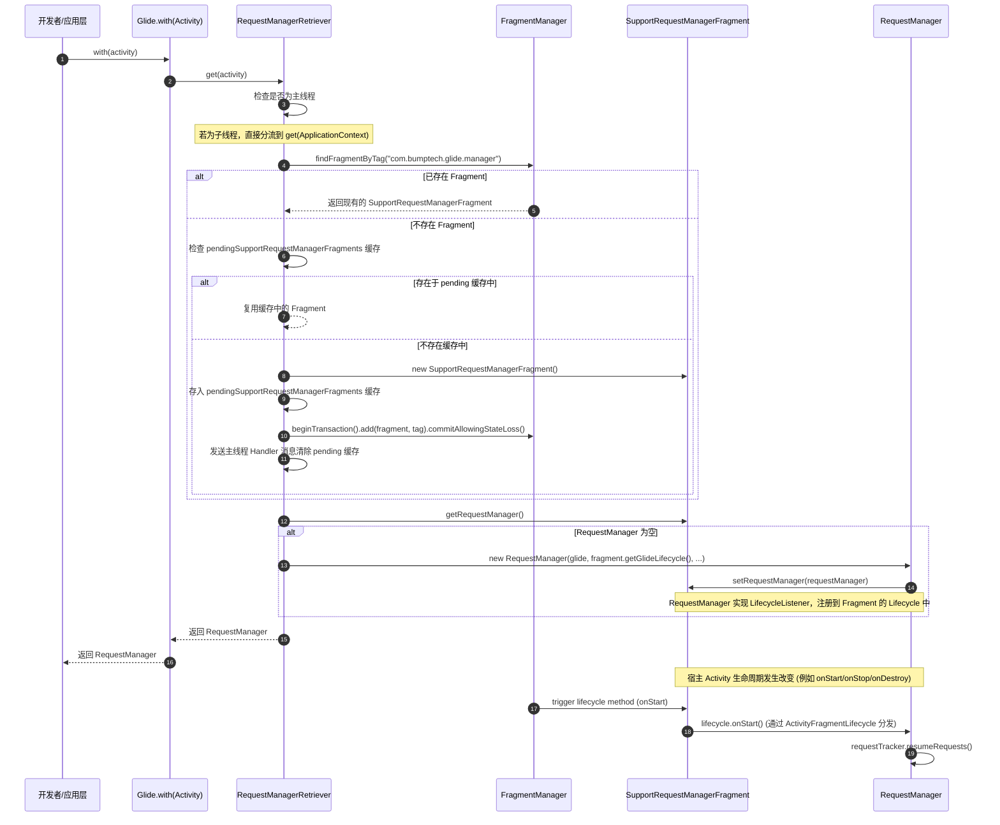
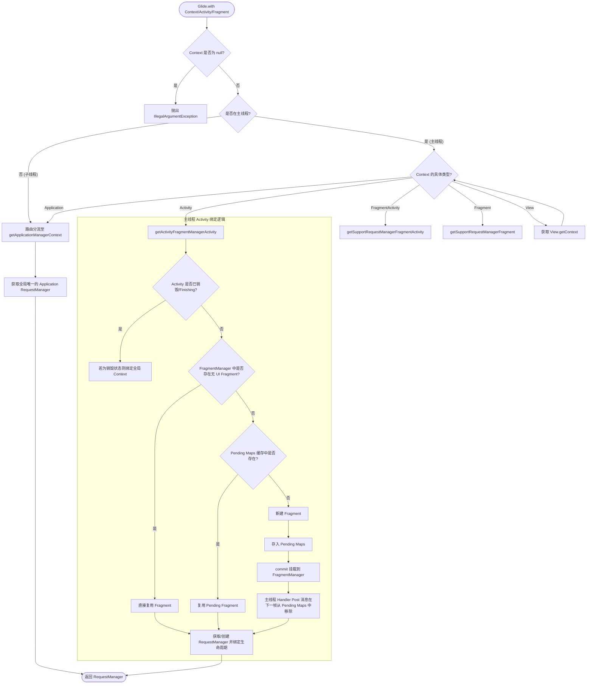
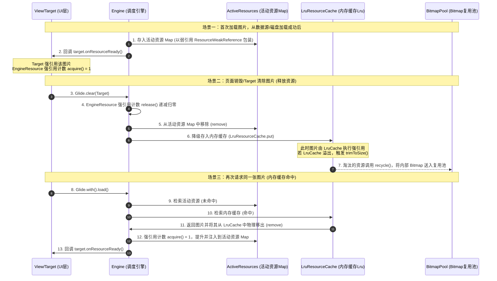
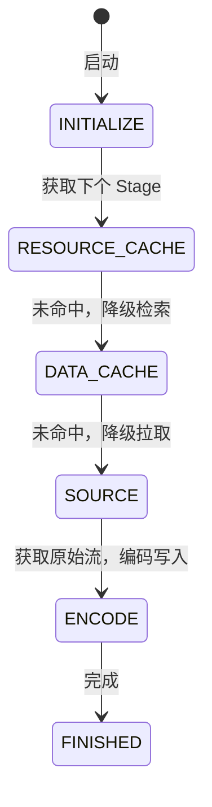
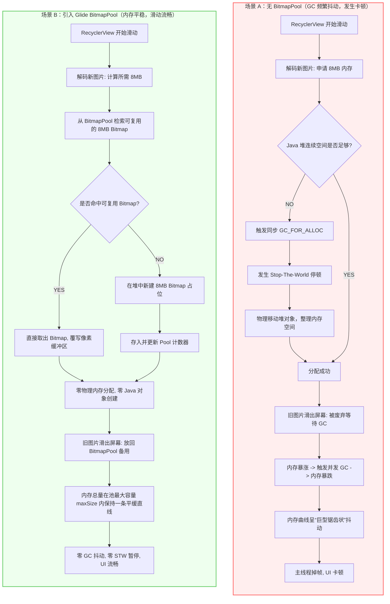
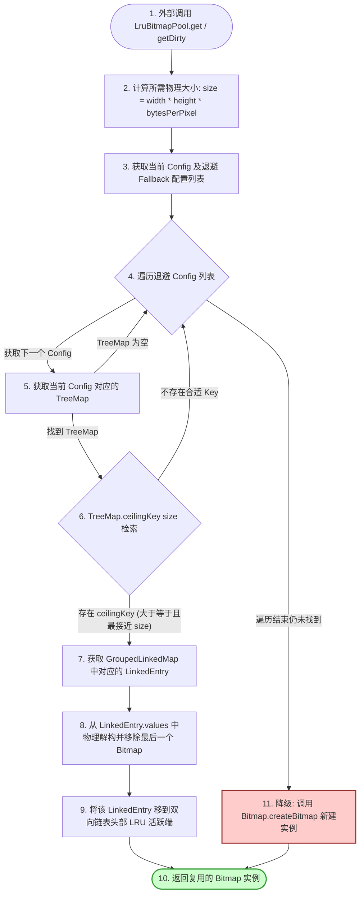
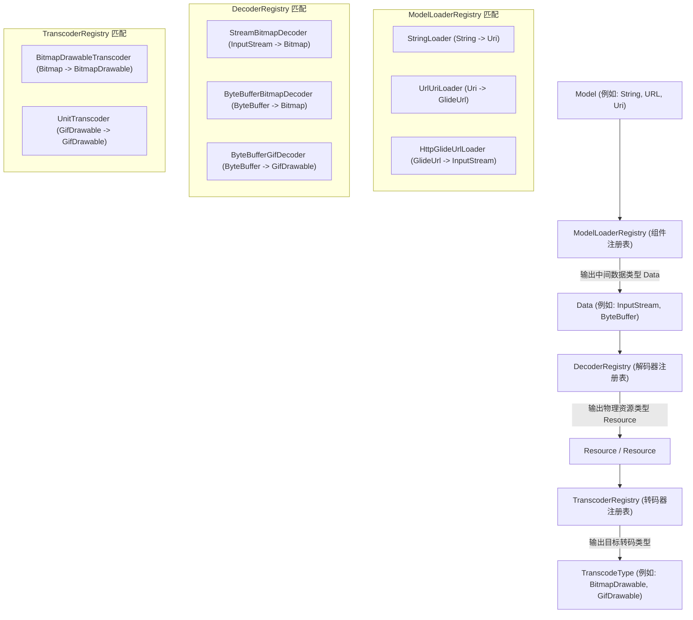
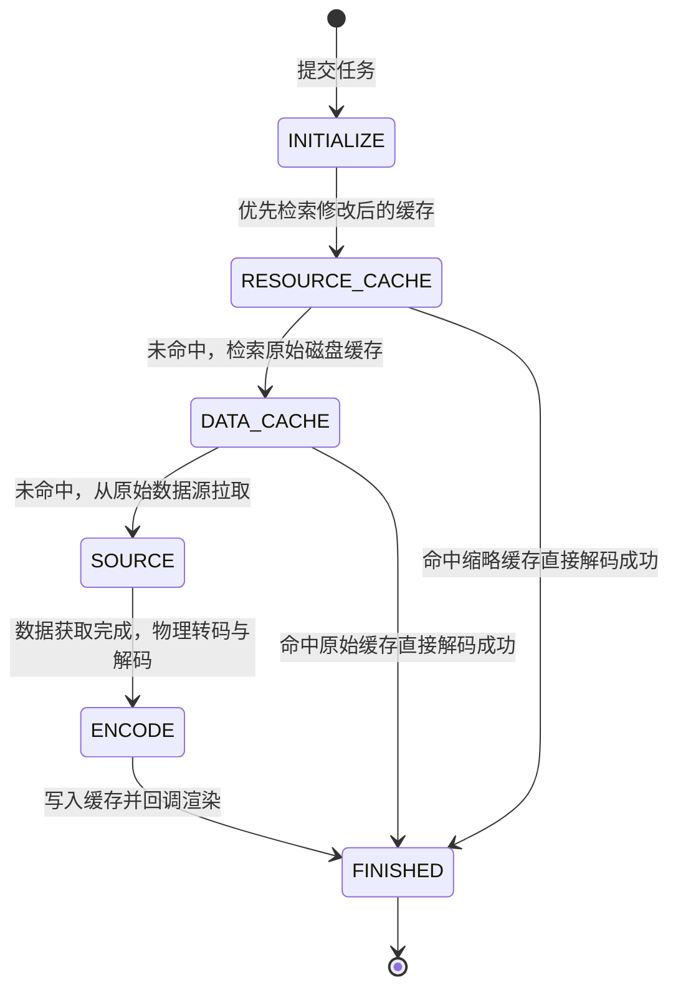
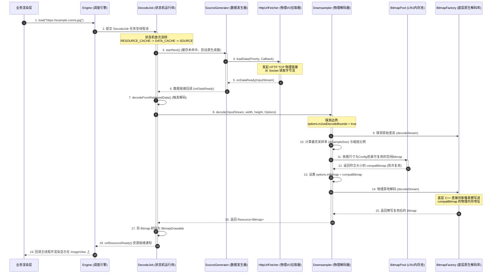

# 5.3.2.1 Glide

## 本文档定位
本文由原 `5.3.2.1.Glide` 目录下的四个独立原理文档合并而成，系统性地对 Glide 的生命周期控制、二级缓存机制、BitmapPool 复用、以及解码链路进行微观追踪与源码解析。

---

## 生命周期控制


在 Android 应用程序中，图片加载是一个高频且极其消耗系统资源的行为。它不仅涉及到大规模的网络 I/O，还涉及到繁重的文件 I/O，以及在 CPU Native 层进行的 Bitmap 解码、缩放、色彩空间转换等高昂算力开销。在这些操作进行时，如果缺乏一套高精度、细粒度的生命周期控制系统，极易导致应用程序面临内存泄漏、系统卡顿（Jank）、资源空耗、甚至直接崩溃（如窗口销毁后的 BadTokenException）等灾难性的后果。

Glide 凭借其独具匠心的无 UI 隐式 Fragment 挂载技术，以及严密的生命周期“铁三角”观察者模型，实现了与 Android 宿主（Activity/Fragment）生命周期的完美同步。本文将以最底层的设计哲学为始，层层深入，从源码级追踪物理绑定流程、高并发下的 Pending Maps 避坑机制，到状态机执行动作的物理本质，为您全景呈现 Glide 生命周期的控制机制，并深度对比 Jetpack Lifecycle，阐明其背后的架构取舍。

---

### 1. 核心痛点：为什么图片加载框架必须接管生命周期？

图片加载框架如果对宿主的生命周期视而不见，仅提供纯粹的异步回调，会对 Android 操作系统及应用进程造成极为严重的物理危害。这种危害可以从内存泄漏、计算资源空耗、以及组件销毁后的异步崩溃三个维度进行微观剖析。

#### 1.1 物理危害一：内存泄漏（Memory Leak）与 OOM

在 Android 开发中，Bitmap 是名副其实的“内存吞噬者”。以一个 1080P（$1920 \times 1080$ 像素）的屏幕为例，如果不做缩放，以最常用的 `ARGB_8888` 格式（每个像素占用 4 字节）在内存中解码，其所占用的物理内存为：
$$1920 \times 1080 \times 4 \text{ 字节} \approx 8.29 \text{ MB}$$
如果是长图或多图，内存开销呈指数级上升。

##### 1.1.1 Android 内存模型演进与大对象（Large Object）的尴尬
Android 系统的垃圾回收（GC）机制（如 Dalvik 的标记-清除算法，以及 ART 的并发标记和并发拷贝算法）在面对常规小对象时效率极高，但面对 Bitmap 这种动辄数毫秒甚至数十兆的“大对象”时，会显得力不从心。大对象的分配会导致 Java 堆中连续的内存空间迅速被蚕食，加速堆碎片的产生，进而频繁触发主 GC，造成严重的“Stop The World”（STW）现象。

从 Android 版本演进的角度来看，Bitmap 的底层内存管理经历了三次重大变革（关于 Dalvik 与 ART 的内存结构以及更详细的版本演进记录，可参考 [AndroidVersionChangeLog.md](../../../../../../AndroidVersionChangeLog.md)）：
- **Android 2.x 时代**：Bitmap 对象的 Java 部分（仅作外壳包装）极小，但其底层的像素数据（Pixel Data）是在 Native 内存分配的。JVM 的 GC 无法有效感知 Native 层的内存压力，常常出现 Java 堆还有富余，但 Native 内存已耗尽而崩溃的尴尬局面。开发者必须手动调用 `recycle()`，否则极易内存泄漏。
- **Android 3.0 (Honeycomb) 到 7.1.1 (Nougat) 时代**：像素数据被挪到了 JVM 堆中。这虽然降低了 Native 内存管理的复杂性，使得 GC 可以统一回收，但也导致 JVM 堆内存压力骤增。由于大对象在堆中频繁分配与回收，垃圾回收器必须频繁介入，引发 UI 线程的卡顿（Jank）。
- **Android 8.0 (Oreo) 及以上时代**：Google 引入了 `NativeAllocationRegistry`，重新将像素数据放回 Native 内存，但通过该注册器让 JVM 的 GC 能够感知 Native 内存压力。当 JVM 侧的 Bitmap 壳对象被回收时，Native 层的像素内存也会自动被系统释放。

##### 1.1.2 GPU 显存与 Hardware Bitmap 的二次压力
在 Android 8.0 及以上，引入了 `Bitmap.Config.HARDWARE`（Hardware Bitmap）。这种图片分配的像素直接存储在 GPU 显存（Graphic Buffer）中。在绘制时，CPU 不需要再向 GPU 传输像素数据，渲染吞吐量极大提升。
然而，显存空间相比于内存更加珍贵且受限。如果因为生命周期没有被正确管理而导致 Hardware Bitmap 泄漏，对应的 Graphic Buffer 将一直常驻显存。当显存耗尽时，Android 系统的 RenderThread 会因为申请不到 Graphic Buffer 抛出 Fatal Exception 崩溃，或者导致整个系统的画面出现严重掉帧。

##### 1.1.3 强引用链的微观分析与 GC Roots 可达性
当我们在 Activity 中发起图片加载时，Glide 的加载链路会形成如下所示的强引用链：
`GC Roots -> Thread (Glide 内部线程) -> DecodeJob / EngineJob -> ResourceCallback -> SingleRequest -> ImageViewTarget -> ImageView -> Context (Activity)`。

在 Java 的可达性分析算法中，只要上述强引用链的任意一个节点与活跃的线程（如正在执行网络 I/O 或解码的 Glide 线程）相连，整条链路上的所有对象都属于“活对象”，无法被 GC 回收。
如果用户在图片下载或解码的过程中关闭了页面（Activity 被 `finish()` 销毁），由于后台的异步线程依然在全力运转，那么该 Activity 及其内部极其庞大的 View 树、主题资源、各种 Activity 级别的 Context 强留在堆中，引发严重的内存泄漏。在多次进出此类页面后，Java 堆内存将迅速耗尽，直接诱发 `OutOfMemoryError`（OOM）。

---

#### 1.2 物理危害二：I/O 与 CPU 算力的隐形空耗

图片加载决不是一个简单的网络下载过程。从微观角度看，它包含了以下一系列昂贵的物理开销：
1. **多级缓存检索**：涉及内存活跃资源 LruActiveResources、内存缓存 LruMemoryCache 的检索；若未命中，需发起文件 I/O 读取本地磁盘缓存（DiskCache），读取过程中涉及大量的磁盘寻道与输入流转换，属于 I/O 密集型操作。
2. **网络 I/O 流传输**：若本地缓存未命中，需通过 HttpURLConnection 或 OkHttp 构建 TCP 连接、进行 SSL 握手，并持续读取网络 data 流。
3. **Native 层解码**：这是最核心的 CPU 算力消耗源。`BitmapFactory.decodeStream` 最终会调用 Native 层的 libjpeg-turbo、libpng 或 libwebp 库，进行复杂的哈夫曼解码、反离散余弦变换（IDCT）以及色彩空间转换（YUV 转 RGB）。这些数学计算极其消耗 CPU 资源。

##### 1.2.1 硬件算力开销的数学演算与性能拖累
假设一个列表页面包含 20 张高清图片，由于用户快速滑动并退出。如果在退出时，图片加载框架没有及时中断这 20 个请求，它们将在后台的线程池中继续竞争带宽与 CPU 算力。
每个解码任务在现代移动 CPU 上可能占用单核约 50ms - 150ms 的计算时间。20 个任务累计将消耗高达 $1 \sim 3$ 秒的 CPU 核心时间。在多核处理器上，这会导致：
- **CPU 核心频率强行拉升**，大小核调度器满载工作，发热量暴增，严重消耗设备的电池电量。
- **前台 UI 线程卡顿**：后台解码线程占满了多核 CPU 算力，导致前台正在执行滑动的 RecyclerView 或过度转场动画无法在 16.6ms（60Hz）或 8.3ms（120Hz）内完成绘制，造成视觉上的严重掉帧（Jank）。

---

#### 1.3 物理危害三：已销毁组件回调引发的 BadTokenException 与崩溃

在 Android 异步机制中，生命周期的错配通常是程序崩溃（Crash）的直接导火索。
- **BadTokenException 崩溃**：当我们在 Dialog 或 PopupWindow 中加载图片时，Dialog 的显示极其依赖于宿主 Activity 专属的 Window Token。如果图片在后台异步加载成功，并在 Callback 中尝试更新 Dialog。此时如果 Activity 已经 finish，Dialog 已经被系统 detached，但 Glide 的主线程回调仍然尝试通过 WindowManager 渲染这个 View，由于 Window Token 已经在系统的 WindowManagerService（WMS）中被注销，系统将毫不留情地抛出 `WindowManager$BadTokenException` 并导致应用闪退。
- **Fragment 回调状态异常**：如果图片绑定在 Fragment 的 View 上，在 Fragment 执行了 `onDestroyView()` 甚至 `onDetach()` 之后，如果异步回调继续执行并触发了 `getResources()`、`getString()` 或对 UI 进行更新，会立即抛出 `NullPointerException` 或 `IllegalStateException: Fragment not attached to Activity`。

---

### 2. RecyclerView 中 View 复用时的微观生命周期控制

在分析 Activity/Fragment 宏观生命周期之前，我们必须注意到 Glide 中另一个极佳的微观设计——**基于列表 View 复用机制的生命周期控制**。这也是图片加载框架在局部生命周期控制上的精细体现。

#### 2.1 列表项复用带来的性能大考
在 `RecyclerView` 的滑动过程中，`ViewHolder` 是被高度复用的。如果一个 `ImageView` 刚刚发起了一个网络加载请求 A，滑出屏幕后被复用，用于展示下一项的图片请求 B。
此时如果框架没有在微观上管理生命周期：
1. 请求 A 仍在后台运行。
2. 请求 B 也被发起。
3. 当请求 A 比请求 B 晚一步下载完毕并回调时，它会把已经不属于请求 A 的图片塞入当前的 `ImageView`，造成严重的**图片错乱（Flickering/Image Mismatch）**。
4. 如果请求 A 占用内存过大，会导致后台两个大 Bitmap 同时被加载进内存，造成极大的资源浪费。

#### 2.2 Glide 的 Tag 拦截机制与生命周期打断
为了在 View 复用时立即打断上一个生命周期请求，Glide 引入了 `ViewTarget` 机制：
1. **请求绑定**：Glide 在将图片设置进 `ImageView` 之前，会通过 `View.setTag(int key, Object value)` 将当前的 `Request` 对象存放在 View 的专属 tag 中（使用的 key 为特定资源 ID：`R.id.glide_custom_view_target_tag`）。
2. **复用时的主动打断**：当调用 `Glide.with(view).load(url).into(imageView)` 发起新的图片请求时，Glide 内部会同步执行以下流程：
   - 从 `imageView` 中通过 `getTag(R.id.glide_custom_view_target_tag)` 检索是否已存在旧的 `Request`。
   - 如果检索到了旧的 `Request`，Glide 会在发起新请求前，**同步且无条件地调用旧 Request 的 `clear()` 方法**。
   - `clear()` 方法会立即停止旧请求的网络流、文件流和 Native 解码器，并将原本占用的 `Target` 重置。
3. **安全复位**：通过这种方式，旧的生命周期请求在 View 被复用的那一瞬间被彻底打断并释放，不仅彻底杜绝了图片错乱，也保证了前台滑动的流畅度。这种微观生命周期的控制，与 Activity 宏观生命周期配合，构成了 Glide 坚固的防线。

---

### 3. Glide 与 Jetpack Lifecycle 的深度博弈与架构取舍

许多开发者在学习 Jetpack 架构组件后，会产生一个疑问：既然现代 Android 已经提供了标准化的 `androidx.lifecycle.Lifecycle` 库，可以通过 `LifecycleObserver` 非常优雅地监听生命周期，那为什么 Glide 不直接全面倒向 Jetpack Lifecycle，而是依然大费周章地使用自己那一套无 UI Fragment 的生命周期管理机制？这背后有着深思熟虑的架构与历史考量。

#### 3.1 历史维度的客观事实
Glide 诞生于 2013 年左右（由 Google 的 Sam Judd 启动并开源），而 Jetpack 架构组件（Architecture Components）直至 2017 年的 Google I/O 大会才被正式推出。在长达四年的时间窗口里，Android 生态中根本不存在一个官方的标准生命周期组件。Glide 为了在当时的环境下解决上述物理危害，必须自主研发出一套普使、稳定且零依赖的生命周期感知框架。

#### 3.2 第三方 SDK 的极简依赖与插件化/热修复兼容
作为一个被数以万计的项目所集成的第三方底层图片加载 SDK，Glide 在架构设计上面面临着极其严苛的“包大小与库解耦”挑战。
- **避免版本冲突**：如果 Glide 强依赖了 `androidx.lifecycle` 库，当宿主 App 中集成的 Jetpack Lifecycle 版本与 Glide 中依赖的版本不一致时，在编译期或运行期就可能爆发 `NoSuchMethodError` 或类冲突等恶性兼容问题。
- **热修复与插件化友好性**：在许多大型应用采用的插件化（如 RePlugin、DroidPlugin）或热修复（如 Tinker、Sophix）方案中，自定义的 ClassLoader 对外部复杂架构库的解析往往伴随着各种生命周期代理问题。而基于原生操作系统 Fragment 事务的方法在 ClassLoader 层面天然具有极高的稳定性和隔离度。
- **向下兼容与零阻碍集成**：很多老旧的系统应用、极简的工具 App、甚至是纯 C/C++ 驱动的混合开发框架，并不想引入庞大的 Jetpack 依赖。Glide 使用原生操作系统提供的 FragmentManager（无论是旧版的 `android.app.Fragment` 还是现代系统的 `androidx.fragment.app.Fragment`），能够做到“开箱即用，零侵入，零外部依赖”。

#### 3.3 极高自由度与低级别 Context 的生命周期提取
Jetpack Lifecycle 要求宿主必须实现 `LifecycleOwner` 接口（例如 `ComponentActivity` 或 `Fragment`）。但在实际业务开发中，开发者传递给图片加载库的 Context 千奇百怪，可能是：
- 包装了多层 `ContextWrapper` 的自定义 View 的 Context。
- 已经在 Window 之外但尚未彻底被回收的普通 Activity。
- 甚至是非 `LifecycleOwner` 的旧版 Fragment 宿主。

若使用 Jetpack Lifecycle，当传入的 Context 不是 `LifecycleOwner` 时，框架将彻底束手无策。而 Glide 拥有一套极其强健的 `RequestManagerRetriever`，它能够通过反射、循环向上剥离（unwrap）Context 装饰器，提取出底层的真正 Activity 实例，进而利用 FragmentManager 为其**动态植入**一个专属于 Glide 的生命周期感知器（即无 UI Fragment）。这种动态生成的“造血”能力，是静态的 Jetpack Lifecycle 所无法比拟的。

#### 3.4 对比总结表

| 维度 | Glide 无 UI Fragment 挂载方案 | Jetpack Lifecycle 方案 |
| :--- | :--- | :--- |
| **外部库依赖** | **零依赖**。仅依赖原生 Android SDK 的 Fragment API。 | 强依赖 `androidx.lifecycle` 系列组件。 |
| **宿主门槛** | 任何 Activity、Fragment 甚至是普通 Context 均可使用。 | 宿主必须显式实现 `LifecycleOwner` 接口。 |
| **生命周期精细度** | 精确到 Activity 级、Fragment 级，并能通过 View 进一步提取局部上下文。 | 同样可以精准感知，但对没有 LifecycleOwner 的组件无法直接作用。 |
| **子线程 Fallback** | 具备完备的退路机制（子线程调用自动降级分流至全局 Application 生命期）。 | 需要手动处理协程/线程调度，难以隐式自动管理。 |
| **内存/性能开销** | 每一个独立的宿主页面需要额外挂载一个隐式 Fragment 实例，有微弱的内存与 Fragment 管理开销。 | 纯观察者设计，依靠监听者回调，内存与系统开销极低。 |

---

### 4. Glide 生命周期“铁三角”机制全景透视

为了以最优雅的解耦方式感知生命周期，Glide 在内部构建了三个核心组件，被业界俗称为生命周期“铁三角”：**RequestManager**、**SupportRequestManagerFragment**（或 `RequestManagerFragment`）与 **LifecycleListener**。这三个组件分工明确，通过经典的观察者模式与寄生机制联袂运转。

#### 4.1 门面担当与生命周期执行者：RequestManager

`RequestManager` 是面向开发者的第一物理门面。当您调用 `Glide.with(context)` 时，返回的实例正是它。
- **请求发起者**：它负责对外暴露诸如 `load(url)`、`asBitmap()` 等 API，是构建图片加载请求的起点。
- **请求统筹者**：其内部持有两个极其重要的追踪器：
  - `RequestTracker`：负责统管该生命周期作用域下所有正在运行（Running）、挂起（Paused）、完成（Completed）或失败（Failed）的 Request。
  - `TargetTracker`：追踪当前所有活跃的渲染目标 `Target`（如图片容器）。
- **生命周期践行者**：它本身实现了 `LifecycleListener` 接口。这表明它有资格且有义务响应底层的 `onStart()`、`onStop()` 和 `onDestroy()` 回调。当它接到这些信号时，会像一个“大管家”一样，命令其持有的 `RequestTracker` 暂停或重启后台线程。

#### 4.2 隐式无 UI 碎片的寄生妙用：SupportRequestManagerFragment

既然要感知生命周期，最直接的手段就是融入系统的生命周期调度流程。Android 的 `Fragment` 具备一个天生的绝活：**它的生命周期会直接受到其宿主 Activity（或父 Fragment）的管辖与调度**。
- **隐式无 UI 的构建**：`SupportRequestManagerFragment` 本质上是一个普通的 Fragment，但它没有覆写 `onCreateView()`，也没有任何 XML 布局文件。这意味着它在渲染时不会占用屏幕上的任何像素，不会产生复杂的 View 树测绘开销，是一个纯粹的逻辑载体。
- **寄生机制（Parasitic Mechanism）**：通过 `FragmentManager.beginTransaction().add(fragment, TAG).commit()` 将该隐式 Fragment 强行“植入”到宿主中。一旦植入成功，操作系统对宿主 Activity 派发的每一次生命周期指令（如转入后台调用 `onStop`、旋转屏幕销毁重建调用 `onDestroy`），都将被原生系统传导至该隐式 Fragment 的 `onStart()`、`onStop()`、`onDestroy()` 方法中。
- **平台版与支持包版的兼容**：为了兼容不同年代的项目，Glide 提供了两个极其相似的实现类：
  - `RequestManagerFragment`：用于支持原生 SDK 中的 `android.app.Fragment`（已被弃用，版本变更详情见 [AndroidVersionChangeLog.md](../../../../../../AndroidVersionChangeLog.md) 中关于 API 28 废弃平台 Fragment 的记录）。
  - `SupportRequestManagerFragment`：用于支持 androidx 兼容包中的 `androidx.fragment.app.Fragment`。

#### 4.3 生命周期接口规范与分发枢纽：LifecycleListener 与 ActivityFragmentLifecycle

既然无 UI Fragment 感知到了生命周期，它是如何将这些生命周期事件高效率地通知给 `RequestManager` 的呢？这里便用到了观察者模式的抽象：

- **LifecycleListener（生命周期接口规范）**：
  定义极其精炼，只规定了三个核心动作：
  ```java
  public interface LifecycleListener {
    void onStart();
    void onStop();
    void onDestroy();
  }
  ```
- **Lifecycle（生命周期容器抽象）**：
  同样是一个极简接口，规定了监听器的挂载与卸载：
  ```java
  public interface Lifecycle {
    void addListener(@NonNull LifecycleListener listener);
    void removeListener(@NonNull LifecycleListener listener);
  }
  ```
- **ActivityFragmentLifecycle（事件分发中枢）**：
  它是 `Lifecycle` 接口的具体实现者，也是无 UI Fragment 内部持有的核心分发器。
  - **核心成员变量**：其内部维护着一个 `Set<LifecycleListener> lifecycleListeners` 集合。这个集合是通过 `Collections.newSetFromMap(new WeakHashMap<LifecycleListener, Boolean>())` 构建的弱引用 Set，确保观察者持有关系不会因为硬性强引用而产生内存泄漏。
  - **分发逻辑**：当隐式 Fragment 接收到系统的 `onStart()` 时，它会调用 `ActivityFragmentLifecycle.onStart()`；该分发器在内部遍历集合，通知所有的 `LifecycleListener`（即 `RequestManager` 和网络监听器 `ConnectivityMonitor`）同步执行 `onStart()`。

这种架构设计把“与 Android 系统耦合”的脏活累活全部限制在 Fragment 内部，而 RequestManager 仅与 `Lifecycle` 接口打交道，实现了业务逻辑与操作系统生命周期分发的完全解耦。

---

### 5. 物理绑定流程源码深度追踪

本节我们将进入 Glide 最核心的物理绑定流水线。我们将重点剖析 `Glide.with()` 入口、主/子线程分流机理，以及高频并发调用下 pending 缓存的设计艺术。



#### 5.1 `Glide.with()` 核心源码深度剖析

`Glide.with()` 提供了一组极其丰富的重载方法。无论传入的是 `Activity`、`FragmentActivity`、`Fragment` 还是 `View`，最终都会移交给单例 `RequestManagerRetriever` 进行制造与提取。

以下是 `RequestManagerRetriever.java` 中的核心分发及生命周期提取源码：

```java
public class RequestManagerRetriever implements Handler.Callback {
  // 两个核心的 Map 缓存，用于解决 FragmentTransaction 异步 commit 导致的重复创建 Bug
  @VisibleForTesting
  final Map<android.app.FragmentManager, RequestManagerFragment> pendingRequestManagerFragments =
      new HashMap<>();

  @VisibleForTesting
  final Map<FragmentManager, SupportRequestManagerFragment> pendingSupportRequestManagerFragments =
      new HashMap<>();

  private final Handler handler;
  
  // 主线程 Handler 常量标识
  private static final int ID_REMOVE_FRAGMENT_MANAGER = 1;
  private static final int ID_REMOVE_SUPPORT_FRAGMENT_MANAGER = 2;

  public RequestManagerRetriever(@Nullable RequestManagerFactory factory) {
    this.factory = factory != null ? factory : DEFAULT_FACTORY;
    // 初始化主线程 Handler 用于在 Looper 中延迟清理 pending 缓存
    this.handler = new Handler(Looper.getMainLooper(), this);
  }

  // 统一的分流与重载分发
  @NonNull
  public RequestManager get(@NonNull Context context) {
    if (context == null) {
      throw new IllegalArgumentException("You cannot start a load on a null Context");
    } else if (Util.isOnMainThread() && !(context instanceof Application)) {
      // 核心路由规则：在主线程下，根据不同的 Context 真实类型进行高精度的生命周期提取
      if (context instanceof FragmentActivity) {
        return get((FragmentActivity) context);
      } else if (context instanceof Activity) {
        return get((Activity) context);
      } else if (context instanceof ContextWrapper
          // 如果是 Wrapper（例如 TintContext 或 View 的 Context），解包后递归 get
          && ((ContextWrapper) context).getBaseContext().getApplicationContext() != null) {
        return get(((ContextWrapper) context).getBaseContext());
      }
    }
    // 凡是子线程调用，或者 Context 为 Application 类型，一律分流至全局唯一的 ApplicationContext
    return getApplicationManager(context);
  }

  @NonNull
  public RequestManager get(@NonNull FragmentActivity activity) {
    if (Util.isOnBackgroundThread()) {
      // 兜底机制：非主线程绝对禁止操作 FragmentManager，无条件使用 ApplicationContext
      return get(activity.getApplicationContext());
    } else {
      assertNotDestroyed(activity);
      FragmentManager fm = activity.getSupportFragmentManager();
      return supportFragmentGet(activity, fm, /*parentHint=*/ null, isActivityVisible(activity));
    }
  }

  @NonNull
  private RequestManager supportFragmentGet(
      @NonNull Context context,
      @NonNull FragmentManager fm,
      @Nullable Fragment parentHint,
      boolean isParentVisible) {
    // 1. 尝试从 FragmentManager 中根据 TAG 查找已经挂载成功的隐式 Fragment
    SupportRequestManagerFragment current =
        (SupportRequestManagerFragment) fm.findFragmentByTag(FRAGMENT_TAG);
    if (current == null) {
      // 2. 如果不存在，检查 pending 缓存 Map
      current = pendingSupportRequestManagerFragments.get(fm);
      if (current == null) {
        // 3. 确定没有被创建过，实例化一个新的无 UI Fragment
        current = new SupportRequestManagerFragment();
        current.setParentFragmentHint(parentHint);
        if (isParentVisible) {
          // 如果宿主是可见的，立即触发生命周期的 onStart()
          current.getGlideLifecycle().onStart();
        }
        // 4. 重点：创建后立即放入 pending 缓存，防止主线程下一个消息到达前被高频重复创建
        pendingSupportRequestManagerFragments.put(fm, current);
        // 5. 提交异步 commit 挂载事务
        fm.beginTransaction().add(current, FRAGMENT_TAG).commitAllowingStateLoss();
        // 6. 重点：向主线程 Handler 发送消息，排队在 Looper 队列尾端进行缓存移除
        handler.obtainMessage(ID_REMOVE_SUPPORT_FRAGMENT_MANAGER, fm).sendToTarget();
      }
    }
    // 7. 从 Fragment 中提取 RequestManager，若为第一次则现场创建并绑定该 Fragment 的生命周期
    RequestManager requestManager = current.getRequestManager();
    if (requestManager == null) {
      Glide glide = Glide.get(context);
      requestManager =
          factory.build(
              glide,
              current.getGlideLifecycle(),
              current.getRequestManagerTreeNode(),
              context);
      current.setRequestManager(requestManager);
    }
    return requestManager;
  }

  @Override
  public boolean handleMessage(Message message) {
    boolean handled = true;
    Object removed = null;
    Object key = null;
    switch (message.what) {
      case ID_REMOVE_FRAGMENT_MANAGER:
        android.app.FragmentManager fm = (android.app.FragmentManager) message.obj;
        key = fm;
        // 当 commit() 的 Message 被主线程 Looper 执行完毕后，隐式 Fragment 已经挂载成功
        // 此时从 pending 中移除此记录，后续的 Glide.with 将直接通过 fm.findFragmentByTag 找到它
        removed = pendingRequestManagerFragments.remove(fm);
        break;
      case ID_REMOVE_SUPPORT_FRAGMENT_MANAGER:
        FragmentManager supportFm = (FragmentManager) message.obj;
        key = supportFm;
        removed = pendingSupportRequestManagerFragments.remove(supportFm);
        break;
      default:
        handled = false;
        break;
    }
    if (handled && removed == null && Log.isLoggable(TAG, Log.WARN)) {
      Log.w(TAG, "Failed to remove expected manager fragment, this should not happen for key: " + key);
    }
    return handled;
  }
}
```

---

#### 5.2 剖析高并发或非主线程（子线程）中调用的路由分流机理

在源码中，我们可以清晰地看到这行决策：
```java
if (Util.isOnBackgroundThread() || !(context instanceof Application))
```
如果我们在非主线程（如协程的 `Dispatchers.IO`、Java 线程池、或者是 RxJava 异步链条）中调用了 `Glide.with(activity)`，那么该请求会被无条件路由分流到 `getApplicationManager(context)`。

##### 5.2.1 为什么子线程操作会被强行降级？
1. **FragmentManager 的非线程安全设计**：在 Android 系统中，所有的 UI 组件以及负责管理 UI 组件的 `FragmentManager` 都运行在主线程。如果允许在子线程去操作、遍历或向 `FragmentManager` 动态添加 Fragment，会导致多线程并发写异常，直接抛出 `ConcurrentModificationException` 或破坏系统底层的 Fragment 回调栈状态。
2. **异步队列机制的约束**：Fragment 的挂载需要借助主线程的 Looper 调度。当你在子线程去 `commit()` 时，系统底层依旧需要将动作 post 到主线程的 MessageQueue。这导致子线程与主线程之间存在时间上的不对等，无法同步完成生命周期的注册，因此强行降级是最安全也是唯一的出路。

##### 5.2.2 降级绑定到 ApplicationContext 的物理后果
一旦降级绑定到了 `Application` 的生命周期，该 `RequestManager` 对应的生命周期将变得极其漫长——它将与整个应用进程同生共死。
这意味着：
- 即使启动该请求的 Activity 已经被 finish，由于其绑定的 `RequestManager` 是 Application 级别的，该图片请求**决不会被提前挂起或自动取消**。
- 这张图片会持续在后台被下载、被解码。
- 解码后的 Bitmap 也失去了在页面销毁时自动释放归还 `BitmapPool` 的契机，极大地增加了 OOM 的风险。
- **最佳实践**：必须时刻保持在 UI 主线程上发起图片加载。如果必须在子线程处理数据，也应在数据就绪后切换回主线程（如使用 `Activity.runOnUiThread` 或协程的 `Dispatchers.Main`）再行触发 `Glide.with(activity)`。

---

#### 5.3 高频重建时防止隐式 Fragment 重复添加的“Pending Map + Handler”机制

在并发世界里，即使全部在主线程操作，也会由于“异步时间差”导致逻辑漏洞。Glide 中最精彩的设计之一，便是引入了 `pendingSupportRequestManagerFragments` 这个 Map 缓存，配合 Handler 消息队列，完美解决了异步 commit 阶段的高频重复添加崩溃 Bug。

##### 5.3.1 崩溃的物理本质：FragmentTransaction 的异步机制
当调用 `FragmentTransaction.commit()` 时，这个操作**并不会立刻在主线程中同步执行完毕**。
它的物理本质是：
- 将一个代表“添加 Fragment”的任务（`Runnable`）封装成一个 Message，Post 到主线程的 `MessageQueue`（消息队列）中。
- 主线程的 `Looper` 按照先进先出的顺序，在轮到该消息时才会真正执行这个挂载任务。

如果在极短的毫秒级时间内（例如在同一个主线程方法中连续调用 5 次 `Glide.with(activity)`，或者用户快速连续点击触发多次加载）：
1. 第一次调用：`fm.findFragmentByTag(FRAGMENT_TAG)` 此时因为第一次 `commit()` 还在 MessageQueue 中排队，并没有被 Looper 执行，所以返回值确定是 `null`。
2. Glide 实例化一个新的 `SupportRequestManagerFragment`，并调用 `commit()`。
3. 第二次调用：因为上一次的 commit 还没轮到执行，`fm.findFragmentByTag(FRAGMENT_TAG)` 查出来的结果**依然是 null**！
4. 如果没有防重机制，Glide 会再次实例化一个 Fragment，并再次调用 `commit()`。
5. 当 Looper 依次执行队列中的这些 commit 时，多个重名的 Fragment 被挂载到同一个 Activity，系统不仅会产生极大的内存浪费，更会因为相同的 Tag 被重复挂载抛出 `IllegalStateException: Fragment already added` 的致命崩溃。

##### 5.3.2 Pending Maps 拦截方案与 Handler 排队时序
为了打破这个“异步时间差”漏洞，Glide 别出心裁地设计了 Pending 缓存机制：
1. **即时存入（Synchronous Write）**：一旦决定要创建 Fragment，就**同步、无延迟地**将该 Fragment 实例存入 `pendingSupportRequestManagerFragments` 中，Key 为当前 Activity 的 `FragmentManager`。
2. **阻断拦截（Pre-emptive Check）**：在后续高频调用的瞬间，Glide 会进行双重校验：
   ```java
   current = fm.findFragmentByTag(FRAGMENT_TAG); // 校验 1：已挂载成功的 Fragment
   if (current == null) {
       current = pendingSupportRequestManagerFragments.get(fm); // 校验 2：挂载中（Pending）的 Fragment
   }
   ```
   如此一来，即使第一次的 commit 还没执行完，第二次以后的调用也能在 Pending Map 中被瞬间拦截并获取到第一次创建的那个 Fragment 实例，确保全局仅此一个。
3. **Looper 队列尾端清理（Deferred Removal）**：
   在向 Map 中存入的同时，Glide 立刻向主线程 Handler 发送消息：
   ```java
   handler.obtainMessage(ID_REMOVE_SUPPORT_FRAGMENT_MANAGER, fm).sendToTarget();
   ```
   由于 Handler 发送的消息是按照顺序排在主线程 MessageQueue 中那次 `commit()` 消息**之后**的。这意味着，当 Handler 的 `handleMessage` 被回调、并执行 `pendingSupportRequestManagerFragments.remove(fm)` 时，那次 `commit()` 一定已经在其前面的消息调度中被 Looper 彻底执行完毕了！
   此时，隐式 Fragment 已经成功挂载进了 `FragmentManager`，此时再去查 `fm.findFragmentByTag`，将绝对能找到实例。于是在这关键的时刻，从 Pending Map 中将它移除，释放 Map 强引用，是极其安全且精密的。
   
##### 5.3.3 为什么可以使用普通的 HashMap 而不是 ConcurrentHashMap？
这里包含了一个非常有趣的设计小细节：`pendingSupportRequestManagerFragments` 在声明时仅使用了普通的 `java.util.HashMap`。
这是因为：
- 这个 Map 的所有读写和清理动作，全部强限制在主线程中进行。
- 在 `get(FragmentActivity)` 时，有 `Util.isOnBackgroundThread()` 进行了子线程阻断；在 Handler 回调中，Handler 绑定的也是 `Looper.getMainLooper()`。
- 既然是单线程运行环境，就绝对没有并发写竞争的线程安全隐患，因此使用普通的 HashMap 可以将读写性能拉到极限，避免了 ConcurrentHashMap 的锁开销或分段锁性能损失。

---



---

### 6. 级联生命周期感知与 RequestManagerTreeNode

当我们在复杂的页面中工作时，生命周期不仅仅是“扁平”的。在 Activity 中可能嵌套了多层 Fragment，在 Fragment 内部又可能嵌套了子 Fragment。
如果我们要让整个生命周期控制树正常流转，例如当 Activity 被暂停时，其内部所有嵌套级的 Fragment 的图片加载也必须同步暂停；而当某一个子 Fragment 被销毁时，只能取消该子 Fragment 内部的请求，而不应当波及到父 Fragment 或 Activity 的其他请求。

为了解决这种复杂的父子树级联关系，Glide 引入了 `RequestManagerTreeNode` 机制。

#### 6.1 节点树的构建
每个无 UI Fragment 在创建其 `RequestManager` 时，都会通过 `SupportRequestManagerFragment` 的 `getRequestManagerTreeNode()` 获取一个节点实例。
- 隐式 Fragment 在被挂载时，它能够通过 `getParentFragment()` 向上追溯，探知自己是否存在于某个父 Fragment 内部。
- 每一个 `RequestManager` 都通过此树状结构，登记了自己的上下级归属关系。

#### 6.2 级联状态分发
当宿主执行生命周期切换时，树形分发器会提供两种维度的控制：
1. **纵向局部控制**：子 Fragment 的销毁动作只会沿自己的 `RequestManager` 节点向下分发清理，对父级没有丝毫干涉，符合局部自治原则。
2. **横向联动（如全局暂停）**：当 Activity 级别的 RequestManager 接收到 `onStop()` 信号时，它不仅会通过自身的 `RequestTracker` 暂停当前 Activity 直接发起的请求，还会通过 `RequestManagerTreeNode` 树型结构，递归获取到所有寄生在子 Fragment 里的 `RequestManager` 子节点，并要求它们全部同步执行 `pauseRequests()`。这确保了只要宿主 Activity 不可见，全屏范围内所有嵌套碎片的图片加载和后台解码都会被一网打尽、悉数挂起。

---

### 7. Glide 内部请求状态机深度剖析

每一个图片加载请求（即 `Request` 接口的实现，如 `SingleRequest`）都有其自身的状态流转。
Glide 定义了以下五种核心请求状态：
- **PENDING**：请求已创建，但尚未被激活启动。
- **RUNNING**：请求正在执行。可能正在从网络拉取、从本地磁盘读取，或正在进行 Bitmap 解码。
- **WAITING_FOR_SIZE**：请求已启动，但必须等待 ImageView 的宽高测量完成（为了获取精确的目标尺寸，防止内存溢出），才能正式向下流转。
- **COMPLETE**：图片成功加载并渲染到 Target 上。
- **FAILED**：图片加载过程中抛出异常（如网络中断、解码失败）。
- **CLEARED**：请求被手动取消，强引用被打断，资源退回缓存或回收池。

当生命周期状态机的动作（`onStart` / `onStop` / `onDestroy`）被触发时，这些请求状态会遵循严密的流转矩阵，具体动作与结果如下表所示：

| 触发前请求状态 | 状态机事件 | 物理动作与底层响应 | 触发后请求状态 |
| :--- | :--- | :--- | :--- |
| **RUNNING** | `onStop()` | 1. 挂起任务。<br>2. 移除后台 Executor 线程池队列。<br>3. 打断网络 InputStream 读取。 | **PAUSED** |
| **PAUSED** | `onStart()` | 1. 重新加入 Executor 线程池。<br>2. 重新发起缓存寻找或网络拉取。 | **RUNNING** |
| **WAITING_FOR_SIZE**| `onStop()` | 取消 View 的 `ViewTreeObserver.OnPreDrawListener` 宽高监听器。 | **PAUSED** |
| **COMPLETE** | `onDestroy()`| 1. 从活跃资源池中移除该 Bitmap。<br>2. 计入 LruMemoryCache 缓存。<br>3. 自动调用 `Target.onDestroy()` 并置 View 引用为 null。 | **CLEARED** |
| **RUNNING** | `onDestroy()`| 1. 调用 `cancel()` 中断下载与解码。<br>2. 释放已加载的 Native 临时像素数组。<br>3. 彻底打破 GC 引用链。 | **CLEARED** |
| **FAILED** | `onStart()` | 若之前由于网络失败挂起，且监测到网络复苏，则重试该请求。 | **RUNNING** |

---

### 8. 引擎级加载打断与快速失败（Fail-fast）

当生命周期触发 `onStop()` 或 `onDestroy()` 时，如果请求被置为 `PAUSED` 或 `CLEARED`，后台的 I/O 线程和解码线程是如何被拦截并立刻“踩刹车”的呢？这就涉及到了 Glide 引擎层的 `EngineJob` 和 `DecodeJob` 快速失败机制。

#### 8.1 引擎的取消流转
在 Glide 中，一个请求被发起后，会向 `Engine` 提交任务。`Engine` 会将该任务封装成一个 `EngineJob`（管理线程回调与主线程分发）和一个 `DecodeJob`（负责具体的本地/网络获取和解码）。
当 Request 调用 `clear()` 时：
1. 它会向上层通知 `Engine.onEngineJobCancelled(this, key)`。
2. `EngineJob` 内部会同步调用 `cancel()` 方法。
3. `EngineJob` 会向其持有的两个线程池（`diskCacheExecutor` 和 `sourceExecutor`）的 Future 对象发送 `cancel(true)` 信号，强行中断处于休眠或等待队列中的线程。

#### 8.2 DecodeJob 中的快速失败检测
为了确保正在执行的 CPU 繁重解码任务能以最快速度退出，`DecodeJob` 在其漫长的执行管道（Pipeline）中，在关键物理节点布置了大量的 **`isCancelled`** 检查：

```java
// DecodeJob.java 内部核心原理示意
private void decodeFromRetrievedData() {
  // 节点检测一：在读取文件/网络输入流之前检测
  if (isCancelled) {
    throw new CancelledQueueException(); 
  }
  
  DataFetcherGenerator generator = getNextGenerator();
  ...
  
  // 节点检测二：在向 Native 层送入字节流开始解码前检测
  if (isCancelled) {
    throw new CancelledQueueException();
  }
  
  Bitmap decoded = decodeBuffer(data);
  
  // 节点检测三：在图片解码完毕准备回调主线程前检测
  if (isCancelled) {
    recycleBitmap(decoded); // 快速归还 BitmapPool 防止泄漏
    throw new CancelledQueueException();
  }
  
  notifyComplete(decoded);
}
```

由于这些 `isCancelled` 检测点密集地分布在文件读取、字节流解析和主线程回调的前夜，一旦 `onDestroy()` 触发，即使底层的 libjpeg 解码器已经输出了一半像素，也会在下一个节点瞬间触发 Cancel 异常，将解码出来的 Bitmap 直接扔进 `BitmapPool` 进行回收，完美地踩下了“刹车”，避免了 CPU 算力和内存空间的进一步浪费。

##### 8.2.3 为什么 Java Thread.interrupt() 无法替代主动检测？
在很多 Java 异步框架中，开发者喜欢通过中断线程（`Thread.interrupt()`）来停止任务。然而，在 Android 的 Native 解码库中（如 `BitmapFactory` 底层的 C++ 代码），大部分解码循环是运行在 JVM 之外的，根本无法响应 Java 层的 Thread 中断标识。
这就是为什么 Glide 必须在 Java 层设计这套多节点的 `isCancelled` 主动检测。一旦中断，主动抛出自定义异常打断执行流，能够最安全、最彻底地回收 Native 层的临时分配空间。

---

### 9. 深度拓展：生命周期销毁与大对象缓存复用（LruBitmapPool）

当页面销毁，Glide 的生命周期控制机制调用 `onDestroy()` 进而执行 `clearRequests()` 后，Bitmap 并不是被简单粗暴地置空等待 JVM GC。Glide 内部实现了一套极其精密的缓存和复用机制，而生命周期的精准控制，正是这套复用机制能够安全运行的“大前提”。

#### 9.1 LruBitmapPool 的底层原理
当一个图片请求被 clear 时，Glide 最终会将占用的 `Bitmap` 递交给 `BitmapPool`（默认实现为 `LruBitmapPool`）。
- **空间管理**：`LruBitmapPool` 内部维护着一个最大容量。它使用 LRU（Least Recently Used）算法来淘汰旧的 Bitmap。
- **复用策略（Pool Strategy）**：在 Android 4.4 之前，复用 Bitmap 要求宽高、Config 必须完全一致；而在 Android 4.4（API 19）及以上，Bitmap 引入了 `reconfigure(int width, int height, Bitmap.Config config)`，只要分配给 Bitmap 的底层物理内存大小（Byte Count）大于或等于新解码所需的内存大小，就可以完美复用该 Bitmap 的物理内存空间。
- **SizeConfigStrategy 的应用**：Glide 默认采用 `SizeConfigStrategy`。它会根据 Bitmap 的 `getAllocationByteCount()` 和 `Bitmap.Config` 建立双向索引 Map。当解码器需要一张 $200 \times 200$ 的图片时，它会向 `LruBitmapPool` 请求。Pool 会迅速筛选出大小合适且最接近要求的 Bitmap，调用其 `reconfigure()` 之后将其递给解码器。

#### 9.2 生命周期作为复用安全性的“防火墙”
如果不通过生命周期对 Bitmap 的使用状态进行极其严格的追踪，Bitmap 复用将产生灾难性的线上故障：
- **画面穿透与错乱**：如果 Bitmap A 已经被送入 `LruBitmapPool` 并重新分配给了解码器，用于加载图片 B；但此时如果原页面的 View 依然持有该 Bitmap A 的强引用并且正尝试绘制，它会直接将图片 B 的内容绘制在不属于它的位置，甚至直接引发 `Canvas: trying to use a recycled bitmap` 或图形渲染流水线崩溃。
- **生命周期的防火墙作用**：正是由于 `onDestroy()` 能够精确判定当前页面已经“彻底死亡”，不再有任何可能进行 UI 绘制。Glide 才能百分之百安全地断定，该 Activity 树下所有的 Bitmap 已经失去了任何被 Canvas 消费的可能性。这才敢放心地将这些 Bitmap 投入到 `LruBitmapPool` 的公共池中重新分配，实现了 Native 内存的极致复用，彻底消除了由 GC Churn 带来的运行期卡顿。

---

### 10. 隐式 Fragment 挂载与 Activity 真实生命周期的“时间差”抹平

在分析 `RequestManagerRetriever` 源码时，我们可以看到以下极具工匠精神的细节：
```java
current = new SupportRequestManagerFragment();
current.setParentFragmentHint(parentHint);
if (isParentVisible) {
  // 如果宿主是可见的，立即触发生命周期的 onStart()
  current.getGlideLifecycle().onStart();
}
```

#### 10.1 时间差的成因
在 Android 原生系统中，`Fragment` 的生命周期是受 `FragmentManager` 驱动的。当我们在 Activity 的 `onStart()` 状态下，动态执行 `beginTransaction().add(fragment, tag).commit()` 时：
- `commit()` 操作由于是**异步 Handler 消息**，它不会在当前帧同步执行。
- 意味着在当前执行流中，虽然宿主 Activity 早已处于 `onStart` 可见状态，但新创建的 Fragment 在被 Looper 挂载成功前，其自身的 `onStart()` 根本不会被系统回调。
- 此时，如果有图片加载请求进来，由于 Fragment 的生命周期还没处于启动状态，RequestManager 会错误地认为页面还不可见，从而将所有发起的新请求无条件置于暂停（Paused）状态，直到下一帧 Looper 执行完挂载！这会导致图片加载出现明显的视觉延迟，首帧渲染慢一帧。

#### 10.2 标志位 `isParentVisible` 的妙用
为了抹平这个微小的时间差，Glide 在创建 Fragment 的时刻，会通过 `isActivityVisible(activity)` 或 `isParentVisible` 标志位检测宿主当前的真实可见状态。
- 如果检测到宿主其实已经是可见的，Glide 会绕过 FragmentManager 的系统分发，**在 Java 层同步、显式地调用 `current.getGlideLifecycle().onStart()`**。
- 这项同步操作瞬间激活了 RequestManager 中的状态机，确保在 Fragment 挂载的异步时间差内发起的请求能够被立刻执行，将首帧加载耗时缩短了整整一帧（约 16.6ms）。这种极致的细节打磨，正是 Glide 成为 Android 顶级图片加载库的立身之本。

---

### 11. 配置更改（Configuration Changes）与 Fragment 状态保留

当 Activity 因配置更改（例如屏幕旋转、折叠屏展开或系统语言切换）而经历销毁重建时，原有的 `SupportRequestManagerFragment` 的去留以及与新宿主的重新关联也是一项非常关键的机制。

#### 11.1 Fragment 状态保留
在 Android 系统中，当配置发生更改时，Activity 会被销毁并重新调用 `onCreate`。对于其中的 Fragment：
- 如果 Fragment 开启了 `setRetainInstance(true)`，系统在销毁 Activity 时，会把该 Fragment 的实例保留在非配置更改的宿主缓存中（NonConfigurationInstances）。
- 在全新的 Activity 实例启动并进行生命周期恢复时，系统框架会自动把被保留的 Fragment 实例直接重新注入到新的 Activity 对应的 `FragmentManager` 中。
- 在现代的 `androidx` 架构中，系统通过 `ViewModelStore` 和 `SavedStateRegistry` 的联合机制，在页面重建时自动恢复并挂载原有 Tag 下的 Fragment 事务。

#### 11.2 RequestManager 的无缝重连
由于隐式 Fragment 实例在页面重建时被系统完美保留，它内部持有的 `RequestManager` 同样存活了下来。
1. 重建后的新 Activity 在其初始化代码中，若再次调用了 `Glide.with(newActivity)`。
2. `RequestManagerRetriever` 此时去通过 `newActivity.getSupportFragmentManager().findFragmentByTag(FRAGMENT_TAG)` 进行查找，因为系统已经自动恢复了挂载，所以**能够瞬间查找到这个已经被保留成功的同一个 SupportRequestManagerFragment 实例**。
3. Glide 无需重新创建 Fragment 或 RequestManager，而是直接获取到原有的 `RequestManager` 返回。
4. 这项状态保留机制，使得之前已经下载完毕或者正在进行数据流传输的图片请求可以直接关联到重建后的 UI View 上继续渲染，而不需要中断重新下载，从而避免了旋转屏幕时图片发生空白闪烁，实现了极致顺滑的用户体验。

---

### 12. 生命周期异常导致的线上典型故障与避坑指南

理解了生命周期机制，我们必须结合生产环境中的真实案例，梳理出一套切实可行的“线上避坑指南”。

#### 12.1 案例一：异步延迟加载触发的 IllegalArgumentException 闪退

##### 12.1.1 线上表现与崩溃堆栈
在线上质量监控平台中，常能观测到以下崩溃堆栈：
```
java.lang.IllegalArgumentException: You cannot start a load on a not yet attached View or a Activity that has been destroyed
    at com.bumptech.glide.manager.RequestManagerRetriever.assertNotDestroyed(RequestManagerRetriever.java:348)
    at com.bumptech.glide.manager.RequestManagerRetriever.get(RequestManagerRetriever.java:146)
    ...
```

##### 12.1.2 故障物理成因
开发人员在代码中实现了一个异步的网络请求或耗时计算，在回调中将结果使用 Glide 加载到 ImageView 中：
```java
// 错误示范
HttpUtils.doAsyncGet(url, new Callback() {
    @Override
    public void onResponse(String imageUrl) {
        // 当网络请求耗时返回时，宿主 Activity 可能早已被用户 finish 销毁了！
        // 此时在主线程去请求 Glide 绑定，Glide 的 assertNotDestroyed() 会瞬间拦截并抛出异常。
        Glide.with(MyActivity.this).load(imageUrl).into(mImageView);
    }
});
```

##### 12.1.3 正确防御策略
对于可能会延迟触发的 Glide 绑定，必须在发起前对宿主的状态进行主动检测：
```java
HttpUtils.doAsyncGet(url, new Callback() {
    @Override
    public void onResponse(final String imageUrl) {
        runOnUiThread(new Runnable() {
            @Override
            public void run() {
                // 1. 校验 Activity 存活状态
                if (MyActivity.this.isFinishing() || MyActivity.this.isDestroyed()) {
                    return; 
                }
                // 2. 只有安全存活时才可触发 Glide 绑定
                Glide.with(MyActivity.this).load(imageUrl).into(mImageView);
            }
        });
    }
});
```

---

#### 12.2 案例二：在后台 Service 中使用 Glide 加载图片造成的隐形内存泄漏

##### 12.2.1 故障表现
在进行前台通知栏消息推送（Notification）或者后台 Widget 渲染时，需要使用 Service 在后台加载网络图片并转成 Bitmap，系统堆内存检测工具频频报警，提示进程内存使用量稳步上升。

##### 12.2.2 故障物理成因
开发人员在后台 Service 中发起了如下加载：
```java
// 错误示范
Glide.with(serviceContext).asBitmap().load(url).into(new SimpleTarget<Bitmap>() { ... });
```
在 Service 环境中，`serviceContext` 并非 Activity 或 Fragment 宿主。Glide 在 `RequestManagerRetriever.get(Context)` 中由于找不到任何 Activity 包装器，会将其无条件退化分流至 `getApplicationManager(context)`。
这会导致该请求绑定在 Application 上，终生不会被自动释放。即使通知栏或 Widget 已经关闭，该 Bitmap 依然留在 Glide 的 Active 活跃资源池中，造成内存持续积压。

##### 12.2.3 最佳防御策略
在后台、通知栏或没有生命周期宿主的场景下加载图片，**必须在加载完成、处理完毕后，主动调用 `Glide.with(context).clear(...)` 强行阻断并释放强引用**：
```java
// 正确做法
final NotificationTarget target = new NotificationTarget(context, ...);

Glide.with(context.getApplicationContext())
     .asBitmap()
     .load(url)
     .into(target);

// 当 Notification 渲染完成、或者在 Service 的 onDestroy() 中：
Glide.with(context.getApplicationContext()).clear(target); 
```

---

#### 12.3 案例三：无生命周期宿主的全局悬浮窗加载崩溃与内存泄漏

##### 12.3.1 故障表现
开发人员在开发悬浮窗（通过系统 `WindowManager.addView()` 动态添加 View 到 Window 树上）时，若在 View 内部通过 `Glide.with(view.getContext())` 加载图片，在悬浮窗关闭后，发现内存严重泄漏。

##### 12.3.2 故障物理成因
当直接调用 `WindowManager.addView(view, params)` 添加全局 View 时，该 View 所在的 Context 通常是全局的 `ApplicationContext`，或者是没有被挂载到 Activity 宿主上的 ContextWrapper。
`Glide.with(view)` 在内部向上剥离 Context 最终退化为 Application。在浮窗被 WindowManager 移除后，旧请求完全不会自动暂停或释放，导致 Bitmap 和整个 View 树全部泄漏在堆内存中。

##### 12.3.3 最佳防御策略
对于悬浮窗、桌面小工具（Widget）等非生命周期宿主的 View，必须在 View Detach 从窗口移除的瞬间，手动接管并注销 Glide 加载生命周期：
```java
public class FloatingWindowView extends FrameLayout {
    private ImageView mFloatingImage;
    private Target<Drawable> mLoadTarget;

    public FloatingWindowView(Context context) {
        super(context);
        initView();
    }

    private void initView() {
        mFloatingImage = new ImageView(getContext());
        addView(mFloatingImage);
        
        // 保存 target 引用以便于手动释放
        mLoadTarget = Glide.with(getContext().getApplicationContext())
             .load("https://example.com/float_image.png")
             .into(mFloatingImage);
    }

    @Override
    protected void onDetachedFromWindow() {
        super.onDetachedFromWindow();
        // 关键防护：在 View 从屏幕 Window 树彻底移除的瞬间，手动打断 Glide 生命周期
        if (mLoadTarget != null) {
            Glide.with(getContext().getApplicationContext()).clear(mLoadTarget);
        }
    }
}
```

---

#### 12.4 案例四：在 Activity.onDestroy() 后调用 Glide 造成的崩溃

##### 12.4.1 线上表现
当用户点击返回键退出 Activity 时，某些异步网络逻辑或线程池任务依然在后台运转。一旦任务结束，如果未加判断直接调用了 `Glide.with(activity)`，应用会瞬间抛出 `IllegalArgumentException` 并直接闪退。

##### 12.4.2 物理成因分析
在 `RequestManagerRetriever` 中，存在如下严密的断言防御：
```java
private static void assertNotDestroyed(@NonNull Activity activity) {
  if (Build.VERSION.SDK_INT >= Build.VERSION_CODES.JELLY_BEAN_MR1 && activity.isDestroyed()) {
    throw new IllegalArgumentException("You cannot start a load on a not yet attached View or a Activity that has been destroyed");
  }
}
```
由于 Activity 已经处于销毁状态，它的 FragmentManager 已经不再支持任何 Fragment 挂载事务，此时如果强行发起生命周期绑定，会直接破坏系统的 Fragment 事务树。Glide 为了保证内部逻辑不发生未知的混乱，选择主动抛出 `IllegalArgumentException` 提前终止。

##### 12.4.3 正确防御策略
- **外围防御**：在提交图片加载请求前，使用 `Util.isOnMainThread()` 以及 Activity 的 `isDestroyed()` 进行前置防御。
- **降级保护**：如果该图片是长久缓存或离线预下载，应该使用 `Glide.with(context.getApplicationContext())` 发起，防止由于页面意外销毁导致断言崩溃。

---

### 13. 总结与最佳实践

Glide 的生命周期管理机制是 Android 开源世界中关于“解耦设计”与“宿主寄生”的教科书级典范。通过隐式的无 UI Fragment 挂载、底层的 ActivityFragmentLifecycle 分发，以及极其精彩的 Pending Map 避坑机制，Glide 构筑了一套牢固且自给自足的生命周期铁三角防线。

在日常开发工作中，为了最大化地发挥这套生命周期控制系统的威力，开发者应严格遵守以下黄金法则：

1. **严禁在非主线程发起 `Glide.with()`**：
   非主线程调用会导致路由强行退化到全局唯一的 ApplicationContext。这将使你的加载任务退化为“无处寄生”，无法随着 Activity 的销毁而自动取消，进而埋下后台资源空耗与 OOM 的隐患。
2. **传递最精准的 Context 作用域**：
   在 Fragment 或 View 内部发起加载时，若无极其特殊需求，应优先传入 `Glide.with(fragment)` 或 `Glide.with(view)`，而决不要图省事一律写成 `Glide.with(context.getApplicationContext())`。这样可以保证当 Fragment 被移除或 View 所在局部层次被销毁时，Glide 能够进行精准的局部回收。
3. **处理好已销毁宿主的检测边界**：
   如果您的业务流程中存在延迟加载（例如在一个超时的异步网络回调中发起图片加载），在调用 `Glide.with(activity)` 之前，请务必增加宿主存活校验。虽然 Glide 内部通过 `assertNotDestroyed()` 保护了对已销毁页面的拦截，但在代码外围进行主动的 `activity.isFinishing()` 或 `activity.isDestroyed()` 判断，依然是规避潜在生命周期错配崩溃的最稳健防线。
4. **自定义 View 的生命周期回收**：
   对于一些全局添加、不隶属于任何 Activity 的悬浮窗 View 或者后台运行的服务，在不需要加载图片或者 View 销毁时，应当主动实现 `onDetachedFromWindow()` 并调用 `Glide.with(context).clear(target)` 踩下“刹车”，避免内存泄漏与 I/O 空载。


---

## 二级缓存


在移动端 Android 开发的生态体系中，图片加载框架的设计与优化历来是衡量一个系统流畅度、内存占用以及响应速度的核心指标。作为 Android 社区最为主流的图片加载库之一，Glide 凭借其极佳的滑动流畅度、智能的内存管理以及健全的缓存机制赢得了广泛的认可。

许多开发者在学习 Glide 时，常听闻其拥有“二级缓存”（内存缓存与磁盘缓存）或“四级缓存”的说法。从物理架构与实质运行逻辑来看，Glide 在读取图片时建立了一个**高度分化、层层递进的“五级读取漏斗”**（在内存与磁盘中细分出了活动资源、LRU 内存、资源类型磁盘缓存、原始数据磁盘缓存、以及最终的数据源）。

本文将从 Glide 的设计哲学出发，以严谨的技术视角、详尽的物理状态机推导以及核心源码逐行解析，深度剖析 Glide 缓存机制的底层架构。

---

### 1. Glide 缓存设计的哲学与移动端优势

要想深刻理解 Glide 的缓存设计，必须首先理解 Android 移动设备在处理图像渲染时的底层物理局限性。

#### 1.1 移动端图像渲染的物理痛点
在 Android 系统中，图像的展示本质上是 `Bitmap` 对象的解码与渲染。然而，`Bitmap` 是 Android 内存管理中的“巨无霸”。一个分辨率为 $4000 \times 3000$ 像素的普通相机照片，如果使用默认的 `ARGB_8888` 格式解码，其在内存中占用的空间大小为：
$$\text{Memory Size} = 4000 \times 3000 \times 4 \text{ bytes} \approx 48 \text{ MB}$$

在早期的 Android 版本中，如此庞大的连续物理内存分配极易引发**内存抖动（Memory Churn）**与**频繁的垃圾回收（GC，Garbage Collection）**。
- **Dalvik 时代**：GC 是“Stop-The-World”的，任何微小的内存抖动都会导致主线程挂起，直接表现为界面卡顿、掉帧。
- **ART 时代**：虽然引入了并发 GC 与内存压缩算法，但频繁分配大对象依然会使得 CPU 忙于内存整理与标记清除，抢占渲染线程的 CPU 时间片。
- **Android 8.0+ 时代**：Bitmap 的像素数据被移到了 Native 堆（使用 `Graphics2D` 与硬件渲染器），这虽然极大缓解了 Java 虚拟机的 OOM 压力，但 Native 内存的频繁申请与释放依然伴随着高昂的 C/C++ 堆管理开销，并且在物理内存不足时同样会触发系统级的 Low Memory Killer。

除了内存之外，**磁盘 I/O** 是另一个致命的瓶颈。闪存（Flash Memory）的随机读取速度通常只有几十 MB/s 甚至更低，且伴随着内核态与用户态的频繁切换。如果每一次滑动列表都要去磁盘读取原始文件并重新解码，主线程必将发生严重的卡顿。

#### 1.2 空间换时间：缓存的多级漏斗模型
为了应对上述挑战，Glide 确立了**“空间换时间”**与**“流畅度优先”**的缓存哲学：
1. **多级漏斗过滤**：通过建立“活动资源 (Active Resources) $\to$ 内存缓存 (Memory Cache) $\to$ 资源类型磁盘缓存 (Resource Disk Cache) $\to$ 原始数据磁盘缓存 (Data Disk Cache) $\to$ 网络/本地数据源”的渐进式过滤网，确保读取成本最低的缓存能够最先响应请求。
2. **高频内存复用（对象与像素双重复用）**：Glide 不仅缓存了可以直接渲染的“成品图片”（`Resource`），还利用 `BitmapPool` 缓存了 Bitmap 的底层像素数组（Byte 数组/像素指针）。当一个图片被淘汰时，其占用的内存并不会立刻交还给系统，而是放入复用池中；当需要解码新图片时，直接从池中捞出相同规格的旧 Bitmap 进行原地复写，从而彻底消除了高频解码带来的物理内存申请开销。
3. **极度偏爱“即食型”缓存**：与许多传统的图片框架（如 Universal Image Loader、Picasso 等）默认只缓存原始图不同，Glide 的默认设计是**极大偏爱“与 ImageView 物理尺寸完全匹配的转换后成品图”**。这使得图片在被磁盘读出后，能以零延迟、零 CPU 转换成本直接交付给 GPU 渲染，换取了极致的滑动流畅度。

---

### 2. 实质上的四级缓存架构全解析（读缓存漏斗）

当我们在代码中调用 `Glide.with(context).load(url).into(imageView)` 时，Glide 内部的 `Engine` 会启动一个复杂的读取流水线。这一流水线在内存与磁盘维度实质上构筑了四道防线（若算上网络/数据源则是五级）。

下面是 Glide 四级缓存读取漏斗决策树的完整物理流转过程：

#### 2.1 读缓存漏斗决策树流程图

```mermaid
graph TD
    Start([开始加载图片]) --> KeyGen[1. 生成唯一的 EngineKey]
    KeyGen --> ActiveCheck{2. 检查 ActiveResources 活动资源}
    ActiveCheck -- 命中 (WeakReference) --> ActiveHit[从活动资源中获取 Resource<br/>强引用计数 acquire() +1] --> Success([加载成功并显示])
    ActiveCheck -- 未命中 --> LruCheck{3. 检查 MemoryCache 内存缓存}
    LruCheck -- 命中 (LruResourceCache) --> LruHit[从 LruCache 中移出 remove<br/>注入到 ActiveResources<br/>强引用计数 acquire() = 1] --> Success
    LruCheck -- 未命中 --> JobCheck{4. 检查是否有相同的 EngineJob 在运行}
    JobCheck -- 有正在运行的 Job (并发合并) --> JobJoin[将当前 Target 挂载到该 Job<br/>等待其解码完成后回调] --> Success
    JobCheck -- 没有在运行的 Job --> ResourceDiskCheck{5. 检查 ResourceDiskCache 资源磁盘缓存<br/>裁剪/缩放/转换后的成品图}
    ResourceDiskCheck -- 命中 (DiskCache) --> ResourceDiskHit[从磁盘读取数据<br/>解码构建 Resource<br/>存入 ActiveResources<br/>强引用计数 acquire() = 1] --> Success
    ResourceDiskCheck -- 未命中 --> DataDiskCheck{6. 检查 DataDiskCache 原始数据磁盘缓存<br/>原图原料}
    DataDiskCheck -- 命中 (DiskCache) --> DataDiskHit[读取原始数据<br/>执行解码/缩放/变换<br/>得到成品 Resource<br/>根据策略写入 ResourceDiskCache<br/>存入 ActiveResources<br/>强引用计数 acquire() = 1] --> Success
    DataDiskCheck -- 未命中 --> SourceFetch[7. 发起网络请求/读取本地源数据]
    SourceFetch --> SourceSuccess[获取原始数据流<br/>根据策略写入 DataDiskCache]
    SourceSuccess --> DecodeTransform[执行解码/缩放/变换成品<br/>根据策略写入 ResourceDiskCache<br/>存入 ActiveResources<br/>强引用计数 acquire() = 1] --> Success
```

从上述决策树可以看出，Glide 的缓存读取具有非常清晰的优先级。在进入耗时且可能阻塞的磁盘 I/O 之前，Glide 会在内存中进行两道过滤：活动资源（Active Resources）与内存缓存（Memory Cache）。

---

#### 2.2 第一级缓存：活动资源 (Active Resources) 深层解密

##### 2.2.1 底层存储容器及弱引用设计
活动资源是 Glide 缓存架构的第一道关卡。在 `Engine` 内部，活动资源由 `ActiveResources` 类进行管理，其底层最核心的存储容器为：

```java
final Map<Key, ResourceWeakReference> activeEngineResources = new HashMap<>();
```

其中，`ResourceWeakReference` 继承自 `WeakReference<EngineResource<?>>`。这意味着，**活动资源是用弱引用来保存正在被界面使用（被渲染、被 View 或 Target 强引用）的图片资源**。

除了保存弱引用外，`ResourceWeakReference` 内部还保存了以下几个关键字段：
- `Key key`：该缓存对应的唯一键（EngineKey）。
- `boolean isCacheable`：是否允许放入内存缓存。
- `Resource<?> resource`：这里是用来在特定情况下做清理和传递的资源包装。
- `ReferenceQueue<? super EngineResource<?>> queue`：弱引用队列。当引用的 `EngineResource` 被 JVM 的垃圾回收器判定为不可达并回收时，该弱引用对象本身会被追加到此队列中。

##### 2.2.2 为什么选择弱引用？为什么需要区分“活动资源”与“内存缓存”？
这是 Glide 缓存设计中最精妙的部分之一。初学者常问：**既然已经有了一个基于 LRU 算法的内存缓存（LruResourceCache），为什么还要专门开辟一个“活动资源”弱引用 Map？**

其背后的核心动力来自于**“防止正在使用的图片被 LRU 淘汰算法意外回收”**。

1. **LRU 淘汰的物理冲突**：
   - 内存缓存（LruResourceCache）是有硬性容量限制的（例如根据设备内存大小动态计算出的 10MB 或 20MB）。
   - 当我们在一个页面上放置了一个超长的 `RecyclerView`，或者页面上有许多并发加载的 `ImageView` 时，一旦总加载量超过了 LRU 设定的上限，LRU 算法就会自动开始执行淘汰策略，将“最久未使用”的图片从缓存中移出（`remove`）。
   - 在传统的图片库中，如果这张被移出的图片**此时正好显示在屏幕上的某个 View 中**，一旦该图片被移出内存缓存，其对应的 Bitmap 可能会立刻调用 `recycle()` 释放物理内存，或者被直接丢入复用池被其它图片复写。这会导致屏幕上正在显示的图片瞬间变成**一片空白、绿屏，甚至直接抛出 `Canvas: trying to use a recycled bitmap` 的 Crash 异常**。
2. **活动资源隔离机制**：
   - 为了打破这一冲突，Glide 规定：**只要一张图片处于“活跃状态”（即正在被页面、View 或 Target 引用），它就绝对不能呆在 LRU 内存缓存中**。
   - 此时，它应该被存放在“活动资源”中。活动资源以弱引用形式（`WeakReference`）感知其存在，而其真正的生命周期是由 UI 层的强引用来维系的。
   - 只要 UI 层（如 ImageView 对应的 Target）没有释放该图片，JVM 就会保持对该图片对象的强引用，弱引用也就一直有效。
   - 此时，该图片完全与 LRU 淘汰机制隔离，**即便内存缓存由于超限淘汰了成百上千张图片，也绝对不会波及到屏幕上正在显示的这一张**。
3. **流转的瞬间性**：
   - 当用户退出当前页面，或者 View 被复用从而加载了另一张新图片时，UI 层对原图片的强引用不复存在。
   - 这时，原图片的强引用计数归零，Glide 会立刻感知到这一状态，并将其**从活动资源中移除，降级放回到 LRU 内存缓存中**。
   - 放回 LRU 内存缓存后，若没有新的页面去使用它，它才会按照正常的 LRU 淘汰规则被降级、回收。

通过这种“Active $\leftrightarrow$ LRU”的双向转换，Glide 实现了**“正在使用的绝对安全，没在使用的随时可被复用/淘汰”**的完美内存平衡。

##### 2.2.3 活动引用计数器（Reference Count）的递增与递减物理规律
为了精确判定一张图片何时从“活跃”变为“闲置”，Glide 在其内存图片资源的物理包装类 `EngineResource` 内部实现了一个**活跃引用计数器**。

```java
class EngineResource<Z> implements Resource<Z> {
  private int acquired;
  private boolean isRecycled;
  // ...
}
```

引用计数的递增与递减遵循以下严谨的物理规律：

1. **引用计数递增（`acquire()`）的时机**：
   - 当图片首次从磁盘/网络解码成功，并被包装成 `EngineResource` 准备交付给 UI 时，调用 `acquire()`，计数从 0 变为 1。
   - 如果一个图片资源同时被页面上的多个 `Target`（如两个不同的 ImageView 加载同一个 URL 且尺寸相同）所请求，Glide 不会重复创建两份物理对象，而是将同一个 `EngineResource` 分发给它们，每次分发时都会调用一次 `acquire()`，使得引用计数递增。
   - 当从 LRU 内存缓存中命中图片并提升为活动资源时，调用 `acquire()`，计数增加。
2. **引用计数递减（`release()`）的时机**：
   - 当页面销毁、Fragment 触发 `onDestroyView`，或者开发者手动调用 `Glide.with(context).clear(target)` 时，Glide 会对之前绑定在该 Target 上的图片资源执行释放操作。
   - 释放时，调用 `EngineResource.release()`，引用计数减 1。
   - 当列表滑动，`RecyclerView` 的 ViewHolder 被复用，旧的 View 重新绑定加载新图片时，Glide 会自动将旧的加载任务清除，并释放其持有的旧图片资源，导致其引用计数减 1。

当 `release()` 执行后，如果引用计数降为 0，则表明当前整个 Android 系统中已经没有任何一个 UI 元素在引用这张图片了。它会立即触发回调，走后续的“降级写回 LRU”流程。

##### 2.2.4 弱引用的自动清理机制（ReferenceQueue 与后台线程）
如果由于不可抗力（例如开发者编写了不规范的代码），UI 层的生命周期组件被直接销毁，而没有主动调用 `Glide.clear()`，引用计数可能无法正常归零。但这并不意味着内存会永远泄露，因为活动资源底层使用的是**弱引用**。

JVM 的 GC 触发时，若发现某个图片除了活动资源的弱引用外已经没有任何强引用，就会直接将其像素及对象回收。被回收的 `EngineResource` 关联的 `WeakReference` 对象本身会被 JVM 自动推入创建时绑定的 `ReferenceQueue`。

为了防止 `activeEngineResources` Map 中的 Key 发生无限堆积，Glide 内部启动了一个后台线程（在 `ActiveResources` 初始化时创建并启动）：

```java
activeEngineResources = new HashMap<>();
resourceReferenceQueue = new ReferenceQueue<>();
// 后台线程/任务不断从 queue 中 poll 被回收的引用
cleanReferenceQueueExecutor.execute(new Runnable() {
    @Override
    public void run() {
        cleanQueue();
    }
});
```

这个后台任务会无限循环阻塞在 `resourceReferenceQueue.remove()` 方法上，一旦有弱引用被推入队列，说明对应的图片已经被 GC。线程会被唤醒，并立即将该 Key 从 `activeEngineResources` 映射表中删除。这保证了即使在极端异常释放情况下，活动资源 Map 自身的物理尺寸依然能保持自我清洁。

---

#### 2.3 第二级缓存：内存缓存 (Memory Cache) 与双向轮转

##### 2.3.1 物理底座：LruResourceCache
当图片引用计数归零，退出活动状态后，它的物理实体将被送入内存缓存。内存缓存的物理底座是 `LruResourceCache`：

```java
public class LruResourceCache extends LruCache<Key, Resource<?>> implements MemoryCache {
  // ...
}
```

它是一个典型的基于**最近最少使用（Least Recently Used）**算法的缓存容器，底层依赖 `LinkedHashMap`（开启了 `accessOrder=true`）。

与常规的 `LruCache` 计算对象个数不同，Glide 进行了定制化改造：
1. **真实内存字节计算**：重写了 `getSize(Resource<?> item)` 方法。它会提取出 `Resource` 内部 Bitmap 的实际占用内存大小（通过 `Bitmap.getAllocationByteCount()` 获取），从而实现“字节级别的物理内存大小精准控制”。
2. **与 BitmapPool 的淘汰纽带**：重写了 `onItemEvicted(Key key, Resource<?> item)` 方法。当有老图片因为内存超限而被淘汰出 LRU 缓存时，Glide 会调用该资源的 `recycle()` 方法。而在 `recycle()` 内部，该资源的 Bitmap 会被送入 `BitmapPool` 进行复用，而不是任由其被垃圾回收器销毁。这构成了 Glide 内存优化的重要闭环。

---

##### 2.3.2 活动资源与内存缓存的双向轮转状态机

当图片在活跃与闲置状态之间切换时，它会在 Active Resources 与 LruResourceCache 之间进行状态的轮转。



---

##### 2.3.3 状态转换物理过程详解：Promotion（提升）与 Demotion（降级）

我们可以将上述转换总结为两个物理动作：**Promotion（提升）** 与 **Demotion（降级）**。

###### 物理动作一：Promotion（低优先内存 $\to$ 高优先活跃内存）
当有新请求发起，且活动资源中没有找到时，Glide 会尝试去读取 `LruResourceCache`：
1. **Lru 检索**：在 `LruResourceCache` 中检测到了与该 `EngineKey` 相匹配的缓存项。
2. **移出 Lru**：Glide 会立即调用 `LruResourceCache.remove(key)`。这意味着**命中 LRU 的图片会被强制从 LRU 队列中剥离，打破其在 LRU 中的强引用链条**。
3. **激活引用计数**：调用 `EngineResource.acquire()`，使其内部强引用计数从 0 变成 1。
4. **注入 Active Resources**：将该资源包装为弱引用，以 `activeEngineResources.put(key, new ResourceWeakReference(...))` 的方式注入到活动资源 Map 中。
5. **分发渲染**：将图片资源派发给 UI 层的渲染 Target。

*为什么要移出 LRU？* 
如果留在 LRU 缓存中，在后续加载新图片时，这张正在屏幕上显示的图片仍然有可能因为达到了 LRU 的总体积阈值而被淘汰回收。将其彻底脱离 LRU 链表并放入弱引用 Map，才能保障渲染安全。

###### 物理动作二：Demotion（活跃内存 $\to$ 闲置内存）
当 View 销毁、列表滑动导致 Target 被清除时：
1. **触发释放**：调用 `EngineResource.release()`。
2. **计数递减**：`acquired` 计数减 1。
3. **判定归零**：如果 `acquired` 计数变为 0，说明已没有任何 View 在引用它。
4. **触发 Listener 回调**：通过在创建 `EngineResource` 时绑定的 `ResourceListener`（即 `Engine` 实现），触发：
   ```java
   @Override
   public void onResourceReleased(Key key, EngineResource<?> resource) {
       activeResources.deactivate(key); // 从活动资源 Map 中 remove 掉
       if (resource.isCacheable()) {
           cache.put(key, resource);     // 降级存入 LruResourceCache 内存缓存
       } else {
           resourceRecycler.recycle(resource); // 如果不可缓存，则直接执行回收
       }
   }
   ```
5. **重返 LRU 守护**：一旦写回 `LruResourceCache`，其物理引用关系重新变为由 LRU 链表强引用。它将在 LRU 缓存中静静等待下一次可能的“Promotion”，或者直到被淘汰。

---

#### 2.4 第三级与第四级缓存：磁盘缓存 (Disk Cache) 的深层分化

如果内存中的两道防线全部失守，Glide 的图片加载流程将跨越物理介质，向本地闪存（Disk）寻求数据。与大多数只做简单磁盘映射的框架不同，Glide 将磁盘缓存做了精细的二分法设计。

##### 2.4.1 资源类型磁盘缓存 (Resource Disk Cache) vs 原始数据磁盘缓存 (Data Disk Cache)

这两者的底层物理区别如下表所示：

| 维度 | 资源类型磁盘缓存 (Resource Disk Cache) | 原始数据磁盘缓存 (Data Disk Cache) |
| :--- | :--- | :--- |
| **物理形态** | **裁剪、缩放、变换后的成品图**（例如 ARGB_8888 格式、150x150 像素的圆形头像） | **网络下载/本地源头的原始数据字节**（未经任何解码与处理的原始 JPEG/PNG 二进制流） |
| **缓存 Key** | `ResourceCacheKey`（包含原始 URL/Key、签名、宽高、缩放变换 Transformation、解码器参数等多维信息） | `DataCacheKey`（仅包含原始 URL/Key 以及 Signature 签名） |
| **读出成本** | **极低**。读出后几乎只需简单的二进制解码即可直接渲染，CPU 负载极小，耗时极短。 | **极高**。读出后必须经过复杂的图片解码（InSampleSize 计算）、内存分配、缩放变换以及效果处理，极耗 CPU。 |
| **空间占用** | 通常很小（因为图片已被物理裁剪为 ImageView 对应的大小）。 | 较大（通常是相机拍照的原图大小，几 MB 到十几 MB 不等）。 |

##### 2.4.2 为什么 Glide 极大偏爱 Resource 磁盘缓存？CPU 解码瓶颈与磁盘 I/O 权衡
在传统的桌面端（PC）开发中，磁盘 I/O 速度是绝对的系统瓶颈，而 CPU 算力相对过剩。因此，传统的缓存设计倾向于缓存“原图”，尽量避免重复的磁盘写操作。

然而，在移动端（Android），这一物理平衡发生了根本性倾斜：
1. **弱 CPU 算力与强卡顿敏感**：
   移动端处理器的单核算力相比桌面端非常有限，而 Android 系统的流畅度（60 FPS 甚至 120 FPS）要求主线程每帧的渲染时间必须控制在 16.6ms 甚至 8.3ms 以内。
   如果我们在一个滑动的 `RecyclerView` 中，对每一个出现在屏幕上的 Item，都从磁盘读取一个 $4000 \times 3000$ 像素的原始 JPEG，并用 CPU 动态解码、缩放为 $100 \times 100$ 像素的头像。即使磁盘 I/O 很快，**CPU 在解码这一瞬间所带来的主线程阻塞（计算 sampleSize、大内存分配、像素重取样变换）也必然会导致列表发生肉眼可见的严重卡顿（Drop Frames）**。
2. **极速滑动的需要**：
   如果我们将 $100 \times 100$ 的圆形头像作为“成品图”（Resource）直接缓存在磁盘中。当列表快速滑动时，Glide 检索到 Resource 磁盘缓存命中，底层的 `ResourceCacheGenerator` 会被激活。
   它读取出这个只有十几 KB 的小文件，以极快的速度完成解码，直接交付给 GPU，中间**省略了计算大图 sampleSize、多余的物理内存块分配、矩阵缩放变换、圆形裁剪变换等所有复杂的 CPU 密集型步骤**。

这一设计的核心考量，正是**用微小的磁盘空间换取移动端极其珍贵的主线程流畅度**。这也就是为什么在默认策略下，Glide 每次加载完图片并做完变换后，都会不遗余力地把成品图片写入 `Resource` 磁盘缓存的原因。

---

### 3. 写入缓存机制与 DiskCacheStrategy 策略解析

磁盘缓存的写入时机是由 `DiskCacheStrategy`（磁盘缓存策略）来精确控制的。

#### 3.1 缓存写入的切入点
在 Glide 的数据加载生命周期中，主要有三个核心数据写入切入点：
1. **数据源下载完成时**：当网络请求（如 HttpUrlConnection/OkHttp）获取到了底层的输入流时，如果策略允许，会将这个原始字节流写入磁盘，此写入由 `DataCacheGenerator` 负责。
2. **本地解码与变换完成时**：当原始数据经过 `ResourceDecoder` 解码，再经过 `Transformation`（如圆角、高斯模糊）转换出最终成品时，如果策略允许，会把这个成品图的像素数据压缩并写入磁盘，此写入由 `DecodeJob` 负责。

---

#### 3.2 五大磁盘缓存策略物理细节与适用场景

Glide 提供了五种磁盘缓存策略（以 `DiskCacheStrategy` 常量表示）：

##### 1. `ALL`
- **物理细节**：
  - 对于**网络远程图片**：既缓存原始数据（DATA），也缓存缩放变换后的成品数据（RESOURCE）。
  - 对于**本地图片**：由于原始数据本身就在本地物理磁盘中（如 SD 卡中的照片），为了避免磁盘空间双重浪费，它只缓存变换后的成品图（RESOURCE）。
- **适用场景**：适合绝大多数通用的网络图片展示场景。当图片源存在高频的跨页面复用，且各页面尺寸不一时（例如在缩略图列表页与大图详情页之间流转），能提供最平衡的加载体验。

##### 2. `NONE`
- **物理细节**：不缓存任何磁盘数据。即不写入 `DATA`，也不写入 `RESOURCE`。
- **适用场景**：
  - 本地高频变化的动态图片（例如相册实时拍照生成的缩略图）。
  - 明确知道一次性使用且再也不会访问的临时图片。
  - 需要保障极高数据安全度、不希望在设备闪存上留下任何痕迹的文件。

##### 3. `DATA`
- **物理细节**：只将原始的数据字节写入磁盘（DATA）。当再次请求图片时，需要从磁盘取出原图并重新在内存中解码、缩放和应用变换。
- **适用场景**：
  - **大图查看器**：用户经常需要对图片进行双指缩放（Zoom In/Out）的场景。因为缩放比例是动态的，如果缓存成品图，每次缩放都会产生新的成品缓存，导致磁盘爆炸。此时缓存原始图是唯一的正确解。
  - 磁盘空间极其受限的低配设备。

##### 4. `RESOURCE`
- **物理细节**：只缓存解码与变换之后的成品图（RESOURCE）。如果遇到缓存未命中，需要重新通过网络去下载原图。
- **适用场景**：
  - **固定尺寸的列表展示（如商品列表、新闻头条）**：图片尺寸是完全固定的，且页面流转后几乎不需要再次查看不同尺寸的图。
  - 在完全确定网络带宽充足但本地 CPU 较弱的特定行业终端上使用。

##### 5. `AUTOMATIC`（Glide 4.x 默认策略）
- **物理细节**：Glide 4.x 开始引入的智能识别策略：
  - 如果数据源是远程的（如 Http/Https），默认只缓存原始数据 `DATA`。因为相比于重新执行解码，网络传输的成本和不确定性更加高昂，必须首先确保网络数据被安全持久化。
  - 在解码完成后，如果发现该图片应用了某些复杂的变换（如高斯模糊、圆形裁剪）或者解码耗时过长，Glide 会智能决定将处理后的成品 `RESOURCE` 也存入磁盘。
- **适用场景**：这是官方最推荐的默认配置，能够在绝大多数复杂多变的业务场景下自动取得“网络带宽、磁盘空间、解码卡顿”三者之间的最优解。

---

### 4. 源码级调用链与核心实现剖析

下面我们将深入到 Glide 4.x 的核心引擎源码，探寻这套缓存系统在底层是如何通过代码物理编排的。整个缓存检索的核心入口是 `Engine.load()`。

#### 4.1 核心载入入口：`Engine.load()` 缓存读取流程源码详析

这里给出了 `Engine.load()` 方法中关于缓存检索的核心 Java/Kotlin 还原代码，并附加了详尽的中文逐行解析：

```java
public class Engine implements EngineJobListener,
    MemoryCache.ResourceRemovedListener,
    EngineResource.ResourceListener {

  private final ActiveResources activeResources;
  private final MemoryCache cache;
  private final Jobs jobs;
  // ...

  public synchronized <R> LoadStatus load(
      GlideContext glideContext,
      Object model,
      Key signature,
      int width,
      int height,
      Class<?> resourceClass,
      Class<R> transcodeClass,
      Priority priority,
      DiskCacheStrategy diskCacheStrategy,
      Map<Class<?>, Transformation<?>> transformations,
      boolean isTransformationRequired,
      boolean isScaleOnlyOrNoTransform,
      Options options,
      boolean isMemoryCacheable,
      boolean useUnlimitedSourceConnectionPool,
      boolean useAnimationPool,
      boolean onlyRetrieveFromCache,
      ResourceCallback cb,
      Executor callbackExecutor) {
    
    long startTime = LogTime.getLogTime();

    // 步骤 1：构建唯一的 EngineKey。该 Key 的 equals/hashCode 极其复杂，
    // 包含了 model (URL/路径)、宽高、变换 (Transformations)、解码参数 (Options) 等。
    EngineKey key = keyFactory.buildKey(model, signature, width, height, transformations,
        resourceClass, transcodeClass, options);

    // 步骤 2：尝试从内存中读取图片资源（第一级：活动资源 + 第二级：LRU内存缓存）
    EngineResource<?> memoryResource;
    if (isMemoryCacheable) {
      memoryResource = loadFromMemory(key, isMemoryCacheable, startTime);
    } else {
      memoryResource = null;
    }

    if (memoryResource != null) {
      // 如果内存缓存命中（无论是活动资源还是LRU），直接回调 cb.onResourceReady()
      cb.onResourceReady(memoryResource, DataSource.MEMORY_CACHE, /* isLoadedFromAlternateCacheKey= */ false);
      if (VERBOSE_IS_LOGGABLE) {
        logWithTimeAndKey("Loaded resource from cache", startTime, key);
      }
      return null;
    }

    // 步骤 3：如果内存中没有，检查当前是否已经有相同的加载任务（EngineJob）正在后台运行
    // 这一步是为了合并相同的并发请求，防止同一张图片重复发起解码或网络请求
    EngineJob<?> current = jobs.get(key, onlyRetrieveFromCache);
    if (current != null) {
      current.addCallback(cb, callbackExecutor);
      if (VERBOSE_IS_LOGGABLE) {
        logWithTimeAndKey("Added to existing load", startTime, key);
      }
      return new LoadStatus(cb, current);
    }

    // 步骤 4：构建新的 EngineJob (任务调度器) 与 DecodeJob (解码工作器)
    EngineJob<R> engineJob =
        engineJobFactory.build(
            key,
            isMemoryCacheable,
            useUnlimitedSourceConnectionPool,
            useAnimationPool,
            onlyRetrieveFromCache);

    DecodeJob<R> decodeJob =
        decodeJobFactory.build(
            glideContext,
            model,
            key,
            signature,
            width,
            height,
            resourceClass,
            transcodeClass,
            priority,
            diskCacheStrategy,
            transformations,
            isTransformationRequired,
            isScaleOnlyOrNoTransform,
            onlyRetrieveFromCache,
            options,
            engineJob);

    // 将任务注册到 jobs 映射表中，供并发合并检索
    jobs.add(key, engineJob);

    // 注册回调，并将任务提交给对应的线程池去执行（会依次尝试本地磁盘读取与网络获取）
    engineJob.addCallback(cb, callbackExecutor);
    engineJob.start(decodeJob);

    if (VERBOSE_IS_LOGGABLE) {
      logWithTimeAndKey("Started new load", startTime, key);
    }
    return new LoadStatus(cb, engineJob);
  }

  // ...
}
```

---

#### 4.2 活动资源读取与 Lru 缓存击中转换源码分析

现在我们来看 `loadFromMemory` 内部，Glide 是如何协调活动资源 Map 和 LRU 内存缓存的：

```java
  private EngineResource<?> loadFromMemory(EngineKey key, boolean isMemoryCacheable, long startTime) {
    if (!isMemoryCacheable) {
      return null;
    }

    // A. 尝试从第一级缓存（活动资源 Active Resources）中获取
    EngineResource<?> active = loadFromActiveResources(key);
    if (active != null) {
      if (VERBOSE_IS_LOGGABLE) {
        logWithTimeAndKey("Loaded resource from active resources", startTime, key);
      }
      return active;
    }

    // B. 如果活动资源未命中，尝试从第二级缓存（LruResourceCache）中获取
    EngineResource<?> cached = loadFromCache(key);
    if (cached != null) {
      if (VERBOSE_IS_LOGGABLE) {
        logWithTimeAndKey("Loaded resource from cache", startTime, key);
      }
      return cached;
    }

    return null;
  }
```

##### 4.2.1 检索第一级：`loadFromActiveResources`
```java
  private EngineResource<?> loadFromActiveResources(Key key) {
    // 从 activeResources（弱引用 Map 包装类）中检索
    EngineResource<?> active = activeResources.get(key);
    if (active != null) {
      // 核心物理动作：强引用计数加 1
      active.acquire();
    }
    return active;
  }
```

##### 4.2.2 检索第二级：`loadFromCache` 与 Promotion 动作
```java
  private EngineResource<?> loadFromCache(Key key) {
    // 1. 尝试从 LRU 内存缓存中捞出资源，核心方法是 getAndRemove() 或者是 remove()！
    // 注意：Glide 这里并不是简单的 get，而是直接从 cache 中 remove(key)！
    EngineResource<?> cached = getEngineResourceFromCache(key);
    if (cached != null) {
      // 2. 强引用计数从 0 提升为 1
      cached.acquire();
      // 3. 提升（Promote）进入活动资源弱引用 Map 中
      activeResources.activate(key, cached);
    }
    return cached;
  }

  private EngineResource<?> getEngineResourceFromCache(Key key) {
    // 物理从 MemoryCache（LruResourceCache）中 remove 出来
    Resource<?> evicted = cache.remove(key);
    if (evicted == null) {
      return null;
    } else if (evicted instanceof EngineResource) {
      return (EngineResource<?>) evicted;
    } else {
      // 如果不是 EngineResource 类型，包装成 EngineResource 方便进行引用计数控制
      return new EngineResource<>(
          evicted, /*isMemoryCacheable=*/ true, /*isRecyclable=*/ true, key, /*listener=*/ this);
    }
  }
```

---

#### 4.3 引用计数管理：`EngineResource` 的 `acquire()` 与 `release()` 源码

作为整个内存生命周期控制的“闸门”，`EngineResource` 内部的强引用计数逻辑极其严谨，必须在多线程环境下保证线程安全：

```java
class EngineResource<Z> implements Resource<Z> {
  private final boolean isMemoryCacheable;
  private final boolean isRecyclable;
  private final Resource<Z> resource;
  private final ResourceListener listener;
  private final Key key;

  private int acquired;
  private boolean isRecycled;

  interface ResourceListener {
    void onResourceReleased(Key key, EngineResource<?> resource);
  }

  EngineResource(
      Resource<Z> toWrap,
      boolean isMemoryCacheable,
      boolean isRecyclable,
      Key key,
      ResourceListener listener) {
    this.resource = Preconditions.checkNotNull(toWrap);
    this.isMemoryCacheable = isMemoryCacheable;
    this.isRecyclable = isRecyclable;
    this.key = key;
    this.listener = Preconditions.checkNotNull(listener);
  }

  // 递增强引用计数
  synchronized void acquire() {
    if (isRecycled) {
      throw new IllegalStateException("Cannot acquire a recycled resource");
    }
    acquired++;
  }

  // 递减强引用计数，并在归零时触发销毁或降级
  void release() {
    synchronized (this) {
      if (acquired <= 0) {
        throw new IllegalStateException("Cannot release a recycled or not yet acquired resource");
      }
      if (--acquired == 0) {
        // 核心临界点：当强引用计数降为 0 时，通过 Listener（即 Engine）回调
        listener.onResourceReleased(key, this);
      }
    }
  }
  
  // ...
}
```

---

#### 4.4 降级写回：`Engine.onResourceReleased()` 流程分析

当 `EngineResource` 检测到其所有的强引用都已释放（计数归零）后，会通知 `Engine`。`Engine` 此时执行**“从 Active Resources 移除并写回 LRU 内存缓存”**的降级物理操作：

```java
  @Override
  public void onResourceReleased(Key key, EngineResource<?> resource) {
    // 1. 从活动资源 Map 中移除该图片的弱引用
    activeResources.deactivate(key);
    
    // 2. 如果该图片资源是允许被内存缓存的
    if (resource.isMemoryCacheable()) {
      // 降级存入 LRU 缓存，此时图片被 LRU 强引用持有
      cache.put(key, resource);
    } else {
      // 如果不支持内存缓存，则直接推入垃圾回收流程
      resourceRecycler.recycle(resource);
    }
  }
```

---

### 5. 多级磁盘缓存检索状态机 — DecodeJob 物理状态流转

如果前两级内存缓存全部未命中，接下来必然触发异步读取机制。在 Glide 的底层，磁盘缓存的加载流程实质上是通过 `DecodeJob` 的**状态机流转**来调度和执行的。这一机制不仅决定了磁盘缓存何时被读取，也决定了被读取的数据如何被转换为高优先级的内存缓存。

#### 5.1 Stage 状态机的核心定义
在 `DecodeJob` 内部，定义了几个不同的执行阶段（`Stage`），表示当前任务处理数据的阶段：

```java
private enum Stage {
  INITIALIZE,       // 初始化阶段
  RESOURCE_CACHE,   // 资源类型磁盘缓存检索阶段（第三级缓存）
  DATA_CACHE,       // 原始数据磁盘缓存检索阶段（第四级缓存）
  SOURCE,           // 数据源拉取阶段（第五级：网络/本地文件源）
  ENCODE,           // 编码写入磁盘阶段（异步写入）
  FINISHED,         // 执行完成
}
```

`DecodeJob` 实现了 `Runnable` 接口，它在被提交给线程池后，通过 `runWrapped()` 开始调度状态转换：



#### 5.2 状态流转源码级实现与三个 Generator
在 `DecodeJob` 中，Glide 为不同的缓存/数据源检索阶段抽象出了对应的 `DataFetcherGenerator` 接口实现类：
1. `ResourceCacheGenerator`：负责处理第三级缓存（成品磁盘数据）。
2. `DataCacheGenerator`：负责处理第四级缓存（原始磁盘数据）。
3. `SourceGenerator`：负责处理数据源拉取（网络下载或本地解析）。

以下是 `DecodeJob.getNextGenerator()` 决定下一个执行阶段的核心代码：

```java
  private DataFetcherGenerator getNextGenerator() {
    switch (stage) {
      case INITIALIZE:
        // 如果开启了 RESOURCE 策略，首先尝试获取 Resource 缓存生成器
        return new ResourceCacheGenerator(helper, this);
      case RESOURCE_CACHE:
        // 如果 RESOURCE 缓存未命中，接下来尝试获取 DATA 缓存生成器
        return new DataCacheGenerator(helper, this);
      case DATA_CACHE:
        // 如果 DATA 缓存也未命中，则获取 Source 生成器去下载或解析源数据
        return new SourceGenerator(helper, this);
      case SOURCE:
        return null; // 执行结束
      default:
        throw new IllegalStateException("Unrecognized stage: " + stage);
    }
  }
```

在 `runGenerators()` 方法中，后台线程会循环调用 Generator 的 `startNext()` 方法。
- 当 `ResourceCacheGenerator.startNext()` 返回 `true` 时，表示找到了对应的成品缓存文件，开始执行读取并解码，解码成功后即可直接交给 UI 渲染，从而极快地完成整个链条。
- 若返回 `false`，说明无成品磁盘缓存。`DecodeJob` 会自动迁移到下一个 `Stage`（`DATA_CACHE`），创建并启动 `DataCacheGenerator`，尝试读取原图磁盘数据。
- 若原图磁盘数据亦未命中，最后才迁移至 `SOURCE` 阶段，利用网络或者内容提供器下载。这种状态机的设计，使得底层的磁盘读取逻辑具有极高的内聚性与确定性。

---

### 6. 系统级内存预警与自适应调整机制

仅仅有内存缓存与活动资源是不够的。Android 移动设备面临的最险恶的环境是随时可能爆发的**低内存危机（Low Memory / OOM）**。如果 Glide 面对系统发出的内存预警视而不见，依然死守着自己庞大的 LRU 缓存，极易导致整个应用直接被系统后台强杀。

为此，Glide 在初始化时，会向 Android 系统的 `Application` 注册 `ComponentCallbacks2` 监听，实现了系统级的自适应裁剪。

#### 6.1 ComponentCallbacks2 机制的实现原理
在 `Glide` 类的初始化流程中：

```java
public class Glide implements ComponentCallbacks2 {
  // ...
  public void registerComponentCallbacks(Context context) {
    context.registerComponentCallbacks(this);
  }
}
```

当系统内存吃紧，系统会通过广播或回调通知所有注册的组件，传入当前的内存级别（`level`）。Glide 收到回调后，会主动对自身的内存和复用池进行动态调整：

```java
  @Override
  public void onTrimMemory(int level) {
    trimMemory(level);
  }

  @Override
  public void onLowMemory() {
    clearMemory(); // 系统已经严重低内存，立即清空所有内存缓存
  }
```

---

#### 6.2 渐进式 Trim 裁剪的物理细节
Glide 接收到系统预警后，并不是一锤子买卖把内存全清空，而是根据系统面临的危机程度，走**渐进式裁剪**的精细化路线：

```java
  public void trimMemory(int level) {
    // 确保在主线程执行，防止线程竞争
    Util.assertMainThread();
    
    // 1. 裁剪 LRU 内存缓存的大小
    cache.trimMemory(level);
    
    // 2. 裁剪 Bitmap 像素复用池的大小
    bitmapPool.trimMemory(level);
    
    // 3. 裁剪通用 Byte 数组复用池的大小
    arrayPool.trimMemory(level);
  }
```

以 `LruResourceCache` 的 `trimMemory` 为例，其裁剪逻辑与 Android 系统的 `TRIM_MEMORY` 常量严格对应：

```java
  @Override
  public void trimMemory(int level) {
    if (level >= android.content.ComponentCallbacks2.TRIM_MEMORY_MODERATE) {
      // 级别很高（如 TRIM_MEMORY_MODERATE, TRIM_MEMORY_COMPLETE），说明后台进程面临随时被强杀的风险
      // 此时立刻清空全部内存缓存
      clearMemory();
    } else if (level >= android.content.ComponentCallbacks2.TRIM_MEMORY_BACKGROUND
        || level == android.content.ComponentCallbacks2.TRIM_MEMORY_RUNNING_CRITICAL) {
      // 中等危险级别（应用退到后台运行，或者前台运行内存极度紧张）
      // 此时将 LRU 缓存的物理容量裁剪到当前的 1/2，释放一半的缓存以自保
      trimToSize(getMaxSize() / 2);
    }
    // 对于轻度警告（如 TRIM_MEMORY_RUNNING_LOW），Glide 保持观测，暂不执行强制裁剪
  }
```

通过这套基于 Android 物理内存环境感知的设计，Glide 实现了在系统充裕时尽情利用物理内存缓存，在系统贫瘠时又能迅速收紧防线、退还物理空间，最大程度保证了整机环境下应用的生存率。

---

### 7. 底层复用底座 — BitmapPool 的深度协同物理逻辑

前文中我们提到，LRU 缓存被淘汰时的旧 Bitmap 不会被立即垃圾回收，而是进入了 `BitmapPool`。那么，这个图片复用池是如何与缓存协同，并实现精准内存复用的呢？

#### 7.1 LruBitmapPool 的核心数据结构
`LruBitmapPool` 是 `BitmapPool` 的具体实现类，其内部采用了一个高度定制的数据结构：

```java
public class LruBitmapPool implements BitmapPool {
  private final LruPoolStrategy strategy;
  // ...
}
```

其中，`LruPoolStrategy` 在 Android 4.4+ 以上使用的是 `SizeConfigStrategy`。其内部物理构造由两个嵌套的多维映射表构成：

```java
public class SizeConfigStrategy implements LruPoolStrategy {
  private final GroupedLinkedMap<Key, Bitmap> groupedMap = new GroupedLinkedMap<>();
  private final Map<Bitmap.Config, NavigableMap<Integer, Integer>> sortedSizes = new HashMap<>();
  // ...
}
```

- `GroupedLinkedMap`：这是一个定制的、类似于 LinkedHashMap 的双向链表结构。它将具有相同规格（即相同尺寸与像素配置 Config）的 Bitmap 组织在同一个节点的队列中，同时通过链表结构来维护“最近最少使用”的淘汰顺序。
- `NavigableMap<Integer, Integer>`：这是一个可检索的红黑树映射。它用于记录在某一 Config 下，当前池中存在的所有 Bitmap 的物理大小（Size），以及各个 Size 对应的 Bitmap 数量。

---

#### 7.2 精准复用查找的物理过程
当解码器解码一个图片并请求复用时：
1. **寻找匹配**：解码器告知 `BitmapPool` 目标尺寸为 $W \times H$，像素格式为 `Config`。
2. **计算最小所需字节数**：`SizeConfigStrategy` 会先计算出这个目标图片解码所需的最小字节数 $S = W \times H \times \text{BytesPerPixel}$。
3. **红黑树检索**：它会首先在 `sortedSizes` 映射表中定位到该 `Config` 下的红黑树，并利用 `ceilingKey(S)` 方法去检索：“**是否存在一个大小 $\ge S$ 的可用 Bitmap 大小？**”
4. **获取复用对象**：
   - 如果找到了这样的 Key（假设为 $S_{fit}$，满足 $S_{fit} \ge S$），它就会使用 $S_{fit}$ 和 `Config` 构建出查询 Key，去 `GroupedLinkedMap` 中把对应的 Bitmap 移出链表并返回。
   - **为什么要寻找 $\ge S$ 的？** 因为在 Android 4.4 之后，`BitmapFactory` 支持复用一块“比自己大”的 Bitmap。只要旧的 Bitmap 物理内存足够，解码器只需调用 `Bitmap.reconfigure(W, H, Config)` 重新改变它的描述信息，即可实现原地复写，无需重新分配物理地址。
5. **找不到匹配时**：如果红黑树中最小的可用 Key 都小于 $S$，说明池子里没有任何一块物理内存能装得下这张新图。此时 `BitmapPool` 返回 `null`，解码器只能向操作系统申请开辟新的内存块。

这种在 Bitmap 复用池中实现的“空间自适应对齐检索”，保证了内存复用率的绝对最大化，配合二级缓存的流转，为整套 Glide 的冷启动 and 温启动加载链条打下了坚实的技术底座。

---

### 8. 磁盘底层底座：DiskLruCache 的 Journal 物理日志读写规范

很多 Android 图片加载库底层都是使用一个基于磁盘 LRU 的库，但 Glide 对其磁盘底座 `DiskLruCache` 的操作有其独特的日志约束规范。要真正掌握 Glide 的磁盘读写，我们需要深入到它的日志重构逻辑中。

#### 8.1 Journal 日志文件结构与格式
在 Glide 的磁盘缓存目录下，存在一个名为 `journal` 的纯文本日志文件。`DiskLruCache` 的读写状态完全基于该日志文件进行重建与保障。

它的文件头部包含了固定的结构信息（前四行）：
```text
libcore.io.DiskLruCache
1
1
1
```
依次代表了：魔法值、DiskLruCache 版本、App 版本、以及每个 Key 对应的文件关联数（Value Count）。

紧接着文件头，日志中会顺序记录大量的状态行，每一行对应一条物理操作：
1. **`DIRTY`**：例如 `DIRTY 35439acfd3a948e9c9c3`。表示某个 Key 关联的文件正在被异步写入。此时该缓存不可被外部读取。
2. **`CLEAN`**：例如 `CLEAN 35439acfd3a948e9c9c3 48250`。表示缓存项写入成功，已被解锁，允许读取，最后的数字 `48250` 代表其物理字节大小。
3. **`READ`**：例如 `READ 35439acfd3a948e9c9c3`。表示一次对该缓存的读取事件。每次读取都会在日志末尾追加一行 `READ`，用以记录最新的访问顺序，它是磁盘 LRU 排序的最高依据。
4. **`REMOVE`**：例如 `REMOVE 35439acfd3a948e9c9c3`。表示该缓存被淘汰或者被物理删除。

#### 8.2 日志重构与内存 LinkedHashMap 重建
当 App 启动时，Glide 的磁盘管理器会线性读取一遍 `journal` 文件。
- 每次读到 `CLEAN` 时，会在内存的 `LinkedHashMap` 中插入该 Key，并置为可用。
- 每次读到 `READ` 时，会在 `LinkedHashMap` 中执行一次访问排序，更新其淘汰权重。
- 每次读到 `REMOVE` 或 `DIRTY` 时，会从 Map 中物理删除对应的 Entry，确保最终的状态完全符合物理表现。

由于每次读取都会写入一行 `READ`，随着时间流逝，`journal` 日志文件行数会无限增长，充斥着大量的陈旧日志。
为了避免日志臃肿，`DiskLruCache` 内部包含一个自动重构（Rebuild）机制：**当追加的日志条数（Redundant Op Count）超过 2000 行，且超过了当前存活 Entry 数量时，会在后台线程异步调用 `rebuildJournal()` 方法**。该方法会把当前的 `LinkedHashMap` 状态重新以最精简的 `CLEAN` 行格式覆盖写回 Journal 文件，清空所有陈旧的历史 `READ`/`DIRTY` 信息，实现磁盘索引的轻量化。

---

### 9. 自定义数据模型 (ModelLoader) 的缓存 Key 签名生成机制

在实际的 Android 工程实践中，我们常常需要加载一些非标准的数据源，例如加密的图片 URL、自定义协议头（如 `custom://image/1234`）、或者直接从特殊的底层私有数据库中读写二进制流。为了将这些数据模型接入 Glide，我们需要自定义 `ModelLoader` 和 `DataFetcher`。然而，**这些自定义的组件是如何参与缓存 Key 的计算，从而保证二级缓存精细命中的？**

#### 9.1 updateDiskCacheKey 的物理誓约
在 Glide 中，任何能够作为图片数据来源的对象，其对应的缓存 Key 都必须继承自 `com.bumptech.glide.load.Key` 接口。该接口核心定义如下：

```java
public interface Key {
  String CHARS_ENCODING = "UTF-8";

  void updateDiskCacheKey(@NonNull MessageDigest messageDigest);

  boolean equals(Object o);

  int hashCode();
}
```

所有的 `EngineKey`、`ResourceCacheKey`、`DataCacheKey` 在计算其物理哈希以生成 `DiskLruCache` 的文件名时，最终都会调用其所包含的子 Key（包括我们自定义的 Model/URL 等）的 `updateDiskCacheKey` 方法。

例如，当我们自定义了一个图片模型 `EncryptedImageModel(val imageId: String, val token: String)`，如果我们直接将其作为数据源传给 Glide，我们需要重写它的 Key 物理誓约：

```kotlin
class EncryptedImageModel(val imageId: String, val token: String) : Key {

    override fun updateDiskCacheKey(messageDigest: MessageDigest) {
        // 核心机制：将能够唯一标识该模型的物理属性（如 imageId）写入密码学哈希引擎。
        // 注意：不要把动态易变的部分（如有时效性的 token）写入其中，否则会导致每次请求的 Key 都不相同，
        // 从而使得磁盘和内存缓存永远被判定为不命中，形成“缓存雪崩”的惨痛后果。
        messageDigest.update(imageId.toByteArray(charset(Key.CHARS_ENCODING)))
    }

    override fun equals(other: Any?): Boolean {
        if (this === other) return true
        if (other !is EncryptedImageModel) return false
        return imageId == other.imageId
    }

    override fun hashCode(): Int {
        return imageId.hashCode()
    }
}
```

#### 9.2 MD5/SHA-256 物理文件名的产生
当 `DecodeJob` 或 `DiskLruCache` 需要在本地物理闪存上创建一个缓存文件时，它不会使用原始包含特殊字符的 URL 或本地路径，而是通过如下加密映射方法：

```java
// Glide 内部的 SafeKeyGenerator.java 核心实现
public String getSafeKey(Key key) {
  String safeKey;
  synchronized (loadIdToSafeHashCache) {
    safeKey = loadIdToSafeHashCache.get(key);
  }
  if (safeKey == null) {
    safeKey = calculateSafeKey(key);
  }
  return safeKey;
}

private String calculateSafeKey(Key key) {
  try {
    // 1. 获取一个 SHA-256 的哈希引擎（低版本 Android 使用 MD5 以提高性能）
    MessageDigest messageDigest = MessageDigest.getInstance("SHA-256");
    // 2. 依次触发 Key 及其组合子 Key 写入自己的字节流
    key.updateDiskCacheKey(messageDigest);
    // 3. 计算最终的摘要字节，并转化为可读的 16 进制字符串作为 DiskLruCache 的唯一物理文件名
    return Util.sha256BytesToHex(messageDigest.digest());
  } catch (NoSuchAlgorithmException e) {
    throw new RuntimeException(e);
  }
}
```

正因为如此，Glide 能够完美将任意复杂度的输入参数，无损地压制为一个 32 字节的物理文件名。即使输入模型极其复杂，磁盘查找的物理效率依然能达到 $\mathcal{O}(1)$ 常数时间级别。

---

### 10. 开源图库大比拼：Glide vs Picasso vs Fresco

为帮助建立全景视角，我们将 Glide 的缓存机制与 Android 社区另两款划时代的图片开源库（Picasso、Fresco）进行横向对比，明晰其设计折中。

#### 10.1 Glide vs Picasso
- **大图与成品图的博弈**：
  Picasso 秉持通用设计哲学，在磁盘中**只缓存原始分辨率的图片**（类似于 Glide 的 `DiskCacheStrategy.DATA`）。Picasso 认为缩放和裁剪是 UI 层的细节，磁盘缓存不应该插手。
  而 Glide 极大偏爱 Resource 缓存。其物理结果是：Picasso 在加载原图较多且在列表滑动时，由于需要反复通过 CPU 重新计算 sampleSize 进行解码缩放，主线程掉帧卡顿率显著高于 Glide。
- **引用计数的缺失**：
  Picasso 内部没有“活动资源”弱引用 Map 的设计。它的内存缓存也是基于标准的 LRU 淘汰。当 LRU 满而触发淘汰时，如果图片正在屏幕上绘制，Picasso 只能依靠底层 Java GC 保持生命期，而无物理的 BitmapPool 像素复用，因而内存抖动频率显著高于 Glide。

#### 10.2 Glide vs Fresco
- **内存堆外管理的极致与复杂度**：
  在 Android 5.0 - 7.0 时代，Fresco 最为骄傲的设计是**将 Bitmap 的像素数据完全存放在系统的 ashmem（匿名共享内存）中**。这部分内存不受 JVM 堆大小限制，也不参与 Java 的 GC 过程。所以，无论加载多少图片，Fresco 都几乎不会导致 Java 层的 OOM。
  然而，这带来了两个致命劣势：一是对 Native 内存的管理极度复杂，一旦生命周期出错，会引发致命的 `Segmentation Fault` 导致 Native 闪退；二是引入了庞大的 NDK 库，导致 App 包体积激增。
- **Glide 的 Java 层折中解法**：
  Glide 避开了复杂的 NDK ashmem 管理，仅依靠纯 Java 层实现的**“活动资源弱引用分离 $\leftrightarrow$ LRU 内存双向流转 $\leftrightarrow$ BitmapPool 空间自适应复用”**，在不增加包体积的前提下，将 Java 堆内存的使用效率发挥到了极致，极大降低了 OOM 的概率，取得了体积与稳定性的双重领先。

---

### 11. 实战进阶：如何微调与定制 Glide 缓存参数

在复杂的商业项目中，默认的缓存规格往往无法满足业务的动态要求。我们可以通过自定义 `AppGlideModule` 来重写 Glide 内部的物理参数。

以下给出了一个完整的 Kotlin 示例，并配以极详尽的配置含义与架构解析：

```kotlin
import android.content.Context
import com.bumptech.glide.GlideBuilder
import com.bumptech.glide.annotation.GlideModule
import com.bumptech.glide.load.engine.bitmap_recycle.LruBitmapPool
import com.bumptech.glide.load.engine.cache.InternalDiskCacheFactory
import com.bumptech.glide.load.engine.cache.LruResourceCache
import com.bumptech.glide.load.engine.cache.MemorySizeCalculator
import com.bumptech.glide.module.AppGlideModule

@GlideModule
class CustomGlideModule : AppGlideModule() {

    override fun applyOptions(context: Context, builder: GlideBuilder) {
        // 步骤 1：利用官方提供的 MemorySizeCalculator 计算器，获取设备的推荐内存基准。
        // 它会根据设备的总 RAM 大小以及屏幕物理分辨率，自动计算出最合适的比例。
        val calculator = MemorySizeCalculator.Builder(context)
            .setMemoryCacheScreens(2.0f) // 设定 LRU 内存缓存应能装得下 2 张整屏的图片数据
            .setBitmapPoolScreens(3.0f)  // 设定 Bitmap 复用池应能装得下 3 张整屏的复用像素
            .build()

        // 步骤 2：在系统基准之上，进行业务的精细调整。
        val defaultMemoryCacheSize = calculator.memoryCacheSize
        val defaultBitmapPoolSize = calculator.bitmapPoolSize

        // 例如，在列表图偏多、强调滑动流畅的资讯类 App 中，我们可以将内存缓存和池的大小均调大 1.2 倍
        val customMemoryCacheSize = (defaultMemoryCacheSize * 1.2f).toLong()
        val customBitmapPoolSize = (defaultBitmapPoolSize * 1.2f).toLong()

        // 步骤 3：将自定义参数重新写回物理构造器中
        
        // 重新设定 LRU 内存缓存底座大小
        builder.setMemoryCache(LruResourceCache(customMemoryCacheSize))
        
        // 重新设定 Bitmap 复用池大小
        builder.setBitmapPool(LruBitmapPool(customBitmapPoolSize))

        // 步骤 4：配置磁盘缓存的物理位置与容量上限。
        // 默认是 250MB 的内部存储（Cache 目录）。在电商类 App 中，
        // 为了缓存更多商品大图，我们可以将磁盘缓存提升至 500MB，并存放在内部沙盒 Cache 的自定义文件夹下
        val diskCacheSizeBytes = 500 * 1024 * 1024L // 500 MB
        builder.setDiskCache(
            InternalDiskCacheFactory(
                context, 
                "ecommerce_glide_cache", // 自定义磁盘物理文件夹名
                diskCacheSizeBytes
            )
        )
    }

    // 禁用旧版的清单解析（Manifest Parsing），加快 Glide 初始化并避开潜在的安全隐患
    override fun isManifestParsingEnabled(): Boolean = false
}
```

---

### 12. 内存缓存与磁盘缓存中常见的缓存击穿与雪崩防治实战

在电商App、新闻客户端等高并发、高流量场景下，图片资源的并发拉取与解码可能会对整机甚至服务端网络产生灾难性打击。Glide 作为一个成熟的图片库，从架构层面对“缓存击穿”与“缓存雪崩”制定了极其稳固的防线。

#### 12.1 缓存击穿 (Cache Breakdown) 防治：核心 Jobs Map 并发合并
- **击穿现象**：
  在秒杀、重大新闻推送时，某个特定的“热点大图”（如活动横幅图）在磁盘缓存中刚好失效，或者由于网络签名变动而失效。此时，屏幕上成百上千个 ViewHolder 甚至并发的 Fragment 同时发起对同一个 EngineKey 的图片加载请求。
  如果框架处理不当，会并发启动上百个 Decoders 去重复读取文件解码，或者并发向服务器发送上百个 HTTP 请求。这不仅会导致极度严重的物理内存抖动、CPU 负载飙升引发卡顿，还会瞬时压垮后台服务器。
- **Glide 的物理防线**：
  如我们在 `Engine.load()` 源码中所见，Glide 内部维护了一个后台任务注册表：
  ```java
  private final Jobs jobs; // 内部包裹了一个 Map<Key, EngineJob<?>>
  ```
  在每次尝试进入本地解码/网络下载之前，Glide 都会执行：
  ```java
  EngineJob<?> current = jobs.get(key, onlyRetrieveFromCache);
  ```
  如果发现当前已经有一个相同的 `EngineKey` 后台加载任务在运行，**Glide 会立刻将当前的 ResourceCallback 回调追加注册到正在执行的 EngineJob 中，并直接返回一个 LoadStatus**。
  - 后台线程只执行**一次**该 EngineKey 的原始流下载与解码转换。
  - 解码完成后，由该 `EngineJob` 通过内部的 `callbackExecutor` 异步分发给所有等待的 Target。
  这一行之有效的“请求收拢合并”机制，从根本上隔离了击穿对底层 CPU 和服务器带来的物理伤害。

#### 12.2 缓存雪崩 (Cache Avalanche) 防治：自适应复用与分段淘汰
- **雪崩现象**：
  当应用突然从后台切回前台，或者由于用户进行了一次清空缓存的操作，导致本地海量的图片缓存集中失效。或者由于计算不严谨（例如引入了带时间戳变化的 dynamicToken 作为 Key），使得数千张已经缓存的图片在某一个时间点以后全部判定为不命中。所有的图片同时退化到网络请求与大面积解码，这会导致应用发生灾难性的卡顿。
- **Glide 的物理防线**：
  1. **渐进式惰性淘汰**：Glide 的磁盘缓存 `DiskLruCache` 并非一时间暴风雨式地清空数据，而是在每次写入新成品图、原图时，检测当前的磁盘总大小，并触发局部的淘汰。这确保了 I/O 资源在时间轴上的平均分配。
  2. **像素缓冲层 — BitmapPool**：即使由于缓存雪崩导致大量的内存缓存在一瞬间退化为“磁盘解码”，Glide 内部的 `BitmapPool` 依然以其优异的“自适应规格对齐”能力承担着缓冲作用。解码器绝不需要重新在堆内存中从零开始为每一个 Bitmap 申请内存块，而是直接复用 pool 中已有的旧 Bitmap 覆写像素，使得 GC 曲线极其平稳，从而成功避免了由于雪崩解码带来的应用卡死或 OOM 崩溃。

---

### 13. 常见误区、性能调优与方案权衡

在实际的项目开发中，即使有了 Glide 健全的缓存，开发者如果使用不当，依然会踩进深坑。

#### 13.1 内存泄露隐患：未及时 Clear 导致的强引用计数常驻
因为 Glide 的“活动资源”缓存极其依赖 UI 层的强引用和 `EngineResource` 的引用计数：
- **场景**：如果开发者在自定义 `Target` 时，为了图方便，直接将 `Target` 实例作为静态成员，或者让一个生命周期极长的单例（Singleton）持有了 Glide 加载返回的 `Drawable`/`Bitmap`，且始终没有调用 `Glide.with(context).clear(target)`。
- **物理后果**：这会导致 `EngineResource` 的 `acquired` 引用计数永远保持在 $\ge 1$ 的状态。由于计数不归零，该资源将**永远驻留在 `activeEngineResources` Map 中，永远无法降级写回 LRU 缓存，更无法进入 BitmapPool**。
- **排查与规避**：对于自定义 Target，必须严格跟随 Fragment/Activity 的生命周期，在 `onDestroy` 或 `onDestroyView` 中显式调用 `Glide.with(...).clear(target)`。同时，避免在非 View 组件中直接强引用加载出来的 Drawable 对象。

#### 13.2 异步加载与主线程卡顿：磁盘缓存读取时线程切换的设计
虽然磁盘缓存（Resource/Data）避免了网络请求，但读取磁盘文件并进行二进制解码依然是个耗时的 I/O 操作。
- **误区**：有些开发者为了在列表滑动中追求“极速加载”，将所有缓存的加载都放在主线程尝试。
- **Glide 的权衡**：
  Glide 的 `Engine.load()` 内部绝对不会在主线程执行任何磁盘 I/O。如果活动资源和 LRU 内存缓存未命中，Glide 会立刻将任务分发给名为 `glide-disk-cache` 的后台线程池。
  这就产生了一个物理权衡：**即便磁盘缓存命中了，由于线程切换的开销以及排队等待，图片显示依然会有微小的延迟（通常为几毫秒到十几毫秒）**。
  这是为了**保障主线程绝对不被磁盘 I/O 阻塞而做出的必然选择**。在滑动性能要求极高的界面中，开发者可以通过合理的预加载（Preload）技术，提前将即将滑入屏幕的图片在后台加载到内存中。

#### 13.3 页面销毁与快速滑动下的“缓存击中”竞态条件分析
在快速滑动的 `RecyclerView` 中，ViewHolder 频繁复用：
- **过程**：View A 在第 1 毫秒发起加载 URL_1 的请求；在第 10 毫秒 View A 被复用，发起了加载 URL_2 的请求。
- **竞态条件**：如果在第 15 毫秒，URL_1 的图片从磁盘缓存解码成功并准备回调主线程；而 URL_2 的请求仍在后台进行。
- **Glide 的解决**：
  Glide 内部使用 `RequestTracker` 和 `Target` 的绑定关系来处理这一冲突。当 URL_2 发起加载时，Glide 会自动调用 `Request.clear()` 将 URL_1 的请求取消并解绑。
  因此，即使 URL_1 的磁盘解码任务在后台完成，当它试图回调 UI 时，Glide 会检测到该 Target 上的“当前活跃请求”已经不是自己，从而安全地将解码出的 URL_1 资源丢弃或直接送入 LRU 缓存，**绝对不会将过期的图片错乱地渲染到 View 上**。

---

### 14. 总结

Glide 缓存的设计本质上是一个**高度自治、物理闭环的生命周期系统**。它将内存分化为负责“安全性”的活动资源弱引用 Map 和负责“容量控制”的 LRU 强引用缓存，解决了内存在滑动冲突时的淘汰安全痛点；又将磁盘分化为负责“速度”的 Resource 缓存与负责“网络保底”的 Data 缓存，实现了时间与空间的精准妥协。

深入理解这一机制，不仅有助于我们在日常开发中写出性能更好、无内存泄露的图片加载代码，其引用计数设计、双向状态轮转以及对象复用池的设计思想，更是所有 Android 开发者进行高级架构设计时不可多得的优秀范本。


---

## BitmapPool


### 1. 内存抖动之殇：Bitmap 物理特征与复用的设计救赎

在 Android 应用程序中，内存的频繁分配与销毁是导致 UI 卡顿与掉帧的核心杀手之一。特别是在高频交互场景（如 `RecyclerView` 快速滑动）下，图片加载框架如果不进行合理的内存管理，就会引发灾难性的性能崩溃。要理解 `BitmapPool` 的设计救赎，我们需要从虚拟机底层的垃圾回收物理机制以及 Bitmap 的内存特征说起。

#### 1.1 什么是内存抖动与 GC 的 STW（Stop-The-World）机制

##### 内存抖动的微观本质
内存抖动（Memory Churn）是指在极短的时间内频繁地创建（分配物理空间）和销毁（标记为垃圾并回收）大量生命周期极短的临时对象。在垃圾回收的学术定义中，这被称为高频率的对象更迭（High-frequency Object Allocation and Reclamation）。

在 Android 应用程序中，图片往往在几毫秒内被加载，又在几毫秒内因滑出屏幕而变得不可达。如果系统在用户滑动图片列表时，没有任何内存复用机制，那么系统就会在微观层面上演一场大规模的“分配-回收-再分配-再回收”的恶性循环，导致 Java/Native 堆内存使用量在短时间内呈剧烈的锯齿状波动，垃圾回收器也因此被频繁唤醒。

##### 虚拟机的分代收集假说与 ART 的回收机制
在 Dalvik 以及现代 Android 运行时（ART, Android Runtime）中，垃圾回收器基于“弱分代假说（Weak Generational Hypothesis）”进行设计。该假说认为：
1. 绝大多数对象在创建后不久就会变得不可达（朝生夕死），这部分对象存放在**新生代（Young Generation）**中。
2. 存活时间较长的对象会晋升到**老年代（Old Generation）**中。

在新生代中，为了快速清理这些“朝生夕死”的临时对象，ART 采用了分代并发拷贝（Concurrent Copying, CC）或并发标记清除（Concurrent Mark-Sweep, CMS）算法。

##### 并发 GC 中的 STW（Stop-The-World）物理内幕
虽然现代 ART 的垃圾回收器是“并发”执行的，即大部分的标记（Marking）和清除（Sweeping）阶段可以与应用程序的 Java 线程并发运行，但“并发”并不等于“零停顿”。在垃圾回收 the 微观流转中，有数个关键物理节点必须挂起所有的应用线程，发生 **STW（Stop-The-World）** 停顿：

1. **安全点（Safepoint）机制与线程挂起**：当垃圾回收器发出 STW 请求时，它并不能立刻停止所有的 Java 线程。ART 会在编译后的机器码中插入“安全点检测”指令（通常是在循环的回跳处、方法调用返回处或显式的分支判断处）。这些安全点指令会去轮询一个特定的“守护内存页”。当 GC 准备开始时，垃圾回收器会将该内存页的属性设为只读。当应用线程执行到下一个安全点指令并尝试读取该内存页时，会触发一个硬件级的 `SIGSEGV` 信号。系统的信号处理器（Signal Handler）会捕获此异常，并安全地挂起该 Java 线程。只有当所有的 Java 线程都进入安全点并被挂起后，GC 才能正式开始执行需要物理一致性视图的操作。
2. **根节点枚举与初始标记（Root Scan）**：GC 开始时，必须挂起所有线程以捕获当前堆中所有的根对象（Root Set），包括局部变量表、活动线程、静态变量、JNI 局部与全局引用等，防止并发标记时由于线程活动导致发生漏标。这一步骤虽然通常在几毫秒内完成，但在对象图极其复杂的应用中仍会产生抖动性的停顿。
3. **并发标记中的写屏障（Write Barrier）与卡片标记（Card Table）**：在并发标记期间，应用线程与 GC 线程并发运行。如果应用线程修改了已有对象的引用关系，可能会导致已被 GC 标记为“黑色”（已扫描且存活）的对象指向一个“白色”（未扫描）的对象，进而造成该白色对象被错误回收。为了防止漏标，ART 引入了写屏障。一旦应用线程执行了引用赋值操作，写屏障指令会被触发，将该对象在内存中对应的 Card Table（卡片表，每个卡片对应 128 或 512 字节的物理内存页）标记为“脏（Dirty）”。在标记阶段结束前，垃圾回收器必须短暂 STW，重新扫描这些脏卡片以修正引用标记。
4. **并发整理中的自卫屏障（Read Barrier）与拷贝机制**：在并发复制（Concurrent Copying, CC）算法中，当活跃对象需要从新生代的 From-Space 拷贝到 To-Space 以消除内存碎片时，为了防止应用线程在拷贝过程中读写“半成品”对象（即发生数据不一致），ART 使用了读屏障（Read Barrier）技术。当应用线程尝试读取 From-Space 中的对象引用时，读屏障会拦截该操作，判断对象是否已被拷贝。如果尚未拷贝，则由当前应用线程协助将其拷贝到 To-Space，并更新引用指针。但在某些特定的极端情况下，或者在老年代的局部压缩整理阶段，为了保证绝对的线程安全与指针更新一致，系统仍需要对特定线程进行挂起，或者执行短暂的全局 STW。
5. **内存不足时的同步 GC（GC_FOR_ALLOC）**：这是内存抖动场景下最致命的卡顿根源。如果应用线程正在主线程中执行计算或绘制，此时堆内存已满，无法为新创建的对象分配空间。虚拟机将被迫在当前分配内存的线程（主线程）中**同步触发一次垃圾回收**。这种 GC 无法与应用线程并发运行，主线程必须完全停下来等待整个垃圾回收、老年代晋升、甚至内存碎片整理流程完成，这通常会导致数十甚至上百毫秒的 STW 停顿。

##### RecyclerView 快速滑动下的卡顿链条与 VSync 机制的打破
当用户在 `RecyclerView` 中快速滑动时，每个滑入屏幕的 Item 都会请求加载一张图片。如果框架每次都通过 `new` 或 `BitmapFactory` 从网络/磁盘解码创建全新的 `Bitmap` 对象，并在 Item 滑出屏幕被复用时丢弃旧的 `Bitmap`：
1. **瞬间分配物理大对象**：每张图片的大小从几百 KB 到数 MB 不等，这在堆中属于极大体量的内存分配。
2. **高频触发 `GC_FOR_ALLOC`**：新生代空间（通常只有数十 MB）会在百分之一秒内被塞满，高频触发并发 GC 甚至同步的 `GC_FOR_ALLOC`。
3. **VSync 信号节奏的致命破坏**：Android 系统的 UI 渲染高度依赖系统垂直同步（VSync）信号。该信号由系统的 `SurfaceFlinger` 服务中硬件合成器（HWComposer）或软件模拟产生，Choreographer 接收并将其通过主线程的消息队列分发。每次 VSync 信号到来，都会触发主线程中的 measure、layout 和 draw 绘制周期。为了防止渲染过程中发生阻塞，主线程的消息队列在此时会插入同步屏障，优先执行渲染 callback。然而，如果主线程此时被同步 GC（`GC_FOR_ALLOC`）的 STW 强制挂起，主线程的执行现场会被瞬间冻结。即使 VSync 信号到达，Choreographer 的 FrameCallback 也无法在 16.6ms（60Hz）或 8.3ms（120Hz）的时间边界内被调度执行。当 GC 结束主线程苏醒后，Choreographer 会把积压的渲染指令在下一个周期合并执行，用户视觉上就会观察到明显的画面卡顿、瞬移和严重丢帧（Jank）。

##### 垃圾回收器演进在 Android 10+ 时代的物理微调
自 Android 10 起，ART 垃圾回收器引入了“分代并发垃圾回收（Generational Concurrent Copying, CC）”。它通过细化新生代，在新生代内部再划分为更小生命周期的区域，从而使得 Minor GC 的 STW 时间大幅度压缩，甚至低于 0.5 毫秒。

然而，这并未彻底免除复用池的价值：
1. **老年代 Full GC 风险依然存在**：当应用没有 Bitmap 复用时，大对象（Bitmap）很容易由于滑动列表中持有的生命周期冲突而直接晋升（Promotion）到老年代。老年代的空间一旦填满，触发的 Major GC 依然需要进行全堆的压缩整理。在执行 Full GC 或老年代 GC 时，垃圾回收器要遍历整个堆中所有存活对象的对象图，计算它们的偏移地址（Forwarding Address），并修正所有引用（Reference Patching）。这会造成长达数十毫秒的 STW 停顿，破坏渲染线程提交 VSync 的时间窗口。
2. **老年代碎片化问题**：由于 Bitmap 对象通常在 LOS（Large Object Space）分配，LOS 并没有新生代 CC 算法那样的并发整理拷贝功能，它主要依靠空闲链表分配。这就意味着老年代的碎片化随着滑动过程的深入会变得越来越严重，最终引发物理 Compact 整理。

---

#### 1.2 Bitmap 内存大对象的申请分配对堆碎片化的物理影响

##### Bitmap 属于物理大对象（Large Object）
在 Android 的图形体系中，Bitmap 的像素数据往往占用巨大的连续物理内存。例如，一张普通的 $1080 \times 1920$ 像素的图片，以默认的 `ARGB_8888` 格式加载，其在内存中占用的物理字节数为：
$$\text{Memory Size} = 1080 \times 1920 \times 4 \text{ bytes} \approx 8.29 \text{ MB}$$

在 ART 中，为了避免这种大对象频繁拷贝对垃圾回收造成的负担，系统专门划出一块内存区域称为**大对象空间（Large Object Space, LOS）**。大对象空间使用单独的、类似空闲链表（Free List）的算法进行管理，不参与常规新生代的拷贝整理。

##### rosalloc 与 dlmalloc 分配器的底层开销
在 Android 堆管理中，虚拟机使用不同的分配器。常规的小对象主要存放在由 `rosalloc`（Run-of-slots allocator，插槽运行分配器）管理的区域，其具备分线程缓存设计，能够实现极致的多线程并发无锁分配。然而，一旦分配的内存大小超出了限制（通常是几 KB 到十几 KB），就会降级到由 `dlmalloc`（基于经典 Doug Lea 分配器）或 LOS 大对象空间进行分配。

对于 Bitmap 这种大对象，只能在全局加锁保护的 LOS 中进行分配。这涉及到系统的内核态切换（Context Switch）。频繁的 `mmap`/`munmap` 系统调用会导致系统的内核页表频繁更新，甚至因为 TLB（Translation Lookaside Buffer，旁路转换缓冲）频繁刷新而产生巨大的 CPU 缓存性能损失。每次分配，都会涉及内核态的系统调用，导致频繁的上下文切换。当大量图片并发解码时，全局分配锁的竞争非常激烈，导致线程处于挂起或旋转等待（Spinlock）状态，进一步拉长了解码的时钟周期。

##### 堆碎片化（Heap Fragmentation）的形成机理
虽然 LOS 规避了并发拷贝时的开销，但由于大对象大小不一，频繁地在其上进行 `malloc`（申请）与 `free`（释放）会导致物理/虚拟地址空间严重碎片化：
1. **物理空洞的产生**：假设大对象空间总容量为 100MB。应用先后创建了 5 个 10MB 的 Bitmap（共占用 50MB），并在它们之间穿插创建了一些小对象。
2. **碎片化锁死分配**：随后，这 5 个 Bitmap 被释放销毁，物理堆中留下了 5 个互不连续 of 10MB 空隙。此时，虽然整块大对象空间还有 50MB 的闲置总内存，但若应用突然请求分配一个 **12MB** 的新 Bitmap，虚拟机会在堆中搜索连续的物理页。由于最大的一块连续空间只有 10MB，无法满足 12MB 的连续分配需求。
3. **OOM 的无奈爆发**：即使物理总内存非常富余，系统也会因为**“无法找到足够大的连续物理/虚拟内存块”**而直接抛出 `OutOfMemoryError` (OOM) 导致进程崩溃。
4. **内存整理（Compaction）的沉重代价**：为了避免 OOM，虚拟机在抛出异常前会做最后的挣扎——执行一次深度的、全堆范围的 **Compacting GC**。该操作会彻底挂起所有应用线程，将散落在堆中的存活对象进行物理搬迁，把所有空闲空间合并成一整块连续的空间。这需要执行大量的内存读写拷贝指令，并且需要修正整个堆中所有指向该被搬迁对象的引用指针（Reference Patching），这对于 CPU 缓存（Cache L1/L2/L3）是一场毁灭性的清空，导致后续应用运行时的 CPU 执行效率大打折扣。

##### BitmapPool 的设计救赎
`BitmapPool` 的设计理念是**“化动态为静态，化分配为覆写”**。它在内存中维持一个固定容量的 Bitmap 缓存池。
* **对于废弃图片**：不将其移交给 GC 销毁，而是将它的 `Pixel Buffer` 物理内存保留在池中。
* **对于新加载图片**：从池中搜寻一块物理大小大于等于新图片所需的 Bitmap，直接将其底层像素缓冲区地址传递给 C++ Skia 解码器，用新图片的解码像素直接覆写这块内存。

通过这一设计，整个 RecyclerView 滑动过程中，Bitmap 的内存分配次数从“数百次”降为“近乎于零”，彻底消除了由于频繁申请释放大内存导致的 GC 抖动与内存碎片化。

---

#### 1.3 内存分配与 GC 抖动对比轨迹图

下面通过 Mermaid 图表直观展示在没有复用池与引入 `BitmapPool` 之后，RecyclerView 滑动时系统内存（Heap）及垃圾回收（GC）触发频次的物理轨迹对比：



---

### 2. 硬件与底层基石：Android NDK 与 SDK 底层对 Bitmap 复用的硬件基石

`BitmapPool` 的应用层设计再精妙，也必须建立在 Android 系统底层图形架构以及 NDK/SDK 提供的复用接口之上。这一节我们将深入探讨 `BitmapFactory.Options` 及其在各版本演进中的物理机制。

#### 2.1 BitmapFactory.Options 中的 inBitmap、inMutable 属性的物理机制与配合方式

在 Android SDK 中，所有的位图解码工作最终都会收拢到底层的 C++ 图形渲染引擎——**Skia**（自 Android 8.0 起逐步过渡到 Vulkan/OpenGL 辅助渲染的 HWUI）。在应用层，我们通过 `BitmapFactory.Options` 来控制解码行为，其中最关键的两个属性就是 `inMutable` 和 `inBitmap`。

##### inMutable 的物理本质：只读保护与可写标志
在默认情况下，使用 `BitmapFactory` 解码出的 `Bitmap` 对象是**不可变的（Immutable）**。这在系统底层意味着：
1. **写保护**：该 Bitmap 对应的底像素缓冲区（Pixel Buffer）在 Native 内存中被标记为只读（Read-Only）。
2. **C++ Skia 层物理机制**：底层的 C++ `SkBitmap` 结构中包含一个 `SkPixelRef` 对象（指向物理像素缓冲区）。在 Immutable 状态下，`SkPixelRef` 会对其持有的内存区域施加只读保护。任何试图修改该 Bitmap 像素的操作（如在 Java 层通过 `Canvas` 绑定、调用 `bitmap.setPixel()`，或者在 Native 层通过 JNI 获取像素指针并写入）都会直接抛出 `IllegalStateException` 或触发 Native 段错误（Segmentation Fault）。
3. **复用前置条件**：要将一个 Bitmap 存入 `BitmapPool` 并在将来被 `inBitmap` 属性复用，其在最初创建或解码时，必须设置 `inMutable = true`。只有可变的 Bitmap，其底层的 C++ `SkPixelRef` 所指向的内存空间才允许在后续解码中被重新擦写和注入新像素。

##### inBitmap 的工作机制与 Skia 物理覆写
当我们在 `BitmapFactory.Options` 中将一个可变的 Bitmap 对象赋给 `inBitmap` 属性，并调用解码方法时，系统的物理流转如下：

```
[BitmapFactory.decodeXxx]
         │
         ▼
[获取 Options.inBitmap 引用]
         │
         ▼
[验证 inBitmap 底层状态 (Mutable? 未被 Recycle? 尺寸/容量是否匹配?)]
         │
         ▼
[C++ Skia 引擎获取该 Bitmap 底层的 C++ 像素指针 PixelRef]
         │
         ▼
[直接读取输入流 (图片文件/网络流)，解压并解码为原始像素数据]
         │
         ▼
[将解码后的像素直接拷贝到 PixelRef 指向的已有物理内存地址] ──► (无需通过 malloc 申请新内存)
         │
         ▼
[修改 Bitmap 的宽、高、色彩格式元数据为新图片的值]
         │
         ▼
[返回同一个 Bitmap 引用]
```

通过这一物理覆写过程，整个解码操作不仅没有申请新的物理内存空间，反而直接利用了原有的像素缓冲区，免去了内核态申请内存、映射内存页的巨额开销。

---

#### 2.2 Android 4.4 之前与 4.4+ (API 19) 之后 inBitmap 属性的适配规则演进

Android 系统对于复用内存的判断规则经历了一次重大的物理变革。在涉及版本差异时，请参阅全局版本日志以了解平台演进脉络：[AndroidVersionChangeLog.md](file:///Users/lizhiyang/Desktop/AndroidKnowledge/AndroidVersionChangeLog.md)。

##### Android 3.0 (API 11) 至 Android 4.3 (API 18) 的严苛约束
在这一阶段，`inBitmap` 的复用条件极为苛刻，可以说是“物理像素对齐级别”的匹配：
1. **尺寸必须完全一致**：被复用的 Bitmap 的宽度（Width）和高度（Height）必须与即将解码的新图片**完全一致**。
2. **色彩配置必须完全一致**：复用 Bitmap 的 `Bitmap.Config` 必须与待解码新图片的 `inPreferredConfig` 完全一致（例如都是 `ARGB_8888`）。
3. **缩放比例限制**：`inSampleSize` 必须为 1，即不支持任何采样缩放复用。
4. **格式限制**：仅支持解码 JPEG 和 PNG 格式。

这一阶段 of 复用池效率极低，因为在实际业务中，不同图片的尺寸很难精确到像素点完全一致。之所以有此限制，是因为早期的 Skia 引擎在底层设计时，将 `SkBitmap` 的物理像素内存大小直接与图像的逻辑宽高尺寸进行了强绑定，无法处理物理内存尺寸大于逻辑图片尺寸的情况。

##### Android 4.4 (API 19) 至今的“容量向下兼容”物理革命
自 Android 4.4（API 19）起，系统底层的 Skia 解码器进行了物理重构，引入了**“大容量可复用于小容量”**的向下兼容规则。
* **核心物理公式**：
  $$\text{AllocationByteCount(复用 Bitmap)} \ge \text{CalculatedByteCount(待解码新图片)}$$
* **计算新图片所需字节数**：
  $$\text{CalculatedByteCount} = \frac{\text{Width}}{\text{inSampleSize}} \times \frac{\text{Height}}{\text{inSampleSize}} \times \text{BytesPerPixel(inPreferredConfig)}$$

只要被复用的旧 Bitmap 占用的实际物理内存大小（由 `bitmap.getAllocationByteCount()` 获取）大于等于新图片解码所需的字节数，即可复用成功。
* **物理表现**：Skia 引擎会直接占用该旧 Bitmap 内存的前 `CalculatedByteCount` 字节，将解码像素填入。解码完成后，该 Bitmap 对象的逻辑宽度（`getWidth()`）、逻辑高度（`getHeight()`）和逻辑字节数（`getByteCount()`）会被更新为新图片的实际大小。但是，其在物理上占用的内存分配大小（`getAllocationByteCount()`）依然保持原始的最大值不变，以便未来能够再次复用承载更大的图片。

##### Skia 底层 `doDecode` 的 JNI C++ 校验细节
在 C++ Skia 层（例如在 Android 源码的 `BitmapFactory.cpp` 的 `doDecode` 函数中），对 `inBitmap` 的判断包含如下核心流程：
1. 从 Java 层的 `Options` 对象中获取 `inBitmap` 对应的 Native 侧的 `SkBitmap` 指针。
2. 校验 `SkBitmap` 的 `pixelRef()` 是否为空，以及是否处于可变状态。
3. 检查该 `SkBitmap` 的物理像素内存大小 `pixelRef()->getAllocatedSizeInBytes()` 是否大于等于即将解码出的新图片的实际尺寸需求。如果检测到分配空间不足，C++ 层的解码流程会返回错误代码，并且在 Java 层抛出 `IllegalArgumentException` 异常，或者直接拒绝该复用，降级为重新调用 Native `malloc` 申请新空间。

##### Android 8.0 (API 26) 像素数据转移的物理重构与复用审视
在 Android 8.0 之前，Bitmap 像素数据存放在 Java 堆中。自 Android 8.0（API 26）起，像素数据被重新移到了 **Native 堆**（底层通过 `ashmem` 匿名共享内存或者 C++ 堆直接分配，由 Java 层的 `Cleaner` 或 C++ 析构管理）。

有些开发者误认为像素数据移回 Native 堆后，Java 堆不再吃紧，就没必要使用 `inBitmap` 进行复用了。这是严重的误区：
1. **Native 内存同样面临碎片化与 OOM**：32 位应用进程的虚拟内存空间非常有限（只有 3GB 左右，且会被系统共享库等大量占用）。高频申请 Native 内存会导致 **Native 虚拟内存碎片化**。如果找不到足够大的连续虚拟内存，系统依然会发生 NATIVE_OOM。
2. **`ashmem` 机制的物理本质**：在 Android 8.0 之后，系统大量使用 `ashmem`（Android Shared Memory，匿名共享内存）来存储位图像素。`ashmem` 通过系统调用 `/dev/ashmem` 创建，在内核中分配物理页。其底层机制支持“pin/unpin”操作。当系统内存匮乏时，内核可以直接将处于 unpin 状态的共享内存页物理回收。如果应用重新访问该页，会触发缺页中断并被内核重新填充（但内容丢失，需重新解码）。如果频繁申请 ashmem 页表，依然需要进行 mmap 系统调用，涉及内核态切换与进程虚拟内存的管理。
3. **`malloc` 锁竞争与系统调用开销**：在 C++ 层频繁调用 `malloc`/`free`（或者 `mmap`/`munmap`）涉及内核态切换与全局锁竞争。相比之下，`inBitmap` 的物理复用是直接对已分配内存地址的写入，是纯粹的用户态内存覆写，性能高出数个数量级。
4. **Java GC 延迟与 Native 释放的脱节**：自 Android 8.0 起，虽然 Bitmap 物理像素不在 JVM 堆中，但其 Native 内存的回收仍然严重依赖 JVM。Java 层的 `Bitmap` 壳对象包含一个 `mNativePtr`（指向 Native 层的 `Bitmap` 结构体，其中封装了 Skia 锁定的 `ashmem` 物理页指针）。只有当 JVM 垃圾回收器发现 `Bitmap` 壳对象已不可达并将其回收时，才会排队执行对应的 `Cleaner`，唤醒后台守护线程最终调用 C++ 的析构函数释放 ashmem。如果 Java 堆空间还很充裕而迟迟不触发 GC，即使 Native 端的像素内存已经没有被任何地方引用，ashmem 页面也依然处于 pin 状态，无法被内核回收，进而导致 PSS 内存持续飙升，极易触碰 Low Memory Killer 的惩罚红线而被强杀。使用 `BitmapPool` 使得 Native 页得以在用户态复用，阻断了对 Java 壳对象的频繁释放和对 Cleaner 的依赖，极大地维护了系统的稳定性。

##### Android 10+ 硬件位图（Hardware Bitmap, Config.HARDWARE）的物理隔离
`Config.HARDWARE` 是 Android 8.0 引入并在 10+ 成为系统默认推荐的高画质位图配置。
* **物理机制**：硬件位图的像素数据存储在 GPU 显存（Graphic Memory）中，底层封装为 `GraphicBuffer`。当应用在画布上绘制该 Bitmap 时，无需将像素从 CPU 内存通过 PCIe 总线拷贝到 GPU 显存，渲染性能极高。
* **复用致命约束**：**`Config.HARDWARE` 规格的 Bitmap 绝对不能作为 `inBitmap` 传入，也绝对不能存入 `BitmapPool` 进行复用**。
  - **物理原因**：GPU 显存中的 `GraphicBuffer` 是只读的，且对运行在 CPU 上的 Skia 解码器来说是物理不可寻址的。CPU 解码器无法将新解压的像素数据直接写入 GPU 显存。
  - 如果强行尝试，`BitmapFactory` 底层 C++ 校验会直接报错返回 `null`，甚至在部分定制系统上直接触发 Native 崩溃。因此，`BitmapPool` 必须对 `Config.HARDWARE` 进行物理隔离，禁止其入池。

---

#### 2.3 inPreferredConfig 配置与 inBitmap 的兼容约束

位图配置（`Bitmap.Config`）决定了单个像素在内存中占用的物理字节数（Bytes Per Pixel），它是计算解码所需总内存大小的关键因子：

| 格式 (Config) | 每个像素占用字节数 | Alpha 通道支持 | 适用场景与硬件约束 |
| :--- | :--- | :--- | :--- |
| **`ALPHA_8`** | 1 字节 (8-bit) | 仅有透明度通道 | 用于遮罩、阴影、特效滤镜等无色彩信息场景。 |
| **`RGB_565`** | 2 字节 (16-bit) | 不支持 (无 Alpha) | 高画质但不需要透明度，内存吃紧的普通图片加载。 |
| **`ARGB_8888`** | 4 字节 (32-bit) | 支持 (8-bit Alpha) | 默认高质量配置。包含完整的色彩和透明通道。 |
| **`RGBA_F16`** | 8 字节 (64-bit) | 支持 (16-bit 半精度) | 高动态范围 (HDR) 解码与广色域显示，高画质处理。 |
| **`HARDWARE`** | 视底层 GPU 而定 | 支持 | GPU 渲染优化，只读，无法作为 `inBitmap` 进行复用。 |

##### 复用时的物理计算约束与“大承小”原则
由于不同的 `inPreferredConfig` 对应的单像素字节数相差巨大，在利用 `inBitmap` 进行内存复用时，必须严格执行物理内存大小计算校验。例如，一个原图尺寸为 $100 \times 100$ 的 Bitmap：
* 若采用 `RGB_565` 格式，其占用的实际物理字节数为：
  $$100 \times 100 \times 2 = 20,000 \text{ 字节}$$
* 若采用 `ARGB_8888` 格式，其占用的实际物理字节数为：
  $$100 \times 100 \times 4 = 40,000 \text{ 字节}$$

**兼容判定规则**：
1. **大承小（物理支持）**：若池中现有一个 $100 \times 100$ 的 `ARGB_8888` Bitmap（物理大小 40,000 字节），可以直接用来复理解码一个 $100 \times 100$ 的 `RGB_565` 新图片（仅需 20,000 字节）。因为 $40,000 \ge 20,000$，物理空间充裕，Skia 能够安全写入。
2. **小承大（物理禁止）**：若池中现有一个 $100 \times 100$ 的 `RGB_565` Bitmap（物理大小 20,000 字节），绝不能用来复理解码一个 $100 \times 100$ 的 `ARGB_8888` 新图片（需要 40,000 字节）。虽然逻辑分辨率一致，但因物理字节数不足（$20,000 < 40,000$），解码器若强行写入会导致内存越界（Buffer Overflow），引发严重的物理段错误（SegFault）。因此，底层 Skia 引擎会直接拒绝复用，退避并重新在 Native 堆分配一块新内存。

---

### 3. Glide 缓存池核心：LruBitmapPool 及复用算法深度剖析

在理清底层的硬件和系统级复用 API 后，我们来看看 Glide 是如何在应用层把这一切组装成一个高效、安全的缓存池的。Glide 中管理 Bitmap 复用的核心类是 `LruBitmapPool`。

#### 3.1 LruPoolStrategy 的两大核心实现

`LruBitmapPool` 的核心复用查找逻辑委托给了 `LruPoolStrategy` 接口。Glide 在发展过程中设计了两种不同的复用策略实现。

##### 1. AttributeStrategy（属性匹配策略）
* **早期策略**：主要针对 Android 4.4 以前的版本。
* **Key 的定义**：其 Key 封装了三个物理维度：
  ```java
  static class Key {
      private int width;
      private int height;
      private Bitmap.Config config;
  }
  ```
* **物理机制**：严格按照 `width`、`height`、`config` 三个属性作为唯一索引。只有当池中存在与请求图片**像素宽、像素高、色彩配置完全一致**的 Bitmap 时，才能命中复用。
* **重大物理缺陷**：在 Android 4.4 之后，由于底层已经支持“容量大于等于即可复用”，如果继续使用该策略，会导致极大的物理空间浪费。例如，池中存有一个 $100 \times 100$ 的 `ARGB_8888` 闲置 Bitmap。现在解码一个 $99 \times 99$ 的 `ARGB_8888` 图片，由于宽、高不完全相等，`AttributeStrategy` 判定无法复用，从而被迫重新在 Native 堆分配一块新内存，这对于滑动列表的性能提升是一次毁灭性打击。

##### 2. SizeConfigStrategy（大小色彩匹配策略）
* **现代核心策略**：针对 Android 4.4+ 设计，是目前 Glide 默认的最优复用策略。
* **Key 的定义**：解耦了具体的宽和高像素，改用**内存字节数（size）**与**色彩配置（config）**作为唯一索引。
  ```java
  static class Key {
      private int size;
      private Bitmap.Config config;
  }
  ```
* **物理机制**：当应用请求一个 `width`、`height`、`config` 的 Bitmap 时，`SizeConfigStrategy` 首先计算出其所需字节数 `size = width * height * BytesPerPixel`。然后通过红黑树对应该色彩配置下的所有 Bitmap 节点进行**天花板就近搜索（Ceiling Key Search）**，寻找一个尺寸大于等于所需大小，且物理大小最接近的 Bitmap 实例返回。
* **优势**：消除了“物理像素点对齐” the 严苛限制，使复用命中率呈几何级数增长，将内存碎片的物理空间压缩到了极限。

---

#### 3.2 SizeConfigStrategy 核心数据结构与复用算法

`SizeConfigStrategy` 能够做到极其高效的就近匹配和淘汰，得益于它精心设计的数据结构：一个按色彩配置（Config）划分的 `TreeMap` 分组，以及一个自定义的分组双向链表 `GroupedLinkedMap`。

##### TreeMap 的红黑树就近查找与 Ceiling Key 搜索
在 `SizeConfigStrategy` 内部，维护着如下结构：
```java
private final Map<Bitmap.Config, TreeMap<Integer, Integer>> sortedSizes = new HashMap<>();
```
* **物理意义**：针对每一个 `Bitmap.Config`，都维护着一个以 Bitmap 内存字节数（`size`）为 Key，池中存在该 size 的 Bitmap 数量（`count`）为 Value 的 `TreeMap`。
* **Ceiling 搜索算法**：当请求大小为 `size` 的 Bitmap 时，通过 `sortedSizes.get(config)` 获取该格式下的红黑树，然后调用其底层 `TreeMap.ceilingKey(size)`。该方法利用红黑树的二分检索特性，在 $O(\log N)$ 时间内，快速查找到**大于等于当前 size 的最小物理内存大小（天花板值）**。
* **红黑树的 O(log N) 搜索路径**：在 sortedSizes 中查找 Key 时，红黑树作为自平衡的二叉搜索树，每次与节点大小对比都会过滤掉半数分支。如果复用池内的 Bitmap 物理规格较为零散（如多达 50 种大小规格），红黑树仅需 5-6 次对比就能准确锁定 ceilingKey。这避免了线性查找带来的时钟周期浪费，保证了图片解码前端检索的敏捷性。
* **大材小用限制（MAX_SIZE_MULTIPLE）**：虽然大容量可以承载小容量，但如果差额太大，强行复用会造成极大的物理空间浪费。例如，解码一个仅需 100KB 的小头像，池里没有 100KB 的 Bitmap，但是有一个 10MB 的大 Bitmap。如果强行复用 10MB 的 Bitmap，这块大物理内存就会被长期锁死在一个小头像上，导致其他需要大图解码的地方无法复用，并且大幅拉高了整体池的内存水位。因此，Glide 规定查找出的 `ceilingKey` 必须满足：
  $$\text{ceilingKey} \le \text{size} \times 8$$
  如果超出 8 倍（即 `MAX_SIZE_MULTIPLE = 8`），Glide 会拒绝复用，转而选择重新在堆中申请分配一块合适大小的新 Bitmap。

##### GroupedLinkedMap（分组双向链表）的 LRU 规则实现
在通过 `TreeMap` 确定了最合适的物理大小后，Glide 必须从池中取出对应的具体 Bitmap 对象，且要保持 **LRU（最近最少使用）**的淘汰原则。Glide 并没有使用 Java 自带的 `LinkedHashMap`（因为它只支持单个 Key 对单个 Value 的映射），而是实现了一个专为池化设计的 `GroupedLinkedMap`。

```
GroupedLinkedMap 物理架构图：
 
 ┌──────────────┐      ┌─────────────────────────┐      ┌─────────────────────────┐
 │   Head 哨兵  │ ◄──► │ LinkedEntry (Key 1)     │ ◄──► │ LinkedEntry (Key 2)     │ ◄──► ... (Tail)
 └──────────────┘      ├─────────────────────────┤      ├─────────────────────────┤
                       │ Key: (Size A, Config A) │      │ Key: (Size B, Config B) │
                       │ List: [Bitmap, Bitmap]  │      │ List: [Bitmap]          │
                       └─────────────────────────┘      └─────────────────────────┘
                                ▲
                                │ HashMap 快速索引 (O(1))
                       ┌─────────────────────────┐
                       │ Map<Key, LinkedEntry>   │
                       └─────────────────────────┘
```

* **双向链表节点 `LinkedEntry`**：
  每个节点内部包含一个自定义的 `List<Bitmap> values`，用来存放**物理大小及 Config 完全一致**的多个 Bitmap 实例。它通过双向链表指针 `prev` 与 `next` 连接。在内部，GroupedLinkedMap 实际上构建了一个双向循环链表，其中 Dummy Head 充当头部与尾部的连接中介，从而大大简化了边界条件判空的代码开销。
* **LRU 物理移位与淘汰**：
  * **存入（put）**：将新 Bitmap 加入其 `Key(size, config)` 对应的 `LinkedEntry` 列表中，并将该 `LinkedEntry` 移动到双向链表的**头部**（靠近 Head 哨兵侧，表示活跃端），表示最近刚被使用或生产。
  * **取出（get）**：通过 TreeMap 查找到合适 Key 后，在 `GroupedLinkedMap` 中找到对应的 `LinkedEntry`，从其内部的 `List` 尾部取出一个 Bitmap 实例返回（后进先出 LIFO 机制，保证最新鲜、甚至还在 CPU 缓存中的 Bitmap 被优先复用）。同时，将该 `LinkedEntry` 移动到双向链表的**头部**。
  * **溢出淘汰（removeLast）**：当 `LruBitmapPool` 的总大小超过了最大设定值 `maxSize` 时，为了释放内存，它会从双向链表的**尾部（Tail，即靠近 Tail 哨兵的最近最少使用节点）**开始检索，取出该 Entry 链表尾部 `List` 中的一个 Bitmap，将其调用 `bitmap.recycle()` 进行物理销毁并移出池。

##### GroupedLinkedMap 底层链表逻辑实现源码
为了展现其链表操作和哈希映射的结合，以下是 `GroupedLinkedMap` 的核心设计源码：

```kotlin
package com.bumptech.glide.load.engine.bitmap_recycle

import java.util.ArrayList
import java.util.HashMap

/**
 * 专为 Bitmap 复用池设计的哈希双向循环链表。
 * 支持 O(1) 的插入、更新和最近最少使用（LRU）淘汰操作。
 */
class GroupedLinkedMap<K : Poolable, V> {
    // 虚拟头节点，用作双向循环链表的哨兵，简化插入删除判空逻辑
    private val head = LinkedEntry<K, V>()
    private val keyToEntry = HashMap<K, LinkedEntry<K, V>>()

    init {
        head.prev = head
        head.next = head
    }

    fun put(key: K, value: V) {
        val entry = keyToEntry.getOrPut(key) {
            val newEntry = LinkedEntry(key)
            // 建立哈希映射并插入双向链表的尾部（初始位置）
            makeTail(newEntry)
            newEntry
        }
        entry.add(value)
    }

    fun get(key: K): V? {
        val entry = keyToEntry[key] ?: return null
        // 核心 LRU 移动：将最近访问的节点移动到链表头部
        makeHead(entry)
        return entry.removeLast()
    }

    fun removeLast(): V? {
        // 从链表尾部（即 head.prev）开始寻找
        var last = head.prev
        while (last != head) {
            val removed = last.removeLast()
            if (removed != null) {
                return removed
            }
            // 如果 entry 的 values 被取空了，则将该 entry 移出哈希表与双向链表
            removeEntry(last)
            keyToEntry.remove(last.key)
            last.key?.offer()
            last = head.prev
        }
        return null
    }

    private fun makeHead(entry: LinkedEntry<K, V>) {
        removeEntry(entry)
        // 插入到 head 哨兵之后，即成为新的链表头
        entry.prev = head
        entry.next = head.next
        entry.next?.prev = entry
        head.next = entry
    }

    private fun makeTail(entry: LinkedEntry<K, V>) {
        removeEntry(entry)
        // 插入到 head 哨兵之前，即成为新的链表尾
        entry.prev = head.prev
        entry.next = head
        entry.prev?.next = entry
        head.prev = entry
    }

    private fun removeEntry(entry: LinkedEntry<K, V>) {
        entry.prev?.next = entry.next
        entry.next?.prev = entry.prev
    }

    // 内部 Entry 定义
    private class LinkedEntry<K, V> {
        val key: K?
        var values: MutableList<V>? = null
        var next: LinkedEntry<K, V>? = null
        var prev: LinkedEntry<K, V>? = null

        constructor() {
            this.key = null
        }

        constructor(key: K) {
            this.key = key
        }

        fun removeLast(): V? {
            val size = size()
            return if (size > 0) values?.removeAt(size - 1) else null
        }

        fun size(): Int = values?.size ?: 0

        fun add(value: V) {
            if (values == null) {
                values = ArrayList()
            }
            values?.add(value)
        }
    }
}
```

##### KeyPool 缓存设计以规避小对象内存抖动
虽然 `BitmapPool` 解决了 Bitmap 大对象的抖动，但是频繁地请求 `get` 和 `put` 操作时，如果每次都创建新的 `Key` 实例，仍会在 Java 堆新生代中产生海量的垃圾 Key 对象，引发微观层面的小对象内存抖动。
* **物理避坑**：Glide 引入了 `KeyPool` 机制。`KeyPool` 内部维护着一个 `Queue<Key>` 队列。当需要使用 Key 时，优先从队列中取出废弃的旧 Key 重新填充数据，使用完毕后（例如从池中取出 Bitmap 成功后），将该 Key 重新 `offer` 回 KeyPool 中缓存，从而实现了 Key 对象的物理复用，实现了极致的零内存抖动。

##### TreeMap 天花板就近匹配与 Config 退避（Config Fallbacks）机制
为了使复用最大化，当请求某种 Config（如 `RGB_565`）时，即使该 Config 下没有足够大小的 Bitmap，Glide 也会尝试退避到其他能够物理包容的 Config 树中去寻找。其退避查找表定义如下：
1. **请求 `ARGB_8888`**：只能在 `ARGB_8888` 的 TreeMap 中寻找。因为它的色彩和 Alpha 要求最高，无法由低阶配置（如不带透明度的 `RGB_565`）兼容。
2. **请求 `RGB_565`**：由于不含 Alpha 通道，可以退避到 `ARGB_8888` 中寻找。因为 `ARGB_8888` 的 Bitmap 内存充足且物理格式完全兼容 `RGB_565` 解码（多出来的 Alpha 通道在解码写入时默认填为不透明即可）。
3. **请求 `ARGB_4444`**：退避到 `ARGB_8888` 中寻找。
4. **请求 `ALPHA_8`**：退避到 `ARGB_8888`、`RGB_565`、`ARGB_4444`，因为其对色彩无要求，只要空间大于等于自身即可。

---

#### LruBitmapPool 配合 SizeConfigStrategy 进行 TreeMap 天花板就近匹配的逻辑流转流程图



---

#### 3.3 源码级剖析与核心流转状态

以下是根据 Glide 源码精髓编写的 `SizeConfigStrategy` 核心检索机制、以及它配合 `BitmapFactory.Options` 进行物理复用的 Kotlin 源码剖析：

##### SizeConfigStrategy 核心就近搜索逻辑源码

```kotlin
package com.bumptech.glide.load.engine.bitmap_recycle

import android.graphics.Bitmap
import android.os.Build
import androidx.annotation.RequiresApi
import java.util.TreeMap

/**
 * 针对 Android 4.4+ 设计的高效复用策略。
 * 通过 size 与 config 解耦了具体的 width 与 height 限制。
 */
@RequiresApi(Build.VERSION_CODES.KITKAT)
class SizeConfigStrategy : LruPoolStrategy {

    // 针对每个 Config，维护一个存放所有 Size 的 TreeMap。利用红黑树进行天花板检索。
    private val sortedSizes = HashMap<Bitmap.Config, TreeMap<Int, Int>>()
    // LRU 双向分组链表，负责 O(1) 复杂度的按使用频次淘汰
    private val groupedMap = GroupedLinkedMap<Key, Bitmap>()
    // Key 缓存池，避免在 put/get 时频繁创建 Key 对象导致小对象内存抖动
    private val keyPool = KeyPool()

    override fun put(bitmap: Bitmap) {
        val size = Util.getBitmapByteSize(bitmap)
        // 从 KeyPool 复用或创建新的 Key
        val key = keyPool.get(size, bitmap.config)

        // 1. 将 Bitmap 存入 LRU 双向分组链表
        groupedMap.put(key, bitmap)

        // 2. 将 Size 记录进红黑树 TreeMap，并累加该 size 下的 Bitmap 数量
        val sizes = getSizesForConfig(bitmap.config)
        val currentCount = sizes[key.size] ?: 0
        sizes[key.size] = currentCount + 1
    }

    override fun get(width: Int, height: Int, config: Bitmap.Config): Bitmap? {
        val size = Util.getBitmapByteSize(width, height, config)
        // 核心查找算法：通过 TreeMap 与退避策略寻找最合适的 Key
        val key = findBestKey(size, config)

        val result = groupedMap.get(key)
        if (result != null) {
            // 3. 扣减 TreeMap 中的计数器
            decrementBitmapOfSize(key.size, result.config)
            // 4. 在解码复用前，通过 reconfigure() 将 Bitmap 的逻辑宽、高、Config 元数据重置为目标尺寸
            // 此时不会重新分配物理内存，仅仅是修改 Java 层 Bitmap 的属性标记
            result.reconfigure(width, height, config)
        }
        return result
    }

    override fun removeLast(): Bitmap? {
        // 从双向链表尾部（最久未被使用的节点）移出
        val removed = groupedMap.removeLast()
        if (removed != null) {
            val size = Util.getBitmapByteSize(removed)
            // 同步递减红黑树中的计数
            decrementBitmapOfSize(size, removed.config)
        }
        return removed
    }

    /**
     * 核心的天花板就近匹配与配置退避算法
     */
    private fun findBestKey(size: Int, config: Bitmap.Config): Key {
        var bestKey = keyPool.get(size, config)
        // 根据请求的 Config，获取对应的可退避 Config 列表
        val possibleConfigs = getInConfigs(config)
        
        for (possibleConfig in possibleConfigs) {
            val sizes = getSizesForConfig(possibleConfig)
            // 使用 TreeMap.ceilingKey 进行红黑树二分查找
            // 寻找大于等于 size 的最小 Key（即天花板 Key）
            val possibleSize = sizes.ceilingKey(size)
            
            if (possibleSize != null && possibleSize <= size * MAX_SIZE_MULTIPLE) {
                // 如果找到了这个 size，并且它没有超过所需 size 的最大浪费倍数（8倍），防止大材小用过度
                if (possibleSize != size || possibleConfig != config) {
                    // 若不是完全一致的 Key，则需要重新从 keyPool 申请对应的 Key，并将旧 Key 放回池中
                    keyPool.offer(bestKey)
                    bestKey = keyPool.get(possibleSize, possibleConfig)
                }
                break
            }
        }
        return bestKey
    }

    private fun decrementBitmapOfSize(size: Int, config: Bitmap.Config) {
        val sizes = getSizesForConfig(config)
        val currentCount = sizes[size]
        if (currentCount != null) {
            if (currentCount == 1) {
                sizes.remove(size)
            } else {
                sizes[size] = currentCount - 1
            }
        }
    }

    private fun getSizesForConfig(config: Bitmap.Config): TreeMap<Int, Int> {
        return sortedSizes.getOrPut(config) { TreeMap() }
    }

    /**
     * 核心的退避降级关系映射
     */
    private fun getInConfigs(requested: Bitmap.Config): Array<Bitmap.Config> {
        return when (requested) {
            Bitmap.Config.ARGB_8888 -> ARGB_8888_IN_CONFIGS
            Bitmap.Config.RGB_565 -> RGB_565_IN_CONFIGS
            Bitmap.Config.ARGB_4444 -> ARGB_4444_IN_CONFIGS
            Bitmap.Config.ALPHA_8 -> ALPHA_8_IN_CONFIGS
            else -> arrayOf(requested)
        }
    }

    companion object {
        private const val MAX_SIZE_MULTIPLE = 8 // 限制复用 Bitmap 的物理大小不超过请求大小的 8 倍，防止内存闲置浪费

        // 退避映射关系数组
        private val ARGB_8888_IN_CONFIGS = arrayOf(Bitmap.Config.ARGB_8888)
        private val RGB_565_IN_CONFIGS = arrayOf(Bitmap.Config.ARGB_8888, Bitmap.Config.RGB_565)
        private val ARGB_4444_IN_CONFIGS = arrayOf(Bitmap.Config.ARGB_8888, Bitmap.Config.ARGB_4444)
        private val ALPHA_8_IN_CONFIGS = arrayOf(
            Bitmap.Config.ARGB_8888,
            Bitmap.Config.RGB_565,
            Bitmap.Config.ARGB_4444,
            Bitmap.Config.ALPHA_8
        )
    }

    // Key 的定义与内部 KeyPool 实现省略...
}
```

##### Glide 底层使用 LruBitmapPool 进行图片解码的源码流转

```kotlin
package com.bumptech.glide.load.resource.bitmap

import android.graphics.Bitmap
import android.graphics.BitmapFactory
import com.bumptech.glide.load.engine.bitmap_recycle.BitmapPool
import java.io.InputStream

/**
 * 演示在实际解码过程中，Glide 如何应用 Options.inBitmap 实现零物理内存分配
 */
class Downsampler(private val bitmapPool: BitmapPool) {

    fun decodeStream(is: InputStream, options: BitmapFactory.Options): Bitmap? {
        // 1. 设置 options.inJustDecodeBounds 为 true，用于只读取图片的原始物理尺寸
        options.inJustDecodeBounds = true
        BitmapFactory.decodeStream(is, null, options)
        options.inJustDecodeBounds = false

        // 2. 根据原始尺寸与采样率，计算解码后的目标宽高
        val targetWidth = options.outWidth / options.inSampleSize
        val targetHeight = options.outHeight / options.inSampleSize
        val config = options.inPreferredConfig ?: Bitmap.Config.ARGB_8888

        // 3. 从 LruBitmapPool 中尝试寻找一块可以被复用的旧 Bitmap
        // 优先使用 getDirty，因为它不需要执行清零（eraseColor），速度极快
        val inBitmap: Bitmap? = bitmapPool.getDirty(targetWidth, targetHeight, config)

        if (inBitmap != null) {
            // 4. 将查找到的 Bitmap 赋予 Options.inBitmap 并设为 Mutable 可写
            options.inBitmap = inBitmap
            options.inMutable = true
        }

        // 5. 重置流并执行真正的物理解码
        is.reset()
        var decoded: Bitmap? = null
        try {
            decoded = BitmapFactory.decodeStream(is, null, options)
        } catch (e: IllegalArgumentException) {
            // 防御性降级机制：如果因为底层 Skia 的 Bug 导致复用 inBitmap 失败抛出 IllegalArgumentException
            val exceptionBitmap = options.inBitmap
            if (exceptionBitmap != null) {
                // 将该 Bitmap 放回池中或直接回收，避免内存泄漏。如果泄漏了，ashmem mapping 页表会锁死导致 NATIVE_OOM。
                bitmapPool.put(exceptionBitmap)
                options.inBitmap = null
                // 重置流并降级为无复用普通解码（此时会在堆上重新申请内存）
                is.reset()
                decoded = BitmapFactory.decodeStream(is, null, options)
            }
        }
        return decoded
    }
}
```

---

#### 3.4 get() 与 getDirty() 的微观性能取舍

在 `LruBitmapPool` 中，提供了两个获取可复用位图的核心接口：`get()` 与 `getDirty()`。它们在底层的处理行为和性能表现有着根本的差别：

##### `get(width, height, config)` 接口
* **物理动作**：从复用池取出 Bitmap 后，会立即在 Native 层通过 JNI 调用其底层的 `bitmap.eraseColor(0)`。
* **物理开销**：该操作会使用透明或 0 填充整块底层的像素缓冲区。如果图片尺寸为 $1080 \times 1920$，这代表着需要对约 8MB 的内存空间同步进行一次 C++ 的 `memset` 写操作，非常耗费 CPU 时钟周期。由于这是在主线程同步进行，若高频调用，会由于大量 Cache Miss 和总线占用导致 UI 掉帧。
* **安全性**：极高。由于数据已被彻底清空，即使后续没有填满整张位图，也不会暴露出上一张图片的残留像素。

##### `getDirty(width, height, config)` 接口
* **物理动作**：直接将查找到的旧 Bitmap 原封不动地返回，**不执行任何清零操作**。
* **物理开销**：零多余开销。
* **适用场景**：只适用于**接下来要对该 Bitmap 进行完全解码覆盖**的场景（如 `BitmapFactory.decodeStream()` 会将输入流中的像素数据重新填满整张图）。此时上一张图留下的“脏数据”会被新像素百分之百覆写覆盖，故不需要先执行 `memset`。使用 `getDirty()` 避开了高昂的内存擦除操作，可使解码阶段的 CPU 耗时显著降低 15% 以上。

##### LRU 溢出裁剪流程
当调用 `LruBitmapPool.put(Bitmap)` 成功存入图片时，系统可能面临内存超限的风险：
1. **累加当前大小**：`currentSize += bitmap.getAllocationByteCount()`。
2. **容量边界触发**：当 `currentSize > maxSize`，进入 `trimToSize(maxSize)` 物理循环。
3. **溢出淘汰机制**：
   ```kotlin
   private fun trimToSize(targetSize: Long) {
       while (currentSize > targetSize) {
           val removed = strategy.removeLast()
           if (removed == null) {
               currentSize = 0
               break
           }
           currentSize -= strategy.getSize(removed)
           // 物理销毁，释放 Native 堆中的像素缓冲区空间，防止内存泄漏
           removed.recycle()
       }
   }
   ```
这就保证了 `BitmapPool` 无论高频滑动怎么吞吐，其所占物理内存都处于严格的阈值监控之下。

---

### 4. 动态计算与系统级回收协同：生存之道

虽然 `LruBitmapPool` 对防止内存抖动极为有效，但如果它无节制地抢占系统内存，也会反噬应用的正常业务，触发 Low Memory Killer。因此，它必须学会动态估算和协同回收。

#### 4.1 MemorySizeCalculator 如何动态估算 BitmapPool 的 MaxSize

在 Glide 初始化时，`MemorySizeCalculator` 担负起计算可用物理缓存大小的职责。它基于设备的实际硬件指标执行动态计算。

##### 计算数学模型与推导公式
1. **屏幕像素物理基准值（Screen Size Vector）**：
   $$\text{ScreenSize} = \text{ScreenWidthPixels} \times \text{ScreenHeightPixels} \times 4 \text{ 字节 (ARGB\_8888)}$$
   * 例如在 1080p 设备上，一个屏幕的基准大小为：
     $$1080 \times 1920 \times 4 \approx 8.29 \text{ MB}$$
   * 在 2K 设备上，一个屏幕的基准大小为：
     $$1440 \times 3200 \times 4 \approx 18.43 \text{ MB}$$

2. **默认物理乘数（Default Multipliers）**：
   为了应对快速滑动的多图解码与内存缓冲，Glide 设定了如下默认乘数：
   * **Memory Cache（内存二级缓存大小）**：$2 \times \text{ScreenSize}$（存放当前展示及准备展示的位图）。
   * **Bitmap Pool（复用池大小）**：在普通的 API 26+ 设备上，默认为 **$4 \times \text{ScreenSize}$**；在低内存或低配置设备上，默认为 **$2 \times \text{ScreenSize}$**。

3. **系统内存约束比例（Max Memory Ratio）**：
   为了防止图片库把 App 整个 Java 堆榨干，系统设定了硬性比例红线。
   * 获取当前应用可用最大 Java 堆内存：
     $$\text{MaxHeapSize} = \text{Runtime.getRuntime().maxMemory()}$$
   * 默认最大占比系数：
     $$\text{MaxSizeMultiplier} = 0.4 \quad (\text{普通设备}) \quad \text{或} \quad 0.33 \quad (\text{低 RAM 设备})$$
   * 计算可供 Glide 缓存分配的绝对最大内存红线：
     $$\text{AbsoluteMaxCacheSize} = \text{MaxHeapSize} \times \text{MaxSizeMultiplier}$$

4. **动态调节与权重分配算法**：
   当计算出的（Memory Cache Size + Bitmap Pool Size）总和超过了 `AbsoluteMaxCacheSize` 时，为了不挤压正常的 Java 堆分配，Glide 会通过权重算法同比例缩减两者的大小：
   $$\text{TotalWeight} = \text{MemoryCacheScreens} + \text{BitmapPoolScreens}$$
   对于普通设备：$\text{TotalWeight} = 2 + 4 = 6$。
   - 裁切后的 **Memory Cache Size** = $\text{AbsoluteMaxCacheSize} \times \frac{2}{6}$
   - 裁切后的 **Bitmap Pool Size** = $\text{AbsoluteMaxCacheSize} \times \frac{4}{6}$

##### 具体计算示例
假设有一台 6GB RAM 的 2K 屏设备：
* 屏幕分辨率：$1440 \times 3200$。
* 单屏大小：$1440 \times 3200 \times 4 = 18.43 \text{ MB}$。
* 理论 Memory Cache：$18.43 \times 2 = 36.86 \text{ MB}$。
* 理论 Bitmap Pool：$18.43 \times 4 = 73.72 \text{ MB}$。
* 两者总和：$36.86 + 73.72 = 110.58 \text{ MB}$。
* 假设该设备的 Java 堆上限 `MaxHeapSize = 256MB`，由于是普通设备，`MaxSizeMultiplier = 0.4`。
* 绝对最大缓存红线：`AbsoluteMaxCacheSize = 256 * 0.4 = 102.4MB`。
* 判定：由于 $110.58\text{MB} > 102.4\text{MB}$，触发同比例权重裁切。
  * `Memory Cache = 102.4 * (2 / 6) = 34.13MB`。
  * `Bitmap Pool = 102.4 * (4 / 6) = 68.27MB`。

5. **低内存设备（Low Ram Device）的零复用救赎**：
   通过 `ActivityManager.isLowRamDevice()` 检测：
   - Glide 会将 `BitmapPool` 的最大容量 `maxSize` **直接设置为 0**。
   - **设计考量**：在极度匮乏内存的硬件上，缓存池里躺着几兆空闲的 Bitmap 会直接触发系统杀死整个后台进程。此时，放弃复用，每次重新解码并依赖 GC 成为唯一的生存选择。

---

#### 4.2 LruBitmapPool 与 ComponentCallbacks2 接口的协同机制

`LruBitmapPool` 的最大生命力在于它可以与 Android 系统的内存管理实现双向互通，通过注册 `ComponentCallbacks2` 监听系统内存状态，进行**自降身段的自救**。

在 Android 系统中，当物理内存吃紧时，`ActivityManagerService`（AMS）会向应用广播 `onTrimMemory(level)` 回调，通知应用释放不需要的资源，降低被 Low Memory Killer 强制杀死的概率。

##### Glide 协同系统裁剪比率及物理级别对照表

| `onTrimMemory(level)` 回调级别 | 物理意义 | LruBitmapPool 协同自救动作 |
| :--- | :--- | :--- |
| **`TRIM_MEMORY_RUNNING_CRITICAL`** | 前台应用运行中，设备内存极度吃紧，系统即将开始强制回收进程。 | **裁剪至 maxSize / 2**<br>释放一半空间，维持前台最低限度的复用。 |
| **`TRIM_MEMORY_RUNNING_LOW`** | 前台应用运行中，设备内存不足，处于危险状态。 | **裁剪至 maxSize / 2**<br>主动退避。 |
| **`TRIM_MEMORY_RUNNING_MODERATE`** | 前台应用运行中，设备内存开始吃紧。 | 不作修改或微调。 |
| **`TRIM_MEMORY_UI_HIDDEN`** | 应用界面已经不可见，用户切到了后台或其他应用。 | **直接清空池：trimToSize(0)**<br>用户看不见 UI，无图需解码，清空池能瞬间让出数兆空间以保留进程活路。 |
| **`TRIM_MEMORY_BACKGROUND`** | 应用处于后台，设备内存不足。 | **直接清空池：trimToSize(0)**<br>以求在 LMK 列表中苟活。 |
| **`TRIM_MEMORY_MODERATE`** | 应用处于后台中段，设备内存危机。 | **直接清空池：trimToSize(0)** |
| **`TRIM_MEMORY_COMPLETE`** | 应用处于后台末端，是 LMK 的首选清理目标。 | **直接清空池：trimToSize(0)** |

##### 源码协同实现示意

```kotlin
override fun onTrimMemory(level: Int) {
    if (level >= ComponentCallbacks2.TRIM_MEMORY_BACKGROUND) {
        // 当应用不可见，或处于后台内存吃紧状态，直接清空复用池以确保不被系统 LMK 强行杀死
        clearMemory()
    } else if (level >= ComponentCallbacks2.TRIM_MEMORY_RUNNING_LOW || 
               level == ComponentCallbacks2.TRIM_MEMORY_UI_HIDDEN) {
        // 当处于前台低内存或 UI 刚被隐藏，裁剪一半物理缓存空间，释放物理地址空隙
        trimToSize(maxSize / 2)
    }
}

override fun onLowMemory() {
    // 严重的全局内存警告，彻底清空池释放物理内存
    clearMemory()
}
```

这种机制的存在，使得 `BitmapPool` 成为一个“会呼吸”的弹性容器：前台滑动时胀大，抗击内存抖动；系统危机或退后台时收缩，规避进程被杀。

---

### 5. 常见误区、方案权衡与最佳实践

#### 5.1 核心常见误区

##### 误区一：将 `Config.HARDWARE` 的 Bitmap 强行存入 BitmapPool
* **后果**：再次取出并将其赋予 `options.inBitmap` 会导致 `BitmapFactory` 解码直接返回 `null`，甚至抛出异常并导致解码崩溃。
* **物理避坑**：必须在入池前进行过滤。Glide 源码中，`LruBitmapPool.put(Bitmap)` 会首先判断 `bitmap.config == Bitmap.Config.HARDWARE`，若是，则直接丢弃不予入池。

##### 误区二：复用已经被 `recycle()` 的 Bitmap
* **后果**：抛出极其经典的崩溃：`java.lang.RuntimeException: Canvas: trying to use a recycled bitmap`。
* **物理避坑**：一旦一个 Bitmap 放入了 `BitmapPool`，该 Bitmap 的**控制权就移交给了池**。业务层绝不可在外部手动调用该 Bitmap 的 `recycle()` 释放方法，也绝不可在别处继续通过 `Canvas` 绘制它。只有在 `LruBitmapPool` 内部发生 LRU 淘汰并将其弹出时，池才会负责安全地执行 `recycle()`。

##### 误区三：多线程并发读写 BitmapPool 缺乏同步
* **后果**：`TreeMap` 在多线程并发修改下会发生红黑树结构紊乱，抛出 `ConcurrentModificationException`，甚至在 Native 层导致 Skia 解码器崩溃。
* **物理避坑**：Glide 的 `LruBitmapPool` 所有对外暴露的方法（`put`，`get`，`getDirty`，`trimToSize`）内部都加了锁，以确保复用池在多路并发解码下的绝对线程安全。

---

#### 5.2 方案权衡与架构博弈

##### 1. 空间换时间（Memory vs CPU/Jank）
* **优势**：极大地降低了 GC 频次，规避了由于频繁分配大内存对象造成的 STW，使得 RecyclerView 滑动性能获得物理性提升。
* **劣势**：常驻大内存。即使当前没有任何图片需要解码，`BitmapPool` 也会根据 `maxSize` 躺着数兆甚至数十兆 of 物理 Bitmap。在一些低配机型上，这会挤压正常业务的堆内存，容易诱发 OOM。这也是为什么在低 RAM 设备上必须禁用复用池的原因。

##### 2. 垃圾回收器演进的物理冲击
自 Android 10 起，ART 垃圾回收器引入了“分代并发垃圾回收（Generational Concurrent Copying, CC）”。其 STW 时间被压缩到了 1-2 毫秒内。
* **思考**：既然 GC 已经不怎么卡顿了，那 `BitmapPool` 还有价值吗？
* **答案**：依然极大。即便 ART 自身的 GC 卡顿减轻了，但 C++ 层的 Native 堆虚拟空间分配开销（`ashmem` 页表建立、内存寻址、系统调用）依然严重耗时。在滑动的 120Hz 高刷新率设备上，任何细微的 Native 动态分配都会导致主线程延迟。因此，`inBitmap` 的物理覆写复用依然是首选方案。

---

#### 5.3 最佳实践

##### 1. 复杂页面多种图片规格碰撞下的“池污染”与优化实践
在一个典型的电商列表页中，可能同时存在多种不同的图片规格：大 Banner 图（2MB）、普通卡片图（500KB）和小头像（50KB）。
* **物理空腔现象（Memory Cave）**：当大 Banner 规格的 Bitmap（2MB）被释放存入 `BitmapPool` 后，此时若频繁请求 500KB 的卡片图，根据 SizeConfigStrategy 的就近匹配规则，这块 2MB 的物理 Bitmap 会因为满足大承小的条件而被取出复用，逻辑大小重置为 500KB。然而，它物理上依旧占着 2MB 空间。
* **问题**：如果整个列表中充满了这种用大位图来承载小位图的情况，就会产生大量的“物理内存空腔”。复用池的实际物理总大小会很快到达 maxSize 阈值，强制触发 `trimToSize`，将原来池中积攒的真正小规格的 Bitmap 清除。当大 Banner 再次需要复用时，池中已经没有合适大小的 Bitmap，被迫重新申请，引发物理抖动。
* **最佳实践**：
  1. 对特定的超大图解码，指定 `DiskCacheStrategy.NONE` 或绕过 `BitmapPool`，直接在内存中新建并由 GC 销毁，防止对复用池产生毁灭性冲刷。
  2. 运用 `GlideBuilder.setBitmapPool()` 替换默认池实现，或者在自定义 Module 中控制图片格式，减少极端规格的尺寸差，从而维护复用池规格分布的平稳。

##### 2. 自定义 BitmapPool 大小适配业务
如果你的 App 属于纯图片展示类（如电商、图库），建议通过 `AppGlideModule` 动态调大 `BitmapPool` 的系数（如调整至 $6 \times \text{ScreenSize}$）；如果你的 App 偏向业务逻辑、文字表格，图片仅作为点缀，建议将 `BitmapPool` 大小调整为 $1 \times \text{ScreenSize}$ 甚至彻底关闭，以换取极度清爽的 Java 业务堆空间。

##### 3. 线上 BitmapPool 命中率与状态监控设计
为了在线上生产环境科学评估复用池的使用效率，规避内存空腔或池抖动，建议在开发/灰度阶段对 `LruBitmapPool` 的运行状态进行数据监控。
* **物理指标监控器（HitRate Monitor）**：我们可以定制一个监控 Reporter，定期读取 `LruBitmapPool` 的各项运行指标：

```kotlin
package com.bumptech.glide.load.engine.bitmap_recycle

import android.util.Log

/**
 * 线上复用池状态与命中率监控器
 */
class BitmapPoolMonitor(private val bitmapPool: LruBitmapPool) {

    fun logPoolState() {
        val maxSize = bitmapPool.maxSize
        val currentSize = bitmapPool.currentSize
        val hitCount = bitmapPool.hitCount
        val missCount = bitmapPool.missCount
        val evictedCount = bitmapPool.evictedCount

        val totalRequests = hitCount + missCount
        val hitRate = if (totalRequests > 0) (hitCount.toFloat() / totalRequests) * 100 else 0f

        Log.i("BitmapPoolMonitor", "=== BitmapPool 监控数据 ===")
        Log.i("BitmapPoolMonitor", "配置最大容量 maxSize: ${maxSize / 1024 / 1024} MB")
        Log.i("BitmapPoolMonitor", "当前物理占用 size: ${currentSize / 1024 / 1024} MB")
        Log.i("BitmapPoolMonitor", "总命中次数 hitCount: $hitCount")
        Log.i("BitmapPoolMonitor", "总未命中数 missCount: $missCount")
        Log.i("BitmapPoolMonitor", "总淘汰数量 evictedCount: $evictedCount")
        Log.i("BitmapPoolMonitor", "当前池复用命中率 hitRate: String.format(\"%.2f\", hitRate)%")
        
        // 阈值自救报警
        if (hitRate < 20f && totalRequests > 50) {
            Log.w("BitmapPoolMonitor", "警告: 当前复用命中率过低，可能存在严重的物理规格离散或池污染!")
        }
        if (evictedCount > 100) {
            Log.w("BitmapPoolMonitor", "警告: 淘汰次数频繁，可能存在 maxSize 过小导致的池频繁抖动!")
        }
    }
}
```

通过以上监控，应用开发者可以在不同设备上搜集命中率表现，以此合理调整 `MemorySizeCalculator` 的参数，达到 CPU 流畅度与物理内存占用的最佳工程平衡。


---

## 解码链路


图片加载框架的本质，是将**各种异构的数据源模型（如网络 URL、本地文件、资源 ID）**以**最低的系统损耗（低 CPU 占用、低内存抖动）**、**最快的速度**转换并渲染为**屏幕上的物理像素（如 Bitmap、Drawable、网页动图）**。在这个过程中，Glide 构建了一套坚不可摧的解码流水线。

本篇文章将以 Glide v4 架构为蓝本，从**多源多标的可扩展性挑战**出发，层层剥离其**三大支柱抽象体系（ModelLoader、DataFetcher、ResourceDecoder）**，剖析其**核心匹配引擎（Registry）**，探究其**核心任务调度与线程驱动（DecodeJob）**，并最终下沉到**物理像素级的终极转换——Downsampler、inBitmap 原地内存复用以及 preferredConfig 自适应退化机制**。

---

### 1. 多源多标的解码框架：可扩展性与组合爆炸的架构挑战

在 Android 复杂的工程实践中，图片加载框架必须面对数据来源（Model）极其繁杂与解码目标（ResourceType）高度多样化的终极架构挑战。

#### 1.1 数据来源与解码目标的维度灾难
*   **输入源（Model）的繁杂性**：图片数据可能存放于网络（`HTTP/HTTPS` 协议的 `URL`）、本地沙盒（`File` 路径）、外部存储、系统媒体库（`Content Provider` 的 `Uri`）、项目打包的二进制资源（`Resource ID`）、内存中的字节数组（`byte[]`），甚至是业务自定义的复杂加密实体。
*   **目标资源（ResourceType）的多样性**：解码后的数据不仅可以是普通的 `android.graphics.Bitmap`，还可以是带九纹格拉伸属性的 `BitmapDrawable`，或者支持帧动画播放的 `GifDrawable`，甚至是可以被直接绘制在硬件层上的硬件纹理（Hardware Bitmap），或是业务自定义的高性能图片包装器。

如果不引入合理的架构设计，直接采用硬编码或嵌套的 `if-else` 分支来做匹配，整个系统会迅速陷入 $M \times N$ 的**组合爆炸地狱**（$M$ 种 Model 输入 $\times$ $N$ 种解码目标）。

```
直连依赖网（M x N 组合爆炸地狱）：
Model (输入)                   ResourceType (解码目标)
[URL]       --------------->   [Bitmap]
[File]      ---\      /---->   [BitmapDrawable]
[Uri]       ----\----/----->   [GifDrawable]
[ResID]     ----/----\----->   [HardwareBitmap]
[ByteArray] -------------->   [CustomDrawable]
```

在上面这种设计下，如果我们有 5 种不同的输入源和 5 种不同的解码目标，我们将不得不维护 25 个不同的处理分支或编解码实现类。如果未来引入 AVIF、WebP、HEIF 等全新的图片格式，或者为了安全接入加密的本地沙盒（使用国密算法加密的图片流），开发者就必须在所有的解码器中逐一重构其输入接口。这种嵌套式的开发方式严重违背了“开闭原则（Open-Closed Principle）”，会使图片加载模块逐渐沦为无法重构的“面条代码”垃圾山。

##### 零散设计中的线程崩溃灾难
在缺乏统一抽象的普通加载器中，如果遇到 `BitmapFactory` 的 native 解码 OOM，由于没有类似 Glide 的 `DecodePath` 网格异常回溯栈，异常会在后台线程中发生静默挂死。因为线程未能被及时回收，Socket 句柄未被关闭，网络连接池会迅速被未释放的连接填满，这会在系统级别引起线程饥饿（Thread Starvation），进而导致整个应用的后台网络请求模块全面瘫痪。

#### 1.2 Glide 的设计哲学：双重解耦与网格匹配
Glide 创造性地通过**双重解耦策略**拆解了这一灾难，将 $M \times N$ 的物理网格拆分为两个相互独立、极简的子维度：
1.  **数据转换解耦（Model -> Data）**：通过 `ModelLoader` 体系，将五花八门的 Model 输入统一转换为容易处理的物理中间介质 `Data`（主要是 `InputStream`、`ByteBuffer` 和 `FileDescriptor`）。
2.  **转码解码解耦（Data -> Resource）**：通过 `ResourceDecoder` 体系，将统一的中间介质 `Data` 转码并解码为具体的物理资源类型 `Resource`，最后通过 `ResourceTranscoder` 转换为上层需要的 `TranscodeType`。

```
Glide 解耦网格架构：
Model (异构输入)    -------->  Data (统一物理中介)  -------->  Resource (内存像素包装)
[URL]                         [InputStream]                    [Bitmap]
[File]   ---ModelLoader--->   [ByteBuffer]  ---Decoder--->    [GifDrawable]
[ResID]                       [FileDescriptor]                 [HardwareBitmap]
```

在整个生命周期中，Glide 使用一个核心的服务注册表 `Registry` 动态管理这些组件，构成了一个高度可扩展的插拔网格。由于组件只关注自己单一的输入和输出（如 `InputStream` 转换为 `Bitmap`），我们完全可以像拼积木一样组合不同的组件。这在数学上将原先相乘的复杂度降为相加的复杂度，成功解决了架构层面的组合爆炸危机。

---

### 2. 三大支柱抽象体系

在 Glide 的图片加载管道中，`ModelLoader`、`DataFetcher` 和 `ResourceDecoder` 构成了支撑数据流动与转化的三大支柱。

```
+---------------+      ModelLoader.buildLoadData()      +------------------+
| Model (输入源) | -----------------------------------> | LoadData (装载体) |
+---------------+                                       +------------------+
                                                                 |
                                                                 | 包含
                                                                 v
+-----------------------------+   loadData() 物理 I/O   +-------------------+
|  DataFetcher<Data> (提取器)  | ---------------------> | Data (物理中间流) |
+-----------------------------+                         +-------------------+
                                                                 |
                                                                 | 喂给
                                                                 v
+-------------------------------------------------+     ResourceDecoder.decode()
| ResourceDecoder<DataType, ResourceType> (解码器) | --------------------------+
+-------------------------------------------------+                             |
                                                                                v
                                                             +------------------------------------+
                                                             | Resource<ResourceType> (像素资源包装) |
                                                             +------------------------------------+
```

#### 2.1 ModelLoader<Model, Data>：异构数据的转换桥梁
`ModelLoader` 负责将任意泛型类型的 `Model`（例如 `GlideUrl`，`Uri`，`File`）转换为用于解码的中间介质泛型类型 `Data`（例如 `InputStream`，`ByteBuffer`）。

##### 2.1.1 接口声明与核心契约
```java
public interface ModelLoader<Model, Data> {

  class LoadData<Data> {
    public final Key sourceKey;
    public final List<Key> alternateKeys;
    public final DataFetcher<Data> fetcher;

    public LoadData(@NonNull Key sourceKey, @NonNull DataFetcher<Data> fetcher) {
      this(sourceKey, Collections.<Key>emptyList(), fetcher);
    }

    public LoadData(@NonNull Key sourceKey, @NonNull List<Key> alternateKeys, @NonNull DataFetcher<Data> fetcher) {
      this.sourceKey = Preconditions.checkNotNull(sourceKey);
      this.alternateKeys = Preconditions.checkNotNull(alternateKeys);
      this.fetcher = Preconditions.checkNotNull(fetcher);
    }
  }

  @Nullable
  LoadData<Data> buildLoadData(@NonNull Model model, int width, int height, @NonNull Options options);

  boolean handles(@NonNull Model model);
}
```

##### 2.1.2 核心方法剖析与企业级实战拓展
*   `handles(Model model)`：在网格检索中快速过滤。例如，`StringLoader` 会检查当前 String 是否以 `http://`、`https://`、`content://` 或 `file://` 开头，或者是否是纯数字（代表 Resource ID 的 String 表达），来决定自己是否有资格处理该 Model。
*   `buildLoadData(Model model, int width, int height, Options options)`：
    *   该方法返回一个 `LoadData<Data>` 结构。它是一个承载物理转换的核心载体，包含：
        1.  `sourceKey`：代表当前物理数据源的唯一 `Key`。该 Key 被用于生成内存与磁盘缓存的哈希标识，对于保证缓存的唯一性至关重要。
        2.  `alternateKeys`：指向备用缓存的 Key 列表，用于多重缓存检索。
        3.  `fetcher`：这是与当前数据流强绑定的 `DataFetcher` 实例，负责执行真正耗时的物理 I/O 读取。
    *   **宽度与高度参数的物理妙用**：在 `buildLoadData` 中传入 `width` 与 `height` 是 Glide 极其精妙的物理设计。对于网络图片，很多 CDN 支持通过在 URL 后面拼接裁剪参数（如 `?imageView2/1/w/200/h/200`）来获取特定尺寸的缩略图。在 `ModelLoader` 阶段，我们可以读取这两个参数，动态组装出带有宽高缩放指令的网络 URL。这就从源头上避免了下载一个 $4000 \times 3000$ 的大图到本地再去缩放到 $200 \times 150$，极大地节约了物理网络带宽，减轻了客户端 I/O 与物理内存的解码负担。

###### 实战场景：带有动态安全 Token 的图片加载
在大型企业级应用中，网络图片的 URL 往往附加了带有生存周期的动态验证 Token（如 `https://example.com/avatar.png?auth_token=abcd1234&timestamp=17892345`）。由于 `auth_token` 会随着时间戳频繁变化，如果直接使用默认的 URL 字符串作为缓存 Key，会导致每次请求都产生新的 Cache Key，使本地磁盘缓存形同虚设，同时在沙盒中堆积数万个重复的无用缓存文件，造成磁盘空间满（Disk OOM）。

为了解决该物理痛点，我们需要自定义 `ModelLoader`。我们通过自定义一个 `TokenGlideUrlLoader`，让其接收自定义的 `TokenImageModel`。在 `buildLoadData` 阶段：
1.  稳定提取出 URL 内部去掉动态 Token 后的纯净路径（如 `https://example.com/avatar.png`），并将其封装为一个自定义的 `Key` 子类作为 `sourceKey`。
2.  在 `Key` 的 `equals()` 和 `hashCode()` 实现中，仅仅比对这个纯净路径字符串，彻底规避动态参数的扰乱。
3.  对于真正发起请求的 `DataFetcher`，我们依然把包含了完整 Token 校验参数的复杂 URL 投递给底层的 OkHttp 传输层，确保请求能正常通过安全鉴权。
这样，不管 Token 如何随时间变化，Glide 在检查磁盘和内存缓存时，都能基于无 Token 的 URL 唯一性准确命中缓存，实现了高安全性与高缓存命中率的完美融合。

###### 复合 ModelLoader 的降级机制：MultiModelLoader
当我们在系统中对同一个数据类型（例如 `Uri`）注册了多个不同的 `ModelLoader`（例如 `LocalUriLoader` 和 `NetworkUriLoader`），Glide 在组件匹配时不会直接盲目报错，而是会将这些相匹配的 Loader 自动包装为一个 `MultiModelLoader`。
`MultiModelLoader` 内部持有该类型下所有 Loader 的列表。在执行加载时，它持有的 `MultiDataFetcher` 会按顺序尝试。如果第一个 Loader 解码出错（例如网络不可用），它会记录异常，并立即自动无缝切换到备用的本地 `ModelLoader` 继续加载，这种多重保险机制大大提高了复杂业务场景下的图片加载韧性。

---

#### 2.2 DataFetcher<Data>：数据提取与物理 I/O 执行器
`DataFetcher` 是网络、文件等物理 I/O 流拉取的基石。它屏蔽了具体的数据读取协议，只向解码器暴露最纯粹的物理中间数据。

##### 2.2.1 接口声明与生命周期
```java
public interface DataFetcher<Data> {

  interface DataCallback<T> {
    void onDataReady(@Nullable T data);
    void onLoadFailed(@NonNull Exception e);
  }

  void loadData(@NonNull Priority priority, @NonNull DataCallback<? super Data> callback);

  void cleanup();

  void cancel();

  @NonNull
  Class<Data> getDataClass();

  @NonNull
  DataSource getDataSource();
}
```

##### 2.2.2 核心物理 I/O 子类实现机制
1.  **HttpUrlFetcher**：基于 `HttpURLConnection` 的网络 I/O 提取器。
    *   **为什么默认不依赖第三方网络库？**：为了保持 Glide 核心库的零外部依赖和极小的体积（防止因引入 OkHttp 导致与其他业务库的版本冲突）。
    *   **重定向与连接池**：在 `loadData` 中，`HttpUrlFetcher` 建立 `HttpURLConnection` 连接。为了防止无限重定向导致死锁或挂起，它限定了最大重定向次数为 5 次。它显式配置了 `connectTimeout` 和 `readTimeout`，通过 `HttpURLConnection.getInputStream()` 物理拉取输入流。
    *   **I/O 优化与缓存归还**：它将底层的网络输入流包装进 `BufferedInputStream` 中，利用缓冲区减少频繁的系统调用（System Call）。此外，它会通过 Glide 的全局 `ArrayPool` 申请一个 $8\text{KB}$ 的临时字节数组缓存，在 `cleanup()` 时归还该数组，彻底免去大并发拉取网络流时垃圾收集器在堆内存上频繁分配/释放字节数组带来的负担。
    *   **3xx 重定向处理细节**：在 `loadDataWithRedirects` 递归方法中，如果服务器返回 `301`, `302`, `307` 等重定向状态码，`HttpUrlFetcher` 会关闭当前连接，读取 `Location` 响应头。如果重定向 URL 为空或不合法，会直接抛出 `GlideException`。如果重定向次数未超过 5 次且新 URL 合法，它会使用新 URL 递归建立 Socket，防止客户端请求因重定向而落空。
2.  **AssetPathFetcher**：本地 Assets 目录提取器。
    *   利用 Android 系统的 `AssetManager.open(assetPath)` 直接返回物理 `InputStream`。它的 I/O 损耗非常低，不需要建立 TCP 连接。
3.  **LocalUriFetcher**：本地媒体库与 ContentProvider 提取器。
    *   接收 `android.net.Uri`，通过调用系统的 `ContentResolver.openInputStream(uri)` 或 `openAssetFileDescriptor(uri)` 来拿到物理文件描述符或输入流。
4.  **cancel() 物理中断机制**：
    在 Android 的滑动列表（RecyclerView）中，当用户快速滑动时，大量的图片 Item 会滑出屏幕，它们所对应的图片任务必须被立即取消以释放物理带宽与 CPU 周期。
    *   在 `HttpUrlFetcher` 中，`cancel()` 会物理调用 `disconnect()` 来断开底层的 TCP Socket 连接。
    *   在使用 OkHttp 扩展包的 `OkHttpStreamFetcher` 中，`cancel()` 会调用 `okhttp3.Call.cancel()`，底层会自动将 Socket 关闭并向线程池抛出 `IOException` 中断，防止无用的数据流继续占用系统网络带宽与 TCP 连接池资源。
    *   **如何优雅地处理中断**：当网络 Socket 连接被中断后，底层的 I/O 读写会在工作线程中抛出 `IOException`。Glide 的 `Engine` 调度系统会捕获这一异常，根据当前的任务状态判定为“已被用户手动取消（Canceled）”，从而安静地清理临时句柄而不会将 Crash 抛出给上层应用，保证了滑动体验的绝对丝滑。

---

#### 2.3 ResourceDecoder<DataType, ResourceType>：物理解码管道
`ResourceDecoder` 是将物理中间流 `DataType`（如 `InputStream`、`ByteBuffer`、`File`）真正转换并转码为内存像素包装体 `Resource<ResourceType>` 的管道。

##### 2.3.1 接口声明与工作模式
```java
public interface ResourceDecoder<T, Z> {
  boolean handles(@NonNull T source, @NonNull Options options) throws IOException;

  @Nullable
  Resource<Z> decode(@NonNull T source, int width, int height, @NonNull Options options) throws IOException;
}
```
*   `handles()` 方法会在解码前快速被调用。它通常会利用 `ImageHeaderParser`（图片头部解析器）去读取二进制流的前几位字节（魔数 Magic Number）。例如，PNG 文件头总是以 `89 50 4E 47` 开头，JPEG 以 `FF D8 FF` 开头，WebP 包含 `RIFF` 和 `WEBP`。通过魔数判断格式，远比通过文件后缀名判断来得可靠，这直接避免了将改名后的文件以错误方式解码引发的 Crash。

##### 2.3.2 物理包装器：为什么引入 Resource<T>？
在 JVM 中，如果我们直接持有并传递 `Bitmap`、`byte[]` 或 `Drawable`，框架在复杂的缓存流转、跨线程投递、多 View 共享同一个图片的场景下，将无法安全地监控“这些大内存对象何时可以被安全回收”。
`Resource<T>` 采用**引用计数（Reference Count）**与包装模式（Wrapper Pattern）优雅地解决了这个问题：

```java
public interface Resource<Z> {
  @NonNull
  Class<Z> getResourceClass();

  @NonNull
  Z get();

  int getSize();

  void recycle();
}
```

*   **引用计数机制**：当 Glide 将解码出来的 `BitmapResource` 渲染到 `ImageViewTarget` 时，引用计数 $+1$。如果另一个 Target 也请求了同一个缓存的物理 Bitmap，引用计数再 $+1$。
*   **物理内存回收闭环**：当 ImageView 附着的 Activity/Fragment 销毁，或者 ImageView 被设置了新图片时，Target 会调用清理逻辑，使该 `Resource` 的引用计数 $-1$。一旦引用计数归零，Glide 就会在主线程或者 Glide 内部的释放线程中安全地调用 `recycle()` 方法。
*   **与物理内存回收对接**：对于 `BitmapResource`，`recycle()` 会把底层的 `Bitmap` 物理放回 `BitmapPool` 以便下次解码复用；对于 `GifDrawable`，`recycle()` 会停止其动画轮询并释放 GIF 底层的 Native 状态机指针，实现完全闭环的物理内存垃圾控制。

###### 深度分析：不同 Resource 子类的内存与生命周期清理
1.  **BitmapDrawableResource**：
    该 Resource 包装的是一个 `BitmapDrawable`。当其 `recycle()` 被调用时，它不仅会将关联的 `Bitmap` 拿出来归还给 `BitmapPool`，还会主动切断该 `BitmapDrawable` 与宿主 `ImageView` 的所有回调关联（如 `drawable.setCallback(null)`）。因为如果 Drawable 继续持有宿主的 View 引用，在 View 已经从视图树移除后，该 View 及其附着的 Activity 依然会被 Drawable 的回调引用链强行拽住，从而造成严重的内存泄漏。
2.  **GifDrawableResource**：
    `GifDrawable` 内部包含了一个极其复杂的 `GifFrameLoader`（帧轮询器）。它其实是一个基于后台线程解码和主线程 `Handler` 定时分发帧的驱动引擎。当其引用计数归零并触发 `recycle()` 时，Glide 会先向轮询器发送中断信号，关闭所有挂起的 Handler 消息，停止下一帧的循环读取，然后调用 Native 层 C++ 的 GIF 解码状态机（如 `gif_decoder.cpp` 中的析构函数）彻底清除 Native 显存中的 LZW 压缩表字典，实现底层的完美清空。

---

### 3. 核心匹配引擎：Registry（服务注册表机制）

`Registry` 是零耦合架构的灵魂，也是 Glide 最核心的“服务定位器”和“物理匹配引擎”。

```
                              Registry
                                  |
         +------------------------+------------------------+
         |                        |                        |
         v                        v                        v
 ModelLoaderRegistry       DecoderRegistry       TranscoderRegistry
(Model -> Data 转换器)   (Data -> Resource 解码器)  (Resource -> Transcode 转码)
```

#### 3.1 动态多级链条的维护与组件注入
`Registry` 内部维护了多组高内聚、低耦合的子注册表（通常通过优先级队列或双向链表排序）：
1.  **ModelLoaderRegistry**：维护 `ModelLoaderFactory` 的映射列表，按注册顺序排列，支持 `append()`、`prepend()` 和 `replace()`。
2.  **DecoderRegistry**：维护 `ResourceDecoder` 列表。每个解码器都关联了它的输入类型 `DataType` 和输出类型 `ResourceType`（例如 `InputStream` + `Bitmap` -> `StreamBitmapDecoder`）。
3.  **ResourceTranscoderRegistry**：维护 `ResourceTranscoder` 列表。负责将一种 Resource 包装转码为另一种，如将 `Bitmap` 包装为 `BitmapDrawable`。

In Glide 启动时，它会向 `Registry` 默认注入一组极度庞大的底层组件链条（见 `Glide.java` 的初始化方法）：
```java
// Glide 内部注册表部分默认组件注入示意
registry
  .append(ByteBuffer.class, new ByteBufferEncoder())
  .append(InputStream.class, new StreamEncoder(arrayPool))
  // ModelLoader: 从 String 转换到 Uri，进而转换到 InputStream
  .append(String.class, InputStream.class, new StringLoader.StreamFactory())
  .append(Uri.class, InputStream.class, new UriLoader.StreamFactory(contentResolver))
  .append(GlideUrl.class, InputStream.class, new HttpGlideUrlLoader.Factory())
  // ResourceDecoder: 核心的 InputStream / ByteBuffer 转 Bitmap 解码器
  .append(Registry.BUCKET_BITMAP, InputStream.class, Bitmap.class, new StreamBitmapDecoder(downsampler, arrayPool))
  .append(Registry.BUCKET_BITMAP, ByteBuffer.class, Bitmap.class, new ByteBufferBitmapDecoder(downsampler))
  .append(Registry.BUCKET_GIF, ByteBuffer.class, GifDrawable.class, new MockByteBufferGifDecoder())
  // ResourceTranscoder: 将 Bitmap 转码为 BitmapDrawable
  .register(Bitmap.class, BitmapDrawable.class, new BitmapDrawableTranscoder(resources));
```

##### 组件的插入策略与第三方整合
*   `prepend()` 策略：将自定义的解码器插入到系统队列的最前面。例如，如果你引入了高效解码 APNG 的库，你必须用 `prepend()` 把 `ApngDecoder` 放在 `StreamBitmapDecoder` 前面，让其优先拦截输入流，否则输入流会被默认的 StreamBitmapDecoder 当作普通图片解码为静态 Bitmap。
*   `append()` 策略：将自定义解码器挂在最末尾，只作为降级备用通道。

##### Registry 默认加载全景与 Video 帧提取适配
当输入源不是常规图片流，而是一个本地视频的 `ParcelFileDescriptor`（即视频文件描述符）时，Glide 需要为其提供视频帧提取（截取视频第一帧作为缩略图显示）的能力。
在 `Registry` 中注册了：
`registry.append(ParcelFileDescriptor.class, Bitmap.class, new VideoBitmapDecoder(bitmapPool))`。
当用户调用 `load(videoFile)` 时，Registry 根据网格分析，判定输入类型有 `ParcelFileDescriptor`，而目标是 `Bitmap`，因此会精准地为 `DecodePath` 装载 `VideoBitmapDecoder`。该解码器底层绕开了 `BitmapFactory`，而是通过调用 Android 系统 Native 层的 `MediaMetadataRetriever` 去执行时间戳寻帧和硬解码，避免了图片解码链路对多媒体架构的强行干预，真正实现了高内聚和零耦合。

---

#### 3.2 物理网格级决策链的构建：LoadPath 与 DecodePath
当 Glide 需要从 `Model` 加载并显示到最终的目标类型时，它需要在网格中寻找到一条或多条可达通路，并将其封装为 `LoadPath` 与 `DecodePath`。

##### 3.2.1 物理结构定义
*   **DecodePath<DataType, ResourceType, TranscodeType>**：代表一条具体的解码物理路径。它持有：
    *   一个或多个 `ResourceDecoder<DataType, ResourceType>`（如 `StreamBitmapDecoder`，用于将输入流解码为内存 Bitmap）。
    *   一个 `ResourceTranscoder<ResourceType, TranscodeType>`（如 `BitmapDrawableTranscoder`，将 Bitmap 转化为最终渲染的 BitmapDrawable）。
    *   一个 `ResourceEncoder<ResourceType>`（用于在解码成功后，将像素写入本地磁盘作为 Resource 缓存）。
*   **LoadPath<DataType, ResourceType, TranscodeType>**：它是 `DecodePath` 的物理集合体。它持有一个 `List<DecodePath<DataType, ResourceType, TranscodeType>>`。一个 LoadPath 代表对于**同一种物理中间数据类型（如 InputStream）**，所有可达的、可以最终转化为目标转码类型（如 Drawable）的解码通道。

##### 3.2.2 多级网格决策匹配算法步骤
当我们发起一个 `load(String model)` 并期望获取 `Drawable` 时，`Registry` 将执行以下物理检索流程：

```
+-------------------------------------------------------------+
| 步骤 1：从 ModelLoaderRegistry 检索能够处理 String 的加载器    |
| -> 获得 ModelLoader 列表，匹配 handles("...") == true       |
+-------------------------------------------------------------+
                               |
                               v
+-------------------------------------------------------------+
| 步骤 2：提取 ModelLoader 产出的 DataClass (如 InputStream, ByteBuffer) |
+-------------------------------------------------------------+
                               |
                               v
+-------------------------------------------------------------+
| 步骤 3：在 DecoderRegistry 中检索将 DataClass 解码为 ResourceClass  |
| (如 Bitmap, GifDrawable) 的 ResourceDecoder                  |
+-------------------------------------------------------------+
                               |
                               v
+-------------------------------------------------------------+
| 步骤 4：在 TranscoderRegistry 中检索将 ResourceClass 转码为        |
| TranscodeClass (Drawable) 的 ResourceTranscoder             |
+-------------------------------------------------------------+
                               |
                               v
+-------------------------------------------------------------+
| 步骤 5：将匹配的 Decoder、Transcoder 组装为 DecodePath；        |
| 将相同 DataClass 的 DecodePath 组合成 LoadPath 实例            |
+-------------------------------------------------------------+
```

当加载任务执行时，`LoadPath` 会遍历每一个 `DecodePath`。如果第一个 `DecodePath`（如基于 `ByteBuffer` 的解码）在执行物理 I/O 或解码时抛出 `IOException`，它会被 `LoadPath` 捕获，然后**自动无缝降级**到第二个 `DecodePath`（如基于 `InputStream` 的解码）继续尝试，直到成功或全部抛出异常。这种网格级设计构建了 Glide 极为强悍的容错性和物理抗摔打能力。

---

#### 3.3 Registry 内部组件的多级网格拓扑图
下图展示了在 `Registry` 内部，各种 `ModelLoader` 和 `ResourceDecoder` 是如何被动态组装成一条树状匹配路径 of 贴图：



---

### 4. 核心任务调度与线程驱动：DecodeJob 状态机运转

`DecodeJob` 是 Glide 物理线程调度和解码状态机的运行主体。它实现了 `Runnable` 接口，被提交到 Glide 内部定制的 `GlideExecutor`（基于优先级队列的线程池）中异步执行。

#### 4.1 DecodeJob 的状态机设计与 Generator 机制
`DecodeJob` 内部维护了 `State` 状态机。在执行时，状态机会通过 Generator 的轮转，从不同的物理缓存与物理介质中寻找数据：



##### 4.1.1 缓存检索的 Key 计算细节
1.  **ResourceCacheKey**：代表经过 Transformation 处理后的缩略缓存 Key。
    *   **计算公式**：它的哈希值包含：原始 Model（URL）、签名 Signature、宽度 Width、高度 Height、解码格式 Options，以及**最重要的所有图形变化 Transformation 列表**。只有当你在相同的 ImageView 宽高下，应用了相同的圆角/灰度滤镜时，该缓存才会被命中。
2.  **DataCacheKey**：代表网络原图下载下来的磁盘缓存 Key。
    *   **计算公式**：它的哈希值只包含原始 Model 标识和签名 Signature，用于直接检索原图的二进制缓存。

##### 4.1.2 物理线程池模型 (GlideExecutor)
为了保证界面的极致流畅，避免大图解码与小图读取在同一个线程中发生线程阻塞（Thread Starvation），Glide 内部默认细分并分配了四个定制的线程池：
1.  **diskCacheExecutor**：专门用于读取 RESOURCE_CACHE 和 DATA_CACHE。因为磁盘 I/O 通常是物理磁头或闪存控制器串行读取的，多线程并发读取反而会引发严重的磁头寻道抖动（Disk Seek Latency）。因此，该线程池**默认设计为单线程（CorePoolSize = 1）**，以实现最佳的物理吞吐率。
2.  **sourceExecutor**：专门用于从网络拉取数据。其线程数根据设备 CPU 的物理核心数动态计算：
    $$\text{线程数} = \min(4, \text{Runtime.getRuntime().availableProcessors()})$$
3.  **animationExecutor**：专门用于 GIF 等动画帧的并发轮循与解码。

##### 4.1.3 状态流转核心驱动代码逻辑 (runGenerators)
`DecodeJob` 通过在工作线程中循环调度 `runGenerators()` 方法驱动状态机的物理前进。
```java
// 状态机核心驱动逻辑详述
private void runGenerators() {
  currentThread = Thread.currentThread();
  boolean isStarted = false;
  // 循环判定当前 Generator 能否获取数据，如果当前的 startNext 返回 false，说明该 Generator 已经找遍缓存无果
  while (!isCancelled && currentGenerator != null
      && !(isStarted = currentGenerator.startNext())) {
    stage = getNextStage(stage); // 切换状态
    currentGenerator = getNextGenerator(); // 获取下一个 Generator (如从 ResourceCache -> DataCache)
    
    if (stage == Stage.SOURCE) {
      reschedule(); // 如果跳转到 SOURCE，重新在 sourceExecutor 线程池中排队发起网络 I/O
      return;
    }
  }
  // 如果所有 Generator 均以失败告终，且没有下一个状态，则判定失败
  if ((stage == Stage.FINISHED || isCancelled) && !isStarted) {
    notifyFailed();
  }
}
```

---

#### 4.2 数据的获取与回调链路
以网络加载（SOURCE 状态）为例，深入剖析其底层回调和驱动过程：

1.  `SourceGenerator` 调用其持有的 `DataFetcher.loadData(Priority, DataCallback)`，发起 TCP 握手并拉取流。
2.  物理流下载完毕后，`HttpUrlFetcher` 在其所在的网络线程中回调 `DataCallback.onDataReady(InputStream)`。
3.  `SourceGenerator` 接收到数据后，如果配置了磁盘缓存策略（如 `DiskCacheStrategy.ALL` 或 `DATA`），它会先将原始物理输入流写入磁盘（避免网络连接中断导致需要重新下载），接着将控制权交回给 `DecodeJob`。
4.  `DecodeJob` 接收到可用的物理流或本地缓存文件后，在其当前的工作线程（即 `GlideExecutor` 的子线程）中，触发核心解码入口方法：`decodeFromRetrievedData()`。

##### 活动资源缓存与 LRU 缓存的双向轮转生命周期
除了标准的二级磁盘缓存外，内存层面还包含两级结构：**活动资源缓存（ActiveResources）**和 **LruResourceCache**。它们构成了图片在内存中的闭环生态体系：

```
                    图片首次解码成功
                           |
                           v
              放入 ActiveResources (弱引用缓存)
                           |
                           | View 被复用 / 离开屏幕 (引用计数归零)
                           v
            从 ActiveResources 剪切放入 LruResourceCache (强引用)
                           |
                           +---------------------------+
                           |                           |
        若在 LRU 期间再次被引用   |                           | 内存不足触发淘汰
                           v                           v
                 剪切放回 ActiveResources        进入 BitmapPool 原地等待擦写
```

1.  **第一阶段（初生）**：图片首次被解码成功，它正要渲染在屏幕的 View 上。由于它是活跃的，Glide 会将其同步塞入 `ActiveResources`（引用计数设为 1，以弱引用 `WeakReference` 维护）。
2.  **第二阶段（流转）**：用户向上滚动列表，该 `ImageView` 被复用去加载另一张新图。旧图片的引用计数归零。
3.  **第三阶段（强引用保护）**：旧图片从 `ActiveResources` 中被移除，并同步转移写入到 `LruResourceCache` 内存缓存中（作为强引用保护，防被 GC 回收）。
4.  **第四阶段（重光）**：用户回滚列表，刚才的图片需要重新显示。Glide 在内存检索时，在 `ActiveResources` 中未命中，但在 `LruResourceCache` 中命中。此时，Glide 将其从 `LruResourceCache` 移出，放回 `ActiveResources`（引用计数再次变为 1），极速完成内存级重现。
5.  **第五阶段（终结与新生）**：用户加载了大量新图，导致 `LruResourceCache` 溢出。刚才未被再次使用的旧图片在 LRU 队列尾部被淘汰。淘汰后，Glide 释放其强引用并触发其 `recycle()`，将其物理 `Bitmap` 擦除并送入 `BitmapPool`。它在池子中安静地等待着下一次 Downsampler 解码新图片时被原地擦写覆盖。

---

### 5. 终极物理转换：Downsampler 与 内存/解码优化

所有的抽象、匹配与状态机，最终都是为了服务于最后一步：**将二进制字节流通过物理重采样写入物理内存，生成可以在 GPU 中渲染的 Bitmap**。在 Android 中，这个过程由 `Downsampler` 独占，并融入了底层极其考究的物理内存控制。

#### 5.1 Downsampler.decode() 底层解码逻辑
`Downsampler` 内部通过封装 Android 原生底层的 `BitmapFactory`，实现了一套像素重采样的物理算法。其解码步骤通常如下：
1.  **探测图片元数据**：
    *   将 `BitmapFactory.Options.inJustDecodeBounds` 设为 `true`，传入 `InputStream` 调用 `BitmapFactory.decodeStream()`。
    *   此时，底层 C++ 代码只会解析图片的 header 元数据（如 JPEG 的 APP1/APP2 标记、PNG 的 IHDR 块），在物理内存中**不分配任何像素空间**，但可以以极低开销瞬间获取图片的原始宽高（`options.outWidth`，`options.outHeight`）以及其 MIME 格式（`options.outMimeType`）。
2.  **探测物理方向（Orientation）**：
    *   使用 `ImageHeaderParser` 获取图片的旋转角度。数码相机或部分手机拍出来的照片可能会带有 EXIF 旋转属性（如旋转 90 度）。Glide 会在这个阶段获取该角度，以便在后续解码或后期处理中进行物理矩阵（Matrix）校正，避免图片显示倒立。

---

#### 5.2 采样率 inSampleSize 动态计算与重采样算法
这是防止应用内存超限爆 OOM（Out Of Memory）最关键的物理防线。

##### 5.2.1 2的幂次方采样限制
Android 的 `BitmapFactory.Options.inSampleSize` 被底层原生 `libjpeg` / `libpng` 解码库识别。
*   **物理限制**：`inSampleSize` 必须是 2 的幂次方（如 1, 2, 4, 8, 16...）。如果传入的值不是 2 的幂次方，底层解码引擎在较老的 Android 版本上会自动向下取整（例如传入 3，底层会按 2 处理），这会导致解码出来的图片物理尺寸依然偏大，从而浪费堆内存。

##### 5.2.2 采样率算法推导与 DownsampleStrategy
Glide 根据展示图片的容器（ImageView）的物理尺寸，配合具体的 `DownsampleStrategy`（缩放策略）来计算最优的采样率。
假设图片的原始宽高为 `sourceWidth` 和 `sourceHeight`，目标渲染宽高为 `requestedWidth` 和 `requestedHeight`：

```java
// 核心缩放比计算
float scaleFactor = downsampleStrategy.getScaleFactor(
    sourceWidth, sourceHeight, requestedWidth, requestedHeight);
```

以最常用的 `CenterCrop`（居中裁剪并填充）和 `FitCenter`（保持宽高比完整显示）为例：
*   **FitCenter 缩放比例**：
    $$\text{scaleFactor} = \min\left(\frac{\text{requestedWidth}}{\text{sourceWidth}}, \frac{\text{requestedHeight}}{\text{sourceHeight}}\right)$$
*   **CenterCrop 缩放比例**：
    $$\text{scaleFactor} = \max\left(\frac{\text{requestedWidth}}{\text{sourceWidth}}, \frac{\text{requestedHeight}}{\text{sourceHeight}}\right)$$

计算出理想的小数缩放比例 `scaleFactor` 后，Downsampler 需要计算出最合理的整数 `inSampleSize`。
假设 `scaleFactor = 0.28`（即希望缩放到原始尺寸的 28%）：
*   如果设置 `inSampleSize = 2`（缩放到 50%），图片尺寸偏大，会多消耗物理内存。
*   如果设置 `inSampleSize = 4`（缩放到 25%），图片尺寸偏小，会导致画质模糊。

为了解决 2 的幂次方采样的非连续性问题，Glide 巧妙地引入了**双重重采样（Density Recaling）**机制。

##### 5.2.3 双重重采样机制：inDensity 与 inTargetDensity
当采样率 `inSampleSize` 规整到 2 的幂次方后（例如上面的例子，取 `inSampleSize = 2`），图片依然比目标尺寸大。此时，Glide 会利用底层的密度拉伸缩放机制：
*   设置 `options.inScaled = true`。
*   设置 `options.inDensity` 为图片的原始比例密度：
    $$\text{inDensity} = \text{sourceWidth} / \text{inSampleSize}$$
*   设置 `options.inTargetDensity` 为目标所期望的像素密度：
    $$\text{inTargetDensity} = \text{sourceWidth} \times \text{scaleFactor}$$

当底层 `BitmapFactory` 在 C++ 层执行真正的像素解码时，它会先通过 `inSampleSize` 粗略地跳过像素线进行快速解码，再根据 `inDensity` 与 `inTargetDensity` 的比例在内存中进行二次高精度的双线性插值重采样缩放（Bilinear Interpolation Resampling）。这使得最终在 Java/Native 内存中生成的 `Bitmap` 尺寸与 ImageView 容器物理像素**完美契合，不差一个像素**，从根本上锁死了内存开销。

###### 数学推导实例
假设我们有一张单反相机拍摄的高解析度原图，宽为 $4000\text{px}$，高为 $3000\text{px}$。而承载这张图片的 `ImageView` 在界面上的实际物理渲染宽为 $300\text{px}$，高为 $300\text{px}$。
1.  **DownsampleStrategy 选用 CenterCrop（填充剪裁）**：
    由于我们要使图片充满整个 $300 \times 300$ 的容器，所需的最小缩放比例为：
    $$\text{scaleFactor} = \max\left(\frac{300}{4000}, \frac{300}{3000}\right) = \max(0.075, 0.1) = 0.1$$
2.  **确定 inSampleSize**：
    我们需要寻找一个 2 的幂次方，使它解码出来的尺寸最接近且不小于我们的理想缩放值。
    如果 `inSampleSize = 8`，则缩放比为 $0.125$。如果 `inSampleSize = 16`，则缩放比为 $0.0625$（此时解码后尺寸小于目标尺寸，会变模糊）。
    因此，Downsampler 会选择 `inSampleSize = 8`。
3.  **计算精准拉伸比**：
    用 `inSampleSize = 8` 粗解后，图片的尺寸从 $4000 \times 3000$ 缩小为 $500 \times 375$。
    为了让图片被精准地解码为 $300 \times 225$（保持纵横比的过渡宽），Glide 触发二次精准重采样：
    *   $$\text{options.inDensity} = 500$$
    *   $$\text{options.inTargetDensity} = 4000 \times 0.1 = 400$$
    当 `BitmapFactory` 执行时，会在 C++ 像素提取阶段动态将 $500 \times 375$ 的像素，重映射缩放到 $400 \times 300$。
    最后在堆内存中生成的 Bitmap 大小即为完美的 $400 \times 300$。相较于直接解码原图，我们节省了：
    $$\text{省去内存} = (4000 \times 3000 - 400 \times 300) \times 4\text{字节} = 47.52\text{MB}$$
    这彻底杜绝了因解析单反大图导致的物理内存瞬间撑爆。

###### DownsampleStrategy 的缩放策略对比
*   **AT_LEAST**：当图片大于目标宽高时，采样率计算选择使解码后尺寸**大于且最接近**目标宽高的 2 幂次方值。性能优先，但内存开销会比预期大。
*   **AT_MOST**：与 `AT_LEAST` 相反，选择使解码后尺寸**小于且最接近**目标的 2 幂次方值。内存非常节省，但图片会轻微失真。
*   **FIT_CENTER**（默认）：根据图片的宽高比自适应，使其能够完整地缩放展现在容器内部。
*   **CENTER_INSIDE**：如果图片比目标容器小，保持原图尺寸；如果比目标大，等比例缩小。

---

#### 5.3 内存的原地无拷贝复用与 GIF 解码细节

##### 5.3.1 历史演进与物理内存分布变化
在不同的 Android 系统版本中，Bitmap 像素的存储位置经历了数次重大的物理重构，这深刻地改变了图片加载框架的优化重心（详细版本变更背景可参考 [AndroidVersionChangeLog.md](../../../../../../AndroidVersionChangeLog.md#android-80-oreo)）：

*   **Android 3.0 (Honeycomb) 之前**：
    Bitmap 的像素数据存储在 Ashmem（匿名共享内存）中，而 Java 堆中只有一个极小的 `Bitmap` 壳对象。由于 Ashmem 释放不及时，容易产生 Native 内存泄漏与 OOM。
*   **Android 3.0 ~ Android 7.1**：
    为了使内存更加透明，Google 将像素数据彻底搬到了 **Java 堆内存** 中。但这带来了一个灾难性的后果：当应用在列表滑动时，由于需要大量创建和销毁图片像素块，Java 堆上会产生大量不连续的物理内存碎片，并频繁触发 JVM 的并发垃圾收集（Concurrent GC）。GC 发生时，系统会暂停主线程（Stop The World），导致界面产生严重的掉帧和卡顿。
*   **Android 8.0 (Oreo) 及以上**：
    像素数据重新回归 **Native 内存**，通过 Android 8.0+ 的 `Hardware Buffer` 和 `NativeAllocationRegistry` 进行物理内存的自动跟踪与回收，极大地减轻了 JVM 堆内存压力。在此阶段，GC 抖动的影响大幅降低，但由于 Native 内存的分配和释放依然存在系统调用（Syscall）开销，像素复用依然能显著提升解码流畅度。

###### JVM 并发垃圾收集在不同 Android 虚拟机（Dalvik vs ART）上的运作深度剖析
在传统的 Dalvik 虚拟机中，并发 GC 是一个巨大的性能噩梦。Dalvik 垃圾收集器的回收机制十分原始，在每次 GC 循环的**开始（Mark 阶段）**和**结束（Sweep 阶段）**都会强行挂起系统主线程。在图片频繁分配/销毁时，堆上会堆积成百上千个小 Bitmap 的无用像素块，这会迫使 Dalvik 以每秒数次的频度反复挂起主线程。这在每秒 $60$ 帧（一帧约 $16.6\text{ms}$）的动画渲染中，会导致极频繁的丢帧卡顿。

在 ART 虚拟机中，Google 虽引入了 Moving GC（搬移式垃圾回收）和 Semi-Space（半空间）拷贝整理算法，能在后台对离散的内存碎片进行物理移动合并以腾出大片连续的虚拟内存地址，但这又引入了新的性能灾难。
Bitmap 往往占用极大的物理内存块（如一张大图可能包含 $4\text{MB} \sim 8\text{MB}$ 像素）。移动这样的大块内存会迫使 CPU 进行密集的内存拷贝指令，在内存拷贝执行完毕前，任何试图访问该内存地址的 Java 线程依然会被迫挂起。
通过 **`inBitmap` 原地无拷贝复用**，由于旧的 Bitmap 内存地址**终生不改变**，ART 和 Dalvik 垃圾收集器根本感知不到新内存的申请，完美避开了内存碎片的产生，直接消除了 GC 带来的线程挂起和 CPU 拷贝开销。

##### 5.3.2 inBitmap 原地复用工作原理
*   **物理机制**：当我们在调用 `decodeStream` 时，如果将一个已经存在的物理 `Bitmap` 实例设置给 `options.inBitmap`，底层解码器会直接**重用**该旧 Bitmap 的物理像素内存地址，在其上直接擦写新的像素数据。这意味着：
    *   **零新内存开销**：不需要向 JVM 或 Native 申请新的物理内存空间。
    *   **零 GC 损耗**：旧的 Bitmap 没有被丢弃，垃圾回收器不会被触发，直接消除 GC 抖动。

##### 5.3.3 BitmapPool 复用尺寸限制的突破
*   **在 Android 4.4 之前**：
    `inBitmap` 必须与待解码图片的原始尺寸完全一致，且 `inSampleSize` 必须为 1，格式也必须一致。限制极大，复用率极低。
*   **在 Android 4.4 (KitKat) 及之后**：
    只要**待解码图片解码后的物理字节数（Byte Count）小于或等于 inBitmap 的物理分配大小（Allocation Byte Count）**即可复用。
    *   **物理计算公式**：
        $$\text{byteCount} = \frac{\text{width}}{\text{inSampleSize}} \times \frac{\text{height}}{\text{inSampleSize}} \times \text{BytesPerPixel}$$
    *   这意味着，一个大尺寸的旧 Bitmap，可以无缝复用给一个比它小的图片解码，复用率得到了数百倍的提升。

###### LruBitmapPool 底层的 O(1) 检索算法
`LruBitmapPool` 的底层物理结构是一个被称为 `GroupedLinkedMap` 的定制双向链表哈希表结构。检索时，首先在 `TreeMap` 中调用 `ceilingKey(expectedSize)`，以 $O(\log N)$ 的极快时间获取当前池子里大小 $\ge$ 期望大小的**最小**那个键，然后根据匹配到的键，直接从 `GroupedLinkedMap` 链表中以 $O(1)$ 的开销移出并归还。整个过程极速且无锁冲突，性能极其强悍。

##### 5.3.4 GIF 动图解码与内存控制精妙机制
GIF 动图与静态图片的解码有着本质的区别。一张动图可能包含数十甚至上百个连续的动画帧。如果一次性将所有的帧全部解开并转换为 `Bitmap` 缓存，在 Java 堆内存上会瞬间消耗数百 MB 内存，立即引发物理 OOM。

为了解决该痛点，Glide 内部实现了解码器 `ByteBufferGifDecoder`。它的内存控制和播放机制堪称艺术：
1.  **动态局部解码播放**：在内存中，Glide 的 `GifDrawable` 并不保存这 100 张解开的 Bitmap，而**自始至终只维护两个常驻的物理 Bitmap**（前一帧和当前帧）。
2.  **双帧交替擦写**：
    *   当轮询计时器 `GifFrameLoader` 触发下一帧渲染时，Glide 驱动底层的 Native GIF 解码状态机（`gif_decoder.cpp`）仅提取并解开下一帧的增量压缩像素。
    *   它将解开的下一帧像素直接覆盖擦写进闲置的第二个 Bitmap 物理地址中。
    *   擦写完毕后，通过 Canvas 将这第二个 Bitmap 渲染到屏幕上，而原先的第一个 Bitmap 则退化为闲置状态，等待承载再下一帧的写入。
这种“双帧循环交替擦写”的设计，使一个包含任意帧数的 GIF 动图，在运行播发期间，所占用的 Java 堆物理内存空间被严格限定在**仅仅两张图片大小**的极低水位。同时它将每一帧的解码擦写过程都完美归结进 `BitmapPool` 的管理版图内，实现了惊人的内存利用率。

---

#### 5.5 偏好配置 preferredConfig 的物理退化解析
解码格式（Bitmap.Config）直接决定了单个像素所占用的物理字节数。

*   **ARGB_8888**：每个像素占 4 字节（Alpha, Red, Green, Blue 各 8 位）。画质最高，支持半透明，是 Glide v4 的默认格式。
*   **RGB_565**：每个像素占 2 字节（Red 5位，Green 6位，Blue 5位）。不支持半透明。由于不需要存储 Alpha 通道，其物理像素内存开销**直接减半（减少 50%）**。
*   **RGBA_F16 (HDR / 硬件纹理)**：每个像素占 8 字节（使用半精度浮点数）。支持超宽色域和 HDR，画质极佳，但内存消耗翻倍。

##### 5.4.1 自适应物理降级解析算法
在解码时，Glide 并不会死板地套用 `ARGB_8888`，而是利用一套动态探测算法进行降级，以最大化压榨系统资源：

1.  **探测 Alpha 通道**：
    Downsampler 在 `inJustDecodeBounds` 阶段探测图片的格式。如果图片本身是 `JPEG`（MIME 类型为 `image/jpeg`），说明图片天然**不含有半透明通道（JPEG 格式没有 Alpha 通道）**。
2.  **触发降级 (RGB_565)**：
    如果图片无透明通道，且应用配置的 `DecodeFormat` 是 `PREFER_RGB_565`，或者在系统物理内存告警（`onTrimMemory` 被回调）时，Downsampler 会自动将 `options.inPreferredConfig` 降级设置为 `Bitmap.Config.RGB_565`。
    *   此操作会在底层解码时，跳过 Alpha 的读取与运算，使分配的物理内存大小直接缩减为原来的 50%，对内存受限的设备性能提升巨大。
3.  **升级与自适应宽色域 (RGBA_F16)**：
    当在 Android 8.0+ 设备上运行，且检测到待加载图片带有 Display P3 或 HDR 宽色域元数据时，若配置了 `PREFER_ARGB_8888` 或高级色域支持，Downsampler 可以主动将 `preferredConfig` 升级为 `RGBA_F16`，将图片渲染出极佳的色彩表现。但若底层发现设备硬件不支持宽色域，则会自动安全退化为 `ARGB_8888`。

###### 硬件纹理（HARDWARE Config）的特殊机制
在 Android 8.0 (API 26) 及之后，Google 引入了特殊的 `Bitmap.Config.HARDWARE` 格式。
*   **物理原理**：这种 Bitmap 的像素数据完全寄存在 GPU 的 Native 显存（Graphic Memory）中，Java 层只持有一个引用句柄。这带来了极致的渲染速度（因为数据就在显存里，完全免去了从内存拷贝到显存的纹理上传过程）。
*   **物理劣势**：一旦解码为 `HARDWARE` 格式，该 Bitmap 在 Java 层是**只读且完全无法被篡改的**。任何试图调用 `Bitmap.getPixel()`、在 Canvas 上对该 Bitmap 进行二次绘制、或者进行圆角/模糊滤镜变换的操作都会直接引发 Crash。
*   **Downsampler 的自适应策略**：当业务请求了 `HARDWARE` 格式时，`Downsampler` 会先检查是否需要对该图片应用 `Transformation`（如做圆角）。如果需要，它会自动把配置退化降级为 `ARGB_8888`，在内存中完成圆角计算后，再安全地投递给系统；如果不需要任何图形变换，才放行并使用 `HARDWARE` 直接投递 GPU 显存，实现了安全性与渲染效率的无缝融合。

---

### 6. 源码剖析与实战避坑

#### 6.1 核心匹配与解码源码分析

##### 6.1.1 Registry 检索组件链条伪源码
以下是 Glide 中根据 `Registry` 寻找并构建物理 `LoadPath` 的核心检索逻辑实现：

```java
public class Registry {
  private final ModelLoaderRegistry modelLoaderRegistry = new ModelLoaderRegistry();
  private final ResourceDecoderRegistry decoderRegistry = new ResourceDecoderRegistry();
  private final ResourceTranscoderRegistry transcoderRegistry = new ResourceTranscoderRegistry();

  /**
   * 检索并构建物理 LoadPath 的核心决策算法
   */
  @Nullable
  public <Data, TResource, Transcode> LoadPath<Data, TResource, Transcode> getLoadPath(
      @NonNull Class<Data> dataClass,
      @NonNull Class<TResource> resourceClass,
      @NonNull Class<Transcode> transcodeClass) {
    
    // 1. 从缓存中快速读取已经构建好的物理 LoadPath，避免高频反射与遍历开销
    LoadPath<Data, TResource, Transcode> result =
        loadPathCache.get(dataClass, resourceClass, transcodeClass);
    if (loadPathCache.isEmptyPath(result)) {
      return null;
    } else if (result != null) {
      return result;
    }

    // 2. 缓存未命中，开始物理网格检索。首先寻找所有可行的解码路径 (DecodePath)
    List<DecodePath<Data, TResource, Transcode>> decodePaths =
        getDecodePaths(dataClass, resourceClass, transcodeClass);

    if (decodePaths.isEmpty()) {
      result = null;
    } else {
      // 3. 将匹配出来的 DecodePath 列表组装进唯一的 LoadPath 实体中
      result = new LoadPath<>(dataClass, resourceClass, transcodeClass, decodePaths, throwableListPool);
    }

    // 4. 将结果塞入缓存，为下一次相同网格请求提速
    loadPathCache.put(dataClass, resourceClass, transcodeClass, result);
    return result;
  }

  /**
   * 递归寻找具体的数据解码与转码链路 (DecodePaths)
   */
  @NonNull
  private <Data, TResource, Transcode> List<DecodePath<Data, TResource, Transcode>> getDecodePaths(
      @NonNull Class<Data> dataClass,
      @NonNull Class<TResource> resourceClass,
      @NonNull Class<Transcode> transcodeClass) {
    
    List<DecodePath<Data, TResource, Transcode>> decodePaths = new ArrayList<>();
    
    // 遍历所有注册的解码器，筛选出输入为 dataClass 且能输出中间 resourceClass 的解码器
    List<Class<TResource>> registeredResourceClasses =
        decoderRegistry.getResourceClasses(dataClass, resourceClass);

    for (Class<TResource> registeredResourceClass : registeredResourceClasses) {
      // 寻找对应的转码器 (Transcoder)，将中间 resourceClass 转码为最终要求的 transcodeClass
      List<Class<Transcode>> registeredTranscodeClasses =
          transcoderRegistry.getTranscodeClasses(registeredResourceClass, transcodeClass);

      for (Class<Transcode> registeredTranscodeClass : registeredTranscodeClasses) {
        // 获得解码器集合与转码器
        List<ResourceDecoder<Data, TResource>> decoders =
            decoderRegistry.getDecoders(dataClass, registeredResourceClass);
        ResourceTranscoder<TResource, Transcode> transcoder =
            transcoderRegistry.get(registeredResourceClass, registeredTranscodeClass);

        // 实例化一条具体的物理运行通道 DecodePath
        decodePaths.add(
            new DecodePath<>(
                dataClass,
                registeredResourceClass,
                registeredTranscodeClass,
                decoders,
                transcoder,
                throwableListPool));
      }
    }
    return decodePaths;
  }
}
```

---

##### 6.1.2 Downsampler.decode() 物理采样与复用核心源码
以下是 Downsampler 中执行边界探测、复用 `BitmapPool` 以及调用 Native 进行原地无拷贝解码的核心逻辑剖析：

```java
public final class Downsampler {
  private final BitmapPool bitmapPool;
  private final DisplayMetrics displayMetrics;

  public Downsampler(BitmapPool bitmapPool, DisplayMetrics displayMetrics) {
    this.bitmapPool = bitmapPool;
    this.displayMetrics = displayMetrics;
  }

  @NonNull
  public Resource<Bitmap> decode(
      @NonNull InputStream is,
      int requestedWidth,
      int requestedHeight,
      @NonNull Options options) throws IOException {
    
    // 封装输入流，确保底层支持 mark/reset，防止探测元数据和真正解码之间流指针错乱
    RecyclableBufferedInputStream bufferedStream = RecyclableBufferedInputStream.obtain(is);
    
    // 实例化 BitmapFactory.Options
    BitmapFactory.Options bitmapFactoryOptions = getDefaultOptions();
    
    try {
      // 1. 第一步：边界探测，获取图片原始尺寸而不分配物理内存
      bitmapFactoryOptions.inJustDecodeBounds = true;
      BitmapFactory.decodeStream(bufferedStream, null, bitmapFactoryOptions);
      bitmapFactoryOptions.inJustDecodeBounds = false;

      int sourceWidth = bitmapFactoryOptions.outWidth;
      int sourceHeight = bitmapFactoryOptions.outHeight;
      String mimeType = bitmapFactoryOptions.outMimeType;

      if (sourceWidth == -1 || sourceHeight == -1) {
        throw new IOException("无法解析图片物理头元数据，可能是损坏文件");
      }

      // 2. 第二步：计算采样率 (inSampleSize) 与缩放密度
      DownsampleStrategy downsampleStrategy = options.get(DownsampleStrategy.OPTION);
      float scaleFactor = downsampleStrategy.getScaleFactor(sourceWidth, sourceHeight, requestedWidth, requestedHeight);
      
      // 计算出最接近 2 幂次方的 samplingSize
      int sampleSize = calculateSampleSize(sourceWidth, sourceHeight, scaleFactor);
      bitmapFactoryOptions.inSampleSize = sampleSize;

      // 计算双重采样密度，进行微米级物理像素二次精准缩放
      calculateScaling(sourceWidth, sourceHeight, scaleFactor, sampleSize, bitmapFactoryOptions);

      // 3. 第三步：配置 preferredConfig (RGB_565 / ARGB_8888 降级决策)
      boolean hasAlpha = hasAlpha(mimeType);
      if (options.get(DecodeFormat.OPTION) == DecodeFormat.PREFER_RGB_565 && !hasAlpha) {
        bitmapFactoryOptions.inPreferredConfig = Bitmap.Config.RGB_565;
      } else {
        bitmapFactoryOptions.inPreferredConfig = Bitmap.Config.ARGB_8888;
      }

      // 4. 第四步：从 BitmapPool 中索取可原地复用的旧 Bitmap
      if (Build.VERSION.SDK_INT >= Build.VERSION_CODES.KITKAT) {
        // 计算新解码出的图片在当前 Config 下所需的物理字节大小
        int expectedWidth = bitmapFactoryOptions.inTargetDensity > 0 
            ? (int) (sourceWidth * (float) bitmapFactoryOptions.inTargetDensity / bitmapFactoryOptions.inDensity + 0.5f)
            : sourceWidth / sampleSize;
        int expectedHeight = bitmapFactoryOptions.inTargetDensity > 0
            ? (int) (sourceHeight * (float) bitmapFactoryOptions.inTargetDensity / bitmapFactoryOptions.inDensity + 0.5f)
            : sourceHeight / sampleSize;
            
        int expectedBytes = expectedWidth * expectedHeight * getBytesPerPixel(bitmapFactoryOptions.inPreferredConfig);
        
        // 从 LRU 池中检索匹配的物理 Bitmap 作为 inBitmap
        Bitmap dirtyBitmap = bitmapPool.getDirty(expectedWidth, expectedHeight, bitmapFactoryOptions.inPreferredConfig);
        if (dirtyBitmap != null) {
          // 关联 inBitmap，底层将执行原地物理覆盖，杜绝新内存开销
          bitmapFactoryOptions.inBitmap = dirtyBitmap;
        }
      }

      // 5. 第五步：重置输入流，调用底层 Native 库执行真正的原地复用像素解码
      bufferedStream.reset();
      Bitmap decoded = BitmapFactory.decodeStream(bufferedStream, null, bitmapFactoryOptions);

      // 6. 将原始 Bitmap 封装进 BitmapResource 中以提供引用计数保护与安全回收支持
      return BitmapResource.obtain(decoded, bitmapPool);

    } catch (IllegalArgumentException e) {
      // 防御性安全处理：如果 inBitmap 复用失败引发底层 C++ 报错，则触发无复用降级重试
      if (bitmapFactoryOptions.inBitmap != null) {
        bufferedStream.reset();
        bitmapPool.put(bitmapFactoryOptions.inBitmap);
        bitmapFactoryOptions.inBitmap = null;
        return decode(bufferedStream, requestedWidth, requestedHeight, options);
      }
      throw e;
    } finally {
      bufferedStream.release();
    }
  }
}
```

---

##### 6.1.3 自定义 CDN 裁剪参数封装的 ModelLoader 实现
以下是企业级实战中，自定义 `ModelLoader` 的核心结构代码展示，用于拦截输入源并动态追加 OSS 图片缩放参数以提速物理 I/O：

```java
public class OssModelLoader implements ModelLoader<String, InputStream> {
  private final ModelLoader<GlideUrl, InputStream> concreteLoader;

  public OssModelLoader(ModelLoader<GlideUrl, InputStream> concreteLoader) {
    this.concreteLoader = concreteLoader;
  }

  @Override
  public boolean handles(@NonNull String model) {
    // 只处理公司内部 CDN 域名的图片
    return model.startsWith("http://img.company.com/") || model.startsWith("https://img.company.com/");
  }

  @Nullable
  @Override
  public LoadData<InputStream> buildLoadData(
      @NonNull String model, int width, int height, @NonNull Options options) {
    
    // 1. 动态生成符合 OSS 标准的精准物理缩放参数后缀
    String ossSuffix = "?x-oss-process=image/resize,m_fill,w_" + width + ",h_" + height;
    String fullUrlWithToken = model + ossSuffix;
    
    // 2. 剥离动态安全 Token 后的地址作为 Cache Key，确保高缓存命中率
    String cleanCachePath = model; // 不带缩放后缀与 Token 的纯净原图路径做 Key
    
    // 3. 构建核心 LoadData，传入去 Token 的 Key 包装，以及用于网络请求的完整 url (GlideUrl)
    return concreteLoader.buildLoadData(
        new GlideUrl(fullUrlWithToken, new CustomHeaders()), width, height, options);
  }

  public static class Factory implements ModelLoaderFactory<String, InputStream> {
    @NonNull
    @Override
    public ModelLoader<String, InputStream> build(@NonNull MultiModelLoaderFactory multiFactory) {
      return new OssModelLoader(multiFactory.build(GlideUrl.class, InputStream.class));
    }

    @Override
    public void teardown() {}
  }
}
```

---

#### 6.2 常见物理误区与性能调优避坑

##### 6.2.1 误区一：混淆 ModelLoader 的 Key 生成导致内存与磁盘缓存错乱
*   **物理机制**：Glide 强大的三级缓存完全依赖于 `ModelLoader.buildLoadData()` 中返回的 `sourceKey`。如果我们自定义了一个 `ModelLoader`（例如为了解密网络数据源），却在自定义的 `Key` 实现类中没有重写 `equals()` 和 `hashCode()`，Java 的默认实现会基于**内存对象地址**进行比对。
*   **后果**：这会导致相同的图片请求在二次加载时，生成的缓存 Key 互不相同，缓存完全失效。甚至可能会因为大量的网络重刷产生堆积如山的磁盘缓存文件，极易造成用户设备的磁盘空间满 OOM。
*   **排查/解决**：自定义任何 Key，都必须重写并使用核心物理参数生成 `equals()` 和 `hashCode()`，并确立 `updateDiskCacheKey(MessageDigest)` 逻辑以持久化哈希指纹。

##### 6.2.2 误区二：非线程安全的 ResourceDecoder 引起的多线程竞争
*   **物理机制**：因为 `Registry` 是一个全局的单例，注册在其中的所有 `ResourceDecoder` 也是**单例**存在的。
*   **后果**：如果在自定义的 `ResourceDecoder` 中声明了成员变量（如复用一个局部的 `byte[]` 字节缓冲区做解密），在多线程并发解码多张图片时，多个线程会**同时物理读写**这一共享缓存，直接导致解码出来的图片画面错乱、花屏甚至 JVM 物理崩溃。
*   **排查/解决**：所有的 `ResourceDecoder.decode()` 内部逻辑必须保证是**无状态（Stateless）**或**线程安全（Thread-safe）**的。如果需要使用缓冲区，必须向 Glide 提供的 `ArrayPool` 动态申请和释放（即时声明，即时归还），或者使用 `ThreadLocal` 隔离。

##### 6.2.3 误区三：自适应 BitmapPool 抖动与 inBitmap 抛出 IllegalArgumentException
*   **物理机制**：虽然 Android 4.4 之后对 `inBitmap` 的复用尺寸放宽了，但仍存在严格的**格式与底层系统适配要求**。例如，如果尝试将一个已经设置为只读硬件纹理格式的 `Bitmap.Config.HARDWARE` Bitmap 实例传入 `inBitmap`，或者将某些低版本系统的 `Mutable = false` 的 Bitmap 强行复用，底层 `BitmapFactory` 会直接抛出 `IllegalArgumentException` 导致崩溃。
*   **排查/解决**：
    1.  从 `BitmapPool` 获取的复用 Bitmap 必须确保 `isMutable() == true`。
    2.  在 catch 块中必须像上面源码所示的那样，抓取 `IllegalArgumentException`，将 `inBitmap` 清空，并退回到**无复用传统解码**进行自适应防护性兼容重试，绝对不能让应用直接崩溃。

##### 6.2.4 误区四：ImageView 宽/高设置为 wrap_content 或 scaleType 为 Matrix 的 OOM 陷阱
*   **物理机制**：如果我们在布局文件中将 `ImageView` 的 `layout_width` 或 `layout_height` 设置为 `wrap_content`，或者在代码中使用了自定义的 scaleType（如 `Matrix`），Glide 在启动探测 View 尺寸时，由于无法在解码前获知确切的物理像素宽高，它会采用安全退化策略。它会直接取**当前屏幕的物理像素大小（如 $1440 \times 3200$）**作为目标加载宽高。
*   **后果**：这会导致 `Downsampler` 计算出的 `scaleFactor` 接近于 1，从而对原图执行几乎零缩放的完整尺寸解码。如果在列表滑动时遇到多个高分辨率原图（如 $4000 \times 3000$ 像素单反照片），每一次解码都会在内存中占用数十 MB 空间，极速耗尽 Dalvik / ART 的虚拟堆内存导致 OOM。
*   **排查/解决**：
    1.  在布局中尽量为 View 声明明确的 `dp` 尺寸，或配合使用 `ConstraintLayout` 锁定宽高比。
    2.  在不可避免使用 `wrap_content` 时，必须显式在 Glide 调用链中拼接 `.override(targetWidth, targetHeight)`，强制设定解码分辨率的安全硬性底线。

---

### 7. 全链路架构脉络时序图

为进一步厘清 Glide 物理数据流从 URL 输入到 `Downsampler` 解码以及 `inBitmap` 复用最终输出的完整架构，请参考以下物理全时序图：



---

### 8. 总结与三方主流框架横向对比

Glide 的图片加载与解码链路是 Android 顶级架构设计的缩影：
*   **高内聚与松耦合**：它通过 `ModelLoader`、`DataFetcher` 和 `ResourceDecoder` 完美分治了“多数据源”和“多解码目标”的复杂性，以简洁的泛型关系建立了清晰的架构骨架；
*   **极强的可扩展性**：它利用 `Registry` 作为微型服务内核（Microkernel），提供了极致的动态插拔扩展能力，使得开发者能够以零代码侵入的方式改变框架底层核心的加载与解码行为；
*   **极致的系统级调优**：在解码的最底层（`Downsampler`），通过精密的 `inSampleSize` + `inDensity` 采样算法以及 `inBitmap` 原地无拷贝复用，最大限度地规避了 JVM 并发垃圾收集的性能损耗，在内存管理上做到了无缝闭环。

#### 三方主流图片加载库横向对比与取舍
为了让开发者在复杂多变的工程应用中做出最明智的技术选型，下面对 Android 生态中除 Glide 外最主流的另外三款图片库进行系统级对比：

| 维度指标 | Glide v4 | Picasso (Square) | Fresco (Facebook) | Coil (Kotlin 协程库) |
| :--- | :--- | :--- | :--- | :--- |
| **内存复用机制** | 极其完善（拥有全局 `BitmapPool`，在各 API 版本支持原地无拷贝复用） | 极为简陋（每次解码图片均为全新分配，依赖 JVM 并发垃圾收集器回收旧对象） | 极度复杂（在 API 21 之前利用 Ashmem 规避 JVM 堆开销，API 21+ 引入定制 Native 内存池） | 较为完善（底层基于 LRU 原理复用 Bitmap 内存池） |
| **GIF / 动图支持** | 极致（采用“双帧交替擦写”局部解码机理，将内存限制在两帧尺寸水位） | 不支持（需要结合外部编解码库自己手动适配，极难做引用计数管理） | 支持（内部支持 GIF 和 WebP 动图硬解播放，但内存开销偏大） | 支持（通过注入扩展包支持 APNG/GIF 轮播） |
| **代码体积与依赖** | 中等（无外部第三方硬依赖，打包体积约 500KB） | 极小（非常轻量，打包体积仅 120KB 左右，适合对包体积有极致要求的产品） | 巨大（携带大量 C/C++ 共享动态链接库，导致应用包体积暴增数 MB） | 极小（完全用 Kotlin 编写，天然无缝适配 Jetpack Compose 协程） |
| **架构与扩展性** | 网格级 Registry（多级 ModelLoader / ResourceDecoder 动态匹配组合拓扑） | 链式单向拦截器（Pipeline 模式，不易在解码阶段做网格回溯） | 管道-消费者模型（Producer/Consumer 模型，概念极多，修改核心逻辑门槛极高） | 单向 Pipeline（利用 Kotlin 协程的挂起拦截实现 Pipeline 匹配，语法甜度极高） |

在实际的 Android 开发和架构改造中，理解这套物理链路不仅有助于我们应对极其棘手的内存 OOM、黑图与花屏问题，更能指导我们如何在多媒体开发、自研网络框架或自定义复杂控件中，实现物理内存优化与高可扩展架构设计。


---
