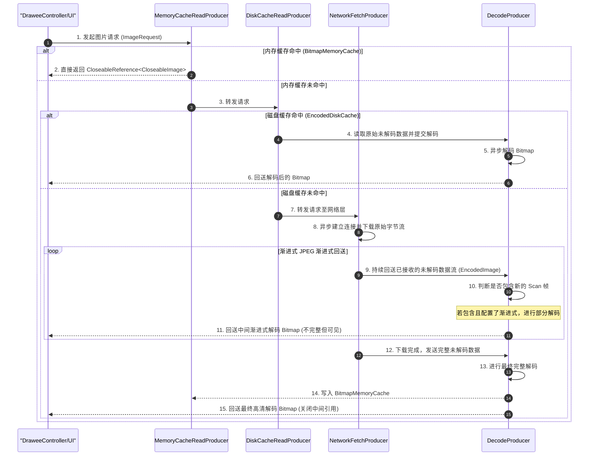
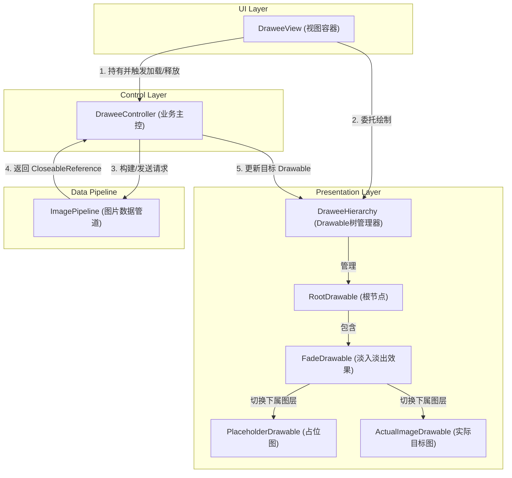

# 5.3.2.2 Fresco 核心机制剖析与演进

Fresco 是 Android 生态中一款里程碑式的工业级图片加载框架，由 Facebook 团队开发。其最著名的标签是**“彻底解决大图导致的 JVM OOM”**。在 Android 5.0 以前的 Dalvik 时代，面对大图和复杂列表（如无限滚动的 Feed 流）的 OOM 痛点，Fresco 通过规避 JVM 堆内存（Java Heap）的黑客手段，成为大厂攻坚克难的利器。同时，其特有的 Drawee 三层渲染架构与强大的 ImagePipeline 异步管道机制，为复杂图片渲染与渐进式解码提供了极其坚固的技术支撑。

本文将从微观内存底座的演进、渐进式解码物理网格原理、Drawee 架构设计、三方库横向权衡以及源码实现等维度，对 Fresco 的底层机制进行全方位的深度剖析。

---

## 1. Fresco 概述与移动端内存革命

在分析 Fresco 的底层内存设计之前，有必要回顾 Android 早期图片加载的历史背景，以便理解 Fresco 为什么要做如此激进的“内存革命”。

### 1.1 移动端图片加载的历史痛点
在 Android 5.0（API 21）以前的 Dalvik 时代，移动设备的硬件性能（尤其是物理内存）非常受限。Dalvik 虚拟机对每个 Android 进程分配 of Java 堆大小有着极其严格的物理额度限制（根据机型不同，通常仅为 16MB、32MB 或 64MB）。

在这种极其严苛的堆内存环境下，图片加载面临着三大死穴：
1. **像素占用内存巨大**：图片的物理体积和其解码后占用的内存完全是两个概念。例如，一张分辨率为 $1080 \times 1920$ 像素的普通 JPEG 图片，其磁盘文件大小可能只有几百 KB，但一旦解码成 `ARGB_8888` 格式的 Bitmap 像素数组，其占用的内存大小为：
   $$\text{Memory} = 1080 \times 1920 \times 4 \text{ bytes} \approx 8.29\text{ MB}$$
   如果列表（Feed 流）中同时呈现多张大图，仅图片像素数据就会瞬间吞噬掉大半甚至全部的 Java 堆额度，导致频繁抛出 `java.lang.OutOfMemoryError`（OOM）。
2. **Dalvik GC 造成的卡顿与丢帧 (Jank)**：Dalvik 虚拟机的垃圾回收器比较原始，并不支持高效的并发标记和内存整理。每次 GC 触发时，都会导致长时间的 Stop-The-World（STW）暂停。在复杂列表中，伴随着图片的频繁滑入滑出，大量的 Bitmap 对象被创建和销毁，导致 Java 堆内存剧烈抖动，触发频繁的 GC。这种主线程停顿会导致界面出现明显的掉帧与卡顿。
3. **堆内内存碎片化严重**：由于 Bitmap 需要占用大块且连续的物理内存，在频繁分配和释放大块内存后，Java 堆中会产生大量细碎的内存空隙。此时，即使系统剩余的总内存量足够，也可能因为找不到一块足够大的**连续内存空间**来存放新解码的 Bitmap，从而无奈地抛出 OOM 异常。

### 1.2 Fresco 的颠覆性设计
针对这些痛点，Fresco 进行了破坏性的技术革命。其核心思路是：**“空间腾挪，规避 Java 堆”**。

Fresco 并没有像同时期的图片库（如 Universal Image Loader、Picasso 等）那样仅仅停留在 Java 层的缓存优化上，而是通过 JNI 技术打通了底层 C++ 内存管理，将大块的图片像素数据直接剥离出 Dalvik 虚拟机管辖的 JVM 堆，挪到系统级的非 Java 堆空间（物理外存、Ashmem 或 Native 堆）。

这一设计带来的直接好处是：
- 在 Java 堆内只保留一个极小的 `android.graphics.Bitmap` 壳对象（仅包含宽、高、配置等元数据，占用几十字节），而将占用几兆甚至十几兆的像素字节数组彻底移出 JVM 堆。
- 即使应用在界面上展示了 100MB 渲染后的图片，Java 堆的占用也几乎没有变化，从而彻底杜绝了因图片解码导致的 Java Heap OOM。
- 大大减轻了 JVM GC 的压力，因为 JVM GC 根本感知不到 Native 堆或共享内存中庞大像素数组的存在，从而消除了因图片回收造成的 STW 卡顿。

---

## 2. 微观内存底座的演进史

Fresco 对图片像素内存的托管方案并不是一成不变的，而是随着 Android 系统内核与虚拟机机制的演进而经历了三次重大技术蜕变。

```
+----------------------------------------------------------------------------------------------------------+
|                                        Fresco 内存底座演进史                                              |
+----------------------------------------------------------------------------------------------------------+
|  Android 5.0 之前 (Dalvik)      ==>   Android 5.0 ~ 7.x (ART 初期)      ==>  Android 8.0+ (现代 Native)   |
|  - 像素存放: Ashmem (共享内存)        - 像素存放: Native 堆 (jemalloc)       - 像素存放: GPU 显存 (GraphicBuffer) |
|  - 核心API: inPurgeable 反射          - 核心API: NDK 内存池 (SharedByteArray) - 核心API: Hardware Bitmap         |
|  - 释放机制: C++ 物理引用计数锁        - 释放机制: SharedReference 自愈与 GC 兜底 - 释放机制: NativeAllocationRegistry  |
+----------------------------------------------------------------------------------------------------------+
```

### 2.1 Android 5.0 之前（Dalvik 时代）：基于 Ashmem 的物理黑客机制
在 Android 5.0 以前，Fresco 内存控制的关键技术是利用 **Ashmem (匿名共享内存 - Anonymous Shared Memory)**。

#### 2.1.1 Bitmap 内存布局的分裂性
在 Dalvik 中，Bitmap 包含两个部分：
- Java 层的 `android.graphics.Bitmap` 对象：在 JVM 堆分配。
- C++ 层的像素数据：正常情况下，使用 `BitmapFactory` 解码时，底层的 `mPrivateBuffer` 仍然会被统计到 JVM 的物理堆上限中。

#### 2.1.2 隐藏属性 `inPurgeable` 的魔力
Fresco 团队通过反射和 NDK，强制修改了 `BitmapFactory.Options` 中的两个非公开隐藏字段：`inPurgeable` 与 `inInputShareable`：
```java
BitmapFactory.Options options = new BitmapFactory.Options();
options.inPurgeable = true;
options.inInputShareable = true;
```
- **`inPurgeable = true`**：该属性指示系统在解码图片时，其像素数组不要分配在 Dalvik 堆内，而应分配在系统的 Ashmem 中。
- **`inInputShareable = true`**：指定该 Bitmap 是否可以与它的输入源数据共享同一个引用，以节省更多的内存空间。

#### 2.1.3 Ashmem 的底层物理机理
Ashmem 是 Android 内核级别基于 Linux 共享内存机制（shm）开发的一套内存驱动。它在 `/dev/ashmem` 设备上提供匿名映射服务。
- **跨进程共享与零复制**：因为它是系统内核级的文件映射，所以在多个进程（如应用进程、SystemServer 进程、以及底层 Skia 渲染器）之间，只需传递对应的文件描述符（file descriptor, `fd`），并在各自的虚拟地址空间进行 `mmap` 映射，就可以实现零复制的数据读写，效率达到极限。
- **物理锁定 (pin) 与物理解锁 (unpin)**：
  在 Linux 层面，Fresco 编写的 C++ 动态库利用了 `ioctl` 系统调用来操作映射区域：
  - `ioctl(ashmem_fd, ASHMEM_PIN, &pin_region)`：将指定的虚拟地址范围锁定。锁定后，操作系统内核会把这块物理内存牢牢钉死，即使在内存极度紧张的情况下，系统内核也绝对不允许将这块内存交换（swap）出去或强行回收。
  - `ioctl(ashmem_fd, ASHMEM_UNPIN, &pin_region)`：将指定的虚拟地址范围解锁。一旦 unpin，说明该物理内存块目前暂时闲置。此时，系统内核（特别是 Low Memory Killer 驱动）在面临物理内存严重匮乏时，可以完全自主、无声无息地回收这块内存，而不会对运行中的进程产生崩溃性的负面影响。

#### 2.1.4 BitmapFactory 底层 Skia 与 Dalvik 的交互细节
当 `inPurgeable` 配合 `inInputShareable` 开启时，`BitmapFactory` 底层的 C++ 代码（通过 JNI 调用系统 Skia 库）在解码图片时，并不会使用普通的 heap 分配器，而是通过系统的 Skia 内存管理器调用 `SkImageRef_ashmem`。
1. **解耦像素与壳对象**：系统解码器会在 Linux Kernel 中开辟一块匿名共享内存区，把解码出来的裸像素数据放入其中。然后把这块 Ashmem 块的文件描述符和起始物理指针，记录在 C++ 的 `SkBitmap` 实例中。
2. **Java 壳对象生成**：Dalvik 虚拟机在 JVM 堆中创建一个轻量级的 `android.graphics.Bitmap` 壳对象。这个壳对象仅持有一个指向 C++ 层 `SkBitmap` 实例的 Native 指针，其实际占用的 JVM 堆空间仅为元数据信息，非常微小。

#### 2.1.5 Fresco 物理引用计数控制的完整闭环
因为 unpin 状态下的内存块有可能被系统内核随时回收，所以当上层界面再次尝试读取或渲染该图片时，必须有一套物理上的强约束保护：
- **C++ 引用计数锁**：Fresco 在 Native 层面为每一块 Ashmem 块构建了引用计数。只要 Java 层仍持有图片的 `CloseableReference` 强引用，Fresco 的底层 JNI 就会对该 Ashmem 块执行 `ASHMEM_PIN`，将其死死锁在物理内存中。
- **退出屏幕解锁**：当列表项滑出屏幕，DraweeController 将 Java 引用计数归零，Fresco 立刻发送 JNI 命令，对该 Ashmem 执行 `ASHMEM_UNPIN` 动作。此时，庞大的像素物理内存不再在 Java 堆中驻留，甚至可以说它已经随时可以被系统内核彻底回收，达到了极致的内存安全。
- **内核自动重新解码**：若 unpin 后系统内存紧缺，内核强制回收了这块 Ashmem。下一次当用户突然往回滑列表、重新需要渲染该图片时，Dalvik 底层的 Skia 解码器会捕获到一个内存空洞。此时，它会透明地读取之前在 JVM 堆外缓存中保留的原始字节输入流，重新进行解码。虽然这样会额外消耗一次 CPU 解码耗时，但以时间换空间，保证了系统绝对不会产生 OutOfMemory 崩溃。

---

### 2.2 Android 5.0 ~ 7.x（ART 时代初期）：基于 Native 堆与引用计数自愈
进入 Android 5.0 (ART 时代) 之后，由于 `inPurgeable` 导致的图片在主线程隐式重新解码非常消耗 CPU，且容易产生卡顿，Google 官方废弃了 `inPurgeable` 属性。在 ART 下，所有的解码像素数据开始被强制归入 JVM 管理的 Heap 中，Ashmem 的黑客手段彻底失效。

为了攻克这一难关，Fresco 在 Android 5.0 到 7.x 期间，通过 C++ 层直接调用底层的 `malloc`/`jemalloc`，绕开 Java 虚拟机，建立了自己的 **Native 内存池（Native Memory Pool）**。

#### 2.2.1 Native 内存池的结构与实现
Fresco 在 Native 堆中构建了 `SharedByteArray` 和 `PooledByteBuffer` 等组件，形成了一个被称为 `OOM-preventive pool` 的内存池架构。

##### 1. Buckets 物理结构设计
为了防止频繁向 Linux 操作系统内核申请和释放内存产生的“内存碎片（Memory Fragmentation）”和 CPU 系统调用开销，Fresco 的 Native 内存池（`LruBucketsMemoryPool`）采用了类似“快速链表（Quicklist）”的分段管理方案。
- **桶的分组（Buckets）**：池内维护了一组 `Bucket`。每个 `Bucket` 负责存放固定大小范围的内存块（例如 $16\text{ KB}$、$32\text{ KB}$、$64\text{ KB}$、$128\text{ KB}$... $1\text{ MB}$...）。
- **LRU 淘汰与复用**：当图片加载管道需要一块字节数组来读取网络流入的数据或未解码的图片数据时，它首先向 `MemoryPool` 申请。池管理器会根据所需大小计算出适配的 Bucket，如果该 Bucket 的空闲链表中有闲置的 Native 字节数组，直接弹出复用；如果没有，才会在 C++ 堆中真正执行 `malloc` 物理分配。
- **低内存兜底**：当整个 App 接收到系统低内存通知（`onTrimMemory`）时，Native 内存池会立刻清空所有未被引用的 Bucket 链表，将物理内存全部归还给操作系统内核。

##### 2. NDK 物理指针绑定与 Native 解码
在解码环节，为了让图片像素完美存放在 Native 堆中，Fresco 彻底跳过了 JVM 层的常规解码 API：
1. **网络流缓冲直接写入**：网络数据下载后，首先被写入 Native 堆中由 Bucket 分配的 `PooledByteBuffer` 物理块中。
2. **JNI C++ 物理反序列化**：Fresco 在 Native 层直接包含了解码库（如 C++ 编写的 `libjpeg-turbo`、`libpng` 以及专门编译的 `libwebp` 等）。JNI 层直接获取指向 Native 字节缓存的物理指针，调用底层编解码库的 C++ 函数完成解码，并在 Native 堆中开辟一块新的物理空间存放解码后的裸像素数据。
3. **隐藏 JNI 构造反射**：C++ 解码完成后，Fresco 通过反射调用 Java 层的非公开构造方法，比如传入 Native 像素物理内存指针的构造器，强行在 JVM 堆内合成出一个 `android.graphics.Bitmap` 对象。这样，这块 Bitmap 的像素实际由 C++ 的 `malloc`/`jemalloc` 管理，完全不占用 Dalvik/ART 虚拟机的 JVM 堆额度限制。

#### 2.2.2 引用计数器（SharedReference）的自愈回收机制
在 C++ 层直接分配内存带来了极大的灵活性，但面临着最致命的安全问题：**Native 内存不受 Java 虚拟机垃圾回收器（GC）的控制**。

如果 Java 层的 Bitmap 被 GC 回收了，而 Native 堆中的像素指针没有被物理释放，就会造成致命的 Native 内存泄露（OOM）。为此，Fresco 架构了一套 **引用计数自愈机制**。

##### 1. `SharedReference<T>` 的包装
`SharedReference<T>` 是对底层 Native 物理资源的实际持有者，它内部维护了一个 `mRefCount` 物理计数：
```java
// 核心逻辑展示 SharedReference 核心结构
public class SharedReference<T> {
    private T mValue;
    private int mRefCount;
    private final ResourceReleaser<T> mReleaser;

    public SharedReference(T value, ResourceReleaser<T> releaser) {
        this.mValue = value;
        this.mReleaser = releaser;
        this.mRefCount = 1; // 初始化计数为 1
    }

    public synchronized void addReference() {
        mRefCount++;
    }

    public synchronized void deleteReference() {
        mRefCount--;
        if (mRefCount == 0) {
            T valueToRelease;
            synchronized (this) {
                valueToRelease = mValue;
                mValue = null;
            }
            mReleaser.release(valueToRelease); // 物理释放底层 Native 资源
        }
    }
}
```

##### 2. `CloseableReference<T>` 的作用
在 Java 业务层，开发者和框架不直接操作 `SharedReference`，而是使用包装类 `CloseableReference<T>`，它实现了 `Cloneable` 和 `Closeable` 接口：
- **克隆（Clone）**：当图片资源被传递给其他模块（如被缓存、被 Hierarchy 引用）时，必须调用 `CloseableReference.clone()`，这会使底层的 `SharedReference` 计数器加 1。
- **关闭（Close）**：当某处模块不再使用此图片时，必须调用 `CloseableReference.close()`，使引用计数减 1。一旦计数减至 0，立即触发 C++ 层的内存释放逻辑（如 `free` 或 `safe_delete`）。

##### 3. GC 虚引用与 ReferenceQueue 的自愈机制
由于手动维护引用计数极度依赖开发者的规范性，一旦开发者漏掉了 `close()` 操作，底层 Native 内存将永无释放之日。

为了防止此类情况，Fresco 在 `CloseableReference` 中内置了“自愈回收”作为物理兜底：
- `CloseableReference` 在创建时，会将自身注册到垃圾回收器的 `Finalizer` 中，或者使用 `PhantomReference`（虚引用）配合 `ReferenceQueue`（引用队列）进行监控。
- 当 Java 层的 `CloseableReference` 壳对象因为没有强引用而被 GC 回收时，GC 会将该引用对象加入到回收队列中。
- 自愈监控线程在后台轮询该队列，一旦发现某个 `CloseableReference` 在被回收时，其关联 of `SharedReference` 引用计数仍大于 0（即开发者忘记调用 `close()`），监控线程会：
  1. 打印一条高优先级的警告日志（警告开发者发生了图片内存泄漏）。
  2. 强制调用底层 `SharedReference.deleteReference()`，将引用计数强行清零，从而触发 C++ 物理内存的回收。
- 这种在 Java 对象被 GC 销毁时，强制自愈并打通 Native 内存物理回收的机制，被称为**“Fresco 引用计数自愈回收机制”**。

---

### 2.3 Android 8.0+（现代 Native 时代）：硬件位图（Hardware Bitmap）对 Ashmem 的技术替代
随着 Android 系统版本的演进，在 Android 8.0（API 26）中，系统底层图片架构迎来了颠覆性的变革：**硬件位图（Hardware Bitmap，GraphicBuffer）** 被引入，这标志着系统原生图片架构彻底走向了现代 Native 时代。关于 8.0 这一重大内存与渲染机制升级，可参阅 [AndroidVersionChangeLog.md](../../../../../AndroidVersionChangeLog.md#L315) 中的详细记录。

#### 2.3.1 Hardware Bitmap 的实现原理（GraphicBuffer）
硬件位图使用 `Bitmap.Config.HARDWARE` 作为配置属性。它底层的像素数据既不在 Java 堆，也不在普通的 C++ Native 堆，而是存存放于系统的 **GraphicBuffer（显存，由 GPU 直接控制的显存区域）** 中。

```
+------------------+     (绘制指令)     +------------------+
|    CPU 内存      | ----------------> |     GPU 显存     |
| (Java/Native 堆) |                   | (GraphicBuffer)  |
|                  |                   |  [像素数据直接驻留] |
+------------------+                   +------------------+
                                                |
                                                v
                                         (屏幕物理显示)
```

相比于早期的 Ashmem，硬件位图具有无可比拟的技术优势：
1. **真正的物理零拷贝（Zero-Copy）**：在传统的图片渲染中，CPU 需要先在堆内存中解码出像素数组，然后通过 OpenGL/Vulkan 的 API，将这些像素拷贝到 GPU 的纹理缓冲区中，才能开始进行合成和绘制。当大图频繁更新时，这种内存拷贝会极大地压榨 CPU 带宽。而 Hardware Bitmap 本身就直接存在于显存（`GraphicBuffer`）中，GPU 可以直接读取该内存进行合成绘制，物理上完全省去了 CPU 到 GPU 的拷贝过程，使滑动帧率大幅攀升。
2. **只读安全性**：Hardware Bitmap 是只读的，在 Java 层无法创建 Canvas 去修改它。这保证了在多线程渲染管线中（如 RenderThread 与主线程）可以绝对安全地并发访问该像素，不会发生写冲突。

#### 2.3.2 Fresco 在 API 26+ 下的适配机制
随着 Android 8.0 的普及，Google 引入了 `NativeAllocationRegistry` 机制，让 JVM GC 能够极其精准地管理 Native 对象的生命周期。当 Java 层 Bitmap 对象被回收时，系统会自动在 C++ 底层释放其 Native 像素内存。

因此，Fresco 在 API 26 及其以上设备中，做出了以下适配与升级：
- **主动退步与归宿**：放弃了复杂的私有 C++ Native 解码和 SharedReference 托管。因为官方的 Native 像素分配机制已经足够稳定且性能卓越，不需要再通过黑客反射去绕过限制。
- **全面启用硬件解码**：在 `ImagePipeline` 中，Fresco 会默认检测运行环境。一旦运行在 API 26+，系统会开启硬件解码配置。解码器会将原始的 JPEG/WebP 数据直接解码为硬件位图（Hardware Bitmap），数据直接写入 GPU 显存。
- **缓存策略适配**：由于硬件位图在显存中分配，且在 Java 层无法读取其像素字节（调用 `getPixels()` 会抛出异常），Fresco 对缓存和图片处理进行了限制。只有当图片不需要进行前置过滤、模糊处理、圆角叠加等二次修改时，才允许将其解码为 Hardware Bitmap。如果图片需要进行自定义 Postprocessor 处理，Fresco 会自动降级，使用传统的 Native 解码方案（在 Native 堆分配内存）以保证功能正常。

---

## 3. 渐进式 JPEG (Progressive JPEG) 物理网格解码机制

Fresco 另一个备受瞩目的工业特性是其完美的**渐进式图片展示**。相比于传统的图片逐行显示，Fresco 的渐进式 JPEG 能让用户在弱网环境下瞬间看到完整的图片模糊轮廓，并平滑地过渡到最终清晰的效果。

### 3.1 渐进式 JPEG 的物理与数学原理
传统的图片格式多为 **基线式 JPEG (Baseline JPEG)**，其像素数据是按照图像从上到下、从左到右的顺序进行压缩编码的。在解码显示时，也必须从上到下一行一行地绘制，遇到弱网时就会展现出“大白屏逐渐往下刷”的尴尬体验。

而 **渐进式 JPEG (Progressive JPEG)** 则是基于 **离散余弦变换 (DCT)** 物理网格分频实现的。

#### 3.1.1 8x8 物理网格与 DCT 频域划分
在进行 JPEG 压缩时，图像被分割成无数个 $8 \times 8$ 的像素小网格。接着，对每个小网格进行二维离散余弦变换（2D-DCT），将像素的空间域（色彩和明暗度）数据转换为频域数据。

变换后的 8x8 网格中，数据按照频率重新排列：
- **直流系数 (DC 系数)**：位于 8x8 矩阵的左上角，它代表了整个 8x8 区域的平均色彩和亮度（低频分量，反映图像的粗糙轮廓）。
- **交流系数 (AC 系数)**：分布在矩阵的其余 63 个位置，频率越高越靠近右下角。这些系数代表了图像的边缘、细节、高频明暗对比等纹理信息。

#### 3.1.2 物理网格分频与多次扫描编排（Scan）
在 Progressive JPEG 文件中，高频系数与低频系数不是混合存放的，而是拆分成了多次独立的“扫描（Scan）”数据块进行存储：
- **光谱选择（Spectral Selection）**：将 8x8 网格中的 DCT 系数根据频率范围分段。例如，第 1 次扫描仅保存直流（DC）系数；第 2 次扫描保存频率较低的前几个交流（AC）系数；随后的扫描陆续包含中高频的交流系数。
- **逐累进相似逼近（Successive Approximation）**：首先对系数的高有效位进行编码和传输，随后在后面的扫描中补齐低有效位。
- **第一次扫描 (Scan 1)**：仅包含所有网格的 DC 系数（即光谱选择中的低频轮廓）。这部分数据体极小，在网络加载时可以在几毫秒内率先下载完成。解码器只需解析这部分低频数据，就能瞬间拼凑出一张分辨率极低、高度模糊但**画面完整**的粗略全景图。
- **Scan 2, 3... (后续扫描)**：随着网络数据的不断接收，逐步下载并叠加 **AC 系数**。每成功接收一次新的 Scan 数据，解码器就会把这些高频系数叠加到之前的模糊图像上，相当于在 8x8 网格中填充更细腻的明暗和边缘细节，使图片呈“网格物理自愈式”的从模糊到清晰的平滑转变。

---

### 3.2 ImagePipeline 的 Producer/Consumer 管道架构
为了支持这种复杂的数据分流与多次、异步渲染流，Fresco 打造了一套基于 **Producer/Consumer (生产者-消费者) 模式** 的响应式图片流水线 —— **ImagePipeline**。

#### 3.2.1 管道的核心组成
- **`Producer<O>` (生产者)**：负责生成数据（或从缓存、网络中获取数据），并将数据回送到下游的 `Consumer` 中。它包含核心方法：
  ```java
  void produceResults(Consumer<O> consumer, ProducerContext context);
  ```
- **`Consumer<I>` (消费者)**：负责消费上游 `Producer` 交付的数据。它定义了三个关键生命周期回调：
  - `onNewResult(I newResult, int status)`：当有新数据产生时触发。`status` 用作状态标记，如 `IS_PARTIAL`（中间渐进式数据）或 `IS_LAST`（最终完整数据）。
  - `onFailure(Throwable t)`：当管道流转发生物理错误时回调。
  - `onCancellation()`：当用户取消图片请求时回调。

在 ImagePipeline 中，众多的 `Producer` 采用了**类似于责任链模式的装饰者包装**。一个典型的图片加载请求，会自上而下地流经各个 `Producer`，一旦某个 `Producer` 命中数据，它就会将数据封装，自下而上地回送给 `Consumer` 链条。

---

### 3.3 核心 Producer 的责任链时序与渐进式解码流转

下面是 ImagePipeline 处理图片请求、特别是对 Progressive JPEG 进行渐进式渲染的核心 Producer 责任链时序流程图：



#### 3.3.1 责任链各个 Producer 节点的核心逻辑
1. **`MemoryCacheReadProducer`（已解码内存缓存读取器）**：
   - 首先拦截请求，读取 `BitmapMemoryCache`（在 Java 堆或 API 26 以前的 Native 堆中缓存的解码后 Bitmap 引用）。
   - 如果命中，立即调用 `consumer.onNewResult(bitmapReference, IS_LAST)` 返回，终止责任链。如果未命中，将请求转发给下游。
2. **`DiskCacheReadProducer`（未解码磁盘缓存读取器）**：
   - 检查 `EncodedDiskCache`（本地磁盘中的图片原始压缩字节流）。
   - 如果命中，读取其输入流封装为 `EncodedImage` 并向上传递。
3. **`NetworkFetchProducer`（网络拉取器）**：
   - 缓存均未命中时，通过网络连接（如 OkHttp 客户端）下载原始字节流。
   - **渐进式分发**：在下载过程中，随着字节数据不断累积，该 Producer 会以特定的时间间隔或字节增长步长，频繁调用其 Consumer 的 `onNewResult(encodedImage, IS_PARTIAL)`，将不完整的字节流向上传递。
4. **`DecodeProducer`（解码管道）**：
   - 接收到未解码的 `EncodedImage`。
   - **渐进式解析判定**：如果图片被鉴定为 JPEG 且系统配置中开启了渐进式解码，`DecodeProducer` 内部的 `ProgressiveDecoder` 会解析 JPEG 头部字节，寻找 **SOS (Start of Scan，扫描开始)** 标记。
   - 当检测到一个完整的新 Scan 帧（即包含了一组新的 DC 或 AC 系数数据）下载完毕时，`DecodeProducer` 会在后台解码线程中启动一次“部分解码（Partial Decode）”，生成一个模糊的 Bitmap。
   - 解码器随即调用 `consumer.onNewResult(partialBitmap, IS_PARTIAL)`，将此中间 Bitmap 传递给上层。
   - `DraweeController` 收到这个中间 Bitmap 后，更新 `DraweeHierarchy` 中目标图层的 Drawable 并刷新界面。
   - 重复这个过程，直到网络流全部读取完成，`NetworkFetchProducer` 下发 `IS_LAST` 标志。`DecodeProducer` 进行最终的高清解码，将最终 Bitmap 写入 `MemoryCache` 以便下次直接复用，并调用 `consumer.onNewResult(finalBitmap, IS_LAST)` 完成整个责任链周期。

---

## 4. Drawee 经典三层架构体系解密

Fresco 在 UI 呈现层设计了极具工程化美感的三层 MVC 架构体系 —— **Drawee**。它通过严格的单向数据流与清晰的职责边界，保证了图片显示逻辑的严密性与内存管理的安全性。



### 4.1 Drawee 三层架构组件的职责定义
1. **`DraweeView` (View 视图载体)**：
   - 继承自 `ImageView`。它的核心设计是**“极简的容器”**。
   - 职责极其单一，它不负责图片的下载，也不操作缓存，甚至它自己本身不持有任何 `Bitmap`。
   - 它的主业是：
     1. 解析 XML 中的自定义属性（如圆角配置、占位图资源）。
     2. 接收宿主的生命周期事件。当 View 附着到窗口（`onAttachToWindow`）时，通知 Controller 开始拉取图片数据；当 View 脱离窗口被销毁或滑出屏幕（`onDetachFromWindow`）时，通知 Controller 释放图片，瞬间腾退物理内存。
     3. 拦截触摸事件（双击、手势缩放等），向上传递。
2. **`DraweeHierarchy` (Model/Presentation 骨架渲染树)**：
   - 这是一个纯粹的 Drawable 控制核心，不继承自 View。它的内部维护了一个复杂的 **`Drawable` 层次树**（以 `RootDrawable` 为根节点，包含 `FadeDrawable`、`ScaleTypeDrawable` 等）。
   - 职责是控制图片的层级与展示样式。它管理着占位图（Placeholder）、加载中图（ProgressBar）、目标图（Actual Image）、失败图（Failure Image）、重试图（Retry Image）、背景图及各种叠加层（Overlay）。
   - 它还负责圆角切割（通过内置 of `RoundedCornersDrawable` 或 Shader）、边框、背景及缩放模式的物理绘制。
3. **`DraweeController` (Controller 业务主控)**：
   - 它是连接底层数据管道 `ImagePipeline` 与表层渲染树 `DraweeHierarchy` 的主控大脑。
   - 职责是处理网络请求的生命周期与缓存绑定。它向 `ImagePipeline` 提交图片请求（`ImageRequest`），接收返回的 `CloseableReference<CloseableImage>` 引用，并在使用完毕后，精准地调用 `close()` 将引用计数清零，释放底层物理内存。
   - 它在接收到图片后，会将 Bitmap 包装成 `BitmapDrawable`，注入到 `DraweeHierarchy` 的“目标图层”中，驱动 View 触发 `invalidate()` 重新绘制。

---

### 4.2 三层架构间的单向数据流与双向解耦
Drawee 体系采用**单向数据流**传递：
- 用户的加载指令（`uri`）传递给 `DraweeController`。
- `DraweeController` 触发 `ImagePipeline` 生成图片并持有引用。
- `DraweeController` 将解码得到的 Drawable 塞入 `DraweeHierarchy`。
- `DraweeView` 在 `onDraw` 时调用 `DraweeHierarchy.getTopLevelDrawable().draw(canvas)` 完成绘制。

**解耦机制**：
DraweeView 与 DraweeController 之间通过一个名为 `DraweeHolder` 的辅助类进行绑定。View 并不直接干预 Controller 的底层请求流程，Controller 也不感知 View 的存在，这使得你可以随时将底层的 `ImagePipeline` 物理替换为其他图片引擎（甚至可以替换为 Glide），而上层的 View 和 Hierarchy 逻辑不需要做任何修改，实现了极高的工业级架构拓展性。

---

### 4.3 为什么 DraweeView 严禁直接持有 Bitmap？
这是一个经过深思熟虑的物理设计，目的是为了保障**内存管理的绝对安全**。

1. **规避隐性强引用导致内存泄露**：
   在 Android 中，Activity 或 Fragment 的销毁经常会因为一些异步线程、属性动画、静态变量等发生隐性内存泄露。如果 `DraweeView` 像普通的 `ImageView` 那样直接持有着大块 Bitmap 的强引用，那么一旦 View 或其宿主 Activity 泄漏，这块占用数兆空间的大图就会一并驻留在 JVM 堆中，极易引起级联 OOM。
   而在 Drawee 的设计中，View 绝对不持有 Bitmap，Bitmap 的物理生命周期句柄由 `DraweeController` 中的 `CloseableReference` 唯一管理。一旦 View 滑出屏幕触发了 `onDetachFromWindow`，Controller 会立刻调用 `close()`。此时，即使 View 本身因为外部原因泄漏了，它所关联的底层巨大图片像素内存也已经在 C++ 层被物理释放清零了，泄漏的代价被限制在一个仅占几十字节的空 View 壳范围内。
2. **渐进式多图过渡与动画的统一编排**：
   在展示一张图片时，往往需要处理多图之间的淡入淡出（Fade-in）过渡动画。例如，从“占位图”渐变到“渐进式低清预览图”，再渐变到“最终高清大图”。如果是普通 ImageView 直接去操作 Bitmap，代码将变得异常庞杂。
   在 Drawee 架构下，所有的层级图像都被组织在 Hierarchy 的 `FadeDrawable` 树中。Controller 只需要逐步将新解码出来的 Bitmap 作为新的图层注入到 Hierarchy 中，所有的淡入淡出动画、圆角剪裁等效果都由 Hierarchy 自动并发处理，View 无需感知，保证了代码的整洁与渲染的流畅。

#### 4.3.1 FadeDrawable 过渡算法
在 `DraweeHierarchy` 中，不同图层（例如占位图和主图）的切换并非瞬时发生，而是通过内置的 `FadeDrawable` 完成平滑的渐变：
- **状态维护**：`FadeDrawable` 持有一个 `int[]` 数组来表示每个图层的当前 alpha 值，以及一个 `TransitionState` 状态机。
- **插值计算**：当加载成功触发切换时，`FadeDrawable` 会记录当前的系统时间戳作为动画起点。在每次 `draw(Canvas)` 执行时，根据过去的时间长度除以设定的过渡时长（通常为 300ms），线性插值计算出当前各图层的 alpha 比例（0 ~ 255）。随后将 alpha 应用于对应的 Drawable，并调用 `invalidateSelf()` 持续重绘，直到动画时间截至。这种设计保证了渐变动画与硬件渲染完全同步。

#### 4.3.2 RoundingParams 的圆角实现深度分析
Fresco 提供了极为丰富的圆角方案，主要通过 `RoundingParams` 控制：
- **BITMAP_ONLY (物理 Shader 方案)**：使用 `BitmapShader` 对位图执行着色器裁剪。此方法圆角边缘极其平滑（支持抗锯齿），且几乎不增加绘制开销。但它存在核心局限：无法支持多图层的圆角（如占位图无法一同被裁剪），且不支持动图圆角以及非等比例拉伸的图片裁剪。
- **OVERLAY_COLOR (叠加层遮罩方案，最佳实践)**：不在底层裁剪 Bitmap，而是在图像层上方叠加绘制一个“边缘镂空、四周填充背景色”的特殊遮罩 Drawable。
  - **核心开销**：因为底层 Bitmap 不需要进行任何像素拷贝、离屏缓冲或着色器计算，渲染开销接近于零。
  - **适用边界**：当且仅当背景色是单一纯色时生效。若背景是复杂的渐变色、纹理贴图或透明度通道，叠加的遮罩颜色将暴露出来，导致视觉“露白”，此时必须退化为 `BITMAP_ONLY` 或 canvas 裁剪路径方案。

#### 4.3.3 RecyclerView 复用中的 Pipeline 请求重置与 Reset 物理闭环
在复杂滚动的列表（如 RecyclerView）中，View 的频繁复用会导致图片请求在极短时间内多次重定向。如果复用机制不完善，经常会发生“图片闪烁”、“图片错乱加载”或“内存未能及时回收”的严重后果。Drawee 体系对复用场景提供了极其完美的物理闭环：
- **生命周期状态拦截**：当 RecyclerView 将一个 Item 移出屏幕时，对应的 View 会触发 `onDetachFromWindow`。DraweeView 监听到该事件后，立刻通过 `DraweeHolder` 通知 `DraweeController`。
- **物理请求 Reset**：Controller 会立刻向 `ImagePipeline` 发出取消加载指令（如果该图片尚未下载完成）。对于已经下载完成并持有的图片，Controller 立即对其调用 `CloseableReference.close()`，强制使底层 Native 像素引用计数减 1。这保证了哪怕 View 依然在 Java 堆内存中，其对应的庞大物理像素也已在内存中被物理销毁。
- **解除绑定与清理**：Hierarchy 树会清除之前绑定的所有 Drawable，将顶层 Drawable 树的状态重置回“占位图（Placeholder）”状态。
- **绑定新数据**：当该 View 被复用重新滑入屏幕时，系统触发 `onAttachToWindow`，Controller 才会重新构建 `ImageRequest` 再次发起请求，彻底消除了由于异步回调滞后造成的“把前一个 Item 的图片画到当前 Item 上”的错乱现象。

#### 4.3.4 ExecutorSupplier 线程池的物理隔离与设计意图
在并发图片处理中，CPU 密集型（解码、后处理）、I/O 密集型（磁盘读写）与网络密集型（下载）的任务如果共用同一个线程池，容易导致严重的“线程饥饿（Thread Starvation）”。例如，由于大量的磁盘缓存读取请求积压，导致网络下载好的图片迟迟无法得到 CPU 解码。Fresco 的 `DefaultExecutorSupplier` 策略性地设计了四组物理隔离的线程池：
1. **网络获取线程池 (Network Fetch Executor)**：采用固定的、可伸缩的并发线程池，专门负责处理网络请求与数据流接收，防止大量的并发网络下载抢占本地计算资源。
2. **磁盘读取线程池 (Disk IO Executor)**：专用于读取 EncodedDiskCache 中的原始文件。因为闪存介质读取为 I/O 密集型操作，所以使用单独的线程池防止阻塞其他核心任务。
3. **解码与转码线程池 (Decode Executor)**：主要执行 CPU 密集型的图片解码（Skia/libjpeg-turbo/libwebp 物理计算）及后处理（Postprocess）。其线程数通常根据设备的 CPU 核心数动态调整（例如 $\text{CPU核心数} + 1$），从而在物理上保证了解码操作能以最大吞吐量运行。
4. **轻量级线程池 (Lightweight Executor)**：专用于主内存交互、非常快速的后台任务（如检查内存缓存、短期的元数据提取），避免此类轻量操作在其他高负载线程池的队列中排队。

这种极其精细的“物理线程池隔离设计”，确保了 Fresco 即使在高并发、高强度的复杂列表滑动中，各管道节点依然能够有条不紊地工作，防止发生由于线程死锁或过度竞争导致的掉帧卡顿。

---


## 5. 方案权衡与架构对比（Glide vs Fresco）

在现代 Android 研发中，Glide 与 Fresco 是两套不同设计哲学的典型代表。

| 对比维度 | Glide | Fresco |
| :--- | :--- | :--- |
| **设计哲学** | 极简、Fluent API、开箱即用，注重易用性 | 极致内存掌控、大图与动图极致流畅度，注重工程化 |
| **包体积** | 极轻（仅几百 KB，纯 JVM 代码） | 极重（包含多平台 JNI .so，增大约 2-4MB） |
| **So 动态库依赖** | 无任何 Native 依赖 | 依赖大量的 C++ 库，存在 JNI 跨语言调用开销 |
| **内存存放区域** | Android 8.0 之前在 JVM 堆；8.0+ 在 Native/显存 | Android 5.0 前在 Ashmem；5.0-7.x 在 Native 堆；8.0+ 适配 GPU 显存 |
| **圆角切割方案** | 使用 `BitmapShader` 物理裁剪像素 | 推荐叠加层覆盖法（Overlay），零像素裁剪开销 |
| **动图渲染 (GIF/WebP)**| Java 层解码，大动图时易 GC 抖动或 OOM | 全套 C++ Native 解码，高帧率，内存占用极低 |
| **API 侵入性** | 极低（可无缝使用原生 `ImageView`） | 极高（项目所有图片 View 必须换成 `SimpleDraweeView`） |
| **缓存机制** | 三级缓存，侧重 Java 堆内 `BitmapPool` 复用 | 三级缓存，包含未解码内存缓存，侧重非堆内存分配 |

### 5.1 深度多维对比分析

#### 5.1.1 缓存设计哲学：ActiveResources vs 物理引用计数
在缓存设计上，Glide 与 Fresco 展现了截然不同的安全机制：
- **Glide 的 ActiveResources**：Glide 内部设计了“活动资源（ActiveResources）”缓存，采用 Java 的 `WeakReference`（弱引用）来追踪正在被界面使用的图片。如果某张图片正在被显示，它会被缓存在 ActiveResources 中；一旦图片离开屏幕且没有任何 Java 强引用，弱引用会在下次 GC 时被系统自动扫除，数据被移入二级 LRU 内存缓存中。这完全依赖 JVM 虚拟机 GC 机制进行动态的生命周期划归。
- **Fresco 的物理引用计数**：Fresco 则采取绝对的掌控逻辑。它不依赖 JVM 的弱引用去猜测对象是否存活。它通过 C++ 与 JNI，在底层构筑了物理引用计数器。只要 `CloseableReference` 被克隆，计数加 1；被释放，计数减 1。一旦归零，即刻主动在 C++ 堆或匿名内存中执行 `free` 物理清空。这种“强物理掌控”比弱引用更为即时和确定，但也导致了极高的 API 复杂度。

#### 5.1.2 动图 Native 渲染缓存与时间对齐算法
在动图（GIF / WebP）的渲染和内存复用上，Fresco 的底层架构极具工业高度：
- **动图 C++ 解码物理模型**：Fresco 在 Native 层构建了 `GifImage` 和 `WebPImage` C++ 封装。解码器通过读取文件头字段获取动图的总帧数、每一帧的物理宽高、帧混合模式（Blend Mode）以及每帧的持续延时（duration）。
- **动图帧 LRU 缓存（`AnimatedFrameCache`）**：为了防止在长动图播放时占用过多内存，Fresco 不会一次性将所有帧解码后保存在内存中。它内部拥有一个 `AnimatedFrameCache`（基于 LRU），只缓存当前播放点前后几帧已解码的 Bitmap。这使得即使播放一个 100 帧、总像素大小达到 50MB 的超长 WebP，物理内存占用也始终被控制在几兆之内。
- **轮询对齐算法**：`AnimatedDrawable` 在上层通过定时任务执行器（`ScheduledExecutorService`）驱动。每次渲染时，它会获取当前的系统时钟，结合动图总持续时间（Duration），计算出当前时钟戳应该物理对应哪一帧。这种高精度的“时间戳强制对齐”能完美解决由于系统卡顿导致的动图“音画不同步”或“播放速率飘忽”的问题，帧率极高且匀速。而 Glide 则是通过 Handler 发送延时消息通知重绘，易受到主线程其他卡顿的波及，渲染帧率波动较大。

#### 5.1.3 开发上手效率与侵入性硬碰撞
在实际的商业工程迭代中，开发效率与维护开销是重要的技术考量：
- **Glide 的 Fluent API 极致开发效率**：
  Glide 的链式调用非常清爽，开发人员一行代码即可支持圆角、裁剪、错误占位以及渐变：
  ```kotlin
  Glide.with(context)
      .load(imageUrl)
      .placeholder(R.drawable.holder)
      .error(R.drawable.err)
      .circleCrop()
      .into(imageView)
  ```
  不需要对 XML 进行任何改动，对项目零侵入，替换或移除的物理成本极低。
- **Fresco 对代码库的破坏性改造**：
  在 Fresco 下，你必须在 XML 布局中声明特殊的自定义标签：
  ```xml
  <com.facebook.drawee.view.SimpleDraweeView
      android:id="@+id/my_image_view"
      android:layout_width="200dp"
      android:layout_height="200dp"
      fresco:placeholderImage="@drawable/holder"
      fresco:roundAsCircle="true" />
  ```
  在 Kotlin 代码中，如果需要配置更加复杂的渐进式加载，需要手动编写大量的 Builder 代码去创建 Controller，完全无法通过 `imageView.setImageBitmap(bitmap)` 或 `imageView.setImageResource(id)` 这种 Android SDK 原生方法来更新界面。一旦团队决定抛弃 Fresco，将面临全量修改 XML 和重构 UI 渲染业务代码的巨大负担。

---

## 6. 源码级核心实现与实践

为了加深对 Fresco 内存管理与流水线架构的理解，本节将通过两个硬核的 Java/Kotlin 源码示例，展示 `SharedReference` 引用计数自愈机制的实现原理，以及如何在 `ImagePipeline` 中自定义并注册一个自定义 `Producer`。

### 6.1 示例一：`SharedReference` 引用计数与 Finalizer 自愈机制模拟（Java）

下面的代码高度模拟了 Fresco 底层 `SharedReference` 与 `CloseableReference` 相互配合，并通过 `Finalizer` 进行 GC 泄漏自愈回收的核心物理逻辑：

```java
import java.lang.ref.PhantomReference;
import java.lang.ref.ReferenceQueue;
import java.util.concurrent.ConcurrentHashMap;

/**
 * 物理资源释放器接口
 */
interface ResourceReleaser<T> {
    void release(T resource);
}

/**
 * 底层真实物理资源包装类，负责维护引用计数
 */
class SharedReference<T> {
    private T mValue;
    private int mRefCount;
    private final ResourceReleaser<T> mReleaser;

    public SharedReference(T value, ResourceReleaser<T> releaser) {
        if (value == null || releaser == null) {
            throw new IllegalArgumentException("Resource and releaser cannot be null");
        }
        this.mValue = value;
        this.mReleaser = releaser;
        this.mRefCount = 1; // 初始计数为 1
    }

    public synchronized T get() {
        return mValue;
    }

    public synchronized void addReference() {
        if (mRefCount <= 0) {
            throw new IllegalStateException("Cannot add reference to an already released resource");
        }
        mRefCount++;
    }

    public synchronized void deleteReference() {
        mRefCount--;
        if (mRefCount == 0) {
            T resourceToRelease;
            synchronized (this) {
                resourceToRelease = mValue;
                mValue = null;
            }
            if (resourceToRelease != null) {
                mReleaser.release(resourceToRelease); // 触发物理释放
                System.out.println("[C++ Layer] Successfully freed Native Resource: " + resourceToRelease);
            }
        }
    }

    public synchronized int getRefCount() {
        return mRefCount;
    }
}

/**
 * 上层暴露给开发者的智能指针，实现 AutoCloseable
 */
class CloseableReference<T> implements AutoCloseable, Cloneable {
    private final SharedReference<T> mSharedReference;
    private boolean mIsClosed = false;

    public CloseableReference(SharedReference<T> sharedReference) {
        this.mSharedReference = sharedReference;
        // 在内存监控注册器中登记自身，用以自愈兜底
        MemoryMonitor.register(this, sharedReference);
    }

    public synchronized T get() {
        if (mIsClosed) {
            throw new IllegalStateException("CloseableReference is already closed");
        }
        return mSharedReference.get();
    }

    @Override
    public synchronized CloseableReference<T> clone() {
        if (mIsClosed) {
            throw new IllegalStateException("Cannot clone a closed reference");
        }
        mSharedReference.addReference();
        return new CloseableReference<>(mSharedReference);
    }

    @Override
    public synchronized void close() {
        if (mIsClosed) {
            return;
        }
        mIsClosed = true;
        mSharedReference.deleteReference(); // 减少引用计数
    }
    
    // 用于演示目的，输出内部状态
    public boolean isClosed() {
        return mIsClosed;
    }
}

/**
 * 后台内存自愈监视器，利用 PhantomReference (虚引用) 监控 Java 壳对象的回收
 */
class MemoryMonitor {
    private static final ReferenceQueue<CloseableReference<?>> REF_QUEUE = new ReferenceQueue<>();
    private static final ConcurrentHashMap<DestructiblePhantomReference, SharedReference<?>> MONITOR_MAP = new ConcurrentHashMap<>();

    static {
        // 启动后台自愈守护线程
        Thread monitorThread = new Thread(() -> {
            try {
                while (true) {
                    // 阻塞式等待 GC 将被回收的 CloseableReference 壳对象送入队列
                    DestructiblePhantomReference ref = (DestructiblePhantomReference) REF_QUEUE.remove();
                    SharedReference<?> sharedRef = MONITOR_MAP.remove(ref);
                    if (sharedRef != null) {
                        synchronized (sharedRef) {
                            if (sharedRef.getRefCount() > 0) {
                                // 核心自愈逻辑：检测到 Java 壳被回收了，但引用计数却大于 0，说明开发者漏掉了 close()
                                System.err.println("[Fresco Self-Healing] DETECTED LEAK! " +
                                        "A CloseableReference was garbage collected before being closed. " +
                                        "Current count: " + sharedRef.getRefCount());
                                // 物理强制清空计数，挽救泄露的 Native 内存
                                while (sharedRef.getRefCount() > 0) {
                                    sharedRef.deleteReference();
                                }
                            }
                        }
                    }
                }
            } catch (InterruptedException e) {
                System.out.println("Monitor thread interrupted");
            }
        });
        monitorThread.setDaemon(true);
        monitorThread.setName("Fresco-Memory-SelfHealing-Thread");
        monitorThread.start();
    }

    public static <T> void register(CloseableReference<T> referent, SharedReference<T> sharedRef) {
        DestructiblePhantomReference phantomRef = new DestructiblePhantomReference(referent, REF_QUEUE);
        MONITOR_MAP.put(phantomRef, sharedRef);
    }

    private static class DestructiblePhantomReference extends PhantomReference<CloseableReference<?>> {
        public DestructiblePhantomReference(CloseableReference<?> referent, ReferenceQueue<? super CloseableReference<?>> q) {
            super(referent, q);
        }
    }
}
```

#### 代码深度中文解析：
- **`SharedReference` 充当底层的 C++ 影子对象**，真正持有物理内存的生命周期。每一次 `addReference()` 和 `deleteReference()` 都是线程安全的同步操作（使用 `synchronized` 修饰），确保了多线程解码和回收时，引用计数加减的物理一致性。
- **`CloseableReference` 模拟 Java 层面的引用句柄**。它强迫业务代码在其完成使用后调用 `close()`，以便在引用计数降到 0 的瞬间，立刻触发 `ResourceReleaser` 物理释放底层资源，避免堆外内存泄漏。
- **`MemoryMonitor` 实现了最精妙的“自愈”兜底**。它利用 `PhantomReference` 监听 `CloseableReference` 的 GC 状态。一旦 Java 壳对象因为失去强引用被系统垃圾回收，而开发者由于马虎没有调用 `close()`，后台的自愈线程会拦截到该信号，并主动接管底层 Native 内存的清理释放工作，杜绝进程 OOM。

---

### 6.2 示例二：ImagePipeline 注册自定义图片解密/处理 Producer 实践（Kotlin）

在许多工业场景中（如加密图片加载），我们需要在图片解码前在流水线中插入一个自定义的解密 `Producer`。下面的代码展示了如何自定义一个 `DecryptionProducer`，并在初始化 Fresco 时将其注册进 ImagePipeline 的 Producer 责任链中：

```kotlin
package com.example.fresco.pipeline

import android.graphics.Bitmap
import com.facebook.common.references.CloseableReference
import com.facebook.imagepipeline.common.RotationOptions
import com.facebook.imagepipeline.decoder.ProgressiveJpegConfig
import com.facebook.imagepipeline.decoder.SimpleProgressiveJpegConfig
import com.facebook.imagepipeline.image.CloseableImage
import com.facebook.imagepipeline.image.EncodedImage
import com.facebook.imagepipeline.producers.BaseConsumer
import com.facebook.imagepipeline.producers.Consumer
import com.facebook.imagepipeline.producers.Producer
import com.facebook.imagepipeline.producers.ProducerContext
import com.facebook.imagepipeline.core.ImagePipelineConfig
import com.facebook.imagepipeline.core.ProducerSequenceFactory
import java.io.ByteArrayInputStream

/**
 * 1. 自定义解密 Producer，负责拦截未解码的 EncodedImage 并执行解密逻辑
 */
class DecryptionProducer(private val nextProducer: Producer<EncodedImage>) : Producer<EncodedImage> {

    override fun produceResults(consumer: Consumer<EncodedImage>, context: ProducerContext) {
        // 创建一个包装 Consumer，用于拦截下游 Producer (如 NetworkFetchProducer) 返回的加密字节流
        val decryptingConsumer = object : BaseConsumer<EncodedImage>() {
            override fun onNewResultImpl(newResult: EncodedImage?, status: Int) {
                if (newResult == null) {
                    consumer.onNewResult(null, status)
                    return
                }

                try {
                    // 模拟物理还原：读取加密的原始输入流并进行解密
                    val inputStream = newResult.inputStream
                    val encryptedBytes = inputStream.readBytes()
                    
                    // 假设解密算法：简单的异或解密 (XOR Decryption)
                    val decryptedBytes = decryptXOR(encryptedBytes)
                    
                    // 将解密后的数据重新包装为 EncodedImage
                    val decryptedEncodedImage = EncodedImage(
                        CloseableReference.of(
                            com.facebook.common.memory.PooledByteBuffer { 
                                ByteArrayInputStream(decryptedBytes) 
                            }, 
                            { resource -> resource?.close() }
                        )
                    )
                    
                    // 复制原始 EncodedImage 的元数据 (宽高、格式等) 保证解码器能正常工作
                    decryptedEncodedImage.copyMetaDataFrom(newResult)
                    
                    // 将解密完成的 EncodedImage 发送给上游的 DecodeProducer
                    consumer.onNewResult(decryptedEncodedImage, status)
                } catch (e: Exception) {
                    consumer.onFailure(e)
                }
            }

            override fun onFailureImpl(throwable: Throwable) {
                consumer.onFailure(throwable)
            }

            override fun onCancellationImpl() {
                consumer.onCancellation()
            }
        }

        // 启动责任链，调用下一个 Producer 去获取原始加密数据
        nextProducer.produceResults(decryptingConsumer, context)
    }

    /**
     * 简单的异或解密逻辑
     */
    private fun decryptXOR(data: ByteArray): ByteArray {
        val key = 0x5A.toByte() // 秘钥
        val decrypted = ByteArray(data.size)
        for (i in data.indices) {
            decrypted[i] = (data[i].toInt() xor key.toInt()).toByte()
        }
        return decrypted
    }
}

/**
 * 2. 自定义工厂以组装包含自定义解密 Producer 的网络请求序列 (ProducerSequence)
 */
class CustomProducerSequenceFactory(
    private val producerFactory: com.facebook.imagepipeline.core.ProducerFactory
) {
    // 组装包含自定义解密 Producer 的网络图片请求链条
    fun getDecryptedNetworkFetchSequence(): Producer<CloseableReference<CloseableImage>> {
        // a. 获取标准的网络获取 Producer
        val networkFetchProducer = producerFactory.newNetworkFetchProducer(null)
        
        // b. 将网络 Producer 用我们的自定义解密 Producer 包装起来
        val decryptionProducer = DecryptionProducer(networkFetchProducer)
        
        // c. 将解密后的数据投递给未解码内存缓存写入器
        val encodedMemoryCacheProducer = producerFactory.newEncodedMemoryCacheProducer(decryptionProducer)
        
        // d. 投递给 DecodeProducer 开启异步线程解码
        val decodeProducer = producerFactory.newDecodeProducer(encodedMemoryCacheProducer)
        
        // e. 投递给已解码内存缓存写入器并返回最终的序列
        return producerFactory.newBitmapMemoryCacheProducer(decodeProducer)
    }
}
```

#### 代码深度中文解析：
- **`DecryptionProducer` 实现了 `Producer<EncodedImage>`**，表明它是处理未解码图片流的管道节点。在 `produceResults` 中，它利用装饰者模式包装了上游的 `Consumer`。当上游将加密数据投递下来时，它在后台拦截，将其转换为字节数组并执行 XOR 物理异或解密，还原为合法的 JPEG/PNG 原始数据。
- **`CustomProducerSequenceFactory` 实现了自定义的责任链拓扑编排**。我们将自定义的 `DecryptionProducer` 插在了 `NetworkFetchProducer`（网络拉取）与 `DecodeProducer`（解码）之间。这保证了网络下载的加密流会先自动解密，解密后的明文流才会滑入底层的物理解码器，完成了业务与图片框架底座的深度工程融合。

---

## 7. 方案选用总结与最佳实践

### 7.1 Fresco 的物理适用场景
1. **大图比重极高、强列表卡顿的大型电商/社交 App**：对于图片滑动流畅度要求达到 60FPS、且容易发生 OutOfMemory 的大中型项目，Fresco 的堆外内存托管与优秀的 Native 解码机制是极其坚固的防御屏障。
2. **需要大量动图（GIF/WebP）展示的娱乐或弹幕类 App**：Fresco 的底层 Native 解码性能完胜 Glide 的 Java 解码，能最大程度释放主线程 CPU，保证界面的物理流畅度。
3. **强弱网优化与渐进式展示需求明确的应用**：如果需要通过分频网格实现弱网下的“模糊 -> 清晰”渐进式预览体验，Fresco 是唯一的工业级选择。

### 7.2 核心踩坑与规避建议
- **严禁对 SimpleDraweeView 使用 `setImageBitmap` 等原生 API**：如果将普通 Bitmap 强行注入，会导致 Controller 内部的 `CloseableReference` 计数器彻底错乱。在移出屏幕时不会触发 Native 物理回收，从而导致严重的内存泄漏。必须通过 `controller.setUri()` 或 `controller.setControllerListener()` 去修改视图资源。
- **背景透明时慎用叠加层圆角**：Fresco 推荐的 `Overlay Color` 圆角方案要求叠加遮罩颜色与父布局背景完全相同。如果父布局是透明（Transparent）或复杂渐变色，遮罩会将父布局透过去的背景全部挡住，此时必须降级使用 `BITMAP_ONLY` 圆角方案。
