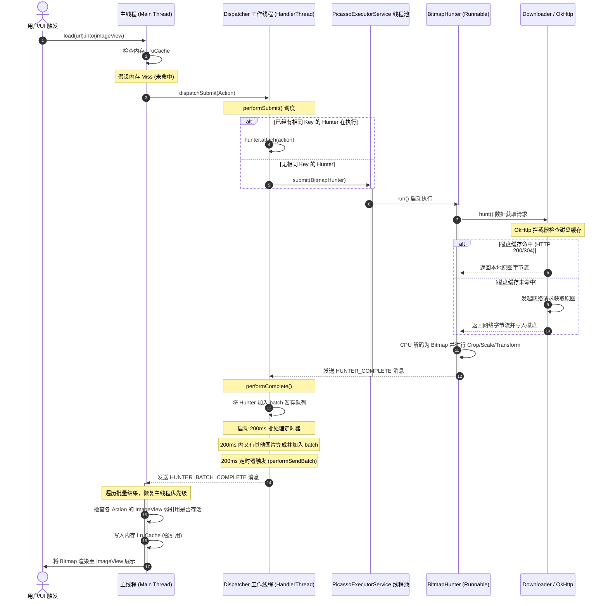

# 5.3.2.3 Picasso

Picasso（毕加索）是由 Android 领域著名开源先锋 Square 公司设计并维护的一款轻量级图片加载框架。在 Android 开源库的历史演进中，Picasso 以其优雅的 API 设计、极简的包体积和高度契合 HTTP 协议标准的架构理念，成为了一代开发者的首选，也深刻启发了后续如 Glide、Coil 等图片加载框架 of 诞生。

本篇将对 Picasso 的极简设计哲学、依赖 HTTP 标准的双级缓存、Dispatcher 调度指挥中心、Action 体系与弱引用生命周期、自适应网络线程池等核心机制进行深入剖析，并提供多维度架构对比与核心源码解密。

---

## 一、 Picasso 概述与极简主义设计哲学

### 1.1 什么是 Picasso？
Picasso 是一个面向 Android 平台的图片加载与缓存库。它的基本设计逻辑是：将复杂的异步图片下载、解码、缓存、裁剪变换以及在 UI 控件中的展示，简化为一行链式调用。
```java
Picasso.get().load("https://example.com/image.png").into(imageView);
```
在 Picasso 问世之前，Android 开发者面临着繁琐的低级 API 调用：需要手动管理线程池或 `AsyncTask` 以防阻塞主线程；编写复杂的网络请求逻辑以抓取原始字节流；小心翼翼地使用 `BitmapFactory` 进行解码，稍有不慎便会触发致命的 `OutOfMemoryError`（OOM）；手动在内存中维系一个 LruCache 并在滑动的列表（ListView / GridView）中处理视图复用导致的图片错乱。Picasso 的出现将这些复杂的细节收拢于幕后，提供了一站式的解决方案。

### 1.2 极简主义设计哲学：为什么只有几百 KB？
在现代移动端工程中，第三方库的引入往往伴随着包体积的剧增与依赖关系的混乱。然而，Square 公司在设计 Picasso 时，采用了一种近乎严苛的**极简主义（Minimalism）**与**高度内聚（Cohesion）**的哲学。Picasso 核心包体积通常维持在 120KB - 200KB 之间，方法数也维持在极低水平。

这背后的设计取舍与架构哲学主要体现在以下几个维度：

#### 1. 依赖标准的网络底座（不重复造轮子）
Square 公司本身就是 Android 网络标准库 `OkHttp` 的创造者。Picasso 没有像其他图片库那样自研一套独立的网络引擎或包装繁琐的 `HttpURLConnection`，而是直接将 `OkHttp` 作为其唯一的网络访问底座。通过天然整合 OkHttp，Picasso 得以直接共享 OkHttp 优秀的多路复用、连接池管理、以及底层的 HTTP 协议解析能力，极大地减少了自身在网络协议栈层面的代码量。

#### 2. 极度克制的架构范围（不包揽一切）
Picasso 坚信“一个库只做好一件事”。它专注于图片的获取、转换与展示。它不提供 GIF 动图播放（转交给系统原生能力或第三方库）、不提供复杂的视频帧提取、不集成冗余的图形渲染滤镜。这种定位使它能够保持极致的内聚性，避免了因功能泛滥导致的包体积膨胀与维护灾难。

#### 3. 委托思想的极致体现
Picasso 的核心设计是不造无用的轮子。对于磁盘缓存，它甚至没有像 Glide 或是 DiskLruCache 那样在库内部写一套复杂的磁盘索引与文件读写逻辑，而是完全委托给 HTTP 协议规范与 OkHttp 的缓存层。这种“去中心化”的委托思想，是其保持轻量化的最根本原因。

### 1.3 定位与适用场景
Picasso 的定位是一个**轻量级、契合标准、追求画质**的图片加载工具。它不追求花哨的动画与复杂的多媒体支持，而是将精力放在“如何用最小的代价、最标准的协议将网络上的图片正确、高质量地呈现在设备上”。这使其非常适合以下场景：
- **包体积敏感型应用**：对 APK 大小有严格限制的轻量级项目。
- **严格遵循 RESTful 与 HTTP 规范的后端服务**：如果后端的图片服务器已经配置了完善的 `Cache-Control`、`ETag` 等 HTTP 头部，Picasso 与 OkHttp 的结合能发挥出完美的协同效应。
- **高质量大图展示**：Picasso 默认的高精度解码格式保证了极致的图片还原度，适合新闻、电商、画廊等对画质要求严苛的应用。

---

## 二、 依赖 HTTP 标准的双级缓存机制深度解密

图片加载框架的缓存设计通常分为三层：内存缓存（Memory Cache）、磁盘缓存（Disk Cache）和网络（Network）。Picasso 在这三层架构中做出了与 Glide 等框架截然不同的技术选择。

```
+--------------------------------------------------------+
|                      Picasso.get()                     |
+--------------------------------------------------------+
                            |
                     [ 内存缓存查询 ] (LruCache)
                            |
            +---------------+---------------+
            | 命中                          | 未命中 (Memory Miss)
            v                               v
     [ 返回 Bitmap ]               [ 进入 Dispatcher 调度 ]
                                            |
                                    [ BitmapHunter 运行 ]
                                            |
                                            v
                                    [ Downloader 请求 ]
                                  (OkHttpDownloader / OkHttp)
                                            |
                                            v
                                   [ OkHttp 缓存拦截器 ]
                                  (CacheInterceptor)
                                            |
                    +-----------------------+-----------------------+
                    | 磁盘缓存命中 (HTTP 200/304)                  | 未命中 (HTTP Cache Miss)
                    v                                               v
       [ 读取本地磁盘原图 Stream ]                              [ 发起真实网络 HTTP 请求 ]
                    |                                               |
                    |                                               | 读取原图 Stream 写入磁盘
                    +-----------------------+-----------------------+
                                            |
                                            v
                                   [ 读入内存并进行 CPU 解码 ]
                              (BitmapFactory.decodeStream)
                                            |
                                            v
                                    [ 写入 LruCache 内存 ]
```

### 2.1 为什么 Picasso 不自研磁盘缓存引擎？
在 HTTP 协议的系统语境下，缓存并不是一件需要客户端图片加载库去强行发明规则的事情。相反，在标准的浏览器和网络组件中，这一套规范已经稳定运行了数十年。通过这种方式，客户端与服务器的缓存策略完美达成了一致，这也体现了高水平软件设计中的“职责单一原则”，避免了客户端业务逻辑对缓存失效算法的越俎代庖。

绝大多数 Android 图片库（如 Glide、Fresco）都会在库内部自研或集成一套 `DiskLruCache`。这意味着图片库需要在本地 SD 卡或沙盒内创建自定义目录，自己设计一套文件名哈希映射表，并手动控制文件的过期、清理与大小限制。

Picasso 彻底主张弃用这一做法。Square 的设计者认为：**既然图片本质上是 HTTP 协议传输的静态资源，那么图片的缓存理应遵循并复用成熟的 HTTP 缓存规范，而不是由图片库在客户端应用层自行发明一套规则。**

因此，Picasso 内部没有一行管理磁盘文件生命周期的代码，它将磁盘缓存的重任百分之百地委托给了底层的网络加载器（通常为 `OkHttpDownloader` 包装的 `OkHttpClient`）。

### 2.2 OkHttp 缓存拦截器（CacheInterceptor）的复用原理
当 Picasso 发起一个图片请求时，它会通过 `Downloader` 接口调用底层的 OkHttp。OkHttp 内部拥有一套严丝合缝的 `CacheInterceptor`（缓存拦截器），Picasso 的磁盘缓存正是通过这一层拦截器无缝实现的。

#### 1. 强缓存阶段（Cache-Control / Expires）
OkHttp 拦截器会首先检查本地的 HTTP 缓存目录。如果发现该请求的图片已经缓存在本地，且其响应头中的 `Cache-Control` 指示该资源尚未过期（例如 `Cache-Control: max-age=3600`，且距离上次请求未超过一小时），OkHttp 会直接将磁盘上的原图数据作为 Response 返回，**根本不会产生任何网络 IO 交互**。

#### 2. 协商缓存阶段（ETag / Last-Modified）
如果本地缓存已过期，或者响应头包含 `no-cache`，OkHttp 会在构建网络请求时，自动带上本地缓存的相关标识：
- 如果之前响应有 `ETag`，则带上 `If-None-Match`；
- 如果之前响应有 `Last-Modified`，则带上 `If-Modified-Since`。

当服务器收到请求后，如果图片并未发生改变，会直接返回 **`HTTP 304 Not Modified`** 响应。OkHttp 的 `CacheInterceptor` 在收到 304 响应后，会把旧的缓存响应头与新的响应头合并，并**直接读取本地磁盘缓存**返回给 Picasso。这极大地节省了网络带宽，避免了原图的重复下载。

### 2.3 “复用 HTTP 磁盘缓存”方案的利弊权衡（Trade-offs）
这种将磁盘缓存完全委托给网络协议栈的架构设计，在软件工程中是一个非常典型的权衡产物。它带来了极致的优雅，但也引入了不可忽视的运行时代价。

#### 【优势（Pros）】
1. **完美的协议规范遵守**：
   客户端完全不需要关心图片是否过期、何时该更新。服务端的网络运维人员只需要调整 Nginx/CDN 上的 HTTP 缓存控制头（如 `Cache-Control: public, max-age=31536000`），Picasso + OkHttp 就会自动执行对应的缓存策略。
2. **全局统一的网络缓存空间**：
   在同一个 App 中，Picasso 的图片磁盘缓存与普通的 JSON 数据请求缓存可以共享同一个 OkHttp Cache 实例。App 的缓存总额由 OkHttp 统一调配，无需为图片库和网络库分别设置不同的磁盘容量限制和维护两套清理机制。
3. **极简的代码复杂度**：
   Picasso 省去了磁盘文件读写、清理线程、哈希冲突处理等上千行复杂代码，消除了由于本地文件系统损坏、磁盘空间不足或权限变更导致的图片库特有 Bug。

#### 【劣势（Cons）—— 致命的 CPU 与滑动掉帧隐患】
虽然该方案在网络传输与代码结构上近乎完美，但在 Android 客户端运行时的性能上，它存在着巨大的缺陷：

* **“原图磁盘缓存”带来的重复解码（Decode）开销**：
  由于 OkHttp 缓存的是纯粹的 HTTP 响应体（即网络下载下来的 **Raw Image Bytes**，如 JPEG、PNG 原始文件），Picasso 每次从磁盘缓存命中图片时，拿到的都是这套原始字节流。
  这意味着，即使目标 ImageView 的大小只有 `100x100`，而磁盘里缓存的原图是 `2000x2000`，Picasso 每次从磁盘加载时，都必须：
  1. 将原始字节流读入内存；
  2. 调用 `BitmapFactory.decodeStream()` 在 CPU 中进行解码；
  3. 在内存中将 `2000x2000` 的 Bitmap 缩放（Scale）并裁剪为 `100x100`；
  4. 进行可能存在的变换操作（圆角、高斯模糊等）。

* **滑动卡顿与掉帧（Jank）**：
  解码（Decode）和缩放是非常耗费 CPU 算力的操作，尤其是对于大尺寸图和高频发生的 RecyclerView 滑动场景。
  在内存缓存 Miss 且磁盘缓存 Hit 时，每一次 View 的绑定都会触发一次完整的“磁盘 IO -> CPU 解码 -> 像素重采样”流程。这会导致工作线程或 UI 线程承载巨大的计算压力，容易破坏 Android 每秒 60 帧（甚至 90 帧/120 帧）的刷新周期（即 16.6ms 黄金窗口），从而在滑动时产生明显的卡顿与掉帧。
  相比之下，Glide 的磁盘缓存默认会缓存**“转换后的图片（Resource/Result Cache）”**。即 Glide 在第一次解码缩放后，会将 `100x100` 的成品 Bitmap 直接以压缩格式存入磁盘。下次磁盘命中时，读取的就是处理好的小图，解码速度呈指数级提升，CPU 开销微乎其微。

### 2.4 内存缓存：基于 LruCache 的管理
与磁盘缓存的彻底放手不同，Picasso 的内存缓存是由其自身精心维系的。它基于标准的最近最少使用算法（Least Recently Used）。

#### 1. 核心实现类 `LruCache`
Picasso 内部提供了一个简化的 `LruCache` 实现（实质是对 `LinkedHashMap` 的包装）。它通过 `LinkedHashMap` 的 `accessOrder` 特性（按访问顺序排序）来自动维护强引用 Bitmap 的队列：
- 当一个 Bitmap 被访问，它会被移动到链表的尾部；
- 当新 Bitmap 加入且缓存空间超出限制时，链表头部的最久未使用的 Bitmap 将被移除并从内存中释放。

#### 2. 默认内存分配策略
Picasso 并没有固定一个死板的内存大小（如 10MB），而是自适应于当前设备的运行内存限制。其计算公式如下：
```java
// 默认分配当前进程可用最大内存的 15%
int maxMemory = (int) Runtime.getRuntime().maxMemory();
int cacheSize = maxMemory / 7; // 约等于 14.28%（通常取 15%）
```
在垃圾回收频繁或低内存设备上，这一比例能确保图片库不会贪婪地吞噬过多的 Heap 空间，从而在根源上降低了 OOM 的概率。

---

## 三、 深度剖析 Android 系统 Bitmap 内存分配历史演进与 Picasso 的应对

为了更清晰地理解图片加载库的内存优化工作，有必要梳理一下 Android 系统在不同版本中对 Bitmap 像素数据的内存分配位置的变革，以及 Picasso 是如何在此技术演进中维持系统稳定的。

### 3.1 内存分配 of 三个历史阶段
1. **Android 3.0 之前（Gingerbread 及以下）**：
   Bitmap 像素数据（Pixel Data）分配在 **Native 内存**中，而其对应的 Java 包装对象 `android.graphics.Bitmap` 分配在 **Java Heap** 中。
   - *弊端*：Native 内存的释放必须依赖 Java 对象的终结（Finalizer）或者手动调用 `recycle()`。这导致在 GC 延迟或没有及时手动 recycle 的情况下，Java 堆虽然有空间，但 Native 堆早已被像素数据撑爆，导致应用无征兆地闪退。
2. **Android 3.0 ~ Android 7.1（Honeycomb 至 Nougat）**：
   为了降低内存管理的混乱，Google 将 Bitmap 的像素数据和 Java 包装对象都统一放到了 **Java Heap** 中。
   - *弊端*：此举虽然让内存回收变得清晰，但直接恶化了 Java 虚拟机的垃圾回收压力。由于图片通常极大，会导致 Java Heap 快速触及上限，触发频繁 of GC（甚至导致 Stop-The-World），这也是在此期间 Android 应用滑动卡顿、OOM 频发的核心诱因。
3. **Android 8.0 之后（Oreo 及以上）**：
   Google 再次做出改变，利用 Native 的 `SharedMemory` 将像素数据重新放回到 **Native 内存**（即系统物理内存）中，而 Java 堆中只留存非常小的包装描述对象。
   - *优势*：由于 Native 堆不再受 JVM Heap Size 的严格限制，图片导致的 OOM 频率呈断崖式下跌。同时引入了 `Bitmap.Config.HARDWARE`，允许 Bitmap 像素数据直接存储在 GPU 显存（Graphic Memory）中，由硬件直接绘制，免去了 CPU 往 GPU 拷贝像素的过程，极大地提升了滑动流畅度。

### 3.2 Picasso 的二次采样（Subsampling）与 OOM 防御
即便系统不断优化，不合理的原图解码依然是 OOM 的第一大杀手。Picasso 通过内置的 `BitmapFactory.Options` 动态调整机制，实现了智能的“二次采样”防御。

当开发者调用 `.resize(w, h)` 并伴随 `.centerCrop()` 或 `.centerInside()` 时，Picasso 在 `BitmapHunter` 中会采用两步解码策略：

#### 步骤 1：仅获取原图尺寸（轻量级探测）
Picasso 首先将 `BitmapFactory.Options` 的 `inJustDecodeBounds` 属性设为 `true`，然后执行 `decodeStream`。
```java
BitmapFactory.Options options = new BitmapFactory.Options();
options.inJustDecodeBounds = true;
BitmapFactory.decodeStream(stream, null, options);
```
此操作仅会读取图片文件的头部 meta 信息（即宽、高、MimeType），而不会将庞大的像素数据加载进内存，其 CPU 与内存开销几乎为零。

#### 步骤 2：计算最接近的采样率（inSampleSize）
拿到原图真实宽、高后，Picasso 会根据目标 ImageView 期望的 `resize(w, h)` 计算出最佳采样率 `inSampleSize`。
```java
// 假设原图是 4000x3000，目标是 400x300，则计算出采样率为 10
options.inSampleSize = calculateInSampleSize(options.outWidth, options.outHeight, reqWidth, reqHeight);
options.inJustDecodeBounds = false; // 关闭探测模式
Bitmap bitmap = BitmapFactory.decodeStream(stream, null, options);
```
在将 `inSampleSize` 设为 10 后，解码出的 Bitmap 像素总数缩减为原图的 1/100，原本需要占用 48MB 的物理内存，瞬间被降级为仅需 0.48MB。这种“先探测后采样”的动作是防止 OOM 的最有效手段。

---

## 四、 调度指挥中心：Dispatcher 与多线程引擎机制

Picasso 的整个异步加载与渲染体系由一个被称为“调度指挥中心”的结构——`Dispatcher` 维持。

### 4.1 Dispatcher 的 HandlerThread 并发处理模型
为了不阻塞主线程，并且保证线程安全的事件分发，Picasso 将所有的调度逻辑都放到了一个专门的工作线程中。这个工作线程就是 **`HandlerThread`**（在源码中命名为 `"Picasso-Dispatcher"`）。

```
主线程 (Main Thread)              Dispatcher 工作线程 (HandlerThread)
  |                                     |
  |--- 1. submit(Action) -------------->| (通过 DispatcherHandler 投递)
  |                                     |
  |                                     |--- 2. performSubmit(Action)
  |                                     |    a. 检查是否有同 Key 的 BitmapHunter
  |                                     |    b. 若有: 合并 Action (attach)
  |                                     |    c. 若无: 创建 BitmapHunter 并提交给线程池
  |                                     |
  |                                     +------------------+
  |                                                        |
  |                                                        v
  |                                              PicassoExecutorService 线程池
  |                                              (自适应网络线程数: 1 ~ 3)
  |                                                        |
  |                                                        | 执行 hunt()
  |                                                        | (磁盘/网络读取, 解码, 变换)
  |                                                        v
  |<-- 4. HUNTER_BATCH_COMPLETE (主线程回调) <-------------| (完成/失败发送给 Dispatcher)
  |    a. 遍历 Batch 列表                                  |
  |    b. 调用 action.complete(Bitmap)                     |--- 3. performComplete(BitmapHunter)
  |                                                        |    a. 暂存入 batch 队列
  |                                                        |    b. 开启 200ms 定时延迟合并批量投递
```

1. **统一事件循环与无锁设计**：
   `Dispatcher` 在初始化时会启动一个 `HandlerThread`，并获取其 `Looper`。接着，基于该 Looper 构建一个名为 `DispatcherHandler` 的后台处理器。
   传统的并发编程往往需要在 `hunterMap` 等临界资源上施加复杂的互斥锁（如 `synchronized` 或是 `ReentrantLock`）。这在高并发图片请求下容易产生昂贵的锁竞争与线程阻塞，甚至诱发潜在的死锁风险。
   Picasso 通过 `Handler` 机制，将所有的分发指令（Submit、Cancel、Complete、Failed、NetworkChange 等）完全转化为了工作线程消息队列里的任务，以**串行化（Serializing）**的机制在单线程中顺序运行。这在物理层面上完美消除了锁机制带来的开销与安全隐患，达到了极高的软件调度吞吐率。
2. **状态分发的完整路由状态机**：
   后台的 `DispatcherHandler` 会作为整个 Picasso 请求状态的核心接收器，它接收并解析以下事件类型，维持请求的生命周期：
   - `REQUEST_SUBMIT`：分发并执行 `performSubmit(action)`。
   - `REQUEST_CANCEL`：分发并执行 `performCancel(action)`。
   - `HUNTER_COMPLETE`：当线程池中的工作单元解码成功，通知 `performComplete(hunter)`。
   - `HUNTER_FAILED`：当线程池任务失败，通知 `performError(hunter)`。
   - `HUNTER_RETRY`：工作单元在网络抖动或失败后触发的重试逻辑。
   - `NETWORK_STATE_CHANGE`：网络广播变更，调用自适应线程池进行扩缩容。

### 4.2 批处理（Batching）投递机制的设计初衷
在列表中快速滑动时，可能会在极短的时间内（如 1 秒内）有数十个图片请求并发完成。如果每个图片加载完成都立即向主线程发送一条 Message 去更新 UI，会导致：
- 主线程频繁被 Message 唤醒，进行昂贵的度量、布局和重绘（Measure, Layout, Draw）；
- 引起主线程的 Message 队列产生严重的排队和延迟，造成滑动时的微小卡顿。

为了解决这一问题，Picasso 设计了 **`Batch` 批处理机制**：
- 当一个 `BitmapHunter` 在工作线程中解码完成，`Dispatcher` 不会立刻通知主线程。
- 它会将已完成的 `BitmapHunter` 暂存到一个 `batch` 列表（List）中。
- 随后，`Dispatcher` 会启动（或复用）一个 **`200ms` 的延迟消息**（`HUNTER_DELAY_NEXT_BATCH`）。
- 在这 200ms 的窗口期内，所有陆续完成的图片请求都会被塞入这个 `batch` 列表中。
- 200ms 时间一到，工作线程会将整个列表打包成一个大 Message，一次性投递给主线程。
- 主线程在单次 Message 的处理循环中，遍历该列表，批量更新对应的 ImageView。这种设计极大地减轻了主线程的通信频次与重绘压力。

### 4.3 Action 体系与 WeakReference 生命周期防漏机制
在 Picasso 中，每一次加载请求都会被封装成一个 `Action` 对象：
- **`ImageViewAction`**：专门处理将图片加载到 `ImageView` 的请求。
- **`TargetAction`**：专门处理加载到自定义 `Target` 回调的请求。
- **`RemoteViewsAction`**：处理加载到通知栏或桌面小部件的请求。

#### 1. 弱引用生命周期管理
为了避免图片加载导致的内存泄漏，`Action` 中持有对应的视图目标（如 `ImageView` 或 `Target`）时，采用的是**弱引用（`WeakReference`）**。

当一个 `Activity` 被销毁时，如果其内部的 `ImageView` 已经没有其他强引用链：
- 即使此时 Picasso 还在后台线程下载图片，垃圾回收器（GC）也能够无阻碍地回收这个 `ImageView`（以及它所持有的 `Activity` 上下文）。
- 当后台线程下载完图片，尝试回调 `ImageViewAction.complete()` 时，它会首先尝试通过弱引用获取 `ImageView`。如果获取到的是 `null`，说明目标视图已被销毁，Picasso 会直接放弃本次渲染，将资源释放。

#### 2. “匿名内部类 Target”的经典回收大坑
弱引用机制虽然保障了安全，但却给开发者带来了一个非常隐蔽的经典陷阱：
```java
// 错误示范：Target 极易被提前回收！
Picasso.get()
    .load("https://example.com/logo.png")
    .into(new Target() {
        @Override
        public void onBitmapLoaded(Bitmap bitmap, Picasso.LoadedFrom from) {
            // 做一些业务操作
        }
        @Override
        public void onBitmapFailed(Exception e, Drawable errorDrawable) {}
        @Override
        public void onPrepareLoad(Drawable placeHolderDrawable) {}
    });
```
* **原理解释**：
  上述代码中，`Target` 实例是一个没有任何外部强引用持有的匿名内部类。Picasso 的 `TargetAction` 内部对这个 `Target` 实例同样仅仅使用了弱引用。
  在网络请求发起并到图片下载成功的这几百毫秒甚至几秒的空档期内，一旦系统触发了 GC，垃圾回收器会发现这个匿名 `Target` 对象没有任何强引用链可达，从而将其直接回收。
  这会导致后台图片下载完成后，Picasso 发现 `WeakReference.get() == null`，对应的 `onBitmapLoaded` 回调永远不会被执行！

* **正确做法**：
  开发者必须使用一个成员变量或者长生命周期的强引用对象来持有这个 `Target`：
  ```java
  // 在 Activity 或 Presenter 中保留强引用
  private final Target mTarget = new Target() { ... };

  // 调用时传入该强引用
  Picasso.get().load(url).into(mTarget);
  ```

### 4.4 自适应线程池调优机制（PicassoExecutorService）
移动设备的工作环境极其复杂，网络状态可能在 Wi-Fi、4G、3G、甚至 2G 间随时切换。为了在高宽带下跑满并发、在低宽带下防止网络拥堵，Picasso 实现了自适应的线程池 —— `PicassoExecutorService`。

#### 1. 底层原理与网络亚类的精细化映射
Picasso 内部持有一个 `NetworkBroadcastReceiver`。它通过注册系统广播 `android.net.conn.CONNECTIVITY_CHANGE` 或者注册系统的网络状态 Callback 来动态监听连接变化。当网络发生瞬时切换时，`Dispatcher` 会接收到 `NETWORK_STATE_CHANGE` 消息，进而触发 `PicassoExecutorService.adjustThreadCount`。

线程池内部对于网络亚类（Subtype）有着极具工程智慧的映射分流：
- Wi-Fi 或以太网：**3个线程**。物理信道宽广，可以尽情并发。
- 4G 网络（如 `TelephonyManager.NETWORK_TYPE_LTE`, `NETWORK_TYPE_HSPAP` 等）：**2个线程**。
- 3G 网络（如 `TelephonyManager.NETWORK_TYPE_UMTS`, `NETWORK_TYPE_HSDPA` 等）：**2个线程**。
- 2G 网络（如 `TelephonyManager.NETWORK_TYPE_GPRS`, `NETWORK_TYPE_EDGE` 等）：**1个线程**。
  - *设计精髓*：在 2G 极其狭窄的物理信道下，如果开启多线程并发，多个 TCP 请求在协议栈会疯狂抢占极其受限的拥塞窗口，导致大量的 TCP 丢包和重传超时，使所有图片都处于卡死等待状态。将线程降级为 **1（单线程）**，采用漏斗排队机制“一个接一个”下载，反而能确保最基本的图片呈现成功率。
- 飞行模式或无连接：**保留 1 个线程**。
  - *设计精髓*：当没有网络或者飞行模式时，Picasso 并未粗暴地将线程池大小设为 0。这是因为 Picasso 还需要处理“本地 SD 卡文件”、“Assets 目录”以及“Resource 内置资源”的加载任务，保留 1 个线程可以保证在断网状态下，应用本地的静态 UI 依旧能流畅加载渲染。

---

## 五、 职责链模式与 RequestHandler 插件化架构

Picasso 的轻量与高可扩展性，还体现在它对“多种数据源图片加载”的处理上。它采用了一种经典的**职责链设计模式（Chain of Responsibility）**，将各种请求的加载逻辑彻底插件化。

### 5.1 RequestHandler 抽象基类
所有的图片获取能力，不论是本地资源、网络、相册，都统一派生自 `RequestHandler`：
```java
public abstract class RequestHandler {
  // 判断该 Handler 是否能解析这个 Request（例如：是否是 file:// 协议）
  public abstract boolean canHandleRequest(Request data);
  // 执行具体的读取与解码，返回 Result
  public abstract Result load(Request request, int networkPolicy) throws IOException;
}
```

Picasso 默认注册了一条有序的职责链，在初始化时，以下处理器会依次被填入职责链列表中：
1. **`ContactsPhotoRequestHandler`**：匹配 `content://com.android.contacts/` 协议，加载系统通讯录头像。
2. **`MediaStoreRequestHandler`**：匹配 `content://media/` 并且包含特定 ID，用于快速解码系统相册的缩略图。
3. **`ContentStreamRequestHandler`**：匹配通用的 `content://` ContentProvider 协议。
4. **`AssetRequestHandler`**：匹配 `file:///android_asset/` 协议，加载 Assets 目录下的图片。
5. **`FileRequestHandler`**：匹配 `file://` 协议，加载外部存储或沙盒中的图片文件。
6. **`ResourceRequestHandler`**：匹配 `android.resource://` 协议或直接传入的 Int ResId，加载系统 Drawable / Mipmap 资源。
7. **`NetworkRequestHandler`**：最后兜底的网络处理器，负责处理 `http://` 和 `https://` 协议。

### 5.2 职责链的流转逻辑
在 `BitmapHunter.hunt()` 运行过程中，它不需要关注当前请求的具体类型，只需通过以下伪代码逻辑在职责链中自动分流：
```java
Result hunt() throws IOException {
    // 遍历已注册的所有处理器
    for (int i = 0, count = requestHandlers.size(); i < count; i++) {
        RequestHandler requestHandler = requestHandlers.get(i);
        if (requestHandler.canHandleRequest(data)) {
            // 找到适配的处理器，执行加载
            return requestHandler.load(data, networkPolicy);
        }
    }
    throw new FileNotFoundException("No RequestHandler can handle: " + data);
}
```
`NetworkRequestHandler` 作为最底层的兜底拦截，保证了其他本地的加载器在无法处理时，最终能平稳过渡到网络引擎进行图片抓取。这在保证本地和网络加载功能的同时，给开发者预留了极高的二次定制空间。

---

## 六、 深入剖析 Picasso 的 Request 结构与 Key 唯一拼接机制

Picasso 每一个图片加载请求的核心描述都承载于 `Request` 这个实体类中。理解这个类的属性和其 Key 的拼接机制，是弄明白 Picasso 内存缓存命中机理的关键。

### 6.1 Request 实体的关键属性
`Request` 对象是使用 Builder 模式链式组装出来的，包含以下决定图片状态的核心字段：
- `uri` (Uri) 和 `resourceId` (int)：指明了数据源路径。这两者是互斥的。
- `stableKey` (String)：稳定键。当 URL 中含有动态变动的 Query 参数（例如临时访问凭证时间戳 `?token=123&time=16239120`），但图片实体内容其实没变时，开发者可以手动传入稳定键（如 `.stableKey("user_avatar_1")`）。这能够强行阻止因 Query 变动引起的缓存失效。
- `targetWidth` / `targetHeight` (int)：目标尺寸。
- `centerCrop` / `centerInside` (boolean)：裁剪填充模式。
- `rotationDegrees` (float)：旋转角度。
- `priority` (Priority)：优先级。Picasso 提供 `LOW`、`NORMAL`、`HIGH` 三个等级。
  - *线程池内部优先级排序实现原理*：
    在多张图片进行异步排队下载解码时，为了防止 Preload（预加载）等后台低优任务占用过多的线程，Picasso 使用了阻塞优先级队列。
    `BitmapHunter` 本身实现了 Java 中的 `Comparable` 接口。在放入线程池等待出队时，其内部会提取当前关联 Action 的优先级，并通过以下逻辑进行比较：
    ```java
    @Override
    public int compareTo(BitmapHunter other) {
        Priority p1 = this.getPriority();
        Priority p2 = other.getPriority();
        // 按照枚举的 ordinal 降序排列，数值越大表示优先级越高，排在队头优先出队被执行
        return p2.ordinal() - p1.ordinal();
    }
    ```
    这一设计对大型 UI 的列表滑入卡顿预防至关重要：滑动过程中，新进入视窗的 ImageView 的 Action 被设为 `HIGH` 优先级，而已经滑出可见区的 Preload 任务为 `LOW`，使得可见视图得以被 CPU 优先解码并上屏。

### 6.2 Key 拼接算法的核心实现
在 `LruCache` 中，Bitmap 是以一个唯一的标识字符串（Key）作为键进行存储的。
这个 Key 的拼装过程在 `Utils.createKey` 中实现：
```java
static String createKey(Request data, StringBuilder builder) {
    if (data.stableKey != null) {
        builder.append(data.stableKey);
    } else if (data.uri != null) {
        builder.append(data.uri.toString());
    } else {
        builder.append(data.resourceId);
    }
    
    // 如果指定了 resize，拼接 resize 尺寸
    if (data.targetWidth != 0) {
        builder.append(" resize:").append(data.targetWidth).append('x').append(data.targetHeight);
    }
    // 拼接裁剪模式
    if (data.centerCrop) {
        builder.append(" centerCrop");
    } else if (data.centerInside) {
        builder.append(" centerInside");
    }
    // 拼接旋转参数
    if (data.rotationDegrees != 0f) {
        builder.append(" rotation:").append(data.rotationDegrees);
    }
    // 拼接解码配置信息（色彩空间）
    if (data.config != null) {
        builder.append(" config:").append(data.config.name());
    }
    
    return builder.toString();
}
```
* **架构启示**：
  从 Key 的拼装代码可以看出，同一个 URL 的图片，如果被缩放为了 `100x100` 和 `200x200`，由于拼接出来的 Key 字符串截然不同，它们会在 `LruCache` 内存缓存中占用两份独立的空间，各自维护强引用。这解释了为什么 Picasso 的内存缓存是针对“最终图（Transformed）”的，而磁盘缓存（OkHttp 处）是针对“原图（Source）”的。

---

## 七、 性能统计与可视化仪表盘（StatsSystem）

Picasso 内置了一套精细的性能监测系统——`Stats`，它充当着整个图片库的“性能仪表盘”。

### 7.1 Stats 内部计数器与日志体系
`Stats` 类在后台负责维护一组多线程安全的计数指标：
- **`cacheHits` / `cacheMisses`**：内存缓存的命中与未命中次数。
- **`totalDownloadSize`**：通过网络加载的图片总原始字节数。
- **`totalOriginalBitmapSize`**：解码出来的原始 Bitmap 的总像素大小（以字节计）。
- **`totalTransformedBitmapSize`**：经过尺寸裁切（Resize / Crop）或自定义 Transformation 转换后生成的最终 Bitmap 的总像素大小。

此外，当开发者通过 `Picasso.Builder.loggingEnabled(true)` 开启全局日志系统时，Picasso 会在 `Dispatcher` 与 `BitmapHunter` 执行生命周期的关键节点（如 `SUBMIT`、`DECODED`、`TRANSFORMED`、`COMPLETE`、`CANCELED`）打印包含精细时间戳的 Debug 日志。这对排查图片加载阻塞、网络拥塞以及分析性能抖动瓶颈非常有帮助。

### 7.2 开发者调试红蓝绿小三角角标
Picasso 提供了一个极其实用的功能：图片加载来源指示器。
```java
Picasso.get().setIndicatorsEnabled(true);
```
当该属性开启时，Picasso 会在渲染出来的 ImageView 的左上角绘制一个小三角形色块，颜色代表了当前图片的加载来源：
* **绿色（Green）—— 内存缓存（Memory Hit）**：表示该图是直接从 LruCache 内存中获取的，响应时间小于 1ms，开销极低。
* **蓝色（Blue）—— 磁盘缓存（Disk Hit）**：表示该图来自 OkHttp 的本地磁盘缓存。注意：在 Picasso 中，虽然是磁盘命中，但它依然需要经历 CPU 解码，滑动时如果大图过多，依然可能掉帧。
* **红色（Red）—— 网络下载（Network Hit）**：表示该图是通过真实网络发起的请求。开销最高。

---

## 八、 方案权衡与架构大比拼：Glide 与 Picasso

在 Android 生态中，Glide 是 Picasso 最强劲的竞争对手。两者在设计理念、执行逻辑和功能实现上代表了不同的技术流派。

### 8.1 横向对比矩阵
以下是 Picasso 与 Glide 关键设计维度的全方位横向对比：

| 对比维度 | Picasso | Glide (经典架构) |
| :--- | :--- | :--- |
| **库包体积** | 极小（约 120KB ~ 200KB），几百个方法。 | 较大（约 500KB ~ 1MB+），包含大量编解码器与变换。 |
| **设计哲学** | 极简主义、内聚标准、完全契合 HTTP 协议规范。 | 一站式多媒体引擎、大而全、追求极致的滑动流畅度。 |
| **默认色彩空间** | **ARGB_8888**（追求最高精度的色彩展现）。每个像素占 4 字节。 | 默认 **RGB_565**（早期版本，省一半内存）；后期版本支持配置。每个像素占 2 字节，没有 Alpha 通道。 |
| **磁盘缓存粒度** | **仅缓存原图（Source）**。<br>直接依赖网络库的 HTTP 缓存响应体。 | **缓存最终修改图（Result/Resource）** 或 **原图（Source）**，支持多策略并存（ALL, NONE, RESOURCE, DATA）。 |
| **解码开销（CPU）** | 极高。<br>内存 Miss 时，每次命中磁盘缓存都要在 CPU 中重新进行解码和裁剪。 | 极低。<br>从磁盘读取的就是已经对应目标 ImageView 尺寸的成品图，解码速度极快。 |
| **生命周期感知** | **无**。<br>完全依赖 Java 的 `WeakReference` 与 GC 回收来避免泄露。 | **强感知**。<br>通过注入无 UI 的 Fragment 拦截 Activity/Fragment 生命周期，自动 Cancel 和 Resume。 |
| **GIF / 视频帧支持** | 不原生支持，需开发者手动处理或引入扩展。 | 完美支持 GIF 动图播放、本地视频文件帧截取与渲染。 |
| **定制化与网络适配**| 绑定 OkHttp 作为最佳搭档，不鼓励频繁更换底层结构。 | 抽象出强大的 `ModelLoader` 体系，可任意插拔适配各种底层网络库。 |

### 8.2 核心设计代差深度解密

#### 1. 色彩空间的画质与内存考量
Picasso 默认的 `ARGB_8888` 色彩空间使得它在显示色彩鲜艳、光影过渡细腻的艺术照、商品大图时有极高的保真度。然而，这也让它承受了多一倍的内存压力。
早期版本的 Glide 牺牲了一部分色彩精度（RGB_565），主要是为了服务低配置、物理内存小的安卓手机，避免垃圾回收（GC）机制频繁启动对滑动性能产生干扰。

#### 2. 磁盘缓存策略与二次处理逻辑的时代差异
Picasso 的底层磁盘缓存只管将原汁原味的网络数据存下来，而完全放弃在本地建立“已转换图片缓存”。
* **优点**：磁盘非常整洁，同一个 URL 永远只占用一份磁盘空间，不论这个 URL 最终被裁剪成了圆角、灰度还是各种分辨率。
* **缺点**：每次加载都要经历解码与像素重构，使得 CPU 工作负载在高负载滚动下呈指数级放大。
而 Glide 的设计重心完全偏向了“滑动表现”。由于它可以在磁盘中存储针对不同 View 定制裁剪过后的成品图，下次直接做极其快速的文件映射和极低消耗的解码，从而在卡顿和帧数稳定性上明显压制了 Picasso。

#### 3. 生命周期感知的技术差异
* **Picasso** 完全依赖 GC 回收。这种“被动”管理虽然降低了图片库的代码层级与侵入性，但其最大问题是**资源滞留**。比如用户频繁进出某个带有高清图片的二级页面，即使页面销毁了，前几个页面累积下来的图片网络下载与大图解码动作依然在后台丝毫不退地运行着。
* **Glide** 的主动生命周期感知则会监听宿主的 `onStop()` / `onDestroy()`，立即触发线程池队列清除，将未发起的任务丢弃，中断正在执行的任务，对系统资源（如 CPU、网络流量、线程句柄）有更高的尊重。

---

## 九- Dispatcher 核心分发源码解密

以下是根据 Picasso 原理精简整理出的 `Dispatcher` 核心调度代码（基于 Java 实现），它完整展示了主线程提交、工作线程接收、线程池分发、合并排队以及批处理投递的完整状态流转。

```java
package com.squareup.picasso;

import android.content.Context;
import android.os.Handler;
import android.os.HandlerThread;
import android.os.Looper;
import android.os.Message;
import java.util.ArrayList;
import java.util.LinkedHashMap;
import java.util.List;
import java.util.Map;
import java.util.concurrent.ExecutorService;

/**
 * Picasso 调度指挥中心 (简化版)
 * 核心设计：通过单后台线程的消息队列，安全、有序地调度所有图片加载请求。
 */
public class Dispatcher {

    // 内部 HandlerThread，用于隔离主线程，处理所有请求的状态机变换
    final HandlerThread dispatcherThread;
    final Context context;
    final ExecutorService service;            // 自适应网络线程池
    final Handler handler;                   // 绑定工作线程 Looper 的 Handler
    final Handler mainHandler;               // 绑定主线程 Looper 的 Handler
    
    // 保存当前正在运行的所有 BitmapHunter（用 key 标识，便于合并相同请求）
    final Map<String, BitmapHunter> hunterMap;
    // 暂存已完成待批量投递回主线程的 BitmapHunter 队列
    final List<BitmapHunter> batch;

    private static final int RETRY_DELAY = 500; // 失败重试延迟
    private static final int BATCH_DELAY = 200; // 批处理合并延迟 (200ms)

    // 消息路由常量
    static final int REQUEST_SUBMIT = 1;
    static final int REQUEST_CANCEL = 2;
    static final int HUNTER_COMPLETE = 3;
    static final int HUNTER_FAILED = 4;
    static final int HUNTER_DELAY_NEXT_BATCH = 5;
    static final int HUNTER_BATCH_COMPLETE = 6;

    public Dispatcher(Context context, ExecutorService service, Handler mainHandler) {
        this.context = context;
        this.service = service;
        this.mainHandler = mainHandler;
        this.hunterMap = new LinkedHashMap<>();
        this.batch = new ArrayList<>();
        
        // 创建并启动后台专属调度线程，使用后台线程优先级，防止抢占主线程 CPU 资源
        this.dispatcherThread = new HandlerThread("Picasso-Dispatcher", android.os.Process.THREAD_PRIORITY_BACKGROUND);
        this.dispatcherThread.start();
        this.handler = new DispatcherHandler(dispatcherThread.getLooper(), this);
    }

    /**
     * 外部主线程调用的提交接口
     */
    public void dispatchSubmit(Action action) {
        handler.sendMessage(handler.obtainMessage(REQUEST_SUBMIT, action));
    }

    /**
     * 外部主线程调用的取消接口
     */
    public void dispatchCancel(Action action) {
        handler.sendMessage(handler.obtainMessage(REQUEST_CANCEL, action));
    }

    /**
     * 工作线程内部：具体执行 Submit 逻辑
     */
    void performSubmit(Action action) {
        String key = action.getKey();
        // 1. 检查是否已经有相同 Key（加载同 URL 且尺寸变换一致）的 BitmapHunter 在运行
        BitmapHunter hunter = hunterMap.get(key);
        if (hunter != null) {
            // 如果存在，则直接合并该 Action，避免发起重复的网络请求和解码流程
            hunter.attach(action);
            return;
        }

        // 2. 检查线程池是否已关闭
        if (service.isShutdown()) {
            return;
        }

        // 3. 创建全新的 BitmapHunter，并将其包装为 Runnable 提交给自适应线程池
        hunter = BitmapHunter.forRequest(context, action, this);
        hunter.future = service.submit(hunter);
        
        // 4. 将其存入 HunterMap 中进行维护
        hunterMap.put(key, hunter);
    }

    /**
     * 工作线程内部：具体执行取消逻辑
     */
    void performCancel(Action action) {
        String key = action.getKey();
        BitmapHunter hunter = hunterMap.get(key);
        if (hunter != null) {
            hunter.detach(action);
            // 如果该 Hunter 上绑定的所有 Action 都被取消了，则将其彻底从队列中移出并中断线程
            if (hunter.cancel()) {
                hunterMap.remove(key);
            }
        }
    }

    /**
     * 工作线程接收到：某个 BitmapHunter 成功完成解码
     */
    void performComplete(BitmapHunter hunter) {
        // 从活动 HunterMap 中移除
        hunterMap.remove(hunter.getKey());
        // 塞入待合并的 batch 队列中
        performBatching(hunter);
    }

    /**
     * 工作线程接收到：某个 BitmapHunter 执行失败
     */
    void performError(BitmapHunter hunter) {
        hunterMap.remove(hunter.getKey());
        performBatching(hunter);
    }

    /**
     * 批处理核心调度控制
     */
    private void performBatching(BitmapHunter hunter) {
        // 如果 Hunter 已经被取消，则直接丢弃
        if (hunter.isCancelled()) {
            return;
        }
        // 将完成的 Hunter 放入 Batch 暂存列表
        batch.add(hunter);
        // 如果当前没有正在等待触发的 Batch 延迟消息，则发送一个 200ms 的延时 Message
        if (!handler.hasMessages(HUNTER_DELAY_NEXT_BATCH)) {
            handler.sendEmptyMessageDelayed(HUNTER_DELAY_NEXT_BATCH, BATCH_DELAY);
        }
    }

    /**
     * 200ms 延迟到期，触发批量发送给主线程
     */
    void performSendBatch() {
        List<BitmapHunter> copy = new ArrayList<>(batch);
        batch.clear();
        // 将这 200ms 内积攒的所有 Hunter 打包，通过主线程 Handler 发送
        mainHandler.sendMessage(mainHandler.obtainMessage(HUNTER_BATCH_COMPLETE, copy));
    }

    /**
     * 绑定在 HandlerThread 上的消息循环处理器
     */
    private static class DispatcherHandler extends Handler {
        private final Dispatcher dispatcher;

        DispatcherHandler(Looper looper, Dispatcher dispatcher) {
            super(looper);
            this.dispatcher = dispatcher;
        }

        @Override
        public void handleMessage(final Message msg) {
            switch (msg.what) {
                case REQUEST_SUBMIT: {
                    Action action = (Action) msg.obj;
                    dispatcher.performSubmit(action);
                    break;
                }
                case REQUEST_CANCEL: {
                    Action action = (Action) msg.obj;
                    dispatcher.performCancel(action);
                    break;
                }
                case HUNTER_COMPLETE: {
                    BitmapHunter hunter = (BitmapHunter) msg.obj;
                    dispatcher.performComplete(hunter);
                    break;
                }
                case HUNTER_FAILED: {
                    BitmapHunter hunter = (BitmapHunter) msg.obj;
                    dispatcher.performError(hunter);
                    break;
                }
                case HUNTER_DELAY_NEXT_BATCH: {
                    dispatcher.performSendBatch();
                    break;
                }
                default:
                    // 忽略未知消息
                    break;
            }
        }
    }
}
```

### 9.2 核心逻辑源码层级剖析

1. **`performSubmit` 的请求合并逻辑**：
   在 `performSubmit` 中，Picasso 会根据传入的 `Action` 计算一个唯一的 Key（格式一般为 `URL + 各种裁切变换属性的 HashCode`）。
   如果 `hunterMap` 中已经存在了这个 Key，说明后台正有一个线程在下载或解码同样的一张图片。Picasso 并不会为新 Action 再次启动新线程，而是直接调用 `hunter.attach(action)`。这也就是为什么在同一个页面上有多个 ImageView 展示同一张大图时，Picasso 底层只发起了一次网络请求的底细。
2. **`performCancel` 的按需回收逻辑**：
   当某个 View 被滑出屏幕或者被主动取消时，`Dispatcher` 会接收到取消通知。它会在对应的 `BitmapHunter` 中将对应的 `Action` 移除。
   如果此时发现该 `BitmapHunter` 身上已经没有任何 `Action` 绑定了（即所有关联的 ImageView 都不需要这张图片了），Picasso 会非常果断地调用 `hunter.cancel()`。此操作会直接调用 `Future.cancel(true)` 中断底层的网络请求和解码过程，极大限度地节省 CPU 与带宽。
3. **`performBatching` 与主线程低频交互**：
   `performBatching` 是 Picasso 控频更新的核心。如果不采用这种批处理机制，主线程可能会在极短的时间内被无数个 `HUNTER_COMPLETE` 消息频繁轰炸，导致 Handler 堵塞，UI 渲染掉帧。利用 200ms 的时间差进行打包合并投递，是一种经典的**防抖动（Debounce）/ 缓冲（Buffer）**架构设计。

---

## 十、 架构拓扑与交互时序流程图

为了更加直观地理解 Picasso 的顶层设计与分发流向，下面通过 Mermaid 图示进行呈现。

### 10.1 委托 OkHttp 实现磁盘缓存与 Action 封装层级拓扑图

该图展示了 Picasso 中各层级对象的包络关系与最终如何穿透到 OkHttp 网络/磁盘底座的整体拓扑结构。

```mermaid
graph TD
    subgraph Picasso 核心层
        A[Picasso 实例] -->|创建| B[RequestCreator 链式构建器]
        B -->|打包成| C[Action 请求载体]
        C -->|派生子类| C1[ImageViewAction]
        C -->|派生子类| C2[TargetAction]
        C -->|派生子类| C3[RemoteViewsAction]
    end

    subgraph 调度引擎与工作单元
        D[Dispatcher 调度枢纽]
        C -.->|通过 Handler 发送提交| D
        D -->|分配并执行| E[BitmapHunter 工作单元]
        E -->|内部持有一个或多个| C
    end

    subgraph 数据获取与缓存层
        E -->|调用| F[RequestHandler 处理器]
        F -->|对于网络资源| G[OkHttpDownloader 网络加载器]
        G -->|调用底座| H[OkHttpClient 客户端]
        
        subgraph OkHttp 缓存拦截器
            H -->|进入| I[CacheInterceptor 拦截器]
            I -->|查询/验证| J[Cache 本地 HTTP 缓存库]
            J -->|读写| K[DiskLruCache 磁盘文件系统]
        end
    end

    style Picasso 核心层 fill:#f9f,stroke:#333,stroke-width:2px
    style 数据获取与缓存层 fill:#bbf,stroke:#333,stroke-width:2px
```

### 10.2 Picasso 自适应网络 Dispatcher 调度及 Action 批量投递主线程时序流程图

该时序图详细绘制了从主线程（Main Thread）发起图片加载，一直到后台 Handler 线程分发、网络/缓存解析、以及最终 200ms 批量合并投递并回调给 View 的全链路时序。



---

## 十一、 案例研究：生产环境典型问题与采坑规避

在实际安卓大型工程中，Picasso 因其极其纯粹的设计，带来了一些特殊的业务问题。了解并避开这些陷阱，能够节约巨大的调试成本。

### 11.1 错乱与闪烁问题：RecyclerView 的 ViewHolder 复用
* **场景描述**：
  在 RecyclerView 中，由于 ViewHolder 是被重复利用的。如果列表项 A 绑定了图片 URL-1，网络缓慢，图片未展示。此时用户迅速滑动列表，ViewHolder 被复用给列表项 B，并绑定了图片 URL-2。
  如果处理不当，可能在 B 处先闪烁展示出 URL-1 刚刚下载完的图，随后再替换成 URL-2，给用户带来糟糕的视觉体验。
* **Picasso 的解决机制**：
  Picasso 在 `RequestCreator.into(ImageView)` 方法的内部，执行了如下的防御逻辑：
  ```java
  // 1. 隐式调用取消之前的请求
  Picasso.cancelRequest(imageView);
  // 2. 将当前的 Action 绑定到该 ImageView 的 Tag 上
  imageView.setTag(R.id.picasso_key, action);
  ```
  通过在每次 into 新图之前，自动、无感地取消该 ImageView 身上绑定的上一个 Action 并在 Dispatcher 线程中阻断其执行，Picasso 优雅地解决了复用乱序和闪烁闪烁的问题。

### 11.2 转换（Transformation）中间体 Bitmap 的回收泄露
在某些业务场景下，我们需要对下载的原图进行灰度化、添加水印或多边形裁剪，这时会自定义 `Transformation`：
```java
public interface Transformation {
  Bitmap transform(Bitmap source);
  String key();
}
```
* **隐蔽大坑**：
  在 `transform(Bitmap source)` 内部，开发者通过 `Bitmap.createBitmap()` 创建了新图。此时必须遵循一个金科玉律：**只要生成了新的 Bitmap 并且新旧对象不相等，就必须立刻在 transform 内部将传入的 `source` 回收掉**。
  ```java
  @Override
  public Bitmap transform(Bitmap source) {
      Bitmap result = performBlur(source); // 模糊处理，创建了 result
      if (result != source) {
          source.recycle(); // 极其关键！否则 source 原图将滞留在 Heap 中导致内存雪崩
      }
      return result;
  }
  ```
  if (result != source) { source.recycle(); } 这句代码必不可少。如果忘记调用，原图像素将堆积在内存中，频繁引发 OOM。

### 11.3 预加载与同步获取：fetch()、get() 与 into() 的区别与实战运用
Picasso 对不同加载模式提供了非常精细的分流接口：
- **`into(ImageView)`**：最常用的渲染模式。将 Action 投递至 Dispatcher，成功后在主线程更新 UI。
- **`fetch()`**：后台预加载模式。仅将图片下载、解码并放入内存 LruCache 和磁盘缓存中，但不加载到任何 UI 控件。
  - *实战预加载机制*：
    在多级交互界面中，当用户正在浏览 RecyclerView 中的卡片列表时，我们可以在监听到滑动停顿事件后，对列表中即将被点击展示项的详情图 URL 提前调用预加载：
    ```java
    Picasso.get().load(detailImageUrl).fetch();
    ```
    此请求会在空闲时段被静默发送出去，将下载解码得到的 Bitmap 预热放入 `LruCache` 和 OkHttp 的磁盘目录中。当用户点击详情页，详情页中的渲染逻辑调用 `into(detailImageView)` 时，就能百分之百秒开图片，消除转圈等待过程。
- **`get()`**：同步阻塞模式。直接在当前线程发起网络或读取缓存，并以阻塞式的方法返回 `Bitmap` 对象。
  - *同步后台业务剖析*：
    在某些后台同步服务中（如 WorkManager 或者是异步加水印服务中），我们需要同步拉取原图进行特定图像算法处理后上传服务器，此时应当使用 `get()`：
    ```java
    try {
        Bitmap original = Picasso.get().load(rawUrl).get();
        Bitmap result = performWatermark(original);
        upload(result);
    } catch (IOException e) {
        // 网络异常或解码异常的降级兜底处理
    }
    ```
  - *警示*：**绝对禁止在 Android 主线程（UI 线程）中直接调用 `.get()`**，否则会导致应用因 NetworkOnMainThreadException 崩溃或引发直接卡死的 ANR。此方法只应在 WorkThread、WorkManager、或者 IntentService 等异步后台服务中调用。

---

## 十二、 总结与现代工程启示

在不断追求高性能、大吞吐和极致流畅的今天，Picasso 的开发哲学就像一股清流。它向我们展示了当极致地吃透协议标准、极度克制地组织模块逻辑时，一个百 KB 级的软件库究竟能爆发出怎样令人瞩目的能量。这也是现代每一个饱受“库体积膨胀”折磨的移动端架构师所应当反思和借鉴的软件设计之美。

虽然在当前的工程实践中，由于对滑动流畅度、GIF 和视频帧支持的还原度与速度的苛刻需求，Glide 占据了更为主流的地位；但 Picasso 极其精炼的架构思路、基于单 HandlerThread 隔离的无锁调度模型、以及对 HTTP 标准缓存的完美复用，依然是 Android 框架设计领域的教科书级典范，值得每一位移动端工程师反复阅读和研习。
