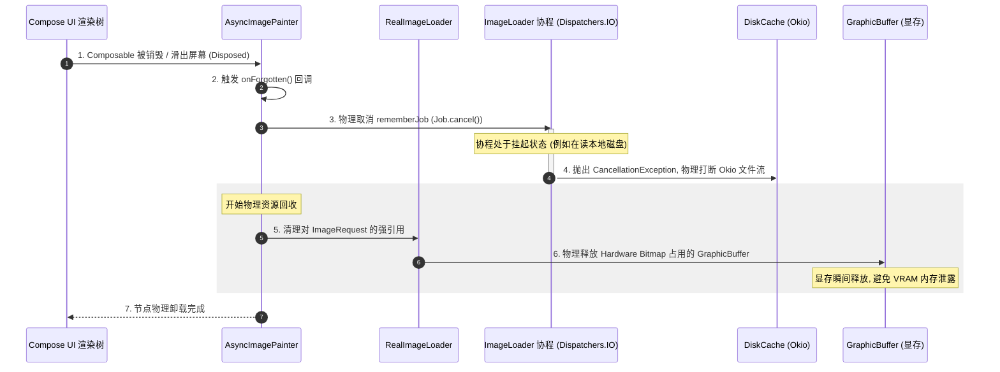

# 5.3.2.4 Coil 核心机制剖析与演进

Coil（Coroutine Image Loader）是 Android 生态中第一款完全基于 Kotlin 开发、专门为 Kotlin 协程（Coroutines）设计的现代图片加载库。在 Google 将 Kotlin 确定为 Android 第一开发语言，以及 Jetpack 生态（尤其是 Jetpack Compose 声明式 UI 体系）席卷移动端的背景下，Coil 凭借其轻量化、Kotlin First、无缝协同生命周期以及极高的性能，迅速成为 Android 现代技术栈（Modern Android Development, MAD）中首选的图片加载方案。

本文将从现代 Android 图形加载革命的背景出发，深入微观底层，解构 Coil 的协程流水线、非阻塞调度、无侵入式生命周期感知、Jetpack Compose 深度整合、Okio 磁盘缓存绑定，并提供完整的加密图片挂起式 Fetcher 实战方案，最后与 Glide、Fresco、Picasso 进行跨维度的横向权衡对比，同时针对工业开发中的典型误区进行物理级深度剖析。

---

## 1. Coil 概述与现代 Android 图形加载革命

要理解 Coil 的革命性，首先需要回顾 Android 图片加载框架的发展轨迹。

```
+-----------------------------------------------------------------------------------+
|                            Android 图片加载库技术演进史                            |
+-----------------------------------------------------------------------------------+
|  1. Universal Image Loader (早期遗留) -> 2. Picasso (轻量级/Square 出品)           |
|                                     |                                             |
|  3. Fresco (Facebook/C++ JNI匿名共享内存) <-> 4. Glide (Google推荐/View体系工业级标准) |
|                                     |                                             |
|  5. Coil (现代 Kotlin First / 纯协程挂起式流水线 / Compose 与现代 Jetpack 完美协同)   |
+-----------------------------------------------------------------------------------+
```

### 1.1 什么是 Coil？
Coil 是由 Instacart 团队于 2019 年开源的图片加载库。其命名 “Coil” 是 **Co**routine **I**mage **L**oader 的缩写，直译即“协程图片加载器”。它的核心设计目标非常明确：**轻量、现代、纯 Kotlin 优先、以及与 Android 官方 Jetpack 组件库的深度融合**。

与传统的 Glide、Fresco 等重型图片加载框架相比，Coil 在方法数、包体积、初始化速度和内存开销方面实现了跨代的飞跃：
- **包体积极小**：Coil 的核心库（Coil-Core）的方法数通常只有 ~2000 个，APK 增量仅为几十 KB；而 Glide 的方法数通常在上万级别，包体积增量超过几百 KB。
- **无缝复用现有生态**：Coil 没有像 Glide/Fresco 那样为了实现网络请求、磁盘缓存和多线程调度而自研一整套庞大的底层组件，而是选择直接复用 Android 开发中几乎必装的“黄金三件套”——**OkHttp（网络引擎）**、**Okio（I/O 流引擎）**、**Kotlin 协程（异步调度）** 以及 **AndroidX Lifecycle（生命周期感知）**。

### 1.2 为什么说它开创了现代图片库设计新标准？

在 Coil 出现之前，Glide 和 Fresco 统治了 Android 图片加载长达数年之久。然而，随着 Android 技术的演进，传统的 Java 图片加载框架逐渐暴露出了其在现代 MAD 体系下的局限性：

#### 1.2.1 复杂的自建线程池与现代协程的物理冲突
Glide 内部为了管理不同任务的优先级，构建了多个 `GlideExecutor` 线程池（包括磁盘缓存线程池、网络源线程池、动画线程池等）。在纯 Kotlin 开发的现代 App 中，业务层普遍采用协程作为异步并发的标准。此时，如果图片库仍然在后台维持数个独立且庞大的物理线程池，就会导致 JVM 进程中线程数量急剧膨胀，加剧 CPU 的时间片轮转和上下文切换（Context Switch）开销。而 Coil 完全基于协程调度，所有的异步任务都可委托给全局共享的 `Dispatchers.IO`，消除了图片库专属线程池的常驻消耗。

#### 1.2.2 笨重的生命周期监听注入（Fragment Hack）
为了监听 Activity 或 Fragment 的生命周期以决定何时暂停、恢复或释放图片请求，Glide 采用了一种被称为“无界面 Fragment 注入”的 Hack 手段：通过 `FragmentManager` 向当前页面偷偷插入一个 `SupportRequestManagerFragment`，以此来桥接 lifecycle 回调。这种机制不仅增加了页面组件的开销，而且在非 View 体系（如 Jetpack Compose 的 Composable 节点、Service、后台任务或 Multi-Window 场景）中，这种以 Fragment 为基础的注入逻辑会彻底失效。而 Coil 直接依赖标准 Jetpack Lifecycle 库的 `LifecycleObserver`，实现了无侵入的生命周期感知。

#### 1.2.3 对声明式 UI（Jetpack Compose）支持的割裂
Jetpack Compose 彻底颠覆了传统的 XML 布局与命令式 View 体系，UI 的绘制是由“重组（Recomposition）”驱动的。在重组过程中，Composable 函数会被高频反复执行。传统的图片库为了在 Compose 中工作，必须通过 `AndroidView` 桥接 `ImageView`，或者使用第三方包装库（如 Glide 的 `GlideImage`），这些包装在处理 Compose 频繁重组时的状态保持、取消物理 I/O 和内存即时回收等方面，往往存在卡顿、重组循环或内存泄漏的隐患。Coil 从底层就原生适配了 Compose 运行时，提供了专门的 `AsyncImage` 与 `AsyncImagePainter`，天然融入 Compose 的生命周期。

---

## 2. 纯 Kotlin 协程底层架构与非阻塞式调度

Coil 挂起（suspend）特性在底层发挥了巨大威力。在本节中，我们将从微观的类设计、协程调度、生命周期绑定三个方面解构其底层的运转逻辑。

### 2.1 Coil 核心流水线与挂起式组件设计

Coil 的图片加载核心可以看作是一个高度可扩展的**流式处理管道（Pipeline）**。该管道的核心数据流向如下所示：

```mermaid
graph TD
    %% 节点定义
    Req[ImageRequest] --> Loader[RealImageLoader]
    Loader --> Interceptors[Interceptor Chain 拦截器链]
    Interceptors --> CacheCheck{Memory Cache 强弱引用检查}
    
    %% 缓存判断分支
    CacheCheck -- Hit (命中) --> FastPath[Fast Path: 直接回调 SuccessResult]
    CacheCheck -- Miss (未命中) --> DispatchIO[Dispatch to Dispatchers.IO]
    
    %% 协程管道分支
    subgraph Coroutine Pipeline (协程挂起式流水线)
        DispatchIO --> MatchFetcher{Match ComponentRegistry}
        MatchFetcher --> Fetcher[Fetcher: 挂起式获取原始流]
        Fetcher --> Decoder[Decoder: 挂起式解码为 BitmapDrawable]
    end
    
    Decoder --> Transform[Transformations 图像二次加工]
    Transform --> SaveCache[写入磁盘/内存缓存]
    SaveCache --> DispatchMain[Switch to Dispatchers.Main]
    DispatchMain --> Render[Render to Target / AsyncImage]

    %% 样式美化
    classDef important fill:#f9f,stroke:#333,stroke-width:2px;
    classDef cache fill:#bbf,stroke:#333,stroke-width:1px;
    class Fetcher,Decoder important;
    class CacheCheck cache;
```

#### 2.1.1 核心组件的签名与挂起设计
在 Coil 中，没有任何回调地狱，获取与解码图片的核心组件都被设计为 `suspend` 函数。我们通过其源码中的核心接口声明来理解这一点：

##### 1. Fetcher（获取器）
`Fetcher` 负责将传入的原始数据源（如 `String` 类型的 URL、`Uri`、`File`、`Drawable` 资源等）提取为可以被解码的底层数据流。
```kotlin
interface Fetcher {
    suspend fun fetch(): FetchResult?
    
    interface Factory<T : Any> {
        fun create(data: T, options: Options, imageLoader: ImageLoader): Fetcher?
    }
}
```
`FetchResult` 是一个密封类（Sealed Class），主要有两个子类：
- `SourceResult`：包含一个 `ImageSource`（持有一路 Okio 的 `BufferedSource`），用于表示这是一个需要被解码的字节流（例如网络图片、本地文件）。
- `DrawableResult`：直接包含一个 `Drawable` 对象（用于表示已经是图片的情况，如 Vector 资源、内存中的 Bitmap），这种结果可以直接跳过后续的解码阶段。

##### 2. Decoder（解码器）
`Decoder` 负责将 `Fetcher` 输出的物理流解码为 Android 的 `Drawable` 对象。
```kotlin
interface Decoder {
    suspend fun decode(): DecodeResult?
    
    interface Factory {
        fun create(result: SourceResult, options: Options, imageLoader: ImageLoader): Decoder?
    }
}
```
`DecodeResult` 包含解码出来的 `Drawable` 以及一个指示图片是否为采样解码（isSampled）的布尔值。

#### 2.1.2 拦截器链（Interceptor Chain）的微观运作机制
Coil 的流水线运行不仅依靠 `Fetcher` 和 `Decoder`，其中枢完全由基于职责链模式的拦截器链（`Interceptor.Chain`）驱动。默认情况下，`RealImageLoader` 中装载了三个最核心的拦截器，按顺序为：

1. **`MappedKeysInterceptor`（键值路由拦截器）**：
   负责提取 `ImageRequest` 的原始数据源（如 `Uri` 或 `HttpUrl`），根据在 `ComponentRegistry` 中注册的映射规则，将其转换成一个在内存与磁盘中能够唯一标识图片资源的字符串 Key。该步骤确保了后续缓存拦截器能够获取到精确的散列键值。
2. **`MemoryCacheInterceptor`（内存缓存拦截器）**：
   它的核心逻辑非常明确：
   - 提取上一步生成的缓存键值，在内存缓存中进行读检索。如果命中，直接拦截请求，跳过后续的物理 I/O，并向上返回包含 BitmapDrawable 的 `SuccessResult`（即 Fast Path）。
   - 如果发生 Memory Cache Miss，则调用 `chain.proceed(request)` 将请求流转到下一个拦截器。
   - 当后续拦截器链执行完毕、成功从网络或磁盘解出 Bitmap 并返回时，该拦截器负责拦截这个返回结果，并将该 Bitmap 精准写入强/弱双层内存缓存中。
3. **`EngineInterceptor`（物理执行引擎拦截器）**：
   作为整个拦截器链的最后一个环节，它不负责继续向下路由，而是负责进行真正的物理图片获取与解码：
   - 依据 `ComponentRegistry`（组件注册表）中的匹配逻辑，为当前的 Request 挑选最合适的 `Fetcher` 与 `Decoder` 实例。
   - 调用挂起函数 `Fetcher.fetch()` 从物理媒介提取字节流，若无 `DrawableResult`，则继续调用 `Decoder.decode()` 将流解码为 `BitmapDrawable`。
   - 如果 `ImageRequest` 配置了 `Transformation`（如圆角变换 `RoundedCornersTransformation` 或高斯模糊），该拦截器会调用 CPU 密集型计算对位图进行二次处理，最后输出处理后的结果。

---

### 2.2 协程上下文切换机理与线程池共享

#### 2.2.1 物理线程与协程轻量线程的性能机理
要深刻理解 Coil 的调度优势，必须从操作系统层面剖析物理线程的切换开销：
在 Linux Kernel 中，一个传统的物理线程通常拥有独立的**内核线程控制块（TCB - Thread Control Block）**以及默认情况下约 1MB 大小的虚拟内存物理栈。当多线程高并发发生时，CPU 需要通过时间片轮转进行线程切换：
1. 保存当前物理线程的 CPU 寄存器状态（如 PC 计数器、通用寄存器、SP 堆栈指针）。
2. 从内核态切换，更新 MMU（内存管理单元）的页表缓冲（TLB - Translation Lookaside Buffer），使 CPU 执行另一个线程的指令。
3. 这一过程伴随着严重的 CPU Cache 缓存失效（TLB Flush）以及内核态与用户态的频繁转换，物理切换开销极大。

而 Kotlin 协程是一种**用户态的轻量级线程**。它的挂起（suspend）在 JVM 层面是通过编译期生成的** Continuation 状态机回调**实现的。当 Coil 挂起时：
- 协程的上下文（局部变量、当前执行指令位置）会被序列化存放在堆内存的一个轻量级对象中，而**不需要物理线程让出 CPU 执行权**。
- 同一个物理线程可以立刻去处理同一调度器中的其他协程指令，这就消除了内核态切换与 TLB 刷新的物理开销，从而榨干了 CPU 每一纳秒的算力。

#### 2.2.2 Glide 与 Coil 线程池模型的物理对比
为了清晰展现 Coil 在多线程并发与冷启动优化方面的优势，我们首先对两者的线程调度模型进行对比：

| 调度特征 | Glide 线程池模型 | Coil 协程调度模型 |
| :--- | :--- | :--- |
| **线程池创建** | 默认创建 `source`、`disk-cache`、`animation` 三个专属物理线程池。 | 零专属线程池，直接复用 Kotlin 全局的 `Dispatchers.IO` 与 OkHttp 内部的连接池。 |
| **线程生命周期**| 线程常驻进程，即使无图片请求，也会占用一定的系统线程描述符与内存栈空间。 | 线程由协程调度器和 OkHttp 动态伸缩管理，闲置时自动回收，对冷启动极其友好。 |
| **CPU 竞争** | 当多图并发加载时，多个专属物理线程池与应用主协程频繁竞争 CPU 时间片，上下文切换开销巨大。 | 所有任务归于全局 `CoroutineScheduler`，采用“工作窃取（Work-Stealing）”算法，最大限度减少了物理线程上下文切换。 |
| **网络调度绑定**| 拿到网络流后，需经过多级 Java Callback，在网络库线程池与图片库线程池之间来回复制与切换。 | 利用协程的 `CancellableContinuation`，在同一个挂起作用域内完成流式导流，无物理线程切换开销。 |

#### 2.2.3 共享 OkHttp 调度线程池的微观原理
Coil 的网络请求是通过 `OkHttpClient` 发起的。OkHttp 内部维护了一个高性能的 `Dispatcher`，该 `Dispatcher` 拥有一个最大核心线程数为 `Integer.MAX_VALUE`、空闲存活时间为 60 秒的 `ExecutorService` 线程池。其内部使用零容量的阻塞队列 `SynchronousQueue`，这意味着每个提交的任务都必须立即有一个空闲线程来承接，从而避免了任务在队列中积压排队，极其适合高并发的网络 I/O。

```
Coil 发起请求 -> 匹配 HttpUriFetcher -> 启动挂起式 HTTP 调用
                                            |
                                            v (无物理线程切换)
                               OkHttp.Dispatcher 线程池
                                  [ maxRequests = 64 ]
                             [ maxRequestsPerHost = 5 ]
                                            |
                                            v (Socket 读写)
                               Okio 缓存 -> 直接传递至 Decoder (Dispatchers.IO)
```

当 Coil 请求网络图片时，它并没有把网络请求任务提交到图片库的私有线程池中，而是直接调用 `OkHttpClient.newCall(request)` 并将其挂起。在物理层面：
1. Coil 的 `HttpUriFetcher` 内部利用了协程扩展方法直接桥接 OkHttp 的异步回调：
   ```kotlin
   suspend inline fun Call.await(): Response {
       return suspendCancellableCoroutine { continuation ->
           enqueue(object : Callback {
               override fun onResponse(call: Call, response: Response) {
                   continuation.resume(response)
               }
               override fun onFailure(call: Call, e: IOException) {
                   continuation.resumeWithException(e)
               }
           })
           // 协程取消时物理打断网络
           continuation.invokeOnCancellation {
               cancel()
           }
       }
   }
   ```
2. 当网络数据传输时，所有底层的物理线程全部由 OkHttp 的线程池托管；
3. 当数据下载完毕，由于没有额外的“图片库网络线程池”进行中转，数据直接在当前的 Okio 缓冲区中被返回，并由协程调度至 `Dispatchers.IO` 进行 Skia 解码。
4. 这项“零额外网络线程池”的设计，不仅降低了应用在冷启动时因加载首屏图片而导致的方法数与 CPU 开销，也从物理上将网络请求与图片加载统一在了同一个网络并发管理器之下。

---

### 2.3 彻底解密无侵入式生命周期感知

传统的图片库加载图片时，最令开发者头疼的问题就是**内存泄漏**与**带宽浪费**：当一个 Activity 已经被销毁（ON_DESTROY），但在后台网络线程中仍在下载该 Activity 所需 welfare 的图片，下载完毕后，图片库尝试回调并持有已被销毁的 Activity/View 引用，直接导致内存泄露；同时，在后台继续下载已经无用的图片，也极大地浪费了用户的蜂窝网络流量与设备的 CPU 算力。

#### 2.3.1 结构化并发与 Jetpack Lifecycle 的融合
Coil 废弃了传统的无界面 Fragment 注入模式，改用无侵入的 `LifecycleObserver`。在 `RealImageLoader.execute` 内部，Coil 通过如下逻辑自动监听页面的生命周期：

```kotlin
// 实质代码逻辑简化解析
private fun requestLifecycleInfo(request: ImageRequest): LifecycleInfo {
    // 自动寻找 LifecycleOwner
    val lifecycle = request.lifecycle ?: request.context.findLifecycle() ?: return LifecycleInfo.GLOBAL
    return LifecycleInfo(lifecycle)
}

// 绑定 Lifecycle
val lifecycleObserver = object : DefaultLifecycleObserver {
    override fun onDestroy(owner: LifecycleOwner) {
        // 当 Activity/Fragment 销毁时，物理取消对应的协程 Job
        job.cancel()
    }
}
lifecycle.addObserver(lifecycleObserver)
```

在找不到宿主 `LifecycleOwner` 的极端场景（如后台 Service、未关联 ViewTree 的 Context 等），Coil 会退一步匹配 `GlobalLifecycle`，通过一个无上限的全局协程作用域来兜底，确保流程安全走完而不引发未捕获的指针崩溃。

#### 2.3.2 View 挂载状态双重保险机制 (ViewTargetDisposable)
除了 `LifecycleObserver` 的 `ON_DESTROY`，Coil 还为传统的 View（如 ImageView）设计了双重保险。
当我们在 Coil 中把图片绑定到一个 ImageView 时，Coil 会创建一个 `ViewTargetDisposable`。该组件不仅包装了加载协程的 `Job`，还会通过向 View 注册 `View.OnAttachStateChangeListener` 来监控其在窗口（Window）上的附着状态：
- **`onViewDetachedFromWindow(view)`**：当该 ImageView 所在的布局被动态移出视图树，或者列表滑出屏幕触发 Detach 时，`ViewTargetDisposable` 会感知到这一物理变化，立刻执行 `job.cancel()`，让协程链提前挂起取消。这确保了哪怕 Activity 还处于活跃状态，但由于 View 已经不可见，后台解码和网络任务也会被立刻打断，极具性能前瞻性。
- **`onViewAttachedToWindow(view)`**：当该 View 重新滑入屏幕被 Attach 时，如果该图片请求此前并未被业务层显式清空，Coil 会识别其状态并安全地重新发起协程请求。

#### 2.3.3 链式物理打断机制的执行微观流程
当用户点击返回键，Activity 被销毁，触发 `ON_DESTROY` 事件，Coil 的底层物理取消逻辑会像骨牌一样发生链式反应：

1. **第一阶段：取消 Job**
   `LifecycleObserver` 接收到 `ON_DESTROY` 物理信号，立即调用与该图片加载请求绑定的协程 `Job.cancel()`。
2. **第二阶段：打断挂起管道**
   此时，协程的取消状态开始向其内部的挂起函数传播。如果在取消瞬间，图片正在执行 `Fetcher.fetch()`（例如正在网络下载），协程的 `suspendCancellableCoroutine` 会捕获到 `CancellationException`。
3. **第三阶段：物理打断 Socket 物理连接**
   由于我们在 `Call.await()` 内部注册了 `continuation.invokeOnCancellation { cancel() }`，OkHttp 的 `Call.cancel()` 会被物理执行。
   - OkHttp 接收到 cancel 信号，立即关闭当前的 `Socket` 连接，底层 TCP 握手物理打断，网络数据不再继续传输。
   - 操作系统内核回收该 Socket 文件描述符。
4. **第四阶段：阻止解码与垃圾回收**
   如果取消发生时，网络已下载完毕，图片正在 `Decoder.decode()` 执行 CPU 密集型的 Skia 解码，协程的挂起检查点（如每次读取流的循环）会感知到 Cancellation 状态，立即提前退出解码循环，Skia 引擎停止执行图片像素分配，未完成的物理 Bitmap 对象被直接废弃，等待 JVM GC 快速回收。

```
Lifecycle ON_DESTROY / View Detached
       |
       v
  Job.cancel()
       |
       v
CancellationException (传播至挂起函数)
       |
       v
continuation.invokeOnCancellation
       |
       v
OkHttp.Call.cancel() ----> (物理打断) ----> TCP Socket 断开 (带宽停止消耗)
```

通过这套无侵入的物理链条，Coil 将 Android 的 Lifecycle 机制与协程的结构化并发融为一体，从根本上杜绝了内存泄漏与无用网络带宽的消耗。

---

## 3. Jetpack Compose 声明式 UI 完美协同

在 Compose 声明式 UI 体系中，传统的“命令式”图片加载模式已不再适用。Compose 的界面是由高频重组驱动的，如何防止重组时的重复请求，以及如何在 Composable 节点离开视图树时物理打断底层 I/O，是现代图片库必须攻克的难题。

### 3.1 AsyncImage / rememberAsyncImagePainter 微观机制

Coil 为 Compose 提供了原生组件 `AsyncImage`。我们先来看它在底层如何利用 `rememberAsyncImagePainter` 来桥接 Compose 的运行时生命周期：

```kotlin
@Composable
fun AsyncImage(
    model: Any?,
    contentDescription: String?,
    modifier: Modifier = Modifier,
    // ...
) {
    // 1. 利用 rememberAsyncImagePainter 创建一个 Painter
    val painter = rememberAsyncImagePainter(model)
    
    // 2. 将 Painter 传入原生的 Image Composable 进行绘制
    Image(
        painter = painter,
        contentDescription = contentDescription,
        modifier = modifier,
        // ...
    )
}
```

`AsyncImagePainter` 是整个架构的桥梁。它继承自 `Painter`，并且最核心的是实现了 Compose 运行时的 `RememberObserver` 接口：

```kotlin
internal class AsyncImagePainter(
    request: ImageRequest,
    private val imageLoader: ImageLoader
) : Painter(), RememberObserver {
    
    private var rememberJob: Job? = null
    
    // 当 Painter 被挂载 to Compose UI 树上（即进入视图渲染生命周期）时回调
    override fun onRemembered() {
        if (rememberJob != null) return
        
        // 启动一个与当前 Compose 节点绑定的协程作用域
        rememberJob = CoroutineScope(Dispatchers.Main.immediate).launch {
            imageLoader.execute(request).collect { state ->
                // 将加载状态（Loading, Success, Error）映射为 Painter 的绘制状态
                updateState(state)
            }
        }
    }

    // 当 Painter 暂时脱离 UI 树但有可能被复用时回调
    override fun onAbandoned() {
        cancelJob()
    }

    // 当 Painter 从 UI 树中被彻底移除（Disposed）时回调
    override fun onForgotten() {
        cancelJob()
    }

    private fun cancelJob() {
        rememberJob?.cancel()
        rememberJob = null
    }
}
```

### 3.2 频繁重组生命周期中的性能优化

#### 3.2.1 唯一键比对规避机制
在 Compose 中，由于父 Composable 的局部更新，`AsyncImage` 所在的函数可能会以每秒 60 次甚至 120 次的频率触发**重组（Recomposition）**。
如果每一次重组都重新触发 `onRemembered`，那么图片请求就会陷入无限循环的灾难中。

为了避免这种开销，Coil 做了如下设计：
- **`remember` 机制缓存实例**：在 `rememberAsyncImagePainter` 内部，通过 `remember(model, imageLoader)` 确保只要图片数据源（model，例如同一个 URL 字符串）和 `ImageLoader` 没有发生物理改变，`AsyncImagePainter` 实例就会在重组期间被直接复用，而不会创建新的对象。
- **差异化更新检查（Diff Key）**：如果传入的 `model` 发生了改变（例如用户滑到了下一页，URL 改变了），Compose 会触发 `remember` 的重新初始化。此时，新旧 `ImageRequest` 的 `key` 会发生改变。Coil 会在协程内部对比新旧 Request 的 Key：如果 Key 不一致，它会立即取消上一个加载任务，并在同一个 painter 实例中启动新的协程去加载新图片。

#### 3.2.2 内存缓存快速通道（Fast Path）
在 Compose 列表快速滚动时，为了防止协程分发和主线程挂起导致的微小延迟（Jank），Coil 实现了一条主线程的**快速通道**：
- 当 `rememberAsyncImagePainter` 接收到 Request 时，它首先在主线程同步检查 `ImageLoader` 的内存缓存（Memory Cache）。
- 如果内存缓存瞬间命中，Coil 会直接在当前重组帧中将 Painter 的状态修改为 `Success` 并取得 BitmapDrawable，实现**同步渲染**。
- 这样，界面上就不会闪烁一下 `Loading` 占位图，而是直接呈现出最终的图片，其执行路径完全绕过了协程的启动和线程切换开销，为滑动流畅度提供了极强的物理保障。

#### 3.2.3 多子图场景下的重排版（Re-layout）优化
在 Compose 的 LazyColumn/LazyRow 列表滑动中，图片加载完成后的尺寸突变经常会导致周围节点发生剧烈的位移和二次布局测量（Re-measure）。
为了将测量次数降至物理最低：
- Coil 的 `AsyncImage` 在接收到图片加载成功的信号后，如果用户提供了明确的 `Modifier.size()` 或者宽高约束，它会通过 Compose 渲染层的 `Constraints` 锁定绘制范围。
- 图像的拉伸模式 `ContentScale`（如 `Crop` 或 `Fit`）直接由 GPU 绘图层在 Canvas 级别做矩阵变换渲染，而不会反向触发整个 Composable 视图树的再次测量与重新排版。这使得列表在滚动时，FPS 可以保持在极其流畅的 120 帧。

#### 3.2.4 SubcomposeAsyncImage 的微观权衡
为了支持复杂的占位、渐变动画或失败后的兜底布局，Coil 提供了 `SubcomposeAsyncImage`。
- **工作机理**：它基于 Compose 的 `SubcomposeLayout` 架构。在图片处于不同状态（`Loading` / `Error` / `Success`）时，能够延迟（Subcompose）其子 Composable 节点的组合与测量，从而渲染不同的布局结构。
- **性能取舍**：虽然它非常灵活，但 `SubcomposeLayout` 会绕开常规的 Compose 优化通道，在高频列表重组中引入额外的测量和布局开销。因此，工业界最佳实践建议：**普通列表项图片应优先使用标准 `AsyncImage` 配合自定义的 `Painter`，仅在需要展示极其复杂的状态嵌套布局时，才退而求其次选择 `SubcomposeAsyncImage`**。

---

### 3.3 节点离开视图树（Disposed）的物理时序与资源回收

当一个 Composable 节点滑出屏幕或因条件分支而被移除出 UI 视图树时，Coil 必须立即中止所有的资源开销。这一物理流的时序和处理细节如下图所示：



### 3.4 微观回收过程解析
1. **取消物理流**：一旦触发 `onForgotten()`，Coil 立即调用协程 Job 的 cancel。如果此时协程由于网络延迟或正在读取磁盘缓存而被挂起在 `OkioDiskCache` 读写点，挂起器会通过 `CancellationException` 立即释放文件句柄，中止文件读取。
2. **显存（VRAM）释放**：如果图片已经加载成功且图片格式是 `HARDWARE`（硬件位图，关于 API 26+ 设备硬件位图的引入及其底层 GraphicBuffer 内存回收的演进历史，可参阅 [AndroidVersionChangeLog.md](../../../../AndroidVersionChangeLog.md#L315) 中的详细记录），它的像素直接存放在显存的 `GraphicBuffer` 中。Coil 会立即清理 `AsyncImagePainter` 内对 `Drawable` 的引用。随着 Compose 节点的物理卸载，该 Bitmap 失去强引用，Android底层的 `NativeAllocationRegistry` 监听到 Java 壳对象准备被 GC 回收，立刻向底层 Skia 引擎发送 JNI 指令，物理释放 GraphicBuffer 的显存。这一极速的回收流程确保了超长列表在滑动时显存不会被快速刷爆。

---

## 4. 缓存设计与现代 I/O 库 Okio 的深度绑定

缓存是图片库的灵魂，Coil 在缓存的设计上秉承了“精细分工、物理复用”的原则，将内存与磁盘的缓存策略推向了极佳的性能高地。

### 4.1 内存缓存的分立式管理：强引用与弱引用的博弈

Coil 的内存缓存（Memory Cache）采用了**强引用（Strong Reference）**与**弱引用（Weak Reference）**分立管理的双层架构。这种设计的精妙之处在于它在防止 OOM 和提高缓存命中率之间找到了极佳的平衡点。

```
               [ 内存缓存读取请求 ]
                        |
                        v
         +-----------------------------+
         |   StrongReferenceLruCache   |
         |  (基于像素字节数的 LRU 强缓存)  |
         +-----------------------------+
                        |
            [ Miss ]   |   [ Hit ]
         +-------------+-------------+
         |                           |
         v                           v
  +----------------------+    [ 返回 Bitmap ]
  |  WeakReferenceCache  |
  |  (基于 HashMap 弱引用) |
  +----------------------+
         |
    [ Hit ] -> [ 移回强缓存并返回 Bitmap ]
         |
    [ Miss ] -> [ 读取磁盘缓存 ]
```

#### 4.1.1 强引用缓存 (StrongReferenceLruCache)
强引用缓存主要负责留存最近最常访问的图片。
- **基于字节大小的精确淘汰**：与传统图片库基于“图片张数”来做限制不同，Coil 依据 Bitmap 解码后实际占用的**内存字节数（byte count）**来计算上限（默认限制为应用可用 JVM 堆大小的 20%）。
- **淘汰与流动**：当强引用缓存超出限制时，LRU 算法会将最久未使用的图片从强引用缓存中移出。

#### 4.1.2 弱引用缓存 (WeakReferenceCache)
当一个图片被强引用缓存淘汰时，Coil **并不会直接将其物理废弃**，而是将其放入弱引用缓存中。
- **物理结构**：弱引用缓存内部是一个基于 `WeakReference<Value>` 的 `LinkedHashMap`。
- **为什么需要它？**：在复杂的 Android 页面中，某个 Bitmap 虽已被强缓存淘汰，但它很可能仍在界面上的某个滑动列表项（RecyclerView/LazyColumn）中显示着，也就是说，界面 View/Composable 仍然对它持有强引用。
- **自愈式命中**：若此时用户向反方向滚动列表，该图片重新进入视野。Coil 首先在强缓存中寻找，发生 Miss 后，会立即去弱缓存中检索。由于该 Bitmap 在 JVM 中并未被 GC 回收，Coil 就可以成功从弱引用中取回 Bitmap，并重新将其升级放入强引用缓存中。这直接避免了重新读取磁盘和二次解码的巨大开销。
- **GC 联动机制**：如果界面确实不再引用该图片，当 JVM 进行垃圾回收时，GC 会自动回收弱引用中的 Bitmap。Coil 会定期通过引用队列（ReferenceQueue）清理那些已被 GC 回收的空键值对，保证弱缓存本身不会发生内存泄露。

#### 4.1.3 Bitmap 状态迁移与物理生命周期闭环
为了让这一博弈过程更具可视化，我们梳理出 Bitmap 在内存中的全状态演进路径：

1. **新分配阶段**：图片被解码成功，Bitmap 被写入 `StrongReferenceLruCache`，引用计数加 1。
2. **强缓存溢出**：大量新图涌入，LruCache 超标，该 Bitmap 触发淘汰算法。强引用被移除，但 Coil 在移除的同时，使用 `WeakReference` 将其包裹并塞入 `WeakReferenceCache` 中。
3. **分化命运 - 场景A（重返舞台）**：在 Bitmap 还没来得及被 GC 的时间内，用户反向滚动列表。Coil 在内存检查的 Miss 链路中，命中弱引用缓存。判定该 Bitmap 仍然存在，立即将其从弱缓存中捞回并**反向塞回** `StrongReferenceLruCache`，引用关系升级，恢复强引用保护。
4. **分化命运 - 场景B（自然消亡）**：该 Bitmap 脱离屏幕后，ImageView 彻底更换了图片（强引用彻底归零）。JVM 垃圾回收器触发，GC 扫描时发现该 Bitmap 仅存在 `WeakReferenceCache` 的弱引用关系，判定为垃圾，物理回收其所占的像素内存。Coil 后台轮询线程将该空 key 移出 Weak 映射表，物理生命周期走向终点。

---

### 4.2 磁盘缓存与 Okio 2.x 的深度绑定

磁盘缓存（Disk Cache）是承载持久化图片的基石。传统的图片加载库在实现磁盘缓存时，通常需要自建文件锁、管理临时文件写入、处理输入输出流。这些繁复的 Java I/O 操作带来了大量冗余的字节数组拷贝以及方法数。Coil 彻底摒弃了这些包袱，选择直接将磁盘缓存与高性能 I/O 库 **Okio 2.x** 进行物理绑定。

#### 4.2.1 Okio 2.x 的跨平台 I/O 革新
Okio 是 Square 团队开发的高性能 I/O 库，Coil 2.x 的磁盘缓存完全基于其全新的 `Path` 和 `FileSystem` 接口开发。
- **零拷贝机制（Zero-Copy）**：Okio 内部通过 `Segment`（物理段，每个段大小为 8KB）和 `SegmentPool`（物理段对象池）来管理字节缓冲区。当 Coil 从网络读取图片字节流（OkHttp 也是基于 Okio 实现的）并准备写入磁盘缓存时，数据可以直接在 `Segment` 的内存指针间进行流转，物理上不需要像 Java 传统 `FileInputStream/FileOutputStream` 那样在 JVM 堆中频繁分配大块的 `byte[]`，从而极大地降低了 GC 的发生频率和物理内存抖动。
- **文件系统的高能管理**：利用 `FileSystem.SYSTEM` 提供的原子级操作（如 `atomicMove`），Coil 可以安全、无锁地将下载的 `.tmp` 临时图片文件瞬间重命名为缓存文件，防止了多线程写入时可能导致的文件破损与并发冲突。

#### 4.2.2 与 OkHttp 共享磁盘缓存底座的物理融合
由于 OkHttp 与 Coil 都在底层使用 Okio，Coil 的磁盘缓存可以直接与 OkHttp 的 Cache 进行底座共享。

在实践中，我们可以将 Coil 的 `DiskCache` 直接指向 OkHttp 的缓存物理目录，甚至通过共用同一个 `FileSystem` 对象来避免资源冲突。这种融合在物理执行上实现了**“网络流 -> 磁盘缓存”的零拷贝直导**：
1. 网络数据通过 TCP 到达网卡，OkHttp 通过 Okio 的 `Source` 读取套接字流。
2. Coil 的拦截器直接将该 Okio `Source` 导流到 `DiskCache` 的 `Sink` 中，直接在 native / 物理文件层写入磁盘。
3. 这一流转链条不经过任何多余的 Java 堆中介，实现了传输效率的物理极限。

---

## 5. 挂起式 Fetcher 自定义开发与 Compose 实战

为了让上述底层的协程管道与非阻塞调度落实到实际的工业开发中，本节将展示一个具体的实战场景：**从一个需要 Bearer Token 验证且图片源数据经过 AES-128 加密的安全 API 加密接口中加载图片**。我们将在协程管道中实现自定义解密，并无缝适配至 Compose 的 `AsyncImage` 中。

### 5.1 挂起式 Fetcher 的完整 Kotlin 实现

我们首先编写一个 `EncryptedHttpUriFetcher`，它继承自 Coil 的 `Fetcher`，在挂起状态下执行 OkHttp 网络请求与 AES 解密工作：

```kotlin
package com.android.knowledge.coil

import android.net.Uri
import coil.ImageLoader
import coil.decode.DataSource
import coil.decode.ImageSource
import coil.fetch.FetchResult
import coil.fetch.Fetcher
import coil.fetch.SourceResult
import coil.request.Options
import okhttp3.Call
import okhttp3.Request
import okhttp3.Response
import okio.Buffer
import okio.BufferedSource
import okio.buffer
import okio.source
import java.io.InputStream
import java.io.IOException
import javax.crypto.Cipher
import javax.crypto.spec.IvParameterSpec
import javax.crypto.spec.SecretKeySpec
import kotlinx.coroutines.suspendCancellableCoroutine
import kotlin.coroutines.resume
import kotlin.coroutines.resumeWithException

/**
 * 自定义挂起式加密图片获取器
 * 用于加载带有 Token 鉴权且经 AES 加密的网络图片源
 */
class EncryptedHttpUriFetcher(
    private val urlString: String,
    private val options: Options,
    private val okHttpClient: Call.Factory,
    private val aesKey: ByteArray,
    private val aesIv: ByteArray
) : Fetcher {

    override suspend fun fetch(): FetchResult? {
        // 1. 构建安全的 HTTP 请求，添加 Token 鉴权头部
        val request = Request.Builder()
            .url(urlString)
            .header("Authorization", "Bearer ${SecurityTokenProvider.getToken()}")
            .build()

        // 2. 利用协程挂起式地等待 OkHttp 网络响应，避免阻塞物理线程
        val call = okHttpClient.newCall(request)
        val response = call.await()

        if (!response.isSuccessful) {
            response.close()
            throw IOException("Failed to fetch image: HTTP status code ${response.code}")
        }

        val body = response.body ?: throw IOException("Response body is empty")
        
        // 3. 核心解密阶段：在挂起管道中，流式解密网络输入流
        val encryptedStream = body.byteStream()
        val decryptedStream = decryptStream(encryptedStream, aesKey, aesIv)

        // 4. 将解密后的输入流转换为 Okio 的 BufferedSource，并包装为 SourceResult 返回
        // ImageSource 允许后续的 Decoder (如 BitmapFactoryDecoder) 读取字节流
        val imageSource = ImageSource(
            source = decryptedStream.source().buffer(),
            context = options.context
        )

        return SourceResult(
            source = imageSource,
            mimeType = response.header("Content-Type"),
            dataSource = DataSource.NETWORK
        )
    }

    /**
     * 流式 AES-128-CBC 解密
     */
    private fun decryptStream(inputStream: InputStream, key: ByteArray, iv: ByteArray): InputStream {
        val cipher = Cipher.getInstance("AES/CBC/PKCS5Padding")
        val keySpec = SecretKeySpec(key, "AES")
        val ivSpec = IvParameterSpec(iv)
        cipher.init(Cipher.DECRYPT_MODE, keySpec, ivSpec)
        
        // 使用 Java Cryptography Extension (JCE) 的 CipherInputStream 进行非阻塞式流解密
        return javax.crypto.CipherInputStream(inputStream, cipher)
    }

    /**
     * 将 OkHttp 异步 Call 桥接为协程挂起函数的扩展函数
     */
    private suspend fun Call.await(): Response = suspendCancellableCoroutine { continuation ->
        enqueue(object : okhttp3.Callback {
            override fun onResponse(call: Call, response: Response) {
                // 网络成功，恢复协程执行
                continuation.resume(response)
            }

            override fun onFailure(call: Call, e: IOException) {
                // 网络失败，将异常抛回协程调用栈
                if (!continuation.isCancelled) {
                    continuation.resumeWithException(e)
                }
            }
        })

        // 关键物理绑定：当外层协程被 Lifecycle 或是 Compose Disposed 取消时，物理中止 OkHttp 请求
        continuation.invokeOnCancellation {
            cancel()
        }
    }

    /**
     * 对应 Fetcher 的工厂类，用于向 ComponentRegistry 注册
     */
    class Factory(
        private val okHttpClient: Call.Factory,
        private val aesKey: ByteArray,
        private val aesIv: ByteArray
    ) : Fetcher.Factory<Uri> {
        override fun create(data: Uri, options: Options, imageLoader: ImageLoader): Fetcher? {
            // 仅匹配特定的安全图片协议，例如 "sec-https"
            if (data.scheme != "sec-https") return null
            
            // 将 "sec-https://example.com/image.jpg" 转换为标准的 "https" 链接进行请求
            val httpUrl = data.toString().replaceFirst("sec-https", "https")
            return EncryptedHttpUriFetcher(httpUrl, options, okHttpClient, aesKey, aesIv)
        }
    }
}

/**
 * 模拟的 Token 提供者与安全凭证持有类
 */
object SecurityTokenProvider {
    fun getToken(): String = "auth_token_from_local_storage_xyz123"
}
```

#### 5.1.2 源码架构与逻辑深度解析
- **`Call.await()` 扩展函数**：在此函数中， we 通过 `suspendCancellableCoroutine` 把传统的异步 Callback 改装为协程挂起机制。最为关键的是 `continuation.invokeOnCancellation { cancel() }`。当 Lifecycle 监听到页面销毁或 Compose 节点被 Disposal 时，协程会产生 Cancellation，此时它会**立即回调此闭包**，物理调用 OkHttp 的 `cancel()` 立即切断 TCP Socket，达到了物理防漏的目的。
- **流式解密（CipherInputStream）**：我们在挂起函数中并没有把整个字节数组一次性读入 Java 堆内存，而是使用流式的 `CipherInputStream`。这种做法可以边读边解密，然后通过 Okio 的 `source().buffer()` 重新包装。这使得解码器可以在不需要把整张图片完全拼装在 JVM 内存的情况下，流式地读出 Bitmap 像素，极大节约了 JVM 堆空间。
- **协议路由匹配**：在 Factory 中，我们拦截了特定的自定义 Scheme `"sec-https"`。这保证了正常的 HTTPS 链接仍可以通过官方默认的 `HttpUriFetcher` 走高效的网络请求，而只有标注为加密的图片才会分发到我们自定义的解密加载通道中。

---

### 5.2 在 Compose 中注册并使用自定义图片加载器

为了让 `AsyncImage` 在遇到加密图片时自动匹配我们的自定义 Fetcher，我们需要自定义一个 `ImageLoader` 并将其注入到 Compose 环境中：

```kotlin
package com.android.knowledge.coil

import android.content.Context
import android.net.Uri
import androidx.compose.foundation.layout.fillMaxSize
import androidx.compose.foundation.layout.padding
import androidx.compose.runtime.Composable
import androidx.compose.ui.Modifier
import androidx.compose.ui.platform.LocalContext
import androidx.compose.ui.unit.dp
import coil.ImageLoader
import coil.compose.AsyncImage
import coil.compose.LocalImageLoader
import coil.request.ImageRequest
import okhttp3.OkHttpClient

/**
 * 初始化并提供全局自定义 ImageLoader
 */
fun createSecureImageLoader(context: Context): ImageLoader {
    // 假定密钥与初始向量（工业开发中应从 Android Keystore 安全获取）
    val aesKey = "0123456789abcdef".toByteArray(Charsets.UTF_8)
    val aesIv = "abcdef0123456789".toByteArray(Charsets.UTF_8)
    
    val okHttpClient = OkHttpClient.Builder().build()

    return ImageLoader.Builder(context)
        .components {
            // 向组件注册表的最前列添加我们自定义的安全获取器 Factory
            add(EncryptedHttpUriFetcher.Factory(okHttpClient, aesKey, aesIv))
        }
        .build()
}

/**
 * Compose 实战调用界面
 */
@Composable
fun SecureImageScreen(imageUrl: String) {
    val context = LocalContext.current
    
    // 1. 创建包含自定义获取器的 ImageLoader 实例
    val secureLoader = createSecureImageLoader(context)

    // 2. 将自定义的 ImageLoader 提供给 Compose 作用域内的 AsyncImage
    // 这将覆盖默认 the ImageLoader，使所有的图片请求都具备解密匹配能力
    androidx.compose.runtime.CompositionLocalProvider(
        LocalImageLoader provides secureLoader
    ) {
        // 3. 发起请求，注意我们使用了自定义的 "sec-https" 协议头
        val imageRequest = ImageRequest.Builder(context)
            .data(Uri.parse(imageUrl.replace("https", "sec-https")))
            .crossfade(true)
            .build()

        AsyncImage(
            model = imageRequest,
            contentDescription = "Decrypted secure remote image",
            modifier = Modifier
                .fillMaxSize()
                .padding(16.dp)
        )
    }
}
```

#### 5.2.2 Compose 结合机制微观解析
- **`CompositionLocalProvider`**：Coil 在 Compose 中默认通过 `LocalImageLoader` 读取当前的全局加载器。我们通过 `CompositionLocalProvider` 将我们配置好 `EncryptedHttpUriFetcher` 的 `secureLoader` 暴露在局部作用域内。这使得被包裹的 `AsyncImage` 会自动使用这套拥有解密管道的加载器。
- **动态协议转换**：在调用端，我们把原始的 `"https://..."` 换成了 `"sec-https://..."`，这使得 Coil 的 `ComponentRegistry` 在匹配 Fetcher 时，能精准锁定到我们的 `EncryptedHttpUriFetcher`，而不会对普通图片产生侵入，完美保持了库的兼容性。

---

## 6. 方案权衡与四大家族大比拼

为了在架构选型中提供具有深度参考价值的数据与逻辑依据，本节将对 Android 生态中的“图片四大家族”——**Glide**、**Fresco**、**Picasso** 以及 **Coil** 进行全维度的物理对比。

### 6.1 四大家族综合技术矩阵对比表

| 对比维度 | Glide | Fresco | Picasso | Coil |
| :--- | :--- | :--- | :--- | :--- |
| **开发语言** | Java (部分混用 Kotlin) | Java + C++ (NDK 深度集成) | Java | **纯 Kotlin** |
| **最低包体积增量**| 约 500 KB - 800 KB | 约 1.5 MB - 3 MB (含多个.so库) | 约 120 KB | **约 100 KB - 150 KB (极轻量)** |
| **核心方法数** | > 12000 个 | > 18000 个 | 约 800 个 | **约 2000 个** |
| **协程支持** | 外部包装，不支持原生挂起 | 不支持，基于 Producer-Consumer 回调链 | 外部包装，不支持原生挂起 | **原生集成 (suspend pipeline)** |
| **声明式UI集成**| 依赖 `AndroidView` 或三方库封装 | 依赖 `Drawee` 遗留架构，Compose 适配困难 | 无原生适配，需通过 XML/View 桥接 | **原生适配 (AsyncImage/Painter)** |
| **生命周期感知**| 注入无界面 Fragment 监听生命周期 | 依赖 View 的 Attach/Detach 事件 | 依赖强引用与手动清理，易发生泄露 | **Jetpack LifecycleObserver 深度联动**|
| **主内存缓存** | 强引用 LRU 缓存 + 活动资源 (Active Resources) 缓存 | JVM 强缓存 + Native 内存堆 (Ashmem/jemalloc) 缓存 | 强引用 LRU 缓存 | **分立式管理 (强引用 LRU + 弱引用 Map)** |
| **磁盘缓存库** | 自建磁盘 LruDiskCache | 独创物理双级磁盘缓存 (DiskStorage) | 依赖 OkHttp 的网络拦截缓存 | **深度绑定 Okio 2.x FileSystem** |
| **硬件位图支持**| API 26+ 支持，需配置 `DefaultGlideModule` | API 26+ 支持，部分前置加工会降级 | API 26+ 支持，但无深度优化 | **API 26+ 深度自动识别并加载** |
| **冷启动性能** | 初始化耗时较长（涉及重度 Builder 注册反射） | 极慢（需要加载大量 .so 动态链接库）| 极快 | **极快 (通过 AndroidX App Startup 异步初始化)**|
| **GIF/SVG 支持**| 原生支持 GIF，不支持 SVG (需引入 Vector 扩展) | 原生支持 GIF/WebP，对 SVG 支持较好 | 不支持，需三方转换 | **通过 Component 机制动态扩展支持** |

---

### 6.2 选型决策指南

在实际的工业开发和技术选型中，没有绝对完美的工具，只有与项目背景最契合的方案：

#### 6.2.1 什么时候选择 **Coil**？
1. **全新开发的纯 Kotlin / Jetpack Compose 项目**：
   Coil 能够与 Compose 声明式 UI 完美无缝地协同工作，在重组周期中的规避请求和 Disposed 时的物理取消表现极佳，是 Compose 生态的黄金标准。
2. **对 APK 包体积与冷启动耗时有极致要求的应用**：
   Coil 的方法数和包体积仅为 Glide 的零头。如果项目正在进行包体积瘦身（APK Size Optimization）或冷启动秒开攻坚，引入 Coil 相比 Glide 可以直接节省出几百 KB 的 APK 体积，并消除了 Glide 初始化带来的数十毫秒的主线程卡顿。
3. **已经采用 Kotlin 协程作为项目标准异步框架的项目**：
   Coil 可以直接无缝地与项目中的协程上下文、异常处理器、结构化并发进行合并，不需要在进程中多维系几套彼此独立的物理线程池。

#### 6.2.2 什么时候应当保留 **Glide**？
1. **大型遗留 Java 或 Java/Kotlin 混合开发的旧项目**：
   这类项目依然深度依赖传统的命令式 View 体系（如 XML 布局、复杂的自定义 `ImageView` 子类等）。Glide 在传统的 View 体系中表现极度稳定，有着非常成熟的沉淀。
2. **重度依赖复杂图片前置加工与过渡动画（Transition）的项目**：
   Glide 的 `Transformation` 链和 `TransitionOptions` 极其强大，支持在图片渲染时进行极为复杂的缩放、裁剪、高斯模糊叠加以及多层图层混合动画。如果项目对这类动效有高度定制化需求，Glide 仍然是最佳选择。

#### 6.2.3 什么时候不得不选 **Fresco**？
1. **超大规模、高 DAU、面临极其严重的 JVM 堆内存 OOM 痛点的旧版本 Android 应用（特别是 Android 5.0 以下活跃用户较多的应用）**：
   Fresco 的 NDK C++ 内存托管技术能够彻底摆脱 JVM 堆内存的限制，将大图对 Java Heap 的消耗降低至零。如果项目因为要展示大量的超大图、长图而在 Dalvik 虚拟机上频繁发生 Java 堆溢出 OOM，Fresco 依然是业界最强大的保底武器。
2. **对渐进式图片展示（Progressive JPEG）有极致视觉体验要求的 Feed 流应用**：
   Fresco 在网络极差的环境下，对渐进式 JPEG 的多网格解码和渲染支持是四者中最为出色的，能让用户在网络卡顿瞬间就能看到整张图的轮廓，非常适合重度图片社交类的 App。

---

## 7. 常见误区与方案权衡

在实际工程落地中使用 Coil，开发者经常会因为对协程和 Jetpack 机制的理解不够深刻而陷入一些技术陷阱。以下是几大典型误区及其解决策略：

### 7.1 误区一：混淆 `Dispatchers.IO` 与图片解码的 CPU 消耗

- **原理解析**：`Dispatchers.IO` 线程池的线程数默认是与 CPU 核心数以及物理内存相关的（通常是 CPU 核心数与 64 中的最大值）。它是为了处理阻塞式 I/O（如网络、磁盘读写）而设计的。然而，图片解码（特别是将 JPEG/PNG 字节码还原为 RGB 裸像素）是一个**纯粹的 CPU 密集型任务**，它需要进行大量的数学计算和内存重新排布。
- **权衡对策**：如果大量的解码工作都在 `Dispatchers.IO` 中执行，当有几十张图片并发解码时，会导致大量的 CPU 核心被占满，从而影响到应用主协程的调度。Coil 允许在 `ImageLoader` 初始化时将解码调度器（`decoderDispatcher`）单独配置为 `Dispatchers.Default`（专为 CPU 计算任务设计）或者自定义的高优先级线程池：
  ```kotlin
  val imageLoader = ImageLoader.Builder(context)
      .dispatcher(Dispatchers.IO) // 用于网络与磁盘 I/O
      .decoderDispatcher(Dispatchers.Default) // 专门用于 CPU 密集的图片解码
      .build()
  ```
  这种分工不仅保证了 I/O 线程的不受阻塞，也防止了 CPU 解码过度挤占系统的 I/O 资源，是高并发场景下的标准配置。

### 7.2 误区二：在 Compose 中滥用 `ImageRequest` 导致重组死循环

- **错误示例**：
  ```kotlin
  @Composable
  fun WrongImage(url: String) {
      // 每次重组都会重新构建 ImageRequest，导致 equals 判定失败，从而诱发无限重组与重新加载
      val request = ImageRequest.Builder(LocalContext.current)
          .data(url)
          .crossfade(true)
          .build()
      
      AsyncImage(
          model = request,
          contentDescription = null
      )
  }
  ```
- **原理解析**：在 Compose 中，每次发生重组，`WrongImage` 函数体内的代码都会重新执行一次。因为 `ImageRequest.Builder` 每次都生成一个新的 `ImageRequest` 实例，`AsyncImage` 内部在进行参数 Diff 时，发现 Request 发生了改变，于是立刻取消当前的任务并启动新协程。新协程又会导致 `AsyncImage` 内部的状态发生变化（例如从 Loading 到 Success），这又会**反向触发下一次重组**，从而陷入了“重组 -> 重新加载 -> 状态变化 -> 再次重组”的无限死循环。
- **正确对策**：必须使用 `remember` 锁住 Request 的状态，或者直接将 URL 字符串传递给 `model`，让 Coil 内部的 remember 逻辑去处理 Diff：
  ```kotlin
  @Composable
  fun CorrectImage(url: String) {
      // 方式A：使用 remember 包装 Request，仅当 url 变化时才重新构建
      val request = remember(url) {
          ImageRequest.Builder(LocalContext.current)
              .data(url)
              .crossfade(true)
              .build()
      }
      
      AsyncImage(
          model = request,
          contentDescription = null
      )
  }
  ```

### 7.3 误区三：硬件位图 (Hardware Bitmap) 不当使用导致 Native 崩溃与运行期异常

- **现象**：当加载配置为 `Bitmap.Config.HARDWARE` 的图片后，尝试对其进行前置调色板生成（如 AndroidX `Palette` 库提取主题色）、直接在其像素数组上通过 Canvas 覆盖自定义涂鸦、或调用 `bitmap.getPixel()` 获取单个像素颜色时，程序会在运行期抛出 `java.lang.IllegalStateException: Cannot draw to a hardware bitmap` 异常，甚至在底层 Skia 引擎中发生严重的 Native 内存段错误。
- **原理解析**：硬件位图（Hardware Bitmap）是只读的，并且它的像素字节是直接驻留在 GPU 的 GraphicBuffer 显存中的。在 Java 虚拟机堆甚至 C++ 应用程序堆内根本没有对应的内存副本。因此，任何需要从 CPU 侧直接读取或修改该像素数组的操作（如提取调色板、调用 getPixel、生成副本），都会由于 CPU 无法跨硬件总线安全读取 GPU 的显存内容而彻底失败。
- **对策与权衡**：
  Coil 针对此痛点设计了智能路由机制。在默认状态下，它会依据配置自适应决策。然而，当开发者明确得知该图片需要进行前置 CPU 二次处理时，应当在构建 `ImageRequest` 时显式地指示 Coil 禁用硬件位图配置，降级为普通的 `ARGB_8888` 或 `RGB_565` 模式在 JVM 堆外内存（Native Heap）分配：
  ```kotlin
  val request = ImageRequest.Builder(context)
      .data(imageUrl)
      // 显式禁用硬件位图以支持 CPU 像素读取
      .allowHardware(false)
      .build()
  ```
  如果确实不需要在 CPU 侧处理像素，则应无条件保持开启，以享受 GPU 零拷贝带来的极致渲染性能。

### 7.4 误区四：共享全局 OkHttpClient 导致的高并发请求死锁与通道拥堵

- **现象**：在一些业务复杂的 App 中，当图片列表滑入时，所有的图片加载都卡在 `Loading` 状态，页面上呈现出大片空白，必须等前期的网络接口完全响应后图片才能断断续续地呈现。
- **原理解析**：OkHttp 内部的 `Dispatcher` 拥有一套并发保护参数：`maxRequests`（最大并发请求数，默认 64）以及 `maxRequestsPerHost`（单域名最大并发数，默认 5）。
  如果应用为了节省资源，直接无脑地让 Coil 图片库共享了业务层的全局 `OkHttpClient`，在大量图片并发加载的瞬间，图片请求（比如一屏幕的 15 张图）会把该主域名下的 5 个可用 HTTP 链接瞬间抢满。此时如果业务层需要发送高优先级的网络请求，或者反之，业务层的大文件下载（例如视频预加载、离线地图包下载）抢占了这 5 个并发信道，Coil 的网络请求就会被无声无息地挂起在 OkHttp 的缓冲双端队列中排队，导致整个 App 的图片加载和网络服务陷入严重拥堵甚至物理死锁。
- **对策与权衡**：
  Coil 建议对于图片加载，应该使用隔离的或特化的 OkHttp 连接管理器。我们可以通过在 `createSecureImageLoader` 阶段使用 `OkHttpClient.newBuilder()` 基于全局的 Client 复制出一个专属实例，并调大其单域名最大请求上限，专门服务于高并发的图片流：
  ```kotlin
  val secureOkHttpClient = globalOkHttpClient.newBuilder()
      .dispatcher(okhttp3.Dispatcher().apply {
          // 将专属单域名最大请求数调高至 20
          maxRequestsPerHost = 20
          maxRequests = 100
      })
      .build()

  val imageLoader = ImageLoader.Builder(context)
      .callFactory(secureOkHttpClient)
      .build()
  ```
  这样做既在底层实现了 OkHttp 核心连接池、线程池和 DNS 解析的共享，又在请求调度层面完成了物理隔离，彻底打通了网络拥堵的屏障。

---

## 8. 总结

Coil 作为新一代 Android 图片加载库的杰出代表，它不仅是语言特性（Kotlin Coroutines）在图片加载这一细分领域的胜利，更是现代 Android 组件化、无侵入式生命周期思想的生动实践。它将网络、I/O、异步调度等底层底座完美地交给了 OkHttp、Okio、协程和 Lifecycle 库，自己则专注于“图片加载业务流的控制与扩展”，从而实现了极致的轻量化与非凡的并发性能。

在 Kotlin Multiplatform Mobile (KMM) 与 Jetpack Compose Multiplatform 开启多端混合开发的时代背景下，Coil 也顺理成章地开启了跨平台的步伐。掌握 Coil 底层的协程挂起机理、强弱引用内存双缓存策略以及在 Compose 声明式重组中的控制艺术，是每一个现代 Android 开发者走向高级与架构师之路上不可或缺的技术拼图。
