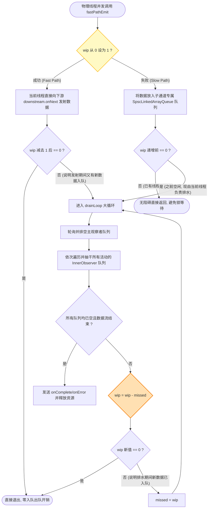
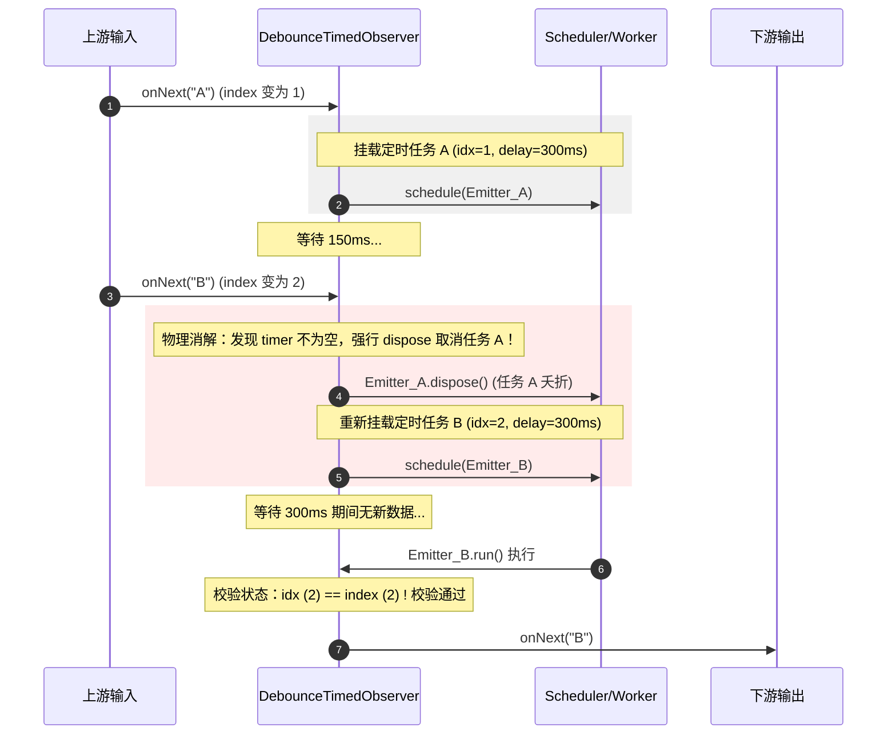

# RxJava 常用操作符源码级深度解剖

在 Android 异步与响应式编程中，RxJava（以 RxJava 2.x/3.x 为代表）作为经典的响应式开发框架，其最为强大的武器便是极其丰富的**操作符（Operators）**。操作符不仅是数据加工的工具，更是响应式编程声明式编排的精髓所在。

本篇文章将自底向上、由浅入深，从宏观的设计哲学与响应式规范开始，层层深入到核心操作符（`map`、`flatMap`、`zip`、`merge`、`debounce`）的源码内部。我们将透视它们的多线程协作机制、无锁队列设计、自旋漏斗排水算法（Drain Loop）以及状态机转换闭环，并最终通过一份模拟 RxJava `drain` 模型的 Java 简易示例，彻底理清响应式流底层高性能运行的基石。

---

## 一、 RxJava 操作符的设计哲学与架构基石

响应式编程（Reactive Programming）的核心在于：**将数据流视为随时间推移而产生的一系列事件，并以推（Push）模式将这些事件传递给订阅者。** 在这一体系中，操作符是数据管道的节点，承载了数据变换、时序控制和并发调度等核心职责。

### 1. 响应式流规范与 RxJava 体系的映射

在深入讨论 RxJava 具体操作符之前，必须首先理清其背后的**响应式流规范（Reactive Streams Specification）**。该规范定义了四个最核心的接口，它们构成了响应式流的物理骨架：
1. **`Publisher<T>`（发布者）**：负责产生数据，并根据订阅者的请求，向订阅者推送数据。
2. **`Subscriber<T>`（订阅者）**：负责接收和处理数据。
3. **`Subscription`（订阅令牌）**：连接发布者与订阅者的纽带，订阅者通过它来请求数据（`request(long n)`）或取消订阅（`cancel()`）。
4. **`Processor<T, R>`（处理器）**：既是发布者又是订阅者，代表了中间的数据处理单元，这正是各种中间操作符的抽象载体。

在 RxJava 中，对于不支持背压（Backpressure）的流，使用的是 `Observable` / `Observer` 体系；而对于严格遵循响应式流规范、支持背压的流，使用的是 `Flowable` / `Subscriber` 体系。虽然两者在背压控制上有所区别，但它们在操作符的底层编排逻辑、装饰器模型以及多线程并发协调机制上是一脉相承的。

### 2. 异步数据流的对偶性数学模型

响应式流规范的核心设计建立在数学上的**对偶性（Duality）**基础之上。具体而言，就是 **`Iterator`（迭代器模式）** 与 **`Observable`（观察者模式）** 的对偶。

在 Java 的传统集合操作中，`Iterator` 是一种典型的 **拉（Pull）** 模型：
* 消费者拥有控制权：消费者通过主动调用 `hasNext()` 询问是否有新元素，并通过 `next()` 拉取数据。
* 这种方式是阻塞的、同步的：如果数据源尚未准备就绪（例如等待网络响应），当前线程必须挂起等待。

与此相对，`Observable` 则是典型的 **推（Push）** 模型：
* 生产者拥有控制权：生产者在数据准备就绪后，主动调用观察者的 `onNext(T)` 将数据推给消费者。
* 边界与结束信号同样实现了对偶：`Iterator` 通过抛出 `NoSuchElementException` 表达异常，或通过 `hasNext() == false` 表达结束；而在 `Observable` 中，这些状态被优雅地抽象为一等公民信号——`onError(Throwable)` 和 `onComplete()`。

| 特性 | 迭代器模式 (Pull 模型) | 观察者模式 (Push 模型) |
| :--- | :--- | :--- |
| **获取数据方式** | `T next()` (主动拉取) | `onNext(T)` (被动接收推送) |
| **判定是否有数据** | `boolean hasNext()` | 隐式触发，无新元素则不调用 `onNext` |
| **错误处理** | 抛出 `Exception` (当前线程捕获) | 异步回调 `onError(Throwable)` |
| **结束信号** | `hasNext()` 返回 `false` | 异步回调 `onComplete()` |

这种 Push 模型在 Android UI 开发及网络并发中具有天然的优势：UI 渲染和网络回调都是天生的“被动接收事件”场景，Push 模型完美契合了这一物理现实，使我们能以非阻塞的方式构建高吞吐量应用。

同时，我们也要注意 RxJava 操作符与 Java 8 `Stream`、Kotlin `Flow` 的设计差异：
* **Java 8 Stream**：主要用于一维集合的同步拉取计算，不支持时间轴上的操作符（如防抖、采样），且属于一次性消费流，无法重复订阅。
* **Kotlin Flow**：基于协程挂起机制，属于冷流。它在语法上比 RxJava 更简洁，但 RxJava 在底层对无锁并发队列熔合、细粒度多路复用排水（Drain）的极致优化，使其在极高频的响应式管道流转中依然拥有无与伦比的吞吐量表现。

### 3. 为什么响应式流的核心是操作符？

在传统的命令式编程中，如果需要处理一系列异步任务，通常需要编写大量且零散的回调（Callback），并在多个回调中手动管理线程切换、异常捕获以及生命周期的释放。这种方式会带来三个致命的工程痛点：
* **回调地狱**：嵌套的异步调用使得代码逻辑支离破碎，难以阅读和维护。
* **线程安全隐患**：在多线程并发环境中，手动同步数据极易导致竞态条件（Race Conditions）、死锁（Deadlocks）或者数据状态不一致。
* **生命周期失控**：如果在异步任务执行过程中，Android 组件（如 Activity/Fragment）已经被销毁，而后台任务依然在运行，便会发生内存泄漏（Memory Leak）甚至组件空指针异常（NPE）。

操作符的设计初衷，就是为了将“数据源”、“变换逻辑”和“目标消费者”彻底解耦：
1. **声明式编排（Declarative Composition）**：操作符允许开发者以“写出什么，就是什么”的声明式风格，把复杂的异步处理链路串联起来。从最初的数据生成，到中间的多级映射、过滤、并发聚合，最终至 UI 渲染，全部由链式操作符贯穿。
2. **时空维度的统一塑形**：普通的函数只能进行空间维度的转换（将类型 A 映射为类型 B），而 RxJava 操作符不仅能在空间上映射，还能在时间上进行重新编排（例如延迟发射 `delay`、周期性发射 `interval`、时序防抖 `debounce` 等）。它将“什么时候发射数据”与“数据变换成什么样”高度整合。
3. **并发细节的物理封装**：操作符隐藏了复杂的底层线程管理（如 `Executor`、`Handler` 的读写与调度），开发者只需通过 `subscribeOn` 与 `observeOn` 操作符，就能精细化控制整条流水线在各个环节所运行的物理线程。

### 4. 装饰器模式与观察者模式的双剑合璧

RxJava 的整体订阅与事件流转机制可以高度概括为：**利用装饰器模式在“订阅期”自下而上构建订阅链；利用观察者模式在“运行期”自上而下传递事件流。**

#### 4.1 订阅期（Subscription Phase）的“逆源而上”
当我们在代码中写下如下链式调用时：
```java
Observable.just("1")
    .map(Integer::parseInt)
    .subscribe(observer);
```
在调用 `subscribe(observer)` 之前，其实**没有任何数据开始发射**。在这一刻，RxJava 正在使用**装饰器模式（Decorator Pattern）**将各个操作符节点层层包装：
1. `Observable.just("1")` 返回一个包装类 `ObservableFromArray`（或 `ObservableJust`）。
2. 调用 `.map(Integer::parseInt)`，实际上是将前一步的 `ObservableFromArray` 作为源（`source`），包装成一个新的 `ObservableMap` 对象。
3. 当且仅当最终调用 `.subscribe(observer)` 时，订阅动作才真正被触发。此时，订阅请求会沿着这条链路**自下而上（逆源而上）**传递：
   * `ObservableMap` 的 `subscribeActual(observer)` 被调用，它会创建一个 `MapObserver`（装饰器 Observer），并将下游的 `observer` 包装进去。
   * 接着，它调用上游源 `source.subscribe(new MapObserver(observer))`。
   * 这个过程一直向上追溯，直到链条的最顶端（源头 `Observable`），源头 `Observable` 在其 `subscribeActual` 中真正启动数据发射源（例如启动定时器、发起网络请求或发射静态数据）。

#### 4.2 运行期（Execution Phase）的“顺流而下”
当源头 Observable 开始产生数据后，事件便沿着刚才建立的观察者包装链，**自上而下（顺流而下）**依次传递。每一个操作符对应的 Observer 在收到 `onNext()` 事件时，都会执行其特定的业务逻辑（例如 `map` 执行函数式转换、`filter` 执行条件过滤），并将处理后的数据继续向下游的 `Observer` 传递。

这个双向传递的拓扑结构可以用下图直观表示：

```mermaid
graph TD
    %% 订阅期（自下而上）
    subgraph 订阅期: 自下而上构建链条 (subscribeActual)
        ObsConsumer["下游观察者: downstream (Observer)"] -->|subscribe| ObsMap["装饰器 ObservableMap"]
        ObsMap -->|source.subscribe| ObsSource["源头 Observable (如 ObservableJust)"]
    end

    %% 运行期（自上而下）
    subgraph 运行期: 自上而下传递事件 (onNext)
        ObsSource -->|onNext: '1'| MapObs["包裹类 MapObserver"]
        MapObs -->|mapper.apply 转换为 1| ObsConsumer
    end
    
    style ObsConsumer fill:#e1f5fe,stroke:#039be5,stroke-width:2px
    style ObsMap fill:#fff9c4,stroke:#fbc02d,stroke-width:2px
    style ObsSource fill:#ffe0b2,stroke:#f57c00,stroke-width:2px
    style MapObs fill:#e8f5e9,stroke:#388e3c,stroke-width:2px
```

通过这种设计，RxJava 的生命周期得到了极其严密的控制：当我们在最下游调用 `Disposable.dispose()` 时，取消信号同样会沿着这条链路**逆源而上**逐层传递，最终切断最顶层的数据发射，避免了任何多余的 CPU 与内存损耗。

---

## 二、 核心操作符源码级深度解剖

下面我们针对 `map`、`flatMap`、`zip`、`merge`、`debounce` 这五个最核心的操作符，进行源码层面的深度解剖。

### 1. map（一对一同步映射）：零开销的极速转换

`map` 操作符是整个 RxJava 中最常用、最纯粹的转换操作符。它接受一个函数式接口 `Function<? super T, ? extends U>`，负责将上游发射的类型 `T` 原地转换为下游的类型 `U`。

#### 1.1 订阅阶段的源码逻辑
当我们调用 `observable.map(mapper)` 时，RxJava 会实例化一个 `ObservableMap` 对象：

```java
// io.reactivex.internal.operators.observable.ObservableMap
public final class ObservableMap<T, U> extends AbstractObservableWithUpstream<T, U> {
    final Function<? super T, ? extends U> function;

    public ObservableMap(ObservableSource<T> source, Function<? super T, ? extends U> function) {
        super(source); // 持有上游 Observable 数据源
        this.function = function; // 转换函数
    }

    @Override
    public void subscribeActual(Observer<? super U> t) {
        // 创建 MapObserver 包装下游真正的观察者 t，并订阅上游数据源
        source.subscribe(new MapObserver<T, U>(t, function));
    }
}
```

从源码中可以看出，`ObservableMap` 只是一个普通的装饰类，在订阅发生时通过 `source.subscribe` 将刚才实例化的 `MapObserver` 作为观察者传递给上游。

#### 1.2 运行阶段的同步转换与异常处理
`MapObserver` 是一个继承自 `BasicFuseableObserver` 的内部静态类，其核心驱动力在于 `onNext()` 方法的实现：

```java
// io.reactivex.internal.operators.observable.ObservableMap.MapObserver
static final class MapObserver<T, U> extends BasicFuseableObserver<T, U> {
    final Function<? super T, ? extends U> mapper;

    MapObserver(Observer<? super U> actual, Function<? super T, ? extends U> mapper) {
        super(actual); // 调用基类，将下游观察者保存到 downstream 成员变量中
        this.mapper = mapper;
    }

    @Override
    public void onNext(T t) {
        if (done) {
            return;
        }

        // 熔合模式判断：如果是队列熔合模式，则跳过常规 of onNext
        if (sourceMode != NONE) {
            downstream.onNext(null);
            return;
        }

        U v;
        try {
            // 原地同步调用函数式接口，执行映射转换
            v = Objects.requireNonNull(mapper.apply(t), "The mapper function returned a null value.");
        } catch (Throwable ex) {
            // 异常自愈/保护机制：如果用户传入的映射逻辑抛出异常，迅速捕获并中断数据流
            fail(ex);
            return;
        }
        
        // 将映射转换后的值传递给下游
        downstream.onNext(v);
    }
}
```

#### 1.3 核心设计要点分析
1. **原地同步调用与零线程开销**：
   在 `MapObserver.onNext()` 内部，转换方法 `mapper.apply(t)` 被设计在**当前线程**同步执行。此处没有任何线程切换，没有使用任何线程锁，更没有数据缓冲队列。它仅仅是一次非常快速的方法调用（仅占用当前的物理栈帧），性能开销极低。
2. **队列熔合（Queue Fusion）机制**：
   `MapObserver` 继承自 `BasicFuseableObserver`。在 RxJava 的架构中，如果相邻的操作符都支持队列熔合，那么它们在订阅时会通过特定的协议，共享同一个底层的数据队列，而不是在各个操作符边界频繁地调用 `onNext()` 进行数据推送。这样可以极大地减少在管道级传递数据时的调用栈深度和方法分派开销。
3. **防御性编程与异常状态流转**：
   如果 `mapper.apply(t)` 抛出了非受检异常（例如 `NullPointerException` 或 `ArithmeticException`），`MapObserver` 会立即调用 `fail(ex)` 方法。`fail` 方法在底层会先调用 `upstream.dispose()` 取消对上游的订阅，保证数据源停止发射，紧接着调用下游的 `downstream.onError(ex)` 将异常传递下去。这种完善的异常防御体系，是响应式流能够在各种边界情况下保持内存安全、防止系统崩溃的重要保证。

---

### 2. flatMap（一对多异步铺平）：高并发与无序发射的洪流

相比于 `map` 操作符的原地同步一对一转换，`flatMap` 则是一对多的异步转换大师。它接受一个 `Function<? super T, ? extends ObservableSource<? extends R>>` 函数，将上游的每个元素映射成一个**独立的 Observable**，然后把这些独立的子 Observable 产生的元素“扁平化（Flatten）”地合并到同一个输出流中。

#### 2.1 为什么 flatMap 必须是异步且无序的？
在真实的 Android 开发中，我们经常遇到如下需求：上游发射一系列用户 ID，每个 ID 都需要发起一次网络请求以拉取用户的详细信息。
* 如果这些网络请求是并发发起的，因为各个请求在物理网络上的延迟不同，先发起的请求不一定会先返回结果。
* `flatMap` 内部的主观察者（`MergeObserver`）只要发现任何一个网络请求子流返回了数据，便会立刻将数据发射给下游，这就是它**异步且无序**的本质。
* 如果为了有序而必须等待前一个请求返回，那么系统就会被迫退化为串行等待，并发吞吐量将大打折扣。因此，`flatMap` 为了换取极致的并发吞吐性能，选择了无序的设计。

#### 2.2 核心驱动器：主观察者与子观察者的双重架构
`ObservableFlatMap` 的核心设计是由一个 **`MergeObserver`（主观察者）** 与多个 **`InnerObserver`（子/副观察者）** 协同工作。
* **`MergeObserver`**：订阅上游数据源，负责接收上游元素并使用 `mapper` 将它们转换成一个个独立的 `ObservableSource`，然后为每一个子 Observable 关联一个 `InnerObserver` 并订阅它。
* **`InnerObserver`**：具体的子流监听器。当对应的子流发射元素时，它会拦截这些元素，并协调汇报给主观察者。

我们来看 `MergeObserver` 的成员结构，它包含了一个原子性的 `InnerObserver` 数组引用，用于在多线程环境下无锁地增加或移除子流：

```java
// io.reactivex.internal.operators.observable.ObservableFlatMap.MergeObserver
static final class MergeObserver<T, R> extends AtomicInteger implements Disposable, Observer<T> {
    final Observer<? super R> downstream;
    final Function<? super T, ? extends ObservableSource<? extends R>> mapper;
    
    // 用原子引用管理活动的 InnerObserver 数组，以支持高并发的动态增删
    final AtomicReference<InnerObserver<?, ?>[]> observers;
    
    // 数组边界常量，避免不必要的 null 检查
    static final InnerObserver<?, ?>[] EMPTY = new InnerObserver[0];
    static final InnerObserver<?, ?>[] CANCELLED = new InnerObserver[0];

    // 核心工作状态计数器 (Work In Progress)，这是实现 drain() 漏斗排水算法的灵魂
    final AtomicInteger wip = new AtomicInteger();
    
    // 主观察者的全局缓存队列（当上游发射元素非常快，或者子流在 fastPath 失败时暂存数据）
    SimpleQueue<R> queue;
    
    // 最大并发阈值（maxConcurrency）控制，限制同时活动的子流上限
    final int maxConcurrency;
    // 缓存上游尚未订阅的 Observable 队列，当超出 maxConcurrency 时起作用
    SimpleQueue<T> sources;
    
    // 延迟异常（delayErrors）管理器，在子流发生错误时是否延迟到最后才抛出
    final boolean delayErrors;
    final AtomicThrowable errors = new AtomicThrowable();
    
    // 活动的子观察者物理计数器，在加锁并发控制中使用
    int activeCount;
    // 唯一的子流 ID 生成器，每次订阅子流时自增
    long uniqueId;
    
    // ...
}
```

当上游发射一个数据项 `T` 时，`MergeObserver` 的 `onNext()` 被触发：
```java
@Override
public void onNext(T t) {
    if (done) return;
    ObservableSource<? extends R> p;
    try {
        // 1. 将上游的数据项映射为子 Observable 资源
        p = Objects.requireNonNull(mapper.apply(t), "The mapper returned a null ObservableSource");
    } catch (Throwable e) {
        fail(e);
        return;
    }

    // 2. 并发数控制：如果当前活动子流数已达上限，则将上游元素缓存进 sources 队列中挂起
    if (maxConcurrency != Integer.MAX_VALUE) {
        synchronized (this) {
            if (activeCount >= maxConcurrency) {
                sources.offer(t);
                return;
            }
            activeCount++; // 活动子流计数自增
        }
    }

    subscribeToInner(p);
}

void subscribeToInner(ObservableSource<? extends R> p) {
    // 3. 创建 InnerObserver，并分配一个全局唯一的 uniqueId
    InnerObserver<T, R> inner = new InnerObserver<T, R>(this, uniqueId++);
    
    // 4. 将 InnerObserver 添加到 observers 数组中（通过 CAS 无锁操作保证多线程添加的安全）
    if (addInner(inner)) {
        // 5. 订阅该子流，使当前子流产生的事件被当前 InnerObserver 监听
        p.subscribe(inner);
    }
}
```

其中 `addInner(inner)` 实现了基于 CAS 的 Copy-On-Write 无锁数组扩容：
```java
boolean addInner(InnerObserver<T, R> inner) {
    for (;;) {
        InnerObserver<?, ?>[] a = observers.get();
        if (a == CANCELLED) {
            return false;
        }
        int n = a.length;
        InnerObserver<?, ?>[] b = new InnerObserver[n + 1];
        System.arraycopy(a, 0, b, 0, n);
        b[n] = inner;
        // 使用 CAS 尝试更新数组引用，若失败则自旋重试
        if (observers.compareAndSet(a, b)) {
            return true;
        }
    }
}
```

而在子流正常完成或异常退出时，需要将其从活动数组中安全剔除。`removeInner(inner)` 同样使用了 CAS 无锁拷贝机制：
```java
void removeInner(InnerObserver<T, R> inner) {
    for (;;) {
        InnerObserver<?, ?>[] a = observers.get();
        int n = a.length;
        if (n == 0) {
            return;
        }
        int j = -1;
        // 遍历寻找当前 InnerObserver 的索引位置
        for (int i = 0; i < n; i++) {
            if (a[i] == inner) {
                j = i;
                break;
            }
        }
        if (j < 0) {
            return;
        }
        InnerObserver<?, ?>[] b;
        if (n == 1) {
            b = EMPTY;
        } else {
            b = new InnerObserver[n - 1];
            System.arraycopy(a, 0, b, 0, j);
            System.arraycopy(a, j + 1, b, j, n - j - 1);
        }
        // CAS 更新，保证在并发环境下移除的线程安全，避免内存泄露
        if (observers.compareAndSet(a, b)) {
            return;
        }
    }
}
```

#### 2.3 漏斗排水算法（drain()）与无锁队列机制
在多线程高并发环境下，各个 `InnerObserver` 随时可能在不同的物理线程（例如不同的后台网络请求回调线程）中并发回调 `onNext(R value)`。
根据 Reactive Streams 响应式规范，**绝对不允许在多个物理线程中并发地调用下游观察者的 `onNext`/`onError`/`onComplete` 接口**。
为了实现无锁的高吞吐线程串行化输出，RxJava 设计了极为精妙的 **“漏斗排水算法 (Drain Loop)”** 与 **`SpscLinkedArrayQueue`（单生产者单消费者无锁队列）**。

##### 2.3.1 排水的物理模型比喻
我们可以把多线程并发的数据流入比作“暴雨”。各个子线程都在疯狂地向属于自己通道的“水桶”（Spsc 队列）中灌水。如果让这些水桶直接向下游倾倒，必定会产生并发冲突（多线程安全问题）。
* `wip` 原子计数器就是漏斗最底部的闸门（阀门）。
* 任何一个生产线程在把数据倒入水桶后，都会试图去拉一下这个阀门（原子性的 `getAndIncrement`）。
* 如果阀门此时是空闲的（`wip` 从 0 变成 1），那么这个线程就会晋升为唯一的**“排水工”**。它将负责把所有水桶（所有子队列和主队列）里的水统统抽干，并串行地排给下游。
* 如果发现阀门已经有人在拉了（`wip > 0`），那么该线程只需要把数据丢进水桶就可以直接返回，无需在原地干等，因为当前那个唯一的“排水工”线程在扫尾时会一并把这些新加入的水抽干。

##### 2.3.2 快轨发射（Fast Path Emit）的优化
如果当前没有线程竞争，数据可以直接被发射，这在 RxJava 中被称为 **Fast Path**：
```java
void fastPathEmit(U value, InnerObserver<T, U> inner) {
    // CAS 尝试将 wip 从 0 修改为 1。如果成功，说明当前没有其它线程在干活
    if (get() == 0 && compareAndSet(0, 1)) {
        // 当前线程直接无锁地将数据发射给下游，彻底避开了队列入队/出队开销！
        downstream.onNext(value);
        if (decrementAndGet() == 0) {
            // 扣减成功后，如果在此期间没有其它线程在 wip 上累加，直接收工返回
            return;
        }
        // 如果在发射期间，有其他线程并发调用了 getAndIncrement()，
        // 说明在此期间又产生了新数据，当前线程必须留下来，强制进入 drainLoop() 大循环扫尾
        drainLoop();
    } else {
        // 慢轨：没抢到发射权的线程，只能将数据写入自己 InnerObserver 内部的 Spsc 队列中
        SimpleQueue<U> q = inner.queue;
        if (q == null) {
            q = new SpscLinkedArrayQueue<U>(bufferSize);
            inner.queue = q;
        }
        q.offer(value);
        
        // 触发 drainLoop()。注意：如果 wip 原来就不为 0，说明当前已有别的线程在进行大循环，
        // 这里仅仅 getAndIncrement() 累加 wip 计数，然后线程直接退出，不发生任何锁等待！
        if (getAndIncrement() != 0) {
            return;
        }
        drainLoop();
    }
}
```

##### 2.3.3 自旋排水大循环：drainLoop() 源码解密
```java
void drainLoop() {
    final Observer<? super R> child = this.downstream;
    int missed = 1; // 标记我们在当前循环中积攒的任务代际

    for (;;) {
        // 校验状态：如果当前订阅已被取消或出错了，立刻退出并清空所有队列
        if (checkTerminate()) {
            return;
        }

        // 1. 首先排空主观察者持有的全局队列中的数据（如果有的话）
        SimpleQueue<R> svq = queue;
        if (svq != null) {
            for (;;) {
                if (checkTerminate()) return;
                R o = svq.poll();
                if (o == null) break;
                child.onNext(o);
            }
        }

        // 2. 依次轮询所有的 InnerObserver 的队列，将其中的数据排空发射
        boolean d = done; // 上游是否已经发射完毕
        InnerObserver<?, ?>[] as = observers.get();
        int n = as.length;

        for (int i = 0; i < n; i++) {
            InnerObserver<T, R> inner = (InnerObserver<T, R>)as[i];
            if (checkTerminate()) return;

            SimpleQueue<R> q = inner.queue;
            if (q != null) {
                // 将该子流队列中的所有数据全部抽干并串行发射给下游
                for (;;) {
                    if (checkTerminate()) return;
                    R o = q.poll();
                    if (o == null) {
                        break; // 当前通道抽干了，跳出，继续轮询下一个通道
                    }
                    child.onNext(o);
                }
            }

            // 判断子流是否已经结束
            boolean innerDone = inner.done;
            SimpleQueue<R> innerQueue = inner.queue;
            if (innerDone && (innerQueue == null || innerQueue.isEmpty())) {
                removeInner(inner); // 移除已经完成使命的子流
                if (checkTerminate()) return;
            }
        }

        // 4. 最大并发阈值（maxConcurrency）的扫尾补仓逻辑
        // 如果当前活动的子流数由于刚才的 removeInner 而下降，且 sources 队列中还有挂起的数据，
        // 那么在此处拉出挂起的元素，转换成新子流并进行订阅。
        if (maxConcurrency != Integer.MAX_VALUE && !done) {
            T nextSource;
            synchronized (this) {
                nextSource = sources.poll();
                if (nextSource == null) {
                    activeCount--;
                }
            }
            if (nextSource != null) {
                subscribeToInner(mapper.apply(nextSource));
            }
        }

        // 5. 核心并发退出与自愈判定
        // missed 初始为 1。如果在我们这次 drainLoop 的期间，又有其他物理线程并发向队列 offer 了数据，
        // 它们会调用 getAndIncrement()，使得 wip 的值变大。
        // 我们在此处进行 addAndGet(-missed).
        // 如果返回值等于 0，说明期间没有任何新的数据入队，任务全部扫尾干净，安全退出循环。
        // 如果返回值不等于 0，说明我们排水期间又来了新货，我们必须更新 missed 值为最新的 wip 状态，重新进行大循环！
        missed = addAndGet(-missed);
        if (missed == 0) {
            break;
        }
    }
}
```

整个 `MergeObserver` 对子通道的整合、Spsc 队列的读写以及 `drain` 漏斗排水算法的整体流转可以用以下时序流向图清晰地概括：



##### 2.3.4 delayErrors（异常延迟抛出）的物理机制
在 `flatMap` 执行过程中，任何一个子流都可能发生网络异常或数据格式化错误。
* 如果 `delayErrors` 为 `false`（默认情况），一旦子流发生异常，其对应的 `InnerObserver` 会调用 `parent.errors.addThrowable(ex)`。在 `drainLoop` 的每一次循环首部，都会调用 `checkTerminate` 检测该异常容器：
  ```java
  boolean checkTerminate() {
      if (cancelled) {
          return true;
      }
      Throwable e = errors.get();
      if (!delayErrors && (e != null)) {
          // 如果不延迟抛出且有错误，立即清空队列、dispose 掉所有子流，并抛出错误
          clearAll();
          downstream.onError(errors.terminate());
          return true;
      }
      return false;
  }
  ```
  这会导致整个 `flatMap` 管道瞬间终止，其余活动的子流也会被全部 `dispose` 掉。
* 如果 `delayErrors` 为 `true`，发生异常的子流会被安全移除，异常对象会被追加暂存到 `errors` 中。由于 `checkTerminate` 在未到达最终边界前不会拦截它，`drainLoop` 会坚持运行，继续排空其他正常子流的队列。直到所有的子流全部运行结束、上游源也发出 `onComplete` 时，`checkTerminate` 才会将暂存的所有异常打包（底层通过 CAS 自旋算法将多个异常包装为一个 `CompositeException`），通过 `downstream.onError(errors.terminate())` 一次性传递给下游。这种高容错性设计在需要“部分网络请求失败不影响整体页面展示”的 Android 场景下十分有用。

##### 2.3.5 SpscLinkedArrayQueue 的极致无锁优化
RxJava 在 flatMap 底层采用的 `SpscLinkedArrayQueue`（单生产者单消费者链式数组队列）具有极其优异的并发性能：
* **单生产单消费前提**：对任何一个 `InnerObserver` 而言，向队列 offer 数据（生产）的物理线程仅可能是对应的子流线程，而 poll 取出数据（消费）的线程仅可能是抢占到 `drainLoop` 执行权的唯一排水线程。因此它严格满足 SPSC 条件。
* **零锁（Lock-Free）设计**：由于是一对一的读写关系，队列内部不需要任何 `ReentrantLock` 或重量级的互斥同步锁。它完全通过 CAS 操作和内存屏障（内存可见性）来实现。
* **链式数组防止 GC 抖动**：它将“环形缓冲区数组（Circular Buffer）”与“链表（Linked List）”结合。默认使用固定大小的数组，当队列满时，它不会进行原地扩容拷贝（那会造成巨大的 GC 开销），而是直接分配一个新的数组，并将旧数组的尾部链接到新数组的头部，极大地减轻了 Android Runtime 下的垃圾回收压力。

#### 2.4 flatMap vs. concatMap vs. switchMap 微观逻辑与源码差异对比

这三个操作符在“将上游的一个元素转为多个元素的子流”这一行为上完全一致，但在**合并子流的策略**上存在本质差异：

##### 2.4.1 flatMap（无序合并）
* **微观逻辑**：上游的元素一经到达，立刻通过 `mapper` 转为子 Observable 展开订阅。多个子流**同时处于订阅且活动的状态**。
* **源码细节**：使用 `AtomicReference<InnerObserver[]>` 动态维护一个活动子观察者集合，在 `drainLoop` 中并发遍历。
* **适用场景**：多文件并发下载、并发查询多路 API 等。
* **性能代价**：若 `maxConcurrency` 设为 1，它在逻辑上等价于 `concatMap`，但是在物理实现上，它依然需要分配 `InnerObserver` 数组、执行数组 CAS 拷贝等，开销明显高于专门优化的 `concatMap`。

##### 2.4.2 concatMap（串行合并）
* **微观逻辑**：保证严格的顺序性。上游发射元素后，转换为子 Observable。只有当**当前子 Observable 完全发射完毕（收到 onComplete 信号）**之后，才会去订阅下一个子 Observable。
* **源码细节**：主观察者在 `onNext` 时仅仅将元素 offer 到一个单生产者多消费者的队列中。`drain()` 时每次只从队列拉取一个元素，创建 `ConcatMapInnerObserver` 订阅它，并将当前的 `wip` 状态设为活跃。当该 InnerObserver 回调 `onComplete` 时，会再次触发 `parent.drain()` 去队列里拉取下一个元素。
* **适用场景**：严格依赖前一步返回结果的串行化工作流（如网络请求 B 必须用请求 A 的结果，且多个请求需要顺序排队）。

##### 2.4.3 switchMap（只保留最新流）
* **微观逻辑**：排他性订阅。上游一旦发射了新元素，`switchMap` 会**立刻断开并 dispose 掉当前正在运行的旧子流**，并迅速创建和订阅新元素转换来的新子流。
* **源码细节**：主观察者持有一个原子性的子观察者引用 `AtomicReference<SwitchMapInnerObserver>`。在上游的 `onNext` 方法中，会执行如下 CAS 替换逻辑：
  ```java
  // 核心伪代码：一旦收到新元素，原子性替换并销毁旧的 InnerObserver
  SwitchMapInnerObserver<T, R> inner = new SwitchMapInnerObserver<>(this, ...);
  for (;;) {
      SwitchMapInnerObserver<T, R> current = active.get();
      if (current == CANCELLED) break;
      if (active.compareAndSet(current, inner)) {
          if (current != null) {
              current.dispose(); // 物理中断并取消旧流的连接！
          }
          break;
      }
  }
  ```
* **适用场景**：搜索联想输入框监听。用户在连续打字时，只要有新的字输入，就立刻切断上一次尚未返回结果的网络查询，防止旧请求的结果覆盖新请求的结果。

---

### 3. zip（多流对齐合并）：强同步的时空对齐器

`zip` 操作符用于将多个 Observable 发射的数据项，按照它们在各自流中的**物理索引位置**进行一对一对齐合并（例如：A 流的第 1 个与 B 流的第 1 个合并，A 流的第 2 个与 B 流的第 2 个合并）。

#### 3.1 ZipCoordinator 调度体系
`zip` 的合并逻辑主要依靠继承自 `AtomicInteger` 的 **`ZipCoordinator`（协调器）** 和 **`ZipObserver`（通道观察者）** 来完成。

```java
// io.reactivex.internal.operators.observable.ObservableZip.ZipCoordinator
static final class ZipCoordinator<T, R> extends AtomicInteger implements Disposable {
    final Observer<? super R> downstream;
    final Function<? super Object[], ? extends R> zipper;
    final ZipObserver<T, R>[] observers; // 各个子流的物理通道
    final T[] row; // 临时存放单次对齐合并的一行数据

    ZipCoordinator(Observer<? super R> actual, Function<? super Object[], ? extends R> zipper, int count, ...) {
        this.downstream = actual;
        this.zipper = zipper;
        this.observers = new ZipObserver[count];
        this.row = (T[])new Object[count];
    }
    
    // ...
}
```

每一个子流对应的 `ZipObserver` 都持有一个独立的 `SpscLinkedArrayQueue` 队列：
```java
// io.reactivex.internal.operators.observable.ObservableZip.ZipObserver
static final class ZipObserver<T, R> implements Observer<T> {
    final ZipCoordinator<T, R> parent;
    final SpscLinkedArrayQueue<T> queue; // 用于存储自己这条流中尚未被配对的元素
    volatile boolean done;
    Throwable error;

    ZipObserver(ZipCoordinator<T, R> parent, int bufferSize) {
        this.parent = parent;
        this.queue = new SpscLinkedArrayQueue<T>(bufferSize);
    }
    
    @Override
    public void onNext(T t) {
        queue.offer(t); // 收到数据先入队
        parent.drain(); // 触发协调器的对齐校验
    }
}
```

#### 3.2 对齐合并与消费逻辑的源码剖析
当任何一个通道的 `ZipObserver` 收到元素并入队后，都会触发 `ZipCoordinator.drain()` 进行全局扫描对齐：

```java
// ZipCoordinator.drain()
public void drain() {
    // 抢占 drain 锁机制，保证只有一个物理线程执行对齐发射
    if (getAndIncrement() != 0) {
        return;
    }

    final ZipObserver<T, R>[] zs = observers;
    final Observer<? super R> a = downstream;
    final T[] os = row;

    int missed = 1;

    for (;;) {
        for (;;) {
            int emptyCount = 0;
            int len = zs.length;
            
            // 1. 遍历所有通道，检查并提取头部未配对的元素
            for (int i = 0; i < len; i++) {
                if (os[i] == null) {
                    boolean d = zs[i].done;
                    T v = zs[i].queue.poll(); // 尝试出队一个元素
                    boolean empty = v == null;

                    // 状态校验，如果有通道结束了且队列为空，说明无法继续对齐，宣告 zip 结束
                    if (checkTerminated(d, empty, a, zs[i])) {
                        return;
                    }

                    if (!empty) {
                        os[i] = v; // 将元素填充入 row 数组中对应的通道槽位
                    } else {
                        emptyCount++; // 标记此通道元素未就绪
                    }
                }
            }

            // 2. 只要 emptyCount > 0，说明存在某个通道的对齐元素还未到达，无法 zip，跳出内层循环等待下一次
            if (emptyCount > 0) {
                break;
            }

            // 3. 此时所有通道的对齐位置都有了可用元素，执行 zipper 函数进行合并
            R r;
            try {
                r = Objects.requireNonNull(zipper.apply(os.clone()), "The zipper returned a null value");
            } catch (Throwable ex) {
                Exceptions.throwIfFatal(ex);
                cancel();
                a.onError(ex);
                return;
            }

            // 4. 将合并后的值发射给下游
            a.onNext(r);

            // 5. 极其重要：发射完毕后，将 row 数组对应位置清空，说明这一组元素已经被彻底消费并销毁，有助于 GC 及时回收
            Arrays.fill(os, null);
        }

        // 6. 原子自旋锁扣减退出
        missed = addAndGet(-missed);
        if (missed == 0) {
            break;
        }
    }
}
```

`ZipCoordinator` 感知终止状态的 `checkTerminated` 逻辑细节如下：
```java
boolean checkTerminated(boolean d, boolean empty, Observer<? super R> a, ZipObserver<?, ?> source) {
    if (cancelled) {
        clear();
        return true;
    }
    if (d) {
        // 如果当前通道数据源已经发出 onComplete
        Throwable e = source.error;
        if (e != null) {
            cancel();
            a.onError(e); // 立即抛出错误
            return true;
        } else if (empty) {
            // 如果通道已结束，且队列为空，意味着无法再凑齐下一行 row 数据，整个 zip 正常终止
            cancel();
            a.onComplete();
            return true;
        }
    }
    return false;
}
```

在 `cancel()` 方法执行时，为了彻底防范内存泄露，`ZipCoordinator` 会调用 `clear()` 方法：
```java
void clear() {
    for (ZipObserver<?, ?> z : observers) {
        z.queue.clear(); // 强制清空每个子观察者队列中的积压元素，切断对象强引用
    }
}
```

#### 3.3 combineLatest 与 zip 的物理对比
在并发合并场景下，很多开发者容易混淆 `zip` 和 `combineLatest`。
* **`zip`（对齐咬合）**：严格按照索引号合并。如果 A 流发射了第 5 个元素，哪怕 B 流早已发射了 10 个元素，A 的第 5 个元素也只能与 B 的第 5 个元素合并。它像拉链一样，每个齿轮都有专属的咬合对象。
* **`combineLatest`（最新合并）**：不关心索引号。只要任何一个源产生新数据，它就会立刻把这个新数据与另外所有源的**最新发射值**进行合并并输出。它是一种“时间轴就近”的物理模型，常用于 Android 登录页面校验（当账号框输入或密码框输入发生改变时，立刻拿两者最新的文本进行校验以点亮登录按钮）。

#### 3.4 高并发多线程下的“队头阻塞”与内存溢出（OOM）防范
在真实的 Android 复杂网络或高频数据流场景下，`zip` 操作符极易引发**队头阻塞（Head-of-Line Blocking）**：
* 假设 A 流是一个极快的数据源（例如传感器数据，每 10 毫秒发射一个点）。
* B 流是一个极慢的数据源（例如由于网络抖动，30 秒才发射一个数据点）。
* 由于 `zip` 的强同步对齐机制，A 流产生的元素在 B 流的对应位置元素到来之前，是**绝对无法被 poll 出队消费并销毁**的。
* A 流的所有历史数据都会在 `ZipObserver[A]` 专属的 `SpscLinkedArrayQueue` 队列中疯狂堆积，导致内存急剧膨胀，最终引发 Java Virtual Machine 内存溢出（OOM）。

**工程防范措施**：
1. **时效控制**：对每一个 zip 源配置 `timeout`，一旦某个流在超时时间内未发射数据，主动抛出异常中止合并，释放已堆积的内存。
2. **限流降频**：对快速源使用 `sample`（采样）、`throttleFirst`（节流）或 `filter` 降频，减少入队压力。
3. **基于背压的 Flowable**：在合并大数据流时，弃用 `Observable.zip`，改用支持背压的 `Flowable.zip`，让慢源的接收速率反向限制快源的生产速度。

---

### 4. merge（多流并发交错合并）：多路复用分发

`merge` 操作符与 `zip` 的对齐逻辑完全相反，它负责将多个数据源的元素融合成一个单一的流，元素在输出流中完全是**乱序交错发射**的。

#### 4.1 多路复用分发与合并对比
在 RxJava 中，`merge` 与 `concat` 都是用来合并多个 Observable 的操作符，但逻辑逻辑大不相同：
* **`concat`**：串行合并。它会先订阅第一个 Observable，直到其发送 `onComplete` 后，才订阅第二个。因此它的合并结果在物理时序上是绝对分段有序的。
* **`merge`**：并行交错合并。它会同时订阅所有的 Observable，只要有数据到达，立刻分发，结果在时间轴上交错并行。

#### 4.2 典型 Android 应用场景
在 Android 冷启动或者数据刷新的最佳实践中，我们经常使用 `merge` 来合并**本地缓存流**与**网络请求流**：
```java
// 从本地数据库读取缓存（快），从网络拉取最新数据（慢）
Observable<List<Data>> cache = database.getData().subscribeOn(Schedulers.io());
Observable<List<Data>> network = api.getData().subscribeOn(Schedulers.io());

Observable.merge(cache, network)
    .observeOn(AndroidSchedulers.mainThread())
    .subscribe(dataList -> updateUI(dataList));
```
在这个场景中，本地缓存会率先通过 `merge` 发射出来渲染在界面上，随后网络请求数据返回，再次刷新界面。利用 `merge` 的多路复用无锁分发机制，我们仅用一行声明式代码，就完成了对用户体验极其友好的“缓存优先”冷启动展示逻辑。

---

### 5. debounce（时域防抖控制）：时序防抖与自愈状态机

`debounce`（防抖）操作符控制了流在时间轴上的分布。它规定：**上游发射一个元素后，如果在指定的时间间隔内没有新的元素发射，该元素才会被发射给下游；若在这段时间内有新元素发射，则前一个元素被静默丢弃，并以新元素为准重新开始计时。**

#### 5.1 核心状态与成员设计
`debounce` 强烈依赖底层的定时器（由 `Scheduler` 创建的 `Worker`）来追踪时间间隔。其核心实现类为 `DebounceTimedObserver`：

```java
// io.reactivex.internal.operators.observable.ObservableDebounceTimed.DebounceTimedObserver
static final class DebounceTimedObserver<T> extends AtomicReference<Disposable> 
        implements Observer<T>, Disposable {

    final Observer<? super T> downstream;
    final long timeout;
    final TimeUnit unit;
    final Scheduler.Worker worker;

    Disposable upstream;
    
    // 全局原子索引，标记当前最新到达的元素“代际/版本”
    volatile long index;
    
    // 用于保存当前处于活动状态的定时器句柄
    final AtomicReference<Disposable> timer = new AtomicReference<Disposable>();

    DebounceTimedObserver(Observer<? super T> actual, long timeout, TimeUnit unit, Scheduler.Worker worker) {
        this.downstream = actual;
        this.timeout = timeout;
        this.unit = unit;
        this.worker = worker;
    }
    
    // ...
}
```

#### 5.2 自愈状态机的工作闭环分析
当一个新的数据项到达时，`DebounceTimedObserver` 每次都在 `onNext()` 中进行定时任务的“斩断与重建”：

```java
@Override
public void onNext(T t) {
    if (done) return;

    // 1. 递增全局 index 版本号，代表产生了最新的一代数据项
    long idx = index + 1;
    index = idx;

    // 2. 物理消解：获取当前的定时器 Disposable 并执行 dispose
    Disposable d = timer.get();
    if (d != null) {
        // 如果旧的定时任务还没执行，直接将其取消（Dispose）！
        // 这就实现了“在指定时间内有新数据来，前一个数据就被吞掉”的物理防抖效果
        d.dispose();
    }

    // 3. 创建一个新的定时器任务（DebounceEmitter），它包含了当前这一代的 idx 标志
    DebounceEmitter<T> de = new DebounceEmitter<T>(t, idx, this);
    
    // 4. 通过 CAS 将当前定时器任务设置到 timer 原子引用中
    if (timer.compareAndSet(d, de)) {
        // 5. 由 Scheduler 定时在 timeout 延迟后执行任务 de
        Disposable disposable = worker.schedule(de, timeout, unit);
        de.setResource(disposable);
    }
}
```

当定时器在物理时间轴上到期，并在后台物理线程中执行时，会触发 `DebounceEmitter.run()`，进而调用 `parent.emit()` 进行防抖状态自愈校验：
```java
// DebounceTimedObserver.emit()
void emit(long idx, T value, DebounceEmitter<T> emitter) {
    // 状态自愈校验的核心：
    // 判断定时器到期执行时，这个任务持偷的 idx 是否依然等于最新的 parent.index？
    // 如果等于，说明这期间没有新的数据产生（没有调用 onNext 刷大 index），防抖校验通过！
    if (idx == index) {
        downstream.onNext(value);
        emitter.dispose(); // 清理当前定时器
    }
    // 如果不等于，说明在这期间有更年轻的元素来到了，这个老任务已经宣告“过期”，直接被静默抛弃！
}
```

#### 5.3 扫尾发射与资源释放安全
在响应式流即将关闭（`onComplete`）时，有可能最后一个数据项刚刚被 `onNext` 发射，其定时防抖任务还在计时器中运行，尚未通过 `timeout` 检验。
按照逻辑，此时管道必须将这最后一个数据项予以输出，不能将其遗漏。`DebounceTimedObserver` 在 `onComplete()` 中设计了优雅的扫尾机制：
```java
@Override
public void onComplete() {
    if (done) {
        return;
    }
    done = true;

    Disposable d = timer.get();
    if (d != null) {
        d.dispose(); // 销毁正在跑的定时器
    }

    // 强制执行扫尾发射
    DebounceEmitter<T> de = (DebounceEmitter<T>)d;
    if (de != null) {
        de.run(); // 原地手动触发一次 run()，这会绕过延时直接调用 downstream.onNext(value)
    }
    
    downstream.onComplete();
    worker.dispose(); // 彻底关闭后台物理 Worker 线程，防止资源泄漏
}
```

#### 5.4 结合 Android Looper/Handler 物理时域流转
当我们在 Android 中配合 `AndroidSchedulers.mainThread()` 使用 `debounce` 时：
1. `onNext()` 被触发，向 `HandlerScheduler` 申请在主线程执行 `DebounceEmitter` 定时任务。
2. 调度器底层会向主线程的 `MessageQueue` 中发送一条带有延迟（`uptimeMillis`）的 `Message`。
3. 如果此时用户快速输入了下一个字符，`onNext()` 会再次触发，立即调用上一个定时任务的 `dispose()`。
4. `dispose()` 底层会调用 `Handler.removeCallbacksAndMessages(runnable)` 迅速撤销主线程消息队列里的前一个 Message。
5. 这一过程保证了主线程的 `MessageQueue` 不会因为用户的高频输入而堆积大量过期的延时回调，极大地保障了 Android 渲染主线程的流畅度。

整个防抖的时序周期可以用以下时钟挂载与 dispose 销毁的时空流转图直观展现：



#### 5.5 核心设计亮点分析
在整个 `debounce` 的高频触发过程中，RxJava **完全没有使用 `Thread.sleep` 或任何重量级的线程同步阻塞原语**。
它将极其复杂的“防抖时间控制”抽象为了一个**“单调递增的代际版本号校验状态机（Index Versioning State Machine）”**。
通过原子引用 `timer` 进行老定时器的快速 dispose，并在任务到期时做原地无锁的值比对（`idx == index`），在极轻开销的并发语境下实现了高度可靠的时域防抖。

---

## 三、 仿 RxJava 漏斗排水算法（drain()）Java 简易示例

为了让大家更加直观地理解 `flatMap` 等操作符底层最为核心 of `drain()` 漏斗排水算法，本节提供了一份使用纯 Java 编写的简易版 `drain` 模型示例。

本示例模拟了如下场景：**多条物理线程（并发源）同时且无序地向一个处理器发送数据，处理器在无锁（Lock-Free）环境下，确保所有数据能够被安全、不重不漏、单线程有序地发射给下游消费者。**

### 1. 简易漏斗排水模型源码

```java
package rx.sim;

import java.util.Queue;
import java.util.concurrent.ConcurrentLinkedQueue;
import java.util.concurrent.ExecutorService;
import java.util.concurrent.Executors;
import java.util.concurrent.TimeUnit;
import java.util.concurrent.atomic.AtomicInteger;

/**
 * 模拟 RxJava 经典无锁自旋漏斗排水模型（Drain Loop）
 */
public class RxDrainDemo {

    // 模拟下游消费者
    public interface Downstream<T> {
        void onNext(T value);
    }

    // 核心流处理器
    public static class FlowProcessor<T> {
        private final Downstream<T> downstream;
        
        // 存储并发数据的无锁队列 (模拟 RxJava 的 Spsc 队列，为保证线程安全此处使用 ConcurrentLinkedQueue)
        private final Queue<T> queue = new ConcurrentLinkedQueue<>();
        
        // 核心工作状态计数器 (Work In Progress)
        // 0: 空闲，没有线程在排水
        // >0: 活跃，当前有线程在排水，或者有新的排队任务需要处理
        private final AtomicInteger wip = new AtomicInteger();

        public FlowProcessor(Downstream<T> downstream) {
            this.downstream = downstream;
        }

        /**
         * 供各条物理并发线程调用的发射入口
         */
        public void offer(T value) {
            // 1. 将数据无锁放入队列中
            queue.offer(value);
            System.out.println("[" + Thread.currentThread().getName() + "] 生产数据: " + value + "，入队");

            // 2. 触发 drain 排水。
            // getAndIncrement() 会原子性地给 wip 加 1，并返回加之前的旧值。
            // 如果旧值等于 0，说明当前没有任何线程在排水（FlowProcessor 处于空闲状态）。
            // 此时，当前这个线程将“荣升”为唯一的排水工，负责排空队列；
            // 如果旧值大于 0，说明目前已经有某个线程正在 drainLoop 内部执行排水，
            // 当前线程便可洒脱地直接 return，无需阻塞，因为正在排水的那个线程会顺便把我们刚才 offer 的数据排空！
            if (wip.getAndIncrement() == 0) {
                drainLoop();
            }
        }

        /**
         * 唯一的排水通道，同一时间只允许一个线程进入此循环
         */
        private void drainLoop() {
            System.out.println(">>> [" + Thread.currentThread().getName() + "] 成功抢占锁，晋升为【唯一排水工】");
            
            // missed 代表在此次排水循环期间，被我们漏掉的并发请求次数
            int missed = 1;

            for (;;) {
                // 1. 排空队列中的所有数据
                T item;
                while ((item = queue.poll()) != null) {
                    // 安全地向下游发射数据。在此处，无论多少线程并发 offer，
                    // downstream.onNext 都绝对只会在当前这个唯一的“排水工”线程中串行被调用！
                    downstream.onNext(item);
                }

                // 2. 自旋锁释放与校验逻辑。
                // 我们在开始 drainLoop 时 missed=1，说明我们至少处理了 1 次任务。
                // 此时我们调用 wip.addAndGet(-missed)。
                // 如果在我们忙着 poll() 排水的期间，没有其它物理线程并发调用 offer()，
                // 那么 wip 的值依然为 1，减去 missed 后 wip 变为 0。
                // addAndGet 此时返回 0，代码直接退出循环，恢复空闲状态。
                //
                // 如果在排水期间，有其他线程并发 offer 了数据，它们会调用 wip.getAndIncrement()，
                // 导致 wip 此时的值大于 1（例如变为 3）。
                // 当我们 addAndGet(-1) 后，返回值是 2（不为 0）。
                // 这说明“在我们干活期间又有新货到了，而且生产线程一看 wip > 0 就直接 return 了，没人帮它们排水”。
                // 此时，我们必须“留下来继续打扫战场”，我们将 missed 更新为最新的 wip 值（如 2），
                // 重新回到最上面的死循环，继续 poll 排水，直至彻底干净！
                int currentWip = wip.get();
                System.out.println("[" + Thread.currentThread().getName() + "] 检查 wip 状态. 当前 wip=" + currentWip + ", 准备尝试扣减 missed=" + missed);
                
                missed = wip.addAndGet(-missed);
                if (missed == 0) {
                    System.out.println("<<< [" + Thread.currentThread().getName() + "] 队列已排空，且无新任务，安全退出 drainLoop\n");
                    break;
                }
                
                System.out.println("[" + Thread.currentThread().getName() + "] 发现有新任务遗漏，missed 刷新为 " + missed + "，继续下一轮排水循环");
            }
        }
    }

    public static void main(String[] args) throws InterruptedException {
        // 创建下游消费者，打印接收到的数据
        Downstream<String> downstream = value -> {
            // 模拟消费耗时，放大并发交织的效果
            try {
                Thread.sleep(50);
            } catch (InterruptedException ignored) {}
            System.out.println("         <<< 【下游 Consumer 收到数据】: " + value + " (Thread: " + Thread.currentThread().getName() + ")");
        };

        // 初始化处理器
        FlowProcessor<String> processor = new FlowProcessor<>(downstream);

        // 创建多线程并发环境
        ExecutorService executor = Executors.newFixedThreadPool(3);

        System.out.println("=== 启动并发测试，3个线程同时疯狂 offer ===");

        // 线程 1 连续发射
        executor.submit(() -> {
            processor.offer("Data_A1");
            processor.offer("Data_A2");
        });

        // 线程 2 连续发射
        executor.submit(() -> {
            processor.offer("Data_B1");
            processor.offer("Data_B2");
        });

        // 线程 3 连续发射
        executor.submit(() -> {
            processor.offer("Data_C1");
            processor.offer("Data_C2");
        });

        // 等待所有任务执行完毕
        executor.shutdown();
        executor.awaitTermination(5, TimeUnit.SECONDS);
    }
}
```

### 2. 简易漏斗排水模型并发边界推演

为了更好地展示 `drain` 模型的魅力，我们来推演一幕并发竞态下的“折返排水”物理画面：
1. **状态 0**：初始状态，`wip = 0`，队列为空。整个处理器处于空闲挂起状态。
2. **线程 A offer 元素 Data_1**：
   - 线程 A 调用 `queue.offer("Data_1")`。
   - 线程 A 调用 `wip.getAndIncrement()`，`wip` 由 0 自增为 1，方法返回旧值 0。
   - 线程 A 判定旧值为 0，成功获得“排水工”权力，进入 `drainLoop()`，此时 `missed = 1`。
3. **线程 A 正在 drain 发射**：
   - 线程 A 执行 `queue.poll()` 拿到 `"Data_1"`，向下游发射 `downstream.onNext("Data_1")`。
4. **并发插线：线程 B offer 元素 Data_2**：
   - 就在线程 A 刚好调用完 `onNext`，还没进入尾部 `addAndGet` 的那一瞬间，线程 B 在另一个 CPU 核心上调用了 `processor.offer("Data_2")`。
   - 线程 B 将 `"Data_2"` offer 入队。
   - 线程 B 调用 `wip.getAndIncrement()`。此时 `wip` 的值是 1，经过自增，`wip` 的值变为了 2，返回旧值 1。
   - 线程 B 判定旧值 1 大于 0，说明已经有其他人在排水了。线程 B 二话不说，**立即 return**，不产生任何等待锁。
5. **线程 A 检查状态并尝试退出**：
   - 线程 A 完成 `"Data_1"` 的发射。它再次调用 `queue.poll()`，返回 `null`（队列暂时空了）。
   - 线程 A 来到尾部，执行 `wip.addAndGet(-missed)`，此时 `missed = 1`，而由于线程 B 刚才的累加，`wip` 此时的值是 2。
   - 线程 A 执行 `addAndGet(-1)`。`wip` 扣减为 1，返回新值 1。
   - 线程 A 发现返回值 1 不为 0！这说明“在我排水期间，有新货入队，且生产线程悄无声息地走了”。
   - 线程 A **拒绝退出**！它将 `missed` 刷新为最新的 `wip` 状态值 1。
   - 线程 A 折返回到 `for(;;)` 循环首部，再次调用 `queue.poll()`，成功拿到线程 B 刚才放进去的 `"Data_2"`，并将其发射给下游！
6. **安全退出**：
   - 线程 A 发射完 `"Data_2"`，再次 `poll()` 为空。
   - 执行 `wip.addAndGet(-1)`。此时没有新的并发线程 offer，`wip` 由 1 减为 0，返回新值 0。
   - 线程 A 判定返回值等于 0，安然跳出循环，退出整个 `drainLoop`，FlowProcessor 重新回到挂起空闲状态。

整个过程没有一个物理线程执行过 `Thread.sleep`、`lock.lock()` 或者 `synchronized(obj)`，仅仅凭借 `AtomicInteger` 在物理时间差上的巧妙数值扣减，就完成了完美的不漏掉任何一个元素的串行化线程分发。这就是 RxJava 高性能的核心密码。

---

## 四、 总结与工程避坑指南

理解了 RxJava 操作符的底层源码，我们在实际 Android 开发中，就能够更加游刃有余地编写高性能、低延迟的异步代码，并能完美避开以下高频踩雷区：

1. **避免在 map 中做重度 I/O 操作**：
   `map` 是同步零开销转换，其执行线程取决于上游发射时所处的物理线程。如果在 `map` 中进行复杂的 JSON 解析、数据库读写或网络请求，很容易阻塞上游线程（如果是 UI 线程，将直接导致 ANR）。遇到此类需求，应使用 `flatMap` 并指定 `subscribeOn` 进行异步分流。
2. **警惕 flatMap 并发过大拖垮服务器**：
   `flatMap` 会同时订阅所有派生的子 Observable。如果上游在一瞬间发射了 100 个元素，`flatMap` 就会在瞬间创建 100 个网络请求子流并并发执行。这不仅会拖垮 Android 本地的线程池，还可能触发服务器的限流熔断。
   * **解决方案**：使用带有 `maxConcurrency` 参数的 `flatMap` 重载版本，限制其最大并发数：
     ```java
     // 限制同时并发的网络请求最多为 4 个，其余的在队列中排队等待
     observable.flatMap(id -> getInfo(id), 4);
     ```
3. **谨防 zip 的队头阻塞导致 OOM**：
   正如前文源码分析所示，`zip` 对齐合并的底层是各自独立的队列。一旦其中一个源发生阻塞或卡死，快源的数据便会无限期堆积在内存队列中。
   * **解决方案**：对参与 `zip` 的所有源，务必使用 `timeout` 操作符进行超时控制，或者在快源上配合 `onBackpressureBuffer()`、`sample()` 限制数据积压的上限。
4. **合理选择防抖策略**：
   对于搜索框联想、按钮防重复点击等时域控制场景，优先选择 `debounce`（防抖）或 `throttleFirst`（节流）。理解其底层的代际版本号校验（`index`）状态机后，能让我们在遇到防抖不生效或时序错乱时，通过分析调度器（`Scheduler`）和数据发射代际快速定位排障。
