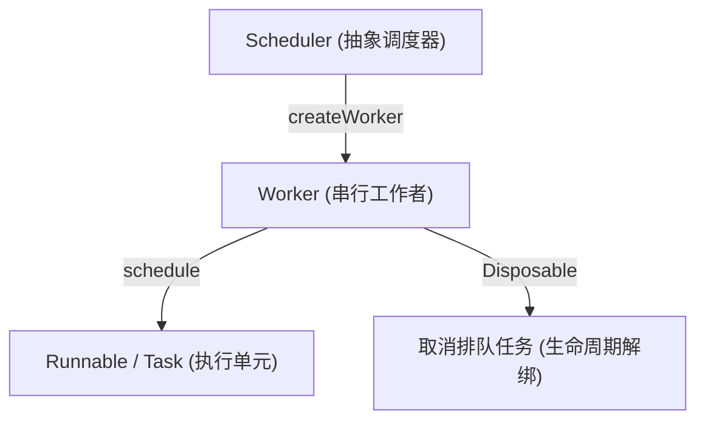
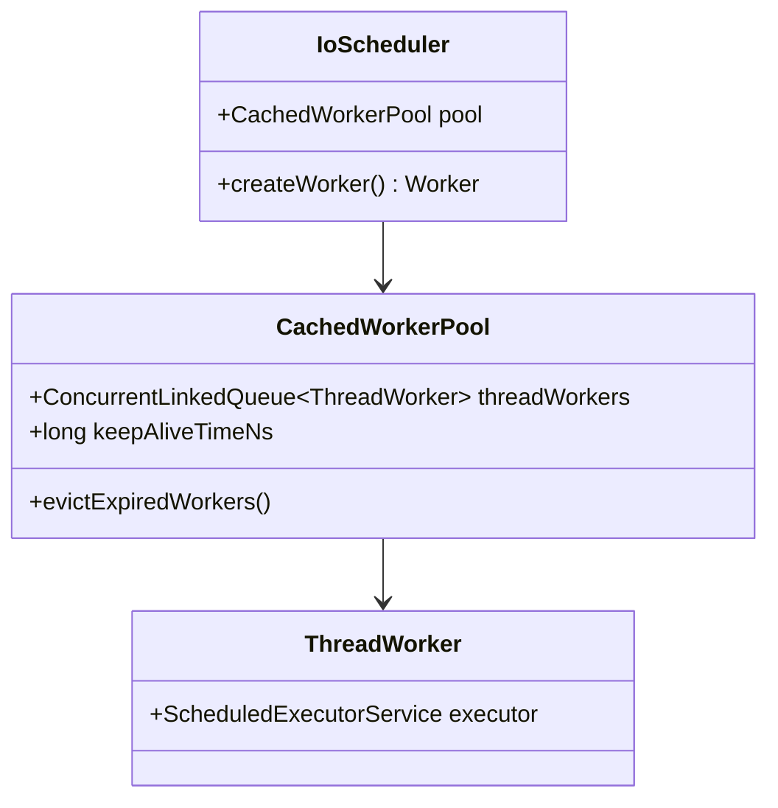
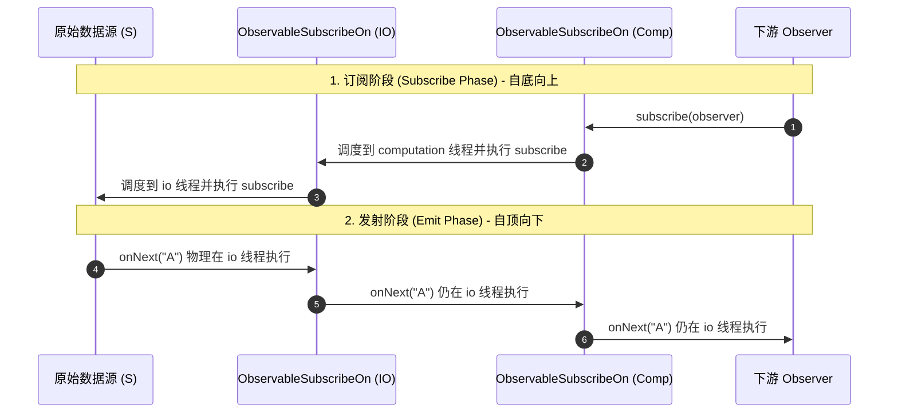
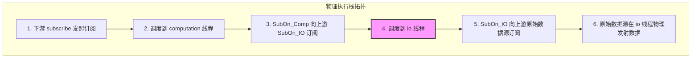
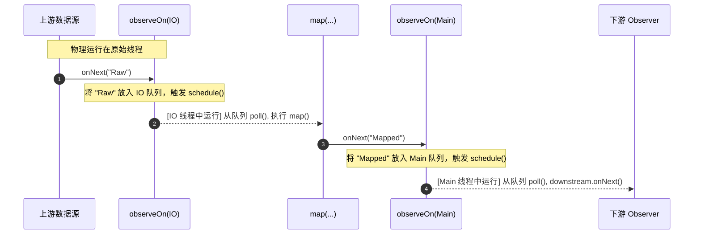
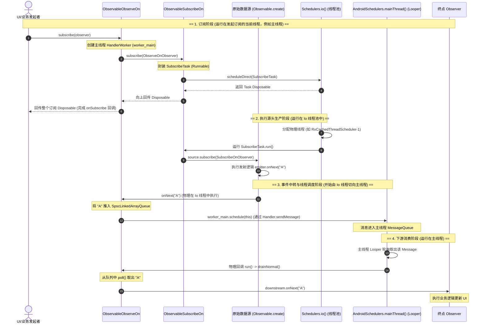

# 5.3.3.2 线程调度

RxJava 的线程调度是其响应式编程框架中最核心、最强大的特性之一。在经典的 Android 异步编程中，我们经常需要在子线程（如 I/O、网络请求、数据库查询）和 UI 主线程之间来回切换。传统的并发手段（如 `Thread`、`ExecutorService`、`AsyncTask`、`Handler/Looper` 等）在面临复杂的流式数据处理和高频切换时，往往会导致逻辑支离破碎，陷入“回调地狱”（Callback Hell），甚至引发难以排查的内存泄漏和死锁问题。

RxJava 通过**声明式线程调度**彻底颠覆了传统的并发编程模型。它将并发视为数据流的一等公民，使开发者能够用极其优雅的链式操作，精细化地控制每个数据处理环节所在的物理线程。本文将从底层物理底座、源码机制、时序交互等维度，深度剖析 RxJava 线程调度的底盘哲学。

---

## 一、 RxJava 线程调度哲学与声明式并发模型

### 1.1 传统 Android 并发模型的演进与痛点

在传统的 Android 开发中，多线程并发控制主要经历以下几个阶段：

1.  **原生 Thread + Handler/Looper**：
    *   **工作机制**：手动创建 `Thread` 执行耗时操作，执行完毕后，通过持有主线程 `Looper` 的 `Handler` 发送 `Message` 或 `Runnable`，在主线程中接收消息并更新 UI。
    *   **致命痛点**：线程的创建与销毁开销巨大；当存在多个异步任务串联时，会出现严重的嵌套回调（Callback Hell）；`Handler` 极易由于隐式持有外部 Activity/Fragment 引用而导致内存泄漏。
2.  **AsyncTask（已被弃用）**：
    *   **工作机制**：封装了 `ThreadPoolExecutor` 和 `Handler`，提供 `doInBackground` 在子线程执行任务，并在 `onPostExecute` 回调主线程。
    *   **致命痛点**：生命周期与 Activity 无法自然同步，极易导致崩溃或内存泄漏；在不同 Android 版本上，其底层线程池是“串行调度”还是“并行调度”多次变更，导致难以预测的并发行为；无法进行精细的异常流转与传播。
3.  **原生 Java 线程池（ExecutorService）**：
    *   **工作机制**：使用线程池复用物理线程，规避频繁创建开销。
    *   **致命痛点**：它虽然解决了资源复用问题，但无法以“流（Stream）”的形式组织数据。在多步复杂的业务逻辑中，将数据从一个线程池的线程安全地传递到另一个线程池或主线程，仍然需要大量繁琐的锁控制或 Handler 桥接。

### 1.2 声明式并发模型的设计哲学：“关注什么，而非怎么做”

RxJava 引入的“声明式并发”将异步行为提升为“数据流”的一层修饰。开发者不再需要编写如何创建线程、如何将 Runnable 投递到队列、如何加锁等样板代码，而是通过两个核心操作符向框架“声明”：

*   **`subscribeOn(Scheduler)`**：声明数据流的“订阅”与“源头生产”动作应该在哪个线程执行。
*   **`observeOn(Scheduler)`**：声明数据流后续的“事件消费”（`onNext`、`onError`、`onComplete`）在哪个线程执行。

这种模型将“**What to do**（处理什么数据）”与“**Where to do**（在哪个线程运行）”彻底解耦。并发不再硬编码在逻辑内部，而是成为挂在管道外的装饰器。这不仅极大地提高了代码的可读性，还赋予了数据流天然的可测试性（可通过替换 Scheduler 轻松进行单步同步测试）。

### 1.3 声明式线程调度的底层物理抽象：Scheduler 与 Worker

在 RxJava 中，物理线程并不是直接被操作的，而是被抽象为 `Scheduler`（调度器）与 `Worker`（工作者）：

*   **`Scheduler`**：它是一个虚拟的调度器抽象。其核心职责类似于物理线程池的“管理者”，向外暴露创建 `Worker` 的接口。
*   **`Worker`**：它是实际承载任务提交与执行的“物理工作者”，也是整个 RxJava 线程调度能保证“串行事件流”的关键。



---

## 二、 核心调度器（Schedulers）物理大底盘

在 RxJava 中，常用的调度器包括 `Schedulers.io()`、`Schedulers.computation()`、`Schedulers.newThread()`、`Schedulers.single()`、`Schedulers.trampoline()` 以及 RxAndroid 提供的 `AndroidSchedulers.mainThread()`。每一个调度器在物理底座上都有着完全不同的线程分配与回收策略。

### 2.1 Scheduler 与 Worker 的抽象设计模式

为什么 RxJava 不直接使用 Java 的 `Executor`，而是要多引入一层 `Worker` 的抽象？

1.  **任务串行（Sequential Execution）保证**：
    RxJava 的 Observable 规范明确规定：`onNext`、`onError`、`onComplete` 的调用必须是串行的，绝不允许在同一时间并发调用同一个下游 Observer 的这些方法。`Worker` 的职责就是保证提交给它的所有 `Runnable` 任务都是严格串行执行的。即使底层物理线程池是一个拥有成百上千物理线程的并发池，属于同一个 `Worker` 的任务也绝不会并发运行。
2.  **生命周期的一致性取消（Cancellation / Disposal）**：
    `Worker` 继承自 `Disposable`。当我们在 Activity/Fragment 销毁时调用了 `Disposable.dispose()`，下游会向上游传递取消信号。这个信号传到 `Worker` 时，`Worker` 能够一次性清空其内部队列中所有尚未执行的任务，并对正在执行的物理线程发出中断或安全退出指令，彻底规避生命周期泄漏。

### 2.2 Schedulers.io() 自适应线程池深度剖析

`Schedulers.io()` 专用于 I/O 密集型任务（如读写磁盘、网络请求、数据库操作、文件解压等）。这类任务的特点是：**CPU 占用率低，但物理线程经常处于阻塞等待状态**。

#### 2.2.1 底层物理结构

`Schedulers.io()` 对应的物理实现类是 `IoScheduler`。它并没有使用 Java 标准库的 `Executors.newCachedThreadPool()`，而是自己实现了一套名为 `CachedWorkerPool` 的缓存池机制，其底层物理核心是一个双端队列（`ConcurrentLinkedQueue<ThreadWorker>`）。



*   **`ThreadWorker`**：每一个 `ThreadWorker` 本质上包装了一个**单线程的 `ScheduledExecutorService`**（基于 `ScheduledThreadPoolExecutor` 实现）。
*   **物理线程的动态创建与复用**：
    当调用 `IoScheduler.createWorker()` 时，`IoScheduler` 会去其内部的 `CachedWorkerPool` 中寻找是否有闲置的 `ThreadWorker`。
    *   如果有，就将该 `ThreadWorker` 从双端队列中弹出（Pop），直接复用。
    *   如果没有，则通过 `RxThreadFactory` 创建一个新的 `ThreadWorker`（线程命名带有前缀 `RxCachedThreadScheduler-`），这会伴随着一个全新物理线程的创建。
*   **物理线程的自动回收**：
    `CachedWorkerPool` 在创建时会启动一个定期清理任务（Evictor），默认每隔 **60 秒** 执行一次。该任务会遍历双端队列中闲置的 `ThreadWorker`，如果某个 `ThreadWorker` 的闲置时间超过了 60 秒，Evictor 会将其从队列中彻底移除，并对其持有的 `ScheduledExecutorService` 执行 `shutdown()` 物理销毁。

#### 2.2.2 物理设计取舍与风险

`Schedulers.io()` 默认是**无界线程池**（即物理线程的创建没有上限限制）。
*   **优势**：在面临突发的高并发 I/O 请求时，能够立刻创建新线程响应，绝不阻塞后续任务。
*   **风险**：如果在业务代码中错误地将计算密集型或带有死循环的任务提交到 `Schedulers.io()`，或者瞬间爆发了上万个阻塞任务，会导致物理线程数急剧飙升，瞬间耗尽 JVM 内存（产生 OOM）以及操作系统的句柄资源，从而导致系统崩溃。

### 2.3 Schedulers.computation() 计算密集型线程池深度剖析

`Schedulers.computation()` 专用于 CPU 密集型计算任务（如大数运算、大规模 JSON 解析、复杂的图像与音视频算法过滤等）。这类任务的特点是：**CPU 始终保持高负载，几乎没有阻塞等待**。

#### 2.3.1 底层物理结构与核心线程数对齐

`Schedulers.computation()` 对应的物理实现类是 `ComputationScheduler`。它的核心设计哲学是**“限制物理线程数等于 CPU 物理核心数”**。
*   **为什么线程数不能无限增长**：
    对于计算密集型任务，如果有 8 个 CPU 核心，但创建了 100 个物理线程，CPU 将不得不花费大量宝贵的时间片在 100 个线程之间进行上下文切换（Context Switch）。上下文切换涉及到保存寄存器状态、恢复物理栈等昂贵开销，这非但不能加快速度，反而会严重降低纯计算效率。
*   **物理底座设计**：
    `ComputationScheduler` 在静态初始化时，会调用 `Runtime.getRuntime().availableProcessors()` 获取当前设备的可用 CPU 核心数 $N$。
    内部维护了一个 `FixedSchedulerPool`，它在初始化时就直接创建好 $N$ 个固定的 `PoolWorker`。每个 `PoolWorker` 同样封装了一个单线程的 `ScheduledExecutorService`（线程命名带有前缀 `RxComputationThreadPool-`）。

#### 2.3.2 轮询分配算法（Round-Robin）

当我们在 `ComputationScheduler` 上创建 `Worker` 时，由于物理 Worker 的数量是固定为 $N$ 的，RxJava 采用了一个简单的轮询计数器（取模运算）来分配：

```java
// 简化后的分配逻辑示意
final class FixedSchedulerPool {
    final int cores;
    final PoolWorker[] eventLoops;
    long n;

    FixedSchedulerPool(int maxThreads, ThreadFactory threadFactory) {
        this.cores = maxThreads;
        this.eventLoops = new PoolWorker[maxThreads];
        for (int i = 0; i < maxThreads; i++) {
            this.eventLoops[i] = new PoolWorker(threadFactory);
        }
    }

    public PoolWorker getEventLoop() {
        int c = cores;
        if (c == 0) {
            return SHUTDOWN_WORKER;
        }
        // 采用自增并取模，轮询选择固定的 PoolWorker
        return eventLoops[(int)(n++ % c)];
    }
}
```

这意味着，所有提交到 `computation` 的任务，最终只会在这一组物理线程中排队执行。这也给开发者敲响了警钟：**绝对不能在 `computation()` 线程池中执行任何阻塞 I/O 操作**。一旦其中一个 `PoolWorker` 被阻塞住，对应的 CPU 核心将被闲置，且其他排队的计算任务都将被严重延时。

### 2.4 Schedulers.newThread() 与 Schedulers.single() 运作机理

*   **`Schedulers.newThread()`**：
    *   **底层物理**：每次调用 `createWorker()` 时，都直接创建一个包含单线程 `ScheduledThreadPoolExecutor` 的新工作线程。
    *   **性能考量**：由于不提供任何缓存复用机制，频繁调用会导致线程创建和销毁开销过大。它仅适用于物理生命周期极长、需要完全独立排他线程的特殊任务。
*   **`Schedulers.single()`**：
    *   **底层物理**：在全局共享同一个单线程的线程池。
    *   **性能考量**：所有提交给 `single()` 的任务，无论源自哪个数据流，都会在这个唯一的物理线程中排队。这极其适合需要严格保证“全局串行化顺序”的轻量级计算任务（如本地日志顺序写入）。

### 2.5 Schedulers.trampoline() 运作机理

`Schedulers.trampoline()` 是一种特殊的调度器。它并不创建或将任务分流到新的物理线程，而是在**当前线程**中执行任务。
*   **物理实现**：它内部维护了一个优先级双端队列（`PriorityBlockingQueue`）。当我们在当前线程使用 `trampoline()` 时，如果当前线程没有正在运行的调度任务，它就直接在当前线程同步运行；如果当前线程正在运行其他任务，新任务会被塞进队列中排队，等当前任务执行完毕后，在同一个物理线程中循环出队并执行。
*   **应用场景**：它常用于避免深度的递归调用导致调用栈溢出（StackOverflowError），也广泛运用于单元测试（Unit Test）中，用来将所有的异步并发逻辑强行收拢为当前测试线程的同步执行。

### 2.6 自定义线程池：Schedulers.from(Executor) 运作机理与坑点

RxJava 允许通过 `Schedulers.from(Executor)` 将传统的 Java 线程池包装成 RxJava 调度器。
*   **底层物理**：它对应的实现类是 `ExecutorScheduler`。每次调用 `createWorker()` 时，它返回的是一个 `ExecutorWorker`。
*   **串行保证机制**：因为传入的 `Executor` 可能是多线程并发池（如 `ThreadPoolExecutor`），为了保证 `Worker` 的串行执行规范，`ExecutorWorker` 内部自己实现了一个基于 CAS 状态机和双端链表队列（`MpscQueue` / `ConcurrentLinkedQueue`）的**串行分发器（Serial Drainer）**。它将提交给 Worker 的所有 Runnable 串行排队，每次只投递一个任务给底层的 Executor，当前任务在线程池某个线程跑完后，再通过回调调度下一个排队任务。
*   **致命坑点**：如果底层 `Executor` 的拒绝策略（RejectedExecutionHandler）被触发，或者 Executor 已经被 `shutdown()`，`ExecutorWorker` 的内部状态机会陷入死锁状态（永远处于“正在分发”但物理任务被丢弃，导致后续排队任务永久挂起）。因此，使用 `Schedulers.from` 必须自行精细管控底层线程池的生命周期和饱和度策略。

### 2.7 Android 专属 AndroidSchedulers.mainThread() 物理实现

Android 系统为了保证 UI 的流畅性与线程安全，规定所有的 UI 控件操作必须在主线程（UI 线程）中进行。RxAndroid 专门针对此提供了 `AndroidSchedulers.mainThread()`，其对应的核心物理实现是 `HandlerScheduler`。

#### 2.7.1 物理实现细节

`HandlerScheduler` 本质上是对 Android 原生 `Handler` 的一层封装。

```java
// HandlerScheduler.java 核心骨架剖析
final class HandlerScheduler extends Scheduler {
    private final Handler handler;
    private final boolean async;

    HandlerScheduler(Handler handler, boolean async) {
        this.handler = handler;
        this.async = async;
    }

    @Override
    public Worker createWorker() {
        return new HandlerWorker(handler, async);
    }

    // HandlerWorker 内部实现
    static final class HandlerWorker extends Worker {
        private final Handler handler;
        private final boolean async;
        private volatile boolean disposed;

        HandlerWorker(Handler handler, boolean async) {
            this.handler = handler;
            this.async = async;
        }

        @Override
        public Disposable schedule(Runnable run, long delay, TimeUnit unit) {
            // 对 Runnable 进行包装，使其支持 Disposable 的取消机制
            ScheduledRunnable scheduled = new ScheduledRunnable(handler, run);

            Message message = Message.obtain(handler, scheduled);
            message.obj = this; // 绑定当前 Worker，以便统一销毁

            // 如果支持 Android 的异步消息（Asynchronous Message），则设置，以绕过 VSync 同步屏障
            if (async) {
                message.setAsynchronous(true);
            }

            // 发送消息到主线程的 MessageQueue 中
            handler.sendMessageDelayed(message, unit.toMillis(delay));

            if (disposed) {
                handler.removeCallbacks(scheduled);
                return Disposables.disposed();
            }

            return scheduled;
        }

        @Override
        public void dispose() {
            if (!disposed) {
                disposed = true;
                // 取消所有绑定当前 Worker 的 Message
                handler.removeCallbacksAndMessages(this);
            }
        }
    }
}
```

#### 2.7.2 邮递与寄信物理模型

当调用 `AndroidSchedulers.mainThread().createWorker().schedule(runnable)` 时：
1.  RxJava 将待执行的任务包装成一个 `ScheduledRunnable`（其实现了 `Runnable` 与 `Disposable`）。
2.  将该 `ScheduledRunnable` 封装成一个 `Message`。
3.  通过底层的 `Handler`，调用 `sendMessageAtTime` 等方法，将消息投递到 Android 主线程唯一的 `MessageQueue` 中。
4.  主线程的 `Looper` 不断从 `MessageQueue` 中取出消息。当取出这一条代表我们任务的消息时，由 `Handler` 分发并回调 `ScheduledRunnable.run()`，任务最终在主线程物理执行。

这一设计巧妙地将 RxJava 的取消动作（`dispose()`）与 Android 的 `Handler.removeCallbacks` 结合，当数据流被切断时，排在 MessageQueue 中的任务将被立刻撤销，彻底切断了内存泄漏的路径。

---

## 三、 subscribeOn 深度源码剖析：如何改变数据流订阅源头的物理线程

在响应式编程中，`subscribeOn` 负责控制**数据源头发射数据（如网络请求、数据库查询）**时所在的物理线程。为了探寻“为什么只有第一次调用 `subscribeOn` 有效”这一定律，我们需要剥开其物理外套，深入源码。

### 3.1 链式调用中的包装模型（Wrapper Pattern）

RxJava 的数据流构建是一个“**逆向包装，正向发射**”的过程：
1.  **构建期（Assemble Time）**：通过链式操作符，将上游的 `Observable` 包装成一个个新的包装器 `Observable`。例如 `Observable.create` 创建了原始数据源，调用 `subscribeOn` 会将其包装为 `ObservableSubscribeOn`。
2.  **订阅期（Subscribe Time）**：调用最后的 `.subscribe(Observer)`。订阅动作会**自底向上**、从下游依次传递到上游，直至最顶端的数据源。
3.  **发射期（Emit Time）**：最顶端的数据源接收到订阅后，开始调用 `onNext`、`onComplete`，数据**自顶向下**流过各个操作符，最终到达终点 Observer。



### 3.2 源码逐行解析：ObservableSubscribeOn

我们直接拆解 `ObservableSubscribeOn` 的核心源码：

```java
// ObservableSubscribeOn.java 核心源码逐行解析
public final class ObservableSubscribeOn<T> extends AbstractObservableWithUpstream<T, T> {
    // 目标调度器，比如 Schedulers.io()
    final Scheduler scheduler;

    public ObservableSubscribeOn(ObservableSource<T> source, Scheduler scheduler) {
        super(source); // 持有上游的 Observable 引用
        this.scheduler = scheduler;
    }

    // 当下游调用 subscribe 订阅此 Observable 时，系统会回调此方法
    @Override
    public void subscribeActual(final Observer<? super T> observer) {
        // 1. 创建一个订阅观察者 SubscribeOnObserver，它是对下游真实 observer 的包装
        final SubscribeOnObserver<T> parent = new SubscribeOnObserver<T>(observer);

        // 2. 关键步骤：主动回调下游的 onSubscribe，向下游分发 Disposable。
        // 这使得下游可以在数据还没发出来之前就拿到 Disposable，并具备随时取消订阅的能力。
        observer.onSubscribe(parent);

        // 3. 核心物理动作：调用调度器的 scheduleDirect 方法。
        // 它将包装好的 "SubscribeTask"（一个 Runnable 任务）提交到 Scheduler 的线程池中运行。
        // scheduleDirect 的返回值是一个 Disposable，用于后续取消该异步任务。
        parent.setDisposable(scheduler.scheduleDirect(new SubscribeTask(parent)));
    }

    // 内部类 SubscribeTask：负责在指定的线程中拉起上游订阅
    final class SubscribeTask implements Runnable {
        private final SubscribeOnObserver<T> parent;

        SubscribeTask(SubscribeOnObserver<T> parent) {
            this.parent = parent;
        }

        @Override
        public void run() {
            // 4. 这行代码物理运行在调度器指定的线程中（例如 io 线程）。
            // 它的核心工作是：让上游的数据源（source）向我们包装的观察者（parent）发起订阅。
            source.subscribe(parent);
        }
    }
}
```

从源码中可以看出，`ObservableSubscribeOn` 的核心逻辑极其纯粹：**它把“向上游订阅”这一动作（`source.subscribe`）封装进了一个 `Runnable`（即 `SubscribeTask`），并在指定的 `Scheduler` 线程中执行。**

### 3.3 “为什么只有第一次调用 subscribeOn 有效？”的底层机理

在 RxJava 的链式调用中，如果我们多次调用 `subscribeOn`，如下所示：

```java
Observable.create(emitter -> {
    System.out.println("Data emitter on: " + Thread.currentThread().getName());
    emitter.onNext("Data");
})
.subscribeOn(Schedulers.io())            // 第一次调用 (靠近数据源)
.subscribeOn(Schedulers.computation())   // 第二次调用
.subscribe(data -> {
    System.out.println("Observer received on: " + Thread.currentThread().getName());
});
```

输出结果中，`Data emitter on:` 打印的物理线程必然是 `Schedulers.io()` 指派的物理线程（如 `RxCachedThreadScheduler-1`），而绝非第二次指定的 `computation`。其底层物理机理可以通过以下**订阅栈的拓扑拆解**来解释：

1.  **逆向包装树的建立**：
    数据源 `Observable.create` 被包装成 `ObservableSubscribeOn` (IO 实例，我们记为 `SubOn_IO`)，接着 `SubOn_IO` 被包装成 `ObservableSubscribeOn` (Computation 实例，我们记为 `SubOn_Comp`)。
2.  **订阅阶段（自下而上）的执行**：
    *   下游调用 `.subscribe()` 触发最外层的 `SubOn_Comp` 的 `subscribeActual`。
    *   `SubOn_Comp` 接收到请求，它将订阅上游的动作（`SubscribeTask_Comp`）提交到 `Schedulers.computation()` 线程池。
    *   在 `computation` 物理线程中，`SubscribeTask_Comp` 执行，调用 `source.subscribe(...)`。这里的 `source` 指向的是 `SubOn_IO`。
    *   `SubOn_IO` 的 `subscribeActual` 开始在 `computation` 物理线程中运行。它接收到订阅，但由于它内部指定的是 `Schedulers.io()`，它会再一次把向它的上游订阅的动作（`SubscribeTask_IO`）提交到 `Schedulers.io()` 线程池。
    *   在 `Schedulers.io()` 物理线程中，`SubscribeTask_IO` 执行，调用最上游 `Observable.create` 的 `subscribe(...)`。
3.  **数据源发射时的物理线程**：
    *   最终，`Observable.create` 内部的发射 lambda（`emitter.onNext("Data")`）在当前线程中被调用。而当前运行的物理线程正是由上一步 `SubscribeTask_IO` 决定的物理 `io` 线程。
    *   由于数据源已经运行在 `io` 线程中，当它沿着 Observer 链条向下派发事件时，如果没有遇到任何 `observeOn` 操作符，数据就会在同一个物理线程中一冲到底，直接流入下游的终点 Observer。



*   **物理结论**：
    多次调用 `subscribeOn` 时，下方的 `subscribeOn` 的确改变了它上方节点被订阅时所在的线程。但是，**越往上的包装器越晚执行其 `subscribe` 动作，最终最顶端的原始数据源必然是在最靠近它的（也就是第一次声明的）那个 `subscribeOn` 的线程中被触发订阅的**。这就决定了数据源发射数据的物理线程只能由第一次调用决定，后续的 `subscribeOn` 只是改变了包装器本身的订阅线程，对最源头的数据发射无能为力。

### 3.4 subscribeOn 的取消安全与 CAS 并发机制

为了保证线程切换过程中的“生命周期安全”（防止在上游还没订阅成功时，下游就被销毁导致线程任务孤悬在后台），`SubscribeOnObserver` 中使用了高度精细的 CAS（Compare-And-Swap）机制来管理 `Disposable`。

其内部通过原子变量（继承或组合 `AtomicReference<Disposable>`）维持其自身的 Disposable 状态：
*   **防止竞态执行**：在子线程中的 `SubscribeTask` 的 `run()` 触发向上游 `source.subscribe` 时，它会检查其 `AtomicReference` 是否已经是 `DISPOSED` 状态。如果是，则直接不触发订阅，保护系统资源。
*   **跨线程传递中断**：如果在 `SubscribeTask` 已经提交给线程池、但物理线程还没开始调用 `run()` 时，主线程触发了 `dispose()`，主线程会原子性地将当前 `Disposable` 状态置为 `DISPOSED`，并调用底层 `Future.cancel(true)`，物理拦截并砍断线程池对该任务的排队与调度。

---

## 四、 observeOn 深度源码剖析：如何改变数据流事件回调的物理线程

与 `subscribeOn` 掌控“数据发射源头物理线程”不同，`observeOn` 的作用是改变其**下游事件回调（`onNext`/`onError`/`onComplete`）所运行的物理线程**。并且，**多次调用 `observeOn`，下游的每一次切换都会生效**。

### 4.1 下游事件回调的拦截与重调度

`observeOn` 并没有改变上游订阅的线程。它的物理本质是：**拦截（Intercept）上游向下游发送的数据包，将其存入一个内部缓冲区，然后通过指定的调度器 Worker，将这些数据包从缓冲区中取出来，并投递到新的线程中发送给下游。**

### 4.2 源码逐行解析：ObservableObserveOn

我们来逐行剖析 `ObservableObserveOn` 的核心实现 `ObserveOnObserver`：

```java
// ObservableObserveOn.java 核心源码逐行解析
public final class ObservableObserveOn<T> extends AbstractObservableWithUpstream<T, T> {
    final Scheduler scheduler;
    final boolean delayError; // 是否延迟分发异常
    final int bufferSize;     // 缓冲区大小（prefetch）

    public ObservableObserveOn(ObservableSource<T> source, Scheduler scheduler, boolean delayError, int bufferSize) {
        super(source);
        this.scheduler = scheduler;
        this.delayError = delayError;
        this.bufferSize = bufferSize;
    }

    @Override
    protected void subscribeActual(Observer<? super T> observer) {
        // 创建指定调度器的 Worker
        Scheduler.Worker w = scheduler.createWorker();
        // 向上游订阅，并将 Worker 以及缓冲区大小 bufferSize 传递给包装观察者 ObserveOnObserver
        source.subscribe(new ObserveOnObserver<T>(observer, w, delayError, bufferSize));
    }

    // 核心观察者 ObserveOnObserver：它同时实现了 Observer 和 Runnable 接口
    static final class ObserveOnObserver<T> extends BasicIntQueueDisposable<T>
    implements Observer<T>, Runnable {
        
        final Observer<? super T> downstream; // 下游真实的 Observer
        final Scheduler.Worker worker;        // 执行线程切换的 Worker
        final boolean delayError;
        final int bufferSize;

        SimpleQueue<T> queue; // 存放上游数据的无锁队列
        Disposable upstream;  // 上游 Disposable
        Throwable error;
        volatile boolean done;
        volatile boolean disposed;

        int sourceMode; // 队列融合标志

        ObserveOnObserver(Observer<? super T> actual, Scheduler.Worker worker, boolean delayError, int bufferSize) {
            this.downstream = actual;
            this.worker = worker;
            this.delayError = delayError;
            this.bufferSize = bufferSize;
        }

        @Override
        public void onSubscribe(Disposable d) {
            if (DisposableHelper.validate(this.upstream, d)) {
                this.upstream = d;
                
                // 队列融合优化判断：如果是上游操作符（如 flatMap / Map）支持队列融合，则直接复用上游的底层队列
                if (d instanceof QueueDisposable) {
                    @SuppressWarnings("unchecked")
                    QueueDisposable<T> qd = (QueueDisposable<T>) d;

                    int m = qd.requestFusion(QueueDisposable.ANY);

                    if (m == QueueDisposable.SYNC) {
                        sourceMode = m;
                        queue = qd;
                        done = true; // 同步融合下，上游本身已经包含了数据终结标志
                        downstream.onSubscribe(this);
                        schedule(); // 直接开启排水
                        return;
                    }
                    if (m == QueueDisposable.ASYNC) {
                        sourceMode = m;
                        queue = qd;
                        downstream.onSubscribe(this);
                        return;
                    }
                }
                
                // 默认创建无锁单生产者单消费者队列
                queue = new SpscLinkedArrayQueue<T>(bufferSize);
                
                // 将当前包装观察者传递给下游
                downstream.onSubscribe(this);
            }
        }

        // 1. 上游发射数据时，物理触发此方法（依然运行在上游线程中）
        @Override
        public void onNext(T t) {
            if (done) { return; }
            if (sourceMode != QueueDisposable.ASYNC) {
                // 核心：直接将上游数据推入无锁队列中，不做任何业务处理
                queue.offer(t);
            }
            // 触发任务调度（核心排水入口）
            schedule();
        }

        @Override
        public void onError(Throwable t) {
            if (done) { RxJavaPlugins.onError(t); return; }
            error = t;
            done = true;
            schedule();
        }

        @Override
        public void onComplete() {
            if (done) { return; }
            done = true;
            schedule();
        }

        // 2. 调度执行：通过 CAS 计数器进行防并发重入控制
        void schedule() {
            // getAndIncrement() 是继承自 BasicIntQueueDisposable（本质是一个 AtomicInteger）的方法。
            // 只有当计数器原值为 0 时，才物理调度 Worker 去执行 drain（排水）任务。
            // 这确保了即使上游高频发射数据触发多次 schedule()，底层也只会向线程池提交一个正在运行的排水任务，防止并发错乱。
            if (getAndIncrement() == 0) {
                // 将当前实例（实现了 Runnable）提交到指定的 Worker 中运行
                worker.schedule(this);
            }
        }

        // 3. 物理线程切换的关键：此方法运行在 observeOn 指定的新物理线程中
        @Override
        public void run() {
            // 开始从队列中“排水”发送给下游
            drainNormal();
        }

        // 5. 核心排水逻辑（运行在目标线程）
        void drainNormal() {
            int missed = 1;
            final SimpleQueue<T> q = queue;
            final Observer<? super T> a = downstream;

            // 外层 WIP 循环，用于处理在排水期间新入队的数据
            for (;;) {
                // 检查数据流是否已终止
                if (checkTerminated(done, q.isEmpty(), a)) {
                    return;
                }

                // 内层循环：尽可能多地从队列中读取数据并分发给下游
                for (;;) {
                    boolean d = done;
                    T v;
                    try {
                        // 从无锁队列中弹出一个数据
                        v = q.poll();
                    } catch (Throwable ex) {
                        Exceptions.throwIfFatal(ex);
                        disposed = true;
                        upstream.dispose();
                        q.clear();
                        a.onError(ex);
                        worker.dispose();
                        return;
                    }
                    boolean empty = v == null;

                    // 再次校验终止状态
                    if (checkTerminated(d, empty, a)) {
                        return;
                    }

                    if (empty) {
                        break; // 队列已空，退出内层循环
                    }

                    // 核心物理动作：在新线程中，将数据派发给下游真实的 Observer
                    a.onNext(v);
                }

                // 减去我们已经处理的任务数，如果 missed 减完后仍不为 0（说明在排水期间又有新的数据 offer 进来了），
                // 则继续外层循环继续排空队列
                missed = addAndGet(-missed);
                if (missed == 0) {
                    break; // 排水彻底结束，退出外层循环
                }
            }
        }

        // 检查流终止状态的辅助方法
        boolean checkTerminated(boolean d, boolean empty, Observer<? super T> a) {
            if (disposed) {
                queue.clear();
                return true;
            }
            if (d) {
                Throwable e = error;
                if (delayError) {
                    if (empty) {
                        disposed = true;
                        if (e != null) {
                            a.onError(e);
                        } else {
                            a.onComplete();
                        }
                        worker.dispose();
                        return true;
                    }
                } else {
                    if (e != null) {
                        disposed = true;
                        queue.clear();
                        a.onError(e);
                        worker.dispose();
                        return true;
                    } else if (empty) {
                        disposed = true;
                        a.onComplete();
                        worker.dispose();
                        return true;
                    }
                }
            }
            return false;
        }
    }
}
```

### 4.3 详解 Queue Fusion (队列融合) 优化原理

在 `ObserveOnObserver.onSubscribe` 源码中，我们会看到如下优化分支：`d instanceof QueueDisposable`。这就是 RxJava 非常关键的性能大招——**队列融合（Queue Fusion）**。

#### 4.3.1 为什么需要队列融合？
在普通的 RxJava 流中，如果多个操作符串联：如 `Observable.just("A").map(parser).observeOn(Schedulers.io())`，每个操作符在接收到数据时都需要进行一次 `onNext(v)` 调用。如果该操作符涉及线程切换（如 `observeOn`），它内部还需要额外分配一个 `SpscLinkedArrayQueue`，并将数据 `offer()` 进去。这就会导致：
1.  大量的中间小队列对象被创建，在高频流下会引发严重的新生代内存抖动。
2.  数据包被重复地在各个操作符的小队列间复制，白白消耗 CPU 时钟。

#### 4.3.2 SYNC 与 ASYNC 融合运作
*   **同步融合（SYNC）**：
    如果上游数据源是一个同步的可迭代流（例如 `Observable.fromIterable`），当 `observeOn` 向上游订阅时，它调用 `qd.requestFusion(ANY)`。上游返回 `SYNC`，表明其底层自身就是一个队列（本质上是一个迭代器包装）。此时，`observeOn` **不再自行创建 `SpscLinkedArrayQueue`**，而是直接让内部指针 `queue = qd`。
    当排水任务 `drainNormal()` 执行时，直接调用 `queue.poll()`，实质上是直接从源头迭代器中直接拉取数据。这完美将数据读取和线程切换一步合并，省去了中间队列的开销。
*   **异步融合（ASYNC）**：
    如果上游操作符（如支持异步转发的 flatMap）返回 `ASYNC`。这意味着上游拥有自己的缓存队列。`observeOn` 同样将上游队列 `qd` 赋值给自身的 `queue`，而不再新建队列。当上游有新数据生产出来放入其队列时，它仅向 `observeOn` 发送一个**“空数据通知”**（`onNext(null)`），`observeOn` 收到通知后立即触发 `schedule()` 调度，在工作线程中直接从上游队列中 `poll()` 数据并消费。

### 4.4 “为什么多次调用 observeOn 下游每次都切换生效？”的底层机理

与 `subscribeOn` 的正向发射拦截不同，`observeOn` 作用于**下行发射流**。
假设我们有如下链条：

```java
observable
.observeOn(Schedulers.io())            // 第一次 observeOn
.map(data -> transform(data))
.observeOn(AndroidSchedulers.mainThread()) // 第二次 observeOn
.subscribe(observer);
```

1.  当上游发送数据 `onNext` 到第一个 `ObservableObserveOn` (IO 实例) 时，它拦截数据，放入其无锁队列，通过 `worker_io` 调度排水任务，将后续的 `map(transform)` 操作推入 `io` 物理线程运行。
2.  在 `io` 线程执行完 `map` 的变换逻辑后，数据被发送到第二个 `ObservableObserveOn` (Main 实例)。
3.  这个 Main 实例在 `io` 线程中拦截数据，放入自身的队列，通过 `worker_main`（底层基于主线程 Handler）调度排水任务，把最终的 `Observer.onNext` 投递到 Android 主线程的 MessageQueue 中。
4.  主线程 Looper 取出消息，在主线程物理执行 `observer.onNext`。

*   **物理结论**：
    每一个 `observeOn` 操作符在物理上都是一个**事件中转站**。它内部自带独立的队列和独立的 `Worker`。事件流经过它时，必须进行一次完整的“上游线程写入队列 -> 触发 schedule -> 目标线程排水出列 -> 发送给下游”的过程。因此，每一次调用 `observeOn`，都会实打实地阻断当前的物理执行路径，将运行逻辑转移到新的线程中。所以，多次调用 `observeOn`，每次切换都必定生效，其覆盖范围是**从当前 `observeOn` 开始，直到下一个 `observeOn` 或数据流终点为止**。



### 4.5 无锁单生产者单消费者队列（SpscLinkedArrayQueue）剖析

`ObserveOnObserver` 中用于缓存数据的核心组件是 `SpscLinkedArrayQueue`。
*   **什么是 SPSC**：
    `Spsc` 全称为 **Single Producer Single Consumer**（单生产者单消费者）。在 RxJava 的 `observeOn` 流程中，生产者是上游线程（只会通过 `onNext` 向队列 offer 数据），消费者是下游线程（只会通过 `drain` 任务的 `run()` 方法从队列中 poll 数据）。
*   **物理结构**：
    `SpscLinkedArrayQueue` 是一种环形数组加链表扩展的无锁结构。它避免了 Java 原生队列在高频并发场景下的 `ReentrantLock` 锁竞争开销。
*   **规避 false sharing（虚假共享）**：
    在多核 CPU 中，当读指针（Consumer Index）和写指针（Producer Index）物理位置相近（位于同一行 Cache Line，通常是 64 字节）时，两个核心对这两个指针的频繁修改会触发 Cache Line 频繁失效（Cache Line Bounce）。`SpscLinkedArrayQueue` 内部通过填充无用变量（Padding）等物理手段，强行拉开读写指针在物理内存中的距离，大幅减少了 CPU 缓存失效，提升了极高频流的数据转发吞吐量。

### 4.6 observeOn 的背压（Backpressure）前置交互与预取（prefetch）控制

在处理超高频数据发射源时，如果下游消费者的线程处理极其缓慢，会导致大量的待消费事件堆积在 `observeOn` 内部的无锁队列中，如果不加控制，最终会引发 OOM。

*   **对于 `Flowable`（支持背压的流）**：
    `FlowableObserveOn` 的内部实现 `ObserveOnSubscriber` 具有完善的背压流控：
    1.  它不会直接向其上游申请全部的数据，而是通过上游的 `Subscription.request(prefetch)`，默认一次性只拉取 `bufferSize`（如 128 个）的数据放入队列。
    2.  当下游的 `ObserveOnSubscriber` 在目标线程中消费数据时，它会记录消费的个数。
    3.  当消费的个数达到预取值的一个阈值（例如 $prefetch - (prefetch \gg 2)$，即消费了约 75% 的数据）时，它会再次向上游发送 `request(consumed)` 请求，补充对应的配额。
    4.  这种“预取-消费-补充配额”的前置交互模型，完美保证了队列中最多只有 128 个元素在排队，彻底将物理内存占用控制在了一个可预测的安全级别。
*   **对于 `Observable`（不支持背压的流）**：
    `ObservableObserveOn` 内部虽然也引入了 `bufferSize` 参数，但由于 `Observable` 协议本身没有 `request` 反向通信控制，上游数据源会源源不断地倾泻下来。
    此时，`SpscLinkedArrayQueue` 会启动其**无界扩容物理机制**（当环形数组满时，它会动态创建一个新的数组并用链表指针将其挂接起来，继续容纳新元素）。
    *   **架构警示**：如果开发者在高频传感器读取、大数据解压等场景中使用 `Observable.observeOn`，上游一秒发射上万个对象，而主线程因为卡顿无法及时处理，队列就会无限膨胀，瞬间吃满 JVM 堆内存。因此，**面临高频生产且存在线程切换的场景，必须升级为 `Flowable`，并合理设置其 `prefetch` 大小**。

---

## 五、 联动时序解析与物理执行流闭环

为了直观地展示物理线程切换在运行时的完整流转过程，我们以如下经典的 Android 业务链路为例：

```java
Observable.create(emitter -> {
    System.out.println("Source emit on: " + Thread.currentThread().getName());
    emitter.onNext("A");
    emitter.onComplete();
})
.subscribeOn(Schedulers.io())
.observeOn(AndroidSchedulers.mainThread())
.subscribe(new Observer<String>() {
    @Override
    public void onSubscribe(Disposable d) {}
    @Override
    public void onNext(String s) {
        System.out.println("Result consume on: " + Thread.currentThread().getName());
    }
    @Override
    public void onError(Throwable e) {}
    @Override
    public void onComplete() {}
});
```

### 5.1 联动执行流物理追踪

当上述代码执行时，系统内部将完成一次惊心动魄的线程大回环：

1.  **订阅发起（主线程）**：
    代码在主线程执行 `subscribe(...)`。最外层的 `ObservableObserveOn` 接收到订阅，创建主线程 `HandlerWorker`，并向其上游的 `ObservableSubscribeOn` 发起订阅。
2.  **订阅线程切换（主线程 $\rightarrow$ IO 线程）**：
    `ObservableSubscribeOn` 收到订阅。它不直接向数据源订阅，而是将 `SubscribeTask`（负责调用 `source.subscribe`）封装后提交到 `Schedulers.io()` 自适应线程池中。主线程的调用栈此时安全退出。
3.  **源头数据生产（IO 线程）**：
    在 `io` 物理线程中，`SubscribeTask` 被调度执行。它调用上游原始数据源 `Observable.create` 的 `subscribe()`。
    原始数据源内部的发射逻辑物理运行在这个 `io` 线程中，打印出 `Source emit on: RxCachedThreadScheduler-1`，并通过 `emitter.onNext("A")` 将数据向下传导。
4.  **事件中转拦截（IO 线程 $\rightarrow$ 主线程）**：
    事件沿着观察者链条一路向下传递，到达 `ObserveOnObserver` 的 `onNext("A")`。这一步仍然运行在 `io` 线程中。
    `ObserveOnObserver` 将数据 `"A"` 存入它的无锁队列 `SpscLinkedArrayQueue`，然后调用 `schedule()`。由于 CAS 成功，它向主线程的 `HandlerWorker` 提交了排水任务。
5.  **下游事件消费（主线程）**：
    主线程的 `Looper` 循环读取到该排水 Runnable 消息，并开始调用其 `run()` 方法。
    `drainNormal()` 在主线程中物理执行。它从队列中将数据 `"A"` 取出，最终回调下游 Observer 的 `onNext("A")`。打印出 `Result consume on: main`。

### 5.2 完整物理流转时序图

下图详细展示了这一过程中，各个物理实体在不同物理线程上的时间线交错和数据交互：



---

## 六、 subscribeOn 与 observeOn 核心对比

为了方便记忆与方案权衡，下表汇总了 RxJava 两个线程切换核心操作符在运行期底层的物理特性区别：

| 对比维度 | `subscribeOn(Scheduler)` | `observeOn(Scheduler)` |
| :--- | :--- | :--- |
| **主要作用阶段** | 订阅阶段（自底向上） | 发射阶段（自顶向下） |
| **控制的核心物理行为** | 数据流源头数据生产（网络请求/文件读取等） | 下游各变换操作符与最终消费者的数据回调 |
| **作用范围** | 决定整条链最顶层源头发射的线程 | 决定紧随其后的下游代码，直到被下一个 `observeOn` 覆盖 |
| **多次调用表现** | 仅最靠近数据源的第一个声明生效 | 多次调用分段生效，每一次调用都执行物理切线程 |
| **底层核心物理组件** | `SubscribeTask` (Runnable) 在目标线程执行 | `SpscLinkedArrayQueue` + `Worker.schedule(Runnable)` 异步排水 |
| **背压机制关联** | 不控制流量大小，只决定启动线程 | 限制上游下发速度（通过 `prefetch` 前置流控） |
| **常见使用场景** | 切换整个长链的执行环境（比如后台自动运行） | 将网络返回的数据拉回 Android UI 主线程刷新视图 |

---

## 七、 常见误区与生产实践避坑指南

RxJava 线程调度虽然极为强大，但由于其高度抽象的声明式语法，极易让不熟悉其底层物理模型的开发者陷入雷区。以下列举四个典型的生产线事故场景与防范建议：

### 7.1 误区一：混淆 subscribeOn 在流中声明的位置

很多初学者认为，`subscribeOn` 和 `observeOn` 的规则一样，在哪里声明，其上方的代码就在哪里运行。

```java
// 错误示例
Observable.create(emitter -> emitter.onNext(loadFromNetwork())) // 网络加载
.map(data -> parseData(data))                                // 逻辑解析
.subscribeOn(Schedulers.io())                                // 以为只在这一步之后起作用
.subscribe();
```

*   **物理现实**：
    由于订阅流是**自底向上**传递的，只要在整条链的任意位置调用了一次 `subscribeOn(Schedulers.io())`（且没有其他干扰源），那么整条链路从底到顶的订阅逻辑、以及最顶端数据源的物理发射逻辑，都会被拉到 `io` 线程中执行。所以上面的写法完全是正确的，声明在最下方依然能够保证 `loadFromNetwork` 运行在 `io` 线程。
*   **最佳实践**：
    虽然在任何位置调用都有效，但为了提高代码的可读性，**强烈建议将 `subscribeOn` 紧跟在原始数据源（如 `Observable.create`）之后声明**。这符合人类正向阅读代码的直觉，能够清晰提示后续的变换操作其默认所在的线程。

### 7.2 误区二：在 computation() 线程池中执行阻塞 I/O

这是导致整个 App 产生无征兆严重卡死甚至无响应（ANR）的经典雷区。

```java
// 致命错误示例
Observable.just("userId")
.observeOn(Schedulers.computation()) // 切到计算线程池
.map(id -> requestUserInfoSync(id)) // 内部执行了网络同步阻塞请求 (I/O)
.observeOn(AndroidSchedulers.mainThread())
.subscribe(user -> updateUI(user));
```

*   **灾难机理**：
    `Schedulers.computation()` 的物理线程数严格对齐 CPU 核心数。如果一台手机是 8 核，那么 `computation` 线程池里一共就只有 8 个物理线程。一旦我们在 `computation` 中执行了 `requestUserInfoSync` 这种同步阻塞网络请求，该物理线程将被挂起等待网络响应（可能耗时数秒）。如果这种请求并发发生 8 次，那么整个 `computation` 线程池将被**彻底锁死**。此时，App 内部所有其他依赖 `computation` 线程池的底层响应式框架（如某些第三方组件的定时任务、心跳检测、图片渐变动画等）全部将因为拿不到线程而陷入无限挂起，最终导致 App 整体瘫痪或报出 ANR。
*   **最佳实践**：
    严格遵守**“计算归计算，I/O 归 I/O”**原则。凡是包含阻塞网络、本地文件读写、数据库读写的，一律指派到 `Schedulers.io()`；只有纯 CPU 逻辑计算（如大量的文本处理、数学解析）才允许使用 `Schedulers.computation()`。

### 7.3 误区三：多次声明 subscribeOn 试图分段切换上游线程

有些开发者期望在同一个流中，部分上游逻辑在线程 A 运行，另一部分上游逻辑在线程 B 运行，因而写出了如下代码：

```java
// 错误期望示例
Observable.create(emitter -> emitter.onNext(readLocalCache())) // 希望在 IO 线程运行
.subscribeOn(Schedulers.io())
.map(cache -> processBigData(cache))                         // 希望在 Computation 线程运行
.subscribeOn(Schedulers.computation())
.subscribe();
```

*   **物理现实**：
    根据第三章的源码拆解，最靠近数据源的那个 `subscribeOn`（即 `Schedulers.io()`）决定了数据源 `readLocalCache()` 和其紧随其后的 `onNext` 发射路径所运行的物理线程。第二次声明的 `Schedulers.computation()` 只是改变了在其之下的节点被订阅时的线程，根本无法干涉 `map` 的执行线程（因为 map 是顺着 `io` 线程流下来的）。这段代码的真实执行结果是：所有步骤都运行在 `io` 线程中，完全没有达到分段并行的预期。
*   **最佳实践**：
    如果需要局部切换上游某段逻辑的线程，不能使用 `subscribeOn`强行包裹整条流，而是应该使用 **`flatMap`** 或 **`concatMap`** 操作符，在内部的子 Observable 中配置 `subscribeOn`：

```java
// 正确的分段切换示例
Observable.just("cache_key")
.subscribeOn(Schedulers.io()) // 外层源头订阅在 io 线程
.map(key -> readLocalCache(key)) // 读取本地缓存 (IO 线程)
.flatMap(cache -> {
    // 关键：在 flatMap 内部的子流中声明其订阅线程，从而将大计算任务分流到 computation 中
    return Observable.just(cache)
        .subscribeOn(Schedulers.computation()) 
        .map(c -> processBigData(c)); 
})
.observeOn(AndroidSchedulers.mainThread()) // 最终切回主线程更新 UI
.subscribe(result -> updateUI(result));
```

### 7.4 误区四：忽略 observeOn 异步缓存带来的内存暴涨与背压失效

在第一、第二方数据源（如高频传感器数据、蓝牙数据接收）中，使用 `Observable` 并在中间进行线程切换。

```java
// 隐患示例
Observable<SensorData> highFrequencySensorStream = getSensorStream(); // 一秒发射上万个数据

highFrequencySensorStream
.observeOn(AndroidSchedulers.mainThread()) // 切回主线程刷新 UI
.subscribe(data -> updateSensorUI(data));
```

*   **灾难机理**：
    如 4.6 节所述，`Observable.observeOn` 内部的 `SpscLinkedArrayQueue` 具有无界自动扩容特性。在没有背压流控的前提下，上游的高频传感器以 10000 次/秒的速度倾泻数据，而主线程因为卡顿无法及时处理，队列就会无限膨胀，瞬间吃满 JVM 堆内存。随着老年代对象挤压，系统将频繁触发 Full GC，App 陷入“死亡卡顿”，最终抛出 `java.lang.OutOfMemoryError` 强行退出。
*   **最佳实践**：
    对于高频或者无法控制产生速率的数据源，**一律禁止使用 `Observable` + `observeOn`**，必须使用 **`Flowable`** 并为其指定合理的背压策略（如 `BackpressureStrategy.DROP` 丢弃旧数据，或 `BackpressureStrategy.LATEST` 只保留最新数据）：

```java
// 正确流控示例
Flowable<SensorData> flowableSensorStream = getFlowableSensorStream();

flowableSensorStream
.onBackpressureLatest() // 背压防爆舱，如果下游处理不赢，只保留最新数据，丢弃中间积累的数据
.observeOn(AndroidSchedulers.mainThread(), false, 128) // 限制内部预取队列大小为 128
.subscribe(data -> updateSensorUI(data));
```

### 7.5 典型生产场景最佳实践：网络请求 + 数据库持久化 + 渲染闭环

这里提供一个生产环境中最为严谨的、包含生命周期管控的 RxJava 线程交互标准写法：

```java
public class UserProfileViewModel extends ViewModel {
    
    private final MutableLiveData<UserUIState> uiState = new MutableLiveData<>();
    private final CompositeDisposable disposables = new CompositeDisposable();
    
    // 注入数据库 Dao 和 API 服务
    private final UserDao userDao;
    private final UserApiService apiService;

    public UserProfileViewModel(UserDao userDao, UserApiService apiService) {
        this.userDao = userDao;
        this.apiService = apiService;
    }

    public LiveData<UserUIState> getUiState() {
        return uiState;
    }

    public void loadUserProfile(String userId) {
        disposables.add(
            // 1. 获取本地数据库缓存 (Flowable)
            userDao.getUserById(userId)
                .subscribeOn(Schedulers.io()) // 让数据库查询和后续逻辑默认在 IO 线程运行
                .flatMap(localUser -> {
                    // 2. 网络发起最新数据同步并持久化
                    return apiService.fetchUserFromNetwork(userId)
                        .subscribeOn(Schedulers.io()) // 网络请求在其独立 IO 线程运行
                        .doOnNext(networkUser -> {
                            userDao.insertUser(networkUser); // 在 IO 线程写入数据库，更新本地缓存
                        })
                        .onErrorReturn(throwable -> {
                            Log.e("UserVM", "网络加载失败，自动回退本地数据", throwable);
                            return localUser; // 网络失败时直接吞掉错误，回退使用本地缓存
                        });
                })
                .map(user -> convertToUIModel(user)) // 纯数据 Model 转换逻辑 (仍在 IO 线程)
                .observeOn(AndroidSchedulers.mainThread()) // 将渲染逻辑投递到主线程消息队列
                .subscribe(
                    uiModel -> {
                        uiState.setValue(new UserUIState.Success(uiModel)); // 主线程安全更新 UI
                    },
                    error -> {
                        uiState.setValue(new UserUIState.Error(error.getMessage()));
                    }
                )
        );
    }

    @Override
    protected void onCleared() {
        super.onCleared();
        // 彻底切断所有正在运行的 Worker 和底层 Handler 消息，防止内存泄漏和空指针崩溃
        disposables.clear();
    }
}
```

通过深入理解 RxJava 线程调度的底盘物理结构以及底层的源码流程，我们能够更从容地驾驭异步编程。在设计高并发、高流速的 Android App 时，合理选用调度器、精细管理生命周期并时刻提防高频数据的队列堆积，方能构建出坚如磐石的响应式架构。
