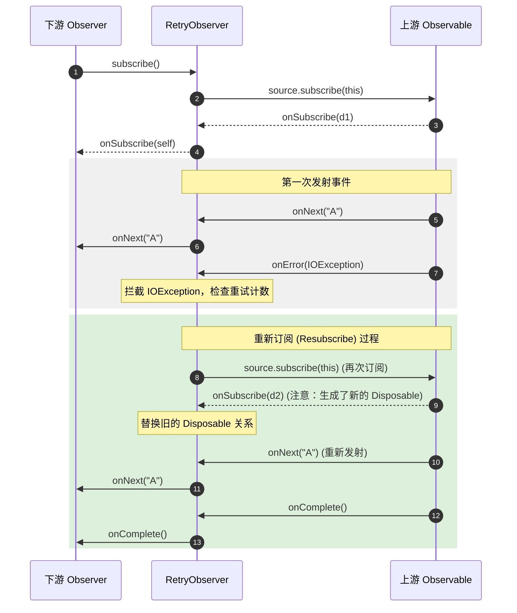
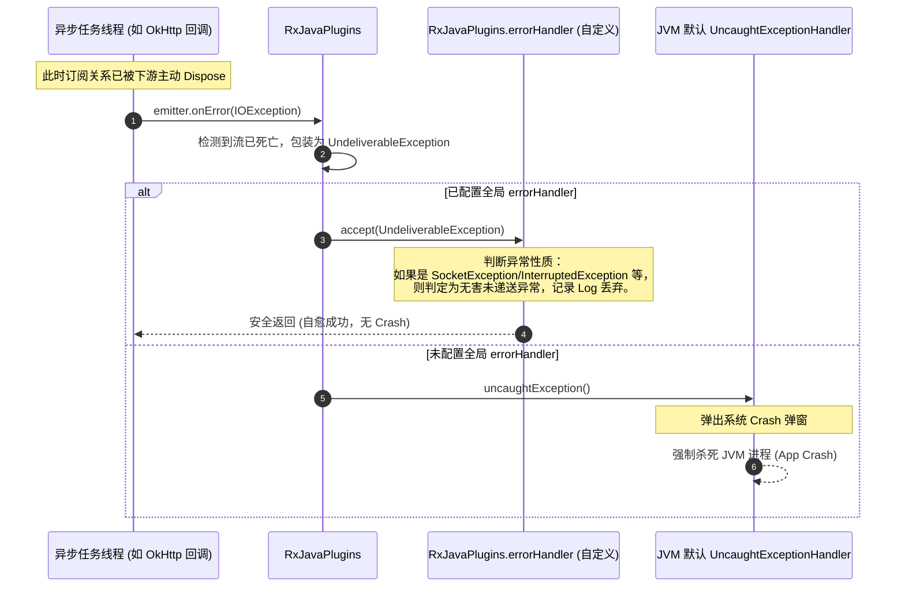

# 5.3.3.3 异常处理

在 Android 异步与并发编程中，异常处理的优雅度直接决定了应用的稳定性。传统并发编程在跨线程异常捕获上存在天然缺陷，而响应式编程（以 RxJava 为代表）则提出了一套基于单管道、数据流物理熔断的全新异常处理哲学。

本篇将深入探讨传统并发异常拦截的局限，解密 RxJava 异常熔断的设计本质，逐行剖析常用异常兜底、恢复与自愈操作符（`onErrorReturn`、`onErrorResumeNext`、`retry`、`retryWhen`、`timeout`）的底层源码，并提供商业级全局未递送异常（`UndeliverableException`）的防御方案。

---

## 1. 传统并发异常拦截局限与响应式流熔断哲学

### 1.1 为什么 try-catch 对异步线程抛出的 Throwable 无能为力？

在 Java 虚拟机（JVM）中，异常的捕获与传递是基于**调用栈（Call Stack）**的。当一个异常被抛出时，JVM 会沿着当前线程的调用栈向回寻找匹配的 `catch` 块。如果找到了，则跳转到对应的异常处理代码；如果一直寻找栈底（即当前线程的 `run()` 方法）仍未捕获，JVM 就会将该异常交给当前线程的 `Thread.UncaughtExceptionHandler` 处理，通常会导致线程死亡，在 Android 上则直接表现为应用闪退（Crash）。

传统的 `try-catch` 结构是**同步**的，它只能捕获当前线程同步调用栈中产生的异常。当我们在主线程或某个工作线程中启动一个异步子线程时，代码的执行逻辑立即发生了分叉：

```java
public void performAsyncTask() {
    try {
        new Thread(() -> {
            // 在子线程（工作线程）中执行异步操作
            throw new RuntimeException("Sub-thread crash!"); 
        }).start();
    } catch (Exception e) {
        // 此处绝对无法捕获到子线程中抛出的 RuntimeException
        Log.e("TAG", "Caught exception: " + e.getMessage());
    }
}
```

在上面的代码中：
1. `Thread.start()` 方法只是向操作系统申请创建并启动线程，它在当前线程（如主线程）中是一个瞬间完成的同步调用。
2. 启动完成后，`performAsyncTask()` 所在的同步代码块执行完毕，`try-catch` 作用域随即退出。
3. 随后，子线程被 CPU 调度执行，其运行在独立的方法调用栈中。当它抛出 `RuntimeException` 时，主线程的调用栈早已销毁，因此外层的 `catch` 块对这个完全处于平行时空的异常根本无法感知。

从 JVM 的微观线程管理角度来看，这种局限性是由以下几个核心机制决定的：

#### 1. 独立的方法帧栈与执行上下文
每个 Java 线程在创建时都会被分配一个独立的 JVM 栈（JVM Stack）。栈由一系列栈帧（Stack Frame）组成，每个栈帧对应一次方法调用。当主线程调用 `new Thread().start()` 时，主线程的方法栈中仅仅完成了 `start()` 这一虚方法的入栈与出栈。
子线程一旦被 CPU 调度，便拥有了完全隔离的本地变量表、操作数栈以及动态链接。此时，子线程的栈底是 `Runnable.run()` 方法。子线程在运行过程中如果抛出异常，其寻找 `catch` 块的查找链条仅限于该子线程自身的栈帧中。

#### 2. Runnable 接口的签名约束
Java 标准库中的 `Runnable.run()` 接口方法声明为 `public abstract void run();`，它没有声明任何抛出异常的 `throws` 语句。这意味着在 `run()` 方法内抛出的所有受检异常（Checked Exception）必须在内部通过 `try-catch` 强行消化；而所有未捕获的非受检异常（RuntimeException 及其子类）或系统错误（Error），在向上逃逸出 `run()` 方法时，便超出了 Java 编译器静态分析的控制范围。

#### 3. UncaughtExceptionHandler 默认崩溃流程的微观逻辑
当异常从 `Runnable.run()` 逸出后，JVM 会通过底层 C++ 代码（在 OpenJDK 中为 `thread.cpp` 的异常分发逻辑）调用该线程的 `dispatchUncaughtException` 方法。该方法的默认逻辑如下：
- 首先检查该线程对象是否通过 `setUncaughtExceptionHandler()` 注册了专有的处理器。
- 若没有，则调用该线程所属线程组（`ThreadGroup`）的 `uncaughtException()` 方法。
- `ThreadGroup` 会继续将异常委托给它的父线程组，直到根线程组。
- 根线程组会尝试分发给全局默认的 `Thread.getDefaultUncaughtExceptionHandler()`。
- 在 Android 平台中，这个默认的处理器在系统启动初始化进程（`Zygote`）时，被 `RuntimeInit` 设置为了一个 `KillApplicationHandler`。该处理器会强行将当前异常输出到控制台（Logcat），显示 `FATAL EXCEPTION` 崩溃日志，随后调用 `Process.killProcess(Process.myPid())` 强行杀死当前 App 进程。

即使使用 `ExecutorService` 线程池，虽然可以通过 `Future.get()` 获取任务执行中的异常，但这仍然要求调用者显式、阻塞地调用 `get()` 方法，或者在特定的轮询机制中处理，无法做到真正的非阻塞异步异常捕获。

#### 4. ThreadLocal 泄漏与线程污染风险
在异步多线程环境中，如果线程由于未捕获的异常暴力终止，其绑定的 `ThreadLocal` 变量可能会残留。特别是在线程池（如 `CachedThreadPool`）中，线程是复用的。如果一个线程因为异常中断而未能执行 `try-finally` 块中的 `ThreadLocal.remove()`，当该线程被回收并重新分配给其他任务时，旧的状态信息将会污染新的执行上下文。RxJava 通过其严格的 `doFinally` 钩子和统一的异常传播管道，确保即使流发生崩溃，所有线程局部的状态也能得到强制重置。

---

### 1.2 Android 主线程 Looper 崩溃拦截黑科技的代价

在 Android 社区中，曾经流行过一种通过拦截主线程 `Looper` 异常来防止 App 闪退的“黑科技”方案。其核心原理如下：

```kotlin
// 伪代码：主线程异常自愈黑科技
Handler(Looper.getMainLooper()).post {
    while (true) {
        try {
            Looper.loop() // 在主线程的主循环内强行再次 loop
        } catch (t: Throwable) {
            // 捕获主线程抛出的所有异常，阻止其向上逃逸至 JVM Crash 处理器
            reportException(t)
        }
    }
}
```

**为什么这种方案在现代 Android 开发中是不被推荐的？其致命缺陷包括：**

- **MessageQueue 状态损坏与不可控黑屏**：
  当主线程抛出异常时，当前正在执行的那个 `Message` 已经半途终止。`MessageQueue` 中后续的绘制信号（`Choreographer` 触发的 `TRAVERSAL` 消息）、生命周期回调（`LAUNCH_ACTIVITY` 等）可能因为异常中断而处于未就绪状态。强行重新 `Looper.loop()` 会导致大量待处理的系统级消息丢失或状态不一致，表现为 Activity 虽未闪退，但界面完全黑屏、按钮无响应或部分生命周期函数不再回调。
- **内存泄漏与死锁**：
  若在 Binder 驱动层正在执行跨进程调用（IPC）并等待返回时，主线程突然发生异常并被此黑科技强行拦截重置，会导致底层的 Binder 状态机错乱，甚至可能使得当前 Activity 处于“僵尸”状态无法被 GC 回收，最终引发 OOM。
- **对比响应式熔断的优势**：
  RxJava 的物理熔断虽然也是一种“放弃当前流”的策略，但它只针对当前订阅的业务数据流进行资源清理和链路熔断，**绝不波及系统的主事件循环（Looper）**。RxJava 能够精准控制业务逻辑的边界，通过在管道层自愈，将崩溃扼杀在业务模块内部，而主线程依旧健康运行，两者的架构合理性高下立判。

---

### 1.3 Java 与 Kotlin 的异常体系差异及对响应式设计的影响

在响应式编程的设计和使用中，Java 与 Kotlin 两种语言对异常的处理态度存在显著的差异，这对操作符的使用产生了微妙的影响。

#### 1. Checked Exception 的编译期约束与解脱
Java 将异常分为两类：受检异常（Checked Exception，如 `IOException`、`SQLException`）和非受检异常（Unchecked Exception，如 `NullPointerException`、`RuntimeException`）。
在 Java 中，如果我们在 `map` 操作符内部调用了一个抛出 `IOException` 的方法，由于 `io.reactivex.functions.Function` 接口的 `apply` 方法签名没有声明抛出受检异常，Java 编译器会强行报错，要求我们必须在 Lambda 内部进行捕获：

```java
// Java 编译报错，必须显式捕获 Checked Exception
observable.map(path -> {
    try {
        return readFiles(path); // 抛出 IOException 的方法
    } catch (IOException e) {
        // 必须手动包装并抛出 RuntimeException
        throw Exceptions.propagate(e); 
    }
});
```

而在 Kotlin 中，所有的异常在编译期都被视为 **Unchecked Exception**。Kotlin 编译器取消了 `throws` 的强制性校验。这意味着我们可以在 Kotlin 的操作符内直接调用抛出受检异常的 Java 方法，代码显得极其简洁：

```kotlin
// Kotlin 编译器放行，无需显式 try-catch
observable.map { path -> readFiles(path) } 
```

#### 2. Exceptions.propagate 的底层魔法
在 Java 环境中，为了在不支持异常签名的 Functional Interface 内部向上抛出受检异常，RxJava 引入了 `Exceptions.propagate(Throwable t)` 工具方法。
深入其源码，其核心逻辑如下：

```java
public static RuntimeException propagate(Throwable t) {
    if (t instanceof RuntimeException) {
        throw (RuntimeException)t;
    } else if (t instanceof Error) {
        throw (Error)t;
    } else {
        // 利用 RuntimeException 的包装机制，绕过受检异常的编译器阻拦
        throw new RuntimeException(t);
    }
}
```
当受检异常被包装为 `RuntimeException` 向上抛出时，RxJava 的操作符拦截机制（如 `map`、`flatMap` 内部的 `try-catch`）会自动剥离这一层 RuntimeException 外壳，将其还原为底层的原始异常并向下游投递。这种动态伪装是 RxJava 能够统一异常模型的重要基石。

---

### 1.4 RxJava 遇到错误即物理熔断流的设计依据是什么？

In 响应式流规范（Reactive Streams Specification）中，任何流的生命周期都严格遵循以下规约：

$$\text{onSubscribe} \rightarrow (\text{onNext})^* \rightarrow (\text{onComplete} \mid \text{onError})$$

这是一个**单向管道模型**。`onError` 与 `onComplete` 处于并列的终结状态位置，这意味着：
- **互斥性**：一旦 `onError` 被发射，流便宣告终结，绝对不能再发射任何 `onNext` 数据或 `onComplete` 信号。
- **物理熔断**：RxJava 将错误视为流运行过程中无法恢复的灾难性事件。当上游操作符（如网络请求、数据库读取）发生异常时，默认的行为是立刻向下游传递 `onError`，并在此过程中**主动切断所有的订阅连接（Dispose）**，释放占用的计算、网络和内存资源，防止系统雪崩。

**为什么必须物理熔断？其设计逻辑有以下三点考量：**

#### 1. 状态一致性保障（State Consistency）
响应式编程强调无状态或状态在流中单向传递。当流的某个节点抛出异常（例如 `map` 转换失败），说明该节点的状态已经受损。
假设我们设计了一个“不熔断”的响应式流，当流中某个元素解析失败时跳过异常继续发射下一个元素，后面的操作符将运行在受损的上下文之上。由于下游操作符可能会维护一些状态（例如 `scan`、`buffer` 或 `window` 操作符），一旦中途丢失了某个关键事件，会导致后续的所有状态计算全部失真。这极易引发链式错误，导致更加难以排查的数据状态错乱。

#### 2. 资源防泄露与防雪崩（Cascading Failure Prevention）
在复杂的异步操作链中，可能会持有大量的底层资源（如 Socket 连接、文件描述符、数据库游标、硬件传感器监听）。当异常发生时，通过物理熔断机制，RxJava 会从下游向上游反向调用 `dispose()`。这一过程是沿着订阅树链条逆向传递的，能够级联式地关闭并释放所有的中间资源。
这类似于微服务架构中的“熔断器”设计，宁可让当前的单次请求失败，也绝不能让无效的垃圾请求继续消耗系统资源，进而拖垮整个进程。如果异常发生后流依然保持开放状态，未能及时清理的流可能导致后台线程池爆满、内存泄漏等严重系统隐患。

#### 3. 契约的严谨性与下游代码的纯粹性
若异常发生后流还能继续发射数据，那么下游的 `Observer` 将不得不处理一种“半损坏”的数据流。下游不仅要处理 `onNext` 的正常数据，还要编写复杂的防御逻辑来判断每个事件是否在错误发生后发射，这破坏了“数据流是连续且合法的实体”这一基本契约。因此，RxJava 选择在架构设计上强制规定：**任何未捕获的 Throwable 都是终结信号，流必须物理熔断。**

然而，在实际的商业开发中，我们往往需要流具备“自愈”或“降级”的能力。为此，RxJava 提供了一系列机制，允许我们在流发生物理熔断**之前**进行拦截、转换或重订阅。

---

## 2. 异常兜底、恢复与自愈操作符底层解密

下面我们将从源码级别拆解 RxJava 的五大核心异常处理操作符，分析它们是如何在底层规避或延迟物理熔断，从而实现流自愈的。

```
                                  +-------------------+
                                  | 发生 Throwable t  |
                                  +---------+---------+
                                            |
                    +-----------------------+-----------------------+
                    |                                               |
         [数据/流 降级自愈]                                   [重试/时域自愈]
                    |                                               |
      +-------------+-------------+                  +--------------+--------------+
      |                           |                  |                             |
[onErrorReturn]          [onErrorResumeNext]      [retry]                       [retryWhen]
拦截t,发射默认值,       拦截t,切换到备用源流,    直接重新订阅上游            转换为错误信号流，
物理熔断终止流。         物理熔断终止旧流。      重构订阅生命周期。          根据信号决定是否重试。
```

---

### 2.1 onErrorReturn：异常降级发射默认值

`onErrorReturn` 用于在捕获到上游异常时，不向下游发射 `onError`，而是发射一个预设的默认值，随后以 `onComplete` 正常结束当前流。

#### 2.1.1 源码级实现剖析

其底层对应的具体实现类为 `ObservableOnErrorReturn`，核心逻辑封装在其内部类 `OnErrorReturnObserver` 中。以下是关键源码剖析：

```java
// io.reactivex.internal.operators.observable.ObservableOnErrorReturn
static final class OnErrorReturnObserver<T> implements Observer<T>, Disposable {
    final Observer<? super T> downstream;
    final Function<? super Throwable, ? extends T> valueSupplier;
    Disposable upstream;

    OnErrorReturnObserver(Observer<? super T> downstream, Function<? super Throwable, ? extends T> valueSupplier) {
        this.downstream = downstream;
        this.valueSupplier = valueSupplier;
    }

    @Override
    public void onSubscribe(Disposable d) {
        if (DisposableHelper.validate(this.upstream, d)) {
            this.upstream = d;
            downstream.onSubscribe(this);
        }
    }

    @Override
    public void onNext(T t) {
        downstream.onNext(t);
    }

    @Override
    public void onError(Throwable t) {
        T v;
        try {
            // 1. 调用用户传入的转换函数，将 Throwable 映射为默认值 v
            v = valueSupplier.apply(t);
        } catch (Throwable e) {
            // 2. 如果转换函数内部自己抛出异常，则作为致命错误，包装为 CompositeException 传给下游
            Exceptions.throwIfFatal(e);
            downstream.onError(new CompositeException(t, e));
            return;
        }

        if (v == null) {
            // 3. 响应式规范不允许发射 null 值，否则抛出 NullPointerException
            NullPointerException e = new NullPointerException("The valueSupplier returned a null value");
            e.initCause(t);
            downstream.onError(e);
            return;
        }

        // 4. 【核心自愈步骤】向下游发射转换后的默认值
        downstream.onNext(v);
        // 5. 紧接着以 onComplete 结束流，完成了异常向正常结束信号的转换
        downstream.onComplete();
    }

    @Override
    public void onComplete() {
        downstream.onComplete();
    }

    @Override
    public void dispose() {
        upstream.dispose();
    }

    @Override
    public boolean isDisposed() {
        return upstream.isDisposed();
    }
}
```

#### 2.1.2 机制剖析与深层思考

当上游抛出异常并触发 `onError(t)` 时，`OnErrorReturnObserver` 拦截了这一终结信号，并没有直接将其投递给 `downstream.onError(t)`。相反，它通过 `valueSupplier` 动态生成降级值，随后以同步的方式向 `downstream` 先投递 `onNext(v)`，再投递 `onComplete()`。

在这一微观流程中，存在以下几个关键细节：
- **`Exceptions.throwIfFatal(e)` 的作用**：在 Java 中，并非所有的 Throwable 都是可以恢复的。例如 `OutOfMemoryError`、`StackOverflowError`、`LinkageError` 等。当抛出这些致命异常时，RxJava 的 `Exceptions.throwIfFatal` 会将其直接向上抛出，而不会让 `onErrorReturn` 拦截。这是因为在 JVM 已经内存耗尽或栈爆掉的情况下，试图去反射执行降级代码不仅徒劳，还会加剧虚弱进程的崩溃。
- **`CompositeException` 的原理**：如果用户传入的 `valueSupplier` 表达式内部本身又发生崩溃（例如访问空引用的缓存数据），RxJava 会将原始的异常 `t` 和二次崩溃的异常 `e` 打包成一个 `CompositeException`。这有助于保留完整的异常轨迹，避免因处理错误的代码报错而掩盖了最原始的网络或数据库问题。
- **局限性**：虽然没有触发下游的 `onError`，但流依旧结束了（因为调用了 `onComplete()`），后续的数据发射被物理切断。它属于一次性的“战术恢复”，无法解决由于周期性发射（例如持续的位置 GPS 更新流）异常而需要流保持存活的场景。

#### 2.1.3 共享可变状态陷阱（Shared Mutable State）
在使用 `onErrorReturn` 降级时，开发者常犯的一个严重错误是返回一个全局共享的可变容器或单例对象：

```kotlin
// 【危险代码】
val cacheList = ArrayList<Data>()
observable.onErrorReturn { cacheList }
```
若有多个订阅链同时发生错误，它们将共享同一个 `cacheList` 内存引用。一旦某个订阅链对该 List 进行了增加、修改、清空操作，其他订阅链的数据源将会发生莫名的数据同步错乱，甚至在多线程并发修改时抛出 `ConcurrentModificationException`。
**避坑指南**：降级值若为集合，必须通过 `Collections.unmodifiableList(list)` 包装为只读，或者每次在 Lambda 内重新 `new` 创建一个新对象，以实现内存物理隔离。

---

### 2.2 onErrorResumeNext：遭遇异常无缝承接备用流

与 `onErrorReturn` 返回单个静态值不同，`onErrorResumeNext` 允许我们在上游遭遇异常时，整体切换到另一个备用的 `Observable` 数据源。下游 `Observer` 对这一无缝切换过程是完全无感知的。

#### 2.2.1 源码级实现剖析

其底层核心类为 `ObservableOnErrorResumeNext`，对应内部类 `OnErrorResumeNextObserver`。源码中通过巧妙的代理模式，实现了对下游 `downstream` 的复用与上游 `Disposable` 链接的动态替换。

```java
// io.reactivex.internal.operators.observable.ObservableOnErrorResumeNext
static final class OnErrorResumeNextObserver<T> implements Observer<T> {
    final Observer<? super T> downstream;
    final Function<? super Throwable, ? extends ObservableSource<? extends T>> nextSupplier;
    final boolean allowDelayError;
    final SequentialDisposable arbiter;
    
    boolean once;

    OnErrorResumeNextObserver(Observer<? super T> downstream, 
                              Function<? super Throwable, ? extends ObservableSource<? extends T>> nextSupplier, 
                              boolean allowDelayError) {
        this.downstream = downstream;
        this.nextSupplier = nextSupplier;
        this.allowDelayError = allowDelayError;
        this.arbiter = new SequentialDisposable(); // 顺序 Disposable 控制器，用于动态替换上游链接
    }

    @Override
    public void onSubscribe(Disposable d) {
        // 使用 arbiter 进行托管替换，确保切换源时，下游持有的 Disposable 不被废弃
        arbiter.replace(d);
    }

    @Override
    public void onNext(T t) {
        downstream.onNext(t);
    }

    @Override
    public void onError(Throwable t) {
        if (once) {
            // 防止备用流再次报错时产生无限递归死循环
            downstream.onError(t);
            return;
        }
        once = true;

        ObservableSource<? extends T> p;
        try {
            // 1. 调用 nextSupplier 根据 Throwable 动态生成备用 ObservableSource
            p = nextSupplier.apply(t);
        } catch (Throwable e) {
            Exceptions.throwIfFatal(e);
            downstream.onError(new CompositeException(t, e));
            return;
        }

        if (p == null) {
            NullPointerException npe = new NullPointerException("Observable is null");
            npe.initCause(t);
            downstream.onError(npe);
            return;
        }

        // 2. 【核心自愈步骤】将备用流订阅到自身（或通过新生成的 Observer 进行桥接）
        // 这里的 subscribe 传入的是当前对象自身，因为它实现了 Observer 接口
        // 这样备用流发射的数据就会无缝流入当前的 onNext/onError/onComplete 方法中，最后转发给 downstream
        p.subscribe(this);
    }

    @Override
    public void onComplete() {
        downstream.onComplete();
    }
}
```

#### 2.2.2 核心设计要点与防坑指南

- **`SequentialDisposable` 的桥接**：
  在切换数据源的过程中，下游的 `Observer` 只有一次 `onSubscribe` 机会。为了在不向外暴露多个 `Disposable` 的前提下切换上游，RxJava 使用了 `SequentialDisposable`（或在 Flowable 中使用 `SubscriptionArbiter`）。
  当上游发生错误触发 `onError` 时，旧的订阅连接事实上已经被物理销毁。为了让下游在调用 `dispose()` 时能够同时注销新订阅的备用流，`arbiter.replace(d)` 会原子性地以 CAS 方式将 `SequentialDisposable` 内部持有的旧上游 `d` 替换为新上游的 `Disposable`。
- **冷数据源防重复加载开销**：
  在使用 `onErrorResumeNext` 时，一个常见的性能陷阱是提前创建备用 Observable。
  ```kotlin
  // 【反面教材】
  observable.onErrorResumeNext(getFallbackFromDatabase()) // getFallbackFromDatabase 会被立即执行，无论是否报错
  ```
  如果 `getFallbackFromDatabase()` 方法内部有较重的 I/O 查询，那么即使主数据流完全正常，这个 I/O 操作依然会同步执行，造成不必要的 CPU 和内存浪费。
  **正确做法**：必须利用 Lambda 表达式的惰性计算特性，或者使用 `Observable.defer`：
  ```kotlin
  // 【正确示范】
  observable.onErrorResumeNext { throwable -> getFallbackFromDatabase() }
  ```
  这样只有在真正触发 `onError` 时，才会去调用 `getFallbackFromDatabase()` 构建备用流。

#### 2.2.3 生产级多级灾备降级自愈实践

在大型商业 App 中，当拉取核心配置数据时，我们往往需要设计三级网络防御体系：**主 API 接口 -> 备用 CDN 数据 -> 本地缓存数据库**。
我们可以通过 `onErrorResumeNext` 操作符的嵌套，以极其流式且优雅的形式实现这一体系：

```kotlin
fun fetchAppConfig(): Observable<ConfigData> {
    return apiService.getMainConfig() // 1. 主 API 接口
        .onErrorResumeNext { throwable ->
            Log.e("BackupSystem", "Main API failed, switching to backup CDN...", throwable)
            cdnService.getBackupConfig() // 2. 切换至 CDN 数据源
        }
        .onErrorResumeNext { throwable ->
            Log.e("BackupSystem", "CDN failed, loading local SQLite cache...", throwable)
            database.configDao().getLocalConfig() // 3. 切换至本地 Room 数据库缓存
        }
        .subscribeOn(Schedulers.io())
}
```

**垃圾回收机制对旧流的回收释放**：
当第一级 `apiService.getMainConfig()` 发生网络报错时，内部的 `arbiter.replace(d)` 替换了 Disposable，切断了与第一级数据源的强引用。随着 `once = true` 的设定，旧的 Observable 对象以及底层的 OkHttp Call 任务节点会被 JVM 回收器正常回收，完全避免了多级跳转带来的内存堆积。

---

### 2.3 retry：通过“重新订阅”实现自愈

`retry` 操作符的本质极其质朴而暴力：**一旦收到上游的 onError 信号，就对上游的数据源进行重新订阅（Resubscribe）。**

#### 2.3.1 重新订阅（Resubscribe）的微观过程

当我们在流中调用 `.retry(3)` 时，底层会构建一个 `ObservableRetryBiPredicate`（或者根据不同重试参数构建相应的操作符）。重试的核心逻辑是通过重新调用 `source.subscribe(this)` 来实现的：



#### 2.3.2 源码级实现剖析

以下是 `ObservableRetryBiPredicate` 的核心处理类 `RetryObserver` 的实现剖析：

```java
// io.reactivex.internal.operators.observable.ObservableRetryBiPredicate
static final class RetryObserver<T> extends AtomicInteger implements Observer<T> {
    final Observer<? super T> downstream;
    final SequentialDisposable sa;
    final ObservableSource<? extends T> source;
    final BiPredicate<? super Integer, ? super Throwable> predicate;
    
    int retries; // 已重试次数计数器

    RetryObserver(Observer<? super T> actual, 
                  BiPredicate<? super Integer, ? super Throwable> predicate, 
                  SequentialDisposable sa, 
                  ObservableSource<? extends T> source) {
        this.downstream = actual;
        this.sa = sa;
        this.source = source;
        this.predicate = predicate;
    }

    @Override
    public void onSubscribe(Disposable d) {
        // 将新产生的 Disposable 替换到 SequentialDisposable 中，保持下游 Disposable 稳定性
        sa.update(d);
    }

    @Override
    public void onNext(T t) {
        downstream.onNext(t);
    }

    @Override
    public void onError(Throwable t) {
        boolean b;
        try {
            // 1. 调用 predicate 判断是否满足重试条件。传入已重试次数（++retries）和当前的错误 t
            b = predicate.test(++retries, t);
        } catch (Throwable e) {
            Exceptions.throwIfFatal(e);
            downstream.onError(new CompositeException(t, e));
            return;
        }
        
        // 2. 如果不满足重试条件，直接向下游传递 onError，流物理熔断终止
        if (!b) {
            downstream.onError(t);
            return;
        }
        
        // 3. 【核心自愈步骤】如果满足条件，重新订阅数据源
        subscribeNext();
    }

    void subscribeNext() {
        // 通过 递增/递减 WIP (Work In Progress) 状态来保证在多线程下不会发生堆栈溢出
        if (getAndIncrement() == 0) {
            int missed = 1;
            do {
                if (sa.isDisposed()) {
                    return;
                }
                // 重新订阅源
                source.subscribe(this);
            } while (decrementAndGet() != 0);
        }
    }
}
```

#### 2.3.3 重订阅防堆栈溢出与冷热流陷阱

##### 1. 基于 WIP 的同步递归解耦机制
仔细阅读 `subscribeNext()`，可以发现它继承自 `AtomicInteger`，并使用了 `getAndIncrement()` 方法。这是典型的 **Trampoline 循环防爆栈设计**（也称作序列化发射逻辑）。
如果重试是**同步**发生的（即上游是在当前线程立即抛出错误并重订阅），如果没有这个 `getAndIncrement()` 的 CAS 控制，每次 `source.subscribe(this)` 都会在当前线程的方法栈中开辟新栈帧，如果无限重试，将导致 `StackOverflowError`。
通过引入 `AtomicInteger` 计数器，第一个触发重试的线程会进入 `do-while` 循环；若在循环内再次触发 `onError` 并进入 `subscribeNext`，由于值已经大于 0，后续的调用只会累加计数器并直接退出当前方法，由最外层的循环统一消费，从而将递归调用巧妙地转换成了平铺的 `while` 循环。

##### 2. 冷流与热流对重订阅的本质差异
`retry` 重新订阅机制能正常工作的前提是：**上游必须是一个冷流（Cold Observable）。**
- **冷流** 在被订阅时，会重新开始执行其内部逻辑（例如重新发送网络请求、重新从文件读取数据）。
- **热流**（如 `Subject`、或者经过 `share()`、`publish()` 转换为多播的流）本身在内部维护着活跃的发布状态。对热流重新订阅，仅仅是把观察者重新加入到其监听列表里，**绝对不会**促使热流重新向服务器请求或重新生成数据。
如果对热流使用 `retry`，在发生错误后它也仅仅是无声地重新挂载，不会收到任何重发的数据。
**自愈建议**：若想重试某个热流，必须使用 `Observable.defer { ... }` 或者是 `fromCallable` 等方法，将热流的创建逻辑包裹在冷流之中，使每次重订阅时都能重新生成一个新的热流实例。

---

### 2.4 retryWhen：时域与条件自适应重试

`retryWhen` 是 RxJava 中设计最精巧、灵活性最高的操作符。它不再是盲目地立即重新订阅，而是将错误转化为一个**信号流**，允许下游根据信号流的发射情况，来决定是**延迟重试**、**立刻重试**，还是**放弃重试投递错误**。

#### 2.4.1 retryWhen 信号环流反馈机制

许多开发者在使用 `retryWhen` 时感到费解，关键在于没有理解其底层的“信号环路”。

`retryWhen` 内部的核心思想是：**把每一次发生的 Throwable 抛入一个 `PublishSubject` 中，这个 Subject 被作为参数传递给用户定义的 handler 函数。用户定义的 handler 将这个 `Observable<Throwable>` 进行操作符变换（例如 `zip`、`flatMap`、`timer`），生成一个新的“决策流” `Observable<?>`。`retryWhen` 会订阅这个决策流：**
- 只要决策流发射一个 `onNext` 数据，上游源就会被**重新订阅一次**（重新订阅的触发时机与 `onNext` 发射的时机严格同步，实现了时域延迟控制）。
- 如果决策流发射了 `onError`，则重试终止，该错误直接作为终结信号发给下游 `Observer`。
- 如果决策流发射了 `onComplete`，重试同样终止，下游收到 `onComplete`。

以下是 retryWhen 的物理流转闭环拓扑图：

```
                    +------------------------------------------+
                    |                                          |
                    v                                          |
           +-----------------+                                 |
           | 原始 Observable  |                                 | 重新订阅 (Resubscribe)
           +--------+--------+                                 |
                    | 发射 onError(Throwable)                  |
                    v                                          |
       +------------+------------+                             |
       |  PublishSubject<Throwable>|                           |
       +------------+------------+                             |
                    | 转化为信号流                              |
                    v                                          |
           +--------+--------+                                 |
           | handler(Errors) |                                 |
           +--------+--------+                                 |
                    | flatMap 混合 zip 延时计算                 |
                    v                                          |
         +----------+----------+                               |
         |  决策 Observable<?> | +--- 发射 onNext(0) 信号 ------+
         +----------+----------+
                    |
                    +----------------- 发射 onError/onComplete ----> 下游 Observer
```

#### 2.4.2 指数退避重试（Exponential Backoff Retry）的生产级 Kotlin 实践

在商业项目中（如支付请求、核心网络拉取），当网络抖动时，如果立刻发起重试，极易加剧服务器的雪崩效应（瞬间请求量翻倍）。业界标准的做法是采用**指数退避算法（Exponential Backoff）**，即重试延迟随着重试次数的增加而呈指数级递增（例如依次延迟 1s, 2s, 4s, 8s），同时设定最大重试次数。

以下是基于 `retryWhen` 实现的生产级指数退避重试的 Kotlin 源码实现：

```kotlin
import io.reactivex.Observable
import io.reactivex.ObservableSource
import io.reactivex.functions.BiFunction
import io.reactivex.functions.Function
import java.io.IOException
import java.util.concurrent.TimeUnit

/**
 * 生产级指数退避重试机制
 * @param maxRetryAttempts 最大尝试重试次数
 * @param initialDelayMillis 初始延迟时间（毫秒）
 * @param isRetryableException 异常过滤器，只有符合条件的异常才进行重试，默认只有 IOException 才重试
 */
class ExponentialBackoffRetry(
    private val maxRetryAttempts: Int = 3,
    private val initialDelayMillis: Long = 1000L,
    private val isRetryableException: (Throwable) -> Boolean = { it is IOException }
) : Function<Observable<Throwable>, ObservableSource<*>> {

    override fun apply(errors: Observable<Throwable>): ObservableSource<*> {
        return errors.zipWith(
            // 1. 利用 Observable.range 生成一个 1 到 maxRetryAttempts + 1 的递增整数流，代表当前的尝试次数
            Observable.range(1, maxRetryAttempts + 1),
            BiFunction { throwable: Throwable, attempt: Int ->
                // 将错误与其对应的重试次数打包成 Pair 往下游传递
                AttemptWrapper(throwable, attempt)
            }
        ).flatMap { wrapper ->
            val attempt = wrapper.attempt
            val error = wrapper.throwable

            // 2. 检查是否达到了最大重试次数，或者是否是不允许重试的严重异常（如 NullPointerException）
            if (attempt > maxRetryAttempts || !isRetryableException(error)) {
                // 如果不满足重试条件，直接向下游传递该异常，终止重试环流
                Observable.error(error)
            } else {
                // 3. 计算延迟时间：initialDelayMillis * 2^(attempt - 1)
                // 第一次重试延迟：1000 * 2^0 = 1000ms (1s)
                // 第二次重试延迟：1000 * 2^1 = 2000ms (2s)
                // 第三次重试延迟：1000 * 2^2 = 4000ms (4s)
                val delay = initialDelayMillis * Math.pow(2.0, (attempt - 1).toDouble()).toLong()
                
                // 4. 【时域自愈核心】发射一个延时信号。
                // 只有当 Observable.timer 计时结束后发射 0L 时，下游的 RedoObserver 才会重新订阅原始流。
                Observable.timer(delay, TimeUnit.MILLISECONDS)
            }
        }
    }

    private data class AttemptWrapper(val throwable: Throwable, val attempt: Int)
}
```

#### 2.4.3 核心实现细节与事件流机制解密

1. **`zipWith` 的拉链阻尼锁机制**：
   在 `apply` 方法中，`errors` 是由 `retryWhen` 投递来的错误流。我们通过 `zipWith(Observable.range(1, maxRetryAttempts + 1))` 将其与一个序列流结合。
   `zip` 操作符拥有独特的双指针对齐特征：只有当两个输入流均有数据发射时，它才会合成输出。
   当上游发生第 $N$ 次错误时，`errors` 发射第 $N$ 个错误；由于 `range` 同时发射第 $N$ 个整数，二者成功配对。
   一旦错误次数超过最大限制，即发生第 `maxRetryAttempts + 1` 次错误时，`range` 流由于已经耗尽而发射 `onComplete`，此时 `zip` 操作符会立即通知下游 `onComplete`，重试闭环彻底终止。这极其精妙地防止了流的无限重试死循环。

2. **`flatMap` 的信号重定向与延迟控制**：
   在 `flatMap` 转换块中，我们收到了 `AttemptWrapper` 包装的异常与次数信息。
   - 若超出重试界限或异常不可重试，我们返回 `Observable.error(error)`。该错误事件流动到决策流的末端，导致订阅决策流的 `RedoObserver` 收到这一错误，并立刻将其透传给真正的下游 `downstream`，重试终结。
   - 若符合重试要求，我们构建一个 `Observable.timer(delay, TimeUnit.MILLISECONDS)`。该操作符会开启一个调度器定时任务，在 `delay` 毫秒后向流中抛出一个 `0L`（`onNext` 事件）。
   - 这个 `onNext` 事件是整个机制的关键。一旦决策流输出任何一个正常的 `onNext` 数据，`RedoObserver` 的 `onNext` 方法就会被调用，在其内部会执行 `source.subscribe(this)`，从而触发原始数据源的再一次拉取。

#### 2.4.4 微观执行事件环路时序推导

为了彻底理清 `retryWhen` 内部多重操作符变换（`zipWith` + `flatMap` + `timer`）的交互流程，我们可以将 3 次重试失败的微观状态变化拆解为以下明确步骤：

1. **第一次 onError 触发**：
   - 原始流在执行过程中产生 `IOException`，被内部的 `RedoObserver` 拦截。
   - `RedoObserver` 向内部的 `PublishSubject` 发送事件：`errors.onNext(IOException)`。
   - 此时，`zipWith` 接收到这个 `IOException`。与此同时，`Observable.range(1, 4)` 吐出第一个元素 `1`。
   - `zipWith` 将其打包为 `AttemptWrapper(IOException, 1)` 并向下传递。
   - `flatMap` 接收到此包裹，检查条件：`1 <= 3`。判定通过，执行 `Observable.timer(1000)`。
   - 1000ms 后，定时器触发发射 `0L`。
   - `RedoObserver` 收到 `0L` 这一 `onNext` 信号，立即向原始数据源发起重新订阅。

2. **第二次 onError 触发**：
   - 重新订阅后的流再次报错 `IOException`，`RedoObserver` 再次拦截并向 `PublishSubject` 发送：`errors.onNext(IOException)`。
   - `zipWith` 收到第二个异常，并与 `range` 产生的 `2` 进行配对。
   - `flatMap` 收到 `AttemptWrapper(IOException, 2)`，延迟计算为 $1000 \times 2^1 = 2000\text{ms}$。
   - 2000ms 后，定时器发射 `0L`，驱使 `RedoObserver` 进行第二次重新订阅。

3. **第三次 onError 触发（耗尽重试次数）**：
   - 重新订阅的数据源第三次抛出 `IOException`。
   - `zipWith` 收到该异常，并与 `range` 产生的最后一个元素 `3` 配对。
   - `flatMap` 计算出延迟时间为 $1000 \times 2^2 = 4000\text{ms}$。
   - 4000ms 后重新订阅。

4. **第四次 onError 触发（最终失败）**：
   - 重新订阅后第四次发生错误 `IOException`。
   - `zipWith` 尝试进行配对。但此时，由于 `range(1, 4)` 最多只能发射 3 个数据，其指针已指向终结，`range` 流随即调用 `onComplete`。
   - 此时 `zipWith` 发现其右侧的整数源已关闭，根据 `zip` 协议，它无法再进行配对，于是立即向后级发射 `onComplete`。
   - 决策流结束。`RedoObserver` 收到决策流的 `onComplete`，得知重试彻底失败，最后将最开始抛出的 `IOException` 通过 `downstream.onError(IOException)` 投递给下游的真实观察者，流熔断结束。

通过这种纯事件驱动的拉阻模型，RxJava 将复杂的时序控制平铺成了逻辑极为严密的操作符管道，在无需引入任何全局变量或定时线程锁的前提下，优雅地实现了复杂的自愈策略。

---

### 2.5 timeout：超时回退与多线程原子防竞争机制

在网络环境不稳定的 Android 应用场景中，超时拦截是防御接口无响应挂起的重要手段。`timeout` 操作符可以在上游未在规定时间内发射数据时，自动切断连接并投递 `TimeoutException`，或者平滑切换到备用数据源。

#### 2.5.1 timeout 核心原理剖析

其底层具体类是 `ObservableTimeout`，对应的核心观察者是 `TimeoutObserver`。
1. 在订阅开始时，`TimeoutObserver` 会通过传入的 `Scheduler` 启动一个定时任务 `TimeoutTask`，设定的延迟时间为我们配置的超时阈值。
2. 当上游正常发射 `onNext(t)` 时，`TimeoutObserver` 拦截此事件，并做两件事：
   - 转发 `onNext(t)` 给下游。
   - **重置定时器**：先取消（`dispose`）前一个定时任务，然后再启动一个新的定时任务，重新开始倒计时。
3. 如果在倒计时结束前，上游一直没有发射新事件，定时任务 `TimeoutTask` 就会被执行。在任务中，它会判定为超时，并执行切换备用流（如果配置了 `other` 参数）或向下游投递 `TimeoutException`。

除了这一基于固定时间间隔的重载，RxJava 还支持**动态元素超时（Dynamic Item Timeout）**操作符：
```java
public final <U, V> Observable<T> timeout(
    ObservableSource<U> firstTimeoutIndicator,
    Function<? super T, ? extends ObservableSource<V>> itemTimeoutIndicator
)
```
此重载支持我们根据上游发射的具体数据内容，动态调整下一次的超时判定时长。例如在大包数据传输时指定较长的超时指示流，而在心跳包等小包时指定极短的超时指示流。其内部也是基于原子版本控制，每当有新的 `itemTimeoutIndicator` 产生，就会取消上一次的指示流订阅并开启新的订阅，其多线程防竞争的微观设计与固定超时机制异工同曲。

---

#### 2.5.2 核心痛点：多线程高并发下的竞争与原子锁方案

在异步多线程环境中，`timeout` 面临着一个极其严苛的并发竞争场景：
**“上游的 onNext 数据发射” 与 “定时器线程的超时任务触发” 几乎在同一微秒发生。**

如果缺乏严密的同步控制，可能会引发以下两个灾难性 Bug：
- 下游既收到了 `onNext` 数据，紧接着又收到了 `TimeoutException`，破坏了响应式流单管道终结信号的协议。
- 超时任务执行了切换到备用流的逻辑，而此时主源的 `onNext` 正在并行投递中，导致下游收到重复或者交错的数据。

为了解决这个多线程竞争问题，RxJava 引入了**原子版本计数器（Index / Versioning）**和 **CAS 原子锁** 机制。

以下是 `ObservableTimeout` 核心类 `TimeoutObserver` 的实现剖析：

```java
// io.reactivex.internal.operators.observable.ObservableTimeout
static final class TimeoutObserver<T> extends AtomicReference<Disposable> 
    implements Observer<T>, Disposable, TimeoutConsumer {
    
    final Observer<? super T> downstream;
    final long timeout;
    final TimeUnit unit;
    final Scheduler.Worker worker;
    final SequentialDisposable task;
    
    // 【核心同步锁】使用 AtomicLong 维护当前期望的数据序列号/版本号
    final AtomicLong index; 
    
    ObservableSource<? extends T> other; // 备用源
    Disposable upstream;

    TimeoutObserver(Observer<? super T> downstream, long timeout, TimeUnit unit, 
                    Scheduler.Worker worker, ObservableSource<? extends T> other) {
        this.downstream = downstream;
        this.timeout = timeout;
        this.unit = unit;
        this.worker = worker;
        this.other = other;
        this.task = new SequentialDisposable();
        this.index = new AtomicLong();
    }

    @Override
    public void onSubscribe(Disposable d) {
        if (DisposableHelper.validate(this.upstream, d)) {
            this.upstream = d;
            downstream.onSubscribe(this);
            // 订阅启动，开启第一个倒计时任务
            startTimeout(0L);
        }
    }

    @Override
    public void onNext(T t) {
        long idx = index.get();
        // 如果流已经发生了超时或已终结，其 index 会被设置为 Long.MAX_VALUE，在此拦截并丢弃数据
        if (idx == Long.MAX_VALUE) {
            return;
        }
        
        // 尝试递增版本号。只有在版本号匹配且成功递增的情况下，才推进流
        if (!index.compareAndSet(idx, idx + 1)) {
            return;
        }

        // 取消前一个倒计时任务，重置定时任务
        task.get().dispose();

        // 转发数据给下游
        downstream.onNext(t);

        // 开启下一次数据的倒计时，传入递增后的版本号
        startTimeout(idx + 1);
    }

    void startTimeout(long nextIndex) {
        // 创建超时任务，绑定当前期望的版本号 nextIndex
        TimeoutTask taskWrapper = new TimeoutTask(nextIndex, this);
        task.replace(worker.schedule(taskWrapper, timeout, unit));
    }

    @Override
    public void onTimeout(long idx) {
        // 【超时触发的原子校验】
        // 只有当定时任务被唤醒时，传入的 idx 与当前的 index 依然严格相等，说明在倒计时期间没有任何 onNext 触发
        // 我们通过 compareAndSet 将 index 彻底锁定为 Long.MAX_VALUE
        if (index.compareAndSet(idx, Long.MAX_VALUE)) {
            // 切断与主源的订阅连接
            DisposableHelper.dispose(upstream);

            if (other == null) {
                // 如果没有备用源，抛出 TimeoutException
                downstream.onError(new TimeoutException(TimeoutHelper.timeoutMessage(timeout, unit)));
                worker.dispose();
            } else {
                // 如果有备用源，无缝切换
                long c = index.get(); // 锁定后确保不会再被任何 onNext 干扰
                ObservableSource<? extends T> source = other;
                other = null;
                // 订阅备用源，将下游包装传入
                source.subscribe(new TimeoutFallbackObserver<T>(downstream, this));
            }
        }
        // 如果 CAS 失败，说明在超时触发的瞬间有 onNext 抢占了 index，使其增加了，此处定时任务静默失效
    }

    @Override
    public void onError(Throwable t) {
        // 锁定版本号，防止后续超时逻辑再次被触发
        if (index.getAndSet(Long.MAX_VALUE) != Long.MAX_VALUE) {
            task.dispose();
            downstream.onError(t);
            worker.dispose();
        }
    }

    @Override
    public void onComplete() {
        if (index.getAndSet(Long.MAX_VALUE) != Long.MAX_VALUE) {
            task.dispose();
            downstream.onComplete();
            worker.dispose();
        }
    }
}
```

#### 2.5.3 深度解密：并发场景下的 CAS 状态转移矩阵

为了彻底搞清楚 `index.compareAndSet(idx, idx + 1)` 与 `index.compareAndSet(idx, Long.MAX_VALUE)` 如何完美避开多线程死锁与竞争，我们来假设一个极端的并发场景：
- **线程 A** 运行在 RxJava 工作线程上，刚从服务器拿到网络数据，准备回调主数据源的 `onNext("Result")`。
- **线程 B** 是定时器调度线程，倒计时任务正好结束，系统被唤醒并开始调用 `onTimeout(idx)`。
此时设当前 `index` 值为 `2`（表示已经正常收到了两次数据，第三次在倒计时中）。

以下是不同执行次序下的状态转换判定：

##### 场景一：线程 A（数据通道）抢先一步

1. 线程 A 获取当前版本号 `idx = 2`。
2. 线程 A 成功执行 CAS 操作：`index.compareAndSet(2, 3)`。此时 `index` 的值变为 `3`。
3. 线程 A 调用 `task.get().dispose()` 取消了正在等待的定时任务，随后将 `Result` 派发给下游，并重新通过 `startTimeout(3)` 创建一个期望版本号为 `3` 的定时任务。
4. 稍后，线程 B（已在执行队列中无法被立刻取消）被唤醒，执行 `onTimeout(2)`。
5. 线程 B 在其方法内部检查 `index.compareAndSet(2, Long.MAX_VALUE)`。
6. **由于 `index` 的值已被线程 A 变更为 `3`，CAS 操作宣告失败**。线程 B 的超时回调直接退出，没有产生任何副作用，数据传输流保持安全。

##### 场景二：线程 B（超时通道）抢先一步

1. 线程 B 被调度器唤醒，传入的期待版本号为 `idx = 2`。
2. 线程 B 抢先一步成功执行 CAS：`index.compareAndSet(2, Long.MAX_VALUE)`。此时 `index` 被原子性地锁定为最大值 `Long.MAX_VALUE`。
3. 线程 B 顺理成章地调用 `upstream.dispose()` 注销主数据源，随后调用 `downstream.onError(TimeoutException)` 关闭流。
4. 此时，线程 A 终于拿到数据并调用 `onNext`。
5. 线程 A 发现当前 `idx = index.get()`（即 `Long.MAX_VALUE`），发现其已经等于 `Long.MAX_VALUE`，在 `onNext` 第一步便被直接 `return` 拦截并过滤，根本无法将数据投递到下游。

通过这一无锁的 CAS 状态机设计，RxJava 仅使用一个 `AtomicLong` 计数器就解决了多线程同步锁带来的上下文切换开销，并且在数学逻辑上百分之百保证了数据通道与超时通道的绝对互斥。

---

## 3. 致命闪退防御：未递送异常（UndeliverableException）与全局自愈兜底

在 Android 开发中，有一类崩溃在 APM 后台上非常高频，但却很难通过普通的代码定位。它们往往以 `io.reactivex.exceptions.UndeliverableException` 的形式出现。

---

### 3.1 UndeliverableException 产生机理

#### 3.1.1 什么是未递送异常？
根据响应式流规范，当一个流被 `dispose()` 取消订阅，或者已经触发了 `onError` / `onComplete` 物理熔断后，该流的生命周期就已经宣告死亡。

但是在多线程并发的实际场景中，异步工作线程（如 OkHttp 的网络请求线程、底层的线程池）可能还在继续运行。如果在这些线程中再次调用了 `emitter.onError(t)`，或者在流终结后发生了某些致命异常，RxJava 会面临一个尴尬的境地：**这个异常无法投递给任何 Observer，因为订阅连接早已关闭。**

为了防止异常被彻底静默吞掉（吞掉可能导致严重的逻辑错误和排障困难），RxJava 规定：**所有无法投递给下游的异常，必须向上交给 `RxJavaPlugins.onError(Throwable)` 处理。**

以下是几个在 Android 商业项目中极易产生 `UndeliverableException` 的典型场景：

##### 1. Retrofit + OkHttp 超时后取消订阅
用户进入一个 Activity，RxJava 发起了一个 Retrofit 网络请求。
由于网络极慢，用户选择退出 Activity，此时 RxJava 的订阅关系在 `onDestroy()` 中被主动 `dispose()` 释放。
几乎在同一瞬间，底层 OkHttp 发生了 `SocketTimeoutException`。此时，`RxJavaCallAdapter` 会试图向已被销毁的 `Emitter` 发射 `onError(SocketTimeoutException)`。由于订阅已切断，RxJava 无法将其向下投递，只能将其包装为 `UndeliverableException` 传递给 `RxJavaPlugins.onError`。

##### 2. `zip` / `combineLatest` 操作符的物理熔断
当使用 `zip` 操作符打包两个网络请求 A 和 B 时：
假设请求 A 率先报错。由于物理熔断机制，`zip` 会立刻向下游投递 `onError(A_Error)` 并切断对 B 的订阅。
当几秒钟后请求 B 也报错了，它的 `onError(B_Error)` 将无处可去。由于订阅连接已被 A 释放，B 的异常便沦为了未递送异常。

##### 3. 自定义数据源中缺乏 `isDisposed` 防护

许多 Android 开发者在编写自定义的 `ObservableOnSubscribe` 时，习惯于如下写法：

```kotlin
// 【错误示范】
Observable.create<String> { emitter ->
    client.fetchAsync(object : Callback {
        override fun onFailure(call: Call, e: IOException) {
            // 如果此时 Activity 已销毁，emitter 已经被 disposed 释放
            // 直接调用 onError 会直接抛出未递送异常，导致应用崩溃
            emitter.onError(e) 
        }

        override fun onResponse(call: Call, response: Response) {
            emitter.onNext(response.body()?.string() ?: "")
            emitter.onComplete()
        }
    })
}
```

**为什么即使加了 `if (!emitter.isDisposed())` 依然存在 Crash 风险？**

```kotlin
// 【改进但仍不完美的方案】
override fun onFailure(call: Call, e: IOException) {
    if (!emitter.isDisposed) {
        // 在多线程竞争下，如果刚通过 isDisposed 判定为 false 之后的一微秒，
        // 用户关闭了界面导致主线程执行了 dispose()，
        // 紧接着子线程调用 emitter.onError(e)，此时依然会引发 UndeliverableException
        emitter.onError(e)
    }
}
```

由于 `isDisposed` 的读取和 `emitter.onError(e)` 并不是一个原子操作，在它们执行的微秒级缝隙中如果发生了订阅注销，依然无法百分之百防御崩溃。因此，**在客户端框架设计中，全局配置防闪退拦截器是维持 Crash 率指标的最后也是最牢固的防线**。

---

#### 3.1.2 为什么默认会导致应用闪退（Crash）？

我们来看看 `RxJavaPlugins.onError()` 的内部源码实现逻辑：

```java
// io.reactivex.plugins.RxJavaPlugins
public static void onError(@NonNull Throwable error) {
    Consumer<? super Throwable> handler = errorHandler; // 全局 errorHandler
    
    if (error == null) {
        error = new NullPointerException("onError called with null. Null values are generally not allowed in 2.x operators and sources.");
    } else {
        // 如果没有包装，则包装为 UndeliverableException
        if (!isBug(error)) {
            error = new UndeliverableException(error);
        }
    }

    if (handler != null) {
        try {
            // 如果用户配置了全局处理器，则交由其处理
            handler.accept(error);
            return;
        } catch (Throwable e) {
            // 如果用户配置的处理器自己报错了，为了防止无限递归，包装后走系统的 UncaughtExceptionHandler
            Exceptions.throwIfFatal(e);
            uncaught(new CompositeException(error, e));
            return;
        }
    }

    // 如果用户没有配置任何 handler，直接走当前线程的 uncaught 处理器
    uncaught(error);
}

static void uncaught(@NonNull Throwable error) {
    Thread currentThread = Thread.currentThread();
    Thread.UncaughtExceptionHandler handler = currentThread.getUncaughtExceptionHandler();
    // 触发系统级的崩溃，直接杀掉 Android 进程
    handler.uncaughtException(currentThread, error);
}
```

在 Android 平台上：
1. 默认的 `Thread.UncaughtExceptionHandler` 会被 Android 系统（`RuntimeInit`）劫持。
2. 异常栈写入 Logcat，随后弹出“应用已停止运行”的崩溃弹窗，应用直接 Crash。
3. 即使这个错误对当前前台页面毫无影响（例如用户已经离开了 Activity，流已经解绑，只是后台 OkHttp 抛出了一个延迟的 `SocketTimeoutException`），未做全局配置的 RxJava 依然会固执地拉起 Crash 流程，毁灭整个 JVM 进程。

---

### 3.2 RxJavaPlugins.setErrorHandler 全局防御自愈方案

针对未递送异常引发进程闪退的痛点，RxJava 官方推荐在应用启动时（例如在自定义的 `Application.onCreate()` 中）配置全局的 `RxJavaPlugins.setErrorHandler`。



#### 3.2.1 商业级全局自愈防御代码实现（Kotlin）

在配置全局 `RxJavaPlugins.setErrorHandler` 时，我们必须格外注意**区分环境**和**异常类型**。
- **致命的 JVM 异常绝不能被静默吞掉**：
  例如 `OutOfMemoryError`、`StackOverflowError`。这些异常代表系统的物理内存或运行栈已完全不可用，强行吞掉不仅无法使应用“自愈”，还会让 App 陷入无法响应任何用户输入、黑屏但又不崩溃的极度尴尬的状态（僵尸进程）。我们必须无条件放行这类错误。
- **环境无关的常见业务逻辑 Bug 不能在测试环境中被隐藏**：
  对于 `NullPointerException`、`IllegalArgumentException` 这类通常指示有代码逻辑 Bug 的错误，我们必须确保**在 Debug 测试环境下直接拉起 Crash**，以督促开发人员修复；而在**生产 Release 环境下则进行静默吞掉并上报 APM 监控平台**，避免影响最终用户的 Crash 率体验。

以下是商业级自愈防御的核心实现：

```kotlin
package com.android.knowledge.rxjava

import android.util.Log
import io.reactivex.exceptions.UndeliverableException
import io.reactivex.plugins.RxJavaPlugins
import java.io.IOException
import java.net.SocketException

object RxJavaGlobalErrorHandler {

    private const val TAG = "RxErrorHandler"
    
    // 假设通过项目配置或编译字段获取当前是否为 Debug 测试环境
    private val isDebugEnv: Boolean = BuildConfig.DEBUG 

    /**
     * 在 Application.onCreate() 中调用此方法初始化全局自愈防御机制
     */
    @JvmStatic
    fun init() {
        RxJavaPlugins.setErrorHandler { throwable ->
            // 1. 获取真实的根源异常（解包 UndeliverableException）
            val cause = if (throwable is UndeliverableException) {
                throwable.cause ?: throwable
            } else {
                throwable
            }

            // 2. 细分筛选，进行精细化防御
            when {
                // 情况一：网络超时、Socket 中断（OkHttp 任务取消引发）
                cause is SocketException || cause is IOException -> {
                    // 网络抖动，流已被 dispose，静默丢弃此异常，仅做日志记录
                    Log.w(TAG, "Prevented crash from network undeliverable exception: ${cause.message}")
                }

                // 情况二：线程被中断（RxJava 正在休眠或等待锁时被取消订阅引发）
                cause is InterruptedException -> {
                    // 订阅已被取消，线程中断属于正常行为，丢弃
                    Log.w(TAG, "Prevented crash from Thread interrupt: ${cause.message}")
                }

                // 情况三：NullPointerException 或 IllegalArgumentException
                // 这类异常往往说明代码存在设计 Bug，采取环境隔离策略
                cause is NullPointerException || cause is IllegalArgumentException -> {
                    Log.e(TAG, "Critical logic error in RxJava stream: ", cause)
                    if (isDebugEnv) {
                        // 测试环境：必须直接 Crash，暴露逻辑 Bug，严禁带病上线
                        throw cause
                    } else {
                        // 生产环境：静默吞掉，避免 Crash 率超标，同时将堆栈上报至 Sentry/Bugly APM 监控平台
                        reportToApm(cause)
                    }
                }

                // 情况四：IllegalStateException
                // 例如某些操作符（如 zip）在流终结后收到了重复的信号
                cause is IllegalStateException -> {
                    Log.w(TAG, "IllegalStateException captured: ${cause.message}")
                    if (isDebugEnv) {
                        throw cause
                    } else {
                        reportToApm(cause)
                    }
                }

                // 其他未知或致命异常（如 OutOfMemoryError 等），交给当前线程的 UncaughtExceptionHandler 进行正常 Crash 暴露，防止带病运行
                else -> {
                    Log.e(TAG, "Undeliverable exception passed to thread handler: ", cause)
                    Thread.currentThread().uncaughtExceptionHandler?.uncaughtException(
                        Thread.currentThread(),
                        cause
                    )
                }
            }
        }
    }

    private fun reportToApm(throwable: Throwable) {
        // 伪代码：上报至 Bugly/Sentry 等 APM 平台
        // CrashReport.postCatchedException(throwable)
    }
}
```

#### 3.2.2 源码级原理解析与防闪退原理

1. **`UndeliverableException` 解包机制**：
   在 `RxJavaPlugins.setErrorHandler` 的回调中，传入的参数通常是被包装过的 `UndeliverableException`。我们首先通过 `throwable.cause` 提取出原始的异常（例如 `SocketException`）。只有识别到了最深层的元凶，我们的分类防御逻辑才具备高精度，避免误伤。
2. **静默丢弃与 Crash 自愈**：
   当 `RxJavaPlugins.setErrorHandler` 内部的 Lambda 表达式执行完毕且没有再次向上抛出任何异常时，在 `RxJavaPlugins.onError()` 源码中，流程会执行 `handler.accept(error)` 后直接 `return` 结束，**不再调用底层线程的 `UncaughtExceptionHandler`**。这就在物理上将一次本该发生的闪退事故成功消弭于无形，保证了前台界面的平稳运行。

---

## 4. 常见误区、性能考量与最佳实践

在掌握了 RxJava 异常处理的基础与底层实现后，我们在实际开发中还需要避免以下常见的设计误区，并权衡其性能与技术选型。

### 4.1 核心误区解密

#### 误区一：试图在流的外层使用同步 `try-catch` 拦截操作符内部的异常
```kotlin
// 【错误示范】
try {
    Observable.just("123", "abc", "456")
        .map { it.toInt() } // 转换 "abc" 时会抛出 NumberFormatException
        .subscribeOn(Schedulers.io())
        .observeOn(AndroidSchedulers.mainThread())
        .subscribe { result -> Log.d("TAG", "Result: $result") }
} catch (e: Exception) {
    // 这里的 catch 块形同虚设，根本捕获不到 map 转换在 Schedulers.io() 线程抛出的异常
    Log.e("TAG", "Caught exception: ${e.message}")
}
```
**正确做法**：必须使用 RxJava 提供的异常操作符（如 `onErrorReturn` / `onErrorResumeNext`）或者在 `subscribe` 的第二个参数（即 `onError` 消费者）中进行处理。

#### 误区二：在 `map`/`flatMap` 中滥用 `try-catch` 并返回 `null`
```kotlin
// 【错误示范】
Observable.just("abc")
    .map { 
        try {
            it.toInt()
        } catch (e: Exception) {
            null // 试图通过返回 null 规避异常
        }
    }
```
**正确做法**：RxJava 2.x 及以上版本严格禁止在流中发射 `null`。如果 map 返回了 `null`，底层会直接抛出 `NullPointerException` 导致流熔断崩溃。如果确实需要规避，可以通过返回 `Optional<T>` 或者切到 `onErrorResumeNext` 承接空源 `Observable.empty()`。

#### 误区三：`retry` 在冷数据源上引起的死循环与内存泄漏
`retry` 会对上游执行重新订阅。如果上游的 Observable 是一个包含强外部引用的冷源（例如持有了 Activity 的 context 并在订阅时触发大量内存操作），一旦发生持续的网络失败，`retry` 将会反复重建订阅。如果上游没有很好地释放之前的临时对象，极易引发 **内存泄露（Memory Leak）** 或 **内存抖动（Memory Churn）**。

---

### 4.2 响应式异常处理与 Kotlin 协程异常处理机制的全面对比

随着 Kotlin 协程在 Android 开发中的普及，理解二者在异常处理哲学上的异同，对于技术选型至关重要。

| 维度 | RxJava 异常处理机制 | Kotlin 协程异常处理机制 |
| :--- | :--- | :--- |
| **异常传递模型** | **单管道终结机制**：异常作为一种特殊的事件（`onError`）沿管道向下游流动，一旦遇到异常，流物理熔断，所有订阅终止。 | **双向/结构化传递**：异常会沿着协程的父子树形结构向上冒泡，默认会取消父协程以及同级的所有子协程（可以通过 `SupervisorJob` 阻断冒泡）。 |
| **异步捕获手段** | 必须依赖 `onErrorReturn` / `onErrorResumeNext` 等特定响应式操作符。传统的同步 `try-catch` 无效。 | 支持使用传统的 **`try-catch` 语法** 包裹挂起函数（Suspension Points），无需记忆复杂的操作符，符合同步编程思维。 |
| **全局兜底方案** | `RxJavaPlugins.setErrorHandler`。用于拦截流死亡后无法递送的未递送异常（`UndeliverableException`）。 | `CoroutineExceptionHandler`。用于拦截协程树中未捕获的根异常，防止 JVM Crash，但无法阻止协程链的取消。 |
| **资源清理 (Dispose)** | 触发 `onError` 时，RxJava 会从下游反向级联调用 `dispose()` 以自动清理和释放上游资源。 | 遵循结构化并发规范，子协程发生异常会导致父协程取消，通过 `finally` 块或协程取消状态监测来清理资源。 |

#### 1. 级联取消的微观实现对比
- **Kotlin 协程的结构化取消**：
  当一个子协程抛出未捕获异常时，其底层 `JobSupport` 内部的 `cancelParent()` 会被调用。父 Job 收到通知后，会调用 `notifyCancelling()`，依次遍历其所有的子 Job 并向其分发 `CancellationException`，从而引发兄弟协程的级联取消。这一冒泡行为在线程栈之外维护了一个非常完备的“任务生命周期网络”，其虽然可以精准控制协程域的范围，但在遇到高频事件合并时，处理逻辑极为繁复。
- **RxJava 的下游反向 Disposable 级联**：
  在 RxJava 中，当上游 `OnErrorReturnObserver` 或下游的任意节点发生错误触发 `onError` 时，它会调用当前持有上游的 `upstream.dispose()`。这个 `dispose()` 调用本质上是通过 CAS 方法（如 `DisposableHelper.dispose(AtomicReference)`）将内部底层的引用指向一个已完成标记（`DISPOSED`），并触发各中间操作符（如线程调度器 `Worker`、网络 Call）的释放逻辑，这是一种扁平、顺流向上的断开操作。

---

### 4.3 核心异常处理操作符选型决策矩阵

为了在 Android 项目中根据不同的业务场景科学选型，我们提炼了以下操作符决策矩阵：

| 操作符 | 是否重订阅上游 | 破坏下游生命周期 | 适合业务场景 | 核心开销与风险 |
| :--- | :--- | :--- | :--- | :--- |
| **`onErrorReturn`** | 否 | 是（下游收到 `onComplete` 终结） | 单次请求的数据脏数据降级、本地默认缓存展示。 | 开销极低。注意返回集合降级值时避免全局共享可变状态。 |
| **`onErrorResumeNext`** | 否（切换到新源） | 是（旧流终止，换新流） | 主API失效时三级备用灾备自愈（主接口->CDN备份->本地Cache）。 | 中等。注意备用流必须采用延迟加载（如 `Observable.defer`），避免无谓的提前初始化开销。 |
| **`retry`** | 是 | 否（重试成功则下游无感知） | 瞬时网络抖动引起的接口重试、读写临时冲突重试。 | 较高。需防止冷流死循环重试引发内存抖动；绝对不能在纯热流上使用。 |
| **`retryWhen`** | 是 | 否 | 指数退避延时重试、网络自适应条件重试。 | 较高。信号链条（zip + flatMap）会产生较多的辅助操作符对象。 |
| **`timeout`** | 否 | 是（若无备用流则触发 `onError`） | 防止接口无限期挂起、心跳超时断开、硬件传感器无反应拦截。 | 较高。内部维护 AtomicLong 版本号 CAS 锁以及定时任务，并发极高时会有短暂竞争判定开销。 |

#### 4.3.1 操作符底层堆栈合并：CompositeException 深度解密

当多个自愈机制重叠，或者转换函数内部自己又报错时，RxJava 会抛出 `CompositeException`。这在 Logcat 中往往会产生非常长且复杂的异常堆栈。
深入剖析 `CompositeException.printStackTrace()` 的具体实现，它并不是简单地打印出各个 `Throwable` 的堆栈，而是通过其内部的自定义包装类 `PrintStreamOrWriter` 重新定向输出：
1. 它会通过调用 `getExceptions()` 遍历当前包裹的所有子 Throwable。
2. 构造一个专有的“合成因果链”（`CompositeExceptionCausalChain`）。
3. 将第一级错误（如网络失败）的 Cause 链与第二级错误（如转换函数内的空指针）以特定的物理格式拼接。
这保证了在集成 Bugly、Sentry 等 APM 日志收集平台时，两者的关联性能够完全保留，开发人员能够第一眼看清整条“事故现场”的闭环轨迹。

#### 4.3.2 观察者链对象膨胀与 GC 性能优化考量

许多 Android 开发者在使用操作符时习惯于无限链接，但必须注意：**每一个操作符都是对上游 Observer 的一次包装**。
尤其是 `retryWhen` 这一类操作符，内部需要构建 `PublishSubject` 作为错误源、通过 `zipWith` 构建 `ZipCoordinator` 协调序列、在 `flatMap` 中引入 `FlatMapObserver` 分发定时计时事件，最后还有 `timer` 引入的调度器定时任务。
这会导致在订阅那一瞬间，观察者链上的内存对象数量呈现 **3 至 4 倍的爆发式膨胀**。
在低端 Android 设备上，频繁且高频地触发 `retryWhen` 重订订阅，会产生大量的短命临时对象，导致 JVM 堆内存迅速被占满，频繁触发 **GC 的 Stop-the-World**，造成界面滑动明显的丢帧卡顿。
**优化建议**：对于极简单的网络重试动作，如果仅需要重试 1 次且无延迟，尽量采用 `onErrorResumeNext` 返回一个备用的延迟 Observable，或者直接调用简单的 `retry(1)`，以此控制对象开销。

---

## 5. 总结与前瞻：Android 响应式异常自愈防护体系的设计之道

在 Android 商业级架构设计中，构建一个健壮的“自愈防护网络”，不能指望任何单点的奇技淫巧，而必须遵循**分层治理**的立体化设计原则：

1. **第一层：数据层（防空适配）**
   在数据模型解析层（如使用 Gson 或 Moshi 将 JSON 转换为数据类时），通过 Kotlin 字段的默认非空设置，阻止底层空数据导致的 NPE（空指针异常）逃逸进入流。这是最前置的防线。
2. **第二层：业务层（单流自愈）**
   在核心的 Repository 数据层，合理利用 `onErrorReturn` 与 `onErrorResumeNext`，将由于业务状态不正确（如特定错误码）引发的异常映射为包含 ErrorState 的正常实体数据，使下游 UI 展现合理的空白或错误占位页面，确保流本身能正常 `onComplete` 释放。
3. **第三层：框架层（灾备路由）**
   通过多重操作符嵌套（如网络灾备三级路由），结合 `timeout` 和 `retryWhen` 指数退避重试，提升 App 对弱网和高延迟环境的自愈弹性，将 95% 以上的网络物理抖动异常在 Repository 内部消化。
4. **第四层：全局兜底（Plugin 守护）**
   在自定义 Application 中，通过 `RxJavaPlugins.setErrorHandler` 精准分类过滤所有由于并发或 `dispose()` 延迟引发的“未递送异常（UndeliverableException）”，拦截并静默处理无害的 Socket 中断和线程被砍异常，对严重逻辑 Bug 进行环境区分捕获，形成最后且最坚固的安全屏障。

通过以上多层级、立体化的防护网设计，不仅能使 Android 应用拥有极低的 Crash 率，同时也能最大程度地保留有价值的业务 Bug 堆栈，协助开发人员持续迭代，真正做到让 App 在恶劣网络和复杂业务场景下“百折不回，自愈长青”。
