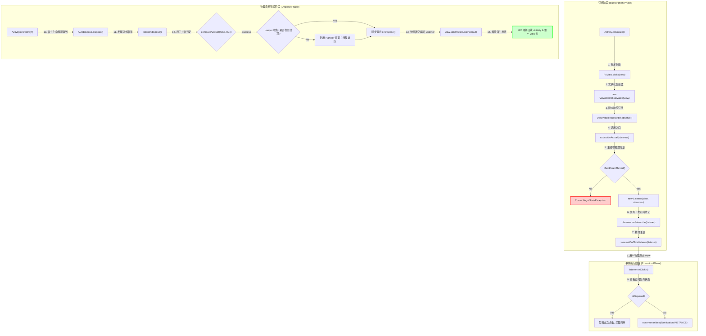
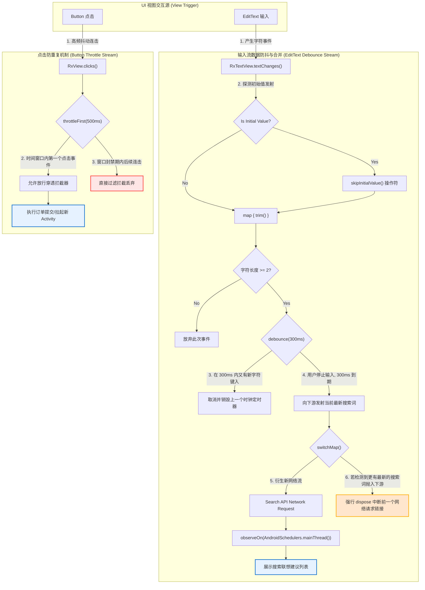

# 5.3.3.5 RxBinding

---

## 一、 RxBinding 概述与 UI 响应式革命

### 1.1 RxBinding 诞生背景与移动端 UI 演化
在 2014 年至 2015 年间，移动端开发正经历着从“快速功能实现”向“工程架构规范化、健壮性”转型的关键历史节点。当时，Android 开发者所面临的开发环境可以说是极其痛苦的。
*   **异步编程的混乱与失控**：当时官方提供的 `AsyncTask` 存在着由于生命周期不同步而引发的严重内存泄漏风险，且其异常处理机制极度简陋。虽然官方在更早时期引入了 `Loader` 框架，但也因为设计过度复杂、与 Fragment 耦合过深而饱受诟病，逐渐被边缘化。
*   **Activity 与 Fragment 的膨胀**：所有的异步任务、UI 渲染、状态管理、网络请求回调以及数据库访问全部堆积在 UI 控制器中，形成了维护灾难级别的“上帝类”（God Class）。
*   **RxJava 的横空出世**：Netflix 开源的 RxJava 1.x 在 Jake Wharton 等大神的强力推广下席卷了整个 Android 开发社区。它提供了一个完美的异步和基于事件的编程模型——`Observable`（可观测源），使得开发者能够利用强大的操作符（如 Map, Filter, FlatMap, Zip 等）优雅地在后台线程和前台主线程之间穿梭，自由组合和调度各种异步任务。

然而，当开发者在底层的网络库（如 Retrofit）、数据库（如 SqlBrite）和业务逻辑层（如 Presenter / ViewModel）彻底践行了 RxJava 带来的响应式编程革命后，却发现整个架构在最前端的 UI 层遇到了瓶颈。View 层仍然是一块顽存的“命令式孤岛”——充斥着传统的 `OnClickListener`、`TextWatcher`、`OnFocusChangeListener` 等声明分散、编写割裂的原生回调接口。
为了消除这最后一公里架构设计上的割裂，Jake Wharton 的杰作 **RxBinding** 应运而生。它的核心使命非常纯粹：**将 Android 系统底层所有离散、一维、命令式的 UI 事件监听器，无缝包装并转换为符合 RxJava 规范的、无界的、时序的事件流（Observable）**。从此，View 不再仅仅是响应式数据流的终点，同时也成为了数据流整体管道的起点和重要流转环节。

### 1.2 传统 Android UI 事件监听器的痛点与硬伤
为了深刻理解响应式 UI 的必要性，我们需要对传统 Android UI 回调事件机制进行一次深度的“罪状剖析”：

#### 1. 回调地狱与控制流的物理割裂
在传统开发中，如果我们希望在一个输入框中监听字符变更，并根据输入内容做相应的逻辑控制，我们必须编写匿名内部类：
```java
searchEditText.addTextChangedListener(new TextWatcher() {
    @Override
    public void beforeTextChanged(CharSequence s, int start, int count, int after) {}

    @Override
    public void onTextChanged(CharSequence s, int start, int before, int count) {
        // 命令式地触发业务逻辑，例如发起搜索请求
        presenter.performSearch(s.toString());
    }

    @Override
    public void afterTextChanged(Editable s) {}
});
```
这种匿名内部类的编写形式带来了冗长且无意义的样板代码（Boilerplate Code），更致命的是它在物理结构上割裂了**控制流（Control Flow）**与**数据流（Data Flow）**。控制流在各个零散的回调方法中跳转，导致开发者难以从宏观角度一眼看清数据的流转路径。

#### 2. 高频 UI 事件控制下的状态污染与变量四溢
防重复点击（防抖）是移动端开发中最常见、也最核心的交互要求。如果不对用户短时间内的连续快速点击进行控制，会导致重复的网络请求发送或重复的 Activity 页面拉起。
在传统命令式编程中，我们必须在 Activity 或 Fragment 中定义大量的临时成员变量来存储上次点击的时间戳以作为“状态过滤器”：
```java
public class OrderActivity extends AppCompatActivity {
    private long lastClickTime = 0;
    private static final long CLICK_INTERVAL = 500; // 500 毫秒

    @Override
    protected void onCreate(Bundle savedInstanceState) {
        super.onCreate(savedInstanceState);
        setContentView(R.layout.activity_order);
        
        submitButton.setOnClickListener(new View.OnClickListener() {
            @Override
            public void onClick(View v) {
                long currentTime = System.currentTimeMillis();
                if (currentTime - lastClickTime > CLICK_INTERVAL) {
                    lastClickTime = currentTime;
                    submitOrder();
                }
            }
        });
    }
}
```
如果一个复杂的页面有 5 个不同的提交按钮和入口需要做类似的防抖处理，开发者就必须在外部声明 5 个不同的 `lastClickTime` 成员变量。这些零散的状态变量散落遍布在 Activity 的各个角落，构成了严重的**“状态污染（State Pollution）”**。随着维护时间的推移，这些临时标志位极其容易因为生命周期管理不当而造成逻辑死锁或防抖失效。

#### 3. 维度多态关联下的“状态膨胀”与“散落控制”
设想一个非常经典的移动端表单提交场景：用户在登录页面需要同时输入“手机号”（格式正确）、“密码”（长度大于6位），并且必须“勾选同意用户协议”。只有当这三个条件同时满足时，登录按钮 `btnLogin` 才会由置灰变为高亮可点击状态。
在传统的命令式开发中，我们必须在三个不同的回调接口（手机号输入监听、密码输入监听、复选框勾选监听）中，反复编写类似且冗余的逻辑判定代码：
```java
// 传统命令式写法下的状态膨胀
private boolean isPhoneValid = false;
private boolean isPasswordValid = false;
private boolean isAgreementChecked = false;

private void checkLoginButtonState() {
    btnLogin.setEnabled(isPhoneValid && isPasswordValid && isAgreementChecked);
}

// 随后在 PhoneTextWatcher 的 onTextChanged 里：
isPhoneValid = checkPhone(s.toString());
checkLoginButtonState();

// 在 PasswordTextWatcher 的 onTextChanged 里：
isPasswordValid = s.length() >= 6;
checkLoginButtonState();

// 在 CheckBox.setOnCheckedChangeListener 里：
isAgreementChecked = isChecked;
checkLoginButtonState();
```
上述设计虽然能够解决功能，但在架构上存在非常严重的弊端：
*   **状态的离散管理**：控制按钮可用性的最终规则（`isPhoneValid && isPasswordValid && isAgreementChecked`）被强行割裂，由三个不同的 UI 回调来分别驱动和触发。
*   **冗余的状态维护**：我们在外部声明了三个私有 boolean 变量来反映 View 的状态。事实上，这些状态信息原本就保存在 View 的内部状态属性里，我们在外部重复声明变量，极大地增加了状态同步出错的概率。

#### 4. “时域过滤（Time-domain Filtering）”能力的严重匮乏
假设我们需要实现一个搜索框的输入实时联想功能：当用户不断在 `EditText` 中键入字符时，实时向后端发送网络请求获取联想建议。为了保护服务器免受恶意高频请求的轰炸，我们必须引入防抖功能（即用户停止输入 300 毫秒后才发送请求）。
用传统的 `Handler` 机制结合 `Runnable` 去实现这一时域过滤逻辑，其臃肿和脆弱性如下所示：
```java
private Handler searchHandler = new Handler(Looper.getMainLooper());
private Runnable searchRunnable;

// 在 TextWatcher.onTextChanged 中：
if (searchRunnable != null) {
    searchHandler.removeCallbacks(searchRunnable);
}
searchRunnable = new Runnable() {
    @Override
    public void run() {
        performSearch(currentText);
    }
};
searchHandler.postDelayed(searchRunnable, 300);
```
此实现有着极其严重的安全隐患：
*   **内存泄漏风险**：`Handler` 或是 `Runnable` 作为非静态内部类会隐式持有外部 Activity 的强引用。如果用户在输入字符后的 300 毫秒内关闭了页面，排队的 `Runnable` 仍在 MessageQueue 中等待执行，这会导致整棵 View 树和 Activity 无法被 GC 回收，直接造成明显的内存泄漏。
*   **时序竞态问题**：由于网络请求返回有快有慢，在多线程并发回包的环境下，较早发起查询（但处理很慢）的网络请求回包，可能会在较晚发起（但处理极快）的请求回包之后到达，从而产生脏数据覆盖（即时序交错现象），导致界面显示完全混乱。

#### 5. 异步数据流桥接处的严重割裂
在基于 MVP 或 MVVM 架构的系统中，Presenter 或 ViewModel 中对业务数据流的建模都是完全响应式的（例如 `Observable<List<Item>>` ）。然而，用户点击按钮触发业务的行为却是命令式的 Callback。为了连接这两端，开发者不得不被迫在 Callback 回调函数里写下手动向下游 Subject 发射事件的逻辑，导致架构的整洁度遭到极大破坏。

### 1.3 响应式编程对 UI 事件的重新定义
RxBinding 彻底颠覆了上述糟糕的开发模式。它将 View 层上发生的一切离散 UI 交互，抽象重定义为了**“无界时序事件流（Infinite Temporal Stream）”**：
*   **无界性（Unbounded）**：只要 View 对象没有从内存中被物理销毁，它所发射的点击事件、滑动距离、文本变更等，就是一个在时间轴上无限延伸的 `Observable` 数据源。它永远不会发射 `onComplete` 终止信号，除非订阅关系显式被 dispose 切断。
*   **时域性（Temporal）**：UI 事件的产生与真实的物理时间强绑定。每一个离散的点击动作都在具体的时间刻度上发生。

通过 RxBinding，原本一次性的命令式监听动作转变为 `Observable<Object>`。此时，RxJava 库中所拥有的强大时域操作符得以直接运用在 View 之上：
*   我们可以通过 `throttleFirst()` 或 `throttleWithTimeout()` 操作符，在时域上直接对高频事件进行拦截和过滤，完全不需要在 Activity 级别去维护任何临时时间戳。
*   我们可以通过 `debounce()` 对文本输入做定时过滤器。
*   我们可以使用 `switchMap()`，当输入框产生新词时，自动 dispose 废弃前一个还未处理完的旧请求，完美消除多线程网络数据回包的竞态脏数据问题。
*   我们可以利用 `Observable.combineLatest()` 将多个 UI 事件流进行组合，声明式地建立逻辑依赖关系，直接映射到 UI 元素的属性上。

#### 响应式 vs 命令式思维范式的根本区别
| 维度 | 命令式编程 (Imperative) | 响应式编程 (Reactive) |
| :--- | :--- | :--- |
| **思维核心** | 以“动作（Action）”为中心，侧重于“怎么做” | 以“数据与关系（Data & Relation）”为中心，侧重于“是什么” |
| **数据传递** | 被动推拉，通过 Callback 函数零散分发 | 声明式管道，基于统一的无界数据流自动传送 |
| **状态维护** | 外部声明大量辅助成员变量，容易造成状态污染 | 状态自然承载于数据管道的当前状态中，无状态溢出 |
| **时域操作** | 极其繁琐，必须依赖 Handler/Timer 和标志位控制 | 原生支持各种时域操作符，通过简单的声明参数控制 |

它在 Android 最前端真正贯彻了“一切皆是流（Everything is a stream）”的核心理念，为构建纯粹的、端到端的响应式应用奠定了最坚实的基石。

---

## 二、 UI 事件包装的底层源码机制

要看清 RxBinding 内部那精巧的转换过程，我们必须深入源码的核心深水区。下面我们将对 RxBinding 最常用的两个包装组件进行逐行级别的源码剖析。

### 2.1 深入剖析 `RxView.clicks(View view)` 源码

我们首先来看最经典的按钮点击事件流化入口：

```java
// RxView.java
@CheckResult
@NonNull
public static Observable<Object> clicks(@NonNull View view) {
  checkNotNull(view, "view == null");
  return new ViewClickObservable(view);
}
```

*   **`@CheckResult` 静态编译检查**：该注解是 Android Lint 系统提供的一项重要保护措施。它强制要求开发者必须对该方法的返回值进行接收和处理。因为 `clicks` 方法返回的是一个冷 Observable，如果开发者仅仅调用了 `RxView.clicks(btn)` 而没有后续调用 `.subscribe()`，该操作将不会对 View 进行任何物理监听挂载。此注解能在编译期就拦截此类无效调用。
*   **`checkNotNull` 非空防御**：在方法最顶端对传入的 `view` 对象做 Fail-Fast（快速失败）的空值判定，防止 Null 引用向下传递，极大提升了库的稳定性。
*   **`ViewClickObservable` 的实例化**：这是 RxBinding 对 View 点击流进行的核心包装类，继承自 RxJava 的 `Observable<Object>`。

### 2.2 深度解密 `ViewClickObservable` 内部逻辑

下面是包装类 `ViewClickObservable` 的完整核心实现：

```java
// ViewClickObservable.java
final class ViewClickObservable extends Observable<Object> {
  private final View view;

  ViewClickObservable(View view) {
    this.view = view;
  }

  @Override
  protected void subscribeActual(Observer<? super Object> observer) {
    if (!checkMainThread()) {
      return;
    }
    Listener listener = new Listener(view, observer);
    observer.onSubscribe(listener);
    view.setOnClickListener(listener);
  }

  static final class Listener extends MainThreadDisposable implements View.OnClickListener {
    private final View view;
    private final Observer<? super Object> observer;

    Listener(View view, Observer<? super Object> observer) {
      this.view = view;
      this.observer = observer;
    }

    @Override
    public void onClick(View v) {
      if (!isDisposed()) {
        observer.onNext(Notification.INSTANCE);
      }
    }

    @Override
    protected void onDispose() {
      view.setOnClickListener(null);
    }
  }
}
```

#### 2.2.1 物理挂载核心方法 `subscribeActual` 剖析
在 RxJava 的架构中，一旦下游调用了 `subscribe(observer)`，整个逻辑最终会流转到数据生产源头子类重写的 `subscribeActual(observer)` 中。在 `ViewClickObservable` 内部，该方法主要执行了 4 个动作：
1.  **主线程防卫**：首先运行 `checkMainThread()`。如果该方法判定当前执行线程并非系统的 UI 主线程，会立刻抛出致命异常并中断运行，这避免了在非 UI 线程对 UI 组件进行注册时的并发安全隐患。
2.  **创建桥接器 `Listener`**：生成一个 `Listener` 实例。这个内部类非常巧妙，它**同时继承了 `MainThreadDisposable`，并实现了系统的原生接口 `View.OnClickListener`**。它起到了一个承上启下的物理媒介作用。
3.  **率先分发凭证**：调用 `observer.onSubscribe(listener)`。**请极其注意这一步的执行顺序**：RxJava 规范中硬性规定，必须在向上游注册实际的物理触发源或发射任何事件之前，先把订阅凭证 `Disposable` 分发给下游。因为只有在这一步把凭证交给下游，当下游收到凭证并在稍后的事件接收中触发取消时，才能有能力在第一时间中断数据链。
4.  **最终物理挂载**：最后调用 `view.setOnClickListener(listener)`。至此，Android OS 系统底层的事件分发链条正式与 RxJava 订阅管道连接成功。当用户物理点击 View 时，系统底层的事件触发机制会调用 `Listener` 实现的 `onClick` 方法。

#### 2.2.2 `Listener.onClick` 的事件分发与拦截
当 `onClick(View v)` 被系统回调时，它会首先通过继承自 `MainThreadDisposable` 的 `isDisposed()` 去检测当前订阅关系是否仍然存活。
*   如果订阅关系已经被取消（即已经 `disposed`），即使系统回调了 `onClick`，该事件也将被无视丢弃，不会向下游 Observer 发射任何多余的数据，确保了生命周期的纯净化。
*   如果订阅关系存活，则将一个单例性质的 `Notification.INSTANCE` 作为占位数据发送给下游 `observer.onNext()`。由于点击事件本身只关注“触发时机”而不关注“具体数据”，因此使用统一的占位符（如 Object 或 `Unit`）可以最小化运行期 GC 对象的频繁分配。

#### 2.2.3 “冷信号（Cold Observable）”的设计哲学在 View 层的体现
整个挂载机制体现了 RxJava 中非常核心的冷信号设计。
如果 RxBinding 在被创建的一瞬间就立刻去 `setOnClickListener`，这会产生不必要的性能负担。在很多交互场景下，流可能被组合、忽略或延迟订阅。
冷信号的设计保证了：**“不订阅，就不挂载；一旦取消，立即卸载”**。在没有任何 Observer 订阅该流之前，底层 View 依然保持原生清白状态，没有任何 Listener 存在。这种按需加载、延迟绑定的思想，从架构根源上杜绝了对 View 组件无意义的物理状态改动。

### 2.3 `RxTextView.textChanges()` 源码解密

接下来我们来剖析文本输入变化这一非常高频的交互流源头：

```java
// RxTextView.java
@CheckResult
@NonNull
public static InitialValueObservable<CharSequence> textChanges(@NonNull TextView view) {
  checkNotNull(view, "view == null");
  return new TextViewTextChangesObservable(view);
}
```

注意：这里返回的类型并不是普通的 `Observable`，而是 `InitialValueObservable`。它是 RxBinding 核心架构中专门为了“行为型 UI 信号（Behavioral UI Signals）”设计的特殊抽象父类。

我们来看 `TextViewTextChangesObservable` 的源码：

```java
// TextViewTextChangesObservable.java
final class TextViewTextChangesObservable extends InitialValueObservable<CharSequence> {
  private final TextView view;

  TextViewTextChangesObservable(TextView view) {
    this.view = view;
  }

  @Override
  protected void subscribeListener(Observer<? super CharSequence> observer) {
    Listener listener = new Listener(view, observer);
    observer.onSubscribe(listener);
    view.addTextChangedListener(listener);
  }

  @Override
  protected CharSequence getInitialValue() {
    return view.getText();
  }

  static final class Listener extends MainThreadDisposable implements TextWatcher {
    private final TextView view;
    private final Observer<? super CharSequence> observer;

    Listener(TextView view, Observer<? super CharSequence> observer) {
      this.view = view;
      this.observer = observer;
    }

    @Override
    public void beforeTextChanged(CharSequence s, int start, int count, int after) {
    }

    @Override
    public void onTextChanged(CharSequence s, int start, int before, int count) {
      if (!isDisposed()) {
        observer.onNext(s);
      }
    }

    @Override
    public void afterTextChanged(Editable s) {
    }

    @Override
    protected void onDispose() {
      view.removeTextChangedListener(this);
    }
  }
}
```

#### 2.3.1 监听挂载与 `TextWatcher` 回调转发
在 `subscribeListener` 方法中，依然是相似的底层流化模式：创建 `Listener`，下发凭证，然后调用 `view.addTextChangedListener(listener)`。
在内部的 `Listener` 中，它实现了 Android 传统的 `TextWatcher` 接口。由于绝大多数业务只关心文本内容正在改变的结果，因此在 `beforeTextChanged` 和 `afterTextChanged` 两个系统回调中，Listener 不做任何动作，保持空实现；仅在系统触发 `onTextChanged` 时，在判断订阅未被 disposed 的前提下，通过 `observer.onNext(s)` 将当前字符序列实时抛给下游。

#### 2.3.2 深度剖析：“行为型信号”设计与初始值即时发射机制
这是 `RxTextView.textChanges()` 区别于普通 Observable 的核心特征。我们来翻看 `InitialValueObservable` 的基类设计源码：

```java
// InitialValueObservable.java
public abstract class InitialValueObservable<T> extends Observable<T> {
  @Override
  protected final void subscribeActual(Observer<? super T> observer) {
    subscribeListener(observer);
    observer.onNext(getInitialValue());
  }

  protected abstract void subscribeListener(Observer<? super T> observer);
  protected abstract T getInitialValue();

  public final Observable<T> skipInitialValue() {
    return new SkippedInitialValueObservable<>(this);
  }
}
```

在 `subscribeActual` 发生时，它首先调用 `subscribeListener` 完成对底层 UI 组件物理监听器的挂载。紧接着，**它没有任何延迟地立刻调用了一次 `observer.onNext(getInitialValue())`**！这会将 `TextView` 中当前时刻已存有的文字直接推送给下游订阅者。
这种特殊的“行为型信号”设计对于现代声明式架构有着巨大的现实意义：
*   **状态的统一驱动**：在 MVVM 架构中，UI 层的初次展示往往需要反映数据的初始值。例如，如果页面刚打开时输入框中就有默认搜索词（如带入的关键字），我们希望按钮的可点击状态根据当前字符自动更新。如果 `textChanges` 不发射初始值，我们就必须在 `subscribe` 之后，在 Activity 声明周期里手动读取一次 `view.getText()`，并把逻辑分支拆分。而有了初始值发射机制，初始文本与后续修改事件都被天然地揉进同一个管道，代码变得极度统一。
*   **提供逃生出口（skipInitialValue）**：对于有些不需要初始值的特定交互逻辑（如用户第一次进来时不要执行空字符串的网络搜索），RxBinding 提供了 `skipInitialValue()` 转换方法。它可以在管道上直接通过装饰器模式丢弃这第一个发射的数据。

让我们进一步探究其逃生出口的底层实现——`SkippedInitialValueObservable`：

```java
// SkippedInitialValueObservable.java
final class SkippedInitialValueObservable<T> extends Observable<T> {
  private final InitialValueObservable<T> upstream;

  SkippedInitialValueObservable(InitialValueObservable<T> upstream) {
    this.upstream = upstream;
  }

  @Override
  protected void subscribeActual(Observer<? super T> observer) {
    upstream.subscribe(new SkippedObserver<>(observer));
  }

  static final class SkippedObserver<T> implements Observer<T>, Disposable {
    private final Observer<? super T> downstream;
    private Disposable disposable;
    private boolean skipped = false;

    SkippedObserver(Observer<? super T> downstream) {
      this.downstream = downstream;
    }

    @Override
    public void onSubscribe(Disposable d) {
      this.disposable = d;
      downstream.onSubscribe(this);
    }

    @Override
    public void onNext(T t) {
      if (skipped) {
        downstream.onNext(t);
      } else {
        skipped = true; // 拦截并消费掉上游发射的第一个初始值事件
      }
    }

    @Override
    public void onError(Throwable e) {
      downstream.onError(e);
    }

    @Override
    public void onComplete() {
      downstream.onComplete();
    }

    @Override
    public void dispose() {
      disposable.dispose();
    }

    @Override
    public boolean isDisposed() {
      return disposable.isDisposed();
    }
  }
}
```
在这个装饰器模式的具体实现中，`SkippedObserver` 接管了上游流发射的事件。在收到第一个 `onNext`（即 `TextViewTextChangesObservable` 强制发射的当前文本）时，它通过判断 `skipped` 标志位为 `false`，将这次发射动作物理拦截，同时将 `skipped` 赋值为 `true`。之后的所有后续修改事件，由于 `skipped` 已经为 `true`，均可以无阻碍地传导至真正的下游。

---

## 三、 主线程强制约束机制（Main Thread Enforcement）

在 RxBinding 的使用中，所有的订阅构建和底层执行的第一行都在进行主线程校验。如果不符合要求，系统就会瞬间抛出 Runtime 异常崩溃。

### 3.1 为什么要强行进行主线程拦截限制？

要深入探究这一设计理念，我们必须挖掘 Android View 系统的**“单线程执行模型（Single Thread Execution Model）”**以及并发编程的本质。

#### 3.1.1 View 系统的线程安全底线
从系统设计来说，Android 的 View 视图树是一个典型的非线程安全数据结构。在移动设备早期，硬件计算资源和物理内存极其有限。如果在系统的底层 UI 渲染层级中，为每一个 View 属性访问、层次测绘、监听器分发都加上并发同步锁（如 `synchronized` 或 `Lock`），这会带来极为高昂的锁竞争和线程切换开销，导致界面渲染在多线程争抢下变得极其卡顿甚至死锁。
为此，几乎所有的主流客户端 UI 框架（包括 JDK Swing、JavaFX、iOS Cocoa Touch、Qt、Web 浏览器渲染引擎以及现代的 Flutter）无一例外地都采用了“单线程模型”。
*   **Choreographer 与 VSYNC 驱动**：View 的三大核心流程（测量、布局、绘制）都是在主线程由 `Choreographer` 接收到硬件的 VSYNC 垂直同步信号后，驱动 `Handler` 消息队列，在主线程同步依次运行的。
*   **致命的 CalledFromWrongThreadException**：在 Android 源码中，任何在非创建 View 线程（即非主线程）对 View 视图层级进行改动（如修改属性、刷新状态）的行为，最终在底层都会触发 `ViewRootImpl.checkThread()`，抛出异常。
    关于 Android 系统多线程及绘制相关的更多版本变动细节，可以参阅 [AndroidVersionChangeLog.md](../../../../../AndroidVersionChangeLog.md) 了解系统内核的演进。

#### 3.1.2 隐藏在 RxJava 调度器（Scheduler）中的巨大地雷
RxJava 框架提供了极其强大的 `subscribeOn` 操作符，可以让上游订阅发生的线程无缝迁移至工作线程。假设某位开发者写了类似如下代码：
```java
RxView.clicks(btnSubmit)
      .subscribeOn(Schedulers.io()) // 意图在 IO 工作线程中挂载监听器
      .observeOn(AndroidSchedulers.mainThread())
      .subscribe(...);
```
如果没有主线程拦截机制，一旦指定了 `subscribeOn(Schedulers.io())`，根据 RxJava 底层的工作机制，上游 `ViewClickObservable.subscribeActual()` 方法便会在 RxJava 维护的 IO 线程池工作线程中执行。
这意味着 `view.setOnClickListener(listener)` 将会被在非主线程并发执行！
在 Android 原生 `View.java` 源码中，所有的监听器都被保存在一个名为 `ListenerInfo` 的私有静态内部类容器中：
```java
// View.java 原生源码片段
ListenerInfo getListenerInfo() {
    if (mListenerInfo != null) {
        return mListenerInfo;
    }
    mListenerInfo = new ListenerInfo();
    return mListenerInfo;
}
```
由于 `getListenerInfo()` 这一函数及其内部状态并没有加上任何线程锁。如果主线程在响应系统触摸事件的同时，后台的工作线程并发调用 `setOnClickListener` 往这个非线程安全的 `mListenerInfo` 里执行写操作，这在多线程环境下会引发 CPU 缓存可见性问题与指令重排冲突，直接导致内存数据损坏。
因此，RxBinding 必须在任何订阅逻辑刚开始执行的第一步就进行强力拦截，将错误暴露在开发和联调的第一阶段。

### 3.2 `checkMainThread()` 源码与 Looper 判定底层机制解析

下面我们来研究 RxBinding 是如何进行精确无误且高性能的线程判定检测的。

```java
// MainThreadDisposable.java
public static void checkMainThread() {
  if (Looper.myLooper() != Looper.getMainLooper()) {
    throw new IllegalStateException(
        "Expected to be called on the main thread but was " + Thread.currentThread().getName());
  }
}
```

#### 3.2.1 `Looper.myLooper()` 的底层实现
在 Android 框架设计中，每一个拥有消息循环的线程，其 `Looper` 实例对象都是存储在该线程局部的 `ThreadLocal` 变量中的：
```java
// Looper.java (Android Framework 源码)
static final ThreadLocal<Looper> sThreadLocal = new ThreadLocal<Looper>();
```
当在当前执行的上下文里调用 `Looper.myLooper()` 时，其内部代码实际上是直接执行 `sThreadLocal.get()`，从而快速、非阻塞地拉取出**当前工作线程中关联持有的 Looper 对象指针**。如果在该线程没有建立过消息队列，则会直接返回 `null`。

#### 3.2.2 `Looper.getMainLooper()` 静态缓存的物理地址
在 Android 进程孵化诞生之初，系统的 `ActivityThread.main()` 作为大入口，首先为主线程调用 `Looper.prepareMainLooper()`。
该方法创建一个专门代表系统 UI 线程的 `Looper` 对象，并将其赋值给静态全局变量 `sMainLooper`。
在此之后，任何线程在任何时刻调用 `Looper.getMainLooper()`，底层的返回都只是对这个全局静态变量的引用读取，没有任何复杂的计算或耗时的系统调用。

#### 3.2.3 为什么使用 Looper 对象引用直接对比是最为无损的？
有很多开发者喜欢通过字符串或线程 ID 的比较来进行主线程判定，例如：
`Thread.currentThread() == Looper.getMainLooper().getThread()`
或者是去匹配线程名称是否包含 `"main"`。
与之相比，`Looper.myLooper() == Looper.getMainLooper()` 的物理比较直接触及 JVM 最底层的逻辑判定。因为在 Java 中，对于两个对象引用的直接判定 `==`，只对应着最底层的 `if_acmpne` 或 `if_acmpeq` 这一句简单的字节码硬件指令。它无需像提取 `Thread` 一样经过多层对象属性的方法级调用，开销低到可忽略不计，能够在高频高并发的 UI 交互下提供零负担的物理防御网。

### 3.3 单线程强约束设计的架构取舍
这套拦截机制在软件工程上体现了一种强烈的**约束强过弹性的设计取舍思想**。它虽然剥夺了开发者在工作线程配置 UI 流监听的自由度，强迫开发者在复杂的并行计算中必须细心地去控制线程转换。但是，它通过这种运行期早期的强制中断，守护了 View 层非同步数据读写的生命线，极大地为 Android 平台降低了由于线程错乱带来的极其棘手的多线程随机偶发 Bug。

---

## 四、 经典时域过滤与自适应防抖实践

RxBinding 最具魔力的时刻，是它将原本错综复杂的时域并发逻辑简化为几行操作符的声明链。本节我们将通过具体的工程案例来分析它们的工作机制。

### 4.1 防重复点击（throttleFirst）

#### 4.1.1 Kotlin 优雅扩展实践
在现代 Android 的 Kotlin 架构中，我们可以把 `throttleFirst` 封装成扩展函数，为整个工程提供一致的防抖入口：

```kotlin
import android.view.View
import com.jakewharton.rxbinding3.view.clicks
import io.reactivex.disposables.Disposable
import java.util.concurrent.TimeUnit

/**
 * 为 View 提供安全的防抖点击事件流扩展函数
 * @param windowDurationMillis 防抖窗口持续毫秒数
 * @param onSafeClick 成功通过防抖校验后的业务动作
 */
fun View.setSafeOnClickListener(
    windowDurationMillis: Long = 500,
    onSafeClick: (View) -> Unit
): Disposable {
    return this.clicks()
        .throttleFirst(windowDurationMillis, TimeUnit.MILLISECONDS)
        .subscribe(
            { onSafeClick(this) },
            { error -> error.printStackTrace() }
        )
}
```

#### 4.1.2 物理时域工作机制拆解与操作符对比
`throttleFirst` 拦截器的工作原理可抽象为以下时间轴模型：
1.  **事件穿透**：当用户发生第一次有效的点击时，事件不受任何限制立刻穿透 `throttleFirst` 拦截器发给下游。
2.  **窗口期启动**：在穿透的同时，拦截器在后台开启一个 500 毫秒的时钟窗口期。
3.  **后续事件阻断**：在 500 毫秒窗口期计时进行过程中，用户由于设备卡顿或误触而连续做出的第二次、第三次点击事件，一旦触及拦截器，均会**立刻被无情丢弃**，不向下游发送任何通知。
4.  **防静电复位**：500 毫秒窗口走完后，拦截器复位。此时如果用户发生第四次点击，该事件将被允许正常穿透，并重新启动一个 500 毫秒的禁封窗口。

#### 为什么点击防抖绝不能使用 `throttleLast` 或 `sample`？
*   **`throttleLast` / `sample` 带来明显的界面迟滞**：`throttleLast` 的原理是在每一个设定的时间窗口结束时，发射该窗口内捕捉到的最后一次事件。如果防抖设置为 500 毫秒，当用户点击按钮后，事件不仅不会立刻响应，还必须强行等待 500 毫秒直到窗口走完才发射。在注重即时视觉反馈的移动端交互中，这会让用户感觉界面发生了严重的“卡死”或“不跟手”现象。
*   **`throttleFirst` 拥有完美的“零延迟首发”响应**：它优先让用户的第一个点击动作直接响应，既达到了过滤连击的防抖目的，又保证了物理交互反馈的零时延迟。

### 4.2 输入联想搜索框防抖（debounce）与自适应网络流切换

这是一个在任何现代搜索功能设计中都会采用的极其经典的交互组合。

#### 4.2.1 完整的 Kotlin 闭环代码实现
下面展示将 `textChanges()` 输入防抖与网络请求进行流式连接的完整代码结构：

```kotlin
import android.widget.EditText
import com.jakewharton.rxbinding3.widget.textChanges
import io.reactivex.Observable
import io.reactivex.android.schedulers.AndroidSchedulers
import io.reactivex.disposables.CompositeDisposable
import io.reactivex.schedulers.Schedulers
import java.util.concurrent.TimeUnit

class SearchEngine(
    private val searchView: ISearchView,
    private val searchService: SearchApiService
) {
    private val disposables = CompositeDisposable()

    fun bind(searchEditText: EditText) {
        val subscription = searchEditText.textChanges()
            // 1. 过滤掉订阅时刻发射的初始空文本，只关注后续用户主动键入的行为
            .skipInitialValue()
            .map { it.toString().trim() }
            // 2. 限制关键字长度，防止无意义的空字或单字请求
            .filter { it.length >= 2 }
            // 3. 时域过滤：用户停止输入后的 300 毫秒内，如果没有新字符输入，才放行事件
            .debounce(300, TimeUnit.MILLISECONDS)
            // 4. 核心自适应流切换：旧网络流的主动关闭与新流的启动
            .switchMap { query ->
                performNetworkSearch(query)
                    .subscribeOn(Schedulers.io())
                    // 核心容错：局部异常拦截，防止单个网络请求失败导致整个上游文本流的断开
                    .onErrorReturn { emptyList() }
            }
            // 5. 线程回归
            .observeOn(AndroidSchedulers.mainThread())
            .subscribe(
                { searchResults -> searchView.renderSuggestions(searchResults) },
                { fatalError -> searchView.renderError(fatalError.message ?: "Fatal Error") }
            )

        disposables.add(subscription)
    }

    private fun performNetworkSearch(keyword: String): Observable<List<String>> {
        return searchService.fetchSuggestions(keyword)
    }

    fun unbind() {
        disposables.clear()
    }
}
```

#### 4.2.2 底层定时器与 `debounce` 重建机制剖析
`debounce`（也称为 `throttleWithTimeout`）在时域上的控制逻辑非常精密：
*   **定时器的创建与注册**：当用户输入了字符 `'F'` 后，`debounce` 接收到这个字符事件，它并没有将其立即向下游发射，而是记录该数据，并在 RxJava 系统后台启动一个 300 毫秒的单次定时任务。
*   **定时器的销毁与重置**：如果用户手速很快，在 150 毫秒后又紧接着输入了字符 `'L'`，此时 `debounce` 捕捉到新的事件进入，它会**立刻取消并撤销上一个为 `'F'` 启动的 300 毫秒定时器**。紧接着，把缓存更新为 `"FL"`，并为这个最新的状态重新启动一个全新的 300 毫秒定时任务。
*   **数据的穿透发射**：只有当用户停下思考或打字中断，使得 300 毫秒的时间窗口内没有任何新的字符涌入时，最新的定时任务才会在到期的一瞬间，将缓存的数据 `"FL"` 发射向下游。

我们可以通过查阅其底层 `DebounceObserver` 的核心机制去发现，它在内部使用了一个 `AtomicReference<Disposable>` 来保存当前的定时任务 `Worker`。在每次 `onNext` 到达时，它执行 `DisposableHelper.replace()` 将上一个定时器原子化地撤销掉，并再次向调度器派发新的延迟任务，以此实现了高度精准的并发时控。

#### 4.2.3 为什么在该场景下必须使用 `switchMap` 操作符？
这是初中级响应式开发极其容易踩中的大坑。如果在这里把 `switchMap` 替换成了普通的 `flatMap` 或 `concatMap`：
*   **`flatMap` 的并发乱序硬伤**：`flatMap` 是并发无序接收的。假设用户在第 1 秒发起了针对 `"FL"` 的搜索请求（网络极其卡顿，用时 3 秒返回），在第 1.5 秒发起了针对 `"FLOW"` 的搜索请求（网络瞬间通畅，用时 0.5 秒返回）。由于没有强力时断控制，页面会在第 2 秒显示出 `"FLOW"` 的搜索建议（正常最新结果）；却会在第 4 秒时，因为 `"FL"` 那个极慢的请求回包到达，导致页面瞬间被老旧的 `"FL"` 联想建议覆盖！这在客户端上表现为输入内容和返回内容严重错乱（脏数据污染）。
*   **`switchMap` 的“降维打击”**：`switchMap` 在接收到上游发射出的新值 `"FLOW"` 时，会判断之前为 `"FL"` 所开启的内部网络请求流是否还处于活跃订阅状态。一旦发现活跃，**它会在瞬间向其发送 `dispose()` 物理中断信号**。底层的 Retrofit 或 OkHttp 网络框架收到此 dispose 中断后，会自动主动关闭网络 Socket 连接和网络 Callback 接收管道。它强行只维护最新数据流의 响应，从而在机制层面彻底消除了老旧请求导致的数据时序篡乱现象。

---

## 五、 生命周期与自愈解绑防泄漏闭环

在享受 RxBinding 带来的极简声明式代码的背后，隐藏着由 Java 强引用链构成的内存危机。如何实现完美的生命周期管理，是 RxBinding 的核心命题。

### 5.1 内存泄漏的物理模型与演进

在基于 JVM（Dalvik / ART）的 Android 垃圾回收机制中，判断一个类对象是否应该被销毁回收，取决于从 JVM 的 **GC Roots**（如主线程 ThreadLocal 的 Looper、常驻的活动后台任务等）到该对象之间是否存在任何强引用路径（Strong Reference Path）。

在 Android 虚拟机运行期，常见的 GC Roots 节点包括：
1.  **JNI 全局与局部引用**（JNI Global/Local Reference）。
2.  **当前处于活动状态的工作线程的本地局部变量**（Thread Stack Frames）。
3.  **系统类加载器加载的静态成员变量**（Static Variables）。

我们来看未执行解绑时，使用 RxBinding 产生的引用传导模型：

```
[GC Root: OS Main Looper / RxJava Active Thread Pools]
   │
   ▼
[Active Disposables Management / Worker Threads]
   │
   ▼
[Observer / Subscriber (一般以匿名内部类、Lambda 闭包存在)]
   │ 
   ▼ (由于匿名内部类及闭包在 Java/Kotlin 编译期会强行生成一个对其隐式外部类的 this$0 强引用)
[Activity / Fragment (宿主组件)]
   │
   ▼ (Activity 内部持有 layout 树根节点)
[View (如 btnSubmit / editSearch 等控件)]
   │
   ▼ (控件内部 ListenerInfo 对 Listener 进行强持有)
[Listener (即实现 View.OnClickListener 与 MainThreadDisposable 内部类)]
```

当 Activity 已经经历 `onDestroy()` 后，其已经变为逻辑上的“死组件”：
如果由于某种操作（例如未被注销的全局流、或者正在被后台 IO 线程阻塞等待的网络链接任务）导致最顶端的 RxJava 订阅依然存活，这根强引用链就会无休止地存活。
为什么这会是一个灾难？因为 View 的内部变量 `mContext` 强引用了它所归属的 Activity。如果 View 树中有大图渲染（Bitmap），每一个未被回收的 View 都拽着大块物理像素空间，这会使内存快速耗尽，在系统底层触发强烈的垃圾回收（GC Cause For Alloc），引发应用出现肉眼可见的“帧抖动（Frame Jitter）”甚至爆出 OOM 闪退。

### 5.2 自愈式 Listener 置空解绑机制剖析

为了完美破解这一物理模型的死局，RxBinding 的设计中包含了以 `MainThreadDisposable` 为核心的“自愈式（Self-Healing）”物理阻断逻辑。

我们再来看 `MainThreadDisposable` 中最为惊艳的 `dispose()` 实现细节：

```java
// MainThreadDisposable.java
public abstract class MainThreadDisposable implements Disposable {
  private final AtomicBoolean unsubscribed = new AtomicBoolean();

  @Override
  public final boolean isDisposed() {
    return unsubscribed.get();
  }

  @Override
  public final void dispose() {
    if (unsubscribed.compareAndSet(false, true)) {
      if (Looper.myLooper() == Looper.getMainLooper()) {
        onDispose();
      } else {
        AndroidSchedulers.mainThread().scheduleDirect(new Runnable() {
          @Override public void run() {
            onDispose();
          }
        });
      }
    }
  }

  protected abstract void onDispose();
}
```

#### 5.2.1 `compareAndSet` 并发控制的核心汇编原理
`MainThreadDisposable` 内部包含了一个原子变量 `unsubscribed`（`AtomicBoolean`）。
当我们触发解绑 `dispose()` 时，它通过底层的 `compareAndSet(false, true)` 原子 compare 交换指令保证：无论上游在什么时间、由几路不同的工作线程并发发起销毁指令，**底层的物理卸载动作 `onDispose()` 也只会被单线程、唯一地执行一次**。
这在底层指令层面利用了现代多核处理器的 `LOCK CMPXCHG` 总线排他锁指令，确保了该内存操作是不可分割的，极大避免了在多线程场景下由于并发解绑导致的底层 Listener 访问冲突。

#### 5.2.2 跨线程邮寄的物理机制与 Handler 运转
我们在第三章探讨过，由于 View 系统的线程安全性要求，我们对 Listener 的置空操作（例如调用 `view.setOnClickListener(null)`）是必须要运行在主线程的。
`MainThreadDisposable` 巧妙地在 `dispose` 中做了一个分发判断：
*   **同步执行**：如果当前调用 `dispose` 的线程恰好是主线程，那无需多言，直接当场调用 `onDispose()` 执行置空。
*   **邮寄派发**：如果当前线程不是主线程（例如在下游工作线程的流中突然中断了订阅关系），它会利用 `AndroidSchedulers.mainThread().scheduleDirect()` 执行一次排队邮寄，将这一解绑 Runnable 提交给主线程的 `MessageQueue`。主线程在运行到该消息时，会同步调用 `onDispose()`，这极其优雅地确保了“线程安全的 View 级解绑操作”。

#### 5.2.3 具体 Listener 的自愈行为
以 `ViewClickObservable.Listener` 的 `onDispose` 动作为例：
```java
@Override
protected void onDispose() {
  view.setOnClickListener(null);
}
```
当外界因生命周期结束调用了整个 Rx 链的 `dispose()` 时：
1.  解绑信号一路逆流向上，最终到达 `MainThreadDisposable.dispose()`。
2.  触发具体的 `Listener.onDispose()` 回调。
3.  物理调用 `view.setOnClickListener(null)`。
这一行看似简单的置空，**直接消除了 View 内部对 `Listener` 的唯一强引用指向**。强引用链条在此处发生物理断裂。
由此，Listener 无法再向下持有 Observer，Observer 无法持有 Activity，整棵 Activity 的宿主视图树在 Dalvik 中瞬间失去了 GC Root 引用的支撑。在 GC 下一次启动扫描时，它们便可以被同步顺畅回收。这种在 dispose 时“自动恢复 View 原生状态”的做法，正是其被称为自愈解绑的根本原因。

### 5.3 声明式生命周期绑定实践（AutoDispose 方案）

虽然 RxBinding 支持自愈解绑，但如果我们在业务代码中必须对每个流都手动去通过 `disposables.add()` 进行统一物理收集，代码中难免会有因人为疏忽而漏加的情况。为了达到更高的系统健壮性，我们需要声明式的生命周期绑定框架。

#### 5.3.1 AutoDispose 声明式生命周期控制代码
```kotlin
import android.os.Bundle
import android.widget.Button
import androidx.appcompat.app.AppCompatActivity
import com.jakewharton.rxbinding3.view.clicks
import com.uber.autodispose.android.lifecycle.AndroidLifecycleScopeProvider
import com.uber.autodispose.autoDisposable
import java.util.concurrent.TimeUnit

class PaymentGatewayActivity : AppCompatActivity() {

    private lateinit var btnCommitPay: Button

    override fun onCreate(savedInstanceState: Bundle?) {
        super.onCreate(savedInstanceState)
        setContentView(R.layout.activity_payment)
        btnCommitPay = findViewById(R.id.btn_pay_commit)

        btnCommitPay.clicks()
            .throttleFirst(1000, TimeUnit.MILLISECONDS) // 1 秒防抖
            .autoDisposable(AndroidLifecycleScopeProvider.from(this)) // 核心生命周期绑定拦截器
            .subscribe(
                { startProcessingPayment() },
                { error -> displayError(error) }
            )
    }

    private fun startProcessingPayment() {
        // 支付业务
    }

    private fun displayError(e: Throwable) {
        // 异常捕获
    }
}
```

#### 5.3.2 深度对比：AutoDispose 与 RxLifecycle 的设计瑜亮之争
在解决 RxJava 订阅流与生命周期绑定这一命题上，Android 社区历史上诞生过两个著名的解决方案：Trello 公司的 `RxLifecycle` 和 Uber 公司的 `AutoDispose`。

| 维度 | RxLifecycle (Trello) | AutoDispose (Uber) |
| :--- | :--- | :--- |
| **底层核心机制** | 基于操作符 `compose(bindToLifecycle())`，通过内部的 `takeUntil(lifecycleStream)`，监听到特定生命周期信号时发射一个**终止信号（onComplete）**以试图自然终止流。 | 基于更底层的拦截动作 `as(autoDisposable(...))`，在监测到生命周期结束时，**直接并在物理上调用 `dispose()` 函数**，从根源切断数据链。 |
| **语义本质** | 发送流结束信号（Termination Signal） | 撤销对流的物理订阅（Physical Cancellation） |
| **内存泄露边界隐患** | **存在局限与隐患**。因为 `takeUntil` 只是在其所处的操作符节点发射 `onComplete`。如果开发者在 `takeUntil` 之下又连接了一些异步 flatMap 或者包含内部缓存的操作符，流在接收到 onComplete 到真正释放资源之间可能存在“时间缝隙”，这在特定时序竞态下依然有引发泄漏的可能。 | **极其安全，无懈可击**。由于它是物理级别的 `dispose` 拦截，相当于直接在整条管道的最外侧做了一次强引用的完全熔断，不会受到下游任何操作符内部机制的影响。 |
| **API 调用合理性** | 其侵入性较强。如果我们在上游对一个无界点击流做 `onComplete` 监控，由于其并不真正调用 `dispose` 去置空 Listener，有时会导致下游对 `onComplete` 与真正的订阅正常结束行为混淆不清。 | 完美符合生命周期的正常行为常理。宿主退场，流即死，所有 Listener 即时恢复，干净利落。 |

**架构选型结论**：现代 Android 如果继续使用 RxJava 体系，**AutoDispose 是唯一的、也是最正确的声明式生命周期解绑选择**。它所提倡的在生命周期销毁处强制执行 `Disposable.dispose()` 的物理切断逻辑，与 RxBinding 的 `MainThreadDisposable` 底层自愈设计严密契合，共同建立起了零死角的内存安全保卫链。

---

## 六、 Mermaid 架构与流程图设计

为了帮助开发者以最高效的方式理清底层的事件脉络，我们在这一章提供两张极具含金量的 Mermaid 系统设计架构与流程图。

### 6.1 ViewClickObservable 订阅与生命周期全景图

本图详细展示了从页面初始创建阶段的 `clicks()` 被触发，到最终 Activity 经历 `onDestroy` 后，`Listener` 自愈将 ListenerInfo 彻底还原的完整物理过程。



### 6.2 实时联想搜索防抖（Debounce）与点击防重复（ThrottleFirst）决策流程图

本流程图详细描述了在多路高频 UI 事件并发输入时，联想搜索链路如何通过时域定时器做 Debounce 降频，并在 `switchMap` 驱动下进行无效网络流的主动关闭与切换；以及按钮点击如何通过 `throttleFirst` 拦截。



---

## 七、 总结与现代 Android 响应式演进

从 Android 架构演进的角度来看，RxBinding 是一款极富历史美感和高度实用的框架。但站在 2026 年现代 Android 开发的最前沿，我们需要客观地审视它在当下的历史地位与未来走向。

### 7.1 RxBinding 的历史局限性
虽然 RxBinding 给早期的 Android 带来了不可磨灭的响应式启盟，但在现代 Android 生态中，它逐渐显露出了几项不可回避的架构局限：
1.  **对于 RxJava 的强制绑定与臃肿体积**：
    为了给 UI 组件挂载几个防抖点击，项目必须强制引入 RxJava 这个方法数庞大、包体积显著（RxJava 3.x 本身包含大量操作符定义）的重型三方库。对于目前推崇轻量化、微服务化以及快速启动的 Android App 来说，这是难以忍受的成本。
2.  **Kotlin-First 潮流对 Rx 体系的降维打击**：
    随着谷歌将 Kotlin 确立为 Android 的头等公民，Kotlin 协程（Coroutines）在极短时间内完全接管了异步编程的战场。
    协程使用“挂起（Suspend）”代替了 RxJava 的回调嵌套，开发者可以用同步的代码书写方式来直观地编写复杂的并发业务。随后，Kotlin 官方团队推出了响应式数据流的完全原生替代方案——`Flow`。
    一旦业务层完全迁移至 Flow 与 StateFlow，UI 层再继续通过 RxBinding 使用 RxJava，会导致项目中同时并存两套功能重合、API 极其割裂的响应式引擎，极大加剧了研发团队的认知负担。

### 7.2 现代 FlowBinding 的思想演进

为了将响应式 View 的概念带入 Kotlin Flow 时代，开源社区推出了 **FlowBinding**。它用 Kotlin 原生提供的 `callbackFlow` 重新实现了 RxBinding 曾经的所有功能。

我们下面以编写一个自定义的 `clicks()` 扩展函数为例，来展示 FlowBinding 是如何用极其优雅的 Kotlin 语法和底层架构机制去还原 RxBinding 核心解绑自愈哲学的：

```kotlin
import android.view.View
import kotlinx.coroutines.channels.awaitClose
import kotlinx.coroutines.flow.Flow
import kotlinx.coroutines.flow.callbackFlow

/**
 * 将 View 的点击回调转换为 Kotlin Flow 信号源
 */
fun View.clicksFlow(): Flow<Unit> = callbackFlow {
    // 1. 设置底层的物理监听器，并在触发时将事件推入协程管道中
    val listener = View.OnClickListener {
        // trySend 是一个非阻塞式的方法，能在主线程中瞬间向协程通道发射数据
        trySend(Unit)
    }
    setOnClickListener(listener)

    // 2. 核心挂起自愈点：当 Flow 收集器（Collector）的协程 Scope 被注销时触发
    // awaitClose 类似于 RxBinding 内部 Listener 重写的 onDispose() 回调
    awaitClose {
        setOnClickListener(null)
    }
}
```

#### 7.2.1 `awaitClose` 与 `MainThreadDisposable` 的同舟共济
在上面这一小段原生 Kotlin 的 `callbackFlow` 范式中，我们可以清晰地读出与 RxBinding 完全一致的设计理念：
*   **按需挂载**：在 Flow 没有被收集器 `collect` 之前，这端协程代码不会启动，底层 View 没有任何 OnClickListener 的占用。
*   **物理自愈**：当外部协程（例如 Activity 关联的协程作用域）被物理取消（Cancel）时，`callbackFlow` 会自动检测到流被强行掐断，从而**触发 `awaitClose` 闭包中的 `setOnClickListener(null)` 操作**。
这与 RxBinding 中 `MainThreadDisposable` 借助 `onDispose()` 进行置空监听器的做法，在设计思想上有着异曲同工之妙。

#### 7.2.2 现代 Jetpack 生命周期绑定的至简体验
当 UI 事件完全流化为 Kotlin Flow 后，生命周期的管理不再需要类似于 `AutoDispose` 这种庞大而复杂的第三方适配库，而是直接使用 Jetpack 架构内置的 `lifecycleScope`：

```kotlin
import androidx.lifecycle.lifecycleScope
import kotlinx.coroutines.flow.launchIn
import kotlinx.coroutines.flow.onEach

// 在 Activity/Fragment 的生命周期初始化中：
btnPayCommit.clicksFlow()
    .onEach { executeOrderPayment() }
    // 物理绑定到 lifecycleScope 作用域中。
    // 当 Activity 销毁并执行 onDestroy 时，lifecycleScope 自动 cancel 协程，
    // 随之瞬间触发 callbackFlow 底层的 awaitClose，Listener 置空解绑宣告完成。
    .launchIn(lifecycleScope)
```

这种由 Kotlin 语言和 Jetpack 架构原生护航的响应式数据流设计，以更低的学习成本、更优的编译开销、以及绝对的类型安全性，将 Jake Wharton 开创的 UI 响应式革命完美地带入到了现代 Android 开发的下半场。
