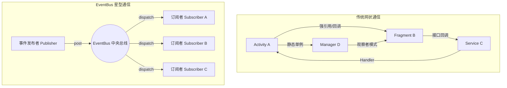
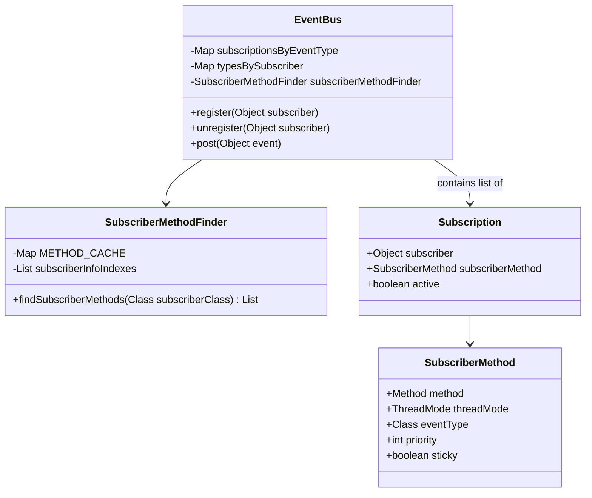
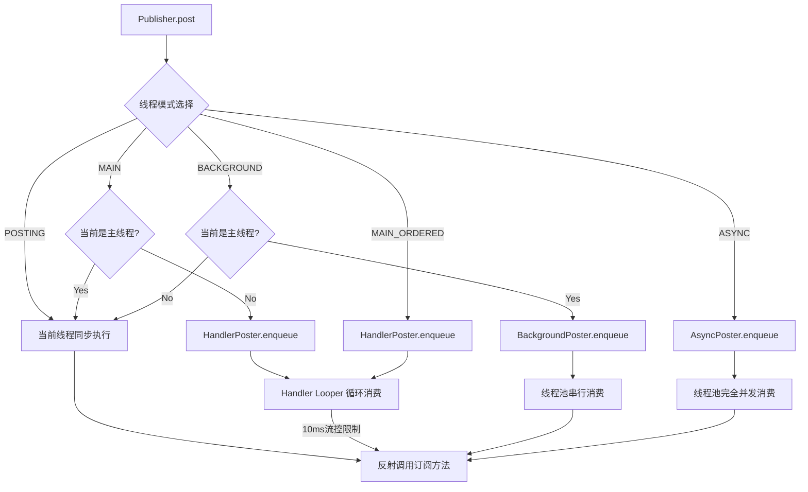
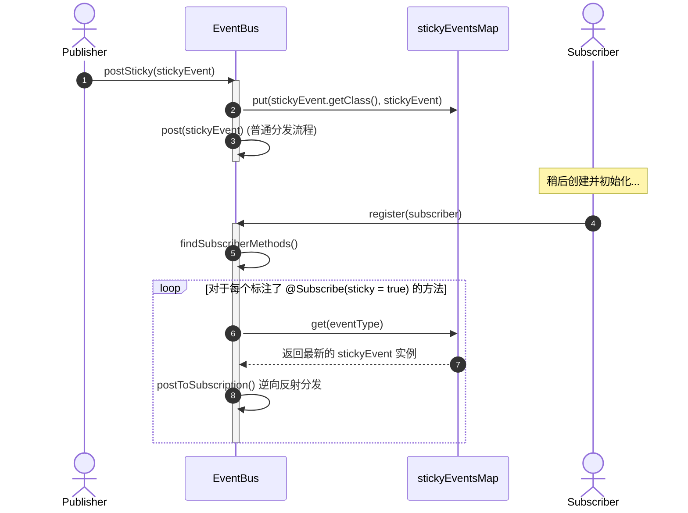

# EventBus 机制源码与原理解构

EventBus 是一款针对 Android 和 Java 的发布/订阅（Publish/Subscribe）事件总线框架。它以极简的 API 设计，实现了组件间、页面间、线程间的通信解耦。在 Android 组件化和多页面开发中，EventBus 曾扮演了至关重要的角色。

本文将从解耦哲学、注册与分发的源码级核心设计、五大线程模式的物理调度机理、粘性事件的陷阱以及现代 Android 架构下的方案权衡等方面，对 EventBus（以 `3.2.0` 版本源码为基础）进行深度的原理解析与源码解构。

---

## 1. EventBus 概述与通信解耦哲学

### 1.1 事件总线的诞生背景与架构定义
在 Android 系统的早期演进与中大型项目的开发过程中，各个组件（Activity、Fragment、Service、Presenter/ViewModel、后台任务等）之间经常需要进行数据传递与状态同步。传统的通信机制往往需要在对象之间建立直接或间接的引用关系，导致代码的耦合度随着业务的扩张呈指数级上升。

EventBus 引入了“事件总线”的概念，将复杂的点对点通信网状拓扑结构，简化为基于中央总线的星型拓扑结构。



在 EventBus 的架构设计中，通信的角色被简化为以下四种核心概念：
1. **Event（事件）**：普通的 Java/Kotlin 对象（POJO），没有任何基类或接口限制。任何数据载体都可以作为一个事件。
2. **Publisher（发布者）**：事件的源头，通过调用 `EventBus.getDefault().post(Object event)` 将事件发送至总线。发布者不需要知道谁在订阅该事件。
3. **Subscriber（订阅者）**：事件的接收者，通过在方法上标记 `@Subscribe` 注解来声明对某种特定事件类型的订阅，并需要在生命周期中显式注册和注销。
4. **EventBus（中央总线）**：核心控制器，负责维护订阅关系拓扑表，接收发布者的事件，并根据订阅者的配置（如线程模式、优先级等）将事件路由到对应的订阅者方法。

---

### 1.2 传统通信模式的痛点剖析
在深入 EventBus 源码之前，我们需要深刻理解传统 Android 开发中常用的通信方式——**接口回调**与**广播接收者（BroadcastReceiver）**在大型项目及多页面协作中的致命缺陷。

#### 1.2.1 接口回调（Interface Callback）的深层耦合与泄漏风险
接口回调是 Java 语言中最基础的通知机制，但在 Android 开发中，它存在以下三个不可忽视的痛点：

1. **回调地狱与生命周期强耦合**：
   当一个底层的网络任务或 Service 状态变化需要通知到 Activity 时，如果两者之间隔着多层组件（如 `Service -> Worker -> Repository -> Presenter -> Activity`），我们需要逐层定义回调接口并传递引用。这不仅会产生大量的样板代码，还会导致中间层组件持有上下游的强引用，形成一条漫长的强引用链。
   一旦最上层的 Activity 销毁（如屏幕旋转、配置变更），如果底层任务未及时取消，且链条上的强引用没有断开，就会导致整个 Activity 树及其持有的 View 层次结构全部泄露，直接引发内存溢出（OOM）。
   
   例如，典型的内存引用链如下：
   ```
   Garbage Collector Root (GC Root)
     └── Backgound Thread (后台运行的线程)
          └── Worker Task (异步工作任务)
               └── Callback (回调接口实例)
                    └── Activity (被强引用的已销毁 Activity)
                         └── DecorView (占用大量内存的 View 树)
   ```
2. **多对多通信爆炸**：
   接口回调天生适合“一对一”的通知场景。若需要实现“一对多”或“多对多”通信，就必须在发布者内部维护一个 `List<Callback>`。随着业务扩展，开发者需要不断地编写 `registerListener()` 和 `unregisterListener()`，管理这些监听器的生命周期。这增加了维护成本，极易因为漏掉 unregister 而引发内存泄漏。
3. **阻碍组件化开发**：
   在现代 Android 组件化/模块化架构下，不同的业务功能被划分到独立的 Module 中。如果 Module A 想要通过接口回调通知 Module B，两者之间就必须产生依赖。
   传统的解决方案是将接口定义下沉到 Common Module 中，但这会导致：
   * **Common 模块膨胀**：随着业务的增加，下沉的接口越来越多，Common 模块逐渐沦为“垃圾桶”，违背了“高内聚、低耦合”的模块设计原则。
   * **双向依赖/循环依赖**：如果无法做到良好的分层设计，甚至可能导致各个业务 Module 之间产生循环依赖，使得项目无法通过 Gradle 构建。

此外，纯 Java 的观察者模式（如旧版本 JDK 中的 `java.util.Observable` 与 `java.util.Observer`，自 Java 9 起已废弃）同样无法完美适配 Android。因为 `Observable` 的通知默认是同步执行的，事件发布在哪个线程，观察者回调就执行在哪个线程。如果我们在子线程中执行了耗时操作并发布通知，观察者若直接在回调中修改 UI 就会导致程序崩溃；若在主线程发布通知，观察者执行耗时操作又会直接卡死主线程，它缺乏灵活的线程切换和流控调度。

#### 1.2.2 广播接收者（BroadcastReceiver）的底层开销与废弃趋势
Android 系统提供的 `BroadcastReceiver` 是一种全局的通信机制，但如果将其用于进程内的普通组件通信，则无异于“大炮打蚊子”，会带来高昂的系统开销：

1. **跨进程通信（IPC）的隐式开销**：
   普通的全局广播（System Broadcast）底层是基于 Binder 机制实现的。当应用在进程内发送一条全局广播时，该广播首先需要通过 Binder 通信序列化并拷贝到系统的 `ActivityManagerService (AMS)` 中。AMS 内部对所有的 Receiver 进行过滤 and 路由匹配后，再通过 Binder 将数据反序列化并拷贝回我们的应用进程，最终回调 `onReceive()`。
   这一过程涉及了**两次 Binder IPC 调用**、**两次内存拷贝**以及**多次序列化与反序列化**，在频繁通信的场景下对 CPU 和系统内存带宽会产生极大的消耗。
2. **安全风险与权限管理**：
   由于全局广播是系统级的，其他恶意应用可以通过注册相同的 Action 阻截或窃听你的应用内通信，或者向你的应用发送垃圾广播进行注入攻击。虽然可以通过设置自定义权限或使用 `Intent.setPackage()` 限制范围，但这增加了配置的复杂度。
3. **本地广播 LocalBroadcastManager 的退役**：
   为了解决全局广播的性能与安全问题，Android 曾推出过进程内广播 `LocalBroadcastManager`。它去除了 Binder 依赖，直接在进程内通过 Handler 进行消息分发。然而，由于其使用依然高度依赖 Context、需要繁琐 of IntentFilter 配置，且不符合现代响应式编程的潮流，Google 已在 Jetpack 中将其正式废弃，官方推荐使用 Kotlin 协程的 `Flow` 或 `LiveData` 作为替代方案。

---

### 1.3 EventBus 的设计模式演进：观察者模式与发布-订阅者模式的交融
在软件架构设计中，EventBus 的核心思想是**发布-订阅者模式（Publish-Subscribe Pattern）**，它是经典**观察者模式（Observer Pattern）**的一种深度变体，但两者在解耦层面上存在着本质的区别。

#### 1.3.1 经典观察者模式与发布-订阅者模式的本质差异
* **观察者模式（Observer Pattern）**：
  在经典的观察者模式中，目标对象 `Subject`（被观察者）直接持有观察者 `Observer` 的引用列表。当 `Subject` 的状态发生改变时，它需要遍历这个列表并直接调用观察者的回调方法。这意味着，`Subject` 必须知道有哪些观察者存在，两者之间存在着**显式的直接依赖**关系，依然没有在空间上实现彻底的解耦。
* **发布-订阅者模式（Publish-Subscribe Pattern）**：
  在发布-订阅者模式中，发布者（Publisher）和订阅者（Subscriber）之间引入了一个**事件经纪人/中介者（Broker/Mediator）**，即中央总线（EventBus）。
  发布者不需要持有订阅者的引用，它只需将事件发送到 EventBus；订阅者同样只需向 EventBus 表达订阅意愿。EventBus 作为调度中心，统一管理所有订阅关系，并负责事件的分发。发布者和订阅者**在空间上实现了彻底的零依赖**。

这种通过引入“中央调度器”来切断发布者与订阅者之间直接强引用的设计，极大地减轻了 Android 开发中组件相互持有所引起的内存泄漏隐患，同时极大地提高了代码的灵活性，使得各个业务模块可以独立演进与维护。

---

### 1.4 EventBus 的通信解耦哲学
为了解决上述痛点，EventBus 提出了以下通信解耦哲学：

* **空间解耦（Spatial Decoupling）**：
  发布者和订阅者彼此完全不可见。发布者不需要持有订阅者的任何引用，甚至不知道是否有订阅者存在；订阅者同样不需要知道事件是由谁发布的。它们唯一的公共依赖是轻量级的事件对象（Event）。这种“无知”是降低系统复杂度的基石。
* **时间解耦（Temporal Decoupling）**：
  通过“粘性事件（Sticky Event）”，发布者可以先发布事件，而订阅者可以在未来的某个时间点（例如 Activity 被创建并注册后）再去消费该事件。这打破了传统通信中“发送与接收必须在同一时刻在线”的时间限制。
* **线程解耦（Thread Decoupling）**：
  在移动端，UI 渲染必须在主线程，而网络、I/O 等耗时任务必须在子线程。EventBus 将线程切换的逻辑封装在框架内部。订阅者只需在注解中声明 `threadMode = ThreadMode.MAIN` 或 `ThreadMode.BACKGROUND`，EventBus 就会在分发时自动完成线程切换。这使得多线程协作变得极其清爽，避免了在业务代码中充斥大量的 `runOnUiThread` 或 `Handler.post`。

---

## 2. 注册与分发核心机制源码解构

EventBus 的底层实现非常精妙。它将注册（register）与分发（post）解耦，在编译期和运行期做了大量的性能优化。本节将深度解构其最核心的源码逻辑。

### 2.1 Subscriber Index 编译期提效革命

在 EventBus 3.0 之前，框架在运行时注册一个订阅者时，必须通过**动态反射**去查找该类中所有带有 `@Subscribe` 注解的方法。这种做法在大型项目和低端 Android 设备上是灾难性的性能瓶颈。

#### 2.1.1 动态反射的性能灾难根源
反射不仅是性能的杀手，更是垃圾回收（GC）的催化剂，这在 Android 移动端（尤其是配置较低的千元机）表现得尤为明显：
1. **虚拟机方法区/元空间的检索负担**：
   当我们调用 `Class.getDeclaredMethods()` 时，虚拟机（JVM/ART）需要遍历当前类在方法区（Java 8 后为元空间 Metaspace）中的所有方法符号引用，并构建对应的 `Method` 对象数组。如果该类存在复杂的继承体系（例如 BaseActivity、BaseFragment 等多层级结构），EventBus 还必须递归向上查找其父类的方法（直到排除 Java/Android 的系统类），这会导致大量的类型比对和反射调用。
2. **方法数组的浅拷贝与安全检查**：
   虚拟机的运行时系统为了保证安全性，每次调用 `getDeclaredMethods()` 都会对内部的方法数组进行一次**浅拷贝（Shallow Copy）**。这会在堆内存中产生大量的 `Method` 对象和 `Class[]` 参数类型对象。在大量 Activity/Fragment 启动并注册 EventBus 的应用启动阶段，这会产生严重的内存抖动，频繁触发垃圾回收（GC），从而引发主线程卡顿（Jank）。
3. **方法访问器（MethodAccessor）生成的开销**：
   在 Java 中，反射调用 `Method.invoke()` 默认会经历一个“通货膨胀（Inflation）”的过程：前几次调用使用 Native 方式，如果调用次数超过一定阈值（默认 15 次），JVM 会动态生成一段 Java 字节码（即 MethodAccessor 的实现类）来加速后续调用。但这种动态字节码的生成与加载本身就非常耗时，且在 Android 的 ART 环境下，其 JIT/AOT 编译边界的切换开销更为显著。

#### 2.1.2 EventBusAnnotationProcessor 的 APT 提效底层原理
为了彻底解决运行时反射的瓶颈，EventBus 3.0 引入了**订阅者索引（Subscriber Index）**技术。其核心思想是将运行时的反射查找提前到**编译期**，通过 APT 自动生成静态查找表。

当我们在项目的 `build.gradle` 中配置了 `annotationProcessor` 引入 `eventbus-annotation-processor` 后，Java 编译器在编译源文件时，会触发 `EventBusAnnotationProcessor` 的工作：

1. **扫描注解与编译器轮次机制**：
   在 Java 编译器进行 Annotation Processing 的轮次（Rounds）中，APT 会通过 `RoundEnvironment.getElementsAnnotatedWith(Subscribe.class)` 递归扫描项目中所有带有 `@Subscribe` 注解的方法。
2. **过滤非法方法声明**：
   APT 会对扫描到的方法进行严格的合法性校验：
   * 方法修饰符必须是 `public`。
   * 方法不能是 `static`（静态的）。
   * 方法不能是 `abstract`（抽象的）。
   * 方法的参数列表必须**有且仅有一个**参数（即订阅的事件类型）。
   如果发现有不合规的方法声明，APT 会在编译期直接报错并中断构建，从源头上杜绝了非法声明的方法进入运行时。
3. **构建订阅者信息**：
   对于每个含有订阅方法的类，收集其类名、方法名、订阅的事件类型、线程模式（`ThreadMode`）、优先级（`priority`）、是否是粘性事件（`sticky`）等元数据。
4. **生成 Java 代码**：
   利用 `JavaFileObject` 在编译生成的目录（`build/generated/ap_generated_sources`）下输出一个名为 `MyEventBusIndex`（名称可自定义）的 Java 类，该类实现了 `SubscriberInfoIndex` 接口。

我们可以看一下生成的 `SubscriberInfoIndex` 类的代码示例结构：

```java
/** This class was generated by EventBus. Do not modify. */
public class MyEventBusIndex implements SubscriberInfoIndex {
    private static final Map<Class<?>, SubscriberInfo> SUBSCRIBER_INDEX;

    static {
        SUBSCRIBER_INDEX = new HashMap<Class<?>, SubscriberInfo>();

        // 编译期静态写入 ActivityA 的订阅信息
        putIndex(new SimpleSubscriberInfo(com.example.ActivityA.class, true, new SubscriberMethodInfo[] {
            new SubscriberMethodInfo("onMessageEvent", com.example.MessageEvent.class, ThreadMode.MAIN),
            new SubscriberMethodInfo("onSomeOtherEvent", com.example.OtherEvent.class, ThreadMode.BACKGROUND, 1, true)
        }));
        
        // 编译期静态写入 FragmentB 的订阅信息
        putIndex(new SimpleSubscriberInfo(com.example.FragmentB.class, true, new SubscriberMethodInfo[] {
            new SubscriberMethodInfo("onMessageEvent", com.example.MessageEvent.class, ThreadMode.POSTING)
        }));
    }

    private static void putIndex(SubscriberInfo info) {
        SUBSCRIBER_INDEX.put(info.getSubscriberClass(), info);
    }

    @Override
    public SubscriberInfo getSubscriberInfo(Class<?> subscriberClass) {
        SubscriberInfo info = SUBSCRIBER_INDEX.get(subscriberClass);
        return info != null ? info : null;
    }
}
```

在运行时，我们通过 Builder 将这个生成的索引配置给 EventBus 单例：
```java
EventBus.builder()
    .addIndex(new MyEventBusIndex())
    .installDefaultEventBus();
```
通过这一静态索引表，运行时注册订阅者时，EventBus 只需要通过 `SUBSCRIBER_INDEX.get(subscriberClass)` 进行一次普通的 `HashMap` 查找，即可在 **O(1)** 时间复杂度内获取到所有的订阅方法元数据。这完全规避了运行时反射，使注册速度提升了几十倍，消除了启动阶段的卡顿。

---

### 2.2 register() 源码剖析

当我们在 Activity 的 `onCreate` 或 `onStart` 中调用 `EventBus.getDefault().register(this)` 时，其内部的源码逻辑非常严密：



#### 2.2.1 寻找订阅方法的双通道策略
注册的第一步是寻找订阅者类中符合条件的方法。`EventBus.register()` 调用了 `SubscriberMethodFinder`：

```java
// EventBus.java
public void register(Object subscriber) {
    Class<?> subscriberClass = subscriber.getClass();
    // 1. 查找订阅者类中的所有订阅方法
    List<SubscriberMethod> subscriberMethods = subscriberMethodFinder.findSubscriberMethods(subscriberClass);
    synchronized (this) {
        for (SubscriberMethod subscriberMethod : subscriberMethods) {
            // 2. 建立订阅关系的物理映射表
            subscribe(subscriber, subscriberMethod);
        }
    }
}
```

我们进入 `SubscriberMethodFinder.findSubscriberMethods` 源码分析其优化策略：

```java
// SubscriberMethodFinder.java
List<SubscriberMethod> findSubscriberMethods(Class<?> subscriberClass) {
    // 级级缓存：首先尝试从内存缓存中获取，避免二次解析
    List<SubscriberMethod> subscriberMethods = METHOD_CACHE.get(subscriberClass);
    if (subscriberMethods != null) {
        return subscriberMethods;
    }

    // ignoreGeneratedIndex 默认为 false，即默认使用生成的 APT 索引
    if (ignoreGeneratedIndex) {
        // 全反射通道
        subscriberMethods = findUsingReflection(subscriberClass);
    } else {
        // 优先使用生成的 APT 索引通道
        subscriberMethods = findUsingInfo(subscriberClass);
    }
    if (subscriberMethods.isEmpty()) {
        throw new EventBusException("Subscriber " + subscriberClass
                + " and its super classes have no public methods with the @Subscribe annotation");
    } else {
        // 放入缓存，提升下次获取速度
        METHOD_CACHE.put(subscriberClass, subscriberMethods);
        return subscriberMethods;
    }
}
```

##### 1. findUsingInfo 与 FindState 重用池设计
在 `findUsingInfo` 流程中，EventBus 使用了一个非常巧妙的内部类 `FindState`。它不仅封装了当前查找类的元数据，还负责处理从子类到父类继承链上的方法重写过滤（如子类重写了父类的订阅方法，应该只响应子类的方法一次）。

为了规避频繁创建 `FindState` 造成的堆内存开销与 GC 压力，EventBus 设计了一个**对象复用池**：

```java
// SubscriberMethodFinder.java 内部的重用池设计
private static final int POOL_SIZE = 4;
private static final FindState[] FIND_STATE_POOL = new FindState[POOL_SIZE];

private FindState prepareFindState() {
    synchronized (FIND_STATE_POOL) {
        for (int i = 0; i < POOL_SIZE; i++) {
            FindState state = FIND_STATE_POOL[i];
            if (state != null) {
                FIND_STATE_POOL[i] = null; // 从池中取出
                return state;
            }
        }
    }
    return new FindState(); // 池空，则新建
}
```

在 `FindState` 内部，通过 `SubscriberInfoIndex` 静态匹配订阅者信息，如果发现当前的 Class 并没有在生成的 `MyEventBusIndex` 中，它会“回退”到反射查找（`findUsingReflectionInSingleClass`），确保了框架在未配置 APT 时的向下兼容性与鲁棒性。

##### 2. 运行时反射查找的回退实现（findUsingReflection）
在未配置编译期索引或类未命中索引时，EventBus 会进入反射机制：
* **过滤系统包**：反射查找会排除以 `java.`, `javax.`, `android.` 等系统根包名开头的类，直接截断无效的向上父类递归查找。
* **方法修饰符解析**：利用 `method.getModifiers()`，通过位运算验证修饰符是否满足 `Modifier.PUBLIC`，且排除 `Modifier.STATIC`、`Modifier.ABSTRACT`，如果校验失败则静默忽略。通过 `method.getAnnotation(Subscribe.class)` 获取方法的注解参数。

---

#### 2.2.2 核心存储容器的物理双向映射拓扑与 subscribe 逻辑
在获取到所有的 `SubscriberMethod` 后，EventBus 循环调用 `subscribe(subscriber, subscriberMethod)`。我们对其底层细节展开源码剖析：

```java
// EventBus.java - 核心 subscribe 绑定过程
private void subscribe(Object subscriber, SubscriberMethod subscriberMethod) {
    Class<?> eventType = subscriberMethod.eventType;
    // 1. 包装订阅者对象和订阅方法为 Subscription
    Subscription newSubscription = new Subscription(subscriber, subscriberMethod);
    
    // 2. 将 Subscription 存入 subscriptionsByEventType 中
    CopyOnWriteArrayList<Subscription> subscriptions = subscriptionsByEventType.get(eventType);
    if (subscriptions == null) {
        subscriptions = new CopyOnWriteArrayList<>();
        subscriptionsByEventType.put(eventType, subscriptions);
    } else {
        // 3. 校验防重复注册：在列表中检查是否存在相同的 Subscription
        if (subscriptions.contains(newSubscription)) {
            throw new EventBusException("Subscriber " + subscriber.getClass() + " already registered to event " + eventType);
        }
    }

    // 4. 优先级插入排序：按照 priority 降序将 newSubscription 插入到 CopyOnWriteArrayList 中
    int size = subscriptions.size();
    for (int i = 0; i <= size; i++) {
        if (i == size || subscriberMethod.priority > subscriptions.get(i).subscriberMethod.priority) {
            subscriptions.add(i, newSubscription);
            break;
        }
    }

    // 5. 将事件类型存入 typesBySubscriber 中，方便 unregister 时快速反查并卸载
    List<Class<?>> subscribedEvents = typesBySubscriber.get(subscriber);
    if (subscribedEvents == null) {
        subscribedEvents = new ArrayList<>();
        typesBySubscriber.put(subscriber, subscribedEvents);
    }
    subscribedEvents.add(eventType);

    // 6. 如果是粘性事件，执行粘性事件的回放与反向分发
    if (subscriberMethod.sticky) {
        // ... (后文详述)
    }
}
```

##### 深入探究并发容器的选择、死锁防范与卸载效率优化：
* **为什么使用 CopyOnWriteArrayList**：
  相比之下，传统的 `Collections.synchronizedList()` 虽然能保证线程安全，但它通过极粗粒度的互斥锁保护所有读写操作，这使得即使在高并发的多线程读取时，各个线程也必须排队等待，性能退化严重。而 `CopyOnWriteArrayList` 的优势在于其内部读取是无锁的，其 `iterator` 直接访问当前底层的 `volatile Object[]` 数组。当且仅当发生写入操作（如 register 插入、unregister 卸载）时，内部会利用写锁进行安全拷贝，在新副本上修改，完成后通过 `setArray` 指针重定向。
  这使得高并发多线程发布（post）事件时，由于仅作读取，整个分发链路**无锁化**，吞吐量和响应速度极佳。在发布事件的过程中，即使有其他线程在进行注册操作，发布线程拿到的依然是那一时刻的底层数组快照，不会抛出 `ConcurrentModificationException` 异常，具有强健的并发读一致性。
* **锁粒度优化与多线程死锁防范**：
  在 `register` 时，EventBus 仅在 `subscribe()` 的代码块上使用 `synchronized (this)` 对 EventBus 实例加锁，而在 `post()` 分发阶段**完全不加锁**。
  假设有线程 A 正在高频地调用 `post()` 发布事件，而线程 B 在主线程进行页面的 `register()`。如果 `post()` 也采用互斥锁保护，势必会导致线程 B 在主线程被挂起阻塞，从而产生丢帧甚至 ANR。由于 `CopyOnWriteArrayList` 写时复制的弱一致性快照特性，EventBus 将互斥范围严格限制在“写-写”冲突（即两个线程同时进行 register/unregister）上，完美实现了“读-写”并发，从根本上杜绝了因高频发送消息与动态页面装载之间的死锁隐患。
* **typesBySubscriber 对注销操作的 O(K) 级加速**：
  在 unregister 注销时，若没有 `typesBySubscriber`，我们必须线性遍历 `subscriptionsByEventType` 中的**每一个**事件类型的列表，寻找并清除当前订阅者。对于包含上千个事件类型的大型项目，注销操作的时间复杂度会直接退化为 `O(M * L)`（M 为事件数，L 为每种事件的订阅者数）。
  通过 `typesBySubscriber`，在注销时，EventBus 可以在 **O(1)** 时间内拿到该订阅者订阅的少量事件类型列表（`List<Class<?>>`），接着只针对这两个事件 Class 去 `subscriptionsByEventType` 对应的 `CopyOnWriteArrayList` 中清除 `Subscription`，注销时间复杂度瞬间缩减至常数级 `O(K)`（K 为该订阅者订阅的事件数，一般为 1~2），从而极大地保护了主线程的执行帧率。

我们可以通过如下的物理拓扑图清晰地理解这二者的对应关系：

```
                    【subscriptionsByEventType】 (用于 post 分发)
                    ┌─────────────────┐      ┌───────────────────────────┐
                    │ MessageEvent.cl │ ───> │ [Subscription 1] (ActivityA)│ ──> [Subscription 2] (FragmentB)
                    ├─────────────────┤      └───────────────────────────┘
                    │  LoginEvent.cl  │ ───> │ [Subscription 3] (ActivityA)│
                    └─────────────────┘      └───────────────────────────┘
                                                       ▲
                                                       │ (关联映射)
                                                       ▼
                    【typesBySubscriber】 (用于 unregister 注销)
                    ┌─────────────────┐      ┌───────────────────────────┐
                    │   ActivityA     │ ───> │ [MessageEvent.cl, LoginEvent.cl]
                    ├─────────────────┤      └───────────────────────────┘
                    │   FragmentB     │ ───> │ [MessageEvent.cl]
                    └─────────────────┘      └───────────────────────────┘
```

---

### 2.3 post() 源码剖析与 ThreadLocal 事件队列

事件发布（post）是 EventBus 的高频操作。它的源码设计核心在于：**如何解决高并发多线程发布时的状态隔离，以及如何处理嵌套发布（重入）逻辑？**

#### 2.3.1 ThreadLocal<PostingThreadState> 事件队列的并发隔离与防重入设计
EventBus 内部使用 `ThreadLocal` 维护了每个线程私有的发送状态：

```java
private final ThreadLocal<PostingThreadState> currentPostingThreadState = new ThreadLocal<PostingThreadState>() {
    @Override
    protected PostingThreadState initialValue() {
        return new PostingThreadState();
    }
};

// 状态结构体
static final class PostingThreadState {
    final List<Object> eventQueue = new ArrayList<>(); // 线程私有的事件队列
    boolean isPosting;      // 当前线程是否正在分发中
    boolean isMainThread;   // 是否为主线程
    Subscription subscription;
    Object event;
    boolean canceled;
}
```

我们来逐行剖析 `post(Object event)` 的分发源码：

```java
// EventBus.java
public void post(Object event) {
    // 1. 获取当前线程私有的 PostingThreadState 状态对象
    PostingThreadState postingState = currentPostingThreadState.get();
    List<Object> eventQueue = postingState.eventQueue;
    
    // 2. 将事件加入当前线程的私有排队队列中
    eventQueue.add(event);

    // 3. 判断是否正在 posting 状态中，这是防止“重入（Reentrancy）”的关键
    if (!postingState.isPosting) {
        postingState.isMainThread = AndroidDependenciesDetector.isAndroidSDKAvailable() ? 
            Looper.myLooper() == Looper.getMainLooper() : false;
        postingState.isPosting = true;
        if (postingState.canceled) {
            throw new EventBusException("Internal error. Can't cancel event dispatching");
        }
        try {
            // 4. 循环消费事件队列
            while (!eventQueue.isEmpty()) {
                postSingleEvent(eventQueue.remove(0), postingState);
            }
        } finally {
            // 5. 状态复位，防止多线程复用时引发状态污染
            postingState.isPosting = false;
            postingState.isMainThread = false;
        }
    }
}
```

##### 深入探究：为什么要设计 `ThreadLocal` 队列？
1. **彻底的无锁化（Lock-free）状态隔离**：
   如果 `eventQueue` 和 `isPosting` 状态是全局共享的，那么在多线程并发 `post` 时，就必须引入全局的静态锁或同步块来保证事件不会发生时序混乱。这会导致高并发场景下的严重锁竞争，使多线程发布事件变成串行排队。
   利用 `ThreadLocal`，每个物理线程都有自己独立的 `eventQueue`。线程 A 的 post 操作和线程 B 的 post 操作在物理上完全隔离，整个分分中心无任何同步阻塞，全程**零锁竞争**，获得了极高的并发性能。
2. **完美规避重入卡死与 StackOverflow**：
   在实际开发中，经常会有“嵌套 post”的场景：在接收到 Event A 时，订阅者的回调方法内又 post 了 Event B。
   * 如果没有队列缓存，直接同步调用反射，会导致调用栈在同一线程中无限嵌套（`post(A) -> onEvent(A) -> post(B) -> onEvent(B) ...`）。一旦嵌套层次过深，就会抛出 `StackOverflowError` 内存溢出。
   * 如果此时有多线程参与，还极易引发死锁。
   通过 `isPosting` 标记，当 Event B 被 post 时，检测到当前线程的 `isPosting` 已经是 true，它仅仅会被放入线程私有的 `eventQueue` 中，随后立即返回。
   此时外层的 `while (!eventQueue.isEmpty())` 循环会继续运转，在处理完 Event A 后，自动出队处理 Event B。这巧妙地将**递归调用扁平化为了顺序循环**，保证了调用栈的安全，同时也确保了同一线程内的事件发送顺序。
3. **线程池复用时的状态重置防污染（强弱引用隐患）**：
   在 Java 的线程池或 Android 的 HandlerThread 中，线程是长期存活并被重复使用的。由于 Java 的 `ThreadLocal` 底层实现（`ThreadLocalMap`）中，Entry 的 Key 是弱引用的 `ThreadLocal`，而 Value（即 `PostingThreadState` 对象）是强引用。
   如果线程没有结束，且我们没有在 `finally` 块中重置其内部数据。下一次该线程从线程池被拿出来执行其他逻辑并调用 `post` 时，极可能读取到残留的错误状态（例如 `isPosting` 残留为 true）。这会导致该线程发送的事件只会被默默加入队列，而永远不会被 while 循环消费，发生诡异的“事件静默丢失” Bug。因此，`finally` 块中的状态重置与清空，是保证工程运行安全的基石。

#### 2.3.2 事件继承（Event Inheritance）机制与性能优化
在 `postSingleEvent` 中，EventBus 支持事件继承机制：

```java
private void postSingleEvent(Object event, PostingThreadState postingState) throws Error {
    Class<?> eventClass = event.getClass();
    boolean subscriptionFound = false;
    
    // 如果开启了事件继承支持
    if (eventInheritance) {
        // 查找该事件类所有的父类及实现的接口（内部有 Map 缓存优化）
        List<Class<?>> eventTypes = lookupAllEventTypes(eventClass);
        int countTypes = eventTypes.size();
        for (int h = 0; h < countTypes; h++) {
            Class<?> clazz = eventTypes.get(h);
            // 依次分发所有子类、父类、接口类型的订阅者
            subscriptionFound |= postSingleEventForEventType(event, postingState, clazz);
        }
    } else {
        // 关闭继承，只分发给精确匹配的订阅者
        subscriptionFound = postSingleEventForEventType(event, postingState, eventClass);
    }
    
    if (!subscriptionFound) {
        // 若没有订阅者订阅此事件，且开启了 logNoSubscriberMessages，则打印日志
    }
}
```

##### 性能取舍：
当 `eventInheritance` 为 true 时，即使 `lookupAllEventTypes` 内部有 `eventTypesCache` 缓存，在第一次发布某个事件或事件层级极其复杂时，依然需要递归去解析 Class 的父类和接口，并向它们派发。
在大型高并发、性能敏感的系统（如高频网络包分发、弹幕渲染队列）中，建议通过 `EventBusBuilder.eventInheritance(false)` 关闭此特性。关闭后，`post(MessageEvent)` 只会分发给订阅了 `MessageEvent` 的方法，直接省去大量的向上类型递归查找开销，从而提升高频 post 下的 CPU 分发性能。

---

## 3. 五大线程模式（ThreadMode）事件邮递物理机理解密

EventBus 的精髓之一在于五大 `ThreadMode`，这使得多线程间的消息分发和 UI 切换如丝般顺滑。这一切都是通过底层的 Poster 调度器实现的。



### 3.1 五大线程模式的底层 Poster 调度机制

我们将五大模式对应的调度机制、上下文切换策略及应用场景汇总如下：

| 线程模式 (ThreadMode) | 运行线程 | 上下文切换策略 | 内部依赖的调度器 (Poster) | 核心特点与适用场景 |
| :--- | :--- | :--- | :--- | :--- |
| **`POSTING`** | 与发布者在同一线程 | **零上下文切换**，同步直接调用。 | 无（直接在分发线程执行反射） | 最快，零开销。适合极其轻量且无阻塞的同步业务逻辑。 |
| **`MAIN`** | Android 主线程 (UI) | 若发布在主线程，则同步直接执行；若在子线程，则通过 Handler 异步入队。 | `HandlerPoster` | 快速更新 UI。若子线程 post，会产生 Handler 的线程切换。 |
| **`MAIN_ORDERED`** | Android 主线程 (UI) | **强制入队 Handler**，无论发布在什么线程，都排队等 Looper 调度。 | `HandlerPoster` | 保证主线程事件执行的严格时序，防止嵌套 post 破坏执行顺序。 |
| **`BACKGROUND`** | 后台子线程 | 若发布在子线程，直接同步执行；若在主线程，入队到串行执行器。 | `BackgroundPoster` (共享单线程任务) | 顺序执行的后台任务。整个总线共享一个 Background 线程，防止后台线程过度并发。 |
| **`ASYNC`** | 独立的后台子线程 | **强制提交到线程池**，并发非阻塞执行。 | `AsyncPoster` (完全并发) | 耗时任务（网络、I/O、复杂计算）。不保证顺序，各个事件独立并发运行。 |

---

### 3.2 核心 Poster 源码与流控算法剖析

#### 3.2.1 任务承载体：PendingPost 与 PendingPostQueue
In 解密 Poster 之前，需要先认识被排队的消息载体 `PendingPost`：

```java
// PendingPost.java
final class PendingPost {
    // 复用池：双向单链表结构，用于缓存 PendingPost 对象，最大容量 10000
    private static final List<PendingPost> pendingPostPool = new ArrayList<PendingPost>();

    Object event;               // 发布的具体事件
    Subscription subscription;  // 目标订阅关系
    PendingPost next;           // 链表指针

    private PendingPost(Object event, Subscription subscription) {
        this.event = event;
        this.subscription = subscription;
    }

    // 从池中获取或新建对象，规避高并发下的堆内存垃圾抖动
    static PendingPost obtainPendingPost(Subscription subscription, Object event) {
        synchronized (pendingPostPool) {
            int size = pendingPostPool.size();
            if (size > 0) {
                PendingPost pendingPost = pendingPostPool.remove(size - 1);
                pendingPost.event = event;
                pendingPost.subscription = subscription;
                pendingPost.next = null;
                return pendingPost;
            }
        }
        return new PendingPost(event, subscription);
    }
    
    // 消费后释放回池中
    static void releasePendingPost(PendingPost pendingPost) {
        pendingPost.event = null;
        pendingPost.subscription = null;
        pendingPost.next = null;
        synchronized (pendingPostPool) {
            if (pendingPostPool.size() < 10000) {
                pendingPostPool.add(pendingPost);
            }
        }
    }
}
```

`PendingPostQueue` 则是基于 `PendingPost` 单链表构建的先进先出（FIFO）队列，通过对 `enqueue` 和 `poll` 加锁 `synchronized` 确保多线程操作的线程安全。

#### 3.2.2 主线程海报：HandlerPoster 及其 10ms 流控限时算法
`HandlerPoster` 继承自 `Handler`，负责将子线程的事件回调路由到主线程。
它拥有一套极其精妙的**主线程流量控制（Flow Control）**算法，限制单次主线程占用的最大耗时。

以下是 `HandlerPoster` 的核心源码（带有详尽的注释和设计剖析）：

```java
public class HandlerPoster extends Handler implements Poster {

    private final PendingPostQueue queue; // 事件排队链表队列
    private final int maxMillisInsideHandleMessage; // 单次 handleMessage 允许的最大执行耗时限制（默认 10ms）
    private final EventBus eventBus;
    private boolean handlerActive; // 标志 Handler 当前是否已向 Looper 投递了 Message 并处于活跃状态

    protected HandlerPoster(EventBus eventBus, Looper looper, int maxMillisInsideHandleMessage) {
        super(looper);
        this.eventBus = eventBus;
        this.maxMillisInsideHandleMessage = maxMillisInsideHandleMessage;
        queue = new PendingPostQueue();
    }

    @Override
    public void enqueue(Subscription subscription, Object event) {
        // 1. 获取（或从池中复用）一个 PendingPost 任务对象
        PendingPost pendingPost = PendingPost.obtainPendingPost(subscription, event);
        synchronized (this) {
            // 2. 将任务推入队列
            queue.enqueue(pendingPost);
            
            // 3. 判断是否已经发送了消息到 Looper，避免重复 sendMessage 增加调度开销
            if (!handlerActive) {
                handlerActive = true;
                // 向 Handler 自身发送一个 Message，等待 Looper 调度 handleMessage()
                if (!sendMessage(obtainMessage())) {
                    throw new EventBusException("Could not send handler message");
                }
            }
        }
    }

    @Override
    public void handleMessage(Message msg) {
        boolean rescheduled = false;
        try {
            long start = SystemClock.uptimeMillis(); // 记录本次批处理的开始绝对时间
            while (true) {
                // 4. 从链表队列中出队一个任务
                PendingPost pendingPost = queue.poll();
                
                // 5. 双重校验锁：如果队列为空，尝试在同步块中再次校验，防止高并发下的数据可见性竞争
                if (pendingPost == null) {
                    synchronized (this) {
                        pendingPost = queue.poll();
                        if (pendingPost == null) {
                            // 队列完全清空，重置活跃标志，释放控制权
                            handlerActive = false;
                            return;
                        }
                    }
                }
                
                // 6. 执行核心的反射调用，在主线程分发事件
                eventBus.invokeSubscriber(pendingPost);
                
                // 7. 核心流控阈值检查：计算当前 handleMessage 已经执行的时间
                long timeInMethod = SystemClock.uptimeMillis() - start;
                if (timeInMethod >= maxMillisInsideHandleMessage) {
                    // 若执行耗时超过了 10ms（默认值），为防止阻塞主线程（ANR/掉帧），果断出让 CPU 控制权
                    if (!sendMessage(obtainMessage())) {
                        throw new EventBusException("Could not send handler message");
                    }
                    rescheduled = true; // 标记重新调度成功
                    return; // 退出当前 handleMessage，把控制权还给 UI Looper，剩余的任务等待下一次消息处理
                }
            }
        } finally {
            // 若由于非正常退出，或者超过 10ms 退出，保持 handlerActive 为 true
            handlerActive = rescheduled;
        }
    }
}
```

##### 10ms 流控限时算法的底层逻辑推导与设计美学：
* **Android 系统的消息泵协作**：
  在 Android 的 `Looper.loop()` -> `MessageQueue.next()` 主线程消息泵循环中，如果一个消息的执行时间过长，就会导致主线程无法及时响应输入事件、度量布局（Measure/Layout）以及屏幕渲染（VSYNC 信号触发 Choreographer 绘制），造成界面掉帧（Jank）乃至 ANR 崩溃。
* **出让控制权与 Looper 时间片分片（Time Slicing）**：
  当处理耗时超过 10ms 时，`HandlerPoster` 会通过 `sendMessage()` 向系统消息队列发送一个空 Message。由于这个消息会被挂入主线程 `MessageQueue` 链表的尾部，这就实现了一次精妙的“时间分片”。
  在当前处理任务退出到下一次接收消息期间，Looper 可以优先执行那些排在前面的高优先级绘制消息和输入事件。这不仅有效降低了 Looper 连续唤醒的切换损耗，更给系统渲染留出了宝贵的空隙，在保证大批量事件得以批处理的前提下，确保界面的高响应度和极佳流畅性。
* **为什么使用 `SystemClock.uptimeMillis()`？**
  与 `System.currentTimeMillis()` 相比，`SystemClock.uptimeMillis()` 计算的是自系统启动以来的非休眠时间。它有两大核心优势：
  * **单调递增性**：不受用户调整系统时钟（如时区更改、网络对时调整）的影响，保证时间计算不会发生逆转或突变。
  * **低开销**：其底层是通过读取 Linux 内核时间常数实现的，精度高，调用开销远小于墙上时钟。

#### 3.2.3 后台线程串行海报：BackgroundPoster
```java
// BackgroundPoster.java
final class BackgroundPoster implements Runnable, Poster {
    private final PendingPostQueue queue;
    private final EventBus eventBus;
    private volatile boolean executorRunning;

    // ...
    @Override
    public void enqueue(Subscription subscription, Object event) {
        PendingPost pendingPost = PendingPost.obtainPendingPost(subscription, event);
        synchronized (this) {
            queue.enqueue(pendingPost);
            if (!executorRunning) {
                executorRunning = true;
                // 提交给线程池
                eventBus.getExecutorService().execute(this);
            }
        }
    }

    @Override
    public void run() {
        try {
            try {
                // 循环拉取队列，单线程顺序消费所有任务
                while (true) {
                    PendingPost pendingPost = queue.poll(1000); // 带超时的 poll
                    if (pendingPost == null) {
                        synchronized (this) {
                            pendingPost = queue.poll();
                            if (pendingPost == null) {
                                executorRunning = false;
                                return;
                            }
                        }
                    }
                    eventBus.invokeSubscriber(pendingPost);
                }
            } catch (InterruptedException e) {
                // ...
            }
        } finally {
            executorRunning = false;
        }
    }
}
```

* **物理设计与锁机制分析**：
  `BackgroundPoster` 自身实现 `Runnable` 并通过 `executorRunning` 状态来控制线程拉取。
  如果发布者在主线程，`BACKGROUND` 事件会提交到 `BackgroundPoster`。
  它的工作机理是：**单线程串行循环消费**。
  整个 EventBus 仅向线程池申请一个线程来消费 `BackgroundPoster` 队列中的所有事件。如果该后台线程正在运行（`executorRunning` 为 true），新入队的事件只需要排队等待。这保证了所有 `BACKGROUND` 事件在后台线程的执行顺序一致，并避免了由于后台并发泛滥而引起 CPU 核心时间片抢占和内存开销。

#### 3.2.4 异步并发海报：AsyncPoster
与 `BackgroundPoster` 的串行队列相反，`AsyncPoster` 没有任何排队锁状态，实现真正的完全并发：

```java
// AsyncPoster.java
class AsyncPoster implements Runnable, Poster {
    private final PendingPostQueue queue;
    private final EventBus eventBus;

    // ...
    @Override
    public void enqueue(Subscription subscription, Object event) {
        PendingPost pendingPost = PendingPost.obtainPendingPost(subscription, event);
        queue.enqueue(pendingPost);
        // 每次 enqueue 无条件直接投递给线程池，申请独立线程进行并发反射调用
        eventBus.getExecutorService().execute(this);
    }

    @Override
    public void run() {
        PendingPost pendingPost = queue.poll();
        if(pendingPost == null) {
             throw new IllegalStateException("No pending post available");
        }
        eventBus.invokeSubscriber(pendingPost);
    }
}
```

对于每一个 `ASYNC` 类型的订阅方法，只要有事件被 post 过来，`AsyncPoster` 就会向线程池申请一个新的任务去执行它，各个任务在线程池中并发执行，互不干扰，非常适合耗时较长的网络下载、本地文件写入或大规模数据处理。

#### 3.2.5 EventBus 的线程池底层细节
EventBus 默认使用的线程池定义如下：
```java
private final static ExecutorService DEFAULT_EXECUTOR_SERVICE = Executors.newCachedThreadPool();
```
`CachedThreadPool` 没有核心线程（corePoolSize = 0），最大线程数无界（Integer.MAX_VALUE），存活时间为 60s，使用 `SynchronousQueue` 容器。
* **选用缘由**：在客户端应用中，事件的发送通常是瞬间爆发、短暂执行的。`CachedThreadPool` 能够在并发剧增时快速创建子线程响应，并在无任务时自动回收线程，不常驻系统资源。
* **潜在风险**：由于最大线程数无界，如果配合 `AsyncPoster` 并且存在恶意的无限循环 post 逻辑，可能会在瞬间创建成百上千个 Native 线程，极易突破进程的线程数量配额，直接抛出 `java.lang.OutOfMemoryError: unable to create new native thread` 导致程序崩溃。因此，开发者在配置 `ASYNC` 线程模式时，应保证订阅方法的执行时间能够被快速收敛，不能在里面执行死循环。

---

## 4. 粘性事件（Sticky Event）设计与泄漏防范

粘性事件是 EventBus 中非常有特色但同时也非常危险的设计。它的设计初衷是解决**“事件发送发生在订阅者初始化之前”**的异步时间差问题。

### 4.1 粘性事件存取与分发原理解密

在 EventBus 内部，粘性事件是由一个线程安全的并发容器来维护的：

```java
// 存储粘性事件的全局 Map：Key 为事件 Class，Value 为对应的最新事件对象
private final Map<Class<?>, Object> stickyEvents;

public EventBusBuilder() {
    // 选用 ConcurrentHashMap，确保多线程并发读写时的安全性与高吞吐
    stickyEvents = new ConcurrentHashMap<>();
}
```

#### 4.1.1 粘性事件的投递流向：


#### 4.1.2 源码级数据流走向：
1. **发布阶段 (`postSticky`)**：
   ```java
   public void postSticky(Object event) {
       synchronized (stickyEvents) {
           // 将事件存入 stickyEvents Map 中。由于 Map 的特性，同类型的粘性事件会被最新的覆盖。
           stickyEvents.put(event.getClass(), event);
       }
       // 存入 Map 后，顺便调用常规 post() 进行一次正常的实时分发
       post(event);
   }
   ```
2. **注册阶段 (`register`)**：
   在 `subscribe()` 绑定关系的尾部，EventBus 会对粘性属性进行检测并执行“历史数据回放”：
   ```java
   // subscribe() 内部
   if (subscriberMethod.sticky) {
       if (eventInheritance) {
           // 若开启事件继承，则需要查找 stickyEvents 中所有与当前订阅类型存在子父类继承关系的粘性事件
           Set<Map.Entry<Class<?>, Object>> entries = stickyEvents.entrySet();
           for (Map.Entry<Class<?>, Object> entry : entries) {
               Class<?> candidateType = entry.getKey();
               if (subscriberMethod.eventType.isAssignableFrom(candidateType)) {
                   Object stickyEvent = entry.getValue();
                   checkPostStickyEventToSubscription(subscription, stickyEvent);
               }
           }
       } else {
           // 未开启继承，直接从 Map 中精确取出目标事件
           Object stickyEvent = stickyEvents.get(subscriberMethod.eventType);
           checkPostStickyEventToSubscription(subscription, stickyEvent);
       }
   }
   ```
   如果 `stickyEvent` 不为空，EventBus 会立即调用 `postToSubscription`。这使得订阅者在注册的瞬间，就能直接拿到最新的一条历史数据。

---

### 4.2 粘性事件的致命陷阱：内存泄漏与状态错乱

虽然粘性事件在跨 Activity 传递参数、延迟通知状态等场景下使用方便，但在软件工程实践中，它也是许多偶发性严重 Bug 的万恶之源。

#### 4.2.1 强引用缓存引起的内存泄漏
`stickyEvents` 作为一个驻留在 EventBus（通常作为全局静态单例）内部的 `ConcurrentHashMap`，对其中的每一个 Event 都是**强引用（Strong Reference）**持有。
如果你的 Event 设计不够纯粹，比如它的成员变量里包含：
* `Context` / `Activity` / `View` 对象的直接引用。
* 包含了包含 Activity 引用的非静态内部类或匿名内部类对象。
只要你不主动调用 `removeStickyEvent` 清空这个类型的粘性事件，那么该 Event 所关联的整个 Activity 视图树就永远无法被系统的垃圾回收器 GC，直接导致严重的内存泄露。

#### 4.2.2 状态污染与事件重复消费（Re-delivery Bug）
这是最容易在生产环境引发诡异 Bug 的场景。
##### 典型电商与用户态越权泄漏案例：
1. **用户登录**：用户 A 成功登录，系统发送了一个粘性事件 `UserLoggedInEvent(userId = "10086", token = "A_TOKEN")`。
2. **页面注册**：`UserProfileActivity` 创建并注册 EventBus，声明为 `@Subscribe(sticky = true)`，接收到了该粘性事件，并加载了用户 10086 的敏感钱包余额和地址数据。这符合预期。
3. **用户登出**：用户 A 在侧边栏退出了登录，返回到了登录页。但开发者在登出逻辑中**忘记清除** `UserLoggedInEvent` 粘性缓存。
4. **账号切换**：新用户 B 拿着设备输入自己的账号进行登录，并进入 `UserProfileActivity`。
5. **事件重放**：在 `UserProfileActivity` 重建并调用 `register()` 的瞬间，EventBus 发现 `stickyEvents` 中还驻留着旧的 `UserLoggedInEvent(userId = "10086")`，于是立刻触发了历史回放。
6. **越权展示**：在极短的时间内，`UserProfileActivity` 响应了旧的事件，展示出了用户 A 的敏感钱包资产，随后才通过网络请求更新为新用户 B 的数据。这种现象被称为“状态污染与事件重复消费（Re-delivery Bug）”，对应用的数据安全和合规存在巨大的威胁。

---

### 4.3 工业级安全防崩溃防泄露方案

要在工程中安全使用粘性事件，我们必须结合 Android 生命周期的防泄漏防御性编程。以下提供一套健壮的 Kotlin 防泄露和防重复消费的最佳实践设计：

#### 方案 A：使用“单次消费粘性事件包装器（SingleLiveStickyEvent）”
利用“消费状态标记”来保证一个粘性事件只会被有效的订阅者消费一次，类似于 Jetpack LiveData 的 `SingleLiveEvent` 设计。

```kotlin
/**
 * 包装一个粘性事件，使其只可被有效消费一次
 */
open class SingleLiveStickyEvent<out T>(private val content: T) {
    private var hasBeenHandled = false

    /**
     * 获取事件内容。如果事件未被消费，则返回内容并将其标记为已消费；否则返回 null
     */
    fun getContentIfNotHandled(): T? {
        return if (hasBeenHandled) {
            null
        } else {
            hasBeenHandled = true
            content
        }
    }

    /**
     * 仅获取内容而不改变其消费状态（多用于只读调试或需要多订阅者同时消费的特殊场景）
     */
    fun peekContent(): T = content
}

// 业务事件定义
class UserProfileUpdateEvent(val userName: String) : SingleLiveStickyEvent<String>(userName)
```

在订阅端，进行防御性消费：

```kotlin
@Subscribe(threadMode = ThreadMode.MAIN, sticky = true)
fun onUserProfileUpdate(event: UserProfileUpdateEvent) {
    // 尝试获取未消费的事件内容
    val data = event.getContentIfNotHandled() ?: return
    
    // 执行真正的 UI 更新逻辑
    binding.tvUserName.text = data
    
    // 【关键步骤】消费完成后，立即将该粘性事件从 EventBus 全局 Map 中彻底抹去
    EventBus.getDefault().removeStickyEvent(event)
}
```

#### 方案 B：结合 Lifecycle 的完备防泄露模板
确保在页面销毁时，切断一切强引用，并主动清除静态持有。

```kotlin
class DetailActivity : AppCompatActivity() {

    private var _binding: ActivityDetailBinding? = null
    private val binding get() = _binding!!

    override fun onCreate(savedInstanceState: Bundle?) {
        super.onCreate(savedInstanceState)
        _binding = ActivityDetailBinding.inflate(layoutInflater)
        setContentView(binding.root)
    }

    override fun onStart() {
        super.onStart()
        // 1. 推荐在 onStart 中注册，而非 onCreate，避免 Activity 尚未完成初始化就接收高频事件
        EventBus.getDefault().register(this)
    }

    @Subscribe(threadMode = ThreadMode.MAIN, sticky = true)
    fun onConfigurationEvent(event: ConfigurationEvent) {
        try {
            // 处理逻辑
            binding.tvStatus.text = event.statusText
        } finally {
            // 2. 消费完粘性事件后，立即手动移除，防止因 Activity 被回收重建导致数据被再次回放
            EventBus.getDefault().removeStickyEvent(event)
        }
    }

    override fun onStop() {
        // 3. 在 onStop 中注销，严格对应 onStart。防止 Activity 处于后台处于不可见状态时依然在接收并处理事件，从而可能引发 UI 树更新的崩溃或多余开销
        if (EventBus.getDefault().isRegistered(this)) {
            EventBus.getDefault().unregister(this)
        }
        super.onStop()
    }

    override fun onDestroy() {
        super.onDestroy()
        // 4. 清空 View 绑定，切断潜在的泄漏链条
        _binding = null
    }
}
```

---

## 5. 总结与现代 Android 方案权衡

### 5.1 EventBus 优缺点对比

在评估是否引入 EventBus 时，可以通过以下优缺点来综合决策：

**优点**：
1. **接入极其简便**：相比 RxJava 或 Kotlin 协程复杂的各种操作符，EventBus 只需要几个 `@Subscribe` 注解和 `register`/`unregister` 即可完成。
2. **运行时效率高**：在配置了 APT 生成索引的情况下，它的注册几乎为 O(1)，分发仅是通过 Map 路由后直接的 Java 方法反射调用，底层没有庞大的调度引擎开销。
3. **彻底的解耦能力**：对于高度碎片化的老项目，或者架构混乱的工程，EventBus 能够作为临时解耦的强效粘合剂。

**缺点（致命硬伤）**：
1. **隐式依赖与代码可读性防线崩溃**：
   由于发布者和订阅者没有直接的代码调用关系，在大型项目中，排障或阅读业务流程将成为灾难。你无法在 IDE 中通过 `Ctrl + Click` 直接跳转到事件的消费者，导致代码流向变成了“隐式魔术”。
2. **混用时的时序不可控**：
   因为事件的传递高度依赖 EventBus 的注册顺序、优先级设置、以及发布线程。在复杂的排障链路中，很容易出现“A 还没注册好，B 就 post 了，导致事件丢失”或者“多个订阅者接收事件的实际时序不符合预期逻辑”的痛点。
3. **数据流的“非类型安全”风险**：
   虽然可以定义多种 Event Class，但一旦出现重构改名或类型继承，如果漏改了某些注解签名，容易在运行时静默失败（即没有订阅者匹配到，也不会报错），这加剧了代码腐化的风险。
4. **背压（Backpressure）机制缺失**：
   当发布端在高频线程极其快速地发送事件，而接收端（尤其是主线程的 `HandlerPoster`）处理极慢时，由于 EventBus 内部没有背压控制，它的队列会不断积压。主线程会在 10ms 流控下被迫排队，若子线程继续高频轰炸，线程池将无限消耗堆空间或由于创建线程引发崩溃。

---

### 5.2 现代替代方案演进
随着 Android Jetpack 组件架构和 Kotlin 的普及，EventBus 的生存空间被不断压缩。在现代 Android 架构设计中，我们通常采用以下替代方案：

1. **Jetpack LiveData / SharedFlow / StateFlow**：
   * **对于多页面或同一个 VM 内的通信**：通常采用 `SharedFlow`（事件流模型，类似于 EventBus，可配置重播次数、缓冲区大小等）或 `StateFlow`（状态流模型，始终保存最新状态）配合 ViewModel，通过响应式数据流的方式暴露状态。
   * **特点**：它们天生具有**生命周期感知能力（Lifecycle-aware）**，在 Activity/Fragment 不活跃时自动停止分发，且会在生命周期销毁时自动退订，从根本上消除了内存泄漏的隐患。并且 `Flow` 内部提供了完善的挂起和背压处理机制。
2. **Kotlin 协程通道 (Channel)**：
   * **特点**：用于发送一次性的临时事件（例如弹窗、跳转、Show Toast）。这类似于单次消费的粘性事件，但基于协程通道挂起和恢复，不依赖全局强引用缓存，更安全、更轻量。
3. **Hilt / Dagger 依赖注入**：
   * **特点**：通过模块间接口依赖注入，替代以往通过 EventBus 跨组件呼叫，使数据流走向由隐式依赖变为显式注入，代码结构清晰，可维护性极高。

#### 核心通信机制深度对比：

| 维度 | EventBus | LiveData | Kotlin SharedFlow |
| :--- | :--- | :--- | :--- |
| **底层实现** | 反射方法调用 + Poster 调度队列 | 观察者回调模式 (封装于全局 VM) | Kotlin 协程挂起函数与反应式流 |
| **生命周期感知** | 无 (须手动 register/unregister，漏掉即泄露) | **有** (宿主处于 Active 状态时分发，销毁自动注销) | **有** (配合 Lifecycle.repeatOnLifecycle) |
| **线程调度与切换** | 强依赖其定义的 5 种 Poster | 限定在 **Android 主线程** 分发及回调 | **极灵活** (指定 Dispatcher.Main/IO) |
| **背压控制** | **无** (高频发送导致队列积压或 ANR) | **有** (数据天然覆盖，只保留最新数据) | **有** (支持设定缓冲区溢出 DROP_OLDEST 等) |
| **类型安全** | 弱 (需重构时容易静默失败) | 强 (泛型约束) | 强 (泛型约束) |
| **代码可读与追溯** | **极低** (在 IDE 中无法通过点击直达消费者) | 较高 (VM 暴露 LiveData，显式 observe) | 极高 (VM 暴露 Flow，可全局追踪调用点) |

*关联变更日志阅读：* 关于 Android 不同版本下的组件通信限制与现代架构推荐，可查看根目录下的 [AndroidVersionChangeLog.md](../../../../../AndroidVersionChangeLog.md) 了解更多细节。
