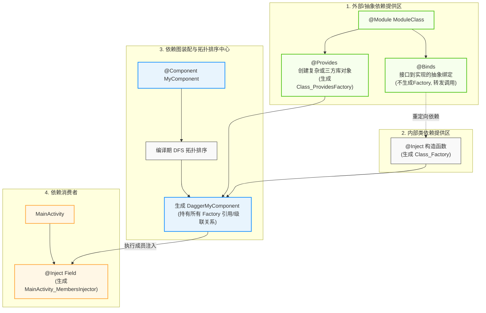
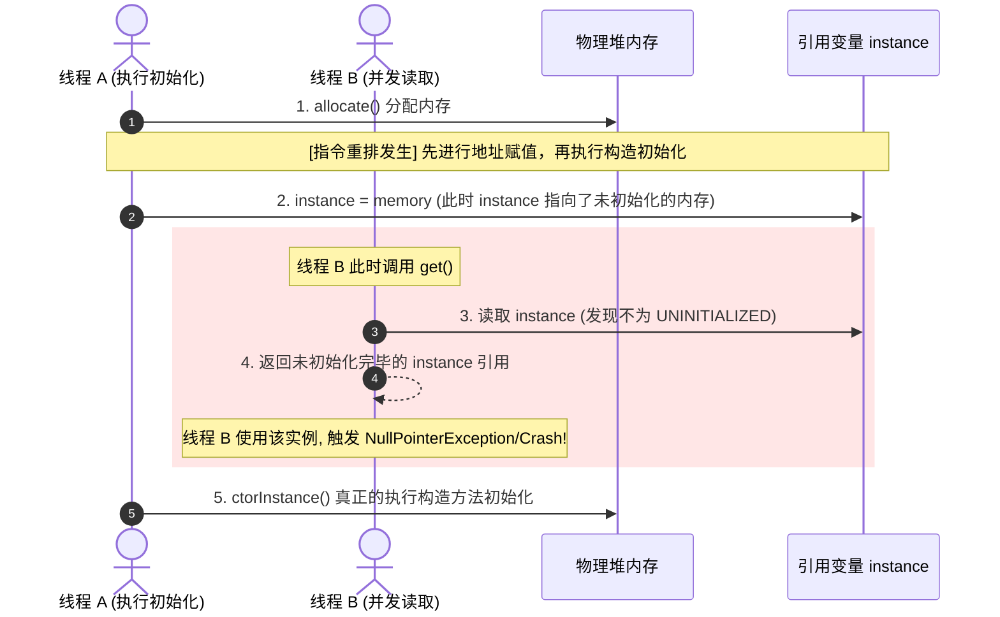
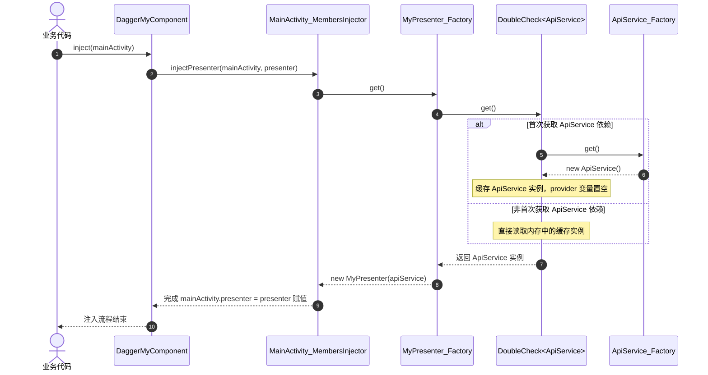
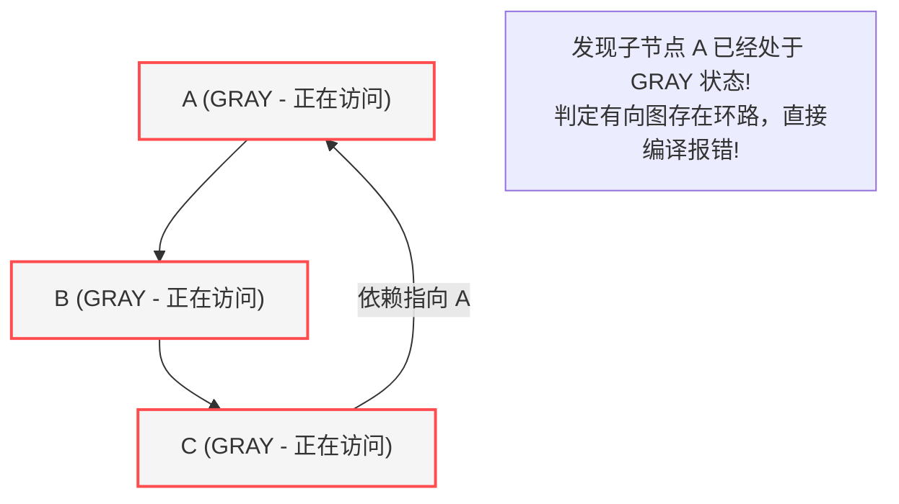

# 5.3.4.1 Dagger2 底层原理与编译期静态装配机制

在 Android 复杂的应用架构与日趋严格的性能要求下，依赖注入（Dependency Injection，简称 DI）已成为现代移动端软件架构的基石。相比于传统的运行时依赖注入框架，Dagger2 以其独树一帜的**编译期静态依赖图装配**与**零反射**设计，代表了依赖注入技术的演进终点。

本文将从依赖注入与控制反转的架构哲学出发，深度剖析 Dagger2 在编译期（APT / KSP）如何通过有向无环图（DAG）进行依赖装配，详尽揭秘四大核心元器件的物理生成代码，并对 `DoubleCheck` 源码进行逐行深度剖析以还原 `@Scope` 作用域的物理缓存本质，最后给出编译生成的物理 Component 级联调用图景、循环依赖检测算法以及架构选型的深度权衡。

---

## 1. 依赖注入（DI）与控制反转（IoC）的架构哲学

### 1.1 手动创建依赖的架构债：为什么说手动 new 是代码严重耦合的根源？

在传统的面向对象开发中，当类 $A$ 需要协作类 $B$ 共同完成功能时，通常会在 $A$ 的内部通过 `new B()` 显式地实例化一个依赖对象。这种写法虽然符合直觉，但随着系统规模的扩大，它会迅速蜕变为难以承受的“架构债务”。

#### 1. 丧失了对依赖的控制权（Active Creation）
当类 $A$ 负责创建类 $B$ 时，它就必须深刻了解类 $B$ 的一切构建细节。如果类 $B$ 的构造方法增加了参数，或者它的实例化逻辑需要依赖其他对象 $C$，那么类 $A$ 的内部代码也不得不做出改动。这严重违反了**单一职责原则**（Single Responsibility Principle）与**迪米特法则**（Law of Demeter，即最少知道原则）。一个类本应只关注自身的业务逻辑，却被迫承担了其他类的生命周期管理与装配职责。

#### 2. 多米诺骨牌式的“传染性”修改
在大型项目里，依赖关系往往呈现深度的树状或网状结构。例如，`MainActivity` 依赖 `MainPresenter`，后者依赖 `UserRepository`，再往后依赖 `UserLocalSource` 与 `ApiService`。
在这种级联依赖结构下，如果我们在依赖链路底端的 `UserLocalSource` 构造方法中增加一个缓存路径参数，其上层的所有调用链（包括 `UserRepository`、`MainPresenter`、`MainActivity`）全部都要被迫修改实例化代码。这种修改的“传染性”呈多米诺骨牌式蔓延，使得局部底层的微调演变成全局上层代码的重构灾难。

#### 3. 测试隔离的噩梦（Unit Testing Barrier）
单元测试的核心要义是将被测类与其他外部环境完全隔离，以便对被测类进行纯粹的功能验证。如果类 $A$ 内部硬编码了 `new B()`，我们便无法在不侵入 $A$ 源码的前提下，将 $B$ 替换成一个 Mock（模拟）对象。这直接导致单元测试无法运行，或者必须写出极度臃肿、脆弱且依赖特定虚拟机实现的反射 hack 代码。

---

### 1.2 服务定位器模式（Service Locator）的妥协与缺陷

在依赖注入普及之前，软件工程中常使用**服务定位器模式（Service Locator Pattern）**来解决组件间的耦合：
```java
public class MyPresenter {
    private final ApiService apiService;
    
    public MyPresenter() {
        // 主动向定位器索要依赖
        this.apiService = ServiceLocator.getInstance().getApiService();
    }
}
```
尽管服务定位器模式摆脱了硬编码 `new` 的局限，将对象的实例化控制权转移到了 `ServiceLocator` 内部，但它引入了新的架构缺陷：
* **依赖隐藏（Hidden Dependencies）**：类 `MyPresenter` 的构造函数变成了无参构造，从公共接口上完全看不出它需要 `ApiService` 才能正常工作。只有在运行时，如果 `ServiceLocator` 中没有提前注册对应的服务，程序就会报出空指针异常。这破坏了类的自解释性。
* **强耦合于容器**：所有的组件都必须引入并依赖 `ServiceLocator` 这一全局单例。这意味着组件无法在脱离此容器的环境下被独立复用或测试。

---

### 1.3 控制反转（IoC）与依赖注入（DI）的解耦本质

为了彻底打破上述耦合，面向对象设计提出了**控制反转**（Inversion of Control，IoC）思想。
* **控制反转（IoC）**：将传统上由对象主动创建、装配依赖的控制权收回，反转给外部的某个“第三方容器”或“架构框架”。对象不再是主动的“捕食者”，而是被动的“接受者”。
* **依赖注入（DI）**：是控制反转最典型、最直接的实现手段。类 $A$ 只需要声明“我需要 $B$”（通过构造方法参数或成员变量），而 $B$ 实例的创建、配置、生命周期管理以及具体的拼装工作，全部由外部的注入框架（DI Container）来承担。

通过依赖注入，依赖关系的管理被提升到了应用级别的统一声明，而具体的业务类则退化为高度纯粹的逻辑单元，极大地增强了代码的灵活性与可测试性。

---

### 1.4 运行时反射注入 vs 编译期静态注入：Dagger2 的终极优化

在 Dagger2 诞生之前，以 Spring 的 IoC 容器、Android 早期的 RoboGuice 或基于 Google Guice 的反射注入方案为代表的框架，大多依赖于**运行时反射**。

#### 1. 运行时反射注入（如 Guice）的物理局限
框架在运行时启动时，通过对类进行反射扫描（如频繁调用 `Class.getDeclaredFields()`、`Field.setAccessible()`、`Constructor.newInstance()`），动态解析出所有类的依赖树，并在内存中进行装配与实例化。

对于服务器端，这种反射开销可以被忽略（因为服务只启动一次，且硬件资源充足）。但在**Android 移动端系统**中，反射是一场灾难。
* **CPU 瓶颈**：Dalvik 与早期 ART 虚拟机的反射执行效率极低。大量的反射调用会消耗宝贵的 CPU 时间片，导致 App 的冷启动时间（Cold Start Time）剧增，引发严重的视觉卡顿。
* **内存与 GC 压力**：反射解析会产生大量的临时 `Method`、`Field` 对象以及依赖描述元数据，这会迅速占满年轻代内存空间，引发频繁的垃圾回收（GC）抖动，导致界面掉帧。
* **类型安全滞后**：反射注入最大的安全隐患在于其**类型检查是滞后的**。若开发者漏配了某个依赖，或者拼写了错误的限定符，编译器无法给出任何提示，这种配置错误只能在运行到具体代码时以 `NullPointerException` 或 `InjectionException` 的形式崩溃暴露。

#### 2. Dagger2 的终极设计：零反射与强类型安全
Google 在总结了 Guice 与 RoboGuice 的痛点后，接管并重构了 Square 的 Dagger1，推出了 Dagger2。Dagger2 将所有的依赖解析和装配工作推迟到了**编译期**，从而实现了：
* **零反射（Zero Reflection）**：在编译期间，Dagger2 利用 Java 的注解处理器（Annotation Processing Tool，APT）或最新的 Kotlin 符号处理器（KSP），扫描项目中的依赖注解，并在编译期直接生成负责创建和注入对象的普通 Java 代码。在运行时，所有的注入动作本质上只是普通的对象创建和直接的属性赋值方法调用，执行效率与手写完全一致。
* **强类型安全（Compile-time Verification）**：Dagger2 在编译期间会根据所有的 `@Inject`、`@Module`、`@Component` 关系在内存中构建出一条依赖的有向无环图（Directed Acyclic Graph，DAG）。它会对图中的每个节点进行类型一致性校验、作用域匹配校验以及循环依赖检测。如果依赖图不完整或存在逻辑矛盾（例如声明了需要 $A$，但没有任何地方能提供 $A$），Dagger2 会直接让**编译报错中止**。这实现了“将错误消灭在编译期”的极致安全。

---

## 2. 依赖注入有向无环图（DAG）的物理装配与四大核心元器件

Dagger2 的整个静态装配体系构建在四大核心注解之上。它们各司其职，在编译期生成对应的物理类，共同协作完成了依赖的提供、加工、聚合与消费。



---

### 2.1 @Inject：构造注入与成员变量注入的实现机制

`@Inject` 具有“双重身份”：它既可以标记在构造函数上，作为**依赖的提供者**；也可以标记在成员属性上，作为**依赖的消费者**。

#### 1. 构造函数注入与 `*_Factory` 的生成
当我们在一个类的构造函数上添加 `@Inject` 时，Dagger2 会为该类生成一个实现了 `dagger.internal.Factory<T>` 接口的工厂类，命名规则为 `[ClassName]_Factory`。

* **生成的 Factory 物理构造**：
  如果有一个 `MyPresenter` 依赖 `ApiService`：
  ```java
  public class MyPresenter {
      private final ApiService apiService;
      @Inject
      public MyPresenter(ApiService apiService) {
          this.apiService = apiService;
      }
  }
  ```
  Dagger2 会在编译期生成 `MyPresenter_Factory.java`，其核心结构如下：
  ```java
  package com.example;

  import dagger.internal.Factory;
  import javax.inject.Provider;

  public final class MyPresenter_Factory implements Factory<MyPresenter> {
      private final Provider<ApiService> apiServiceProvider;

      public MyPresenter_Factory(Provider<ApiService> apiServiceProvider) {
          this.apiServiceProvider = apiServiceProvider;
      }

      @Override
      public MyPresenter get() {
          // 级联调用底层依赖的 Provider.get() 来获取实例，然后通过 new 关键字实例化对象
          return newInstance(apiServiceProvider.get());
      }

      public static MyPresenter_Factory create(Provider<ApiService> apiServiceProvider) {
          return new MyPresenter_Factory(apiServiceProvider);
      }

      public static MyPresenter newInstance(ApiService apiService) {
          return new MyPresenter(apiService);
      }
  }
  ```
  **机制解析**：
  `MyPresenter_Factory` 内部保存了构造参数 `ApiService` 的 `Provider`（也就是 `ApiService` 的工厂包装）。当外界需要一个 `MyPresenter` 实例时，调用 `get()` 方法，它会先通过 `apiServiceProvider.get()` 拿到 `ApiService` 实例，然后再调用 `new MyPresenter(apiService)`。这就实现了**构造注入的依赖级联创建**。

#### 2. 成员变量注入与 `*_MembersInjector` 的生成
对于 Android 中的 `Activity`、`Fragment` 等类，由于它们的实例是由系统框架实例化出来的，我们无法通过构造函数注入。此时需要使用成员变量注入（Field Injection）：
```java
public class MainActivity extends Activity {
    @Inject MyPresenter presenter;
}
```
Dagger2 会为 `MainActivity` 生成一个成员变量注入器 `MainActivity_MembersInjector.java`，其实现了 `dagger.MembersInjector<MainActivity>` 接口：
```java
package com.example;

import dagger.MembersInjector;
import javax.inject.Provider;

public final class MainActivity_MembersInjector implements MembersInjector<MainActivity> {
    private final Provider<MyPresenter> presenterProvider;

    public MainActivity_MembersInjector(Provider<MyPresenter> presenterProvider) {
        this.presenterProvider = presenterProvider;
    }

    public static MembersInjector<MainActivity> create(Provider<MyPresenter> presenterProvider) {
        return new MainActivity_MembersInjector(presenterProvider);
    }

    @Override
    public void injectMembers(MainActivity instance) {
        // 直接将 presenterProvider 获取到的实例，赋值给目标 MainActivity 的属性上
        injectPresenter(instance, presenterProvider.get());
    }

    public static void injectPresenter(MainActivity instance, MyPresenter presenter) {
        // 由于成员变量是非 private 的，可以直接通过字段引用的方式赋值
        instance.presenter = presenter;
    }
}
```
**机制解析**：
当我们在 `MainActivity` 中执行 `DaggerMyComponent.create().inject(this)` 时，底层的 Component 最终就是调用 `MainActivity_MembersInjector` 的 `injectMembers(this)` 方法。在这个方法内部，完成了将 Component 容器内部装配好的 `MyPresenter` 对象直接赋值给 `MainActivity.presenter` 字段的动作。整个过程完全免去了反射。

---

### 2.2 @Module 与 @Provides / @Binds：三方闭源与抽象映射的桥梁

虽然 `@Inject` 构造函数注入非常简单，但在很多工程场景中，我们无法直接修改类的源码，例如：
1. 我们需要注入 `OkHttpClient`、`Retrofit`、`Glide` 等第三方开源库中的类；
2. 我们需要注入一个接口（Interface），而接口本身是无法被初始化的。

为了解决这些“无法直接加 @Inject”的场景，Dagger2 引入了 `@Module`，将其作为一个集中声明依赖规则的“箱子”，并在其中搭配 `@Provides` 或 `@Binds` 来定制注入规则。

#### 1. @Provides：显式实例化提供者
`@Provides` 标记在 Module 内部的方法上。每个方法代表一条具体的实例化规则，方法体中通常包含了我们手写的实例化逻辑。
```java
@Module
public class NetworkModule {
    @Provides
    public OkHttpClient provideOkHttpClient() {
        return new OkHttpClient.Builder().build();
    }
}
```
编译期间，对于每一个 `@Provides` 方法，Dagger2 都会生成一个对应的 Factory 类（例如 `NetworkModule_ProvideOkHttpClientFactory.java`）。这个类的内部结构与上文的 `@Inject` Factory 类似，其 `get()` 方法内部会持有 `NetworkModule` 实例，并直接调用 `networkModule.provideOkHttpClient()`。

#### 2. @Binds：无物理类开销的接口绑定优化
当我们需要将一个具体实现类绑定到一个接口上时，如果使用 `@Provides` 会写成这样：
```java
@Module
public class AccountModule {
    @Provides
    public AccountService provideAccountService(AccountServiceImpl impl) {
        return impl;
    }
}
```
虽然这符合逻辑，但这种写法在编译期会产生副作用：Dagger2 必须生成一个对应的物理类 `AccountModule_ProvideAccountServiceFactory.java`，并且在运行时，Component 必须实例化这个 Factory，再通过其 `get()` 方法返回具体实例。这对于方法数敏感的 Android 应用（受限于 65536 方法限制）和运行内存是多余的负担。

为了解决这个问题，Dagger2 提供了 `@Binds` 优化注解。它是一个**抽象方法**，且方法必须声明在抽象类或接口 Module 中：
```java
@Module
public abstract class AccountModule {
    @Binds
    public abstract AccountService bindAccountService(AccountServiceImpl impl);
}
```
**@Binds 的底层物理优化本质**：
1. **零类生成**：Dagger2 编译期**不会**为被 `@Binds` 标记的方法生成对应的 `*_Factory` 物理类。
2. **依赖重定向（Forwarding Provider）**：在生成 Component 时，一旦发现有类依赖 `AccountService`，Dagger2 会在生成的 Component 中直接把对 `AccountService` 的请求**重定向**到 `AccountServiceImpl` 对应的 `AccountServiceImpl_Factory` 上。

这种优化机制将接口与实现之间的映射关系在编译期的有向无环图分析中直接“烫平”了，在最终生成的 `Dagger*Component` 中，没有产生任何中间桥接方法或额外的类，完美缩减了 APK 的方法数和安装体积。

---

### 2.3 @Component：依赖图的拓扑排序与物理容器生成

`@Component` 是 Dagger2 装配图中的“立交桥”，它是定义依赖注入边界的声明式接口。

#### APT/KSP 编译期的深度优先遍历与拓扑排序（DFS & Topological Sort）
当 Dagger2 编译器扫描到被 `@Component` 标记的接口时，它会执行以下编译期算法：
1. **收集入口节点**：从 Component 中定义的 `inject(Activity)` 入口方法以及所有无参暴露的 `getXXX()` 方法出发，开始向下摸排。
2. **有向图构建**：顺着这些消费端去寻找其标注了 `@Inject` 属性的成员，接着寻找这些成员的 `@Inject` 构造方法或其在 Module 中的 `@Provides` / `@Binds` 提供者，一步步建立起一个有向图的邻接表结构。
3. **拓扑排序（Topological Sort）**：
   在代码生成前，Dagger2 会利用**深度优先搜索（DFS）**对这个有向图进行拓扑排序。
   拓扑排序的目的在于：**确定依赖的生成顺序**。例如，如果 $A$ 依赖 $B$，$B$ 依赖 $C$，那么拓扑排序会强制保证 $C$ 的 Factory 最先被初始化，其次是 $B$ 的 Factory，最后是 $A$。
4. **环路校验**：如果在 DFS 拓扑排序过程中，检测到某个节点被重复标记在“正在访问”的调用栈上，即证明图中存在环（如 $A \to B \to C \to A$），编译器将立即抛出 `DependencyCycleException` 并中断编译。

编译通过后，Dagger2 会生成以 `Dagger` 为前缀的 Component 物理实现类（如 `DaggerMyComponent.java`），该类内部封装了所有拓扑排序后按序初始化的 Factory 实例，成为了一个闭环的依赖集装箱。

---

### 2.4 @Scope 作用域物理本质：从编译期生成揭秘

在 Dagger2 的学习中，很多人容易把 `@Scope`（作用域，如 `@Singleton`、`@ActivityScope`）当成某种“自带魔法的线程隔离机制”。事实上，**`@Scope` 的物理本质极其朴素：它是 Component 实例内部的缓存机制**。

#### 1. Scope 的决定性前提：Component 实例的生命周期
无论你用什么 Scope 注解，它所能维持的“唯一性”，都**完全绑定在包含它的 Component 实例生命周期内**。
* 如果你在 `Application` 中初始化并持有了 `MyComponent` 的单例，那么该 Component 内部被 `@Scope` 标记的依赖在整个 App 运行期间就是单例唯一的。
* 如果你每次在 `Activity.onCreate()` 中都通过 `DaggerMyComponent.builder().build()` 去创建一个全新的 Component 实例，那么即便你的依赖类加了 `@Singleton`，在不同的 Activity 实例中拿到的依然是不同的对象。

#### 2. 编译期的物理降维：被 DoubleCheck 包装的 Provider
在编译期生成的 `DaggerMyComponent` 内部，所有被 `@Scope` 标记的对象，其对应的 Factory 都不会被直接调用，而是会被套上一个名为 **`DoubleCheck`** 的装饰器类。

* **没有 Scope 的依赖物理实现**：
  ```java
  // 每次调用 get() 时，都会重新 newInstance()，无法实现复用
  this.apiServiceProvider = ApiService_Factory.create();
  ```
* **加了 Scope 的依赖物理实现**：
  ```java
  // 编译器通过 DoubleCheck.provider 将原本的 Factory 进行包裹
  this.apiServiceProvider = DoubleCheck.provider(ApiService_Factory.create());
  ```
  在运行期间，当 Component 需要获取 `ApiService` 时，它会去调用 `DoubleCheck.get()`，而不是底层的 `ApiService_Factory.get()`。这个 `DoubleCheck` 类就是 Dagger2 作用域实现的全部底层真相。

---

## 3. 核心源码剖析：DoubleCheck 的极致单例保障

作为整个 Dagger2 框架中负责缓存与多线程单例控制的最核心组件，`dagger.internal.DoubleCheck` 的源码设计堪称 Java 并发编程的教科书。下面我们将对其官方核心源码进行逐行深入剖析。

### 3.1 DoubleCheck 核心源码实现

以下是 `DoubleCheck` 的 Java 核心源码：

```java
package dagger.internal;

import dagger.Lazy;
import javax.inject.Provider;

public final class DoubleCheck<T> implements Provider<T>, Lazy<T> {
  // 1. 物理占位对象：用来唯一标识“未初始化”状态，防止 null 被错误识别
  private static final Object UNINITIALIZED = new Object();

  // volatile 保证多线程可见性并防止指令重排
  private volatile Provider<T> provider;
  private volatile Object instance = UNINITIALIZED;

  private DoubleCheck(Provider<T> provider) {
    assert provider != null;
    this.provider = provider;
  }

  @SuppressWarnings("unchecked")
  @Override
  public T get() {
    Object result = instance;
    // 第一重校验（无锁）：如果 instance 已经初始化完毕，直接返回，避免 synchronized 的性能开销
    if (result == UNINITIALIZED) {
      synchronized (this) {
        result = instance;
        // 第二重校验（有锁）：在抢占到锁后再次确认，防止在当前线程等待锁的过程中其他线程已经完成了初始化
        if (result == UNINITIALIZED) {
          result = provider.get();
          // 执行重入性校验并赋值给 instance
          instance = reentrantCheck(instance, result);
          // 内存优化：一旦实例化完成，立即清空 provider 强引用，以便 GC 回收依赖树
          provider = null;
        }
      }
    }
    return (T) result;
  }

  /**
   * 重入校验逻辑：防止并发环境下两个线程由于异常设计或依赖回环，产生了不同的实例副本
   */
  public static Object reentrantCheck(Object currentInstance, Object newInstance) {
    boolean isReinitialized = currentInstance != UNINITIALIZED;
    if (isReinitialized && currentInstance != newInstance) {
      throw new IllegalStateException("Scoped provider was invoked recursively returning "
          + "different results: " + currentInstance + " & " + newInstance + ". This is likely "
          + "due to a circular dependency.");
    }
    return newInstance;
  }

  /**
   * 静态工厂方法，用于包装普通的 Provider / Factory
   */
  public static <P extends Provider<T>, T> Provider<T> provider(P delegate) {
    checkNotNull(delegate);
    if (delegate instanceof DoubleCheck) {
      return delegate;
    }
    return new DoubleCheck<T>(delegate);
  }

  /**
   * 将 Provider 转换为 Lazy 实例的底层桥梁
   */
  public static <P extends Provider<T>, T> Lazy<T> lazy(P delegate) {
    if (delegate instanceof Lazy) {
      @SuppressWarnings("unchecked")
      Lazy<T> lazy = (Lazy<T>) delegate;
      return lazy;
    }
    return new DoubleCheck<T>(checkNotNull(delegate));
  }

  private static Object checkNotNull(Object reference) {
    if (reference == null) {
      throw new NullPointerException();
    }
    return reference;
  }
}
```

---

### 3.2 DoubleCheck 关键机制与并发设计深度推导

#### 1. 双重检查锁（Double-Checked Locking，DCL）的底层必要性
`DoubleCheck` 采用经典的 DCL 来控制单例的构建。
* **第一重校验（无锁外层判断）**：它的作用是**性能优化**。在单例初始化成功后，因并发读取极其频繁，绝大多数的 `get()` 调用都是读操作。如果不加第一重校验，每次访问都会触发 `synchronized` 锁竞争，在多线程高并发下，这会导致严重的线程阻塞和上下文切换，拖垮系统吞吐量。
* **第二重校验（有锁内层判断）**：它的作用是**保证并发正确性**。假设线程 $A$ 和线程 $B$ 同时到达 `synchronized(this)` 前，此时 `instance` 静态域尚未被构建。线程 $A$ 抢占到锁并进入同步块，开始调用 `provider.get()` 创建对象。当线程 $A$ 完成初始化释放锁后，线程 $B$ 获得锁并进入同步块。如果没有第二重校验，线程 $B$ 无法感知到该对象已经被线程 $A$ 实例化了，会再次调用 `provider.get()`，从而打破了 Scope 的单例唯一性约束，甚至会导致内存泄露和状态错乱。

#### 2. `volatile` 关键字的决定性作用：指令重排与 JMM 内存屏障
在 `DoubleCheck` 中，成员变量 `instance` 必须被声明为 `volatile`，这牵涉到了 JVM 的**指令重排（Instruction Reordering）**。
在 Java 中，执行 `instance = new TargetObject()` 这一行代码，在字节码层面实际上会被分解为 3 步：
1. **`memory = allocate()`**：在堆内存中分配对象的内存空间；
2. **`ctorInstance(memory)`**：执行构造方法，对分配的内存进行初始化；
3. **`instance = memory`**：将 `instance` 指针指向分配的内存地址（此时 `instance` 变为非 null）。

由于 JVM 和 CPU 为了优化执行效率，允许在不改变单线程执行语义的前提下进行指令重排。这可能会导致上面的步骤 2 和步骤 3 的顺序被颠倒，变成：
1. **`memory = allocate()`**；
2. **`instance = memory`**（此时对象尚未完成初始化，但 `instance` 已经不等于 `UNINITIALIZED` 了）；
3. **`ctorInstance(memory)`**（真正的初始化）。



在没有 `volatile` 保证的情况下，当线程 $A$ 刚执行完步骤 3、尚未执行步骤 2 时，线程 $B$ 并发调用了 `get()` 方法。此时，线程 $B$ 在外层第一重校验中发现 `result != UNINITIALIZED`，便会直接将这个**尚未初始化完成的、残缺的** `instance` 引用返回并拿去使用。这必然会导致难以预测的崩溃（通常是 `NullPointerException`）。

通过将 `instance` 声明为 `volatile`，JVM 会在生成的机器码中插入**内存屏障（Memory Barrier）**，强行禁止第 2 步与第 3 步的重排，确保对象被百分之百初始化完毕后，才将引用赋值给 `instance`。同时，根据 Java 内存模型（JMM）的 Happens-Before 规则，对 `volatile` 变量的写入操作一定 Happens-Before 后续对该变量的读取操作，这确保了写操作的全局多线程可见性。

#### 3. 为什么使用 `UNINITIALIZED` 占位对象，而不是直接比对 `null`？
这是一个非常经典的 API 设计考量。
在很多业务场景中，开发者在 Module 中定义的 `@Provides` 方法本身就可能由于某些业务边界条件，合法地返回了一个 `null` 实例。
如果 `DoubleCheck` 采用 `null` 作为未初始化的判断标志：
```java
// 假设的代码：如果用 null 判断
if (instance == null) { 
    synchronized(this) {
        if (instance == null) {
            instance = provider.get(); // 如果 provider 恰好返回了 null
        }
    }
}
```
当 `provider.get()` 返回的真实对象就是 `null` 时，`instance` 就会被赋值为 `null`。
下一次任何线程再次调用 `get()` 方法时，由于 `instance` 依然是 `null`，程序又会重新判定其为“未初始化”状态，从而再次被迫进入 `synchronized` 锁同步块，并重新调用 `provider.get()`。这导致**单例缓存机制彻底失效**，退化为了低效的无缓存同步链路。

为了解决这个问题，Dagger2 引入了专属的物理占位对象：
```java
private static final Object UNINITIALIZED = new Object();
```
无论 `provider.get()` 返回什么（即使返回 `null`），`instance` 都会被更新为一个非 `UNINITIALIZED` 的引用（即真实值或 `null`）。由于 `UNINITIALIZED` 拥有全局唯一的内存地址，我们通过 `result == UNINITIALIZED` 进行引用地址比对，能够百分之百准确地区分出“从未进行过初始化”与“初始化结果就是 null”这两种截然不同的物理状态，从而保障了缓存的严密性。

#### 4. 内存优化：置空 `provider = null`
在 `instance = reentrantCheck(instance, result)` 执行完毕后，`DoubleCheck` 内部做了一个精细的内存优化操作：
```java
this.provider = null;
```
由于 Dagger2 中底层的 `Provider` 或是 `Factory` 往往持有着整个庞大依赖链路的引用关系，如果在对象构建完成后继续持有 `provider` 强引用，会导致那些只有在构建期才需要临时使用的前置依赖对象无法被垃圾回收。
在这里将 `provider` 置为 `null`，使得构建链路中的 Factory 实例链能够被及时地进行垃圾回收，防止了不必要的常驻内存占用。

#### 5. `reentrantCheck` 重入校验的底层考量
```java
  public static Object reentrantCheck(Object currentInstance, Object newInstance) {
    boolean isReinitialized = currentInstance != UNINITIALIZED;
    if (isReinitialized && currentInstance != newInstance) {
      throw new IllegalStateException("...");
    }
    return newInstance;
  }
```
重入校验用于拦截在单例实例化过程中发生的非法递归重入。
在复杂的业务场景下，如果在 `provider.get()` 构建对象的构造函数中，又间接地调用了当前 Component 去获取该单例，便会产生递归重入。重入会导致 `reentrantCheck` 检测到 `currentInstance` 已经不是 `UNINITIALIZED`，但它与本次新创建出来的 `newInstance` 内存地址不同。此时抛出异常，可以有效保护单例状态的一致性，防止由于隐蔽的代码设计缺陷产生多个实例副本。

---

## 4. Dagger2 编译生成源码微观剖析

### 4.1 Component 生成类伪代码与级联初始化流程

为了清晰地展示依赖图如何在 Component 内部通过 Provider 链级联初始化，我们以一个简化且具有代表性的 Dagger2 编译生成类为例。

假设我们有如下关系：
- `MainActivity` 依赖 `MainPresenter`；
- `MainPresenter` 依赖 `ApiService`（加了 `@Singleton` 作用域）；
- `ApiService` 依赖 `OkHttpClient`（由 `NetworkModule` 的 `@Provides` 提供）。

下面是 Dagger2 根据此关系生成的 `DaggerMyComponent` 的核心伪代码结构与详细注释：

```java
package com.example;

import dagger.internal.DoubleCheck;
import dagger.internal.Preconditions;
import javax.inject.Provider;

// 编译生成的 Component 物理容器，实现了用户定义的 Component 接口
public final class DaggerMyComponent implements MyComponent {
  
  // 1. Module 实例的物理持有（如果 Module 中的 Provides 方法不是静态的）
  private final NetworkModule networkModule;

  // 2. 依赖图中的各种 Provider/Factory 节点声明
  // 对应 OkHttpClient 的 Provides 方法工厂包装
  private Provider<OkHttpClient> provideOkHttpClientProvider;
  
  // 对应 ApiService 的工厂包装（由于 ApiService 加了 @Singleton，最终需包装为 DoubleCheck）
  private Provider<ApiService> apiServiceProvider;
  
  // 对应 MainPresenter 的 Factory 包装
  private Provider<MainPresenter> myPresenterProvider;
  
  // 对应 MainActivity 的成员变量注入器
  private Provider<MainActivity_MembersInjector> mainActivityMembersInjectorProvider;

  private DaggerMyComponent(NetworkModule networkModuleParam) {
    this.networkModule = networkModuleParam;
    // 调用初始化方法，按照拓扑排序的顺序依次建立 Factory 链路
    initialize(networkModuleParam);
  }

  public static Builder builder() {
    return new Builder();
  }

  public static MyComponent create() {
    return new Builder().build();
  }

  @SuppressWarnings("unchecked")
  private void initialize(final NetworkModule networkModuleParam) {
    // 步骤一：创建基础依赖（OkHttpClient）的工厂。这里传入 Module 引用
    this.provideOkHttpClientProvider = NetworkModule_ProvideOkHttpClientFactory.create(networkModuleParam);

    // 步骤二：创建被依赖项（ApiService）的工厂。它依赖步骤一中的 OkHttpClient 物理工厂
    Provider<ApiService> apiServiceFactory = ApiService_Factory.create(provideOkHttpClientProvider);
    
    // 重点：由于 ApiService 在 Java 层面声明了 @Singleton，因此必须使用 DoubleCheck 包装器对其进行静态物理缓存
    this.apiServiceProvider = DoubleCheck.provider(apiServiceFactory);

    // 步骤三：创建消费端直接依赖（MainPresenter）的工厂。它依赖步骤二中被 DoubleCheck 缓存的 ApiService
    this.myPresenterProvider = MyPresenter_Factory.create(apiServiceProvider);
  }

  // 实现 Component 接口定义的注入消费端方法
  @Override
  public void inject(MainActivity mainActivity) {
    // 级联调用生成的 MembersInjector 执行属性直接赋值，彻底免去反射
    MainActivity_MembersInjector.injectPresenter(mainActivity, myPresenterProvider.get());
  }

  // Builder 静态内部类实现
  public static final class Builder {
    private NetworkModule networkModule;

    private Builder() {}

    public Builder networkModule(NetworkModule networkModule) {
      this.networkModule = Preconditions.checkNotNull(networkModule);
      return this;
    }

    public MyComponent build() {
      // 容错处理：若外部未传入 Module 实例，则自动 new 一个默认的 Module
      if (networkModule == null) {
        this.networkModule = new NetworkModule();
      }
      return new DaggerMyComponent(networkModule);
    }
  }
}
```

#### 级联装配流程物理时序走读
从上述生成的代码中可以清晰看到，当 `inject(MainActivity)` 被触发时，其物理执行流如下：



1. 业务端调用 `myComponent.inject(mainActivity)`。
2. Component 将调用分发给 `MainActivity_MembersInjector.injectPresenter(...)`，这需要传入 `myPresenterProvider.get()`。
3. `MyPresenter_Factory` 响应 `get()` 请求，内部级联索要 `apiServiceProvider.get()`。
4. 由于 `apiServiceProvider` 被 `DoubleCheck` 包裹，它会检查其 `instance` 是否已被构建：
   - **若是首次**：穿透到 `ApiService_Factory.get()` 触发真正的构建。`ApiService_Factory` 会获取 `provideOkHttpClientProvider.get()`（即调用 `networkModule.provideOkHttpClient()`），以此逐层构建出一整条依赖树。
   - **若非首次**：直接在 `DoubleCheck` 中返回之前缓存好的 `instance`，阻断下游的重新构建逻辑。
5. 依赖链组装完毕，`new MyPresenter(...)` 实例被成功投递，并直接通过 `instance.presenter = presenter` 完成属性赋值。

---

### 4.2 编译期循环依赖检测（Circular Dependency Detection）机制

#### 1. 为什么必须在编译期拦截环路？
在依赖注入中，循环依赖（如类 $A$ 的构造需要类 $B$，而类 $B$ 的构造又需要类 $A$）在物理上是一个“鸡生蛋，蛋生鸡”的悖论。如果不在编译期拦截，运行时级联初始化就会直接陷入死循环（Infinite Loop），直至爆出 `StackOverflowError`。

#### 2. Dagger2 编译期的环路检测算法实现原理
Dagger2 的编译期核心逻辑中，所有的依赖关系都以有向图节点的形式存储。检测算法通常基于**深度优先搜索（DFS）的三色染色标记算法（Three-color Marking Algorithm）**。

算法物理步骤如下：
1. **染色状态初始化**：图中所有的依赖节点初始标记为 **白色**（WHITE，代表未访问）。
2. **深度优先遍历**：从 Component 入口节点开始，依次遍历其相邻的依赖节点。
3. **状态转换**：
   - 当开始访问一个节点时，将它的标记修改为 **灰色**（GRAY，代表正在访问该节点及其依赖链，但尚未完全结束归纳）。
   - 顺着该节点的依赖边，递归访问其所有的子依赖节点。
   - 如果在遍历子依赖节点时，发现某个子节点的颜色已经是 **灰色**，即判定：**图结构中存在环路（Cycle）**！
   - 如果所有的子依赖节点都顺利访问完毕，没有遇到灰色节点，则将当前节点标记为 **黑色**（BLACK，代表已安全访问结束）。



一旦判定存在环路，Dagger2 会在控制台上打印出一份高度可视化的依赖路径环路日志，指出是由于哪几步的 `@Inject` 或 `@Provides` 构成了依赖闭环，强行中断编译。

---

### 4.3 懒加载 `Lazy<T>` 与 延迟提供者 `Provider<T>` 的物理机制差异

在实际开发中，如果消费端不希望在注入时就立即将依赖对象实例化，或者需要动态控制对象生成的时机与次数，就可以使用 `Lazy<T>` 或 `Provider<T>`。

#### 1. 物理结构对比与 get() 行为差异

| 维度 | 延迟提供者 `Provider<T>` | 懒加载包装 `Lazy<T>` |
| :--- | :--- | :--- |
| **装配注入形式** | 直接注入生成的工厂或 `DoubleCheck` | 注入由 `DoubleCheck.lazy(...)` 包裹的代理对象 |
| **get() 触发行为** | 每次调用 `provider.get()` 时，都执行依赖树的重新创建逻辑（如果无 Scope） | 只有在第一次调用 `lazy.get()` 时会执行创建，后续 get() 直接复用首次创建的缓存实例 |
| **Scope 关联度** | 若没有加 Scope，每次 get() 都会 new 实例；若加了 Scope，每次 get() 都返回 Component 内的单例缓存 | 无论底层的类是否加了 Scope，`Lazy<T>` 实例内部自带局部的 `DoubleCheck` 缓存。在当前消费类内部，`lazy.get()` 拿到的永远是同一个实例。 |

#### 2. 源码级差异对比说明
假设我们在 `MainActivity` 中分别注入了 `Provider<User>` 和 `Lazy<User>`：

```java
// MainActivity 编译生成的属性注入伪代码
public final class MainActivity_MembersInjector implements MembersInjector<MainActivity> {
  private final Provider<User> userProvider;

  @Override
  public void injectMembers(MainActivity instance) {
    // 注入 Provider<T>：直接将 Component 中的 Provider/Factory 实例赋值给 MainActivity 的对应字段
    instance.userProvider = userProvider;

    // 注入 Lazy<T>：底层物理实现是利用 DoubleCheck.lazy(Provider<T>) 将 Component 的 Provider 包裹后赋值
    instance.userLazy = DoubleCheck.lazy(userProvider);
  }
}
```

从上述物理代码能看出，`Lazy<T>` 的本质其实也是利用 `DoubleCheck` 包装器。这解释了为什么 `Lazy<T>` 能够支持局部单例缓存，它的逻辑与组件 Scope 共享同一套 `DoubleCheck` 逻辑。

---

## 5. 踩坑误区与高级架构方案权衡

在大型 Android 项目（尤其是多组件、组件化架构项目）中，Dagger2 的物理拓扑结构设计对于编译速度和内存安全具有举足轻重的影响。

### 5.1 Component 依赖（Component Dependencies） vs 子组件（Subcomponents）

当我们需要在一个 Component（如 `ActivityComponent`）中复用另一个 Component（如 `AppComponent`）暴露的依赖时，Dagger2 提供了两种完全不同的物理级联方案。

```mermaid
graph TD
    %% Component Dependencies 物理拓扑关系
    subgraph DependenciesStyle [方案 A: Component Dependencies (显式隔离)]
        AppCompA["AppComponent (提供 ApiService)"]
        ActivityCompA["ActivityComponent (依赖 AppComponent)"]
        ActivityCompA -->|显式持有接口引用| AppCompA
        
        AppCompA -.-|必须在 AppComponent 接口显式声明| ApiService["apiService()"]
        ApiService -->|仅暴露该方法声明 of 依赖| ActivityCompA
    end

    %% Subcomponents 物理拓扑关系
    subgraph SubcomponentStyle [方案 B: Subcomponent (完全继承)]
        AppCompB["AppComponent"]
        SubActivityComp["ActivitySubcomponent \n (作为 AppComponent 的内部类)"]
        AppCompB ===>|物理包裹/无限制访问所有属性| SubActivityComp
    end

    classDef dep fill:#fff,stroke:#333,stroke-width:1px;
    classDef sub fill:#f9f0ff,stroke:#722ed1,stroke-width:2px;
    class ActivityCompA,AppCompA,SubActivityComp,AppCompB dep;
    class SubActivityComp sub;
```

#### 方案一：Component 依赖（Component Dependencies）
* **物理本质**：`ActivityComponent` 通过在 `@Component` 注解中声明 `dependencies = {AppComponent.class}`，在底层生成的 `DaggerActivityComponent` 中，会持有一个 `AppComponent` 接口的成员变量引用。
* **隔离策略**：**沙盒隔离**。`ActivityComponent` 只能访问到 `AppComponent` 接口中**显式声明暴露的方法**。如果 `AppComponent` 内部装配了 `OkHttpClient`，但其接口中没有写 `OkHttpClient okHttpClient();`，那么 `ActivityComponent` 将无法获取它。
* **优缺点**：
  - **优点**：边界极其清晰，模块间解耦彻底。由于隔离性好，各个 Component 的依赖图是局部完备的，对局部代码的改动不易导致全局依赖图的大范围重新编译，有利于提升大型项目的增量编译速度。
  - **缺点**：如果依赖关系复杂，需要在父 Component 中手写声明大量的暴露方法，代码显得冗长累赘。

#### 方案二：子组件（Subcomponents）
* **物理本质**：通过 `@Subcomponent` 声明。在编译生成代码时，`ActivitySubcomponent` 对应生成的类是作为 `DaggerAppComponent` 内部的**非静态内部类（Inner Class）**而存在的。
* **隔离策略**：**完全打通**。因为是内部类，子组件可以直接无限制地访问父组件中定义的所有 Factory 和 Module 提供者，无需在父 Component 中手动声明暴露方法。
* **优缺点**：
  - **优点**：使用非常方便，天然继承了父组件的所有依赖，省去了繁杂的接口声明。
  - **缺点**：**严重破坏了模块化隔离**。由于子组件和父组件在物理生成代码上紧密粘合在同一个类文件里（DaggerAppComponent 内部包含各种 SubComponent 内部类），这导致整个依赖图体积庞大。任何一个子组件内部依赖的微小变动，都会导致整个庞大的 `DaggerAppComponent` 类被重新编译。对于多模块组件化架构项目，这会成为编译速度的“隐形杀手”。

> [!IMPORTANT]
> **架构选型建议**：
> 在大型组件化、分层架构的 Android 项目中，**强烈建议采用 Component Dependencies**。将通用基础能力（如网络、存储、用户状态）限制在独立的 `Component` 内部，通过明确的接口暴露出来；避免使用 `Subcomponent`，防止导致整个应用的依赖关系图纠缠在一起，劣化项目的编译效率。

---

### 5.2 Scope 作用域滥用引起的内存泄漏（Memory Leak）

很多开发者认为“给类加上作用域是性能优化的好习惯”，于是盲目地将几乎所有的类都加上了 Scope（甚至是 `@Singleton`）。这会引发严重的**隐式内存泄漏**。

* **内存泄漏机理**：
  由于 Scope 的本质是 Component 内部的 `DoubleCheck` 实例缓存。
  假设我们有一个局部使用的辅助类 `SearchReportHelper`（比如仅在 `SearchActivity` 中搜索时使用一次），如果我们将其 Scope 声明为 `@Singleton`，并且将其装配到了 Application 级别的 `AppComponent` 中。
  当 `SearchActivity` 销毁后，`SearchReportHelper` 本应被 GC 回收。但因为它是 `@Singleton`，`DaggerAppComponent` 内部的 `DoubleCheck` 会永久持有它的引用。
  如果 `SearchReportHelper` 内部配置有回调函数，或者直接持有了 `SearchActivity` 的 `Context`，那么这个 `Context` 所关联的整个 Activity 视图树、图片资源都将无法被释放，直接导致**严重的 Activity 内存泄漏**。

> [!WARNING]
> **避坑准则**：
> 1. 默认情况下，**不要轻易使用 Scope**。如果一个类本身无状态、无重度初始化开销，不加 Scope（即每次使用都重新 new）通常是内存最安全的做法，它会随调用栈结束被自动回收。
> 2. Scope 只适用于管理**全局状态类**（如账户信息管理、全局网络客户端）或**初始化极其昂贵的类**（如数据库实例）。
> 3. 作用域的生命周期必须与依赖消费者的生命周期保持物理对齐。在 Activity 范围使用的类，必须且只能绑定到 `@ActivityScope` Component 上，绝不可越界绑定到 `@Singleton`。

---

### 5.3 提升 Dagger2 编译速度的工业实践

在大型工程中，Dagger2 的编译速度劣化是公认的痛点。以下是几条能够立竿见影提升 Dagger2 编译速度的工业级优化实践：

1. **迁移至 KSP（Kotlin Symbol Processing）**：
   传统的 Kapt 需要生成 Java Stub 才能处理 Kotlin 文件的注解，这需要多次往返的编译开销。而 KSP 可以直接读取 Kotlin 语法树，在 Dagger2 的编译期处理中，使用 KSP 能够带来 **20% 到 30%** 的编译速度提升。
2. **尽量使用 `static` 的 `@Provides` 方法**：
   在 Module 内部定义 `@Provides` 时，如果不依赖 Module 内部的成员变量，建议将方法声明为 `static`：
   ```kotlin
   @Module
   object NetworkModule {
       @Provides
       @JvmStatic
       fun provideOkHttpClient(): OkHttpClient = OkHttpClient.Builder().build()
   }
   ```
   如果方法是静态的，生成的 Component 就不需要持有 `NetworkModule` 的实例，可以直接通过 `NetworkModule.provideOkHttpClient()` 类名调用，减少了 Component 内部的字段数量和初始化步骤。
3. **启用 Dagger Fast Init 模式**：
   通过在编译配置中开启 `fastInit` 标志，Dagger 会优化其代码生成结构。它会使用更紧凑的 Provider 链生成逻辑，减少匿名内部类和冗余包装器的生成，大幅度减少生成的 Dex 方法数，缩短打包耗时。

---

## 6. 总结

Dagger2 的强大并不在于引入了什么神奇的运行时机制，而恰恰在于它对 **“静态化”** 的极致追求。

1. **@Inject、@Module、@Component** 通过在编译期分析依赖关系，构建出有向无环图，利用 DFS 和拓扑排序算法，在编译期将依赖的构建顺序排定，直接生成毫无反射开销的纯 Java 代码。
2. **@Scope 绝无魔法**，其底层物理实现全靠 `DoubleCheck` 包装器。通过精妙的双重检查锁设计和 `volatile` 防指令重排，Dagger2 既保证了多线程安全，又保证了单例在指定 Component 周期内的唯一性与高效访问。
3. 了解 Dagger2 的物理生成代码与底层运行机制，有助于我们合理规避 Scope 导致的内存泄漏，并在多模块架构中做出最合理的 Component 依赖模型选择，从而发挥出静态依赖注入框架的最大优势。

---

## 参考资料与延伸阅读
- [Dagger2 官方文档 (dagger.dev)](https://dagger.dev/)
- [Java Concurrency in Practice (Java 并发编程实战) - DCL & volatile 详解]
- [Kotlin Symbol Processing (KSP) 对比 KAPT 性能白皮书]
- 针对 Android 系统架构中各版本生命周期的底层影响，可参见 [AndroidVersionChangeLog.md](../../../../../AndroidVersionChangeLog.md)。
