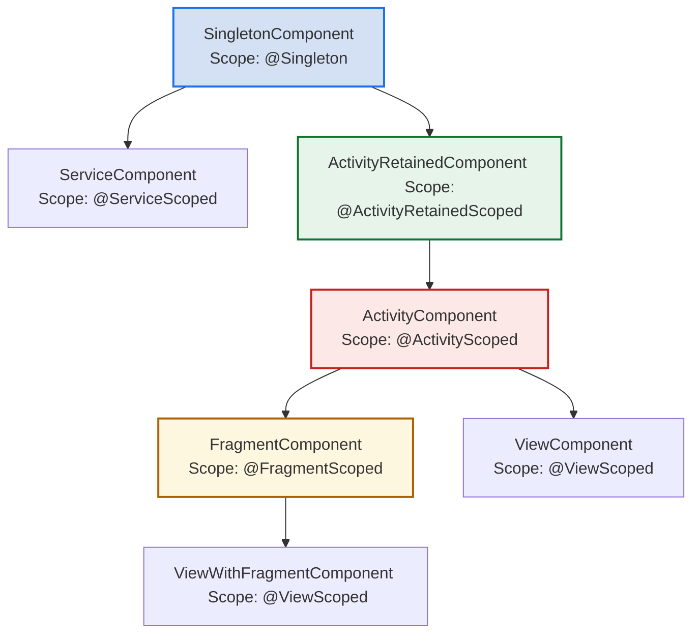
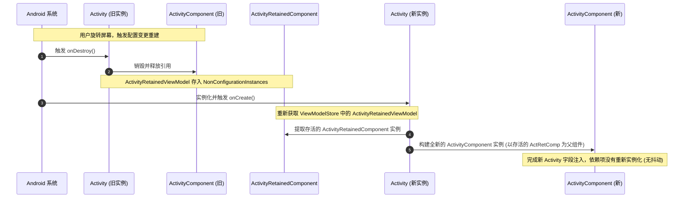
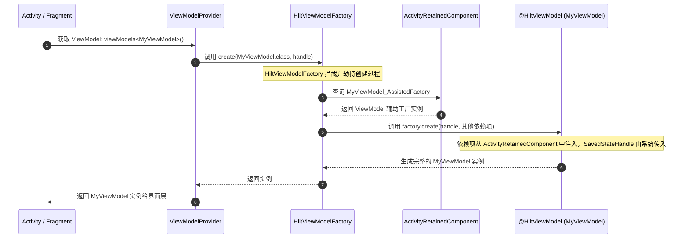

# 5.3.4.2 Hilt 依赖注入框架深度剖析

依赖注入（Dependency Injection，简称 DI）是现代 Android 工程架构中不可或缺的基石。在 Android 社区中，依赖注入框架经历了从早期的依赖反射的 **Guice**、**RoboGuice**，到编译期生成代码的 **Dagger1**，再到完全静态无反射的 **Dagger2** 的漫长演进。然而，Dagger2 虽然在运行性能和依赖图安全方面达到了行业巅峰，但其对于 Android 平台极高的使用心智负担与样板代码爆炸问题，始终是中大型开发团队的梦魇。

为了彻底消除这一痛点，Google 基于 Dagger2 封装了一套专为 Android 设计的场景化依赖注入脚手架——**Hilt**。本文将从 Hilt 的诞生背景与 Dagger2 的断代关系入手，深度解密其底层的字节码插桩机理、预定义组件（Components）与作用域（Scopes）的物理边界、非 Hilt 托管类的 `@EntryPoint` 注入逻辑、`@HiltViewModel` 的定制化注入流程，并对实际工程中的常见误区与架构方案进行权衡分析。

---

## 1. Hilt 的诞生背景与 Dagger2 的进化断代

要理解 Hilt 为什么这样设计，必须先理解 Dagger2 乃至 Dagger-Android 在 Android 平台中遭遇的痛点和断代危机。

### 1.1 Dagger2 的本质与 Android 运行时的天然阻碍

Dagger2 的核心哲学是**静态、无反射、编译期生成完整的依赖关系有向无环图（DAG）**。它在编译期通过注解处理器（APT/KAPT/KSP）扫描 `@Inject`、`@Module`、`@Component` 等注解，在编译产物中直接生成用于装配对象的 Java 代码（例如 `DaggerAppComponent`）。这使得 Dagger2 拥有了极高的运行性能（接近手动 new 对象）和极高的安全性（若图中有循环依赖或未提供项，编译直接报错）。

然而，这种设计在 Android 平台落地时，遭遇了 Android 系统运行时的天生阻碍：
- **无法接管核心组件的实例化**：在 Java Web 应用中，DI 框架（如 Spring）可以接管几乎所有对象的构造过程。但在 Android 中，Application、Activity、Fragment、Service、BroadcastReceiver 等核心组件是由 Android 系统（`ActivityThread`、`Instrumentation`）通过反射强行实例化的。开发者无法在这些类中使用构造函数注入（Constructor Injection）。
- **必须使用字段注入（Field Injection）**：由于无法干预组件实例化，开发者只能在组件中定义带 `@Inject` 的字段，并在组件生命周期开始时，手动调用 `component.inject(this)` 进行注入。

### 1.2 样板代码失控：Dagger2 的多组件组装之痛

在大型 Android 应用中，由于不同页面 and 模块对对象的生命周期有不同要求（例如：有些网络库是全局单例的，而有些业务 Presenter 必须随 Activity 的销毁而消亡），开发者必须手动管理多个 Component。

为了实现这一点，开发者需要手写大量的样板代码：
1. **定义全局单例 Component**（如 `AppComponent`），并在自定义 `Application` 中初始化和持有它。
2. **定义子 Component**（如 `ActivityComponent`、`FragmentComponent`）。为了让子组件能获取父组件中的依赖，需要使用 Dagger 的 `@Subcomponent` 或者 `dependencies` 声明它们之间的依赖继承关系。
3. **手动组装依赖图**：在每个 Activity 的 `onCreate()` 中，或者每个 Fragment 的 `onAttach()` 中，手写如下装配逻辑：
   ```kotlin
   override fun onCreate(savedInstanceState: Bundle?) {
       (application as MyApplication).appComponent
           .activityComponentBuilder()
           .activity(this)
           .build()
           .inject(this)
       super.onCreate(savedInstanceState)
   }
   ```
随着 Activity 和 Fragment 数量的激增，每个组件都要手写这一套繁琐且高度相似的依赖注入代码。这种手写注入链路的形式被称为**样板 Component 手动组装**。不仅严重拖慢开发效率，而且极易由于组件销毁时没有正确释放 Component 引用而造成严重的内存泄漏。

此外，在大型多模块（Multi-Module）组件化项目中，手动组装组件会导致层级关系极其混乱。为了让不同 Module 的组件能够相互通信，开发人员不得不暴露大量的底层 Component 实例，并使用高度耦合的手动 Builder 方式进行链式拼装。这不仅破坏了组件之间的依赖隔离原则，还使得项目的依赖图变得难以重构和扩展。

在生命周期管理上，手动管理 Dagger 组件极易出错。如果开发者在 Activity 销毁时未能及时清理对 Custom Scope Component 的强引用，或者错误地在 Activity 范围之外缓存了该 Component 实例，就会导致 Activity 及其持有的全部 View 层次结构无法被垃圾回收，从而引发致命的内存泄露。

### 1.3 历史尘埃：Dagger-Android 的尴尬败笔

为了减少上述手动编写注入代码的工作量，Dagger 团队曾推出过 **Dagger-Android** 扩展库。Dagger-Android 试图通过声明式注解（如 `@ContributesAndroidInjector`）自动生成子组件，并通过运行时“查表”的方式，封装手写的注入逻辑。其核心机制是在 Application 中维护一个 `DispatchingAndroidInjector` 映射表，当 Activity 启动时调用 `AndroidInjection.inject(this)`，它会自动沿着 Context 向上寻找 Application 并提取对应的注入器。

然而，Dagger-Android 的设计极其晦涩难懂：
- **概念极度复杂**：引入了 `HasAndroidInjector`、`AndroidInjector<T>`、`DispatchingAndroidInjector` 等大量概念，学习曲线极其陡峭。
- **违背“无反射”初衷的运行时路由**：虽然 Dagger-Android 底层生成的注入器依旧是静态代码，但其在运行时寻找对应 Activity 组件的机制本质上是一种“运行时查表与多绑定路由”机制。它依靠一个庞大的 `Map<Class<?>, Provider<AndroidInjector.Factory<?>>>` 映射表进行查找。在运行时，每次启动 Activity 都要执行 Map 的哈希碰撞查找和类型转换，这不仅降低了运行效率，还在 APK 中引入了大量用于多绑定生成的冗余类，显著增加了包体积和应用启动耗时。
- **黑盒化与编译报错不可读**：Dagger-Android 将大量的依赖关系隐藏在自动生成的代码内部。一旦配置出错（例如某个 Module 忘记绑定），编译器吐出的报错信息往往是一堆极其混乱 of Dagger 生成类报错，极难定位源头。
- **局限性明显**：对 Fragment 的生命周期注入时机管理依然混乱，且对 Jetpack 架构组件（如 ViewModel）支持不佳。当系统面临频繁的 Fragment 嵌套或动态加载时，Dagger-Android 容易因 context 状态不匹配抛出异常。

最终，Dagger-Android 由于配置繁琐、调试极其困难，被 Android 开发者和 Google 官方打入冷宫。

### 1.4 Hilt 的定位：上层场景化组件封装库

正是在这样的背景下，**Hilt** 应运而生。Hilt 并不是对 Dagger2 的推翻重做，其底层依然完全基于 Dagger2。**Hilt 的本质是 Dagger2 的一套 Android 专用场景化脚手架和封装库**。

Hilt 确立了 Android 依赖注入的“标准规约”：
- **消除了手写组件的繁琐**：直接内置了 7 大预定义 Component（从 Application 到 View），开发者再也不用手动定义 `AppComponent`、`ActivityComponent` 等组件，也无需手动管理它们之间的层级依赖关系。
- **消除了手写注入链路的冗余**：通过 `@AndroidEntryPoint` 等注解 and 字节码插桩技术，将原本需要在 `onCreate()` 或 `onAttach()` 中手写的 `inject(this)` 逻辑完全自动化。
- **保留了 Dagger2 的极致优势**：在享受开箱即用便利的同时，Hilt 在编译期依然会将所有的关系翻译成 Dagger2 代码，依然保持了**零反射、运行时性能极高以及编译期依赖图完整性校验**的黄金特性。如果编译期图谱有任何缺失（例如缺少了某个依赖的 `@Inject` 构造函数或 `@Provides` 提供者），Hilt 的注解处理器会拦截编译，并输出具有极高可读性的结构化报错提示，明确指出哪个组件缺少了什么依赖项，彻底解决 Dagger2 报错如天书的问题。

### 1.5 Dagger2 编译期 DAG 校验与 Scope Mismatch 算法机制

在编译期，Dagger2 并不急于生成 Java 代码，而是首先在内存中将所有的 `@Inject`、`@Provides`、`@Binds` 声明抽象为一个双向或单向的**有向无环图（Directed Acyclic Graph, DAG）**。每一个依赖的对象类型是一个顶点（Vertex），每一个依赖声明（例如构造函数中需要某个参数）代表一条指向该参数类型顶点的有向边（Edge）。

Dagger2 的编译校验算法会在此时启动，主要执行以下两项核心检查：
1. **循环依赖检测（Circular Dependency Detection）**：Dagger2 采用图论中的拓扑排序（Topological Sort）算法或 DFS（深度优先搜索）对依赖图进行遍历。如果在遍历过程中发现某条有向边指向了已经在当前递归栈中的祖先节点（即存在回退边 Back Edge），则说明代码中存在循环依赖（例如 A 依赖 B，B 依赖 A）。此时，Dagger 会直接中断编译并报错，打印出清晰的闭环引用链路。
2. **作用域 mismatch 验证（Scope Mismatch Validation）**：这一检查是为了彻底根绝 Android 开发中极易发生的“内存泄漏”。在 Hilt 中，各组件被赋予了不同的 Scope，比如 `@Singleton` 的 SingletonComponent 和 `@ActivityScoped` 的 ActivityComponent。
   当 Dagger 进行依赖解析时，它会为每个顶点计算其“关联 Scope 的生命周期权重”。如果一个生命周期较长的 Component 顶点（例如 SingletonComponent 中的某个单例 Service）在其依赖路径中，强行依赖了一个生命周期较短的 Component 顶点（例如某个 Activity 专属的 UI 状态管理类，标记为 `@ActivityScoped`），Dagger 的校验算法就会判定这是一种**依赖倒置错误（Scope Cascade Violation）**。
   算法的物理判定公式为：
   $$\text{ScopeWeight}(\text{Parent}) \ge \text{ScopeWeight}(\text{Child})$$
   如果该公式被打破（即父节点生命周期短于子节点，导致长生命周期对象持有了短生命周期对象），Dagger 就会立即报错。通过在编译期以严格的拓扑树权重校验拦截此类错误，Hilt 彻底规避了因手动注入而极易引入的运行时“长持短、引发内存泄漏”的低级失误。

### 1.6 依赖注入方案深度横向对比

为了更直观地理解各方案的设计哲学，下表对原生 Dagger2、Dagger-Android 和 Hilt 进行了多维度的横向对比：

| 评估维度 | 原生 Dagger2 | Dagger-Android | Hilt (Android 专属封装) |
| --- | --- | --- | --- |
| **设计哲学** | 通用、完全静态、零反射的依赖图校验 | 面向 Android 的半自动化、运行时多绑定查表路由 | 强约定、场景化的 Android 专有依赖注入脚手架 |
| **组件生命周期管理** | 完全由开发者手动编写、持有与销毁组件 | 框架半自动化管理，通过 Activity 声明生成组件 | 完全托管，与 Android 组件生命周期强绑定并自动销毁 |
| **模板代码量** | **极高**（需手动编写大量的 Component、Subcomponent、Builder） | **中等**（通过注解简化，但仍需编写大量多绑定 Module） | **极低**（零 Component 声明，零手动 inject 触发） |
| **运行性能与内存开销**| **极高**（零反射，最纯粹的直达对象引用） | **较好**（引入了运行时的 Map 查找与类型转化） | **极高**（编译期重写为纯 Dagger 代码，无运行时 Map 路由开销） |
| **多模块组件化支持** | 较差（需手动将底层 Component 暴露并与顶层拼装） | 极差（复杂的 Subcomponent 层级极易导致循环依赖） | **优秀**（通过 `@InstallIn` 与 `@EntryPoint` 实现天然的物理隔离） |
| **Jetpack 架构融合** | 无原生支持（需手动编写复杂的 ViewModel 工厂） | 极弱（与 Jetpack ViewModel、SavedState 契合度低）| **极强**（原生支持 `@HiltViewModel`，自动装配 SavedStateHandle） |
| **编译报错可读性** | 极差（排错信息链路冗长，被开发者戏称为“天书报错”）| 差（多绑定报错信息指向不明） | **优秀**（Hilt 包装了友好错误格式，清晰指出缺失项与组件位置）|

---

## 2. 物理注入入口与字节码插桩机理解密

在 Hilt 中，我们只需要在 Application 上标记 `@HiltAndroidApp`，在 Activity 上标记 `@AndroidEntryPoint`，字段注入便会自动发生，甚至都不需要我们手动编写任何 `Daggerxxx.inject(this)` 的调用。Hilt 是通过编译期注解处理器生成代码、Gradle 插件字节码插桩（ASM/Transform 机制变迁）以及运行时劫持机制来实现这一效果的。

### 2.1 `@HiltAndroidApp` 与 Application 劫持

#### 2.1.1 编译期注解处理器生成的基类骨架

当 Hilt 的注解处理器（Annotation Processor）检测到某个 Application 类（例如 `MyApplication`）标注了 `@HiltAndroidApp` 时，它会在编译期自动生成一个继承自 Application 的抽象基类 `Hilt_MyApplication`。

这个自动生成的基类 `Hilt_MyApplication` 的核心 Java 骨架代码如下所示：

```java
package com.example;

import android.app.Application;
import dagger.hilt.internal.GeneratedComponentManagerHolder;
import dagger.hilt.android.internal.managers.ApplicationComponentManager;
import dagger.hilt.android.internal.modules.ApplicationContextModule;
import dagger.hilt.internal.ComponentSupplier;

/**
 * Hilt 编译期自动生成的基类，用于承载全局单例依赖容器的装配与字段注入触发。
 * 该类隐式地被 ASM 字节码插桩机制设为 MyApplication 的父类。
 */
public abstract class Hilt_MyApplication extends Application implements GeneratedComponentManagerHolder {
  
  // 线程安全的惰性加载锁
  private final Object componentManagerLock = new Object();
  private volatile ApplicationComponentManager componentManager;
  private boolean injected = false;

  @Override
  public final ApplicationComponentManager componentManager() {
    if (componentManager == null) {
      synchronized (componentManagerLock) {
        if (componentManager == null) {
          componentManager = new ApplicationComponentManager(new ComponentSupplier() {
            @Override
            public Object get() {
              // 实例化 Dagger 编译期生成的真实全局单例 Component 依赖图
              // SingletonC 是 Dagger 编译生成的内部单例组件
              return DaggerMyApplication_HiltComponents_SingletonC.builder()
                  .applicationContextModule(new ApplicationContextModule(Hilt_MyApplication.this))
                  .build();
            }
          });
        }
      }
    }
    return componentManager;
  }

  @Override
  public final Object generatedComponent() {
    return this.componentManager().generatedComponent();
  }

  @Override
  public void onCreate() {
    // 1. 在执行用户的 MyApplication.onCreate 之前，先触发物理注入
    hltInternalInject();
    super.onCreate();
  }

  protected void hltInternalInject() {
    if (!injected) {
      injected = true;
      // 2. 将 Hilt_MyApplication 强转为生成的 Injector 接口，并注入真实 MyApplication 实例中的字段
      // MyApplication_GeneratedInjector 是编译期为 MyApplication 自动生成的注入器接口
      ((MyApplication_GeneratedInjector) this.generatedComponent()).injectMyApplication((MyApplication) this);
    }
  }
}
```

从上述生成代码可以看出，`Hilt_MyApplication` 负责了两件至关重要的事情：
1. **实例化 Dagger 全局单例组件**：在 `ApplicationComponentManager` 中通过惰性加载的方式构建 `SingletonC`。这样做确保了依赖图只有在真正需要时才进行初始化。
2. **在 `onCreate()` 中劫持并注入**：在系统的 `onCreate()` 启动时，调用 `hltInternalInject()` 触发对自身字段的依赖注入。通过将当前对象转换为强类型的 `MyApplication_GeneratedInjector`，实现了对 `MyApplication` 内部带有 `@Inject` 注解属性的自动装配。

#### 2.1.2 Gradle 插件的字节码插桩（ASM 机制）

按照 Java 的常规继承逻辑，如果想要让 `Hilt_MyApplication` 生效，开发者必须手动将 `MyApplication` 的声明改为继承 `Hilt_MyApplication`：
```kotlin
// 侵入性写法（如果不做字节码插桩）
class MyApplication : Hilt_MyApplication()
```
然而，在 Hilt 的实际使用中，我们依然只需要写 `class MyApplication : Application()`。Hilt 是通过 Gradle 插件在编译流程中动态修改了类的继承关系，实现无缝替换的。

这一机制的发展历程伴随着 Android 构建工具链的重大变革：
1. **AGP 7.0 之前（Transform API 时代）**：Hilt 依靠 `Transform` 任务在 Class 文件转换为 DEX 文件之前，全局扫描带 `@HiltAndroidApp` 注解的类，使用 ASM 库直接修改该 Class 文件的字节码，将其 `super_class` 指向 `Hilt_MyApplication`。这种传统的 Transform 机制存在严重的性能缺陷：它在编译期是以一种“全量扫描”或者“弱增量”的方式运作，这会导致 Gradle 的构建缓存（Build Cache）频繁失效，显著延长了中大型项目的增量编译时间。
2. **AGP 7.0+ 及 8.0 之后（AsmClassVisitorFactory 时代）**：传统的 Gradle Transform API 被标记为废弃，并在 AGP 8.0 中被彻底移除（详情可参阅根目录下的 [AndroidVersionChangeLog.md](../../../../../AndroidVersionChangeLog.md)）。Hilt 随之进行了底层架构演进，改用 AGP 推出的新一代 `Instrumentation` API（即 `AsmClassVisitorFactory`）。它直接在 Gradle 编译的 Class 变换节点中注册一个 ASM `ClassVisitor`。由于 `AsmClassVisitorFactory` 深度契合了 Gradle 的 Task 增量构建模型，只有发生修改的 Class 文件才会被送入 ASM 变换节点，从而完美解决了编译性能和构建缓存友好性的物理痛点。

**ASM 字节码修改原理与实现伪代码**：
在编译过程中，`hilt-android-gradle-plugin` 注册的字节码修改器（Class Visitor）会读取原始的 `MyApplication.class`。在 ASM 的 `visit` 方法被触发时，ClassVisitor 会拦截原始的类签名，其 ASM 操作的伪代码逻辑如下：

```java
package dagger.hilt.android.plugin;

import org.objectweb.asm.ClassVisitor;
import org.objectweb.asm.Opcodes;

/**
 * 模拟 Hilt 内部用于改写 Application 继承关系的 ASM ClassVisitor。
 * 在类扫描阶段拦截类签名，动态修改其超类（superName）。
 */
public class HiltApplicationClassVisitor extends ClassVisitor {
    
    private final String targetClassName = "com/example/MyApplication";
    private final String generatedSuperClassName = "com/example/Hilt_MyApplication";
    private final String rawSuperClassName = "android/app/Application";

    public HiltApplicationClassVisitor(int api, ClassVisitor classVisitor) {
        super(api, classVisitor);
    }

    @Override
    public void visit(int version, int access, String name, String signature, String superName, String[] interfaces) {
        // 1. 判断当前访问的类是否是目标 Application 类，且其父类尚未被修改
        if (name.equals(targetClassName) && superName.equals(rawSuperClassName)) {
            // 2. 将 superName 重定向为 Hilt 编译期生成的基类 Hilt_MyApplication
            superName = generatedSuperClassName;
        }
        // 3. 将修改后的超类签名向下传递，写入最终的 Class 字节码
        super.visit(version, access, name, signature, superName, interfaces);
    }
}
```

通过这种方式，在 JVM 的字节码层面，所有的 `invokespecial android/app/Application/<init>`（即调用父类构造函数）的方法指令都会被自动修改为 `invokespecial com/example/Hilt_MyApplication/<init>`。这就完美实现了零代码入侵，开发者在源码中看不见任何 `Hilt_MyApplication` 的痕迹，但打包出来的 APK 在运行时已经是继承自 `Hilt_MyApplication` 的子类了。

#### 2.1.3 字节码插桩与初始化的决策流

下图展示了带有 `@HiltAndroidApp` 的 Application 从编译期字节码插桩到运行时劫持并初始化的完整调用与决策流：

```mermaid
flowchart TD
    subgraph 编译期 (Compile Time)
        A[MyApplication.class 声明继承 Application] --> B{Hilt Gradle 插件扫描}
        B -- 检测到 @HiltAndroidApp --> C[生成 Hilt_MyApplication.java]
        B -- ASM ClassVisitor 字节码插桩 --> D[重定向 MyApplication 的父类为 Hilt_MyApplication]
        D --> E[输出打包后的 APK 字节码]
    end

    subgraph 运行时 (Runtime)
        E --> F[系统实例化 MyApplication 并分配内存]
        F --> G[系统回调 onCreate 阶段]
        G --> H[进入父类 Hilt_MyApplication.onCreate]
        H --> I[调用 hltInternalInject 进行劫持]
        I --> J[构建 ApplicationComponentManager]
        J --> K[初始化底层的 Dagger SingletonComponent]
        K --> L[强转 GeneratedComponent 并执行 injectMyApplication]
        L --> M[MyApplication 中的 @Inject 字段完成注入]
        M --> N[回调 MyApplication.onCreate 用户的业务逻辑]
    end
```

---

### 2.2 `@AndroidEntryPoint` 与组件挂钩

对于 Activity、Fragment、View 等 Android 核心组件，Hilt 同样使用 `@AndroidEntryPoint` 注解配合字节码插桩来完成注入挂钩。下面以 `MainActivity` 为例，深入解密其底层继承体系与重定向流程。

#### 2.2.1 `MainActivity` 编译期重定向与中间基类生成

当我们在 `MainActivity` 上标注 `@AndroidEntryPoint` 时，Hilt 的注解处理器会生成中间类 `Hilt_MainActivity`。

此中间基类的核心职责是作为**物理注入的触点**。它的底层生成代码如下：

```java
package com.example;

import android.content.Context;
import androidx.activity.contextaware.OnContextAvailableListener;
import androidx.appcompat.app.AppCompatActivity;
import dagger.hilt.internal.GeneratedComponentManagerHolder;
import dagger.hilt.android.internal.managers.ActivityComponentManager;

/**
 * Hilt 编译期为 MainActivity 自动生成的中间基类。
 * 负责与 Jetpack Activity 的 Context 准备就绪机制挂钩，并触发依赖注入。
 */
public abstract class Hilt_MainActivity extends AppCompatActivity implements GeneratedComponentManagerHolder {
  
  private volatile ActivityComponentManager componentManager;
  private final Object componentManagerLock = new Object();
  private boolean injected = false;

  Hilt_MainActivity() {
    super();
    // 1. 在构造阶段，添加生命周期监听，确保尽早获得 Context 并安全注入
    init();
  }

  private void init() {
    addOnContextAvailableListener(new OnContextAvailableListener() {
      @Override
      public void onContextAvailable(Context context) {
        // 2. 当 Activity 的 Context 准备好时，立即触发依赖注入
        inject();
      }
    });
  }

  protected void inject() {
    if (!injected) {
      injected = true;
      // 3. 获取对应的 ActivityComponent，并将字段注入到 MainActivity 中
      // MainActivity_GeneratedInjector 是为 MainActivity 生成的专属属性注入器
      ((MainActivity_GeneratedInjector) this.generatedComponent()).injectMainActivity((MainActivity) this);
    }
  }

  @Override
  public final ActivityComponentManager componentManager() {
    if (componentManager == null) {
      synchronized (componentManagerLock) {
        if (componentManager == null) {
          componentManager = createComponentManager();
        }
      }
    }
    return componentManager;
  }

  protected ActivityComponentManager createComponentManager() {
    // 实例化 Activity 组件管理器，用于管理当前 Activity 的 Component 生命周期
    return new ActivityComponentManager(this);
  }

  @Override
  public final Object generatedComponent() {
    return this.componentManager().generatedComponent();
  }
}
```

#### 2.2.2 字节码重定向逻辑与注入触发时机

在编译期间，Hilt 的 ASM ClassVisitor 会拦截 `MainActivity.class` 的编译，将其父类从 `AppCompatActivity` 修改为 `Hilt_MainActivity`。

运行时物理注入的触发时机具有极强的确定性：
- **Activity 的注入时机**：利用了 Jetpack Activity 引入 of `OnContextAvailableListener` 机制。在 `Activity.onCreate()` 内部，在执行任何用户代码 and `super.onCreate(savedInstanceState)` 之前，`Activity` 会回调所有注册的 `OnContextAvailableListener`。此时 `inject()` 方法被调用，完成对字段的注入。这保证了在 Activity 本身的 `onCreate` 逻辑中，被 `@Inject` 修饰的字段已经被安全地初始化完毕，避免了 NullPointerException。
- **Fragment 的注入时机**：Fragment 没有 `OnContextAvailableListener` 机制。Hilt 的自动生成基类 `Hilt_Fragment` 会重写 `onAttach(Context context)`。在 `super.onAttach()` 之前，首先执行 `inject()`。这确保了在 Fragment 复杂的生命周期（如 `onCreateView()`、`onViewCreated()`）开始运转前，所有的字段注入已经安全完成。
  此外，`Hilt_Fragment` 还会使用一个自定义的 `ContextWrapper`（即 `FragmentComponentManager.FragmentContextWrapper`）来包装 Activity 的 Context。为什么不能直接用 Activity Context？因为如果直接将 Activity Context 暴露给 Fragment 内部的依赖图，当 Fragment 试图去解析自身 Scope（如 `@FragmentScoped`）的对象时，会因为解析器查找到 Activity 级别而无法获取 Fragment 作用域的专有绑定。通过这层定制的包装，Fragment 能够从它的组件管理器（`FragmentComponentManager`）中准确获取属于自己的 `FragmentComponent`，并在横竖屏切换或配置变更时有效避免 Activity 实例发生的物理内存泄漏。
- **View 的注入时机**：对于自定义 View，由于其不是 LifecycleOwner，Hilt 的 `ViewComponentManager` 会在 View 的构造函数中拦截。在构造函数被调用的第一时间，获取 Context 并向上寻找 `GeneratedComponentManagerHolder`（通常是 Activity 或 Fragment），提取对应的组件完成注入。

---

## 3. 预定义组件（Components）与作用域（Scopes）的物理边界

Hilt 最核心的工程设计在于：它将 Dagger2 极其繁杂的多级 Component 拓扑网抽象为 **7 大预定义组件**，并为它们强绑定了对应的 **Android 生命周期边界**。这种强约定的设计彻底解决了 Dagger2 样板组件手动拼装的混乱。

### 3.1 7 大预定义组件的层级从属与生命周期拓扑

在 Hilt 中，所有的预定义组件并不是平级的，它们存在严格的**单向依赖与层级关系**。顶层组件的生命周期最长，底层组件生命周期较短。子组件可以通过 Dagger 的 Subcomponent 机制直接获取父组件暴露出来的所有依赖项，反之则不行。

下图展现了 Hilt 的 7 大预定义组件的层级树与生命周期时序拓扑结构：



### 3.2 组件生命周期的托管方案与物理生存周期

下表详细定义了这 7 大组件的创建、销毁时机及其物理作用域范围：

| 预定义组件 (Component) | 对应作用域注解 (Scope) | 生命周期托管实体 | 创建时机 (Creation Time) | 销毁时机 (Destruction Time) |
| --- | --- | --- | --- | --- |
| **`SingletonComponent`** | `@Singleton` | `Application` | `Application#onCreate()` | 应用程序进程退出 |
| **`ServiceComponent`** | `@ServiceScoped` | `Service` | `Service#onCreate()` | `Service#onDestroy()` |
| **`ActivityRetainedComponent`** | `@ActivityRetainedScoped` | `ActivityRetainedComponentManager` | `Activity#onCreate()` *(首次启动)* | `Activity#onDestroy()` *(非配置变更造成的销毁，如 isFinishing==true)* |
| **`ActivityComponent`** | `@ActivityScoped` | `Activity` | `Activity#onCreate()` *(每次重建都会创建)* | `Activity#onDestroy()` *(每次销毁都会执行)* |
| **`FragmentComponent`** | `@FragmentScoped` | `Fragment` | `Fragment#onAttach()` | `Fragment#onDestroy()` |
| **`ViewComponent`** | `@ViewScoped` | `View` | `View` 构造函数执行时 | View 实例被销毁/从 Window 脱离时 |
| **`ViewWithFragmentComponent`** | `@ViewScoped` | Fragment 内部的 `View` | `View` 构造函数执行时 *(在 Fragment 内部)* | View 实例被销毁时 |

#### 3.2.1 依赖关系的作用域传播规则与 Dagger 底层机制

当一个依赖项被标记了特定作用域（例如 `@ActivityScoped`），这意味着在该作用域对应的组件生命周期内，该组件持有的该依赖项是**单例**的。
- 如果组件 `ActivityComponent` 请求一个声明为 `@ActivityScoped` 的对象，它在同一个 Activity 实例中拿到的永远是同一个实例。
- 如果组件请求的是未标注任何作用域注解的依赖，则每次请求都会触发该依赖的 `@Inject` 构造函数，创建全新实例（即 Prototype 模式）。

##### Dagger 编译生成类中 Scope 机制的物理本质
在底层，Dagger 并不是利用类似全局 HashMap 的运行时机制去缓存这些 Scoped 实例的。
以 `@Singleton` 为例，Dagger 会在编译生成的 `DaggerMyApplication_HiltComponents_SingletonC` 内部，为每一个标注了 `@Singleton` 的类生成一个包装对象——`DoubleCheck`。

```java
// Dagger 自动生成的单例 Provider 初始化代码片段
this.provideAnalyticsServiceProvider = DoubleCheck.provider(
    AnalyticsServiceImpl_Factory.create()
);
```

这个 `DoubleCheck` 是 Dagger 底层实现局部单例的核心容器。它的源码本质上是一个经典的**双重检查锁（DCL）惰性加载单例模式**：

```java
package dagger.internal;

import javax.inject.Provider;

/**
 * Dagger 实现 Scope 作用域局部单例的核心类。
 * 通过双重检查锁确保在并发情况下，对应组件内只生成唯一实例。
 */
public final class DoubleCheck<T> implements Provider<T> {
  private static final Object UNINITIALIZED = new Object();
  private volatile Provider<T> provider;
  private volatile Object instance = UNINITIALIZED;

  private DoubleCheck(Provider<T> provider) {
    this.provider = provider;
  }

  @Override
  public T get() {
    Object result = instance;
    if (result == UNINITIALIZED) {
      synchronized (this) {
        result = instance;
        if (result == UNINITIALIZED) {
          result = provider.get();
          // 将生成的实例保存在当前 DoubleCheck 成员变量中
          instance = reentrantCheck(instance, result);
          // 释放对 Provider 的引用，避免内存占用
          provider = null;
        }
      }
    }
    return (T) result;
  }

  public static <P extends Provider<T>, T> Provider<T> provider(P delegate) {
    if (delegate instanceof DoubleCheck) {
      return delegate;
    }
    return new DoubleCheck<T>(delegate);
  }
  
  // 校验逻辑防止并发重入引发多实例
  private static Object reentrantCheck(Object currentInstance, Object newInstance) {
    boolean isReentrant = currentInstance != UNINITIALIZED && currentInstance != newInstance;
    if (isReentrant) {
      throw new IllegalStateException("Scoped provider was reentrantly invoked...");
    }
    return newInstance;
  }
}
```

从这部分源码中我们可以得出以下重要结论：
- **生命周期的托管本源**：一个被 `@ActivityScoped` 标注的对象之所以能随 Activity 的销毁而释放，是因为该 `DoubleCheck` 实例是作为 `ActivityComponent` 实例的成员变量存在的。当 Activity 销毁时，它的 `ActivityComponent` 失去了强引用并被垃圾回收器（GC）回收，导致其内部持有的 `DoubleCheck` 及其持有的 `instance` 随之全部被 GC 回收。
- **Scope Mismatch 校验的本质**：子组件的依赖（如 Fragment）可以注入父组件（如 ActivityComponent）作用域的对象，反之则绝对禁止。例如，不能将 `@ActivityScoped` 的对象注入到 `@Singleton` 的全局单例中，否则会导致编译期抛出经典的 **Scope Mismatch** 依赖图安全报错。这一规则的底层约束是由 Dagger 编译期的依赖分析算法（Dependency Graph Validation）强制执行的，在编译阶段便拦截了任何潜在的依赖倒置和生命周期跨越错误。

---

### 3.3 `ActivityRetainedComponent`（ViewModel 守护者）深度剖析

在 7 大预定义组件中，`ActivityRetainedComponent` 的设计最为精妙，它是连接 Android 系统配置变更（Configuration Changes）与 Hilt 依赖容器的关键桥梁。

#### 3.3.1 跨越配置重建（屏幕旋转）的物理痛点

在 Android 平台中，屏幕旋转、系统语言切换、深浅模式切换等行为都会触发配置变更，导致系统默认销毁当前的 Activity 实例并重新创建一个新的 Activity 实例。

对于常规的 `ActivityComponent` 而言，它随 Activity 的 `onCreate` 创建，随 `onDestroy` 销毁。这意味着，如果我们将某种承载了临时业务状态或长连接监听的依赖项（如 `ChatRepository`、`NetworkFlowStream`）标记为 `@ActivityScoped`：
1. 屏幕一旋转，旧 Activity 销毁，`ActivityComponent` 跟着被 GC。
2. 新 Activity 启动，创建全新的 `ActivityComponent`，重新实例化一个全新的 `ChatRepository`。
3. 之前缓存在内存中的聊天列表状态丢失，连接重新建立，界面发生明显的闪烁和抖动。

为了解决这一问题，传统做法是在 `ViewModel` 中手动持有这些数据。但如果这些数据仓库的生命周期本身也需要由依赖注入容器管理，就必须有一个能够跨越 Activity 配置重建而存活的依赖注入组件。

#### 3.3.2 核心原理：利用 Jetpack ViewModel 的 NonConfigurationInstances 机制

Hilt 创造性地引入了 `ActivityRetainedComponent`。它的生命周期长于 `ActivityComponent`，能够横跨 Activity 的 Destroy 与 Recreate。它的底层实现完全依托于 Jetpack ViewModel 的状态保留能力。

让我们来看一下 Hilt 内部 `ActivityRetainedComponentManager` 的核心骨架和运作逻辑：

```java
package dagger.hilt.android.internal.managers;

import androidx.annotation.NonNull;
import androidx.lifecycle.ViewModel;
import androidx.lifecycle.ViewModelProvider;
import androidx.lifecycle.ViewModelStoreOwner;
import dagger.hilt.internal.GeneratedComponentManager;

/**
 * Hilt 内部管理 ActivityRetainedComponent 的管理器。
 * 核心原理是构建一个寄宿于 Jetpack ViewModel 的 Retained 容器，
 * 借由 Android 系统保留 NonConfigurationInstances 的机制，在配置变更时依然存活。
 */
public final class ActivityRetainedComponentManager implements GeneratedComponentManager<Object> {
  
  private final ViewModelStoreOwner viewModelStoreOwner;
  private volatile Object component;
  private final Object lock = new Object();

  public ActivityRetainedComponentManager(ViewModelStoreOwner owner) {
    this.viewModelStoreOwner = owner;
  }

  @Override
  public Object generatedComponent() {
    if (component == null) {
      synchronized (lock) {
        if (component == null) {
          component = getOrCreateComponent();
        }
      }
    }
    return component;
  }

  private Object getOrCreateComponent() {
    // 1. 利用 ViewModelStore 获取一个特殊的 Hilt 内部内置 ViewModel
    ViewModelProvider provider = new ViewModelProvider(
        viewModelStoreOwner, 
        new ViewModelProvider.Factory() {
          @NonNull
          @Override
          public <T extends ViewModel> T create(@NonNull Class<T> modelClass) {
            // 2. 创建并返回持有了真实 ActivityRetainedComponent 的 ViewModel 实例
            // 此处的组件是在应用程序的全局 SingletonComponent 的支持下生成的子组件
            Object component = DaggerMyApplication_HiltComponents_SingletonC
                .builder()
                .build()
                .activityRetainedComponentBuilder()
                .build();
            return (T) new ActivityRetainedViewModel(component);
          }
        });
    
    ActivityRetainedViewModel retainedViewModel = provider.get(ActivityRetainedViewModel.class);
    // 3. 从 ViewModel 中获取缓存的生命周期保留组件
    return retainedViewModel.getActivityRetainedComponent();
  }

  // 内部类：作为 ActivityRetainedComponent 的持有者
  static final class ActivityRetainedViewModel extends ViewModel {
    private final Object activityRetainedComponent;

    ActivityRetainedViewModel(Object component) {
      this.activityRetainedComponent = component;
    }

    Object getActivityRetainedComponent() {
      return activityRetainedComponent;
    }

    @Override
    protected void onCleared() {
      // 4. 当 Activity 彻底被销毁（非配置变更造成的销毁，例如用户主动返回）时，清理组件并释放依赖项
      super.onCleared();
      // 触发 ActivityRetainedComponent 内部注册的生命周期销毁回调
      ((ActivityRetainedComponent) activityRetainedComponent).getLifecycle().destroy();
    }
  }
}
```

##### 底层物理机制解密
1. **组件寄宿在 ViewModel 中**：从上面的源码中可以清晰看到，真正的 Dagger 组件 `ActivityRetainedComponent` 被作为参数传递给了 `ActivityRetainedViewModel`。
2. **利用系统的 NonConfigurationInstances 机制进行转移**：
   在 Android 系统底层的 `ActivityThread#performDestroyActivity` 流程中，如果因为配置变更发生销毁重建，系统会回调 Activity 的 `onRetainNonConfigurationInstance()` 收集当前 Activity 的 `NonConfigurationInstances`，其中就包含了 Activity 内持有的 `ViewModelStore`。
   在重建新的 Activity 实例时，在 `ActivityThread#performLaunchActivity` 阶段，系统会通过 `attach` 方法把之前保留的 `NonConfigurationInstances` 无缝塞回给新的 Activity 实例。
3. **完全无抖动的数据复用**：当新的 Activity 实例在 `onCreate` 阶段调用 `ActivityRetainedComponentManager` 时，底层通过 `ViewModelProvider` 再次从被系统保留的 `ViewModelStore` 中提取出那个未被销毁的 `ActivityRetainedViewModel` 实例，从而直接取出了它持有的原有 `ActivityRetainedComponent`。
4. **生命的真正终结（onCleared）**：只有当用户按下返回键或者主动调用 `finish()` 导致 Activity 彻底消亡时，系统才会回调 `ActivityRetainedViewModel` 的 `onCleared()`。此时，Hilt 会执行底层组件 Lifecycle 的 `destroy()` 方法，通知所有注册的销毁监听器释放内存。这套优雅的双层工厂托管方案彻底杜绝了配置变更带来的依赖抖动与不必要的重复初始化。

#### 3.3.3 重建前后的组件协作时序

下图展示了在配置变更发生时，Android 系统与 Hilt 中各组件生命周期的交互时序：



---

## 4. 扩展安全机制与高级应用

Hilt 不仅满足了对 standard Android 组件的字段注入，还提供了在非 Hilt 托管类中提取依赖的 `@EntryPoint` 机制，以及深度融合 Jetpack 架构的 `@HiltViewModel` 注入方案。

### 4.1 `@EntryPoint`：非 Hilt 托管类中的依赖动态提取

#### 4.1.1 什么是“非 Hilt 托管类”？

Hilt 只能在被 `@AndroidEntryPoint` 标记的类中执行自动注入。但在 Android 系统设计和很多第三方架构中，存在大量无法使用该注解的场景，例如：
1. **`ContentProvider`**：它的实例化发生得极早（在 Application 实例化之后、`onCreate` 执行之前）。在此阶段，Hilt 容器尚未准备就绪，无法直接对其进行自动的 `@AndroidEntryPoint` 字段注入。
2. **自定义 View**：当自定义 View 被第三方 SDK（如 Map SDK、图表库）在其内部反射创建时，Hilt 无法干预其构造。
3. **动态化/插件化加载的 Class**：在插件化开发中，动态加载的 DEX 类对于主工程的 Hilt 容器来说是完全隔离的。
4. **Service 里的辅助 Worker（如 WorkManager 的 Worker）**：普通的 Worker 实例同样无法被 Hilt 直接注入。

#### 4.1.2 机制与实现：如何使用 EntryPoint 手动获取依赖？

对于这些非 Hilt 托管的类，我们可以通过定义一个**入口点 (EntryPoint)**，手动从 Hilt 的 Dagger 组件中提取所需的依赖项。

以下是一个在 `ContentProvider` 中手动动态提取 `AnalyticsService` 依赖的核心 Kotlin 源码实现：

```kotlin
package com.example;

import android.content.ContentProvider
import android.content.ContentValues
import android.database.Cursor
import android.net.Uri
import dagger.hilt.EntryPoint
import dagger.hilt.InstallIn
import dagger.hilt.android.EntryPointAccessors
import dagger.hilt.components.SingletonComponent

// 定义一个业务接口，用于上层使用
interface AnalyticsService {
    fun logEvent(name: String, params: Map<String, String>)
}

// 模拟的 Analytics 接口实现类
class AnalyticsServiceImpl @javax.inject.Inject constructor() : AnalyticsService {
    override fun logEvent(name: String, params: Map<String, String>) {
        println("Event Logged: $name, Params: $params")
    }
}

class MyContentProvider : ContentProvider() {

    // 1. 定义 an EntryPoint 接口，声明我们需要动态获取的依赖项
    // 使用 @InstallIn 明确声明该 EntryPoint 应该安装在哪个预定义组件中（此处是 SingletonComponent）
    @EntryPoint
    @InstallIn(SingletonComponent::class)
    interface ContentProviderEntryPoint {
        fun getAnalyticsService(): AnalyticsService
    }

    override fun onCreate(): Boolean {
        return true
    }

    override fun query(
        uri: Uri,
        projection: Array<out String>?,
        selection: String?,
        selectionArgs: Array<out String>?,
        sortOrder: String?
    ): Cursor? {
        val context = context ?: return null
        val appContext = context.applicationContext

        // 2. 使用 EntryPointAccessors 从 ApplicationContext 中提取对应的 EntryPoint
        // 这一步打破了 Hilt 的自动注入限制，在运行时手动接入 Hilt 容器提取物理对象
        val entryPoint = EntryPointAccessors.fromApplication(
            appContext, 
            ContentProviderEntryPoint::class.java
        )

        // 3. 直接通过 EntryPoint 获取依赖，并执行相关业务逻辑
        val analyticsService = entryPoint.getAnalyticsService()
        analyticsService.logEvent("provider_query", mapOf("uri" to uri.toString()))

        return null
    }

    override fun getType(uri: Uri): String? = null
    override fun insert(uri: Uri, values: ContentValues?): Uri? = null
    override fun delete(uri: Uri, selection: String?, selectionArgs: Array<out String>?): Int = 0
    override fun update(uri: Uri, values: ContentValues?, selection: String?, selectionArgs: Array<out String>?): Int = 0
}
```

#### 4.1.3 底层原理：`EntryPoints.get()` 虚方法表多态转换

为什么 `EntryPointAccessors.fromApplication` 传入一个 Context 就能凭空变出 `ContentProviderEntryPoint` 接口的实现？

我们来看一下 `EntryPoints` 内部的核心强转源码逻辑：

```java
package dagger.hilt;

import androidx.annotation.NonNull;
import dagger.hilt.internal.GeneratedComponent;
import dagger.hilt.internal.GeneratedComponentManagerHolder;

/**
 * Hilt 动态依赖提取的底层核心实现。
 * 它的本质是通过 Java 类型系统的强转（多态），直接将 Dagger 容器强制转换成定义的 EntryPoint 接口。
 */
public final class EntryPoints {
  
  @NonNull
  public static <T> T get(Object component, Class<T> entryPoint) {
    if (component instanceof GeneratedComponent) {
      // 1. 如果传入的直接就是 Hilt 生成的组件，可以直接强转
      return entryPoint.cast(component);
    } else if (component instanceof GeneratedComponentManagerHolder) {
      // 2. 如果传入的是 GeneratedComponentManagerHolder（如 Application 或 Activity）
      // 则先通过 componentManager() 获取真实的 GeneratedComponent 依赖图实例，再将其强转为 EntryPoint 类型
      return entryPoint.cast(
          ((GeneratedComponentManagerHolder) component).generatedComponent());
    }
    throw new IllegalStateException("Expected an instance of a Hilt GeneratedComponent...");
  }
}
```

**原理提炼与 JVM 物理底层解密**：
1. **多态强转的物理基础**：由于最终生成的全局 Dagger 组件类已经实现了 `ContentProviderEntryPoint` 接口，虽然在外部表现为 `SingletonC` 类型，但底层 Java 虚拟机的类型系统允许我们直接通过 `(ContentProviderEntryPoint) component` 进行类型转换。
2. **零反射的虚方法表（vtable/itable）多态接口调用**：
   在 JVM 规范中，Java 的多态性在字节码层面主要通过 `checkcast` 指令来保证。当我们调用 `entryPoint.cast(component)` 时，JVM 校验 component 对象的 Class 结构中 `interfaces` 列表是否包含目标 Class 符号引用。因为编译期 Dagger 组件类声明中已直接写入了该接口，所以此校验仅是一次内存指针的符号对比，性能损耗为 $O(1)$，绝对不存在反射的性能折损。
   当执行 `entryPoint.getAnalyticsService()` 时，字节码使用 `invokeinterface` 指令。JVM 会在运行时的接口方法表（itable）中直接查找对应的函数指针。这不仅完全避开了反射带来的 `Method.invoke()` 和安全检查开销，还允许 JIT（即时编译器）将其内联优化为直接方法调用（Direct Call），从而使得 EntryPoint 的动态调用效率达到了与普通方法完全相同的极致水准。
3. **基于 Context 链的多维寻找**：`EntryPointAccessors` 中提供了针对不同场景的静态辅助方法，通过持有者寻找对应的 `ComponentManager`，取出真实的 Dagger 组件实例，最后利用反射的 `cast` 将其还原为业务声明的 EntryPoint 接口类型。这套类型系统与多态设计的完美融合，正是 Hilt 能够以零反射运行时开销实现动态依赖提取的基石。

---

### 4.2 `@HiltViewModel` 与多参数构造注入

ViewModel 是 Jetpack 架构组件中最为核心的一环。然而，由于系统的 `ViewModelProvider` 负责控制 ViewModel 的生命周期，并且默认情况下只支持无参构造函数，为 ViewModel 注入多参数（特别是包含由系统动态构建的 `SavedStateHandle` 时）在原生 Dagger 中极其痛苦，需要手写大量的 `ViewModelProvider.Factory` 与 Map 多绑定（Multibindings）。

Hilt 提供了 `@HiltViewModel`，实现了对 ViewModel 的一站式多参数自动构造注入。

#### 4.2.1 运行时双工厂代理模式与注入流程

当我们在一个 ViewModel 上标注了 `@HiltViewModel`，Hilt 将在编译期和运行时配合 Jetpack ViewModel 进行依赖组装：
1. **生成辅助工厂 (Assisted Factory)**：Hilt 的注解处理器会为每个标注了 `@HiltViewModel` 的 ViewModel 生成一个 `ViewModelAssistedFactory`，该工厂能够接受 `SavedStateHandle` 参数。
2. **多绑定收集**：这些辅助工厂会被收集并绑定到 `ActivityRetainedComponent` 中。
3. **注入全局工厂 `HiltViewModelFactory`**：Hilt 会为 Activity/Fragment 注入一个名为 `HiltViewModelFactory` 的自定义 ViewModel 工厂。
4. **生命周期创建代理**：当我们调用 `val viewModel: MyViewModel by viewModels()` 时，系统其实是委托给 `HiltViewModelFactory` 来创建 ViewModel。

这一全流程调用路径可以用下图完整呈现：



#### 4.2.2 辅助注入与 `SavedStateHandle` 底层装配原理

为了在 Activity 彻底死亡又被系统重建（如后台内存不足进程被杀）时保留页面状态，Jetpack 引入了 `SavedStateHandle`。Hilt 为此设计了极其复杂的双层代理逻辑：
- 在 `HiltViewModelFactory` 的 `create` 方法中，Hilt 会首先创建一个默认 of `SavedStateViewModelFactory` 实例。
- 随后，`SavedStateViewModelFactory` 负责为当前的 ViewModel 实例化一个 `SavedStateHandle`。
- 一旦 `SavedStateHandle` 准备就绪，HiltViewModelFactory 会把它与 `ActivityRetainedComponent` 中的依赖项（例如由 `@Singleton` 提供的 `NetworkService`，由 `@ActivityRetainedScoped` 提供的 `DatabaseRepository`）一同喂给自动生成的辅助工厂（Assisted Factory）。
- 最终，辅助工厂通过调用类似 `new MyViewModel(networkService, repository, savedStateHandle)` 的方式完成 ViewModel 的创建。

##### CreationExtras 状态恢复底层细节
在 Jetpack Lifecycle 2.5.0 以前，工厂在创建 `SavedStateHandle` 时，必须强行在构造函数中传入 Activity 或 Fragment 本身（即 `SavedStateRegistryOwner`）以及外部参数 Bundle，这迫使全局工厂与当前的 Activity 实体发生“强引用耦合”，不仅代码臃肿，而且极易由于闭包持有导致 Activity 泄漏。
在新版中，Jetpack 引入了 `CreationExtras`（如 `MutableCreationExtras`）机制，它是一个类似于进程内环境上下文的 Map 结构。在 Activity 触发创建时，它会将自身的 `SAVED_STATE_REGISTRY_OWNER_KEY`、`VIEW_MODEL_STORE_OWNER_KEY` 和 `DEFAULT_ARGS_KEY` 等组件参数塞入 extras 中，然后再传递给 `HiltViewModelFactory#create(modelClass, extras)`。
Hilt 内部的 `HiltViewModelFactory` 可以无需保留任何 Activity 强引用，直接通过：
```kotlin
val savedStateRegistryOwner = extras[SAVED_STATE_REGISTRY_OWNER_KEY]
val defaultArgs = extras[DEFAULT_ARGS_KEY]
```
来动态反向合成 `SavedStateHandle`。这种设计彻底实现了解耦，达成了“工厂与页面实体的物理剥离”，大幅降低了内存泄露风险，并提升了多线程环境下的初始化安全性。

---

## 5. 常见误区、方案权衡与最佳实践

尽管 Hilt 大幅简化了 Android 平台上的依赖注入流程，但在大型项目的落地过程中，如果不深入理解其底层原理，极易踩入各种架构和性能的陷阱。

### 5.1 典型使用误区剖析

#### 误区 1：滥用 `@Singleton` 导致全局内存膨胀

很多开发者为了省事，习惯将所有带作用域的依赖项通通标记为 `@Singleton`。
- **后果**：`SingletonComponent` 随 Application 创建而创建，直至进程退出才销毁。如果某些依赖项仅仅是在用户登录后的某些特定页面使用（例如直播间弹幕管理器 `DanmakuPresenter`），将其声明为 `@Singleton` 会导致该对象在用户退出直播间后依然长驻内存，无法被垃圾回收器（GC）回收，导致内存占用持续飙升，最终引发 OOM（OutOfMemoryError）。
- **最佳实践**：合理评估依赖项生命周期。如果是页面级依赖，优先使用无作用域（Prototype 模式，即不加任何作用域注解）；如果是需要跨配置变更（如屏幕旋转）保留的状态，使用 `@ActivityRetainedScoped`；如果是 Activity 内多 Fragment 共享的状态，使用 `@ActivityScoped`。

#### 误区 2：多进程 Android 应用中的“单例”物理隔离

在 Android 中，如果在 `AndroidManifest.xml` 中将某些组件（如后台推送 Service 或独立下载进程）配置在单独的进程中（如 `android:process=":push"`）：
- **后果**：Android 系统会为该进程启动一个全新的 JVM 实例，并重新创建该进程下的 Application 实例。这意味着，Hilt 也会在该进程中重新初始化一套 `SingletonComponent`。如果开发者期望通过标记了 `@Singleton` 的类（如 `GlobalConfig`）在主进程与推送进程之间直接传递修改后的内存状态，将绝对无法成功，因为在两个进程中，这其实是两个物理隔离的内存对象。
- **最佳实践**：多进程环境下，共享数据必须使用 Binder、ContentProvider、SharedPreferences 或持久化数据库，绝不可依赖 Hilt 的全局单例作为跨进程的“共享内存”。

#### 误区 3：Fragment 作用域污染

在 Activity 内嵌多个同类型的 Fragment 时（例如多 Tab 的 ViewPager 结构，每个 Tab 都是 `ProductFragment`），如果在 `Fragment` 依赖的某个数据处理器中使用了 `@ActivityScoped` 注解：
- **后果**：所有的 `ProductFragment` 实例都将共享同一个数据处理器实例。如果该处理器内部包含与特定 Fragment 绑定的状态，会导致多个页面之间的数据发生相互污染和错乱。
- **最佳实践**：除非明确需要在 Activity 下的所有 Fragment 间共享该实例，否则应将作用域限定为 `@FragmentScoped`，以保证每个 Fragment 拥有自己独立的实例。

---

### 5.2 架构方案权衡

#### 5.2.1 强约定的单继承树拓扑 vs 局部业务生命周期（Session Scope）

Hilt 带来的最大优势是其**强约束 the 单继承树拓扑结构**，但这同样也是它的最大局限：
- **痛点**：在复杂的业务场景中，我们经常需要“非 Android 组件生命周期”的局部生命周期。例如，一个大型 App 中会有“用户登录会话（User Session）”的概念。当用户登录成功时，需要创建一个 `UserSessionComponent`，所有跟登录用户相关的依赖（如 `UserWalletService`、`UserProfileRepository`）都声明为 `@UserSessionScoped`，当用户退出登录时，这个组件以及所有关联的实例应当被彻底销毁。
- **Hilt 的局限**：Hilt 的 7 大预定义组件中，并没有所谓的 `UserSessionComponent`。因为用户登录状态是一个纯业务生命周期，并不是 Android 系统组件的生命周期。
- **方案权衡**：
  1. **方案 A（使用 Dagger 原生 Subcomponent）**：在 Hilt 之外，手动编写 Dagger Subcomponent 来承载 `UserSessionComponent`，并手动控制其生命周期。但这会导致 Hilt 和 Dagger 代码混杂，大幅增加后期维护的心智负担。
  2. **方案 B（自定义 Scope 运行时包装器，推荐）**：在 Hilt 的 `SingletonComponent` 中定义一个持有了局部依赖生命周期容器的 Wrapper 类，在运行时维护一个由该 Wrapper 管理的会话作用域依赖容器。当用户退出时，手动清除该 Wrapper 内部的对象引用。这种方案将状态管理移到了运行时，虽然牺牲了部分编译期的静态生命周期校验，但保持了 Hilt 架构的统一与简洁。

#### 5.2.2 多 Module 组件化工程中的解耦与循环依赖

在多 Module（组件化）工程中，底层 Module（例如核心基础库 `core-network`）通常不应该也不可能依赖顶层 Module（例如业务壳工程 `app`）。

然而，Hilt 容器最终是在 `app` 壳工程中生成的，这导致了以下冲突：
- 底层 Module 如果想要将其提供的依赖项绑定 to Hilt 的预定义组件中（例如通过 `@InstallIn(SingletonComponent::class)` 声明一个网络拦截器），它就必须在依赖中引入 Hilt 的库。这会导致底层 Module 与 Hilt 强耦合。
- 如果底层 Module 声明的依赖需要访问顶层 Module 的某些实现，常规的注入方法会导致 Module 之间出现物理循环依赖。

##### 最佳组件化实践演示（依赖倒置解耦）

为了彻底解耦底层业务 Module 与 App 壳模块，防止因为 Hilt 引入的硬编码产生循环依赖，我们应当使用**依赖倒置原则（Dependency Inversion Principle）**。

1. 在底层共享模块 `core-api` 中定义纯 Kotlin 业务接口：

```kotlin
package com.example.core.api

/**
 * 声明通用接口，不引入任何 Hilt/Dagger 的注解，保持其纯粹性与通用性。
 * 底层和外部 Module 均面向此接口编程。
 */
interface UserService {
    fun getUserName(): String
}
```

2. 在底层的非 Hilt 托管组件（如自定义 SDK）中，通过 `@EntryPoint` 声明该模块所需的物理通道：

```kotlin
package com.example.core.api

import dagger.hilt.EntryPoint
import dagger.hilt.InstallIn
import dagger.hilt.components.SingletonComponent

/**
 * 为 core-api 定义的物理提取入口。
 * 允许非 Hilt 托管的底层类（如独立的 C++ 插件、JNI 包）从中获取 UserService。
 */
@EntryPoint
@InstallIn(SingletonComponent::class)
interface UserServiceEntryPoint {
    fun getUserService(): UserService
}
```

3. 在具体的业务实现模块 `feature-user`（依赖于 `core-api`）中完成业务的具体实现：

```kotlin
package com.example.feature.user

import com.example.core.api.UserService
import javax.inject.Inject

/**
 * 具体的实现类，在其构造函数上加 @Inject 注解，允许容器对其进行实例化。
 * 此处不需要任何 @InstallIn，将具体绑定工作延迟至 app 模块。
 */
class UserServiceImpl @Inject constructor() : UserService {
    override fun getUserName(): String = "John Doe"
}
```

4. 在顶层 `app` 壳模块中，将业务实现模块中的 `UserServiceImpl` 与接口 `UserService` 进行绑定，并生成 Hilt 容器：

```kotlin
package com.example.app.di

import com.example.core.api.UserService
import com.example.feature.user.UserServiceImpl
import dagger.Binds
import dagger.Module
import dagger.hilt.InstallIn
import dagger.hilt.components.SingletonComponent
import javax.inject.Singleton

/**
 * 顶层壳模块的 Module 定义。
 * 此时 app 依赖 core-api 和 feature-user，由它作为上帝视角，完成接口与实现的绑定。
 */
@Module
@InstallIn(SingletonComponent::class)
abstract class UserModule {

    @Binds
    @Singleton
    abstract fun bindUserService(
        userServiceImpl: UserServiceImpl
    ): UserService
}
```

通过这种架构划分，底层的组件只面向纯 Kotlin 接口编程，所有的 Hilt 注解和组件装载逻辑都被收拢在最顶层的 `app` 壳模块中。这不仅防止了底层模块因为需要安装（`@InstallIn`）组件不得不引入顶层组件，消除了物理循环依赖，还大大提高了核心业务逻辑的可测试性，成为目前中大型 Android 组件化项目中使用 Hilt 进行架构设计的行业标准规范。

---

### 5.3 Hilt 单元测试与仪器测试中的模块卸载（UninstallModules）与依赖替代设计

测试是 Hilt 框架在架构设计上的另一大核心优势。在编写单元测试（Local Unit Test）或仪器测试（Instrumented Test）时，我们通常不希望使用真实的生产环境依赖，例如发起真实网络请求的 `NetworkService`。原生 Dagger 在处理这一需求时非常痛苦，需要开发者手动重新定义一套与生产环境结构完全平行的 `TestComponent` 并手动替换。

Hilt 提供了强大的内置组件卸载与替换方案，完美解决了这一工程痛点：

#### 5.3.1 核心测试注解与运作机制
- **`@HiltAndroidTest`**：标记测试类，使 Hilt 的注解处理器知道该类在测试包中需要生成专用的测试依赖注入组件。
- **`HiltAndroidRule`**：测试规则，主要负责在每一个具体的 `@Test` 测试用例启动之前，物理触发当前测试类中字段的注入。
- **`@UninstallModules`**：用于测试类上，声明卸载一个或多个生产环境中的 Module。被卸载的 Module 将不会被打包进测试生成的专属组件中。
- **`@BindValue`**：可以直接修饰测试类中的任意字段，Hilt 会在测试编译期自动为该字段生成 Provider 绑定，替换原有组件图中同类型的依赖。

#### 5.3.2 测试替换核心 Kotlin 源码实现

下面展示了如何对 `NetworkService` 进行物理卸载，并注入 Mock 实例的完整测试用例代码：

```kotlin
package com.example

import androidx.test.ext.junit.runners.AndroidJUnit4
import dagger.hilt.android.testing.BindValue
import dagger.hilt.android.testing.HiltAndroidRule
import dagger.hilt.android.testing.HiltAndroidTest
import dagger.hilt.android.testing.UninstallModules
import org.junit.Assert.assertEquals
import org.junit.Before
import org.junit.Rule
import org.junit.Test
import org.junit.runner.RunWith
import org.mockito.Mockito.`when`
import org.mockito.Mockito.mock
import javax.inject.Inject

// 生产环境定义的物理 Module
// 为了测试能够卸载，建议将生产 Module 归入独立的类中，不要与具体实现混淆
/*
@Module
@InstallIn(SingletonComponent::class)
object ProductionNetworkModule {
    @Provides
    @Singleton
    fun provideNetworkService(): NetworkService = RealNetworkServiceImpl()
}
*/

@HiltAndroidTest
@UninstallModules(ProductionNetworkModule::class) // 1. 强制在测试容器中卸载生产环境的网络 Module
@RunWith(AndroidJUnit4::class)
class MainActivityTest {

    // 2. 引入 HiltAndroidRule 管理物理注入生命周期
    @get:Rule
    var hiltRule = HiltAndroidRule(this)

    // 3. 通过 @BindValue 动态绑定 Mock 依赖，自动替代原有的 NetworkService
    @BindValue
    @JvmField
    val mockNetworkService: NetworkService = mock(NetworkService::class.java)

    @Inject
    lateinit var mainActivity: MainActivity

    @Before
    fun init() {
        // 4. 配置 Mock 行为
        `when`(mockNetworkService.fetchData()).thenReturn("Mocked Test Data")
        
        // 5. 在测试前执行物理注入，此时 mockNetworkService 会被塞进 mainActivity
        hiltRule.inject()
    }

    @Test
    fun testDataLoadedSuccessfully() {
        val data = mainActivity.loadData()
        assertEquals("Mocked Test Data", data)
    }
}
```

##### 测试环境字节码插桩插头机制
当运行测试时，Hilt 会在测试生成的 APK 中创建一个 `HiltTestApplication`。
在测试启动阶段，`AndroidJUnitRunner` 会启动这个特殊的 Application。
Hilt 的编译器会收集测试目录下的所有配置，重新生成一个测试专用的全局容器 `DaggerTestApplication_HiltComponents_SingletonC`。
该容器会物理剔除 `@UninstallModules` 中声明的 `ProductionNetworkModule`，并自动把测试类中被 `@BindValue` 标注的 `mockNetworkService` 作为提供者绑定到 `NetworkService` 的 Key 上。这实现了编译期的测试容器热插拔，在零反射、零动态路由的前提下提供了卓越的依赖替换灵活性。

---

## 6. 总结

Hilt 依赖注入框架是 Google 经过多年实践后，对 Android 依赖注入标准作出的终极规约。它通过编译期自动生成组件基类以及运行时字节码插桩劫持，消除了 Dagger2 庞大繁杂的手写注入套路，将原本容易出错的 Component 层次关系统一为开箱即用的 7 大预定义组件。

然而，便捷的背后是底层构建系统的精密运转：从 ASM ClassVisitor 对基类继承链的字节码重定向，到寄居于 Jetpack ViewModel 以实现跨屏幕旋转存活的 `ActivityRetainedComponent`，再到通过接口类型强转实现的 `@EntryPoint` 动态依赖提炼，Hilt 将 Android 平台的生命周期限制转变成了优雅的场景化注入。在实际工程实践中，开发者应始终牢记 Hilt 组件层级的物理生命周期边界，避免滥用全局单例导致内存膨胀，并灵活运用 EntryPoint 机制和模块热插拔测试设计，在非 Hilt 托管组件和多 Module 架构中实现完美的依赖解耦。

---

## 延伸阅读
- [Android Version Change Log](../../../../../AndroidVersionChangeLog.md) 了解 Android 构建工具链中 Gradle Transform 机制的废弃与 ASM 技术的演进历程。
