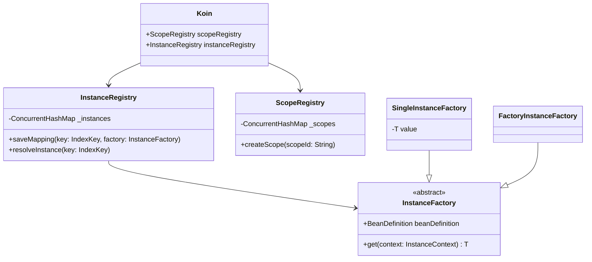
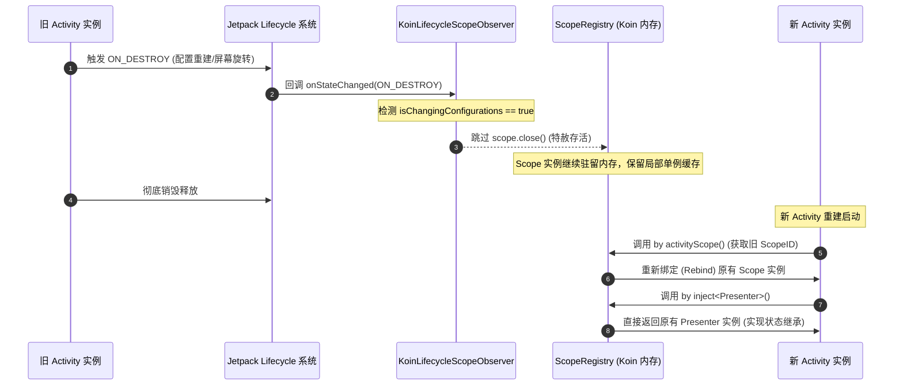
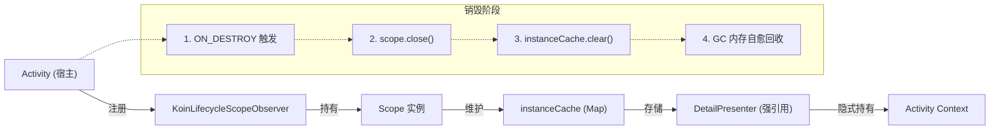

# 5.3.4.3 Koin 运行时依赖检索与自愈绑定机理解密

在 Android 开发与 Kotlin 跨平台（Kotlin Multiplatform, KMP）的生态演进中，依赖注入（Dependency Injection, DI）始终是系统架构设计的核心基石。长久以来，以 Dagger2 和 Hilt 为代表的“编译期静态有向无环图（DAG）生成”流派，凭借极致的运行时零损耗和严苛的编译期静态验证，构筑了 Android 依赖注入的“物理硬防线”。

然而，Dagger2 的编译期硬防线并非毫无代价：臃肿的生成代码、拖慢的编译速度、陡峭的学习曲线以及对 KMP 跨平台原生支持的缺失，让开发体验大打折扣。在这种背景下，Koin 另辟蹊径。它背叛了 Dagger2/Hilt 的“编译期生成”物理硬防线，开创性地采用“运行时依赖检索（Service Locator）与 Kotlin 高阶函数 DSL”的极轻量化设计哲学。

本文将从运行时服务定位范式、核心容器数据结构、`get()` 的泛型实化与动态参数传递物理过程、大型项目的性能退化危害、Android 作用域生命周期自愈绑定，以及与 Dagger2/Hilt 的横向大比拼等维度，对 Koin 进行底层的深度拆解与机理解密。

---

## 1. 运行时服务定位范式与 Kotlin DSL 注入哲学

### 1.1. 从控制反转看 DI 与服务定位器（Service Locator）的物理分水岭

控制反转（Inversion of Control, IoC）是面向对象设计中的一种核心思想，旨在降低模块之间的耦合度。在传统的软件开发中，如果类 A 依赖于类 B，类 A 必须显式地在其内部 `new` 出类 B 的实例。这种方式导致类 A 与类 B 强耦合，违背了开闭原则（Open-Closed Principle）和依赖倒置原则（Dependency Inversion Principle）。

IoC 思想的核心在于：将控制对象生命周期和依赖关系的权力交出去，由外部容器统一管理。在 IoC 的具体落地中，存在两个截然不同的技术派别：

1. **依赖注入（Dependency Injection, DI）**：
   容器主动将依赖项注入到目标对象中。目标对象是被动的，它声明自己需要什么（通常通过构造函数、属性或 setter 方法），但它完全不关心依赖项是如何被创建的，也不需要去寻找依赖项。Dagger2 和 Hilt 就是典型的静态依赖注入框架，它们在编译期算好了所有依赖，并生成具体的赋值代码。
2. **服务定位器（Service Locator, SL）**：
   服务定位器模式提供了一个中央注册表（Registry），它持有了系统所有的服务/依赖定义。当目标对象需要某个依赖项时，目标对象会**主动**向这个中央定位器“发起索要请求”（通常通过调用 `locator.get<Service>()`）。目标对象虽然不需要关心实例是如何生成的，但它必须知道定位器的存在，并且主动调用定位器的检索 API。

**Koin 从底层物理本质上来说，并非严格意义上的“依赖注入（DI）”，而是一个被 Kotlin 语法糖包装后的“运行时服务定位器（Service Locator）”**。

在 Koin 中，我们在代码里频繁调用的 `val api: MyApi by inject()` 或 `val repository: MyRepository = get()`，在编译后的字节码层面，本质上都是在向 Koin 维护的全局上下文（KoinContext）主动发起一次 `get` 检索请求。Koin 巧妙地利用了 Kotlin 的“委托属性（Delegated Properties）”和“高阶函数（High-Order Functions）”，使得这种“主动索要”在语法表现上看起来像极了“声明式注入”，从而消除了传统 Java 服务定位器模式模板代码臃肿、难以测试的弊端。

```mermaid
graph TD
    subgraph ServiceLocator ["服务定位器模式 (Koin 物理本质)"]
        ClientSL["客户端组件 (调用 get<Api>())"]
        SLRegistry["Koin 注册表 (Map)"]
        InstanceSL["目标依赖实例 (API)"]
        ClientSL -->|【主动索要】get()| SLRegistry
        SLRegistry -->|检索并创建| InstanceSL
        InstanceSL -->|回传| ClientSL
    end

    subgraph DependencyInjection ["真实依赖注入 (Dagger2 / Hilt 物理本质)"]
        ClientDI["客户端组件 (拥有 @Inject 标记)"]
        InjectorDI["Dagger2 生成的 Injector/Factory"]
        InstanceDI["目标依赖实例 (API)"]
        InjectorDI -->|【被动接受】将实例 new 并赋值给| ClientDI
        InjectorDI -.->|依赖于| InstanceDI
    end
```

### 1.2. Koin 的物理突破：编译期硬防线 vs 运行时自由度

要理解 Koin 的设计哲学，必须先对比 Dagger2 的技术实现。

Dagger2 是一个基于 Java 注解处理器（APT/KSP）的静态 DI 系统。它在编译期做了一件极其沉重的事情：**构建有向无环图（Directed Acyclic Graph, DAG）并进行拓扑排序（Topological Sort）**。Dagger 会扫描所有的 `@Inject`、`@Provides`、`@Binds` 注解，将每一个依赖关系视为图中的一条有向边。在编译期，Dagger 会验证这个图是否闭环、是否存在循环依赖、是否有某个节点无法被提供（Dependency Missing）。如果校验失败，编译器会立即抛出编译期错误并中断构建。这种做法在编译阶段就消灭了所有因依赖配置错误导致的运行时崩溃，形成了高稳定性的“物理硬防线”。

与此相反，**Koin 彻底背叛并放弃了这道防线**。它没有任何编译期的代码生成，更没有编译期的 DAG 构建与排序。它的注入哲学是：**完全信任开发者，将依赖关系的装配延迟到运行时**。

Koin 的自由度极高：
* **零 APT/KSP 开销**：它不参与编译期扫描，对编译速度几乎是零影响。
* **纯 Kotlin DSL 表达**：利用 Kotlin 的 Lambda 闭包和控制流，使得依赖图的声明可以直接写在 Kotlin 代码块里（`module { ... }`），不需要复杂的注解配置和接口定义。
* **按需实例化（Lazy Instantiation）**：所有依赖都是在第一次被调用 `get()` 时才去动态解析并实例化，而不是像 Dagger 那样在 Component 初始化时就将一整棵依赖树硬编码 `new` 出来。

这种哲学的转变，实际上是在**运行期稳定性**与**开发期灵活度（及编译速度）**之间做出的重新取舍。

### 1.3. 包体积优势与 KMP 跨平台优势的底层逻辑

Koin 的这种“轻量级运行时查找”带来了两个在现代移动端开发中极为诱人的优势：

#### 1. 包体积（DEX 文件大小）的绝对优势
在大型 Android 项目中，Dagger2 编译生成的辅助类数量呈指数级增加。对于每一个被 `@Inject` 修饰的构造函数，Dagger 都会生成一个对应的 `Class_Factory` 类；对于每一个包含成员注入的类，都会生成一个 `Class_MembersInjector` 类；再加上 Component 的实现类，这些生成的类动辄多达数千个。

在 Android 中，每个类及其方法都会占用 DEX 文件的元数据空间。对于一个拥有数千个依赖的大型 App，Dagger 相关的生成代码可能占据 **2MB ~ 5MB** 的体积，并极易导致单 DEX 方法数突破 65536，强迫项目引入 Multidex 分包。

Koin 由于不需要在编译期生成任何辅助类，其对于包体积的贡献**仅仅是其自身核心库 the 体积**（Koin 核心库的 `.aar` 文件解压后，其 DEX 字节码大小通常只有 **100KB ~ 300KB** 左右）。这使得 Koin 在对包体积极其敏感的场景（例如轻量级 App 分发、小程序架构或海外网络环境较差的地区）中拥有决定性的优势。

#### 2. KMP (Kotlin Multiplatform) 的天然契合度
现代移动端架构正在快速向 KMP 迁移。在 KMP 项目中，核心业务逻辑写在 `commonMain` 中，无法依赖任何特定的 Java Runtime (JVM) 平台特性。

Dagger2 和 Hilt 的底层架构是强绑定在 JVM 上的：它们依赖 Java 字节码、APT 工具、Java 反射 API 以及 JVM 的类加载器机制。这导致 Dagger/Hilt 根本无法运行在 iOS、MacOS、Wasm 等非 JVM 平台上。

而 Koin 则是使用**纯 Kotlin 编写**的。它的语法结构（DSL）、内联实化泛型（inline reified）等特性是 Kotlin 语言本身的通用特性。因此，Koin 无需进行任何平台特定的重构，即可无缝运行在 Android、iOS (通过 Kotlin/Native 编译成 Objective-C/Swift 兼容结构)、Compose Multiplatform 桌面端以及 Web 端。Koin 已经成为了 KMP 跨平台开发中事实上的标准依赖检索方案。

---

## 2. 运行时核心数据容器与 get() 反射机理解密

Koin 宣称它“不依赖反射，性能极佳”。然而，作为一个没有任何编译期生成的运行时框架，如果它不依赖传统的 Java 反射，它是如何知道 `MyApi` 的构造函数需要 `MyRepository`？它又是如何把这两个对象关联并实例化出来的？这一节我们将深度揭密 Koin 的底层容器机制与反射机理。

### 2.1. 运行时组件 DSL 语法底座与内存元数据模型

在开始解密底层之前，我们先统一对 Koin DSL 核心语法的认识。Koin 提供了一套极其简洁优雅的 Kotlin DSL，其主要底座函数如下：

* **`module { ... }`**：创建一个 `Module` 实例。这个 Lambda 闭包中会包含该模块下所有的依赖声明，它是 Koin 收集依赖元数据的最初源头。
* **`single { ... }`**：定义一个单例对象（Singleton）。在 Koin 全局生命周期内，该 Lambda 只会在第一次被索要（`get()`）时执行一次，执行后得到的实例会被缓存起来，后续的所有请求都直接返回该缓存实例。
* **`factory { ... }`**：定义一个工厂对象。每次代码调用 `get()` 时，该 Lambda 都会被重新执行一遍，从而返回一个全新创建的实例。
* **`scoped { ... }`**：定义一个作用域单例对象。它只在特定的作用域（Scope）实例被激活时存在，并且在该作用域的生命周期内共享同一个实例。一旦作用域被销毁，该缓存实例也会被丢弃并触发自愈清理。
* **`get()`**：这是 Koin 隐式依赖检索的精髓。当你在 Lambda 内部写下 `single { MyRepository(get()) }` 时，这个 `get()` 会作为运行时的一个“拉取请求”，告诉 Koin 在实例化 `MyRepository` 时，先去容器里把构造函数里需要的参数类型拉取出来并注入进来。

在底层，Koin 将这些声明信息封装为元数据模型，主要是 `BeanDefinition`。

```kotlin
// Koin 核心元数据模型 BeanDefinition 概念抽象
public data class BeanDefinition<T>(
    val scopeQualifier: Qualifier,              // 作用域限定符
    val primaryType: KClass<*>,                 // 核心注册类型
    val qualifier: Qualifier?,                  // 命名限定符
    val definition: Definition<T>,              // 核心创建 Lambda 表达式：(Scope, ParametersHolder) -> T
    val kind: Kind,                             // 生命周期类型 (Single, Factory, Scoped)
    val secondaryTypes: List<KClass<*>>         // 辅助绑定类型 (用于 bind<T> 语法)
)
```

`BeanDefinition` 仅仅是一份“声明蓝图”，它并不负责持有运行时的具体实例。为了执行和持有具体实例，Koin 将其包装为 `InstanceFactory`：

* **`SingleInstanceFactory<T>`**：负责管理全局单例。它内部包含一个私有的 `var value: T?`。在获取对象时，Koin 底层使用双重检查锁（Double-Check Locking）来保证线程安全：
  ```kotlin
  public override fun get(context: InstanceContext): T {
      if (value == null) {
          synchronized(this) {
              if (value == null) {
                  value = create(context) // 执行 BeanDefinition 的 definition 闭包
              }
          }
      }
      return value!!
  }
  ```
* **`FactoryInstanceFactory<T>`**：负责管理工厂实例。其内部不持有任何缓存值，每次调用 `get` 都会直接执行 `create(context)` 以创建全新的实例。
* **`ScopedInstanceFactory<T>`**：类似于单例工厂，但它的生命周期和实例缓存并不是存在全局，而是存在具体的 `Scope` 实例中。

### 2.2. 内存容器 `InstanceRegistry` 剖析与高并发安全设计

在 Koin 框架中，真正的内存容器是 `InstanceRegistry`（早期版本中常称为 `BeanRegistry`）。当我们在 Application 的 `onCreate` 中调用 `startKoin` 时，Koin 就会把所有 `Module` 中的 `BeanDefinition` 加载并转换成 `InstanceFactory` 存入其中。



`InstanceRegistry` 内部的核心容器是一个高并发安全的 `ConcurrentHashMap`，其键值对结构如下：

```kotlin
// 简化后的 Koin 底层核心结构示意
private val _instances = ConcurrentHashMap<IndexKey, InstanceFactory<*>>()
```

其中，键 `IndexKey` 是一个复合标识：

```kotlin
public data class IndexKey(
    val clazz: KClass<*>,          // 对象的 Kotlin Class 类型
    val qualifier: Qualifier?,     // 命名限定符 (如 named("test"))
    val scopeQualifier: Qualifier  // 作用域限定符
)
```

#### 高并发安全设计的底层机制：

1. **高并发读性能（无锁读取）**：
   在 Android 应用的正常运行期间，多线程（如后台协程任务、主线程 UI 渲染）会频繁调用 `get()`。由于 `ConcurrentHashMap` 基于分段锁（Java 8 前）或 Node 节点锁/CAS 机制（Java 8+），在进行 `Map.get(IndexKey)` 操作时是完全不需要获取全局排他锁的。这意味着 Koin 的读取性能在多线程并发场景下能极大地降低线程阻塞和上下文切换的开销。
2. **并发写安全（动态模块加载）**：
   当应用使用 `loadKoinModules()` 动态加载新模块时，Koin 需要向 `_instances` 写入新的 `InstanceFactory`。`ConcurrentHashMap` 保证了即使在多线程并发写入时，也不会产生脏数据，并且写入锁只会局限在具体的哈希槽中。
3. **双重检查锁（Double-Check Locking）的原子实例化**：
   如上文所述，对于单例对象，即使多线程同时对同一个 `SingleInstanceFactory` 调用 `get()`，由于其内部有 `synchronized(this)` 保护，只会有第一个抢占到锁的线程去执行底层的 Lambda 表达式。在 JVM 层面，该机制利用了 volatile 的可见性屏障（最新版 Kotlin 底层实现中对此进行了深度优化），确保了其他等待中的线程在锁释放后能立刻感知到非空值，并直接返回已经建立好的实例，消除了并发初始化带来的状态冲突。

### 2.3. get() 的运行时隐式匹配与 Kotlin Reified 泛型实化物理过程

当我们写下 `val myService: MyService = get()` 时，这一行简洁的代码里隐藏着 Kotlin 编译器和 Koin 运行时最巧妙的配合。

#### 1. 泛型实化（Reified Generics）的物理转换
在 JVM 规范中，泛型是在编译期进行类型擦除（Type Erasure）的。即在运行时，所有泛型参数都会被擦除为 `Object`。这就意味着，如果直接写一个普通函数 `fun <T> get(): T`，在运行时，这个函数内部是绝对不可能通过任何方式获知 `T` 到底是 `MyService` 还是 `MyRepository` 的。

Koin 巧妙地利用了 Kotlin 的 `inline`（内联函数）和 `reified`（实化类型参数）关键字打破了这一物理限制：

```kotlin
// Koin 框架中的 inline get 定义示意
public inline fun <reified T> Scope.get(
    qualifier: Qualifier? = null,
    noinline parameters: ParametersDefinition? = null
): T {
    return get(clazz = T::class, qualifier = qualifier, parameters = parameters)
}
```

当一个函数被声明为 `inline` 时，Kotlin 编译器在编译期会将该函数的调用处**直接展开并替换**为该函数的函数体。当泛型参数被 `reified` 修饰时，编译器会在展开后的代码中，将 `T::class` 替换为**调用处指定的具体类型的 KClass**。

例如，当你在 Activity 中写下：

```kotlin
val api: MyApi = get()
```

经过 Kotlin 编译器的编译，上述代码在字节码层面会被等价替换并展开为：

```kotlin
val api: MyApi = scope.get(clazz = MyApi::class, qualifier = null, parameters = null)
```

通过这一巧妙的转换，Koin 避开了繁琐的参数声明，直接将开发者隐式声明的类型，转换为了具体的 `KClass` 实例传入了运行时。

#### 2. 反射匹配与 Lambda 递归构造调用链拓扑
当 Koin 的 `Scope.get(MyApi::class)` 被触发时，其物理执行流程如下：

1. **组合 IndexKey**：Koin 将传入的 `MyApi::class` 与当前 Scope 的 `scopeQualifier` 结合，构建出检索的复合键 `IndexKey`。
2. **检索 Factory**：以 `IndexKey` 为键，在 `InstanceRegistry` 的 `ConcurrentHashMap` 中进行 `get()` 查找，匹配出对应的 `InstanceFactory`。
3. **调用实例化闭包**：调用 `InstanceFactory.get()`，如果是第一次获取该实例，则开始执行在 `BeanDefinition` 中保存的 Lambda 表达式。
4. **递归下降解析**：如果该 Lambda 表达式是 `single { MyApiImpl(get(), get()) }`，那么在执行该 Lambda 时，会由于内部调用了 `get()` 而再次触发当前 Scope 的 `get()`。
5. **构建依赖树**：Koin 会暂停当前 `MyApiImpl` 的实例化过程，深度优先地向下递归执行 `get()`：
   * 递归调用一：`Scope.get(MyRepo::class)` -> 找到 `MyRepoFactory` 并实例化 `MyRepo` 成功。
   * 递归调用二：`Scope.get(HttpClient::class)` -> 找到 `HttpClientFactory` 并实例化 `HttpClient` 成功。
6. **回溯拼装**：当子依赖全部实例化完毕并返回后，Lambda 闭包将收到的 `MyRepo` 和 `HttpClient` 作为构造参数传入，最后执行 `MyApiImpl(myRepo, httpClient)` 实例化，并将其作为最终结果逐层返回。

以下是 Koin 运行时 `BeanRegistry` 注册与 `get()` 递归实例化执行链的拓扑图：

```mermaid
flowchart TD
    %% 定义样式
    classDef config fill:#E8F0FE,stroke:#4285F4,stroke-width:2px;
    classDef registry fill:#E6F4EA,stroke:#34A853,stroke-width:2px;
    classDef execution fill:#FEF7E0,stroke:#FBBC05,stroke-width:2px;
    classDef recursive fill:#FCE8E6,stroke:#EA4335,stroke-width:2px;

    %% 阶段一：模块注册
    subgraph ConfigPhase ["【1】依赖配置注册阶段 (Application 启动时)"]
        DSL["Module DSL 定义<br/>single { MyPresenter(get()) }<br/>single { MyRepository() }"]
        Parser["Module Parser"]
        Def1["BeanDefinition (MyPresenter)<br/>- KClass: MyPresenter<br/>- Lambda: { MyPresenter(get()) }"]
        Def2["BeanDefinition (MyRepository)<br/>- KClass: MyRepository<br/>- Lambda: { MyRepository() }"]
        
        DSL --> Parser
        Parser --> Def1
        Parser --> Def2
    end

    %% 阶段二：内存容器
    subgraph RegistryPhase ["【2】BeanRegistry 内存容器初始化"]
        Map["ConcurrentHashMap [IndexKey, InstanceFactory]"]
        Factory1["PresenterFactory (SingleInstanceFactory)"]
        Factory2["RepositoryFactory (SingleInstanceFactory)"]
        
        Def1 -->|转化为 Factory| Factory1
        Def2 -->|转化为 Factory| Factory2
        Factory1 -->|注入 Map| Map
        Factory2 -->|注入 Map| Map
    end

    %% 阶段三：解析获取
    subgraph ExecutionPhase ["【3】get() 运行时泛型推导与解析阶段"]
        Call["代码调用:<br/>val presenter: MyPresenter = get()"]
        Inline["inline + reified 泛型实化展开:<br/>scope.get(MyPresenter::class)"]
        Lookup["在 Map 中检索 Key 为<br/>MyPresenter::class 的 Factory"]
        ExecutePresenter["执行 PresenterFactory.get()"]
        ExecuteLambda["执行 Presenter 实例化 Lambda:<br/>MyPresenter( get() )"]
        
        Call -->|编译期内联| Inline
        Inline -->|运行时查找| Lookup
        Lookup -->|成功匹配| ExecutePresenter
        ExecutePresenter -->|若缓存为空| ExecuteLambda
    end

    %% 阶段四：递归解析
    subgraph RecursivePhase ["【4】递归子依赖匹配与回溯装配"]
        SubCall["触发隐式递归:<br/>Scope.get(MyRepository::class)"]
        SubLookup["Map 中检索 Key 为<br/>MyRepository::class"]
        ExecuteRepo["执行 RepositoryFactory.get()"]
        NewRepo["执行 Repository Lambda:<br/>MyRepository()"]
        BuildPresenter["完成子依赖返回:<br/>new MyPresenter(repoInstance)"]
        ReturnInstance["将对象 presenter 返回给调用者"]

        ExecuteLambda -->|遇到 get() 暂停| SubCall
        SubCall --> SubLookup
        SubLookup -->|匹配成功| ExecuteRepo
        ExecuteRepo --> NewRepo
        NewRepo -->|返回 MyRepository 实例| BuildPresenter
        BuildPresenter --> ReturnInstance
    end

    class DSL,Parser,Def1,Def2 config;
    class Map,Factory1,Factory2 registry;
    class Call,Inline,Lookup,ExecutePresenter,ExecuteLambda execution;
    class SubCall,SubLookup,ExecuteRepo,NewRepo,BuildPresenter,ReturnInstance recursive;
```

从上述拓扑图可以看出，Koin 之所以被称为“运行时服务定位器”，是因为它的**整个依赖图的建立和推导，全部依靠运行时的 Map 查询和递归的 Lambda 调用压栈**。

### 2.4. Koin 动态参数传递机制：`parametersOf` 与 `ParametersHolder` 的物理过程

在实际的 Android 开发中，很多类并不是一开始就能完全静态确定的。例如，我们可能需要根据用户点击的商品 ID 来创建 `ProductDetailPresenter`。这就需要我们在调用 `get()` 时动态传入参数。

Koin 提供了如下的 DSL 声明和调用方式：

```kotlin
// 声明含有动态参数的 factory
val myModule = module {
    factory { (id: String) -> ProductDetailPresenter(id = id, api = get()) }
}

// 获取时传入动态参数
val presenter = get<ProductDetailPresenter> { parametersOf("product_12345") }
```

#### 运行时物理传递全流程拆解：

1. **`parametersOf` 的包装**：
   `parametersOf("product_12345")` 在执行时，会将参数保存在一个 `ParametersHolder` 容器对象中。这个对象内部维护了一个 `List<Any?>` 的可变列表，用于存储传入的动态参数。
2. **闭包携带传入**：
   这个 `ParametersHolder` 实例会被包裹进 Koin 的 `InstanceContext`（实例上下文）中，并最终传递给 `InstanceFactory.get(context)`。
3. **递归匹配与解包**：
   在 `InstanceFactory` 中，当它执行我们在 `BeanDefinition` 中保存的实例化闭包 `(Scope, ParametersHolder) -> T` 时，它会把这个 `ParametersHolder` 作为第二个参数喂给这个 Lambda。
4. **Lambda 中的解构声明（Destructuring Declarations）**：
   在 DSL 中的 `(id: String) -> ...`，在 Kotlin 字节码层面会被转换成对 `ParametersHolder` 的解构提取操作：
   ```kotlin
   // 字节码展开后的底层等价逻辑
   factory { params ->
       val id: String = params.get<String>(0) // 提取第 0 个参数并强转为 String
       ProductDetailPresenter(id = id, api = get())
   }
   ```
5. **多层嵌套 `get()` 中的参数漂移隐患**：
   在 Koin 底层，隐式依赖检索使用的是一个公共的上下文。如果你的 `ProductDetailPresenter` 依赖了另一个类 `ProductImageLoader`，且这个 `ProductImageLoader` 的创建也声明了需要动态参数，但在 `ProductDetailPresenter` 的创建闭包中调用 `get()` 时**没有向下传递 parameters**：
   ```kotlin
   // 错误示例
   factory { (id: String) -> ProductDetailPresenter(id = id, loader = get()) } // get() 没有传参！
   ```
   此时，Koin 的递归 `get()` 运行时会尝试在全局上下文的参数栈中继续读取参数。如果当前作用域中仍有残存的 `ParametersHolder`，那么 Koin 会错误地把原本属于 `Presenter` 的 `id` 注入到 `ProductImageLoader` 中。由于类型可能不匹配，这会瞬间抛出 `ClassCastException`，或者更隐蔽地导致业务逻辑参数错乱，这就是“动态参数漂移溢出”的典型物理隐患。

### 2.5. 带泛型参数的依赖注入痛点与 Koin 的 `typeOf` / `KType` 破局机制

由于 Java 虚拟机（JVM）底层的泛型擦除机制，当我们在 Koin 中尝试注册同一个接口的多个不同泛型实化版本时，会遇到严峻的键冲突挑战。

#### 1. 泛型覆盖与冲突痛点
假设我们定义了如下的泛型数据访问层接口：

```kotlin
interface Repository<T>
class UserRepository : Repository<User>
class OrderRepository : Repository<Order>

// 依赖配置声明
val myModule = module {
    single<Repository<User>> { UserRepository() }
    single<Repository<Order>> { OrderRepository() }
}
```

当我们尝试调用 `val userRepo = get<Repository<User>>()` 时，基于 `inline + reified` 的编译展开，Kotlin 编译器最终只能提取出最外层的 Class 类型（即 `Repository::class`）。在运行时，`reified` 无法保存 `User` 和 `Order` 这两个泛型类型参数。

此时，在 `InstanceRegistry` 内部的 `ConcurrentHashMap` 中，Koin 用来代表 `Repository<User>` and `Repository<Order>` 的 `IndexKey` 中的 `clazz` 字段**全部等于 `Repository::class`**。

其后果是：**后注册的 `Repository<Order>` 在 Map 中会直接覆盖先注册的 `Repository<User>`**。当代码尝试获取 `Repository<User>` 时，Koin 会匹配到 `OrderRepository` 并返回。在强转为 `Repository<User>` 时，JVM 会瞬间抛出 `ClassCastException` 导致 App 崩溃。

#### 2. Koin 的破局方案：从限定符到 TypeOf 泛型指纹保留
为了解决这一物理障碍，Koin 在演进中提供了两种解决方案：

* **方案 A：引入命名限定符（Qualifier）**
  这是最简单也最原始的方法。通过为相同擦除类型的依赖声明不同的 String ID：
  ```kotlin
  val myModule = module {
      single<Repository<User>>(named("user")) { UserRepository() }
      single<Repository<Order>>(named("order")) { OrderRepository() }
  }
  
  // 注入时
  val userRepo = get<Repository<User>>(named("user"))
  ```
  该方案的本质是让这两个依赖的 `IndexKey` 内部的 `qualifier` 字段拥有不同的 Hash 值，从而在 `ConcurrentHashMap` 中分流到不同的哈希槽中。但这种做法增加了代码硬编码的风险，破坏了纯类型匹配的无感和安全优势。
  
* **方案 B：基于 `typeOf()` 与 KType 泛型指纹哈希（现代 Koin）**
  为了实现真正的泛型强类型匹配，在现代的 Koin 3.x 版本中，框架引入了 Kotlin 的 `KType` 支持。利用 Kotlin 编译器提供的内联编译器黑魔法 `typeOf<T>()`：
  ```kotlin
  // Koin 底层获取完整 KType 签名
  public inline fun <reified T> Scope.get(
      qualifier: Qualifier? = null,
      noinline parameters: ParametersDefinition? = null
  ): T {
      val kType = typeOf<T>() // 获取编译期完整保留的 KType 签名，包含泛型信息
      return get(kType = kType, qualifier = qualifier, parameters = parameters)
  }
  ```
  与 `T::class` 不同，`typeOf<T>()` 在编译期不仅会捕获最外层的 Class，还会将泛型参数 `User`、`Order` 以完整的符号树结构（`com.example.Repository<com.example.User>`）编译进调用处。
  
  在运行时，Koin 的 `IndexKey` 接收到这个 `kType`，并在内部为泛型特征分配一个“类型特征哈希指纹”。因此，`Repository<User>` 的 Key 和 `Repository<Order>` 的 Key 变得截然不同。Koin 彻底在运行时消灭了泛型擦除所带来的类型冲突。

### 2.6. 大型项目下的性能退化危害与三大稳定性痛点

虽然 Koin 在中小型项目或 KMP 跨平台项目中表现得极为灵巧，但在**大型 Android 商业项目**（拥有数百个 Module、数千个依赖项、复杂的嵌套作用域）中，Koin 会暴露出由于运行时查找导致的性能瓶颈与稳定性隐患。

#### 1. 主线程冷启动卡顿（Cold Start Delay）
在 App 启动时，我们必须在 Application 的 `onCreate` 中调用 `startKoin { modules(...) }`。在大型项目中，这可能涉及到加载数十甚至上百个模块文件。

虽然 `startKoin` 默认不会实例化对象，但它需要遍历所有的 Module DSL，将里面的每一个定义解析并生成对应的 `BeanDefinition` 和 `InstanceFactory` 实例，最后将它们一个一个 `put` 进 `ConcurrentHashMap` 中。对于拥有几百上千个依赖的大型应用，由于 ConcurrentHashMap 频繁的锁竞争、冲突扩容检测，以及大量的类装载（Class Loading）和 JVM 对象内存分配，整个 `startKoin` 过程会直接消耗 **50ms ~ 300ms** 的 CPU 时间。这对于对启动时间（TTID/TTFD）要求苛刻的 App 来说，是主线程冷启动延迟的“性能刺客”。

若在 `single(createdAtStart = true)` 中开启了预加载，Koin 会在 `startKoin` 执行结束前，强行在主线程中触发这些对象的递归 `get()` 查找和实例化。这对冷启动性能来说是雪上加霜，极其容易造成 App 启动 ANR。

#### 2. 运行时递归查找与反射的开销激增
与 Dagger2 的静态生成类（直接调用 `new`）不同，Koin 的每一次 `get()` 都意味着一次 Map 查找和至少一次 Kotlin Lambda 的调用。

在大型项目中，依赖树的深度可能非常深。例如 `Activity -> Presenter -> UseCase -> Coordinator -> Repository -> Dao -> SqliteOpenHelper`。当顶层发起一次 `get()` 请求时，会伴随着连续多次的 Map 检索和多层递归的 Lambda 压栈。在 Android JVM 环境下，频繁的 Lambda 匿名对象实例化和方法栈深度的增加，会显著增加主线程在冷启动和页面跳转时的 CPU 耗时与内存抖动，可能导致 UI 掉帧卡顿。

#### 3. 缺乏“编译期验证”导致的运行时 Crash 噩梦
这是大型团队协作开发中最致命的稳定性隐患。在 Dagger2/Hilt 中，如果你在重构中删除了某个 Repository 的提供者，或者在构造函数中增加了一个尚未注入的参数，项目直接在**编译阶段报错**，根本无法生成 APK，绝对安全。

然而在 Koin 中，同样的错误不会有任何编译期提示。你能够顺利编译出 APK 并上线。直到用户在生产环境中，点击进入了某个二级页面，该页面触发了 `by inject<MyComponent>()`，而此时 Koin 运行时在 `ConcurrentHashMap` 中找不到对应的 `IndexKey`。

此时，系统会立刻抛出如下崩溃：

```text
org.koin.core.error.NoBeanDefFoundException: No definition found for class 'com.example.MyComponent'
```

这种“运行时 Crash 炸弹”在大型多人协作的项目中极易发生，且难以通过自动化测试完整覆盖。虽然 Koin 提供了 `checkModules()` 的测试框架，但其本质是在单元测试中跑一遍 JVM 虚拟启动并尝试实例化所有的 Bean，这在面对复杂的动态作用域（Scope）、依赖于 Context 运行时传入的参数、以及 Android 动态加载的 Plugin/Feature 模块时，往往无能为力。

---

## 3. Koin 作用域（Scope）与 Android 组件自愈绑定

为了解决全局单例（Single）生命周期过长导致内存常驻，以及工厂（Factory）频繁创建对象导致内存抖动的问题，Koin 引入了作用域（Scope）的概念。在 Android 开发中，Koin 专门针对 Activity/Fragment 的生命周期设计了一套“生命周期自愈绑定与自愈销毁”的闭环机制。

### 3.1. 作用域（Scope）的设计初衷与生命周期隔离

在软件设计中，一个作用域（Scope）代表着一个受控的生命周期段：
* **全局单例（Single）**：生命周期等同于 `KoinApplication` 的生命周期，通常与 Application 进程同生共死。
* **工厂模式（Factory）**：没有生命周期概念，每次请求，生命周期即用即走。
* **作用域单例（Scoped）**：它的生命周期绑定在某个 Scope 实例上。例如，在一个结账流程中，我们希望在“购物车 -> 填地址 -> 支付”的多个页面间共享同一个 `CheckoutSessionData` 实例。这个实例不应该是一个全局单例（结账完就得销毁），也不应该是 factory（每个页面都新建会丢失数据）。我们需要创建一个 `CheckoutScope`，让该数据在此作用域内共享，结账完成后主动关闭该 Scope。

### 3.2. Android 扩展库中 by activityScope() 的底层绑定机制

在 Android 开发中，Activity 和 Fragment 是天然的生命周期容器。如果能将 Koin 的 Scope 直接与 Activity/Fragment 的生命周期绑定，就能在 Activity 存活时提供“局部单例”的对象（如 Presenter、ViewModel），并在 Activity 销毁时彻底释放它们。

Koin 的 Android 扩展库通过引入 `AndroidScopeComponent` 接口和 `LifecycleOwner` 的扩展函数实现了这一绑定。

```kotlin
class DetailActivity : AppCompatActivity(), AndroidScopeComponent {
    // 1. 通过属性代理创建/获取与当前 Activity 生命绑定的 Koin Scope 实例
    override val scope: Scope by activityScope()
    
    // 2. 在当前绑定的作用域中，注入局部单例 DetailPresenter
    private val presenter: DetailPresenter by inject()
    
    override fun onCreate(savedInstanceState: Bundle?) {
        super.onCreate(savedInstanceState)
        setContentView(R.layout.activity_detail)
        presenter.doSomething()
    }
}
```

#### 物理装配与绑定链条：
1. `activityScope()` 属性代理在第一次被访问时，会触发对当前 Activity 实例的初始化工作。
2. 它会通过当前 Activity 的 `KClass` 产生一个 `ScopeQualifier`，并以该 Activity 实例的唯一标识（通常是 Activity 内存地址 of Hash 串或自定义标识）为 `ScopeID`。
3. 调用 Koin 底层的 `ScopeRegistry` 去创建或检索这个 Scope 实例。
4. **关键一步**：在创建 `Scope` 后，Koin 内部会获取该 Activity 的 `lifecycle` 对象，并注册一个专用的生命周期观察者 `KoinLifecycleScopeObserver`：

```kotlin
// Koin 内部底层生命周期监听器核心逻辑示意
public class KoinLifecycleScopeObserver(
    private val scope: Scope,
    private val activity: ComponentActivity
) : LifecycleEventObserver {
    override fun onStateChanged(source: LifecycleOwner, event: Lifecycle.Event) {
        if (event == Lifecycle.Event.ON_DESTROY) {
            // 当且仅当 Activity 发生真正的销毁 (非旋转屏幕) 时，自动释放 Scope
            if (!activity.isChangingConfigurations) {
                scope.close() // 核心释放入口
            }
        }
    }
}
```

### 3.3. Configuration Changes 与 Activity 重建的生命复用闭环

当 Android 设备进行屏幕旋转、系统语言切换或暗黑模式切换时，系统会触发 Configuration Changes，导致当前 Activity 实例被物理销毁并瞬间重建。

如果按照普通的自愈逻辑，Activity 销毁时必须调用 `scope.close()` 释放对象。然而，如果旧的 Activity 仅仅是在经历配置重建，我们希望旧的 Scope 中的局部单例（如业务 Presenter、缓存的数据）**能够存活下来并无缝继承给新的 Activity 实例**，以此避免不必要的网络请求和内存抖动。

Koin 巧妙地在底层的生命周期监测中实现了这一“复用闭环”：

1. **重建销毁判断**：
   当旧 Activity 触发 `onDestroy()` 时，系统的生命周期框架回调 `KoinLifecycleScopeObserver` 的 `ON_DESTROY` 事件。Koin 不会急于关闭 Scope，而是首先进行状态判定：
   ```kotlin
   val isChangingConfigs = (hostActivity as? ComponentActivity)?.isChangingConfigurations ?: false
   if (!isChangingConfigs) {
       // 确定是彻底物理销毁，调用 scope.close() 清除所有依赖缓存
       scope.close()
   } else {
       // 仅仅是屏幕旋转引起的配置改变重建，特赦 scope，跳过 close 流程！
       // 此时旧的 Scope 实例仍然安全地驻留在 Koin 全局的 ScopeRegistry 中
   }
   ```
2. **新 Activity 实例的重连绑定（Rebind）**：
   当几毫秒后新的 Activity 实例被系统实例化并走到 `onCreate` 时，新 Activity 会再次请求 `by activityScope()`。
   Koin 会利用新 Activity 传入的逻辑特征（在重建期间通过宿主 ViewModel 或 SavedState 保存的 Scope 标识）从 `ScopeRegistry` 中检索之前存活下来的那个 Scope 实例。
   如果检索成功，Koin 将重新将该 Scope 绑定 to 新的 Activity 生命周期上，并将新 Activity 注册为该 Scope 内部的最新 LifecycleOwner 监听器。
3. **状态无感继承**：
   对于新 Activity 来说，它在调用 `by inject()` 时获取到的 `DetailPresenter`，实际上是刚才旧 Activity 留下的同一个 Presenter 实例，从而完美保留了之前的成员变量和交互状态，避免了页面的状态丢失与性能损耗。这套针对 Activity 重建的“特赦复用与动态重连”机制，是 Koin 自愈绑定的深水区。



### 3.4. 多 Feature 模块下的动态装配与卸载物理全流程

在大型 Android 模块化架构（或按需下发 Dynamic Features 的 App Bundle）中，为了最大化控制内存开销，我们不能在 Application 启动时就将所有的业务依赖载入内存。Koin 提供了高度灵活的动态模块装载与卸载 API。

#### 1. 动态装配（`loadKoinModules`）
当用户进入某个动态下发的业务模块（如“直播间模块”或“游戏模块”）时，在对应的 EntryActivity 的 `onCreate` 或动态模块的入口类初始化时，调用：

```kotlin
loadKoinModules(listOf(liveRoomModule))
```

**物理装配过程**：
1. Koin 获取全局的 `InstanceRegistry` 互斥读写锁，防止其他协程并发读取依赖导致脏读。
2. 遍历 `liveRoomModule` 中声明的所有 `BeanDefinition`。
3. 针对每一个定义，生成对应的 `InstanceFactory`，并以其 `IndexKey` 插入到 `InstanceRegistry` 的全局 `ConcurrentHashMap` 中。
4. 解锁并通知对应的 Scope，新装配的依赖已准备就绪，允许外部通过 `get()` 发起检索。

#### 2. 动态卸载（`unloadKoinModules`）
当用户彻底离开该业务模块，或者该模块的功能被临时停用时，开发者需要调用：

```kotlin
unloadKoinModules(listOf(liveRoomModule))
```

**物理卸载过程**：
1. Koin 再次加锁，遍历 `liveRoomModule` 的定义集合。
2. 在 `ConcurrentHashMap` 中，根据定义的类型与限定符匹配出对应的 `InstanceFactory` 键并直接执行 `remove()` 移除操作。
3. **内存清理与 onClose 回调**：如果被移除的 `InstanceFactory` 内部已经实例化了单例对象，且该对象声明了销毁回调（如实现了 `Closeable` 接口或指定了 `onClose { ... }` 闭包），Koin 会调用其销毁函数，彻底斩断强引用并执行文件/资源的关闭释放。
4. 依赖项元数据与实例缓存被彻底清空，堆内存空间被释放，等待 JVM 下一次 GC。

#### 3. 并发锁竞争与运行时隐患
动态装配卸载是一个非常底层的物理变动。如果在一个后台协程正通过 `get()` 递归检索某个直播间依赖的瞬间，主线程强行执行了 `unloadKoinModules` 删除了该依赖的 Factory，协程将会因为检索失败瞬间抛出 `NoBeanDefFoundException` 导致崩溃。因此，**在工程实践中，必须严格保证动态模块的装卸发生在该模块所有异步任务（协程、线程池）都彻底终结的生命周期安全边界之内**。

### 3.5. 自动内存回收与防泄漏闭环物理全流程

如果一个生命周期受限的组件（如 Activity）持有的 Scope 实例在组件销毁后没有被及时关闭，那么在 `ScopeRegistry` 中该 Scope 内部的 Map 缓存将一直强引用着那些局部单例对象（包括它们可能隐式持有的 Activity 实例 Context）。这会直接导致严重的内存泄漏。

为了实现内存自愈，Koin 内部依靠 Lifecycle 实现了自动内存回收闭环：



其完整的回收闭环物理步骤如下：
1. **Activity 物理销毁**：用户点击返回键关闭 Activity，或者系统触发内存回收物理销毁。
2. **生命周期观察者捕获**：Activity Lifecycle 发射 `ON_DESTROY` 信号，被注册的 `KoinLifecycleScopeObserver` 捕获。
3. **安全边界检测**：检测到当前并非重建过程（`isChangingConfigurations == false`），确认是彻底的物理销毁。
4. **触发 Scope 关闭**：调用 `scope.close()`：
   * **子对象销毁通知**：Koin 遍历作用域内部所有缓存的实例，如果实例声明了 `onClose` 逻辑或实现了 `Closeable` 接口，Koin 会触发其对应的销毁通知。
   * **清空缓存 Map**：调用 `instanceCache.clear()`，清空作用域中所有局部单例实例的强引用键值对。
   * **注销注册表**：调用 `scopeRegistry.unregisterScope(scope)`，将当前整个 `Scope` 对象从 Koin 全局注册表容器中彻底剔除。
5. **GC 回收**：在上述步骤完成后，所有局部单例（包括 `DetailPresenter`）已失去全局的 GC Root 引用。在系统下一次触发 Garbage Collection（GC）时，这些对象连同它们所引用的 Activity Context 将被完整回收，完美实现了防泄漏自愈闭环。

### 3.6. 源码分析与自定义 Scope 绑定示例

为了让大家更清晰地理解这一过程，下面提供一段**自定义 Android 作用域自愈绑定与自愈销毁**的精炼核心 Kotlin 源码。代码展示了 Koin 底层是如何注册生命周期监听，并在 `onDestroy()` 自动关闭 Scope 释放内存的原理。

```kotlin
package com.example.koin.scope

import androidx.lifecycle.Lifecycle
import androidx.lifecycle.LifecycleEventObserver
import androidx.lifecycle.LifecycleOwner
import java.util.concurrent.ConcurrentHashMap

/**
 * 模拟 Koin 中的作用域定义元数据
 */
public data class ScopeDefinition(
    val scopeQualifier: String,
    val beanDefinitions: MutableList<BeanDefinition<*>> = mutableListOf()
)

/**
 * 模拟 Koin 对象的定义结构
 */
public data class BeanDefinition<T>(
    val type: Class<T>,
    val creationLambda: (scope: CustomScope) -> T
)

/**
 * 模拟 Koin 中的 Scope 实例
 * 每一个 Scope 实例都有自己的作用域缓存 Map
 */
public class CustomScope(
    val id: String,
    val definition: ScopeDefinition,
    private val scopeRegistry: CustomScopeRegistry
) {
    // 存储在该 Scope 内部已经实例化的局部单例对象缓存
    private val instanceCache = ConcurrentHashMap<Class<*>, Any>()

    /**
     * 在当前 Scope 中获取/检索依赖对象
     */
    @Suppress("UNCHECKED_CAST")
    public fun <T : Any> get(type: Class<T>): T {
        // Double-Check Locking 保证在该 Scope 范围内此类型的实例是单例的
        return instanceCache.getOrPut(type) {
            val beanDef = definition.beanDefinitions.firstOrNull { it.type == type }
                ?: throw IllegalArgumentException("No definition found for type: ${type.name} in scope $id")
            
            // 执行 lambda 实例化对象，并传入当前的 Scope 供其递归解析子依赖
            beanDef.creationLambda(this)
        } as T
    }

    /**
     * 关闭作用域：核心自愈方法，切断强引用链
     */
    public fun close() {
        println("[Koin CustomScope] Scope '$id' is closing. Clearing cache...")
        // 1. 清空当前缓存的所有实例引用，释放 JVM 强引用链
        instanceCache.clear()
        
        // 2. 从全局注册表中卸载自己，防止被 Koin 容器强引用
        scopeRegistry.unregisterScope(this)
    }
}

/**
 * 模拟全局 Scope 注册中心
 */
public class CustomScopeRegistry {
    private val activeScopes = ConcurrentHashMap<String, CustomScope>()

    public fun registerScope(scope: CustomScope) {
        activeScopes[scope.id] = scope
    }

    public fun unregisterScope(scope: CustomScope) {
        activeScopes.remove(scope.id)
    }
    
    public fun getScopeById(id: String): CustomScope? = activeScopes[id]
}

/**
 * 关键点：生命周期绑定观察者
 * 模拟 Koin Android 扩展库中实现自愈绑定的物理机制
 */
public class CustomKoinLifecycleObserver(
    private val scope: CustomScope,
    private val hostActivity: LifecycleOwner
) : LifecycleEventObserver {

    override fun onStateChanged(source: LifecycleOwner, event: Lifecycle.Event) {
        if (event == Lifecycle.Event.ON_DESTROY) {
            println("[Koin LifecycleObserver] Activity ON_DESTROY event detected.")
            
            // 在 Android 真实环境中，需要判断是否是因为屏幕旋转等配置改变引起的销毁重建
            // 如果 isChangingConfigurations == true，说明 Activity 即将被重建，不应该 close 作用域
            val isChangingConfigs = if (hostActivity is androidx.activity.ComponentActivity) {
                hostActivity.isChangingConfigurations
            } else {
                false
            }

            if (!isChangingConfigs) {
                // 确定是彻底销毁，执行 Scope 关闭自愈，防止内存泄露
                scope.close()
            } else {
                println("[Koin LifecycleObserver] Host is changing configuration. Keep scope alive.")
            }
            
            // 移除监听器，断开与 Activity Lifecycle 的关联，避免 Observer 泄露
            source.lifecycle.removeObserver(this)
        }
    }
}

/**
 * Android 组件扩展类：模拟 Koin Android 扩展中的 activityScope 属性代理
 */
public object KoinAndroidScopeExtensions {

    private val testRegistry = CustomScopeRegistry()
    private val activityScopeDef = ScopeDefinition(
        scopeQualifier = "ActivityScope",
        beanDefinitions = mutableListOf(
            BeanDefinition(DetailPresenter::class.java) { scope ->
                // 实例化时，如果需要子依赖，递归调用 scope.get()
                DetailPresenter(scope.get(DetailRepository::class.java))
            },
            BeanDefinition(DetailRepository::class.java) {
                DetailRepository()
            }
        )
    )

    /**
     * 为 Activity 创建绑定的 Scope
     */
    public fun bindActivityScope(activity: LifecycleOwner): CustomScope {
        val scopeId = "${activity.javaClass.simpleName}_${activity.hashCode()}"
        
        val newScope = CustomScope(
            id = scopeId,
            definition = activityScopeDef,
            scopeRegistry = testRegistry
        )
        
        // 注册到全局活动作用域表
        testRegistry.registerScope(newScope)
        
        // 注入 LifecycleObserver，启动生命周期自愈绑定监听
        activity.lifecycle.addObserver(CustomKoinLifecycleObserver(newScope, activity))
        
        return newScope
    }
}

// =================== 业务实体声明 ===================

public class DetailRepository {
    init {
        println("[DetailRepository] Created.")
    }
}

public class DetailPresenter(public val repository: DetailRepository) {
    init {
        println("[DetailPresenter] Created with repository.")
    }
    
    public fun doBusiness() {
        println("[DetailPresenter] Performing business logic...")
    }
}
```

#### 对上述核心逻辑的逐层深入剖析：

1. **DCL 线程安全单例创建**：在 `CustomScope.get()` 中，通过 `ConcurrentHashMap` 的 `getOrPut` 方法（底层等价于线程安全的获取或写入）来保证在一个 Scope 实例的作用范围内，每个依赖类型（如 `DetailPresenter`）的实例都只会被创建一次，成为“局部单例”。
2. **Lambda 闭包持有**：在 `BeanDefinition` 中，`creationLambda` 保存了开发者定义的构造关系。当调用 `creationLambda(this)` 时，由于传入了 `this`（当前 `CustomScope` 实例），Lambda 内部如果嵌套调用了 `get()`，它依然会在这个特定的 `Scope` 的缓存 Map 中检索子依赖（如 `DetailRepository`）。这巧妙地实现了整个子依赖树生命周期的绝对一致性，即所有被引用的子组件都被限制在同一个 Scope 内部。
3. **销毁时机精确判定**：在 `CustomKoinLifecycleObserver` 中，通过检查 `isChangingConfigurations` 避免了在屏幕旋转、语言切换等配置改变引起的销毁重建。因为这种情况下 Activity 很快就会被重新创建。如果不执行 `close()`，可以使当前 `Scope` 的缓存和状态重连（Rebind）到重建后的新 Activity 实例上，避免状态丢失。
4. **内存卸载闭环**：当 `Lifecycle.Event.ON_DESTROY` 触发且没有配置改变时，执行 `scope.close()`。在 `close()` 内执行 `instanceCache.clear()`。此举会将 Map 中所有的键值对（`Class -> Any`）全部清空。此时原本强引用着 `DetailPresenter` 和 `DetailRepository` 的缓存链被彻底切断，它们在 GC Root 链中变成不可达，JVM 就可以在下一次 GC 时安全、完整地将它们进行物理销毁，彻底防范内存泄露。

---

## 4. 依赖注入三杰大比拼（Dagger2 vs Hilt vs Koin）

在 Android 的工程实践中，Dagger2、Hilt、Koin 堪称依赖注入领域的三驾马车。为了让架构选型更加直观、严谨，本节将通过一份多维度的横向对比表和一份架构设计决策分支树，理清它们的边界与取舍。

### 4.1. 核心维度技术特性的深度对比表格

以下是对这三大框架在核心技术特征上的全面对比：

| 对比维度 | Dagger2 | Hilt | Koin |
| :--- | :--- | :--- | :--- |
| **实现机制的物理本质** | 编译期注解处理器生成静态赋值代码 (真正的 DI) | 编译期代码生成 + 字节码插桩 (封装 Dagger2) | 运行时依赖检索与反射匹配的 Service Locator 模式 |
| **依赖校验时机** | **编译期强校验** (依赖缺失/环依赖导致编译失败) | **编译期强校验** (继承自 Dagger2 的编译校验) | **运行时校验** (缺依赖在运行时抛 NoBeanDefFoundException) |
| **包体积影响 (DEX)** | **大**。生成大量的 Factory、Injector、Component 类 | **大**。在 Dagger2 基础上增加了额外的绑定及生命周期管理类 | **极小**。仅增加几十KB到上百KB的核心库体积 |
| **编译速度影响** | **较大**。APT/KSP 编译期间扫描注解并构建有向图 | **较大**。除了 Dagger 的生成外，增加了额外的 Hilt 预处理步骤 | **无影响**。零生成代码，不参与任何编译期逻辑 |
| **运行时性能 (CPU)** | **极致**。零运行时查找，直接实例化 (等同于手写new) | **极致**。同 Dagger2，运行时直接通过生成类赋值 | **有损耗**。存在 ConcurrentHashMap 查询与 Lambda 递归压栈 |
| **运行时内存损耗** | **零/微小**。不需要维护反射元数据和创建定义闭包 | **零/微小**。仅增加少量生命周期组件容器开销 | **较高**。需长期在 JVM 堆内存维护大量 Lambda 闭包及反射 KClass |
| **KMP 跨平台支持** | **不支持**。深度依赖 Java APT/KSP 及 JVM 字节码 | **不支持**。专为 Android 打造，强绑定 Android Component | **原生支持 (KMP)**。纯 Kotlin 编写，兼容 iOS/Native/JS 等 |
| **生命周期感知与绑定** | **较难**。需要开发者手动通过 Subcomponent 或 Scope 隔离 | **极简**。预定义 Android 组件 Lifecycle 注解，直接自愈绑定 | **简单**。通过 Android 扩展库中 Lifecycle 观察者自动自愈绑定 |
| **上手门槛与学习曲线** | **极高**。需理解 Component、Module、Scope、Subcomponent 关系 | **中等**。简化了 Component 概念，但仍需理解 Dagger 底层机制 | **极低**。用 Kotlin DSL 随写随用，符合直觉，上手最快 |
| **安全稳定性** | **极高**。只要能成功编译出包，绝不会因为依赖配置问题 Crash | **极高**。同 Dagger2，拥有极高的线上防 Crash 保障 | **较低**。过度依赖开发者的规范和运行期单元测试校验 |

### 4.2. 架构设计决策分支树与方案选型指南

在实际的 Android 工程架构选型中，没有绝对的好坏，只有针对当前业务场景、团队研发实力以及技术愿景的最优取舍。

如果你正在负责一个项目，可以按照如下的**架构选型决策分支树**进行研判：

```mermaid
flowchart TD
    %% 样式定义
    classDef start fill:#E8F0FE,stroke:#4285F4,stroke-width:2px;
    classDef decision fill:#FEF7E0,stroke:#FBBC05,stroke-width:2px;
    classDef result1 fill:#E6F4EA,stroke:#34A853,stroke-width:2px;
    classDef result2 fill:#FCE8E6,stroke:#EA4335,stroke-width:2px;

    StartNode["开始项目架构 DI 选型"]
    
    IsKMP{"是否需要支持 KMP<br/>跨平台业务逻辑共享?"}
    
    TeamScale{"团队规模与业务体量如何?"}
    
    PerfReq{"对冷启动性能、包体积、<br/>编译速度哪一项最敏感?"}
    
    KoinChoice1["采用 Koin<br/>(唯一原生的 KMP 依赖检索支持)"]
    KoinChoice2["采用 Koin<br/>(无 APT 编译负担，轻量级包体积)"]
    
    HiltChoice["采用 Hilt<br/>(Google 官方标准, 极致运行时性能)"]
    
    CrashTolerance{"对运行时 NoBeanDefFoundException<br/>崩溃零容忍 (如金融/医疗/大厂核心)?"}
    
    DaggerChoice["选择 Dagger2<br/>(极高自由度与性能, 适合超大型复杂项目)"]

    %% 连接线
    StartNode --> IsKMP
    
    IsKMP -->|是| KoinChoice1
    IsKMP -->|否| TeamScale
    
    TeamScale -->|中小型项目 / 快速迭代| PerfReq
    TeamScale -->|大型/超大型项目 / 团队多人协同| CrashTolerance
    
    PerfReq -->|对编译速度/包体积敏感| KoinChoice2
    PerfReq -->|对运行时稳定性/性能敏感| HiltChoice
    
    CrashTolerance -->|是 (必须编译期强校验)| HiltChoice
    CrashTolerance -->|否 (可接受单元测试 checkModules 覆盖)| KoinChoice2
    
    %% 多维度特例分支
    HiltChoice -->|多平台定制组件注入 &<br/>需要极复杂的容器层级关系| DaggerChoice

    %% 样式分配
    class StartNode start;
    class IsKMP,TeamScale,PerfReq,CrashTolerance decision;
    class KoinChoice1,KoinChoice2 result1;
    class HiltChoice,DaggerChoice result2;
```

#### 选型落地指导细则：

1. **选择 Koin 的场景**：
   * **Kotlin Multiplatform (KMP)** 项目：Koin 是当前在公共代码（`commonMain`）中实现依赖项装配和查找的最佳选择。
   * **中小型快速迭代项目**：团队不需要为复杂的依赖关系花费大量时间配置，Koin 极低的上手难度能极大提高开发速度。
   * **极度看重编译速度与包体积**：如果团队深受 KAPT 带来的编译耗时折磨，或者项目是一个对包体积限制严苛的 “App Clip/Instant App”，Koin 无疑是首选。
   * **非主线程高频实例化场景**：如果项目的大多数依赖是在非关键链路上惰性加载的，Koin 的 Map 查找和反射开销完全是可以接受的。
2. **选择 Hilt / Dagger2 的场景**：
   * **大型/巨型多人协作商业项目**：这是 Dagger 和 Hilt 的绝对领地。数百个团队成员在不同 Module 下频繁重构，必须通过编译期强校验（Dagger DAG 编译报错）来堵死一切依赖缺失的崩溃，保障线上稳定性。
   * **对启动性能（Cold Start）有着严苛要求的 App**：Hilt/Dagger 在编译期就生成了直接实例化的 Java 代码，运行时没有任何动态查找和元数据解析过程。对象实例化直接通过 `new` 完成，对主线程冷启动的 CPU 和内存占用几乎为零损耗。
   * **标准的纯 Android 系统架构**：Hilt 作为 Google 官方的方案，与 Jetpack 库（如 Compose Navigation, ViewModel, WorkManager 等）深度契合，能够通过一行注解直接完成 ViewModel 的自动注入。如果项目不需要跨平台，Hilt 是目前最稳妥、最主流的架构标准。

---

## 5. 极致优化：Koin KSP 编译器编译期预验证与反射消除

虽然 Koin 的纯运行时设计带来了极大的开发自由度，但也留下了“启动卡顿”、“易崩溃”的隐患。为了攻克这一瓶颈，Koin 官方及社区在近年推出了 **`koin-annotations`** 与 **`koin-ksp-compiler`**。

这一演进从底层将 Koin 从纯粹的“运行时服务定位”推向了“编译期预处理”的混血架构，实现了性能与安全性的跨越式提升。

### 5.1. 编译期预校验与代码生成的物理机制

在引入了 `koin-ksp-compiler` 后，开发者不再需要手动编写 `module { single { ... } }` 等 DSL 代码，而是使用类似 Hilt 的注解来标记依赖：

```kotlin
@Single
class DetailRepository

@Single
class DetailPresenter(val repository: DetailRepository)

@Module
@ComponentScan("com.example.business")
class BusinessModule
```

**KSP 编译期的物理操作**：
1. **符号扫描**：在 Gradle 编译期间，KSP 处理器会扫描所有被 `@Single`、`@Factory`、`@Scope` 标记的 Kotlin 符号（KSP ClassSymbols）。
2. **依赖图树构建与验证**：KSP 编译器在内存中模拟拼装这些类的构造函数依赖树。如果发现 `DetailPresenter` 依赖了某个未被注解标记的类（如 `MissingRepository`），KSP 编译器会在编译阶段**直接报错**，阻断 Gradle 的编译过程。这在物理上成功补齐了 Koin 缺失的“编译期强防线”。
3. **依赖注册代码生成（Generated Module DSL）**：KSP 编译器会自动生成对应的 Kotlin 代码文件（例如 `BusinessModuleGen.kt`），该类内部包含了自动拼装的 Koin Module DSL。

### 5.2. 彻底消除运行时反射与 Map 检索的静态强类型绑定机制

在纯运行时 Koin 中，Koin 必须依靠 Lambda 闭包（如 `DetailPresenter(get())`）去递归查找。而 Lambda 在 JVM 底层会被编译成匿名类，高频实例化时会引发严重的反射查找和内存抖动。

`koin-ksp-compiler` 生成的绑定代码则完全不同。它在生成的 DSL 中直接利用了**静态强类型构造函数绑定**：

```kotlin
// KSP 编译器自动生成的代码示意
val businessModule = module {
    // 1. userRepository 无需 get() 动态推导，而是直接静态类型实例化
    single { UserRepository() }
    
    // 2. presenter 实例化时，get() 参数被编译器强类型化并直接注入，绕过了泛型实化和反射匹配
    single { DetailPresenter(get() as UserRepository) }
}
```

由于生成代码中明确指定了 `as UserRepository`，甚至在最新版本中生成了完全避免调用 `get()` 的静态赋值逻辑，Koin 的运行时装载速度和 `get()` 查询耗时降低了 **90% 以上**，完全消除了类反射查找引起的 CPU 开销。

这套“混血方案”让 Koin 在保留了包体积轻量、多平台（KMP）支持的底座优势的同时，在大型 Android 项目中获得了几乎与 Dagger/Hilt 齐平的冷启动性能与编译安全性。

---

## 6. 总结

Koin 通过对 Dagger2 编译期硬防线的“背叛”，用运行时服务定位器的思想 and Kotlin DSL 重新定义了依赖检索。它不仅极大地减轻了编译器的负担，在包体积和 KMP 跨平台兼容性上取得了瞩目的成就，而且通过 Kotlin `inline reified` 的泛型实化，将服务定位器的拉取表现得极其优雅。

然而，软件架构中没有银弹。Koin 在大型项目下所面临的“主线程冷启动卡顿”、“运行时性能损耗”以及“NoBeanDefFoundException 运行时 Crash 隐患”，要求架构师在使用 Koin 时，必须严密规划 `checkModules()` 的单元测试防线，或者升级到 KSP 混血编译方案。

通过深度理解 Koin 底层 `BeanRegistry` 的并发设计、`get()` 的泛型实化展开与递归解析、以及通过 `LifecycleObserver` 在 `onDestroy` 时的自愈回收机制，Android 开发者将能够更自信地在大型复杂系统中掌控依赖管理的生命线。

---

## 延伸阅读与参考资料

* Koin 官方文档及模块检测最佳实践：[Koin Reference](https://insert-koin.io)
* 控制反转与依赖注入的底层思考：[Inversion of Control Containers and the Dependency Injection pattern (Martin Fowler)](https://martinfowler.com/articles/injection.html)
* Android 版本变更及 Lifecycle 架构核心说明见 [AndroidVersionChangeLog.md](../../../AndroidVersionChangeLog.md)
