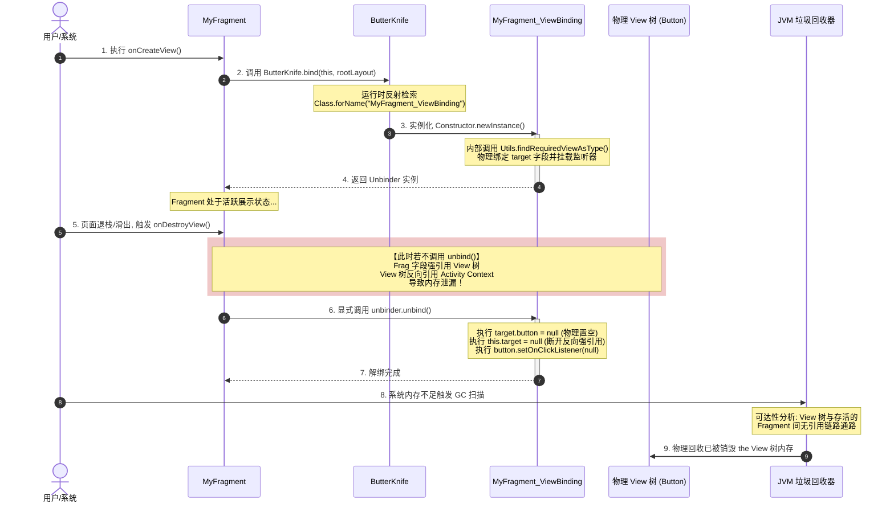
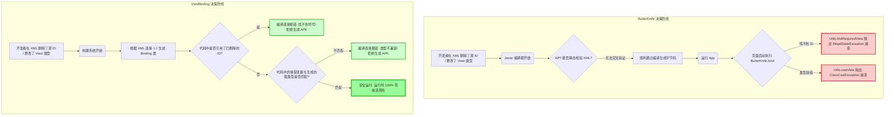

# 5.3.4.4 ButterKnife 核心机制与技术落幕

## 摘要与导读

在 Android 移动开发的历史长河中，视图绑定（View Binding）经历了一段长达十余年的技术演进。在 Kotlin 成为 Android 第一开发语言、Jetpack 工具链（ViewBinding、DataBinding）尚未问世的 Java 统治时代，开发者们曾长期面临着极其臃肿、重复且容易出错的视图初始化和事件绑定代码。

为了打破这种技术局限，当时任职于 Square 公司的开源界传奇人物 **Jake Wharton** 推出了 **ButterKnife**。这是一个基于编译期注解处理器（APT）的视图“注入”库。它通过在编译期自动生成辅助绑定代码的方式，彻底改变了 Android 开发者的日常编码习惯，将开发者从繁琐的视图绑定和事件监听挂载中解脱出来。

本文将从最底层的 JVM 引用链、Javac 编译期注解处理器（APT）工作机理、Dalvik/ART 运行时反射开销等维度，对 ButterKnife 进行全方位的深度剖析，深入讲解其在 Fragment 场景下如何通过物理置空阻断 GC Root 可达性来防范内存泄漏，并客观地阐述其技术落幕的历史必然性。

---

## 1. ButterKnife 的诞生背景与视图绑定的“黄金时代”

要真正理解 ButterKnife 的精妙之处，我们必须首先回到那个属于 Java 的 Android 开发“黄金时代”，剖析传统 `findViewById` 带来的一系列致命痛点。

### 1.1 传统 findViewById 的四大致命痛点

在没有 ButterKnife 的年代，一个普通的 Activity 页面如果包含十几个视图组件，其 `onCreate` 方法中往往充斥着大段极其相似的初始化逻辑。这些代码不仅毫无美感，还隐藏着多重安全隐患与架构设计的缺陷。

#### 1.1.1 极其沉重的样板代码与代码膨胀（Boilerplate Code）
In Android 原生 API 中，获取 XML 布局中的视图句柄唯一的方法就是调用 `findViewById(int id)`。这导致了严重的样板代码堆砌。
当页面业务复杂、视图节点多达数十个时，视图声明与绑定的样板代码甚至能占到整个 Activity 代码量的 30% 到 50%。这严重干扰了核心业务逻辑的阅读体验，使代码显得极其臃肿。这种冗余代码被称为“锅炉板代码”（Boilerplate Code），是阻碍开发效率和降低代码可读性的主要元凶。

此外，在早期 ListView 和后来的 RecyclerView 开发中，我们需要手写 ViewHolder 模式。每一个 ViewHolder 内部都要重复声明一堆成员变量，并进行一堆 `findViewById` 绑定。这使得原本应当保持轻量级的适配器代码瞬间变得难以维护，增大了项目重构的心理阻力。

#### 1.1.2 隐式类型强制转换的运行时安全隐患（ClassCastException 风险）
在 [API 26（Android O）](file:///Users/lizhiyang/Desktop/AndroidKnowledge/AndroidVersionChangeLog.md) 之前，findViewById 返回的类型是基类 View，开发者在将其赋值给具体子类（如 `TextView`、`Button`）时，**必须进行显式的类型强转**：
```java
mTvTitle = (TextView) findViewById(R.id.tv_title);
```
这种设计带来了致命的类型安全隐患。由于 XML 布局文件的编写与 Java 类的编写是双轨并行的，编译器在编译期无法交叉验证 XML 中的节点类型与 Java 中强转的类型是否匹配。

例如，若开发者在 XML 中将 `tv_title` 的节点类型从 `TextView` 改为了 `ImageView`，但忘记修改 Java 代码中的强转类型，那么在程序编译时，编译器并不会报错，因为强转语法本身是合法的。然而，一旦程序运行到这一行，就会直接抛出 `ClassCastException` 导致应用发生运行时崩溃（Crash）：
```text
java.lang.ClassCastException: android.widget.ImageView cannot be cast to android.widget.TextView
```
这种在编译期无法发现、只有在运行时才会暴露的类型安全隐患，是大型项目线上崩溃的常见根源之一。

#### 1.1.3 臃肿的匿名内部类监听器与事件挂载陷阱
除了视图本身的绑定，点击事件等监听器的挂载也是样板代码的重灾区。传统的监听器挂载通常需要为每个 View 创建一个匿名内部类。
当页面有多个按钮需要处理点击事件时，传统的写法会产生两难境地：
1. **多重匿名内部类**：产生大量冗余的字节码类文件。在 Java 中，每一个匿名内部类在编译后都会生成一个独立的 `.class` 文件（如 `MyActivity$1.class`、`MyActivity$2.class` 等）。这不仅增加了安装包体积（APK Size），还因为匿名内部类隐式持有外部类（Activity）的强引用，容易导致内存泄漏。
2. **Activity 实现 View.OnClickListener 接口**：在统一的 `onClick(View v)` 回调中，通过 `v.getId()` 进行庞大的 `switch-case` 分发。这种做法虽然减少了类文件的生成，却导致 `onClick` 方法迅速恶化为一个上百行的结构混乱的方法，极难维护。

#### 1.1.4 视图层与逻辑层的低效粘合
传统的命令式视图绑定，使得 Activity/Fragment 充当了“大管家”的角色。它必须亲自管理视图的获取、强转、设置监听，这违反了“单一职责原则”。当布局结构发生微调时，Java 代码必须同步进行大量的修改，极其不利于 UI 的快速迭代。

### 1.2 传统 findViewById 的性能根源：布局遍历树的 DFS 算法开销

除了代码层面的样板冗余，传统视图查找在 Android 渲染层面上也存在着不可忽视的性能软肋。

在 Android 视图树的体系结构中，当我们在 Java 中调用 `findViewById(id)` 时，底层的执行逻辑是以当前 View 或者是 `DecorView` 为根节点，执行一次**深度优先搜索（Depth First Search, DFS）**算法：

```text
       [DecorView (Root)]
          /         \
   [ViewGroup A]   [ViewGroup B]
     /       \         /       \
  [View 1] [View 2] [View 3] [View 4 (Target)]
```

当我们需要寻找 `View 4` 时，遍历的顺序是：`DecorView` -> `ViewGroup A` -> `View 1` -> `View 2` -> `ViewGroup B` -> `View 3` -> `View 4`。
如果布局文件层级极其深邃，且包含大量的子 View，那么每一次调用 `findViewById`，系统都需要在内存中执行一次时间复杂度为 $O(N)$ 的递归树遍历。

在传统的初始化流程中，若我们在 `onCreate` 中连续调用了 30 次 `findViewById`，系统就会在页面初始化阶段高频执行 30 次完整的 DFS 树遍历。在中低端 Android 设备上，这会直接抢占宝贵的 CPU 时间片，拖慢布局加载的渲染速度，造成明显的冷启动时延。

### 1.3 早期反射型注入方案的性能陷阱

为了解决上述痛点，早期的一些开源框架（如早期的 RoboGuice 或基于 Java 反射的依赖注入框架）尝试引入依赖注入（Dependency Injection）思想来处理视图绑定。然而，它们大多数采用了**运行时反射（Runtime Reflection）**的技术方案。

运行时反射方案在解析注解（如自定义的 `@InjectView(R.id.xxx)`）时，必须在程序运行期间，通过 `Class.getDeclaredFields()` 遍历 Activity 的所有成员变量，识别出带有注解的字段，然后再通过反射调用 `field.setAccessible(true)` 并利用反射将其与 `findViewById` 获取的实例进行绑定。

这种机制在运行时带来了极高昂的性能代价：
1. **类加载与符号表检索开销**：反射操作需要检索 JVM/ART 内部的符号表，这涉及大量的字符串比对和内存查找。
2. **JIT/AOT 优化失效**：虚拟机的即时编译器（JIT）和提前编译器（AOT）极难对反射调用进行代码内联和流水线优化。
3. **高频分配临时对象**：反射调用会产生大量的临时 `Field` 对象、方法调用包装数组等，频繁触发垃圾回收（GC），造成界面卡顿（Jank）。

因此，在对性能要求极高的移动端，运行时反射型绑定方案很快被证明是不可行的。正是在这样的背景下，Jake Wharton 的 ButterKnife 另辟蹊径，采用了**编译期注解处理器（APT）**方案，既保留了声明式注解的优雅与简洁，又规避了运行时反射的性能黑洞，开启了 Android 视图绑定的“黄金时代”。

---

## 2. 编译期注解处理器（APT）与工作机理深度剖析

ButterKnife 能够做到“零运行时反射开销”的核心秘密在于 **APT（Annotation Processing Tool）** 技术的妙用。它将视图绑定的查找与类型校验从“运行时”提前到了“编译期”。

### 2.1 APT 核心原理解析

APT 是 Java 编译器（Javac）提供的一种插桩机制。在编译阶段，当编译器读取到源代码后，会根据声明的注解处理器，在生成 `.class` 字节码文件之前，触发注解处理器对语法树（AST）进行扫描与修改，并允许注解处理器**动态生成新的 Java 源文件**。这些新生成的源文件会紧接着被加入到当前轮次的编译中，最终一起被编译成 `.class` 字节码。

#### 2.1.1 Javac 的编译期 Rounds 循环迭代机制
Javac 编译器的注解处理过程并不是单次执行就结束的，而是采用了一种“轮次（Rounds）”循环迭代的机制：

1. **解析与输入（Parse and Enter）**：编译器读取原始的 Java 源文件，将其解析为抽象语法树（Abstract Syntax Tree, AST），并把类符号输入到编译器的符号表中。
2. **注解处理轮次（Annotation Processing Round）**：编译器调用注册的注解处理器。注解处理器通过 API 扫描 AST，发现特定注解后，生成新的 Java 源文件或资源文件。
3. **循环迭代（Loop）**：如果当前轮次中生成了新的 Java 源文件，Javac 会重新解析这些生成的文件，将它们加入符号表，并启动下一轮（Next Round）的注解处理。这个过程会一直循环，直到某一轮中没有产生任何新的源文件生成为止。
4. **语义分析与字节码生成（Analyze and Generate）**：所有源文件（原始的与生成的）确定后，编译器进行类型检查、语义分析、代码内联优化，并最终输出为 `.class` 字节码文件。

#### 2.1.2 哲学思辨：为什么不能直接修改宿主类本身？
在探索 ButterKnife 的设计时，很多开发者会产生疑问：**为什么 ButterKnifeProcessor 不直接把 `findViewById` 字节码插桩写进宿主类（如 `MyActivity.java`）中，而必须生成一个以 `_ViewBinding` 结尾的全新辅助类呢？**

这是由 Java 编译器的安全沙箱规范决定的。

在 Java APT 的标准 API 设计中，为了保证编译流程的安全性、确定性与幂等性，Javac 严格禁止注解处理器直接修改正在被编译的原始类文件。注解处理器唯一的写权限是通过 `Filer` 创建**全新的文件**。

如果想强行修改正在编译的原始 AST 节点，只能像 **Lombok** 库那样，强行向下转型并使用 Javac 编译器的私有非公开内部 API（如 `com.sun.tools.javac` 包下的 `JavacTrees`、`TreeMaker` 等）。
这种方法存在致命的工程隐患：
- **兼容性极差**：一旦 JDK 或者是 Gradle 的编译器版本发生升级，私有 API 极易发生重构和命名更改，导致编译插件瞬间崩溃。
- **Android Studio 索引失效**：IDE 在做静态代码分析时，实时感知被暴力篡改后的字节码，容易出现红线报错提示。

除了直接修改 AST，其实还有另一种技术手段——**编译后字节码改写（Bytecode Instrumentation）**。例如，我们可以利用 **Gradle Transform API** 或者是现代 Gradle 版本的 **Artifacts API / Instrumentation API**，配合 **ASM** 或 **Javassist** 字节码操作框架。在 `.class` 编译成 `.dex` 文件的打包环节中，强行拦截并往 Activity 的字节码中插入视图绑定的硬编码。
然而，字节码改写在实际工程中存在更高的技术壁垒：
1. **陡峭的学习曲线**：操作 ASM 需要开发者直接处理虚拟机操作数栈（Operand Stack）和局部变量表，编写难度极大，极易因为栈图（StackMapTable）计算错位导致运行时 `VerifyError` 崩溃。
2. **编译开销剧增**：为了修改字节码，编译插件不得不对项目中成百上千个字节码类文件执行二次读取、解析与重新输出，极大拖慢了 Gradle 构建流程。
因此，Jake Wharton 最终做出了架构权衡，放弃了字节码改写，选择了最符合官方规范的架构设计：**静态生成新类，运行时以反射形式完成首尾桥接。**

### 2.2 ButterKnifeProcessor 工作机理深度剖析

ButterKnife 的核心注解处理器类是 `ButterKnifeProcessor`。它继承自 Java 官方的 `javax.annotation.processing.AbstractProcessor`，其内部的 `process` 方法是整个编译期代码生成的发动机。

#### 2.2.1 扫描注解与 AST 解析（Element API 的静态检验）
在 `process` 方法中，`ButterKnifeProcessor` 会声明自己所关注的注解集合（包括 `@BindView`, `@BindViews`, `@OnClick`, `@OnLongClick`, `@OnTouch` 等）。
编译器在扫描到这些注解时，会向 `process` 方法传入一个包含所有被注解元素（`Element`）的集合。这里的 `Element` 是 Java 编译期对语法树节点的客观抽象表示：
- `TypeElement`：代表类或接口（如宿主 Activity ）。
- `VariableElement`：代表成员变量或方法参数（如 `@BindView` 标注的字段）。
- `ExecutableElement`：代表方法（如 `@OnClick` 标注的方法）。

在扫描过程中，`ButterKnifeProcessor` 还会利用 `javax.lang.model.type.TypeMirror` 对被标注字段的类型进行**严苛的静态校验**。
例如，若开发者写了 `@BindView(R.id.tv_title) String tvTitle;`，即试图把一个 TextView 绑定到一个 String 变量上，处理器会通过如下方式执行编译期校验：

```java
// 1. 获取标注字段的类型镜像 (TypeMirror)
TypeMirror elementType = element.asType();

// 2. 获取 android.view.View 类的类型镜像
TypeElement viewTypeElement = elementUtils.getTypeElement("android.view.View");
TypeMirror viewType = viewTypeElement.asType();

// 3. 利用 typeUtils 判断该字段类型是否是 View 或者是其子类
if (!typeUtils.isSubtype(elementType, viewType)) {
    // 4. 若不是 View 的子类，利用 Messager 抛出编译期 Error，直接熔断 Javac 编译！
    messager.printMessage(Diagnostic.Kind.ERROR, 
        String.format("@BindView fields must extend from View. (%s.%s)", 
            enclosingElement.getQualifiedName(), element.getSimpleName()), 
        element);
}
```
这种编译期类型校验，将类型不匹配的低级错误从运行阶段拦截到了编译阶段，避免了将 Bug 带入线上，保障了基础的类型安全性。

#### 2.2.2 按照宿主容器进行归类与 `BindingSet` 的构建
为了生成对应的绑定辅助类，`ButterKnifeProcessor` 不能零散地处理每一个注解，而必须将它们按照**宿主类（Activity/Fragment/ViewHolder 等容器）**进行归类。

1. **宿主识别**：对于每个被标注的 `Element`，处理器会通过调用 `element.getEnclosingElement()` 向上寻找其声明所在的外部类（即宿主类，如 `MyActivity`）。
2. **信息提取与校验**：
   - **私有属性校验**：检查被标记的字段是否是 `private` 或 `static`。如果是，处理器会直接调用 `Messager.printMessage(Diagnostic.Kind.ERROR, ...)` **报错并中断编译**。这是因为编译期生成的辅助类 `MyActivity_ViewBinding` 与宿主 `MyActivity` 属于不同的类，如果宿主字段是 `private` 的，辅助类在不使用反射的情况下将无法直接对其进行赋值（如 `target.tvTitle = ...`）。为了坚守“零运行时反射开销”的红线，ButterKnife 强制要求绑定的字段必须是包级可见（default）或 `public` 的。
   - **ID 提取**：提取注解中配置的 View ID（如 `R.id.tv_title`）。
   - **类型提取**：提取字段的完整类型名称（如 `android.widget.TextView`）。
3. **BindingSet 建模**：以宿主类为 Key，将该宿主下所有绑定的字段（`FieldViewBinding`）和绑定的方法（`MethodViewBinding`）打包封装进一个名为 `BindingSet` 的模型类中。这个 `BindingSet` 就完整地描述了某一个特定类（如 `MyActivity`）所拥有的全部绑定关系。

#### 2.2.3 Library 模块下的 R2 编译期插件原理与 Android 资源合并
在 Android 项目的 Gradle 构建系统中，资源合并（Resource Merging）是一个非常重要的任务。为了避免在合并多个子模块时发生资源 ID 的物理冲突，Android Gradle Plugin（AGP）在处理 Library 子模块时，会为所有的资源（如布局、图片、ID 等）生成非 `final` 的常量。
这就产生了一个致命的技术阻碍：由于 Java 语言的规范，注解参数（如 `@BindView(R.id.xxx)`) 必须是编译期的字面量常量（即 `static final int`）。
为了解决这一技术瓶颈，Jake Wharton 特意编写了一个 Gradle 插件。该插件在编译 Library 模块时，会复制一份 `R.class` 并强制将其中的所有字段修改为 `static final`，生成一个名为 `R2.class` 的新类。开发者在 Library 模块中编写 ButterKnife 注解时，需要写成 `@BindView(R2.id.tv_title)`。在编译期，`ButterKnifeProcessor` 识别出 `R2` 后的 ID 后，会在生成代码时自动将其还原映射为真正的动态 `R` 字段（即生成的代码依然使用的是 `R.id.tv_title`），在不违反 Java 编译期常量的要求下，完美绕过了 Library 模块的非常量限制。

#### 2.2.4 继承关系链下的 BindingSet 树状构建
在大型项目中，继承是十分常见的编码设计。例如：
```java
public class BaseActivity extends Activity {
    @BindView(R.id.tv_base) TextView tvBase;
}

public class ChildActivity extends BaseActivity {
    @BindView(R.id.tv_child) TextView tvChild;
}
```
当 `ButterKnifeProcessor` 扫描时，它会为这两个 Activity 分别建立 `BindingSet`。
此时，处理器并不会单纯地把它们看作孤立的类，而是会通过 `Types.asElement(typeMirror)` 和 `TypeElement.getSuperclass()` 顺着继承链向上爬升，寻找父类是否也拥有对应的 `BindingSet`。
如果发现父类 `BaseActivity` 也存在绑定关系，处理器会将 `ChildActivity` 的 `BindingSet` 的 `parent` 指针指向 `BaseActivity` 的 `BindingSet`。
这种树状的建模设计，直接决定了生成的 `ViewBinding` 辅助类也将具备继承关系：
- 生成的 `ChildActivity_ViewBinding` 类会继承自 `BaseActivity_ViewBinding`。
- 在 `ChildActivity_ViewBinding` 的构造函数中，其第一行会自动生成 `super(target, source)`，以此优雅地串联起父类的视图绑定逻辑。
- 同样，其 `unbind()` 方法也会在末尾调用 `super.unbind()`，保障了整个继承体系的解绑安全。

---

## 3. 生成类 `*_ViewBinding.java` 结构深度解构

为了清晰地理解 ButterKnife 生成代码的物理形态，我们下面重现一个包含了继承关系、多视图绑定（`@BindViews`）、以及可选绑定（`@Nullable`）的复杂场景。

### 3.1 核心注解的定义与多 ID 挂载原理
我们首先来看一下 ButterKnife 主要注解在框架中的声明结构，以便理解其编译期参数限制和数组设计的精妙之处：

```java
package butterknife;

import java.lang.annotation.Retention;
import java.lang.annotation.Target;
import static java.lang.annotation.ElementType.FIELD;
import static java.lang.annotation.RetentionPolicy.CLASS;

// @BindView 仅用于字段，生命周期保留在 class 阶段（编译期处理后即丢弃，不在运行时反射读取）
@Retention(CLASS) 
@Target(FIELD)
public @interface BindView {
  int value(); // 必须传入唯一的 View ID
}
```

对于事件绑定，如 `@OnClick`，其定义支持**多 ID 绑定**：
```java
package butterknife;

import java.lang.annotation.Retention;
import java.lang.annotation.Target;
import static java.lang.annotation.ElementType.METHOD;
import static java.lang.annotation.RetentionPolicy.CLASS;

@Retention(CLASS) 
@Target(METHOD)
public @interface OnClick {
  int[] value() default { -1 }; // 支持通过数组形式传入多个 View ID，绑定同一个点击回调
}
```

若开发人员写了 `@OnClick({R.id.btn_submit, R.id.btn_cancel})`，注解处理器在编译生成 ViewBinding 类时，会遍历该数组中的每一个 ID，并为它们逐一生成视图寻找与监听器挂载的逻辑。每一个 View 节点都会被绑定一个独立的防抖监听器实例，并统一分发到宿主的同一个处理方法中。这种生成逻辑有效避免了编写冗余的事件分发代码。

### 3.2 复杂场景生成的 ViewBinding 类完整伪代码

下面展示一个名为 `MyActivity_ViewBinding` 的辅助绑定类的完整 Java 代码。该类模拟了真实的 ButterKnife 注解处理器输出，涵盖了单一绑定、可选绑定、多视图绑定以及点击事件的处理。

假设宿主类结构如下：

```java
package com.example.app;

import android.app.Activity;
import android.widget.Button;
import android.widget.TextView;
import java.util.List;
import androidx.annotation.Nullable;
import butterknife.BindView;
import butterknife.BindViews;
import butterknife.OnClick;

public class MyActivity extends Activity {
    @BindView(R.id.tv_title) TextView tvTitle;
    @BindView(R.id.btn_submit) Button btnSubmit;
    @Nullable @BindView(R.id.tv_subtitle) TextView tvSubtitle; // 可选绑定
    
    // 绑定多视图
    @BindViews({R.id.tv_hint1, R.id.tv_hint2}) List<TextView> hintViews;

    @OnClick(R.id.btn_submit)
    void onSubmitClick() {
        // 点击处理逻辑
    }
}
```

编译后生成的 `MyActivity_ViewBinding.java` 完整结构如下：

```java
// 这是 ButterKnife 编译期自动生成的类，请勿手动修改！
package com.example.app;

import android.view.View;
import android.widget.Button;
import android.widget.TextView;
import androidx.annotation.CallSuper;
import androidx.annotation.UiThread;
import butterknife.Unbinder;
import butterknife.internal.DebouncingOnClickListener;
import butterknife.internal.Utils;
import java.lang.IllegalStateException;
import java.lang.Override;
import java.util.List;

public class MyActivity_ViewBinding implements Unbinder {
  // 持有对目标宿主 Activity 的强引用
  private MyActivity target;

  // 挂载点击事件时用于注销监听器的 View 引用缓存
  private View view7f08005b; // 假设 btnSubmit 的 ID 值为 0x7f08005b

  @UiThread
  public MyActivity_ViewBinding(MyActivity target) {
    // 默认将 Activity 本身的 Window DecorView 作为寻找 View 的源头
    this(target, target.getWindow().getDecorView());
  }

  @UiThread
  public MyActivity_ViewBinding(final MyActivity target, View source) {
    this.target = target;

    View view;
    
    // 1. 寻找 tv_title 视图并强转类型，直接赋值给 target 成员变量
    target.tvTitle = Utils.findRequiredViewAsType(source, R.id.tv_title, "field 'tvTitle'", TextView.class);
    
    // 2. 寻找 btnSubmit 视图并强转类型
    view = Utils.findRequiredView(source, R.id.btn_submit, "field 'btnSubmit' and method 'onSubmitClick'");
    target.btnSubmit = Utils.castView(view, R.id.btn_submit, "field 'btnSubmit'", Button.class);
    
    // 缓存该 View，以便在 unbind() 时注销监听器
    view7f08005b = view;
    
    // 3. 挂载点击事件监听器，使用 DebouncingOnClickListener 防止快速重复点击
    view.setOnClickListener(new DebouncingOnClickListener() {
      @Override
      public void doClick(View p0) {
        // 直接通过 target 对象调用其包级可见的方法，避免了反射方法调用
        target.onSubmitClick();
      }
    });

    // 4. 寻找可选视图 tv_subtitle，使用 findOptionalViewAsType
    target.tvSubtitle = Utils.findOptionalViewAsType(source, R.id.tv_subtitle, "field 'tvSubtitle'", TextView.class);

    // 5. 绑定多视图 hintViews 数组，利用 Utils.listOf 包装
    target.hintViews = Utils.listOf(
        Utils.findRequiredViewAsType(source, R.id.tv_hint1, "field 'hintViews'", TextView.class),
        Utils.findRequiredViewAsType(source, R.id.tv_hint2, "field 'hintViews'", TextView.class)
    );
  }

  @Override
  @CallSuper
  public void unbind() {
    MyActivity target = this.target;
    // 核心设计：如果 target 已经是 null，抛出 IllegalStateException，实施防御性编程
    if (target == null) {
      throw new IllegalStateException("Bindings already cleared.");
    }
    this.target = null; // 物理斩断对宿主的引用，防范内存泄漏

    // 将宿主内所有被注入的 View 强引用全部置空！
    target.tvTitle = null;
    target.btnSubmit = null;
    target.tvSubtitle = null;
    target.hintViews = null;

    // 注销点击事件监听器，物理释放 View 引用
    if (view7f08005b != null) {
      view7f08005b.setOnClickListener(null);
      view7f08005b = null;
    }
  }
}
```

### 3.3 解密 Unbinder 接口与 Unbinder.EMPTY
所有的 `*_ViewBinding` 类都实现了 `butterknife.Unbinder` 接口。该接口定义非常简单：
```java
public interface Unbinder {
  void unbind();

  // 哨兵空实现对象，避免外部调用 bind() 返回 null 时导致空指针
  Unbinder EMPTY = new Unbinder() {
    @Override public void unbind() {}
  };
}
```
通过实现 `Unbinder`，ButterKnife 为外部暴露了一个统一的解绑契约。在 Fragment 生命周期销毁或 ViewHolder 页面滑出时，外部不需要关心具体的 ViewBinding 类名，直接调用 `unbinder.unbind()` 即可完成物理置空与解绑。

### 3.4 构造函数与 Utils 视图安全操作库源码级走读
在生成的构造函数中，我们可以看到 ButterKnife 并没有直接调用底层的 `findViewById`，而是封装在 `Utils` 类的一系列静态方法中。我们来深度剖析 `Utils.findRequiredViewAsType` 的底层源码实现：

```java
package butterknife.internal;

import android.view.View;
import androidx.annotation.IdRes;
import java.util.Arrays;
import java.util.List;

public final class Utils {
  
  // 核心方法：寻找目标 View 并将其安全地强制转换为指定类型
  public static <T> T findRequiredViewAsType(View source, @IdRes int id, String who, Class<T> cls) {
    // 1. 首先通过 findRequiredView 获取底层的 View 实例
    View view = findRequiredView(source, id, who);
    // 2. 调用 castView 执行类型强制转换
    return castView(view, id, who, cls);
  }

  // 核心方法：寻找 View，若找不到则抛出详尽的异常
  public static View findRequiredView(View source, @IdRes int id, String who) {
    View view = source.findViewById(id);
    if (view != null) {
      return view;
    }
    // 报错信息优化：如果找不到 View，ButterKnife 会拼装出非常详尽的调试信息
    // 包含当前 View 的 ID 资源名称，极大减轻了排障负担
    String name = getResourceEntryName(source, id);
    throw new IllegalStateException("Required view '"
        + name
        + "' with ID "
        + id
        + " for "
        + who
        + " was not found. If this view is optional add '@Nullable' (android.annotation.Nullable) or '@Optional' annotation.");
  }

  // 可选绑定核心方法：找不到 View 时不报错，仅返回 null
  public static <T> T findOptionalViewAsType(View source, @IdRes int id, String who, Class<T> cls) {
    View view = source.findViewById(id);
    return castView(view, id, who, cls);
  }

  // 核心方法：执行类型转换，并提供严苛的错误校验
  public static <T> T castView(View view, @IdRes int id, String who, Class<T> cls) {
    if (view == null) {
      return null;
    }
    try {
      // 这里的 cls.cast 底层对应 JVM 里的 checkcast 字节码指令进行强转检查
      return cls.cast(view);
    } catch (ClassCastException e) {
      String name = getResourceEntryName(view, id);
      // 抛出带有清晰定位的 ClassCastException，指明哪个 View 类型转换失败了
      throw new IllegalStateException("View '"
          + name
          + "' with ID "
          + id
          + " for "
          + who
          + " was of the wrong type. See cause for more info.", e);
    }
  }

  // 支持 @BindViews 绑定的辅助包装方法
  @SafeVarargs
  public static <T> List<T> listOf(T... views) {
    return new ImmutableList<>(views);
  }

  private static String getResourceEntryName(View view, @IdRes int id) {
    if (view.isInEditMode()) {
      return "<區域編輯器中>";
    }
    return view.getContext().getResources().getResourceEntryName(id);
  }
}
```
#### 核心安全设计机理：
1. **防止隐式转换崩溃**：通过 `cls.cast(view)` 代替 Java 的直接强转 `(TextView)view`。虽然底层在 JVM 层面最终都是做类型检查，但在 Java 源码中封装为 `cls.cast` 能够让我们显式地捕获 `ClassCastException`，并拼装出包含 XML 资源节点名称的清晰错误日志。
2. **防呆与快速排障**：传统的 `findViewById` 在找不到 ID 时只会静默返回 `null`，这会导致后续代码在调用该 View 的方法时触发 `NullPointerException`，开发者需要往上追溯好几层才能知道是哪里返回了 `null`。而 `Utils.findRequiredView` 则是“**立得即毁**”设计——一旦找不到，立刻抛出详细的 `IllegalStateException`，并指明哪一个 View ID（如 `R.id.tv_title`）在当前布局中不存在，直接缩短了 Bug 的排障路径。

#### JVM 层面 Class.cast() 运行机理解密：
当 Java 源码中执行 `cls.cast(view)` 时，编译器会编译出一条 `checkcast` 字节码指令。
根据 JVM 规范，`checkcast` 指令需要执行以下步骤：
- 获取操作数栈顶的引用类型数据（即 View 实例引用）。
- 检查这个实例的真实 Class 结构。如果该实例为 `null`，检查直接通过（即 `checkcast` 不会阻拦 null 的转换）。
- 如果实例不为 `null`，虚拟机会在 native 方法表中层层上溯其类继承关系和接口实现关系，判断栈顶引用的实际类型是否能够被安全指派为 `cls` 所描述的类型。
- 如果检查失败，虚拟机会抛出 `java.lang.ClassCastException` 异常。
ButterKnife 通过用 `try-catch` 包裹 `cls.cast`，将虚拟机抛出的这一底层异常，重新组装为人类极易阅读的排障信息，从 JVM 底层为开发人员的调试工作提供了极大的便利。

### 3.5 点击事件防抖设计与 UI Looper 消息处理分析
在绑定点击事件时，ButterKnife 生成了 `DebouncingOnClickListener` 的匿名内部类实现。
其利用 Android UI 消息排队队列的防抖设计，具有极强的**抗卡顿掉帧稳定性**。即便系统在用户点击时发生了严重的卡顿（如主线程正在执行复杂的数据库写入，卡顿长达 1 秒），在这 1 秒内用户快速连击了屏幕多次，这些点击事件全部在 `MessageQueue` 中排队。当主线程卡顿结束开始依次分发时，由于第一个消息执行时已在队列尾部投递了 `ENABLE_AGAIN`，此时排在第一个消息后面的其他连击消息，在执行时依然是在 `ENABLE_AGAIN` 执行之前，因此它们会由于 `enabled == false` 被**全部被过滤拦截**，从而有效防止了系统卡顿恢复后瞬间触发多次逻辑的致命体验漏洞。

#### 多窗口模式与分屏模式下的 static 防抖缺陷：
虽然 `DebouncingOnClickListener` 的消息排队设计在单 Activity 页面中十分优美，但它却隐藏着一个被时代遗留的**全局并发缺陷**。

我们注意到防抖标志位的声明：
```java
static boolean enabled = true;
```
由于 `enabled` 变量被声明为 **`static` 静态变量**，它在虚拟机内是**属于类加载器级别的全局共享状态**，而非单个 Activity 或单个 View 实例的私有状态。

在 Android 早期，系统同一时间只能激活展示一个 Activity。但自 Android 7.0 引入分屏多窗口（Multi-Window）以及后来的折叠屏多应用并行运行模式后，多个 Activity 能够同时处于活跃（Resumed）状态并在屏幕上并排呈现。

若用户在屏幕上同时快速点击 Activity A 中的某个按钮和 Activity B 中的某个按钮：
1. Activity A 的按钮点击事件先进入 Looper 循环，触发 `DebouncingOnClickListener.onClick`，将类静态的 `enabled` 全局设为 `false`。
2. 紧接着，Activity B 的点击消息在瞬间被主线程分发。由于 `enabled` 是全局共享的 `static` 变量，此时在 Activity B 内部检测到 `enabled == false`，导致 Activity B 的正常点击响应被**无辜拦截过滤**！
3. 直至 Activity A 的 `ENABLE_AGAIN` 被执行，全局的 `enabled` 才会重新归位。

这种“跨 Activity 事件误拦截”现象，正是将状态全局静态化所带来的经典并发副作用。虽然这属于极罕见的用户交互边界，但它也侧面说明了基于全局反射/类级别的事件挂载设计在现代 Android 复杂窗口系统下面临的架构挑战。

### 3.6 进阶应用：@BindViews 绑定的 Action 与 Setter 接口设计
ButterKnife 不仅能绑定单个视图，还能通过 `@BindViews` 一次性将多个 View 绑定到一个 `List` 中。为了方便开发者对这组 View 进行批量操作，ButterKnife 设计了 `Action` 和 `Setter` 两个极其精巧的函数式接口：

```java
public interface Action<T extends View> {
  @UiThread void apply(@NonNull T view, int index);
}

public interface Setter<T extends View, V> {
  @UiThread void set(@NonNull T view, V value, int index);
}
```
结合这两个接口，开发者可以写出极具函数式风格的批量控制代码，避免了手写繁琐的 `for` 循环：
```java
// 批量隐藏所有提示 View
ButterKnife.apply(hintViews, new Action<TextView>() {
    @Override
    public void apply(@NonNull TextView view, int index) {
        view.setVisibility(View.GONE);
    }
});
```

---

## 4. 运行时反射注入与性能天平的精准倾斜

至此，我们已经看清了编译期生成的 `*_ViewBinding` 类是何等的高效：它内部全部是纯粹的直接赋值与事件挂载。那么，我们在编写代码时调用的 `ButterKnife.bind(this)` 是如何与这些生成类建立联系的呢？这就涉及 ButterKnife 优雅的运行时“反射桥接”设计。

### 4.1 走读 ButterKnife.bind() 源码调用链
当我们调用 `ButterKnife.bind(this)` 时，代码的执行链路如下：
1. 核心入口：`ButterKnife.bind(Activity target)` 寻找 DecorView。
2. 双参 bind 接口：`bind(Object target, View source)` 反射装载生成类构造器。
3. `findBindingConstructorForClass(Class<?> cls)` 内部先查询缓存 `BINDINGS`（一个全局静态的 `LinkedHashMap`）。
4. 若未命中缓存，利用 `Class.forName(clsName + "_ViewBinding")` 进行动态类加载，并缓存查找到的构造器。
5. 通过 `constructor.newInstance(target, source)` 反射实例化生成类，内部执行硬编码绑定。

### 4.2 BINDINGS 缓存容器的单线程安全设计
由于 `BINDINGS` 是一个普通的 `LinkedHashMap`，很多开发者会质疑其并发读写的安全性。
然而，ButterKnife 的 API 声明上带有强制的 `@UiThread` 注解。Android 规定所有的 UI 操作必须在主线程中完成，这意味着访问 `BINDINGS` 缓存的操作天然被限制在单线程环境中，因此**完全没有必要使用锁或者线程安全容器**。这巧妙地绕过了锁竞争开销，提高了单线程环境下的极限读取性能。

### 4.3 Dalvik/ART 虚拟机的反射开销与性能取舍
在 Dalvik/ART 虚拟机中，反射操作之所以慢，主要源于以下两点：
1. **安全检查（Access Check）**：每次反射操作时，虚拟机都需要验证调用者是否拥有足够的权限访问该目标（例如私有修饰符判定）。这会带来额外的 CPU 指令分支。
2. **方法表与成员检索（Member Resolution）**：调用 `Class.forName` 或 `getConstructor` 时，虚拟机会在 native 层对类的 DEX 结构进行遍历，通过字符串哈希比对来定位目标方法或类。这涉及多次内存寻址。

#### Class.forName 内部的 ClassLoader 装载机理：
在 ART 虚拟机上，`Class.forName` 的底层会调用 native 方法 `JVM_FindClassFromBootOrClassPath`。这会触发 ClassLoader（在 Android 中是 `PathClassLoader`，继承自 `BaseDexClassLoader`）去装载对应的类。
- 在 `BaseDexClassLoader` 中，维护了一个名为 `DexPathList` 的对象。
- `DexPathList` 内部包含一个 `Element` 数组，每个 `Element` 都对应一个打开的 APK / DEX 文件。
- 当类加载器查找 `MyActivity_ViewBinding` 时，它不得不**对这组 DEX 数组进行线性检索（Linear Search）**。在拥有数十个多 DEX（Multidex）文件或者海量动态下发插件的大型项目中，这种检索会带来大量的磁盘 I/O 探查和内存比较。

ButterKnife 针对这些物理开销，做了极具智慧的**取舍艺术**（Trade-off）：
- **字段反射转为类级反射**：用单次构造函数实例化反射，代替对页面内每个字段的高频 field 反射访问。
- **缓存拦截**：缓存 Constructor 避免了重复的 `Class.forName` 磁盘 DEX 检索开销。
- **消除私有修饰符校验**：字段非私有使生成类可以直接对其赋值，消除了 native 层对私有属性存取的额外权限检查分支。

#### 垃圾回收视角下的反射参数打包开销：
除了虚拟机内部的类检索和权限校验，反射实例化 `constructor.newInstance(target, source)` 还会在内存堆（Heap）中引入微小的对象分配。
根据反射 API 的设计，`newInstance` 的参数是以可变参数（Varargs，即 `Object[]`）数组形式传递的。这意味着，每一次调用 `newInstance`，虚拟机都必须在堆内存中为这个参数数组分配一个临时的 `Object[]` 数组对象。
对于 Activity 和 Fragment 这样低频启动的页面，这种对象分配开销完全微不足道。但在 RecyclerView.ViewHolder 这样快速滑动并频繁绑定的高频复用场景中，高频触发 `newInstance` 会在 Heap 中产生海量的临时小对象，从而加剧新生代内存的碎片化，迫使虚拟机频繁进行 Minor GC 垃圾回收。这也间接促使了 Android 开发社区后来全面转向零反射、零临时对象打包的 **ViewBinding** 技术方案。

---

## 5. Fragment 场景下的生命周期错位与物理置空防泄漏

如果在 Activity 中使用 ButterKnife，由于 Activity 的生命周期与它的 Window 视图树生命周期几乎是同生共死的，所以即使不显式调用 `unbind`，也很难发生由 ButterKnife 导致的独立内存泄漏。

然而，**在 Fragment 场景下，如果不执行 unbind()，将会引发极其严重的内存泄漏！**

### 5.1 深入剖析 Fragment 视图与实例生命周期的异步错位
在 Android 中，Fragment 的实例生命周期（Instance Lifecycle）与其所承载的 View 树生命周期（View Lifecycle）**不是同步的**。
当 Fragment 处于回退栈（BackStack）中，或者处于 ViewPager 的非活动缓存页中时，系统的 `FragmentManager` 会主动销毁其视图树（触发 `onDestroyView`），以腾出内存资源。然而，**Fragment 的实例对象依然常驻于内存中**。

如果开发者在 `onDestroyView` 中没有执行 `unbind()`，由于 Fragment 的成员变量（如 `btnSubmit`）依然强引用着已被销毁的 Button 实例，同时 `MyFragment_ViewBinding` 辅助类也强引用着该 View 树和 Fragment 实例，最终会导致整棵 View 树及其所持有的 Activity 上下文（Context）全部被迫泄漏。

### 5.2 垃圾回收机制中的引用平衡分析：为什么不能用弱引用（WeakReference）？
很多开发者在面对这个问题时，会提出一个架构上的改进构想：**既然强引用会造成泄漏，那为什么 ButterKnife 生成的绑定类不直接用 `WeakReference` 来持有 View 呢？**

这是对 Android UI 系统生命周期管理机制的典型误解。

在 JVM/ART 中，一旦一个对象只被 `WeakReference` 持有，只要垃圾回收器执行扫描，它就会立刻被物理回收。
在 Android 开发中，XML 中的 View 在被 `LayoutInflater` 加载并附加（attach）到 Activity 的 DecorView 树上后，虽然 View 树中的父节点（如 `ViewGroup`）强引用着子节点，但在我们的逻辑层（Activity/Fragment），我们声明成员变量的目标是为高频、快速地读取和修改视图状态提供便利。

若我们在 Activity/Fragment 侧采用弱引用：
```java
// 假设采用弱引用的虚设机制
WeakReference<TextView> tvTitle;
```
1. **频繁的 Null 校验与解包惩罚**：每次使用时，开发者必须写出冗长难看的解包逻辑：
   ```java
   TextView view = tvTitle.get();
   if (view != null) {
       view.setText("Hello");
   }
   ```
2. **生命周期的动态失控**：当 Fragment 发生一些异步回调（如网络请求结束，切换子线程）时，如果此时视图树恰好因为多窗口模式、切换横竖屏等原因在底层发生了解离和重新测量，而主线程没有及时更新强引用，弱引用会在瞬间被 GC 彻底回收。此时调用 `tvTitle.get()` 将直接返回 `null`，导致关键界面更新逻辑丢失，甚至引起崩溃。

因此，为了确保逻辑层能够绝对稳定、实时地操控 View 状态，**逻辑层（宿主）对 View 必须使用强引用**。这一根本的前提，直接决定了我们不能在数据结构上采用弱引用投机取巧，而必须老老实实通过在 `onDestroyView` 中执行物理置空解绑（`unbind()`），在正确的生命周期拐点主动打破强引用链。

### 5.3 unbind() 自愈置空机理与 Tracing GC 引用斩断
通过调用 `unbinder.unbind()`，生成的 ViewBinding 类会执行如下置空操作：
- `this.target = null;`：切断 ViewBinding 对宿主 Fragment 的持有。
- `target.btnSubmit = null;`：将 Fragment 中的 View 成员变量全部硬写为 `null`。
- `view7f08005b = null;`：清除辅助类内部对 View 的任何物理缓存。

这一套操作直接打破了 GC 可达性分析链条，使得原本已被移出界面渲染树 of View 节点瞬间成为内存孤岛，允许 JVM 在下一次回收时，物理清空这棵 View 树的内存。

与传统手写解绑相比，如果我们不用 ButterKnife，在 Java 时代我们就必须在 `onDestroyView` 中手写类似 `btnSubmit = null;` 这样的代码。ButterKnife 实际上是以生成的 ViewBinding 辅助类代劳了这一繁琐的置空释放工作，确保了内存安全的规范化。

### 5.4 LeakCanary 内存泄漏链路深度解析
当我们在 Fragment 场景下忘记调用 `unbind()` 时，内存泄漏监测工具 **LeakCanary** 会非常敏感地捕获到这一漏洞。以下是一份真实的 LeakCanary 内存泄漏路径日志：

```text
┬───
│ GC Root: Local variable in native code
│
├─ android.os.HandlerThread instance
│    Leaking: NO (thread is active)
│
├─ com.example.app.MyActivity instance
│    Leaking: YES (Activity.mDestroyed is true)
│
├─ com.android.internal.policy.DecorView instance
│    Leaking: YES
│
├─ android.widget.FrameLayout instance (content view parent)
│    Leaking: YES
│
├─ android.widget.Button instance (R.id.btn_submit)
│    Leaking: YES (View.mParent is null, meaning it was detached from the window)
│
├─ com.example.app.MyFragment_ViewBinding instance
│    Leaking: YES (target is not null, view7f08005b is not null)
│
╰─ com.example.app.MyFragment instance
     Leaking: YES (Fragment.mFragmentManager is null, meaning it was detached or in backstack)
====================================
METADATA:
Fragment.onDestroyView() was called, but the view bindings were not cleared.
```

#### 日志逐行解读：
1. **`com.example.app.MyActivity instance -> Leaking: YES`**：检测到当前 Activity 已经触发了销毁流程，但由于底层的 View 树强引用，无法被回收。
2. **`android.widget.Button instance -> Leaking: YES (View.mParent is null)`**：Button 实例的 `mParent` 已经为 null，证明它已经被移除了屏幕，是一个僵尸 View。
3. **`MyFragment_ViewBinding instance -> target is not null`**：这是关键泄漏节点。ViewBinding 类依然持有 Fragment 实例（`target` 字段）以及 Button（`view7f08005b` 字段）。
4. **`MyFragment instance -> Leaking: YES`**：Fragment 已经不在活跃的 FragmentManager 中（或者在回退栈中），但因为被 ViewBinding 和它的成员变量强引用，最终导致了 Activity、View、Fragment 的整体大面积泄漏。

### 5.5 RecyclerView.ViewHolder 中的绑定与解绑边界探讨
在 RecyclerView 开发中，我们经常会在 `ViewHolder` 的构造函数中执行 ButterKnife 的绑定操作：
```java
static class ItemViewHolder extends RecyclerView.ViewHolder {
    @BindView(R.id.tv_item_title) TextView tvTitle;

    ItemViewHolder(View itemView) {
        super(itemView);
        ButterKnife.bind(this, itemView);
    }
}
```
既然 Fragment 需要 unbind()，那 ViewHolder 销毁或被回收时，是否也必须调用 unbind() 来置空释放呢？

答案是：**在 ViewHolder 场景下，通常不需要解绑置空。**

#### 深度原理解析：
根据 RecyclerView 的复用原理，当 ViewHolder 实例因为滑出屏幕被放入缓存或最终被 GC 回收时，ViewHolder 所引用的物理 `itemView` 本身也会随着 ViewHolder 被 GC 一并回收。
在引用拓扑上，ViewHolder 与它内部引用的 View 是同生共死的。它们会像一个整体一样被 GC 扫描并打包回收，因此无需手动调用 `unbind()` 置空，这与 Fragment 错综复杂的 BackStack 生命周期有着本质的不同。

### 5.6 多布局适配（Alternative Layouts）下的可选绑定机制
在实际项目中，针对横竖屏或手机平板，我们常常会编写不同的布局资源文件。例如：
- `layout/activity_my.xml` (默认竖屏，含有 `R.id.tv_subtitle` 变量)
- `layout-land/activity_my.xml` (横屏，为了精简界面，**删除了** `R.id.tv_subtitle` 节点)

在 Java 代码中，如果使用传统的 `@BindView(R.id.tv_subtitle)` 绑定，一旦程序运行在横屏状态，Javac 生成的辅助类会执行 `Utils.findRequiredView`。因为在该布局中找不到该 ID，辅助类会在瞬间抛出 `IllegalStateException` 并引发崩溃。

为了安全适应这种多布局差分场景，ButterKnife 引入了**可选绑定（Optional Binding）**机制。

开发者只需使用 `androidx.annotation.Nullable`（或者是其他包名下的 Nullable 注解）对该字段进行修饰：
```java
@Nullable
@BindView(R.id.tv_subtitle)
TextView tvSubtitle;
```
#### 注解处理器内部判定机理：
1. `ButterKnifeProcessor` 在扫描 `VariableElement` 时，会通过 `element.getAnnotationMirrors()` 遍历当前字段的所有修饰注解。
2. 它会通过字符串比对检查是否存在名为 `Nullable` 的注解。
3. 一旦判定该字段为可选绑定，生成的辅助类代码将不再调用 `findRequiredViewAsType`，而是自动切换为调用 `Utils.findOptionalViewAsType`。
4. `findOptionalViewAsType` 在找不到 ID 时只会在静默状态下返回 `null`，成功保障了多配置布局下的运行安全。

---

## 6. Proguard/R8 混淆配置下的编译保障机理

在 Android 项目准备上线并执行 `minifyEnabled true` 混淆优化时，由于 ButterKnife 采用了“运行时反射寻找生成类，编译期直接存取宿主字段”的机制，必须配置专门的混淆保留规则（Keep Rules），否则会因为混淆导致反射找不到类或字段抛出异常。

### 6.1 R8 死代码消除算法（DCE）对未 Keep 字段的致命误切
现代 Android 混淆编译器 **R8** 内部集成了一套极其强大的**死代码消除（Dead Code Elimination, DCE）**算法。
在进行全局静态分析时，如果 R8 发现 `MyActivity` 类中由 `@BindView` 修饰的字段 `tvTitle` 只有包级可见（default）的写入入口（即在 `MyActivity_ViewBinding` 中被直接赋值），但在 `MyActivity` 本身或外部代码中并没有任何“读取（Read）”该字段的行为（例如部分纯显示 View 声明了但未被 Java 逻辑代码调用），R8 的 DCE 算法会认为这个字段属于“无用写”死代码。
在优化（Optimization）阶段，R8 会直接**把该成员变量从类的字节码结构中物理抹除**，甚至将其直接替换为常数。

当页面启动，运行时反射装载的 `MyActivity_ViewBinding` 试图直接往 `target.tvTitle` 写入数据时，虚拟机会直接抛出 `NoSuchFieldError` 或者是 `VerifyError` 异常，导致程序运行时直接崩溃。

因此，混淆 Keep 规则必须通过指定特定的注解保留，强制把这一类字段和类排除在混淆和死代码消除算法之外，在包体积优化与运行时安全上取得完美的平衡。

### 6.2 核心混淆配置规则与深度解读
```text
# 1. 保留所有 ButterKnife 注解本身，防止混淆后注解信息丢失影响反射读取
-keepattributes *Annotation*

# 2. 保留生成的 ViewBinding 类及其构造函数签名
-keep class *__ViewBinding {
    <init>(..., android.view.View);
}

# 3. 核心机制保障：保留那些使用了 @BindView 字段的类及其被注解字段的原始名称
-keepclasseswithmembernames class * {
    @butterknife.BindView <fields>;
}

# 4. 保留所有事件绑定注解的方法
-keepclasseswithmembernames class * {
    @butterknife.OnClick <methods>;
    @butterknife.OnLongClick <methods>;
}
```

---

## 7. 技术落幕：为什么 ButterKnife 被彻底废弃并让位于 ViewBinding/DataBinding？

尽管 ButterKnife 曾经统治了 Android 开发数年之久，但在 2020 年左右，Jake Wharton 毅然决定将该项目挂上 **Deprecated** 标签，宣告其正式退入历史的尘埃。

这一重大技术变迁的背后，既有语言生态的更迭，也有编译技术的降维打击。

### 7.1 KAPT 对编译时间的双重惩罚与 Kotlin 兴起
随着 Kotlin 成为 Android 官方推荐的语言，很多开发者将项目从 Java 迁移到 Kotlin。然而，由于 Javac 无法直接看懂 Kotlin 代码，在 Kotlin 场景下使用 ButterKnife 必须依赖 **KAPT (Kotlin Annotation Processing Tool)**。

KAPT 的工作原理是：
1. **生成 Stub 类**：KAPT 会先扫描整个 Kotlin 工程，将所有的 Kotlin 类“翻译”并生成一套 Java 的空实现类（即 Stub 类），这些类仅保留声明，抹去具体的方法实现体。
2. **运行 APT 扫描**：接着，Javac 启动，调用传统的 Java 注解处理器（如 `ButterKnifeProcessor`）去扫描这套新生成的 Java Stub 类，生成辅助的 ViewBinding 代码。
3. **最终编译**：最终，Kotlin 编译器再次执行，将 Kotlin 源文件与生成的 ViewBinding 代码一并编译为 Class。

这一折腾的过程，在编译流水线上带来了**双重时间惩罚**。在大型项目中，哪怕只修改了一个文件的某一行，KAPT 也需要生成全局的 Stub 类，增量编译效率极差，极大拖慢了开发流水线。

### 7.2 官方的降维打击：基于 XML 静态分析的 ViewBinding
为了彻底解决视图绑定问题，Android 官方推出了 **Jetpack ViewBinding**。这是一项真正意义上的“降维打击”方案：它直接放弃了“基于注解”的思路，转而**在构建阶段通过解析 XML 布局文件直接生成对应的 Binding 类。**

#### 为什么 ViewBinding 是终极赢家？
ViewBinding 不是注解处理器，它是通过 **Android Gradle Plugin (AGP)** 在 `mergeResources` 阶段解析布局 XML 节点。因此它在编译期的开销微乎其微，不涉及 Java AST 语法的提取和编译期多轮次处理，增量编译极度友好。

为了直观体会两者的技术跨度，我们来看一下 ViewBinding 自动生成的绑定类（如 `ActivityMyBinding.java`）的完整伪代码：

```java
// 由 ViewBinding 构建任务根据 activity_my.xml 自动生成的类
package com.example.app.databinding;

import android.view.LayoutInflater;
import android.view.View;
import android.view.ViewGroup;
import android.widget.Button;
import android.widget.TextView;
import androidx.annotation.NonNull;
import androidx.annotation.Nullable;
import androidx.viewbinding.ViewBinding;
import com.example.app.R;

public final class ActivityMyBinding implements ViewBinding {
  @NonNull
  private final View rootView;

  // 类型绝对安全：编译期直接锁定组件类型
  @NonNull
  public final TextView tvTitle;

  @NonNull
  public final Button btnSubmit;

  // 100% 空安全保障：如果在 layout-land 中该 Subtitle 缺席，自动标记为 @Nullable
  @Nullable
  public final TextView tvSubtitle;

  private ActivityMyBinding(@NonNull View rootView, @NonNull TextView tvTitle,
      @NonNull Button btnSubmit, @Nullable TextView tvSubtitle) {
    this.rootView = rootView;
    this.tvTitle = tvTitle;
    this.btnSubmit = btnSubmit;
    this.tvSubtitle = tvSubtitle;
  }

  @Override
  @NonNull
  public View getRoot() {
    return rootView;
  }

  @NonNull
  public static ActivityMyBinding inflate(@NonNull LayoutInflater inflater) {
    return inflate(inflater, null, false);
  }

  @NonNull
  public static ActivityMyBinding inflate(@NonNull LayoutInflater inflater,
      @Nullable ViewGroup parent, boolean attachToParent) {
    View root = inflater.inflate(R.layout.activity_my, parent, false);
    if (attachToParent) {
      parent.addView(root);
    }
    return bind(root);
  }

  @NonNull
  public static ActivityMyBinding bind(@NonNull View rootView) {
    // 编译期静态交叉验证
    TextView tvTitle = rootView.findViewById(R.id.tv_title);
    if (tvTitle == null) {
      throw new NullPointerException("Missing required view with ID: tvTitle");
    }

    Button btnSubmit = rootView.findViewById(R.id.btn_submit);
    if (btnSubmit == null) {
      throw new NullPointerException("Missing required view with ID: btnSubmit");
    }

    // 可选视图不校验非空
    TextView tvSubtitle = rootView.findViewById(R.id.tv_subtitle);

    return new ActivityMyBinding(rootView, tvTitle, btnSubmit, tvSubtitle);
  }
}
```

从结构上可以看出，ViewBinding 彻底消除了反射。在 Activity/Fragment 中，我们只需要持有 `ActivityMyBinding` 实例，所有的字段在 `bind()` 执行完毕后就已经填充就绪，保证了极致的安全和性能。

#### 7.3 DataBinding 与 ViewBinding 的底层构建差异
在 Jetpack 工具链中，DataBinding 与 ViewBinding 虽由同一个底层框架派生，但在构建链路的设计上存在天壤之别：
- **DataBinding**：支持强大的双向数据绑定与表达式计算（如 `android:text="@{user.name}"`）。为了实现这些功能，在 Gradle 构建阶段，DataBinding 插件会强制改写布局 XML 文件，将外层的 `<layout>` 等标签剥离，并提取出表达式信息，然后启动底层的注解处理器，生成绑定代码。这不仅使得增量编译极其耗时，而且一旦表达式写错，排障日志极难阅读。
- **ViewBinding**：彻底摒弃了表达式计算与双向绑定，定位于轻量级的“纯粹视图引用持有器”。它只静态扫描 XML 的 `android:id` 属性，并在 Gradle 的 mergeResources 阶段快速合成绑定类。它完全不参与 Java 注解处理器的 Rounds 迭代，这也是为什么 ViewBinding 在大型项目中拥有无与伦比的编译速度优势。

#### 核心对比大表格：

| 对比维度 | ButterKnife (已废弃) | Jetpack ViewBinding (官方推荐) | Jetpack DataBinding (高级绑定) |
| :--- | :--- | :--- | :--- |
| **生成机制** | APT（编译期扫描注解生成 Java 类） | 构建期直接静态解析 XML 布局文件 | 构建期解析含有 `<layout>` 的 XML 文件 |
| **空安全 (Null Safety)** | **弱**。只有运行时找不到 View 时抛出异常，或依靠运行时可选注解。 | **极强**。若某个 View 仅在部分布局配置（如横屏-land）中存在，生成的字段会自动标记为 `@Nullable`，否则为 `@NonNull`，**在编译期杜绝空指针。** | **极强**。与 ViewBinding 类似，且在 XML 中直接绑定数据时有安全校验。 |
| **类型安全 (Type Safety)** | **中**。虽然有 `Utils.castView`，但依然属于运行时动态强转强校，编译期无法阻止类型配置错误。 | **极强**。生成的类字段类型与 XML 中的节点类型（如 `TextView`）**绝对 1:1 强绑定**，编译期若类型不符直接报错。 | **极强**。支持在 XML 中进行强类型数据流向绑定。 |
| **编译开销** | **高**。APT 每次增量编译都会引入可观的代码生成与符号扫描时间。 | **极低**。直接由 Gradle 插件在解析 XML 阶段生成，不支持增量编译的代码生成问题不复存在，速度极快。 | **高**。因包含复杂的双向绑定表达式解析与 APT 生成，编译开销在三者中最大。 |
| **Fragment 解绑体验** | **差**。必须手动持有 `Unbinder` 并严苛地在 `onDestroyView` 中置空，极易漏写导致泄漏。 | **中**。通常也需要手动置空 Binding 变量，但由于不产生循环引用，泄漏隐患较轻（官方推荐使用委托机制实现自愈）。 | **中**。与 ViewBinding 类似。 |
| **重构支持** | **差**。如果在 XML 中修改了 ID，代码中的 `@BindView(R.id.old_id)` 不会自动联动，直至编译报错。 | **极强**。IDE 深度集成，在 XML 中重命名 ID，代码中的绑定引用会自动同步重构。 | **强**。支持部分重构，但表达式出错排障较难。 |
| **数据流向支持** | 仅单向视图绑定。 | 仅单向视图绑定。 | **支持双向数据绑定**（Data-to-View & View-to-Data）。 |
| **Kotlin 支持** | 仅作为 Java 遗产在 Kotlin 中勉强使用，无法完美融合 Kotlin 特性。 | 原生完美支持，配合 Kotlin 委托属性可以做到极简调用。 | 原生完美支持。 |

---

## 8. 原理与架构图示

### 8.1 ButterKnife 生命周期时序与 GC 引用流转图

下图清晰展示了 ButterKnife 运行时从 `bind()` 动态反射载入，到 `onDestroyView` 触发 `unbind()` 自愈置空 View 强引用的全生命周期时序流转：



### 8.2 ViewBinding 与 ButterKnife 安全防线对比图

下图展示了在面对“ID 声明错误”与“类型强转错误”这两种高频开发灾难时，ViewBinding 与 ButterKnife 在安全决策防线上的根本差异。可以看出，ViewBinding 将防线前移到了**编译期**，从而保证了零运行时风险。



---

## 9. 结语：不可磨灭的历史功勋

ButterKnife 的消亡，是 Android 生态追求“更安全、更高效、更现代”开发体验的必然结果。它完成了它的历史使命，在那个蛮荒的 Java 开发时代，为数百万 Android 开发者撑起了一片优雅的晴空。

虽然它现在已经退役，但它在**编译期代码生成（APT）**、**Javac 插桩**、**性能平衡的架构哲学**以及对**内存泄漏自愈治理**的设计思路，依然是每一个 Android 高级工程师 and 架构师取之不尽的宝贵技术财富。
