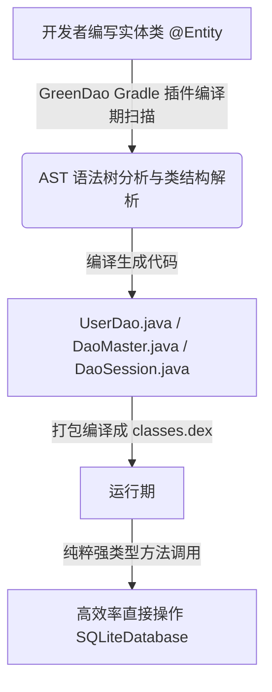
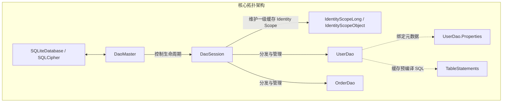
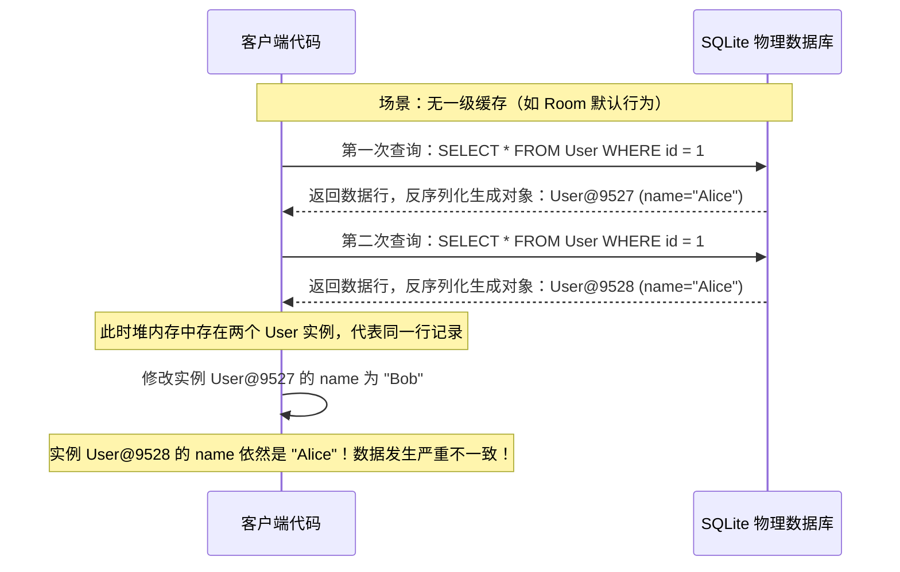
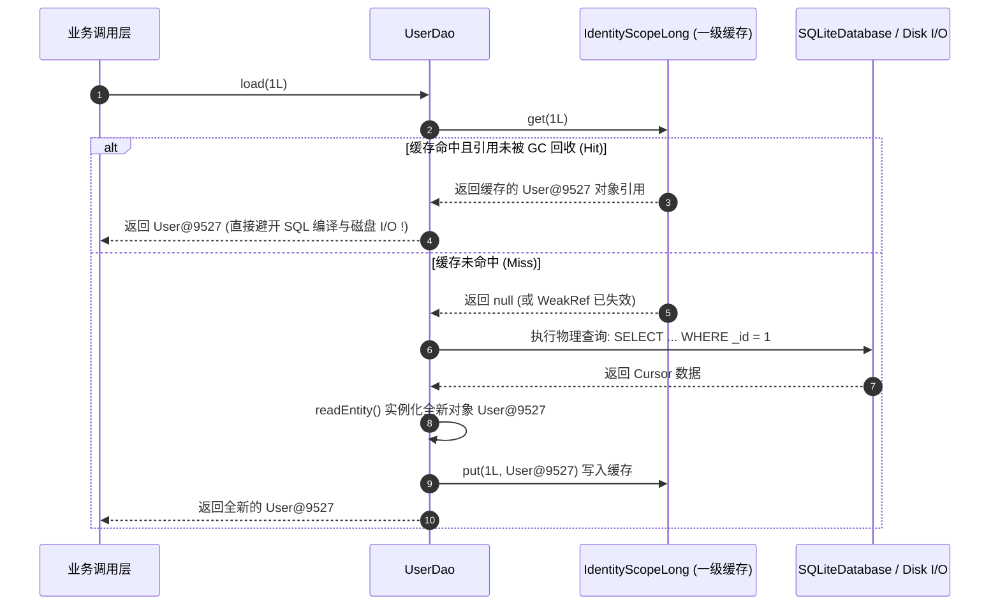
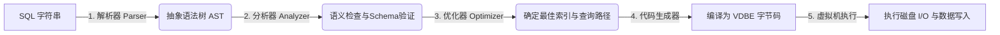
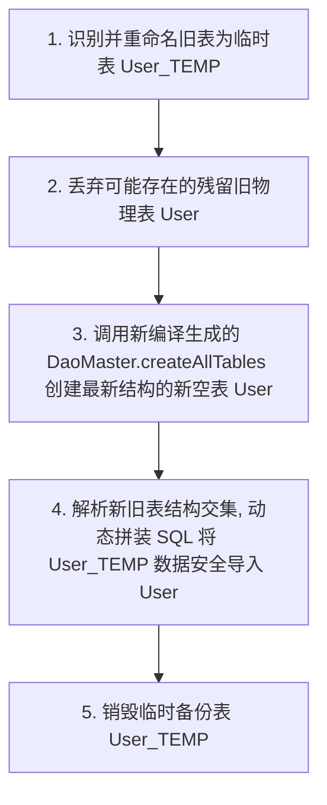

# 5.3.5.1 GreenDao

在 Android 移动端开发的历史长河中，数据库持久化技术经历了几次重要的范式演进。从早期的原生手写 SQL 语句与 `Cursor` 结果集解析，到以 `OrmLite`、`GreenDao` 为代表的经典 ORM（对象关系映射）框架，再到如今 Google 官方主推的 Jetpack `Room` 组件。在这其中，`GreenDao` 凭借其极致的性能、极低的内存开销以及精妙的架构设计，统治了 Android 数据库框架相当长的一段时间。

本篇文章将从底层物理机制、源码架构演进、性能优化本质以及工业级高可用方案等维度，对 GreenDao 的核心机制进行全面且深入的剖析。

---

## 1. ORM 设计哲学与 SQLite 裸奔痛点

在探究 GreenDao 的实现细节之前，我们需要首先理清一个核心命题：**在 Android 原生 SQLite 时代，直接使用原生 API（俗称“裸奔”）究竟有哪些难以忍受的痛点？GreenDao 又是如何通过其特有的设计哲学解决这些痛点的？**

### 1.1 Android 原生 SQLite 的开发痛点
在没有 ORM 框架的时代，开发者通常需要直接面对 `SQLiteOpenHelper` 和 `SQLiteDatabase`。以下是原生开发的几个核心硬伤：

#### 1.1.1 样板代码冗余与高出错率
在原生开发中，为了将一个简单的实体类（如 `User`）存入数据库，我们需要手动编写大量的拼装代码：
```java
// 插入数据时的 ContentValue 手动装载
ContentValues values = new ContentValues();
values.put("id", user.getId());
values.put("name", user.getName());
values.put("age", user.getAge());
db.insert("user", null, values);

// 查询数据时的 Cursor 手动解析
Cursor cursor = db.query("user", null, null, null, null, null, null);
List<User> userList = new ArrayList<>();
if (cursor != null && cursor.moveToFirst()) {
    do {
        long id = cursor.getLong(cursor.getColumnIndexOrThrow("id"));
        String name = cursor.getString(cursor.getColumnIndexOrThrow("name"));
        int age = cursor.getInt(cursor.getColumnIndexOrThrow("age"));
        
        User user = new User(id, name, age);
        userList.add(user);
    } while (cursor.moveToNext());
}
```
在这段看似简单的代码中，隐藏了巨大的隐患：
* **编译期无法发现的 SQL 语法与表结构错误**：字段名 `"id"`、`"name"`、`"age"` 全是硬编码字符串。如果某次重构修改了表字段，或者开发者不小心拼错了一个字母，编译器无法给出任何警告，错误只有在运行时执行到该行代码时才会以 `SQLiteException` 的形式爆发。
* **线性查找性能损耗**：每次调用 `cursor.getColumnIndexOrThrow("name")`，SQLite 驱动都需要在 `Cursor` 的列名数组中进行一次 $O(N)$ 的线性查找。当数据量极大或查询字段极多时，这种高频的字符串对比会产生明显的性能损耗。
* **JNI 跨界调用开销**：Android 的 Java 层 SQLite 实际上只是对底层的 C++ SQLite 引擎的一层薄封装。每次通过 Java 调用数据库操作，都需要跨越 JNI 边界，进入 C++ 层进行解析和执行。如果操作过于碎片化，高频的 JNI 调用切换本身就是一种不小的 CPU 开销。

#### 1.1.2 频繁的垃圾回收（GC）与内存抖动
在解析 `Cursor` 的过程中，我们需要高频地创建临时对象：
1. **`Cursor` 对象的创建**：原生 `Cursor` 底层通过 Android 的 Binder 机制与共享内存 `CursorWindow` 进行跨进程数据传输，其创建与销毁伴随着大量的 C++ 层资源申请与释放。
2. **`CursorWindow` 的共享内存限制**：在 Android 系统中，Cursor 检索的数据默认存储在 `CursorWindow` 中，其大小限制为 2MB。如果一次查询的数据量太大，Cursor 就会频繁打穿 `CursorWindow` 的边界，导致底层多次向底层 C++ 引擎请求新的共享内存页或重新发起 IPC 跨进程通信，拖慢整体查询时间。
3. **基本数据类型的装箱与拆箱**：在手动解析数据并填充实体类时，我们频繁地在基本数据类型（如 `long`, `int`）与 Java 包装类型之间进行转换。
4. **海量实体对象的频繁实例化**：如果一次性从数据库中查询出 1000 条记录，我们必须在循环中执行 1000 次 `new User(...)`。这些短命的临时对象会在极短的时间内占满 JVM 堆内存的新生代（Eden 区），从而高频触发 Art 虚拟机的 Minor GC（GC_FOR_ALLOC）。
5. **深入 ART 虚拟机的并发 GC 机制**：
   从 Dalvik 时代的“Stop-The-World”垃圾回收器，到 ART 虚拟机的并发复制垃圾回收器（Concurrent Copying GC），虽然 Android 系统对于垃圾回收的暂停时间进行了极大的压榨，使其降到了几毫秒甚至几十微秒级别。但是在多线程高负载情况下，垃圾回收线程在后台执行垃圾标记、内存规整和对象复制时，仍然会大量侵占 CPU 核心资源。
   当 GC 线程与主线程并发运行时，会导致主线程的 CPU 时间片被严重抢占。一旦主线程在处理 Choreographer 的 VSync 帧渲染回调时因为 CPU 调度延迟而无法按时提交绘制指令，就会直接引发 UI 掉帧、卡顿（Jank）。

#### 1.1.3 复杂的生命周期管理与资源泄漏
`Cursor` 和 `SQLiteDatabase` 都属于系统紧缺资源，必须严格保证在执行完操作后关闭（`close`）。在复杂的业务链路和多线程并发环境下，如何确保在各种异常分支下这些连接和游标都能被正确释放，是一件极其考验开发者心智的繁琐工作。

---

### 1.2 早期 ORM 框架的硬伤：运行时的反射黑洞
为了消除上述痛点，诸如 `OrmLite`、`ActiveAndroid` 等早期 Android ORM 框架应运而生。它们的核心思路是：**通过 Java 注解（Annotation）和运行时反射（Reflection）来自动化完成实体类与数据库表之间的双向映射。**

然而，这种设计在 Android 平台上面面临着灾难性的性能瓶颈。

#### 1.2.1 为什么反射在 Android 虚拟机上是性能杀手？
1. **方法与字段检索开销**：在运行时，当框架需要将一条 `Cursor` 记录赋值给实体类时，它必须先调用 `Class.getDeclaredFields()` 获取类的所有字段。这需要 ArtVM 遍历类的元数据结构。
2. **安全检查开销**：为了访问私有属性，框架必须对每个 `Field` 执行 `field.setAccessible(true)`，这会触发 Java 的安全管理器进行访问权限检查，耗费 CPU 周期。
3. **无法享受 JIT/AOT 优化**：Android 虚拟机的 JIT（即时编译）和 AOT（预编译）编译器对于反射调用非常无能为力。编译器无法将反射的读写操作内联（Inline）到调用处，也无法对其进行指令重排等底层硬件级优化。
4. **无法避免局部变量逃逸分析（Escape Analysis）失败**：
   在 Java 虚拟机中，如果一个对象被判定为没有发生逃逸（即它的生命周期被局限在方法执行的局部栈帧内），编译器就可以对其执行极其高效的优化，例如栈上分配（Stack Allocation）或标量替换（Scalar Replacement），从而规避在堆内存上创建对象。
   然而，通过反射机制（`Field.set` 或 `Method.invoke`）读写属性时，反射方法的参数都是 `Object[]` 数组，这使得编译器无法在静态编译期追踪对象的生命周期，逃逸分析必然失败。最终，所有的基本类型和临时属性都必须被强制在堆内存上分配，进一步加剧了新生代的 GC 回收压力。
5. **内存占用与方法区抖动**：频繁反射会产生大量的运行时元数据对象（如 `Method`、`Field` 实例），这些对象虽然生命周期短，但会占用大量的方法区和堆内存，加剧内存压力。

在 PC 端，由于 CPU 算力强大、JVM 垃圾回收器先进，反射带来的开销可能并不明显。但在移动端（尤其是早期的双核、四核低性能 Android 设备上），频繁大批量反射读写会使数据库操作耗时成倍增加，性能甚至不如手写原生 SQL 的十分之一。

---

### 1.3 GreenDao 的设计哲学：“零反射，代码生成”
为了彻底打破“开发效率”与“运行性能”不可兼得的魔咒，GreenDao 提出了极为纯粹的设计哲学：**将所有的映射关系和数据转换逻辑，从“运行时反射”提前到“编译期生成”。**



GreenDao 通过其 Gradle 插件，在项目编译构建的早期阶段（Generate Sources）对标注了 `@Entity` 的类进行语法分析。插件会为每个实体类生成一个专门的 `*Dao` 类（例如 `UserDao`）。

在这个生成的 `*Dao` 类中，所有关于 SQL 语句拼装、字段索引查询、数据转换解析的代码，全部被翻译成了纯粹的、无反射的强类型 Java 代码：
```java
// GreenDao 编译期生成的 UserDao.java 核心读写逻辑片段
@Override
public User readEntity(Cursor cursor, int offset) {
    User entity = new User(
        cursor.isNull(offset + 0) ? null : cursor.getLong(offset + 0), // id
        cursor.isNull(offset + 1) ? null : cursor.getString(offset + 1), // name
        cursor.getInt(offset + 2) // age
    );
    return entity;
}
```
**这种设计的本质优势在于：**
1. **执行路径最短**：运行时完全没有任何反射操作，所有的字段赋值和类型转换都是最直接的 Java 方法调用。其性能和开发者手写的高质量原生代码完全一致，甚至更优。
2. **类型安全检查提前**：因为所有的 `Dao` 都是强类型的，如果在实体类中将某个字段的类型从 `int` 改为了 `String`，编译器会在编译期直接报错，从而将隐患消灭在开发阶段。
3. **极度轻量级**：由于不需要引入庞大的反射辅助库，GreenDao 的 runtime 库体积非常小（通常只有几十 KB），对 APK 包体积的影响微乎其微。
4. **编译期可调试性**：相比于动态修改字节码（如使用 ASM 字节码插桩或 AspectJ）的底层框架，编译期生成 Java 源代码的 GreenDao 允许开发者直接点进生成的 `UserDao` 中打断点调试，这极大地降低了框架内部逻辑排障的难度。

---

## 2. 编译期生成与三大核心组件源码级角色解密

在 GreenDao 的日常使用中，我们最常打交道的就是 `DaoMaster`、`DaoSession` 以及具体的 `*Dao`。它们是 GreenDao 架构的基石。要想彻底吃透 GreenDao，就必须解密这三大组件在源码层所扮演的角色与职责。



### 2.1 DaoMaster：全局数据库管理者与连接句柄持有者
`DaoMaster` 继承自 `AbstractDaoMaster`。在整个应用程序的生命周期中，它通常扮演着全局单例的角色，主要职责如下：

#### 2.1.1 持有底层物理数据库的连接
`DaoMaster` 内部持有 `Database` 接口的实例。这个 `Database` 是 GreenDao 对 Android 原生 `SQLiteDatabase` 的一层封装。如果项目中引入了加密数据库 `SQLCipher`，`DaoMaster` 就可以无缝切换为持有加密 of 数据库连接，而对上层的业务逻辑保持完全透明。

#### 2.1.2 管理数据库的创建与升级生命周期
`DaoMaster` 中定义了静态内部类 `OpenHelper`。它继承自 Android 原生的 `SQLiteOpenHelper`：
```java
public static abstract class OpenHelper extends SQLiteOpenHelper {
    public OpenHelper(Context context, String name, CursorFactory factory) {
        super(context, name, factory, SCHEMA_VERSION);
    }

    @Override
    public void onCreate(SQLiteDatabase db) {
        Log.i("greenDAO", "Creating tables for schema version " + SCHEMA_VERSION);
        createAllTables(new StandardDatabase(db), false);
    }
}
```
* **`createAllTables(Database db, boolean ifNotExists)`**：遍历并调用所有生成 `*Dao` 类中的静态建表方法（如 `UserDao.createTable(db, ifNotExists)`），一次性完成所有数据表的物理创建。
* **`dropAllTables(Database db, boolean ifExists)`**：遍历调用所有 `*Dao` 中的 `dropTable(db, ifExists)`，销毁数据库中的所有表。
* **`DevOpenHelper`**：`DaoMaster` 默认提供的一个便捷辅助类。**请务必注意：其 `onUpgrade` 方法会在数据库版本升级时，粗暴地先调用 `dropAllTables` 再调用 `onCreate`，这会导致用户本地的所有历史数据被彻底清空！**（我们在后文会详细讨论如何用无损迁移方案取而代之）。

#### 2.1.3 充当 DaoSession 的工厂类
`DaoMaster` 提供了 `newSession()` 方法。每次调用该方法，都会实例化一个新的 `DaoSession`，并传入当前持有的数据库连接以及所有表的映射配置信息（`DaoConfig`）。

---

### 2.2 DaoSession：会话生命周期管理器与 Identity Scope 容器
`DaoSession` 继承自 `AbstractDaoSession`。如果说 `DaoMaster` 代表的是一个静态的数据库连接，那么 `DaoSession` 则代表着一次具体的、动态的**数据库操作会话**。

#### 2.2.1 统一管理所有的 *Dao 实例
在 `DaoSession` 初始化时，它会为每一个实体类注册并实例化对应的 `*Dao` 对象，并以成员变量的形式暴露给上层：
```java
public class DaoSession extends AbstractDaoSession {
    private final DaoConfig userDaoConfig;
    private final UserDao userDao;

    public DaoSession(Database db, IdentityScopeType type, Map<Class<? extends AbstractDao<?, ?>>, DaoConfig> daoConfigMap) {
        super(db);

        userDaoConfig = daoConfigMap.get(UserDao.class).clone();
        userDaoConfig.initIdentityScope(type); // 初始化一级缓存类型

        userDao = new UserDao(userDaoConfig, this);
        registerDao(User.class, userDao);
    }

    public UserDao getUserDao() {
        return userDao;
    }
}
```
通过这种设计，开发者不需要手动去实例化各种 `Dao`，只需要通过 `daoSession.getUserDao()` 即可获取，保证了整个会话周期内 `Dao` 实例的单一性与高内聚。

#### 2.2.2 维护一级缓存 Identity Scope
这是 `DaoSession` 最核心、最精妙的设计。`DaoSession` 为每个注册的 `DaoConfig` 初始化并持有对应的 `IdentityScope`。这保证了在当前 Session 会话的生命周期内，内存中永远只会存在数据库同一行记录（相同主键）的唯一一个 Java 对象实例。关于这一机制的底层物理实现，我们将在第三部分进行全面起底。

#### 2.2.3 提供会话级的事务管理
`DaoSession` 继承自 `AbstractDaoSession`，这使得它天生具备了在会话级别运行事务的能力。比如，它提供了 `runInTx(Runnable runnable)` 和 `callInTx(Callable<V> callable)` 方法。在方法内部，`DaoSession` 会动态获取当前底层的物理数据库连接，并开启事务。
这意味着你可以在同一个事务块中安全地执行 `userDao` 的插入操作和 `orderDao` 的更新操作，而不需要将代码写在某一个特定的 `Dao` 中。这种高内聚的事务机制，在保证业务逻辑清晰的同时，实现了数据库连接的独占，规避了由于多线程并发争抢连接而造成的死锁隐患。
在实现上，为了确保多线程环境下事务状态的正确隔离，`AbstractDaoSession` 内部还巧妙地通过 `ThreadLocal` 或线程锁来管理当前的事务上下文，防止了多线程事务状态的交叉穿透。

---

### 2.3 *Dao（如 UserDao）：数据实体映射元数据与操作执行者
具体的 `*Dao` 类继承自 `AbstractDao`，是直接与数据库游标和底层 SQL 语句打交道的实体。它承载了绝大部分由编译期生成的数据访问逻辑。

#### 2.3.1 属性元数据容器：静态内部类 `Properties`
在生成的 `UserDao` 中，会包含一个静态内部类 `Properties`：
```java
public static class Properties {
    public final static Property Id = new Property(0, Long.class, "id", true, "_id");
    public final static Property Name = new Property(1, String.class, "name", false, "NAME");
    public final static Property Age = new Property(2, Integer.class, "age", false, "AGE");
}
```
`Property` 对象中封装了列的索引（如 `0`）、数据类型（如 `Long.class`）、Java 字段名（如 `"id"`）、是否为主键（`true`）以及底层物理表的列名（如 `"_id"`）。
上层的 `QueryBuilder` 在拼装条件时，通过传入 `UserDao.Properties.Name.eq("Alice")`，即可在编译期保证查询字段和类型的完全正确，避免了硬编码字符串的痛点。

#### 2.3.2 绑定实体属性值到预编译 SQL 语句：`bindValues`
当需要将一个 `User` 实体保存到数据库时，`UserDao` 必须将实体的值绑定到 `SQLiteStatement` 中。这一逻辑是通过生成的 `bindValues` 完成的：
```java
@Override
protected final void bindValues(DatabaseStatement stmt, User entity) {
    stmt.clearBindings();
    
    Long id = entity.getId();
    if (id != null) {
        stmt.bindLong(1, id);
    }
 
    String name = entity.getName();
    if (name != null) {
        stmt.bindString(2, name);
    }
 
    Integer age = entity.getAge();
    if (age != null) {
        stmt.bindLong(3, age);
    }
}
```
这一过程**完全摒弃了反射**，而是针对每个字段类型调用具体的 `bindLong`、`bindString` 方法。其执行速度直接逼近底层 SQLite 驱动的物理极限。

#### 2.3.3 支持多表级联解析的游标位置偏移量（Cursor Offset）
在生成的 `UserDao` 中，我们还会看到诸如 `readEntity(Cursor cursor, int offset)` 的方法。
这里的 `offset` 偏置量是专门为了多表级联查询（例如 `JOIN` 操作）而设计的。当 GreenDao 执行多表关联查询时，底层的物理 `Cursor` 返回的一行数据可能同时包含了 `USER` 表的 3 列和 `PROFILE` 表的 5 列。
在解析时，`UserDao` 传入 `offset = 0` 解析前 3 列，而 `ProfileDao` 则传入 `offset = 3` 解析后 5 列。这种极具远见的设计避免了由于多表联查导致的列名冲突，同时也消除了反复创建临时小游标解析的性能瓶颈。

---

## 3. Identity Scope（一级缓存）底层物理机理解密

在 GreenDao 的官方宣讲中，**“快”**是其最核心的卖点。而在其众多优化手段中，**Identity Scope（一级缓存）**无疑是其能够在大批量、高频次查询场景下傲视群雄的最核心功臣。

### 3.1 什么是 Identity Scope（标识范围）？
在数据库持久化领域，**Identity Map（标识映射）**是一种经典的架构模式。它的核心定义是：**确保在同一个 Session 会话周期内，如果多次查询数据库中主键为 K 的同一条记录，返回的永远是内存中同一个 Java 对象实例。**

为了理解其必要性，我们来看一个不使用一级缓存的反面场景：



如果内存中同时存在多个代表数据库同一行记录的对象，一旦某个模块修改了其中一个对象的属性，其他持有另外对象引用的模块就无法感知这一变化，从而导致 UI 数据错乱或业务逻辑漏洞。

而 GreenDao 的 `IdentityScope` 就是这一问题的终极克星。它在内存中建立了一道坚固的防线：



---

### 3.2 底层物理实现双轨设计：`IdentityScopeObject` 与 `IdentityScopeLong`
为了在性能上追求极致，GreenDao 并没有简单地使用一个全局通用的 `Map<Object, Object>`，而是针对主键的数据类型，设计了**双轨缓存系统**：

1. **`IdentityScopeObject<K, T>`**：针对非 long 类型主键（如 `String`, `UUID` 等）。其底层使用标准的 Java `HashMap<K, Reference<T>>` 实现。
2. **`IdentityScopeLong<T>`**：针对 `long` 或 `Long` 类型的主键。这是 GreenDao 的独家绝活，其底层摒弃了 Java 的 `HashMap`，转而使用其自主研发的**特化容器 `LongHashMap<Reference<T>>`**。

#### 3.2.1 为什么标准的 `HashMap<Long, T>` 是移动端的性能黑洞？
在 Java 中，当我们要把一个 `long` 作为 `HashMap` 的 Key 时，由于泛型的限制，必须将其包装为 `Long` 对象。这会带来以下致命开销：
* **频繁自动装箱（Autoboxing）**：每次 `put(1L, value)` 或 `get(1L)`，都会隐式调用 `Long.valueOf(1L)`。这会在 JVM 堆中创建一个全新的 `Long` 实例（超出 -128~127 缓存范围时）。
* **对象头与内存对齐开销**：在 64 位 ART 虚拟机上，一个空的 `Long` 对象包含 12 字节的对象头，加上 8 字节的 long 数据，在经过 8 字节对齐后，会白白占用 **24 字节**的内存空间。而一个原生的 `long` 只需要 **8 字节**。
* **`HashMap$Node` 的链表节点开销**：标准的 `HashMap` 在插入数据时，会为每个键值对创建一个 `Node`（或 `Entry`）对象。该对象包含 `hash` (int)、`key` (Long)、`value` (T) 以及 `next` 指针。这使得实际占用的内存急剧膨胀，且链表检索会导致 CPU 缓存行（Cache Line）频繁失效。

#### 3.2.2 `LongHashMap` 的底层物理架构设计与碰撞扩容机制
为了规避上述开销，GreenDao 自研的 `LongHashMap` 采用了类似原生数组的紧凑存储结构：
```java
// GreenDao 内部 LongHashMap 核心数据结构简化示意
public final class LongHashMap<T> {
    private Entry<T>[] table; // 哈希桶数组
    private int capacity;      // 桶容量
    private int threshold;     // 扩容阈值
    private int size;          // 当前存储的键值对数量

    // 静态内部类 Entry，直接使用原生 long 存储 key
    static final class Entry<T> {
        final long key;        // 原生 long，完全消除了 Long 装箱！
        T value;               // 对应的缓存对象引用（此处包装了 Reference）
        Entry<T> next;         // 链表指针，解决哈希冲突

        Entry(long key, T value, Entry<T> next) {
            this.key = key;
            this.value = value;
            this.next = next;
        }
    }
    
    // 查询操作：直接按 long 寻址，效率极高
    public T get(long key) {
        // 哈希散列计算，采用的是针对 long 的快速位运算哈希算法
        int index = ((((int) (key ^ (key >>> 32))) & 0x7fffffff) % capacity);
        for (Entry<T> entry = table[index]; entry != null; entry = entry.next) {
            if (entry.key == key) {
                return entry.value;
            }
        }
        return null;
    }
}
```
**哈希冲突与扩容机制剖析**：
* **位散列算法设计**：`LongHashMap` 采用 `key ^ (key >>> 32)` 将 long 主键的高 32 位与低 32 位进行异或运算。这种设计对于整型主键（尤其是常见的 1, 2, 3... 这种自增 ID）能够使得哈希散列极其均匀，彻底规避了哈希聚集现象。
* **拉链法冲突处理**：当发生哈希冲突时，`LongHashMap` 使用单向链表结构处理冲突。相比于 JDK 8 `HashMap` 当链表长度大于 8 时将其转化为红黑树（Treeify）的设计，`LongHashMap` 依然固守简单的单链表。这是因为在移动端缓存中，单表的一级活跃缓存节点数通常在几十到几百个，且由于弱引用释放机制的存在，无用的引用节点会随时被 GC 剔除，发生冲突的概率极低。引入红黑树反而会因为创建复杂的 TreeNode 节点带来多余的对象头内存开销，拖慢性能。
* **扩容阈值（Threshold）**：当当前 size 超过扩容阈值（默认通常为当前容量的 2/3，即负载因子约为 0.66）时，`LongHashMap` 会进行重新哈希（Rehash）。桶数组的容量会翻倍扩容，并对当前已有的所有节点重新分配槽位。

---

### 3.3 一级缓存的引用策略：强引用与弱引用的权衡
在 `IdentityScope` 中，缓存的 `value` 并不是直接持有实体对象，而是将其包裹在引用对象（`Reference`）中：
* **强引用（Strong Reference）**：如果在配置时指定了缓存为强引用，GreenDao 就会直接持有实体对象的引用。这能保证对象绝对不被 GC 回收，缓存命中率 100%。但如果一次性查询了数万条数据，这些对象将常驻内存，极易导致 OOM。
* **弱引用（WeakReference，默认策略）**：GreenDao 默认将实体对象包裹在 `WeakReference` 中：
  ```java
  // 放入缓存时，使用弱引用进行包装
  table[index] = new Entry<T>(key, new WeakReference<T>(value), next);
  ```
  **弱引用的设计哲学与选型依据**：
  为什么 GreenDao 默认选用 `WeakReference`（弱引用）而不是 `SoftReference`（软引用）？
  * 软引用的回收策略是：只有当系统的可用内存严重不足，即将爆发 OutOfMemory 异常之前，垃圾回收器才会强制对软引用对象进行回收。在 Android 这样多进程竞争极其惨烈、前台 App 随时面临着被低内存杀手（Low Memory Killer）清理的环境下，长期积压软引用会导致 App 进程的物理常驻内存（PSS）持续偏高，极大加剧了前台 App 被系统后台杀死的概率。
  * 弱引用的回收策略是：只要发生垃圾回收，并且此时该对象外部已经没有任何强引用指向它，GC 就会在下一次扫描时立即无情地将它清理掉。
  对于数据库缓存来说，只要上层的 `Activity`、`RecyclerView` 或者是后台的常驻业务逻辑还在强引用持有着这个实体对象，说明该数据当前处于“活跃生命周期”，我们就必须保证它在 `IdentityScope` 中的映射唯一；而一旦这些页面销毁，说明数据已经不再被关注，弱引用就会配合 GC 将其默默清理。这在“数据唯一性保证”与“内存极速自愈”之间取得了堪称艺术般的平衡。

---

### 3.4 `load(key)` 底层源码拦截链路起底
我们以 `userDao.load(1L)` 为例，追踪其在源码中的具体执行链路：

```java
// AbstractDao.java 源码分析
public T load(K key) {
    assertSinglePk();
    if (key == null) {
        return null;
    }
    // 1. 判断是否开启了一级缓存
    if (identityScope != null) {
        // 2. 尝试从缓存中提取
        T entity = identityScope.get(key);
        if (entity != null) {
            return entity; // 3. 缓存命中：直接返回，规避所有 DB 物理操作！
        }
    }
    
    // 4. 缓存未命中：执行物理 SQL 查询
    // 4.1 从预编译语句缓存（TableStatements）中获取主键查询语句
    DbLimit databaseStatement = statements.getSelectByKeyStmt();
    // 4.2 绑定主键参数值
    String[] bindArgs = { key.toString() };
    
    // 4.3 执行数据库物理 I/O，获取 Cursor
    Cursor cursor = db.rawQuery(databaseStatement.getSql(), bindArgs);
    try {
        return loadUniqueAndCloseCursor(cursor);
    } finally {
        cursor.close();
    }
}

// 5. 反序列化与回写缓存
protected T loadUniqueAndCloseCursor(Cursor cursor) {
    try {
        boolean available = cursor.moveToFirst();
        if (!available) {
            return null;
        }
        
        // 5.1 解析游标数据，并实例化对象
        T entity = readEntity(cursor, 0);
        
        // 5.2 核心一步：将读取出的实体放入缓存，供下次拦截使用！
        attachEntity(entity); 
        
        return entity;
    } finally {
        cursor.close();
    }
}

protected final void attachEntity(K key, T entity, boolean onlyInMemory) {
    if (identityScope != null && key != null) {
        identityScope.put(key, entity);
    }
}
```

通过这一层层精妙的拦截，GreenDao 将大量的查询请求挡在了物理磁盘 I/O 之外，将其转化为极快、极轻量级的堆内存哈希寻址。

---

## 4. 极致性能调优三板斧

在理解了零反射和一级缓存后，我们来看一下 GreenDao 在底层执行 SQL 物理操作时，为了压榨数据库极限性能所采取的“三板斧”调优手段。

### 4.1 第一斧：SQLiteStatement 编译缓存复用
在底层物理操作上，GreenDao 是如何做到比原生 API 更快的？答案是：**对 `SQLiteStatement` 进行极其苛刻的缓存与复用。**

#### 4.1.1 为什么频繁执行 SQL 字符串极慢？
在 SQLite 中，当通过 `db.execSQL("INSERT INTO USER ...")` 传入一个普通 SQL 字符串时，SQLite 引擎需要执行一整套复杂的编译管道（Compilation Pipeline）：



如果我们需要在一个循环中执行 1000 次插入，传入了 1000 个不同的 SQL 字符串，上述 1 到 4 步的编译动作就会被重复执行 1000 次。这科学上是极大的 CPU 算力浪费。

#### 4.1.2 `SQLiteStatement` 的编译缓存机制
`SQLiteStatement` 相当于数据库层面的**预编译 SQL 模板**（类似于 JDBC 中的 `PreparedStatement`）。它允许我们将一条带有占位符（`?`）的 SQL 语句在编译期或首次执行时预编译成底层的 VDBE 字节码。在后续的调用中，只需把具体的数据绑定到参数槽中，即可直接跳过前 4 步的编译动作，直接进入虚拟机执行阶段。

GreenDao 在生成的每个 `*Dao` 类内部，通过 `TableStatements` 对这些预编译的 `SQLiteStatement` 进行了严密的缓存：
```java
// TableStatements.java 源码分析片段
public class TableStatements {
    private final Database db;
    private final String sql;
    private DatabaseStatement insertStatement; // 缓存的插入语句
    private DatabaseStatement updateStatement; // 缓存的更新语句
    private DatabaseStatement deleteStatement; // 缓存的删除语句
    
    // 延迟懒加载获取 Statement，如果已缓存则直接复用
    public DatabaseStatement getInsertStatement() {
        if (insertStatement == null) {
            // 预编译 SQL 语句模板：INSERT INTO "USER" ("NAME","AGE") VALUES (?,?)
            insertStatement = db.compileStatement(sql); 
        }
        return insertStatement;
    }
}
```
**并发安全与锁设计**：
为了防止多个线程在并发执行同一 `Dao` 的操作时篡改同一个缓存的 `DatabaseStatement`（因为 `SQLiteStatement` 是非线程安全的，如果多个线程同时往参数槽中绑定值，会导致数据覆盖与混乱），GreenDao 在 `DatabaseStatement` 的操作方法上加了同步锁（`synchronized`），或者在执行时通过 `synchronized(statement)` 保证独占。

此外，为了在极致高并发的场景下不影响其他读取操作，GreenDao 并没有对整个 `Dao` 级别加锁，而是将锁细粒度化到了具体的操作语句 `Statement` 上。这样在执行批量写入插入时，其他的只读查询（由于调用的是不同的 `statements` 或者底层的 `rawQuery`）可以几乎无阻塞地并发进行，极大释放了数据库驱动的吞吐能力。

在更深层次的 SQLite 引擎中，如果数据库没有配置为多连接的连接池模式，底层的 C++ `sqlite3` 本身也会通过互斥锁（Mutex）对写连接进行串行化（Serialized）限制。即便如此，GreenDao 在 Java 层的细粒度同步锁仍然极大地减少了锁的颗粒度，从而在虚拟机多线程竞争切换时，降低了线程被频繁挂起再唤醒的上下文切换（Context Switch）高昂开销。

---

### 4.2 第二斧：事务（Transaction）物理写入合并优化（百倍加速之谜）
很多 Android 开发者都经历过一个现象：**在循环中调用 `insert(user)` 插入 1000 条数据需要十几秒甚至半分钟，而调用 `insertInTx(userList)` 却只需几十毫秒。这几十到上百倍的性能鸿沟是如何产生的？**

#### 4.2.1 单条循环插入的物理瓶颈：磁盘 fsync 与 ACID 持久性
SQLite 默认工作在**自动提交（Auto-commit）**模式下。这意味着如果不显式开启事务，每一条独立的 `insert` 语句都会被 SQLite 驱动当作一个独立的事务来执行：
```
START TRANSACTION -> INSERT ... -> COMMIT TRANSACTION
```
为了保证 ACID 特性中的 **D（Durability，持久性）**，每次提交事务时，SQLite 物理引擎必须完成以下底层动作：
1. **双写日志（Double-write Journaling）**：为了防止写入中途断电导致数据页损坏，SQLite 必须先把要修改的页面写入回滚日志文件（`.db-journal`）中。
2. **操作系统页缓存刷新**：将修改后的数据刷入操作系统的文件缓冲区。
3. **强行刷盘（`fsync`）**：调用操作系统的 `fsync()` 系统调用，强行使 CPU 挂起，等待底层物理存储介质（如闪存颗粒 UFS/SSD）的控制器将缓冲区的数据真正物理擦写写入物理介质，并返回确认标志。

**为什么刷盘极其缓慢？**
物理闪存设备（Flash Memory）的最小读写单位是页（Page，通常为 4KB），但最小擦除单位是块（Block，通常为 512KB 或更高）。为了修改一页数据，闪存控制器往往需要执行“读出旧块 -> 擦除整块 -> 写入新块”的复杂重构动作（垃圾回收）。
在 Android 设备采用的文件系统（如 ext4 或专门优化的 F2FS）中，高频调用 `fsync()` 会导致文件系统发起写入屏障（Write Barrier）。这会导致 CPU 的 I/O 队列瞬间积压，闪存芯片不断执行随机擦写操作，产生极其严重的 I/O 阻塞。1000 次单条插入就意味着 1000 次物理刷盘，在性能一般的设备上，这需要耗时 **15 到 30 秒**！

#### 4.2.2 批量写入 `insertInTx` 的物理合并机制
当我们将 1000 条数据包裹在 `insertInTx()` 中时，其核心源码逻辑如下：
```java
// AbstractDao.java 源码分析
public void insertInTx(Iterable<T> entities) {
    // 1. 显式开启一个全局大事务
    db.beginTransaction();
    try {
        // 2. 复用 TableStatements 中的 insertStatement
        DatabaseStatement stmt = statements.getInsertStatement();
        synchronized (stmt) {
            for (T entity : entities) {
                // 3. 仅在内存中绑定参数并执行写入（修改的是 Page Cache 页缓存）
                bindValues(stmt, entity);
                stmt.executeInsert();
            }
        }
        // 4. 标记事务执行成功
        db.setTransactionSuccessful();
    } finally {
        // 5. 提交并结束事务
        db.endTransaction();
    }
}
```
**物理写合并的化学反应：**
在整个循环过程中，所有的参数绑定和数据写入都只是修改了操作系统在内存中开辟的 **Page Cache（页面缓存）**，完全没有任何物理磁盘的写动作。
只有在第 5 步 `db.endTransaction()` 被调用的一瞬间，SQLite 才会发起**唯一一次**底层的 `fsync` 系统调用，将这 1000 条插入所涉及的所有内存修改页，一次性批量顺序写入物理介质中。

即使在现代 SQLite 引入的 **WAL（Write-Ahead Log，预写日志）模式**下，虽然随机写变为了顺序写，大大优化了小写入的瓶颈，但是高频提交事务仍然会导致 WAL 文件频繁触发 `fsync`。因此，通过大事务进行“合并写入”，在任何日志模式下依然是性能优化的王道之选。

**总结**：1000 次物理 I/O 被合并为了 1 次物理 I/O，性能自然提升了上百倍。

---

### 4.3 第三斧：动态懒加载与关联查询（@ToOne, @ToMany）
在复杂的业务场景中，表与表之间往往存在关联关系（如一个 `User` 关联一个 `Profile` 实体，或者一个 `User` 关联多个 `Order` 实体）。

如果我们在查询 `User` 时，像后端开发那样使用复杂的 `LEFT JOIN` 一次性将所有的 `Profile` 和 `Order` 都拉取出来，在 Android 移动端会带来灾难：
1. **CursorWindow 限制**：Android 的 `Cursor` 结果集是由底层 C++ 的 `CursorWindow` 持有的，其大小上限通常被硬编码为 **2MB**。如果 JOIN 查询的数据行过宽，会导致 `CursorWindow` 迅速存满，引发多次数据跨进程传输（Binder）甚至内存溢出。
2. **`LazyList` 与懒加载数据结构设计**：
   在 GreenDao 中，为了控制一对多查询的堆内存消耗，GreenDao 提供了三种不同的延迟列表实现：
   * **`LazyList<T>`**：最基础的延迟列表。内部维护了一个 Cursor 游标和一个已加载对象的弱引用 Map。当调用 `get(index)` 时动态加载并缓存。
   * **`ListLazy<T>`**：内部没有对象缓存，每次调用 `get(index)` 时都动态通过 Cursor 重新解析并反序列化。适用于只需要遍历一次且极度节省堆内存的场景。
   * **`CachedLazyList<T>`**：内部采用强引用保存已经加载过的对象，确保在列表遍历时性能最优化。
3. **冗余对象实例化**：如果用户进入界面只是为了看一眼用户的名字，但我们却把其关联的 100 条订单记录全部拉取并实例化到了 Java 堆中，会造成极大的内存浪费和 GC 压力。

GreenDao 对此给出了**延迟代理流（Lazy Loading）**的动态懒加载方案：

#### 4.3.1 `@ToOne` 延迟代理设计
当我们声明一个一对一关联属性时：
```java
@Entity
public class User {
    @Id
    private Long id;
    
    private long profileId;
    
    @ToOne(joinProperty = "profileId")
    private Profile profile; // 关联的实体对象
}
```
GreenDao 会自动在生成的 `User` 类中实现以下逻辑：
```java
// 编译期自动生成的 User.java 关联查询代码
public Profile getProfile() {
    long __key = this.profileId;
    // 只有在业务层真正调用 getProfile() 时，才去执行二级查询！
    if (profile__resolvedKey == null || !profile__resolvedKey.equals(__key)) {
        DaoSession daoSession = this.daoSession;
        if (daoSession == null) {
            throw new DaoException("Entity is detached from DAO context");
        }
        ProfileDao targetDao = daoSession.getProfileDao();
        // 执行二级查询，并缓存结果
        Profile profileNew = targetDao.load(__key);
        synchronized (this) {
            this.profile = profileNew;
            profile__resolvedKey = __key;
        }
    }
    return profile;
}
```
通过延迟加载，只有在页面真正要展示 Profile 数据并触发 `getProfile()` 时，才会发起物理查询，极大地缩减了初始查询的内存开销。

#### 4.3.2 `@ToMany` 与 `LazyList` 的堆内存压制
对于一对多关联（如 `List<Order> orders`），GreenDao 在底层引入了 `LazyList`（延迟加载列表）。
`LazyList` 的核心机制在于：它虽然表现为一个 `List` 接口，但内部其实**物理地持有了底层的 `Cursor` 游标**。
* **延迟加载（Lazy Loading）**：当我们调用 `list.get(index)` 时，`LazyList` 会判断该位置的对象是否已经被加载。如果没有，它会内部移动 Cursor（`cursor.moveToPosition(index)`），动态解析当前行并实例化对象，然后将其放入内部的缓存中。
* **内存释放与游标管理**：`LazyList` 允许我们在不需要它时手动调用 `close()` 关闭底层的 Cursor 游标，或者配置为不缓存对象的弱引用模式。这保证了即使我们要遍历一个包含百万条记录的大表，堆内存中的实体对象也会在被处理完后随 GC 被随时回收，而不会一直常驻内存。

**开发警示**：
虽然 `LazyList` 在节省内存方面是一大利器，但由于它内部持有了底层的数据库 `Cursor` 连接，如果在遍历 `LazyList` 时在主线程执行（如在 `RecyclerView` 的 `onBindViewHolder` 中进行按需获取），一旦滑动速度过快，高频触发 Cursor 数据提取和 I/O 查询，依然会在主线程产生明显的“卡顿（Jank）”。因此，最佳实践应当是：在大列表展示时尽量不要使用 Lazy Loading，而是应该通过批量预查询将数据“拍平”为扁平化的视图实体（VO），在后台线程一次性读取完成。

---

## 5. 数据库版本无损迁移（Migration）自愈方案

在移动端开发中，App 版本的更新迭代是家常便饭。与之相伴的，是本地数据库表结构的升级（如新增列、修改字段约束、新增关联表等）。

### 5.1 默认 DevOpenHelper.onUpgrade 的灾难
如前文所述，如果我们直接使用 GreenDao 默认生成的 `DevOpenHelper`：
```java
public static class DevOpenHelper extends OpenHelper {
    @Override
    public void onUpgrade(Database db, int oldVersion, int newVersion) {
        Log.i("greenDAO", "Upgrading schema from version " + oldVersion + " to " + newVersion + " by dropping all tables");
        dropAllTables(db, true); // 直接清空所有旧表！
        onCreate(db);
    }
}
```
一旦我们的新版本 App 上线，数据库版本（`SCHEMA_VERSION`）发生改变，用户的本地数据库就会在一瞬间被**全部 DROP 掉**，用户本地保存的草稿、离线文章、本地聊天记录将彻底消失。这是线上绝对无法容忍的灾难级事故！

---

### 5.2 工业级无损迁移方案（Migration Helper）设计哲学
因为 SQLite 对 `ALTER TABLE` 命令的支持非常简陋（在早期的 Android 版本中，SQLite 不支持删除列、重命名列或修改字段约束，只支持在表尾新增列），为了实现一个绝对安全、在所有 Android Rom 上都具备极强鲁棒性的无损升级方案，行业通用的做法是采用 **“五步法”黄金升级环路（The Golden Migration Loop）**：



这五步机制的最大优势在于：
1. **隔离性强**：新表完全是通过编译期最新生成的 SQL 脚本创建的，其索引、主键约束和字段类型绝对正确。
2. **兼容性极佳**：通过从临时表数据迁移回新表时，只迁移“交集字段”。如果新版本删除了某个字段，该字段会自动在临时表中被遗弃；如果新版本新增了某个字段，该字段在导入新表时会自动被赋予默认值（或为 `NULL`）。
3. **事务强保证**：整套迁移逻辑必须被包裹在同一个大的数据库事务中。一旦中途发生任何未知异常（如磁盘写满、类型约束冲突），事务会彻底回滚，保证旧数据毫发无损。

---

### 5.3 工业级 Kotlin 源码实现：`GreenDaoMigrationHelper`
下面是一份可以直接应用于生产环境的、高内聚、高鲁棒性且完全用 Kotlin 编写的无损升级 Helper 类实现：

```kotlin
package com.example.db.migration

import android.database.Cursor
import android.text.TextUtils
import android.util.Log
import org.greenrobot.greendao.AbstractDao
import org.greenrobot.greendao.database.Database
import org.greenrobot.greendao.internal.DaoConfig
import java.lang.reflect.Method
import java.util.*

/**
 * 工业级 GreenDao 数据库无损升级迁移自愈工具类
 *
 * 采用“临时表备份 -> 新表重建 -> 交集字段回写 -> 临时表销毁”的核心闭环设计，
 * 彻底规避 SQLite ALTER TABLE 的局限性与兼容性问题。
 */
object GreenDaoMigrationHelper {

    private const val TAG = "MigrationHelper"
    private const val TEMP_TABLE_SUFFIX = "_TEMP"

    /**
     * 执行无损升级入口
     *
     * @param db 数据库实例
     * @param daoClasses 所有需要参与迁移或重新创建的 Dao 类（如 UserDao::class.java）
     */
    @SafeVarargs
    fun migrate(db: Database, vararg daoClasses: Class<out AbstractDao<*, *>>) {
        Log.i(TAG, "【开始执行数据库无损升级】==================================>")
        
        // 1. 强制开启数据库全局大事务，确保升级的“原子性（Atomicity）”
        db.beginTransaction()
        try {
            // 2. 步骤一：创建临时备份表并复制数据
            generateTempTables(db, *daoClasses)
            Log.i(TAG, "【步骤 1/5】临时表创建完毕，数据已备份。")

            // 3. 步骤二：丢弃物理旧表
            dropAllTables(db, true, *daoClasses)
            Log.i(TAG, "【步骤 2/5】物理旧表已安全丢弃。")

            // 4. 步骤三：利用编译期新生成的元数据，创建结构完美的新表
            createAllTables(db, false, *daoClasses)
            Log.i(TAG, "【步骤 3/5】最新结构的物理新表已重新创建。")

            // 5. 步骤四：比对交集字段，将数据从临时表还原回新表
            restoreDataFromTempTables(db, *daoClasses)
            Log.i(TAG, "【步骤 4/5】交集字段匹配完成，数据已恢复到新物理表。")

            // 6. 步骤五：清理临时表
            destoryTempTables(db, *daoClasses)
            Log.i(TAG, "【步骤 5/5】临时备份表已彻底清理。")

            // 7. 标记事务执行成功并提交
            db.setTransactionSuccessful()
            Log.i(TAG, "【升级成功】数据库无损升级事务提交完成！")
        } catch (e: Exception) {
            Log.e(TAG, "【升级失败】数据库升级中途发生异常，事务已被安全回滚！", e)
            throw e // 必须向上抛出异常，防止上层误判升级成功
        } finally {
            db.endTransaction()
        }
    }

    /**
     * 步骤一：根据当前 DaoClasses 创建对应的临时备份表，并将数据迁移过去
     */
    private fun generateTempTables(db: Database, vararg daoClasses: Class<out AbstractDao<*, *>>) {
        for (daoClass in daoClasses) {
            val daoConfig = DaoConfig(db, daoClass)
            val tableName = daoConfig.tablename
            
            // 判断物理表中是否已经存在该表，若本身就是新增加的表，则无需备份
            if (!checkTableExist(db, tableName)) {
                Log.w(TAG, "表 [$tableName] 在旧版本中不存在，跳过备份。")
                continue
            }

            val tempTableName = tableName + TEMP_TABLE_SUFFIX
            
            // 拼装临时表复制 SQL 语句
            // 例如：ALTER TABLE USER RENAME TO USER_TEMP;
            val sql = "ALTER TABLE `$tableName` RENAME TO `$tempTableName`;"
            db.execSQL(sql)
            Log.d(TAG, "旧物理表 [$tableName] 已安全重命名为临时表 [$tempTableName]")
        }
    }

    /**
     * 步骤二：利用反射安全调用 *Dao.dropTable() 销毁旧物理表
     */
    private fun dropAllTables(db: Database, ifExists: Boolean, vararg daoClasses: Class<out AbstractDao<*, *>>) {
        reflectMethod(db, "dropTable", ifExists, *daoClasses)
    }

    /**
     * 步骤三：利用反射安全调用 *Dao.createTable() 创建结构新物理表
     */
    private fun createAllTables(db: Database, ifNotExists: Boolean, vararg daoClasses: Class<out AbstractDao<*, *>>) {
        reflectMethod(db, "createTable", ifNotExists, *daoClasses)
    }

    /**
     * 步骤四：通过 Pragma 机制动态提取字段交集，执行跨表数据导回
     */
    private fun restoreDataFromTempTables(db: Database, vararg daoClasses: Class<out AbstractDao<*, *>>) {
        for (daoClass in daoClasses) {
            val daoConfig = DaoConfig(db, daoClass)
            val tableName = daoConfig.tablename
            val tempTableName = tableName + TEMP_TABLE_SUFFIX

            // 如果临时表不存在，说明是全新设计的表，新表建立后保持空表即可
            if (!checkTableExist(db, tempTableName)) {
                continue
            }

            // 获取新物理表和临时表字段的交集
            val newColumns = getColumns(db, tableName)
            val tempColumns = getColumns(db, tempTableName)
            
            val commonColumns = ArrayList<String>()
            for (newColumn in newColumns) {
                if (tempColumns.contains(newColumn)) {
                    commonColumns.add("`$newColumn`") // 加上反单引号防止与 SQLite 关键字冲突
                }
            }

            if (commonColumns.isNotEmpty()) {
                val columnSQL = TextUtils.join(", ", commonColumns)
                // 核心 SQL：INSERT INTO User (id, name, age) SELECT id, name, age FROM User_TEMP;
                val insertSql = "INSERT INTO `$tableName` ($columnSQL) SELECT $columnSQL FROM `$tempTableName`;"
                db.execSQL(insertSql)
                Log.d(TAG, "已成功将数据从 [$tempTableName] 还原回新表 [$tableName]。数据列: [$columnSQL]")
            }
        }
    }

    /**
     * 步骤五：数据导回完毕后，物理 DROP 掉所有临时备份表
     */
    private fun destoryTempTables(db: Database, vararg daoClasses: Class<out AbstractDao<*, *>>) {
        for (daoClass in daoClasses) {
            val daoConfig = DaoConfig(db, daoClass)
            val tempTableName = daoConfig.tablename + TEMP_TABLE_SUFFIX
            db.execSQL("DROP TABLE IF EXISTS `$tempTableName`;")
            Log.d(TAG, "临时表 [$tempTableName] 已物理销毁。")
        }
    }

    /**
     * 动态检查数据库中指定表名是否存在
     */
    private fun checkTableExist(db: Database, tableName: String): Boolean {
        var cursor: Cursor? = null
        return try {
            // 通过 sqlite_master 系统元数据表查询表名是否存在
            cursor = db.rawQuery("SELECT count(*) FROM sqlite_master WHERE type='table' AND name='$tableName'", null)
            if (cursor != null && cursor.moveToFirst()) {
                cursor.getInt(0) > 0
            } else {
                false
            }
        } catch (e: Exception) {
            false
        } finally {
            cursor?.close()
        }
    }

    /**
     * 利用 PRAGMA table_info(tableName) 动态查询表的所有列名
     */
    private fun getColumns(db: Database, tableName: String): List<String> {
        val columns = ArrayList<String>()
        var cursor: Cursor? = null
        try {
            cursor = db.rawQuery("PRAGMA table_info(`$tableName`)", null)
            if (cursor != null) {
                while (cursor.moveToNext()) {
                    // 第一列是 cid，第二列就是列名 name
                    val columnName = cursor.getString(1)
                    columns.add(columnName)
                }
            }
        } catch (e: Exception) {
            Log.e(TAG, "获取表 [$tableName] 的列信息失败", e)
        } finally {
            cursor?.close()
        }
        return columns
    }

    /**
     * 反射调用编译期生成的 Dao 静态方法（createTable/dropTable）
     */
    private fun reflectMethod(db: Database, methodName: String, isExist: Boolean, vararg daoClasses: Class<out AbstractDao<*, *>>) {
        if (daoClasses.isEmpty()) {
            return
        }
        try {
            for (daoClass in daoClasses) {
                // 反射调用静态方法，形如: public static void createTable(Database db, boolean ifNotExists)
                val method: Method = daoClass.getMethod(methodName, Database::class.java, Boolean::class.javaPrimitiveType)
                method.invoke(null, db, isExist)
            }
        } catch (e: Exception) {
            Log.e(TAG, "反射调用 $methodName 失败", e)
            throw RuntimeException("Database migration failed at reflectMethod: $methodName", e)
        }
    }
}
```

---

### 5.4 无损升级方案核心机制与线上异常防御深度剖析

为了让开发者能够更加笃定地在生产环境部署该升级方案，以下对其中最关键的核心代码块与极端异常场景进行深度原理透析：

#### 5.4.1 反射方法调用契约
在 `reflectMethod` 方法中，我们使用了如下反射调用：
```kotlin
val method: Method = daoClass.getMethod(methodName, Database::class.java, Boolean::class.javaPrimitiveType)
method.invoke(null, db, isExist)
```
这是因为 GreenDao 插件在编译期自动生成的所有 `*Dao` 类（如 `UserDao.java`）中，都严格遵循着如下的建表和毁表函数签名规约：
```java
// UserDao.java 生成的标准静态方法
public static void createTable(Database db, boolean ifNotExists) {
    String constraint = ifNotExists? "IF NOT EXISTS ": "";
    db.execSQL("CREATE TABLE " + constraint + "\"USER\" (" + //
            "\"_id\" INTEGER PRIMARY KEY AUTOINCREMENT ," + // 0: id
            "\"NAME\" TEXT," + // 1: name
            "\"AGE\" INTEGER);"); // 2: age
}

public static void dropTable(Database db, boolean ifExists) {
    String sql = "DROP TABLE " + (ifExists ? "IF EXISTS " : "") + "\"USER\"";
    db.execSQL(sql);
}
```
由于这些方法在每个 `Dao` 中都是一样的静态方法，我们可以直接通过统一的反射契约完成“批量删除旧物理表”和“重建最新结构新表”的复杂动作，而不需要在升级类里写一万行冗长的 `CREATE TABLE` 的 SQL 语句。

#### 5.4.2 PRAGMA table_info 动态发现物理结构
在数据导回步骤中，我们如何得知用户旧版本数据库中的物理表有哪些列，以及新版本中又有哪些列？
答案就是依靠 SQLite 经典的 `PRAGMA table_info(tableName)` 状态机命令。
当我们执行 `PRAGMA table_info('USER')` 时，SQLite 会返回一个类似表格的数据集，其格式如下：

| cid (int) | name (String) | type (String) | notnull (int) | dflt_value (String) | pk (int) |
|---|---|---|---|---|---|
| 0 | _id | INTEGER | 0 | NULL | 1 |
| 1 | NAME | TEXT | 0 | NULL | 0 |
| 2 | AGE | INTEGER | 0 | NULL | 0 |

我们只需要通过遍历 `Cursor` 的第二列（索引 `1`），就能拿到最真实的、当前物理设备磁盘上该表已存在的所有字段名称列表。
当我们将这两个列集合做交集匹配后，拼装出来的：
```sql
INSERT INTO `USER` (`_id`, `NAME`, `AGE`) SELECT `_id`, `NAME`, `AGE` FROM `USER_TEMP`
```
就能够完美地在不同的升级版本之间进行无缝切换。它能自动排除新版本中废弃的字段，同时确保新版本中增加的字段以 `NULL` 或设定的 `DEFAULT` 值安全填充，保证升级链路绝不中断。

#### 5.4.3 大事务边界的灾难自愈保障
为什么升级代码中，最外层必须套一个 `db.beginTransaction()` 到 `db.endTransaction()` 的闭环？
1. **防止数据残缺**：升级过程中涉及“删表”、“改名”、“复制数据”等高危物理动作。如果数据库在导入一半时由于设备断电或用户主动杀掉进程导致中断，而没有事务保证，用户数据库就会处于一个残缺表结构的尴尬状态（例如旧表已经删了，新表只导入了部分数据），导致 App 下次启动直接崩溃。
2. **支持数据回滚**：当抛出任何异常时，SQLite 物理引擎由于没有收到 `db.setTransactionSuccessful()` 提交信号，在调用 `db.endTransaction()` 时，会自动将所有执行过的 DDL（数据定义语言，如 DROP）和 DML（数据操作语言，如 INSERT）动作在内存和日志区中彻底擦除，瞬间回滚到升级前的最初完好状态。

#### 5.4.4 工业级极端异常自愈拓展：物理空间满与不可逆类型冲突
在大型线上项目的生命周期中，升级助手可能面临极其恶劣的设备环境：
* **`SQLiteFullException` (存储空间写满)**：在拷贝数据到临时表并恢复时，因为要同时保留临时表和新表，数据库物理体积会短暂膨胀为原本的 1.5 到 2 倍。如果用户手机磁盘空间几乎被占满，在执行 `INSERT INTO ... SELECT` 时就会爆发物理空间已满异常。
  **容灾自愈设计**：为了在这种极端情况下避免崩溃，可以在捕获到 `SQLiteFullException` 时，将整个大事务回滚，并在 `catch` 块中通过清理旧缓存、提示用户释放空间、或采用单条逐次小事务提交数据并立刻清理已迁移行（虽然极慢，但能极大地压榨缓存空间上限）的降级策略进行容灾。
* **数据类型不可逆转换（例如 String 转 Integer）**：如果新版本把原本存储 String 的字段变为了 Integer，直接执行 SQL 复制会因为类型约束在物理层报错。
  **容灾自愈设计**：针对这种表结构设计失误，应当在 `restoreDataFromTempTables` 之前，为 Helper 注入专门的“迁移转换器（MigrationTransformer）”。在字段做交集回写时，检测到该敏感列，使用 `CAST(column AS INTEGER)` 或者自定义 SQL 转换语句代替默认列复制，完成底层数据的清洗和过滤。

---

## 6. 与 Room / SQLDelight / Realm 的深度对比及选型思考

在今日的 Android 生态中，持久化存储框架的选择已经变得极为丰富。为了帮助开发者理清技术演进脉络，我们将主流的四种本地存储框架进行全方位、源码级的对比：

| 对比维度 | GreenDao 3.x | Jetpack Room | SQLDelight | Realm (NoSQL) |
| :--- | :--- | :--- | :--- | :--- |
| **底层核心架构** | 编译期 Gradle 插件生成强类型 Java 读写类，上层配合一级缓存，底层基于原生 SQLite。 | 编译期注解处理器（APT/KSP）生成映射实现，底层基于原生 SQLite。 | **SQL-First 理念**：开发者直接手写原生 SQL 语句，插件自动根据 SQL 编译生成对应的 Kotlin 强类型接口，基于 SQLite。 | 完全脱离 SQLite 体系。底层使用 C++ 编写的**面向对象紧凑核心存储引擎**。 |
| **缓存机制（缓存拦截）** | **Identity Scope（双轨一级缓存）**：通过 LongHashMap 与引用池实现主键对象唯一。 | **无缓存拦截**：每次查询都会直接执行 SQL 并实例化全新 Java 对象。 | **无缓存拦截**：每次查询直接打穿物理库，由开发者自行设计上层缓存。 | **延迟查询（Lazy Object）**：所有查询返回的 RealmObject 只是一个 C++ 的指针代理，直接与磁盘数据映射，无反序列化开销。 |
| **SQL 安全性** | 极弱。只能在运行时校验，QueryBuilder 采用流式设计。 | **极强**。在编译期对 `@Query` 里的 SQL 语法、表名、字段名进行全量检查。 | **极强**。因为是手写 `.sq` 文件，IDE 插件及编译器会提供极其严格的语法检查与自动补全。 | 极弱。采用非关系型查询 API，只有运行时校验。 |
| **跨平台（KMP）支持** | 不支持。强绑定了 Android/Java 原生运行时环境。 | 支持。新版本已完成对 Kotlin Multiplatform 的迁移支持。 | **极强**。天生为 KMP 设计，能完美运行在 Android、iOS、JVM、JS 等所有 Kotlin 支持的平台。 | 支持。拥有完善的 Realm Kotlin 跨平台 SDK。 |
| **学习与上手成本** | 中等。由于在编译期生成代码，需要处理 Gradle 插件配置和多模块编译路径。 | **极低**。符合 Google Jetpack 一贯的开发风格，教程极其详尽。 | 中等偏高。需要习惯 SQL-First 的设计理念，手写大量的 schema 文件。 | 中等。需要习惯面向对象的非 SQL 查询 API。 |

### 6.1 缓存的得与失：关于 Identity Scope 的深度反思
从上述深度对比中可以看出，GreenDao 独特的 `Identity Scope`（一级缓存）设计是一把锋利的双刃剑。

#### 6.1.1 带来的极致收益：
对于复杂的多图表分析软件、本地音视频编辑工程、大型离线 GIS 数据展现App等，由于其核心业务逻辑重度依赖复杂的数据关联图（Object Graph），需要频繁地在内存中对同一批主键的数据进行快速更新与高频检索。
在这种场景下，一级缓存能够实现高达 **90% 以上的查询请求在堆内存中瞬间拦截**。由于规避了 SQL 编译和磁盘物理 I/O，其响应速度相较于无缓存的 Room 呈现出碾压级的优势。

#### 6.1.2 埋下的架构隐患：
随着 Android 架构向 **“单向数据流（UDF）”** 与 **“不可变数据（Immutable Data）”** 演进（如 MVVM、MVI 以及 Compose UI），整个上层 UI 开始推崇将数据作为只读的状态快照（State Snapshot）来传递。
如果引入了强侵入的一级缓存，多线程并发时，某个后台异步线程对 `IdentityScope` 中缓存的某个实体对象进行了属性修改，会导致所有引用了该实体地址的前台页面状态同步发生诡异的、不受控制的微小变动。这不仅严重破坏了状态的“单向流动”原则，还极易引入难以排查和复现的并发同步脏数据 bug。这也是为什么 Google 官方设计 Room 时，极为决绝地放弃了一级缓存，强制每次查询都直接返回全新的、隔离的物理反序列化对象的原因。

---

## 7. 结语与工业级选型决策树

GreenDao 的成功，是 **“编译期代码生成”** 对 **“运行期反射”** 的一次降维打击。它在内存结构上引入的 `LongHashMap` 特化容器，对 SQLiteStatement 预编译指令的苛刻复用，以及对物理事务刷盘动作（`fsync`）的深层次理解，共同构筑了其卓越性能的护城河。

虽然如今在常规的业务开发中，Room 凭借强大的编译期安全性校验和无缝的协程响应式支持，成为了更加稳妥和现代化的选择；但是 GreenDao 在底层对 Android 性能指标、内存抖动以及物理存储介质特性的极致压榨思路，依然是每一位 Android 高级工程师在架构设计和性能调优时应当汲取的不竭养分。

### 7.1 工业级存储架构选型决策指引：
针对当下的新立项项目，我们建议遵循以下决策路径：

```
                       [新立项项目持久化技术选型]
                                  │
         ┌────────────────────────┴────────────────────────┐
   [是否为跨平台项目 (Kotlin Multiplatform)?]             [纯 Android 原生项目?]
         │                                                 │
   ┌─────┴─────┐                                     ┌─────┴─────┐
[是: SQLDelight / Realm]                       [是否对高频局部更新与查询有极端性能要求?]
                                                     │
                                               ┌─────┴─────┐
                                            [是: GreenDao] [否: Room]
```

* **Room 绝对是黄金标准**：对于 90% 的普通业务型 App（如电商、社交、资讯、办公等），开发效率、编译期安全、响应式数据流支持是核心诉求，应当毫不犹豫地选用 Jetpack **Room**。
* **SQLDelight 是跨平台首选**：对于需要同时上架 Android、iOS 的 Kotlin 跨平台（KMP）项目，优先选用 **SQLDelight**，享受极致的手写 SQL 体验和完美的安全类型检查。
* **GreenDao 适合重载计算引擎**：对于需要处理高频海量局部数据更新（如本地消息同步队列、离线大文件块映射、音视频轨道分段元数据映射等），且不需要繁杂的 LiveData/Flow 数据驱动 UI 监听的特定高负载 Android 原生模块，可以考虑继续引入 **GreenDao** 以榨干移动端的 I/O 极限。

---
## 参考资料与延伸阅读
1. **SQLite 官方文档 - 事务原理与 WAL 机制**：[https://www.sqlite.org/wal.html](https://www.sqlite.org/wal.html)
2. **greenrobot/greenDAO 官方源码仓库**：[https://github.com/greenrobot/greenDAO](https://github.com/greenrobot/greenDAO)
3. **Android 性能调优之 - 规避内存抖动与频繁 GC**：[AndroidVersionChangeLog.md](../../../AndroidVersionChangeLog.md)
