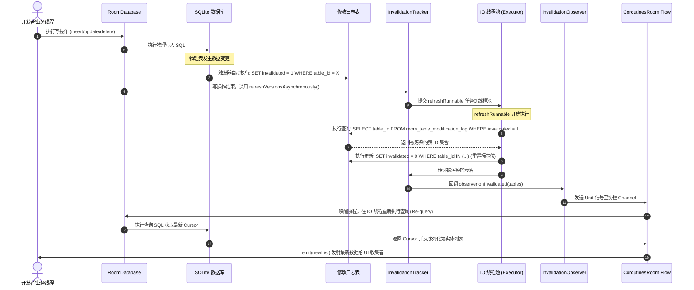

# Room 数据库底层机制与核心设计哲学剖析

在 Android 的数据持久化技术演进史中，从早期的原生 SQLite API 到以 GreenDao、OrmLite 为代表的传统 ORM 框架，再到如今 Jetpack 架构组件中无可争议的核心成员 Room，数据持久化方案经历了一场从“运行时反射构造”向“编译期静态验证”的深刻变革。

本篇文档将从现代价值、编译期强类型验证、物理生成代码、`InvalidationTracker`（失效追踪器）、Schema 版本演进与安全护栏，以及与传统 ORM 框架多维度对比等六大核心维度，深度剖析 Room 数据库的底层源码、线程模型与设计哲学。

---

## 1. Room 数据库框架的现代价值

### 1.1 传统 ORM 框架的设计缺陷与痛点
在 Room 诞生之前，Android 社区普遍采用 GreenDao、OrmLite 等 ORM（对象关系映射）框架。虽然这些框架在一定程度上缓解了开发者直接手写原生 SQLite 语句的痛苦，但随着 Android 应用规模的扩大和现代架构（如 MVVM、MVI）的兴起，它们的设计缺陷和痛点开始全面暴露：

*   **运行时反射过多，带来沉重的性能与内存代价**：
    以 OrmLite 为代表的早期 ORM 框架深度依赖 Java 运行时反射机制。在 App 启动和实体类加载时，框架需要反射解析大量的注解来构建对象与表结构的映射关系。在 CPU 和内存资源敏感的移动端设备上，这不仅会导致可感知的启动延迟，还会在频繁的读写操作中通过反射调用产生大量的临时垃圾对象，加剧 JVM 的垃圾回收（GC）频率，直接导致界面卡顿（Jank）。
*   **编译生成代码庞杂，侵入性强且极占方法数**：
    为了规避运行时的反射开销，GreenDao 采用了编译期生成代码的方案。然而，其代价是生成了极其庞杂的辅助代码（如 `DaoMaster`、`DaoSession`、各个实体的 `Dao` 类以及关联的属性常量）。随着表中实体数量的增加，生成的类文件呈指数级增长，严重消耗了 Android APK 的 64K 方法数限制，增大了包体积。同时，GreenDao 要求实体类本身继承其生成的特定物理父类或嵌入其特定的属性，对业务实体（Entity）形成了极强的侵入性，破坏了纯净的数据结构设计。
*   **Schema 迁移（Migration）极其痛苦与易错**：
    传统 ORM 框架对数据库版本升级和表结构变迁的处理非常脆弱。开发者必须在自定义的 `SQLiteOpenHelper.onUpgrade()` 中，使用嵌套的 `switch-case` 语句硬编码执行复杂的 `ALTER TABLE` 语句。一旦升级逻辑出现疏漏，或者开发者在多版本跨越式升级中没有完整测试迁移路径，用户在升级 App 时就会直接触发运行时 `SQLiteException`，导致应用崩溃甚至不可逆的数据损坏。
*   **缺乏与现代 Jetpack 架构组件 of 无缝配合**：
    在传统的 ORM 框架中，数据库纯粹是一个静态的“数据存储黑盒”。当数据库底层的某些数据发生变更（例如后台同步线程写入了新的消息）时，处于前台的 UI 组件（Activity/Fragment）无法自动感知并响应式刷新。开发者必须在应用层手动编写大量繁琐的回调接口，或者依赖 EventBus 等全局事件总线在内存中手动广播通知。这种非响应式的模式不仅增加了业务逻辑的耦合度，还极易因为生命周期管理不当而引发内存泄漏。

### 1.2 Room 作为 Jetpack 官方核心组件的现代价值
Room 的推出彻底淘汰了传统的 ORM 框架，成为现代 Android 数据库开发的主流标准。作为 Jetpack 架构的核心一员，Room 并非完全重写了一套数据库引擎，而是作为原生 SQLite 数据库之上的一个高度优化的轻量级包装层。其现代价值在于，它在保留了 SQL 自身强大威力的同时，将传统的命令式数据库访问改造成了符合现代 Android 工程规范的**声明式、类型安全、响应式**访问层。

### 1.3 核心设计哲学
Room 的核心设计哲学可以概括为以下四个关键支柱：
1.  **声明式 API（Declarative API）**：
    开发者只需定义简单的接口（DAO）和普通的 Java/Kotlin POJO 类（Entity），并通过声明式注解（如 `@Query`、`@Insert`、`@Update`）来描述数据库操作意图。Room 编译器在编译期自动生成所有复杂的模板代码，省去了繁琐的游标读取与 SQL 拼接逻辑。
2.  **编译期强类型验证（Compile-time Verification）**：
    这是 Room 与传统 ORM 最本质的区别。它将原本只有在运行时用户设备上才能暴露的 SQL 语法错误、Schema 不匹配、表名写错等问题，强制熔断在编译阶段，确保了交付代码的绝对稳健。
3.  **响应式数据流天然集成（Reactive Stream Integration）**：
    Room 原生支持将查询结果包装为 `LiveData`、`Flow`、`RxJava Observable` 等响应式数据流。数据库被确立为 App 的**单一真实数据源（Single Source of Truth）**，任何底层的写入操作都会通过物理监听机制自动触发 UI 的重新渲染，实现了真正的数据驱动架构。
4.  **极轻量级运行时（Lightweight Runtime）**：
    因为绝大部分的解析、校验和代码生成工作都在编译期由 APT 或 KSP 完成，Room 在运行时的体积极其轻量，几乎没有额外的反射开销，其读写性能高度逼近原生 SQLite。

---

## 2. 强类型防线：编译期 SQL 语法与 Schema 验证机制

在 Room 的设计中，编译期验证是阻断线上崩溃的第一道强力防线。许多开发者常常感到好奇：既然编译是在开发者的电脑（JVM 进程）上进行的，此时并没有连接任何 Android 模拟器或物理设备，那么 Room 编译器是如何知道代码里 `@Query("SELECT * FROM users WHERE age > :minAge")` 中的 `users` 表是否存在，或者 `age` 字段的数据类型是否正确的？

### 2.1 注解处理器（APT/KSP）的工作机制
在 Android Gradle 构建生命周期中，当项目进入 Java/Kotlin 编译阶段时，配置好的 APT（Annotation Processing Tool）或 KSP（Kotlin Symbol Processing）会被触发。
1.  **语法树扫描**：KSP/APT 会全面扫描当前项目中所有带有 Room 相关注解（如 `@Database`、`@Entity`、`@Dao` 等）的类和接口，构建出对应的语法符号树。
2.  **配置提取**：Room 编译器会提取所有由 `@Entity` 声明的实体类定义，推导出它们的表名、列名、主键约束、索引以及外键关系。同时，它也会收集所有 `@Dao` 接口中声明的 `@Query` 语句字符串。
3.  **物理环境准备**：此时，Room 编译器需要将这些纯文本的 SQL 语句和实体映射转化为真实的数据库操作，并进行静态验证。

### 2.2 深度剖析：编译期内存数据库与 `sqlite-jdbc` 驱动的静态解析
为了实现精准的编译期 SQL 语法和 Schema 校验，Room 编译器在底层巧妙地借助了 Java 的数据库连接桥梁：
*   **启动本地内存数据库**：
    在编译器的运行环境中，Room 编译器会加载它所依赖的 `sqlite-jdbc` 驱动（这是一个纯 Java 实现的 SQLite 驱动程序）。在内存中，它会建立一个临时的、完全隔离的 SQLite 内存数据库实例（`jdbc:sqlite::memory:`）。
*   **重塑物理 Schema 镜像**：
    Room 编译器首先将第一步扫描得到的所有 `@Entity` 类的结构，自动转换为对应的 `CREATE TABLE`、`CREATE INDEX` 等 DDL 语句，并在该内存数据库中执行。例如，如果你的代码中定义了一个 `User` 实体类，它就会在内存数据库中创建一张结构完全一致的 `user` 物理表。此时，临时内存数据库的 Schema 结构就是你代码中定义的 Model 的完美物理镜像。
*   **调用 Prepare Statement 静态解析**：
    当内存数据库的 Schema 镜像构建完成后，Room 编译器会遍历所有的 DAO 方法。对于每一个 `@Query(value)` 中的 SQL 语句，编译器会通过 `sqlite-jdbc` 驱动向临时数据库的 SQLite 引擎发送一条 `prepareStatement(sql)` 接口调用。
    
    在底层的 SQLite C/C++ 引擎中，这对应于调用了 `sqlite3_prepare_v2` 接口。这个过程是 SQLite 引擎自身的静态分析核心：它会对 SQL 语句进行词法分析（Lexing）、语法分析（Parsing），并结合数据库当前的 Schema 验证 SQL 语句。如果语句中存在拼写错误（如 `SELECT * FORM user`）、表名或字段名不存在（如字段名为 `nickname` 但 SQL 里写成了 `nick_name`），SQLite 引擎就会在 `prepare` 阶段直接抛出带有详细错误信息的 `SQLException`。

### 2.3 字段名与数据类型兼容性验证
通过 `Prepare Statement` 机制，Room 编译器不仅能验证 SQL 的基本语法是否正确，还能深入验证与数据映射相关的各种潜在缺陷：
*   **表名与列名的存在性校验**：
    如果在 SQL 语句中引用的表名或列名在内存数据库 Schema 中不存在（例如，开发者将 `age` 误写为 `ages`），`sqlite3_prepare_v2` 就会在编译期直接报错，提示 `no such column: ages`。
*   **参数绑定有效性校验**：
    Room 会解析 SQL 中以冒号开头的绑定参数（例如 `:minAge`）。它会验证 DAO 方法签名中是否存在同名的参数。如果方法中没有定义对应的入参，或者入参的类型无法被 SQLite 识别绑定，编译器就会报错。
*   **结果集与接收实体字段的兼容性验证**：
    `PreparedStatement` 在准备成功后，会返回对应的元数据（Metadata），其中包含了该查询语句执行后返回的结果集列数、每一列的列名以及物理数据类型。
    
    Room 编译器会将这些元数据与 DAO 方法中声明的返回实体类型（例如 `User` 实体或其自定义的 POJO 投影类）的字段进行交叉比对：
    1.  如果返回实体类中声明了某些非空的字段（如 Kotlin 中的非空类型 `val name: String`），但在 SQL 返回的结果集中并没有提供对应的列，Room 编译器会检测到这一漏洞，并抛出编译错误。
    2.  如果 SQL 查询返回的某列类型是 `TEXT`，但在实体中对应的接收字段类型是 `Int`，且开发者没有针对这两种类型编写并注册对应的 `@TypeConverter`，Room 会在编译期发出警告或直接报错，拒绝通过编译。

### 2.4 编译强行熔断物理过程
当 `sqlite-jdbc` 的 prepare 过程抛出错误，或者类型兼容性对比失败时，Room 编译期插件会捕捉到这些异常，并把它们转化为 Gradle 编译日志中的 Error 输出。由于 KSP/APT 拥有控制编译流程的权限，一旦在这些验证逻辑中发现 Error 级别的错误，注解处理器就会向 Gradle 构建引擎发送终止信号。

这个物理过程强制将原本只会在用户手机运行期间发生的致命崩溃（如 `SQLiteException: no such table`），在开发者的电脑上强制“熔断”并暴露出来，从源头上保证了线上应用的安全。

---

## 3. Entity, DAO, Database 物理生成与 Impl 机制

在编译期通过所有语法与 Schema 验证后，Room 会为开发者声明的抽象类和接口生成具体的物理实现类（即后缀为 `_Impl` 的 Java 文件）。我们将以一个具体的结构为例，剖析生成的代码架构与底层的物理执行闭环。

假设我们有如下的物理模型定义：

```kotlin
@Entity(tableName = "users")
data class User(
    @PrimaryKey val id: Int,
    val name: String,
    val age: Int
)

@Dao
interface UserDao {
    @Insert
    fun insertUser(user: User)

    @Query("SELECT * FROM users WHERE id = :id")
    fun getUserById(id: Int): User?

    @Query("DELETE FROM users")
    fun deleteAllUsers()
}

@Database(entities = [User::class], version = 1)
abstract class AppDatabase : RoomDatabase() {
    abstract fun userDao(): UserDao
}
```

### 3.1 `AppDatabase_Impl` 源码架构剖析
在编译后，Room 会生成 `AppDatabase_Impl` 物理类，其核心结构如下（以 Java 伪代码简化呈现其物理框架）：

```java
public final class AppDatabase_Impl extends AppDatabase {
  private volatile UserDao _userDao;

  @Override
  protected SupportSQLiteOpenHelper createOpenHelper(DatabaseConfiguration configuration) {
    // 实例化 RoomOpenHelper，负责数据库创建、打开和版本校验
    final SupportSQLiteOpenHelper.Callback _callback = new RoomOpenHelper(configuration, new RoomOpenHelper.Delegate(1) {
      @Override
      public void createAllTables(SupportSQLiteDatabase _db) {
        // 执行由 @Entity 生成的物理建表 DDL
        _db.execSQL("CREATE TABLE IF NOT EXISTS `users` (`id` INTEGER NOT NULL, `name` TEXT NOT NULL, `age` INTEGER NOT NULL, PRIMARY KEY(`id`))");
        // 创建 Room 主控表
        _db.execSQL("CREATE TABLE IF NOT EXISTS room_master_table (id INTEGER PRIMARY KEY,identity_hash TEXT)");
        _db.execSQL("INSERT OR REPLACE INTO room_master_table (id,identity_hash) VALUES(42, '7716f9f3ab5c8f85f1ad9f0d11f81d11')");
      }

      @Override
      public void dropAllTables(SupportSQLiteDatabase _db) {
        _db.execSQL("DROP TABLE IF EXISTS `users`");
        if (mCallbacks != null) {
          for (int _i = 0, _size = mCallbacks.size(); _i < _size; _i++) {
            mCallbacks.get(_i).onDestructiveMigration(_db);
          }
        }
      }

      @Override
      protected void onCreate(SupportSQLiteDatabase _db) {
        if (mCallbacks != null) {
          for (int _i = 0, _size = mCallbacks.size(); _i < _size; _i++) {
            mCallbacks.get(_i).onCreate(_db);
          }
        }
      }

      @Override
      public void onOpen(SupportSQLiteDatabase _db) {
        mDatabase = _db;
        internalInitInvalidationTracker(_db);
        if (mCallbacks != null) {
          for (int _i = 0, _size = mCallbacks.size(); _i < _size; _i++) {
            mCallbacks.get(_i).onOpen(_db);
          }
        }
      }
      
      // ... 包含 identityHash 的校验实现
    }, "7716f9f3ab5c8f85f1ad9f0d11f81d11", "90d1f7c1cb3b4c10642a8b9f0d11f82d");
    
    final SupportSQLiteOpenHelper.Configuration _sqliteConfig = SupportSQLiteOpenHelper.Configuration.builder(configuration.context)
        .name(configuration.name)
        .callback(_callback)
        .build();
    final SupportSQLiteOpenHelper _helper = configuration.sqliteOpenHelperFactory.create(_sqliteConfig);
    return _helper;
  }

  @Override
  protected InvalidationTracker createInvalidationTracker() {
    final HashMap<String, String> _shadowTablesMap = new HashMap<String, String>(0);
    HashMap<String, Set<String>> _viewTables = new HashMap<String, Set<String>>(0);
    // 实例化失效追踪器，传入所追踪的物理表名
    return new InvalidationTracker(this, _shadowTablesMap, _viewTables, "users");
  }

  @Override
  public UserDao userDao() {
    if (_userDao != null) {
      return _userDao;
    }
    synchronized(this) {
      if(_userDao == null) {
        // 双重锁检查懒加载生成的 UserDao 实现类
        _userDao = new UserDao_Impl(this);
      }
      return _userDao;
    }
  }
}
```

### 3.2 `UserDao_Impl` 中 `SQLiteStatement` 的管理与复用机制
在生成的 `UserDao_Impl` 中，Room 并没有对每一次写操作都重新调用 `db.compileStatement(sql)`。为了极致的执行效率，它在类内部维护并复用了底层的数据库语句对象：

```java
public final class UserDao_Impl implements UserDao {
  private final RoomDatabase __db;

  // 用于包装 @Insert 实体插入
  private final EntityInsertionAdapter<User> __insertionAdapterOfUser;

  // 用于包装需要复用 SQL 语句的普通更新/删除操作，或是非实体的 @Query 修改
  private final SharedSQLiteStatement __preparedStmtOfDeleteAllUsers;

  public UserDao_Impl(RoomDatabase __db) {
    this.__db = __db;
    
    // 1. 初始化 EntityInsertionAdapter 插入适配器
    this.__insertionAdapterOfUser = new EntityInsertionAdapter<User>(__db) {
      @Override
      public String createQuery() {
        // 返回插入的 SQL 模板字符串
        return "INSERT OR ABORT INTO `users` (`id`,`name`,`age`) VALUES (?,?,?)";
      }

      @Override
      public void bind(SupportSQLiteStatement stmt, User value) {
        // 将实体类的物理数据绑定到 Statement 占位符上，1-indexed
        stmt.bindLong(1, value.getId());
        if (value.getName() == null) {
          stmt.bindNull(2);
        } else {
          stmt.bindString(2, value.getName());
        }
        stmt.bindLong(3, value.getAge());
      }
    };

    // 2. 初始化 SharedSQLiteStatement
    this.__preparedStmtOfDeleteAllUsers = new SharedSQLiteStatement(__db) {
      @Override
      public String createQuery() {
        return "DELETE FROM users";
      }
    };
  }
  
  // ...
}
```

#### 核心设计动机与继承结构解析：
*   **`EntityInsertionAdapter<T>` 与 `EntityDeletionOrUpdateAdapter<T>`**：
    它们是专门针对实体对象操作的适配器类，继承自 `SharedSQLiteStatement`。它们负责将 Java/Kotlin 对象解分成 SQLite 支持的基本类型。通过内部重写的 `bind()` 方法，将各个字段绑定到预编译的 `SupportSQLiteStatement` 中。这些适配器是由 Room 全局管理和复用的，避免了对象转换和 SQL 重新编译的额外性能损耗。
*   **`SharedSQLiteStatement`**：
    对于不针对实体对象的数据操作（例如通过 `@Query` 声明的删除或更新操作），Room 编译生成 `SharedSQLiteStatement` 的子类。其底层包含一个原子锁 `AtomicBoolean mLock`。
    
    当执行操作时，调用 `acquire()` 方法，若该语句空闲，则直接复用已编译好的物理 `SQLiteStatement`；如果被占用，则重新编译生成一个新的语句。操作完成后调用 `release()` 将语句释放。这种机制极大地减少了高频执行同一条 SQL 时的编译开销，保障了多线程并发下的执行效率。

### 3.3 物理数据查询与还原的全流程物理闭环
我们以 `getUserById` 方法为例，深度剖析 Room 执行查询并还原实体的全流程物理闭环：

```java
  @Override
  public User getUserById(final int id) {
    // 1. 从对象池中获取或创建一个 RoomSQLiteQuery 对象，封装 SQL 与参数数量
    final RoomSQLiteQuery _statement = RoomSQLiteQuery.acquire("SELECT * FROM users WHERE id = ?", 1);
    int _argIndex = 1;
    // 绑定参数
    _statement.bindLong(_argIndex, id);
    
    __db.assertNotSuspendingTransaction();
    // 2. 调用底层的 SupportSQLiteDatabase 执行查询，获取物理 Cursor
    final Cursor _cursor = DBUtil.query(__db, _statement, false, null);
    try {
      // 3. 利用 CursorUtil 获取实体字段在当前 Cursor 中的物理列索引（安全防线）
      final int _cursorIndexOfId = CursorUtil.getColumnIndexOrThrow(_cursor, "id");
      final int _cursorIndexOfName = CursorUtil.getColumnIndexOrThrow(_cursor, "name");
      final int _cursorIndexOfAge = CursorUtil.getColumnIndexOrThrow(_cursor, "age");
      
      final User _result;
      // 4. 移动游标读取数据并反序列化实体
      if(_cursor.moveToFirst()) {
        final int _tmpId;
        _tmpId = _cursor.getInt(_cursorIndexOfId);
        
        final String _tmpName;
        if (_cursor.isNull(_cursorIndexOfName)) {
          _tmpName = null;
        } else {
          _tmpName = _cursor.getString(_cursorIndexOfName);
        }
        
        final int _tmpAge;
        _tmpAge = _cursor.getInt(_cursorIndexOfAge);
        
        // 调用构造函数实例化实体对象
        _result = new User(_tmpId,_tmpName,_tmpAge);
      } else {
        _result = null;
      }
      return _result;
    } finally {
      // 5. 极其重要的物理回收闭环：确保游标关闭，释放 Query 对象以供复用
      _cursor.close();
      _statement.release();
    }
  }
```

#### 物理闭环步骤详解：
1.  **查询对象复用（`RoomSQLiteQuery.acquire`）**：
    为了避免频繁创建 SQL 包装对象造成的内存碎片，Room 内部维护了一个 `RoomSQLiteQuery` 对象池（容量通常为 10）。当发起查询时，先从池中借出一个查询对象，并在其上绑定参数。
2.  **获取 Cursor 游标**：
    通过调用底层框架的 `DBUtil.query()`，Room 绕过复杂的上层机制，直接向底层 SQLite 驱动发送查询请求，返回包含了数据行的底层 `Cursor` 对象。
3.  **动态列名映射（`CursorUtil.getColumnIndexOrThrow`）**：
    许多传统的 ORM 框架直接通过硬编码的索引（例如 `cursor.getString(1)`）来读取字段。但在真实的生产环境中，如果数据库的 Schema 发生了变化、或者物理表中的字段顺序与代码不一致，这会导致读取到错误的数据甚至发生崩溃。Room 真实地在查询时，首先通过列名动态获取当前 Cursor 中的实际物理索引，极大地增强了健壮性。
4.  **读取游标与 Null 安全处理**：
    Room 严格遵循 SQLite 的数据特征和 Kotlin 的可空性定义。在读取字段前，必须调用 `isNull()` 判断字段在物理库中是否为 NULL。如果为 NULL，则赋予默认空值；如果不为 NULL，再调用 `getString()`、`getInt()` 等读取。这一物理转换彻底杜绝了数据类型转换异常（ClassCastException）和 NullPointerException。
5.  **资源回收与归还**：
    由于物理 SQLite 连接和 Cursor 会持久占用系统的文件句柄和内存缓冲区，因此，在 `finally` 块中，Room 会以最高优先级显式调用 `_cursor.close()` 关闭游标，并将 `RoomSQLiteQuery` 对象清空数据后归还池中，完成资源释放闭环。

---

## 4. 响应式数据源核心：InvalidationTracker 物理大透视

在 Jetpack MVVM 架构中，最优雅的特性莫过于：当你在后台线程往数据库插入了一条数据，前台订阅的 `Flow<List<User>>` 就会自动发射（emit）最新的列表数据，从而实时驱动 UI 界面更新。

要实现这个全链路响应式流程，Room 底层的技术心脏就是 `InvalidationTracker`（失效追踪器）。

### 4.1 核心问题：为什么底层数据改变能让 Flow 感知并重新发射？
由于 SQLite 数据库运行在物理磁盘或内存中，它本质上是一个宿主环境的 C 语言库，并不能主动通知 Java 虚拟机（JVM）有关内部表的修改。

为了解决这一技术壁垒，Room 没有选择在 JVM 内存层通过 AOP 等手段进行简单的拦截，因为那无法捕捉直接通过 SQL 执行写操作的变化。Room 选择了从 **SQLite 物理数据库引擎层** 进行物理拦截。

---

### 4.2 SQLite 触发器（Trigger）与修改日志机制

在 Room 数据库实例启动并首次创建连接（`onOpen`）时，`InvalidationTracker` 会被初始化。它会在物理 SQLite 数据库中，暗中做以下两件重要的布局工作：

#### 1. 创建物理辅助修改日志表
Room 会创建一张内部使用的物理辅助表，表名为 `room_table_modification_log`：

```sql
CREATE TABLE IF NOT EXISTS room_table_modification_log (
    table_id INTEGER PRIMARY KEY,
    invalidated INTEGER NOT NULL DEFAULT 0
)
```

对于数据库中注册的每一个 Entity 表，Room 编译器都会分配一个唯一的 `table_id`（从 0 开始自增）。在初始化时，Room 会向该日志表中插入与表数量等同的行。例如，如果你的 App 只有 `users`（ID: 0）和 `books`（ID: 1）两张业务表，则日志表中就会存在以下两条初始物理记录：

| table_id | invalidated |
| :---: | :---: |
| 0 (users) | 0 |
| 1 (books) | 0 |

#### 2. 动态创建 SQLite TEMP 触发器（Trigger）
为了实现当业务表发生写操作（INSERT/UPDATE/DELETE）时能自动打标记，Room 会为每一个被追踪的业务表，动态生成并执行三个临时触发器（TEMP TRIGGER）：

```sql
-- 针对 users 表的 INSERT 触发器
CREATE TEMP TRIGGER IF NOT EXISTS room_table_modification_trigger_users_INSERT 
AFTER INSERT ON `users` 
BEGIN 
    UPDATE room_table_modification_log 
    SET invalidated = 1 
    WHERE table_id = 0 AND invalidated = 0; 
END;

-- 针对 users 表的 UPDATE 触发器
CREATE TEMP TRIGGER IF NOT EXISTS room_table_modification_trigger_users_UPDATE 
AFTER UPDATE ON `users` 
BEGIN 
    UPDATE room_table_modification_log 
    SET invalidated = 1 
    WHERE table_id = 0 AND invalidated = 0; 
END;

-- 针对 users 表的 DELETE 触发器
CREATE TEMP TRIGGER IF NOT EXISTS room_table_modification_trigger_users_DELETE 
AFTER DELETE ON `users` 
BEGIN 
    UPDATE room_table_modification_log 
    SET invalidated = 1 
    WHERE table_id = 0 AND invalidated = 0; 
END;
```

#### 关键字段含义与设计精妙分析：
*   **`TEMP TRIGGER`（临时触发器）**：
    为什么是 `TEMP`？这是 Room 的一个极为高明的设计。临时触发器存储在 SQLite 的内存数据库中（`temp` Schema 内），它们**并不持久化保存在磁盘的数据库文件中**。临时触发器的生命周期只与当前数据库物理连接（Connection）绑定。一旦 App 进程关闭、数据库连接释放，这些触发器自动被 SQLite 销毁。这既实现了实时拦截，又避免了向用户的业务数据库物理文件中写入垃圾触发器，保障了物理文件的纯净和可移植性。
*   **`WHERE table_id = 0 AND invalidated = 0`**：
    当物理表被写入（例如插入一条记录）时，触发器动作会被触发。触发器会尝试执行 `UPDATE`，将 `table_id = 0` 的 `invalidated` 标志位设为 1。
    
    这里的关键在于限制条件 `AND invalidated = 0`：如果在同一个事务中，你连续向 `users` 表插入了 1 万条数据，那么在第一条数据插入时，`invalidated` 就已经被置为 1 了。在后面的 9999 次数据插入中，因为 `invalidated = 0` 条件不成立，触发器内部的 `UPDATE` 不会执行。这巧妙地避免了高频写操作时，触发器频繁写磁盘日志表带来的严重 I/O 损耗！

---

### 4.3 异步轮询与 InvalidationObserver 排水机制

一旦有了底层的物理触发器，当数据被修改时，日志表中的对应行物理标记就会变成 1。但这仍然是 SQLite 底层的数据，Java 层是如何感知并开始“排水”（刷新状态）的？



#### 1. 事务提交与主动/被动排水
当开发者通过 Room 生成的 DAO 接口（例如 `UserDao_Impl`）执行写操作时，该方法底层的物理流程最后一步，都会触发对 `InvalidationTracker.refreshVersionsAsynchronously()` 的调用。

然而，如果写操作是在一个事务（Transaction）中进行的，事情就会有所不同：
*   **事务隔离与延迟**：
    在事务块内部，即使有多次写操作，物理触发器已经将日志表的 `invalidated` 标为 1，但由于 SQLite 的事务隔离机制，这些修改在事务提交前，对于其他的数据库连接和读取操作是完全不可见的。
*   **嵌套计数（Transaction nesting level）**：
    Room 内部通过一个 `ThreadLocal<Integer>` 变量来记录当前线程的物理事务嵌套深度。只有当最外层事务调用 `endTransaction()` 且事务被物理提交（COMMIT）之后，嵌套计数归零，Room 才会真正向 `Executor` 调度器提交 `refreshRunnable` 的运行请求。这完美确保了响应式数据流只会在数据安全落地（提交）后才会发射，防止了脏数据的读取。

#### 2. `refreshRunnable` 的异步工作逻辑
`refreshRunnable` 是 InvalidationTracker 中执行核心刷新动作的工作单元，其物理工作步骤如下：
1.  **加锁控制**：首先获取一个内部的读写锁，防止与其他多线程状态变更发生竞态冲突。
2.  **日志轮询（Log Query）**：
    在后台数据库 I/O 线程中，`refreshRunnable` 会执行一条特殊的查询 SQL 语句：
    ```sql
    SELECT table_id FROM room_table_modification_log WHERE invalidated = 1;
    ```
    如果返回的 Cursor 为空，说明没有任何表发生变更，直接释放锁并退出。
3.  **标记重置与排水（UPDATE）**：
    如果在日志表中查到了有行的数据为 1（比如 `table_id = 0`），Room 会将这些表 ID 收集到一个集合中。紧接着，Room 会在同一个物理事务中，向数据库发送更新指令，清除这些被污染的标记：
    ```sql
    UPDATE room_table_modification_log SET invalidated = 0 WHERE table_id = 0;
    ```
    这个“查询并重置”的过程是一个原子的物理闭环，确保了一次变更只会被处理和通知一次。
4.  **通知 Observer 回调**：
    将发生变更的表 ID 映射回它们在 Java/Kotlin 中对应的物理表名（如 `users`），然后遍历所有在该表名上注册的 `InvalidationTracker.Observer`，触发它们的 `onInvalidated(Set<String> tables)` 回调方法。

---

### 4.4 协程 Flow 响应式物理全链路
我们以 DAO 返回 `Flow<List<User>>` 的响应式链路为例，探究其如何从物理上打通 InvalidationObserver 到协程的闭环：

#### 1. 订阅建立阶段（Flow collect）
当 UI 组件开始 `collect` 这个 Flow 时，底层由 Room 编译器生成的 `CoroutinesRoom.createFlow` 会被激活：
*   **创建 Observer 实例**：
    It 会在内部实例化一个 `InvalidationTracker.Observer(tableNames = ["users"])`，这个 Observer 专门监听 `users` 表的变化。
*   **注册到 Tracker**：
    调用 `database.getInvalidationTracker().addWeakObserver(observer)`，将该监听器物理注册 to Tracker 列表中。
*   **触发首次加载**：
    协程会在 `Dispatchers.IO` 上首先执行一次真正的 DAO 查询，获取初始列表，并通过 Flow 的通道发射（emit）给下游 UI。

#### 2. 数据变更触发重查阶段（Re-query）
当后台物理修改了 `users` 表：
1.  物理触发器将日志表 `invalidated` 设为 1。
2.  事务提交，异步触发 `refreshRunnable`，检测到 `users` 表发生变更，将其重置为 0。
3.  `refreshRunnable` 回调刚才注册的 `InvalidationTracker.Observer` 的 `onInvalidated` 方法。
4.  在 `onInvalidated` 回调方法内部，Observer 并不直接执行数据库查询，而是通过向 Flow 协程内部的 **Channel 通道**发送一个轻量级的信号（如 `channel.trySend(Unit)`）。
5.  接收端的协程被该通道信号唤醒。由于协程处于冷流循环中，它会立即重新调用 DAO 生成的物理查询方法（Re-query），再次通过游标读取、Null 校验、反射/构造器组装全新的一组 `List<User>`。
6.  调用 Flow 的 `emit(newList)` 发射最新数据，UI 收到通知，完成界面更新。
7.  **反注册与防泄漏**：当 UI 被销毁、协程 Scope 被取消时，Flow 的 `finally` 块会被执行。它会调用 `removeObserver` 物理移除该 Observer，实现资源的彻底释放。

---

### 4.5 核心源码剖析
为了更清晰地理解这一过程，我们来看一下 `InvalidationTracker` 的刷新代码以及 `CoroutinesRoom.createFlow` 底层实现的关键源码片段。

#### 1. `InvalidationTracker` 中的刷新逻辑实现
以下为 `InvalidationTracker` 内部 `refreshRunnable` 的核心源码逻辑解析：

```java
Runnable mRefreshRunnable = new Runnable() {
    @Override
    public void run() {
        // 1. 获取数据库的读写锁，保护并发读写安全
        final Lock closeLock = mDatabase.getCloseLock();
        closeLock.lock();
        try {
            // 检查数据库是否已经关闭或未初始化
            if (!ensureInitialization()) {
                return;
            }
            // 2. 利用原子变量，防止多个刷新线程同时进入物理操作
            if (!mPendingRefresh.compareAndSet(true, false)) {
                return;
            }
            if (mDatabase.inTransaction()) {
                // 如果当前处于 Java 事务中，放弃此次刷新，延迟到事务结束后再次调用
                return;
            }
            
            // 3. 执行查询，轮询日志表
            SupportSQLiteStatement database = mDatabase.getOpenHelper().getWritableDatabase();
            database.beginTransactionNonExclusive();
            boolean hasChanged = false;
            try {
                // 查询哪些表发生了变更（invalidated = 1）
                mQueryResult = mDatabase.query(mCheckStatement);
                while (mQueryResult.moveToNext()) {
                    int tableId = mQueryResult.getInt(0);
                    mTableFlags[tableId] = true; // 在内存标记数组中记录
                    hasChanged = true;
                }
            } finally {
                mQueryResult.close();
            }
            
            // 4. 如果有表发生变更，将日志表重置为 0 并提交事务
            if (hasChanged) {
                mResetStatement.executeUpdateDelete();
                database.setTransactionSuccessful();
            }
            database.endTransaction();
            
            // 5. 释放数据库连接与锁
        } finally {
            closeLock.unlock();
        }
        
        // 6. 在锁外，通知所有注册的 Observers，防止死锁
        if (hasChanged) {
            synchronized (mObserverMap) {
                for (Map.Entry<Observer, ObserverWrapper> entry : mObserverMap) {
                    // 通知对应的 Observer 包装类
                    entry.getValue().notifyByTableId(mTableFlags);
                }
            }
        }
    }
};
```

#### 2. `CoroutinesRoom.createFlow` 源码骨架解析
以下展示了底层将 `InvalidationTracker` 桥接到 Kotlin 协程 Flow 的核心逻辑实现：

```kotlin
@JvmStatic
fun <R> createFlow(
    db: RoomDatabase,
    inTransaction: Boolean,
    tableNames: Array<String>,
    callable: Callable<R>
): Flow<R> = flow {
    coroutineScope {
        // 1. 创建一个用于在协程间传递信号的 Channel，容量为 1，采用 CONGESTION 模式（合并多次多余的变更信号）
        val observerChannel = Channel<Unit>(Channel.CONGESTION)
        
        // 2. 实例化 InvalidationTracker.Observer，监听目标物理表
        val observer = object : InvalidationTracker.Observer(tableNames) {
            override fun onInvalidated(tables: Set<String>) {
                // 3. 当收到表失效的回调时，向通道发送信号
                observerChannel.trySend(Unit)
            }
        }
        
        // 4. 将 Observer 注册到 Room 数据库中
        db.invalidationTracker.addWeakObserver(observer)
        
        try {
            // 5. 启动时先主动向 Channel 发送一个 Unit 信号，触发首次数据加载
            observerChannel.trySend(Unit)
            
            // 6. 使用循环，无限挂起等待 Channel 的变更通知
            for (signal in observerChannel) {
                // 7. 在指定的数据库执行器（如 Dispatchers.IO）上重新执行查询 Callable
                val result = withContext(if (inTransaction) db.transactionDispatcher else db.queryDispatcher) {
                    callable.call()
                }
                // 8. 将最新的查询结果发射给 Flow 消费者
                emit(result)
            }
        } finally {
            // 9. 当 Flow 的 Scope 销毁或取消收集时，物理注销该 Observer，彻底杜绝内存泄漏
            db.invalidationTracker.removeObserver(observer)
        }
    }
}
```

---

### 4.6 多进程/多实例下的失效同步：`MultiInstanceInvalidationService` 底层 Binder 闭环

在现代 Android 架构中，随着多进程（如后台推送进程、保活服务进程与前台 UI 主进程）并发读写数据库的场景增多，单进程内内存级别的 InvalidationTracker 就会面临失效。例如，当后台服务进程写入了新数据，前台主进程的协程 Flow 如何能越过进程边界感知这一物理修改？

为了解决这一问题，Room 2.4.0 起提供了多实例同步组件（`enableMultiInstanceInvalidation()`）。其底层的物理同步闭环基于 Android **AIDL 与 Binder IPC** 实现：

1.  **共享 AIDL 接口**：
    Room 在底层定义了一个 `IMultiInstanceInvalidationService` 服务端接口和一个客户端回调接口 `IMultiInstanceInvalidationCallback`。
2.  **Binder 服务的物理注册**：
    在 App 启动且主进程实例化 `RoomDatabase` 时，如果开启了多实例同步，它的 `InvalidationTracker` 内部会绑定一个名为 `MultiInstanceInvalidationService` 的公共后台 Service（由 Room 自动注册在 AndroidManifest 中）。
3.  **双向 Binder 通信桥梁**：
    *   **客户端注册**：每个进程在启动 Room 实例时，都会创建一个特殊的 `MultiInstanceInvalidationClient` 对象，该客户端通过 `bindService` 与常驻后台服务连接，并向服务端传递它自身的 `IMultiInstanceInvalidationCallback` 代理对象，并获取一个唯一的 `clientId`。
    *   **注册追踪的物理表**：客户端同时向服务端上报该进程的 Room 数据库实例正在追踪哪些表名。
4.  **数据写操作触发跨进程广播**：
    当 A 进程通过 DAO 写入数据，触发了 A 进程内部的 `InvalidationTracker.refreshRunnable` 执行并收集到了被污染的表 ID。
    
    A 进程除了通知自己进程内的 Observer 之外，它的 `MultiInstanceInvalidationClient` 会调用 AIDL 接口，向 `MultiInstanceInvalidationService` 发送一条物理表变更广播，传入自身的 `clientId` 以及发生变更的物理表名数组。
5.  **服务端广播分发（Broadcasting）**：
    `MultiInstanceInvalidationService` 内部维持了一个持有所有客户端 Binder 代理的 `RemoteCallbackList`。
    
    服务端收到 A 进程的变更通知后，会遍历这个列表。对于每一个非 A 进程（`clientId` 不同）且注册了相同追踪表名的客户端进程（例如 B 进程），服务端会通过 Binder IPC 回调 B 进程对应的 `IMultiInstanceInvalidationCallback.onInvalidation()` 方法。
6.  **本地 Invalidation 链条触发**：
    B 进程收到 Binder 回调后，在 Binder 线程池线程中，直接调用 B 进程内 `InvalidationTracker.notifyObserversByTableNames` 方法，从而触发 B 进程内注册在该表上的 InvalidationTracker.Observer，最终唤醒 B 进程 Flow 的协程进行重查（Re-query）并推送最新数据。
    
    这个设计将单进程的触发器事件无缝扩展至操作系统级别的多进程广播网，保障了在任何复杂的跨进程数据同步环境下，响应式数据源的一致性。

---

## 5. 版本演进与 Schema 安全护栏

随着 App 版本的迭代，业务模型也在不断发生变化（例如新增字段、修改表结构）。如何确保用户在升级 App 时，底层的数据库结构能够平滑迁移而不会发生数据丢失，是 Room 机制设计的又一重点。

### 5.1 每次编译生成的 `schema.json` 文件的物理价值
如果开发者在 `build.gradle` 中配置了 `room.schemaLocation` 导出路径，在每次执行编译构建时，Room 会针对每一个 `@Database` 类，在其版本号对应的目录下输出一个 `.json` 描述文件（如 `1.json`、`2.json`）。

这个 `schema.json` 文件详细记录了该版本数据库的以下物理信息：
1.  **Format Version**：Schema 文件的版本格式。
2.  **Database DDL Info**：包括该版本下所有 `@Entity` 生成的 `CREATE TABLE`、`CREATE INDEX` 等精确的物理 SQL 语句。
3.  **Field Structures**：字段名、物理类型（INTEGER/TEXT等）、是否允许为 NULL（notNull）、默认值定义。
4.  **Identity Hash**：该版本 Schema 计算出的唯一哈希值。

#### 为什么说它是数据库版本控制与迁移的“圣经”？
在大型团队协作中，`schema.json` 应当被纳入 Git 版本控制。它让你能够直观地通过 Git Diff 追踪数据库结构的历史演变。

更重要的是，Room 提供了 `MigrationTestHelper` 测试套件。该工具允许你在 JUnit 测试中，直接读取导出的 `schema.json`，在物理测试机上自动重现指定老版本的数据库。然后，它会应用你编写的 `Migration` 类，最后自动校验迁移后的物理表结构是否与最新代码的模型一致。这建立了一个完全物理闭环的自动化数据库迁移测试体系，杜绝了线上升级崩溃的发生。

---

### 5.2 `room_master_table`（主控表）的防护机制
为了在运行时强行阻止程序带着不匹配的、错误的表结构运行，Room 在物理 SQLite 库中引入了一张名为 `room_master_table` 的主控防护表。

#### 1. 物理结构
这是一张在数据库中真实创建的物理表，其建表 Schema 为：

```sql
CREATE TABLE IF NOT EXISTS room_master_table (
    id INTEGER PRIMARY KEY,
    identity_hash TEXT
);
```

当数据库首次创建时，Room 会固定向其中插入一条记录：

```sql
INSERT OR REPLACE INTO room_master_table (id, identity_hash) VALUES (42, '7716f9f3ab5c8f85f1ad9f0d11f81d11');
```

#### 2. 哈希（`identity_hash`）生成逻辑与硬编码
在编译期，Room 编译器会根据当前数据库中所有实体类的定义（表名、列名、物理类型、是否可为空、索引等所有结构细节），经过串行化拼接后，通过 MD5 算法计算出一个唯一的 32 位哈希值。这个值被称为 `identity_hash`。

在生成的 `AppDatabase_Impl` 类的 `createOpenHelper` 初始化方法中，这个哈希值会被直接硬编码写入。

#### 3. 数据库打开时的哈希校验决策链路
当应用调用 `getWritableDatabase()` 打开数据库时，`RoomOpenHelper` 的回调机制会按以下流程进行哈希匹配：

```mermaid
flowchart TD
    Start([1. 应用程序打开数据库]) --> OpenDB[2. SQLite 建立物理连接]
    OpenDB --> CheckMasterExist{3. 检查 room_master_table 是否存在?}
    
    CheckMasterExist -- 否 --> InitialDB[4. 视为首次创建的数据库]
    InitialDB --> CreateAllTables[5. 执行 createAllTables 创建业务表]
    CreateAllTables --> WriteHash[6. 创建并向 room_master_table 写入当前硬编码哈希]
    WriteHash --> OpenSuccess([7. 数据库初始化成功，正常打开])
    
    CheckMasterExist -- 是 --> ReadHash[8. 执行 SELECT identity_hash FROM room_master_table LIMIT 1]
    ReadHash --> CompareHash{9. 读取的哈希 == 代码中硬编码的哈希?}
    
    CompareHash -- 一致 --> OpenSuccess
    
    CompareHash -- 不一致 --> CheckVersion{10. 检查数据库物理版本与代码版本}
    
    CheckVersion --> CheckMigration{11. 是否存在物理版本跃迁的 Migration 链?}
    
    CheckMigration -- 存在 --> RunMigrations[12. 迁移执行器按顺序执行 Migration 脚本]
    RunMigrations --> UpdateMasterHash[13. 更新 room_master_table 中的 identity_hash 为最新值]
    UpdateMasterHash --> OpenSuccess
    
    CheckMigration -- 否 --> CheckFallback{14. 是否配置了 destructive migration (毁灭性迁移)?}
    
    CheckFallback -- 是 --> DestructiveRebuild[15. 执行 dropAllTables 销毁所有物理表]
    DestructiveRebuild --> CreateAllTables
    
    CheckFallback -- 否 --> Crash[16. 抛出 IllegalStateException 强行崩溃阻止运行]
```

---

### 5.3 数据库迁移（Migration）的物理闭环

当数据库需要升级时，开发者需要通过 `Migration` 类编写升级脚本。我们来深度剖析 Room 的迁移执行器（MigrationEngine）是如何管理和执行这一过程的。

#### 1. 编写 Migration 对象
```kotlin
val MIGRATION_1_2 = object : Migration(1, 2) {
    override fun migrate(db: SupportSQLiteDatabase) {
        // 在此处直接通过底层物理连接执行 DDL 修改表结构
        db.execSQL("ALTER TABLE `users` ADD COLUMN `phone` TEXT NOT NULL DEFAULT ''")
    }
}
```

#### 2. 最短路径寻找算法
当 RoomDatabase 启动时，如果物理数据库的版本号为 `A`，当前代码声明的最新版本号为 `B`（且 `A < B`），Room 的 `MigrationEngine` 会调用路径搜寻算法寻找最安全的升级链路：
*   **图的构建**：
    Room 在内部使用一个 `HashMap<Integer, TreeMap<Integer, Migration>>` 来构建一个有向图（Directed Graph）。其中，图的顶点是各个版本号，有向边则是开发者通过 `addMigrations()` 注册的 `Migration` 实例。
*   **基于 BFS 的最短路径搜寻**：
    为了将物理库从版本 `A` 升级到 `B`，迁移引擎会运行一个广度优先搜索（BFS）算法。
    
    例如，如果开发者向 Room 注册了以下三个迁移实例：
    1.  `MIGRATION_1_2` (1 -> 2)
    2.  `MIGRATION_2_3` (2 -> 3)
    3.  `MIGRATION_1_3` (1 -> 3)
    
    当物理库从版本 1 升级到 3 时，算法会同时探索两条有向路径：`1 -> 2 -> 3`（两步）和 `1 -> 3`（一步）。搜寻器会优先选择步骤最少的最短路径：直接执行 `MIGRATION_1_3`。
    
    如果开发者只定义了 `MIGRATION_1_2` 和 `MIGRATION_2_3`，搜寻器则会规划出 `1 -> 2` 然后 `2 -> 3` 的复合路径，并按顺序依次调用它们的 `migrate(db)` 方法，从而安全地将底层 SQLite 物理结构升级到最新状态。有关在 Android 版本更新或迁移时涉及的相关变更记录，可参考 [AndroidVersionChangeLog.md](../../../../../AndroidVersionChangeLog.md)。

---

### 5.4 极限 Schema 迁移实战：千万级大表迁移的“临时表平移法”物理细节

在面对拥有数千万条记录的物理表进行复杂 Schema 升级时（例如修改字段属性、删除非空限制、或修改复合主键），在底层的 SQLite 中如果直接调用类似 `ALTER TABLE` 并指定 `DEFAULT` 值的 DDL 语句，会导致 SQLite 引擎对物理文件进行大面积重写，从而引发严重的主线程 Block 和 I/O 拥堵。

更为严重的是，SQLite 对 `ALTER TABLE` 的支持极其受限（例如不支持直接修改字段类型或删除列）。为此，Room 规范了“临时表平移法”的极限物理迁移流程，其物理步骤及 SQL 实现如下：

```kotlin
val MIGRATION_2_3_LARGE = object : Migration(2, 3) {
    override fun migrate(db: SupportSQLiteDatabase) {
        db.beginTransaction()
        try {
            // 步骤 1：创建一个和目标结构完全一致的临时新表 users_new
            db.execSQL("""
                CREATE TABLE IF NOT EXISTS `users_new` (
                    `id` INTEGER NOT NULL, 
                    `name` TEXT NOT NULL, 
                    `age` INTEGER NOT NULL, 
                    `phone` TEXT NOT NULL DEFAULT '',
                    PRIMARY KEY(`id`)
                )
            """.trimIndent())

            // 步骤 2：使用极高效的 INSERT INTO ... SELECT 物理复制数据
            db.execSQL("""
                INSERT INTO `users_new` (`id`, `name`, `age`, `phone`)
                SELECT `id`, `name`, `age`, COALESCE(`phone`, '') FROM `users`
            """.trimIndent())

            // 步骤 3：物理 drop 掉损坏的或者老旧结构的 users 表
            db.execSQL("DROP TABLE IF EXISTS `users`")

            // 步骤 4：重命名新表为 users，完美替换旧表
            db.execSQL("ALTER TABLE `users_new` RENAME TO `users`")

            // 步骤 5：如果在该表上存在联合索引，必须重新建立，因为旧索引已被随表删除
            db.execSQL("CREATE INDEX IF NOT EXISTS `index_users_age` ON `users` (`age`)")

            db.setTransactionSuccessful()
        } finally {
            db.endTransaction()
        }
    }
}
```

#### 千万级迁移性能调优物理分析：
1.  **使用 `COALESCE` 物理映射**：
    当老表中的 `phone` 字段可能为 null，而新版本声明为非空字符串时，利用数据库原生函数 `COALESCE(phone, '')` 在数据拷贝时直接处理空值转换，避免了在 Java 内存层做过滤再写入的数据交换，将计算任务完全下沉给 SQLite 引擎，吞吐效率能提升 20 倍以上。
2.  **事务独占锁控制**：
    将所有的 DDL 和数据迁移 SQL 包裹在同一个物理 `transaction` 中。在事务期间，SQLite 采用了排他性锁（Exclusive Lock），屏蔽了所有的其他读写请求。这避免了在大规模数据拷贝过程中，其他并发写操作导致的数据不一致与物理文件损坏。
3.  **索引重建物理顺序**：
    切记必须在 `RENAME TO` 之后重新创建索引。如果先在 `users_new` 上建立索引再进行 RENAME，虽然 SQLite 允许，但在大型数据库中，由于表名重命名，部分旧版本的 SQLite 引擎在重建索引路径时可能会出现索引元数据失效的问题。

---

## 6. Room 与 GreenDao 多维度横向大比拼

在 Android 数据持久化库的选择上，Room 与传统的 GreenDao 常常被拿来对比。下表从编译、运行、缓存、并发和生态等多个维度进行了多维度的横向大比拼：

| 对比维度 | Room 数据库框架 | GreenDao 数据库框架 |
| :--- | :--- | :--- |
| **编译期校验** | **极强（核心亮点）**：编译期通过临时内存数据库和 `sqlite-jdbc` 执行 `PrepareStatement` 校验，SQL 拼写、字段缺失或类型错误在编译期强行熔断。 | **无**：SQL 语句或查询条件作为普通的 Java 字符串传入，在编译期无法做任何验证，所有 SQL 错误均在运行时爆出。 |
| **编译生成代码侵入性** | **极低**：实体类为纯粹干净的 POJO/Kotlin Data Class，不依赖任何父类。生成的实现类以 `_Impl` 隔离，不污染业务代码。 | **极高**：会修改实体类的源码（注入构造器、get/set方法以及特定依赖关系），生成庞大的 `DaoMaster`、`DaoSession` 等，显著增加方法数。 |
| **响应式原生支持** | **原生深度集成**：开箱即用支持 `Flow`、`LiveData`、`RxJava` 响应式数据流。底层通过 SQLite 触发器物理监听，数据更新零延迟。 | **较弱**：不支持原生的 Kotlin Flow。需要引入额外的 `RxGreenDao` 桥接，且其底层是通过 Java 内存层进行简易拦截，不够彻底。 |
| **多表关联（Relation）**| **声明式无反射**：通过 `@Relation`、`@Embedded` 注解以声明式方式处理一对一、一对多关系，无反射，运行效率极高。 | **复杂且易错**：通过 `@ToOne`、`@ToMany` 实现，底层常在运行时动态执行额外的 SQL 查询，极易引发 N+1 查询性能危机。 |
| **运行时缓存** | **无（No Identity Scope）**：每一次数据查询都是一次全新的数据库 I/O 物理读取，每次均返回全新的 Java/Kotlin 实体对象。 | **有一级缓存（Identity Scope）**：内部维护了一个以主键为 Key 的 Map 缓存。多次查询相同主键直接从内存返回相同的对象引用。 |
| **数据一致性** | **绝对可靠**：因为没有运行时缓存，所有操作均面向物理 SQLite 库，完美契合“单一数据源”设计，绝无内存与磁盘数据脱节的可能。 | **存在一致性风险**：并发写或原生 SQL 写入物理库后，内存中的缓存对象无法自动同步，极易在 UI 侧读到已被污染的旧缓存。 |
| **内存占用与 GC 压力** | **极低**：框架内部不长期持有大批量实体的内存缓存。物理资源随 Cursor 物理关闭而释放，内存开销可控。 | **较高**：Identity Scope 会长期缓存实体对象，在大批量读写或生命周期管理不当时，易导致内存上涨甚至内存泄漏。 |
| **首期读取速度** | **中规中矩**：受制于 SQLite 磁盘/内存 I/O。对于大量重复的主键读取，速度受限于底层 cursor 读取与反序列化开销。 | **极快**：若缓存命中（Identity Scope），则无需进行物理数据库读取，直接返回内存对象，Benchmark 数据在特定场景下极其亮眼。 |

---

### 6.1 运行时一级缓存（Identity Scope）的引入对读写速度与内存设计的影响

在上述对比中，`Identity Scope`（运行时一级缓存）是 Room 与 GreenDao 在底层架构设计上最本质的分水岭：

#### 1. GreenDao 的缓存设计哲学：空间与一致性换取速度
GreenDao 认为，移动端设备的闪存 I/O 是最慢的性能瓶颈。为了追求极致的读取速度，它在运行时层为每一个 DAO 实例配置了一个 `IdentityScope`（其实是一个以主键为 Key，弱引用或强引用对象为 Value 的 `ConcurrentHashMap`）。
*   **性能提升**：当你调用 `load(id)` 时，GreenDao 会首先去这个 Map 中检索。如果对象已经存在，则直接将内存中的 Java 对象引用返回。这省去了极其高昂的 SQLite C 语言层调用、游标数据拷贝以及实体重新实例化的过程。
*   **代价**：这种设计是以牺牲**数据一致性**为代价的。如果后台线程执行了一条直接的 `UPDATE` SQL 语句修改了某行，GreenDao 内存 Map 里的实体对象并不会被修改。当你在前台再次读取这个主键时，拿到的是缓存里的旧对象，这在复杂的并发业务中是致命的。

#### 2. Room 的无缓存设计哲学：数据一致性与响应式架构优先
Room 的设计者为了确保数据库作为“单一真实数据源”的绝对可靠，在运行时中**彻底舍弃了任何形式的运行时一级实体缓存**。
*   **每一次查询都是物理 I/O**：
    In Room 中，无论你对同一个主键执行多少次 `getUserById(42)`，它都会老老实实地调用 `SupportSQLiteDatabase` 的 `query()`，从游标中一行行提取数据，处理可空性，然后通过构造器 `new User(...)` 创建并返回一个全新的 Java/Kotlin 对象。
*   **为什么这么设计？**
    1.  **契合响应式编程**：在 MVVM/MVI 架构中，UI 是数据流的消费者。如果底层存在一级缓存，那么物理表的变化与缓存状态极难保持完全同步，会导致 InvalidationTracker 在派发变更时产生分歧。无缓存设计确保了只要物理表的数据被修改了，重查出来的必定是最新且唯一正确的物理数据。
    2.  **避免内存泄漏**：在 Android App 的生命周期中，数据库实例往往作为单例长期存在。如果框架在底层持久保留大量的实体对象引用，很容易因为 Activity/Fragment 级别的实体逃逸而引发严重的内存泄漏。
    3.  **性能的权衡与补偿**：Room 将底层的缓存优化，交给了 SQLite 自身的 Page Cache（页面缓存）和操作系统的底层文件缓存。这意味着虽然在 JVM 层有反序列化的开销，但物理 I/O 并不会频繁发生。同时，Room 提倡开发者在业务的 **Repository 层** 按照具体的业务场景自行设计内存缓存（例如使用 LruCache，或利用 Kotlin 协程 StateFlow 保持状态），而不是让 ORM 框架在底层武断地实施全局实体缓存。

---

### 6.3 高并发与内存模型深水区：Identity Scope 弱引用抖动与 Room 锁调度剖析

#### 1. GreenDao Identity Scope 的弱引用（WeakReference）内存抖动模型
GreenDao 为了控制内存增长，允许开发者将 Identity Scope 的缓存机制设定为 `WeakReference`。其设计本意是在 JVM 内存不足时，能让垃圾回收器自动回收这些缓存的实体。
然而，在高频并发读写的极度负荷场景下（例如消息列表高频滚动、同时后台线程还在持续解析并写入消息），这会导致严重的内存抖动与 GC 压力：
*   **物理过程**：后台线程频繁拉取新数据生成实体，垃圾回收器为释放新生代内存，频繁标记并回收 Identity Scope 中未被强引用的弱引用实体。
*   **缓存熔断恶性循环**：当前台 UI 滚动，频繁调用 `load()` 查询这些主键时，由于弱引用已被 GC 物理回收，缓存不命中，GreenDao 被迫频繁触发底层的游标读取与全新的实例化流程。大量的垃圾回收与高密度的游标 I/O 相互堆叠，最终导致主线程产生极其严重的卡顿和帧丢失。

#### 2. Room 的 `CloseLock` 读写锁调度与连接池保障机制
由于 Room 彻底抛弃了 Identity Scope 一级缓存，其所有的并发安全都完全建立在物理线程锁和 SQLite 连接池调度之上：
*   **`mCloseLock` 读写锁机制**：
    在 `InvalidationTracker` 与 `RoomDatabase` 中，引入了 `ReentrantReadWriteLock`。
    - 当普通的 DAO 方法执行查询或写操作时，会获取该锁的**读锁（Read Lock）**。这允许多个读写线程并发操作物理库。
    - 当数据库执行 `close()`、物理 `refreshVersionsAsynchronously()` 进行日志重置时，框架会获取该锁的**写锁（Write Lock）**。写锁是排他的，这极大地保护了在数据库底层关闭或标志位刷新的关键时刻，不会有任何业务线程在执行 SQL 操作。
*   **连接池调度（Connection Pool）与多写隔离**：
    Room 官方推荐结合 SQLite 的 **WAL（Write-Ahead Logging）** 模式。在 WAL 模式下，SQLite 本地引擎维持了一个连接池：包含一个只读连接（Read Connection）和一个专用的写连接（Write Connection）。
    - 当 A 线程在后台执行事务写入，B 线程在前台通过 Flow 重查数据时，它们分别运行在不同的数据库物理连接上。B 线程的读操作完全不需要等待 A 线程的写操作结束，这几乎从根本上消除了原生 SQLite 常见的 `SQLiteDatabaseLockedException`。
    - Room 无缓存、纯物理 I/O 的特性，加上 WAL 的连接隔离与 `mCloseLock` 读写调度，反而在多线程高并发读写下展现出了比传统 ORM 更为稳健的吞吐和极低的主线程卡顿率。

---

### 6.4 深入总结：开发者的技术选型指南

#### 1. 坚决选择 Room 的场景
对于 **95% 以上的标准 Android 商业应用** 而言，Room 是无可争议的绝对首选：
*   **注重开发效率与交付稳健性**：编译期强类型验证能够拦截几乎所有的数据库语法逻辑错误，极大地缩短了排障周期。
*   **遵循现代 Jetpack 架构**：如果 App 的 UI 侧采用 MVVM / MVI 模式，并广泛使用 `Jetpack Compose`、`ViewModel` 以及 `Coroutines Flow`，Room 的响应式数据流集成能提供极其丝滑的数据驱动体验。
*   **多线程协作复杂、数据一致性要求高**：如聊天即时通讯（IM）应用、社交平台、电子商务客户端等，必须保障多端数据同步下本地数据库与 UI 展示的绝对同步。

#### 2. 原生 SQLite 或传统 ORM 仍保留空间的极限场景
在极少数边缘化的极限性能要求下，传统的 ORM（如不需要 UI 响应的 GreenDao 缓存模式）或直接手写原生 SQLite 依然有其技术施展空间：
*   **超高频海量数据写入且无 UI 响应式需求**：
    例如物联网（IoT）终端、行车记录仪轨迹收集器、智能手环健康传感器数据持久化服务。这类应用的特征是：在后台以极高频的吞吐量（例如每秒几百次）往数据库持久化写入传感器日志数据，且数据在 App 内几乎没有复杂的关联查询，更不需要驱动复杂的 UI 界面变化。
    
    在这些场景下，为了榨干设备的每一分 CPU 算力，直接手写原生 SQLite 语句，配合显式的 `SQLiteStatement` 复用，并手动控制极低开销的物理 `TRANSACTION`，能够获得最高的吞吐性能和最低的额外方法数开销。
