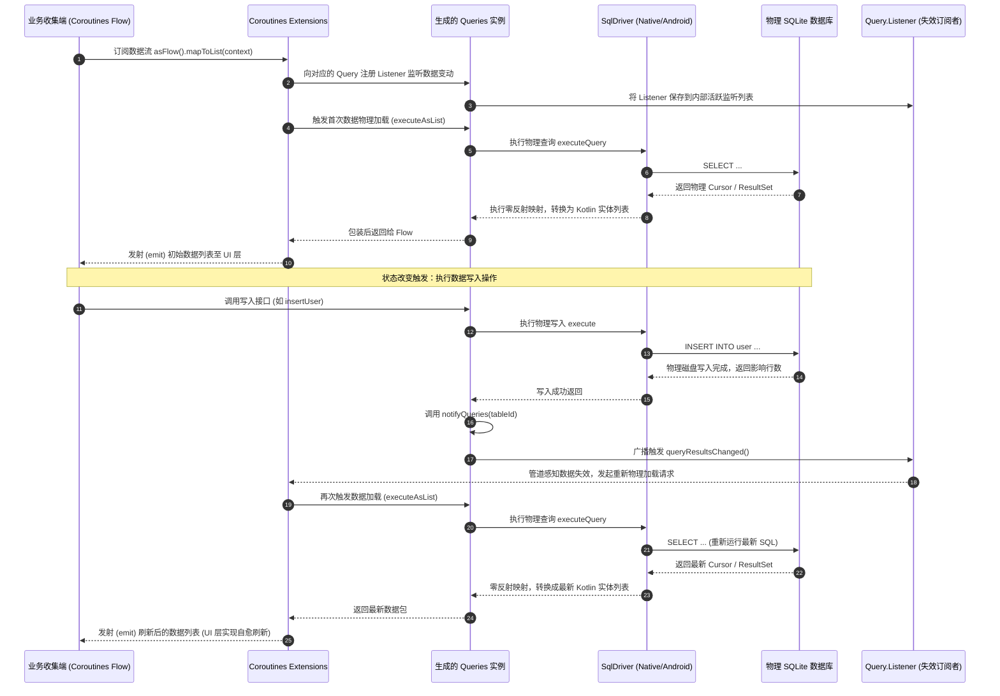

# 5.3.5.3 SQLDelight

在移动端与跨平台开发领域，数据库持久化方案的选择直接决定了应用架构的稳定性与运行效率。传统的对象关系映射（ORM）框架长期统治着持久化领域，但在 Kotlin Multiplatform (KMP) 时代，Square 公司开源的 **SQLDelight** 凭借其颠覆性的 **"SQL First"** 哲学，在跨平台持久化方案中独树一帜。本篇将从架构哲学、编译期生成机制、跨平台底座设计、响应式失效系统以及与 Room 的深度对比等维度，对 SQLDelight 的核心原理与物理实现进行源码级的深入解密。

---

## 1. SQLDelight 概述与 "SQL First" 架构革命

### 1.1 什么是 SQLDelight？
SQLDelight 是由 Square 公司（Cash App 团队）主导并开源的数据库代码生成工具。与传统 ORM 自动将内存中的实体类翻译为 SQL 语句不同，SQLDelight 的工作流完全相反：开发者编写纯原生的 SQL 语句（包括 DDL 和 DML），SQLDelight 编译器在编译期解析这些 SQL，并自动生成类型安全的 Kotlin（或 Java、Swift）强类型数据类（Data Class）以及查询器（Query）接口。它天然支持 Kotlin Multiplatform，能够在 Android、iOS、JVM、macOS、Windows、Linux 以及 JS/Web 等多平台共享完全一致的数据库操作逻辑。

### 1.2 关系代数与内存对象的阻抗失配（Impedance Mismatch）
要理解 SQLDelight 的架构革命，必须首先理解**对象关系阻抗失配（Object-Relational Impedance Mismatch）**。这是关系数据库（以表、行、列及关系代数模型为核心）与面向对象编程语言（以类、对象、封装、继承、多态为核心）之间天然存在的概念鸿沟。

1. **结构失配**：面向对象语言的数据结构是图状的（通过对象引用建立关联），而关系数据库的数据结构是表状的（通过外键和联表查询建立关联）。
2. **粒度失配**：一个复杂的业务对象（例如包含联系方式、配送地址、订单详情的 `User` 对象）在关系数据库中通常需要被拆分存放在数张不同的表中。
3. **类型失配**：编程语言的强类型（如 Kotlin 的枚举、密封类、非空类型）与 SQL 的数据类型（通常只有有限的 INTEGER、TEXT、REAL、BLOB）无法直接一一映射。

传统的 ORM 框架（如 Hibernate、GreenDao）试图通过在内存对象上标注大量的注解，让框架在运行时利用反射自动生成 SQL 语句来抹平这种失配。然而，这种“迎合面向对象，隐藏关系模型”的思路，在复杂的移动端业务场景下暴露出了严重的架构缺陷。

### 1.3 传统 Annotation ORM 的局限与四大痛点
在传统的 Annotation ORM（将 SQL 藏在注解里，或者完全屏蔽 SQL）设计下，开发者往往会遇到以下四个致命痛点：

#### 痛点一：注解表现力受限，SQL 沦为二等公民
SQL 是一门功能极其强大的声明式关系查询语言。然而，当把 SQL 塞进注解（例如 Room 的 `@Query("SELECT ...")`）或者试图通过链式调用 API（如 GreenDao 的 QueryBuilder）来规避 SQL 时，SQL 就沦为了代码里的“二等公民”。
- **缺乏 IDE 智能支持**：注解内的 SQL 字符串在大多数情况下只是普通的文本。虽然现代 IDE（如 Android Studio 针对 Room）做了一些静态分析和高亮，但对于复杂的 SQL 特性（如 Common Table Expressions (CTE) 递归查询、Window Functions 窗口函数、复杂的子查询或多重 LEFT JOIN），IDE 的支持会立刻失效，甚至报出错误的红色警告。
- **重构极其困难**：如果在注解中引用了表的列名，当重命名表或修改列字段时，IDE 无法进行可靠的全局重构，极易遗漏注解中的 SQL 字符串，导致运行时崩溃。

#### 痛点二：类型安全断层与运行时脆弱性
在注解驱动的 ORM 中，Kotlin/Java 类是 Schema 的“唯一真实来源”。数据库的表结构由实体类（Entity）的结构推导而来。
然而，数据库查询的本质是“投影（Projection）”。当我们执行一个包含 `JOIN` 的复杂查询时，返回的列并不等同于任何一个单表 Entity。为了承载查询结果，开发者不得不手动声明一个新的 Projection 类（如 `UserWithNameAndAddress`），并在查询注解中指定。
这种设计存在类型安全的断层：
- 编译器无法在编译早期验证 Projection 类中的字段类型是否与 SQL 查询出的临时列类型完全匹配。
- 一旦 SQL 中的列名拼写错误，或者返回的类型在运行时与 Java/Kotlin 属性不符，该错误只能在**运行时**执行该查询并进行反射映射时才会被触发，破坏了静态类型语言的安全底线。

#### 痛点三：“多此一举”的心智磨损与映射开销
开发者在使用注解 ORM 时，脑海中思考的实际上是 SQL 查询，却不得不将其“翻译”为 ORM 的专有 API 或注解实体类；随后，ORM 框架又在运行时通过复杂的反射和配置解析，将这些对象重新“翻译”回 SQL 执行。
这种双向翻译不仅带来了显著的心智磨损，更在运行时引入了大量的**反射创建对象、动态拼接 SQL、解析 Cursor 映射**的开销，这在资源受限的移动设备上对启动速度和内存占用都产生了负面影响。

#### 痛点四：KMP 跨平台的编译期沙盒局限
在 Kotlin Multiplatform 跨平台架构中，传统的 APT (Annotation Processing Tool) 或 KAPT 具有极强的平台绑定属性（高度依赖 JVM 环境）。虽然如今有了 KSP，但如果框架底层依赖了大量的反射或者平台特有的数据库驱动（例如依赖 Android 系统的 `android.database.Cursor`），它就无法无缝移植到 iOS/macOS 等 Native 平台。

### 1.4 "SQL First" 的哲学革命
面对 ORM 的种种历史包袱，SQLDelight 提出了截然相反的 **"SQL First"** 哲学：
> **不要试图去隐藏 SQL，也不要试图通过对象去推导关系；相反，SQL 才是数据库 Schema 的唯一真实来源（Single Source of Truth），让编译器去服务 SQL。**

在 SQLDelight 的世界里：
1. **编写纯正的 SQL**：开发者直接在项目的源码目录中创建 `.sq` 文件，直接使用最纯粹、最原生的 SQLite 语法编写 `CREATE TABLE`、`INSERT`、`SELECT` 等语句。
2. **编译器生成 Kotlin 代码**：SQLDelight 编译器通过分析 these `.sq` 文件，自动生成高度优化的、纯 Kotlin 实现的接口与实体类。
3. **消除关系阻抗失配**：由于 Kotlin 代码是根据 SQL 查询结果**反向生成**的，因此每一个 SELECT 查询都会自动生成一个与之完美对应的 Kotlin Data Class，字段非空性（Nullability）与类型在编译期就已经绝对契合。
4. **极致性能与极致跨平台**：生成的 Kotlin 代码在运行时不包含任何反射，只包含最基础的底层 Driver 调用，速度极快。同时，因为生成的代码是纯 Kotlin 代码，不依赖 any JVM 特性，可以在 KMP 支持的所有平台上运行。

---

## 2. 编译期强类型安全生成机制解密

SQLDelight 最具技术魅力的核心特性在于其**编译期强类型安全**。一旦 `.sq` 文件中的 SQL 出现任何语法错误、列名不存在、参数类型不匹配，甚至是非空约束冲突，编译器都会在编译阶段直接熔断并报错。这一机制的底层物理运转流程如下。

### 2.1 SQLDelight Gradle 插件的工作流与构建生命周期
SQLDelight 主要是通过 Gradle 插件 `sqldelight-gradle-plugin` 介入到项目的构建生命周期中。其核心任务是 `generateSqlDelightInterface`，该任务被挂载在 Kotlin 编译任务（如 `compileKotlin`、`compileCommonMainKotlin`）的依赖拓扑中。

其完整的编译期构建生命周期如下：

```
[开始构建] ──> [扫描 .sq 文件] ──> [ANTLR 静态语法解析]
                                        │
[编译期熔断] <── [抛出语法/校验异常] <──┴── [验证 DDL/DML 与建立 Schema 内存镜像]
      │                                         │
    (熔断)                                    [通过]
                                                │
                                                ▼
[生成 Kotlin 源代码] <── [类型与空安全性推导] <── [分析 DML 输入/输出 AST]
         │
         ▼
[将生成的代码加入 SourceSet] ──> [Kotlin 编译器正常编译] ──> [生成二进制产物]
```

1. **源扫描**：插件扫描配置 of 源目录（例如 `src/commonMain/sqldelight`）下的所有 `.sq` 文件。
2. **语法解析**：调用底层的 SQL 解析器，将 SQL 文本解析为抽象语法树（AST）。
3. **语义与 Schema 校验**：在内存中重构当前的数据库架构模型，检查所有 DML 语句的合法性。
4. **代码生成**：根据校验通过 of AST，推导输入输出类型，并输出 `.kt` 接口与实现类至 `build/generated/sqldelight` 目录。
5. **编译参与**：将生成的代码目录动态注入到 Gradle 的 Kotlin SourceSets 中，保证后续的 Kotlin 编译阶段能够无缝引用这些类。

### 2.2 ANTLR 解析与 AST（抽象语法树）的推导魔法
SQLDelight 能够静态理解 SQLite 语法的关键在于，它在编译期集成了一个基于 **ANTLR4** 开发的 SQLite 语法解析器。
当插件读取 `.sq` 文件时，ANTLR 会对文件内容进行词法分析（Lexer）与语法分析（Parser），生成一棵完整的抽象语法树（AST）。在这棵 AST 中：
- `CREATE TABLE` 节点定义了关系模型的物理结构（表名、列名、约束、类型）。
- `SELECT / INSERT / UPDATE / DELETE` 节点定义了数据流的操作边界（投影列、筛选条件、参数占位符）。

通过对 AST 节点的遍历，SQLDelight 能够进行高精度的**语义推导**。例如：
- **列名匹配**：当解析到 `SELECT username FROM user` 时，解析器会去寻找 AST 中 `CREATE TABLE user` 的节点。如果 `user` 表中没有 `username` 列，或者该表根本不存在，解析器会立刻生成编译错误，报告具体的行号与列号。
- **参数占位符推导**：当解析到 `SELECT * FROM user WHERE id = :userId` 或 `WHERE id = ?` 时，解析器会推导出该 SQL 语句包含一个输入参数。由于 `id` 在 DDL 中被声明为 `INTEGER`，解析器会自动推断出该输入参数的 Kotlin 类型必须是 `Long`。

### 2.3 Kotlin 代码生成结构剖析：数据类、DatabaseImpl 与 Queries 类
为了彻底看清 SQLDelight 生成的代码，我们以一个具体的例子进行剖析。

假设我们在 `src/commonMain/sqldelight/com/example/db/User.sq` 文件中定义了如下 SQL：

```sql
-- User.sq
CREATE TABLE user (
  id INTEGER PRIMARY KEY AUTOINCREMENT,
  name TEXT NOT NULL,
  email TEXT
);

selectAllUsers:
SELECT * FROM user;

insertUser:
INSERT INTO user(name, email)
VALUES (?, ?);

selectUserById:
SELECT * FROM user
WHERE id = ?;
```

编译后，SQLDelight 会在 `build/generated/sqldelight` 下为我们生成以下核心 Kotlin 类：

#### 1. 数据类（或者是带有 Default 内部实现的接口）
根据 `user` 表的 DDL，SQLDelight 会生成一个名为 `User` 的接口（或数据类），代表这一张表的物理行结构：

```kotlin
// 自动生成的 User.kt 简化版
package com.example.db

import kotlin.Long
import kotlin.String

public interface User {
  public val id: Long
  public val name: String
  public val email: String? // 由于 DDL 中 email 允许为 NULL，这里被自动推导为 String?

  public data class Impl(
    override val id: Long,
    override val name: String,
    override val email: String?,
  ) : User
}
```

#### 2. Queries 包装类 (`UserQueries.kt`)
每一个 `.sq` 文件会对应生成一个 `Queries` 类，它继承自 `TransacterImpl`。这个类是将 SQL 语句转化为 Kotlin 强类型函数的核动力舱：

```kotlin
// 自动生成的 UserQueries.kt 核心逻辑简化版
package com.example.db

import app.cash.sqldelight.Query
import app.cash.sqldelight.TransacterImpl
import app.cash.sqldelight.db.QueryResult
import app.cash.sqldelight.db.SqlCursor
import app.cash.sqldelight.db.SqlDriver
import kotlin.Long
import kotlin.String

public class UserQueries(
  driver: SqlDriver,
) : TransacterImpl(driver) {

  // selectAllUsers 查询的具体实现
  public fun selectAllUsers(): Query<User> = SelectAllUsersQuery(this) { cursor ->
    User.Impl(
      id = cursor.getLong(0)!!,
      name = cursor.getString(1)!!,
      email = cursor.getString(2)
    )
  }

  // selectUserById 查询的具体实现
  public fun selectUserById(id: Long): Query<User> = SelectUserByIdQuery(id) { cursor ->
    User.Impl(
      id = cursor.getLong(0)!!,
      name = cursor.getString(1)!!,
      email = cursor.getString(2)
    )
  }

  // insertUser 写入操作的实现
  public fun insertUser(name: String, email: String?): Unit {
    driver.execute(
      identifier = 101, // 编译期分配的唯一标识，用于底层的 PreparedStatement 缓存优化
      sql = "INSERT INTO user(name, email) VALUES (?, ?)",
      parameters = 2
    ) {
      // 绑定参数：根据推导出的类型，调用对应的 bind 方法
      bindString(0, name)
      bindString(1, email)
    }
    // 触发 Invalidation 系统，通知订阅了 user 表的查询进行刷新
    notifyQueries(101) { listOf("user") }
  }

  // 内部 Query 包装类实现
  private inner class SelectAllUsersQuery<out T : Any>(
    mapper: (SqlCursor) -> T,
  ) : Query<T>(mapper) {
    override fun <R> execute(mapper: (SqlCursor) -> QueryResult<R>): QueryResult<R> =
        driver.executeQuery(102, "SELECT * FROM user", mapper, 0, null)

    override fun addListener(listener: Query.Listener): Unit {
      driver.addListener(listener, arrayOf("user"))
    }

    override fun removeListener(listener: Query.Listener): Unit {
      driver.removeListener(listener, arrayOf("user"))
    }
  }

  private inner class SelectUserByIdQuery<out T : Any>(
    private val id: Long,
    mapper: (SqlCursor) -> T,
  ) : Query<T>(mapper) {
    override fun <R> execute(mapper: (SqlCursor) -> QueryResult<R>): QueryResult<R> =
        driver.executeQuery(103, "SELECT * FROM user WHERE id = ?", mapper, 1) {
          bindLong(0, id) // 强类型参数安全绑定
        }

    override fun addListener(listener: Query.Listener): Unit {
      driver.addListener(listener, arrayOf("user"))
    }

    override fun removeListener(listener: Query.Listener): Unit {
      driver.removeListener(listener, arrayOf("user"))
    }
  }
}
```

**源码深度解析**：
- **零反射映射**：在 `selectAllUsers` 的返回中，我们看到了 `cursor -> User.Impl(...)`。它是直接通过底层 `SqlCursor` 按索引号逐个读取字段的，没有使用任何反射或注解解析。这种直接的代码生成在运行时效率达到了物理极限。
- **参数强类型绑定**：在 `SelectUserByIdQuery` 中，方法入参 `id` 被严格限定为 `Long`。在执行 `driver.executeQuery` 时，调用了 `bindLong(0, id)`。如果我们在调用时传入了错误类型，Kotlin 编译器在常规编译阶段就会直接拦截。

### 2.4 “编译期熔断”校验机制的底层物理实现
如果我们在 `User.sq` 中将查询写错，例如：
```sql
selectUserById:
SELECT * FROM user WHERE id_wrong_name = ?; -- 列名写错
```
为什么在运行 `./gradlew compileKotlin` 时，构建会直接报错？

这是因为 SQLDelight Gradle 插件内部实现了一套**物理 Schema 模拟器**与 **SQL PREPARE 预编译校验机制**：

1. **物理 Schema 虚拟构建**：
   在编译期间，Gradle 插件会在 JVM 内存中初始化一个轻量级的临时 SQLite 数据库（或者使用指定的物理方言引擎驱动）。
2. **DDL 的顺序重放**：
   插件会扫描项目中所有的 `.sq` 文件，收集所有的 `CREATE TABLE`、`CREATE INDEX` 以及 Migration 迁移脚本。然后，它将这些 DDL 语句在这个临时数据库中全部执行一遍。这样，这个内存中的临时数据库就具备了与我们设计中完全相同的物理 Schema 结构。
3. **DML 的 PREPARE 预校验**：
   对于 `.sq` 文件中定义的每一条 DML 语句（如上述的 `selectUserById`），SQLDelight 会向这个临时数据库发起一个 `PREPARE` 请求（即调用 SQLite 的 `sqlite3_prepare_v2` 接口）：
   ```c
   sqlite3_prepare_v2(db_handle, "SELECT * FROM user WHERE id_wrong_name = ?", -1, &stmt, NULL);
   ```
   `sqlite3_prepare_v2` 是 SQLite 引擎用来分析和编译 SQL 语句的底层 API。它本身并不真正执行查询，而是去验证 SQL 的语法、表名、列名以及约束条件。
   如果 SQLite 引擎发现 `id_wrong_name` 列在 `user` 表中不存在，它会立刻返回一个非零的错误码，并附带错误信息（例如 `no such column: id_wrong_name`）。
4. **编译期熔断抛出**：
   SQLDelight 插件捕获到 SQLite 引擎返回的错误信息后，会将其包装为编译异常，直接打印在终端上，并使当前的 Gradle 编译任务失败。

这是一种利用**真实数据库物理引擎**来校验静态代码中 SQL 语句的机制。它比单纯通过正则表达式或手写 AST 规则去验证 SQL 要精准得多，因为任何细微的方言差异（如 SQLite 特有的 `UPSERT` 语法）都由真实的物理引擎在编译期完成了最权威的检验。

### 2.5 编译期类型绑定与空安全性（Nullability）推导
SQLDelight 是如何精确知道生成的 Kotlin 属性是 `String` 还是 `String?` 的？
在 AST 静态分析阶段，SQLDelight 解析器会追踪 DML 投影结果中每个字段在 Schema 中的定义以及当前 SQL 的逻辑状态：

#### 规则一：基于 DDL 显式约束
如果在 `CREATE TABLE` 中列被标记为 `NOT NULL`，那么在常规投影中，它对应的 Kotlin 类型就是非空的（如 `name: String`）。若没有 `NOT NULL`，则为可空（如 `email: String?`）。

#### 规则二：基于 SQL 关系代数计算的 Nullability 升格
这是 SQLDelight 极为强悍的地方。考虑以下多表 `LEFT JOIN` 查询：
```sql
selectUserWithProfile:
SELECT user.name, profile.bio
FROM user
LEFT JOIN profile ON user.id = profile.user_id;
```
即使在 DDL 中，`profile` 表的 `bio` 列被声明为 `bio TEXT NOT NULL`，但由于当前查询使用的是 `LEFT JOIN`，当 `profile` 表中没有匹配的记录时，查询结果中 `profile.bio` 的物理值物理值必然是 `NULL`。
SQLDelight 的 AST 分析器理解 `LEFT JOIN` 的语义。它在生成 `SelectUserWithProfile` 数据类时，会自动将本应为 `String` 的 `bio` 属性升级为 `String?`：
```kotlin
public data class SelectUserWithProfile(
  public val name: String,
  public val bio: String? // 自动升格为可空，防止运行时 NullPointerException
)
```
这种智能推导从根本上解决了传统 ORM 或手写 JDBC Mapper 时最容易发生的“在非空变量中装入 NULL”导致的运行时崩溃。

### 2.6 自定义数据类型映射：ColumnAdapter 物理转换机制
SQLite 原生只支持 `INTEGER`、`REAL`、`TEXT`、`BLOB` 这几种极简的数据类型。但在复杂的业务场景下，Kotlin 的强类型系统（如 `Enum`、带有复杂逻辑的 `Value Class`，或者需要以序列化 JSON 存储的复杂对象）是无法直接用这几种类型表达的。

为了抹平这个鸿沟，SQLDelight 提供了极其灵活的 **ColumnAdapter** 机制：

#### 1. ColumnAdapter 接口契约
```kotlin
package app.cash.sqldelight

public interface ColumnAdapter<T : Any, S : Any> {
  // 从数据库读取的物理值 (S)，转换为 Kotlin 业务实体类型 (T)
  public fun decode(databaseValue: S): T

  // 将 Kotlin 业务实体类型 (T)，转换为写入数据库的物理值 (S)
  public fun encode(value: T): S
}
```

#### 2. 在 .sq 文件中注册自定义类型
如果我们要让 `user` 表的 `role` 列在 Kotlin 侧表达为我们自定义的 `UserRole` 枚举，可以在 `.sq` 文件中这样定义：

```sql
import com.example.db.UserRole;

CREATE TABLE user (
  id INTEGER PRIMARY KEY AUTOINCREMENT,
  name TEXT NOT NULL,
  role TEXT AS UserRole NOT NULL -- 通过 AS 关键字声明 Kotlin 侧类型
);
```

#### 3. 编译期生成的强类型依赖
在编译生成代码时，SQLDelight 发现 `role` 的类型并非 SQLite 的基本类型。于是，它会在生成的 `User.Adapter` 中自动引入这个适配器依赖：

```kotlin
// 自动生成的 User.kt 中的内部 Adapter 定义
public interface User {
  ...
  public class Adapter(
    public val roleAdapter: ColumnAdapter<UserRole, String>,
  )
}
```

在创建 `AppDatabase` 的物理实例时，Kotlin 编译器会**强迫**你传入对应的 Adapter 实例：

```kotlin
val database = AppDatabase(
  driver = driver,
  userAdapter = User.Adapter(
    roleAdapter = object : ColumnAdapter<UserRole, String> {
      override fun decode(databaseValue: String): UserRole = UserRole.valueOf(databaseValue)
      override fun encode(value: UserRole): String = value.name
    }
  )
)
```

在底层的 `UserQueries` 生成类中，解析和映射数据时，就会自动触发这个 Adapter 的物理双向流转：
- **读取数据**：
  `role = database.userAdapter.roleAdapter.decode(cursor.getString(2)!!)`
- **写入数据**：
  `bindString(1, database.userAdapter.roleAdapter.encode(role))`

这在保证数据库层面仍然使用轻量、高效的基本类型的同时，确保了 Kotlin 侧始终面对强类型的对象，没有反射，完全安全。

---

## 3. 跨平台底盘桥接：SqlDriver 的物理设计

SQLDelight 天然契合 Kotlin Multiplatform 架构，其奥秘在于它对底层数据库驱动进行了彻底的抽象——解耦出 `SqlDriver` 接口。

### 3.1 SqlDriver 核心契约与抽象模型
在 SQLDelight 的核心运行时库中，生成的 `DatabaseImpl` 并不直接依赖于特定平台的数据库 API，而是与一个通用的 `SqlDriver` 接口进行绑定。

我们来看 `SqlDriver` 的核心契约定义：

```kotlin
public interface SqlDriver : Closeable {
  // 执行写操作 (INSERT, UPDATE, DELETE 等)
  public fun execute(
    identifier: Int?,
    sql: String,
    parameters: Int,
    binders: (SqlPreparedStatement.() -> Unit)? = null
  ): QueryResult<Long>

  // 执行读操作 (SELECT)
  public fun <T> executeQuery(
    identifier: Int?,
    sql: String,
    mapper: (SqlCursor) -> QueryResult<T>,
    parameters: Int,
    binders: (SqlPreparedStatement.() -> Unit)? = null
  ): QueryResult<T>

  // 事务管理
  public fun newTransaction(): QueryResult<Transacter.Transaction>
  public fun currentTransaction(): Transacter.Transaction?

  // 失效监听器注册
  public fun addListener(listener: Query.Listener, queryKeys: Array<out String>)
  public fun removeListener(listener: Query.Listener, queryKeys: Array<out String>)
  public fun notifyListeners(queryKeys: Array<out String>)
}
```

`QueryResult` 是一个高度抽象的包装类，它的设计初衷是为了在统一的接口下兼容**同步（Synchronous）**与**异步（Asynchronous）**执行。在 Android/iOS 等移动端物理设备上，它通常是同步的，即内部直接包含了执行结果；而在 Web (Kotlin/JS) 等非阻塞环境下，它可能包装了一个 JavaScript Promise 或异步 Deferred 任务。

针对不同的平台，SQLDelight 提供了不同的物理驱动实现，实现“一套数据逻辑代码，处处运行”。

### 3.2 AndroidSqliteDriver：桥接系统的 SupportSQLiteOpenHelper
在 Android 平台，SQLDelight 提供了 `AndroidSqliteDriver`。它底层是对 Android Jetpack 所提供的 `SupportSQLiteOpenHelper` 进行的桥接封装。

#### 物理初始化流程：
当我们创建 `AndroidSqliteDriver` 时，内部会实例化一个默认的 `FrameworkSQLiteOpenHelperFactory`，进而创建并持有 Android 系统的 `SupportSQLiteOpenHelper`：

```kotlin
// AndroidSqliteDriver 核心初始化原理伪代码
public class AndroidSqliteDriver(
  private val schema: SqlSchema<QueryResult.Value<Unit>>,
  private val context: Context,
  private val name: String? = null,
  ...
) : SqlDriver {

  private val delegate: SupportSQLiteOpenHelper = run {
    val config = SupportSQLiteOpenHelper.Configuration.builder(context)
      .name(name)
      .callback(AndroidSqliteDriver.Callback(schema))
      .build()
    FrameworkSQLiteOpenHelperFactory().create(config)
  }

  override fun execute(
    identifier: Int?,
    sql: String,
    parameters: Int,
    binders: (SqlPreparedStatement.() -> Unit)?
  ): QueryResult<Long> {
    val database = delegate.writableDatabase
    val statement = database.compileStatement(sql) // 编译物理 Statement
    binders?.let { AndroidSqlPreparedStatement(statement).it() }
    statement.execute() // 执行物理写入
    ...
  }
}
```

#### 架构特征：
- **生命周期对接**：它完美对接了 Android 系统的 SQLite 生命周期。当数据库需要升级时，会通过 `AndroidSqliteDriver.Callback` 触发 SQLDelight 在编译期自动生成的 Schema 迁移逻辑（即 `Database.Schema.migrate(...)`）。
- **线程调度**：底层读写均由系统 framework 层的 SQLite 锁和连接管理器进行处理，确保了与系统数据库行为的 100% 一致性。

### 3.3 NativeSqliteDriver：iOS 端物理 sqlite3 C 库的高能桥接
在 iOS、macOS 等 Native 平台，由于不存在 JVM 环境，数据库无法通过 Java / JDBC 执行。`NativeSqliteDriver` 底层是通过 Kotlin/Native 的 **C Interop (C语言互操作性)**，直接桥接了 iOS 系统内置的物理 `sqlite3` C 库。

然而，在 Kotlin/Native 特殊的多线程和内存管理模型下，如何安全且高效地管理底层的 `sqlite3*` 物理连接指针，是一个极具技术挑战的话题。

#### Kotlin/Native 内存模型的挑战
在早期 Kotlin/Native 实行“严格线程隔离与对象冻结（Object Freezing）”模型的时代，一个跨线程共享的对象必须被“冻结”。一旦冻结，该对象所有属性均变为只读。
尽管现在 Kotlin/Native 引入了全新的自动 GC 机制（去除了强制冻结机制），但是底层的 C 指针（如物理数据库连接指针 `sqlite3*`）是不受 Kotlin 内存管理保护的。
- 如果两个物理线程同时操作同一个 `sqlite3*` 指针进行数据库写入，底层的 C 库会发生不可预测的竞争冲突，导致应用发生 `SQLITE_MISUSE`（操作错误）或直接物理崩溃（Segmentation fault）。
- 频繁的数据库读写在多线程下极易触发 `SQLITE_LOCKED` 或 `SQLITE_BUSY`。

#### `NativeSqliteDriver` 的高并发物理设计方案：
为了在 iOS 端既能保证多线程安全，又能发挥 SQLite 的最大性能，`NativeSqliteDriver` 提供了不同的连接池设计。最典型且先进的是 **`ThreadConnectionDatabase`**（或称之为线程本地连接池模型）：

```
                  ┌───────────────────────────────────────────────┐
                  │          ThreadConnectionDatabase             │
                  └───────────────────────────────────────────────┘
                                          │
                  ┌───────────────────────┴───────────────────────┐
                  ▼                                               ▼
         [线程 A (Thread A)]                             [线程 B (Thread B)]
                  │                                               │
    ┌─────────────┴─────────────┐                   ┌─────────────┴─────────────┐
    │  Thread Local Storage (TLS)│                   │  Thread Local Storage (TLS)│
    │  - 缓存专属 sqlite3* 指针   │                   │  - 缓存专属 sqlite3* 指针   │
    └─────────────┬─────────────┘                   └─────────────┬─────────────┘
                  │ (独占访问，无锁读)                             │ (独占访问，无锁读)
                  ▼                                               ▼
          [物理 C 连接 A]                                 [物理 C 连接 B]
                  │                                               │
                  └───────────────────────┬───────────────────────┘
                                          ▼
                         ┌─────────────────────────────────┐
                         │   SQLite 物理数据库文件 (WAL 模式)  │
                         └─────────────────────────────────┘
                                          ▲
                                          │ (串行化排队写入)
                                  [全局写入锁 Write Lock]
```

##### 1. WAL 模式 (Write-Ahead Logging) 的深度集成
在 iOS 初始化 `NativeSqliteDriver` 时，SQLDelight 默认会向 SQLite 引擎发送命令开启 WAL 模式：
```sql
PRAGMA journal_mode = WAL;
```
在 WAL 模式下，读操作和写操作可以并发进行。读操作不需要等待写操作释放锁，写操作也不需要等待读操作释放锁（多读单写并发）。

##### 2. 线程局部存储 (Thread Local Storage - TLS) 与独占连接
为了彻底避免同一个物理连接被跨线程交叉调用的风险，`NativeSqliteDriver` 的 `ThreadConnectionDatabase` 利用了 **TLS（线程局部存储）** 机制。
- **本地连接缓存**：每个发起数据库操作的物理线程，都会在其线程本地（TLS）中绑定并缓存一个属于自己的 `sqlite3*` 物理连接指针。
- **避免多线程交叉**：当线程 A 需要执行查询时，它只能拿到绑定在线程 A 本地的那个物理连接；线程 B 亦然。这样，**两个不同的物理线程在物理上操作的是完全不同的 `sqlite3*` 指针**，从根本上在 Kotlin/Native 层消除了多线程交叉访问同一指针导致的物理崩溃。

##### 3. 连接池锁定与写串行化
虽然读操作可以并发，但 SQLite 本质上在任何时刻只允许**一个物理写入连接**执行写事务。
为了解决这一物理限制，`ThreadConnectionDatabase` 内部会使用一个专门的写锁（Write Lock）或串行化写入队列。
- 当某个线程（无论它使用哪个本地连接）发起 `execute`（写入）或事务操作时，必须先去竞争全局的写锁。
- 一旦竞争成功，该线程独占写入权，执行物理 SQL 并提交。
- 其他试图写入的线程会在锁上挂起排队，直到前一个写事务安全提交并释放写锁。
- 而此时，其他未参与写入的线程依然可以通过它们本地 of TLS 连接安全地执行 `SELECT` 读操作，达成了优秀的并发性能。

#### 4. maxReaderConnections 物理调优
在 `NativeSqliteDriver` 的构造器中，可以通过参数调整连接池的大小（`maxReaderConnections`）。
通常，如果你的应用是多读高并发的，将其设置为 `4` 或 `8`。但由于每一个物理 C 连接都会消耗 iOS 应用的虚拟内存和文件描述符，如果你的数据库非常庞大，盲目开大连接池会显著抬升内存基线，同时在移动端并没有那么多核心并发读物理库，因此默认值 `2` 或 `4` 是多读单写场景下的最佳平衡点。

### 3.4 JdbcSqliteDriver：JVM 桥接与无 Mock 闪电级单元测试
在 JVM/Desktop 平台，SQLDelight 提供了 `JdbcSqliteDriver`。它直接对接 Java 的 JDBC 接口，在运行时通常加载 `org.xerial:sqlite-jdbc` 驱动。

除了用于桌面端应用开发外，`JdbcSqliteDriver` 最具实战价值的场景是：**在 Android/KMP 项目中实现无 Mock、极速、高保真的本地单元测试**。

#### 传统单元测试的痛点：
在 Android 中，如果使用 Mock 框架（如 Mockito/MockK）去测试数据库逻辑（如 Dao 层的业务规则、表迁移逻辑），你需要模拟大量的 `Cursor`、`Database`、`SQLiteStatement`。这样的测试不仅代码冗长难懂，而且根本无法验证你写的 SQL 语句本身是否能在真实 SQLite 引擎中跑通。
而如果使用 Instrumentation 仪器化测试（在 Android 模拟器或真机上跑），虽然保真度高，但由于需要经历打包、安装、在真机中运行的流程，测试速度极其缓慢（运行一次通常需要几分钟）。

#### SQLDelight 的破局方案：
使用 `JdbcSqliteDriver` 的**内存模式 (In-Memory Database)**，在电脑本地 JVM 上直接运行纯 Kotlin 单元测试：

```kotlin
class UserRepositoryTest {

  private lateinit var database: AppDatabase
  private lateinit var userRepository: UserRepository

  @Before
  fun setUp() {
    // 1. 创建基于 JVM 内存的 JDBC 驱动
    val driver = JdbcSqliteDriver(JdbcSqliteDriver.IN_MEMORY)
    
    // 2. 瞬间在内存中初始化 Schema 物理表结构
    AppDatabase.Schema.create(driver)
    
    // 3. 构建数据库实例与仓储层
    database = AppDatabase(driver)
    userRepository = UserRepositoryImpl(database.userQueries)
  }

  @Test
  fun testInsertAndQueryUser() {
    // 该测试完全是在物理 SQLite 引擎中执行的真 SQL 操作，高保真！
    userRepository.saveUser(User(id = 1, name = "Alice", email = "alice@example.com"))
    
    val user = userRepository.getUserById(1)
    
    assertEquals("Alice", user?.name)
  }
}
```

**测试架构优势**：
- **闪电速度**：测试直接在本地 JVM 进程的内存中运行，无需启动任何模拟器或真机设备，单次测试运行时间通常低于 **10 毫秒**。
- **物理真实**：由于 `org.xerial:sqlite-jdbc` 内部物理 SQLite 动态链接库，测试中执行的 SQL 语句是在真实的物理 SQLite 引擎中跑的。任何 SQL 语法错误、外键约束冲突等都能被 100% 真实捕获。

### 3.5 事务中的物理线程上下文锁定与死锁防御
在多线程高并发环境中，数据库**事务（Transaction）**的完整性是数据一致性的底座。SQLDelight 通过 `Transacter.transaction` 接口提供对事务的支持：

```kotlin
userQueries.transaction {
  userQueries.insertUser("Alice", "alice@example.com")
  userQueries.insertUser("Bob", "bob@example.com")
}
```

然而，在底层物理实现上，这个事务是如何与线程绑定的？

1. **事务上下文传递机制**：
   当我们调用 `transaction` 闭包时，SQLDelight 会通过 `driver.newTransaction()` 启动一个物理事务。
   在底层，`SqlDriver` 内部会创建并维护一个 `Transaction` 结构，并将其与**当前执行该方法的物理线程**进行绑定（通常使用 `ThreadLocal` 或 Kotlin/Native 下的 Thread Context 指针）。
   在整个闭包体内部，所有的 SQL 语句执行都会强制重用这同一个处于事务状态中的物理连接。
   
2. **死锁防御陷阱（协程上下文切换）**：
   这是一个极易让开发者掉入并导致应用彻底死锁（Deadlock）的陷阱。
   考虑以下错误代码：
   ```kotlin
   // 致命错误：在事务闭包内切换物理线程
   userQueries.transaction {
     userQueries.insertUser("Alice", "alice@example.com")
     
     // 切换到后台线程池，触发了新物理线程的执行
     withContext(Dispatchers.Default) {
       userQueries.insertUser("Bob", "bob@example.com")
     }
   }
   ```
   **物理崩溃原因解析**：
   - 线程 A 开启了事务，持有了写入连接和锁，执行了 `insertUser("Alice")`。
   - `withContext(Dispatchers.Default)` 将后续的代码调度到了线程 B 上执行。
   - 线程 B 执行 `insertUser("Bob")` 时，去寻找线程 B 本地的事务状态，发现不存在事务，于是它试图通过 `driver.execute` 向全局申请连接并进行写入。
   - 此时，物理 SQLite 数据库的物理写入锁已经被线程 A 占用。线程 B 无法申请到写锁，开始处于挂起并无限等待（LOCKED/BUSY）状态。
   - 而线程 A 由于无法等到闭包体执行完毕，无法执行 `COMMIT TRANSACTION`，于是也卡死在事务等待中。
   - 这就构成了完美的**双线程死锁**。

**架构设计规范**：
为了防御这类物理死锁，SQLDelight 规定：**事务闭包体内的所有操作必须在同一个物理线程内完成**。在涉及协程的场景下，如果在事务中必须进行并发或异步流转，必须显式确保上下文的一致性（例如使用 `Dispatchers.Unconfined`，或将所有的读写完全封装在同步作用域内）。

---

## 4. 现代响应式流：基于 Kotlin 协程 Flow 的自愈流订阅

现代移动开发高度推崇**单向数据流（UDF）**与**响应式编程**。SQLDelight 通过官方扩展库 `app.cash.sqldelight:coroutines-extensions` 提供了极其优雅的基于 Kotlin 协程 Flow 的数据订阅机制。

### 4.1 Query.asFlow().mapToList() 的底层源码机制
我们常用的数据订阅代码如下：
```kotlin
val usersFlow: Flow<List<User>> = userQueries.selectAllUsers()
  .asFlow()
  .mapToList(Dispatchers.IO)
```

这段简洁的代码底层，是由两个核心组件组合而成的：

#### 1. `asFlow()` 的底层实现原理
`Query.asFlow()` 会将一个静态的 `Query` 对象包装为一个 `Flow<Query<T>>`。
我们深入分析其底层的 `callbackFlow` 构建原理：

```kotlin
// Coroutines Extensions 库中 asFlow() 的底层设计原理简化版
public fun <T : Any> Query<T>.asFlow(): Flow<Query<T>> = callbackFlow {
  // 1. 定义一个监听器。当底层的表结构发生改变时，触发该监听器
  val listener = object : Query.Listener {
    override fun queryResultsChanged() {
      // 当收到失效信号时，将当前 Query 重新发射 (emit) 到 Flow 管道中
      trySend(this@asFlow)
    }
  }

  // 2. 注册该监听器到 SQLDelight 的 Invalidation 系统中
  addListener(listener)

  // 3. 在 Flow 刚被订阅时，首先主动发射一次当前的 Query 实例，以触发首次数据查询
  trySend(this@asFlow)

  // 4. 当协程被取消订阅或关闭时，必须反注册监听器，防止内存泄漏
  awaitClose {
    removeListener(listener)
  }
}
```

**源码解析要点**：
- **`awaitClose` 黄金防漏门**：`callbackFlow` 内部使用 `awaitClose`。当收集端（Collect）取消订阅时，协程会被取消，此时会自动回调 `awaitClose` 内部的代码块，将 `Query.Listener` 从底层的监听列表中彻底注销，防止内存泄漏。
- **Cold 转 Hot 初值化**：首次订阅时会立刻调用一次 `trySend`，这使得该 Flow 具备了类似 `StateFlow` 的特征——订阅即能拿到当前数据库中的最新值。

#### 2. `mapToList(context)` 的底层实现原理
在接收到 `asFlow()` 发射过来的 `Query<T>` 对象后，`mapToList` 负责在指定的线程上下文中，执行真正的 SQL 物理查询并映射为 List 集合：

```kotlin
public fun <T : Any> Flow<Query<T>>.mapToList(
  context: CoroutineContext
): Flow<List<T>> = map { query ->
  // 在指定的协程 Context (例如 Dispatchers.IO) 中执行物理查询与映射
  withContext(context) {
    query.executeAsList()
  }
}
```

### 4.2 Invalidation (失效通知) 系统：自底向上的数据更新链路
当数据库执行了写操作（如 `INSERT` / `UPDATE`），订阅了对应查询的 Flow 是如何感知数据变动并实现“数据流自愈刷新”的？这就涉及到 SQLDelight 内部精妙的 Invalidation 机制。

我们来看一个完整的失效通知自底向上的传递链路：

```
[业务代码调用 insertUser]
           │
           ▼
[执行物理 SQL 写入] ──> (写入磁盘)
           │
           ▼
[调用 notifyQueries] ──> (收集受影响的 Table 标签)
           │
           ▼
[遍历全局监听映射表] ──> (根据 Table 标签匹配 Listener)
           │
           ▼
[回调 listener.queryResultsChanged()]
           │
           ▼
[callbackFlow 的 trySend(Query)]
           │
           ▼
[Flow 下游重新执行 executeAsList]
           │
           ▼
[发射 (emit) 最新 List 列表] ──> (UI 界面自愈更新)
```

1. **写方法封装**：在 `.sq` 中声明的写操作，被编译为 Kotlin 函数时，其方法体的最后一步必定是由编译器自动生成的 `notifyQueries` 调用。
2. **标识分发**：SQLDelight 会为每一张物理表分配一个基于字符串的唯一 Key。在上述 `insertUser` 的生成代码中，我们能看到 `notifyQueries(101) { listOf("user") }`。
3. **映射匹配**：全局的 `Queries` 容器（如 `UserQueries`）内部持有所有活跃的 `Query.Listener` 以及它们所订阅的表 Key 的映射关系。
4. **监听器回调**：当 `notifyQueries` 触发时，容器会找到所有订阅了 `"user"` 这一 Key 的监听器，并并发或串行调用它们的 `queryResultsChanged()` 方法。
5. **Flow 消费**：注册在 `asFlow()` 中的监听器收到回调，触发 Flow 发射最新的 `Query` 对象给下游。下游的 `mapToList` 拦截到 `Query`，在后台线程重新拉取最新的物理数据，并通过 Flow 最终推送给业务层。

### 4.3 写操作触发失效的源码级调用链追踪
我们以 `UserQueries` 内部细节为线索，还原这一过程的物理轨迹：

#### 步骤一：写操作触发通知
```kotlin
// 开发者调用 UserRepository.addUser("Bob")
public fun insertUser(name: String, email: String?): Unit {
  driver.execute(identifier = 101, sql = "INSERT INTO user(name, email) VALUES (?, ?)", ...) {
    bindString(0, name)
    bindString(1, email)
  }
  // 写完物理数据库后，立刻通过 tableKey 广播失效通知
  notifyQueries(identifier = 101, queryProviders = { listOf("user") })
}
```

#### 步骤二：`TransacterImpl` 内部收集与分发
所有的 `Queries` 都继承自 `TransacterImpl`。`notifyQueries` 最终会流转到全局的驱动桥接层：
```kotlin
// SQLDelight 核心 runtime 内部机制简化版
public abstract class TransacterImpl(private val driver: SqlDriver) : Transacter {
  
  protected fun notifyQueries(identifier: Int, queryProviders: () -> List<String>) {
    // 最终调用底层的 SqlDriver 的通知接口
    driver.notifyListeners(queryProviders().toTypedArray())
  }
}
```

#### 步骤三：驱动广播给监听者
物理 `SqlDriver` 在内存中维护了一个并发安全的监听映射结构（通常是一个并发 Map，Key 为表名，Value 为监听器集合）：
```kotlin
// SqlDriver 实现类 (如 AndroidSqliteDriver) 内部 of 监听分发
private val listeners = ConcurrentHashMap<String, MutableSet<Query.Listener>>()

override fun addListener(listener: Query.Listener, queryKeys: Array<out String>) {
  for (key in queryKeys) {
    listeners.getOrPut(key) { CopyOnWriteArraySet() }.add(listener)
  }
}

override fun notifyListeners(queryKeys: Array<out String>) {
  val affectedListeners = HashSet<Query.Listener>()
  for (key in queryKeys) {
    listeners[key]?.let { affectedListeners.addAll(it) }
  }
  // 逐一触发回调
  for (listener in affectedListeners) {
    listener.queryResultsChanged()
  }
}
```

### 4.4 表级失效（Table-level Invalidation）的设计折中与高频写入调优
在深入使用 SQLDelight 的响应式流时，必须理解其底层的 Invalidation 是 **表级粒度（Table-level）**，而非 **行级粒度（Row-level）**。

#### 1. 为什么是表级失效？
- **复杂度与开销问题**：要实现行级失效，数据库引擎必须在运行时拦截并解析每一条 `UPDATE` / `INSERT` 语句影响的具体行主键（Row ID）。然后，它还要将这些 Row ID 与内存中所有活跃查询的 Row ID 集合进行实时交集计算。这对于移动端轻量级数据库而言，其带来的内存消耗和 CPU 运算开销将不可接受。
- **折中设计**：SQLDelight 选择了最简单、最鲁棒的做法：**只要表变了，订阅该表的查询就全部失效重查**。这种粗粒度设计大大简化了底层的复杂度，将性能调优的空间交给了 Kotlin 协程和业务架构层。

#### 2. 表级失效的物理局限
如果我们在 `user` 表上订阅了两个不同的 Flow：
- Flow A: `SELECT * FROM user WHERE id = 1` （监听用户 1）
- Flow B: `SELECT * FROM user WHERE id = 2` （监听用户 2）

当我们在后台更新了用户 2 的数据时，由于 `user` 表的 Invalidation Key 发生了更新，**Flow A 和 Flow B 都会被同时触发失效，即便用户 1 的数据压根没有发生任何改变**。Flow A 会被迫重新执行一次 `SELECT * FROM user WHERE id = 1` 的物理查询。

#### 3. 高频写入场景下的性能调优策略
在 IM 聊天（消息高频写入）、健康监测（传感器数据高频写入）等场景下，表级失效可能导致严重的“查询风暴”和 CPU 占用飙升。为了规避该问题，我们可以采用以下几种工业级调优手段：

##### 优化手段一：利用协程操作符做 Flow 降噪 (`distinctUntilChanged`)
由于 Flow 重新执行查询后可能会得到完全一样的数据，我们可以使用 `distinctUntilChanged` 来阻止无关变动向下游传递，减少 UI 层无谓的重绘：
```kotlin
val userOneFlow = userQueries.selectUserById(1)
  .asFlow()
  .mapToOne(Dispatchers.IO)
  .distinctUntilChanged() // 只有当 User 对象的物理内容真正发生改变时，才允许向下游发射
```

##### 优化手段二：基于事务（Transaction）的批量写入合并
如果在循环中写入 1000 条数据，千万不要逐条调用 `insert`，因为这会触发 1000 次物理磁盘 I/O，并向全局广播 1000 次 Invalidation 信号，导致 Flow 疯狂刷新。
应当将它们包裹在**同一个事务**中：
```kotlin
userQueries.transaction {
  users.forEach { user ->
    userQueries.insertUser(user.name, user.email)
  }
}
```
**物理机制**：SQLDelight 在执行事务时，内部会暂存所有的 Invalidation 信号。**只有在事务成功提交（Commit）的那一刻，才会向外统一发送一次 Invalidation 广播**。这样，1000 次写入在响应式端只会被合并为 1 次刷新通知。

##### 优化手段三：物理表垂直拆分
在数据库设计阶段，对于需要频繁修改的字段，应避免将其与静态的主表放在同一个物理表中。
*反例*：将用户的 `name`（极少改变）和 `status_online`（在线状态，高频频繁改变）放在 `user` 表中。这会导致在线状态一变，所有订阅用户信息的 Flow 全部失效重查。
*正例*：将 `user` 表垂直拆分为 `user_base`（存储 name 等静态信息）和 `user_status`（存储在线状态），将高频与低频读写在物理表层隔离，从而将 Invalidation 影响范围限制在最小的表内。

### 4.5 升级版的 mapToOne 与 mapToOneOrNull 物理实现
除了 `mapToList`，协程扩展包还提供了 `mapToOne` 和 `mapToOneOrNull`：

- **`mapToOne`**：强要求查询结果必须且只能返回一行。如果查询出多于或少于一行（例如空表），会在协程内直接抛出 `NullPointerException` 或 `IllegalStateException`。
- **`mapToOneOrNull`**：如果查不到记录，它不会抛异常，而是优雅地返回一个 `null` 发射给下游。

```kotlin
// mapToOneOrNull 底层源码工作机制
public fun <T : Any> Flow<Query<T>>.mapToOneOrNull(
  context: CoroutineContext
): Flow<T?> = map { query ->
  withContext(context) {
    query.executeAsOneOrNull() // 物理只取首行，没有直接返回 null
  }
}
```

这套组合拳为响应式 UI 绑定（如 Jetpack Compose 的 `collectAsStateWithLifecycle()`）提供了强大的底层数据支撑，屏蔽了繁琐的逻辑轮询。

---

## 5. 编译期 Schema 迁移（Migration）校验机制解密

在任何应用的持久化生命周期中，Schema 的演进与迁移都是最具风险的阶段。写错一个 SQL 迁移脚本，往往意味着成千上万的用户在升级应用时发生闪退。SQLDelight 将这个痛点同样拉入了“编译期强校验沙箱”中。

### 5.1 从 .sqm 文件到编译期迁移演习
在 SQLDelight 中，所有的迁移脚本都必须定义在以 `.sqm` 为后缀的文件中。例如：
- `src/commonMain/sqldelight/com/example/db/1.sqm`
- `src/commonMain/sqldelight/com/example/db/2.sqm`

在 `1.sqm` 中，我们写入物理表迁移的 SQL 语句：

```sql
-- 1.sqm
ALTER TABLE user ADD COLUMN age INTEGER NOT NULL DEFAULT 0;
```

### 5.2 自动化迁移校验工作流
在项目编译期间（执行 `generateSqlDelightInterface` 任务时），SQLDelight 插件在后台进行一场物理的“模拟演习”：

1. **快照重置**：
   在内存沙箱中，SQLDelight 首先通过读取最初定义的 `.sq` 文件中的 DDL，在临时 SQLite 引擎中构建出版本 0 的物理数据库。
   
2. **迁移脚本重放**：
   接着，插件在临时数据库上，按照物理版本顺序依次执行 `1.sqm`、`2.sqm` 等所有迁移文件中的 SQL 修改命令。
   
3. **最新 Schema 校验与对齐**：
   当所有的 `.sqm` 脚本重放执行完毕后，临时数据库的 Schema 会被固化在内存中。
   SQLDelight 会在此时导出该内存库的物理 DDL，并将其与我们**项目源码中最新 `.sq` 文件里声明的物理表结构进行一次全方位的静态属性比对**。
   
4. **编译期强行熔断**：
   如果在第 3 步的比对中发现，经过 `.sqm` 逐级升级上来的内存表结构中，`age` 列不存在，或者其类型在最新的 `.sq` 文件中被我们写成了 `TEXT`（与迁移文件中的 `INTEGER` 不匹配），SQLDelight 编译任务就会**当场失败并中断**。
   
   错误信息会清晰地输出：
   ```
   Migration 1.sqm resulting Schema does not match the actual Schema definition in User.sq.
   Missing column: age.
   ```

### 5.3 为什么说 SQLDelight 的迁移比 Room 更加物理可靠？
在 **Room** 中，迁移脚本通常定义在运行时代码中：
```kotlin
val MIGRATION_1_2 = object : Migration(1, 2) {
  override fun migrate(db: SupportSQLiteDatabase) {
    db.execSQL("ALTER TABLE user ADD COLUMN age INTEGER NOT NULL DEFAULT 0")
  }
}
```
虽然 Room 可以通过编写特定测试类并使用物理文件比对来进行 Migration Test，但这种测试属于**运行时单元测试**，开发者必须手动编写测试用例、手动触发它。如果开发者偷懒或者忘记写测试用例，一旦 `ALTER TABLE` 字符串中拼写错了某个词，Kotlin 编译器根本无法发现，这个灾难最终必然会在用户的手机上爆发。

而 **SQLDelight** 将这个流程强制集成到了 `generateSqlDelightInterface` 的**编译管道**中。你不需要主动去写任何测试用例，只要运行编译，插件就会强制在沙箱里跑完所有迁移并进行物理对齐校验。这把任何遗漏或写错物理迁移脚本的概率直接降到了 **零**。

---

## 6. 数据库双雄大决战：Room vs SQLDelight

在 Android 和 KMP 持久化方案选型中，Jetpack Room 与 SQLDelight 是绝对的双壁。它们代表了两种截然不同的架构思潮。

### 6.1 Room vs SQLDelight 全方位对比矩阵

| 对比维度 | Jetpack Room | SQLDelight |
| :--- | :--- | :--- |
| **设计哲学** | **Object-First (Annotation ORM)**<br>通过 Kotlin/Java 类与注解推导并映射 SQL 表结构。 | **SQL-First (Code Generation)**<br>以纯 `.sq` 文件的原生 SQL 为唯一源，逆向生成 Kotlin 代码。 |
| **编译期校验手段** | 基于 **APT/KSP** 注解处理器，静态解析 `@Query` 字符串并生成 Java/Kotlin 桥接代码。 | 基于 **ANTLR4** 解析 AST，并在编译期通过物理 SQLite JDBC 的 `PREPARE` 语句执行真实引擎校验。 |
| **KMP 跨平台扩展能力** | **较弱（历史包袱重）**<br>自 2.7.0 起支持 KMP，但底层高度依赖系统的 Java/Android 框架，迁移和适配成本较高，生态偏年轻。参见 [Android Version Change Log](../../../../AndroidVersionChangeLog.md) 了解系统 API 变迁对数据底层的系统级影响。 | **极强（原生跨平台）**<br>诞生之初就是为跨平台设计的，桥接层彻底抽象为 `SqlDriver`，在 iOS、Web、Desktop 端极其成熟稳定。 |
| **学习曲线与样板代码** | **平缓，上手极快**<br>无需编写复杂的 DDL，通过编写 Kotlin 类加 `@Entity` 即可，样板代码少。 | **陡峭，需要懂原生 SQL**<br>需要开发者手动编写 DDL（创建表、建索引）和物理迁移文件，样板代码和前期配置较多。 |
| **运行时性能与包体积** | **中规中矩**<br>包含反射实例化类、复杂的逻辑映射以及 LiveData/Flow 的包装，包体积与内存开销偏大。 | **极致性能**<br>生成的纯 Kotlin 代码无反射，直接读取 Cursor 物理数据，运行时极度轻量，包体积增量极小。 |
| **版本迁移 (Migration)** | **高度自动化**<br>支持 Auto-Migration，框架通过比对注解实体变化自动生成升级脚本，且支持回退。 | **手动主导，完全掌控**<br>必须手动编写 `.sqm` 物理迁移文件，虽然可以运行 Migration 验证测试，但需要手写 SQL ALTER 语句。 |

---

### 6.2 核心维度的深度对比与剖析

#### 维度一：构建机制与错误排查效率
- **Room** 的 SQL 校验是在注解处理器（KSP）内通过特定的 SQL 语法剖析器来做的。如果编写了特定平台 SQLite 的高级函数，KSP 常常会因为“无法识别语法”而报错，或者在编译期漏过一些在真实 SQLite 中无法运行的复杂 SQL。
- **SQLDelight** 引入了“编译期真实物理 PREPARE”的理念，借助内存中真实的 SQLite 引擎对每一条 DML 进行预编译校验。这使 SQLDelight 能在编译阶段捕获一切细微的物理引擎兼容性问题，错误信息直接精确定位到 `.sq` 文件的物理行，排查效率更高。

#### 维度二：Kotlin Multiplatform (KMP) 的架构纯度
- **Room** 起源于 Android 平台，其底座设计中带有浓重的 Android 特性（如对 Android 平台 Lifecycle、LiveData、Android 原生 Cursor 的强绑定）。虽然谷歌官方在 2.7.0 版本进行了大量的跨平台改造，但在 Native 端的稳定性、编译链路的复杂度（例如需要在多平台下正确配置 KSP 和物理 SQLite C 库）依然比 SQLDelight 要繁琐得多。
- **SQLDelight** 自诞生起就将跨平台作为生命线。它的 `SqlDriver` 架构极为简洁，iOS 侧的 `NativeSqliteDriver` 在解决 K/N 多线程锁和 TLS 方面已经经过了多年大型工业级项目（如 Cash App）的洗礼，在跨平台领域，SQLDelight 拥有更纯粹的 Kotlin 原生基因与更庞大的 KMP 社区生态。

#### 维度三：动态映射与对象映射开销
在运行时，当 Room 从数据库读取数据并映射为 Kotlin 对象时，它需要：
1. 遍历 `android.database.Cursor`。
2. 通过反射或生成的 Java 代码，使用字段名匹配列索引。
3. 如果是非空类型，进行安全转换检查。
4. 调用构造函数创建对象。

而 SQLDelight 生成的代码是**静态硬编码映射**：
```kotlin
// SQLDelight 生成的代码直接按硬编码的数字索引获取，速度达到极致
User.Impl(
  id = cursor.getLong(0)!!,
  name = cursor.getString(1)!!,
  email = cursor.getString(2)
)
```
由于在编译期，SQLDelight 已经通过物理校验确定了返回列的严格顺序，所以它在运行时根本不需要去通过“列名”来动态查询“列索引”，而是直接通过硬编码的常数索引 `0`、`1`、`2` 从底层 `SqlCursor` 取数据。这在大量数据读取的场景下，可以省去海量的映射计算耗时。

---

### 6.3 实战选型决策树与架构师建议

在决定项目选用 Room 还是 SQLDelight 时，可以参考以下决策指南：

```
                              [开始持久化技术选型]
                                       │
                        ┌──────────────┴──────────────┐
                 (是) ──> [项目是否为 KMP 跨平台项目？] <── (否)
                        │                             │
                        ▼                             ▼
               [选择 SQLDelight]              [是否需要支持复杂 SQL、]
                                              [极致性能或高性能单元测试？]
                                                      │
                                        ┌─────────────┴─────────────┐
                                 (是) ──>                           <── (否)
                                        │                                   │
                                        ▼                                   ▼
                               [选择 SQLDelight]                       [选择 Room]
```

#### 建议一：闭眼选择 SQLDelight 的场景
1. **Kotlin Multiplatform (KMP) 跨平台项目**：如果你的业务代码要在 Android 和 iOS/macOS 之间共享，不要犹豫，立刻选择 SQLDelight。它是目前在 iOS 端多线程表现最稳健、生态最纯粹的跨平台数据库利器。
2. **重度复杂查询业务**：如果应用中包含大量复杂的联表查询、窗口函数、分层查询（例如聊天记录时间轴、树状组织架构查询等），SQLDelight 的 `.sq` 文件编写体验与 IDE 支持会让开发效率成倍提升。
3. **推崇极限性能与包体积优化的应用**：如 IoT 设备上的 Android 系统应用、轻量级 SDK、或者是对包体积极其敏感的工具类应用。
4. **测试驱动开发 (TDD)**：如果你高度依赖单元测试来验证复杂的业务数据流动，SQLDelight 极速的本地 JVM 内存测试能够极大改善开发体验。

#### 建议二：适合选择 Room 的场景
1. **纯 Android 原生应用**：如果项目没有跨平台计划，且数据库操作主要以单表的增删改查（CRUD）和简单的单表查询为主。
2. **偏爱快速原型与低上手成本**：团队成员对 SQL 不太熟悉，更倾向于使用面向对象的方式定义表结构，希望快速跑通业务。
3. **重度依赖 Jetpack Paging 3 分页库**：Room 拥有官方提供的原生 `PagingSource` 整合支持，实现带数据库缓存的分页查询时，Room 的样板代码最少。

---

## 7. 核心架构与时序图示

为了更加直观地理解 SQLDelight 的物理分层和响应式失效流转逻辑，我们绘制了以下两个架构与时序图。

### 7.1 编译与桥接物理引擎架构图
下图展示了 SQLDelight 编译期 `.sq` 文件分析生成 Kotlin 代码，以及运行时通过 `SqlDriver` 桥接不同平台物理引擎的宏观架构设计：

```mermaid
graph TD
    subgraph 编译期 (Compile Time - JVM Environment)
        SQFiles[".sq 物理源文件 (DDL / DML)"] -->|ANTLR 语法解析| Parser[SQLDelight 编译器内核]
        Parser -->|AST 语义推导| CodeGen[Kotlin 代码生成引擎]
        CodeGen -->|输出| DataClass["Kotlin 接口 / 强类型 Data Class"]
        CodeGen -->|输出| Queries["Queries 包装实现类 (SQL 逻辑 Kotlin 化)"]
        Parser -->|内存 Schema 镜像重建 & PREPARE 验证| SQLiteJDBC["SQLite JDBC (真实物理引擎预检)"]
        SQLiteJDBC -->|若 SQL 语法/列名报错| BuildFailure["编译强行熔断 (Gradle Build Failed)"]
    end

    subgraph 运行时 (Runtime - Multiplatform)
        Queries -->|方法调用 / 参数封装| SqlDriver["SqlDriver (跨平台核心驱动抽象契约)"]
        
        SqlDriver -->|Android Bridge| AndroidSqliteDriver["AndroidSqliteDriver"]
        SqlDriver -->|iOS / Native Bridge| NativeSqliteDriver["NativeSqliteDriver"]
        SqlDriver -->|JVM / Desktop Bridge| JdbcSqliteDriver["JdbcSqliteDriver"]

        AndroidSqliteDriver -->|委托物理调用| SupportSQLite["SupportSQLiteOpenHelper (系统 SQLite NDK 封装)"]
        
        NativeSqliteDriver -->|直接 C 互操作 (C Interop)| sqlite3C["iOS 物理 sqlite3 C 库 (基于 TLS 连接池 & 全局写锁)"]
        
        JdbcSqliteDriver -->|标准的 JDBC 驱动桥接| XerialJDBC["Xerial SQLite JDBC 驱动 (支持 JVM 内存数据库模式)"]
    end
```

---

### 7.2 Invalidation 异步 Flow 刷新时序图
当我们在 iOS/Android 上使用协程 Flow 订阅数据，并执行写入操作时，数据变化是如何驱动 Flow 管道实现自愈更新的？下方的时序图还原了这一完整的异步流转机制：



---

## 7. 总结

SQLDelight 的 **"SQL First"** 架构哲学，深刻揭示了软件工程中“不要试图去隐藏底层强大力量，而是应当通过工具去服务并释放它”的道理。它通过以下机制实现了在跨平台持久化领域的王者地位：
- **编译期静态解析与真实 PREPARE 校验**，消除了 SQL 的运行时隐藏隐患；
- **纯 Kotlin 无反射硬编码映射**，达成了极高的运行时性能和极简包体积；
- **精心设计的抽象 SqlDriver 底座**，在多平台间架起一座座性能极佳、多线程安全的物理桥梁；
- **自底向上的 Invalidation 失效分发网络**，为现代响应式架构提供了强大的流式底气；
- **防错于未然的编译期迁移校验**，彻底消灭了线上用户升级崩溃的隐患。

理解并掌握 SQLDelight，能够让开发者在探索 Kotlin Multiplatform 的漫漫征途上，拥有更底气十足的持久化底层底盘支撑。
