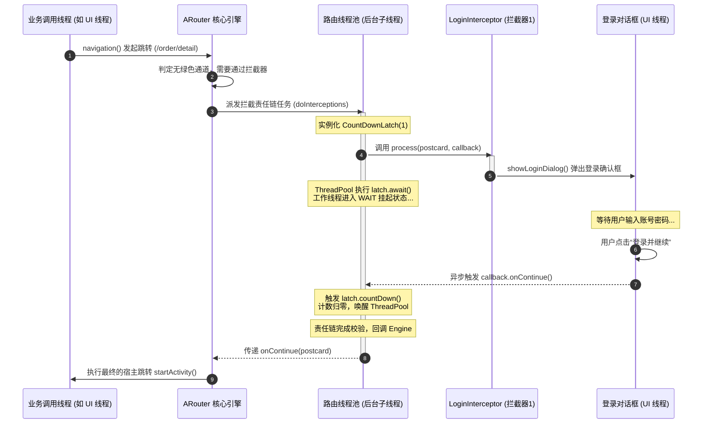

# ARouter 核心机制深度剖析

在大型 Android 组件化架构的演进过程中，路由框架是打破模块物理隔离、实现解耦通信的核心基础设施。本篇将从**物理隔离挑战**、**编译期静态收集与三级注册树**、**运行时懒加载架构**、**拦截器责任链多线程控制**、以及**服务发现与降级容灾**等维度，对阿里开源路由框架 ARouter 进行底层源码级的深度剖析，揭示其背后的设计取舍与实现美学。

---

## 1. 组件化浪潮与物理隔离挑战

### 1.1 传统单体架构的研发瓶颈与工程演进
在传统的 Android 单体（All-in-one）应用中，所有业务逻辑、页面交互、数据模型均编写在单一的 `app` 模块下。随着业务复杂度的线性增长以及研发团队规模的扩大，这种单体结构会暴露出严重的工程缺陷：
- **构建效率的指数级劣化**：任何局部代码的微调，哪怕仅是修改了一个 String 常量，编译器都需要对全量代码进行语法分析、混淆优化、Dex 转换以及资源合并打包。这会导致项目编译时间长达数十分钟甚至数小时，严重耗费开发人员的时间精力。
- **Git 协同冲突与代码分支泥潭**：数十名甚至数百名研发人员在同一个代码仓库的同一个 Module 中提交代码，频繁引发冲突。分支管理成本随开发人数增加呈指数级上升。
- **边界模糊与代码“腐烂”**：缺乏物理依赖屏障，模块之间可以任意通过直接引用的方式调用对方的实现类。随着时间的推移，各种底层类与上层业务类相互交叉引用，形成复杂的“蜘蛛网”式高耦合依赖。这使得局部的重构或需求迭代动一发而全身。

为了从根本上解决上述痛点，组件化（Componentization）架构应运而生。其核心工程思想是将整个应用按照业务线（如会员、订单、商品等）和公共功能（如网络库、图片加载库、分享 SDK 等）拆分为若干个物理隔离的模块（Gradle Module）。

```
+-----------------------------------------------------------+
|                      宿主壳工程 (App)                     |
+-----------------------------------------------------------+
       /                     |                     \
      v                      v                      v
+------------+         +------------+         +------------+
| 业务组件A   |         | 业务组件B   |         | 业务组件C   | (业务层 - 物理隔离，互不依赖)
+------------+         +------------+         +------------+
      \                      |                      /
       v                     v                     v
+-----------------------------------------------------------+
|                     基础业务/功能组件                     | (底层公共库 - api/implementation)
+-----------------------------------------------------------+
```

这些业务组件在独立开发期作为独立的 `com.android.application` 存在，可以单独构建成调试 Apk 运行与自测；而在集成期则作为 `com.android.library` 依赖，统一打包进宿主壳 App 中。

### 1.2 物理隔离下的通信困局：从编译可见性谈起
在组件化开发中，物理隔离是一条必须坚守的红线。为了防止组件之间重新走向互相依赖、越界引用的老路，在 Gradle 配置中，业务组件之间（如 `Module A` 和 `Module B`）通常使用 `implementation` 进行依赖隔离。

从构建系统和 JVM/ART 虚拟机的角度来看，Gradle 的 `implementation` 依赖具有非传递性。这意味着，`Module A` 在编译期对 `Module B` 的类路径是完全不可见的。这就带来了两大核心通信瓶颈：

#### 1.2.1 显式 Intent 跳转的强类型耦合冲突
在传统的单体应用中，页面跳转强依赖于 Class 物理路径的显式 Intent：
```java
Intent intent = new Intent(this, OrderDetailActivity.class);
intent.putExtra("orderId", "12345");
startActivity(intent);
```
但在组件化架构下，如果 `Module A`（会员组件）想要拉起 `Module B`（订单组件）的 `OrderDetailActivity`，由于 Gradle 依赖隔离，`Module A` 的类加载器（ClassLoader）在编译期根本无法寻址到 `OrderDetailActivity.class` 这个物理类，编译器会直接报 `Cannot resolve symbol` 编译错误。

#### 1.2.2 隐式 Intent 的维护灾难与系统级开销
为了绕过物理 Class 引用，开发者常退一步使用 Android 原生的隐式 Intent：
```java
Intent intent = new Intent("com.example.action.ORDER_DETAIL");
intent.addCategory(Intent.CATEGORY_DEFAULT);
intent.putExtra("orderId", "12345");
if (intent.resolveActivity(getPackageManager()) != null) {
    startActivity(intent);
}
```
隐式 Intent 确实实现了编译期的解耦，但在实际的中大型企业级项目中，它是灾难性的：
- **命名冲突与清单文件臃肿**：需要在各个组件的 `AndroidManifest.xml` 中配置繁琐的 `<intent-filter>`。随着页面增加，清单文件急剧膨胀，且极易发生 Action 命名空间冲突。
- **反馈滞后性**：隐式 Action 完全基于硬编码的字符串约定。一旦目标组件的 Action 字符串发生拼写错误，或者目标页面在重构时删除了该 IntentFilter，编译器无法提供任何类型安全校验。错误只有在运行时执行到跳转逻辑、并抛出 `ActivityNotFoundException` 导致 App 崩溃时才能被发现。
- **严重的 Binder 跨进程开销**：当调用 `resolveActivity` 或启动隐式 Intent 时，Android 系统需要通过 `PackageManagerService` (PMS) 去遍历整个 Android 系统中所有已安装应用注册的 IntentFilter 集合。这涉及到耗时的 Binder 跨进程调用和复杂的系统级 XML 解析，这在性能敏感的场景下开销非常可观。
- **拦截控制的缺失**：原生 Intent 跳转是一步到位的，属于“黑盒跳转”。开发者无法在跳转的中途插入任何横切关注点（如：跳转到订单页前检查是否登录、是否满足会员权限等）。
- **多端路由规范的分裂**：隐式 Intent 难以适配 H5、小程序与 App 原生页面之间统一的 Schema 路由规范。

### 1.3 跨模块解耦与控制反转（IoC）的路由设计方案
为了在保持组件间物理隔离的前提下，实现安全、可控、高性能的跨模块跳转与通信，ARouter 提出了基于**虚拟 URI 寻址与控制反转（IoC）**的路由解决方案：

1. **虚拟路由寻址**：将物理 Activity 类与一段唯一的虚拟字符串路径（如 `/order/detail`）进行映射。调用方不再关心目标页面具体的 Class 类名与所在的 Module 物理位置，只需提供这个唯一的 Path 即可。
2. **依赖注入与反转**：调用方不直接持有服务提供方的实体类，而是通过获取服务接口的定义（定义放在共享的公共底层 Module 中），由 ARouter 作为中介容器，在运行时动态寻找该接口对应的实现类并实例化注入给调用方。
3. **切面拦截（AOP）**：路由在跳转前不是直接交给操作系统执行，而是先进入路由框架的中央处理器，依次通过拦截器链进行业务逻辑拦截过滤，通过后再分发执行。

---

## 2. 路由表编译期静态收集与三级注册树

为了支持通过字符串路径（如 `/member/detail`）定位到具体的类（如 `MemberDetailActivity.class`），系统必须在内存中维护一张映射表。

传统的路由框架为了收集这个映射表，往往会在应用启动时利用反射去扫描所有的类，或者在运行时动态将路由节点注册进全局 Map。但这会导致冷启动耗时大幅增加。ARouter 的核心设计是在**编译期**利用 Javac 的注解处理器（APT）进行路由表的静态收集，并生成结构化的 Java 辅助类。

### 2.1 APT 编译期注解处理核心机制
APT（Annotation Processing Tool）是 Java 编译器 Javac 内置的一套在编译期扫描和处理注解的机制。ARouter 定义了 `@Route`、`@Interceptor` 和 `@Autowired` 等注解。

在编译期间，ARouter 的 Annotation Processor（如 `RouteProcessor`、`InterceptorProcessor`）在 Java 编译器进行语法分析后被触发。其核心运行机制可划分为以下几个阶段：

```
+--------------------------------------------------------------+
| Javac 编译开始：解析与填充符号表 (Parse and Enter)           |
+--------------------------------------------------------------+
                               |
                               v
+--------------------------------------------------------------+
| Round 1: APT 扫描 @Route 等注解，获取标注的类节点 (Element)    |
+--------------------------------------------------------------+
                               |
                               v
+--------------------------------------------------------------+
| Round 1: 执行路由校验与归类，利用 JavaPoet 生成对应的辅助 Java 类 |
+--------------------------------------------------------------+
                               |
                               v
+--------------------------------------------------------------+
| Round 2: 编译器检测到有新生成的 Java 源文件，重新对其进行编译解析 |
+--------------------------------------------------------------+
                               |
                               v
+--------------------------------------------------------------+
| Javac 编译结束：生成最终的 Class 字节码                      |
+--------------------------------------------------------------+
```

1. **收集注解节点**：APT 通过 `RoundEnvironment.getElementsAnnotatedWith(Route.class)` 接口，获取项目中所有被标注了 `@Route` 的类。这些类在编译期被抽象为 `Element` 节点（具体为 `TypeElement`）。
2. **多维度校验**：
   - 校验路由路径 `path` 是否符合规范（必须以 `/` 开头，且至少包含两个 `/`，即满足至少两级目录规则，例如 `/module/page`）。
   - 提取首个 `/` 与第二个 `/` 之间的字符串作为路由组名 `group`（如 `/member/detail` 的组名是 `member`）。
   - 检查被注解类所实现的父类或接口类型：如果是 Activity，记为 `RouteType.ACTIVITY`；如果是 Fragment，记为 `RouteType.FRAGMENT`；如果是 `IProvider` 接口的子类，则记为 `RouteType.PROVIDER`。
3. **按 Group 进行内存归类**：由于一个 Module 中可能包含成百上千个页面，如果全部塞到一个源文件里会导致生成的类过大。ARouter 将扫描出来的路由数据以 `group` 为 Key 进行分组（Grouped），每一组对应的路由信息存放在各自的集合中。
4. **使用 JavaPoet 动态拼接生成 Java 代码**：JavaPoet 是一个用于动态生成 Java 源文件的第三方库。ARouter 的编译器通过构建 `MethodSpec`、`TypeSpec` 以及 `JavaFile`，严格按照预设的模板拼接出对应的 Java 源码。
5. **文件写入与后续 Round 循环**：生成的 Java 源码通过 APT 提供的 `Filer` 写入到磁盘（通常在 `build/generated/source/apt/` 目录下）。由于 Javac 编译是分 Round（轮次）进行的，当上一轮 APT 产生了新的 Java 源文件时，Javac 会自动触发下一轮编译，将新生成的 Java 源文件与原有的业务源码一并编译成 `.class` 字节码。

### 2.2 编译期三级映射类自动生成逻辑与职责分工
为了降低运行时的内存与 CPU 开销，ARouter 没有将一个 Module 下的所有路由都塞进一个类文件中，而是巧妙地设计了**三级注册树**结构。对于每个标注了 `@Route` 注解的 Module，在编译后都会在 `com.alibaba.android.arouter.routes` 包名下自动生成以下三层映射类：

#### 2.2.1 第一级：`ARouter$$Root$$[module]` —— 路由组根映射表
* **生成命名规则**：`ARouter$$Root$$[module_name]`（如 `ARouter$$Root$$member`）
* **实现接口**：`IRouteRoot`
* **核心职责**：它是整个模块路由组的索引大表。它保存了当前 Module 内所有的 **Group 名字** 与其对应的 **Group 辅助类 Class 物理路径** 的映射关系。
* **物理生成源码示例**：
```java
package com.alibaba.android.arouter.routes;

import com.alibaba.android.arouter.facade.template.IRouteGroup;
import com.alibaba.android.arouter.facade.template.IRouteRoot;
import java.util.Map;

/**
 * 由 ARouter Compiler 自动生成的 Root 根映射表类。
 * 用于建立全局组名与二级映射类 Class 的映射。
 */
public class ARouter$$Root$$member implements IRouteRoot {
    @Override
    public void loadInto(Map<String, Class<? extends IRouteGroup>> routes) {
        // 将 group 的名字与对应的二级映射类 Class 进行关联，此时仅仅是 Class 引用，并不会实例化二级映射类
        routes.put("member", ARouter$$Group$$member.class);
        routes.put("login", ARouter$$Group$$login.class);
    }
}
```
* **设计意图**：通过 Root 类，运行时能够快速得知当前 App 包含哪些路由组（如 `member`、`login` 组），以及它们由哪个类文件负责。这为“**按需懒加载**”奠定了基石。

#### 2.2.2 第二级：`ARouter$$Group$$[group]` —— 具体路径元数据映射表
* **生成命名规则**：`ARouter$$Group$$[group_name]`（如 `ARouter$$Group$$member`）
* **实现接口**：`IRouteGroup`
* **核心职责**：保存该具体路由组下，所有**子路径（Path）**与其对应的**路由元数据（RouteMeta）**的映射关系。
* **物理生成源码示例**：
```java
package com.alibaba.android.arouter.routes;

import com.alibaba.android.arouter.facade.enums.RouteType;
import com.alibaba.android.arouter.facade.model.RouteMeta;
import com.alibaba.android.arouter.facade.template.IRouteGroup;
import com.example.member.MemberDetailActivity;
import com.example.member.MemberInfoFragment;
import java.util.Map;

/**
 * 由 ARouter Compiler 自动生成的 Group 路由映射组类。
 * 负责保存该组内所有具体的页面和组件映射元数据。
 */
public class ARouter$$Group$$member implements IRouteGroup {
    @Override
    public void loadInto(Map<String, RouteMeta> atlas) {
        // 注册 Activity 路由
        atlas.put("/member/detail", RouteMeta.build(
            RouteType.ACTIVITY,           // 路由类型
            MemberDetailActivity.class,    // 物理目标类
            "/member/detail",              // 路由路径
            "member",                     // 路由组
            null,                          // 参数传递映射
            -1,                            // 优先级
            Integer.MIN_VALUE              // 额外标识符
        ));

        // 注册 Fragment 路由
        atlas.put("/member/info_fragment", RouteMeta.build(
            RouteType.FRAGMENT,
            MemberInfoFragment.class,
            "/member/info_fragment",
            "member",
            null,
            -1,
            Integer.MIN_VALUE
        ));
    }
}
```
* **设计意图**：只有当发生针对 `/member` 组下的页面的跳转时，对应的 `ARouter$$Group$$member` 辅助类才会被反射加载并执行 `loadInto` 方法。这样便将物理类的 Class 引用加载延迟到了最后一步，防止了 ClassLoader 的大批量预加载。

#### 2.2.3 第三级：`ARouter$$Providers$$[module]` —— 跨组件服务映射表
* **生成命名规则**：`ARouter$$Providers$$[module_name]`（如 `ARouter$$Providers$$member`）
* **实现接口**：`IProviderGroup`
* **核心职责**：专门用于存放跨组件服务（即实现了 `IProvider` 接口的类）的映射关系。它将**服务接口的 Class 类名**作为 Key，将对应的 **RouteMeta 实例**作为 Value 存储。
* **物理生成源码示例**：
```java
package com.alibaba.android.arouter.routes;

import com.alibaba.android.arouter.facade.enums.RouteType;
import com.alibaba.android.arouter.facade.model.RouteMeta;
import com.alibaba.android.arouter.facade.template.IProviderGroup;
import com.example.member.export.IMemberService;
import com.example.member.impl.MemberServiceImpl;
import java.util.Map;

/**
 * 由 ARouter Compiler 自动生成的 Providers 跨组件接口映射类。
 * 负责收集整个模块内向外暴露的服务接口。
 */
public class ARouter$$Providers$$member implements IProviderGroup {
    @Override
    public void loadInto(Map<Class, RouteMeta> providers) {
        // 建立服务接口与具体实现类的关联关系
        providers.put(IMemberService.class, RouteMeta.build(
            RouteType.PROVIDER,
            MemberServiceImpl.class,
            "/member/service/info",
            "member",
            null,
            -1,
            Integer.MIN_VALUE
        ));
    }
}
```
* **设计意图**：服务发现是一个高频且通用的逻辑，往往在页面未被调起前就需要获取跨模块数据。将服务信息独立提取到 `Providers` 表中，能在大规模解耦调用中提升检索效率。

---

## 3. 运行时路由表载入与多级懒加载架构

### 3.1 冷启动性能红线：反射全量加载的致命弊端
在大型 Android 项目中，可能有数百个 Module、数千个 Activity 页面和数百个跨组件服务。如果在 App 启动初始化时（例如在 `Application.onCreate` 中），一次性将全量路由映射表反射装载到内存中，会带来严重的冷启动灾难：

1. **ClassLoader 频繁加载导致的 CPU 爆表**：反射 `Class.forName()` 会强制 JVM/ART 的 ClassLoader 去查寻、读取并解析对应的 `.class` 字节码文件，并将其元数据（如方法表、属性表）载入到虚拟机的永久代（Metaspace）或方法区中。大批量类在冷启动阶段的同步加载，会引起激烈的 CPU 竞争，直接拉长冷启动时间数秒，导致明显的视觉卡顿甚至 ANR。
2. **堆内存（PSS）空耗**：每一个路由元数据 `RouteMeta` 本身是一个 Java 对象，会占用堆内存；加之保存它们的 Map 节点（`Map.Entry`）、Key（String 字符串）等，都会制造大量细碎片对象，给垃圾回收器（GC）带来巨大压力。最致命的是，一个普通用户在单次 App 使用生命周期内，往往仅会访问 10% 左右的页面。提前将剩余 90% 从未用到的 Activity 字节码和元数据装入内存，是对用户设备内存资源的极大浪费。

### 3.2 懒加载机制的源码实现
ARouter 通过**多级懒加载（Lazy Loading）**架构完美规避了冷启动红线。其核心策略是：
- **初始化时**：只加载轻量级的 Root 根表（`ARouter$$Root`），建立 Group 组名到 Group 映射类 Class 路径 of 索引。
- **运行跳转时**：当发起具体 Path 跳转时，再按需反射加载对应的 Group 类，把具体的 Activity Class 路径注入内存，使用完毕后及时完成路由信息的移交。

这一机制在 `LogisticsCenter`（物流中心）中实现。其跳转核心解析入口为 `LogisticsCenter.completion` 方法。以下是该方法的完整 Java 源码及地毯式的中文逐行剖析：

```java
package com.alibaba.android.arouter.core;

import android.content.Context;
import com.alibaba.android.arouter.exception.HandlerException;
import com.alibaba.android.arouter.exception.NoRouteFoundException;
import com.alibaba.android.arouter.facade.enums.RouteType;
import com.alibaba.android.arouter.facade.model.RouteMeta;
import com.alibaba.android.arouter.facade.template.IProvider;
import com.alibaba.android.arouter.facade.template.IRouteGroup;
import com.alibaba.android.arouter.facade.template.IInterceptor;
import java.util.Map;

/**
 * ARouter物流中心：负责路由元数据的补全、解析与懒加载装载
 */
public class LogisticsCenter {

    /**
     * 补全 Postcard (明信片) 中的路由信息。
     * 当发起跳转时，Postcard 中起初只包含 path、group 等基本信息，
     * 本方法负责通过查询内存仓库 Warehouse，补充其具体的 Destination (物理Class类名) 等元数据。
     *
     * @param postcard 包含跳转信息的明信片
     */
    public synchronized static void completion(Postcard postcard) {
        if (null == postcard) {
            throw new HandlerException("Parameter is null!");
        }

        // 1. 尝试从 Warehouse.routes (二级路由表缓存) 中直接获取目标路径的路由元数据
        RouteMeta routeMeta = Warehouse.routes.get(postcard.getPath());
        
        if (null == routeMeta) { 
            // 2. 如果未命中缓存，说明该路由对应的 Group 组可能还未被装载进内存，需要进行懒加载
            
            // 根据组名在 Warehouse.groupsIndex (一级组索引表) 中寻找对应的 Group 映射类 Class
            Class<? extends IRouteGroup> groupMeta = Warehouse.groupsIndex.get(postcard.getGroup());
            
            if (null == groupMeta) {
                // 如果一级索引表中也找不到该组，说明此路由路径确实不存在，抛出异常
                throw new NoRouteFoundException("ARouter::There is no route match the path [" 
                    + postcard.getPath() + "], in group [" + postcard.getGroup() + "]");
            } else {
                // 3. 开始执行懒加载：反射实例化该 Group 对应的映射类
                try {
                    // 实例化编译期自动生成的 ARouter$$Group$$[group] 类
                    IRouteGroup iGroupInstance = groupMeta.getConstructor().newInstance();
                    
                    // 调用其 loadInto 方法，将该组下所有具体的路由 Path 批量载入到 Warehouse.routes 中
                    iGroupInstance.loadInto(Warehouse.routes);
                    
                    // 4. 将该 Group 从 groupsIndex 中移除！
                    // 因为该组的所有具体路由已经被全部装入 Warehouse.routes 缓存，后续无需再次查找索引，
                    // 及时移除不仅能减少 groupsIndex 的 Map 检索深度，还能释放 Class 引用占用的内存。
                    Warehouse.groupsIndex.remove(postcard.getGroup());
                    
                } catch (Exception e) {
                    throw new HandlerException("ARouter::Fatal exception when loading group metadata [" + e.getMessage() + "]");
                }

                // 5. 递归调用 completion 本身，重新执行一次补全操作
                // 此时 Warehouse.routes 中已经有了该组的所有数据，重入后将在第1步的缓存查找中直接命中。
                completion(postcard);
            }
        } else {
            // 6. 缓存命中：将查找到的 RouteMeta 信息复制补全到 Postcard 中
            postcard.setDestination(routeMeta.getDestination()); // 设置目标 Activity/Fragment 的 Class 物理类型
            postcard.setType(routeMeta.getType());               // 设置路由类型 (ACTIVITY, FRAGMENT, PROVIDER等)
            postcard.setPriority(routeMeta.getPriority());       // 优先级
            postcard.setExtra(routeMeta.getExtra());             // 额外参数

            // 7. 针对特定类型的路由执行特殊的初始化装载
            switch (routeMeta.getType()) {
                case PROVIDER:
                    // 如果该路由是一个跨组件接口服务 (IProvider)
                    Class<? extends IProvider> providerMeta = (Class<? extends IProvider>) routeMeta.getDestination();
                    
                    // 尝试从 Warehouse.providers (已实例化服务缓存) 中直接获取单例对象
                    IProvider instance = Warehouse.providers.get(providerMeta);
                    
                    if (null == instance) { 
                        // 如果服务实例尚未创建，则通过反射进行实例化，并将其缓存为单例
                        try {
                            IProvider provider = providerMeta.getConstructor().newInstance();
                            // 调用 IProvider 接口规范定义的 init 方法，注入 ApplicationContext
                            provider.init(mContext);
                            // 将实例缓存进内存仓库中，以备下次直接使用
                            Warehouse.providers.put(providerMeta, provider);
                            instance = provider;
                        } catch (Exception e) {
                            throw new HandlerException("Init provider failed! " + e.getMessage());
                        }
                    }
                    // 将实例化好的服务对象挂载到明信片上，以便后续直接类型转换返回
                    postcard.setProvider(instance);
                    // 开启绿色通道：跨组件服务调用不需要经过拦截器责任链过滤
                    postcard.greenChannel();
                    break;
                case FRAGMENT:
                    // 如果是 Fragment 路由，不需要拦截器过滤，直接开启绿色通道
                    postcard.greenChannel();
                    break;
                default:
                    break;
            }
        }
    }
}
```

### 3.3 内存仓库 Warehouse 内部数据容器结构
`Warehouse` 是 ARouter 运行时的“内存数据仓库”，它通过一组静态的线程安全/非线程安全容器（Map/List）来管理所有路由状态。以下是其内部核心数据容器的结构与职责：

```java
package com.alibaba.android.arouter.core;

import com.alibaba.android.arouter.facade.model.RouteMeta;
import com.alibaba.android.arouter.facade.template.IInterceptor;
import com.alibaba.android.arouter.facade.template.IProvider;
import com.alibaba.android.arouter.facade.template.IRouteGroup;
import java.util.ArrayList;
import java.util.HashMap;
import java.util.List;
import java.util.Map;

class Warehouse {
    // 1. 一级组索引：缓存 [Group名称 -> 物理生成的ARouter$$Group$$[group].class] 映射
    // 初始化时装载，每次懒加载读取后从该 Map 中删除
    static Map<String, Class<? extends IRouteGroup>> groupsIndex = new HashMap<>();

    // 2. 二级具体表：缓存 [具体的Path路径 -> 具体的物理路由元数据 RouteMeta]
    // 运行时不断进行懒加载注入，后续页面跳转的高频检索目标
    static Map<String, RouteMeta> routes = new HashMap<>();

    // 3. 服务实例单例缓存：缓存 [IProvider的实现类Class -> IProvider具体的单例实现对象]
    // 避免跨组件服务发现时，每次反射创建新对象，保证其生命周期的单例性质
    static Map<Class, IProvider> providers = new HashMap<>();

    // 4. 服务定义索引：缓存 [IProvider的接口定义Class -> IProvider的物理映射 RouteMeta]
    // 跨组件服务依赖注入的寻址表
    static Map<Class, RouteMeta> providersIndex = new HashMap<>();

    // 5. 拦截器物理列表：按编译期 priority 优先级由小到大排序的已实例化拦截器列表
    static List<IInterceptor> interceptors = new ArrayList<>();

    // 6. 拦截器优先级索引：缓存 [priority优先级 -> 拦截器实现类Class]
    static Map<Integer, Class<? extends IInterceptor>> interceptorsIndex = new HashMap<>();
}
```

### 3.4 三级注册树与 Warehouse 状态流转级联拓扑
下图详细描绘了从编译期注解扫描生成辅助类，到运行时初始化装载 Root，以及最终发起跳转触发多级懒加载写入 `Warehouse` 的级联流转关系：

```mermaid
graph TD
    %% 阶段定义
    subgraph 1. 编译期 (APT)
        Src["Java/Kotlin 源码<br/>(@Route /member/detail)"] -->|Javac 编译| Compiler["arouter-compiler"]
        Compiler -->|生成一级映射| GenRoot["ARouter$$Root$$app.class"]
        Compiler -->|生成二级映射| GenGroup["ARouter$$Group$$member.class"]
        Compiler -->|生成服务映射| GenProvider["ARouter$$Providers$$app.class"]
    end

    subgraph 2. 初始化期 (ARouter.init)
        GenRoot -->|反射实例化| InitRoot["调用 IRouteRoot.loadInto()"]
        InitRoot -->|轻量装载| WGroups["Warehouse.groupsIndex<br/>(key: 'member'<br/>value: ARouter$$Group$$member.class)"]
        
        GenProvider -->|反射实例化| InitProv["调用 IProviderGroup.loadInto()"]
        InitProv -->|装载接口映射| WProvIndex["Warehouse.providersIndex<br/>(key: IMemberService.class<br/>value: RouteMeta)"]
    end

    subgraph 3. 运行时首次跳转 (/member/detail)
        Nav["ARouter.build('/member/detail').navigation()"] -->|1. 查缓存| CheckCache{"Warehouse.routes<br/>已包含该 Path?"}
        
        CheckCache -->|是 (已加载过)| DirectJump["读取 Destination Class<br/>直接发起跳转 (startActivity)"]
        CheckCache -->|否 (首次跳转)| LazyLoad["2. 读索引寻找 Group Class"]
        
        WGroups -.->|获取 Class| LazyLoad
        LazyLoad -->|3. 反射实例化| GroupInst["实例化 ARouter$$Group$$member"]
        
        GroupInst -->|4. 注入映射关系| LoadGroup["调用 loadInto() 批量写入"]
        LoadGroup -->|写入该组下所有 Path| WRoutes["Warehouse.routes<br/>(key: '/member/detail'<br/>value: RouteMeta)"]
        
        LoadGroup -->|5. 内存释放| ClearIndex["从 Warehouse.groupsIndex 中<br/>移除 'member' 键值对"]
        
        WRoutes -.->|6. 重新执行匹配| CheckCache
    end

    %% 样式修饰
    classDef compile fill:#e3f2fd,stroke:#1565c0,stroke-width:2px;
    classDef init fill:#e8f5e9,stroke:#2e7d32,stroke-width:2px;
    classDef runtime fill:#fff3e0,stroke:#ef6c00,stroke-width:2px;
    class Src,Compiler,GenRoot,GenGroup,GenProvider compile;
    class InitRoot,WGroups,InitProv,WProvIndex init;
    class Nav,CheckCache,DirectJump,LazyLoad,GroupInst,LoadGroup,ClearIndex,WRoutes runtime;
```

---

## 4. 拦截器责任链模式多线程控制机制

拦截器（Interceptor）是 ARouter 的杀手级特性之一，它利用**面向切面编程（AOP）**的思想，在执行最终的 Intent 路由分发前进行全局拦截过滤。常见的应用场景包括：统一登录校验、实名认证判定、参数安全签名、A/B 测试的动态路由重定向等。

### 4.1 编译期优先级排序与排序载入
拦截器必须被 `@Interceptor` 注解修饰，并指定 `priority` 值：
```java
@Interceptor(priority = 8, name = "登录验证拦截器")
public class LoginInterceptor implements IInterceptor { ... }
```
- `priority` 的值越小，代表该拦截器在责任链中越优先执行。如果两个拦截器的优先级相同，编译期将会抛出异常报错。
- 编译期 APT 自动扫描并生成 `ARouter$$Interceptors$$[module]` 映射类，保存优先级与拦截器 Class 的关联。
- 初始化阶段，ARouter 将对应的 Class 缓存到 `Warehouse.interceptorsIndex` 中，并根据优先级升序排列，反射创建拦截器实例并存储于 `Warehouse.interceptors` 列表中。

### 4.2 CountDownLatch 信号量同步机制
ARouter 的拦截器链执行是在**后台子线程**中运行的，这是为了防止复杂的拦截动作（如文件 I/O、数据库查询或网络请求）阻塞 UI 线程导致应用无响应。

然而，拦截器的拦截行为本身往往需要**跨线程异步交互**。例如，检测到用户未登录，跳转拦截器需要拉起登录弹窗，等待用户在 UI 线程输入账号密码并点击确认。此时，后台拦截器工作线程必须**挂起挂机**，等待主线程交互回调，并根据回调结果决定是“继续执行下一个拦截器”还是“阻断当前跳转”。

为了协调这种复杂的**多线程异步排队与串行同步流转**，ARouter 在底层巧妙地运用了 `java.util.concurrent.CountDownLatch` 信号量同步机制。

### 4.3 核心拦截控制源码解析
拦截器链在 `InterceptorServiceImpl.doInterceptions` 中执行。以下是其核心流程简化源码及多线程协作的深度解析：

```java
package com.alibaba.android.arouter.core;

import com.alibaba.android.arouter.facade.callback.InterceptorCallback;
import com.alibaba.android.arouter.facade.model.Postcard;
import com.alibaba.android.arouter.facade.template.IInterceptor;
import java.util.concurrent.CancelableCountDownLatch;
import java.util.concurrent.TimeUnit;

public class InterceptorServiceImpl {

    /**
     * 异步拦截处理方法。在线程池子线程中执行。
     */
    public void doInterceptions(final Postcard postcard, final InterceptorCallback callback) {
        if (Warehouse.interceptors.size() > 0) {
            
            // 1. 将拦截器的链式执行任务提交给后台路由专用线程池
            ARouter.executor.execute(new Runnable() {
                @Override
                public void run() {
                    // 初始化 CountDownLatch。每次只拦截处理一个步骤，计数值设为 1
                    CancelableCountDownLatch latch = new CancelableCountDownLatch(1);
                    
                    try {
                        // 2. 依次遍历已按优先级排好序的拦截器列表
                        for (int i = 0; i < Warehouse.interceptors.size(); i++) {
                            final IInterceptor interceptor = Warehouse.interceptors.get(i);
                            
                            // 针对当前拦截器，触发其 process 处理逻辑
                            interceptor.process(postcard, new InterceptorCallback() {
                                @Override
                                public void onContinue(Postcard postcard) {
                                    // 拦截器判定通过：调用该回调，唤醒挂起的工作线程，继续执行责任链下一个节点
                                    latch.countDown(); // 计数减1，latch变为0，await()会被解阻塞
                                }

                                @Override
                                public void onInterrupt(Throwable exception) {
                                    // 拦截器判定中断：传入异常，直接触发最外层回调的中断通知
                                    callback.onInterrupt(exception);
                                    // 即使被中断，也需 countDown 释放 latch 阻塞，以便优雅结束当前的子线程任务
                                    latch.cancel(); // 内部封装的特殊 countDown 方式，阻断后续循环
                                }
                            });

                            // 3. 核心阻塞点：工作线程在调用 process 后，立即进入挂起阻塞状态
                            // 等待上述异步回调（例如 UI 线程点击确认）调用 onContinue 并触发 countDown() 释放锁。
                            // ARouter 设置了超时保护机制，默认超时为 300 秒，防止因业务异常导致后台线程永久死锁。
                            latch.await(postcard.getTimeout(), TimeUnit.SECONDS);

                            // 4. 超时或被取消的异常流程判定
                            if (latch.getCount() > 0) {
                                // 如果 await 超时退出且 latch 的 Count 仍大于 0，说明拦截器执行超时
                                callback.onInterrupt(new HandlerException("Interceptor execution timeout!"));
                                return; // 中断子线程，退出循环
                            }
                        }
                        
                        // 5. 顺利通关：所有拦截器全部执行了 onContinue，责任链终点
                        callback.onContinue(postcard);
                        
                    } catch (InterruptedException e) {
                        callback.onInterrupt(e);
                    }
                }
            });
        } else {
            // 没有配置任何拦截器，直接放行
            callback.onContinue(postcard);
        }
    }
}
```

### 4.4 拦截器线程切换与回调同步时序图
下面的时序图完整展示了：当业务端发起跳转后，ARouter 核心引擎如何派发任务至后台线程，遇到需要 UI 交互的拦截器时，如何通过 `CountDownLatch` 挂起后台线程，直至 UI 线程异步响应后唤醒并最终分发跳转：



---

## 5. 降级服务与服务发现原理

在去中心化的组件化应用中，各组件可能由不同的独立团队维护，页面删减、命名变更频繁，且在动态交付（Dynamic Feature）中，某些模块的代码甚至尚未下载安装。这需要整个框架具备强大的**降级自愈（Degrade）**与**解耦通信（Service Discovery）**能力。

### 5.1 404 容灾自愈：降级服务（DegradeService）机制与底层工作原理
如果用户点击了某个不再存在的废弃路径，或者开发期发生了低级的手误拼写，没有做防崩保护的跳转会抛出 `ActivityNotFoundException` 崩溃。ARouter 引入了 `DegradeService` 全局路由降级拦截机制。

当 `LogisticsCenter.completion` 抛出 `NoRouteFoundException` 时，路由发起流程在最终跳转前会被中断：
1. 核心分发控制器 `_ARouter.navigation` 会捕获此异常。
2. 捕获后，会通过 `ARouter.getInstance().navigation(DegradeService.class)` 检索是否存在全局注册的降级服务实例。
3. 如果存在，则回退回调 `DegradeService.onLost(context, postcard)` 接口。
4. 开发者只需实现 `DegradeService`，即可在此处编写任意动态重定向规则。

```java
@Route(path = "/service/degrade")
public class GlobalDegradeServiceImpl implements DegradeService {
    @Override
    public void onLost(Context context, Postcard postcard) {
        // 全局404处理逻辑
        // 比如：判断如果是不认识的 path，自动降级拉起统一的 WebView 页面加载云端 H5 链接
        String destinationUrl = "https://example.com/404?originalPath=" + postcard.getPath();
        ARouter.getInstance().build("/common/webview")
                .withString("url", destinationUrl)
                .navigation();
    }

    @Override
    public void init(Context context) {
        // 服务初始化逻辑
    }
}
```

### 5.2 跨组件服务发现：IProvider 注入机理与强类型转换
组件化不仅需要**页面跳转**，更需要**业务数据通信**。比如在购物车 Module 中，需要调用会员 Module 提供的 `getMemberLevel()` 接口查询当前会员积分等级。但购物车 Module 绝对无法依赖会员 Module 的具体实现类。

ARouter 提供了基于 **控制反转（IoC）** 的 `IProvider` 服务发现机制。其底层运作机理如下：

```
                    +------------------------------------+
                    |  公共基础库 (Common Module)        |
                    |  定义公共服务接口:                   |
                    |  interface IMemberService          |
                    +------------------------------------+
                                ^            ^
                      (依赖)    |            |    (实现)
                                |            |
+------------------------------------+      +------------------------------------+
| 购物车组件 (Cart Module)            |      | 会员组件 (Member Module)           |
| 只引用 IMemberService 接口          |      | 编写具体实现类:                    |
| 通过 ARouter 动态注入实例            |      | class MemberServiceImpl            |
+------------------------------------+      +------------------------------------+
```

#### 源码级依赖注入链条剖析
1. **接口下沉**：在公共依赖库中，定义一个继承自 `IProvider` 的接口：
   ```java
   public interface IMemberService extends IProvider {
       int getMemberLevel();
   }
   ```
2. **私有实现**：在会员组件中，编写实体类实现该接口，并标注 `@Route` 路由名：
   ```java
   @Route(path = "/member/service/info")
   public class MemberServiceImpl implements IMemberService {
       @Override
       public int getMemberLevel() {
           return 5; // 返回具体会员级别
       }
       @Override
       public void init(Context context) {}
   }
   ```
3. **调用注入**：在购物车组件中，利用接口声明服务，ARouter 会在运行时自动检索并强类型强转注入具体的实现：
   ```java
   // 方式一：利用注解自动注入
   public class CartActivity extends Activity {
       @Autowired
       IMemberService memberService; // ARouter 自动在运行时注入具体的 MemberServiceImpl 实例
       
       @Override
       protected void onCreate(Bundle savedInstanceState) {
           super.onCreate(savedInstanceState);
           ARouter.getInstance().inject(this); // 触发注入反射
           int level = memberService.getMemberLevel();
       }
   }

   // 方式二：手动服务发现寻址
   IMemberService service = ARouter.getInstance().navigation(IMemberService.class);
   ```

#### 手动寻址底层的强类型转换解析
调用 `ARouter.getInstance().navigation(IMemberService.class)` 时：
1. 框架会在 `Warehouse.providers` 缓存 Map 中查找，是否已经实例化过 `IMemberService.class`。
2. 若未命中，则会在 `Warehouse.providersIndex` 查找该接口的 `RouteMeta`。
3. 取出对应的物理实现类 Class（即 `MemberServiceImpl.class`），反射调用 `newInstance()` 实例化。
4. 将该实例存入 `Warehouse.providers` 单例池缓存。
5. 最终执行 `(IMemberService) instance` 强类型转换并安全返回。这实现了底层实现的彻底反转。

---

## 6. 深度拓展：冷启动反射开销、多线程并发与底层安全设计

ARouter 作为一款成熟的生产级框架，为了在大型业务场景中保证高性能和稳定性，其在底层做出了大量的架构细节调整。

### 6.1 反射机制的性能消耗与 ART 虚拟机的类校验瓶颈

反射在 Java/Android 中是实现动态性的基石，但其代价昂贵。理解这一点需要切入 Dalvik/ART 虚拟机的底层机制：

1. **Member Lookup 耗时**：当通过 `Class.forName("...")` 反射加载类，或通过 `Constructor.newInstance()` 实例化对象时，虚拟机需要执行符号表查找。这一过程涉及大量的字符串比较和内存检索。相较于直接通过编译期确定偏移量的字节码指令（如 `new` 对应的 `new-instance`），反射的耗时高出 1 到 2 个数量级。
2. **类验证（Class Verification）开销**：当 ClassLoader 首次加载一个类时，ART 虚拟机会对其进行安全校验（Verification），以确保该 Class 的字节码没有被恶意篡改，符合 JVM/ART 规范。这种校验会触发大量的方法控制流分析与寄存器状态校验，属于 CPU 密集型操作。在冷启动期间，如果反射加载了数百个路由关联类，会由于频繁触发类校验而出现明显的“CPU 暴满”现象。
3. **反射安全权限检查的规避**：
   在 Java 中，反射调用构造函数时，默认会调用 `AccessibleObject.checkAccess` 进行修饰符访问权限控制检查（如判定构造器是否为 public 等）。这会进一步增加反射调用链的深度。ARouter 的内部生成类通常使用极其简单的默认 public 构造函数，且框架会调用反射 API 的 `setAccessible(true)`。这可以绕过虚拟机的访问安全检查，降低大约 20%~30% 的反射方法调用耗时。

### 6.2 初始化 Dex 扫描的妥协与 ASM 字节码插桩的质变

在没有 Gradle 插件介入的“原生”ARouter 中，初始化（`LogisticsCenter.init`）面临一个经典的工程问题：
> **在去中心化的多 Module 架构中，框架在运行时如何动态获知所有由 APT 自动生成的 `ARouter$$Root$$[module]` 类名，进而调用它们加载路由组？**

ARouter 给出的原生方案是**包名扫描与 Dex 文件检索**：

```
+--------------------------------------------------------------+
| 运行时：获取当前应用的主 APK (Base APK) 物理路径                |
+--------------------------------------------------------------+
                               |
                               v
+--------------------------------------------------------------+
| 子线程启动：使用 DexFile / MultiDex 遍历读取应用内所有的 Dex 文件 |
+--------------------------------------------------------------+
                               |
                               v
+--------------------------------------------------------------+
| 逐一检索 Dex Entry：筛选类名以 'com.alibaba.android.arouter. |
| routes' 开头的所有辅助类类名                                  |
+--------------------------------------------------------------+
                               |
                               v
+--------------------------------------------------------------+
| 将匹配的类名收集到 Set 集合中，并在主线程反射加载其 Class 对象    |
+--------------------------------------------------------------+
```

#### Dex 扫描的性能硬伤
- 在 Android 5.0 以下（Dalvik 时代），由于 MultiDex 的限制，需要读取和提取多个二级 Dex 文件。这个过程涉及大量的文件 I/O 和解压操作。
- 在 Android 5.0 及以上（ART 时代），虽然系统原生支持多 Dex，但在应用体量庞大（包含十几个 Dex 文件、包含数万个类定义）的情况下，遍历整个 Dex 的类符号索引表依然会带来沉重的 I/O 开销与 CPU 算力消耗。在低端 Android 设备上，这一步骤耗时甚至能达到 **500ms 以上**，严重拖慢 App 冷启动。

#### 字节码插桩（Gradle Transform + ASM）的质变
为了彻底消灭 Dex 扫描的耗时，ARouter 团队推出了 Gradle 编译插桩插件。其工作流程图如下：

```
                 +-----------------------------------+
                 |     App 源代码与第三方 AAR 编译      |
                 +-----------------------------------+
                                   |
                                   v
                 +-----------------------------------+
                 |    Javac 编译生成 .class 字节码    |
                 +-----------------------------------+
                                   |
                                   v
  ================== Gradle Transform 阶段 ==================
  |                                                         |
  |  +---------------------------------------------------+  |
  |  |  插件扫描所有 .class 文件，收集包名以                  |  |
  |  |  'com.alibaba.android.arouter.routes'             |  |
  |  |  开头的 Root、Providers 和 Interceptor 辅助类类名   |  |
  |  +---------------------------------------------------+  |
  |                            |                            |
  |                            v                            |
  |  +---------------------------------------------------+  |
  |  |  定位并读取 LogisticsCenter.class 的静态块字节码       |  |
  |  +---------------------------------------------------+  |
  |                            |                            |
  |                            v                            |
  |  +---------------------------------------------------+  |
  |  |  利用 ASM 库，向字节码中动态硬编码插入直接注册方法     |  |
  |  |  LogisticsCenter.register(RootClass) 的调用指令    |  |
  |  +---------------------------------------------------+  |
  |                                                         |
  ===========================================================
                                   |
                                   v
                 +-----------------------------------+
                 |     打包生成最终的 DEX 与 APK       |
                 +-----------------------------------+
```

这一插桩优化带来的工程改善是巨大的：
- **零 Dex 扫描**：运行时初始化时直接执行已插桩的硬编码方法（如 `register("com...ARouter$$Root$$app")`），不需要读取任何 Dex 文件。
- **冷启动零开销**：原本需要数百毫秒的扫描过程直接缩短到了 **1~2ms** 的方法调用，冷启动耗时完成了质的蜕变。

### 6.3 Warehouse 线程安全与并发控制深度剖析

`Warehouse` 作为全局静态的路由数据存储中心，会同时面对多个业务线程的频繁读写。例如：
- 主线程可能正在执行页面跳转（读取 `Warehouse.routes`）。
- 多个后台工作线程可能正在并发进行服务发现或后台任务拉起（写入/读取 `Warehouse.providers`）。
- 拦截器工作线程正在根据优先级查询拦截器列表。

在这种高并发的场景下，如何保证 `Warehouse` 内部数据容器的线程安全？

#### 为什么没有使用 ConcurrentHashMap？
开发者常有一个疑问：既然需要线程安全，为什么 `Warehouse` 内部的所有 Map 容器（`groupsIndex`、`routes`、`providers` 等）全都是最普通的、非线程安全的 `HashMap`，而不是 `ConcurrentHashMap`？

其核心原因在于**性能取舍与锁粒度控制**：
1. **多级懒加载的串行重入需求**：
   在 `LogisticsCenter.completion` 源码中我们可以看到，该方法是被 `synchronized` 关键字修饰的静态同步方法：
   ```java
   public synchronized static void completion(Postcard postcard) { ... }
   ```
   这意味着，任何对路由表进行补全、懒加载实例化的操作，在 `LogisticsCenter` 级别本身就是**互斥串行**的。
2. **避免重复实例化带来的“写冲突”**：
   当首次跳转 `/member/detail` 时，如果两个线程同时并发发起，如果没有全局的排他锁，两个线程会同时发现 `Warehouse.routes` 中没有该 Path，从而同时去反射创建 `ARouter$$Group$$member` 并写入。这会造成严重的重复反射创建开销与 Map 写写冲突。
3. **读写屏障的简化**：
   因为所有的写操作（反射实例化并写入 routes Map）和可能引发写操作的读操作（判断 Map 是否包含并决定是否触发懒加载）都已被包裹在 `LogisticsCenter.completion` 的全局方法锁（Class 锁）中，所以内部存储容器本身不再需要额外的、细粒度的并发控制。普通的 `HashMap` 配合最外层的 `synchronized` 锁，能够保证在并发写入时的绝对安全，同时避免了 `ConcurrentHashMap` 复杂的红黑树锁分段及内部 Segment/Node 的额外内存开销。

---

## 7. 深度拓展：拦截器并发控制与 CountDownLatch 底层原理解析

ARouter 的拦截器同步控制是一段非常优雅的多线程并发设计。为了真正吃透其核心逻辑，我们需要从 Java 虚拟机的多线程通信模型以及 `CountDownLatch` 的底层实现切入。

### 7.1 JMM 内存模型与 CountDownLatch 的 AQS 实现

`CountDownLatch` 是一个同步辅助类，它允许一个或多个线程一直等待，直到其他线程的操作执行完毕。

在 ARouter 的 `InterceptorServiceImpl` 中，路由主任务是在线程池的子线程中启动的。然而，拦截器本身的工作过程（如登录拦截器弹出 Dialog）必须切换到 UI 线程执行。这构成了典型的跨线程协作。

`CountDownLatch` 的底层是基于 **AQS (AbstractQueuedSynchronizer)** 实现的。其并发工作流与 JMM 语义如下：

1. **共享锁的获取与挂起**：
   当拦截器子线程调用 `latch.await(timeout, TimeUnit.SECONDS)` 时，AQS 会在内部维护一个状态变量 `state`（此时 `state = 1`）。由于 `state != 0`，调用线程无法获得共享锁。AQS 会将当前线程封装成一个 `Node`，加入到同步等待双向队列（CLH 队列）的队尾，并通过 `LockSupport.park(this)` 挂起当前线程。此时，该后台子线程释放 CPU 时间片，进入 `WAITING` 或 `TIMED_WAITING` 状态。
2. **内存可见性与 volatile 变量声明**：
   在 AQS 内部，`state` 变量是被 `volatile` 修饰的：
   ```java
   private volatile int state;
   ```
   根据 Java 内存模型（JMM）的 `volatile` 写-读内存语义：**当一个线程更新了 volatile 变量后，该新值会立即被刷回主内存，并且会导致其他 CPU 缓存行失效；当另一个线程读取该变量时，会强制从主内存中重新获取**。这保证了跨线程状态同步的可见性。
3. **唤醒机制**：
   当用户在 UI 界面完成登录，UI 线程调用拦截器回调 `callback.onContinue()`，其内部触发了 `latch.countDown()`。
   `countDown()` 会调用 AQS 的 `releaseShared(1)`。该方法通过 CAS（Compare-And-Swap）自旋锁操作，原子性地将 `state` 减 1（从 1 变为 0）。
   当 `state` 变为 0 后，会触发唤醒操作：AQS 从 CLH 队列的头部（Head）开始，找到第一个被挂起的线程节点，调用 `LockSupport.unpark(thread)` 将其唤醒。
   此时，被挂起的路由子线程被重新调入 CPU 的就绪队列，继续向下执行下一个拦截器的逻辑。

### 7.2 超时挂死与降级熔断保护机制
多线程协作中最危险的就是**无限期阻塞（死锁）**。如果某个开发人员编写的自定义拦截器在执行 `process` 时发生了未捕获的运行时异常（如 NullPointerException），或者由于业务逻辑 Bug，导致既没有回调 `onContinue`，也没有回调 `onInterrupt`，那么 `CountDownLatch` 的计数将永远无法归零。

#### ARouter 的超时熔断设计
为了避免后台路由线程因此永久挂死、导致后续所有路由操作全部堵塞，ARouter 在 `latch.await` 中设置了超时机制：
```java
latch.await(postcard.getTimeout(), TimeUnit.SECONDS);
```
- 默认的超时时间是由 `postcard.getTimeout()` 指定的（通常为 300 秒）。
- 一旦超过设定的时间，即便没有收到 `countDown()`，`await` 也会强制中断阻塞并返回 `false`。
- 随后，`InterceptorServiceImpl` 会通过 `latch.getCount() > 0` 判定为超时熔断，直接抛出 `HandlerException("Interceptor execution timeout!")` 异常，中断当前跳转，保障了线程池通道的整体活性。

---

## 8. 常见误区与方案权衡

### 8.1 动态注册与编译期静态注册的权衡
在路由框架的设计演进中，对于如何构建“映射关系表”，一直存在两种主流方案：

| 维度 | 运行时动态注册 (如部分早期轻量级框架) | 编译期静态注册 + 懒加载 (ARouter 方案) |
| :--- | :--- | :--- |
| **映射表构建耗时**| 运行时动态扫描或依靠反射注册，随着组件增加，耗时线性上升。 | 编译期已生成静态辅助类，运行时直达 Class，加载时间为 $O(1)$ 级别。 |
| **编译期校验** | 无法做到。所有的路径命名冲突、重复注册必须在运行时执行到时才会显现。 | APT 编译器在编译阶段就能扫描出路径重复、路径格式不合规并中断编译。 |
| **内存与启动开销**| 启动时需要全量注入 Map，极易造成冷启动瓶颈和内存碎片。 | 引入三级映射架构，通过 `groupsIndex` 延迟懒加载，避免 ClassLoader 提前载入 Class。 |
| **动态增删能力** | 强。可以随时在运行时通过 API 新增、移除路由。 | 弱。所有的路由在编译完成后即固化。 |

**权衡结论**：大型商业级 Android 项目首要保障的是**冷启动稳定与性能红线**。因此，ARouter 选择以编译期静态扫描、三级注册树与懒加载作为核心设计，牺牲了部分运行时动态增删的灵活性，换取了极致的运行时稳定性与检索性能。

### 8.2 IProvider 生命周期管理与内存泄露误区
许多开发者在使用 `IProvider` 跨组件通信服务时，容易陷入生命周期的理解误区：

> [!WARNING]
> **误区：以为每次调用 `ARouter.getInstance().navigation(IMemberService.class)` 都会获取到一个新创建的实例，或者是生命周期与当前 Activity 绑定的对象。**

#### 底层实质
通过 `LogisticsCenter.completion` 源码可见，反射创建 `IProvider` 实现类后，它会被永久存入 **`Warehouse.providers` 这个静态单例缓存 Map** 中。
- **单例本质**：在整个 App 进程生命周期内，所有模块拿到的同一个 `IProvider` 物理实例，都是**全局唯一的单例**。
- **初始化 Context 传参隐患**：在反射创建 IProvider 后，ARouter 默认会传入当前上下文：`provider.init(mContext)`。如果这个 `mContext` 是某个 Activity 实例，而该 `IProvider` 会由于 `Warehouse` 的强引用一直常驻内存，这就必然导致该 **Activity 实例无法被垃圾回收，发生严重的 Activity 内存泄露**。

#### 正确实践
1. **服务内部防泄露**：在 `IProvider` 实现类的 `init(Context context)` 方法中，无论传入什么 Context，都应立即通过 `context.getApplicationContext()` 转换为全局 Application 上下文保存。
2. **防范多线程并发调用冲突**：既然 `IProvider` 是全局单例，那么如果有多个线程同时调用该服务的某个方法，该方法内部如果有非线程安全的成员变量修改，就必须进行同步控制。
3. **禁止存储 UI 级状态**：不要在 `IProvider` 实现类中声明 and 存储与特定 Activity、Fragment 强绑定或带有局部生命周期的数据域。它应当仅作为无状态的纯服务提供者存在。

---

## 9. 总结

ARouter 路由框架的成功，在于它将**编译期静态处理（APT + 字节码插桩）**与**运行时懒加载设计（三级注册树 + LogisticsCenter）**进行了精妙的结合。
- 编译期 APT 自动生成精细分工的三级类，为解耦提供了物理底座。
- 运行时多级懒加载策略与 `Warehouse` 精准控制了冷启动的内存与 CPU 开销。
- 拦截器巧妙利用 `CountDownLatch` 在多线程与 UI 交互中做到了顺畅的串行排队与熔断保护。
- Gradle 插件利用 ASM 字节码插桩将最后的 Dex 扫描耗时斩草除根。

通过这些机制的相互衔接，ARouter 不仅跨越了 Android 组件化物理隔离的天堑，更保障了超大规模项目底层的卓越运行效率。

---

## 延伸阅读
- [Android 核心组件化拆分原则与模块边界设计](../5.3.6.3.模块边界.md)
- [跨组件多通道通信机制深度剖析与对比](../5.3.6.2.跨组件通信.md)
- [Android ClassLoader 与类装载流程解析](../../../../1.计算机基础/ClassLoader.md)
