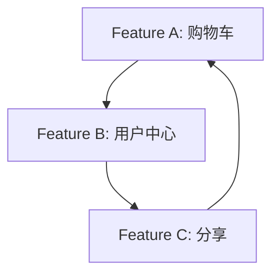
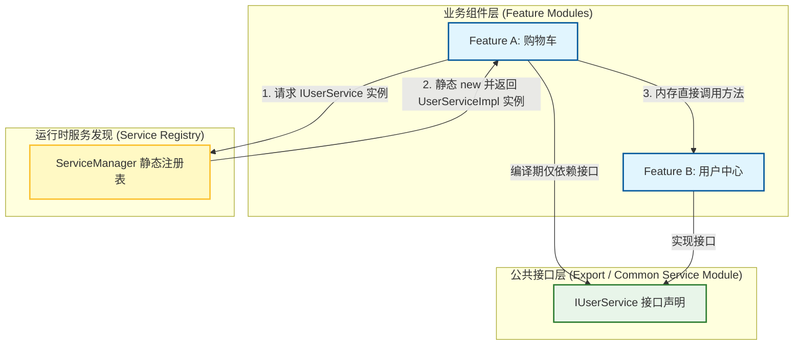
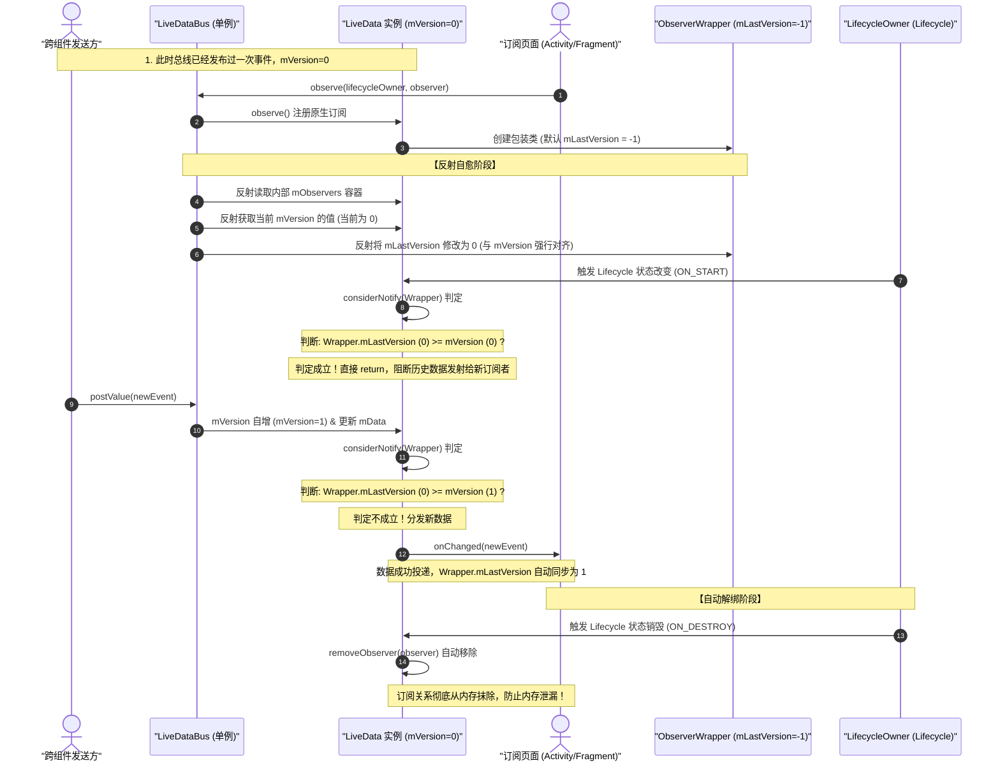
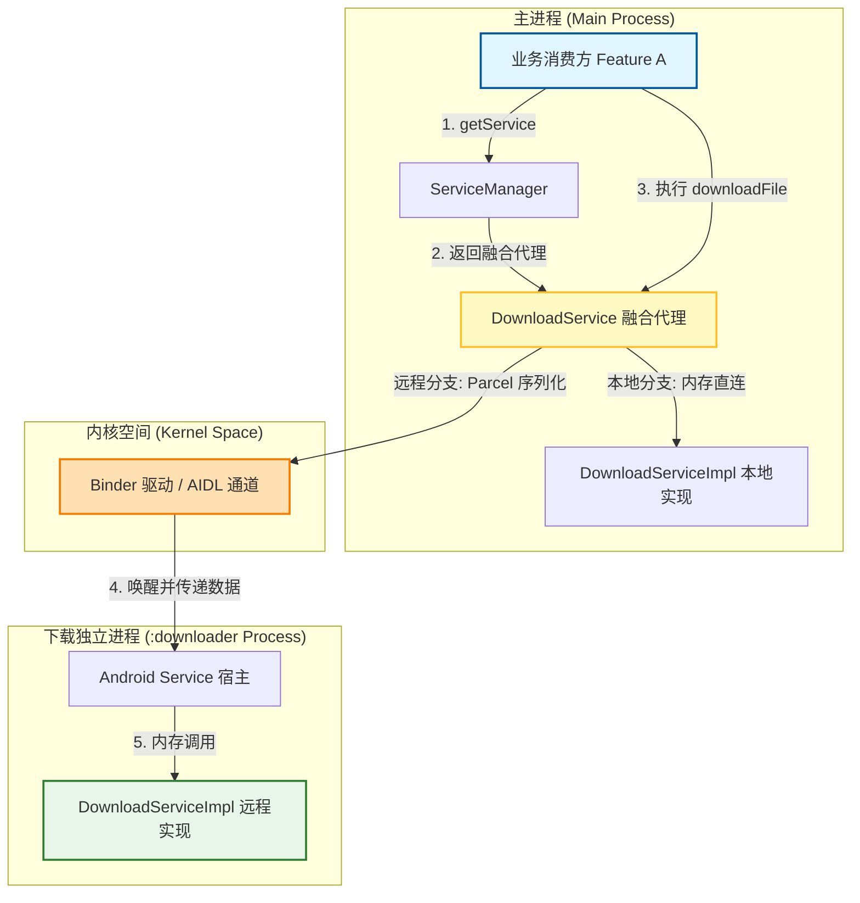

# 5.3.6.2 跨组件通信

在大型 Android 客户端项目的演进过程中，单体架构（Monolithic Architecture）由于编译耗时爆炸、代码耦合严重、多团队协作冲突等痛点，必然会走向**组件化架构（Componentization Architecture）**。然而，组件化的核心前提是物理隔离——通过 Gradle 模块划分，使得各个业务模块（Feature Modules）在编译期互不可见。这就带来了一个无法回避的底层命题：**在完全物理隔离的组件化模块划分中，各个 Module 互不可见，如何安全、高效、高性能地进行业务调用、数据同步与多端联调？**

本文将从组件化通信的本质出发，深度解密“依赖反转与接口下沉范式”、“编译期 KSP/APT + ASM 字节码插桩的静态 SPI 闭环”、“响应式跨组件通信 LiveDataBus 的防粘性自愈源码”，以及“跨越物理进程边界的本地 SPI 与 Binder 融合 IPC 桥接机制”，为你完整呈现 Android 跨组件通信的底层全景与工业级演进路径。

---

## 一、 组件化架构解耦命题与通信本质

### 1.1 组件化的演进与物理隔离的必然性
在传统的单体架构中，所有业务逻辑都堆叠在单个 `app` 模块中。开发者可以任意 import 任意类，这种极高的开发自由度伴随着极大的代价：代码结构逐渐退化为“意大利面条式”的网状耦合。任何一个小功能的修改都可能引发不可预测的线上崩溃；同时，数十万行代码在同一个模块中，导致每次增量编译都面临极其漫长的等待。

为了解决这一系列问题，组件化架构应运而生。其核心思想是将整个 App 拆分为：
*   **壳工程 (App Shell Module)**：仅负责配置、打包和主 Application 的初始化，本身不承载核心业务。
*   **业务组件 (Feature Modules)**：按业务维度划分的独立模块，例如“用户中心”、“商城”、“购物车”、“支付”等。
*   **基础公共库 (Common Module / Base SDK)**：提供底层网络库、图片加载、工具类以及公共 UI 基础组件。

在 Gradle 中，为了确保组件间的绝对解耦，业务组件之间是**完全禁止单向或双向依赖**的。也就是说，`feature_cart` 模块在 build.gradle 中绝对不能声明 `implementation project(':feature_user')`。兄弟模块在物理上是完全隔离的，这在编译期筑起了一道物理墙：
*   `feature_cart` 的代码中，根本无法 import `feature_user` 中的任何类。
*   如果强行直接引用，将直接引发 Java/Kotlin 编译期错误（Unresolved reference）。

### 1.2 物理隔离下的三大核心痛点
虽然物理隔离解决了代码耦合与团队协作冲突，但它也直接斩断了正常的程序控制流与数据流。在实际业务中，我们必然会遇到以下三大通信痛点：

1.  **业务强调用与服务获取 (Service Invoke)**：
    “购物车组件”在用户点击结算时，必须判断当前用户是否登录。如果已登录，需要获取当前用户的 Token、User ID 等信息；如果未登录，需要拉起“登录页面”。在物理墙的阻隔下，“购物车”如何获取“用户中心”提供的服务和数据？
2.  **反应式数据同步 (Reactive Data Sync)**：
    当用户在“用户中心”成功登录或退出登录后，“商城首页”、“购物车”、“我的钱包”等多个互不可见的业务模块需要立刻感知这一状态变化，同步刷新各自的内存数据、清除本地缓存并重构 UI。如何设计一种低耦合的跨组件事件广播机制？
3.  **多端联调与动态拆装 (Dynamic Assembly & Independent Run)**：
    为了提高编译运行效率，业务组件需要支持“单模块独立运行”（通过在 `build.gradle` 中切换 `com.android.application` 与 `com.android.library` 插件）。同时，在一些包体积敏感的场景中，某些次要业务模块需要支持动态下载与按需加载（如 Google Play Dynamic Delivery）。当这些模块在编译期不参与构建，或在运行期尚未下载时，主工程及其他模块如何平滑退化，不至于发生 `ClassNotFoundException` 或空指针崩溃？

### 1.3 跨组件通信的本质
跨组件通信（Cross-Component Communication）的本质是：**在遵循“最小知道原则”的前提下，控制流（Control Flow）和数据流（Data Flow）在物理隔离模块间的安全重构与传递**。

从通信模式的维度，我们可以将跨组件通信分为以下三种类型：
*   **控制流的传递 (命令式调用)**：由调用方发起，要求服务方立即执行某项操作并返回结果。这是一种典型的“1对1”同步/异步服务请求（Request-Response）。
*   **数据流的同步 (反应式通知)**：由数据源发起，通过事件发布-订阅模式（Publish-Subscribe），将数据状态的变更向多个不确定的订阅方进行异步广播（1对N）。
*   **进程物理墙的突破 (跨进程通信)**：当某些组件（如后台保活 Service、小程序物理沙盒进程）运行在不同的 OS 进程中时，通信的物理介质从 JVM 堆内存直接退化为操作系统内核态 of the Binder driver.

从架构设计原则来看，跨组件通信本质上是在进行**控制流的反转（Inversion of Control, IoC）**。在单体应用中，控制流是由调用者直接 new 出来并调用的；而在组件化架构中，控制流的建立需要依赖容器在运行期动态地将实现注入到调用者中，从而确保两端在编译期的绝对纯净。

此外，组件化还带来了“多渠道打包（Product Flavors）”和“业务模块按需装配”的底层构建逻辑。例如，针对轻量版 App，我们可以通过 Gradle 的 dependencies 动态过滤某些 Module（如剔除“直播”模块）。在编译期由于没有“直播”模块，主工程不会发生类找不到的问题，而在运行期，通过服务发现机制，框架会自动降级并安全地返回空服务，从而实现了业务的平滑退化。

---

## 二、 依赖反转与接口下沉（Interface Downward）范式

### 2.1 传统直接依赖的“罪恶”与编译地狱
在组件化改造的初期，开发团队极易陷入“伪组件化”的泥潭。如果允许模块之间进行直接依赖，哪怕只是单向依赖，也会带来灾难性的后果。

假设 Feature A（购物车）直接依赖了 Feature B（用户中心）：

```
[Feature A (Cart)]  ───(compile-time import)───>  [Feature B (User)]
```

随着业务的蔓延，Feature B 发现需要调用 Feature C（分享）的某个接口，而 Feature C 在结算时又反向需要 Feature A（购物车）的数据。在缺乏架构约束的情况下，极易形成如下的环状依赖链：



当这种环状依赖（Circular Dependency）形成时，Gradle 编译系统将直接抛出构建失败异常。更严重的是，即使没有形成绝对的环状依赖，强编译期依赖也会导致**编译期地狱**：
1.  **编译传递开销 (AAPT2 & Compiler Overhead)**：由于 Feature A 强依赖 Feature B 的具体实现类，一旦 Feature B 中的任何一行代码发生修改，编译器在增量构建时，必须重新对 Feature B、Feature A 以及所有依赖了 A 的上游模块进行语法分析、APT/KSP 重新扫描、R 文件重新生成、D8 脱糖以及 DEX 打包。这会导致增量编译时间退化为全量编译，严重拖慢研发效率。
2.  **物理插拔性丧失**：如果 Feature A 中写满了对 `import com.example.user.UserServiceImpl` 这种具体实现类的直接引用，那么当我们需要把 Feature B 剔除（例如在单模块打包调试，或者针对不同渠道进行定制化裁剪时），编译器会因为找不到 `UserServiceImpl` 类而爆出成百上千个编译报错。这使得“组件可插拔”成为空想。
3.  **虚拟机类加载与联排优化限制**：循环依赖还会导致类加载顺序的混乱。Android ART 虚拟机在执行 dex 优化（如 AOT 编译）时，需要分析类之间的依赖关系进行类联排优化（Class Layout Optimization）。网状循环依赖会打碎虚拟机的依赖推导链，使得类加载时的页面缺页中断（Page Fault）频率升高，应用启动速度变慢。

### 2.2 接口下沉（Interface Downward）解耦大法与防污染原则
为了彻底斩断模块间的强编译期依赖，我们必须引入软件工程中的圣经——**依赖倒置原则（Dependency Inversion Principle, DIP）**。

In Android componentization architecture, this principle is manifested as the **Interface Downward pattern**. The implementation steps are as follows:

1.  **定义下沉接口 (Export SDK Module)**：
    我们将 Feature B（用户中心）需要对外暴露的所有服务、方法，抽象为一系列 Java/Kotlin 接口（例如 `IUserService`）。同时，将这些服务所携带的参数与返回值，抽象为纯粹的 DTO（Data Transfer Object，如 `UserInfoDTO`）。我们将这些接口和 DTO 放入一个极其轻量级的子模块 `export_user`（或统一放入底层的 `common_service` 中）。
2.  **实现与接口物理隔离**：
    `export_user` 模块中**只包含接口声明和数据结构，绝不包含任何具体的业务逻辑实现**。
    *   Feature B 依赖 `export_user`，并在其内部实现该接口：`class UserServiceImpl : IUserService { ... }`。
    *   Feature A 同样依赖 `export_user`。在 Feature A 中，只需要 `import com.example.export.user.IUserService` 即可。

此时，Feature A 与 Feature B 在物理依赖层面上已经完全断开了直接联系，它们共同依赖于中间的 `export_user` 模块。

我们通过 Mermaid 拓扑图来可视化这种经典的**接口下沉与依赖倒置设计**：



#### 2.2.3 核心架构设计的“防污染”原则
在工业界落地接口下沉时，许多团队会将路由常量、三方 SDK 逻辑甚至复杂的工具类塞入 Export 模块。这会导致其迅速变臃肿，即所谓的“Export 污染”。

我们必须确立如下**防污染铁律**：
*   **物理纯净原则**：Export 模块仅允许引入基础平台层库（如 JDK 核心库、基础 Android 架构组件），绝对禁止依赖任何具体业务模块或其他三方中间件。
*   **接口/DTO 专属原则**：Export 模块只存放 `interface` 声明和结构极简、易于序列化的 DTO 类。严禁在此处堆积任何含算法行为的方法、全局静态状态或需要与系统绑定的 Service 类。
*   **物理独立性**：一个业务模块对应唯一的 Export 模块，通常以 `:feature:user:export` 这样的树形结构命名，由对应的 Feature 开发团队单线维护。

#### 2.2.4 编译期异常兜底：静态插桩的反射自愈设计
In incremental builds, ASM bytecode manipulation might occasionally fail. If the compiled `ServiceManager.init()` method is not successfully injected, the application will crash during initialization.

为了提高架构的生存率，我们在 `ServiceManager.getService` 中必须加入**静态插桩反射自愈兜底机制**：
当 `services` 容器中找不到对应的实现类生成器时，系统不会抛出异常，而是自动触发反射降级搜索。它会尝试去加载 `com.example.generated.[FeatureName]Service$$Autoload` 类，如果反射找到了该辅助类，则现场执行其 `register` 方法，并存入 Map 容器，以此对增量编译漏洞进行无缝自愈。这既保障了线上运行的高可用，又免除了本地开发频繁 clean 编译的困扰。

---

### 2.3 SPI（Service Provider Interface）运行时服务发现机制

在实现了接口与具体实现的物理分离后，我们立刻面临一个运行时问题：**当 Feature A 调用 `IUserService.getUserInfo()` 时，如何获取物理隔离在 Feature B 模块中的 `UserServiceImpl` 实例？**

在物理上，既然 Feature A 无法直接 `new UserServiceImpl()`，我们就必须借助服务发现机制。

#### 2.3.1 Java ServiceLoader 的原理与冷启动性能瓶颈
Java 原生提供了一套 SPI 机制——`java.util.ServiceLoader`。它的工作流程如下：
1.  在提供服务的模块（Feature B）的 `resources/META-INF/services/` 目录下，创建一个以接口全限定名命名的文本文件。
2.  在该文件内部写入实现类的全限定名，例如 `com.example.user.UserServiceImpl`。
3.  在调用方模块（Feature A）中，通过以下方式加载：
    ```kotlin
    val loader = ServiceLoader.load(IUserService::class.java)
    val userService = loader.firstOrNull()
    ```

虽然 `ServiceLoader` 是 JDK 自带的标准机制，但在 Android 环境下，它存在**致命的冷启动性能痛点**：

1.  **磁盘 I/O 带来的冷启动卡顿**：
    `ServiceLoader` 在加载时，其底层会调用 `ClassLoader.getResources()` 扫描 Classpath 下所有的 JAR 包和 APK 资产目录，读取 `META-INF/services/` 目录下的文本文件。在双亲委派模型下，每一次 `getResources` 调用都是一次系统调用与 ClassLoader 级 Zip 文件遍历。随着 App 引入的三方库和模块增多，这种磁盘 I/O 扫描是同步阻塞的，会导致主线程发生严重的卡顿。
2.  **反射初始化的 CPU 与内存双重开销**：
    在读取到文本中的实现类类名后，`ServiceLoader` 内部通过 `Class.forName(name, true, classLoader).newInstance()` 进行动态类加载与反射实例化。在 Android ART 虚拟机中，频繁的反射不仅无法利用 AOT/JIT 编译期的代码优化（如方法内联等），而且会产生大量的临时内存垃圾，频繁触发虚拟机 GC。
3.  **无法实现精细的懒加载**：
    `ServiceLoader` 默认的加载方式通常是全量加载。它一旦被调用，就会实例化该接口下配置的所有实现类，而无法做到按需加载（Lazy Load）。

#### 2.3.2 现代静态注入方案的演进：KSP/APT + ASM 物理闭环
为了追求零反射、零 I/O、O(1) 级超高性能的跨组件服务获取，现代 Android 架构演化出了一套**“编译期 KSP 扫描收集 + ASM 字节码插桩”**的静态注入方案。其核心逻辑是将所有运行时反射和 I/O 开销，提前到**编译期**完成，让运行时的服务发现退化为极其纯粹的“静态 Map 查找与直接 new 实例化”。

这套静态闭环的完整链路如下：

##### 第一阶段：KSP 编译期扫描与辅助类生成
我们使用 Kotlin 符号处理器（KSP）在各个模块编译时进行注解扫描。
1.  定义一个注解 `@ServiceProvider`，用于标记接口的实现类：
    ```kotlin
    @Target(AnnotationTarget.CLASS)
    @Retention(AnnotationRetention.BINARY)
    annotation class ServiceProvider(val service: KClass<*>)
    ```
2.  在 Feature B 的实现类上打上注解：
    ```kotlin
    @ServiceProvider(service = IUserService::class)
    class UserServiceImpl : IUserService {
        override fun getUserInfo(): UserInfoDTO = ...
    }
    ```
3.  当 Gradle 执行编译时，我们自定义 KSP 处理器会拦截该注解。它会继承 KSP 的 `SymbolProcessor`，在编译期校验 `UserServiceImpl` 是否真的实现了 `IUserService`。如果通过校验，它会在该模块的 `build/generated/ksp/` 目录下，自动生成一个静态注册辅助类（例如 `FeatureBService$$Autoload`）：
    ```kotlin
    // 自动生成的类，保留在 Feature B 模块的编译产物中
    package com.example.generated
    
    class FeatureBService$$Autoload {
        companion object {
            fun register(registry: MutableMap<Class<*>, () -> Any>) {
                // 利用 Lambda 延迟初始化，实现真正的懒加载，避免冷启动时一次性实例化
                registry[com.example.export.user.IUserService::class.java] = { com.example.user.UserServiceImpl() }
            }
        }
    }
    ```

##### 第二阶段：Gradle Plugin 与 ASM 字节码插桩
在各个 Feature 模块独立编译完成后，所有的 `$$Autoload` 类都呈散落状态。主工程在打包（Packaging）阶段，需要将这些类收集起来。为了避免在运行时通过 Class 反射寻找这些散落的 `$$Autoload` 类，我们引入 **ASM 字节码插桩**。

1.  定义一个运行时的全局静态单例注册中心 `ServiceManager`：
    ```kotlin
    object ServiceManager {
        private val services = HashMap<Class<*>, () -> Any>()
        private val cache = HashMap<Class<*>, Any>()

        // 供 ASM 插桩的目标入口方法
        @JvmStatic
        fun init() {
            // 此处留空！源码中没有任何代码。
            // 编译期，Gradle 插件会使用 ASM 往这个方法内强行写入静态注册代码。
        }

        @JvmStatic
        fun register(clazz: Class<*>, creator: () -> Any) {
            services[clazz] = creator
        }

        @Suppress("UNCHECKED_CAST")
        @JvmStatic
        fun <T> getService(serviceClass: Class<T>): T? {
            val cached = cache[serviceClass]
            if (cached != null) return cached as T
            
            val creator = services[serviceClass] ?: return null
            synchronized(this) {
                val doubleCheck = cache[serviceClass]
                if (doubleCheck != null) return doubleCheck as T
                val instance = creator.invoke()
                cache[serviceClass] = instance
                return instance as T
            }
        }
    }
    ```
2.  编写自定义 Gradle 插件，注册一个 ASM `AsmClassVisitorFactory`。在打包阶段（Transform/Artifacts API 阶段）扫描所有的 Class 文件。
3.  在扫描 Class 的过程中，如果遇到名字以 `$$Autoload` 结尾的类，说明这是 KSP 自动生成的注册类，我们将其全限定名记录到一个内存 List 中。
4.  当扫描到 `ServiceManager` 类时，使用 ASM 操纵其 `init()` 方法的字节码指令。我们在 `MethodVisitor.visitCode()` 回调（即方法体开始执行时）中，使用 `INVOKESTATIC` 字节码指令，依次调用 List 中记录的所有注册辅助类的 `register` 方法，并把 `ServiceManager.services` 容器传过去。
    
    修改后的 `ServiceManager.init()` 在最终编译生成的 DEX 中，其对应的等价 Java 源码如下：
    ```kotlin
    @JvmStatic
    fun init() {
        // 以下代码完全是由 ASM 插件在打包期直接写入 class 字节码的
        com.example.generated.FeatureBService$$Autoload.register(services);
        com.example.generated.FeatureAService$$Autoload.register(services);
        // ... 其他所有模块生成的 $$Autoload 注册类
    }
    ```

##### 第三阶段：性能评估
通过这套设计，当应用启动在 `Application.onCreate` 中执行 `ServiceManager.init()` 时：
*   **无 I/O 开销**：所有类名和调用关系都是硬编码写入字节码的，不需要进行任何文件系统检索。
*   **无反射开销**：在注册时，Map 中写入的是 Lambda 表达式 `{ UserServiceImpl() }`。当调用 `getService(IUserService::class.java)` 时，才会触发 Lambda，通过 `new UserServiceImpl()` 进行直接实例化。
*   **安全与极致性能的完美闭环**：查找时间复杂度为稳定的 O(1)，内存无额外抖动，冷启动期间开销降至微秒级。

---

## 三、 响应式跨组件通信：基于组件化事件与 LiveDataBus 架构

命令式调用解决了“1对1”的服务获取问题，但对于跨组件的“1对N”事件广播（如登录状态同步、主题切换、推送消息下发），我们必须引入反应式（Reactive）通信机制。

### 3.1 事件总线的失控痛点
在传统的 Android 开发中，`EventBus`（greenrobot）或基于 RxJava 封装的 `RxBus` 是最常用的事件总线工具。然而，随着项目规模的扩大以及组件化的深入，这种全局无差别的事件发布-订阅模式展现出了极具毁灭性的管理痛点：

1.  **事件类的无序泛滥 (Event Class Explosion)**：
    由于 `EventBus` 依赖于具体的类对象作为事件的契约（例如 `post(LoginEvent())`），在组件化环境下，为了让不同模块都能够订阅，所有的事件类都必须被定义在底层的公共模块（如 Common Module）。久而久之，公共模块中充斥着成百上千个空壳事件类，文件命名杂乱无章，开发人员根本无法看清整个工程里到底存在多少种事件类型。
2.  **调用链追踪地狱 (Calling Trace Hell)**：
    `EventBus` 的发布和订阅是通过运行时反射（或编译期生成的 Index）进行隐式匹配的。当我们在 Feature A 中执行 `EventBus.getDefault().post(event)` 时，编译器并不知道谁会接收它。如果我们想要在 Android Studio 中跟踪该事件的流向，普通的 `Command + Click` 只能跳到事件类的定义处，而无法跳到订阅处。我们只能通过繁琐的全局文本搜索 `@Subscribe`，在数十个模块中人肉筛选调用链，排查 Bug 的成本极高。
3.  **弱生命周期绑定与内存泄漏 (Memory Leaks)**：
    `EventBus` 要求订阅者在生命周期开始时手动调用 `register()`，并在销毁处手动调用 `unregister()`。在实际高强度开发中，由于页面跳转复杂、生命周期流转嵌套（例如 Fragment 延迟初始化、ViewPager 预加载），极易遗漏 `unregister()`，或者因为发生了异步延迟回调导致 `unregister()` 失败。这会导致订阅者实例被全局静态的 `EventBus` 强引用，从而造成毁灭性的 `Context` 内存泄漏。

### 3.2 LiveDataBus 的自愈设计与生命周期闭环

为了解决上述痛点，我们可以基于 Android 官方提供的 Jetpack 组件——`LiveData` 封装一套专为组件化设计的事件总线（即 **LiveDataBus**）。

`LiveData` 本身是具备**生命周期感知能力（Lifecycle-Aware）**的数据持有者类。这使得 LiveDataBus 天生具备了“自愈”的架构特质：

1.  **零代码侵入的自愈解绑**：
    在订阅 LiveData 消息时，我们传入 `LifecycleOwner`（即 Activity 或 Fragment）：
    ```kotlin
    liveData.observe(lifecycleOwner, Observer { data -> ... })
    ```
    在 `LiveData` 内部，这一订阅关系会被封装进 `LifecycleBoundObserver`。该类实现了 `LifecycleEventObserver` 接口：
    ```java
    // LiveData 源码片段
    class LifecycleBoundObserver extends ObserverWrapper implements LifecycleEventObserver {
        @Override
        public void onStateChanged(@NonNull LifecycleOwner source, @NonNull Lifecycle.Event event) {
            Lifecycle.State currentState = mOwner.getLifecycle().getCurrentState();
            if (currentState == Lifecycle.State.DESTROYED) {
                // 当监听到 Activity/Fragment 走向 DESTROYED 状态时，自动移除订阅者，自愈解绑！
                removeObserver(mObserver);
                return;
            }
            ...
        }
    }
    ```
    有了这个底层契约，开发者**不需要再写任何注销订阅的代码**。一旦页面销毁，Lifecycle 框架会自动触发回调，将订阅者从全局总线中彻底清除，从而在物理上消除了由于遗忘解绑导致的内存泄漏。
2.  **线程安全的自愈投递**：
    `LiveData` 提供了 `setValue()`（必须在主线程调用）和 `postValue()`（可在任意子线程调用）。`postValue()` 内部通过一个静态的 `ArchTaskExecutor` 将数据投递逻辑派发到主线程的 Handler 中。因此，跨组件的数据发送方可以完全不用理会当前处于何种并发线程中，LiveDataBus 会自动确保订阅者的 `onChanged` 回调安全地执行在 UI 线程上。

---

### 3.3 防粘性事件（Non-sticky）反射自愈源码剖析

虽然 LiveData 优势明显，但如果直接将其作为全局事件总线使用，会遇到一个极其棘手且隐蔽的 Bug——**粘性事件（Sticky Event）重放问题**。

#### 3.3.1 粘性事件的Bug表现与成因
`LiveData` 的默认设计是“粘性的”。控制流是先发送数据，后订阅。当新订阅者注册的一瞬间，会立刻接收到最后一次发送的历史数据。

在有些场景下（例如全局配置同步），粘性是需要的；但在大多数单纯的“事件通知”场景下，粘性特性是灾难性的。
> **典型 Bug 场景**：
> 1. 用户在 Feature A 中点击了“退出登录”，LiveDataBus 发送了 `ExitLoginEvent`。
> 2. 页面跳转回登录页，随后系统内存不足，LoginActivity 被系统回收后重建（Activity Recreation）。
> 3. 重建后，LoginActivity 的 `onCreate` 重新执行，并重新向 LiveDataBus 订阅了 `ExitLoginEvent`。
> 4. 此时，由于 LiveData 内部保留了上一次的 `ExitLoginEvent` 实例，它会立刻重放给 LoginActivity。
> 5. 结果：LoginActivity 在刚刚打开、用户尚未操作的情况下，莫名其妙地再次触发了“退出登录，清除本地缓存，弹窗提示”的逻辑，造成逻辑的循环与混乱。

#### 3.3.2 深度剖析 LiveData 的数据分发源码
要阻断历史数据的重放，我们必须明确 LiveData 是如何决定是否向一个订阅者分发数据的。我们来看一下 `LiveData.java` 内部的 `considerNotify` 方法：

```java
// LiveData.java 核心源码片段
private void considerNotify(ObserverWrapper observer) {
    if (!observer.shouldBeActive()) {
        return;
    }
    // 检查订阅者是否绑定了 LifecycleOwner 且状态处于活跃状态
    if (!observer.isAttachedTo(mOwner)) {
        return;
    }
    
    // 【最核心判定逻辑】
    // observer.mLastVersion 表示当前订阅者上一次接收到数据时的版本号。
    // mVersion 表示当前 LiveData 持有的最新数据的版本号。每次调用 setValue 都会使 mVersion++。
    if (observer.mLastVersion >= mVersion) {
        // 如果订阅者持有的版本号已经大于或等于 LiveData 最新的版本号，说明该订阅者已经消费过最新数据了，直接 return，不进行分发！
        return;
    }
    
    // 否则，将订阅者的版本号对齐到最新版本号，并执行 onChanged 回调分发数据
    observer.mLastVersion = mVersion;
    observer.mObserver.onChanged((T) mData);
}
```

现在，我们来复盘为什么新订阅者会收到历史的“粘性”数据：
1.  当我们创建 LiveData 时，其初始 `mVersion` 的值被赋予了 `START_VERSION`（即 `-1`）。
2.  每次调用 `setValue()`，`mVersion` 都会自增。假设此时我们已经发送过一次事件，`mVersion` 变为了 `0`。
3.  此时，一个全新的订阅者（Observer）调用 `observe()` 进行了订阅。
4.  在 `observe()` 内部，LiveData 会将我们的 Observer 包装成一个 `LifecycleBoundObserver`（继承自 `ObserverWrapper`）。
5.  在 `ObserverWrapper` 的构造方法中，`mLastVersion` 的初始值被赋为了 `-1`。
    ```java
    // ObserverWrapper 构造方法
    ObserverWrapper(Observer<? super T> observer) {
        mObserver = observer;
        mLastVersion = START_VERSION; // START_VERSION 值为 -1
    }
    ```
6.  订阅完成后，随着 Lifecycle 变为 `STARTED` 状态，系统会触发 `activeStateChanged`，进而调用 `considerNotify`。
7.  此时在 `considerNotify` 中：
    *   `observer.mLastVersion` 值为 `-1`。
    *   `mVersion` 值为 `0`。
    *   比对判定：`if (-1 >= 0)` 不成立！
8.  因此，代码继续往下执行，将 `observer.mLastVersion` 改写为 `0`，并立即执行了 `onChanged`。新订阅者就这样被迫接收到了历史数据。

#### 3.3.3 反射自愈方案的设计与物理闭环
为了消除粘性事件，我们需要在**订阅发生的瞬间，强行将新建订阅者 `ObserverWrapper` 中的 `mLastVersion` 修改为 LiveData 当前的 `mVersion`**。

当 `observer.mLastVersion` 被强行改为 `mVersion`（例如都改为 `0`）后，`considerNotify` 执行比对：
*   比对判定：`if (0 >= 0)` 成立！直接 `return`。
*   这样，历史数据就被安全地拦截下来，只有当此后再次调用 `setValue()` 使 `mVersion` 变为 `1` 时，判定才会失效，从而实现非粘性（Non-sticky）消息的投递。

由于 LiveData 内部的 `mObservers` 容器以及 `ObserverWrapper` 的版本号字段都是 `private` 甚至包级私有的，我们必须通过反射来实现这一修改。

我们绘制一个时序图，直观展现反射前后版本号的变化与 `onDestroy` 自愈解绑的完整流转过程：



#### 3.3.4 高频数据丢失 (Data Loss) 痛点与自愈方案
在实际开发中，如果将 LiveDataBus 用于传输高频数据（如秒级下载进度、高频传感器数据），会遇到一个致命痛点：**高频调用 `postValue` 会导致事件丢失（Data Loss）**。

这是因为 LiveData 的 `postValue` 内部实现如下：
```java
// LiveData 源码片段
protected void postValue(T value) {
    boolean postTask;
    synchronized (mDataLock) {
        postTask = mPendingData == NOT_SET;
        mPendingData = value; // 仅更新临时变量
    }
    if (!postTask) {
        return; // 如果上一个主线程的任务还没执行完，本次不再发送 Runnable！
    }
    ArchTaskExecutor.getInstance().postToMainThread(mPostValueRunnable);
}
```
这意味着，在主线程的消息队列尚未处理 `mPostValueRunnable` 之前，多次在子线程调用 `postValue` 只会不断覆盖 `mPendingData` 的值，最终主线程只会收到最后一次的值，中间的值全部丢失了。

**解决方案**：如果业务组件通信需要强顺序、不丢失的高频消息流，LiveDataBus 不适合，应该使用 Kotlin 的 `SharedFlow` 或封装一个内部带队列的 LiveData 消息缓冲机制。

#### 3.3.5 隔离作用域的命名空间（Namespace）与 Scope 控制
在大型组件化项目中，如果所有事件都通过全局的单例 `LiveDataBus` 进行收发，可能会引发事件名冲突或消息被意外拦截的情况。

因此，我们需要建立**作用域隔离体系**：
*   **Global Scope（全局作用域）**：通过全局单例 `LiveDataBus` 收发消息，例如登录退出通知。
*   **Activity Scope（页面作用域）**：将 LiveData 托管在特定 Activity 关联的 ViewModel 中，仅在该 Activity 及其嵌套的所有 Fragment 之间流转，物理隔离其他页面。
*   **Module Scope（模块作用域）**：在各个模块内部单独实例化私有的 LiveData 容器，仅供本组件内部逻辑解耦使用，避免泄露至其他组件。

#### 3.3.6 工业级 LiveDataBus 核心 Kotlin 源码实现

以下是支持非粘性/粘性事件、具备完整反射对齐逻辑及线程安全保证的工业级 LiveDataBus 实现：

```kotlin
package com.example.common.bus

import android.os.Handler
import android.os.Looper
import androidx.lifecycle.LifecycleOwner
import androidx.lifecycle.LiveData
import androidx.lifecycle.MutableLiveData
import androidx.lifecycle.Observer
import java.util.concurrent.ConcurrentHashMap

/**
 * 工业级响应式跨组件通信总线 - LiveDataBus
 * 
 * 特性：
 * 1. 天然 Lifecycle 绑定，Activity/Fragment 销毁时自动解绑，防止内存泄漏。
 * 2. 线程自愈：支持任意线程发送事件，消费方自动运行在主线程。
 * 3. 完美防粘性：通过反射对齐 mLastVersion 与 mVersion，支持“非粘性(默认)”与“粘性”双重订阅模式。
 * 4. 强类型安全：基于泛型包装，避免强转异常。
 */
object LiveDataBus {

    // 存储所有通道的容器，采用 ConcurrentHashMap 保证跨组件并发安全
    private val busMap = ConcurrentHashMap<String, LiveBusCore<Any>>()

    /**
     * 获取指定通道的事件总线。如果通道不存在，则自动创建。
     * @param channelName 通道唯一标识，建议使用：“业务线_模块_事件名” 命名空间规范
     */
    @Suppress("UNCHECKED_CAST")
    fun <T> with(channelName: String): LiveBusCore<T> {
        return busMap.getOrPut(channelName) {
            LiveBusCore(channelName)
        } as LiveBusCore<T>
    }

    /**
     * 核心总线包装类
     */
    class LiveBusCore<T>(private val channelName: String) {
        
        // 真正承载数据的 MutableLiveData
        private val liveData = MutableLiveData<T>()

        /**
         * 发送事件（任意线程安全调用）
         */
        fun post(event: T) {
            if (Looper.myLooper() == Looper.getMainLooper()) {
                liveData.value = event
            } else {
                liveData.postValue(event)
            }
        }

        /**
         * 订阅事件（默认非粘性，自动感知生命周期自愈）
         */
        fun observe(owner: LifecycleOwner, observer: Observer<in T>) {
            observeInternal(owner, observer, isSticky = false)
        }

        /**
         * 订阅粘性事件（会接收历史最后一条数据，自动感知生命周期自愈）
         */
        fun observeSticky(owner: LifecycleOwner, observer: Observer<in T>) {
            observeInternal(owner, observer, isSticky = true)
        }

        /**
         * 永久订阅事件（需手动移除订阅，不受生命周期限制，默认非粘性）
         */
        fun observeForever(observer: Observer<in T>) {
            observeForeverInternal(observer, isSticky = false)
        }

        /**
         * 移除订阅者
         */
        fun removeObserver(observer: Observer<in T>) {
            liveData.removeObserver(observer as Observer<super T>)
        }

        /**
         * 内部订阅实现逻辑
         */
        private fun observeInternal(owner: LifecycleOwner, observer: Observer<in T>, isSticky: Boolean) {
            // 1. 调用 LiveData 的原生 observe 进行注册
            liveData.observe(owner, observer as Observer<super T>)
            
            // 2. 如果是非粘性事件，通过反射进行 mLastVersion 与 mVersion 的强制对齐
            if (!isSticky) {
                try {
                    hook(observer)
                } catch (e: Exception) {
                    e.printStackTrace()
                }
            }
        }

        private fun observeForeverInternal(observer: Observer<in T>, isSticky: Boolean) {
            liveData.observeForever(observer as Observer<super T>)
            if (!isSticky) {
                try {
                    hook(observer)
                } catch (e: Exception) {
                    e.printStackTrace()
                }
            }
        }

        /**
         * 【核心 Hook 逻辑】
         * 利用反射获取 LiveData 内部 ObserverWrapper 的 mLastVersion，并将其修改为当前 LiveData 的 mVersion
         */
        private fun hook(observer: Observer<in T>) {
            // 1. 获取 LiveData class
            val classLiveData = LiveData::class.java
            
            // 2. 反射获取其中的 private Map 容器: mObservers
            val fieldObservers = classLiveData.getDeclaredField("mObservers")
            fieldObservers.isAccessible = true
            
            // SafeIterableMap 的实例
            val mObservers = fieldObservers.get(liveData)
            val classObservers = mObservers.javaClass
            
            // 3. 调用 SafeIterableMap.get(Object) 方法获取 Entry
            val methodGet = classObservers.getDeclaredMethod("get", Any::class.java)
            methodGet.isAccessible = true
            
            // 获得 Map.Entry<Observer, ObserverWrapper>
            val entry = methodGet.invoke(mObservers, observer)
            
            var observerWrapper: Any? = null
            if (entry is Map.Entry<*, *>) {
                // Entry 的 Value 就是 ObserverWrapper
                observerWrapper = entry.value
            }
            
            if (observerWrapper == null) {
                throw NullPointerException("ObserverWrapper obtained via reflection is null!")
            }
            
            // 4. 获取 ObserverWrapper class (它是 LiveData 的内部抽象类)
            val classObserverWrapper = observerWrapper.javaClass.superclass 
                ?: throw IllegalStateException("Cannot find superclass of ObserverWrapper")
            
            // 5. 反射获取 private Field: mLastVersion
            val fieldLastVersion = classObserverWrapper.getDeclaredField("mLastVersion")
            fieldLastVersion.isAccessible = true
            
            // 6. 反射获取 LiveData class 里的 private Field: mVersion
            val fieldVersion = classLiveData.getDeclaredField("mVersion")
            fieldVersion.isAccessible = true
            val mVersion = fieldVersion.get(liveData)
            
            // 7. 将 ObserverWrapper 中的 mLastVersion 强行赋值为 LiveData 的 mVersion，实现完全对齐！
            fieldLastVersion.set(observerWrapper, mVersion)
        }
    }
}
```

---

## 四、 物理进程边界突破：跨组件 IPC 桥接机制

当我们的 App 从单进程演化为多进程架构（例如：主进程运行核心业务；保活守护进程独立运行后台推送服务；小程序/Web 模块物理运行在沙盒进程以防内存溢出崩溃时），以上所有的内存级 SPI（`ServiceManager`）和 LiveDataBus 都会**瞬间宣告失效**。

在多进程架构下，两个进程拥有各自完全独立的进程虚拟地址空间，任何 JVM 堆内存内的静态单例和对象引用都无法跨越这道由操作系统内核所维护的物理进程屏障。

### 4.1 物理跨进程通信的三个核心命题
当跨组件通信遇到进程物理墙时，我们必须解决三个核心底层命题：
1.  **物理通信介质与性能优化**：如何利用 Android 的核心 IPC 机制（Binder）建立底层的二进制双向通信通道。基于 Binder 物理传输通道，数据需要经过“一次内存拷贝”（因为内核空间与进程虚拟空间映射的关系）。关于 Binder 驱动在不同 Android 版本上的性能演进和安全限制，可参见根目录的 [AndroidVersionChangeLog.md](file:///Users/lizhiyang/Desktop/AndroidKnowledge/AndroidVersionChangeLog.md)。
2.  **数据传输大小限制**：由于 Binder 通信共享一个大小约为 1MB（实际为 1016KB）的进程缓冲区，如果在跨组件通信中传递过大的数据（如图片字节数组、超长列表数据），会立刻抛出 `TransactionTooLargeException`。在融合网关设计中，我们应当通过 `SharedMemory` 或者 `FileProvider` 进行大数据通道的重定位。
3.  **生命周期与高可用**：多进程环境下，子进程随时可能因为系统低内存被 OOM Killer 强行杀掉。如何在 Binder 物理连接断开时，让消费端实现“自愈式死亡重连与状态重建”？

### 4.2 本地 SPI 与 IPC Binder 融合方案

在企业级架构中，我们需要对业务开发人员**屏蔽进程细节**。业务层在调用服务时，不应当关心这个服务究竟是本地提供，还是由另一个进程提供的。这就是“**上层无感，底层路由**”的本地 SPI 与 IPC 融合架构。

#### 4.2.1 整体架构逻辑
1.  **SPI 接口定义**：依然使用接口下沉范式，声明一个服务接口（例如 `IDownloadService`），并注册在底层的组件总线上。
2.  **融合路由分发 (Hybrid Router)**：
    当消费方通过 `ServiceManager.getService(IDownloadService::class.java)` 请求服务时，框架返回的并不是具体的本地实现类，而是一个**“动态路由代理（HybridProxy）”**。
3.  **运行期动态判定**：
    在 `HybridProxy` 内部，当调用 `downloadFile(url)` 方法时：
    *   **本地进程分支**：检测到目标服务（DownloadService）被配置在当前进程中运行。直接使用本地 SPI 机制获取 `DownloadServiceImpl` 本地对象，进行直接的内存方法调用。
    *   **跨进程分支**：检测到服务运行在 `:downloader` 独立进程中。代理类自动检索底层维护 of the `BinderConnectionPool`，获取对应的 AIDL Binder 代理，通过 Binder 驱动将方法调用路由到 `:downloader` 进程中执行，并处理序列化与反序列化。

#### 4.2.2 融合架构的类图与调用链拓扑
这种本地与跨进程无缝整合的拓扑关系如下图所示：



### 4.3 死亡重联与系统自愈链路实现

跨进程通信中最致命的问题是**“远程服务突然死亡”**。在 Android 系统中，进程可能会因为内存泄漏、未捕获异常、用户手动清理或系统低内存而被突然杀掉。如果发生这种情况：
*   Client 端持有的 Binder 引用将变成“死僵尸”（Dead Object），后续所有跨进程调用都会直接抛出 `DeadObjectException`。
*   应用会发生不可预知的崩溃或功能失效。

为了实现系统的高可用自愈，我们必须在 Client 端的融合代理中注册 `IBinder.DeathRecipient` 死亡监视器，并在监视到死亡通知时，发起**自愈式重连机制**。同时，我们需要在 Client 内部维护一个**挂起重试队列（Pending Request Queue）**，当连接处于断开状态且正在自愈重建时，暂时将请求挂起挂载到 Latch 上，自愈完成之后重新投递，从而避免直接向用户暴露物理层面的进程 Crash 崩溃。

### 4.4 主线程同步阻塞大坑与异步代理自愈链路
在很多多进程方案中，开发者会像我们上面设计的那样，在 `getServiceProxy()` 内部使用 `connectLatch.await(5, TimeUnit.SECONDS)` 来强行同步阻塞等待连接成功。

然而，**如果在 Android 的 UI 主线程直接调用这个方法，将会引发灾难性的 ANR（主线程卡死 5 秒直接崩溃）**！因为 `bindService` 建立 Binder 通道是异步的，必须依赖主线程 Looper 派发 `onServiceConnected` 回调。如果在主线程用 Latch 锁死主线程，回调将永远无法执行，导致死锁，直到 5 秒超时甚至直接 ANR。

#### 4.4.1 异步自愈网关的设计思想
为了彻底避开这个大坑，融合网关必须采用**“异步代理自愈”**设计：
*   **禁止同步挂起主线程**：若在主线程检测到连接断开，不使用 Latch 强锁。而是利用 Kotlin 协程的 `suspendCancellableCoroutine` 挂起函数，将控制流交还给主线程，让主线程能够继续派发 UI 事件和 Service 回调。
*   **基于协程挂起与恢复的异步自愈**：利用协程将异步的 `ServiceConnection` 桥接为挂起调用，当连接建立完成后，在后台线程自动恢复（Resume）协程控制流，重发请求。这在物理上实现了主线程零卡顿、无锁阻塞的极致自愈交互。

以下是实现本地与跨进程 IPC 桥接，并包含 Binder 死亡自愈重建与协程异步挂起自愈的核心 Kotlin 架构代码：

```kotlin
package com.example.common.ipc

import android.content.ComponentName
import android.content.Context
import android.content.Intent
import android.content.ServiceConnection
import android.os.IBinder
import android.os.IInterface
import android.os.RemoteException
import kotlinx.coroutines.Dispatchers
import kotlinx.coroutines.suspendCancellableCoroutine
import kotlinx.coroutines.withContext
import java.util.concurrent.ConcurrentLinkedQueue
import kotlin.coroutines.resume
import kotlin.coroutines.resumeWithException

/**
 * 跨组件 IPC 融合服务发现与协程级异步自愈网关
 */
abstract class BaseIpcBridge<T : IInterface>(
    protected val context: Context,
    private val targetServiceAction: String,
    private val targetPackageName: String
) {

    // 存储因为正在断线自愈而暂时挂起的请求回调队列
    private val pendingContinuations = ConcurrentLinkedQueue<kotlin.coroutines.Continuation<T>>()

    @Volatile
    protected var remoteInterface: T? = null

    @Volatile
    private var isConnecting = false

    private val deathRecipient = object : IBinder.DeathRecipient {
        override fun binderDied() {
            handleBinderDied()
        }
    }

    private val serviceConnection = object : ServiceConnection {
        override fun onServiceConnected(name: ComponentName?, service: IBinder?) {
            if (service == null) return
            try {
                service.linkToDeath(deathRecipient, 0)
                val proxy = asInterface(service)
                remoteInterface = proxy
                
                // 物理连接建立完毕，立刻清空并恢复挂起队列中的所有请求！
                synchronized(pendingContinuations) {
                    while (!pendingContinuations.isEmpty()) {
                        pendingContinuations.poll()?.resume(proxy)
                    }
                }
            } catch (e: RemoteException) {
                synchronized(pendingContinuations) {
                    while (!pendingContinuations.isEmpty()) {
                        pendingContinuations.poll()?.resumeWithException(e)
                    }
                }
            } finally {
                isConnecting = false
            }
        }

        override fun onServiceDisconnected(name: ComponentName?) {
            remoteInterface = null
        }
    }

    protected abstract fun asInterface(binder: IBinder): T

    /**
     * 协程级非阻塞挂起方法 - 获取服务代理。
     * 该方法是挂起函数（suspend），即使 Binder 断线正在重连，也会将当前协程挂起，而绝不卡死 Android UI 主线程。
     */
    suspend fun getServiceProxyAsync(): T = withContext(Dispatchers.IO) {
        val currentInterface = remoteInterface
        if (currentInterface != null && currentInterface.asBinder().isBinderAlive) {
            return@withContext currentInterface
        }

        // 利用协程挂起机制，将异步绑定过程转换为顺序调用
        suspendCancellableCoroutine { continuation ->
            synchronized(this@BaseIpcBridge) {
                // 双重校验
                val doubleCheck = remoteInterface
                if (doubleCheck != null && doubleCheck.asBinder().isBinderAlive) {
                    continuation.resume(doubleCheck)
                    return@suspendCancellableCoroutine
                }

                // 加入挂起请求队列
                pendingContinuations.add(continuation)

                if (!isConnecting) {
                    isConnecting = true
                    bindRemoteService()
                }
            }

            // 支持协程取消时的自愈解绑
            continuation.invokeOnCancellation {
                pendingContinuations.remove(continuation)
            }
        }
    }

    private fun bindRemoteService() {
        val intent = Intent(targetServiceAction).apply {
            setPackage(targetPackageName)
        }
        val success = context.bindService(intent, serviceConnection, Context.BIND_AUTO_CREATE)
        if (!success) {
            isConnecting = false
            synchronized(pendingContinuations) {
                while (!pendingContinuations.isEmpty()) {
                    pendingContinuations.poll()?.resumeWithException(
                        RemoteException("Failed to bind service: $targetServiceAction")
                    )
                }
            }
        }
    }

    private fun handleBinderDied() {
        synchronized(this) {
            remoteInterface?.let {
                it.asBinder().unlinkToDeath(deathRecipient, 0)
                context.unbindService(serviceConnection)
            }
            remoteInterface = null
            isConnecting = false
            
            // 重新发起绑定与自动拉活
            bindRemoteService()
        }
    }
}
```

---

## 五、 常见工程误区与线上事故复盘（ProGuard 混淆与线程管理）

在落实跨组件通信体系时，如果忽略了底层虚拟机环境或编译优化参数，极易发生毁灭性的线上崩溃。以下对三个最具代表性的典型故障进行复盘：

### 5.1 事故一：ProGuard 混淆导致 LiveDataBus Hook 失败
在配置 Release 构建并开启混淆（minifyEnabled true）后，App 线上运行到需要观察消息时发生 Crash 崩溃，报错信息为：`java.lang.NoSuchFieldException: mVersion`。
*   **成因分析**：ProGuard 在混淆时，默认会将未被保留的 private/package-private 字段名及类名全部用短字母（如 `a`, `b`, `c`）重命名。这直接打断了 LiveDataBus 的 `hook` 逻辑中通过反射名称（`"mVersion"`, `"mLastVersion"`, `"mObservers"`）定位字段的链路，从而抛出反射字段缺失的错误。
*   **解决对策**：必须在 `proguard-rules.pro` 中对 LiveData 架构字段和 KSP 生成类进行硬保护。由于系统库类名无法通过 `@Keep` 注解直接保护，必须在 ProGuard 文件中写入如下规则：
    ```proguard
    # 保护 LiveData 及其内部细节不被混淆
    -keepclassmembers class androidx.lifecycle.LiveData {
        private int mVersion;
        private java.lang.Object mObservers;
    }
    -keepclassmembers class androidx.lifecycle.LiveData$ObserverWrapper {
        int mLastVersion;
    }
    # 保护 KSP 静态生成的 autoload 注册辅助类
    -keep class *$$Autoload {
        public static void register(...);
    }
    ```

### 5.2 事故二：后台线程反射绕过总线导致的 UI 线程安全崩溃
在一次后台数据同步任务中，开发人员误用了本地 API 直接修改数据，导致后台线程在执行 `setValue` 瞬间抛出崩溃：`java.lang.IllegalStateException: Cannot invoke setValue on a background thread`。
*   **成因分析**：LiveDataBus 内部对 `post(event)` 方法作了 `Looper` 判定，能在前台主线程直接 `setValue`，而在子线程自动降级为 `postValue`。但有些业务开发者会私自通过总线获取底层 LiveData 的持有对象，并在并发异步网络回调中错误地调用了原本只能运行在主线程的 `setValue` 方法。
*   **解决对策**：在设计 `LiveBusCore` 包装时，**绝不暴露原始 LiveData 对象给上层**。强制上层通过包装好的 `post` 方法投递消息，或在接口层直接返回 `LiveData` 的父类只读视图，阻断在业务端不规范反射修改的可能。

### 5.3 事故三：Binder 物理连接泄露与 ANR
多进程功能运行一段时间后，主进程发生了大量的 `Context Leak` 内存泄露，并在拉起下载子进程时偶发卡顿死锁，直至 ANR。
*   **成因分析**：多进程通信在业务结束后没有主动调用 `context.unbindService(serviceConnection)`。这会导致 Binder 通信的引用计数无法降至 0，进而导致 Android 系统的 `SystemServer` 进程一直持有主进程 Application/Activity 的 Context 强引用，从而造成内存泄露。同时，频繁的死亡重连如果没有加入最大重试次数限制（Max Retry Count），会在进程崩溃后进入无限死循环重连，挤爆 Binder 缓冲区线程池。
*   **解决对策**：
    1. 在 `BaseIpcBridge` 中设定最大自愈重试次数（例如连续自愈失败 3 次后，彻底挂起服务并降级为本地假实现）。
    2. 提供可手动调用的 `release()` 接口，在长生命周期对象销毁或页面退出时，显式释放 Binder 映射。

---

## 六、 方案权衡与架构选型指南

在构建组件化跨组件通信时，市面上存在多种方案。选择合适的方案需要权衡复杂性、性能以及业务场景：

| 维度 | APT/KSP+ASM 静态 SPI | 路由框架 (如 ARouter) | 响应式总线 (LiveDataBus) | 跨进程 IPC (AIDL + Bridge) |
| :--- | :--- | :--- | :--- | :--- |
| **主要定位** | 命令式服务调用、数据提供 | 页面路由、跳转拦截、服务发现 | 异步事件分发、状态同步 | 物理进程屏障突破、跨进程服务发现 |
| **首帧性能** | 极佳 (O(1) 级无反射直接 new) | 较好 (通常首帧会反射扫描路由表，存在几十毫秒耗时) | 极佳 (基于 LiveData 机制) | 较慢 (受跨进程 Binder 驱动性能限制，通常在毫秒级) |
| **开发友好度**| 高 (依靠接口/编译期强契约校验) | 中等 (路由 Path 是 String 硬编码，无编译期类型校验) | 中等 (需妥善管理 ChannelName，或定义公共常量防止冲突) | 较低 (需编写 AIDL 接口和 Parcelable 序列化逻辑) |
| **适用边界** | 基础组件服务暴露、核心业务接口调用 | 多页面导航跳转、Deeplink 统一网关、动态拦截器 | 跨模块状态广播 (如登录、配置更新、通知下发) | 多进程架构 (如推送、独立沙盒、Web/小程序物理进程) |

### 6.1 架构设计总结与工程实践指南

1.  **核心命令服务化**：
    对于业务组件之间的双向调用（如购物车拉取用户 Token、订单页获取收货地址等命令式场景），应当强推基于 **KSP 编译期生成注册表 + ASM 字节码插桩** 的静态 SPI 方案。该方案在物理上将接口下沉到了 Export SDK 模块中，又通过字节码插桩避免了运行时反射和冷启动 I/O性能损耗，并利用反射降级提供了编译期异常兜底，代表了组件化架构性能优化的极致追求。
2.  **解耦跳转路由化**：
    页面间的跳转并不属于严格的数据或服务交互，其核心诉求是降低页面类强引用和对 Activity.class 的依赖。因此，采用路由框架（ARouter/WMRouter 等）建立全局的路由 Path 表，配合路由拦截器处理登录校验、广告展示，是工业界的最佳解法。
3.  **广播通知反应式**：
    跨模块的状态变更通知（如登录状态清除、皮肤更新），应首选**支持反射防粘性自愈机制的 LiveDataBus**。它利用 Lifecycle 自动感知框架，在 Activity/Fragment 销毁时会无感清除订阅，确保不会有内存泄漏风险。但需注意，在后台高频数据传输中，需警惕 `postValue` 的数据吞没问题，应引入 Flow 等管道方案予以替代。
4.  **多进程交互透明化**：
    当部分业务需要以多进程沙盒隔离时，不要允许业务直接去 bindService。应当设计一套**“上层无感，底层路由”的 Hybrid SPI 网关**。利用 Kotlin 协程的 `suspendCancellableCoroutine` 实现异步非阻塞的自愈式连接，避开主线程锁死导致的 ANR 隐患，让业务开发者实现真正的高可用、健壮的跨组件多进程交互。

---

## 七、 架构前沿展望

> [!NOTE]
> 跨组件通信的演进并未止步。随着 Kotlin Multiplatform (KMP) 和声明式 UI（Jetpack Compose / SwiftUI）的普及，如何在多端共用同一套 KSP+ASM 编译注入机制，以及如何让组件化通信自适应 Compose 的状态重组（Recomposition）流，已成为下一代大前端架构演进的前沿命题。
> 
> 在实际工程实践中，开发团队在推进架构演进时应秉持“渐进式重构”的方针，先以本地静态 SPI 和 LiveDataBus 为基座稳步解耦，在面临物理进程隔离或极端性能瓶颈时，再适度引入多进程融合网关。用最小的工程复杂度换取最大化的可维护性与运行效率，才是应用架构设计的终极归宿。
