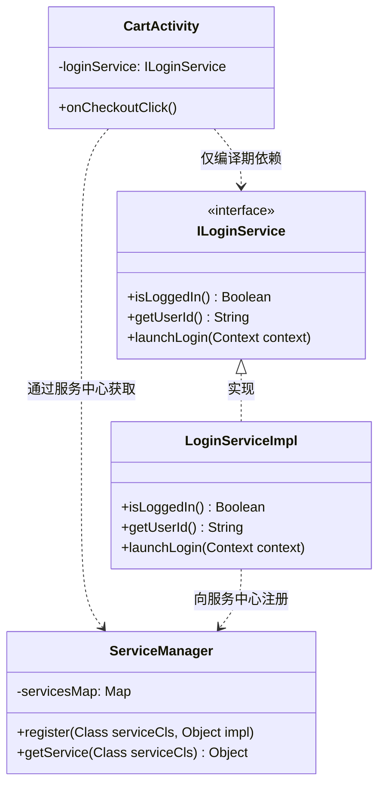

# 5.3.6.3 模块边界

在 Android 移动端架构演进的过程中，随着项目规模的扩大、开发团队的扩张，组件化与模块化几乎是不可避免的技术选择。然而，许多项目在引入多模块架构后，却并没有获得预期的构建速度提升和业务解耦效果，反而陷入了构建时间不断拉长、模块之间关系错综复杂、修改一处代码引发全身重编的泥潭。

其根本原因在于，**团队没有确立清晰、刚性的“模块物理边界”**。模块化不仅是逻辑上的代码分类或文件夹划分，更是通过构建系统（Build System）和语言特性所实施的**编译期物理隔离与硬性约束**。本文将从编译隔离红线、Gradle 依赖指令底层物理机制、依赖倒置原则（DIP）的拓扑重构、物理编译护栏（自定义 Gradle 依赖检测插件源码级实战）以及 Kotlin 语言特性的物理控制等维度，深度解密 Android 组件化架构中如何定义并捍卫模块边界。

---

## 1. 模块化工程的编译隔离红线

### 1.1 大泥球（Big Ball of Mud）架构的重现与退化物理模型

在大型多人协作的 Android 项目中，如果没有强力的物理隔离手段，系统架构会自发地向无序、混乱的“大泥球”（Big Ball of Mud）状态退化。

大泥球架构的本质特征是**缺少边界**。在实际开发中，当业务快速迭代、开发工期紧张时，开发人员往往会倾向于寻找“阻力最小的路径”来实现功能。在没有物理隔离约束的情况下，开发人员只需在 IDE 中敲击快捷键（如 Alt+Enter），即可自动 Import 其他任意模块的 Public 类。这种便捷性是一把双刃剑：它在短期内提高了编码速度，但在中长期却引入了大量的隐式横向依赖和反向引用。

例如，在未作物理边界限制的工程中，可能会出现如下的依赖链：
*   **横向越界引用**：`购物车模块 (Cart Module)` 为了展示促销标签，直接 Import 并调用了 `商品详情模块 (Detail Module)` 中的特定 UI 组件。
*   **反向/隐式依赖**：`商品详情模块 (Detail Module)` 为了处理加入购物车逻辑，又直接引用了 `购物车模块 (Cart Module)` 的数据结构与管理类。
*   **网状大泥球**：伴随着业务扩张，优惠券、用户中心、支付、分享等数十个模块之间形成了错综复杂的交叉网状引用。

这种没有物理约束的代码引用，将导致以下严重的**物理灾难**：

#### 1. 编译期循环依赖（Circular Dependencies）
当模块 A 依赖模块 B，而模块 B 又因为业务需要反向依赖模块 A 时，Gradle 在配置阶段会直接抛出 `Circular dependency` 错误并挂起编译。虽然可以通过提取公共类来临时规避，但在没有物理护栏的项目中，这种循环依赖链会以更加隐蔽的形式（如 A -> B -> C -> A）卷土重来，令构建维护者防不胜防。

#### 2. 增量编译雪崩（Build Cache & Incremental Compilation Melt-down）
Gradle 的核心优势在于支持任务的增量编译。Gradle 会为每个任务的输入（Inputs）和输出（Outputs）保存快照，当且仅当输入改变时才重新执行任务。
然而，在网状大泥球架构中，由于各个模块之间存在大量的隐式依赖和强耦合，底层或旁支模块（例如修改了 `Common` 模块的一个常量，或者在 `Detail` 模块修改了一个 Public 方法签名）的任何微小变更，都会导致其 ABI（Application Binary Interface）发生改变。由于依赖关系是网状发散的，这一变更会沿着依赖链向上层、旁路级联传导，导致大面积模块的编译快照失效。Gradle 必须强行对网络中几乎所有的模块进行重新编译。原本仅需 10 秒的增量编译，会瞬间退化为长达数十分钟的全量重新编译。

#### 3. 业务拆分与独立调试彻底失效
组件化的终极目的之一是让每个业务 Feature 模块能够“独立编译、独立运行、独立调试”，即作为单独的 Application 壳工程打包运行。这可以极大地节省单兵作战时的编译耗时。
但在大泥球架构下，由于 `Feature A` 强耦合了 `Feature B`、`Feature C` 等模块，想要将 `Feature A` 单独抽离出来打包时，会发现必须把整个项目的几十个模块全部引入，否则就会报大量的“找不到类（Symbol Not Found）”编译错误。此时，组件化所带来的“独立开发调试”优势名存实亡。

#### 4. 类冲突与多版本地狱（Dependency Hell）
各个子模块如果能够不受限制地声明第三方开源库或底层组件，会导致在最终的 App 壳模块进行 DEX 合并（Dexing）和打包（Package）时，出现由于类路径中存在同名不同包、或者同包同名但实现不同的类（Duplicate Classes），从而引发编译期 `Duplicate class found` 冲突，或者运行期报 `NoSuchMethodError` / `ClassNotFoundException` 导致 App 崩溃。

### 1.2 物理边界的哲学本质

架构设计中有一条黄金法则：**“不能依赖开发人员的自律来维持系统架构的整洁，而必须依赖构建系统和编译器的物理硬约束。”**

模块物理边界的本质，就是通过构建系统（如 Gradle）的依赖配置，切断不应该可见的代码访问路径，使得任何越界的代码引用在**编译期**就直接报错，将架构劣化的风险阻断在开发阶段。这就是“物理边界”对于大型 Android 组件化项目不可动摇的编译隔离红线。

---

## 2. Gradle 依赖指令底层解密与编译逃逸

在 Android 工程的 `build.gradle` / `build.gradle.kts` 中，我们天天都在使用 `implementation`、`api`、`compileOnly`、`runtimeOnly` 等依赖配置指令。要真正捍卫模块边界，必须从 JVM 编译器和 Gradle 构建引擎的底层物理机制，解密这些指令的本质区别。

### 2.1 类路径（Classpath）的物理视角：编译期 vs 运行期

理解这些依赖指令的前提，是厘清 JVM 体系下的两个核心概念：**编译期类路径（Compile Classpath）**与**运行期类路径（Runtime Classpath）**。

```
+-------------------------------------------------------------+
|                     Android Build Pipeline                  |
+-------------------------------------------------------------+
                               |
                               v
               +-------------------------------+
               |    Source Files (*.kt / *.java) |
               +-------------------------------+
                               |
                               |  <--- JVM Compiler (kotlinc / javac)
                               |       Uses: Compile Classpath
                               v
               +-------------------------------+
               |      Class Files (*.class)    |
               +-------------------------------+
                               |
                               |  <--- Dex Tool (d8 / r8)
                               |       Uses: Runtime Classpath (DEXing)
                               v
               +-------------------------------+
               |         DEX Files (*.dex)     |
               +-------------------------------+
```

*   **编译期类路径（Compile Classpath）**：
    这是编译器（`javac` 或 `kotlinc`）在将 `.java` 或 `.kt` 源码编译为 `.class` 字节码时所依赖的类库集合。在此阶段，编译器**仅需要知道外部引用的类、方法、属性的声明符号（即签名）**，用于校验类型安全性、方法是否存在、参数是否匹配。编译器并不关心方法体内部的具体逻辑实现。
*   **运行期类路径（Runtime Classpath）**：
    这是 App 在 ART（Android Runtime）虚拟机上实际运行、或者 Gradle 进行 Dex 转化与打包（APK）时所依赖的类库集合。在此阶段，虚拟机需要类加载器（`ClassLoader`）能够真正加载到类的完整字节码（包括方法体内的具体执行指令），否则会抛出 `NoClassDefFoundError`。

Gradle 的依赖配置指令，本质上就是在精细化控制每一个依赖库在**编译期类路径**与**运行期类路径**中的可见性与传递性。

---

### 2.2 `api` vs `implementation` 的物理机制差异

Gradle 3.x 引入了 `api` 与 `implementation`，旨在替代老旧且存在严重依赖泄露问题的 `compile` 指令。它们的本质区别在于**对上层模块编译期类路径的穿透性（Transitive Visibility）**。

#### 1. `api` 的物理行为：依赖穿透
当 `Module B` 使用 `api` 声明依赖 `Module C` 时，Gradle 会将 `Module C` 的编译输出（JAR/AAR）同时放入 `Module B` 的 **Compile Classpath** 和 **Runtime Classpath** 中。
最核心的是，当上层 `Module A` 依赖 `Module B` 时，Gradle 会进行**依赖传递**：将 `Module C` 同样暴露在 `Module A` 的 **Compile Classpath** 中。
这意味着，`Module A` 的代码中可以直接、合法地 import 并使用 `Module C` 中的任何 Public 类。`Module C` 的 ABI 物理性地穿透到了最上层。

#### 2. `implementation` 的物理行为：依赖隔离
当 `Module B` 使用 `implementation` 声明依赖 `Module C` 时，Gradle 依然会将 `Module C` 放入 `Module B` 的 **Compile Classpath** 和 **Runtime Classpath** 中（因为 B 编译需要用到 C）。
但是，当上层 `Module A` 依赖 `Module B` 时，Gradle 会执行**物理隔离**：**`Module C` 会被排除在 `Module A` 的 Compile Classpath 之外**。不过，为了保证运行时代码的完整性，`Module C` 依然会被保留在 `Module A` 的 **Runtime Classpath** 中（最终会被打包进 APK）。
此时，如果 `Module A` 的代码尝试 `import` `Module C` 中的类，Kotlin/Java 编译器会直接报错：`Symbol not found / Unresolved reference`。

```
[api 依赖下的类路径传递]
Module A (Compile Classpath) ----包含----> Module B  &  Module C (可直接使用 C 的代码)
Module A (Runtime Classpath) ----包含----> Module B  &  Module C

[implementation 依赖下的类路径传递]
Module A (Compile Classpath) ----仅包含--> Module B  (编译期完全看不到 C)
Module A (Runtime Classpath) ----包含----> Module B  &  Module C (运行期正常装载 C)
```

---

### 2.3 ABI 变更与增量编译链传导（核心避坑点）

要理解为什么 `implementation`能大幅提升编译速度，必须引入 **ABI（Application Binary Interface，应用程序二进制接口）** 这一概念，并剖析 Gradle 的增量编译避逃机制。

#### 2.3.1 什么是 ABI 与 非 ABI 变更？

在 JVM 编译体系中，一个编译产物（`.class` 或 `.jar`）向外部暴露的接口定义即为它的 ABI。具体来说：
*   **属于 ABI 的要素**：
    *   公共（`public`）或受保护（`protected`）修饰的类名、接口名、包名。
    *   公共/受保护类的继承关系（`extends`）与实现的接口（`implements`）。
    *   公共/受保护的方法签名（方法名、入参个数、入参类型、返回值类型、范型签名）。
    *   公共/受保护的成员变量（Field）声明及其修饰符。
    *   公共方法上的可见注解（Annotations）。
*   **不属于 ABI 的要素（非 ABI 变更）**：
    *   方法体（Method Body）内部的具体实现代码逻辑。
    *   私有（`private`）修饰的方法、属性和内部类。
    *   包级私有（Package-private，在 Kotlin 中不存在，在 Java 中为 default 可见性）且未暴露给外部的成员。

#### 2.3.2 ABI 变更在 `api` 架构下的级联灾难

假设我们的依赖关系为：`Module A` -> `Module B` -> `Module C`。

```mermaid
graph TD
    subgraph api 依赖链 (ABI 变更级联重编)
        A[Module A] -- api --> B[Module B]
        B -- api --> C[Module C]
    end
    
    C_Change[Module C 发生 ABI 变更] -.->|第一步: 触发重编| B
    B -.->|第二步: C 的 ABI 泄露给 A, 触发重编| A
    
    style C_Change fill:#f9f,stroke:#333,stroke-width:2px
    style A fill:#ff9999,stroke:#333,stroke-width:1px
    style B fill:#ff9999,stroke:#333,stroke-width:1px
```

当底层 `Module C` 发生了 ABI 变更（例如修改了一个 public 方法的参数类型，或者新增了一个 public 类）：
1.  **Module B 必须重新编译**：因为 B 直接依赖了 C，且 C 的二进制符号发生了变化，B 需要重新链接并生成新的 class 文件。
2.  **由于 B 是使用 `api` 依赖 C**：C 的 ABI 变相成为了 B 的公共 ABI 的一部分（因为 A 可以通过 B 间接使用 C）。Gradle 在分析构建图时，无法在静态编译前预知 `Module A` 是否直接使用了 `Module C` 中被修改的那部分 ABI。
3.  **触发雪崩重编**：为了保证类型安全和符号链接正确，Gradle 必须将依赖链上层的 `Module A` 的编译任务（`compileKotlin` / `compileJava`）也标记为失效（Out-of-date），强行重新编译 `Module A`。如果 A 上面还有 App 壳或其他组件，它们也将无一幸免，全部被强制重编。

#### 2.3.3 ABI 变更在 `implementation` 架构下的“编译逃逸”

现在，我们将依赖关系改为：`Module A` --`implementation`--> `Module B` --`implementation`--> `Module C`。

```mermaid
graph TD
    subgraph implementation 依赖链 (编译逃逸)
        A[Module A] -- implementation --> B[Module B]
        B -- implementation --> C[Module C]
    end
    
    C_Change[Module C 发生 ABI 变更] -.->|第一步: 仅重编| B
    B -.->|第二步: 检查 B 的 ABI 是否改变| B_Check{B 的 ABI 改变了?}
    B_Check -- 没有改变 --> A_Escape[Module A 编译逃逸 (跳过编译)]
    B_Check -- 改变了 --> A_Recompile[Module A 重新编译]
    
    style C_Change fill:#f9f,stroke:#333,stroke-width:2px
    style A_Escape fill:#99ff99,stroke:#333,stroke-width:2px
    style A_Recompile fill:#ff9999,stroke:#333,stroke-width:1px
```

当底层的 `Module C` 发生 ABI 变更时：
1.  **Module B 必须重新编译**：这是物理上无法避免的，因为 B 直接引入了 C 的编译期类路径。
2.  **B 编译完成后，Gradle 进行 ABI 校验**：这是最核心的物理差异。Gradle 的编译引擎会提取 `Module B` 编译输出的 Class 字节码，计算其 ABI 的哈希值，并与上一次编译的 ABI 哈希值进行对比。
3.  **阻断级联传导**：由于 `Module A` 是通过 `implementation` 依赖 `Module B` 的，`Module C` 的类路径对 `Module A` 在编译期是彻底不可见的。因此，只要 `Module B` 自身的公共接口（ABI）没有发生改变，哪怕 `Module C` 的 ABI 发生了翻天覆地的变化，对 `Module A` 来说都是“隐形的”。
4.  **编译逃逸成功**：Gradle 对比发现 `Module B` 的 ABI 哈希值完全没有变化，因此判定 `Module A` 编译任务的输入（即 B 的 ABI）是 Up-to-date 的。Gradle 直接跳过 `Module A` 的编译任务（在日志中显示为 `[UP-TO-DATE]` 或 `[FROM-CACHE]`）。

#### 2.3.4 增量编译性能量化对比

在大型 Android 项目（如包含 100+ 个 Module）中，构建拓扑图的扁平化与稀疏化对构建性能起着决定性作用。

| 依赖指令类型 | 修改底层 Module 属性 | 编译期 Classpath 暴露范围 | 级联重编范围 | 200 个模块项目典型增量编译耗时 |
| :--- | :--- | :--- | :--- | :--- |
| **`api` (或旧版 `compile`)** | 修改 public 方法签名 | 链式穿透到所有上层模块 | 全量级联重编（全网雪崩） | 5 ~ 15 分钟 |
| **`implementation`** | 修改 public 方法签名 | 仅局限在直接依赖的上一层 | 阻断在未改变 ABI 的中间模块 | 10 ~ 30 秒（跳过无关联模块） |
| **`implementation`** | 修改方法体内部逻辑（非 ABI 变更） | 仅局限在当前模块内部 | 仅当前模块重编，所有上层均跳过 | 3 ~ 8 秒 |

通过将依赖彻底改造为 `implementation`，我们可以将网络依赖图中各个节点之间的“编译期连线”砍掉 90% 以上。这种依赖图的极度稀疏化（Dependency Graph Thinning），能够为中大型项目带来数十倍的增量编译速度提升。

---

### 2.4 `compileOnly` 与 `runtimeOnly` 的底座逻辑

在精细控制模块边界时，除了 `api` 和 `implementation` 之外，`compileOnly` 和 `runtimeOnly` 同样是架构师手中的重要武器。

#### 2.4.1 `compileOnly`（只编译不打包）的物理形态

*   **物理机制**：被声明为 `compileOnly` 的依赖库，其 JAR/AAR **只存在于当前模块的 Compile Classpath 中**，而在最终打包 APK/AAR 时，Gradle 的打包任务（Packaging/DEXing）会**彻底将其过滤掉**。它完全不存在于 Runtime Classpath 中。
*   **经典应用场景**：
    1.  **宿主容器提供的 API（Stub AAR）**：
        在插件化或动态组件化架构中，子插件模块（Plugin Module）在开发编译时，必须使用宿主（Host）提供的基础库（如路由库、公共基础组件、网络库）。但子插件在独立打包成 APK/AAR 时，绝对不能将这些基础库重复打入包中，否则会导致类冲突和包体积暴增。此时，子插件中所有对宿主基础库的依赖必须全局声明为 `compileOnly`。
    2.  **Android SDK 影子库**：
        Android 系统本身在运行期会提供所有的 Framework 类（如 `Activity`、`Service` 等）。我们在开发时依赖的 `android.jar`，在构建配置中就是以 `compileOnly` 形式引入的。
    3.  **打包瘦身与可选依赖**：
        某些开源库（如一些图片加载框架）可能支持多种第三方解码库。在编译期，开源库需要依赖这些解码库的 API 来编写兼容代码，但它会将依赖声明为 `compileOnly`。如果 App 宿主想要使用该解码功能，需自行在 App 模块中 `implementation` 对应的解码库，否则运行期就会因为 Class 缺失而自动走兜底逻辑。

#### 2.4.2 `runtimeOnly`（只打包不编译）的物理形态

*   **物理机制**：被声明为 `runtimeOnly` 的依赖，在编译期被彻底排除在编译期 Classpath 之外。开发人员在当前模块的代码中**无法 import 并直接调用该依赖库中的任何类**。但是，Gradle 打包时会**将其完整打入最终的 APK/AAR 中**，使其在 Runtime Classpath 中完全可用。
*   **经典应用场景**：
    1.  **SPI（Service Provider Interface）实现类注入**：
        在组件化架构中，为了实现彻底的解耦，我们通常只希望上层模块依赖接口，而不希望其依赖实现。
        例如，`App壳模块` 依赖 `支付服务接口模块 (Payment-API)`。在编译期，`App壳模块` 只需要调用接口，不需要知道具体的实现类。具体的实现存在于 `支付服务实现模块 (Payment-Impl)` 中。
        为了防止开发人员在 `App壳模块` 中绕过接口直接 `new` 支付实现的具体类，我们可以在 `App壳模块` 的 `build.gradle` 中这样配置：
        ```kotlin
        implementation(project(":payment-api"))
        runtimeOnly(project(":payment-impl")) // 编译期不可见，只在运行期打入 APK
        ```
        这样，App 壳的代码在编译时无法引用 `Payment-Impl` 中的具体类，从而强迫开发人员必须通过路由中心或服务加载器（ServiceLoader）去动态装载实现，完美地维护了模块边界。

#### 2.4.3 结合 `compileOnly` 与 `runtimeOnly` 物理解决版本冲突

在大型多团队协作中，经常会遇到**跨模块依赖版本冲突**的问题。
例如，`组件 A` 内部开发时硬依赖了 `RxJava 2.x`，而 `组件 B` 内部开发时硬依赖了 `RxJava 3.x`。如果直接将它们以 `implementation` 引入 App 壳，由于 JVM 不支持同一个全限定类名的双版本共存，DEX 合并时会报类冲突，或者在运行时由于加载了错误版本而崩溃。

**物理隔离解决方案**：
1.  在 `组件 A` 和 `组件 B` 中，将各自对 RxJava 的依赖声明为 `compileOnly`。这确保了在各自模块编译时，有对应的 Classpath 进行类型检查。
2.  在 `App 壳模块` 中，统一显式地以 `implementation` 引入一个经过兼容性测试的、确定的 RxJava 版本（或通过 Gradle 的 `resolutionStrategy` 强行指定全局单版本），并在运行期通过 `runtimeOnly` 确保其打包。
3.  通过这种“编译期使用各自 Stub 隔离编译，运行期由宿主统一提供单版本实现”的物理分流逻辑，可以优雅地解决多组件间底层依赖库的版本冲突。

---

## 3. 依赖倒置原则（DIP）与单向依赖链

在 Android 组件化工程中，控制模块边界不仅要靠 Gradle 依赖指令的物理隔离，更需要我们在**架构拓扑结构**上进行合理的设计。这就必须引入**依赖倒置原则（DIP, Dependency Inversion Principle）**。

### 3.1 组件化架构的核心单向物理拓扑结构

一个健康的 Android 组件化架构，其模块依赖图必须是一个**有向无环图（DAG）**，呈现严格的自上而下的单向拓扑结构。通常分为四层：

```
+-------------------------------------------------------------+
|                        App 壳模块 (app)                      |
+-------------------------------------------------------------+
                               |
                               | (implementation / runtimeOnly)
                               v
+-------------------------------------------------------------+
|              Features 业务组件层 (平行互不依赖)               |
|  +-----------------+  +-----------------+  +-------------+  |
|  |   :feature-login|  |   :feature-cart |  |:feature-play|  |
|  +-----------------+  +-----------------+  +-------------+  |
+-------------------------------------------------------------+
                               |
                               | (implementation)
                               v
+-------------------------------------------------------------+
|             Common 公共组件层 (仅定义接口与协议)               |
|  +-------------------------------------------------------+  |
|  |                     :common-service                   |  |
|  +-------------------------------------------------------+  |
+-------------------------------------------------------------+
                               |
                               | (implementation)
                               v
+-------------------------------------------------------------+
|                   Base 底层基础库 (无业务逻辑)                 |
|  +-----------------+  +-----------------+  +-------------+  |
|  |     :base-network|  |     :base-db    |  |  :base-utils|  |
|  +-----------------+  +-----------------+  +-------------+  |
+-------------------------------------------------------------+
```

*   **原则**：**只允许上层依赖下层，禁止下层依赖上层，绝对禁止同层之间（Feature 与 Feature 之间）产生直接物理依赖。**

---

### 3.2 横向依赖危机

在实际开发中，最常破坏模块边界的场景是**同层 Feature 之间的相互调用**。

*   **典型场景**：
    `feature-cart（购物车组件）` 在结算时，必须判断当前用户是否已登录。如果未登录，需要拉起登录界面；如果已登录，需要获取当前用户的 Token。而登录逻辑和用户状态全部由 `feature-login（登录组件）` 维护。

*   **错误的做法**：
    在 `feature-cart` 的 `build.gradle` 中直接声明：
    ```kotlin
    implementation(project(":feature-login")) // 直接横向依赖
    ```
    这会瞬间导致以下危机：
    1.  **物理边界破裂**：`feature-cart` 与 `feature-login` 产生强耦合。如果未来需要将 `feature-cart` 拿去独立编译运行，必须带上 `feature-login`。
    2.  **循环编译地狱风险**：如果 `feature-login` 在某些业务场景下（例如登录成功后需要将本地购物车合并到服务端，或者登录页需要展示购物车红点数）反向引用了 `feature-cart`，就会形成 `feature-cart <--> feature-login` 的横向双向依赖，导致 Gradle 编译直接报错熔断。

---

### 3.3 依赖倒置（DIP）重构实战

为了彻底解决横向依赖危机，必须使用**依赖倒置原则**：**高层模块不应该依赖低层模块，两者都应该依赖其抽象；抽象不应该依赖细节，细节应该依赖抽象。**

#### 3.3.1 改造前的交叉耦合结构
```
[直接耦合模式 (错误)]
:feature-cart  ========直接 implementation=======>  :feature-login
  (业务代码中直接 import com.example.login.LoginManager)
```

#### 3.3.2 改造后的单向依赖拓扑结构
我们将接口抽象提取出来，下沉到公共的 `:common-service` 模块中。
*   `:feature-cart` 仅依赖 `:common-service` 的接口。
*   `:feature-login` 同样依赖 `:common-service`，并实现其中的接口。



#### 3.3.3 重构源码流程演练

##### 第一步：在公共模块 `:common-service` 中定义服务接口（抽象）

```kotlin
// 文件路径：/docs/5.Android/5.3.主流三方开源库/5.3.6.路由与组件化/common-service/src/main/java/com/example/common/service/ILoginService.kt
package com.example.common.service

import android.content.Context

interface ILoginService {
    /**
     * 判断当前用户是否登录
     */
    fun isLoggedIn(): Boolean

    /**
     * 获取当前登录用户的 Unique ID
     */
    fun getUserId(): String?

    /**
     * 跳转到登录页面
     */
    fun launchLogin(context: Context)
}
```

同时在 `:common-service` 中定义一个轻量级的服务中心（ServiceRegistry），用于运行期的实例查找：

```kotlin
// 文件路径：/docs/5.Android/5.3.主流三方开源库/5.3.6.路由与组件化/common-service/src/main/java/com/example/common/service/ServiceManager.kt
package com.example.common.service

import java.util.concurrent.ConcurrentHashMap

object ServiceManager {
    private val registry = ConcurrentHashMap<Class<*>, Any>()

    fun <T : Any> registerService(serviceClass: Class<T>, serviceImpl: T) {
        registry[serviceClass] = serviceImpl
    }

    @Suppress("UNCHECKED_CAST")
    fun <T : Any> getService(serviceClass: Class<T>): T? {
        return registry[serviceClass] as? T
    }
}
```

##### 第二步：在 `:feature-login` 模块中实现接口（细节）

在 `:feature-login` 的 `build.gradle` 中引入公共服务模块：
```kotlin
dependencies {
    implementation(project(":common-service"))
}
```

编写接口的具体实现类：

```kotlin
// 文件路径：/docs/5.Android/5.3.主流三方开源库/5.3.6.路由与组件化/feature-login/src/main/java/com/example/login/LoginServiceImpl.kt
package com.example.login

import android.content.Context
import android.content.Intent
import com.example.common.service.ILoginService

class LoginServiceImpl : ILoginService {
    
    // 真实的登录状态逻辑，读取本地 MMKV/SharedPreferences 
    private var isUserLoggedIn: Boolean = false 
    private var currentUserId: String? = null

    override fun isLoggedIn(): Boolean = isUserLoggedIn

    override fun getUserId(): String? = currentUserId

    override fun launchLogin(context: Context) {
        val intent = Intent(context, LoginActivity::class.java).apply {
            addFlags(Intent.FLAG_ACTIVITY_NEW_TASK)
        }
        context.startActivity(intent)
    }
}
```

在组件初始化阶段（例如使用 Jetpack App Startup，或是自定义的 `IApplicationLike`），向服务中心注册该实现：

```kotlin
// 模块初始化时执行
package com.example.login

import android.content.Context
import com.example.common.service.ILoginService
import com.example.common.service.ServiceManager

class LoginModuleInitializer {
    fun init(context: Context) {
        // 向全局 ServiceManager 注册具体实现
        ServiceManager.registerService(ILoginService::class.java, LoginServiceImpl())
    }
}
```

##### 第三步：在 `:feature-cart` 中调用接口（消费服务）

在 `:feature-cart` 的 `build.gradle` 中，**只依赖公共服务模块，绝对不依赖 `:feature-login`**：
```kotlin
dependencies {
    implementation(project(":common-service")) // 仅依赖接口，不依赖实现
}
```

在购物车结算页面中，通过 `ServiceManager` 获取接口实例并调用：

```kotlin
// 文件路径：/docs/5.Android/5.3.主流三方开源库/5.3.6.路由与组件化/feature-cart/src/main/java/com/example/cart/CartActivity.kt
package com.example.cart

import android.os.Bundle
import android.widget.Toast
import androidx.appcompat.app.AppCompatActivity
import com.example.common.service.ILoginService
import com.example.common.service.ServiceManager

class CartActivity : AppCompatActivity() {

    override fun onCreate(savedInstanceState: Bundle?) {
        super.onCreate(savedInstanceState)
        setContentView(R.layout.activity_cart)
    }

    /**
     * 用户点击结算按钮
     */
    fun onCheckoutClicked() {
        // 动态获取登录服务接口实例
        val loginService = ServiceManager.getService(ILoginService::class.java)

        if (loginService == null) {
            Toast.makeText(this, "服务加载失败，请重试！", Toast.LENGTH_SHORT).show()
            return
        }

        // 调用接口，编译期完全不知道 LoginServiceImpl 的存在
        if (loginService.isLoggedIn()) {
            val uid = loginService.getUserId()
            proceedToPay(uid)
        } else {
            Toast.makeText(this, "请先登录！", Toast.LENGTH_SHORT).show()
            loginService.launchLogin(this) // 拉起登录页
        }
    }

    private fun proceedToPay(userId: String?) {
        // 执行支付流程...
    }
}
```

#### 3.3.4 重构后的编译与运行路径物理演变

通过这种 DIP 重构，我们将原本横向的 `feature-cart -> feature-login` 强耦合，成功演变为：
*   `feature-cart` --`implementation`--> `common-service` (纵向依赖)
*   `feature-login` --`implementation`--> `common-service` (纵向依赖)
*   `feature-cart` 与 `feature-login` 在编译期实现**完全物理隔离**。
*   在运行期，通过 `ServiceManager` 动态桥接，实现业务逻辑的安全流转。

这彻底消除了解耦瓶颈，杜绝了循环编译地狱，为中大型 Android 工程的无限横向扩展奠定了稳固的基础。

---

## 4. 物理编译护栏与 CI/CD 安全防线

尽管架构设计上制定了“禁止 Feature 之间直接依赖”的红线，但随着业务的快速迭代和人员迭代，若没有强力的机器卡点，架构终究还是会被破坏。必须通过**物理编译护栏**与 **CI/CD 安全防线**进行自动化保障。

### 4.1 自定义 Gradle 依赖检测 Task 编写

我们编写一个自定义 Gradle 编译插件。在 Gradle 构建的配置阶段（Configuration Phase）结束时，扫描所有子 Module 的依赖树。如果发现违反模块隔离规则的物理依赖（例如 Feature 模块直接 implementation 了另一个 Feature 模块），强行报错熔断，使编译挂起。

#### 4.1.1 插件完整 Kotlin 源码实现

```kotlin
package com.example.guard

import org.gradle.api.Plugin
import org.gradle.api.Project
import org.gradle.api.artifacts.ProjectDependency
import org.gradle.api.tasks.TaskAction
import org.gradle.api.DefaultTask
import org.gradle.api.GradleException

/**
 * 依赖关系静态安全防线插件
 */
class DependencyGuardPlugin : Plugin<Project> {
    override fun apply(globalProject: Project) {
        // 仅在 Root Project 应用该插件
        if (globalProject != globalProject.rootProject) {
            throw GradleException("DependencyGuardPlugin must be applied to the root project only.")
        }

        // 创建全局检测任务
        val guardTask = globalProject.tasks.register("guardDependencies", DependencyGuardTask::class.java) { task ->
            task.group = "verification"
            task.description = "Scans subprojects' dependencies to enforce module boundaries."
        }

        // 强行挂载到全局 preBuild 或 check 任务之前，确保每次编译均执行检测
        globalProject.subprojects { sub ->
            sub.afterEvaluate {
                if (sub.tasks.names.contains("preBuild")) {
                    sub.tasks.named("preBuild").configure {
                        dependsOn(guardTask)
                    }
                }
            }
        }
    }
}

/**
 * 依赖边界静态扫描任务
 */
abstract class DependencyGuardTask : DefaultTask() {

    @TaskAction
    fun performDependencyGuard() {
        val violations = mutableListOf<String>()
        val rootProj = project.rootProject

        logger.lifecycle("==================================================")
        logger.lifecycle("DependencyGuardTask: Starting dependency check...")
        logger.lifecycle("==================================================")

        // 遍历所有子 Module
        rootProj.subprojects { subProject ->
            val subProjectName = subProject.name
            
            // 判定当前 Module 是否是 Feature 业务组件 (此处使用命名规范过滤，如以 feature- 开头)
            if (isFeatureModule(subProjectName)) {
                logger.lifecycle("Scanning boundary constraints for Feature Module: [:$subProjectName]")

                // 遍历当前 Module 下的所有依赖配置 (Configuration)，如 implementation, api, compileOnly 等
                subProject.configurations.forEach { configuration ->
                    // 仅关注声明的直接项目依赖 (Project Dependency)
                    configuration.dependencies.forEach { dependency ->
                        if (dependency is ProjectDependency) {
                            val targetProject = dependency.dependencyProject
                            val targetProjectName = targetProject.name

                            // 校验规则 1：Feature 模块严禁直接依赖另一个 Feature 模块
                            if (isFeatureModule(targetProjectName)) {
                                val errorMsg = "Violation Found: [:$subProjectName] -> [:$targetProjectName] via configuration [${configuration.name}]"
                                violations.add(errorMsg)
                            }
                            
                            // 校验规则 2：Feature 模块严禁直接依赖 App 壳模块 (反向依赖)
                            if (isAppShellModule(targetProjectName)) {
                                val errorMsg = "Reverse Dependency Violation: [:$subProjectName] -> [:$targetProjectName] via configuration [${configuration.name}]"
                                violations.add(errorMsg)
                            }
                        }
                    }
                }
            }
        }

        logger.lifecycle("==================================================")
        logger.lifecycle("DependencyGuardTask: Scan Finished.")
        logger.lifecycle("==================================================")

        // 如果存在违规依赖，抛出 GradleException 强行挂起并熔断编译
        if (violations.isNotEmpty()) {
            val failureReport = StringBuilder().apply {
                append("\n[BUILD MELTDOWN] Dependency Boundary Violations Detected:\n")
                violations.forEach { append("  - $it\n") }
                append("\nReasons: Feature modules must be isolated. You must downcast the API interface to ':common-service' and use DIP.\n")
                append("Please fix the dependencies listed above before building the project.\n")
            }
            throw GradleException(failureReport.toString())
        } else {
            logger.lifecycle("DependencyGuardTask: All module boundaries are secure. Build authorized.")
        }
    }

    private fun isFeatureModule(projectName: String): Boolean {
        // 根据工程的命名规范识别 Feature 模块
        return projectName.startsWith("feature-") || projectName.contains("-feature")
    }

    private fun isAppShellModule(projectName: String): Boolean {
        // 识别 App 壳模块
        return projectName == "app" || projectName.endsWith("-app")
    }
}
```

#### 4.1.2 插件 API 底层解析与调用链说明

1.  **`project.tasks.register` 与配置规避（Task Configuration Avoidance）**：
    我们使用 `tasks.register` 创建任务，而不是旧版的 `tasks.create`。这是 Gradle 官方推荐的高性能实践，可以让该 Task 的实例化和配置延迟执行，只有在命令行明确调用该任务、或者依赖它的任务被执行时，才会执行 Task 的闭包，从而显著缩减了 Gradle 在配置阶段（Configuration Phase）的配置耗时。
2.  **`subproject.afterEvaluate` 钩子函数**：
    由于 Gradle 采用多项目并行配置，在 Root Project 应用插件时，子 Project 的依赖关系还没有完全被解析完毕。我们必须使用 `subProject.afterEvaluate` 监听器，确保在所有子 Module 解析并配置完毕后，再将依赖关系拦截器挂载到子模块的 `preBuild` 任务链上。
3.  **`configuration.dependencies` 与 `ProjectDependency`**：
    每个 Project 中都有多个 Configuration（如 `implementation`、`api`、`compileOnly`、`testImplementation` 等）。我们通过遍历每个 Configuration 下的 `dependencies` 集合，并使用 `instanceof ProjectDependency` 来排除外部 Maven 第三方依赖，精确抓取本地多 Module 工程之间的物理依赖关系。
4.  **`GradleException` 构建熔断**：
    一旦扫描到不符合规则的依赖链，立即抛出 `GradleException`。Gradle 编译器会在当前物理节点强行崩溃退出，中断编译流水线。在集成 CI/CD（如 Jenkins、GitLab CI、GitHub Actions）时，构建命令会返回非 0 状态码，流水线报错红色熔断，强行阻止非法代码的合入。

---

### 4.2 Kotlin `internal` 关键字物理边界控制

除了构建工具级的护栏外，在代码编写层面，Kotlin 语言提供了 `internal` 关键字，用于声明“仅在当前模块（Module）内可见”。然而，在 Android 混合开发（Java & Kotlin）或外部调用场景下，这一物理边界存在严重的漏洞。

#### 4.2.1 `internal` 的 JVM 物理实现底层剖析

JVM 规范（在 Java 9 模块化系统之前）在其字节码的类成员访问控制符（Access Flags）中，只定义了 `public`、`protected`、`private` 以及默认的 `package-private`（包级私有）。**JVM 在物理层面是不支持 `internal` 语义的。**

为了在 JVM 上实现 Kotlin 独有的 `internal` 边界控制，Kotlin 编译器（`kotlinc`）在编译字节码时采取了以下策略：

1.  **转为 public 访问符**：
    为了能让同一个 Module 内部不同包名的 Class 能够互相访问 `internal` 成员，`kotlinc` 必须将该类或成员在编译成 `.class` 时标记为 `public`。
2.  **编译期名称混淆（Name Mangling）**：
    为了防止外部 Module 恶意调用，`kotlinc` 会对所有 `internal` 修饰的成员函数和属性的**字节码名称进行强行重命名混淆**。
    
    *示例代码*：
    ```kotlin
    package com.example.library

    class TokenValidator {
        internal fun validateToken(token: String): Boolean {
            return token.isNotEmpty()
        }
    }
    ```
    经过 `kotlinc` 编译后，使用 `javap -p TokenValidator.class` 查看生成的字节码，你会发现该函数被修改为：
    ```java
    public final boolean validateToken$library_debug(java.lang.String);
    ```
    编译器在名称后强行拼接了 `$` 符号以及模块名（和 Build Variant 名字），用以避免外部模块的开发人员进行简单调用。

#### 4.2.2 Java 跨模块恶意调用的漏洞物理原理

虽然 Kotlin 编译器会对 `internal` 进行混淆，但这并不是硬性的物理阻断。
当我们在同一个工程的其他 Module 中，使用 **Java** 代码去调用 Kotlin 模块的 `internal` 成员时，Java 编译器并不认识 Kotlin 的 `internal` 关键字规范。由于生成的符号是 `public` 访问修饰符，**Java 代码可以直接硬编码去调用这个混淆后的名字**：

```java
// 在外部的 Java 模块中恶意越界访问
package com.example.app;

import com.example.library.TokenValidator;

public class LeakTest {
    public void test() {
        TokenValidator validator = new TokenValidator();
        // Java 编译器在编译期能完美识别并允许调用这个被混淆的 public 成员
        boolean result = validator.validateToken$library_debug("fake_token"); 
    }
}
```
这导致 Kotlin 的 `internal` 物理防线在 Java 跨模块访问前彻底失守。

#### 4.2.3 彻底阻断 Java 越界调用的防范机制

为了防止 Java 代码绕过 Kotlin 的 `internal` 约束进行越界调用，可以通过以下三种物理防卫手段进行彻底阻断：

##### 1. 使用 `@JvmName` 物理阻断 Java 编译

我们知道 Java 编译器对方法名有严格的词法规范，不允许方法名中包含空格、控制字符或非法的特殊字符。我们可以利用 Kotlin 的 `@JvmName` 注解，强制修改 `internal` 函数在生成的字节码中的 Java 映射名称，注入非法字符：

```kotlin
class TokenValidator {
    @JvmName("$$$internalOnly PleaseDoNotCallFromJava$$$")
    internal fun validateToken(token: String): Boolean {
        return token.isNotEmpty()
    }
}
```

*   **物理效果**：
    当 Kotlin 代码调用该方法时，依然是自然的 `validateToken(token)`，并且被 Kotlin 限制在 Module 内。
    但当外部 Java 试图调用该成员时，Java 编译器看到的符号是 `$$$internalOnly PleaseDoNotCallFromJava$$$`。由于这个名字在 Java 语言中属于非法标识符，**Java 编译器在词法分析阶段就会报错，物理上绝对无法编译通过**，从而彻底封锁了 Java 调用的通道。

##### 2. 使用 `@JvmSynthetic` 让 Java 编译器彻底隐形

在 Kotlin 中，被 `@JvmSynthetic` 注解修饰的成员（类、方法或属性），在生成的 Class 字节码中会被打上 `ACC_SYNTHETIC`（合成）访问标记。

*   **物理机制**：
    JVM 规范规定，所有带有 `ACC_SYNTHETIC` 标记的类或成员，是专门提供给编译器工具链内部使用的。**Java 编译器（javac）在解析 Classpath 时，会选择性忽略所有标记为 Synthetic 的成员**。
    因此，如果在 `internal` 方法上挂载该注解：
    ```kotlin
    class TokenValidator {
        @JvmSynthetic
        internal fun validateToken(token: String): Boolean {
            return token.isNotEmpty()
        }
    }
    ```
    对于外部的 Java 模块来说，这个方法在编译期类路径中**直接隐形**，IDE 中无法进行代码提示，硬编码编写也会报 `Cannot resolve method` 错误，起到了完美的编译防护作用。

##### 3. 使用 Lint/Detekt 静态检查工具构筑 CI 检查底线

在团队内部，可以配置 Detekt 静态分析工具。Detekt 运行在 CI 流水线上，可以直接解析项目的 AST（抽象语法树）。我们可以配置检测规则，如果发现任何 Kotlin `internal` 标记的类被外部模块调用，直接报错终止 CI 构建，从而完成物理加固。

---

## 5. 总结与组件化模块边界守则 Checklist

为了在中大型 Android 团队中彻底捍卫模块物理边界，构建一个坚固、高内聚、低耦合、增量编译极速的系统，建议将以下守则作为团队开发规范和 CI/CD 卡点的强制规范：

*   [ ] **【规则 1：精细化依赖指令】**
    *   除非该模块需要将内部引入的库作为 API 暴露给外部模块（如 `Common` 层封装的公共基础组件包），否则**一律禁止使用 `api`**，必须使用 `implementation` 进行依赖隔离。
    *   横向业务 Feature 组件之间，**严禁使用任何 `implementation` 或 `api` 直接关联**。
*   [ ] **【规则 2：接口与实现彻底分离】**
    *   Feature 模块之间的横向业务调用，必须通过**依赖倒置原则**进行重构。
    *   将接口 API 下沉到 `:common-service` 或专门的 `:feature-api` 中，用 `implementation` 依赖接口。
    *   实现类留在业务 Feature 组件中，并使用 `runtimeOnly` 或动态注入框架注入到 App 壳工程中，从而切断编译期可见性，维护物理边界。
*   [ ] **【规则 3：影子库与运行库分流】**
    *   凡是仅在开发期需要进行类型校验、而运行期由宿主环境或外部系统提供的依赖（如宿主公共库、影子 Stub 库），一律使用 `compileOnly`。
    *   凡是仅用于运行期装载具体实现的外部模块，一律使用 `runtimeOnly`，防止编译期接口被绕过和代码泄露。
*   [ ] **【规则 4：自动化护栏常驻】**
    *   必须在 Root 工程的 Gradle 中配置并启用 `guardDependencies` 依赖关系静态扫描任务。
    *   将该任务挂载在 CI/CD 代码合并前（Pull Request Pipeline）的卡卡点任务中，检测到 Feature 模块直接依赖或反向依赖时，强制熔断流水线。
*   [ ] **【规则 5：加固 `internal` 语义安全防线】**
    *   在 Kotlin 编写的 SDK 或组件内部库中，对所有需要对 Java 屏蔽的 `internal` 成员，统一加上 `@JvmSynthetic` 或 `@JvmName` 进行物理阻断，防止 Java 越界恶意调用。

通过在构建指令、拓扑架构、自动化 CI 插件以及语言编译器四个层级筑起这道坚不可摧的“物理隔离护栏”，我们不仅能从根本上消除代码耦合劣化，使项目远离网状大泥球状态，还能发挥 Gradle 增量构建的极致性能，为团队带来极为顺畅、高效的开发构建体验。
