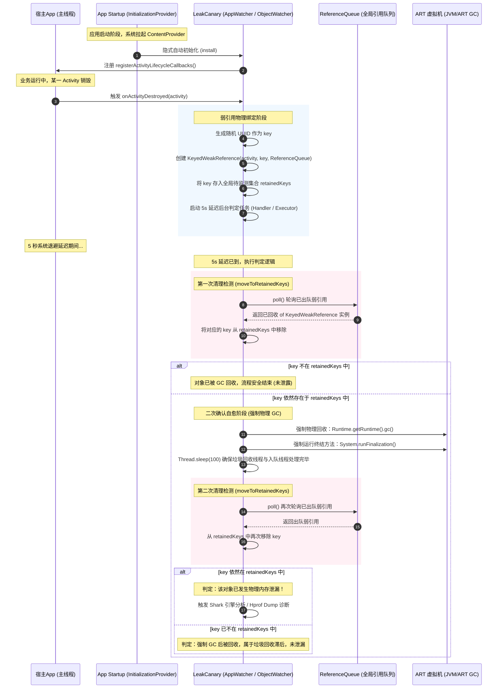

# 5.3.7.1 LeakCanary 核心机制与物理泄露判定算法

LeakCanary 是 Android 生态中最为著名的内存泄漏自动检测工具。作为一个优秀的调试测试库，它以极低的使用成本（2.x 版本实现了零行代码引入）和高精度的泄漏诊断能力著称。

本篇文档将深入 LeakCanary 的微观物理底层，从 Android Runtime (ART) 的虚拟机内存管理机制、引用物理契约、App Startup 隐式挂钩、Shark 引擎的拓扑结构算法，到工业界线上 APM 采用的 Linux `fork` 写时复制（COW）零卡顿 Dump 方案，进行系统级的深度剖析。

---

## 1. 内存泄漏的微观机理与物理危害

要从底层理解 LeakCanary 的监测逻辑，必须先厘清虚拟机（JVM/ART）的垃圾收集器（Garbage Collector, GC）对内存对象的物理管理机理。

### 1.1 追踪式垃圾收集（Tracing GC）与根可达性分析（GC Roots Reachability）
Android Runtime (ART) 采用追踪式垃圾收集（Tracing GC）算法来管理堆内存。虚拟机的垃圾回收器不依赖引用计数法（因其无法解决循环引用问题），而是通过“根可达性分析”（GC Roots Reachability Analysis）来判定对象的生死。

```
[GC Roots]
   │ (强引用)
   ▼
[活跃对象 A] ──(强引用)──► [被销毁的 Activity 实例] (应该销毁但无法回收)
   │ 
   ▼
[活跃对象 B]
```

在垃圾收集器执行标记（Marking）阶段时，它从一系列活跃的“根节点”（GC Roots）出发，顺着对象之间的引用关系进行树状向下遍历。凡是能够从 GC Roots 沿着强引用链达到的对象，均被标记为**活跃对象（Reachable/Active Objects）**；反之，若一个对象到任何 GC Roots 之间都不存在任何强引用链，则被判定为**垃圾对象（Unreachable Objects）**，其占用的物理内存空间将在清除（Sweeping）或压缩（Compacting）阶段被释放。

在 Java/Android 运行环境中，**GC Roots** 节点主要包含以下物理类型：
1. **JNI 全局/局部引用（JNI Global/Local References）**：在 Native C/C++ 代码中通过 JNI 接口创建并持有的 Java 对象指针。这类引用不受 Java 虚拟机内部生命周期的控制，必须显式释放。
2. **活动线程栈帧变量（Thread Stack References）**：处于活跃状态的线程（包括主线程、后台工作线程、线程池中的线程）的局部变量表和操作数栈中所引用的 Java 对象。只要线程未销毁，其正在执行或等待执行的方法栈帧中的所有局部变量都是 GC Roots。
3. **方法区中的静态属性（Static Fields）**：类加载器加载的 Class 对象中静态域（Static Fields）所引用的对象。由于类的生命周期通常与应用进程一致，静态变量所引用的对象会永久存活，除非对应的 ClassLoader 被卸载。
4. **系统类与常驻对象（System Classes / Bootstrap Class Loader）**：被引导类加载器（Bootstrap ClassLoader）加载的系统核心类，以及常驻的系统服务（如 `ActivityThread`、`WindowManagerService` 客户端存根等）。
5. **同步锁持有者（Monitor / Mutex Locks）**：当前正在被 `synchronized` 关键字作为锁持有的 Java 对象。

### 1.2 ART 虚拟机的内存堆（Heap）空间布局
为了更深刻地理解内存泄漏对虚拟机造成的压力，我们需要剖析 ART 虚拟机的物理内存堆空间划分。ART 的堆空间并非单一的连续区域，而是针对不同的分配策略细分为多个不同的逻辑和物理空间（Spaces）：
* **Image Space（镜像空间）**：包含预先编译好的系统核心类、系统资源及一些常驻的单例对象。此空间是只读的，且由 Zygote 进程启动时直接从磁盘映射到内存中，GC 永远不会扫描此空间，也不会在此空间发生垃圾回收。
* **Zygote Space（共享空间）**：由 Zygote 进程创建，包含了系统启动时已加载 of 类和对象。应用进程从 Zygote fork 出来后，与 Zygote 进程以只读方式共享该空间，只有当发生写入时才通过 Copy-on-Write 进行物理分裂。
* **Active Space（活跃分配空间 / Alloc Space）**：这是应用进程运行期间最核心的堆空间，绝大部分新创建的 Java 对象都会在此空间被动态分配。这个空间是 GC 标记与清除、碎片整理的主战场。
* **Large Object Space（大对象空间 / LOS）**：大对象空间专门用于存放占用物理空间较大的对象（在 ART 中通常定义为大与等于 3 个物理内存页，即 12KB 的对象，如 Bitmap 的像素原始数组或大型字符、字节数组）。LOS 的分配不使用常规的碰撞指针或 FreeList，而是通过 `mmap` 直接向系统申请独立的内存区域。GC 对大对象的管理非常轻量（主要是清除），但如果发生泄漏，大对象空间会迅速耗尽虚拟机的虚拟地址空间。

当发生内存泄漏时，泄漏对象及其持有的整棵对象引用树（可能包含大量的 View、Drawable、自定义数据结构等）会持续滞留在 **Active Space** 中。而大对象（如 Bitmap 的底层数据）则堆积在 **Large Object Space** 中。这些空间无法被垃圾收集器回收，不仅挤压了其他正常业务的内存分配额度，更迫使垃圾收集器不得不频繁启动。

### 1.3 垃圾收集器演化与 Stop-The-World (STW) 的物理开销
随着堆内可用物理空间比率逼近阈值，ART 虚拟机会显著提升 GC 的触发频次，试图回收空间。Android 系统的垃圾收集器经历了长期的演进，但无论如何演进，都无法完全避免 STW 对系统性能的负面影响：

* **Dalvik 虚拟机时代**：采用非常简陋的 Mark-Sweep 垃圾收集算法。当触发 GC 时，垃圾收集器会在标记开始和标记结束两个阶段完全挂起所有的 Java 线程。这种 STW 往往长达几十毫秒甚至上百毫秒，卡顿感极其严重。
* **Android 5.0 - 7.0 (ART 并发 GC 时代)**：引入了并发标记清除（CMS）算法。在大部分标记和清除时间里，GC 线程与应用线程并发运行。但它在根节点标记阶段（Initial Mark，需要扫描所有的 GC Roots）和重新标记阶段（Remark，由于并发期间应用线程仍在运行并改变引用关系，需要重新扫描被修改的引用），依然需要启动全局 STW 挂起所有的用户线程。
* **Android 8.0+ (Concurrent Copying 收集器)**：引入了并发复制（Concurrent Copying, CC）收集器。CC 收集器通过引入硬件/软件级的**读屏障（Read Barrier）**，在应用线程读取对象引用的同时，由读屏障拦截并协助完成对象的搬移（Copying）与引用更新，将对象从被回收的 Region 搬移到存活的 Region。虽然 CC 收集器实现了绝大部分时间的真正并发复制，但在垃圾回收的初始启动阶段（锁线程栈扫描绘制 Roots）以及最终引用表修正的某些极短时间点，仍然需要启动短暂的 STW 挂起。

当内存空间因为泄漏而极度受限且频繁产生新对象时，虚拟机会陷入“内存不足 -> 触发 GC -> 发生 STW -> 仅回收微量垃圾 -> 再次触发 GC -> 再次 STW”的恶性物理循环。频繁的挂起用户线程导致 CPU 大量时间被用在 GC Roots 遍历和线程挂起/恢复上下文切换上，这就是直观的**内存抖动（Memory Churn）**。

### 1.4 Choreographer 掉帧与 Jank 卡顿机理的数学剖析
Android 系统的 UI 渲染是典型的被动式帧驱动模型。`Choreographer`（编舞者）统一协调主线程的绘制时机，它会以固定的物理频率接收来自底层的垂直同步信号（Vsync）。

以主流的 60Hz 屏幕刷新率为例，每一帧的刷新周期为：
$$T_{\text{frame}} = \frac{1000\text{ms}}{60} \approx 16.67\text{ms}$$
而在 120Hz 刷新率的屏幕上，这个时间窗口被无情地压缩到：
$$T_{\text{frame}} = \frac{1000\text{ms}}{120} \approx 8.33\text{ms}$$

当 Vsync 信号到达时，系统会在主线程的消息队列（MessageQueue）中投递一个 `MSG_DO_FRAME` 消息，主线程被唤醒并依次执行以下操作：
1. **Input**：处理触摸、点击、按键等物理事件。
2. **Animation**：计算属性动画、过渡动画的最新差值。
3. **Traversal**：对整个 View 树执行 Measure（测量）、Layout（布局）、Draw（绘制）并将绘制指令录制到 `DisplayList` 中。
4. **RenderThread Submit**：主线程将录制的绘制数据提交给渲染线程（RenderThread），渲染线程最终通过 GPU 硬件加速渲染并将 Frame Buffer 提交给系统的 `SurfaceFlinger` 服务进行屏幕合成显示。

如果在主线程执行上述渲染周期的过程中，ART 虚拟机因为垃圾回收器执行 STW 挂起了主线程。设主线程正常处理这一帧的 Input、Animation 和 Traversal 耗时为 $T_{\text{draw}} = 6\text{ms}$，但是在执行 Traversal 过程中发生了垃圾回收导致的 STW，挂起耗时 $T_{\text{stw}} = 15\text{ms}$。
那么这一帧的实际总耗时变为：
$$T_{\text{total}} = T_{\text{draw}} + T_{\text{stw}} = 6\text{ms} + 15\text{ms} = 21\text{ms} > 16.67\text{ms}$$

这就意味着主线程无法在当前 16.67ms 窗口内完成渲染数据的准备。当屏幕下一次刷新时，`SurfaceFlinger` 发现 Frame Buffer 依然是空的，别无选择，只能继续显示上一帧的内容。这在物理上称为**丢帧（Jank / 掉帧）**。用户在视觉上会直观地感受到顿挫、撕裂和严重的卡顿体验。

### 1.5 物理崩溃：OutOfMemoryError 抛出链
当堆内存占用达到上限（Heap Limit），且 GC 线程即便执行了最彻底的 Full GC（试图回收软引用、执行终结器等），也无法清理出足够大的连续物理内存空间来满足当前分配新对象的请求时，ART 虚拟机会立即抛出 `java.lang.OutOfMemoryError`。

对于 Activity 等包含大量 View 层级、图片资源（如 Bitmap，虽然在 Android 8.0+ 之后 Bitmap 的像素数据被移到了 Native 堆，但 Java 堆中依然保留了 Bitmap 的包装对象及相应的内存屏障控制）的对象，一次泄漏往往伴随着数兆甚至数十兆内存的永久损失，这极大地加速了 OOM 进程的到来。

有关 Android 历史版本中内存分配策略和 ART 虚拟机的演进细节，可以参考 [AndroidVersionChangeLog.md](../../../AndroidVersionChangeLog.md)。

---

## 2. 自动检测底盘与弱引用回收链判定

LeakCanary 的核心魅力在于其自动化的监测体系，它能神不知鬼不觉地在对象本该销毁的时刻将其锁入监控网，并在垃圾回收的灰色地带中给出准确无误的泄漏判断。

### 2.1 自动检测底盘的时序流程
LeakCanary 自动感知 onDestroy、挂载引用并进行两轮垃圾回收判定的完整时序流程如下所示：



### 2.2 App Startup 无侵入隐式初始化原理
在 LeakCanary 1.x 时代，开发者需要在自定义的 `Application` 类的 `onCreate()` 中手动编写初始化逻辑：
```java
// LeakCanary 1.x 的手动初始化方式，污染了 Application 的业务入口
if (LeakCanary.isInAnalyzerProcess(this)) {
    return;
}
LeakCanary.install(this);
```
这种设计不仅侵入了业务的初始化代码，还增加了维护难度。而在 LeakCanary 2.x 中，依赖引入后无需任何初始化代码即可直接运行。这一改进彻底得益于 Android Jetpack 的 **App Startup** 库的引入。

#### 2.2.1 ContentProvider 隐式初始化钩子
在 Android 系统的冷启动流程中，`ActivityThread` 在执行 `handleBindApplication` 阶段时，其核心步骤的执行时序为：
1. 创建 Application 实例。
2. **初始化并拉起宿主应用清单文件中注册的所有 ContentProvider（调用其 `onCreate()` 方法）**。
3. 调用 `Application.onCreate()`。

由此可见，`ContentProvider` 的 `onCreate()` 具有比 `Application.onCreate()` 更早的物理执行时机。

LeakCanary 2.x 在其内部依赖库的 `AndroidManifest.xml` 中，声明了一个专属的 `ContentProvider`：
```xml
<!-- 声明在 leakcanary-android 库的清单文件中，宿主编译时会自动合并 -->
<provider
    android:name="leakcanary.internal.AppWatcherInstaller$MainProcess"
    android:authorities="${applicationId}.leakcanary-installer"
    android:exported="false"
    android:enabled="@bool/leak_canary_watcher_auto_install" />
```
当应用启动时，系统自动实例化 `AppWatcherInstaller$MainProcess`，并在其 `onCreate()` 中获取宿主的 `Application` 对象：
```kotlin
// 内部走读伪代码
internal sealed class AppWatcherInstaller : ContentProvider() {
  override fun onCreate(): Boolean {
    val application = context!!.applicationContext as Application
    // 零侵入初始化底盘
    AppWatcher.manualInstall(application)
    return true
  }
}
```

#### 2.2.2 全生命周期追踪拦截（Activity & Fragment）
一旦获取到 `Application` 实例，LeakCanary 就可以实现对所有组件销毁状态的全局拦截：
* **Activity 追踪**：通过调用 `Application.registerActivityLifecycleCallbacks(...)`，注册一个全局监听器。在监听到 `onActivityDestroyed(activity)` 回调时，立即将该 Activity 实例移交给 `ObjectWatcher` 执行泄漏监控。
* **Fragment 追踪**：在 Activity 监听到 `onCreate` 时，LeakCanary 会获取 Activity 对应的 `FragmentManager`（包括 AndroidX 的 `SupportFragmentManager`），并通过 `registerFragmentLifecycleCallbacks(..., true)` 注册 Fragment 的生命周期拦截器。
  - 在拦截器中，当 `onFragmentDestroyed(fm, fragment)` 发生时，将 Fragment 实例提交监控。
  - 特别地，在 `onFragmentViewDestroyed(fm, fragment)` 触发时，将 **Fragment 的 View 实例**（即 `fragment.view`）提交监控。

#### 2.2.3 为什么 Fragment View 泄漏如此频繁？
在 Android 生态中，Fragment View 的生命周期往往短于 Fragment 实例本身的生命周期。一个经典的场景是：
1. 用户在 Activity 中通过 FragmentTransaction 将 Fragment 放入了返回栈（BackStack）。
2. 此时，Fragment 会被执行 `onDestroyView()` 销毁其 UI 视图（即 `fragment.view` 置空或被销毁）。但 Fragment 实例本身并没有被销毁，它依然存活在 FragmentManager 的返回栈中，以备用户点击返回键时复用该 Fragment 实例进行视图重建。
3. 如果此时有任何第三方库（如属性动画、闭包回调、静态局部变量、ViewBinding 包装器）在 `onDestroyView` 后依然持有了 `fragment.view` 的引用，那么即使 Fragment 实例本身存活是合理的，它所关联的庞大 View 树及所有子 View 的物理空间都将彻底泄漏。
4. 这种“Fragment 未泄漏，但其 View 已经泄漏”的特性促使 LeakCanary 在 `FragmentLifecycleCallbacks` 中专门设计了对 `onFragmentViewDestroyed` 的拦截逻辑，对 `fragment.view` 建立独立的弱引用链进行监控。

### 2.3 弱引用物理契约与 Reference 状态机转移
要实现精准且无副作用的内存泄漏监测，必须建立在 Java 虚拟机对引用类型物理回收契约的深入理解之上。

#### 2.3.1 引用队列（ReferenceQueue）的契约
Java 虚拟机提供了一个底层特性：在创建弱引用 `WeakReference(T referent, ReferenceQueue<? super T> q)` 时，若传入了一个非空的 `ReferenceQueue`。当 GC 运行且判定指代对象（Referent）只被该弱引用持有（可达性分析为不可达）时，虚拟机会在回收 Referent 内存的同时，自动将这个 `WeakReference` 对象本身推入（Enqueue）到关联的 `ReferenceQueue` 中。

#### 2.3.2 深入 Reference 状态机转移
要精确掌握为什么我们需要通过 ReferenceQueue 来进行泄漏确认，必须剖析 Java 虚拟机内部 Reference 对象的四种生命周期状态转移：
1. **Active（活跃状态）**：当一个 Reference 对象刚被创建，且它所代指的 Referent 对象还具有强引用、可以被应用线程访问时。此时，该 Reference 对象处于 Active 状态。虚拟机在 GC 时会将其作为普通弱引用处理。此时 `queue` 还没有发挥作用。
2. **Pending（挂起状态）**：当垃圾回收器在执行可达性分析时，判定该 Referent 已经没有强引用、只被此 WeakReference 持有，准备回收 Referent。GC 会将该 WeakReference 实例放入虚拟机内部维护的一个全局 Pending 链表中。这个 Pending 链表由虚拟机的底层 C++ 代码控制，此时 Java 代码还无法从 ReferenceQueue 中获取它。
3. **Enqueued（入队状态）**：在 ART 虚拟机内部，存在一个名为 `ReferenceQueueDaemon` 的守护线程（在 HotSpot 虚拟机中为 `ReferenceHandler` 线程）。该守护线程以高优先级运行，不断轮询上述全局 Pending 链表，一旦发现有新的 Reference 对象，便将该 Reference 对象从 Pending 链表中取出，推入到我们在构造函数中传入的那个 Java 层的 `ReferenceQueue` 中。此时，我们通过 `queue.poll()` 或 `queue.remove()` 就能成功获取该弱引用对象。
4. **Inactive（非活跃状态）**：当 Reference 对象已经从其关联的 `ReferenceQueue` 中被出队（Poll）处理，或者在创建时就没有传入 `ReferenceQueue`，当其 Referent 被回收后，它将永久进入 Inactive 状态，等待自身的回收。

```
  [创建] ──► Active (活跃)
               │ (GC 判定 Referent 不可达)
               ▼
             Pending (虚拟机全局挂起链表)
               │ (守护线程 ReferenceQueueDaemon 调度)
               ▼
             Enqueued (推入指定的 ReferenceQueue)
               │ (执行 queue.poll() 清除)
               ▼
             Inactive (非活跃)
```

#### 2.3.3 LeakCanary 的监控基石：KeyedWeakReference
为了精准定位哪一个对象发生了泄漏，LeakCanary 自定义了 `KeyedWeakReference` 类。它在原生 `WeakReference` 的基础上，绑定了一套元数据：
```kotlin
class KeyedWeakReference(
  referent: Any,
  val key: String,                  // 唯一标识该对象的 UUID 字符串
  val name: String,                 // 对象的类名/描述，方便输出
  val watchUptimeMillis: Long,      // 监控起点时间（用系统启动时间 uptimeMillis 表示）
  referenceQueue: ReferenceQueue<Any>
) : WeakReference<Any>(referent, referenceQueue) {
  // 记录判定为确认泄漏时的时间戳，以便计算泄漏生命跨度
  var retainedUptimeMillis: Long = -1
}
```

在销毁回调被感知时，LeakCanary 会为待监测的实例（如 Activity）执行登记：
1. 生成一个全局唯一的 `UUID` 字符串作为 `key`。
2. 创建一个 `KeyedWeakReference`，将其与全局的 `ReferenceQueue` 绑定，并把该 `key` 存入一个名为 `retainedKeys` 的全局并发哈希集合（`Set<String>`）中。
3. 启动一个 5 秒延迟的后台判定任务。

### 2.4 动态延迟 5s 判定与强制 GC 二次确认自愈算法
当 Activity 的 `onDestroy` 结束后，被监控的对象并不一定会被立刻回收。主要原因有两个：
* Android 的垃圾回收（GC）不是实时发生的，而是由虚拟机根据堆内存水位、对象分配速率等因素异步触发。
* 销毁动作发生后，主线程的消息循环（MessageQueue）中可能还有尚未处理完毕的渲染消息或延时任务，它们在极短时间内可能还临时持有着该对象的引用，但随后会自然消亡。

为了消除这部分时效性的误报，LeakCanary 采用了“5 秒退避延时 -> 第一次清理 -> 强行 GC 物理验证 -> 第二次确认”的闭环判定算法。

#### 2.4.1 第一轮清理检测：出队判定
在 5 秒延迟时间到达后，后台执行线程首先会调用 `moveToRetainedKeys()` 方法。该方法的内部逻辑是一个轮询清理过程：
* 循环调用 `referenceQueue.poll()`。
* 若从队列中成功获取到了一个 `KeyedWeakReference` 实例，代表该引用所指代的对象**已被垃圾收集器成功回收并释放**。
* 获取该引用的 `key`，并将这个 `key` 从 `retainedKeys` 集合中安全地移除。
* 这一步可以过滤掉绝大多数在 5 秒内被正常回收的对象。

#### 2.4.2 强制 GC 的物理机制与自愈二次确认
在第一轮清理之后，如果当前监控的对象的 `key` **依然**存在于 `retainedKeys` 集中，说明 5 秒内该对象没有被正常回收。此时，为了彻底排除“这 5 秒内系统没有发生过任何垃圾收集”的外部干扰，LeakCanary 必须强行唤醒垃圾收集器。

LeakCanary 自定义了 `GcTrigger.runGc()`，其底层的物理自愈判定实现非常严密：
```kotlin
// GcTrigger 的核心实现逻辑
val gcTrigger = object : GcTrigger {
  override fun runGc() {
    // 1. 显式促使虚拟机发起一轮垃圾回收
    Runtime.getRuntime().gc()
    
    // 2. 强行执行处于待终结队列中的对象的 finalize 方法
    // 确保这部分即将消亡的对象能释放其引用的其他对象，避免物理假象
    System.runFinalization()
    
    // 3. 极其关键的一步：睡眠 100ms
    // 因为虚拟机的垃圾回收和弱引用排队入 ReferenceQueue 是异步过程，需要物理时间退避
    Thread.sleep(100)
  }
}
```

* **`Runtime.getRuntime().gc()` 的物理效果**：该方法在 ART 虚拟机底层并非仅仅是“建议”，而是会发起一个同步或异步的 Full GC 请求（在 ART 内部对应的底层函数是 `RequestConcurrentGC` 或 `CollectGarbageInternal`）。
* **`Thread.sleep(100)` 的物理必要性**：由于 ART 虚拟机内部，将 `WeakReference` 从全局 Pending 链表转移到 `ReferenceQueue` 的守护线程 `ReferenceQueueDaemon` 是低优先级的。如果我们执行完 `gc()` 后立刻判定，由于守护线程可能尚未被 CPU 调度运行，队列中依然可能为空，从而造成灾难性的泄漏误报。100ms 的休眠为守护线程入队争取了充裕的 CPU 时间片。

在强制 GC 并睡眠之后，LeakCanary 再次调用 `moveToRetainedKeys()`，执行第二轮出队判定。

如果在经历了两轮出队清理与强制物理 GC 后，该对象的 `key` **依然存在于 `retainedKeys` 中**，则可以确凿无疑地断定：**在虚拟机被强制进行垃圾回收后，由于外部存在强引用链持有，该对象依然无法被回收。此现象百分之百属于物理内存泄漏！**

---

## 3. Shark 引擎与 GC Roots 最短路径树 Dump 诊断

一旦确认为物理泄漏，LeakCanary 就会触发 Dump 诊断。

### 3.1 从 HAHA 引擎到 Shark 引擎的物理变革
在 LeakCanary 1.x 中，堆转储解析器使用的是 Square 自家的 `HAHA`（Headless Android Heap Analyzer）库。
* **HAHA 的工作原理**：一次性读取庞大的 Hprof 物理文件，并在 Java 堆中为 Hprof 中的每一个实例、每一个引用关系构建出一整套对应的 Java 内存对象，从而把整个 Hprof 二进制结构反序列化为内存中的有向图。
* **致命缺陷**：若 Hprof 文件本身有 100MB（中大型应用非常普遍），解析它需要占用 300MB 到 600MB 以上的堆内存。在手机内存已经吃紧（否则不会触发泄漏判定）的运行环境下，直接在当前进程执行 HAHA 解析，几乎必然会触发严重的 OutOfMemoryError。这导致调试工具自身发生物理崩溃，无法输出诊断报告。

为了解决该物理瓶颈，Square 从 2.x 开始全新开发了 Kotlin 实现的 **Shark** 解析引擎。

| 特性维度 | 早期 HAHA 引擎 | 现代 Shark 引擎 | 物理原理 / 技术革新 |
| :--- | :--- | :--- | :--- |
| **内存开销** | Hprof 大小的 3 ~ 6 倍 | Hprof 大小的 1/10 ~ 1/20 | Shark 采用**流式读取**与**轻量级扁平化索引**，避免了大量 Java 包装对象的生成。 |
| **解析效率** | 极慢（需要完全反序列化） | 极快（利用随机文件读按需查找） | Shark 只读取需要的元数据，在需要遍历时才通过偏移量随机读取（Lazy Loading）。 |
| **自身崩溃率** | 高（易引发 OOM 崩溃） | 极低（分析内存控制在数兆至十几兆） | 即使面对 150MB+ 的大 Hprof 文件，也能在 10MB 内存限制内完成引用链解析。 |
| **数据存储** | 全部载入堆内存 | 依赖 Hprof 索引文件的随机读 | 仅在内存中维护轻量级的 `Long-to-Long` 原始类型映射（Primitive Maps），无包装对象。 |

### 3.2 深入走读 Hprof 二进制文件格式
要理解 Shark 为什么能实现流式解析，必须知晓 Hprof 堆转储文件的二进制物理结构。Hprof 文件由一个文件头（Header）以及紧随其后的若干个不同类型的记录（Records）串行排列而成。

#### Hprof 文件的头部结构（Header）
1. 格式字符串（以 `\0` 结尾的字符串，例如 `"JAVA PROFILE 1.0.3"` 或 `"ANDROID"`，大小可变）。
2. ID 的大小（4 字节或 8 字节，指示文件中对象指针指针所占用的字节大小，在 32 位 Android 系统上为 4 字节，在 64 位系统上为 8 字节）。
3. 时间戳的高位和低位（8 字节，指示转储导出的物理时间）。

#### 核心 Records 类型的物理排布
文件头部之后是大量的 Record 数据块。每个 Record 的物理结构包含：
* Record Tag（1 字节，标识 Record 的类型）。
* Time offset（4 字节，时间偏移量）。
* Length（4 字节，标识该 Record 内容体的大小）。
* Body（长度为 Length 字节的具体数据内容）。

核心的 **Record Tag** 如下：
* **`STRING` Record (0x01)**：存储了堆中所有字符串字面值。在后续的对象解析中，所有的字段名、类名都只是通过一个 ID 指向这些 String Record，这极大地压缩了文件体积。
* **`LOAD CLASS` Record (0x02)**：类加载记录。关联了类的 Class ID，ClassLoader ID 和类名字符串 ID。
* **`HEAP DUMP` Record (0x0C) / `HEAP DUMP SEGMENT` (0x1C)**：这是最核心的数据块。包含了整个堆的快照信息，其 Body 内部又由众多的子数据记录（Sub-records）紧密排布：
  - **`ROOT` Sub-records (0x01 - 0x08)**：标志了所有的 GC Roots 顶点。例如 `ROOT JNI GLOBAL` 包含 JNI 全局引用 ID，`ROOT THREAD OBJECT` 包含活跃线程 ID 等。
  - **`CLASS DUMP` Sub-records (0x20)**：描述了类的元数据。包括类 ID、父类 ID、实例字段的名称 ID 和字段的数据类型（如 Int, Object, Float）。
  - **`INSTANCE DUMP` Sub-records (0x21)**：实例转储。包含该对象实例的 ID、其 Class ID 以及该实例所有成员变量的真实二进制物理数据（如果是 Object 类型则为 4/8 字节的引用的 ID，如果是基本数据类型则为对应的物理数值）。
  - **`OBJECT ARRAY DUMP` (0x22)**：对象数组转储。包含数组实例 ID、Class ID 以及所有数组元素的引用 ID 列表。

### 3.3 Shark 索引式惰性加载与流式扫描实现
由于 Hprof 的这种二进制编排，HAHA 引擎之所以消耗巨大的内存，是因为它每读取到一个 `INSTANCE DUMP`，就在 Java 虚拟机中通过反射或硬编码 `new` 出一个包含大量字段、方法等元数据的 Java 包装类对象，并把它们用庞大的邻接 Map 连结起来。

Shark 的解决思路是**建立索引（Indexing）与按需访问（Random Access）**：
1. **单次流式扫描**：Shark 在分析启动时，会以流的方式从头到尾扫过 Hprof 物理字节流。在扫描过程中，它**只抓取极少量的核心元数据**：
   - 提取所有 Class 对象的 ID、字段结构及其在文件中的起始物理偏移量（Offset）。
   - 提取所有 Instance 对象的 ID 及其在文件中的起始物理偏移量（Offset）。
   - 将这些 `ID -> Offset` 关系，存储到一种高度定制、扁平化的原始数据类型哈希映射表（使用 Long-to-Long 映射，摒育了 JDK 原生的 `HashMap<Long, Long>` 带来的包装类对象头以及 Entry 节点的巨大开销）。
2. **按需随机读**：当 Shark 图遍历需要访问某个 Instance 的成员变量时，它**绝不预先加载该 Instance**。它通过 Long-to-Long 映射表查出该 Instance ID 在文件中的偏移量 $Offset_{obj}$，接着调用 Linux 的 `seek()` 定位到 `RandomAccessFile` 的相应位置，仅仅把该实例的几个成员变量引用 ID 读取并解析出来。
通过这种技术，Shark 绝大部分时间仅在扁平的索引中移动，仅在需要时才随机读取极少量的字节，从而实现了以极低的内存开销完成完整的拓扑分析。

### 3.4 GC Roots 最短路径树的拓扑搜索算法
有了 Hprof 物理二进制文件后，Shark 开始大显身手。它需要解决的核心问题是：**在极其复杂的堆对象关系网中，寻找一条从任意 GC Root 出发，指向被监测泄漏实例的最短强引用路径树。**

```
[GC Root: Static Filed]
         │ (强引用)
         ▼
    [Manager 实例]
         │ (强引用)
         ▼
   [Listener 数组]
         │ (强引用)
         ▼
[Activity 实例] (泄漏目标) ◄──(强引用)── [某个 Handler] ◄── [ActivityThread]
   (最短路径: 3步)                            (较长路径: 5步)
```

#### 3.4.1 拓扑图模型抽象
在 Shark 中，Hprof 堆数据被抽象为一个**有向图 $G = (V, E)$**：
* **顶点集合 $V$**：包括所有的 GC Roots，以及堆中的所有 Java 对象实例（如 Activity、TextView）、类对象（Class Object）和数组实例。
* **边集合 $E$**：代表强引用指向关系。如果对象 $A$ 的成员变量持有对象 $B$ 的强引用，则存在有向边 $e(A \to B)$。

#### 3.4.2 Dijkstra 与广度优先搜索（BFS）的最短路径检索
为了输出最精准、最易于开发者排查的泄漏链路（Leak Trace），算法必须寻找**最短路径（Shortest Path）**。因为如果存在多条持有链，最短的那条链通常代表了直接持有源头，切断它就能最快解除泄漏。

对于一个有向无权图（或者所有边的权重均视为 1 的图），寻找最短路径的最优算法是广度优先搜索（BFS）。

##### 算法实现数学逻辑：
1. **初始化**：
   - 创建一个队列 $Q$。
   - 定义一个距离映射表 $\text{dist}: V \to \mathbb{Z}_{\ge 0}$，对于所有顶点 $v \in V$，初始化其到 GC Roots 的物理距离 $\text{dist}[v] = \infty$。
   - 定义前驱节点指针映射表 $\text{parent}: V \to V \cup \{\text{null}\}$。
   - 提取 Hprof 中所有的 GC Roots 顶点集合 $R$。对于每一个根节点 $r \in R$，设置其 $\text{dist}[r] = 0$，并将其推入队列 $Q$ 中。
2. **搜索循环**：
   - 当队列 $Q$ 非空时，取出队头节点 $u$。
   - 遍历节点 $u$ 的所有出边指向的邻接节点 $v$：
     - **物理边属性判定与过滤**：在获取 $u$ 指向的节点 $v$ 时，Shark 会读取字段反射属性。如果该字段属于 `WeakReference.referent` 或 `SoftReference.referent` 等非强引用关系，**则该边不属于图 $G$ 的有效边集 $E$，直接丢弃**。因为这类弱引用在物理上不阻碍垃圾回收。
     - **距离更新与入队**：如果满足边过滤规则且 $\text{dist}[v] == \infty$，说明节点 $v$ 尚未被访问过。更新 $\text{dist}[v] = \text{dist}[u] + 1$，并将 $v$ 的前驱节点设为 $u$（即 $\text{parent}[v] = u$）。然后将 $v$ 推入队列 $Q$。
3. **泄漏目标触碰判定**：
   - 每次有新节点被更新距离时，检查该节点是否是已被确认泄漏的实例（如 `retainedKeys` 对应的对象 ID）。
   - 一旦发现泄漏目标被触碰，广度优先搜索即刻终止。由于 BFS 从近及远的物理扩散特性，此时得到的路径必然是**最短强引用链**。
4. **反向回溯**：
   - 从被测泄漏对象的节点开始，沿着记录的 $\text{parent}$ 映射关系反向追踪，最终回溯到某一个 GC Root，完成泄漏链（Leak Trace）的输出。

---

## 4. 线上生产级内存监控变革与 fork 零卡顿 Dump

原生 LeakCanary 设计 of 物理前提是**仅供本地开发和测试（Debug 环境）使用**。如果有开发者尝试在 Release（线上生产环境）开启 LeakCanary，将会带来灾难性的用户体验后果。

### 4.1 为什么原生 LeakCanary 严禁在生产环境运行？
根本症结在于 `Debug.dumpHprofData()` 触发的虚拟机 **Suspend All Threads** 动作。

* **物理卡顿灾难**：为了在导出 Hprof 时保证对象数据的拓扑结构不发生改变，ART 虚拟机必须进入全局安全点（Safepoint）并完全挂起所有的 Java 线程。这个挂起是硬性的，主线程也将被迫停顿（STW）。
* **时延考量**：在真实的线上大堆应用中，堆大小往往能达到 150MB 至 300MB。执行 Dump 将会导致整个应用被**完全冻结 1s 到 5s 以上**。此时用户所有的输入无响应，动画卡死在当前帧。
* **ANR 物理崩溃**：在 Android 系统中，当主线程在 5 秒内无法处理输入事件或接收广播时，系统会触发 **Application Not Responding (ANR)** 弹窗并直接杀死进程。这意味着，Dump Hprof 极易直接诱发线上 ANR 物理崩溃。

### 4.2 工业界线上 APM 的物理破局方案：Fork Copy-on-Write 机制
为了在生产环境中实现零感知的内存泄漏监控与 Hprof 导出，国内各大厂（如快手 KoOM、字节 Matrix、美团 Liko）采用了一套巧妙的物理克隆手段：**利用 Linux 的 `fork()` 系统调用和 MMU 的 Copy-on-Write（写时复制）特性。**

```
                  [主进程 (父进程)] - 持续响应 UI / 无卡顿
                   │  ▲
                   │  │ (Copy-on-Write 缺页中断，复制物理页)
                   ▼  │
             ┌────────┴────────┐
             │ 共享只读物理内存 │
             └────────┬────────┘
                      ▲
                      │ (只读读取堆快照，无需复制)
                      │
                  [克隆进程 (子进程)] - 独立执行 Dump，即使挂起也与父进程无关
```

#### 4.2.1 `fork()` 与 Copy-on-Write (COW) 的物理特性
在 Linux 操作系统中，`fork()` 是极其轻量级的系统调用。
1. **轻量级页表复制**：当主进程（父进程）调用 `fork()` 时，内核会创建一个新的进程控制块（PCB），并克隆父进程的虚拟地址空间页表（Page Table），但**绝不复制实际的物理内存页面（Physical Memory Pages）**。父子进程的页表指向完全相同的物理内存地址。
2. **写时复制（COW）标志**：内核会将父子进程页表中所指向的所有物理内存页面全部标记为 **只读（Read-Only）**。
3. **物理分裂（写时拷贝发生时）**：
   - **子进程**：仅用于只读地读取堆中的对象信息并写入 Hprof。由于子进程不执行任何写操作，它将一直与父进程共享这些只读物理页面。
   - **父进程（主进程）**：`fork()` 完成后恢复运行。当主进程需要更新数据（例如修改变量、处理 UI 事件）而试图对某个共享的物理内存页进行写入时，由于该页面被标记为只读，CPU 的内存管理单元（MMU）会立即触发一个 **缺页异常（Page Fault）**。
   - **内核自愈**：操作系统内核捕获到该异常后，会在物理内存中分配一个**全新的物理内存页**，将原本只读物理页中的所有数据复制到这个新物理页中，然后把父进程页表中的虚拟地址映射重定向到该新物理页，并清除只读标志，赋予可读写属性。
   - **隔离效果**：此时，父进程向新物理页安全地写入数据，而子进程的页表依然指向原来未作修改的只读物理页面。

#### 4.2.2 Linux 二级页表与物理空间开销计算
为什么 `fork` 在执行瞬间如此快速？我们可以通过 Linux 的页表机制进行定量的物理估算。

在 Linux x86_64 或 ARM64 架构下，虚拟地址到物理地址的映射通过多级页表（通常为 4 级页表，包含 PGD、PUD、PMD、PTE）实现。
* 每一个物理内存页（Page）的标准大小为 4KB（即 $2^{12}$ 字节）。
* 每一个物理页对应的页表项（Page Table Entry, PTE）在 64 位系统上占用 8 字节空间。
* 假设当前 Android 应用的主进程占用了 $1\text{GB}$ 的虚拟内存。其对应的物理内存页数量为：
$$N_{\text{pages}} = \frac{1\text{GB}}{4\text{KB}} = \frac{1024 \times 1024\text{KB}}{4\text{KB}} = 262,144\text{个物理页}$$
* 复制这些物理页所占用的最后一级页表（PTE）的内存大小为：
$$\text{Size}_{\text{pte}} = 262,144 \times 8\text{字节} = 2,097,152\text{字节} \approx 2\text{MB}$$

加上前几级页表的复制，系统在执行 `fork()` 时，仅仅需要复制不到 $3\text{MB}$ 的页表结构，而**完全不需要复制任何实际的 $1\text{GB}$ 物理内存**。复制 $3\text{MB}$ 的数据在现代手机的 CPU 和 DDR 内存带宽下，耗时通常只有 $5\text{ms} \sim 15\text{ms}$。这就是 `fork` 能够实现主进程毫秒级复活并避免卡顿的物理依据。

#### 4.2.3 fork 零卡顿 Dump 并发物理拓扑
这种方案的整体并发与物理拓扑交互流程如下：

```mermaid
flowchart TD
    subgraph ParentProcess["主进程 (父进程) - PID: 1000"]
        MainThread["主线程 (UI 线程)"]
        Heap["Java 堆物理内存空间 (可读写)"]
        PageTable["父进程页表 (Page Table)"]
        
        MainThread -->|读写指令| PageTable
        PageTable -->|映射| Heap
    end

    subgraph LinuxKernel["Linux 操作系统内核 (OS Kernel)"]
        ForkCall["fork() 系统调用"]
        COW["Copy-on-Write (写时复制) 机制"]
        PageFaultHandler["缺页中断处理器 (Page Fault Handler)"]
    end

    subgraph ChildProcess["克隆进程 (子进程) - PID: 1001"]
        DumpThread["Dump/Shark分析 线程"]
        ChildPageTable["子进程页表 (Page Table)"]
        
        DumpThread -->|只读指令| ChildPageTable
    end

    %% Fork 触发关系
    MainThread -->|1. 发起 fork 信号| ForkCall
    ForkCall -->|2. 毫秒级复制页表, 设为只读| ChildPageTable
    ChildPageTable -->|3. 物理共享映射| Heap
    
    %% COW 触发
    MainThread -->|4. 主进程产生写入动作 (例如更新 UI 变量)| PageTable
    PageTable -->|5. 试图写入只读页面| COW
    COW -->|6. 触发缺页异常| PageFaultHandler
    
    PageFaultHandler -->|7. 申请新物理内存页| NewPage["新物理内存页"]
    PageFaultHandler -->|8. 复制旧页数据到新页| NewPage
    PageFaultHandler -->|9. 重定向父进程页表| PageTable
    PageTable -.->|映射| NewPage
    
    %% 子进程 Dump 流程
    DumpThread -->|10. 后台低优先级只读扫描| Heap
    DumpThread -->|11. 触发 Hprof 导出| HprofFile[("hprof 磁盘文件")]
    HprofFile -->|12. 运行 Shark 流式分析| RetainedChain["解析出最短强引用路径链 (LeakTrace)"]
    RetainedChain -->|13. 上报 APM 监控后台| APMServer[("线上 APM 控制台")]
    RetainedChain -->|14. _exit(0) 物理自毁| Destroy["释放子进程资源"]
```

#### 4.2.4 零卡顿的最终闭环
1. **触发检测**：线上 APM 监测到内存告警，在主进程调用 `fork()`。整个 `fork` 的调用耗时极短，主进程几乎在瞬间恢复。
2. **父进程复活**：`fork` 返回后，主进程立即在 native 层被恢复（Resume），继续运行 UI 循环，用户几乎毫无察觉。
3. **子进程 Dump**：子进程在独立的地址空间内开始调用 `Debug.dumpHprofData()`。虽然子进程会执行 Suspend All 挂起子进程的所有线程，但这完全局限在子进程内部，**对主进程（用户应用）的运行完全不产生任何物理卡顿**。
4. **流式压缩与上报**：子进程在后台完成 Hprof Dump 后，可直接在子进程中调用 Shark 引擎进行解析并提取泄漏路径（或者对 Hprof 文件进行物理压缩），然后通过网络通道异步上报到 APM 后台服务器，随后调用 `_exit(0)` 自毁退出，彻底释放临时内存。主进程全程保持平滑运行。

### 4.3 线上 fork COW 方案的终极挑战：锁重置与 Native 级防死锁避坑
虽然 `fork` 写时复制机制看起来天衣无缝，但在底层复杂的 Native 空间中运行，它面临着一个致命的物理隐患：**锁永久死锁（Lock Deadlock）**。

#### 4.3.1 锁死锁的微观成因
在 POSIX 标准中，`fork()` 系统调用有一个极其特殊的规定：**当一个包含多个活动线程的进程调用 `fork()` 时，子进程只会克隆并拉起发起 `fork` 调用的那个线程，而父进程中的其他所有线程在子进程中都会凭空消失、不再运行。**

这导致了以下灾难性的死锁场景：
1. 在父进程执行 `fork()` 的瞬间，主进程的另一个工作线程（例如线程 B）正在执行内存分配动作，持有了 `libc` 内存分配器（如 `dlmalloc` 或 `jemalloc`）内部的全局互斥锁（Mutex Lock）。或者是正在执行某个日志操作，持有了 `std::log` 锁。
2. 当 `fork()` 调用完成时，子进程被创建。但子进程只复制了发起调用的主线程。线程 B 在子进程中直接消失了，但**线程 B 之前持有的所有 Mutex 锁在子进程的内存页中依然处于“被持有”的上锁状态**，且由于持有锁的线程 B 已经不复存在，这把锁在子进程中将**永远没有机会被释放（Unlock）**。
3. 当子进程随后在 Java 空间调用 `Debug.dumpHprofData()` 时，其底层必定需要使用 `new` 或 `malloc` 申请临时堆内存来存储导出数据。此时，子进程的 dump 线程在调用 `malloc()` 时会尝试去申请该 `dlmalloc` 锁。
4. 由于该锁在子进程中永远被锁定，子进程的 dump 线程将陷入永久的阻塞等待，造成**永久物理死锁**。子进程卡死，导致 Hprof 导出和解析彻底搁浅。

#### 4.3.2 工业界避坑方案：绕过系统加载限制动态链接 `libart.so`
为解决这一底层的死锁问题，快手 KoOM、字节 Matrix 等优秀的线上 APM 框架采用了以下避坑设计：**在 fork 发起前，先主动挂起主进程内的所有其他 Java 线程，使其都处于等待的安全点，从而确保 fork 时没有任何锁被占用。**

在 Android 7.0 以后，系统的动态链接器（Linker）对命名空间实施了严格的隔离限制，应用无法直接通过常规的 `dlopen("libart.so", ...)` 加载系统核心运行时库，否则会抛出权限拒绝。为此，线上 APM 必须采用 Linker 绕过技术（Linker Bypass）：
1. **ELF 内存节表解析**：不直接通过 Linker 的 dlopen 接口，而是先读取系统的 `/proc/self/maps`，找到 `libart.so` 在当前内存空间中的映射基地址。
2. **符号表手动解析**：通过 C++ 结构体指针直接指向 `libart.so` 内存映射块中的 ELF 头部、Section 节表和符号表（`.dynsym`）。
3. **获取隐藏函数指针**：通过解析 ELF 的 Dynamic Symbol Table，手动二分查找并解析出编译 Name Mangling（名称修饰）后的内部私有符号：
   - 暂停虚拟机符号：`_ZN3art3Dbg12SuspendVM_E` 或 `_ZN3art3Dbg14SuspendVMInternalEv` (Suspend VM)
   - 恢复虚拟机符号：`_ZN3art3Dbg11ResumeVM_E` 或 `_ZN3art3Dbg12ResumeVMInternalEv` (Resume VM)
4. **锁安全屏障构建**：
   - 在主进程发起 `fork()` 之前，先通过查找到的函数指针调用 `SuspendVM`。这会促使 ART 虚拟机利用其内部的全局安全点机制，优雅地挂起主进程中的**所有其他工作线程**。
   - 此时，所有的 Java 线程都已进入静止悬挂状态，它们不持有任何 Native 分配锁或虚拟机内部的同步锁。
   - 在此锁安全的瞬间，主进程执行 `fork()`。
   - `fork()` 完成后，由于锁状态在 fork 的瞬间是绝对安全的，子进程中由于没有其他竞争锁，直接执行 `Debug.dumpHprofData()` 绝不会发生死锁。
   - 主进程在 `fork()` 返回后，立即在父进程分支中调用 `ResumeVM` 恢复所有的 Java 线程，主进程无缝复活，继续进行 UI 响应。

---

## 5. LeakCanary 核心源码走读与线上 APM 克隆 Dump 实战

为了更直观地理解这些底层机制，本章提供 LeakCanary 自动感知与二次确认自愈判定核心逻辑的 Kotlin 源码走读，以及线上 APM 实现 fork 零卡顿 Dump 的 Native C/C++ 核心逻辑骨架。

### 5.1 LeakCanary 核心弱引用判定逻辑（Kotlin）
以下是 LeakCanary 中负责弱引用监测和二次手动 GC 判定的核心骨架，包含极度详尽的逐行注释分析：

```kotlin
package leakcanary.internal

import java.lang.ref.ReferenceQueue
import java.util.UUID
import java.util.concurrent.Executor

/**
 * 负责检测对象是否泄漏的核心观察者
 */
class ObjectWatcher(
  private val clock: Clock,
  private val checkExecutor: Executor,
  private val gcTrigger: GcTrigger = GcTrigger.Default
) {

  // 用于保存所有被监测对象的 key (UUID) 与弱引用的映射集合
  // 只要 key 依然存在于此 Map 中，就表明其代指的对象尚未被虚拟机成功回收
  private val watchedObjects = mutableMapOf<String, KeyedWeakReference>()

  // 物理引用队列：垃圾回收器在回收弱引用所代指的对象时，会将弱引用对象本身推入此队列
  private val queue = ReferenceQueue<Any>()

  /**
   * 启动对一个对象的销毁追踪
   * @param watchedObject 待监测的对象（如 Activity）
   * @param description 描述信息
   */
  @Synchronized
  fun watch(watchedObject: Any, description: String) {
    // 1. 首先清理一次已经被 GC 的 key，保持映射关系的紧凑
    removeWeaklyReachableObjects()

    // 2. 生成唯一的 key 并包装成 KeyedWeakReference
    val key = UUID.randomUUID().toString()
    val watchUptimeMillis = clock.uptimeMillis()
    val reference = KeyedWeakReference(watchedObject, key, description, watchUptimeMillis, queue)

    // 3. 登记入库，此时 retainedKeys 中一定包含了这个 key
    watchedObjects[key] = reference

    // 4. 使用后台线程提交延迟判定任务，默认延时 5 秒（退避系统垃圾收集的异步滞后性）
    checkExecutor.execute {
      moveToRetained(key)
    }
  }

  /**
   * 轮询 ReferenceQueue 并移除所有已回收引用的 Key
   */
  private fun removeWeaklyReachableObjects() {
    var ref: KeyedWeakReference?
    // 死循环 poll，直到引用队列中所有的已被 GC 弱引用被清空
    do {
      ref = queue.poll() as KeyedWeakReference?
      if (ref != null) {
        // 从被监视的 Map 中物理删除对应的 key
        watchedObjects.remove(ref.key)
      }
    } while (ref != null)
  }

  /**
   * 延迟 5 秒后执行的泄漏判定闭环
   */
  @Synchronized
  private fun moveToRetained(key: String) {
    // 第一步：清空 ReferenceQueue 中已被回收的对象
    removeWeaklyReachableObjects()

    val reference = watchedObjects[key]
    // 如果对应的引用已经不在 Map 中，说明它在 5 秒内被正常垃圾回收了，流程安全结束
    if (reference == null) {
      return
    }

    // 第二步：如果引用还在，说明 5 秒内没被回收，启动二次物理自愈确认
    // 强行物理调用 Runtime.getRuntime().gc() 发起全力垃圾回收
    gcTrigger.runGc()

    // 再次清空 ReferenceQueue 中因强行 GC 而被回收的对象
    removeWeaklyReachableObjects()

    // 第三步：终极判定
    val recheckedReference = watchedObjects[key]
    if (recheckedReference != null) {
      // 经历了强制 GC 并给出了充足的线程入队时间后，key 依然存在
      // 物理判定：该对象已发生泄漏，进入 Shark 解析及 Hprof Dump 阶段
      recheckedReference.retainedUptimeMillis = clock.uptimeMillis()
      onObjectRetained(recheckedReference)
    }
  }

  private fun onObjectRetained(reference: KeyedWeakReference) {
    // 触发堆转储逻辑...
    HeapDumpTrigger.onObjectRetained()
  }
}
```

#### 5.1.2 隐式钩子中的多进程规避逻辑
在多进程 Android 应用（如包含 `:push` 进程、`:daemon` 进程等）中，由于 `InitializationProvider` 会在每个进程启动时均自动实例化，这导致 LeakCanary 默认会在所有子进程中启动监控。
然而，在非主进程中执行 Hprof Dump 以及 Shark 解析通常是无意义且极度消耗系统资源的。

LeakCanary 会在初始化阶段判断当前进程是否为主进程：
```kotlin
// AppWatcherInstaller.kt 中的主进程安全判断逻辑
internal fun Context.isMainProcess(): Boolean {
  val packageInfo = packageManager.getPackageInfo(packageName, 0)
  val mainProcessName = packageInfo.applicationInfo.processName ?: packageName
  
  // 通过读取 Linux /proc/self/cmdline 物理获取当前进程的名称
  val currentProcessName = getCurrentProcessName()
  return mainProcessName == currentProcessName
}

private fun getCurrentProcessName(): String? {
  return try {
    // 流式读取 cmdline 物理文件，以获取最准确的进程名
    val file = java.io.File("/proc/self/cmdline")
    val reader = java.io.BufferedReader(java.io.FileReader(file))
    val processName = reader.readLine().trim()
    reader.close()
    processName
  } catch (e: Exception) {
    null
  }
}
```
通过该物理隔离保护，只有主进程才会真正激活 `ObjectWatcher`，子进程会静默跳过，从而完美避免了多进程环境下竞争磁盘和 CPU 锁资源的尴尬。

### 5.2 线上 APM `fork` 零卡顿 Dump 核心实现（C/C++ & Kotlin）
为了破局 Dump 时造成的严重卡顿，线上 APM 在 Native 空间运用了克隆机制。以下是其物理克隆的核心代码实现骨架。

#### 5.2.1 Java/Kotlin 侧的主进程控制逻辑
```kotlin
package com.apm.memory

import android.os.Debug
import android.util.Log

object ForkDumpAnalyser {
    private const val TAG = "ForkDumpAnalyser"

    init {
        // 加载 Native 克隆与页表锁库
        System.loadLibrary("fork-dump-lib")
    }

    /**
     * 触发线上零卡顿 Dump 快照
     * @param dumpFilePath Hprof 文件的输出物理路径
     */
    fun dumpHprofZeroLatency(dumpFilePath: String) {
        Log.d(TAG, "Dump 流程启动，准备进行 fork...")

        // 1. 调用 Native 方法执行 fork 物理克隆
        val pid = nativeFork()

        if (pid < 0) {
            Log.e(TAG, "Fork 物理克隆失败！")
            return
        }

        if (pid == 0) {
            // ==================== 子进程分支 (PID = 0) ====================
            try {
                Log.d(TAG, "子进程启动后台 Dump 动作，当前 PID: ${android.os.Process.myPid()}")
                
                // 子进程直接调用系统的 Dump Hprof API
                // 此时子进程会被挂起（Suspend All），但主进程完全不卡顿
                Debug.dumpHprofData(dumpFilePath)
                Log.d(TAG, "子进程 Dump Hprof 物理写入完成，路径: $dumpFilePath")
                
                // 可以直接在此子进程执行 Shark 流式解析并将结果上报
                // ...
            } catch (e: Exception) {
                Log.e(TAG, "子进程 Dump 异常", e)
            } finally {
                // 必须在此处显式调用 _exit(0) 销毁子进程
                // 绝不可执行 return，否则子进程会返回并继续运行父进程的 ActivityThread 循环！
                nativeExit(0)
            }
        } else {
            // ==================== 父进程 (主进程) 分支 (PID > 0) ====================
            Log.d(TAG, "父进程 fork完成，子进程 PID 为: $pid，主进程无感复活，继续运行 UI。")
        }
    }

    private external fun nativeFork(): Int
    private external fun nativeExit(code: Int)
}
```

#### 5.2.2 C++ 侧的 Native 物理克隆与安全屏障
在 C++ 层中，需要特别处理 `fork` 时 ART 虚拟机的一些内部锁状态（防止死锁）以及进程退出。
```cpp
#include <jni.h>
#include <unistd.h>
#include <stdlib.h>
#include <sys/types.h>
#include <android/log.h>

#define LOG_TAG "ForkDumpNative"
#define LOGD(...) __android_log_print(ANDROID_LOG_DEBUG, LOG_TAG, __VA_ARGS__)
#define LOGE(...) __android_log_print(ANDROID_LOG_ERROR, LOG_TAG, __VA_ARGS__)

// 模拟 ART 中用于挂起/恢复虚拟机函数的类型定义
typedef void (*SuspendVM_t)();
typedef void (*ResumeVM_t)();

static SuspendVM_t g_suspend_vm = nullptr;
static ResumeVM_t g_resume_vm = nullptr;

/**
 * 初始化 ART 虚拟机的隐藏 Suspend/Resume 函数指针
 */
void initArtSymbols() {
    // 说明：真实的 APM 框架会在此处使用绕过 Android 7.0 命名空间限制的 ndk_dlopen 方案，
    // 读取 libart.so 并解析 ELF 导出符号。
    // 在此以 dlopen 概念性地表示符号获取逻辑：
    // void* handle = ndk_dlopen("libart.so", RTLD_NOW);
    // g_suspend_vm = (SuspendVM_t)ndk_dlsym(handle, "_ZN3art3Dbg12SuspendVM_E");
    // g_resume_vm = (ResumeVM_t)ndk_dlsym(handle, "_ZN3art3Dbg11ResumeVM_E");
}

extern "C"
JNIEXPORT jint JNICALL
Java_com_apm_memory_ForkDumpAnalyser_nativeFork(JNIEnv *env, jobject thiz) {
    LOGD("Native 层准备执行 fork 调用");

    // 在 fork 之前，初始化符号
    if (g_suspend_vm == nullptr) {
        initArtSymbols();
    }

    // 1. 如果成功获取到了 ART 暂停函数指针，首先将虚拟机内的所有其他工作线程挂起，
    //    确保它们不持有任何锁，以此来构建无死锁的“锁安全屏障”。
    if (g_suspend_vm != nullptr) {
        LOGD("主动暂停 ART 虚拟机，防止 fork 导致的死锁。");
        g_suspend_vm();
    }

    // 2. 发起 fork 系统调用
    pid_t pid = fork();

    if (pid < 0) {
        LOGE("Fork 调用物理错误！");
    } else if (pid > 0) {
        // ==================== 父进程分支 ====================
        // 3. 在父进程中，fork 完成后，必须立刻唤醒之前挂起的所有其他工作线程，
        //    使其恢复正常运行，继续服务用户的界面渲染和业务请求。
        if (g_resume_vm != nullptr) {
            LOGD("恢复父进程中的 ART 虚拟机运行。");
            g_resume_vm();
        }
    } else {
        // ==================== 子进程分支 ====================
        // 在子进程中，由于原本持锁的线程在子进程里已经被消除，且我们在 fork 前
        // 已经令其归于安全静止态，此时子进程直接执行 dump 不会发生死锁。
        LOGD("子进程 fork 成功，进入只读堆分析状态。");
    }

    return pid;
}

extern "C"
JNIEXPORT void JNICALL
Java_com_apm_memory_ForkDumpAnalyser_nativeExit(JNIEnv *env, jobject thiz, jint code) {
    LOGD("子进程执行物理安全退出，避免污染父进程，Exit Code: %d", code);
    // 使用 _exit 强制直接终止当前进程，不执行任何 C++ 的析构函数和标准流清理
    _exit(code);
}
```

---

## 6. 常见误区与方案权衡

在内存泄漏检测和治理的落地实践中，业界存在不少的技术误区，需要开发者在方案选型上进行理性的权衡。

### 6.1 误区：频繁手动触发 GC 是无损的
有些开发者认为，既然强制 GC 可以帮助确认泄漏，为什么不缩短延迟判定时间（例如缩短为 1s）并更频繁地触发 GC？
* **物理代价**：强制 GC 会使虚拟机暂停所有的 Java 线程（STW），并将 CPU 的运行状态从并发计算强制转为全局的对象标记和清理。过于频繁的强行 GC 会大幅降低应用帧率，甚至在本地测试中导致应用严重卡顿。因此 LeakCanary 设置的 5 秒时间退避，是平衡了 GC 物理耗时与检测时效性后的最佳物理实践。

### 6.2 误区：子进程克隆后不调用 `_exit` 会发生什么？
在编写 `fork` 代码时，切忌在子进程分支中使用 `exit()`（来自标准库）或直接 `return` 结束方法。
* **物理后果**：普通的 `exit()` 会执行各种 C++ 运行时全局对象的析构，并刷新标准 I/O 缓冲区。而如果不作任何终止直接 `return`，子进程将会返回到 Java 层，继续执行父进程的 `ActivityThread` 消息队列循环。此时，手机中会出现两个一模一样、同时响应系统事件的后台进程，甚至向系统服务重复注册，导致进程逻辑完全崩溃崩溃。
* **物理防范**：必须严格使用 POSIX 的 `_exit()` 系统调用，它会直接通知内核回收该进程的虚拟页表和 PCB，不触发任何额外的运行时清理。

### 6.3 线上方案与本地方案的维度对比与取舍
在治理体系的建设中，本地和线上需要各司其职，相辅相成：

```
[开发/测试阶段]                  [生产/线上阶段]
┌─────────────────────────┐     ┌─────────────────────────┐
│     LeakCanary 原生      │     │  APM (fork COW 零卡顿)  │
├─────────────────────────┤     ├─────────────────────────┤
│ • 高精度调试分析         │     │ • 自动告警与静默 Dump    │
│ • 支持 LeakTrace 可视化  │     │ • 内存占用超 80% 时触发 │
│ • 挂起主线程，开发期无害 │     │ • 云端 Shark 异步解析   │
└─────────────────────────┘     └─────────────────────────┘
```

* **本地调试（LeakCanary 原生）**：
  - **优势**：开箱即用，带有极其友好的 LeakTrace 展示界面。
  - **劣势**：无法在线上运行，对用户有明显的卡顿体验侵入。
* **线上生产监控（KoOM / Matrix）**：
  - **优势**：零卡顿（fork 机制保护），能在真实的复杂线上生产环境下捕捉内存灾难。
  - **劣势**：接入成本高，需要额外打包大量的 Native 动态链接库（.so），且需要后台配套搭建大容量 mantle/Shark 云解析服务器。

### 6.4 扩展误区：LeakCanary 只能检测 Activity 和 Fragment
很多 Android 开发者存在一个严重的认知局限，认为 LeakCanary 是一套专属的 Activity/Fragment 监控库。实际上，它的底层核心 `ObjectWatcher` 是完全通用的。

在 Android 开发实战中，我们经常遇到诸如单例监听器未移除、线程任务未结束、甚至是协程 Scope 挂起函数未取消导致的非 Activity 对象内存泄漏。对于这类对象，我们完全可以通过手动调用的形式将其纳入 LeakCanary 的物理监控网：
```kotlin
// 自定义生命周期终结时，主动加入监控
class MyCustomPresenter : BasePresenter() {
  
  fun onDestroy() {
    detachView()
    // 手动注册到 LeakCanary 中
    AppWatcher.objectWatcher.watch(this, "MyCustomPresenter instance should be GCed")
  }
}
```
只要在此处进行了注册，LeakCanary 便会自动运用 `KeyedWeakReference`、延迟 5 秒以及二次手动强制 GC 的闭环逻辑来对此进行精确监控。这极大地扩展了工具的应用领域。

---

## 7. 内存泄漏工程化治理的最佳实践建议

在实际的团队协作与敏捷开发中，仅仅引入 LeakCanary 是远远不够的。为了让工具发挥出最大的物理防御价值，建议从以下几个维度建立内存泄漏治理的工程闭环：

1. **持续集成（CI）阶段拦截**：
   在自动化测试（如 UI 自动化或 Monkey 稳定性测试）中集成 LeakCanary。当检测到保留实例（Retained Instances）超过阈值时，自动触发 Dump 并利用 LeakCanary 提供的解析 API 导出引用链。在代码合并阶段（MR/PR）如果发现新增了属于业务代码特有的泄漏路径，自动提单阻断代码合并，从而在提测前消灭 90% 以上的泄漏。
2. **规范使用上下文 Context**：
   - 优先使用 `ApplicationContext`：如果对象的生命周期长于 Activity，或者其生命周期不可控（如单例、静态变量、全局注册的 Callback），应当统一使用 `Context.getApplicationContext()`。
   - 避免使用 Activity 作为匿名内部类或异步回调的载体：所有的异步任务（RxJava, 协程, Thread）在退出时，都必须显式地注销回调，切断与 Activity 的强引用连结。
3. **引入静态代码检测（Lint）**：
   在 IDE 或 Gradle 编译流水线中配置 Android Lint 或 Detekt 等静态分析工具。对常见的内存泄漏代码模式（例如 Handler 非静态内部类持有、静态持有 View 变量、协程 Job 忘记 cancel）进行强制静态扫描拦截，在编写阶段就解决低级失误。

通过本地在开发测试阶段对 LeakCanary 报出的常规泄漏进行坚实清剿，线上配合 APM 进行兜底和高危场景监控，构成了现代 Android 应用最稳健的内存防线。
