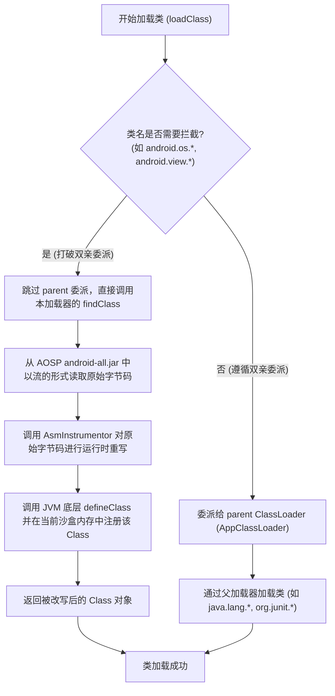
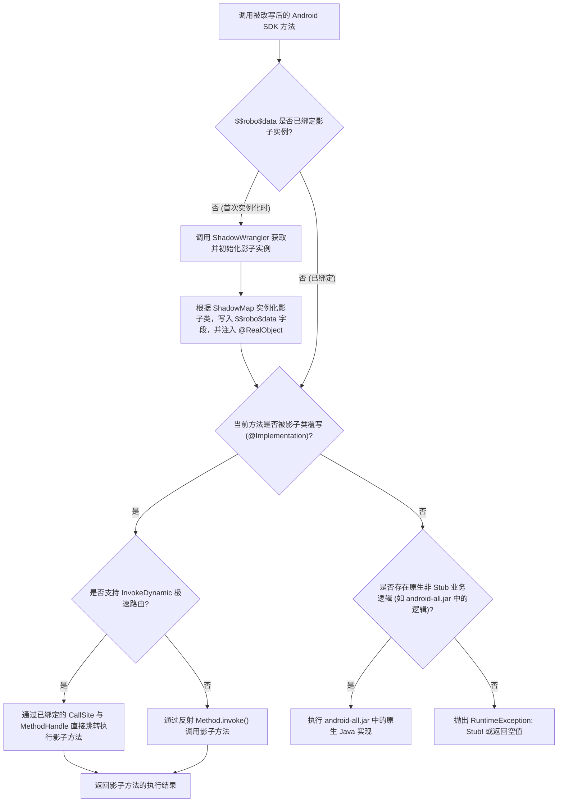

# 5.3.7.2 Robolectric 底层原理与源码级设计专著

在 Android 开发的工程实践中，单元测试是保障代码质量、驱动敏捷重构的核心物理基石。然而，由于 Android 系统独特的运行机制及其对特定硬件、原生 Native 库（.so）和系统服务的重度依赖，本地单元测试在很长一段时间内都面临着极高的运行壁垒。[Robolectric](file:///Users/lizhiyang/Desktop/AndroidKnowledge/docs/5.Android/5.3.主流三方开源库/5.3.7.调试测试与工具/5.3.7.2.Robolectric.md) 测试框架的诞生，打破了这种本地测试的僵局。它通过在运行时拦截并重构 Android SDK 的字节码，实现了在开发机普通的 Java 虚拟机（JVM）上无缝模拟 Android 运行环境的壮举。

本专著将作为 Robolectric Mechanics Writer，以学术型技术作家的视角，从底层虚拟机架构差异、类加载拦截、ASM 字节码重写、沙盒隔离机制、动态分发哲学等维度，深度剖析 Robolectric 的底层原理与源码级设计。

---

## 一、 本地单元测试的物理阻碍与 RuntimeException: Stub! 崩溃本质

### 1. Dalvik/ART 运行期与通用 JVM 运行期的差异
要彻底理解 Robolectric 的存在价值，首先必须从底层硬件和虚拟机架构层面，对比 Dalvik/ART 运行期与通用 JVM（如 macOS/Windows 上的 OpenJDK）的物理屏障。

#### (1) 寄存器架构与栈架构的本质碰撞
通用的 Java 虚拟机（JVM）采用的是**基于栈（Stack-based）的架构**。在 JVM 字节码中，指令（如 `iload`, `istore`, `iadd`）通常是无地址或一地址的，它们依赖于一个“操作数栈”（Operand Stack）来临时存储和流转中间计算结果。例如，进行一次简单的加法，JVM 需要先将两个数压入栈顶，执行加法指令，再将结果从栈顶弹出存入局部变量表。这种架构设计简单，易于在不同 CPU 架构上进行解释和编译，但其代价是指令条数较多，且频繁的入栈出栈操作会带来一定的内存访问开销。

相比之下，Android 系统的 Dalvik 虚拟机以及现代的 ART（Android Runtime）虚拟机采用的是**基于寄存器（Register-based）的架构**。它们的指令集直接面向虚拟寄存器进行寻址，类似于真实的物理 CPU（如 ARM、x86）。在 Dalvik/ART 字节码中，单条指令可以明确指定源寄存器和目标寄存器（如 `add-int v0, v1, v2`）。这种设计使得相同逻辑的指令条数比 JVM 减少 30% 以上，大大降低了指令解析的开销，且避免了频繁的栈操作，极为契合移动设备 CPU 缓存小、主频低、电量受限的特点。

由于这两种虚拟机的指令集体系、寄存器模型存在天然的物理差异，直接把 Dalvik 优化后的 DEX 字节码放入通用 JVM 中是根本无法解析和运行的。

#### (2) 运行期编译与优化机制的鸿沟
在 Android 系统中，ART 虚拟机在应用安装或空闲时，会利用 `dex2oat` 工具将 DEX 字节码编译为本地机器码（ELF 格式的 OAT 文件）。而在 Android 7.0 (链接到 `[AndroidVersionChangeLog.md](file:///Users/lizhiyang/Desktop/AndroidKnowledge/AndroidVersionChangeLog.md)`) 引入了 JIT（Just-In-Time）编译器与 AOT（Ahead-Of-Time）结合的混合编译模式：应用在安装时不再进行全量 AOT 编译，而是在运行时通过 JIT 收集热点代码的 Profile 信息，当设备空闲且充电时，系统会背景运行 `dex2oat` 根据 Profile 配置文件对热点代码进行 AOT 编译。

这一整套高度依赖物理操作系统调度、文件系统权限（如 `/data/dalvik-cache/`）以及 ARM 本地指令优化的机制，在普通的 JVM（其自身拥有一套基于 HotSpot 的 JIT 编译和 C1/C2 优化器）上是完全无法模拟的。强行在 JVM 上加载 AOSP 的 native 实现，就意味着要在 JVM 的运行时进程中模拟整个 Android 的系统进程空间和内存映射管理，这在物理上是不切实际的。

#### (3) 文件格式的物理差异与常量池物理重构
JVM 加载运行的最小单元是 `.class` 文件。每个 `.class` 文件都拥有独立的常量池（Constant Pool），存储了该类所需的类名、方法名、字段名以及字面量。这种结构虽然便于类的独立分发和动态加载，但在移动设备上会导致极大的空间浪费（例如多个类中重复出现相同的字符串常量、方法签名等）。

Android 编译器（如 `d8` / `dx`）在构建 APK 时，会执行一次“常量池合并去重”操作。它将所有的 `.class` 文件重构并融合成一个统一的 `classes.dex` 文件。在 DEX 文件中，所有的常量、类型描述符、方法声明都被提取到全局的索引表中，所有的类共享这一个全局常量池。这种物理结构上的融合与重新排布，使得 JVM 无法直接加载和读取 DEX 文件，必须通过特定的解析和转换机制才能在内存中还原类的结构。

#### (4) JNI 桥接与 Native 层的硬件绑定
Android 框架层（如图形渲染、音视频编解码、硬件服务交互等）高度依赖底层的 Native C++ 代码。例如，`android.graphics.Canvas` 实际上只是一个 Java 壳，其绘制操作最终通过 JNI（Java Native Interface）调用了底层的 Skia 图形引擎；`android.os.Binder` 的跨进程通信也必须依赖底层的 Linux 内核 Binder 驱动程序。

在普通的 JVM 开发机环境（如 macOS 或 Windows）中，这些 Native 二进制库（.so 文件）面临以下物理屏障：
- **CPU 架构不匹配**：大部分 Android 设备的 .so 库是针对 ARM（armeabi-v7a, arm64-v8a）架构编译的，而开发机通常是 x86_64 或 ARM64 桌面级架构。
- **系统调用缺失**：JVM 上没有 Android 专属的 Bionic C 库（Android 优化的标准 C 库），更缺乏 Binder 驱动程序设备节点（`/dev/binder`）、硬件抽象层（HAL）以及相关的系统守护进程（如 `servicemanager`、`system_server`）。
一旦 JVM 在执行过程中遇到了 Android SDK 的 native 方法调用，而又无法装载对应的 native 动态链接库时，便会立刻抛出 `java.lang.UnsatisfiedLinkError`。

---

### 2. 编译期与运行期的物理分离：android.jar (Stub Jar) 的起源与定位
在 Android 工程的日常开发中，我们在本地 IDE（如 Android Studio）中编写代码时，可以正常导入 `android.os.Bundle`、`android.view.View` 等类，且编译器不会报错。但在本地直接运行 JUnit 测试时，却会直接崩溃并抛出 `java.lang.RuntimeException: Stub!`。要理解这一本质，必须深度解密 `android.jar`（Stub Jar）的构造与定位。

#### (1) Stub Jar 的起源
为了避免将庞大的 Android 系统镜像（包含全部 Java 字节码和底层 Native 实现，体积达数 GB）打包进开发者的开发机中，并且为了将编译环境与运行环境隔离开，Google 在 Android SDK 中提供了一个被称为“桩”（Stub）的依赖包——`android.jar`。这个 Jar 包存放在本地 SDK 目录的 `platforms/android-XX/` 路径下。

当 Android Gradle Plugin (AGP) 编译项目时，它会将这个 `android.jar` 注入到 Java 编译器的 Classpath 中。这样，编译器就能通过静态类型检查，知道 `android.content.Context` 确实存在某个名为 `getSystemService` 的方法，并能够顺利生成相应的 `.class` 文件。

#### (2) Stub Jar 的物理构造剖析
如果我们使用字节码反编译工具解剖 `android.jar`，会发现其物理骨架十分奇特：
- 所有公开的类（Class）、接口（Interface）、枚举（Enum）以及它们的公共方法、保护方法、字段签名都是完备的。
- 所有的非抽象方法，其方法体都被清空了，取而代之的是统一的、极其简短的字节码指令：

```
0: new           #2                  // class java/lang/RuntimeException
3: dup
4: ldc           #3                  // String Stub!
6: invokespecial #4                  // Method java/lang/RuntimeException."<init>":(Ljava/lang/String;)V
9: athrow
```

无论是 `View` 的构造函数，还是 `Bundle.putInt()` 方法，其内部实现全部统一为 `throw new RuntimeException("Stub!");`。这就是 Stub Jar 的物理本质。

#### (3) 物理分离的收益与本地运行崩溃的死结
这种设计让 Android 开发能够享受编译期的轻量化和极速静态检查。在真机或模拟器运行期，系统的 ClassLoader 会加载设备 ROM 内部真正的 `framework.jar`（由 Dalvik/ART 优化并真正实现了系统逻辑的 DEX 文件），从而替换掉编译期的 Stub 类，确保应用正常执行。

然而，在本地单元测试中，如果我们直接启动普通的 JVM 运行 JUnit，JVM 的类加载器会直接将编译期依赖的 Stub `android.jar` 加载到 JVM 内存中。当测试代码或被测业务逻辑触及任何 Android SDK 的方法时，Stub Jar 的方法体被触发，抛出 RuntimeException，导致本地测试彻底瘫痪。

---

### 3. 真机 Instrumentation Test 的物理痛点
在 Robolectric 出现之前，开发者为了避开 `RuntimeException: Stub!` 崩溃，只能将测试代码编写为 **Instrumentation Test**（真机/模拟器测试）。然而，这种运行在真实 Android 物理环境中的测试机制，在工程效率上有着致命的物理痛点：

#### (1) 漫长且繁重的部署与执行周期
运行一次 Instrumentation测试，其底层的流转过程极其冗长：
1. **编译期构建**：编译业务代码与测试代码，生成两个独立的 APK（宿主 APK 和测试 APK）。
2. **物理传输**：通过 ADB（Android Debug Bridge）通道，将两个 APK 推送到连接的真机或模拟器。
3. **安全安装**：在 Android 系统中调用 `pm install` 释放 APK，执行包校验、签名验证、DEX 优化等一系列耗时操作。
4. **测试拉起**：通过 ADB 命令向系统发送指令，启动 `am instrument`。
5. **物理执行**：Android 系统通过 `AndroidJUnitRunner` 创建一个物理测试进程，并为该进程注入 Instrumentation 钩子，通过 Binder IPC 回调启动测试用例。
6. **结果回传**：测试结果通过 Binder 收集，转换为 XML/JSON 流，通过 ADB 管道回传到宿主机开发机上。
7. **物理清理**：测试结束后，调用 `pm uninstall` 卸载测试和宿主应用，清理沙盒数据。

在这一系列复杂的物理流转中，打包、安装和物理进程的冷启动占用了超过 90% 的执行时间。即使测试一个简单的字符串拼接或 Null 校验，也需要耗费数分钟的等待，这严重破坏了开发者的编码心流，让极限编程（XP）和测试驱动开发（TDD）变得举步维艰。

#### (2) CI/CD 物理限制、冷启动开销与 IPC 通信瓶颈
在持续集成（CI/CD）流水线中，Instrumentation 测试的局限性被无限放大：
- **物理资源高负荷**：CI 服务器必须配备高性能的物理显卡或海量内存，以维持 Android 虚拟设备（AVD）的无头（Headless）运行。AVD 进程的冷启动和运行极其吃 CPU 和内存，容易造成 CI 执行器排队或 OOM 崩溃。
- **并发能力受限**：由于多个测试用例并发运行时，共享了同一个 Android 系统的物理状态（例如系统的 `Settings` 提供者、全局的 `SharedPreferences` 存储文件、同一个 SQLite 数据库等），这会导致并行的测试线程产生数据交叉污染，进而引发大量偶发性、难以重现的随机失败（Flaky Tests）。
- **Binder 通信的 IPC 损耗**：所有的测试指令和生命周期控制都需要通过 Binder 进行跨物理进程的 IPC 通信，这在高并发测试场景下会带来显著的时间开销和死锁隐患。

---

## 二、 偷天换日：Shadow（影子类）机制与其动态代理哲学

为了解决上述物理阻碍，Robolectric 提出了 **Shadow（影子）** 机制。其核心哲学是在不修改 Android SDK 原始 Stub 字节码物理文件的基础之上，在 JVM 运行时内存中，将所有对 Android SDK 类的调用动态拦截并重定向到一套纯 Java/Kotlin 实现的影子类（Shadow Class）中，从而模拟出高度逼真的 Android 运行时行为。

---

### 1. Shadow 影子类机制的本质
#### (1) 运行时劫持与状态重写
当我们的业务代码执行 `new Intent(context, MainActivity.class)` 时，Robolectric 不会去阻止这个原生 `Intent` 对象的实例化。但是，在运行时，这个 `Intent` 对象的内部状态和方法调用已经被全面劫持。
Robolectric 提供了一套与 Android SDK 关键类一一对应的“影子类”库（通常位于 `org.robolectric.shadows` 包下）。例如：
- `android.content.Intent` 对应 `org.robolectric.shadows.ShadowIntent`
- `android.os.Bundle` 对应 `org.robolectric.shadows.ShadowBundle`
- `android.view.View` 对应 `org.robolectric.shadows.ShadowView`

每个影子类中都包含了使用普通 JVM 代码实现的对应 Android 类的行为逻辑。例如，`ShadowIntent` 内部会维护一个 `java.lang.Class` 类型的字段来记录目标 Component，维护一个 Map 来记录 Extra 数据。当原生 `Intent` 的方法被调用时，控制权会被重定向到 `ShadowIntent` 的相应方法中，直接读取或修改影子对象内的模拟状态。

#### (2) 影子类的命名与物理绑定映射表
影子类与原生类映射并非依赖静态的类继承关系，而是通过声明式的注解完成绑定。例如，`ShadowIntent` 的类头部会标记：

```java
@Implements(Intent.class)
public class ShadowIntent { ... }
```

在测试启动的初始化阶段，Robolectric 会扫描影子库中的所有 `@Implements` 注解，并在内存中构建一个全局的影子映射表（[ShadowMap](file:///Users/lizhiyang/Desktop/AndroidKnowledge/docs/5.Android/5.3.主流三方开源库/5.3.7.调试测试与工具/5.3.7.2.Robolectric.md#ShadowMap)）。当某个 Android 原生类被加载时，该映射表会被提供给字节码重写器，以决定如何拦截该类的方法。

---

### 2. 拦截与重定向哲学：为什么传统的 AOP、JDK 动态代理、CGLIB 无法解决 Android SDK 的拦截问题
为了凸显 ClassLoader 级字节码重写的物理唯一性，我们需要对比分析传统 Java 拦截技术在此处的失效原因。

| 拦截技术 | 实现机制 | 对 Concrete Class 的支持 | 对 Final 类/方法的支持 | 对 Static 方法的支持 | 对 Native 方法的支持 | 物理死穴 |
| :--- | :--- | :--- | :--- | :--- | :--- | :--- |
| **JDK 动态代理** | 基于接口生成动态代理类 | ❌ 仅支持接口，Android 核心组件均为具体类 | ❌ 无法代理 final 方法 | ❌ 静态方法不参与接口分发 | ❌ 无法拦截 native 关键字 | 无法代理 Concrete Class，而 Android 核心 API 几乎全是 Concrete Class |
| **CGLIB** | 动态生成目标类的子类并覆写方法 | Class 级别 | ❌ JVM 严禁重写 final 类或 final 方法 | ❌ 静态方法无法被重写 | ❌ 无法移除 native 关键字 | 无法突破 Android SDK 中大量的 `final` 关键字以及 `static` 辅助方法的物理屏障 |
| **AspectJ (AOP)** | 编译期/加载期切面织入 | Class 级别 | ❌ 无法覆写 final 类/方法 | ❌ 无法织入并拦截没有 Java 实现体的 native 方法 | 无法抹去方法的 native 声明，JVM 找不到 C++ 符号仍会崩溃 |
| **ClassLoader 字节码重写** | 拦截 ClassLoader 加载，直接在内存中改写字节码 | Class 级别 | ✔️ 运行时动态抹除 final | ✔️ 动态织入拦截调用 | ✔️ 抹除 native，生成拦截方法体 | 无。是目前唯一能全面接管 Android 核心库拦截的通路 |

#### (1) JDK 动态代理的致命死穴
JDK 动态代理（`java.lang.reflect.Proxy`）在运行时要求目标类必须实现一个或多个接口。然而，Android 系统的核心基类（如 `android.view.View`、`android.app.Activity`）全都是高度耦合的具体类（Concrete Class）。我们不可能强行让这些类去实现某个测试接口，因而 JDK 代理在此完全无用武之地。

#### (2) CGLIB 的 final 与 static 壁垒
CGLIB 是基于 ASM 字节码技术，通过在内存中创建目标类的子类（Subclass）并覆写（Override）方法来达到拦截目的的。但这在 Android 系统类上遇到了物理红线：
- **final 拦截阻碍**：Android 系统为了性能优化和防止恶意篡改，将大量核心类和核心方法声明为 `final`（如 `android.widget.TextView` 的很多测量方法，或是 `android.os.Environment` 等）。在 JVM 规范中，任何企图继承 `final` 类或覆写 `final` 方法的操作，都会在 Class 载入校验（Verification）阶段被抛出 `VerifyError`，或者直接编译失败。
- **静态方法（static）无法继承**：静态方法是绑定在 Class 类型上的，而不是实例对象上的，它们不具备多态特性，因此 CGLIB 生成的子类根本无法拦截对父类静态方法（如 `LayoutInflater.from()`）的直接调用。

#### (3) 传统 AOP (AspectJ) 对 Native 物理屏障的无能为力
传统的 AOP 技术虽然可以通过织入（Weaving）插入前置或后置通知，但它改变不了方法本身的修饰符。
Android 系统中存在海量的 `native` 方法（例如 `SystemClock.elapsedRealtime()`、`Binder.transactNative()` 等），这些方法在 Stub Jar 中同样声明为 `native`。如果仅仅使用 AOP 织入，JVM 在执行该方法时仍然会通过 JNI 规范去查找宿主机操作系统的动态链接库。由于本地 JVM 上没有任何对应的 `.dylib` 或 `.dll` 符号，JVM 必将抛出 `UnsatisfiedLinkError` 崩溃。

#### (4) 结论：ClassLoader 级字节码重写是唯一的通路
为了在 JVM 上完美运行 Android SDK 代码，唯一的出路就是在**类加载阶段（Class Loading Time）**，对 Android 核心类的字节码进行彻底重写（Bytecode Instrumentation）。这就是 [SandboxClassLoader](file:///Users/lizhiyang/Desktop/AndroidKnowledge/docs/5.Android/5.3.主流三方开源库/5.3.7.调试测试与工具/5.3.7.2.Robolectric.md#SandboxClassLoader) 与 [AsmInstrumentor](file:///Users/lizhiyang/Desktop/AndroidKnowledge/docs/5.Android/5.3.主流三方开源库/5.3.7.调试测试与工具/5.3.7.2.Robolectric.md#AsmInstrumentor) 诞生的物理基础。

---

## 三、 SandboxClassLoader 运行时字节码重写与拦截分发

这是整个 Robolectric 框架的核心物理心脏。当测试开始运行，[SandboxClassLoader](file:///Users/lizhiyang/Desktop/AndroidKnowledge/docs/5.Android/5.3.主流三方开源库/5.3.7.调试测试与工具/5.3.7.2.Robolectric.md#SandboxClassLoader)、[AsmInstrumentor](file:///Users/lizhiyang/Desktop/AndroidKnowledge/docs/5.Android/5.3.主流三方开源库/5.3.7.调试测试与工具/5.3.7.2.Robolectric.md#AsmInstrumentor) 以及 [ShadowWrangler](file:///Users/lizhiyang/Desktop/AndroidKnowledge/docs/5.Android/5.3.主流三方开源库/5.3.7.调试测试与工具/5.3.7.2.Robolectric.md#ShadowWrangler) 协同作战，在内存中完成了一次次精妙的“换脑”手术。

---

### 1. 突破双亲委派机制的 SandboxClassLoader
根据 JVM 的类加载器双亲委派模型（Parent Delegation Model），当一个类加载器收到类加载请求时，它首先会将该请求委派给父类加载器，只有当父类加载器反馈无法加载该类时，子类加载器才会尝试自己去加载。

```
Bootstrap ClassLoader (加载 JVM 核心基础类，如 java.lang.*)
       ▲
Platform ClassLoader (Java 9+ 扩展类加载器)
       ▲
System / App ClassLoader (加载编译路径下的所有 Stub android.jar 以及测试代码)
       ▲
SandboxClassLoader (Robolectric 自定义沙盒加载器，打破委派链)
```

如果严格遵循此模型，当我们在测试代码中引用 `android.os.Bundle` 时，请求会一路上抛给 `AppClassLoader`。由于编译 Classpath 中包含 Stub `android.jar`，`AppClassLoader` 会成功找到并加载 Stub 版本的 `Bundle`，最终不可避免地导致 Stub 运行时崩溃。

为了打破这一防线，Robolectric 实现了自定义的 `SandboxClassLoader`。下面是它的双亲委派突破与类拦截流程图：



#### (1) SandboxClassLoader 的核心拦截机制
`SandboxClassLoader` 通过覆写 `loadClass(String name, boolean resolve)` 方法打破了常规的委派机制：
- **包名白名单拦截**：它内部维护了一个需要被 Instrument（改写）的类包名列表（如 `android.`、`com.android.internal.`、`dalvik.`、`libcore.` 等）。
- **拦截流程**：当遇到需要拦截的类时，它会跳过 `parent.loadClass()` 的调用，转而直接调用自身的 `findClass(String name)` 方法。
- **放行流程**：对于不需要拦截的类（例如 JVM 自带的核心类 `java.`，测试框架自身的类 `org.junit.` 等），它依然老老实实地委托给 `parent` 加载。

#### (2) 仿真 SandboxClassLoader 拦截加载核心源码实现
为了帮助读者建立对类拦截流程的直观与源码级理解，以下提供了一个仿真的 `SandboxClassLoader` 的 Java 核心代码实现。该示例展示了拦截判断、反双亲委派、以及内存字节码改写加载的全过程：

```java
package org.robolectric.internal.bytecode;

import java.io.IOException;
import java.util.HashSet;
import java.util.Set;

/**
 * 仿真 SandboxClassLoader 核心拦截实现。
 * 通过在 loadClass 阶段破坏常规的双亲委派模型，强制将特定包名的 Android 类交由自身 findClass 加载，
 * 并在 findClass 中调用 AsmInstrumentor 实施运行时字节码重写后通过 defineClass 载入 JVM。
 */
public class SandboxClassLoader extends ClassLoader {
    private final ClassLoader parent;
    private final Set<String> interceptedPackages = new HashSet<>();
    private final AsmInstrumentor instrumentor;
    private final JarFileProvider sdkJarProvider; // 用于读取 AOSP android-all.jar

    public SandboxClassLoader(ClassLoader parent, AsmInstrumentor instrumentor, JarFileProvider sdkJarProvider) {
        super(parent);
        this.parent = parent;
        this.instrumentor = instrumentor;
        this.sdkJarProvider = sdkJarProvider;
        
        // 初始化需要拦截的 Android 核心依赖包前缀
        interceptedPackages.add("android.");
        interceptedPackages.add("com.android.internal.");
        interceptedPackages.add("androidx.");
        interceptedPackages.add("libcore.");
    }

    /**
     * 重写 loadClass 方法，实现打破双亲委派的核心逻辑
     */
    @Override
    protected Class<?> loadClass(String name, boolean resolve) throws ClassNotFoundException {
        synchronized (getClassLoadingLock(name)) {
            // 1. 首先检查这个类是否已经在当前 SandboxClassLoader 中加载过
            Class<?> clazz = findLoadedClass(name);
            if (clazz != null) {
                return clazz;
            }

            // 2. 检查类名是否在需要拦截的白名单包名范围内
            if (shouldIntercept(name)) {
                try {
                    // 打破双亲委派机制：直接跳过 parent，调用自身的 findClass()
                    clazz = findClass(name);
                    if (resolve) {
                        resolveClass(clazz);
                    }
                    return clazz;
                } catch (ClassNotFoundException e) {
                    // 若拦截加载失败，则退回到普通的双亲委派，防止由于 ClassNotFound 导致测试中途崩溃
                }
            }

            // 3. 非拦截包名（如 java.lang.*，JUnit 核心类，或是第三方测试库），遵循双亲委派委托给父类加载器
            return super.loadClass(name, resolve);
        }
    }

    /**
     * 打破双亲委派后，自主寻找、重写并定义该类
     */
    @Override
    protected Class<?> findClass(String name) throws ClassNotFoundException {
        // 4. 避免 SecurityException：JVM 严禁自定义类加载器定义以 "java." 开头的类
        if (name.startsWith("java.")) {
            return parent.loadClass(name);
        }

        try {
            // 5. 从 AOSP 真实的 android-all.jar 中以二进制字节流形式提取原始的未改写字节码
            byte[] rawBytes = sdkJarProvider.getClassBytes(name);
            if (rawBytes == null) {
                throw new ClassNotFoundException("Could not find class file for: " + name);
            }

            // 6. 调用 AsmInstrumentor 传入原始字节码，并在内存中完成影子分发字节码注入
            byte[] instrumentedBytes = instrumentor.instrument(rawBytes, name);

            // 7. 调用 JVM 原生的 defineClass 注册到 JVM 当前沙盒内存中
            return defineClass(name, instrumentedBytes, 0, instrumentedBytes.length);
        } catch (IOException e) {
            throw new ClassNotFoundException("Failed to read class bytes for: " + name, e);
        } catch (Exception e) {
            throw new ClassNotFoundException("Failed to instrument class: " + name, e);
        }
    }

    /**
     * 判断类名是否属于需要拦截的包前缀范围
     */
    private boolean shouldIntercept(String name) {
        for (String pkg : interceptedPackages) {
            if (name.startsWith(pkg)) {
                return true;
            }
        }
        return false;
    }
}
```

#### (3) 避免 SecurityException 的沙盒安全边界
JVM 拥有极其严格的类安全沙盒策略。对于 `java.` 包名下的类（如 `java.lang.String`、`java.lang.Object`），JVM 规定只能由引导类加载器（Bootstrap ClassLoader）进行加载 and 定义。任何自定义的类加载器（即使是 `SandboxClassLoader`）如果企图通过 `defineClass` 在内存中定义 `java.` 开头的类，JVM 会在运行时立刻抛出 `java.lang.SecurityException: Prohibited package name: java.lang`。
因此，`SandboxClassLoader` 在重写 `loadClass` 时，必须进行严苛的特例放行过滤，决不能染指 JVM 自身的基类。

---

### 2. ASM 动态字节码改写（AsmInstrumentor）
一旦 `SandboxClassLoader` 拦截到了目标 Android 类的字节码读取请求，它首先会通过 `JarFileProvider` 从 Robolectric 专用的 AOSP SDK（即物理的 `android-all.jar`，其中包含了 Android 框架层真实的 Java Class 字节码，非 Stub 桩代码）中以字节流的形式读取出原始字节码。

随后，这串原始的 `byte[]` 字节流会被传入 [AsmInstrumentor](file:///Users/lizhiyang/Desktop/AndroidKnowledge/docs/5.Android/5.3.主流三方开源库/5.3.7.调试测试与工具/5.3.7.2.Robolectric.md#AsmInstrumentor) 进行运行时重写。AsmInstrumentor 主要实施以下三大重构策略：

#### (1) ASM 访问者设计模式与事件流重构
在 `AsmInstrumentor` 中，ASM 库通过事件驱动的“访问者模式”（Visitor Pattern）对 Class 的二进制流进行解析和改写。
当 `SandboxClassLoader` 读取了原始字节码后，它会构建一个 `ClassReader` 实例。`ClassReader` 负责解析字节码的结构（包括魔数 Magic Number、版本号、常量池、访问标志、类索引、字段表、方法表等），并将这些结构转化为一系列的“事件”发射出去。

Robolectric 自定义的 `ClassInstrumentor` 会作为 `ClassVisitor` 拦截这个事件流。当 `ClassReader` 触发“遇到字段”事件时，`ClassVisitor` 会在此处拦截，并在事件流的末尾通过 `visitField` 主动发射一个新事件，从而在字节码中凭空注入 `$$robo$data` 字段。
当遇到方法时，`ClassVisitor` 会返回一个自定义的 `MethodVisitor`。这个 `MethodVisitor` 拦截并覆写了 `visitCode` 和 `visitInsn` 等方法。`visitCode` 代表方法的入口。在这里，`MethodVisitor` 会通过调用 `visitVarInsn(ALOAD, 0)`、`visitLdcInsn(methodSignature)` 以及 `visitMethodInsn(INVOKESTATIC, "ShadowWrangler", "shouldCallPlayBack", ...)` 这一系列事件，直接在方法的最头部织入拦截指令。

最后，这些修改后的事件流被传递给 `ClassWriter`。`ClassWriter` 继承自 `ClassVisitor`，它负责接收这些改写后的事件，重新计算类的方法区大小、最大栈深度（Max Stack Size）以及局部变量表大小（Max Locals），并重新将事件流编码为标准的 `.class` 二进制字节数组（`byte[]`）。在这个过程中，Robolectric 启用了 `ClassWriter.COMPUTE_FRAMES` 和 `ClassWriter.COMPUTE_MAXS` 选项，让 JVM 在编译生成字节码时自动计算 Stack Map Table（栈图），避免了人工重构复杂的字节码跳转分支时因偏移量计算错误而导致 JVM 类校验器抛出 `ClassFormatError` 或 `VerifyError`。

#### (2) 策略一：成员变量注入（$$robo$data 状态纽带）
为了在 Android 原生实例和影子实例之间建立持久的一对一关联，[AsmInstrumentor](file:///Users/lizhiyang/Desktop/AndroidKnowledge/docs/5.Android/5.3.主流三方开源库/5.3.7.调试测试与工具/5.3.7.2.Robolectric.md#AsmInstrumentor) 会利用 ASM 的 `ClassVisitor.visitField` 方法，在当前被加载的 Android 类中强行注入一个字段：

```java
public Object $$robo$data;
```

这个字段在编译期是不存在的，它纯粹是在运行时由 ClassLoader 动态写入的。它的作用是作为一个强引用，保存该原生实例对应的影子实例对象，成为状态分发的纽带。

#### (3) 策略二：方法头部拦截与重定向（Interception Routing）
[AsmInstrumentor](file:///Users/lizhiyang/Desktop/AndroidKnowledge/docs/5.Android/5.3.主流三方开源库/5.3.7.调试测试与工具/5.3.7.2.Robolectric.md#AsmInstrumentor) 通过 `MethodVisitor` 拦截类中的每一个方法（除抽象方法外），并对其指令集进行改造。
针对 `native` 方法，它会先通过 ASM 修改该方法的访问标志符（Access Flags），擦除 `ACC_NATIVE`，使其变成普通的 Java 方法。
对于所有被拦截的方法，在其方法体的最前端（字节码偏移量 0 处），强行注入一段跳转和拦截代码。其底层的 JVM 字节码指令流推演如下：

```
// 1. 加载当前原生对象实例 (this) 到栈顶，如果是静态方法，则压入 null
0: aload_0          

// 2. 将当前方法的唯一签名信息作为常数压入栈顶
1: ldc           #12                 // String "android/view/View/setOnClickListener(Landroid/view/View$OnClickListener;)V"

// 3. 调用 ShadowWrangler 的静态判定方法，判断是否需要拦截该方法
3: invokestatic  #18                 // Method org/robolectric/internal/bytecode/ShadowWrangler.shouldCallPlayBack:(Ljava/lang/Object;Ljava/lang/String;)Z

// 4. 若返回 false (0)，说明不需要拦截，执行跳转指令，跳过拦截逻辑，继续执行原方法体
6: ifeq          28                  // 跳转至原本的方法体起始偏移量 28 处

// 5. 若返回 true (1)，开始构建参数数组并调用拦截器
9: aload_0
10: ldc           #22                 // String "setOnClickListener"
12: iconst_1                          // 准备一个长度为 1 的数组存储参数
13: anewarray     #4                  // Object 数组
16: dup
17: iconst_0
18: aload_1                          // 将第一个参数 (OnClickListener) 存入数组
19: aastore
20: invokestatic  #26                 // Method org/robolectric/internal/bytecode/ShadowWrangler.intercept:(Ljava/lang/Object;Ljava/lang/String;[Ljava/lang/Object;)Ljava/lang/Object;

// 6. 对拦截器返回的结果进行类型转换，并执行 return，阻断原方法体的执行
23: checkcast     #28                 // 类型转换检查
26: areturn                           // 返回对象，方法结束

// 7. 以下是原本的方法体字节码起始处
28: ... 原本的方法体逻辑 (或是 Stub 抛出异常的代码) ...
```

这段字节码指令在运行时能够起到完美的拦截防线作用：一旦满足拦截条件，直接在第 26 步通过 `areturn` 返回，原本保存在 Stub Jar 中用来抛出 Stub 崩溃异常的第 28 步指令根本没有机会执行。

#### (4) 策略三：构造方法劫持与双向绑定
对于构造方法 `<init>`，字节码重写必须极其小心。根据 JVM 规范，构造函数体内必须先执行 `super()` 或 `this()` 初始化，在此之前，局部变量中的 `this` 处于“未初始化”状态（Uninitialized This），不允许对其进行任何方法调用或字段赋值，否则会发生 `VerifyError` 崩溃。

因此，[AsmInstrumentor](file:///Users/lizhiyang/Desktop/AndroidKnowledge/docs/5.Android/5.3.主流三方开源库/5.3.7.调试测试与工具/5.3.7.2.Robolectric.md#AsmInstrumentor) 会在 `INVOKESPECIAL`（调用父类构造函数）指令执行完毕之后，立刻在字节码中插入以下劫持指令：
1. 载入当前已初始化的 `this` 实例。
2. 调用 `ShadowWrangler.onConstructorStart(this, ...)`。
3. `ShadowWrangler` 在此方法中，会通过反射实例化对应的影子类，并将其赋值给原生对象的 `$$robo$data` 字段。
4. 随后，它扫描影子对象，如果影子类中声明了带有 `@RealObject` 注解的字段，它会将当前的 `this` 强行反射注入到影子实例的该字段中。这就优雅地在字节码层面实现了双向绑定的闭环。

---

### 3. 物理绑定与动态反射/InvokeDynamic 分发
在经历了 ASM 字节码重写后，原生 Android SDK 类（以 `android.view.View` 为例）在内存中的结构发生了脱胎换骨的变化。

#### (1) View 类改写前后的伪代码对比

```java
// 改写前 (Stub Jar 中的 View.class 结构)
public class View {
    public void setOnClickListener(OnClickListener l) {
        throw new RuntimeException("Stub!");
    }
}
```

```java
// 改写后 (经过 AsmInstrumentor 改写并在内存中加载的 View.class 结构)
public class View {
    // 物理注入的影子绑定字段
    public Object $$robo$data;

    public void setOnClickListener(OnClickListener l) {
        // 1. 运行时方法拦截与分发决策
        if (ShadowWrangler.shouldCallPlayBack(this, "android/view/View/setOnClickListener(Landroid/view/View$OnClickListener;)V")) {
            // 通过 ShadowWrangler 将方法参数和实例路由至对应的影子方法中执行
            ShadowWrangler.intercept(this, "setOnClickListener", new Object[]{l});
            return; // 拦截成功后直接返回，屏蔽原 Stub 逻辑
        }
        
        // 2. 若不满足拦截条件，退回到 Stub 逻辑（本地运行依然崩溃）
        throw new RuntimeException("Stub!");
    }
}
```

#### (2) ASM 字节码影子分发决策流程图
为了清晰展示运行时方法是如何路由到影子的，以下是影子方法分发的决策流程图：



#### (3) 仿真 ShadowWrangler 影子分发核心源码实现
为了在代码级别阐明拦截后如何通过 `ShadowWrangler` 将调用分发给相应的影子方法，以及原生实例与影子实例是如何进行双向绑定与反射调用的，以下提供了一个高仿真的 `ShadowWrangler` 影子分发核心 Java 源码实现：

```java
package org.robolectric.internal.bytecode;

import org.robolectric.annotation.RealObject;
import java.lang.invoke.MethodHandle;
import java.lang.invoke.MethodHandles;
import java.lang.invoke.MethodType;
import java.lang.reflect.Field;
import java.lang.reflect.Method;
import java.util.Map;
import java.util.concurrent.ConcurrentHashMap;

/**
 * 仿真 ShadowWrangler 影子方法分发核心器。
 * 负责解析原生类对应的影子映射、维护原生实例 $$robo$data 与影子实例的一对一绑定，
 * 并将原生方法的拦截调用精准直连路由到影子的 @Implementation 方法中。
 */
public class ShadowWrangler {
    private static final ShadowWrangler INSTANCE = new ShadowWrangler();
    private final ShadowMap shadowMap = new ShadowMap(); // 内存影子注册表映射
    private final Map<String, MethodHandle> methodHandleCache = new ConcurrentHashMap<>();

    public static ShadowWrangler getInstance() {
        return INSTANCE;
    }

    /**
     * 由被改写的 Android SDK 类静态调用，判断当前方法是否需要拦截路由
     */
    public static boolean shouldCallPlayBack(Object instance, String methodSignature) {
        if (instance == null) return false;
        Class<?> rawClass = instance.getClass();
        
        // 检索影子注册表中，该原生类是否有已注册的影子方法实现
        return INSTANCE.shadowMap.hasShadowMethod(rawClass, methodSignature);
    }

    /**
     * ASM 拦截的最终分发枢纽。
     * 当 shouldCallPlayBack 返回 true 时，方法头部会转而调用本方法获取影子的执行返回值。
     */
    public static Object intercept(Object instance, String methodName, Object[] args) throws Throwable {
        Class<?> rawClass = instance.getClass();
        Class<?> shadowClass = INSTANCE.shadowMap.getShadowClass(rawClass);
        if (shadowClass == null) {
            throw new IllegalStateException("未找到对应的影子映射类: " + rawClass.getName());
        }

        // 1. 劫持原生对象的 $$robo$data 字段，获取与之绑定的影子对象实例
        Object shadowInstance = getRoboData(instance);
        if (shadowInstance == null) {
            synchronized (instance) {
                shadowInstance = getRoboData(instance);
                if (shadowInstance == null) {
                    // 2. 影子实例不存在，通过反射进行按需延迟（Lazy）实例化
                    shadowInstance = shadowClass.getDeclaredConstructor().newInstance();
                    setRoboData(instance, shadowInstance);

                    // 3. 执行双向绑定：扫描影子实例的 @RealObject 字段并将当前原生实例注入进去
                    injectRealObject(shadowInstance, instance);
                }
            }
        }

        // 4. 方法路由：根据影子类名和方法名组装缓存 Key，利用 MethodHandle 加速调用
        String cacheKey = shadowClass.getName() + "#" + methodName;
        MethodHandle methodHandle = INSTANCE.methodHandleCache.get(cacheKey);
        if (methodHandle == null) {
            // 反射解析对应影子类的 @Implementation 方法签名，并转换为极速的 MethodHandle 句柄
            methodHandle = INSTANCE.resolveMethodHandle(shadowClass, methodName, args);
            INSTANCE.methodHandleCache.put(cacheKey, methodHandle);
        }

        // 5. 将方法句柄绑定（bindTo）到当前已经初始化的影子实例上，并传入参数执行
        return methodHandle.bindTo(shadowInstance).invokeWithArguments(args);
    }

    /**
     * 利用反射读取字节码改写后注入原生类中的 $$robo$data 成员字段
     */
    private static Object getRoboData(Object instance) throws Exception {
        Field field = instance.getClass().getDeclaredField("$$robo$data");
        field.setAccessible(true);
        return field.get(instance);
    }

    /**
     * 将生成的影子对象回写注入到原生类的 $$robo$data 字段中
     */
    private static void setRoboData(Object instance, Object shadowInstance) throws Exception {
        Field field = instance.getClass().getDeclaredField("$$robo$data");
        field.setAccessible(true);
        field.set(instance, shadowInstance);
    }

    /**
     * 双向绑定核心：扫描影子实例，将原生宿主对象强行注入到标注了 @RealObject 的字段中
     */
    private static void injectRealObject(Object shadowInstance, Object realInstance) throws Exception {
        for (Field field : shadowInstance.getClass().getDeclaredFields()) {
            if (field.isAnnotationPresent(RealObject.class)) {
                field.setAccessible(true);
                field.set(shadowInstance, realInstance);
                break; // 完成注入，打破循环
            }
        }
    }

    /**
     * 动态解析影子类中的对应方法，并生成 MethodHandle
     */
    private MethodHandle resolveMethodHandle(Class<?> shadowClass, String methodName, Object[] args) throws Exception {
        Class<?>[] paramTypes = new Class<?>[args.length];
        for (int i = 0; i < args.length; i++) {
            // 简单处理：包装类型转换为基本类型，此处仅为简化演示逻辑
            paramTypes[i] = args[i] != null ? args[i].getClass() : Object.class;
        }

        // 反射寻找覆写了 @Implementation 的对应方法
        Method targetMethod = shadowClass.getDeclaredMethod(methodName, paramTypes);
        targetMethod.setAccessible(true);

        // 转换为 JVM 机器码级的 MethodHandle 句柄，以备后期复用，绕过反射开销
        MethodHandles.Lookup lookup = MethodHandles.lookup();
        return lookup.unreflect(targetMethod);
    }
}
```

#### (4) 从反射分发到 InvokeDynamic (Indy) 的性能优化革命
在 Robolectric 的早期版本（如 3.x/4.x 时代）中，所有的重定向方法分发都是通过在运行时反射调用 `Method.invoke()` 来完成的。这带来了极其显著的性能缺陷：
- **垃圾回收（GC）压力剧增**：每一次方法调用，都需要在堆内存中动态创建一个 `Object[]` 数组来包装方法参数（装箱操作），这对于界面绘制这种高频调用的方法（如 `onMeasure`、`onLayout` 可能会被调用上万次）而言，会产生海量的垃圾对象，导致 JVM 频繁发生 Minor GC 停顿（STW）。
- **方法区膨胀**：JVM 在频繁反射时，为了加速，会动态生成一些特殊的 Inflating Accessor 类并放入元空间（Metaspace），这极易引发元空间 OutOfMemoryError。
- **安全检查的 CPU 开销**：反射调用每次都需要越过 Java 语言的访问权限控制检查，耗费大量的 CPU 周期。

从现代 Robolectric 版本开始，其底层的字节码重写全面拥抱了 Java 7 引入的 **`InvokeDynamic`（Indy）** 指令：
- **Indy 指令的本质**：它允许编译器在编译期不指定具体的调用目标方法，而是将决策延迟到运行期。
- **引导方法（Bootstrap Method）的绑定**：在被改写的 Android 方法体内，ASM 不再插入 `invokestatic ShadowWrangler.intercept`，而是代之以一条 `invokedynamic` 指令，它指向一个预设的 `Bootstrap` 引导方法。
- **CallSite 极速直连**：当 JVM 首次执行到该 `invokedynamic` 指令时，会触发引导方法。引导方法向 [ShadowWrangler](file:///Users/lizhiyang/Desktop/AndroidKnowledge/docs/5.Android/5.3.主流三方开源库/5.3.7.2.Robolectric.md#ShadowWrangler) 索要目标影子方法的 `java.lang.invoke.MethodHandle`（方法句柄）。随后，JVM 会将该句柄固化在一个 `ConstantCallSite`（常量调用点）中。当后续千百次地再次执行该行代码时，JVM 会直接从 `CallSite` 中取出句柄，并在机器码层面“直达”影子类的方法，省去了方法签名解析、类型包装以及访问安全检查等全部开销。这一性能优化使得 Robolectric 本地运行数千个测试用例的时间直接缩短了数倍，彻底使其具备了在大型企业级项目 CI 流水线中落地的物理能力。

---

## 四、 Shadow 影子类的结构编写规范与 API 实战

影子类是 Robolectric 用来模拟 Android 世界的具体执行单元。了解它的结构编写规范和注解底层的解析机制，是进行高级定制和深入单元测试的必备技能。

---

### 1. 核心注解的底层运行与解析原理
Robolectric 的影子机制能够运转，完全依赖于对 `@Implements`、`@Implementation`、`@RealObject`、`@Resetter` 这四大核心注解的底层解析。

#### (1) @Implements 注解与影子注册表的加载
`@Implements` 注解用于标注在一个 Java/Kotlin 类上，声明它是一个影子类，并指定其绑定的原生类类型。例如 `@Implements(View.class)`。
在编译期间，Robolectric 的注解处理器（Annotation Processor）会扫描所有的影子类，在生成的类路径 `META-INF/services/org.robolectric.internal.ShadowProvider` 描述文件中写入所有的注册信息。
当测试容器（[Sandbox](file:///Users/lizhiyang/Desktop/AndroidKnowledge/docs/5.Android/5.3.主流三方开源库/5.3.7.2.Robolectric.md#Sandbox)）启动时，[ShadowWrangler](file:///Users/lizhiyang/Desktop/AndroidKnowledge/docs/5.Android/5.3.主流三方开源库/5.3.7.2.Robolectric.md#ShadowWrangler) 会通过 JVM 的 SPI (Service Loader) 加载所有的 `ShadowProvider`。它读取这些类映射关系，汇总成一个全局只读的 [ShadowMap](file:///Users/lizhiyang/Desktop/AndroidKnowledge/docs/5.Android/5.3.主流三方开源库/5.3.7.调试测试与工具/5.3.7.2.Robolectric.md#ShadowMap)。该 Map 记录了 `android.view.View` -> `org.robolectric.shadows.ShadowView` 这样的硬性对应关系。当 `SandboxClassLoader` 加载 `View` 类时，就能通过这个 Map 检索并实施针对性的拦截。

#### (2) @Implementation 与动态签名匹配
`@Implementation` 注解标注在影子类的方法上。被标注的方法必须在方法名、参数列表上与原生类中对应的方法完全一致。
当拦截发生时，[ShadowWrangler](file:///Users/lizhiyang/Desktop/AndroidKnowledge/docs/5.Android/5.3.主流三方开源库/5.3.7.2.Robolectric.md#ShadowWrangler) 会通过以下规则进行**运行时签名匹配（Signature Matching）**：
1. **精确参数匹配**：检查影子方法的参数个数、类型是否与被拦截的原生方法完全相同。如果原生方法是私有的（`private`），影子方法也无需修改为 `public`，Robolectric 会在调用前通过反射 `setAccessible(true)` 强行执行。
2. **多态与重载分发**：如果影子类中重载了多个同名方法，[ShadowWrangler](file:///Users/lizhiyang/Desktop/AndroidKnowledge/docs/5.Android/5.3.主流三方开源库/5.3.7.2.Robolectric.md#ShadowWrangler) 会按照参数类型继承树自底向上进行最特化匹配，确保路由分发的准确性。

#### (3) @RealObject 的反射注入
影子方法在实现其模拟逻辑时，往往需要调用原生实例的其他公开或隐藏方法。为了获得原生对象的引用，影子类可以声明一个字段并标注 `@RealObject`：

```java
@RealObject
private View realView;
```

在原生类实例化并触发构造劫持（Constructor Hijacking）时，[ShadowWrangler](file:///Users/lizhiyang/Desktop/AndroidKnowledge/docs/5.Android/5.3.主流三方开源库/5.3.7.2.Robolectric.md#ShadowWrangler) 会执行以下反射注入逻辑：
1. 创建影子实例 `shadowInstance = ShadowView.class.newInstance()`。
2. 遍历影子类的所有字段，识别出带有 `@RealObject` 的 Field。
3. 调用 `field.set(shadowInstance, realViewInstance)`，将正在初始化的原生 `View` 实例强行注入到影子对象的字段中。
4. 将 `shadowInstance` 赋值给原生 `View` 的 `$$robo$data` 字段。
这套逻辑在内存中编织了一张精致的双向引用网，使得影子类能随时感知宿主对象的状态，并对其进行操作。

#### (4) @Resetter 静态清扫机制
由于 JUnit 测试会在同一个 JVM 进程中顺序运行多个测试类，那些带有全局静态变量的影子类（例如保存当前主线程 Looper 的 `ShadowLooper`、保存当前系统服务的 `ShadowServiceManager`）如果不能及时被清空，就会把上一个测试类的污染状态残留带入到下一个测试中，从而引起偶发性的测试失败。

为了保证测试环境的“绝对纯净”，Robolectric 制定了 `@Resetter` 协议：
- 每一个影子类如果包含静态的内部状态（如 `static Map`, `static List`），都必须实现一个带有 `@Resetter` 注解的 `public static void reset()` 方法。
- 当 JUnit 执行完一个测试方法后，Robolectric 测试运行器会启动垃圾清扫周期，通过反射扫描所有注册影子类，强行调用带有 `@Resetter` 的方法。这会在每次测试方法运行前，把所有影子的全局静态变量彻底回滚为初始零值状态，避免了隐蔽的内存和状态污染。

---

### 2. Robolectric 在 JVM 上模拟资源加载与 Layout Inflation 的底层机制
除了方法和代码的拦截重定向，Android 应用运行的另一个核心支柱是**资源系统（Resource System）**。Android 的 UI 布局、图片资源、字符串资源等在 Stub Jar 中同样是一条 throw runtime exception 的“死路”。
Robolectric 是如何在没有真实物理资源管理器的 JVM 上实现 `setContentView(R.layout.activity_main)` 的？这背后是一套复杂的资源重编译与解析引擎：

#### (1) 构建期资源索引抽取
当 Gradle 编译项目时，Robolectric 会配合 AGP，读取项目中的 `AndroidManifest.xml`、资源文件夹（`res/`）以及编译期生成的 `R.txt`。它会将所有的资源 ID 和它们的物理路径映射关系整理成一个只读的资源索引树。

#### (2) JVM 上的 XML 树构建
当我们在沙盒中调用 `LayoutInflater.inflate` 时，该调用被影子类 `ShadowLayoutInflater` 拦截。影子类会通过上述资源索引树，在开发机的硬盘上找到对应的 `activity_main.xml` 原始文本文件。

#### (3) 基于 JVM 的 XML 解析与 View 反射实例化
Robolectric 在 JVM 内存中启动一个标准的 XML Pull Parser，解析该布局 XML 文件。当解析到 `<Button>` 标签时，它会提取其属性（如 `android:layout_width`），并通过反射调用当前沙盒加载器加载的 `android.widget.Button` 的构造函数 `public Button(Context context, AttributeSet attrs)`。

#### (4) AttributeSet 的影子填充
由于原生 `AttributeSet` 在 JVM 上无法直接从二进制的 Binary XML 中解析出来，Robolectric 编写了 `RoboAttributeSet`，将 XML 标签中的各种属性以键值对的形式手动填入其中，从而使 View 的构造函数在沙盒中能够顺利读取到布局中配置的宽度、高度、背景色等属性。这套机制使得开发者在 JVM 上不仅能运行逻辑代码，还能在内存中真实还原并校验 View 树的层级结构。

---

### 3. 自定义 Shadow 编写与测试实战
下面我们以在本地 JVM 上测试 Android 传感器（SensorManager）硬件服务为例，演示如何编写自定义影子类。由于 Sensor 硬件在普通的开发机 JVM 上根本无法初始化和正常工作，我们必须使用影子来“换脑”。

#### (1) 物理模拟的核心：自定义 ShadowSensorManager 源码
我们使用 Kotlin 编写一个 `ShadowSensorManager`，用于在 JVM 上拦截原生的 `SensorManager`，并提供人工模拟传感器事件的能力。

```kotlin
package org.robolectric.shadows

import android.hardware.Sensor
import android.hardware.SensorEvent
import android.hardware.SensorEventListener
import android.hardware.SensorManager
import org.robolectric.annotation.Implementation
import org.robolectric.annotation.Implements
import org.robolectric.annotation.RealObject
import java.lang.reflect.Constructor

/**
 * 自定义影子类 ShadowSensorManager，绑定原生 android.hardware.SensorManager。
 * 该影子用于拦截 SensorManager 的方法调用，并在普通的开发机 JVM 上模拟硬件传感器的行为。
 */
@Implements(SensorManager::class)
class ShadowSensorManager {

    // 1. 注入原生 SensorManager 宿主实例的引用，用于实现双向绑定
    @RealObject
    private lateinit var realSensorManager: SensorManager

    // 2. 存储当前在沙盒中注册的传感器监听器列表，模拟系统层注册行为
    private val listeners = mutableSetOf<SensorEventListener>()

    /**
     * 3. 拦截 registerListener 方法。
     * 当业务代码在 JVM 上调用 SensorManager.registerListener 时，本影子方法将被优先执行。
     */
    @Implementation
    fun registerListener(listener: SensorEventListener?, sensor: Sensor?, rateUs: Int): Boolean {
        if (listener == null) return false
        // 将监听器记录在影子状态库中
        listeners.add(listener)
        return true
    }

    /**
     * 4. 拦截 unregisterListener 方法。
     * 移除影子状态库中记录的监听器。
     */
    @Implementation
    fun unregisterListener(listener: SensorEventListener?) {
        if (listener != null) {
            listeners.remove(listener)
        }
    }

    /**
     * 5. 自定义影子辅助 API (Helper API)。
     * 这些方法在原生 SensorManager 中是不存在的，专门提供给测试类调用，用于人工触发传感器事件。
     */
    fun triggerSensorEvent(sensorType: Int, values: FloatArray) {
        // 利用反射构造一个原生的 Sensor 实例（因为其构造函数是隐藏或 native 的）
        val sensor = createMockSensor(sensorType)
        
        // 利用反射构造一个原生的 SensorEvent 实例
        val sensorEvent = createMockSensorEvent(sensor, values)

        // 遍历目前注册的监听器，手动分发传感器事件，模拟硬件回调
        for (listener in listeners) {
            listener.onSensorChanged(sensorEvent)
        }
    }

    /**
     * 辅助工具：通过反射突破 Android 原生类的构造限制，创建一个 Sensor 模拟实例。
     */
    private fun createMockSensor(type: Int): Sensor {
        val constructor: Constructor<Sensor> = Sensor::class.java.getDeclaredConstructor()
        constructor.isAccessible = true
        val sensor = constructor.newInstance()
        
        // 反射修改 Sensor 的私有 type 字段，使其与被测传感器类型吻合
        val typeField = Sensor::class.java.getDeclaredField("mType")
        typeField.isAccessible = true
        typeField.set(sensor, type)
        
        return sensor
    }

    /**
     * 辅助工具：通过反射突破 Android 原生类的构造限制，创建一个 SensorEvent 实例并注入模拟值。
     */
    private fun createMockSensorEvent(sensor: Sensor, values: FloatArray): SensorEvent {
        // SensorEvent 的构造函数为非公开，需要通过反射绕过
        val constructor = SensorEvent::class.java.getDeclaredConstructors()[0]
        constructor.isAccessible = true
        // 实例化时需要指定传感器数值数组的大小
        val sensorEvent = constructor.newInstance(values.size) as SensorEvent
        
        // 注入模拟的传感器类型和物理读数
        val sensorField = SensorEvent::class.java.getDeclaredField("sensor")
        sensorField.isAccessible = true
        sensorField.set(sensorEvent, sensor)

        // 将传入的模拟物理数值（如加速度坐标）复制到原生对象的 values 数组中
        System.arraycopy(values, 0, sensorEvent.values, 0, values.size)
        
        return sensorEvent
    }
}
```

#### (2) 配套单元测试实战源码
下面编写单元测试，使用 `@Config` 注解将自定义的影子类装载入测试沙盒中，并验证我们的逻辑能够正常在 JVM 上执行。

```kotlin
package org.robolectric.shadows

import android.content.Context
import android.hardware.Sensor
import android.hardware.SensorEvent
import android.hardware.SensorEventListener
import android.hardware.SensorManager
import androidx.test.core.app.ApplicationProvider
import org.junit.Assert.assertEquals
import org.junit.Assert.assertTrue
import org.junit.Before
import org.junit.Test
import org.junit.runner.RunWith
import org.robolectric.RobolectricTestRunner
import org.robolectric.Shadows
import org.robolectric.annotation.Config

/**
 * 单元测试类，利用 RobolectricTestRunner 启动沙盒环境。
 * 使用 @Config 注解，显式将自定义的 ShadowSensorManager 注入到当前测试沙盒的 ClassLoader 中。
 */
@RunWith(RobolectricTestRunner::class)
@Config(shadows = [ShadowSensorManager::class], manifest = Config.NONE)
class SensorManagerTest {

    private lateinit var sensorManager: SensorManager
    private lateinit var shadowSensorManager: ShadowSensorManager
    private var receivedValues: FloatArray? = null

    @Before
    fun setUp() {
        // 1. 从沙盒 Application 上下文中获取 SensorManager 实例。
        // 此时，该实例 of Class 已经由 SandboxClassLoader 加载并重写了字节码
        val context = ApplicationProvider.getApplicationContext<Context>()
        sensorManager = context.getSystemService(Context.SENSOR_SERVICE) as SensorManager

        // 2. 利用 Robolectric.shadowOf 或者是 Shadows.shadowOf 获取绑定在原生对象之上的影子实例
        shadowSensorManager = Shadows.shadowOf(sensorManager) as ShadowSensorManager
    }

    @Test
    fun testSensorEventTriggering_Successfully() {
        // 3. 定义一个模拟的传感器监听器
        val listener = object : SensorEventListener {
            override fun onSensorChanged(event: SensorEvent?) {
                // 收到传感器事件时，记录下数值
                receivedValues = event?.values
            }

            override fun onAccuracyChanged(sensor: Sensor?, accuracy: Int) {
                // 忽略精度变化
            }
        }

        // 4. 调用原生 SensorManager 的注册方法。
        // 在运行时，该方法会被 ASM 重定向到 ShadowSensorManager.registerListener 执行
        val registerResult = sensorManager.registerListener(
            listener, 
            sensorManager.getDefaultSensor(Sensor.TYPE_ACCELEROMETER), 
            SensorManager.SENSOR_DELAY_NORMAL
        )

        assertTrue("监听器应该注册成功", registerResult)

        // 5. 模拟重力加速度的物理变化（X=1.0, Y=9.8, Z=-2.0）
        val mockData = floatArrayOf(1.0f, 9.8f, -2.0f)
        
        // 6. 调用影子辅助 API，在 JVM 内存中强制派发该模拟事件
        shadowSensorManager.triggerSensorEvent(Sensor.TYPE_ACCELEROMETER, mockData)

        // 7. 验证监听器是否成功接收到了模拟的传感器数值，完成了在 JVM 上的硬件交互测试
        assertEquals("X轴物理读数应该匹配", mockData[0], receivedValues?.get(0) ?: 0f)
        assertEquals("Y轴物理读数应该匹配", mockData[1], receivedValues?.get(1) ?: 0f)
        assertEquals("Z轴物理读数应该匹配", mockData[2], receivedValues?.get(2) ?: 0f)
    }
}
```

---

## 五、 物理测试沙盒（Sandbox）隔离机制

在完成了对字节码的重写和影子注入设计后，必须解决的另一个理论痛点就是“测试用例之间的物理状态隔离”。

---

### 1. 静态状态与全局变量污染的物理本质
在 Java 生态中，JUnit 等测试引擎通常会共享同一个 Java 虚拟机进程来顺序或并发执行多组测试。对于常规的通用 Java 程序而言这没什么问题，但在 Android SDK 中，这种运行模型会遭遇严重的**静态变量污染（Static State Pollution）**：
- **核心组件共享单例**：Android 系统的架构中，大量依赖进程内全局单例和静态变量。例如，`android.app.ActivityThread` 保存了当前进程的全局 `sCurrentActivityThread`；`android.os.Looper` 保存了线程特有的 ThreadLocal `sThreadLocal` 变量。
- **环境污染隐患**：若测试类 `A` 在其运行期间实例化了 Application 并配置了某种全局静态状态，测试完毕后，该状态会遗留在 JVM 内存中。当测试类 `B` 开始运行时，JVM 会直接复用之前已经载入的方法区 Class 变量。此时测试类 `B` 读到了被测试类 `A` 修改过的污染数据，从而导致测试逻辑发生异常行为，甚至触发“Looper.prepare() can only be called once”等致命错误。
- **并发冲突死结**：如果要在本地通过多线程并发运行测试类以提升构建速度，由于所有测试类共享同一个 Class 的静态变量空间，并发写入静态字段必然会产生严重的线程竞态和数据混乱。

---

### 2. 测试沙盒的物理隔离设计：打破 JVM 规则的类加载器屏障
Robolectric 为了彻底斩断这一状态污染的纽带，设计了 **物理测试沙盒（Sandbox）** 隔离机制。

#### (1) 类唯一性的 JVM 规范
在 Java 虚拟机规范中，一个 Class 实例的唯一性绝不仅仅由它的类全限定名（Fully Qualified Name, FQN）决定，而是由**“该类的全限定名 + 定义并加载该类的 ClassLoader 实例”**这个二元组共同决定的。
如果一个名为 `android.view.View` 的类，在 JVM 中被两个不同的 ClassLoader 实例（如 `ClassLoader_A` 和 `ClassLoader_B`）分别定义并加载，那么在 JVM 的元空间（Metaspace）中，会存在两个完全独立、互不相干的 Class 对象：

$$\text{ClassA} = (\text{"android.view.View"}, \text{ClassLoader\_A})$$

$$\text{ClassB} = (\text{"android.view.View"}, \text{ClassLoader\_B})$$

这两个 Class 实例拥有各自独立的静态成员变量区域。在 ClassA 上对静态变量做任何修改，对 ClassB 上的静态变量都是完全不可见的。

#### (2) Robolectric 沙盒隔离的物理实现
Robolectric 正是利用了这一底层的 JVM 规范：
- **一测试一沙盒**：Robolectric 在执行每一个测试类（或测试套件）时，都会构建一个新的 [Sandbox](file:///Users/lizhiyang/Desktop/AndroidKnowledge/docs/5.Android/5.3.主流三方开源库/5.3.7.2.Robolectric.md#Sandbox) 隔离环境。
- **一沙盒一 ClassLoader**：每个 [Sandbox](file:///Users/lizhiyang/Desktop/AndroidKnowledge/docs/5.Android/5.3.主流三方开源库/5.3.7.2.Robolectric.md#Sandbox) 内部都配备了一个**完全独立、物理隔离**的 `SandboxClassLoader` 实例。
- **物理静态隔离**：这样一来，不同沙盒内加载的所有 Android SDK 核心类（如 `Looper`、`ActivityThread` 等）均为不同的 Class 实例。哪怕前一个测试类向 `Looper` 的静态 ThreadLocal 里写入了大量脏数据，这些脏数据也随着上一个沙盒的关闭、其专属 ClassLoader 的销毁而被彻底作为垃圾回收（GC），绝不会漏入到下一个新沙盒中。这在物理层面上完美消除了静态污染。

---

### 3. 线程 ContextClassLoader 的沙盒上下文切换
虽然我们为每个沙盒设计了专属的 `SandboxClassLoader`，但如何确保在测试执行期间，测试代码发起的反射加载、第三方依赖库发起的 `Class.forName` 或者 Java SPI 的 `ServiceLoader.load` 都能准确无误地寻址到这个沙盒加载器中，而不是漏进系统的 `AppClassLoader`？

Robolectric 在测试用例运行的前后，会借助线程的 **Context ClassLoader（上下文类加载器）** 进行物理上下文切换：

#### (1) 前置上下文切入
当 Robolectric 准备开始执行某个 `@Test` 方法时，测试运行器会拦截当前执行线程，执行如下代码：

```java
// 保存原本的 AppClassLoader
ClassLoader originalClassLoader = Thread.currentThread().getContextClassLoader();

// 物理切入：将当前线程的上下文类加载器替换为当前沙盒的 SandboxClassLoader
Thread.currentThread().setContextClassLoader(sandbox.getJarClassLoader());
```

在随后的整个测试用例调用栈（Call Stack）的流转周期内，任何第三方库或反射加载器如果使用默认 the 线程 ClassLoader（即 `Thread.currentThread().getContextClassLoader()`）去加载类，都会被迫进入当前的沙盒加载器，进行字节码重写，确保了整个运行时环境都在沙盒的绝对掌控之中。

#### (2) 后置上下文回滚
当测试用例执行完毕（无论成功或抛出异常），Robolectric 会在 `finally` 块中执行回滚操作，将线程的 Context ClassLoader 还原为 `originalClassLoader`：

```java
Thread.currentThread().setContextClassLoader(originalClassLoader);
```

这套上下文切换和恢复机制，如同一道灵活的“隔水墙”，在测试执行期间合拢提供物理隔离，在测试结束后拉开释放资源，成为了沙盒执行隔离的完美实现。

---

## 六、 方案权衡与局限性

尽管 Robolectric 的技术设计令人惊叹，但作为一门工程方案，它必定是在性能、复杂度与真实度之间进行了多方折中。客观评估其方案权衡与局限性，是保障项目测试架构健康度的重要前提。

---

### 1. 局限性分析：非 100% 真实环境与物理缺陷
Robolectric 的本质是一个**模拟运行环境**，而非一个真正的 Android 操作系统。这就意味着它存在以下无法逾越的物理缺陷：

#### (1) 影子实现的非 100% 一致性
影子类（Shadows）的逻辑是 Robolectric 团队对照 AOSP 行为手动用纯 Java 编写的“精简版模拟器”。它们在处理很多边缘情况、复杂的线程并发同步、底层的安全性权限校验（如 Android 6.0 引入的动态运行时权限校验，具体变化可见 `[AndroidVersionChangeLog.md](file:///Users/lizhiyang/Desktop/AndroidKnowledge/AndroidVersionChangeLog.md)`）时，无法与真正的 Android ROM 逻辑保持 100% 的一致。
这容易引发以下两类问题：
- **漏检假阴性**：本地单元测试完全通过，但在真机上由于多线程同步时序、特定硬件权限校验缺失而直接发生运行时崩溃。
- **误报假阳性**：代码逻辑本身在真机上能完美跑通，但由于影子类对某些底层隐藏 API 的模拟缺失或参数校验过于死板，导致本地测试一直报错。

#### (2) 原生 Native 库（.so）的加载大山
虽然 ASM 字节码重写可以抹去 native 方法并进行拦截，但许多底层库（如 SQLite 数据库内核、复杂的 XML/Json 物理加速解析、排版测量字体等）若全部改用 Java 影子模拟，其工作量是浩瀚无边且极其低效的。
为此，Robolectric 针对这些核心底层依赖，采用了**跨平台 Native 桥接**方案（例如编译并分发适用于 Windows、macOS x64/arm64、Linux 的 native SQLite 二进制链接库）。但这带来了新的物理屏障：
- **三方 Native 库的荒漠**：对于开发者自己引入的第三方 Native .so 库（如高德地图、音视频编解码 FFMPEG 库、安全签名加固库等），由于它们没有开源或编译对应的桌面端 JVM 库，Robolectric 默认根本无法在开发机 JVM 上加载它们。如果业务逻辑直接调用了这些 native 方法，就会直接抛出 `UnsatisfiedLinkError`。开发者必须为这些三方库手动编写庞大复杂的影子类来予以屏蔽或模拟，极大地增加了测试成本。

#### (3) 物理渲染流程的缺失
Robolectric 是一个纯粹的“内存测试环境”。在执行 View 的测量（measure）、布局（layout）、绘制（draw）时，它只在 Java 内存中去修改对应的坐标字段，根本没有物理的 GPU 硬件渲染管道，也缺乏真正的合成器（Compositor）及屏幕双缓冲机制。因此：
- 复杂的界面渲染动画、过渡效果、触控手势防抖在 Robolectric 下无法进行精准的视觉像素级校验。
- 如果布局中存在微妙的层级遮挡问题（Elevation / Z-index 冲突），本地测试也无法予以识别，必须依赖真机的实际像素绘制。

---

### 2. AOSP 版本迭代与 API 兼容性难题
Android 系统每年都会推出全新的大版本（从 Android 12, 13, 14 乃至更高，版本的详细 API 及行为变更日志参见 `[AndroidVersionChangeLog.md](file:///Users/lizhiyang/Desktop/AndroidKnowledge/AndroidVersionChangeLog.md)`）。每次版本更新，对于 Robolectric 团队而言都是一场巨大的适配灾难：

#### (1) 系统内部类与签名的大面积重构
在 Android 系统的演进中，AOSP 团队经常会为了性能或安全，对系统内部实现进行彻底推倒重来。例如：
- 启动一个 Activity 的核心 IPC 链从 `ActivityManagerNative` 转移到 `IActivityManager`。
- 系统的 SQLite 连接库内部的方法签名被彻底更改。
这些内部变动对于普通 App 开发者是不可见的，因为它们属于隐藏的 `@hide` API；但对于必须拦截这些最底层系统调用的 Robolectric 而言，方法签名的微调意味着旧版影子类在加载新版 AOSP 时会因为“找不到匹配的方法签名”而导致整个测试套件发生不可逆的大面积崩溃。

#### (2) android-all jar 的维护与测试升级之痛
为了应对版本变更，Robolectric 必须：
- 针对每一个新发布的 Android SDK 版本，单独抽取并预编译一个真实的、包含该版本全部 Java Class 字节码的 `android-all-XX.jar` 运行期依赖包，并上传到 Maven 仓库。
- 在框架层，使用 `@Config(sdk = [Build.VERSION_CODES.TIRAMISU])` 等多版本注解路由，在运行时根据指定的 Target SDK 动态切换对应版本的影子逻辑。
当大型 Android 项目提升 `targetSdkVersion` 时，经常会遇到升级旧版 Robolectric 的难题。因为一旦 Robolectric 影子库的迭代未能跟上 AOSP 最新版本的行为变更，项目测试就会全面瘫痪，升级适配成本极其高昂。

---

### 3. 生产实践：双层测试金字塔与黄金法则
理性的 Android 团队绝不应该指望用 Robolectric 替代全部的真机测试，而应当在项目开发中建立起科学的**双层测试金字塔（Dual-layer Test Pyramid）**：

```
                    ┌─────────────────────────┐
                    │  物理真机 UI 一致性校验  │ ── 10% ~ 15% 覆盖率
                    │  (Firebase Test Lab)    │ (核心主路径 / 视觉 / 硬件适配)
                    └─────────────────────────┘
                   ┌───────────────────────────┐
                   │    Robolectric 本地快跑   │ ── 85% ~ 90% 覆盖率
                   │ (业务 / ViewModel / 数据层) │ (极速反馈 / CI 自动化流转)
                   └───────────────────────────┘
```

#### (1) 黄金法则一：Robolectric 本地快跑（第一道质量防线）
将 85% 以上的单元测试和集成测试交由 Robolectric 在本地执行。
- **适用场景**：ViewModel 状态转移逻辑、Repository 数据源解析与持久化校验、Presenter 行为路由、工具类函数测试。
- **物理收益**：测试无需真机，直接在普通的 JVM 进程中并发跑完，反馈周期缩短至秒级，极大提升了本地开发的敏捷性，成为 CI 构建和分支 Pull Request 自动校验的核心防线。

#### (2) 黄金法则二：真机/模拟器测试（最后的视觉与硬件关卡）
将 10% 左右的关键测试保留在真机或 AVD 模拟器上运行。
- **适用场景**：主业务核心支付流程的端到端（E2E）UI 测试、系统特定的多媒体相机/指纹硬件录入、物理渲染动画与阴影层级表现。
- **物理收益**：在项目主干分支合并发布前，利用云端测试农场（如 Firebase Test Lab）进行最终的物理硬件级别一致性校验，弥补本地 Robolectric 模拟 the 局限性，实现效率与稳定性的完美妥协。

---
本专著深度剖析了 Robolectric 的物理内核。从阻碍本地测试的 Stub 桩代码起源，到运行时利用 SandboxClassLoader 突破双亲委派机制；从 ASM 字节码重写拦截 native 关键字和 final 限制，到使用元空间隔离的沙盒彻底规避静态污染，Robolectric 以其精妙的运行时重写设计，在 JVM 内存中重塑了 Android 运行时的物理规律。在面对 AOSP 版本快速迭代和 native 二进制库的物理鸿沟时，理解其底层的方案权衡，是保障 Android 测试工程体系长治久安的核心奥义。
