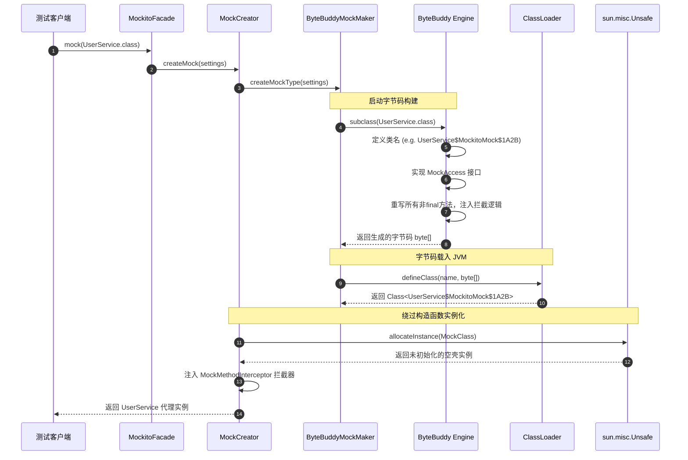
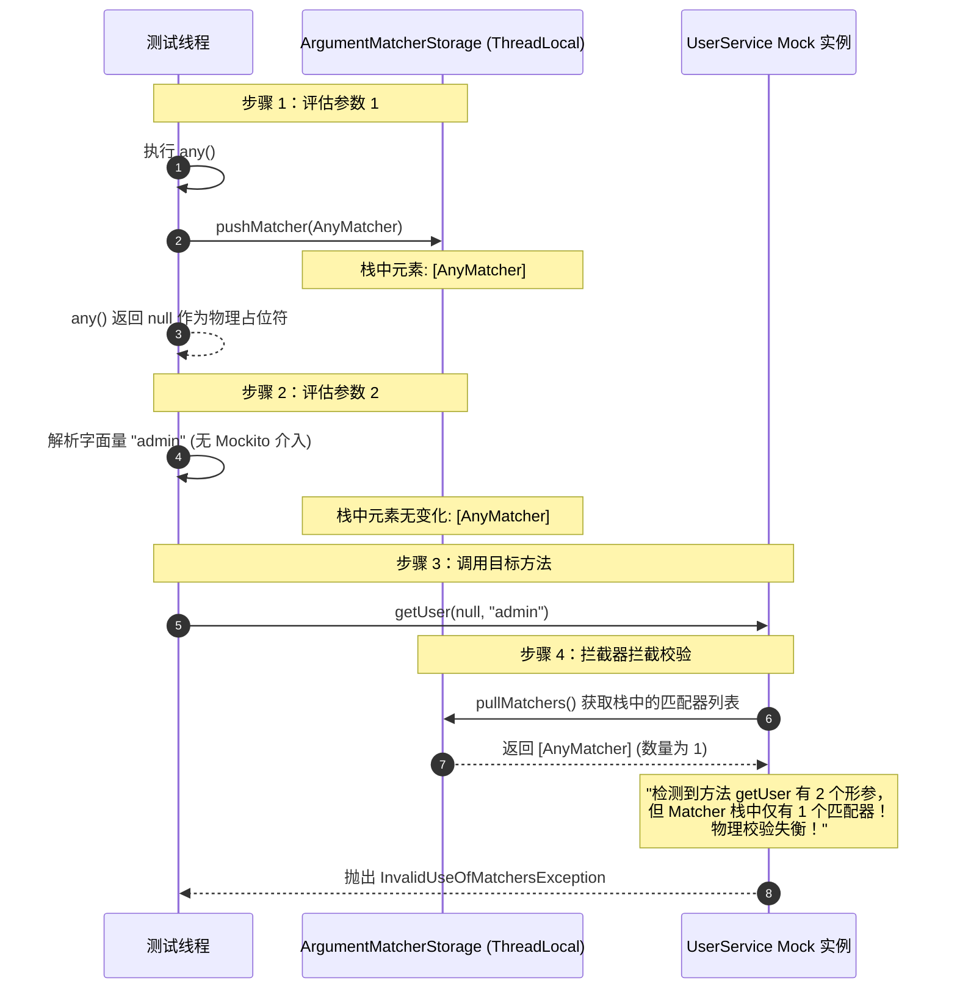
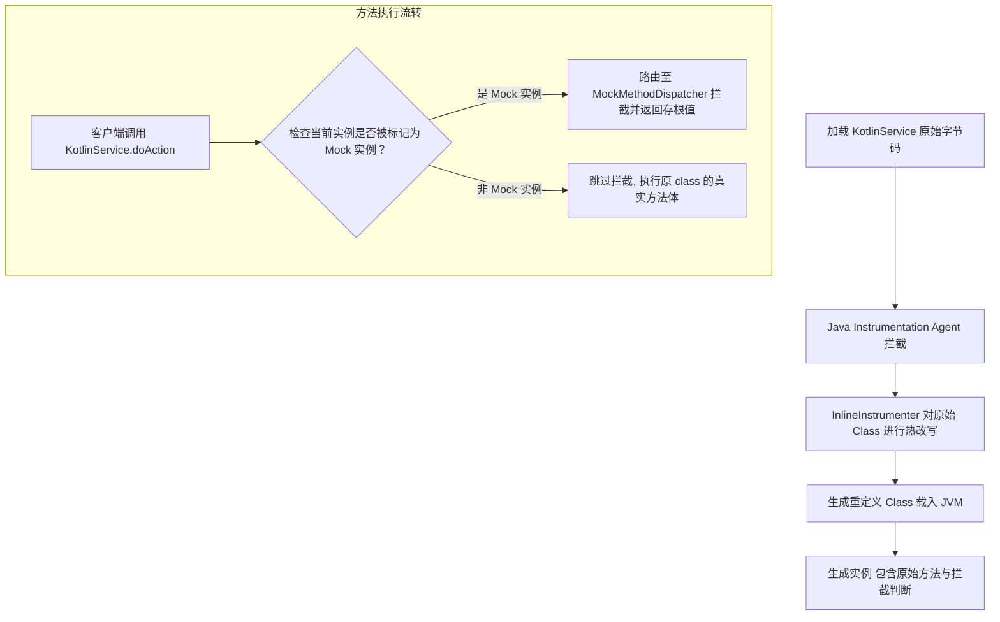

# Mockito 核心原理解析与底层机制深度剖析

在现代软件工程中，单元测试是保障代码质量、支撑持续集成与敏捷迭代的基石。而在复杂的 JVM 与 Android 应用中，由于对象间存在错综复杂的依赖关系，如何实现真正的“孤立测试”（Solitary Testing）成为核心痛点。Mockito 作为 JVM 生态中最主流的 Mock 框架，通过优雅的 API 隐藏了极其复杂的底层机制。本文将从类加载、字节码增强、内存布局、线程本地存储（ThreadLocal）等物理视角，深度拆解 Mockito 的底层运转逻辑、设计取舍以及在 Kotlin 时代的演进。

---

## 1. 单元测试中的依赖隔离与 Mock 框架命题

### 1.1 软件测试金字塔与单元测试定位
根据经典的测试金字塔模型，测试被划分为单元测试（Unit Test）、集成测试（Integration Test）和端到端测试（UI/E2E Test）。其中，单元测试位于金字塔的底部，具有运行速度最快、维护成本最低、定位问题最精准的特点。

单元测试的核心命题在于**隔离性（Isolation）**与**确定性（Determinism）**：
*   **隔离性**：要求测试的关注点仅限于“被测系统”（System Under Test, SUT）。如果被测方法调用了下层服务（如数据库访问、网络请求或复杂的计算引擎），这些下层服务的内部错误不应导致 SUT 的测试失败。
*   **确定性**：要求测试结果在任何时间、任何环境下都是可重现的。如果 SUT 依赖了外部物理环境（如系统当前时间、随机数生成器、外部 API 接口），测试结果就会变得不可控（不稳定测试，Flaky Tests）。

### 1.2 伦敦学派与底特律学派的方法论历史论战
在单元测试的演进过程中，关于“如何隔离依赖”形成了两大主流学派，它们的论战直接催生并定义了 Mock 框架的设计哲学。

#### 1.2.1 伦敦学派（London School / Mockist）
*   **核心主张**：主张将被测系统（SUT）与外界的所有协作者（Collaborators）完全隔离。除了简单的数据对象（值对象 / Value Objects）外，SUT 依赖的所有其他业务类都应当被 Mock 掉。
*   **关注焦点**：聚焦于对象之间的**交互行为契约（Interaction-Based Testing）**，即“SUT 是否在正确的时机、以正确的参数调用了协作者的某个方法”。其理论支柱是“职责驱动设计（Responsibility-Driven Design）”。
*   **对 Mock 的态度**：极度依赖 Mock。Mockito 的绝大多数 API（如 `verify`、`ArgumentCaptor`）均是为了支撑伦敦学派的交互校验而设计的。

#### 1.2.2 底特律/芝加哥学派（Detroit/Chicago School / Classicist）
*   **核心主张**：主张尽可能使用真实的协作者参与测试，只有当协作者涉及共享状态（如全局数据库）、外部物理边界（如真实网络、文件 I/O）或运行速度极慢时，才允许使用 Mock。
*   **关注焦点**：聚焦于系统的**最终状态（State-Based Testing）**，即“在执行完某项操作后，SUT 及其关联的真实对象状态是否符合预期”。
*   **对 Mock 的态度**：将 Mock 视为“不得已而为之的物理防护盾牌”，提倡尽量少用。

#### 1.2.3 论战的方法论权衡
*   **测试脆弱性（Test Fragility）**：伦敦学派由于将测试与代码的内部调用链深度绑定，一旦发生业务重构（例如将一个方法拆分为两个，但对外暴露的契约不变），伦敦学派的测试用例会大面积崩溃。底特律学派由于只关注状态，对内部重构具有极强的免疫力。
*   **重构导向**：然而，伦敦学派在设计复杂系统时，能够自顶向下地帮助开发者明确定义类与类之间的协作契约。Mockito 正是在这两股思潮的交织中，既提供了强大的交互校验能力，又通过部分模拟（Partial Mocking）与 Spy 提供了状态校验的折中方案。

### 1.3 Android 架构演进与测试隔离特征
在 Android 开发中，依赖隔离的问题更加尖锐。Android 应用程序深度绑定了系统的运行期沙盒。
*   **MVC 时代的测试泥潭**：在传统的 MVC 架构下，`Activity`/`Fragment` 既是 View 又充当了 Controller，与 Android SDK 系统类（如 `LayoutInflater`、`Handler`）严重耦合，导致几乎无法在本地 JVM 上运行任何单元测试。
*   **MVP 与 MVVM 架构 the 救赎**：MVP 与 MVVM 架构的普及，使得展现层逻辑被剥离到不含 Android 原生依赖的 `Presenter` 或 `ViewModel` 中。这为 Mock 框架的使用提供了天然的契约边界。我们可以极其轻松地 Mock 一个 `UserRepository` 接口并将其注入到 `UserViewModel` 中，在毫秒级内完成对业务逻辑的验证。
*   **android.jar 的空壳问题**：我们在本地 JVM 上运行单元测试时，依赖的 Android SDK 编译期依赖包（`android.jar`）中的所有类其内部方法全部被插桩为直接抛出 `RuntimeException("Stub!")`。如果不进行隔离或模拟，任何涉及 Android SDK 的本地单元测试都将无法运行。
*   **隔离方案的抉择**：为了在本地 JVM 上高效运行测试，开发者必须借助 Robolectric（在 JVM 上模拟 Android 运行时环境）或使用 Mockito 对 Android SDK（如 `Context`、`SharedPreferences`）进行全面 Mock。Mockito 能够将复杂的 Android OS 服务物理屏蔽在被测边界之外，使得本地快速单元测试成为可能。

---

## 2. Mock 与 Spy 的物理本质与多态差异

在 Mockito 中，有两个最基本的测试双身（Test Double）概念：**Mock** 与 **Spy**。尽管它们都可以用来对方法调用进行存根（Stubbing）与验证（Verification），但它们在 JVM 堆内存中的物理状态、构建机制以及多态表现上存在本质的差异。

### 2.1 物理本质的深层解密

#### 2.1.1 Mock 实例：完全捏造的物理空壳
当调用 `Mockito.mock(Service.class)` 时，Mockito 并没有真正创建 `Service` 的原始类实例，而是通过动态字节码技术在内存中生成了 `Service` 的一个**子类**（在默认的 Subclassing 模式下），并对该子类的所有方法进行了覆盖重写。

在 JVM 堆内存中，这个 Mock 实例具有以下物理特征：
1.  **构造函数被绕过**：为了防止目标类的构造函数在初始化时执行复杂的物理逻辑（如连接数据库、读写文件、启动线程），Mockito 默认通过 JVM 的特殊机制（如 `sun.misc.Unsafe.allocateInstance(Class<?>)`）在堆中直接为该子类分配内存空间。这意味着，**目标类的构造函数以及成员变量的初始化块（Initializer Block）完全没有被执行**。
2.  **内部状态完全为空**：由于绕过了构造函数，Mock 实例的所有成员变量（Field）均处于 JVM 的物理初始值状态。例如，所有的引用类型字段均为 `null`，基本数据类型为 `0` 或 `false`。
3.  **无神的方法体（空壳方法）**：子类中所有重写的方法内部都不包含原始方法的逻辑，而是统一跳转到 Mockito 的方法拦截器（Method Interceptor）。如果该方法没有配置任何存根（Stub），拦截器会通过默认的 `Answer` 机制返回预设的默认值：
    *   基本数值类型：返回 `0`/`0.0`
    *   布尔类型：返回 `false`
    *   引用类型（如对象、String）：返回 `null`
    *   集合类型（如 List、Map）：返回空集合（如 `Collections.emptyList()`），这是 Mockito 为了避免频繁发生空指针异常（NPE）而做的特殊优化。

#### 2.1.2 JVM 内存布局与 Klass Word 指向
从 JVM 内存模型的角度来看，任何一个 Java 对象在堆内存中都有三个主要区域：对象头（Object Header）、实例数据（Instance Data）和对齐填充（Padding）。
*   **对象头（Object Header）**：包含 Mark Word（存储哈希码、锁标志、分代年龄等）和 Klass Word（类型指针）。
*   **Klass Word 的多态跳转**：在普通的 `UserService` 对象中，Klass Word 指向 Metaspace（元空间）中的 `com.demo.UserService.class` 元数据。而对于一个被 Mock 出来的实例，其 Klass Word 指向的是 ByteBuddy 动态载入的 `com.demo.UserService$MockitoMock$1A2B.class`。由于 JVM 的多态调用机制（`invokevirtual` 查找方法表时依据对象的实际 Klass 类型），所有针对该实例的方法调用，都会自动路由到派生类被重写的方法上。

```
普通对象内存布局:
+-------------------------------------------------------------+
| 对象头 (Mark Word + Klass Word 指向 UserService.class)       |
+-------------------------------------------------------------+
| 实例数据 (真实字段值: dbConnection, cacheManager, etc.)      |
+-------------------------------------------------------------+

Mock 对象内存布局:
+-------------------------------------------------------------+
| 对象头 (Mark Word + Klass Word 指向 UserService$MockitoMock.class) |
+-------------------------------------------------------------+
| 实例数据 (全部为零值或 null, 包含注入的 mockitoInterceptor 引用)  |
+-------------------------------------------------------------+
```

#### 2.1.3 Spy 实例：包裹真实物理对象的代理间谍
Spy 实例旨在“窥探”并局部修改一个真实对象的行为。当调用 `Mockito.spy(new ServiceImpl(...))` 时，Mockito 会在内存中执行以下操作：
1.  **物理包装（Delegation）**：如果传入的是一个已经初始化的真实物理对象，Mockito 会在堆中生成一个该类的新代理子类实例，并在其内部维护一个指向该真实对象的物理引用（即 `spiedInstance` 委托指针）。
2.  **默认委派机制**：Spy 代理实例的所有方法同样被重写，并指向拦截器。但与 Mock 不同的是，当拦截器拦截到方法调用且发现该方法**没有配置存根**时，它会通过反射（或者直接方法调用）将调用请求**重定向给内部持有的真实物理对象**执行。
3.  **状态与副作用的真实存在**：因为其背后是一个真实执行的物理对象，所有未被 Mockito 拦截的方法调用都会在真实对象上运行，这会产生真实的内部字段状态变更以及外部物理副作用（例如写入了真实的内存 Map，或者修改了类成员变量）。
4.  **选择性存根（Partial Mocking）**：一旦对 Spy 对象的某个方法配置了存根（如 `doReturn(x).when(spy).foo()`），当该方法被调用时，拦截器就会截断调用流，不再委派给内部的真实对象，而是直接返回存根值 `x`。

### 2.2 多态差异与内存布局对比表

| 维度 | Mock 实例 | Spy 实例 |
| :--- | :--- | :--- |
| **底层实现机制** | 通过 ByteBuddy 动态生成被 Mock 类的子类，直接实例化。 | 动态生成子类，内部持有一个真实对象的引用，进行委托代理。 |
| **目标类构造函数执行** | **不执行**（使用 `Unsafe` 直接分配内存并重写子类）。 | **执行**（在创建传入的真实对象时已完整执行）。 |
| **内部成员变量（Field）状态**| 全部为 JVM 默认初始值（`null`、`0`、`false`）。 | 保持真实对象初始化后的物理值，随方法调用发生真实变更。 |
| **未配置 Stub 时的行为** | 返回默认值（数值为0，引用为null，集合为空集合）。 | **委派给真实对象执行**，运行真实的业务逻辑。 |
| **内存与性能开销** | 较低（仅需生成一个子类，无额外真实实例开销）。 | 较高（在堆中存在两个物理对象：代理子类实例 + 被包装的真实实例）。 |
| **物理本质归属** | 是一个纯粹的“假对象”（Fake Object）。 | 是一个“装饰器/代理”（Decorator/Proxy）。 |

### 2.3 深入拆解 Answer 接口与高级 Answer 拦截
`Answer<T>` 接口是 Mockito 底层决定方法返回值的核心机制。其定义极其简单：
```java
public interface Answer<T> {
    T answer(InvocationOnMock invocation) throws Throwable;
}
```
当拦截器拦截到一个方法调用且匹配到存根时，它就会执行绑定到该存根上的 `Answer`。Mockito 内部提供了几种核心 Answer 行为：

#### 2.3.1 RETURNS_DEFAULTS
这是默认的 Answer。它在底层调用了 `GloballyConfiguredAnswer`，针对不同返回类型执行了如下逻辑：
*   如果返回类型是布尔，返回 `false`。
*   如果返回类型是数字，返回 `0`。
*   如果返回类型是集合，则使用反射查找该集合类型的子类（如 List 返回 EmptyList，Set 返回 EmptySet），从而防止调用方抛出 `NullPointerException`。

#### 2.3.2 RETURNS_DEEP_STUBS（深层链式存根）
在面对链式调用时（例如 `a.getB().getC().getValue()`），如果使用默认的 `RETURNS_DEFAULTS`，在调用 `a.getB()` 时就会返回 `null`，导致测试在 `getB().getC()` 处直接发生空指针异常。

为了避免冗长的逐级 Mock，Mockito 提供了深层存根：
```java
UserService mockService = Mockito.mock(UserService.class, Mockito.RETURNS_DEEP_STUBS);
Mockito.when(mockService.getProfile().getAddress().getCityName()).thenReturn("Shanghai");
```
*   **底层物理原理**：当 `RETURNS_DEEP_STUBS` 被触发时，拦截器会判断方法的返回值类型是否可以被 Mock。如果可以，它会在幕后**自动为返回值类型动态生成一个新的 Mock 实例**，并将其与当前调用链条绑定。以此类推，直到链路的最末端被赋予具体的存根值。
*   **设计坏味道警告**：虽然深层存根省去了编写大量 Mock 代码的麻烦，但它严重违反了**迪米特法则（Law of Demeter / 最少知识原则，即“不要和陌生人说话”）**。这也强烈提示我们，SUT 与协作者之间的耦合度过高，正确的做法应当是重构业务代码，减少调用链路。

#### 2.3.3 CALLS_REAL_METHODS
该 Answer 指示 Mockito 拦截器在拦截到方法调用后，直接通过字节码中的 `super.method()` 路由，调用目标类中的真实方法体。这常用于在 Mock 实例上实现局部模拟（Partial Mocking）。

---

## 3. 动态字节码增强与 MethodInterceptor 拦截机制

Mockito 的所有神奇魔法，建立在**运行时动态字节码增强**与**方法拦截路由**之上。本节将深度解密 Mockito 2.x/3.x 在 Subclassing 模式下，如何利用 `ByteBuddy` 库在 JVM 内存中无中生有地定义一个类，并接管其方法调用的物理全流程。

### 3.1 动态字节码技术概览与 Mockito 的选型演进
在 Java 生态中，动态字节码生成技术经历了数代演进：
1.  **JDK Dynamic Proxy**：JDK 原生支持，但有一个致命限制——**只能代理接口**，无法代理具体的类（因为生成的代理类已经继承了 `java.lang.reflect.Proxy`，而 Java 不支持多继承）。
2.  **CGLIB / Javassist**：通过操作底层字节码，动态生成目标类的子类。Mockito 1.x 广泛使用 CGLIB。但 CGLIB 停止维护，且在 Java 9 引入模块化系统（JPMS）后，对 JVM 内部 API（如 `sun.misc.Unsafe`）的非法反射访问受到了严格限制，导致其难以为继。
3.  **ByteBuddy**：现代 JVM 字节码操作的集大成者。它提供了极简的、类型安全的流式 API，完美支持 Java 9+ 乃至最新 JDK 版本，且拥有极高的生成性能。Mockito 2.x/3.x 全面拥抱 ByteBuddy 作为其底层的 `MockMaker` 实现。

### 3.2 Mockito.mock() 的动态字节码生成全链路追踪

当我们发起如下调用时：
```java
UserService mockService = Mockito.mock(UserService.class);
```
Mockito 内部会启动一条复杂的字节码生成与载入流水线：



#### 步骤 1：Mock 契约定义与 MockCreationSettings 组装
Mockito 首先会将被测类 `UserService.class` 包装进 `MockCreationSettings` 对象中。该对象包含了 Mock 实例的所有配置信息，包括：默认的 `Answer`（如 `RETURNS_DEFAULTS`）、需要实现的额外接口、是否开启 `Serializable` 支持等。

#### 步骤 2：ByteBuddy MockMaker 介入
Mockito 通过服务发现机制（SPI）加载 `MockMaker` 接口的实现类。在默认非 Inline 模式下，使用的是 `SubclassByteBuddyMockMaker`。它会向 ByteBuddy 引擎发起子类化构建请求。

#### 步骤 3：内存中动态定义新类
ByteBuddy 在内存中开始组装这个子类的字节码：
*   **类名命名空间规则**：生成的子类命名通常为 `目标类名$MockitoMock$随机哈希值`，例如 `com.demo.UserService$MockitoMock$1758296314`。它与目标类处于相同的 Package 下，以便能够访问 package-private 权限的方法。
*   **接口实现**：该子类除了继承 `UserService` 外，还会隐式实现 `org.mockito.internal.creation.bytebuddy.MockAccess` 接口。这个接口用于向 Mock 实例动态注入和获取拦截器对象。
*   **重写所有可继承的方法**：遍历 `UserService` 及其父类链中的所有非 final、非 static、非 private 方法。对每一个方法，ByteBuddy 将生成一套全新的 JVM 字节码指令。

#### 步骤 4：生成方法拦截指令（核心跳转）
以 `UserService` 中的 `public User getUserById(String id)` 为例，ByteBuddy 重写后的方法字节码，逻辑等价于以下 Java 代码：
```java
// 动态生成的子类中的方法拦截逻辑
public class UserService$MockitoMock$1A2B extends UserService implements MockAccess {
    // 每一个 Mock 实例在创建后，都会被注入一个 MethodInterceptor 拦截器
    private MockMethodInterceptor mockitoInterceptor;

    @Override
    public void setMockitoInterceptor(MockMethodInterceptor interceptor) {
        this.mockitoInterceptor = interceptor;
    }

    @Override
    public MockMethodInterceptor getMockitoInterceptor() {
        return this.mockitoInterceptor;
    }

    @Override
    public User getUserById(String id) {
        // 1. 检查当前实例是否被注入了拦截器
        MockMethodInterceptor interceptor = this.mockitoInterceptor;
        if (interceptor != null) {
            try {
                // 2. 路由分发给拦截器，传入代理实例、当前方法对象、方法参数
                Object result = interceptor.doIntercept(
                    this, 
                    CachedMethodAccessor.getUserByIdMethod, // 缓存的 Method 对象
                    new Object[]{id}
                );
                return (User) result;
            } catch (Throwable t) {
                throw new RuntimeException(t);
            }
        }
        // 3. 如果拦截器为空（理论上极少发生），则退回到超类的默认实现
        return super.getUserById(id);
    }
}
```

#### 步骤 5：加载与载入 ClassLoader
ByteBuddy 将生成的 `byte[]` 字节码数组，通过当前上下文的 `ClassLoader`（或 Mockito 专用的 `MultipleParentClassLoader`）调用底层的 `defineClass` 物理方法，将该子类正式载入 JVM 方法区（Metaspace）。

---

### 3.3 sun.misc.Unsafe.allocateInstance 绕过构造函数的底层物理原理

在 Java 中，一个常规对象的创建必须经历以下严格的 JVM 物理步骤：
1.  **类加载检查**：JVM 确认该类的常量池中是否有符号引用，并且该类已被加载、解析和初始化。
2.  **分配物理内存**：根据类的元数据计算出对象的物理大小，在堆中划拨内存（采用指针碰撞或空闲列表算法）。
3.  **零值初始化**：将分配到的内存空间（除对象头外）全部物理填充为零（引用为 `null`，数值为 `0`）。
4.  **设置对象头**：填充 Mark Word 和 Klass Word 指针。
5.  **执行 `<init>` 方法**：执行成员变量初始化块、属性默认值赋值以及对应的构造函数体字节码。

#### 3.3.1 Unsafe 的暴力越轨
Mockito 为了绝对防止目标类的构造函数在测试时触发副作用（如在构造函数里连接物理网络、启动后台守护线程、读写磁盘），选择在第 4 步完成后**强行截断控制流**，不调用 `<init>` 指令。

这在物理上是通过 `sun.misc.Unsafe.allocateInstance(Class<?> clazz)` 实现的。该方法是一个 native 方法，它直接在 C++ 层面为指定的 Class 分配堆内存并填充对象头，然后直接将内存首地址作为引用返回给 Java 虚拟机。

#### 3.3.2 伴生的物理地雷：Final 字段的空悬
由于彻底绕过了类的初始化块和构造函数，如果目标类中定义了带有初始值的 `final` 字段，它们在 Mock 实例中依然会成为空悬零值：
```java
public class SecurityTokenService {
    // 虽然有显式初始化，但因为绕过了构造函数，Mock 实例中的这部分初始化字节码根本没有运行！
    private final List<String> whiteList = new ArrayList<>(); 
    
    public boolean checkToken(String token) {
        // 在真实对象中没问题，但在 Mock 实例上，如果执行该真实方法体，
        // whiteList 将是 null，导致此处直接抛出 NullPointerException！
        return whiteList.contains(token); 
    }
}
```

---

### 3.4 ByteBuddy 操作数栈级重写指令解析
在 JVM 字节码层面，ByteBuddy 重写子类方法时，必须手动操作 JVM 表达式栈，以完成方法实参到 `Object[]` 数组的打包，并调用拦截器。

以下是一个接收两个参数的方法被 ByteBuddy 重写后的部分汇编级字节码指令推演：
```jvm
aload_0             // 将当前 mock 实例的引用 (this) 压入操作数栈顶
getfield #12        // 获取当前 mock 实例中的 mockitoInterceptor 字段值，压入栈顶
dup                 // 复制栈顶的拦截器引用
ifnull DEFAULT_IMPL // 如果拦截器值为 null，直接跳转到超类的原始实现

// --- 开始准备调用 interceptor.doIntercept(...) ---
aload_0             // 参数 1: 传入代理实例自己 (Object proxy)
getstatic #24       // 参数 2: 传入缓存的 Method 反射对象 (Method method)
iconst_2            // 参数 3 (数组长度): 向栈压入整型常量 2
anewarray #4        // 在堆中创建一个大小为 2 的 Object 数组，将数组引用压入栈顶
dup                 // 复制数组引用，为数组元素赋值做准备
iconst_0            // 压入数组下标 0
aload_1             // 压入方法的第一个入参
aastore             // 将第一个入参存入数组的索引 0 处
dup                 // 再次复制数组引用
iconst_1            // 压入数组下标 1
aload_2             // 压入方法的第二个入参
aastore             // 将第二个入参存入数组的索引 1 处

// 此时操作数栈上排列着：mockitoInterceptor 实例、this、Method 对象、填充完毕的 Object[] 数组
invokevirtual #36   // 物理触发：mockitoInterceptor.doIntercept(proxy, method, args)
areturn             // 将 doIntercept 的返回值从操作数栈顶弹出并返回给调用方

DEFAULT_IMPL:
aload_0             // 重新将 this 压栈
aload_1             // 压入参数 1
aload_2             // 压入参数 2
invokespecial #48   // 物理调用父类的原始方法 (super.method)
areturn             // 返回父类方法的执行结果
```
通过上述底层的栈操作，Mockito 极其高效地完成了对任意方法的代理分发。

---

### 3.5 调用路由中央枢纽：MockHandlerImpl 与数据容器

在 `MockMethodInterceptor.doIntercept()` 截获调用后，控制流进入 `MockHandlerImpl`。其内部持有并维护以下两个核心数据容器：

#### 3.5.1 StubbedInvocationContainer：存根容器
用于存放所有通过 `when(...).thenReturn(...)` 或 `doReturn(...).when(...)` 注册的存根契约。它的底层是一个有序的列表，存储了 `StubbedInvocationImpl` 对象。
每个 `StubbedInvocationImpl` 包含：
*   **InvocationMatcher**：包含了对方法签名的封装以及一组参数匹配器（`ArgumentMatcher`）。
*   **Answer 链**：该存根所对应的一系列响应行为（例如连续调用时，第一次返回 A，第二次返回 B，第三次抛出异常）。

当有新的调用进来时，Mockito 会遍历这个容器，通过 `InvocationMatcher.matches(Invocation)` 方法判断当前调用是否符合已注册的存根规则。如果符合，则执行对应的 `Answer`。

#### 3.5.2 InvocationContainerImpl：调用历史容器
用于记录该 Mock 实例自创建以来所经历的所有真实调用。
*   内部使用了一个线程安全的 `List<Invocation>` 链表。
*   每一次非存根注册阶段的调用，都会被追加到这个 List 中。
*   当我们在测试代码最后调用 `Mockito.verify(mockService, times(2)).getUserById(any())` 时，Mockito 会获取这个 `InvocationContainerImpl`，遍历其中记录的调用历史，利用参数匹配器对每一条历史记录进行比对校验，计算符合条件的方法调用次数是否等于 2。如果校验不通过，则抛出 `AssertionError`。

---

## 4. 存根语法与参数匹配器底层地雷

在日常使用 Mockito 时，开发者经常会遇到一些诡异的异常（如 `InvalidUseOfMatchersException`）或意想不到的方法执行。这些现象的本质，是 Java 语言的方法求值时序与 Mockito 的 ThreadLocal 状态机设计之间产生的冲突。

### 4.1 when-then 与 do-when 的微观执行链路分水岭

在 Mockito 中，有两种存根写法。在 Mock 实例上，它们几乎等价；但在 **Spy 实例**上，它们有着生与死的物理分野。

#### 4.1.1 案例背景
```java
List<String> spyList = Mockito.spy(new ArrayList<>());

// 方式 A：when-then 语法
Mockito.when(spyList.get(0)).thenReturn("foo"); // 物理崩溃！抛出 IndexOutOfBoundsException

// 方式 B：do-when 语法
Mockito.doReturn("foo").when(spyList).get(0);    // 物理安全！成功存根
```

#### 4.1.2 为什么 when-then 会在 Spy 上触发真实方法？
we 必须从 **Java 编译器的表达式求值顺序（Evaluation Order）**来拆解：
在 Java 中，当调用一个方法 `obj.method(arg)` 时，作为参数传入的表达式 `arg` **必须在当前方法被调用之前被求值完毕**。

对于表达式 `Mockito.when(spyList.get(0))`：
1.  首先，JVM 必须计算内部表达式 `spyList.get(0)` 的值。
2.  控制流进入 `spyList` 的代理子类。由于 `spyList` 是一个 Spy 对象，且此时 `get(0)` **尚未注册任何存根规则**，代理子类的拦截器会遵照 Spy 的默认行为——**将调用路由给内部真实的 `ArrayList` 对象**。
3.  真实的 `ArrayList` 执行 `get(0)`。因为此时 List 还是空的，真实对象直接抛出了 `IndexOutOfBoundsException`。
4.  测试线程因异常直接中断，最外层的 `Mockito.when(...)` 甚至还没来得及被调用。

如果该方法内部没有越界崩溃，而是执行了一个写数据库的操作，那么这一步就会产生真实的写入副作用，从而污染了单元测试的环境。

#### 4.1.3 为什么 do-when 能够安全避开？
对于表达式 `Mockito.doReturn("foo").when(spyList).get(0)`：
1.  首先，执行 `Mockito.doReturn("foo")`。这一步没有任何对 `spyList` 的调用。它返回一个 `StubberImpl` 实例，并在 Mockito 内部的 ThreadLocal 状态机中标记当前行为：“我即将注册一个返回 'foo' 的存根规则”。
2.  接着，调用 `Stubber.when(spyList)`。这一步将当前持有的 Stubber 规则与特定的 Spy 实例关联起来，并返回一个代理包装类（或指示 Mockito 的 ThreadLocal 状态机进入 `StubbingMode`）。
3.  最后，调用 `.get(0)`。此时，控制流再次进入 `spyList` 的代理方法。但在拦截器内部，它会首先检测 Mockito全局的 ThreadLocal 状态机：
```java
// Mockito 拦截器内部的伪代码逻辑
if (stateMachine.isStubbingMode()) {
    // 发现当前处于存根模式！
    // 1. 将当前的方法签名 get(0) 记录到 StubbedInvocationContainer 中，与 "foo" 绑定。
    stateMachine.registerStubbing(currentInvocation, pendingAnswer);
    // 2. 截断控制流，【不】委派给真实的 spiedInstance 执行！
    return defaultValue; // 直接安全返回默认值，不触发真实 get(0) 的物理逻辑
}
```
由于拦截器在第一时间识别到了“存根模式”的存在，它主动断开了向真实物理对象的路由委派，从而确保了测试的绝对安全。

---

### 4.2 参数匹配器（Argument Matchers）底层与 ThreadLocal 栈失衡痛点

参数匹配器（如 `any()`、`eq()`、`contains()`）为测试提供了极大的灵活性，但它们也是 Mockito 中最容易被误用的机制。

#### 4.2.1 经典灾难案例
```java
// 抛出 InvalidUseOfMatchersException 崩溃！
Mockito.when(userService.getUser(any(), "admin")).thenReturn(new User("admin"));
```

#### 4.2.2 ThreadLocal 栈：ArgumentMatcherStorage 运行机制
在 Java 语言规范中，**当一个方法被调用时，所有的入参必须在栈中拥有具体的物理值**。例如，`userService.getUser(any(), "admin")` 在 Java 运行时看来，必须是一个合法的虚拟方法调用，其入参必须是具体的对象引用。

那么，`any()` 作为 Mockito 的静态方法，是如何起作用的？它怎么把“任意匹配”这个逻辑传递给 Mockito 内部的？
答案是：**ThreadLocal 线程局部变量与副作用机制**。

Mockito 内部为每个执行测试的线程维护了一个参数匹配器存储栈：`ArgumentMatcherStorage`。
*   当调用 `any()` 时，该静态方法会在幕后悄悄向当前线程的 `ArgumentMatcherStorage` 压入一个 `Matcher` 描述符（如 `AnyMatcher.INSTANCE`）。
*   压栈完成后，`any()` 必须向 JVM 返回一个物理值作为方法入参占位符。由于此时泛型未知，它默认返回一个 `null`（或者基本类型的初始值 `0`）。
*   当调用普通的字面量 `"admin"` 时，这只是一个纯粹的 Java 字符串字面量，**没有触发任何 Mockito 代码**，因此不会向 `ArgumentMatcherStorage` 压入任何东西。

现在，我们来复原 `userService.getUser(any(), "admin")` 的物理执行时序：



#### 4.2.3 为什么“一旦使用匹配器，所有参数都必须使用匹配器”？
在步骤 4 中，Mockito 拦截器拿到了被调用的方法反射对象 `getUser(String role, String group)`，得知该方法在声明上有 2 个形参。
然而，此时当前线程的 `ArgumentMatcherStorage` 栈里，**只躺着 1 个 Matcher**。
这导致了一个无法调和的多态二义性：这唯一的一个 `AnyMatcher`，到底是对应第一个参数 `role`，还是对应第二个参数 `group`？

Mockito 无法做出猜测。为了防止产生不可预测的存根错误，Mockito 强制规定：**如果在一次方法调用中使用了任何一个参数匹配器，那么该方法的所有参数都必须通过匹配器显式声明。**

正确的写法必须是：
```java
Mockito.when(userService.getUser(any(), eq("admin"))).thenReturn(new User("admin"));
```
当引入 `eq("admin")` 时：
1.  `any()` 被调用，向栈压入 `AnyMatcher`，返回 `null`。
2.  `eq("admin")` 被调用，向栈压入 `Equals("admin")` 匹配器，返回 `null`。
3.  方法调用被评估为 `getUser(null, null)`。
4.  拦截器拦截，从栈中取出 `[AnyMatcher, Equals("admin")]`（数量为 2）。
5.  形参数量（2）与 Matcher 数量（2）完全对齐，Mockito 按照自左向右的顺序一一进行契约绑定，物理校验完美通过。

#### 4.2.4 ThreadLocal 栈残留污染地雷
由于参数匹配器的压栈是独立的静态方法调用，这带来了一个极隐蔽的多线程或异常地雷：
*   **异常打断导致的污染**：如果在调用 `any()` 压栈后，由于其他代码抛出异常，导致后面的 Mock 方法调用中途夭折，那么这个 `AnyMatcher` 将会**永久残留**在当前线程的 `ArgumentMatcherStorage` 栈顶。
*   **下一次测试替罪羊**：当下一次运行完全无关的测试，且调用了一个不带参数匹配器的普通 Mock 方法时，拦截器会去 `ArgumentMatcherStorage` 拿匹配器，竟然意外拿到上一次残留的 `AnyMatcher`。此时会爆出极其令人困惑的 `InvalidUseOfMatchersException`，而报错行指向的代码看起来毫无问题。
*   **Mockito 的自我净化**：为了应对这一痛点，Mockito 会在每次测试执行完毕（如通过 JUnit 运行器的 Lifecycle Listener）自动调用 `ArgumentMatcherStorage.validateState()`。如果发现栈中还有残留 Matcher，会强行将其清空并抛出异常，防止污染扩散。

---

### 4.3 ArgumentCaptor 参数捕获器机制

`ArgumentCaptor` 是单元测试中进行深度断言的利器。许多人将其视为一个独立的功能，但从物理实现上看，**ArgumentCaptor 只是一个特殊的 ArgumentMatcher（参数匹配器）**。

#### 4.3.1 物理结构与拦截捕获
`ArgumentCaptor` 的内部持有一个名为 `CapturingMatcher` 的匹配器实现类。
当我们调用 `captor.capture()` 时，其内部源码如下：
```java
// Mockito 内部的 Captor 实现逻辑
public class ArgumentCaptor<T> {
    private final CapturingMatcher<T> capturingMatcher = new CapturingMatcher<>();

    public T capture() {
        // 1. 将内部的物理匹配器压入 ThreadLocal 的 ArgumentMatcherStorage 栈中
        ArgumentMatcherStorage.reportMatcher(this.capturingMatcher);
        // 2. 返回一个默认的物理占位符，绕过 JVM 的非空检查
        return (T) Handlers.emptyValueFor(capturingMatcher.getType());
    }

    public T getValue() {
        return this.capturingMatcher.getLastValue();
    }

    public List<T> getAllValues() {
        return this.capturingMatcher.getAllValues();
    }
}
```

#### 4.3.2 运行时捕获的物理时序
1.  在 `Mockito.verify(mockService).updateUser(captor.capture())` 执行时，`captor.capture()` 向线程本地栈压入 `CapturingMatcher`。
2.  当 `verify` 模块遍历 `mockService` 的 `InvocationContainerImpl` 历史调用记录时，一旦匹配到对应的 `updateUser` 方法调用，Mockito 会执行匹配器校验。
3.  在调用 `CapturingMatcher.matches(Object argument)` 时，该匹配器内部执行了特殊的“副作用”逻辑：
```java
// CapturingMatcher 内部的 matches 物理逻辑
@Override
public boolean matches(Object argument) {
    // 1. 无论入参是什么，始终返回 true，确保 verify 校验能够通过
    // 2. 顺手将被拦截到的物理入参 argument 追加到内部的 List 中
    this.arguments.add((T) argument);
    return true;
}
```
4.  校验结束后，历史调用中的真实入参对象被妥善保存在了 `captor` 内部的 List 中。测试代码便可以安全地调用 `captor.getValue()`，对这个被捕获的真实对象进行深入的字段断言（这在验证异步回调、复杂数据实体传递时极为有用）。

---

## 5. Kotlin 时代下的 Mockito 痛点与破局之道

随着 Kotlin 成为 Android 开发的第一公民，Mockito 面临了前所未有的严峻挑战。Kotlin 语言的两个核心编译器特性——**默认不可变性（Final by default）** 与 **非空安全（Null Safety）**，直接击中了 Mockito 传统 Subclassing 机制的命脉。

### 5.1 Final 限制与 Mock-Maker-Inline

#### 5.1.1 物理痛点：Final By Default
在 Java 中，类和方法默认是 `open`（可继承、可重写）的，除非显式声明为 `final`。
然而，Kotlin 颠覆了这一设计：**Kotlin 中的所有 Class 及其内部的方法，默认都是 `final` 的**。

In 传统的 Mockito 子类化（Subclassing）模式下，ByteBuddy 尝试为 Kotlin 类生成子类时，JVM 类加载器会直接抛出类似于以下的崩溃：
```
java.lang.CannotCompileException: Cannot inherit from final class com.demo.KotlinService
```
因为 JVM 规范严禁任何类继承一个被标记为 `final` 的 Class，也严禁重写任何 `final` 方法。

#### 5.1.2 破局救赎：Mock-Maker-Inline 机制
为了在不修改 Kotlin 源码的前提下实现 Mock，Mockito 2.x+ 引入了 `mock-maker-inline` 引擎。它放弃了生成子类的 Subclassing 策略，改用 **JVM Agent 热插桩（Hot-Swapping / Class Redefinition）** 技术。



#### 5.1.3 Inline 模式的底层物理步骤
1.  **Java Instrumentation 代理激活**：在测试启动时，Mockito 通过 JVM Agent 机制（在 Android 环境下则通过 DexMaker 的 InlineDexmakerMockMaker），利用 JVM 的 `java.lang.instrument.Instrumentation` 接口注册一个 `ClassFileTransformer`。
2.  **运行时热重定义（Retransformation）**：
    *   JVM Agent 利用 `Instrumentation.retransformClasses(Class<?>...)` 方法，对已经被加载进 JVM 的 final 类进行重新加载。
    *   在加载阶段，`InlineInstrumenter` 拦截字节码流，利用 ByteBuddy 的 `Advice` 机制对其直接改造。
3.  **字节码 Inline 插桩**：不生成子类，而是直接在目标类的每一个方法入口处插入一段判断和条件跳转字节码。

#### 5.1.4 核心插桩拦截模拟源码与解析
为了直观展现这一过程，以下是 `Mock-Maker-Inline` 改写后的 Class 逻辑示意代码：

```java
// 原始的 Kotlin 类编译后的 Java 字节码表现形式（概念模拟）
public final class KotlinService {
    
    // Mockito 在类中注入的静态分发器引用（实际实现通过全局 ThreadLocal 映射）
    public static final ThreadLocal<MockMethodDispatcher> $mockitoDispatcher = new ThreadLocal<>();

    public final String getGreeting(String name) {
        // 【Mockito 强行插桩插入的入口判断】
        MockMethodDispatcher dispatcher = $mockitoDispatcher.get();
        if (dispatcher != null && dispatcher.isMocked(this)) {
            // 如果当前线程、当前实例被标记为需要 Mock 拦截
            // 立即中断原始方法的执行，将调用路由至 Mockito 的 Handler
            Object result = dispatcher.handle(this, "getGreeting", new Object[]{name});
            return (String) result; // 直接返回存根值，后面的真实方法体被安全跳过！
        }

        // --- 以下是原始的真实方法体 ---
        System.out.println("Executing real business logic...");
        return "Hello, " + name;
    }
}
```

#### 5.1.5 Inline 模式的物理局限
*   **JDK 核心类黑名单**：由于 JVM 安全沙箱对 Bootstrap ClassLoader（引导类加载器）加载的核心类（如 `java.lang.String`、`java.lang.Integer`、`java.lang.System` 等）有着极其严苛的物理保护，Instrumentation 代理被禁止对这些核心类进行 Retransform。因此，我们无法 Mock 核心 JDK final 类。
*   **构造函数物理必执行**：在 Inline 模式下，由于没有创建子类，实例化时必须直接创建目标类本身。因此，目标类自身的构造函数**不可避免地会被执行**（即使使用 Objenesis，在特定环境下也可能会退化或触发类初始化逻辑）。如果目标类的构造函数里包含了高危物理操作，Inline 模式会面临很大的测试风险。

---

### 5.2 Null Safety 冲突与 Mockito-Kotlin 解法

#### 5.2.1 物理痛点：Kotlin 的非空检查拦截
Kotlin 的空安全机制在编译期起作用，但为了防止 Java 代码传入 `null` 破坏空安全，Kotlin 编译器会在所有接收非空参数的方法入口处，**自动注入非空检查字节码**。

例如，对于 Kotlin 方法：
```kotlin
class UserService {
    fun saveUser(user: User) { // user 为非空类型
        // ...
    }
}
```
经过 `kotlinc` 编译后，生成的字节码等价于以下 Java 代码：
```java
public final class UserService {
    public final void saveUser(@NotNull User user) {
        // Kotlin 编译器强制注入的物理非空校验！
        Intrinsics.checkNotNullParameter(user, "user"); 
        
        // 真实业务逻辑...
    }
}
```
当我们尝试使用 Mockito 的 `any()` 进行存根时：
```kotlin
// 物理闪退！抛出 IllegalArgumentException: Parameter specified as non-null is null: method UserService.saveUser, parameter user
whenever(userService.saveUser(any())).then { ... }
```
**崩溃的物理链路分析**：
1.  `any()` 静态方法被执行。由于它是 Java 实现的，为了满足泛型返回，它在运行时只能物理返回 `null`。
2.  Java 表达式开始求值，执行 `userService.saveUser(null)`。
3.  即使 `userService` 是一个 Mock 实例（尤其是 Inline Mock 实例），在进入 Mockito 拦截器之前，JVM 优先执行了方法入口的指令。
4.  控制流触发了 Kotlin 注入的 `Intrinsics.checkNotNullParameter(null, "user")`。
5.  非空检查器发现入参为 `null`，直接抛出 `IllegalArgumentException` 中断线程。Mockito 的方法拦截器根本没有机会截获这次调用。

#### 5.2.2 Mockito-Kotlin 的自愈原理
为了彻底解决这一痛点，开源社区推出了 `mockito-kotlin` 库（已并入 Mockito 官方维护体系）。其核心思想是：**通过自定义包装方法，拦截并替换 `any()` 的返回值，返回一个物理上非空的“假实例”**。

其核心实现源码原理如下：
```kotlin
// Mockito-Kotlin 的 any() 封装实现原理
inline fun <reified T : Any> any(): T {
    // 1. 调用底层的 Mockito.any()，让 Mockito 的 ThreadLocal 匹配器栈正常压栈
    Mockito.any(T::class.java)
    
    // 2. 绕过 null 返回！利用具体化泛型（reified）在运行时检测目标类型 T
    // 根据类型 T，动态返回一个物理上绝对不为 null 的“安全假值”
    return createInstance()
}

inline fun <reified T : Any> createInstance(): T {
    val kClass = T::class
    // 根据类型进行分支预测
    return when (kClass) {
        String::class -> "" as T
        Int::class -> 0 as T
        List::class -> emptyList<Any>() as T
        // 如果是自定义的复杂 Class，通过反射或 Objenesis 动态生成一个无视构造函数的物理假实例
        else -> ObjenesisHelper.newInstance(kClass.java)
    }
}
```
通过这种方式，`any()` 最终向 Kotlin 方法传递了一个利用字节码技术捏造的非空假对象（如空字符串 `""` 或未初始化的物理实例）。Kotlin 编译器的 `checkNotNullParameter` 检测到传入值非空，顺利放行，随后控制流成功进入 Mockito 拦截器，存根契约注册成功。

---

### 5.3 Mockito-Kotlin 最佳实践与 DSL 机制
由于 Kotlin 的高阶函数和内联特性，`mockito-kotlin` 还为我们带来了极具表现力的 DSL 语法。

#### 5.3.1 whenever 与 verify 的 Kotlin 化
在 Java 中，`when` 是关键字，因此 Mockito 引入了 `Mockito.when(...)`。而在 Kotlin 中，`when` 同样是用于模式匹配的保留关键字，直接写 `when(...)` 会引发语法冲突。
`mockito-kotlin` 引入了 `whenever(...)` 代替 `when(...)`，使得代码自然顺畅：
```kotlin
whenever(mockService.getUserById(any())).thenReturn(User("Admin"))
```

#### 5.3.2 自定义参数匹配器 argThat 物理拆解
在对复杂对象进行存根或校验时，我们通常需要自定义匹配逻辑：
```kotlin
verify(userService).saveUser(argThat {
    name == "Expected Name" && role == "Admin"
})
```
*   **物理本质**：`argThat` 接收一个 lambda 表达式 `T.() -> Boolean`。
*   在幕后，它动态生成了一个匿名的 `ArgumentMatcher<T>` 实现：
```kotlin
// mockito-kotlin 内部实现伪代码
fun <T> argThat(predicate: (T) -> Boolean): T {
    // 1. 构造一个匿名 ArgumentMatcher 子类
    val matcher = object : ArgumentMatcher<T> {
        override fun matches(argument: T): Boolean {
            return predicate(argument) // 执行传入的 lambda 块
        }
    }
    // 2. 压入当前线程的 ArgumentMatcherStorage 栈顶
    ArgumentMatcherStorage.reportMatcher(matcher)
    // 3. 返回安全占位符
    return emptyValueFor(T::class.java)
}
```
通过将 Lambda 表达式装饰为符合 Mockito 规范的 `ArgumentMatcher` 压栈，Mockito 完美保持了其 ThreadLocal 状态机与 Kotlin 现代化语言特征的统一。

---

## 6. Mockito 的局限性与设计反思

即使 Mockito 拥有强大的字节码重写能力，它在 JVM 与 Android ART 运行期上依然存在物理限制。

### 6.1 静态方法与私有方法的 Mock 边界

#### 6.1.1 静态方法 Mock 机制 (Mockito 3.4.0+)
在早期，Mock 静态方法必须借助 PowerMock 这样破坏 ClassLoader 的重度框架。而现代 Mockito 引入了 `mockStatic(Class)`。
*   **底层物理原理**：它利用 ByteBuddy 的 `InlineInstrumenter` 对目标类的所有静态方法进行热插桩。
*   **作用域限制**：为了防止全局静态 Mock 导致多线程并发测试时产生严重的污染与冲突，`mockStatic` 被强制设计为**线程局部且局部生命周期绑定（Scoped Mock）**。它必须在 `try-with-resources` 块中声明，一旦出了作用域，插桩逻辑立即失效：
```java
try (MockedStatic<StaticUtils> utilities = Mockito.mockStatic(StaticUtils.class)) {
    utilities.when(StaticUtils::name).thenReturn("Mocked Name");
    // 在此范围内，静态方法被拦截
} // 出了大括号，自动调用 close()，字节码路由还原，恢复真实逻辑
```

#### 6.1.2 为什么 Mockito 坚决不支持 Mock 私有方法？
从技术实现上，无论是 Subclass 还是 Inline 模式，Mockito 都有能力通过字节码强行重写私有方法。但 Mockito 官方始终拒绝支持这一特性。
这是 Mockito 的**设计哲学**：
*   **私有方法是类的内部实现细节**。单元测试应该只关注对象的**公有行为契约（Public Contract）**。
*   如果一个私有方法复杂到需要单独对其进行 Mock，这强烈的暗示了该类承担了过多的职责，是典型的**设计坏味道**。此时正确的做法是进行重构，将该私有方法提取到一个新的协作者类中，将协作者以公有接口的形式注入，然后对协作者进行 Mock。

#### 6.1.3 构造函数 Mock 机制与 Objenesis 缓存优化
从 Mockito 3.5.0 开始，支持对构造函数进行 Mock 拦截（通过 `mockConstruction(Class)`）。
*   **底层物理原理**：`mockConstruction` 同样依赖 `InlineInstrumenter` 对类进行字节码级的热重定义。它拦截了该类在执行构造函数时的所有 JVM 指令。当在测试代码内执行 `new MyService()` 时，JVM 实例化出来的仍然是目标类的物理实例，但其构造方法体内部的初始字节码已被改写，自动路由跳转至线程本地的 `ConstructionDispatcher`，强制该实例成为一个受 Mockito 监控的 Mock 对象，并且可以绑定指定的存根规则。
*   **Objenesis 实例化缓存优化**：对于普通的 Mock，为了绕过构造函数，Mockito 高度依赖 `Objenesis` 库。Objenesis 内部维护了针对不同 JVM 平台的物理实例化策略缓存（`StdInstantiatorStrategy`）。
    *   在第一次尝试实例化某个 Class 时，Objenesis 会探测当前 JVM 环境下 `Unsafe` 的可用性，或者探索是否存在特定的私有 JVM API。
    *   一旦确定了最佳的“绕过构造函数实例化路径”，Objenesis 会将其放入全局 `ConcurrentHashMap` 缓存中。这确保了在之后的数千次测试运行中，构建 Mock 实例时能够达到纳秒级的极速，避免了频繁发生类验证与查找的反射物理开销。

---

### 6.2 Android 真机运行环境（ART）的物理限制与 Dexmaker

在本地 JVM 环境下，由于运行的是标准的 JVM（OpenJDK / Oracle JDK），Mockito 可以肆无忌惮地利用 ByteBuddy 在运行期动态生成 `.class` 字节码并载入 Metaspace。
但在 Android 真机或模拟器上运行**仪器测试（Instrumented Test）**时，面临着完全不同的物理世界。

#### 6.2.1 ART 虚拟机的物理差异
1.  **不识别 Class 字节码**：Android ART 虚拟机无法直接解析和运行传统的 Java `.class` 字节码，它只认 **Dex 字节码（`.dex`）**。
2.  **类验证严苛**：ART 的类验证和载入速度做了硬件级优化，其 ClassLoader 结构与 JVM 差异巨大，传统的 JVM 类载入黑客手段直接失效。

#### 6.2.2 Dexmaker 的重定向代理机制
为了在真机上运行 Mockito，Mockito 会通过 SPI 加载 Android 专用的 `DexmakerMockMaker`。
*   **物理生成 Dex 文件**：`DexmakerMockMaker` 不使用 ByteBuddy。当调用 `mock()` 时，它会在内存中动态生成符合 Dex 规范的二进制代码，并将生成的 `.dex` 临时文件**真实写入到测试应用的物理私有缓存目录（`/data/data/your.package/cache/`）**下。
*   **加载 Dex**：接着，通过 `DexClassLoader` 动态加载该临时 dex 文件，从而在内存中载入 Mock 派生类。
*   **高额物理开销**：由于涉及了真实的磁盘 I/O 写入（生成 `.dex` 文件）以及 ART 虚拟机重新编译 Dex 字节码的开销，**Android 真机上的 mock() 初始化耗时是 JVM 本地的数十倍到上百倍**。因此，强烈建议将大多数测试保留在 JVM 本地运行。

#### 6.2.3 JVMTI 动态插桩与 ROM 兼容性地雷
在 Android 8.0+ 真机上，为了支持 Inline Mock，`dexmaker-mockito-inline` 必须利用 Android 的 **JVMTI（JVM Tool Interface）** 接口。它在运行时动态 Attach 一个 JVMTI Agent，对内存中已有的类进行热重定义。
*   **物理兼容地雷**：由于 JVMTI 代理在普通 App 中有越权嫌疑，Android 系统对此有严格的沙箱隔离。在某些定制 ROM（如华为 EMUI、小米 MIUI、三星 OneUI）上，厂商可能出于底层安全策略，**完全封锁了非 Debuggable 应用动态 Attach JVMTI Agent 的物理权限**。这会导致 `mockito-inline` 在这些真机上运行单测时，直接发生 `JVMTI_ERROR_WRONG_PHASE` 崩溃，且毫无优雅规避手段。因此，在仪器测试中，应尽量退开 Inline 模式，回退到经典的 Subclass 模式，或采用手动注入伪对象（Fake）的方案。

---

### 6.3 测试设计的权衡：Mock 还是真实对象？

在测试实践中，过度依赖 Mock 会导致严重的测试反模式——**测试脆弱性（Test Fragility）**。

#### 6.3.1 社交型测试与孤立型测试
*   **孤立型测试（Solitary Tests）**：彻底 Mock SUT 的所有协作者。测试运行极快，但无法保证协作者之间的集成契约是否正确。
*   **社交型测试（Sociable Tests）**：允许 SUT 在测试中与真实的协作者类（如轻量级的数据转换器、值对象）进行交互，仅 Mock 那些真正跨越物理边界的依赖（如网络、文件系统）。

#### 6.3.2 方案权衡
过度 Mock 会导致测试代码深度绑定业务代码的**内部实现细节**（例如，频繁使用 `verify` 验证某个内部方法是否被调用了 N 次）。一旦我们对业务代码进行无伤大雅的内部重构（接口契约没变，但内部调用链变了），这些脆弱的测试就会大面积崩溃，成为阻碍重构的绊脚石。

因此，在编写单元测试时，应当遵循：**Mock 应该作为隔离物理边界（I/O、网络、系统服务）的盾牌，而不是逃避良好面向对象设计的遮羞布。**
