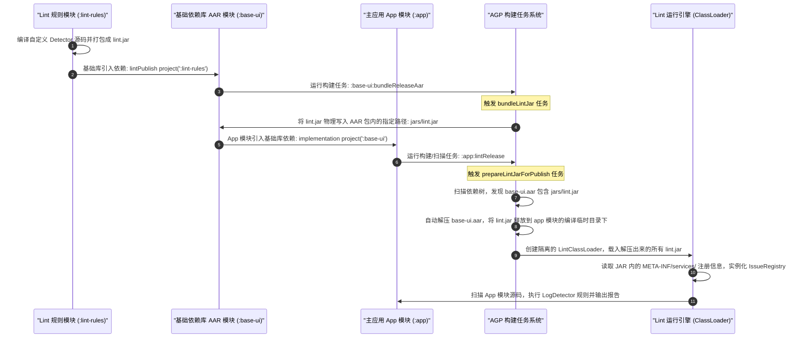

# 5.3.7.4 Android Lint 静态分析引擎深度剖析

在大型多人协作的 Android 生产项目中，代码质量的卡控与团队规范的落地是研发效能领域的痛点。随着项目规模的扩大与团队成员的更迭，诸如不合规的日志打印、非线程安全的方法调用、敏感隐私 API 调用、硬编码颜色与废弃 API 的滥用等问题层出不穷。传统的 Code Review 与运行期测试手段虽然必不可少，但它们要么消耗大量人工成本，要么在研发流程的后期（如集成测试或线上运行期）才暴露缺陷，导致修复成本成倍增加。

Android Lint 作为 Android 官方主推的静态代码分析工具，提供了一种“Shift-Left（左移）”的防御范式。它无需编译，更无需运行代码，即可在秒级时间内扫描出代码隐患。本篇文章将从静态代码分析的理论根基出发，深度解密 Android Lint 的核心架构、统一抽象语法树（UAST）物理重构、四层 Scanner 职责分工、自定义规则开发与 LintFix 自动修复、AGP 下 of `lintPublish` 物理分发闭环以及 CI/CD 质量门禁与单元测试，带你彻底攻克 Android 静态代码分析的核心技术。

---

## 一、静态代码分析范式与编译前防御

### 1.1 软件工程中的质量关口“左移”（Shift-Left）

在经典软件工程理论中，缺陷被发现的阶段越晚，其修复成本就呈指数级上升。根据软件工程学中的 **Boehm 缺陷修复成本模型（Boehm's Cost-of-Change Curve）** 所示：

$$C_{fix} \propto 10^{d}$$

其中，$C_{fix}$ 表示修复成本，$d$ 表示缺陷在生命周期中被发现的阶段指数（0：编码期，1：单元测试期，2：集成测试期，3：灰度发布期，4：生产环境）。

如果在编码阶段修复一个 Bug 的成本为 1，那么在集成测试阶段将上升到 10，而在生产环境发布后则会暴增至 100 甚至更高。

```
[ 修复成本 ]
  ▲
  │                                           █ 生产环境 (100x)
  │                                         ▄◤
  │                                       ▄◤
  │                                     ▄◤
  │                                   █ 集成测试 (10x)
  │                                 ▄◤
  │                               ▄◤
  │                    █ 单元测试 (3x)
  │                  ▄◤
  │       █ 编码期 (1x)
  └────────────────────────────────────────────────────────► [ 开发阶段 ]
```

静态代码扫描的核心价值正是将质量防御的关口最大化“左移”（Shift-Left）。通过自动化的静态工具卡控，在代码提交（Commit）甚至编写的当下，静默拦截潜在的 Bug。

与其他的质量保障手段相比，静态扫描具有独特的定位：
1. **与单元测试对比**：单元测试依赖开发者主动编写测试用例，难以覆盖所有的边缘路径，且需要运行在 JVM 或真机上；静态扫描是对全部源码进行无死角覆盖，能够检查业务逻辑外的安全合规、性能瓶颈、资源冗余等问题。
2. **与 Code Review 对比**：人工审查往往聚焦于架构设计与核心逻辑，难以分出精力去检查诸如“ImageView 缺少 `contentDescription` 属性”、“在循环体中调用了字符串拼接”等细碎的规范；静态扫描能够高精度地完成这些重复工作。
3. **与运行时分析对比（如 LeakCanary）对比**：运行时分析依赖于特定的执行路径，只有在特定操作导致内存泄漏时才能捕获异常；静态扫描通过分析引用链和生命周期，在编码阶段就能对不当的 Context 持有、静态变量滥用等发出警告。

### 1.2 Android Lint 的静默拦截技术与 IDE 实时增量解析

在大型 Android 项目中，完整的编译打包（Assemble）可能耗时数分钟甚至数十分钟。如果静态扫描必须依赖编译产物，那么静态检查的反馈周期就会变得极长，沦为 CI 上的“事后检查”，失去其实时防御的物理意义。

Android Lint 的最大技术特性在于：**在不编译、不运行代码的前提下，静默拦截缺陷**。其高效运行的核心在于 Android Studio / IntelliJ IDEA 后台运行的 **Lint Daemon 守护进程**：

1. **增量解析（Incremental Parsing）**：当开发者在编辑器中输入字符时，Lint 并不会去解析整个项目，而是启动后台增量解析器，仅针对当前编辑的物理文件进行局部语法树构建。
2. **秒级反馈**：Lint 引擎在内存中计算出差异后，通过标记物理字符的偏移量，在相应的违规代码下方绘制红黄色波浪线。这种毫秒级的反馈，让开发者在编码过程中自发地修正了错误，达到了“静默拦截”的防御效果。

### 1.3 团队协作下的典型应用场景分析

在大型多人协作的项目中，Lint 主要承担以下四类规范拦截：
* **API 兼容性卡控**：防止开发者调用了高于项目 `minSdkVersion` 的系统 API，避免在低版本设备上运行时发生 `NoClassDefFoundError` 或 `NoSuchMethodError`。
* **隐私合规性扫描**：在用户同意隐私协议前，禁止调用 `TelephonyManager.getDeviceId()`、`WifiInfo.getMacAddress()` 等敏感 API。通过自定义 Lint 规则，可以实现对这些 API 的绝对拦截。
* **性能与资源冗余**：自动拦截 `ConstraintLayout` 的过度嵌套、无用的资源文件（Unused Resources）、在 `onDraw` 方法中分配临时对象等性能隐患。
* **架构规范强约束**：例如禁止直接调用原生 `android.util.Log`，强制使用统一封装的日志组件；禁止在非主线程直接操作 UI 元素；强制所有的 Activity 必须继承自底层的 `BaseActivity`。

---

## 二、静态分析之魂：AST（抽象语法树）与 UAST（统一抽象语法树）解密

要想实现对源代码的深度分析，仅仅进行文本匹配（如使用正则表达式）是远远不够的。正则表达式无法识别复杂的语法结构、变量作用域、方法重载以及类型继承关系。静态分析的真正灵魂，在于对 **抽象语法树（Abstract Syntax Tree, AST）** 的构建与解析。

### 2.1 编译器前端的核心工作流

静态分析本质上是编译器前端（Compiler Frontend）工作流的延伸。编译器将源码文本转化为可执行字节码的过程，通常要经过如下前端步骤：

```
[ 源码字符流 ] 
      │
      ▼ (1. 词法分析 - Lexical Analysis)
[ Token 序列 ] (例如: KEYWORD_FUN, IDENTIFIER, LPAREN, RPAREN)
      │
      ▼ (2. 语法分析 - Syntax Analysis)
[ 抽象语法树 (AST) ] (树状节点, 消除物理冗余符号)
      │
      ▼ (3. 语义分析 - Semantic Analysis)
[ 带有类型符号信息的 AST ] ──> [ 静态分析器 (Lint Detector) ]
```

#### 2.1.1 词法分析（Lexical Analysis）与 DFA 状态转移
词法分析器（Lexer，又称 Scanner）读入源文件字符流，将其按照文法规则分割成具有独立语义的最小单元——**Token（标记）**。
在物理实现上，词法分析器通常由一个**确定有限状态自动机（Deterministic Finite Automaton, DFA）**驱动。当读取到字符时，自动机根据当前状态和输入字符进行状态转移。例如，当遇到字符 `v`、`a`、`l` 且其后跟着空格时，状态机转移到“关键字 Token”状态，输出 `VAL` 标记。

#### 2.1.2 语法分析（Syntax Analysis）与 CFG 抽象语法树构建
语法分析器（Parser）消费 Token 序列，根据**上下文无关文法（Context-Free Grammar, CFG）**判定代码结构是否合法，并构建出一棵**语法分析树（Parse Tree，又称具体语法树 CST）**。在此基础上，Parser 会精简掉多余的物理符号（如分号、括号、空格），抽取出核心的逻辑骨架，形成**抽象语法树（AST）**。
例如，表达式 `a = b + 3` 经由语法分析后会生成一棵如下的树状图：

```
       AssignmentExpression
            /        \
     Identifier(a)  BinaryExpression(+)
                        /         \
                 Identifier(b)   Literal(3)
```

#### 2.1.3 语义分析与符号表（Symbol Table）的绑定
仅仅有树状结构，分析器还无法判断 `b` 变量到底代表什么类型、调用的方法是哪一个重载版本。语义分析器会遍历 AST，进行**类型检查（Type Checking）**与**符号绑定（Symbol Resolution）**，填充**符号表（Symbol Table）**。这使得静态扫描引擎在拿到一个方法调用节点时，能够跨模块解析出该方法的签名、返回值及其所属类的继承链。

### 2.2 IntelliJ 平台 PSI（Program Structure Interface）机制

#### 2.2.1 为什么 IDE 需要 PSI
在 JetBrains 的 IntelliJ 平台生态中，为了支持 IDE 独有的实时代码补全、重构、快速跳转、格式化等特性，设计了一套特殊的 AST 实现体系——**PSI（Program Structure Interface，程序结构接口）**。
与传统的编译器 AST 相比，PSI 具有两大核心设计初衷：
1. **物理细节保留**：PSI 保留了所有的物理细节，包括空格、注释、分号、换行符等（称为 White Spaces）。因为 IDE 在进行重构和自动格式化时，必须保证非修改区域的物理格式不被破坏。
2. **双向增量更新**：PSI 支持极其强大的双向导航与增量解析。当用户修改了某个文件的一行代码时，IDEA 无需重新解析整个文件，只需局部更新对应的 PSI 子树。同时，每个 `PsiElement` 都持有 `getParent()` 和 `getChildren()` 指针，允许在整棵树上自由双向穿梭。

#### 2.2.2 Java PSI 与 Kotlin PSI 的结构割裂
当 Kotlin 成为 Android 的一级开发语言后，Java 与 Kotlin 混编（Polyglot）成为常态。这给 Lint 自定义规则的设计带来了巨大的挑战：
* **Java PSI** 节点以 `PsiClass`、`PsiMethod`、`PsiLiteralExpression` 等表示。
* **Kotlin PSI** 节点则基于 Kotlin 编译器的物理映射，以 `KtClass`、`KtNamedFunction`、`KtProperty` 等表示。
两套 API 的设计哲学、类名和遍历方法完全撕裂。如果开发者想编写一条“禁止在代码中直接使用魔数”的规则，必须针对 Java 的 `PsiLiteralExpression` 和 Kotlin 的 `KtConstantExpression` 分别编写逻辑，这导致自定义 Lint 规则维护成本极高，极易产生漏报与误报。

### 2.3 UAST（Universal AST）物理重构

#### 2.3.1 UAST 作为包装器（Wrapper）的架构设计
为了抹平 JVM 多语言之间的语法差异，JetBrains 推出了 **UAST（Universal AST，统一抽象语法树）**。
UAST 并不是一种全新的、能够独立解析源码字符流的编译器前端。相反，它是一个运行在各大 JVM 语言 PSI 树之上的**包装层（Wrapper）**。
无论是 Java 源码解析出的 Java PSI，还是 Kotlin 源码解析出的 Kotlin PSI，UAST 都在其物理节点之上套了一层统一的包装。通过向开发者屏蔽底层 PSI 的异构差异，抽象出一套面向 JVM 语言的通用语法模型。

```
                    ┌─────────────────────────┐
                    │  UElement (UAST 统一接口) │
                    └────────────┬────────────┘
                                 │
                 ┌───────────────┴───────────────┐
                 ▼                               ▼
       ┌───────────────────┐           ┌───────────────────┐
       │   Java UAST 包装  │           │  Kotlin UAST 包装 │
       └─────────┬─────────┘           └─────────┬─────────┘
                 │ (持引用)                      │ (持引用)
                 ▼                               ▼
       ┌───────────────────┐           ┌───────────────────┐
       │   PsiJavaFile     │           │     KtFile        │
       │   PsiClass        │           │     KtClass       │
       │   PsiMethod       │           │     KtFunction    │
       │ (Java PSI 物理节点)│           │ (Kotlin PSI 物理节点)│
       └───────────────────┘           └───────────────────┘
```

#### 2.3.2 统一的 UElement 树状节点模型与父子引用机制
在 UAST 中，几乎所有的语法节点都继承自 `UElement`。以下是常用的核心 UAST 节点类：
* **`UFile`**：代表整个源文件。可获取包名、导入列表（`imports`）以及文件内声明的类。
* **`UClass`**：代表类、接口或 Enum 声明。屏蔽了 Java `class` 与 Kotlin `class` 的声明差异。
* **`UMethod`**：代表函数或方法。对于 Kotlin 的顶层函数（Top-level Function）或属性 getter/setter，UAST 也会将其统一映射为 `UMethod`。
* **`UVariable`**：代表变量声明，包括局部变量、方法参数、类成员字段（`UField`）。
* **`UExpression`**：代表所有具有返回值的表达式。它是 UAST 中最庞大、最复杂的子类树。
  * **`UCallExpression`**：代表方法调用、构造函数调用或数组创建。
  * **`UBinaryExpression`**：代表二元运算（如 `a + b`）。
  * **`ULiteralExpression`**：代表字面量（如字符串 `"hello"`、数字 `123`）。
  * **`UBlockExpression`**：代表代码块。
  * **`UReturnExpression`**：代表 return 语句。

在底层的物理表达上，PSI 并非是一棵单向的静态树，它支持复杂的双向导航。每个 `PsiElement` 都持有 `getParent()` 指针，对应的，`UElement` 也封装了 `uastParent` 属性。这种父子双向引用机制，允许 Detector 在匹配到某个局部节点后，能够顺着指针一路向上追溯其宿主环境（例如追溯当前表达式是否处于某个特定的 `UClass` 或特定的 `UMethod` 中）。

在某些特定的代码风格检查中（如检测“对敏感 API 的调用上方必须编写安全审查注释”），由于 UAST 默认过滤掉了无语义的空格与注释，我们无法直接从 UAST 节点获取相邻的注释信息。此时，就需要采用**“降级混合分析”**：通过调用 `UElement.sourcePsi` 拿到物理 PSI，然后在物理 PSI 层面上利用 `PsiElement.getPrevSibling()` 等方法在物理节点链中前后检索 `PsiComment`。这种 UAST 与底层 PSI 灵活混合的手段，是编写高级 Lint Detector 的必修课。

#### 2.3.3 UAST 转换的内存开销与延迟解析（Lazy Evaluation）
必须清醒地认识到，**UAST 的便捷性是有代价的**。因为 UAST 本质上是包装器，所以在访问 UAST 节点时，会产生动态创建包装对象的内存开销和 CPU 属性查找耗时。
为了将开销降到最低，UAST 采用了**延迟解析（Lazy Evaluation）**与**按需转换**的物理机制：
1. **只在必要时转换**：Lint 引擎在初步扫描文件时，仍然是在底层的 PSI 层面上进行快速遍历。只有当遇到可能匹配规则的节点时，才会将其转换为 UAST 节点提供给 Detector。
2. **显式转换 API**：在编写 Detector 时，如果我们需要从底层的 PSI 节点（例如通过类型解析拿到的 `PsiElement`）获取其 UAST 表达，可以使用 `toUElement()` 扩展函数。这是一个相对昂贵的操作，它会去内存的 AST 缓存中查找或重新构建 UAST 包装对象。
3. **降级机制**：在一些极端复杂的语法场景（如极度复杂的泛型推导、非标准的 DSL 嵌套）或者源码存在严重语法错误、IDE 索引尚未建完的情况下，UAST Bridge 可能会转换失败。此时，UAST 会发生降级，对应的 `toUElement()` 会直接返回 `null`，或者将某些节点退化表达为底层的原生 `PsiElement`。因此，在 Detector 源码中，必须时刻进行防御性非空判断。

### 2.4 双源语法树转换的五大深层大坑与避坑指南

尽管 UAST 极力抹平 Java 与 Kotlin 的差异，但两门语言底层的编译器设计哲学完全不同，导致在转换时存在很多“隐形大坑”：

#### 2.4.1 坑一：Kotlin 属性（Property）与 Java 字段（Field）及 Getter/Setter 的阻抗失配
在 Kotlin 中声明一个属性：
```kotlin
class User {
    var nickname: String = "Alice"
}
```
看似它只是一个成员变量，但在底层 Kotlin 编译器为其生成了一个私有字段 `nickname` 和两个公共的方法 `getNickname()` 与 `setNickname()`。
在 UAST 中：
* 如果你在遍历 `UClass.fields`，在 Kotlin 视角里可能会拿到 `nickname` 这个 `UField`。
* 但在 Java 视角去访问这个类时，它其实是通过方法调用 `getNickname()`。如果你的 Detector 规则旨在拦截“禁止直接访问 `User.nickname`”，若仅仅拦截了 `USimpleNameReferenceExpression` 或者是 `UField`，当 Java 代码调用 `user.getNickname()` 时就会发生漏报。
* **避坑指南**：检测字段访问时，必须同时使用 `evaluator.isMemberInClass(method, "User")` 以及拦截 `getNickname`/`setNickname` 方法名，或者在解析 `UCallExpression` 时判断其 resolved method 是否对应 Kotlin 属性的合成 getter。

#### 2.4.2 坑二：Kotlin 扩展函数的静态化本质与 Receiver 解析差异
Kotlin 允许我们编写扩展函数：
```kotlin
fun Context.showToast(msg: String) { ... }
```
In Kotlin 代码中，调用方式为 `context.showToast("hello")`，看起来像是一个实例方法调用。
然而，在编译成字节码后，它实际上是一个静态方法调用，物理形态等同于 `ExtKt.showToast(context, "hello")`。
在 UAST 中：
* 尽管它被表达为 `UCallExpression`，但它的 `receiver`（接收者）在底层 PSI 层面和常规的实例方法调用是不同的。
* 在 Kotlin 调用中，`context` 被解析为 `receiver`；而在 Java 调用中，`context` 被解析为 `valueArguments` 的第一个元素（Index 0），此时 `callExpression.receiver` 将返回 `null`。
* **避坑指南**：如果你的 Detector 需要提取方法的目标操作对象（即 Receiver 对应的实体），不能只读取 `call.receiver`。必须首先通过 `evaluator.isStatic(method)` 以及扩展方法的标志，识别出这是 Kotlin 扩展函数。若是，且在 Java 侧调用，则取 `call.valueArguments[0]` 作为 Receiver；若在 Kotlin 侧调用，则取 `call.receiver`。

#### 2.4.3 坑三：内联函数（Inline Functions）与 Lambda 作用域穿透在静态期的非展开矛盾
Kotlin 的 `inline` 关键字会使编译器在编译期将函数体直接复制到调用处。
但在 UAST 的静态分析阶段，**代码还没有被内联展开**，UAST 呈现的依然是函数调用的节点结构。这在进行跨方法的控制流分析（Control Flow Analysis）时，会产生严重的判定偏差：
```kotlin
fun foo() {
    runSafe {
        if (error) return // 这会直接使外部方法 foo() 返回，而不是仅仅退出 Lambda
    }
}
```
* **物理机制**：非局部返回（Non-local Return）在静态语法树上依然处于一个 Lambda 闭包内。如果静态扫描器只把它当作普通的局部 Lambda 退出，就会漏掉“外部函数已在此处退出”的重要控制流分支，从而导致“资源未释放”等规则的误报。
* **避坑指南**：分析 `UReturnExpression` 时，若发现其 `uastParent` 属于一个 Lambda 表达式，必须向上追溯该 Lambda 的宿主方法。如果宿主方法是内联函数（可通过 `context.evaluator.isInline(inlineMethod)` 判断），则该 return 代表外部函数的退出。

#### 2.4.4 坑四：Kotlin 合成方法（componentN, copy）的 `sourcePsi == null` 防御处理
对于 Kotlin Data Class，编译器会自动合成 `component1()`, `component2()`, `copy()`, `equals()`, `hashCode()`, `toString()` 等方法。
如果在 Detector 中拦截到了对 `copy()` 的调用，并试图通过 `method.sourcePsi` 获取其声明处的源码字符流：
* **物理机制**：因为在 `.kt` 源码中根本不存在这些方法的物理声明，它们是编译器在内存中合成出来的，因此 `method.sourcePsi`（即底层物理 `PsiMethod`）为 `null`。如果你在 Detector 中直接调用 `method.sourcePsi!!.text` 就会导致 NullPointerException，造成扫描中断。
* **避坑指南**：获取 Location 时，应当总是使用 `context.getLocation(node)`（UCallExpression 节点的定位，它是有物理源码的，对应调用处的代码），而不是使用 `context.getLocation(method)`（方法声明的定位）。同时，对任何通过 AST 获取 `sourcePsi` 后的操作，必须做强防御性非空校验。

#### 2.4.5 坑五：Kotlin 默认参数与 JVM 底层合成方法（`$default`）的分析陷阱
Kotlin 允许在方法声明中提供默认参数：
```kotlin
fun download(url: String, force: Boolean = false)
```
在编译为字节码时，Kotlin 编译器除了生成 `download(String, boolean)` 之外，还会生成一个特殊的合成方法：
```java
public static void download$default(Downloader var0, String var1, boolean var2, int var3, Object var4)
```
其中 `var3`（int mask）是一个二进制掩码，用于标识哪些参数使用了默认值。
* **物理机制**：如果 Java 视角调用的三方库是已编译的 class，且该调用依赖了默认参数，类型解析器返回给 Lint 的 `PsiMethod` 可能会是这个合成的 `download$default`，导致你在匹配方法名 `"download"` 时发生脱靶（因为它变成了 `"download$default"`）。
* **避坑指南**：在比较方法名时，应当使用 `method.name` 的去后缀化逻辑。如果方法名以 `$default` 结尾，需先通过字符串裁剪还原出真实的方法名再进行匹配。

---

## 三、Lint 核心架构元素与四层 Scanner 职责分工

Android Lint 的架构设计非常精巧，它通过解耦“元数据声明（Issue）”、“检测逻辑（Detector）”与“扫描行为契约（Scanner）”，构建了一个极具扩展性的静态分析引擎。

```
                     ┌──────────────────┐
                     │      Issue       │ (声明 ID、严重级别、范围、绑定的 Detector)
                     └────────┬─────────┘
                              │ (绑定)
                              ▼
                     ┌──────────────────┐
                     │     Detector     │ (具体的检测逻辑容器)
                     └────────┬─────────┘
                              │ (实现接口)
          ┌───────────────────┼───────────────────┬───────────────────┐
          ▼                   ▼                   ▼                   ▼
┌───────────────────┐┌───────────────────┐┌───────────────────┐┌───────────────────┐
│SourceCodeScanner  ││    XmlScanner     ││   GradleScanner   ││   ClassScanner    │
│ (Java/Kotlin 源码)││  (Layout/Manifest)││ (Gradle 编译脚本)  ││ (编译后字节码 ASM) │
└───────────────────┘└───────────────────┘└───────────────────┘└───────────────────┘
```

### 3.1 Issue：缺陷元数据的定义与卡控级别

在 Lint 框架中，一个 `Issue` 实例代表一种特定类型的代码缺陷或规范漏洞。它是规则的元数据容器。我们通过 `Issue.create` 静态方法来定义它：

```kotlin
val ISSUE = Issue.create(
    id = "IllegalLogUse",
    briefDescription = "禁止直接使用 Android 原生 Log 日志类",
    explanation = "在生产环境中，直接使用 android.util.Log 打印日志会导致敏感信息泄露，" +
                  "且无法在 release 包中统一关闭。请使用项目统一封装的 MyLogger 工具类。",
    category = Category.CORRECTNESS,
    priority = 6,
    severity = Severity.ERROR,
    implementation = Implementation(
        LogDetector::class.java,
        Scope.JAVA_FILE_SCOPE
    )
)
```

#### 核心参数深度剖析：
* **`id`**：Issue 的唯一标识符。要求简短且具有自解释性，不能与官方现有的 Issue 重名。它是开发者在代码中使用 `@SuppressLint("Id")` 来静默该警告的唯一凭证，也是在 `build.gradle` 中进行全局配置的 Key。
* **`category`**：分类。Lint 预设了多个分类维度，如 `Category.CORRECTNESS`（正确性问题）、`Category.PERFORMANCE`（性能问题）、`Category.SECURITY`（安全隐患）、`Category.USABILITY`（易用性问题）。
* **`severity`**：严重级别。这是卡门禁的物理基础：
  * `Severity.FATAL`：致命错误。默认会阻断编译，且无法被轻易忽略。
  * `Severity.ERROR`：一般错误。在 `abortOnError true` 配置下，会使 Gradle 的 `lint` 任务失败，阻断 CI 合并。
  * `Severity.WARNING`：警告。默认会输出在报告中，但不会阻断编译。
* **`implementation`**：绑定实现。它将当前的 `Issue` 关联到具体的 `Detector` 类，并指定其**扫描范围（Scope）**。`Scope` 是一个 EnumSet，告诉 Lint 引擎在运行这个 Issue 的检查时，需要把哪些类型的文件喂给 Detector。例如，`Scope.JAVA_FILE_SCOPE` 代表只扫描 Java/Kotlin 源码；`Scope.MANIFEST_SCOPE` 代表只扫描 AndroidManifest.xml 文件。

### 3.2 Detector：无状态生命周期与多线程安全防线

`Detector` 是一个抽象类。自定义 Lint 规则的本质，就是继承 `Detector` 并实现一个或多个 `Scanner` 接口。

* **生命周期与无状态设计**：
  在一次 Lint 扫描任务中，Lint 引擎会根据注册的 Issue 列表，通过反射实例化对应的 Detector。
  **重要警告**：为了提高扫描性能，Lint 引擎可能会在多线程环境下并发执行，或者在扫描同一个项目下的数百个文件时复用同一个 Detector 实例。因此，Detector 类内部**严禁持有任何与特定文件扫描上下文相关的非静态成员变量**（如保存当前正在扫描的类名、临时节点等）。所有扫描过程中的状态传递，必须物理依托于 Lint 传递进来的 `Context` 对象，或者在方法局部变量中完成。一旦违反无状态设计，会导致极其诡异的并发冲突与扫描结果错乱。

### 3.3 Context 与 Project 作用域的深度绑定

在 Detector 的所有回调方法中，第一个入参总是 `Context`（或其子类 `JavaContext`、`XmlContext`）。它是我们与 Lint 引擎、项目元数据进行交互的核心媒介。
* **`Project` 实体**：
  通过 `context.project`，我们可以获取当前正在扫描的 Gradle Module 的所有物理配置，包括 `minSdkVersion`、`targetSdkVersion` 等。
* **`context.project` 与 `context.mainProject` 的关键差异**：
  在多模块（Multi-module）工程中，这是最容易发生混淆的地方：
  * **`context.project`**：指当前正在扫描的模块（可能是一个底层的 Library 模块）。
  * **`context.mainProject`**：指最终打包构建的顶级 App 模块。
  许多静态规范或漏洞卡控（例如，特定高危权限的声明）仅仅在 App 模块的 Manifest 中有实际影响，而在 Library 中声明则无意义。如果在扫描 Library 模块时也报出警告，就会产生大量的干扰。
  **开发实践**：在编写只适用于主工程的规则时，必须在 Detector 入口处添加过滤：
  ```kotlin
  if (context.project != context.mainProject) {
      return // 过滤 Library 模块，仅在主 Application 模块执行该规则
  }
  ```

### 3.4 四层 Scanner 契约与回调分发机制

Lint 引擎针对不同类型的文件，设计了四层 Scanner 接口契约。Detector 通过实现不同的接口，来声明自己对哪些媒介感兴趣，并获得相应的回调 API。

#### 3.4.1 `SourceCodeScanner`（源码检查）
这是最常用、功能最强大的 Scanner，用于检查 Java 和 Kotlin 源代码。
* **物理分发机制（Visitor 模式）**：
  在底层的 `UastParser` 解析出 UAST 树之后，Lint 会构建一个 `UElementHandler` 并通过 `SourceCodeScanner` 注册。
  当我们在 Detector 中重写 `getApplicableMethodNames()` 并返回 `listOf("d", "e", "w")` 时，Lint 的分发器在深度优先遍历 UAST 树的过程中，一旦遇到 `UCallExpression` 且其调用的方法名在注册列表中，就会触发 `visitMethodCall` 回调。这种“精确注册监听”加“事件回调”的设计，规避了全量扫描整棵语法树的 $O(N)$ 复杂度，是 Lint 能够保持秒级响应的底层算法保障。

#### 3.4.2 `XmlScanner`（布局与清单文件检查）
用于扫描 XML 格式的资源文件。
* **物理机制**：Lint 引擎在底层使用标准的 XML Parser 将 XML 文件解析为一棵 W3C DOM 树，然后以深度优先的方式遍历 DOM 节点，触发对应的回调。
* **核心 API**：通过 `getApplicableElements()` 注册感兴趣的标签（如 `"ImageView"`），当 DOM 树中遇到匹配的标签时，会通过 `visitElement(context, element)` 将 `org.w3c.dom.Element` 传入。

#### 3.4.3 `GradleScanner`（Gradle 脚本规范检查）
用于检查项目的构建配置文件（如 `build.gradle`、`build.gradle.kts`）。
* **物理机制**：由于 Gradle 脚本存在 Groovy 和 Kotlin DSL 两种截然不同的语法，Lint 在底层对它们做了一层模拟的依赖键值树解析，使得我们能够以 key-value 的形式去获取诸如 `dependencies` 闭包中的依赖库声明、`compileSdkVersion` 的配置值等，而无需自己编写复杂的 DSL 解析器。

#### 3.4.4 `ClassScanner`（编译后 Class 字节码二进制扫描）
用于扫描编译产生的 `.class` 字节码文件，或者第三方依赖 JAR/AAR 中的二进制 Class。
* **物理机制**：当某些依赖库只有二进制产物、没有源码提供时，`SourceCodeScanner` 便无能为力。此时，`ClassScanner` 通过引入著名的 **ASM** 框架，直接在字节码层层面对 Class 结构进行流式读取与分析。
* **ASM 字节码分析**：它通过 `checkClass(context, classNode)` 传入 ASM 框架的 `org.objectweb.asm.tree.ClassNode` 节点。我们可以通过分析其 `methods` 列表下的 `InsnList` 指令集，识别出底层是否包含了非法的字节码指令调用（例如直接调用反射、敏感系统 API 等）。

---

## 四、自定义 Lint 规则实战：节点拦截与物理打包分发

在本章节中，我们将开发一个具体的自定义规则项目。
**项目需求**：检测工程中所有直接调用 Android 系统原生 `android.util.Log` 的代码，提示开发者替换为团队封装的 `MyLogger`，并提供一键自动替换（LintFix）的快捷功能。

### 4.1 核心算法：基于 AST 节点拦截的深度优先遍历（DFS）

Lint 的 UAST 遍历在底层是一个典型的 DFS。当我们在 `SourceCodeScanner` 中声明我们关心的语法节点类型时，Lint 引擎就会在 DFS 遍历到该节点时回调我们。
对于我们要拦截的方法调用，我们通过 `getApplicableMethodNames` 告诉引擎我们感兴趣的方法名，然后在 `visitMethodCall` 中利用 `evaluator` 做类型限定：

```
UFile (DFS 开始)
  ├── UClass
  │     └── UMethod
  │           └── UBlockExpression
  │                 ├── UCallExpression (检测到方法名 "d")
  │                 │     ├── [触发匹配] ──> visitMethodCall() ──> [类型验证: android.util.Log?]
  │                 │     │                                       ├── Yes ──> context.report()
  │                 │     │                                       └── No  ──> 放行
  │                 │     └── ULiteralExpression
  │                 └── UReturnExpression
```

### 4.2 实战源码：LogDetector 的完整 Kotlin 源码与物理原理

以下是自定义 `LogDetector` 的完整 Kotlin 源码实现。请阅读代码中详尽的中文注释以理清其物理工作流程：

```kotlin
package com.example.lint.rules

import com.android.tools.lint.detector.api.*
import org.jetbrains.uast.UCallExpression
import org.jetbrains.uast.UElement
import java.util.EnumSet

/**
 * 自定义 Lint 检测器：拦截 android.util.Log 的非法调用，并提供自动修复 (LintFix)
 */
class LogDetector : Detector(), Detector.UastScanner {

    companion object {
        // 声明我们要拦截的方法名称集合
        private val TARGET_METHODS = listOf("v", "d", "i", "w", "e", "wtf")

        // 目标类的全路径
        private const val TARGET_CLASS = "android.util.Log"

        // 推荐替换的目标类
        private const val REPLACEMENT_CLASS_NAME = "MyLogger"

        // 定义 Issue 的元数据
        val ISSUE = Issue.create(
            id = "IllegalLogUse",
            briefDescription = "禁止直接使用 Android 原生 Log 日志类",
            explanation = """
                在生产环境中，直接使用 android.util.Log 打印日志会导致敏感信息泄露，
                且无法在 release 包中统一关闭。请使用项目统一封装的 MyLogger 工具类。
                MyLogger 支持在 Release 环境下自动静默日志输出，并提供统一的日志拦截与上报格式。
            """.trimIndent(),
            category = Category.CORRECTNESS,
            priority = 6,
            severity = Severity.ERROR,
            implementation = Implementation(
                LogDetector::class.java,
                Scope.JAVA_FILE_SCOPE // 仅扫描 Java/Kotlin 源代码文件
            )
        )
    }

    /**
     * 1. 注册我们感兴趣的方法名列表。
     * Lint 引擎在遍历 AST 时，一旦遇到这些方法名，就会回调 visitMethodCall。
     */
    override fun getApplicableMethodNames(): List<String>? {
        return TARGET_METHODS
    }

    /**
     * 2. 方法调用被匹配时的核心处理逻辑。
     * @param context 扫描上下文，提供了报告错误、获取文件信息、评估器 Evaluator 的能力
     * @param node 当前匹配到的 UAST 方法调用节点
     * @param method 物理方法定义节点 (PsiMethod)
     */
    override fun visitMethodCall(
        context: JavaContext,
        node: UCallExpression,
        method: com.android.psi.PsiMethod
    ) {
        val evaluator = context.evaluator

        // 物理防线：必须判断调用的方法是否确实属于 android.util.Log 类。
        // 防止开发者自己写了一个叫 Log 的类或者其他三方库的同名方法被误拦截。
        if (!evaluator.isMemberInClass(method, TARGET_CLASS)) {
            return
        }

        // 3. 构建自动修复方案 (LintFix / QuickFix)
        // 我们的目标是把 "Log.d(TAG, "msg")" 替换成 "MyLogger.d(TAG, "msg")"
        val oldSource = node.sourcePsi?.text ?: return
        
        // 简单的物理字符串替换：将开头的 "Log." 替换为 "MyLogger."
        // 更好的做法是利用 AST 获取 receiver 节点进行精准替换，此处作为演示采用 replace 策略
        val newSource = oldSource.replaceFirst("Log.", "$REPLACEMENT_CLASS_NAME.")

        val quickFix = LintFix.create()
            .name("将此调用替换为 $REPLACEMENT_CLASS_NAME") // 在 Android Studio 的 Alt+Enter 菜单中显示的文案
            .replace()
            .with(newSource) // 修复后的新代码
            .autoFix() // 标记该修复是否可以静默执行（如在保存或提交时自动修复）
            .build()

        // 4. 上报 Issue
        context.report(
            issue = ISSUE,
            scope = node, // 警告波浪线标记的代码节点
            location = context.getLocation(node), // 获取该节点在物理文件中的行号、列号与字符偏移区间
            message = "请使用项目统一封装的 $REPLACEMENT_CLASS_NAME 替代原生 $TARGET_CLASS",
            quickfixData = quickFix // 绑定自动修复数据
        )
    }
}
```

### 4.3 自动修复（LintFix）的底层机制与物理安全

在上述源码中，我们使用了 `LintFix.create().replace().with(newSource).build()`。这是 Lint 提供的自动修复机制，其物理工作原理如下：

1. **AST 范围定位（Location Mapping）**：当 Lint 检测到缺陷并调用 `context.report` 时，它会为该 Issue 绑定一个 `Location`。该 Location 包含了文件名、起始字符偏移量（`startOffset`）以及终止字符偏移量（`endOffset`）。
2. **纯文本差异生成（Diff Generation）**：`LintFix` 会根据绑定的 Location 区域，在内存中计算出“被替换文本”和“替换后文本”的差异。当用户在 IDE 中触发 Alt+Enter 时，IDE 会在后台将 `newSource` 字符替换到物理文件的 `[startOffset, endOffset]` 区间内。
3. **物理安全性**：因为静态分析不涉及编译，自动替换本质上是在操作**字符偏移量**。如果一个 Detector 自动修复时生成的 `newSource` 包含了语法错误（例如少了一个括号），或者在多线程并发修改同一个文件时偏移量计算发生冲突，就会破坏源码结构。因此，Lint 规定所有声明为 `autoFix()` 的规则，其替换逻辑必须是局部的、不改变大范围缩进和层级结构的。对于复杂的重构，应仅提供 `name()` 提示，而不应开启静默自动修复。

### 4.4 lintPublish 物理闭环机制走读

在组件化或大型 Android 项目中，自定义的 Lint 规则通常被编写在一个独立的 `Java/Kotlin Library` 模块中。如果需要让整个工程的几十个业务 Module 以及团队内的所有人都能无感地运行这套规则，我们就必须依赖 Android Gradle Plugin（AGP）底层的 **`lintPublish` 分发机制**。

下面是自定义 Lint 规则从编译、打包到在主工程中解压、载入 ClassLoader 运行的物理闭环流程图：



#### 4.4.1 自定义 Lint 规则的编译与 JAR 插件注册
自定义 Lint 规则模块（如 `:lint-rules`）在编译后会输出一个标准的 Java JAR 包。为了让 Lint 引擎识别，我们必须在 JAR 的 `META-INF/services/com.android.tools.lint.client.api.IssueRegistry` 配置文件中，写入自定义 `IssueRegistry` 的全路径类名。Lint 引擎在启动时会通过 `ServiceLoader` 读取该服务描述文件，从而发现并加载自定义的 Issue 列表。

#### 4.4.2 AGP 源码级任务执行链
1. **AAR 模块打包阶段（`bundleLintJar` 任务）**：
   当执行 `:base-ui:bundleReleaseAar` 构建任务时，AGP 的 `BundleLintActions` 会介入。它会从指定的 `lintPublish` 配置中拉取编译好的 JAR 文件，重命名为 `lint.jar`，并将其物理放入 AAR 的归档结构中，路径为 `jars/lint.jar`。
   你可以解压任何由 `lintPublish` 产出的 AAR 观察其物理结构：
   ```
   my-library.aar
   ├── AndroidManifest.xml
   ├── classes.jar
   ├── res/
   └── jars/
       └── lint.jar  <-- 物理打包进来的 Lint 规则插件
   ```
2. **App 消费与解压阶段（`prepareLintJar` 任务）**：
   当主应用模块 `:app` 声明了对 `:base-ui` 的依赖，并在 CI 或本地运行 `./gradlew :app:lintRelease` 时，AGP 的构建任务流启动。
   - `PrepareLintJar` 任务会扫描 App 模块的全量依赖树（包括本地 Project 依赖和来自 Maven 仓库的远程 AAR 依赖）。
   - 一旦发现依赖的 AAR 内部包含 `jars/lint.jar`，AGP 会自动将该 `lint.jar` 解压物理释放到 App 的临时构建目录下（通常为 `app/build/intermediates/lint_publish_jar/release/`）。
   - 随后，Lint 命令行工具拉起独立的 JVM 进程，创建隔离的 `LintClassLoader`，加载这些解压出来的 `lint.jar`，并开始执行扫描。

#### 4.4.3 `lintChecks` 与 `lintPublish` 的底层设计对比
在配置 Gradle 时，常有开发者混淆这两个配置。它们在 AGP 中有本质的区别：

| 对比维度 | `lintChecks` | `lintPublish` |
| :--- | :--- | :--- |
| **主要作用** | 仅在**当前 Module** 运行 Lint 检查时应用该自定义规则。 | 将 Lint 规则打包进 AAR，跟随 AAR 的依赖传播到**消费端**。 |
| **AAR 打包行为** | **不会**被打包进 AAR 的 `jars/lint.jar` 中。 | **会**自动打包进 AAR，随组件一起分发。 |
| **消费端可见性** | 消费端 Module 编译时完全感知不到该规则。 | 凡是依赖该 AAR 的 Module 在运行 Lint 时都会自动应用该规则。 |
| **适用场景** | 某模块私有的、定制化的、不希望向外部业务线扩散的局部规则。 | 公共基础库、组件化架构下的基础架构组件。 |

---

## 五、CI/CD 质量门禁与 Lint 单元测试

静态扫描规则如果仅仅依靠开发者的自觉性在本地 IDE 中修复，其效果会大打折扣。为了让规范成为“带电的高压线”，必须将其接入 CI/CD 流程构建强门禁；而为了保证规则本身的质量，编写高质量的 Lint 单元测试则是首要前提。

### 5.1 LintDetectorTest 内存虚拟文件系统工作原理与桩依赖（Stubs）

自定义 Lint 规则涉及复杂的语法树遍历与类型推导，极易产生漏报与误报。因为静态分析不需要运行在真机上，所以它非常适合进行高密度的单元测试。
为了实现快速运行，`LintDetectorTest` 在底层采用了**内存虚拟文件系统（InMemoryFileSystem）**：
* **不依赖真实编译**：测试框架会在内存中模拟一个虚拟的工程目录，并在其中填充我们通过 `kotlin()` 或 `java()` 声明的代码字符串。
* **桩依赖（Stubs）**：如果测试代码依赖了 Android SDK 的类（如 `android.util.Log`），我们无需在测试环境中引入完整的 Android 平台 SDK。我们只需要编写一个极其简化的桩类（Stub Class），仅包含被调用的类名和方法签名声明。测试框架会将这个桩类加载进类型推导系统，从而使得 UAST 在调用 `evaluator.isMemberInClass` 时能够正确解析出类型，极大地提高了测试运行速度（单用例运行通常在数百毫秒内）。

### 5.2 LogDetectorTest 完整单元测试源码与断言

以下是针对我们编写的 `LogDetector` 进行单元测试的完整 Kotlin 源码：

```kotlin
package com.example.lint.rules

import com.android.tools.lint.checks.infrastructure.LintDetectorTest
import com.android.tools.lint.detector.api.Detector
import com.android.tools.lint.detector.api.Issue
import org.junit.Test

class LogDetectorTest : LintDetectorTest() {

    // 1. 指定当前测试需要激活的 Detector
    override fun getDetector(): Detector {
        return LogDetector()
    }

    // 2. 指定当前测试关联的 Issue 列表
    override fun getIssues(): List<Issue> {
        return listOf(LogDetector.ISSUE)
    }

    @Test
    fun testLogDetectorWithIllegalUsage() {
        // 3. 构建一个包含了违规 Log 打印的内存虚拟 Kotlin 源码文件
        val testFile = kotlin(
            """
            package com.example.app

            import android.util.Log

            class MainActivity {
                fun onCreate() {
                    // 违规调用，应当被拦截
                    Log.d("MainActivity", "Activity Created")
                }
            }
            """.trimIndent()
        )

        // 4. 执行 Lint 测试套件并断言输出结果
        lint()
            .files(testFile)
            .run()
            .expect(
                """
                src/com/example/app/MainActivity.kt:8: Error: 请使用项目统一封装的 MyLogger 替代原生 android.util.Log [IllegalLogUse]
                        Log.d("MainActivity", "Activity Created")
                        ~~~~~~~~~~~~~~~~~~~~~~~~~~~~~~~~~~~~~~~~~
                1 errors, 0 warnings
                """.trimIndent()
            )
    }

    @Test
    fun testLogDetectorWithQuickFix() {
        // 5. 验证 LintFix 的替换逻辑是否符合预期
        val testFile = kotlin(
            """
            package com.example.app

            import android.util.Log

            class MainActivity {
                fun onCreate() {
                    Log.d("TAG", "Hello")
                }
            }
            """.trimIndent()
        )

        lint()
            .files(testFile)
            .run()
            .expectFixDiffs(
                """
                Autofix for src/com/example/app/MainActivity.kt line 7:
                Replace with MyLogger.d("TAG", "Hello"):
                @@ -7 +7
                -         Log.d("TAG", "Hello")
                +         MyLogger.d("TAG", "Hello")
                """.trimIndent()
            )
    }

    @Test
    fun testLogDetectorWithLegalUsage() {
        // 6. 测试防误杀：如果是用户自己声明的具有同名方法 "d" 的其他类，不应报错
        val testFile = kotlin(
            """
            package com.example.app

            class CustomLogger {
                fun d(tag: String, msg: String) {}
            }

            class MainActivity {
                fun onCreate() {
                    val logger = CustomLogger()
                    // 合法调用，不应被拦截
                    logger.d("TAG", "Hello")
                }
            }
            """.trimIndent()
        )

        // 断言没有任何错误与警告输出
        lint()
            .files(testFile)
            .run()
            .expectClean()
    }
}
```

### 5.3 门禁配置与 baseline.xml 的物理结构与特征比对机制

在主 App 模块的 `build.gradle` 中，可以通过如下配置将 Lint 绑定为 CI 门禁任务：

```groovy
android {
    lint {
        // 遇到 ERROR 或 FATAL 级别的错误时，中断编译任务的执行，这是构建 CI 门禁的核心
        abortOnError true
        
        // 即使只发现了 WARNING 警告，也将其视为 ERROR 并中断编译
        warningsAsErrors false
        
        // 将警告直接输出到控制台日志中，方便在 CI 平台构建日志中快速排障
        textReport true
        textOutput 'stdout'
        
        // 生成 XML 格式报告，方便 SonarQube 等平台解析
        xmlReport true
        xmlOutput file("${buildDir}/reports/lint-results.xml")
        
        // 开启依赖联级扫描
        checkDependencies true
    }
}
```

在 CI 脚本中只需运行 `./gradlew :app:lintRelease`。若代码中存在自定义的 `Severity.ERROR` 缺陷，任务将以非零状态码退出，阻断 CI 合并。

#### 5.3.1 Baseline.xml 的指纹匹配算法
在一个已经迭代了多年、拥有百万行级老代码的大型项目中引入新的 Lint 规则，首次扫描往往会扫出成千上万个历史遗留的 Warning 与 Error。如果直接开启 `abortOnError true`，当前的业务迭代会由于陈旧的历史负债瞬间瘫痪。
为了解决这个痛点，Lint 引入了 **Baseline（基线）** 机制。

在 Gradle 中配置基线文件：
```groovy
android {
    lint {
        baseline file("lint-baseline.xml")
    }
}
```
首次运行 Lint 时（基线文件尚不存在），Lint 会将当前工程中所有的缺陷“拍照留存”，并将它们的特征序列化到 `lint-baseline.xml` 中：

```xml
<issues format="6" by="lint 8.0.0">
    <issue
        id="IllegalLogUse"
        message="请使用项目统一封装的 MyLogger 替代原生 android.util.Log"
        errorLine1="        Log.d(&quot;MainActivity&quot;, &quot;Activity Created&quot;)"
        errorLine2="        ~~~~~~~~~~~~~~~~~~~~~~~~~~~~~~~~~~~~~~~~~">
        <location
            file="src/com/example/app/MainActivity.kt"
            line="8"
            column="9"/>
    </issue>
</issues>
```

在随后的 CI/CD 构建中，当再次执行 Lint 任务时，Lint 引擎会首先将 `lint-baseline.xml` 加载进内存，在内存中构建一个**债务特征图谱**。
对于每一个扫描出的 Issue，Lint 会根据其 **Issue ID + 文件相对路径 + 错误发生行的上下文文本 Hash 特征** 进行精准匹配。
* **存量隔离**：如果该 Issue 在图谱中完全吻合，Lint 会判定其为历史遗留债务，自动予以过滤并静默放行，不卡门禁。
* **卡控增量**：如果该 Issue 在图谱中找不到匹配记录（说明是新文件或者老文件中新编写的代码），Lint 会立刻进行拦截，卡住 CI 门禁。

#### 5.3.2 规避重构时 Baseline 失效的物理机制与避坑
需要提醒团队的是，因为 Baseline 匹配高度依赖于缺陷代码发生行的**上下文文本内容**。如果开发者在重构时，即使没有修复该 Bug，但仅仅改变了该行代码的文本结构（例如调整了缩进、添加了空行、或在其上方增加了一行无关注释），都会导致计算出来的上下文 Hash 特征与基线文件不匹配。
此时，Lint 会判定其为一个**全新的 Issue**，并在 CI 上重新复活报错，导致门禁挂掉。团队在进行大规模重构时必须了解此项物理比对机制，避免意外激活历史债务。

---

## 六、常见误区、性能调优与方案权衡

静态分析并不是免费的午餐。在实际工程落地过程中，如果自定义规则编写不当，极易引发编译期内存溢出（OOM）、构建严重变慢等副作用。

### 6.1 类型解析（Resolve API）的性能杀手分析

在编写 `SourceCodeScanner` 时，最常见的性能杀手是**无节制地调用 `resolve()`**：
```kotlin
override fun visitMethodCall(context: JavaContext, node: UCallExpression, method: PsiMethod) {
    // 这是一个极其昂贵的操作！它会强行触发当前工程符号表的跨模块解析与类加载
    val resolvedClass = method.containingClass ?: return
    if (resolvedClass.supers.any { it.qualifiedName == "com.example.BaseActivity" }) {
        // ...
    }
}
```

* **物理根源**：
  `resolve()` 意味着 UAST 包装层必须通过 IDE 的索引系统（Index System）或者编译器的类型推导链，到磁盘上的 `.class` 或者是其他 Gradle 模块的源文件中去查找对应的符号声明。频繁调用 `resolve()` 会导致磁盘 I/O 暴增，且会在 JVM 堆中缓存大量的解析符号，直接引发 OutOfMemoryError。

### 6.2 符号解析“前置过滤”黄金原则

在调用任何 `resolve()`、`evaluator.getType()` 或 `evaluator.isMemberInClass()` 之前，**必须先进行轻量级的字符串与数量匹配过滤**：

```kotlin
override fun visitMethodCall(context: JavaContext, node: UCallExpression, method: PsiMethod) {
    // 1. 快速判定方法名是否匹配。如果是无关的方法，直接拦截，耗时几乎为 0
    if (node.methodName != "startActivity") {
        return
    }
    
    // 2. 快速判断参数个数是否匹配
    if (node.valueArgumentCount == 0) {
        return
    }

    // 3. 只有经过了前置过滤，确定是高疑似节点时，才执行相对沉重的类型解析
    val resolvedClass = method.containingClass ?: return
    // ...
}
```

### 6.3 静态分析工具多维度对比

在技术选型时，团队常会纠结到底该使用哪种静态扫描工具。下表从多维度对主流的 JVM/Android 静态分析工具进行了系统对比：

| 对比维度 | Android Lint | Checkstyle | PMD | Detekt / Ktlint |
| :--- | :--- | :--- | :--- | :--- |
| **主要定位** | Android 全栈静态扫描 | Java 编码样式检查 | Java 多语言通用缺陷扫描 | Kotlin 语言规范与格式检查 |
| **语言支持** | Java, Kotlin, XML, Gradle | 仅 Java | Java, JavaScript 等（不支持 Kotlin） | 仅 Kotlin |
| **解析树原理** | UAST (统一语法树封装) | Checkstyle AST | PMD AST | Kotlin Compiler PSI / AST |
| **跨媒介关联能力** | **极强**（可将源码与 XML 布局、清单文件、Gradle 依赖关联分析） | 无（仅单文件 AST） | 无 | 无 |
| **自动修复 (Fix)** | **支持**（集成 AS 快捷键一键修复，提供 LintFix API） | 不支持 | 不支持 | 支持部分格式自动修复 (format) |
| **CI 门禁与 Baseline** | 完美支持 (Baseline.xml) | 支持 | 支持 | 支持 Baseline 配置 |
| **性能表现** | 解析开销较大，速度中等 | 极快 | 较快 | 较快 |

#### 为什么 Android Lint 在 Android 生态中具有绝对统治地位？
从上表可以看出，其他静态扫描工具（如 Checkstyle 或 Detekt）的设计理念是**“单语言、单文件语法分析”**。它们只能检测某一行代码是否缩进不合规，或者方法行数是否超标。
然而，Android 项目是一个**源码、配置与资源高度耦合的复合体**。
只有 Android Lint 能够完成**“跨媒介关联分析”**：
1. **源码与布局关联**：在 Kotlin 代码中调用了 `R.layout.activity_main`，Lint 能够跨文件解析 `activity_main.xml` 布局，确认该布局中确实包含我们试图引用的 View ID，并且其类型与我们在 Kotlin 中强转的类型一致。
2. **源码与清单关联**：我们在 `AndroidManifest.xml` 中声明了一个 Service，但是在 Java 源码中没有实现对应的生命周期方法，或者忘记了在 `build.gradle` 中声明其所需的外部依赖。这种跨越了 XML、Gradle 脚本和源码的链式校验，是其他任何工具都无法企及的。
3. **源码与资源关联**：检测在布局 XML 中硬编码的颜色值（如 `#FF0000`），并能通过 Lint 自动在 `colors.xml` 中检索是否存在相同的颜色定义，自动向开发者推荐现有的色值 Resource ID。

这种跨媒介、深知 Android 体系架构的“全局上下文感知能力”，使得 Lint 能够真正切中 Android 工程质量的要害，成为大型 Android 团队不可或缺的代码守护神。
