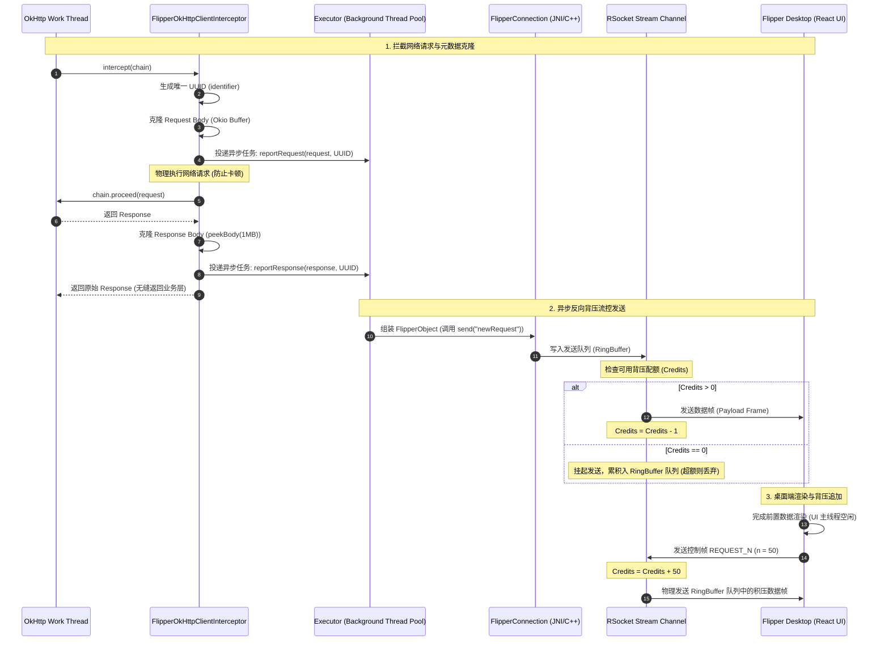

# 5.3.7.5 Flipper 核心机制与架构演进

Flipper 是 Facebook 开源的一款面向移动端（Android/iOS）及前端跨平台的桌面可视化调试平台。作为经典调试库 Stetho 的继任者，它不仅继承了移动端可视化调试的诉求，更通过在通信协议、安全沙盒、渲染架构以及多维插件化设计上的重大革新，彻底解决了 Stetho 时代因强绑定 Chrome DevTools 协议而导致的渲染卡顿、大数据量断流以及缺乏多端扩展能力的顽疾。

本指南将从移动调试的演进历史出发，深入剖析 Flipper 的双向反应式通信底座（RSocket 协议）、安全证书自动分发链路、微内核与插件契约架构，解密经典内置插件（Network 与 Layout Inspector）的源码设计，并提供一个完整的 SharedPreferences 拦截与修改自定义插件的 Kotlin 实现，帮助开发者在工程实践中建立深度的技术认知。

---

## 1. 移动端可视化调试的演进与 Flipper 诞生背景

### 1.1 移动端可视化调试的技术演进脉络
在移动互联网蓬勃发展的初期，移动端 App 的调试手段非常单一。随着业务复杂度的递增，开发者的调试方案经历了四个主要阶段的演进：

1. **控制台日志与断点调试（Logcat & Breakpoints）**：
   这是最基本的手段。通过在关键路径打印 Log 或挂载断点来观测变量状态。然而，在高频异步操作、复杂的网络请求流水线、或是多线程并发场景下，断点会挂起当前线程，破坏真实的执行时序，甚至引起远程服务端网关的连接超时（Keep-Alive Timeout）并产生无意义的断点挂起异常。而海量的 Logcat 日志又极易因为 Android 系统日志缓冲区大小限制（通常为 256KB 或 1MB）而发生覆盖丢失，且纯文本的日志在排查复杂的结构化数据（如 JSON、Protobuf 载荷）时效率极其低下。
   
2. **网络代理抓包工具（如 Charles / Fiddler / Mitmproxy）**：
   为了监控客户端与服务端的通信，开发者开始广泛使用网络代理工具。这种方案的痛点在于配置繁琐：需要手动配置局域网代理、在手机端安装并手动授信 CA 证书。随着 Android 7.0 引入网络安全配置（Network Security Config）规范，系统默认不再信任用户自行安装的证书，导致开发者必须修改应用的 Manifest 或安全配置才能抓包。对于采用了网络证书绑定（Certificate Pinning）的安全应用，或者使用了非标准 HTTP 协议（如 gRPC、RSocket、双向 TLS）的场景，代理抓包工具在不做特定逆向或 Hook 的情况下基本无法解密数据。
   
3. **端内调试面板（如 Pandora、DoraemonKit）**：
   这类工具将调试 UI 直接集成到 App 内部，以悬浮窗或隐藏入口的形式展示。虽然其携带方便、不依赖 PC 端，但也有着不可调和的缺陷：调试面板会占用手机屏幕有限的空间，限制了大规模日志和复杂 UI 树的呈现；更致命的是，调试 UI 的布局计算和绘制会占用主线程的 CPU 与 GPU 资源。在排查主线程卡顿、帧率（FPS）劣化等性能问题时，端内调试工具本身的运行开销会造成“非客观性”的测量偏差，干扰真实的业务性能表现。

4. **异构 C/S 可视化调试通道（以 Flipper 为代表）**：
   通过在端侧嵌入高性能轻量级的通信 Client，仅负责底层调试数据的拦截与捕获，将复杂的排版、检索、多维可视化渲染等高消耗逻辑全部移交至 PC 桌面端（Server）。这样既保证了端侧的低侵入与零 UI 渲染开销，又满足了开发者极其高效的可视化操作诉求。

### 1.2 Stetho 的兴起与技术局限性
为了解决上述方案的割裂体验，Facebook 在 2015 年推出了 **Stetho**。Stetho 的核心设计非常精妙：它在 Android 客户端内启动一个 LocalSocket（Unix 域套接字）服务，并将该 LocalSocket 的协议数据桥接为 Chrome 浏览器开发者工具所使用的 **Chrome DevTools Protocol (CDP)**。开发者只需在 Chrome 浏览器中输入 `chrome://inspect`，即可像调试网页一样，利用熟悉的 DevTools 面板来调试 Android App 的网络请求、数据库（SQLite）、SharedPreferences 以及 View 树结构。

#### 1.2.1 Stetho 桥接实现剖析
在 Stetho 的底层设计中，它利用了 Android 系统的 `LocalSocket`（基于 Unix 域套接字抽象的 Socket 通信机制），在手机端本地启动一个 Socket Server。当开发者使用 Chrome 浏览器的 `chrome://inspect` 功能时，PC 端的 Chrome 浏览器会启动一个 ADB 守护进程物理管道。ADB 会执行以下指令：
```bash
adb forward tcp:8080 localabstract:com.example.app.stetho
```
这个物理连接通过端口转发，将 PC 侧 Chrome 开发者工具的 Websocket 帧物理串联至手机端的 `LocalSocket`。当 Stetho 收到 CDP 数据帧后，会通过 Java 层的解析器分配给对应的调试域（Domains）。

#### 1.2.2 Stetho 的 CDP Domains 协议负载痛点
CDP 协议内部包含大量的 Domains 规范（如 Network 域、DOM 域、CSS 域、Console 域、Database 域）。每个 Domain 之间的数据交换都是基于庞大的 JSON-RPC 2.0 格式纯文本数据。例如，当客户端拦截到一个网络请求的响应后，它需要构建如下格式的 JSON 字符串发送给 Chrome DevTools。

针对高频网络通信或流式协议，例如抓取 WebSocket 二进制帧或 Server-Sent Events (SSE) 事件时，Stetho 不得不在 JVM 堆内存中频繁分配缓存缓冲区，并将接收到的二进制 Payload 强行转换为 Base64 编码文本。在高并发请求或长连接高频通信的极限场景下，这会引发以下严重技术后果：
1. **JVM 堆内存的灾难性垃圾回收（GC）**：
   大量的 JSON 包装对象和 Base64 临时 String 属于生命周期极短的朝生夕死对象。频繁在 Young Generation（新生代）分配这些大对象，会导致 JVM 的内存分配器（Thread Local Allocation Buffer, TLAB）供不应求，从而强行触发 Minor GC。当老年代（Old Generation）由于大文本数据堆积而占满时，更会引发长达数百毫秒的 Stop-The-World (STW) Full GC，导致应用界面出现严重的卡顿与掉帧。
2. **布局树遍历的算力与渲染瓶颈**：
   Android 的视图树通常拥有极深的嵌套关系。例如，在混合开发或使用了 RecyclerView 的复杂页面中，视图树可能包含上千个 View 节点，层级甚至达到 30 层以上。在 DOM 域中，Stetho 必须递归遍历这一视图树，反射获取每个节点的属性（如 Matrix、LayoutParams、RenderProperties 等），并构建一个包含成千上万个 Key-Value 的巨型 JSON-RPC 报文推送到 Chrome DevTools。
3. **Chrome 开发者工具的单线程 JavaScript 解析假死**：
   Chrome DevTools 内部的 DOM/CSS 展示面板是基于 Web HTML/CSS 技术构建的。当其通过 Websocket 收到上千节点、深达 30 层的树结构变化通知时，其底层的 JavaScript 解析器和渲染引擎（Blink）会由于递归解析巨型 JSON 字符串以及重绘庞大的 DOM 渲染树而占满 CPU 单核。由于 CDP 面板 of the 重绘和事件响应是在同一单线程事件循环（Event Loop）中处理的，开发者在调试面板中每点击展开一个节点，Chrome 浏览器就会假死数秒，甚至频繁崩溃。而这种单线程的架构缺陷，直接限制了其对于高嵌套移动视图树的可视化拓展。

### 1.3 Flipper 的架构革命与 C/S 设计哲学
针对 Stetho 的技术痛点，Facebook 彻底重构了调试系统的架构，推出了 **Flipper**。Flipper 的设计哲学建立在 **Client/Server (C/S) 异构分治** 的理念之上：

* **Client SDK (端侧)**：
  端侧 SDK 的核心目标是**高性能、低侵入、只收集不渲染**。它仅作为一个微内核，负责建立连接并管理各个调试插件。当有网络请求、日志产生时，它只负责捕获数据并立即以紧凑的格式发送出去；在接收到 PC 端的指令时，也只负责进行相应的反射修改或状态回写，没有任何 UI 渲染开销，从而最大化地保留了 App 的真实运行状态。
* **Desktop Client (桌面端)**：
  桌面端基于 Electron + React 构建，运行在性能强大的 PC 主机上。PC 端拥有几乎无限的 CPU、内存和磁盘空间，它负责解析端侧上报的原始数据，并运行复杂的 React 组件来渲染各种交互界面（如网络瀑布流、三维布局图、日志过滤面板等）。
* **插件化的物理解耦**：
  FlipperClient 内核只维护连接通道，不绑定任何具体的调试功能。Network、Inspector、Database、SharedPreferences 等全部被抽象为独立的 Plugin。这极大地简化了扩展难度，任何人都可以使用标准的 React 和 Kotlin/Swift 轻松开发出适合自己业务的定制插件。

---

## 2. 物理与逻辑分层设计及 Mermaid 核心拓扑架构图

为了建立清晰的物理解析通路，我们需要理解 Flipper 的物理分层和逻辑分层：
* **物理介质层**：通常是 USB 物理连接线（或者在同一局域网下的无线 WiFi 链路）。通过 ADB 命令行工具进行端口映射（`adb forward`），打通 PC 本地环回地址与手机端 Unix 套接字的通道。
* **传输加密层（Security Layer）**：由物理层转发上来的 TCP 报文无法直接阅读，必须通过 TLSv1.3 进行双向握手解密，生成对称会话秘钥。
* **协议路由层（Protocol Layer）**：RSocket 建立在加密 TLS Socket 之上，负责将一个单一物理 TCP 管道虚拟化为无数个独立的 `Stream ID` 逻辑子通道，分流并发给不同的插件。
* **应用插件层（Application Layer）**：端侧的各个 `FlipperPlugin` 实例拦截业务逻辑数据，通过 RSocket 信道多路复用抛向桌面端，由桌面端的 React 渲染线程将其在独立的 UI 选项卡中绘制。

下面是 Flipper 整体物理拓扑架构图：

```mermaid
graph TD
    subgraph Android App (Client SDK)
        A[FlipperClient Core] --> B[FlipperPlugin Map]
        B --> B1[NetworkFlipperPlugin]
        B --> B2[InspectorFlipperPlugin]
        B --> B3[SharedPreferencesFlipperPlugin]
        A --> C[FBJNI Bridge]
        C --> D[C++ Flipper Core]
        D --> E[C++ RSocket Client]
    end

    subgraph Physical Bridge
        E <-->|Encrypted TLS TCP| F[adb forward: 9088 / 9089]
    end

    subgraph PC Desktop (Server)
        F <-->|mTLS Decrypt| G[C++ RSocket Server]
        G --> H[Electron Main Process]
        H --> I[React Renderer Process]
        I --> J1[Network Tab]
        I --> J2[Inspector Tree]
        I --> J3[Custom SP Panel]
        I -->|Backpressure: REQUEST_N| G
    end
```

---

## 3. 核心连接机制：双向反应式通信底座 (RSocket + Physical Connection)

在 Flipper 中，客户端与桌面端之间的数据高速通道并不是通过普通的 HTTP 或 WebSocket 实现的，而是构建在 **RSocket** 双向反应式通信协议之上。

### 3.1 为什么选择 RSocket？
要理解 Flipper 的选型决策，我们必须剖析底层网络协议在调试场景下的性能表现。

对于一个成熟的调试工具，其通信信道必须具备以下特点：
1. **多路复用（Multiplexing）**：Layout Inspector 插件正在传输数兆的布局数据时，Logcat 插件不能被阻碍，它们必须共享同一个 TCP 连接且互不干扰。
2. **应用层背压（Application-level Backpressure）**：当 App 端高频产生数据时，PC 端如果消费不过来，必须能够主动让 App 端慢下来，而不是直接撑爆 App 的内存。
3. **双向对称通信（Symmetric Communication）**：既需要 App 主动推送日志，也需要 PC 端发送修改 UI 属性的指令，通信角色是平等的，不能存在像 HTTP 那样严格的“请求-响应”单向限制。

下面是 HTTP/1.1、WebSocket 与 RSocket 的深度技术对比：

| 特性维度 | HTTP/1.1 | WebSocket | RSocket |
| :--- | :--- | :--- | :--- |
| **底层传输层** | TCP | TCP | TCP / WebSocket / AeroSpike 等均可 |
| **连接生命周期** | 频繁握手，或 Keep-Alive 维持短连接 | 一次握手后升级为持久长连接 | 持久长连接，支持连接恢复（Resumption） |
| **双向发起能力** | 仅客户端可发起 Request，服务端被动 Response | 双向对等发送，但应用层没有规范约束 | 双向对等，原生支持对等的四种通信模式 |
| **信道复用** | 无，容易产生队头阻塞（Head-of-Line Blocking） | 单个物理连接，多应用通道需要自行设计分帧协议 | 原生支持 Stream ID 复用，同一连接承载无限子通道 |
| **应用层流控（背压）** | 依靠 TCP 滑动窗口，应用层无法做到精准限流 | 无，只管无脑 `send`，容易在发送/接收缓冲区堆积 | **原生支持应用层背压（Reactive Pull 模式）** |
| **帧格式** | 文本 Header + Body，开销大 | 简单的二进制帧，头部极轻量 | 纯二进制分帧格式，包含 Stream ID 与 Frame Type |

RSocket 是专为 **Reactive Streams（反应式流）** 规范设计的应用层协议。它将网络交互高度抽象为四种基本模式，这四种模式在 Flipper 中都有着完美的落地应用：
* **Request-Response（请求-响应）**：用于一次性获取数据，如 Flipper 桌面端请求读取 App 内某个特定数据库表的内容。
* **Fire-and-Forget（发后既忘）**：用于高频且不需要回复的控制指令，如桌面端向客户端发送一个“关闭某个 Activity 调试”的指令。
* **Request-Stream（请求-流）**：用于单向持续推送，如 Logcat 插件一旦建立连接，Android 端的日志就像流水一样源源不断地推向桌面端。
* **Channel（双向通道）**：用于实时的交互式会话，如 Layout Inspector 中，用户在桌面端三维树上拖拽旋转，App 端同步渲染并回传高频的坐标变化。

---

### 3.2 RSocket 协议帧结构与报文组成
为了在底层高效地承载数据，RSocket 将通信封装为极轻量级的二进制帧（Frames）。与纯文本的 JSON-RPC 或 HTTP 报文不同，RSocket 帧有着严密的字节级布局。每一个 RSocket 帧通常由以下结构组成：

```
 0                   1                   2                   3
 0 1 2 3 4 5 6 7 8 9 0 1 2 3 4 5 6 7 8 9 0 1 2 3 4 5 6 7 8 9 0 1
+-+-+-+-+-+-+-+-+-+-+-+-+-+-+-+-+-+-+-+-+-+-+-+-+-+-+-+-+-+-+-+-+
|          Frame Length (24 bits)               |0|             |
+-+-+-+-+-+-+-+-+-+-+-+-+-+-+-+-+-+-+-+-+-+-+-+-+             +
|                    Stream ID (31 bits)                        |
+-+-+-+-+-+-+-+-+-+-+-+-+-+-+-+-+-+-+-+-+-+-+-+-+-+-+-+-+-+-+-+-+
| Frame Type (6)|    Flags (10 bits)            |               |
+-+-+-+-+-+-+-+-+-+-+-+-+-+-+-+-+-+-+-+-+-+-+-+               +
|                     Metadata & Payload (Variable)             |
+-+-+-+-+-+-+-+-+-+-+-+-+-+-+-+-+-+-+-+-+-+-+-+-+-+-+-+-+-+-+-+-+
```

1. **Frame Length (24 bits)**：指明当前帧的整体字节长度。
2. **Stream ID (31 bits)**：用于信道多路复用。为 0 代表全局控制流，非 0 代表当前特定的逻辑数据流通道。其中，奇数 Stream ID 由客户端发起，偶数 Stream ID 由服务端发起，完全消除了多次建立物理 TCP 握手的时间开销。
3. **Frame Type (6 bits)**：标识帧的功能。例如：
   * `SETUP (0x01)`：连接建立时的初始化配置帧。
   * `REQUEST_RESPONSE (0x04)`：单次请求帧。
   * `REQUEST_STREAM (0x06)`：请求流数据源。
   * `REQUEST_N (0x08)`：反应式背压中的配额分发帧。
   * `PAYLOAD (0x0A)`：实际携带的数据载荷帧。
   * `ERROR (0x0B)`：传输链路错误反馈。
4. **Flags (10 bits)**：控制帧标志位。例如 `M`位（Metadata Present，代表是否有元数据描述区），`F`位（Follows，代表是否有后续分帧）。
5. **Metadata & Payload**：数据区，通常用 Compact 的二进制序列化格式（如 CBOR 或自定义 BSON 格式）打包。

通过极其精简的头部结构，RSocket 极大地压缩了传输带宽。即使高频发送数据，其编解码过程也极少占用 CPU 周期，这从网络协议层保证了调试链路的低开销。

---

### 3.3 RSocket 背压控制（Backpressure）与自适应流控

反应式流的核心奥义在于：**控制生产者的发射速率，使其不超过消费者的处理能力。**

#### 3.3.1 传统 WebSocket 的内存崩溃场景
在普通的 WebSocket 调试实现中，如果客户端触发了大量的网络请求拦截（例如在弱网压测下瞬间堆积了 500 个并发请求的 Headers 与 Body），或者用户在快速滑动 RecyclerView 时触发了大量的布局属性抓取，客户端会立刻调用 `webSocket.send(payload)`。
由于 WebSocket 没有应用层的流量控制，发送端会将这些数据源源不断地写入底层的 Socket 发送缓冲区。如果网络传输速度不够快，或者 PC 端的 Electron 进程因垃圾回收发生停顿导致 TCP 接收窗口收缩，这些数据就会在 JVM 的应用层队列中无限积压，极快地耗尽 Android 虚拟机分配的 `Max Heap Size`，最终导致应用发生不可挽回的 OOM 崩溃。

#### 3.3.2 为什么 TCP 层的滑动窗口（Sliding Window）无法解决此问题？
有人会问，TCP 本身不是有滑动窗口机制来进行流控吗？为什么还会发生 OOM？
1. **TCP 的流控粒度在传输层，而非应用层**：当 TCP 接收窗口为 0 时，OS 仅仅是不再从网络缓冲区取数据，此时 Java 层的 Socket 发送队列会开始积压。而 JVM 内部 of the 业务线程并不知道底层的拥塞，仍然在不断地通过 `webSocket.send(Object)` 产生新的大对象。这些大对象无法被物理发送，只能积压在内存的物理链表中，瞬间撑爆 JVM 堆内存。
2. **队头阻塞与单通道冲突**：Stetho 与普通调试工具通过单 TCP 通道承载所有插件的数据。如果 Log 插件由于桌面端渲染卡顿而导致 TCP 拥塞，那么即使 Layout 插件只有极小的数据量，也会因为 TCP 的阻塞而完全无法发送。
3. **缺乏进程级自适应丢弃**：TCP 只负责无损传输，不能在拥塞时主动“丢弃非关键数据”。在调试环境下，如果日志产生过快，我们宁愿选择丢弃一部分旧日志，也绝对不能让 App 崩溃。

#### 3.3.3 RSocket 授权请求数（Reactive Pull）机制的实现细节
RSocket 在应用层通过 `Subscription` 接口的 `request(long n)` 契约来解决这一难题。其精细的通信流转如下时序图所示：



##### 双端流控与队列映射机制
在 Flipper 客户端 C++ 底层，RSocket 被深度定制以支持针对不同数据流频道的差异化控制。底层的 `RSocket` 在接收到上层发送任务时，使用一个基于非阻塞 CAS（Compare-And-Swap）原子操作实现的有界环形缓冲区 `RingBuffer` 进行数据积压管理：
1. **反向拉取控制**：
   当 Flipper 建立连接后，桌面端的渲染主线程在初始化插件 UI 时，会向客户端发送一个类型为 `REQUEST_N` 的控制帧，该帧携带一个明确的数字（如 `n = 50`），表示“我当前只允许你发送 50 条调试数据”。
2. **端侧配额消费**：
   客户端 RSocket SDK 的数据发射器（Publisher）在接收到该帧后，会将底层的发送计数器（Credits）置为 50。每当一个拦截器捕获到网络数据并准备发送时，它首先检查该计数器。如果计数器大于 0，则允许将数据封包发送，并将计数器减 1。
3. **自适应队列与缓存策略**：
   当计数器自减为 0 时，客户端的发送逻辑会被立即挂起。此时，新产生的调试数据（如高频生成的网络 Response 帧）将无法推入 RSocket 通信管道。Flipper 客户端 SDK 内部维护了一个大小受限的环形缓冲区（`Bounded RingBuffer`，例如默认上限为 1000 条数据）：
   * **日志等非关键数据**：采用 **Drop Oldest**（丢弃最老数据）策略，保证最新的数据能够进队，同时防止内存无限增长。
   * **网络请求等关键数据**：采用 **Drop Latest**（丢弃最新数据，并以轻量级的 Error 帧标记），防止大对象 Body 撑爆 JVM。
4. **配额追加**：
   当桌面端 React 组件完成了当前 50 条数据的排版与渲染，且浏览器的事件循环（Event Loop）处于空闲状态时，它会向客户端追加发送一个 `REQUEST_N(n = 30)` 帧，通知客户端“可以继续发送 30 条”。客户端网络计数器加 30，继续发送缓存队列中的数据。

通过这一自适应流控机制，无论 PC 端的性能如何抖动，Android 客户端的内存占用始终能被限制在一个完全可预测的、极小的安全范围之内。

---

### 3.4 安全护栏：SSL/TLS 证书自动分发与物理握手原理

由于 Flipper 传输的数据包含敏感的业务载荷（包括用户身份 Cookie、API 凭证、设备数据库敏感信息），为防止调试过程被旁路监听，Flipper 强制要求所有连接必须在 **TLS 双向认证（mTLS）** 的加密通道内传输。
为了让开发者无需手动配置各种 CA、客户端证书，Flipper 内部基于 ADB 桥接设计了一套闭环的证书自动签发与分发体系。

#### 步骤一：建立物理调试隧道
桌面端启动后，通过调用系统命令行，执行 ADB 指令在 PC 本地与 Android 真机之间建立端口映射：
```bash
adb forward tcp:9089 tcp:9089   # 用于不加密的证书生成与交换通道
adb forward tcp:9088 tcp:9088   # 用于后续 TLS 安全 RSocket 连接通道
```
这使得向 PC 本地 `127.0.0.1:9089` 发送的请求，能被 adb 物理线路无损地转发至手机端 Android 系统的 `9089` 端口。

#### 步骤二：未授信阶段的证书请求与 CA 签发
当 Android 端的 `FlipperClient` 启动时，它会检查 App 私有沙盒目录（`/data/data/<package_name>/files/sonar/`）下是否存在有效的客户端私钥和受信任证书。
如果不存在，客户端会向建立在非加密 `9089` 端口上的桌面端证书辅助服务发起一个 HTTP POST 请求。
桌面端收到该请求后：
1. 作为 Root CA，在 PC 内存中动态生成一对公私钥，并为当前的 App 签发一份专属的客户端证书 `client.crt`。为了细粒度防范伪造，在证书的 Subject Alternative Name (SAN) 属性中会严格绑定当前 App 的应用包名。
2. 为了在非 Root 的真机上安全地传输该证书，桌面端不会直接通过网络回发（防止被中间人拦截），而是利用 `adb push` 物理通道，将证书和私钥文件写入到 Android 设备的一个公共临时文件夹中（如 `/data/local/tmp/sonar-certs/`）。为什么写这里？因为在没有 Root 权限的机器上，PC 只有对 `/data/local/tmp` 目录拥有读写权限。
3. 随后，桌面端在 HTTP 响应中向 App 回复：“证书已准备好，存放在临时目录。”

#### 步骤三：为什么必须从公共目录转移并进行“物理粉碎”？
在 Android 系统的安全架构中，每一个 App 都运行在独立的 Linux UID 隔离沙盒下，外部进程（包含电脑端调起的 shell 进程）默认是绝对没有权限写入应用的私有沙盒目录的（`/data/data/<package_name>/`）。因此，PC 端的桌面端程序无法直接把证书推送到应用的私有目录。
唯一的折中方法是推送到物理设备的公共临时目录 `/data/local/tmp/`。但这也引入了巨大的安全破绽：**任何安装在同一部手机里的恶意 App，只要申请了读取外部共享存储的权限，或者通过特定的漏洞读取 `/data/local/tmp/`，就能在证书生成后窃取其私钥和 client.crt，从而伪造调试终端对当前 App 进行越权抓包和控制。**

为了消除这一隐患，Flipper 采用了闭环的沙盒安全转移与物理粉碎策略：
1. App 端在收到 HTTP 回复后，通过 JNI 切入 Native 代码，调用底层的系统 IO 函数将证书复制到当前 App 绝对隔离的私有沙盒 `/data/data/<package_name>/files/sonar/` 下。由于此目录受到 SELinux 策略的严格防范，只有当前应用能访问。
2. 转移完成后，App 端立即调用 C/S 提权的物理擦除逻辑，将 `/data/local/tmp/sonar-certs/` 目录下的所有证书及私钥文件覆盖填充为 0 字节并物理删除，彻底消除了敏感证书在公共目录的留存时间。
3. **绕过系统 CA 限制**：由于 Android 7.0 以后系统不再信任用户自装证书，如果使用系统的 SSL TrustStore，应用会拦截建连并报错。为了规避这一限制，Flipper 客户端通过 Java 核心 Security API 读取私有沙盒下的 `ca.crt` 动态构建了一个局部的 TrustStore，并通过 `sslContext.init()` 动态绑定到当前 RSocket socket 实例。这不仅跳过了系统 CA 的繁琐授信检测，也彻底防止了用户安装外部 CA 导致的安全污染。

接下来，客户端读取私有证书，初始化 SSL 链路（如前述伪代码所示）。

#### 步骤四：TLSv1.3 双向安全握手建立
客户端在 RSocket 物理通道启动时，使用该 SSLContext 生成的 `SSLSocketFactory` 向本地 of the `127.0.0.1:9088` 发起连接。
在 TLSv1.3 协议中，握手机制得到了极大简化，握手周期缩短至 1-RTT（One Round Trip Time）：
1. **Client Hello**：客户端向 PC 端 RSocket 服务器发起 TLS 握手，在其秘钥共享（Key Share）拓展中携带了 ECDHE 临时公钥，并随附发送了用于身份校验的客户端证书（`client.crt`）。
2. **Server Hello & Key Exchange**：服务器在物理上验证 `client.crt` 的签名链是否归属于其自身生成的 CA 根密钥。验证成功后，服务器计算出对称加密的主密钥，并将服务器证书（`server.crt`）随同服务器的 Key Share 密文回传。
3. **加密建立**：双方使用计算出的会话秘钥对后续的所有 RSocket 通信流量进行对称加密。即使在此之后外部恶意软件通过任何物理方式对 ADB 流量进行旁路窃听，也只能拦截到不可读的乱码，彻底确保了研发资产与测试数据的安全。

---

## 4. 插件化系统原理与挂载机制 (Plugin Architecture)

Flipper 能够在各种多维调试场景下保持灵巧，核心在于其微内核（Microkernel）与挂载插件的设计。

### 4.1 客户端核心微内核 `FlipperClient`
在客户端中，`FlipperClient` 是整个框架的控制中枢。它在 Java 层暴露了接口，但在底层，其实体是一个通过 C++ 实现的高性能通信核心。

#### 4.1.1 JNI 桥接与 FBJNI 机制
为了消除 Java 与 C++ 双向通信的性能损耗，Facebook 使用了其自研的 **FBJNI (Facebook JNI)** 框架。
FBJNI 深度重构了传统的 JNI 静态和动态注册机制：它允许在 Java 层和 C++ 层之间声明一种称之为 `HybridClass` 的双向映射结构。通过在 Java 类中绑定一个底层的 `HybridData` 实例，Java 类在 GC 析构时会自动触发底层 C++ 实体的安全销毁过程：

```java
public class FlipperClient {
  // 保存 C++ 对象的底层指针，由 FBJNI 框架进行物理映射与生命周期回收
  private final HybridData mHybridData;

  private final Map<String, FlipperPlugin> mPlugins = new HashMap<>();

  public void addPlugin(FlipperPlugin plugin) {
    mPlugins.put(plugin.getId(), plugin);
    // 物理同步到 C++ 核心层
    insertPluginNative(plugin);
  }

  private native void insertPluginNative(FlipperPlugin plugin);
  private native void startNative();
  // ... 其他 native 声明
}
```

当我们在 Java 层调用 `addPlugin` 时，底层对应的 C++ 实现会创建一个 `flipper::FlipperPlugin` 的 C++ 代理类，并将其添加到一个由 C++ 管理的 `std::map<std::string, std::shared_ptr<FlipperPlugin>>` 容器中。这使得当物理 RSocket 收到数据时，C++ 层的分发引擎能够以最快的速度、越过 JVM 直接定位到对应的插件去处理数据。

`HybridData` 是 FBJNI 中的关键技术，用于绑定 Java 类和 C++ 类。当 Java 层的 `FlipperClient` 被 GC 回收时，`HybridData` 会在析构函数中自动触发底层的 C++ 内存释放函数，从而完美防止了因为 JNI 穿透而引入的底层内存泄漏（Native Memory Leaks）。

---

### 4.2 插件契约：`FlipperPlugin` 接口与双向强类型通信
所有的功能性调试组件，其客户端的实现都必须遵循 `FlipperPlugin` 的生命周期契约。

当物理连接建立，且桌面端激活了对应插件时，该插件的 `onConnect(FlipperConnection connection)` 回调会被调用。这个 `FlipperConnection` 就是由底层的 JNI 桥接器 `FlipperConnectionImpl` 实例化而来的：

```kotlin
// 典型的 FlipperConnection 内部通信流程
class MyCustomPlugin : FlipperPlugin {
    private var connection: FlipperConnection? = null

    override fun getId(): String = "my-custom-plugin"

    override fun onConnect(connection: FlipperConnection) {
        this.connection = connection
        
        // 1. 发送强类型 JSON 给桌面端
        val payload = FlipperObject.Builder()
            .put("sdkVersion", "1.0.0")
            .put("isEmulator", true)
            .build()
        connection.send("initEvent", payload)

        // 2. 注册 RPC 回调，监听来自桌面端的调用
        connection.receive("triggerAction", FlipperReceiver { params, responder ->
            val actionType = params.getString("action")
            val success = executeLocalAction(actionType)
            
            if (success) {
                responder.success(FlipperObject.Builder().put("result", "OK").build())
            } else {
                responder.error(FlipperObject.Builder().put("reason", "Unknown Action").build())
            }
        })
    }

    override fun onDisconnect() {
        this.connection = null
    }

    override fun runInBackground(): Boolean = false
}
```

在上述设计中，`FlipperObject` 和 `FlipperArray` 绝非普通的 JSON 字符串，而是底层基于 C++ `folly::dynamic` 结构体实现的强类型内存块。在 JNI 边界传输时，它们直接通过内存地址指针（`long`型句柄）进行传递，避免了频繁的 Java String 与 C++ string 的多次编解码开销，这是 Flipper 通信效率远超 Stetho 的关键原因所在。

`folly::dynamic` 是 Facebook 推出的高性能 C++ 动态类型库。它支持直接在 C++ 层面以扁平数组或散列表的方式存储类型数据，与 C++ RSocket 通信模块无缝对接。相比传统的以 String 进行 JNI 穿透，它的序列化效率高出数倍。

---

### 4.3 经典内置插件源码级解密

#### 4.3.1 NetworkFlipperPlugin
`NetworkFlipperPlugin` 用于监控整个 App 的网络层动作。它支持挂载各种网络客户端的拦截器，其中最核心的是 OkHttp 拦截器：`FlipperOkHttpClientInterceptor`。

##### 详细源码解密（核心逻辑）：
```java
public class FlipperOkHttpClientInterceptor implements Interceptor {
  private final NetworkFlipperPlugin mPlugin;

  @Override
  public Response intercept(Chain chain) throws IOException {
    Request request = chain.request();
    String identifier = UUID.randomUUID().toString();

    // 1. 发送 Request 元数据（非阻塞方式）
    reportRequest(request, identifier);

    Response response;
    try {
      response = chain.proceed(request);
    } catch (IOException e) {
      reportError(e, identifier);
      throw e;
    }

    // 2. 拦截并上报 Response 元数据
    return reportResponse(response, identifier);
  }

  private void reportRequest(Request request, String id) {
    if (!mPlugin.isConnected()) return;

    // 提取并异步派发，防止阻塞当前的网络工作线程
    mPlugin.getExecutor().execute(() -> {
      FlipperObject.Builder requestBuilder = new FlipperObject.Builder()
          .put("id", id)
          .put("timestamp", System.currentTimeMillis())
          .put("method", request.method())
          .put("url", request.url().toString())
          .put("headers", convertHeaders(request.headers()));

      RequestBody body = request.body();
      if (body != null) {
        try {
          // 核心考量：Okio Buffer 克隆，防止底层 InputStream 损坏
          okio.Buffer buffer = new okio.Buffer();
          body.writeTo(buffer);
          
          // 仅在属于文本类型时才读取 Body
          if (isTextContent(body.contentType())) {
            requestBuilder.put("data", buffer.readUtf8());
          } else {
            requestBuilder.put("data", "[Binary Content: " + body.contentLength() + " bytes]");
          }
        } catch (IOException e) {
          requestBuilder.put("data", "[Error reading request body: " + e.getMessage() + "]");
        }
      }
      
      mPlugin.getConnection().send("newRequest", requestBuilder.build());
    });
  }

  private Response reportResponse(Response response, String id) throws IOException {
    if (!mPlugin.isConnected()) return response;

    // 关键点：由于 OkHttp Response Body 是一次性流，
    // 如果我们直接调用 response.body().string()，会导致上游业务在消费该流时抛出 "closed" 异常。
    // 因此，我们必须使用 peekBody 或创建一个新的 Response 返回。
    ResponseBody body = response.body();
    if (body == null) return response;

    // 克隆 Response 缓存，保留原生的数据流指针不被移动
    final long cacheSize = 1024 * 1024; // 限制克隆的最大 Body 尺寸为 1MB，防范大对象内存抖动
    ResponseBody peekedBody = response.peekBody(cacheSize);
    final String bodyString = peekedBody.string();

    mPlugin.getExecutor().execute(() -> {
      FlipperObject.Builder responseBuilder = new FlipperObject.Builder()
          .put("id", id)
          .put("status", response.code())
          .put("headers", convertHeaders(response.headers()))
          .put("timestamp", System.currentTimeMillis())
          .put("data", bodyString);

      mPlugin.getConnection().send("newResponse", responseBuilder.build());
    });

    return response;
  }
}
```

##### 架构师设计考量：
1. **防止网络流死锁（Stream Preservation）与 Okio 零拷贝原理**：
   在 Java 的网络编程中，IO 流通常是归属于底层的 Socket 输入缓冲区且单向移动的。如果不加思索地读取网络 Response 触发了流消耗，由于流只能被读取一次，底层的 InputStream 会被物理关闭，导致后续上游的业务代码在消费返回包数据时直接抛出 `IllegalStateException: closed` 崩溃异常。Flipper 通过 `response.peekBody(cacheSize)` 这一 API，底层的 `Okio` 引擎会在内存的 `Buffer` 段上利用 `clone()` 生成一份独立的虚拟镜像。这个镜像并不会在内存中完整复制一份物理字节数组，而是利用了 Okio 库特有的 `Segment` 共享机制。其底层的物理内存块（Byte Array）是被逻辑引用的，克隆出的 Buffer 仅仅是持有了该 `Segment` 的一个指针镜像，完全没有 CPU 和磁盘的重复 IO 开销，既保护了原始流指针不被移动，又彻底保障了业务代码的安全执行。
2. **文本过滤器（Text Filtering）**：
   对于图片（Jpeg、Png）、音视频或二进制文件，将它们转换为 String 不仅没有调试价值，还会因为编码转换（如 UTF-8 容错字符替换）导致客户端 CPU 慢和占满。拦截器通过检查 `ContentType`，仅对 `json`、`xml`、`text`、`html` 等文本格式进行序列化，二进制文件则仅上报其文件大小，这一降级设计极大地保证了系统的鲁棒性。

---

#### 4.3.2 InspectorFlipperPlugin
Layout Inspector 插件用于在桌面端动态检查应用的 View 层级树。为了将错综复杂的 Android UI 树结构规范地映射并导出，Flipper 引入了基于 **`DescriptorMapping`（描述符映射）** 的深度优先遍历架构。

##### 详细架构与机制剖析：
1. **Descriptor 静态映射与合并设计**：
   `DescriptorMapping` 是一个维护了 `Class -> NodeDescriptor` 的映射表。
   在插件初始化阶段，它会针对常用的视图类静态注册好描述器。在具体的属性提取流程中，由于面向对象的多态性质，更深层的子类描述符会委托（Delegate）给父类描述符。例如 `TextViewDescriptor` 在提取节点属性时，除了调用父类 `ViewDescriptor` 提取诸如 alpha、坐标、背景颜色等通用属性外，还会深度反射 `TextView` 独有的 `mText`、`mTextSize` 等私有字段。
2. **深度优先遍历与树拓扑序列化**：
   当桌面端请求当前的页面布局树时，`InspectorFlipperPlugin` 会从当前的根视图 `DecorView` 出发，在 `DescriptorMapping` 中检索该类的描述符，调用其 `getChildren()` 方法获取子节点列表，并依次递归。
   同时，为了避免每次页面微小变动都传输整个巨型视图树，端侧和 PC 侧维护了一个增量更新协议：只有当选中的子树或特定节点状态改变时，才触发该节点及子节点的属性获取与差分上报，极大压缩了传输压力。
3. **反射修改与主线程调度限制**：
   当用户在桌面端修改了某个节点（如修改 `visibility` 属性），桌面端会向插件发送修改指令。
   `InspectorFlipperPlugin` 解析指令后，会通过对应描述器（如 `ViewDescriptor.setValue()`）触发反射修改。
   由于 Android 系统限制，**任何对 View 属性的修改都必须在 UI 线程（Main Thread）中执行**，否则会抛出 `CalledFromWrongThreadException: Only the original thread that created a view hierarchy can touch its views.` 运行时异常。
   因此，描述器在执行修改动作时，必须通过 `Handler(Looper.getMainLooper()).post(...)` 强制将修改逻辑调度到 Android 主线程运行。

---

## 5. 自定义调试插件开发实践：SharedPreferences 拦截与修改

为了在实际工程中落地 Flipper 的扩展能力，我们将从零实现一个自定义插件，用于拦截本地 `SharedPreferences` 的数据变化并支持在桌面端直接进行数据的“增、删、改”可视化调试。

### 5.1 核心痛点与设计思路
在 Android 开发中，SharedPreferences (SP) 被广泛用于轻量级数据的键值存储。当我们需要排查某个 Key 是否写入成功、或者需要临时修改某个 Flag 来调试特定链路时，现有的 Android Studio 工具极其不方便，且无法实时监听变更。

我们的自定义插件设计如下：
1. **初始化导出**：当连接建立时，客户端主动遍历应用沙盒的 `shared_prefs` 文件夹，提取所有配置文件下的所有键值对并推送给桌面端。
2. **增量监听推送与线程调度安全**：注册 `OnSharedPreferenceChangeListener`。只要 App 本地代码调用了 `editor.commit()` 或 `apply()`，插件就会捕获变化并将具体的改动（Key、New Value、是否被删除）发送到桌面端，实现桌面端面板的动态刷新。**这里有两个核心考量：第一，`SharedPreferencesImpl` 内部是用 `WeakHashMap` 保存监听器的，因此我们在 Plugin 内部必须使用成员变量强引用保存监听器，否则监听器会随时被 GC 回收导致失效；第二，SP 变化的触发线程并不固定（apply() 发生于工作线程，而直接 commit() 可能发生于 UI 线程），故在 Plugin 中所有针对 activeListeners 的写操作、以及 Connection 发送动作均需保证并发安全。**
3. **反向改写落盘**：注册 RPC 接收器。当桌面端用户双击属性并输入新值、或者点击“删除”按钮时，客户端能解析该事件，将对应的新值写入本地的 SP 文件，并调用 `apply()` 实时落盘。

---

### 5.2 客户端 Kotlin 完整源码实现

在应用中创建 `SharedPreferencesFlipperPlugin.kt` 文件，并实现如下核心逻辑：

```kotlin
package com.example.androidknowledge.flipper

import android.content.Context
import android.content.SharedPreferences
import com.facebook.flipper.core.FlipperConnection
import com.facebook.flipper.core.FlipperObject
import com.facebook.flipper.core.FlipperPlugin
import com.facebook.flipper.core.FlipperReceiver
import java.io.File
import java.util.concurrent.ConcurrentHashMap

/**
 * 核心自定义 Flipper 插件：
 * 用于实时查看并反向修改 Android 本地的 SharedPreferences 存储。
 */
class SharedPreferencesFlipperPlugin(private val context: Context) : FlipperPlugin {

    companion object {
        // 必须与桌面端插件声明的 ID 保持绝对一致
        private const val PLUGIN_ID = "shared-preferences-inspector"
    }

    private var currentConnection: FlipperConnection? = null

    // 强引用保存各个 SP 文件的监听器，防止被 JVM 垃圾回收导致监听断开
    private val activeListeners = ConcurrentHashMap<String, SharedPreferences.OnSharedPreferenceChangeListener>()

    override fun getId(): String = PLUGIN_ID

    override fun runInBackground(): Boolean = false

    @Synchronized
    override fun onConnect(connection: FlipperConnection) {
        currentConnection = connection
        
        // 1. 注册指令接收器，以接收桌面端的修改/删除指令
        registerConnectionReceivers(connection)

        // 2. 扫描本地沙盒，同步全量 SharedPreferences 键值对给桌面端
        syncLocalPreferencesToDesktop(connection)
    }

    @Synchronized
    override fun onDisconnect() {
        // 物理连接断开时，必须注销所有的 Listener，避免内存泄漏
        val keysToCleanup = ArrayList(activeListeners.keys)
        for (prefName in keysToCleanup) {
            unregisterPreferenceListener(prefName)
        }
        currentConnection = null
    }

    /**
     * 遍历 App 专属沙盒目录下的所有 .xml 配置文件，并同步其内容
     */
    private fun syncLocalPreferencesToDesktop(connection: FlipperConnection) {
        // 默认沙盒路径为 /data/data/<package_name>/shared_prefs
        val sharedPrefsFolder = File(context.applicationInfo.dataDir, "shared_prefs")
        if (!sharedPrefsFolder.exists() || !sharedPrefsFolder.isDirectory) return

        val xmlFiles = sharedPrefsFolder.listFiles { _, name -> name.endsWith(".xml") } ?: return

        for (file in xmlFiles) {
            // 排除临时备份文件，防止多次解析重复数据
            if (file.name.endsWith(".bak")) continue
            
            // 截取文件名作为 SharedPreferences 的名称
            val prefName = file.name.substring(0, file.name.length - 4)
            val sharedPreferences = context.getSharedPreferences(prefName, Context.MODE_PRIVATE)

            // 构建当前配置文件的键值对映射表
            val allEntries = sharedPreferences.all
            val dataBuilder = FlipperObject.Builder()

            for ((key, value) in allEntries) {
                if (value != null) {
                    dataBuilder.put(key, value.toString())
                }
            }

            // 打包数据，加上配置文件名的元数据
            val payload = FlipperObject.Builder()
                .put("preferencesName", prefName)
                .put("values", dataBuilder.build())
                .build()

            // 主动推送“初始化数据帧”
            connection.send("initPreferencesData", payload)

            // 为当前 SP 配置文件注册变化监听器
            registerPreferenceListener(prefName, sharedPreferences)
        }
    }

    /**
     * 注册对特定 SharedPreferences 文件的动态监听
     */
    private fun registerPreferenceListener(prefName: String, sharedPrefs: SharedPreferences) {
        if (activeListeners.containsKey(prefName)) return

        val listener = SharedPreferences.OnSharedPreferenceChangeListener { _, key ->
            val conn = currentConnection ?: return@OnSharedPreferenceChangeListener
            if (key == null) return@OnSharedPreferenceChangeListener

            // 获取改变后的最新值。如果为 null 说明该 Key 被删除了
            val newValue = sharedPrefs.all[key]

            val eventPayload = FlipperObject.Builder()
                .put("preferencesName", prefName)
                .put("key", key)
                .put("value", newValue?.toString() ?: "")
                .put("isDeleted", newValue == null)
                .build()

            // 增量推送变化数据
            conn.send("preferenceChanged", eventPayload)
        }

        sharedPrefs.registerOnSharedPreferenceChangeListener(listener)
        activeListeners[prefName] = listener
    }

    /**
     * 注销对特定 SharedPreferences 文件的动态监听
     */
    private fun unregisterPreferenceListener(prefName: String) {
        val listener = activeListeners.remove(prefName) ?: return
        val sharedPrefs = context.getSharedPreferences(prefName, Context.MODE_PRIVATE)
        sharedPrefs.unregisterOnSharedPreferenceChangeListener(listener)
    }

    /**
     * 注册接收器，接收并处理来自桌面端的反向修改指令
     */
    private fun registerConnectionReceivers(connection: FlipperConnection) {
        
        // 监听并执行“更新/新增”指令
        connection.receive("updatePreference", FlipperReceiver { params, responder ->
            val prefName = params.getString("preferencesName")
            val key = params.getString("key")
            val rawValue = params.getString("value")
            val originType = params.getString("type") // 桌面端指明原本的数据类型

            val sharedPrefs = context.getSharedPreferences(prefName, Context.MODE_PRIVATE)
            val editor = sharedPrefs.edit()

            try {
                // 根据原始的数据类型，进行类型还原并写入 SharedPreferences
                when (originType.toUpperCase()) {
                    "BOOLEAN" -> editor.putBoolean(key, rawValue.toBoolean())
                    "INT" -> editor.putInt(key, rawValue.toInt())
                    "LONG" -> editor.putLong(key, rawValue.toLong())
                    "FLOAT" -> editor.putFloat(key, rawValue.toFloat())
                    else -> editor.putString(key, rawValue)
                }
                editor.apply() // 异步落盘

                // 回复桌面端：执行成功
                responder.success(FlipperObject.Builder().put("status", "success").build())
            } catch (e: Exception) {
                // 回复桌面端：执行失败及异常原因
                responder.error(
                    FlipperObject.Builder()
                        .put("message", "Error writing SharedPreference: ${e.message}")
                        .build()
                )
            }
        })

        // 监听并执行“删除键值对”指令
        connection.receive("deletePreference", FlipperReceiver { params, responder ->
            val prefName = params.getString("preferencesName")
            val key = params.getString("key")

            val sharedPrefs = context.getSharedPreferences(prefName, Context.MODE_PRIVATE)
            try {
                sharedPrefs.edit().remove(key).apply()
                responder.success(FlipperObject.Builder().put("status", "success").build())
            } catch (e: Exception) {
                responder.error(
                    FlipperObject.Builder()
                        .put("message", "Error deleting Key from SharedPreference: ${e.message}")
                        .build()
                )
            }
        })
    }
}
```

---

### 5.3 桌面端 React / TypeScript 插件契约规范与沙箱隔离

配合客户端的自定义插件，桌面端也需要编写对应的扩展插件以进行 React 界面的渲染与双向数据映射：

```typescript
import { FlipperDevicePlugin, createState, usePlugin, useValue, Table, Input, message } from 'flipper-plugin';
import React, { useState } from 'react';

// 声明每行展示的数据结构
type PreferenceRow = {
  preferencesName: string;
  key: string;
  value: string;
};

// 1. 定义事件输入类型（客户端推送给桌面端）
type Events = {
  initPreferencesData: { preferencesName: string; values: Record<string, string> };
  preferenceChanged: { preferencesName: string; key: string; value: string; isDeleted: boolean };
};

// 2. 定义方法调用类型（桌面端调用客户端）
type Methods = {
  updatePreference(params: { preferencesName: string; key: string; value: string; type: string }): Promise<{ status: string }>;
  deletePreference(params: { preferencesName: string; key: string }): Promise<{ status: string }>;
};

// 3. 定义插件的核心逻辑与状态管理
export function plugin(client: FlipperDevicePlugin<Events, Methods>) {
  const preferences = createState<Record<string, PreferenceRow>>({});

  // 监听初始化全量快照
  client.onMessage('initPreferencesData', (event) => {
    const { preferencesName, values } = event;
    preferences.update(draft => {
      for (const [key, value] of Object.entries(values)) {
        const uniqueId = `${preferencesName}_${key}`;
        draft[uniqueId] = { preferencesName, key, value };
      }
    });
  });

  // 监听动态修改与删除
  client.onMessage('preferenceChanged', (event) => {
    const { preferencesName, key, value, isDeleted } = event;
    const uniqueId = `${preferencesName}_${key}`;
    preferences.update(draft => {
      if (isDeleted) {
        delete draft[uniqueId];
      } else {
        draft[uniqueId] = { preferencesName, key, value };
      }
    });
  });

  return { preferences, client };
}

// 4. 编写 React UI 界面，包含搜索过滤与状态提示
export function Component() {
  const instance = usePlugin(plugin);
  const preferencesMap = useValue(instance.preferences);
  const [searchTerm, setSearchTerm] = useState('');
  
  const dataList = Object.values(preferencesMap).filter(
    item =>
      item.key.toLowerCase().includes(searchTerm.toLowerCase()) ||
      item.preferencesName.toLowerCase().includes(searchTerm.toLowerCase())
  );

  return (
    <div style={{ padding: '16px', display: 'flex', flexDirection: 'column', height: '100%' }}>
      <div style={{ display: 'flex', justifyContent: 'space-between', marginBottom: '12px' }}>
        <h2>SharedPreferences Live Inspector</h2>
        <Input
          placeholder="Search key or file..."
          value={searchTerm}
          onChange={e => setSearchTerm(e.target.value)}
          style={{ width: '300px' }}
        />
      </div>
      <Table
        dataSource={dataList}
        columns={[
          { title: 'Prefs File (.xml)', key: 'preferencesName', width: 250 },
          { title: 'Preference Key', key: 'key', width: 250 },
          { title: 'Value', key: 'value', editable: true },
        ]}
        onRowAction={async (row, updatedVal) => {
          // 用户在表格中双击完成编辑并确认后，发起 RPC 调用
          try {
            const res = await instance.client.call('updatePreference', {
              preferencesName: row.preferencesName,
              key: row.key,
              value: updatedVal,
              type: 'STRING' // 默认以 String 方式回写，客户端可识别进行类型转换
            });
            if (res.status === 'success') {
              message.success(`Successfully updated key: ${row.key}`);
            }
          } catch (e) {
            message.error(`Failed to update preference: ${e}`);
            console.error('Failed to sync updated value to Android: ', e);
          }
        }}
      />
    </div>
  );
}
```

##### Flipper Desktop 桌面端沙箱与状态更新机制解密
1. **插件隔离沙箱（Plugin Isolation Sandbox）**：
   为了防止第三方恶意的 JS 插件读取主 Electron 进程的安全凭证或进行跨站脚本攻击（XSS），Flipper Desktop 将每一个插件的运行环境封包在独立的 JavaScript 虚拟沙箱中运行。插件与 Flipper 核心壳层（Electron Shell）之间通过强契约的逻辑通信协议交换数据，无法直接触碰物理系统的文件、网络等底层 API，极大保障了 PC 开发环境的安全。
2. **`createState` 状态流转机制**：
   在 Flipper Desktop 的 API 中，状态是由 `createState` 函数构建的。其底层并非采用常规 React Component 的 setState 刷新，而是基于 JS 的 `Proxy`（代理对象）拦截机制构建的高性能状态管理器（类似于 MobX 或基于 Immer 的深层对象代理）。每当收到客户端增量推送的 `preferenceChanged` 事件后，代理拦截器会针对性的在 Draft 缓存层上修改特定 Key 属性，并触发 React 渲染组件对该行的精准局部重绘（Re-render）。这完全避免了在大数据量表格下整张 table 频繁 diff 更新，保证了 PC 端在大日志下的极其平滑的交互帧率。

---

### 5.4 客户端挂载与初始化调用链

要使上述自定义插件生效，我们需要在应用的 Application 类中完成 `FlipperClient` 的装配。完整的生命周期挂载与初始化流程如下：

```kotlin
package com.example.androidknowledge

import android.app.Application
import com.example.androidknowledge.flipper.SharedPreferencesFlipperPlugin
import com.facebook.flipper.android.AndroidFlipperClient
import com.facebook.flipper.android.utils.FlipperUtils
import com.facebook.flipper.plugins.inspector.DescriptorMapping
import com.facebook.flipper.plugins.inspector.InspectorFlipperPlugin
import com.facebook.flipper.plugins.network.NetworkFlipperPlugin
import com.facebook.soloader.SoLoader

class MyApplication : Application() {

    override fun onCreate() {
        super.onCreate()
        
        // 1. 初始化 SoLoader，用于加载 Flipper C++ 共享库 (.so)
        SoLoader.init(this, false)

        // 2. 进程过滤：确保仅在主进程中初始化 Flipper，防范多进程端口占用冲突
        if (BuildConfig.DEBUG && FlipperUtils.shouldInitializeFlipper(this)) {
            val client = AndroidFlipperClient.getInstance(this)

            // 3. 挂载内置的布局检查插件
            val descriptorMapping = DescriptorMapping.withDefaults()
            client.addPlugin(InspectorFlipperPlugin(this, descriptorMapping))

            // 4. 挂载内置的网络检查插件
            val networkPlugin = NetworkFlipperPlugin()
            client.addPlugin(networkPlugin)

            // 5. 挂载自定义的 SharedPreferences 拦截插件
            client.addPlugin(SharedPreferencesFlipperPlugin(this))

            // 6. 异步启动 RSocket 底座及 C++ 通信核心
            client.start()
        }
    }
}
```

---

## 6. 常见误区与方案权衡

在商业级项目中落地 Flipper 调试体系，架构师必须提前规避以下误区并进行合理的技术权衡。

### 6.1 误区一：Release 包中未物理剥离 Flipper SDK
许多开发团队在引入 Flipper 后，仅仅在 Java 代码中使用 `if (BuildConfig.DEBUG)` 来限制初始化逻辑，但这并不能解决包体积引入的问题。
* **包体积膨胀**：
  Flipper SDK 的底层引入了庞大的 C++ 核心，包括 `libflipper.so`、`librsocket.so` 以及 OpenSSL 库等。如果不做物理剥离，会直接让最终的 Release APK 包体积增加 **5MB ~ 10MB** 左右。
* **物理剥离的最佳实践**：
  在 `build.gradle` 中，应当利用 `debugImplementation` 和 `releaseImplementation` 来对 Flipper 进行物理隔离：
  ```groovy
  dependencies {
      // 仅在 debug 环境编译 Flipper SDK 及其内置插件
      debugImplementation 'com.facebook.flipper:flipper:0.250.0'
      debugImplementation 'com.facebook.soloader:soloader:0.10.5'
      
      // 在 release 环境提供无任何逻辑的空接口实现（No-Op 占位库）
      releaseImplementation 'com.facebook.flipper:flipper-noop:0.250.0'
  }
  ```
  通过使用 `flipper-noop`，应用在 Release 编译期不会引入任何 C++ `.so` 共享库，所有的 Flipper 接口在 noop 库中都以空方法（No-Op）形式存在。
  同时，在应用的入口初始化代码中，可以通过反射实例化，或者在 `src/debug/java` 和 `src/release/java` 中分别定义不同实现的 `DebuggerInitializer` 类，从而杜绝 Release 代码对 Flipper 类的强引用。

  ##### 源码隔离方案与 Gradle Product Flavors
  如果在多团队并行开发的大型工程中，我们可以将这种源码解耦推向极致。利用 Gradle SourceSets 的映射机制：
  
  ```groovy
  // build.gradle 关键配置
  android {
      sourceSets {
          debug {
              java.srcDirs = ['src/debug/java']
          }
          release {
              java.srcDirs = ['src/release/java']
          }
      }
  }
  ```

  在 `src/debug/java/com/example/androidknowledge/flipper/DebuggerInitializer.kt`：
  ```kotlin
  package com.example.androidknowledge.flipper

  import android.content.Context
  import com.facebook.flipper.android.AndroidFlipperClient
  import com.facebook.flipper.android.utils.FlipperUtils
  import com.facebook.soloader.SoLoader

  object DebuggerInitializer {
      fun init(context: Context) {
          SoLoader.init(context, false)
          if (FlipperUtils.shouldInitializeFlipper(context)) {
              val client = AndroidFlipperClient.getInstance(context)
              // 添加各种调试插件...
              client.start()
          }
      }
  }
  ```

  在 `src/release/java/com/example/androidknowledge/flipper/DebuggerInitializer.kt`：
  ```kotlin
  package com.example.androidknowledge.flipper

  import android.content.Context

  object DebuggerInitializer {
      fun init(context: Context) {
          // No-Op 空实现，编译期隔离
      }
  }
  ```
  在主工程的 Application 直接调用 `DebuggerInitializer.init(this)`，即可完美实现零侵入物理剥离。
  另外，需要配合混淆规则（R8/ProGuard）确保在 Release 打包时能够彻底剔除未被使用的调试依赖：
  ```proguard
  # Flipper 混淆优化规则，保证 Release 包体积最小化
  -assumenosideeffects class com.facebook.flipper.core.FlipperClient {
      public void start();
      public void addPlugin(com.facebook.flipper.core.FlipperPlugin);
  }
  ```

---

### 6.2 误区二：多进程 App 下的物理端口冲突
如果你的 App 包含多个进程（例如包含一个独立的 `:push` 服务进程或 `:download` 子进程），当每个进程在初始化时都去获取 `FlipperClient` 并调用 `start()` 时，会导致以下异常：
* **Socket Port Bind Exception**：
  由于 Flipper 桌面端在建立 `adb forward` 时，通常只映射了固定的 `9088` / `9089` 端口。主进程启动后会成功抢占并监听这两个端口；当子进程启动时，底层 C++ 的 RSocket 尝试再次绑定这两个端口就会引发冲突，导致子进程不断发生 Socket 异常或导致进程崩溃。
* **高鲁棒性进程校验实现**：
  在多进程环境下获取进程名时，为了规避高频 IPC 带来的卡顿，应当在 Android 9.0 (API 28) 及以上优先使用 `Application.getProcessName()` 静态 API。针对老旧机型，则可以使用反射 `ActivityThread.currentProcessName()` 的方式进行无 IPC 卡顿的快速读取：
  ```kotlin
  fun getProcessNameCompat(context: Context): String? {
      if (android.os.Build.VERSION.SDK_INT >= android.os.Build.VERSION_CODES.P) {
          return Application.getProcessName()
      }
      try {
          val declaredMethod = Class.forName(
              "android.app.ActivityThread",
              false,
              Application::class.java.classLoader
          ).getDeclaredMethod("currentProcessName")
          declaredMethod.isAccessible = true
          val invoke = declaredMethod.invoke(null)
          if (invoke is String) {
              return invoke
          }
      } catch (e: Throwable) {
          // 兜底策略：使用常规 ActivityManager 遍历（低优先级）
          val pid = android.os.Process.myPid()
          val am = context.getSystemService(Context.ACTIVITY_SERVICE) as? android.app.ActivityManager
          val processes = am?.runningAppProcesses
          if (processes != null) {
              for (info in processes) {
                  if (info.pid == pid) {
                      return info.processName
                  }
              }
          }
      }
      return null
  }
  ```
  然后在初始化逻辑中配合 `context.packageName` 进行强相等验证：
  ```kotlin
  val currentProcess = getProcessNameCompat(this)
  if (currentProcess == this.packageName) {
      DebuggerInitializer.init(this)
  }
  ```

---

### 6.3 误区三：高频网络请求下导致的堆内存抖动与 ART GC 机制劣化
在进行压测或加载具有海量图片的列表时，虽然 RSocket 背压机制避免了 OOM，但如果内存缓冲队列设置得过大，高频的 JSON 序列化仍然会频繁触发 JVM 的 **Minor GC**。
* **ART 的 GC 原理解析**：
  在现代的 Android Runtime (ART) 环境下，系统使用的是基于并发标记清除（Concurrent Mark-Sweep）或 Concurrent Copying (CC) 的垃圾回收算法。虽然 CC GC 将主线程 Stop-The-World (STW) 的卡顿时间缩短到了数微秒甚至零停顿，但并发标记和对象拷贝仍然会占用大量的 CPU 时钟周期。如果在短时间内产生海量的临时 JSON String 编解码，会抢占应用业务逻辑的 CPU 计算额度，并且由于并发 GC 占用了部分系统核心，导致 Android 系统的整体温控机制报警、手机发烫、进而触发处理器的温控降频（Thermal Throttling）。这会导致业务逻辑自身的运行性能也随之断崖式劣化。
* **调优策略**：
  * **关闭图片 Body 拦截**：对于高频的图片下载请求（如 Glide/Coil 请求），它们的 Response Body 通常是海量且无意义的二进制字节码。应当在 `FlipperOkHttpClientInterceptor` 构造时，通过过滤规则排除掉 `image/*` 格式的 Body 序列化。
  * **限制最大缓冲区**：若不需要追踪所有历史网络日志，可以在 Flipper 桌面端的 Network Tab 中设置保留的最大请求条数。客户端会自动感知并丢弃超过阈值的早期缓存。

---

## 7. 高级进阶：从 Flipper 的架构哲学探讨 APM 与远程调试

Flipper 不仅仅是一个本地开发调试工具，其底层的 C/S 分治与反应式流控模型，为现代移动端 APM（Application Performance Monitoring，应用性能监控）系统以及线上远程诊断系统的设计提供了极具价值的范本。

### 7.1 C/S 分治在 APM 架构中的应用
在设计企业级端侧监控 SDK 时，我们通常面临与调试工具相同的挑战：监控指标收集得越细致，对应用本身的干扰和性能损耗就越大。
Flipper 给我们的启示是：
1. **统一数据总线与高性能序列化**：通过 C++ 微内核，将各种监控探针（CPU、内存、耗电、渲染帧率、网络请求）捕获的数据统一汇总到高性能的内存缓冲队列中。
2. **异步批处理上报**：永远不要在捕获数据时在主线程进行 JSON 转换。利用低优先级的后台线程，或者直接通过 JNI 将数据抛给 native 层的环形队列，在 native 层通过极其紧凑的 Protobuf 或 FlatBuffers 二进制格式打包，极大地减少了 JVM 堆内存的分配。

### 7.2 线上远程双向诊断系统
当应用发布到生产环境后，部分用户会遇到难以复现的复杂链路问题。如果我们能够在用户授权下，针对特定设备开启类似 Flipper 的实时会话通道，其排障价值将是无与伦比的。
* **基于 RSocket 的远程调试总线**：
  我们在云端部署 RSocket 路由网关，当客户端被特定指令激活后，与云端网关建立基于 WebSocket 的 RSocket 持久连接。由于 RSocket 原生支持双向对等通信，云端开发工程师可以通过 Web 页面直接向特定用户的设备发送“捕获全量日志”、“截取 UI 树拓扑”、“读取特定业务埋点”的指令，而端侧则源源不断地以 Stream 模式将实时数据推回。
* **线上背压机制的关键作用**：
  在移动网络（5G/4G/3G）不稳定的线上环境下，如果极速把全量日志推向云端，必然会导致用户设备的电量骤增、网络拥塞甚至造成应用 ANR。引入 RSocket 的 `REQUEST_N` 授权，由云端诊断台根据当前网络质量动态调整请求配额，保证了即使在极端恶劣环境下，端侧的远程调试行为也始终处于绝对受控的性能边界之内。

---

## 8. 总结

Flipper 作为新一代移动端可视化调试的杰出代表，其成功的关键在于**架构上的彻底解耦**与**反应式通信协议的完美运用**。

* 它通过 **C/S 架构**，将复杂的 UI 渲染彻底剥离至 PC 桌面端，从根本上释放了手机端的 CPU 与内存资源。
* 它利用 **RSocket 协议**，以单个 TCP 连接实现了多路复用，并通过创新的**背压流控**确保了客户端在极端海量调试数据下的稳定运行。
* 完备的 **双向 TLS 加密** 和 **ADB 证书动态分发** 确保了调试的安全性与零门槛体验。
* 灵活的 **插件化设计**（如 `FlipperPlugin` 契约与反射 Descriptor）赋予了开发者无限制的扩展能力。

深入理解并掌握 Flipper 的底层设计，不仅能极大提升我们的日常开发排障效率，更对我们在构建企业级 APM 监控、跨端通信系统以及定制化内部调试工具时提供了极佳的架构借鉴。
