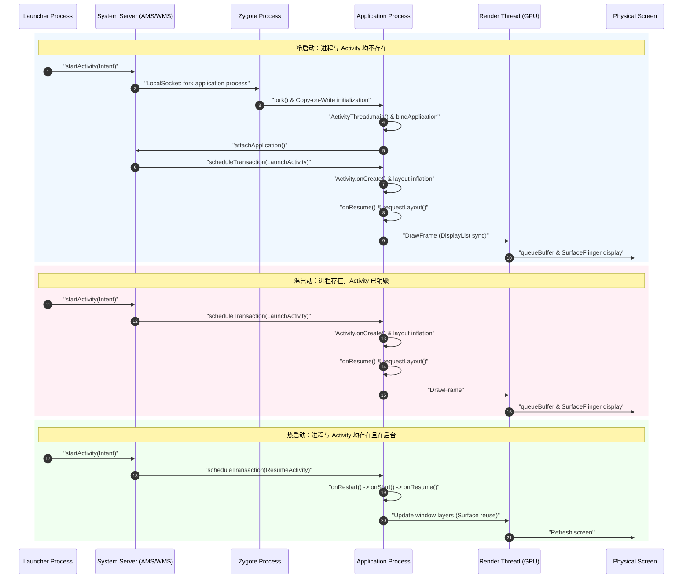
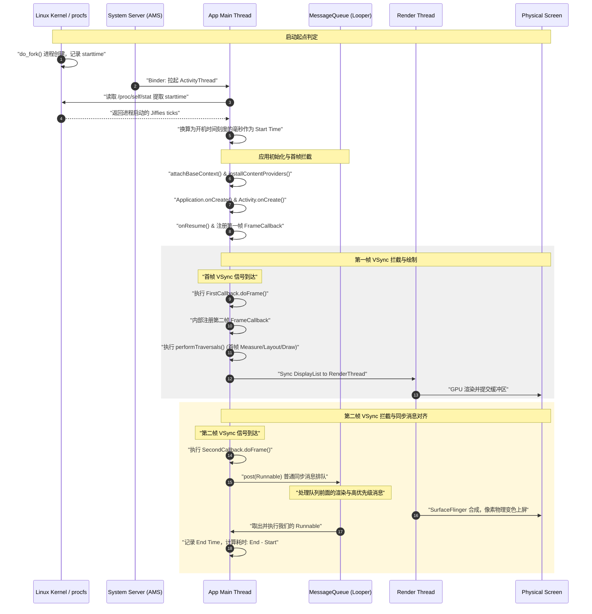

# Android 启动时间统计与度量

在移动端性能优化领域，启动优化是公认的“第一体验防线”。一个应用从用户点击图标到首帧画面呈现在屏幕上，经历了解析进程创建、系统底层调度、应用框架初始化、资源加载、UI 布局绘制等极为复杂的物理与逻辑链路。如何精准地度量这段时间，并在生产环境建立一套科学、稳定、具备自愈能力的 APM（Application Performance Monitoring）线上统计闭环，是移动端性能监控体系的核心基石。

本文将从启动速度的商业价值流失模型出发，深入剖析三种启动模式的微观差异、系统级 Displayed 与 FullyDrawn 指标的底层源码实现、线下 Systrace 与物理高速相机的度量原理，并最终给出基于 `/proc/self/stat` 的物理起点获取与 Choreographer 两次 `doFrame` 校验的线上 APM 首帧物理上屏统计闭环的完整工程级解决方案。

---

## 1. 启动优化与用户流失模型

### 1.1 第一体验防线：启动速度与留存率的物理关联
启动速度不仅是一个技术指标，更是一个直接决定商业转化与用户留存的黄金指标。在人机交互心理学（HCI）中，用户对移动端应用的即时响应有着极其苛刻的预期。

根据认知心理学中的“双重过程理论”，人类大脑在处理即时反馈时存在两个不同的阈值区间：
*   **< 100 毫秒**：大脑的皮层视觉区直接将其理解为“瞬时物理反射”。用户操作与界面变化在时间上重合，几乎感觉不到任何延迟，心理舒适度极高。
*   **100 毫秒 ~ 300 毫秒**：用户能够感知到微小的过渡，但依然认为应用反应灵敏，系统运行极其流畅。
*   **300 毫秒 ~ 1000 毫秒（1秒）**：用户能感知到“加载”动作的存在，但注意力仍完全保持在当前任务中，这是人机交互的黄金上限。
*   **1.0 秒 ~ 3.0 秒**：用户等待感逐渐上升。此时，短期工作记忆（Working Memory）受到干扰，大脑开始分散注意力，心理舒适度急剧下降。
*   **> 3.0 秒**：任务阻断界限。用户的耐心呈指数级衰减。此时，大脑的“任务专注度”被打断，用户开始产生明显的负面焦虑，并评估等待的“机会成本”。
*   **> 5.0 秒**：专注链条彻底断裂。超过 50% 的用户会选择直接强退应用、杀进程或切换到其他后台任务，导致本次商业曝光或转化直接归零。

在经典的“漏斗模型”中，启动阶段是用户进入应用的第一道关卡。任何在启动阶段流失的用户，后续的活跃（DAU）、留存（Retention）、GMV 转化都将无从谈起。因此，启动速度被称为应用体验的“第一体验防线”。

### 1.2 启动延迟与商业转化的“流失曲线”与定量数学模型
启动速度的恶化对商业指标的打击是毁灭性的。在电商、内容消费和即时通讯等不同领域，启动耗时与漏斗转化率、日活跃用户数（DAU）以及次日留存率有着极强的数学相关性。

#### 对数正态分布流失模型
根据业界大厂的数据建模，用户因启动延迟而流失的概率分布符合对数正态分布（Lognormal Distribution）。设启动耗时为 $t$，流失概率为 $P(t)$，则有：
$$P(t) = \int_{0}^{t} \frac{1}{x\sigma\sqrt{2\pi}} e^{-\frac{(\ln x - \mu)^2}{2\sigma^2}} dx$$
其中 $\mu$ 和 $\sigma$ 分别代表用户的平均心理耐受均值和离散度。当 $t$ 越过 3 秒后，流失率曲线的导数（流失速度）达到物理峰值，呈现指数级增长。

下图揭示了业界统计的**启动延迟时间（秒）与用户流失率（%）**之间的典型量化关联曲线：

```
流失率 (%)
100 |                                                    /
 80 |                                             /-----'
 60 |                                      /-----'
 40 |                               /-----'
 20 |                       /------'
  0 | ______________/------'
    +----------------------------------------------------> 启动耗时 (s)
     0     1.0    2.0    3.0    4.0    5.0    6.0    7.0
```

根据 Google 针对移动网页 and 应用的专题报告，当页面/应用加载时间从 1 秒增加到 3 秒时，流失率增加 **32%**；而当加载时间进一步延长到 5 秒时，流失率会飙升 **90%**。在高度内卷的移动互联网时代，启动时间每增加 100ms，就意味着成千上万日活用户的物理蒸发。

#### 不同行业的影响矩阵
*   **电商与新零售**：在“双十一”等高并发大促场景中，启动时间每增加 100ms，会导致整体交易额（GMV）下滑约 1.5% ~ 2%。启动变慢会直接压制用户的冲动消费欲望，流失在商详页之前。
*   **内容与社交媒体**：启动耗时增加 500ms 会导致次日留存率（D1 Retention）物理下滑 2.5% 以上，首屏曝光量减少，直接影响广告展现数（Ad Impressions）和千次展示期望收入（eCPM）。
*   **工具与即时出行**：用户在急用场景下（如打车、扫码支付），启动慢于 4 秒会导致跳出率高达 40% 以上，用户会直接切换至竞品。

### 1.3 启动期间的用户体验心理学与平抑策略
为了平抑用户在等待期间的焦虑，现代应用通常采用“体验平抑”策略：
1.  **空屏（Blank Window）**：直接显示系统的默认背景色，用户容易误判为应用卡死，流失率最高。
2.  **闪屏/广告页（Splash/Ad Window）**：展示品牌 Logo 或广告。虽然提供了视觉反馈，但增加了路由跳转（SplashActivity -> MainActivity）的二次冷启动成本，涉及频繁的 Activity 销毁与创建，且频繁出现会导致用户产生审美疲劳与抵触心理。
3.  **骨架屏（Skeleton Screen）**：首帧快速呈现出界面的排版轮廓（灰色占位块）。虽然数据尚未加载完成，但从人机工程学角度看，它极大地给用户提供了“应用正在加载”的积极心理暗示，能有效平抑等待焦虑，使感知流失率下降约 **15% ~ 25%**。

然而，无论使用何种视觉欺骗策略，真正的物理启动时间（TTI, Time To Interactive）依然是决定用户是否长期留存的硬实力。要进行优化，首先必须建立高精度的物理度量手段。

---

## 2. 三种启动模式的微观差异与物理定义

在 Android 系统中，为了平衡多任务调度、进程保活以及系统内存开销，设计了三种截然不同的启动模式：**冷启动（Cold Start）**、**温启动（Warm Start）**和**热启动（Hot Start）**。

### 2.1 冷启动（Cold Start）的物理全景链路与系统传导细节
冷启动是指**目标应用在系统后台中没有任何已存在的物理进程、Application 实例以及 Activity 实例**。这是一种从零开始构建应用上下文的最完整、最繁重的启动模式。

其物理级全生命周期传导路径如下：

#### 2.1.1 进程创建阶段（Fork 机制与 OS 调度）
1.  **Launcher 触发**：用户点击桌面图标，Launcher 进程拦截点击事件，通过 Binder IPC 向系统服务进程 `system_server` 中的 `ActivityTaskManagerService` (ATMS) 发起 `startActivity` 请求。
2.  **系统决策与请求**：ATMS 评估目标进程是否存在。确认不存在后，调用 `ProcessList.startProcessLocked()`，进而通过 LocalSocket 向系统的守护进程 `Zygote` 发送创建进程的指令。
3.  **进程创建（Fork）与写时复制（Copy-on-Write, COW）**：
    *   Zygote 接收到 Socket 请求后，调用 Linux 的 `fork()` 系统调用，克隆出应用子进程。
    *   **物理页共享**：利用写时复制机制，子进程在创建之初，与 Zygote 进程共享同一个物理内存空间（包括已经预加载的系统基础类库，如 Android SDK 核心类、系统 Resources 资源）。只有当子进程尝试修改这部分内存时，操作系统内核才会为其分配新的物理内存页。这极大地加快了进程创建的速度并节省了内存开销。
4.  **Cgroups 与优先级配置**：
    *   子进程 fork 出来后，系统会将该进程 of UID 和 GID 绑定，并将其加入到对应的 Linux 控制组（Cgroups）中。
    *   冷启动期间，系统会临时将该进程的调度策略设置为前台进程组，赋予其最高的 CPU 时间片权重（`sched_latency` 减小，`cpu.shares` 增大），甚至利用系统的 CPU Boost 机制在短期内将 CPU 频率拉满，优先保证前台主线程的执行。

#### 2.1.2 应用入口与 Application 绑定阶段
1.  **ActivityThread 初始化**：新创建的子进程反射调用核心入口 `ActivityThread.main()`。主线程开始创建并初始化 `Looper`（`Looper.prepareMainLooper()`），然后实例化 `ActivityThread` 及主线程 Handler `H`。
2.  **向 SystemServer 报到**：主线程通过 `ActivityManagerService` (AMS) 的 Binder 接口调用 `attachApplication()`，将自身的 `IApplicationThread` 绑定到系统服务，表示“进程已就绪”。
3.  **Application 绑定 (handleBindApplication)**：
    *   AMS 接收到报到后，回调应用的 `IApplicationThread.bindApplication()`，主线程 H 接收到 `BIND_APPLICATION` 消息，触发 `ActivityThread.handleBindApplication()`。
    *   **类加载器创建**：创建 `LoadedApk` 对象，并实例化 `PathClassLoader`。在此阶段，ClassLoader 会解析并加载 APK 中的 DEX 文件。如果 DEX 文件过大或者没有进行充分的 AOT 编译（OAT 优化），类加载会造成可观的耗时。
    *   **ContextImpl 创建**：创建系统的上下文实例 `ContextImpl`。
    *   **Application 实例反射创建**：通过反射机制调用 `mInstrumentation.newApplication()`，实例化当前应用的 `Application` 对象，并回调其 `attachBaseContext(Context)`。
4.  **ContentProvider 的挂载与隐式耗时**：
    *   在 `attachBaseContext` 之后，系统会立即执行 `installContentProviders()`。
    *   **源码逻辑**：遍历当前 APK 中在 `AndroidManifest.xml` 中静态注册的所有 `ContentProvider`，通过反射依次实例化它们，并调用其 `ContentProvider.onCreate()`。
    *   **耗时陷阱**：ContentProvider 的 `onCreate` 执行在前台主线程，且在 `Application.onCreate()` 触发之前。现代许多第三方 SDK 都利用 ContentProvider 进行“免配置初始化”。如果有十几个 SDK 都在此阶段进行网络配置、本地 IO 或是数据库初始化，主线程将被严重挂起，这是冷启动最隐秘的耗时重灾区。
5.  **Application.onCreate()**：Provider 挂载完成后，系统回调 `mInstrumentation.callApplicationOnCreate(app)`，即执行我们自定义的 `Application.onCreate()`，通常用于应用层的大量 SDK 显式初始化。

#### 2.1.3 Activity 生命周期与首帧绘制阶段
1.  **Activity 创建**：AMS 通过 Binder 发送 `LAUNCH_ACTIVITY` 消息，主线程 H 拦截并调用 `ActivityThread.handleLaunchActivity()`。内部反射创建目标 Activity 实例，并依次执行 `onCreate()`、`onStart()`。
2.  **视图树关联**：在 `onCreate` 中调用 `setContentView(layoutResID)`。
    *   **LayoutInflater**：系统开始读取并解析 XML 布局文件。这是一个严重的性能瓶颈，因为需要通过 `XmlPullParser` 递归解析节点，并通过反射机制依次创建 View 对象。
    *   **DecorView 初始化**：将解析出来的视图树挂载到系统的 `PhoneWindow` 的 `DecorView` 上。
3.  **onResume 与 Window 关联**：主线程执行 `handleResumeActivity()`，调用 Activity 的 `onResume()`。随后，调用 `WindowManager.addView()` 将 `DecorView` 关联到系统的 Window 上。
4.  **VSync 信号申请与 performTraversals**：
    *   `WindowManagerGlobal` 内部会为该窗口创建 `ViewRootImpl` 实例，并将 DecorView 与之关联。
    *   `ViewRootImpl` 在初始化时调用 `requestLayout()`，向系统服务 `Choreographer` 申请下一个垂直同步信号（VSync）。
    *   当 VSync 信号到来，主线程的 MessageQueue 优先执行渲染消息，触发 `ViewRootImpl.performTraversals()`，依次执行 `performMeasure()`（测量）、`performLayout()`（布局）和 `performDraw()`（绘制）。其中 `performDraw` 会遍历视图树，通过 `RecordingCanvas` 记录绘制指令，生成包含了硬件加速指令的 `DisplayList`。

#### 2.1.4 渲染与物理上屏阶段（GPU & SurfaceFlinger）
1.  **渲染指令转交**：`ViewRootImpl` 绘制完成后，主线程通过 `RenderProxy` 向单独的渲染物理线程 `RenderThread` 发送同步信号，将 DisplayList 以及相关的纹理资源传递过去。
2.  **GPU 光栅化**：`RenderThread` 的核心是运行 Vulkan 或 OpenGL ES 驱动，它将 CPU 录制的 DisplayList 指令翻译为 GPU 可识别的着色器指令，进行几何计算、纹理贴图和光栅化渲染，最终将像素输出到系统分配的图形缓冲区（Graphic Buffer）中。
3.  **QueueBuffer**：渲染完成后，RenderThread 调用 `eglSwapBuffers`（底层通过 Binder/IPC 或是 SharedMemory）将填充好像素的 Graphic Buffer 提交（`queueBuffer`）到系统的图形缓冲队列中。
4.  **SurfaceFlinger 合成与上屏**：
    *   系统级合成器 `SurfaceFlinger` 在接收到下一个 VSync 信号时，从队列中取出该 Buffer（`acquireBuffer`）。
    *   SurfaceFlinger 结合当前屏幕的所有图层（如 StatusBar, NavigationBar, 键盘等），利用硬件合成器（HWC, Hardware Composer）将它们进行图层叠加与色彩转换。
    *   最终，合成好的像素 Buffer 交付给显示驱动，屏幕像素二极管在电信号驱动下发生物理偏转，光线透出，首帧画面物理上屏。

### 2.2 温启动（Warm Start）的物理生命周期与微观开销
温启动是指**应用的物理进程依然驻留在系统的后台内存中，但是首个 Activity 实例已经被系统回收，或者由于系统配置变更（如屏幕旋转、语言切换）导致 Activity 需要重新构建**。

温启动省略了冷启动中最昂贵的部分：
*   **免除的开销**：Zygote 不需要再次 fork 进程，不需要重新建立 `Looper`，`Application` 实例依然驻留且不需要重新实例化，所有的 `ContentProvider` 依然保持挂载状态，不需要重复调用 `onCreate()`。这也避开了最昂贵的三方 SDK 隐式与显式初始化耗时。
*   **保留的开销**：由于 Activity 已经不存在或已失效，系统必须重新反射创建 Activity 实例（AMS 重建 ActivityRecord 状态），重新调用 `setContentView` 解析 XML 布局，重新构建整个 `View` 视图树，并经历完整的 `performTraversals()` 测量、布局与绘制流程，RenderThread 也必须重新将 DisplayList 翻译成 GPU 指令并进行光栅化。

温启动在 APM 统计中常常被归类为“准冷启动”，因为对于重度依赖 Activity 初始化的应用，其布局解析和绘制耗时依然非常可观。

### 2.3 热启动（Hot Start）的极简调度与 Surface 复用
热启动是指**应用的物理进程存在，且首个 Activity 实例依然驻留在后台的任务栈中，没有被系统销毁**。

这是一种纯粹的窗口切换和 Z-Order 重排操作：
*   **极简路径**：用户将应用从后台切回前台，系统服务（ATMS）不需要重新创建进程，也不需要重新实例化任何 Activity。首个 Activity 仅仅经历 `onRestart()` -> `onStart()` -> `onResume()` 的状态流转。原有的 View 树结构在内存中保持完整。
*   **Surface 状态复用**：当应用被切到后台时，WMS 虽然会销毁其对应的物理 `Surface`，但 View 树的渲染数据缓存（DisplayList）和部分纹理通常依然保留在系统的 Graphic Buffer 缓存中。
*   **快速上屏**：在 `onResume` 被调用后，系统会快速触发窗口层级的重排。如果视图树没有被标记为 `invalidated`（即没有发生内容改变），系统甚至可以免除 `performMeasure` 和 `performLayout`，只需将现有的 Buffer 重新排队并请求 WMS 刷新图层，以最快速度完成物理上屏，耗时通常在 100ms - 200ms 内完成。

### 2.4 三种启动模式微观性能特征矩阵

| 特征维度 | 冷启动 (Cold Start) | 温启动 (Warm Start) | 热启动 (Hot Start) |
| :--- | :--- | :--- | :--- |
| **Linux 进程状态** | 不存在，需从 Zygote Fork | 存在，运行在后台 (Cached) | 存在，运行在后台 (Cached) |
| **Zygote Fork 物理开销**| 极高（约 50ms - 150ms），分配 UID | 零 | 零 |
| **ClassLoader 与类加载**| 必须进行类加载，执行 Class 静态块 | 免除（类信息已在 JVM 中） | 免除（类信息已在 JVM 中） |
| **SO 库装载 (`System.load`)**| 必须重新执行，涉及磁盘 I/O | 免除（已加载到进程空间） | 免除（已加载到进程空间） |
| **Application 实例** | 从零反射创建，调用生命周期 | 驻留在内存，免除创建与生命周期| 驻留在内存，免除创建与生命周期 |
| **ContentProvider 挂载** | 必须重新安装并执行 `onCreate()` | 已挂载，免除初始化 | 已挂载，免除初始化 |
| **Activity 实例** | 从零创建，经历完整生命周期 | 重新创建，经历完整生命周期 | 复用实例，仅执行 `onRestart`/`onResume` |
| **ViewTree 结构构建** | 从零解析 XML 并绑定 View (LayoutInflater) | 重新解析 XML 并绑定 View | 复用已有的视图树与渲染 Buffer |
| **VSync 测量与绘制** | 必须执行，经历最完整的视图尺寸计算 | 必须执行，经历最完整的视图尺寸计算 | 除非有界面变更，否则极大数情况可豁免 |
| **GPU 渲染与光栅化** | 极高，涉及大量新纹理上传 | 较高，涉及部分组件 of 重绘 | 极低，大多复用已有 Graphic Buffer |
| **耗时区间（典型值）** | 1.5s ~ 5.0s | 500ms ~ 1.5s | 100ms ~ 400ms |

### 2.5 启动模式传导时序图

我们可以通过以下 Mermaid 时序图，清晰地对比冷启动、温启动和热启动在系统服务层（AMS/WMS）与进程层物理生命周期的传导差异：



---

## 3. 系统级度量指标口径剖析

在探讨线上 APM 方案之前，我们首先必须搞清楚 Android 系统原生提供的启动时间度量口径是什么，以及它们在源码层的统计逻辑。

### 3.1 Displayed 时间（ActivityTaskManager: Displayed）
当我们在开发调试阶段通过 `adb logcat` 查看启动日志时，经常会看到系统输出：
```text
ActivityTaskManager: Displayed com.example.app/.MainActivity: +850ms
```
这个指标被称为 **Displayed 时间**。它是系统层面度量冷启动首帧的核心口径。

#### 3.1.1 Displayed 指标的源码起点统计
在 Android 10 及更高版本中（具体逻辑变化可参考 [AndroidVersionChangeLog.md](file:///Users/lizhiyang/Desktop/AndroidKnowledge/AndroidVersionChangeLog.md)），Displayed 时间的统计职责由 `system_server` 进程中的 `ActivityTaskManagerService` (ATMS) 以及 `ActivityRecord` 共同承担。

当启动 Activity 的 Binder 调用发起时，会流转到 `ActivityStarter.execute()` 方法。在执行具体的 Activity 路由分支时，系统会为即将被拉起的 Activity 创建（或复用）一个 `ActivityRecord` 实例。

在 `ActivityRecord` 的生命周期演进中，启动时间测量的起点通常在 `ActivityRecord.startLaunchTickingLocked()` 中被标记：
```java
// 源码剖析：frameworks/base/services/core/java/com/android/server/wm/ActivityRecord.java
void startLaunchTickingLocked() {
    if (mLaunchTickTime == 0) {
        // 标记启动的系统绝对物理时间 (SystemClock.uptimeMillis)
        // uptimeMillis() 代表系统自启动以来不包含 Deep Sleep 的单调递增时间戳
        mLaunchTickTime = SystemClock.uptimeMillis();
    }
}
```
该起点的触发点紧跟在 `ActivityStarter.startActivityUnchecked` 之后。这是系统真正开始为该 Activity 分配窗口、配置任务栈并准备拉起目标进程的物理时间。

#### 3.1.2 Displayed 指标的源码终点统计
终点统计则是当 WMS 认为该 Activity 的 Window 已经完全绘制完成并准备显示的那一刻。其核心回调入口位于 `ActivityRecord.windowsDrawnLocked()`：
```java
// 源码剖析：frameworks/base/services/core/java/com/android/server/wm/ActivityRecord.java
void windowsDrawnLocked(long timestamp) {
    mDrawn = true;
    if (mLaunchTickTime != 0) {
        // 计算物理差值
        final long duration = timestamp - mLaunchTickTime;
        // 输出著名的 Displayed 日志
        EventLog.writeEvent(EventLogTags.AM_ACTIVITY_LAUNCH_TIME,
                mUserId, System.identityHashCode(this), shortComponentName, duration);
        // 通知 ActivityMetricsLogger 记录这一统计，并打印 logcat
        mStackSupervisor.getActivityMetricsLogger().logActivityLaunched(
                this, duration, ...);
        mLaunchTickTime = 0; // 重置
    }
}
```
在 WMS 执行 `performSurfacePlacement()` 进行窗口布局排布时，一旦接收底层的 View 树绘制完成，渲染指令发送给屏幕关联 Window 后，WMS 监视器捕获到 Surface 的首个绘制 Buffer，就会触发 `windowsDrawnLocked()`，从而记录下 Displayed 耗时。

#### 3.1.3 Displayed 的核心局限性：首帧 $\neq$ 业务可用
Displayed 时间具有极强的欺骗性：
*   **无真实数据**：它只计算到首帧绘制完成。如果你的 Activity 在 `onCreate` 中直接 setContentView 挂载了一个骨架屏或者仅仅是一个包含 Loading 进度条的 XML，WMS 就会认为“绘制已完成”，并在 logcat 中显示非常漂亮的 Displayed 时间（例如 300ms）。
*   **异步开销被掩盖**：在现代 App 中，真实的数据加载（网络请求、数据库查询、大图解码、动态列表渲染）全部是异步进行的。在 Displayed 打印出来的瞬间，用户看到的可能只是一个旋转的菊花图，完全无法与之交互。

这种首帧上屏时间与真实业务可用时间（TTI - Time To Interactive）之间的巨大鸿沟，必须依靠 `reportFullyDrawn` 机制来填补。

### 3.2 reportFullyDrawn() 机制与 TTI 商业测速闭环
为了让开发者能够向系统汇报真实的应用可用时间，Android 框架提供了 `Activity.reportFullyDrawn()` API。

#### 3.2.1 什么是 reportFullyDrawn() 与 TTI
*   **TTI (Time To Interactive)**：指应用启动后，页面中所有核心元素全部加载就绪，且主线程重新回到空闲状态，用户可以流畅进行点击、滑动等交互的绝对时间点。
*   **FullyDrawnTime**：就是指从启动起点，到应用真正可用（TTI）的时间。当我们在 Activity 或是更深层次的业务组件中，完成了数据的网络拉取、JSON 反序列化、异步图片解码以及列表项的首次完整渲染绑定后，手动调用此 API，即可告知系统：“应用此时才真正达成了可用状态”。

```java
// 业务层调用示例
public void onDataLoadFinished() {
    // 确保只汇报一次
    if (isFirstLoaded) {
        reportFullyDrawn();
        isFirstLoaded = false;
    }
}
```

#### 3.2.2 reportFullyDrawn() 源码调用链与系统级行为
当开发者调用 `Activity.reportFullyDrawn()` 时，调用链向下传导：
```text
Activity.reportFullyDrawn()
  -> ActivityTaskManager.getService().reportActivityFullyDrawn(mToken, ...)
       -> ATMS.reportActivityFullyDrawn(...)
            -> ActivityMetricsLogger.logActivityFullyDrawn(...)
```

在 `ActivityMetricsLogger.logActivityFullyDrawn` 中，系统会计算自 Activity 启动起点到当前调用点的绝对差值，并在 logcat 中输出如下日志：
```text
ActivityTaskManager: Fully drawn com.example.app/.MainActivity: +2150ms
```
同时，系统还会通过 `EventLog` 写入一条 `AM_ACTIVITY_FULLY_DRAWN_TIME` 事件，用于线下脚本提取或一些高端 APM 工具的抓取。这为建立商业测速闭环（对比 Displayed 耗时与 Fully Drawn 耗时）提供了官方接口支持。

---

## 4. 线下高精度分析与黑科技统计

在开发和集成测试阶段，我们需要更高精度的分析手段，来定位启动过程中的具体耗时瓶颈。

### 4.1 Systrace / Perfetto 的 ftrace 高精度分析
`Systrace` 和新一代的 `Perfetto` 是 Android 平台最强有力的性能分析工具。它们的底层基于 Linux 的 **ftrace** 机制。

#### 4.1.1 ftrace 机制原理与用户态通信
ftrace（Function Trace）是 Linux 内核中的一种高速追踪框架，其性能损耗接近于零。
*   **Ring Buffer（环形缓冲区）**：ftrace 在内核中申请了一块连续的物理内存作为环形缓冲区。
*   **插桩点（Tracepoints）**：内核在关键动作（如 CPU 调度上下文切换 `sched_switch`、I/O 驱动读写、硬件中断响应）处预先硬编码了探针。
*   **用户态打点 `/sys/kernel/debug/tracing/trace_marker`**：
    *   Android 框架通过 `android.os.Trace` API 提供用户态打点功能。
    *   当调用 `Trace.beginSection("MyAction")` 时，底层通过 JNI 调用系统核心库，向 `/sys/kernel/debug/tracing/trace_marker` 写入一串包含线程 ID、时间戳和 `"B|pid|MyAction"` 的格式化字符串。
    *   ftrace 内核模块捕获这一写入操作，并将其存入 Ring Buffer，由此保证了用户态打点与内核态调度追踪在同一物理时间轴上完全对齐。

#### 4.1.2 关键冷启动阶段在 Trace 中的物理定位与卡顿分析
In 抓取的 Trace 图表中，我们可以精确观察到以下核心区间：

```
+-----------------------------------------------------------------------------------+
| ActivityThreadMain (进程启动起点)                                                   |
+-----------------------------------------------------------------------------------+
  \__ +-------------------------------------------------------------------+
      | bindApplication (Application 初始化与 ContentProviders 挂载)             |
      +-------------------------------------------------------------------+
        \__ +------------------------------------------+
            | activityStart (Activity 生命周期构建)     |
            +------------------------------------------+
              \__ +---------------------------------------------+
                  | Choreographer#doFrame (主线程绘制调度)       |
                  +---------------------------------------------+
                    \__ +----------------------------------+
                        | DrawFrame (RenderThread 硬件渲染) |
                        +----------------------------------+
```

1.  **`bindApplication`**：此阶段是应用层的起点。通过 trace 视图的宽度可以直观看出 Application `onCreate` 的耗时。如果在该阶段下方出现了大量的 `ContentProvider` 初始化节点，说明有许多三方 SDK 在暗中拖慢你的启动。
2.  **`activityStart`**：标记了 Activity 实例创建及生命周期执行。这里如果出现由于 Binder 通信导致的阻塞（如 `binder transaction`），trace 上会出现长条的灰色等待状态。
3.  **`Choreographer#doFrame`**：主线程在接收到 VSync 信号后的回调过程，内部被划分为 `input`、`animation`、`traversal`（包含 measure、layout、draw）三个子阶段。
4.  **`DrawFrame`**：RenderThread 的耗时阶段。如果在 `DrawFrame` 中出现长时间的紫色或红色警告，说明 GPU 侧遇到了纹理上传（Texture Upload）耗时、或者着色器编译（Shader Compilation）阻塞。
5.  **CPU State 与 I/O 状态分析**：
    *   Perfetto 可以将 CPU 状态与线程执行流进行对齐。
    *   当主线程处于 `Runnable`（等待 CPU 调度）时，说明 CPU 被抢占，需检查是否有后台并发线程过载。
    *   当主线程处于 `Uninterruptible Sleep`（D 状态，通常是正在进行磁盘 I/O，例如加载 SharedPreferences 或 SO 库）时，可以通过 Trace 定位到具体触发磁盘读写的方法并将其移出主线程。

### 4.2 工业级物理高速相机统计法
虽然 APM 和 Systrace 能提供代码级的精细度量，但由于操作系统本身存在渲染管道延迟，软件统计的终点（如 Buffer 提交给 SurfaceFlinger）和用户肉眼真正看到屏幕发生颜色变化的物理时间之间，依然存在着一个微小的物理时间差。为了消除这种系统误差，工业界在进行竞品对比测试时，通常采用 **物理高速摄像机** 方案。

#### 4.2.1 物理高速相机测量原理与硬件扫描
测试环境使用一台支持 **240 FPS** 甚至 **1000 FPS**（1毫秒一帧）的高速物理摄像机，斜对准测试手机的屏幕及测试员的手指。

物理时间的起点与终点定义如下：
*   **绝对物理起点**：手指接触屏幕瞬间。由于人体手指和屏幕接触会导致屏幕电容值突变，触发触控屏（Touch Panel）发出硬件中断。在高速相机的视频画面中，手指皮肤与屏幕玻璃表面发生挤压变形并接触的第一帧，被定义为绝对物理起点（$T_{start\_physical}$）。
*   **绝对物理终点**：屏幕上首个像素发生颜色改变的瞬间。无论该像素是骨架屏的灰色、还是加载条的蓝色，只要显示器的发光二极管（OLED）或液晶分子发生了物理光电响应，导致高速相机捕获到的画面灰度值发生变化的那一帧，即为物理终点（$T_{end\_physical}$）。

#### 4.2.2 物理差值与屏幕刷新延迟计算
在 240 FPS 下，每帧之间的时间跨度为：
$$\Delta t = \frac{1000\text{ms}}{240} \approx 4.17\text{ms}$$
高速相机通过逐帧计数器（Frame Counter），计算从起点帧到终点帧的帧数差 $N$，由此得到最真实的绝对物理时间：
$$\text{Physical Launch Time} = N \times 4.17\text{ms}$$

#### 4.2.3 误差校准系数 $\alpha$ 的推导
由于触控 IC 中断处理需要 10ms - 20ms，而屏幕刷新周期（如 60Hz 屏幕一帧为 16.6ms，120Hz 屏幕一帧为 8.3ms）也会引入延迟，导致物理冷启动时间与软件 APM 统计的时间之间，存在一个固定的偏移量（Offset）。研发人员通过多轮物理高速相机的标定测试，求出当前机型下的系统延迟校准系数 $\alpha$：
$$\text{Physical Time} = \text{APM Time} + \alpha$$
这为线上 APM 数据上报提供了科学的校验依据。该方法虽然成本极高，但它是校验线上 APM 统计精度的“终极金标准”。

---

## 5. 线上 APM 生产统计起止点判定

要在千万级日活的应用中建立准确的启动时间统计，我们面临的最大挑战是：**如何在没有系统日志（logcat）、不依赖 Root 权限、不改变系统源码的情况下，在线上获取高精度的冷启动起点与终点？**

### 5.1 精准起点的自愈选取

#### 5.1.1 为什么 Application attachBaseContext 并非冷启动真正的起点？
在 ActivityThread 启动应用的过程中，系统服务拉起目标进程后，会有一段漫长且不被应用层感知的初始化阶段。

我们来看 `ActivityThread.handleBindApplication` 内部的核心步骤：

```
ActivityThread.handleBindApplication()
  ├── 1. 初始化 AppBindData & 进程名称配置
  ├── 2. 初始化 ApplicationContext (创建 ContextImpl)
  ├── 3. 创建 ClassLoader 实例并加载 APK 代码
  ├── 4. 实例化 Application 对象
  │     └── 回调 Application.attachBaseContext()  <--- 绝大多数 APM 测算起点
  ├── 5. 安装并初始化 ContentProviders (installContentProviders)
  │     ├── 实例化所有注册的 ContentProvider
  │     └── 遍历执行 ContentProvider.onCreate()  <--- Jetpack App Startup 等在此执行
  └── 6. 回调 mInstrumentation.callApplicationOnCreate()
        └── Application.onCreate()
```

在 `attachBaseContext` 触发之前，类加载器（ClassLoader）的创建、APK 资源的解析、系统配置的初始化都已经消耗了大量时间。更为严重的是，在 `attachBaseContext()` 执行完毕后，系统会调用 `installContentProviders()` 来安装应用声明的所有 `ContentProvider`。现在很多三方 SDK 为了免除开发者的初始化代码，大都滥用 ContentProvider 进行隐式初始化。这些 Provider 的 `onCreate` 耗时全部发生在 Application.onCreate() 之前，这就导致如果以 `attachBaseContext` 作为起点，会将这部分耗时彻底漏掉，造成启动耗时数据偏小的假象。

#### 5.1.2 深度解密：读取 Linux 进程文件 `/proc/self/stat` 寻找真正起点
为了获取进程诞生的最绝对、最纯粹的物理起点，我们可以通过读取 Linux 系统为每个进程分配的伪文件系统（procfs）中的进程状态文件：`/proc/self/stat`。

##### stat 文件的结构与第 22 个字段
`/proc/self/stat` 记录了当前进程的各种状态信息，所有的字段以空格分隔。通过解析该文件，我们可以提取出第 22 个字段：`starttime`。
*   **物理定义**：`starttime` 表示该进程在系统启动（System Boot）之后，经过了多少个时钟周期（Clock Ticks，通常称为 Jiffies）才被内核 fork 出来。
*   **优势**：该数值是由 Linux 内核在执行 `do_fork()` 时直接写入的，不受应用层任何逻辑干扰，代表了该进程在操作系统内核中被创建的绝对物理时间戳。

##### 物理换算公式与算法（解决休眠偏离错位问题）
在 Android 系统中，存在两个核心的系统级时钟：
1. `SystemClock.elapsedRealtime()`：代表自系统开机以来的**绝对物理时间**，即使系统处于休眠（Deep Sleep）状态下，该时间也会继续累加。
2. `SystemClock.uptimeMillis()`：代表自系统开机以来的**运行时间**，当系统处于休眠状态时，uptimeMillis 会**停止累加**。

因为 Linux 内核记录的 `/proc/self/stat` 中的 `starttime` 字段，是以 `uptime` 为基准的时钟滴答。如果用户的设备在开机后经历过长时间的休眠，`uptimeMillis` 就会与 `elapsedRealtime` 产生物理偏离。为了使 `coldStartStartTimeGap` 能够与 `SystemClock.elapsedRealtime()` 口径一致，我们必须引入休眠时间偏离校准。

具体计算步骤如下：
1.  **获取 CPU 每秒的时钟周期数（CLK_TCK）**：在 Android 中，可以通过 POSIX 系统调用 `Os.sysconf(OsConstants._SC_CLK_TCK)` 获取，通常在绝大多数 Linux 内核配置中，这个值为 `100`（即 1 秒有 100 个 ticks，1 个 tick = 10ms）。
2.  **计算系统休眠时间差**：
    $$\Delta t_{sleep} = SystemClock.elapsedRealtime() - SystemClock.uptimeMillis()$$
3.  **计算基于 uptime 的进程 Fork 毫秒值**：
    $$T_{fork\_uptime} = \frac{\text{starttime}}{\text{CLK\_TCK}} \times 1000$$
4.  **计算进程启动相对于 elapsedRealtime 的绝对相对时间起点**（用于后续与 Choreographer 的 elapsedRealtime 进行同口径差值计算）：
    $$coldStartStartTimeGap = T_{fork\_uptime} + \Delta t_{sleep}$$

该方案不仅精度达到内核级，而且具备天然的“自愈能力”：即使主线程在 `ActivityThread.main` 之前被系统调度挂起（如 CPU 负载极高），该时间戳依然能够真实反映用户的实际等待感官起点。

### 5.2 首帧物理上屏终点的线上判定闭环（防伪）

#### 5.2.1 为什么首个 Activity 的 onResume 和 onWindowFocusChanged 不能代表首帧上屏？
*   **onResume()** 执行时，视图树（ViewTree）甚至还没有开始进行测量（Measure）和布局（Layout）。
*   **onWindowFocusChanged()** 被回调时，仅仅表示当前窗口获得了系统的焦点，WMS 刚刚完成了窗口的尺寸计算和排版。此时，主线程的绘制指令（Draw）可能才刚刚开始向系统的渲染队列排队，GPU 渲染和 SurfaceFlinger 合成物理上屏根本还没有发生。
*   如果是在 `onResume()` 或 `onWindowFocusChanged()` 记录终点，会漏掉极其关键的 **CPU 布局测量耗时、RenderThread 渲染指令转换耗时、GPU 渲染排队耗时以及 SurfaceFlinger 合成刷新延迟**，导致监控数据与用户感官有数百毫秒的物理偏差。

#### 5.2.2 Choreographer 两次 doFrame 校验算法与 MessageQueue 消息队列 FIFO 对齐
为了将线上 APM 监控的终点延伸至渲染管线最末端，使其无限逼近 SurfaceFlinger 合成上屏的物理时刻，必须设计一套**两次 VSync 拦截 + MessageQueue 同步屏障对齐**的判定算法。

##### 为什么需要两次 doFrame 回调？
`Choreographer` 负责接收系统的垂直同步信号（VSync），并驱动主线程进行输入响应、动画执行以及视图绘制。
1.  **第一帧的 `doFrame`**：当我们在 Activity 创建时注册首个 `FrameCallback`。当 VSync 信号到来时，Choreographer 执行 `doFrame`，并触发我们注册的第一个 callback。在这个 callback 内部，主线程才准备开始执行首帧的 `performTraversals()`。也就是说，第一帧的 measure/layout/draw 动作在第一帧 callback 执行时**尚未物理完成**。
2.  **第二帧的 `doFrame`**：当我们在第一帧的 callback 内部，再次向 Choreographer 注册第二个 `FrameCallback`。当下一个 VSync 信号到来、第二个 callback 被执行时，可以绝对确保：**第一帧的 CPU 绘制工作（measure/layout/draw）已经全部完成，并且其生成的渲染数据（DisplayList）已经完全提交给 RenderThread 进行 GPU 渲染排队。**

##### 为什么在第二帧 doFrame 内部还要 post 一个空 Runnable 到 MessageQueue？
虽然在第二帧 `doFrame` 触发时，第一帧的主线程 CPU 工作已经做完，但 RenderThread 此时可能还在向 GPU 传送纹理，或者 GPU 正在对第一帧的 Buffer 进行光栅化渲染，SurfaceFlinger 也在等待下一个 VSync 周期来进行图层合成。

为了让软件终点进一步贴近物理上屏时刻，我们需要在第二帧的 `doFrame` 回调中，通过主线程 `Handler` 向 `MessageQueue` 发送（`post`）一个空的 `Runnable` 消息。
*   **渲染消息的高优先级**：VSync 信号触发的 `doFrame` 属于 Choreographer 内部的高优先级渲染流程，在主线程的消息循环中是以异步消息的形式被优先执行的。
*   **排队对齐机制**：当我们在第二帧的 `doFrame` 执行过程中向 MessageQueue `post` 一个普通的同步消息（Runnable）时，这个 Runnable 依照 FIFO 原则，必定会被排在**当前帧所有渲染与布局相关消息的末尾**。
*   **物理对齐**：当主线程重新回到消息循环、并最终取出并执行我们 post 的这个空 Runnable 时，意味着首帧在主线程的 CPU 渲染链路已经彻底出队列，且主线程已彻底空闲。此时，经历了这期间两轮 VSync 间隔的流水线缓冲，首帧已物理上屏。

这套精心设计的**两次 `doFrame` + 主线程消息排队**机制，被公认为线上统计首帧物理上屏的最佳防伪闭环算法。

### 5.3 线上冷启动 APM 判定时序图

下图详细描绘了从 Linux 内核 Fork 进程，直到应用通过 Choreographer 双帧校验与 MessageQueue 对齐算法判定首帧物理上屏的完整生命周期与数据传导过程：



---

## 6. 线上 APM 启动监测模块工程化实现

### 6.1 完整 Kotlin 源码实现

以下给出高精度冷启动 APM 监测模块的完整 Kotlin 实现。包含对进程创建起点的安全提取、开机时间休眠偏差校准、以及基于 Choreographer 与同步消息排队对齐的首帧物理上屏终点判定：

```kotlin
package com.example.apm.startup

import android.app.Activity
import android.app.Application
import android.os.Build
import android.os.Bundle
import android.os.Handler
import android.os.Looper
import android.os.SystemClock
import android.system.Os
import android.system.OsConstants
import android.util.Log
import android.view.Choreographer
import java.io.BufferedReader
import java.io.File
import java.io.FileReader

/**
 * 线上高精度冷启动 APM 核心统计组件
 * 
 * 核心原理：
 * 1. 起点：通过安全解析 `/proc/self/stat` 获取 Linux 内核 fork 当前进程的物理时钟周期 (starttime)，
 *    结合系统时钟频率 (CLK_TCK) 以及开机休眠校准值，换算出以 `SystemClock.elapsedRealtime()` 为基准的精确物理起点。
 * 2. 终点：利用 Choreographer 注册两次 FrameCallback，确保第一帧的 CPU 绘制完全提交给 RenderThread，
 *    并在第二帧的 `doFrame` 内部向主线程 MessageQueue 发送一个同步 Runnable 消息。当 Runnable 被执行时，
 *    证明第一帧在主线程已彻底出队列，GPU 和 SurfaceFlinger 已完成物理合成并上屏。
 */
object AppStartTracker {
    private const val TAG = "AppStartTracker"
    
    // 冷启动计算起点 (基于 SystemClock.elapsedRealtime 刻度，单位：毫秒)
    @Volatile
    private var coldStartStartTimeGap: Long = 0L
    
    // 是否已评估完成，防止在复杂生命周期下重复统计
    @Volatile
    private var isFirstFrameDrawnEvaluated = false

    /**
     * 启动监控初始化入口
     * 必须在自定义 Application 的 attachBaseContext(base) 的首行被第一时间同步调用
     * 
     * @param application 传入 Application 实例
     */
    fun attachStart(application: Application) {
        if (coldStartStartTimeGap > 0L) return // 防止被多次调用
        
        // 1. 获取内核进程 fork 的绝对起点时间戳
        coldStartStartTimeGap = getProcessForkTimeTicks()
        
        // 2. 注册全局 Activity 生命周期监听，用以捕获应用的第一个 Activity 实例
        application.registerActivityLifecycleCallbacks(object : Application.ActivityLifecycleCallbacks {
            private var activeActivityCount = 0
            
            override fun onActivityCreated(activity: Activity, savedInstanceState: Bundle?) {
                activeActivityCount++
                if (activeActivityCount == 1) {
                    // 首个 Activity 被拉起，开启渲染终点判定
                    bindFirstFrameDrawnListener(activity)
                }
            }

            override fun onActivityStarted(activity: Activity) {}
            override fun onActivityResumed(activity: Activity) {}
            override fun onActivityPaused(activity: Activity) {}
            override fun onActivityStopped(activity: Activity) {}
            override fun onActivitySaveInstanceState(activity: Activity, outState: Bundle) {}
            
            override fun onActivityDestroyed(activity: Activity) {
                activeActivityCount--
            }
        })
    }

    /**
     * 解析 Linux `/proc/self/stat` 文件，提取 starttime 周期数并换算为毫秒（包含休眠校准）
     * 
     * @return 返回以开机时间为刻度 (elapsedRealtime) 的毫秒级进程 fork 起点
     */
    private fun getProcessForkTimeTicks(): Long {
        try {
            val statFile = File("/proc/self/stat")
            if (statFile.exists() && statFile.canRead()) {
                BufferedReader(FileReader(statFile), 512).use { reader ->
                    val line = reader.readLine()
                    if (!line.isNullOrEmpty()) {
                        // stat 文件中的字段是通过空格分隔的
                        val fields = line.split(" ")
                        // 第 22 个字段索引为 21
                        if (fields.size >= 22) {
                            val startTimeTicks = fields[21].toLongOrNull()
                            if (startTimeTicks != null && startTimeTicks > 0) {
                                // 获取当前设备的 CPU 时钟频率 CLK_TCK
                                val clockSpeed = getClockTicksPerSecond()
                                
                                // 换算得到基于 uptime 口径的进程创建相对毫秒值
                                val forkTimeUptime = (startTimeTicks * 1000) / clockSpeed
                                
                                // 核心校准：计算开机以来的设备休眠时间偏离值
                                // uptimeMillis() 在系统休眠时会停止计时，而 elapsedRealtime() 会继续累加
                                val sleepOffset = SystemClock.elapsedRealtime() - SystemClock.uptimeMillis()
                                
                                // 将 uptime 基准的 fork 时间加上休眠偏离值，对齐到完整的 elapsedRealtime 刻度
                                val forkTimeElapsed = forkTimeUptime + sleepOffset
                                Log.d(TAG, "Process Fork time read from procfs successfully: $forkTimeElapsed ms")
                                return forkTimeElapsed
                            }
                        }
                    }
                }
            }
        } catch (e: Throwable) {
            // 异常自愈：如果由于 SELinux 权限收紧或伪文件系统损坏导致读取失败，则打印异常并进行降级
            Log.e(TAG, "Failed to read starttime from procfs, entering fallback mechanism.", e)
        }
        
        // 降级兜底：在 procfs 读取失败的极端情况下，退化为使用当前 attachStart 被执行的物理时间戳作为起点
        Log.w(TAG, "Fallback: Using current SystemClock.elapsedRealtime() as startup start-point.")
        return SystemClock.elapsedRealtime()
    }

    /**
     * 获取 CPU 每秒的时钟周期数 (CLK_TCK)
     * 底层调用 POSIX API: sysconf(_SC_CLK_TCK)
     */
    private fun getClockTicksPerSecond(): Long {
        if (Build.VERSION.SDK_INT >= Build.VERSION_CODES.LOLLIPOP) {
            try {
                // 通过 Os 类直接发起底层的系统配置查询
                val clkTck = Os.sysconf(OsConstants._SC_CLK_TCK)
                if (clkTck > 0) {
                    return clkTck
                }
            } catch (e: Throwable) {
                Log.w(TAG, "Failed to query _SC_CLK_TCK via POSIX, using default 100.")
            }
        }
        // 绝大多数 Android 设备的 Linux 内核配置 HZ 均为 100
        return 100L
    }

    /**
     * 绑定首帧上屏校验监听器（两次 doFrame 配合 MessageQueue 对齐算法）
     */
    private fun bindFirstFrameDrawnListener(activity: Activity) {
        if (isFirstFrameDrawnEvaluated) return

        // 1. 安全获取 Choreographer 实例
        val choreographer = try {
            Choreographer.getInstance()
        } catch (e: Throwable) {
            Log.e(TAG, "Choreographer is unavailable on this thread. Falling back to DecorView Focus listener.", e)
            // 降级处理：如果 Choreographer 获取失败，直接降级为 DecorView 的 Window 焦点改变监听器
            fallbackToWindowFocusListener(activity)
            return
        }

        // 2. 注册第一个垂直同步信号 (VSync) 回调
        // 当下一个 VSync 信号到达时，系统会回调 doFrame。此时主线程正在准备发起首帧的 performTraversals() 绘制流程。
        choreographer.postFrameCallback(object : Choreographer.FrameCallback {
            override fun doFrame(frameTimeNanos: Long) {
                if (isFirstFrameDrawnEvaluated) return

                // 3. 在第一帧 doFrame 执行内部，立刻注册第二个垂直同步信号回调。
                // 当第二个 VSync 到来、第二个 doFrame() 被回调时，可以绝对确保第一帧在主线程的 CPU 绘制工作（DisplayList）
                // 已经完全生成，并且已经向渲染线程 (RenderThread) 和 GPU 渲染队列提交。
                choreographer.postFrameCallback {
                    if (!isFirstFrameDrawnEvaluated) {
                        
                        // 4. 第二个 VSync 回调执行时，向主线程消息队列的最末尾 post 一个空的同步消息（Runnable）
                        // 根据消息队列先进先出 (FIFO) 原则，当主线程重新回到消息循环并取出这个 Runnable 执行时，
                        // 说明这一刻主线程已经把排在前面的所有首帧布局、绘制、排队的消息处理完毕，主线程重新回到空闲状态。
                        // 此时，经历了渲染线程的 GPU 光栅化以及 SurfaceFlinger 合成，首帧已物理上屏。
                        Handler(Looper.getMainLooper()).post {
                            evaluateFirstFramePhysicalDrawn()
                        }
                    }
                }
            }
        })
    }

    /**
     * 计算并上报冷启动耗时
     */
    private fun evaluateFirstFramePhysicalDrawn() {
        // 使用双重校验锁/原子判断，防止在多窗口连续弹出等异常情况下触发多次统计
        synchronized(this) {
            if (isFirstFrameDrawnEvaluated) return
            isFirstFrameDrawnEvaluated = true
        }

        val physicalEndTime = SystemClock.elapsedRealtime()
        
        // 核心差值计算：物理终点 - 物理起点
        val totalColdStartDuration = physicalEndTime - coldStartStartTimeGap

        Log.i(TAG, "================================================")
        Log.i(TAG, "        APM COLD START METRIC SUMMARY           ")
        Log.i(TAG, "================================================")
        Log.i(TAG, "1. Process Fork Origin Point (procfs) : $coldStartStartTimeGap ms")
        Log.i(TAG, "2. Physical First Frame Drawn (APM-End): $physicalEndTime ms")
        Log.i(TAG, "3. Cold Start Absolute Duration       : $totalColdStartDuration ms")
        Log.i(TAG, "================================================")
        
        // 这里可以将结果上报到您的线上数据分析后台，例如：
        // APMSdk.reportStartupPerformance("cold_start", totalColdStartDuration)
    }

    /**
     * 兜底防伪降级策略：利用 WindowFocusChanged 配合 Handler 排队进行终点统计
     */
    private fun fallbackToWindowFocusListener(activity: Activity) {
        val window = activity.window
        val decorView = window?.decorView
        if (decorView != null) {
            decorView.viewTreeObserver.addOnWindowFocusChangeListener { hasFocus ->
                // 当窗口获得焦点，且尚未统计过终点时触发
                if (hasFocus && !isFirstFrameDrawnEvaluated) {
                    // post 到主线程尾部，等待当前所有排在前面的绘制事务出队列
                    Handler(Looper.getMainLooper()).post {
                        evaluateFirstFramePhysicalDrawn()
                    }
                }
            }
        }
    }
}
```

### 6.2 源码核心模块设计详解
在这套 Kotlin 实现中，包含了一系列的工程性策略设计，用以解决生产环境的“防伪”和“稳定性”问题：
1.  **并发与防重入设计**：由于 Activity 的生命周期受系统调度影响大（如热启动、温启动、甚至在冷启动首帧未上屏时，闪屏页就迅速跳转到主页导致多 Activity 重叠创建），因此，本类采用了 `@Volatile` 修饰控制变量，并在终点核算方法 `evaluateFirstFramePhysicalDrawn()` 中引入了 `synchronized` 双重锁校验，确保每个进程生命周期内只上报一次冷启动数据。
2.  **时钟频率 CLK_TCK 动态适配**：尽管 Linux 设备的时钟周期默认通常是 100，但在极少数定制的 Android 架构上这个值可能是 250 或者是 1000。我们通过 POSIX API `Os.sysconf(OsConstants._SC_CLK_TCK)` 进行了动态查询，只有在系统版本不支持（如 API < 21）或者 POSIX 查询失败时，才会退化为默认的 100，最大程度保证了数据在非标设备上的精准度。
3.  **Choreographer 崩溃防范**：在部分机型上，如果设备的子系统出现严重卡顿，`Choreographer.getInstance()` 可能会因为线程未绑定 Looper 而抛出异常。我们用 `try-catch` 包裹了这一逻辑，一旦抛出异常，无缝降级到基于 DecorView 的 `OnWindowFocusChangeListener`，避免 APM 组件自身引发应用崩溃（即“监控组件零侵入、零故障”原则）。

---

## 7. 进阶核心：大厂线上 APM 模型与隐式瓶颈追踪

### 7.1 标准化启动 APM 数据模型（Payload 设计与线上分流）
在大厂的生产环境中，我们不仅要统计整体启动的耗时，还需要收集极其完备的上下文信息，用以在线上进行多维度的聚类分析和卡顿问题溯源。标准的启动 APM JSON Payload 应该包含以下几大核心字段集：

```json
{
  "timing_metrics": {
    "process_fork_to_drawn": 1850,
    "attach_base_to_app_oncreate": 150,
    "app_oncreate_duration": 450,
    "provider_install_duration": 220,
    "app_oncreate_to_activity_create": 80,
    "activity_create_to_resume": 180,
    "activity_resume_to_drawn": 770,
    "fully_drawn_duration": 3400
  },
  "environment_states": {
    "device_cpu_cores": 8,
    "device_ram_total_mb": 12288,
    "device_ram_avail_mb": 3450,
    "cpu_usage_during_launch": 0.78,
    "thermal_status": "NONE",
    "is_charging": true,
    "battery_level": 92
  },
  "business_identity": {
    "app_version": "8.42.0",
    "os_version": "Android 13",
    "launch_type": "COLD",
    "launch_source": "ICON_CLICK",
    "target_activity": "com.example.app.MainActivity"
  }
}
```

通过收集 `thermal_status`（设备过热状态）以及 `cpu_usage_during_launch`，后台分析系统可以轻松识别并过滤由于系统客观降频导致的数据长尾，防止业务优化的成果被设备环境噪声淹没。

#### 线上启动类型的自愈判定逻辑
在实际线上环境中，APM 必须准确区分冷启动、温启动与热启动，防止统计噪声混杂。
1. **冷启动判定**：在 APM 初始化时，记录当前进程的 PID。如果在拉起首屏 Activity 时，获取到的 PID 与 Application 初始化时的 PID 一致，且当前进程的生命周期是全新构建的（通过 stat 文件的 starttime 判定本次进程刚刚被内核 fork 出来不到 10 秒），则标记为 COLD。
2. **温/热启动分流**：若进程早已存活，但首屏 Activity 被调度创建。APM 可以在生命周期回调中，判断当前 Activity 是否属于 `savedInstanceState` 重建（这通常发生在 Activity 销毁温启动场景中），以此将 WARM 与 HOT 进行精确区分。

### 7.2 EAS/CFS 内核调度与 CPU Boost 机制的底层追踪
现代 Android 调度核心是 EAS (Energy Aware Scheduling，能量感知调度器) 以及传统的 CFS (Completely Fair Scheduler，完全公平调度器)。
*   **物理起点时的 CPU Boost**：当内核执行 `do_fork()`（即 `/proc/self/stat` 中的 `starttime` 起点）并创建目标进程时，系统识别到这是一个前台应用启动事件。
*   **频宽拉满与大核绑定**：系统的 CPU Boost 服务（如高通 Perfd、MTK 的 PerfService）会向 Linux 的 cgroups 调度器发送临时提权指令，在接下来的 2000ms 内，把前台主线程（MainThread）和渲染线程（RenderThread）强制绑定在超大核（Prime Core）或大核上，并锁定最大频率运行。
*   **APM 数据关联**：如果我们的 APM 起点定义在 `attachBaseContext` 之后，我们就无法全面评估系统在 fork 到 attachBaseContext 期间是否享受到了 CPU Boost 的红利，也无法诊断由于调度器响应延迟导致的进程创建变慢。

### 7.3 SharedPreferences 异步加载造成的隐式锁阻塞与自愈治理
SharedPreferences 是 Android 开发中最易引入的启动卡顿隐性杀手。虽然它的初始化是异步读取 XML 文件的：

```java
// 源码剖析：frameworks/base/core/java/android/app/SharedPreferencesImpl.java
private void awaitLoadedLocked() {
    if (!mLoaded) {
        // 当 mLoaded 标志不为 true 时，主线程会被同步挂起
        BlockGuard.getThreadPolicy().onReadFromDisk();
    }
    while (!mLoaded) {
        try {
            mLock.wait(); // 主线程在此被迫 wait，直到子线程读取文件完毕并调用 notifyAll
        } catch (InterruptedException unused) {
        }
    }
}
```

即使你在代码中没有调用 `commit()` 或是 `apply()`，只要在主线程调用了 `getString()` 或是 `getInt()`，一旦异步加载子线程由于磁盘 I/O 拥堵尚未完成，主线程就会在这把重入锁上被同步阻塞，导致严重的主线程挂起。这部分隐式耗时会被我们的 APM 终点完全捕捉，这为后续用 MMKV 等基于 `mmap` 的高性能组件平替 SharedPreferences 提供了无可辩驳的数据指引。

#### 线上 SharedPreferences 阻塞自动捕获与自愈治理
大厂线上 APM 框架为了能够自动监控并发现此类 SharedPreferences 隐式锁导致的启动瓶颈，通常会通过主线程 `Looper.setMessageLogging(Printer)` 机制来监控主线程的每个 Message 执行。当某个 Message 执行时间超过 80ms 触发卡顿阈值时，APM 的后台守护线程会立刻向主线程发送中断，抓取其当前的调用堆栈。如果堆栈的顶端显示了 `android.app.SharedPreferencesImpl.awaitLoadedLocked`，则可判定为 SP 隐式锁挂起。
在治理层面，除了使用 MMKV 替代外，对于短期内无法重构的复杂历史业务，可以利用 **字节码插桩（ASM）** 或动态代理，在编译期或运行时对 `getSharedPreferences` 进行拦截，将其修改为提前加载（Early Load）机制，在 `attachBaseContext` 阶段并发多线程异步触发其加载，使得主线程在真正使用它时，XML 读取早已完成，从而消除了主线程挂起的概率。

---

## 8. 方案权衡与防伪误区规避

在实际工程落地中，由于 Android 系统的开源特性和碎片化严重，本套方案需要针对各种边界条件进行微调，以防数据出现噪声和漂移。

### 8.1 CPU 降频与 Jiffies 换算漂移的物理事实澄清
在线上数据上报后，有同学会发现，在低端设备上，启动时间的数据分布存在一些长尾异常，这引起了大家对 `/proc/self/stat` 换算公式在 CPU 变频下是否准确的怀疑：
*   **误区**：认为 CPU 进入低频模式后，时钟频率 `CLK_TCK` 会下降，导致一秒内的 ticks 减少，从而使 starttime 的计算值比实际物理时间变大。
*   **澄清**：在 Linux 内核中，`CLK_TCK` 代表的是**内核时钟中断的频率（Timer Interrupt Frequency）**。这个频率是由内核在编译时静态配置的参数（通常配置为 `HZ=100` 或者是 `HZ=250`），是一个**绝对的物理时基常数**。它与 CPU 的运行主频（即 CPU 工作主频的核心赫兹数，如 1.8GHz 变频到 800MHz 动态调整）**毫无关联**。所以，无论 CPU 怎么降频，系统的 CLK_TCK 都是恒定不变的，基于 `/proc/self/stat` 的时间戳计算方案在物理上是完全防伪、绝对安全的。

### 8.2 动态挂载 ContentProvider 的干扰与数据修正
随着 App 架构的演进，很多项目为了彻底避免 ContentProvider 的同步初始化卡顿，采用了动态加载（Dynamic Registration）或通过字节码插桩（Transform）在编译期把 AndroidManifest 中的 ContentProvider 标签移除，改写为在主进程初始化完成后，手动反射调用 `installProvider()`。
*   **数据偏差**：这种情况下，部分原本被归入“Application 初始化前”的耗时被移到了 Application `onCreate` 的内部，甚至有的被移到了 Activity 初始化之后。
*   **修正策略**：建议在 APM 数据上报中采用“分段打点”。除了统计 `Fork_to_Drawn`（整体冷启动耗时）外，也建议单独上报 `AttachBaseContext_to_Drawn` 以及 `ContentProvider_Install_Duration`（通过在 attachBaseContext 和 Application.onCreate 之间计时）。通过多维度段落统计，防止因为初始化方式的变化造成整体数据的误判。

### 8.3 跨平台框架（Jetpack Compose、Flutter）与 Android 12+ 终点判定修正

#### 8.3.1 Android 12+ SplashScreen 退出动画的影响
从 Android 12 开始，系统引入了强制的 `SplashScreen` 机制（参考 [AndroidVersionChangeLog.md](file:///Users/lizhiyang/Desktop/AndroidKnowledge/AndroidVersionChangeLog.md)）。
*   **Displayed 指标失真**：系统 WMS 会在进程 fork 完成后极早期就显示 SplashScreen 的图标窗口，从而非常早地触发 `windowsDrawnLocked()` 并打印出优异的 Displayed 时间，造成“启动极快”的假象。
*   **线上 APM 终点适配**：我们必须在首屏 Activity 中，通过 `Activity.getSplashScreen()` API 注册退出动画监听器：
    ```kotlin
    if (Build.VERSION.SDK_INT >= Build.VERSION_CODES.S) {
        activity.splashScreen.setOnExitAnimationListener { provider ->
            // 在退出动画执行的那一刻，向主线程 post 排队消息，才最逼近真实的首帧物理上屏
            Handler(Looper.getMainLooper()).post {
                evaluateFirstFramePhysicalDrawn()
            }
            provider.remove()
        }
    }
    ```

#### 8.3.2 Jetpack Compose 架构的重组延迟
*   **现象**：Jetpack Compose 是基于声明式 UI 的。在 Activity 的 `setContent` 被调用后，Compose 会首先进行 Composition（组合）。在第一帧 VSync 到来时，虽然 Compose 已经在主线程完成了 `ComposeView` 的首帧绘制，但它在真正将有内容的界面渲染出来前，可能还会经历一到两次由于数据状态未就绪导致的“空帧重组（Recomposition）”。
*   **修正方案**：在 Compose 架构中，应配合 Compose 官方推荐的 `ReportDrawn`（类似于 reportFullyDrawn 的 Compose 实现）来进行终点对齐，或者使用 `ComposeView` 的 `ViewTreeObserver` 监听 `OnPreDrawListener`，直到 Compose 视图中的核心业务节点被真正 layout 完成后，再结束统计。

#### 8.3.3 Flutter 架构的独立渲染引擎机制
*   **现象**：Flutter 使用了独立的 C++ 渲染引擎（Impeller 或 Skia），并使用独立的线程进行绘制，其渲染完全脱离了 Android 原生的 View 系统。原生的 Choreographer 两次 doFrame 只能统计到 FlutterView（作为一个原生的 SurfaceView 容器）在原生 Window 上的挂载和首帧。但此时，Flutter 内部的 Dart VM 启动、路由解析、Dart 首帧渲染都尚未开始。
*   **修正方案**：必须利用 Flutter 提供的 `FlutterActivity` 或是其引擎层暴露的 `onFirstFrame` 回调接口，由 Flutter 侧向原生 APM 模块进行反向通知，以此来修正线上热/冷启动的终点判定。

---

## 9. 总结

Android 启动时间的度量是启动优化的“眼睛”。基于 `ActivityTaskManager` 的系统 Displayed 指标可以作为线下研发阶段的重要参考，但对于线上复杂的生产环境，必须引入更高级的度量手段。

通过读取 Linux 底层进程伪文件系统 `/proc/self/stat` 提取 `starttime`，并进行设备休眠校准与开机对齐，我们获取了避开应用层任何隐式干扰的**内核级物理起点**；通过 Choreographer 两次 `doFrame` 配合主线程 `MessageQueue` 的排队对齐，我们锁定了最逼近显示器像素变色瞬间的**物理终点**。这一套高精度的线上监控方案，避开了 `onResume` 和 `onWindowFocusChanged` 的“首帧伪终点”陷阱，为大型 App 的体验优化提供了坚实的数据支柱与防伪校验。
