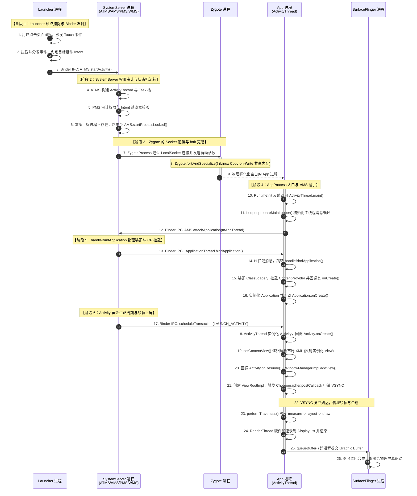
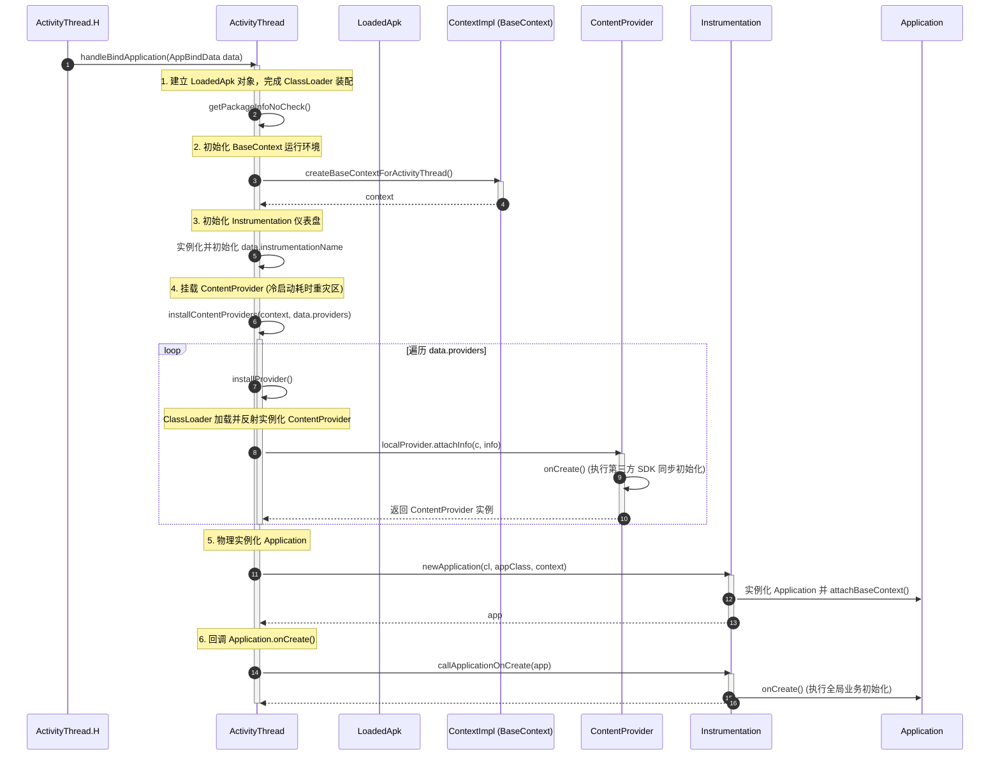

# 5.4.1.2 启动链路分析

Android 应用程序的冷启动是整个 Android 操作系统中最为复杂的物理流转体系之一。它并不是一个单一进程内的生命周期回调，而是一个由用户触控开始，历经桌面宿主进程（Launcher）、系统核心管理进程（SystemServer）、基础进程孵化器（Zygote）、目标应用进程（AppProcess）以及画面合成渲染引擎（SurfaceFlinger）这五大进程，在跨进程 Binder IPC、LocalSocket 通信与 Linux 内核级物理机制（如写时复制）的精密协同下，最终实现物理绘帧上屏的庞大系统工程。

理解这一链路的每一个物理阶段和底层源码，对于开展系统级的启动性能优化具有决定性的指导意义。

---

## 一、 系统冷启动的宏观本质：五大进程协同的物理体系

### 1.1 什么是冷启动？
在 Android 系统中，启动方式通常根据进程状态和内存保留情况划分为三种：
1. **冷启动 (Cold Start)**：当目标应用程序的进程在系统层尚未创建时触发。系统必须从零开始，物理孵化新进程、初始化 Dalvik/ART 虚拟机与核心运行环境、挂载资源 and ClassLoader、装配并挂载 ContentProvider，然后再经历首屏 Activity 的创建、布局解析与物理绘帧。由于需要经历进程创建的系统级开销，冷启动是耗时最长、优化难度最大、也是最核心的优化场景。
2. **温启动 (Warm Start)**：应用进程仍然在后台存活，但 Activity 已经由于内存回收或被销毁等原因而不存在，或者应用从退出的状态重新进入，需要重新执行 Activity 的重建和绘帧，但省去了进程创建和 Application 初始化的系统级开销。
3. **热启动 (Hot Start)**：应用进程与 Activity 实例都完整保存在内存中，应用只需将已有的 Activity 树从后台调度到前台，触发简单的生命周期回调（如 `onRestart()` -> `onStart()` -> `onResume()`），不涉及任何复杂的类装配、ContentProvider 挂载或全量布局重绘。

### 1.2 为什么冷启动需要五大进程协同工作？
Android 系统基于微内核与沙箱隔离的设计哲学，将不同的职责切分到相互独立的系统进程和应用进程中。冷启动的宏观本质，就是这些不同权限级别、不同分工的进程之间，为了安全、高效地孵化新应用并渲染出画面的“物理接力”。

*   **Launcher 进程**：作为桌面的宿主，它是一个普通的 Android 应用程序，工作在普通用户权限（UID）下。它的核心职责是捕获用户的触控事件，感知到用户想要打开哪一个 App，并将这个启动意图（Intent）封装起来，向高权限的系统服务发起请求。
*   **SystemServer 进程**：这是 Android 系统的核心中枢，拥有极高的系统权限（System UID）。它内部运行着 `ActivityTaskManagerService` (ATMS)、`ActivityManagerService` (AMS)、`WindowManagerService` (WMS) 和 `PackageManagerService` (PMS) 等关键服务。SystemServer 负责全局的安全审计（判断该应用是否允许被启动、是否拥有相应权限）、状态机流转（Activity 栈拓扑结构的动态调整、生命周期状态标记），以及决策何时需要创建新进程。
*   **Zygote 进程**：Android 系统的“受精卵”进程。它在系统开机时启动，预加载了 3000+ 个 Android 核心 Framework 类及公共资源。它并不主动管理业务，只作为一个高效的“进程孵化器”。当 SystemServer 发出创建进程的指令时，Zygote 通过物理克隆（fork）自身，在几毫秒内孵化出一个新的空白进程。
*   **AppProcess 进程**：被 Zygote fork 出来的子进程，即目标应用程序的物理承载实体。在这个进程中，Dalvik/ART 虚拟机开始运行，加载应用的 APK 字节码，创建 `ActivityThread` 主线程，装配 ClassLoader，挂载 ContentProvider，并执行 Application 与 Activity 的黄金生命周期。
*   **SurfaceFlinger 进程**：系统的画面合成与渲染引擎，拥有独立的图形驱动访问权限。它负责接收来自各个应用进程提交的 Graphic Buffer（图形缓冲区），利用硬件合成器（HWC）或 GPU，将它们与状态栏、导航栏等图层进行物理合成，并最终输出给物理屏幕的显示驱动。

### 1.3 宏观冷启动协同全景时序图
为了清晰展示这五大进程在冷启动过程中的时序交互与跨进程通信（Binder IPC、LocalSocket），我们可以梳理出如下的全景物理流转图：



---

## 二、 阶段 1：Launcher 触控捕捉与 Binder 发射

当用户的手指物理接触屏幕并点击桌面图标时，冷启动的宏观“第一棒”正式递出。这一阶段的任务是：**将物理世界的触控行为，转化为操作系统内部的 Binder IPC 调用。**

### 2.1 桌面触控事件的捕获与分发
触摸屏驱动将硬件接触信号转化为 Linux 的 Input Event，通过内核传递给 `EventHub`，再由系统进程中的 `InputReader` 和 `InputDispatcher` 负责进行物理分配。
由于 Launcher 此时处于前台激活状态，它的 Window 拥有焦点，因此该 Touch 事件被分发至 Launcher 进程的主线程。

在 Launcher 进程内部，点击行为经过一系列点击事件的拦截与处理：
1. **触控捕获**：桌面上的应用图标通常是一个自定义的 `BubbleTextView`。当用户手指落下并抬起时，`BubbleTextView` 拦截到 `onTouchEvent` 并确认这是一个标准的 Click 行为而非 LongPress（长按拖拽图标）。
2. **事件分发**：触发 `Launcher.onClick(View v)`。Launcher 会根据被点击图标绑定的 `ItemInfo` 判定目标组件。
3. **Intent 构建**：Launcher 构建用于唤起目标应用的 `Intent`。为了保证新启动的应用有自己独立的任务栈，必须附带关键标志位：

```java
Intent intent = new Intent(Intent.ACTION_MAIN);
intent.addCategory(Intent.CATEGORY_LAUNCHER);
intent.setComponent(className);
// 核心标志位：由于 Launcher 是独立应用，必须在新的任务栈中启动目标 Activity，避免目标 Activity 混入 Launcher 的任务栈中
intent.setFlags(Intent.FLAG_ACTIVITY_NEW_TASK); 
```

### 2.2 跨进程 Binder IPC 的发射
Launcher 继承自 `Activity`，当它调用 `startActivity(intent)` 时，调用链将向下传递至 `Instrumentation`：

```
Launcher.startActivity()
  └── Activity.startActivity()
        └── Activity.startActivityForResult()
              └── Instrumentation.execStartActivity()
```

在 `Instrumentation.execStartActivity()` 中，应用试图越过自身进程的边界，向 SystemServer 发起通信。其核心源码如下：

```java
public ActivityResult execStartActivity(
        Context who, IBinder contextThread, IBinder token, Activity target,
        Intent intent, int requestCode, Bundle options) {
    
    IApplicationThread whoThread = (IApplicationThread) contextThread;
    // ...
    try {
        intent.migrateExtraStreamToClipData(who);
        intent.prepareToLeaveProcess(who);
        // 获取 ActivityTaskManagerService 在应用进程的 Binder 代理端，并发起跨进程调用
        int result = ActivityTaskManager.getService().startActivity(
                whoThread, who.getBasePackageName(), who.getAttributionTag(), intent,
                intent.resolveTypeIfNeeded(who.getContentResolver()), token,
                target != null ? target.mEmbeddedID : null, requestCode, 0, null, options);
        checkStartActivityResult(result, intent);
    } catch (RemoteException e) {
        throw new RuntimeException("Failure from system", e);
    }
    return null;
}
```

在 Android 10（API 29）及以上版本中（具体演进历史可参考根目录下的 [AndroidVersionChangeLog.md](../../../../../AndroidVersionChangeLog.md)），原本由 `ActivityManagerService`（AMS）统一管理的所有 Activity 调度职能被剥离，移交给了 `ActivityTaskManagerService`（ATMS）。`ActivityTaskManager.getService()` 返回的正是 `IActivityTaskManager` 接口的 Binder 代理端（即 `ActivityTaskManagerService.Lifecycle` 的客户端代理）。

#### Binder 发射底层的物理过程
当应用调用 `ActivityTaskManager.getService().startActivity(...)` 时，底层通过 Android 的 **Binder 驱动** 完成 IPC：
1. **参数打包（Parcel）**：调用方传入的 `Intent`、`IBinder` 令牌等参数被序列化为一段连续的内存字节流（`Parcel` 容器）。
2. **一次拷贝（mmap）**：Binder 机制利用内核空间与接收端进程（SystemServer）用户空间共享的物理内存区域（通过 `mmap` 分配，通常系统服务的大小限制为几百 KB 到 1MB 左右）。发送端的数据只需要从其用户空间拷贝一次到内核共享空间，接收端就能直接读取，这大幅提高了通信效率。
3. **线程挂起**：Launcher 主线程的执行流在调用 `ioctl` 陷入内核后被挂起，等待 SystemServer 处理完成并返回结果。

同时，为了在目标 Activity 渲染出来之前给用户一个即时的视觉反馈，WMS（WindowManagerService）会立即捕获该跳转意图，并在屏幕上为目标 Activity 创建一个**启动窗口（Starting Window / Splash Screen）**。这可以使用户产生应用在瞬间被“响应”的错觉。

#### 为什么普通应用不能直接 fork 子进程？
这是 Android **沙箱机制（Application Sandbox）** 与**最小特权原则** 的必然要求：
1. **权限隔离**：Launcher 只是个运行在普通 UID 下的 App，没有 Linux 内核级别的特权来分配新的 UID 或创建系统级进程。如果允许普通应用自行 fork，恶意应用就可以无限孵化后台进程，耗尽系统 CPU 与内存资源。
2. **全局审计**：所有进程创建、Activity 唤起必须通过高权限的 SystemServer 统一进行。SystemServer 能够根据当前系统的内存状况、目标应用的权限配置（如是否被冻结、是否拥有自启动权限、是否满足 Intent 过滤器要求）进行集中决策，确保系统整体的稳定与安全。

---

## 三、 阶段 2：SystemServer 权限审计与状态机流转

SystemServer 接收到来自 Launcher 的 `startActivity` 请求后，整个系统的“大脑”开始高速运转。此阶段的核心任务是：**验证启动合法性，分析组件状态，并最终决定是否需要为此 Activity 创建新的 Linux 进程。**

### 3.1 跨进程入口：ATMS 的处理
在 SystemServer 侧，`ActivityTaskManagerService.startActivity()` 被触发，接着流转到 `startActivityAsUser()`。
ATMS 首先会针对此启动请求构建描述应用组件的核心物理元数据：
*   **ActivityRecord**：在系统服务中唯一代表某一个 Activity 实例的物理状态。它记录了 Activity 的包名、类名、启动意图、所属 Task、当前生命周期状态等。
*   **Task** (在旧版本中被称为 `TaskRecord`)：代表一个任务栈。由于 Launcher 在 Intent 中传入了 `FLAG_ACTIVITY_NEW_TASK`，ATMS 会检索是否存在与目标 Activity 具有相同 `taskAffinity` 的已有任务栈。如果不存在，则需要为新 Activity 新建一个 Task 结构。
*   **TaskFragment**：用于进一步管理 Activity 的层级结构，支撑多窗口或分屏模式下的视图组织。

### 3.2 启动控制器的决策链
ATMS 将实际的启动控制逻辑分发给 `ActivityStartController`，并实例化一个 `ActivityStarter`。`ActivityStarter` 采用了建造者模式，负责处理错综复杂的启动校验与状态机流转。

```
ATMS.startActivity()
  └── ActivityStartController.obtainStarter()
        └── ActivityStarter.execute()
              └── ActivityStarter.executeRequest()
```

在 `executeRequest` 内部，系统执行了至关重要的**权限审计与安全过滤**：
1. **调用者身份校验**：通过 `Binder.getCallingUid()` 获取 Launcher 进程的真实 UID，确保其没有利用 IPC 假冒系统身份。
2. **PMS 权限审计**：ATMS 跨进程（或内部调用）向 `PackageManagerService`（PMS）查询目标 Activity 的组件信息。校验目标 Activity 是否在 `AndroidManifest.xml` 中声明，是否被设置为导出（`android:exported`），以及调用者是否拥有与目标 Activity 要求的权限矩阵匹配的安全证书。
3. **Intent Filter 过滤**：校验 Intent 的 Action、Category、Data 是否符合目标组件所声明的过滤器规则。如果是一次隐式启动，PMS 会根据规则匹配出最适合的组件。

校验通过后，`ActivityStarter` 调用 `startActivityUnchecked()` 并流转到 `startActivityInner()`：
*   **启动模式判定**：根据 `standard`、`singleTop`、`singleTask`、`singleInstance` 不同的规则，决定是将 Activity 放入已有的栈顶，还是清除栈上方的其他 Activity，亦或是新建栈。
*   **拓扑调整**：根据 Intent 的 FLAG（如 `FLAG_ACTIVITY_CLEAR_TASK` 会清空当前任务栈），动态改变 SystemServer 内存中管理的 Activity 栈结构。

### 3.3 路由到进程创建
如果判定目标 Activity 对应的进程尚未运行（即 `ProcessRecord` 不存在或其代表的进程已消亡），系统就必须孵化新进程。此时，ATMS 将调用路由回 AMS，因为进程的生命周期管理（ProcessRecord）依旧由 `ActivityManagerService` 统一维护：

```
ActivityStarter.startActivityUnchecked()
  └── ActivityStackSupervisor.startSpecificActivity()
        └── ActivityManagerService.startProcessLocked()
              └── ProcessList.startProcessLocked()
```

在 `ProcessList.startProcessLocked()` 内部，AMS 会为即将诞生的新进程创建 `ProcessRecord` 对象，并填充该进程所需的基本物理参数：
*   **UID / GID**：根据应用的包名分配唯一的 Linux 用户 ID，从而实现沙箱的文件系统权限隔离。
*   **ABI（Application Binary Interface）**：判断是运行 64 位还是 32 位运行环境，以便后续通知 Zygote 连接到正确的 Socket。
*   **EntryPoint**：指定新进程启动后的 Java 入口类，默认为 `android.app.ActivityThread`。

在此阶段，SystemServer 在执行一系列状态判定和锁竞争时，可能会遇到主线程被短时卡住的情况。由于 SystemServer 管理着整个系统所有 App 的生命周期，大量的锁竞争（如 `ActivityManagerService` 的全局大锁）往往会在这里引起微小的延迟抖动。

---

## 四、 阶段 3：Zygote 的 Socket 通信与 fork() 写时复制机制

当 SystemServer 决策必须创建新进程后，它将通过网络信道唤醒系统的“母体”——Zygote。此阶段的核心任务是：**利用 Linux 内核的物理克隆机制，在毫秒级内孵化出干净、高效的新进程。**

### 4.1 通信信道：LocalSocket 与 ZygoteState
SystemServer 中的 `ProcessList` 最终调用到 `ZygoteProcess.startViaZygote()`。
为了与 Zygote 进行跨进程通信，Android 并没有采用 Binder，而是采用了 **Unix Domain Socket (LocalSocket)**：

```
ProcessList.startProcessLocked()
  └── ZygoteProcess.start()
        └── ZygoteProcess.startViaZygote()
              └── ZygoteProcess.openZygoteSocketIfNeeded()
```

SystemServer 通过向 `/dev/socket/zygote`（对于 64 位系统）或 `/dev/socket/zygote_secondary`（对于 32 位系统）建立连接，并写入一个格式化的字符串参数列表，来请求 Zygote 孵化进程。这些参数包括：
`--runtime-args`（指示是一个运行时应用）、`--setuid=10245`（为应用分配的 Linux UID）、`--setgid=10245`（分配的 GID）、`--target-sdk-version=33`防范、`--instruction-set=arm64`（指令集）、`android.app.ActivityThread`（入口类）。

#### 为什么与 Zygote 通信不使用 Binder？
这是一个非常经典的底层系统架构考量：
1. **死锁风险（Deadlock）**：在 Linux 的设计中，`fork()` 系统调用是**单线程克隆**。当一个多线程进程（例如 SystemServer，里面跑着成百上千个 Binder 线程）调用 `fork()` 时，子进程只拷贝执行 `fork()` 的那条线程，而其他所有线程都会在子进程中瞬间消失！
   如果其他线程在消失的瞬间信号量未被释放，或者正好持有了某个互斥锁（例如 Binder 驱动的全局锁，或者 C 库的内存分配锁 `malloc_lock`），那么在子进程中，这个锁将永远处于“已被持有且无法释放”的状态。如果子进程接下来访问 Binder 或者执行任何需要该锁的操作，就会发生永久死锁。
2. **Zygote 的纯净性**：Zygote 必须保持绝对的“单线程、无 Binder 状态”，才能确保每次 fork 出来的子进程都是干净且不存在锁死风险的。因此，Zygote 选用轻量级、同步的 Unix Domain Socket 作为控制信道。

### 4.2 Zygote 的事件循环机制
Zygote 进程由 `init` 进程解析 `init.rc` 脚本唤起，并在 `ZygoteInit.main()` 中初始化：
*   调用 `registerZygoteSocket()` 注册 Socket 监听。
*   调用 `preload()` 预加载 Framework 的核心类、核心资源和共享库。
*   进入 `ZygoteServer.runSelectLoop()`，这是一个基于 Linux `select()` 或 `epoll()` 机制的多路复用事件死循环。

当 SystemServer 写入 Socket 时，Zygote 监听到可读事件，读取参数并调用 `ZygoteConnection.processOneCommand()`，最终调用 `Zygote.forkAndSpecialize()`。

### 4.3 进程克隆的物理奇迹：Zygote.fork() 与 Copy-on-Write 机制
`Zygote.forkAndSpecialize()` 底层是一个标准的 Native 方法，最终调用 Linux 的 `fork()` 系统调用。
如果在每次启动应用时都像普通 Linux 进程那样，把应用依赖的几百兆 Java 运行库、系统库从磁盘重新读取一遍并分配新的物理内存，那么 Android 应用的启动耗时将长达数秒，物理内存也会迅速爆满。Android 巧妙地利用了操作系统的 **Copy-on-Write（写时复制，COW）** 机制。

#### 写时复制（COW）的物理原理
当 Zygote 调用 `fork()` 克隆自身时，Linux 内核并不会立刻在物理内存（RAM）中把 Zygote 进程的所有内存数据拷贝一份给子进程。
1. **多级页表拷贝（Page Table Copy）**：在 64 位 ARM64 系统上，虚拟地址到物理地址的映射通过多级页表（PGD、PUD、PMD、PTE）来实现。内核在 fork 瞬间仅仅为子进程拷贝一份父进程的**物理页表（Page Table）**。这个过程极快，通常只需占用 2~3MB 的物理内存拷贝。拷贝完成后，子进程的虚拟内存空间指向的物理内存地址与父进程（Zygote）完全相同。
2. **只读标记（Read-Only）**：内核会将子进程和父进程的所有物理页全部标记为**只读（Read-Only）**。
3. **缺页中断触发（Page Fault）**：当子进程（App 进程）开始运行并试图修改某一块内存（例如修改一个全局变量，或者往内存里写入新的对象数据）时，由于该物理页是只读的，CPU 的内存管理单元（MMU）会拦截这一操作，抛出一个**缺页异常/中断（Page Fault）**。
4. **延迟物理拷贝**：内核响应此中断，在物理内存中拷贝一份该“被写入”的物理页（通常为 4KB 的 Page），重新映射子进程的页表指针，并将其标记为**可读写**。而那些从未被修改的物理内存页（如大部分系统类、共享库），子进程和父进程将永久共享。

```
【Zygote 进程】                  【新 App 进程】
虚拟内存空间                     虚拟内存空间
  [ 页表A ] ────────┐      ┌────── [ 页表B ] (仅拷贝页表)
                    │      │
                    ▼      ▼
               【 物理内存 (RAM) 】
               ┌────────────────┐
               │  boot.art      │ (只读共享，不复制)
               ├────────────────┤
               │  Framework 类  │ (只读共享，不复制)
               ├────────────────┤
               │  应用私有数据  │ ── 写入时触发 Page Fault ──> 【 复制出新物理页 】
               └────────────────┘
```

#### 内存共享与极速孵化原理
由于这一物理特性的存在，Zygote 的预加载机制发挥了极高价值：
*   **3000+ 核心类的共享**：Zygote 启动时通过 `preloadClasses()` 预加载了 `java.lang.*`、`android.app.*`、`android.view.*` 等 3000 多个最常用的核心类。这些类在物理内存上只有一份，所有 App 进程启动时直接共享，无需重复加载和解析。
*   **boot.art 对象的共享**：`boot.art`（预编译 of 系统类对象热图）中包含了预先实例化好的常用 Java 对象（如 `java.lang.String`、`java.lang.Object` 的 Class 对象，以及系统内置的异常对象）。子进程 fork 出来后，不仅共享了类的定义，甚至共享了这些基础对象的堆内存空间。这大大减轻了垃圾回收（GC）的初期负担，并消除了应用启动初期的大量类加载和解析时间。
*   **内存映射文件（mmap）的共享**：系统的 `boot.oat`（编译后的核心 Framework 机器码文件）在物理内存上也是通过只读 mmap 共享的。
这使得新进程的创建演变为纯粹的“页表拷贝 + 极少量的写时复制”，创建时间通常在几毫秒以内，极大地降低了应用冷启动的系统级开销，且大幅压缩了各应用的 **PSS 物理内存占用**。

---

## 五、 阶段 4：AppProcess 入口 ActivityThread 与 AMS 握手

新进程被 fork 出来后，正式成为一个独立的 Linux 进程。此阶段的核心任务是：**完成从 C++ 空间到 Java 空间的物理跃迁，初始化主线程消息循环，并反向与 SystemServer 握手宣告诞生。**

### 5.1 从 C++ 空间到 Java 空间的物理跃迁
在 `fork()` 执行完毕后，Zygote 的 C++ 代码通过返回值区分父子进程：
- 对父进程（Zygote）返回子进程的 PID，继续执行 select 循环。
- 对子进程返回 0，进入子进程独享的分支。

子进程首先会关闭从 Zygote 继承过来的 Socket 监听（防范安全漏洞），并调用 `ZygoteInit.childMain()`，接着流转到 `RuntimeInit.commonInit()`。
在 `RuntimeInit` 中，系统会为新进程设置未捕获异常的处理器（`UncaughtHandler`），并最终通过反射调用 `android.app.ActivityThread` 的入口方法 `main()`：

```java
// RuntimeInit.java 内部通过反射调用 ActivityThread.main()
protected static Runnable findStaticMain(String className, String[] argv, ClassLoader classLoader) {
    Class<?> cl = Class.forName(className, true, classLoader);
    Method m = cl.getMethod("main", new Class[] { String[].class });
    // ... 返回一个 Runnable 执行器，避免抛出冗长的反射栈，使新进程的执行流更干净
    return new MethodAndArgsCaller(m, argv);
}
```

同时，子进程会调用 `Process.setArgV0()` 将自己进程的名字从 `android.app.ActivityThread` 覆写为真实的应用程序包名（如 `com.example.myapp`），方便系统调度与调试排查。

### 5.2 ActivityThread.main()：主线程 Looper 的诞生
`ActivityThread` 是 Android 应用程序的核心调度者，代表了应用的主线程（UI 线程）。其 `main()` 方法的核心逻辑如下：

```java
public static void main(String[] args) {
    // ... 
    // 1. 初始化 Android 环境的系统调用和基础配置
    AndroidOs.install();
    
    // 2. 初始化主线程 Looper
    Looper.prepareMainLooper();

    // 3. 实例化 ActivityThread
    ActivityThread thread = new ActivityThread();
    // 建立与 SystemServer 的反向 Binder 注册
    thread.attach(false, 0);

    if (sMainThreadHandler == null) {
        sMainThreadHandler = thread.getHandler(); // 获取主线程 mH Handler
    }

    // 4. 开启消息循环
    Looper.loop();

    throw new RuntimeException("Main thread loop unexpectedly exited");
}
```

`Looper.prepareMainLooper()` 会在当前线程（即主线程）的 `ThreadLocal` 中存放一个 `Looper` 实例，并初始化与之绑定的 `MessageQueue`。主线程将永远卡在 `Looper.loop()` 的死循环中，通过从消息队列中源源不断地取出消息并执行，以此驱动整个应用的事件流（包括生命周期、绘制、触控响应）。

### 5.3 反向 Binder 握手：AMS.attachApplication
在 `thread.attach(false, 0)` 内部，应用进程试图寻找 SystemServer 并宣告自己的诞生。核心源码如下：

```java
private void attach(boolean system, long startSeq) {
    // ...
    if (!system) {
        // 获取 ActivityManagerService 的 Binder 代理端
        final IActivityManager mgr = ActivityManager.getService();
        try {
            // 反向 Binder 注册，将 mAppThread (ApplicationThread) 传递给 AMS
            mgr.attachApplication(mAppThread, startSeq);
        } catch (RemoteException ex) {
            throw ex.rethrowFromSystemServer();
        }
        // ...
    }
}
```

`mAppThread` 是 `ActivityThread` 的内部私有类 `ApplicationThread` 的实例，它继承自 `IApplicationThread.Stub`，是一个标准的 Binder 服务端。
通过调用 `mgr.attachApplication(mAppThread)`，应用进程将这个 Binder 服务端反向注册到了 SystemServer 中。

#### AMS 的后续响应与进程生命周期绑定
SystemServer 接收到 `attachApplication` 请求后：
1. **保存 Binder 代理**：AMS 将接收到的 `IApplicationThread` 代理保存到新进程对应的 `ProcessRecord.thread` 中。自此，SystemServer 获得了主动向应用进程发送 Binder 命令的“控制器”。
2. **死亡代理绑定（Death Recipient）**：AMS 为该 Binder 代理绑定一个 `DeathRecipient` 监听。一旦应用进程由于崩溃、OOM 被 Linux 内核杀掉，SystemServer 能在第一时间感知到 Binder 死亡，从而清理对应的 Activity 状态，防止发生状态悬挂。
3. **优先级与调度提升**：AMS 内部会执行 `attachApplicationLocked` 里的核心逻辑，例如绑定 `ProcessRecord`，更新 OOM Adj（进程优先级，保证冷启动期间进程处于 `FOREGROUND_APP_ADJ` 以获得最大的 CPU 资源和调度时间片）。
4. **取消超时定时器**：在第二阶段中，AMS 启动进程时会设定一个 `PROC_START_TIMEOUT`（通常为 10 秒）的定时消息。如果 10 秒内应用进程没有调通 `attachApplication`，AMS 会判定新进程启动失败并强行将其杀掉。此次握手成功后，该超时消息将被安全取消。

---

## 六、 阶段 5：handleBindApplication 物理装配与 ContentProvider 同步阻塞（核心中的核心）

与 AMS 完成握手后，应用进程并没有立即开始执行 Activity 的生命周期，而是需要先进行自身运行环境的物理装配与配置初始化。此阶段是**冷启动耗时优化最关键的黄金地带**。

### 5.1 消息派发：从 Binder 到 mH 的流转
AMS 在 `attachApplication` 内部的核心方法 `attachApplicationLocked` 中，向应用进程发送装配命令：

```java
// SystemServer 侧触发
thread.bindApplication(processName, appInfo, providers, ...);
```

应用进程的 `ApplicationThread` 接收到 Binder 请求，此时处于 Binder 线程池的某个子线程中。由于装配工作必须在主线程执行，它将参数封装为 `AppBindData` 对象，通过主线程 Handler `mH` 向主线程发送一条 `BIND_APPLICATION` 消息。
主线程的 `Looper` 循环提取到该消息，交由 `ActivityThread.handleBindApplication()` 执行。

### 5.2 handleBindApplication 方法级时序流程图
以下是 `handleBindApplication` 内部从装配 ClassLoader 开始，一直到最终回调 `Application.onCreate` 的完整方法级调用链：



### 5.3 handleBindApplication 源码级细化拆解与解析

#### 步骤 1：ClassLoader 的装配与 LoadedApk 初始化
`LoadedApk` 是应用在内存中代表 APK 物理包的实体。
在 `handleBindApplication` 中，首先通过 `getPackageInfoNoCheck` 构建 `LoadedApk`，并初始化应用的专属 ClassLoader（通常是 `PathClassLoader`）。
这个 ClassLoader 负责后续应用代码中所有类的寻址与加载。

##### 深入解密：DEX 寻址与 ART 编译演进
ClassLoader 在查找类时，其底层的 `findClass` 机制需要遍历一个由 DEX 文件组成的 `Element[] dexElements` 数组。如果分包没有优化，DEX 数量过多，ClassLoader 在冷启动期间需要进行大量的类检索，耗费大量的 CPU 和 磁盘 I/O。
此外，Android ART 编译器的演进对启动链路有着深远的影响：
- **Dalvik 时代**：采用 JIT（即时编译），应用每次启动都需要在运行时将字节码翻译为机器码，冷启动效率极低。
- **Android 5.0 - 6.0 时代**：引入全量 AOT（运行前编译，即 OAT），应用在安装时会全量编译为机器码。虽然冷启动极快，但带来了漫长的安装等待时间和庞大的空间占用。
- **Android 7.0+ 时代**：引入了 **JIT + AOT 混合编译**。应用在安装时不进行编译，在运行期间，虚拟机通过 JIT 将热点方法编译为机器码，并在设备空闲时将热点信息（`.prof` 配置文件）编译为 OOT（AOT）机器码。这在安装耗时与冷启动速度之间取得了绝佳的物理平衡。
- **Android 9.0+ 演进**：引入了**配置文件引导的优化（PGO, Profile-Guided Optimization）**。当设备处于空闲充电状态时，系统会启动后台优化服务，读取应用运行中自动记录的热点代码配置文件 `/data/misc/profiles/cur/0/packagename/primary.prof`，通过 `dex2oat` 强行将这些启动核心热点方法提前编译为高性能的 native 机器码（`.odex`），这进一步榨干了 CPU 效能，大幅缩减了冷启动期间 ClassLoader 在类加载与寻址阶段的开销。

#### 步骤 2：创建 BaseContext
调用 `ContextImpl.createCreateSystemContextImpl()` 与 `createBaseContextForActivityThread()`。
Context 是 Android 运行环境的句柄，提供了访问系统资源（AssetManager、Resources）、文件系统路径和 SharedPreferences 的物理能力。

#### 步骤 3：初始化 Instrumentation
`Instrumentation` 是控制 Activity 生命周期的核心工具箱。系统根据配置反射实例化一个 `Instrumentation`，所有的生命周期回调都将通过它进行中转（例如 `Instrumentation.callActivityOnCreate`）。

#### 步骤 4：核心源码解密：installContentProviders 挂载
在实例化 Application 之前，`ActivityThread` 会优先挂载该应用在 `AndroidManifest.xml` 中声明的、属于当前进程的所有 `ContentProvider`。这是冷启动中极为关键的一步：

```java
// ActivityThread.java 核心源码简化
private void installContentProviders(Context context, List<ProviderInfo> providers) {
    final ArrayList<ContentProviderHolder> results = new ArrayList<>();

    for (ProviderInfo cpi : providers) {
        if (cpi.multiprocess && !cpi.processName.equals(mBoundApplication.processName)) {
            // 如果是多进程 Provider 且不属于当前进程，跳过
            continue;
        }
        
        // 核心步骤 4.1：实例化并装配 ContentProvider
        ContentProviderHolder cph = installProvider(context, null, cpi,
                false /*noisy*/, true /*noReleaseNeeded*/, true /*stable*/);
        if (cph != null) {
            results.add(cph);
        }
    }

    try {
        // 将成功初始化的 ContentProviderHolder 列表向 SystemServer 反向 Binder 注册
        ActivityManager.getService().publishContentProviders(
                getApplicationThread(), results);
    } catch (RemoteException ex) {
        throw ex.rethrowFromSystemServer();
    }
}
```

我们进一步追踪 `installProvider()` 内部的物理装配过程：

```java
private ContentProviderHolder installProvider(Context context,
        ContentProviderHolder holder, ProviderInfo info,
        boolean noisy, boolean noReleaseNeeded, boolean stable) {
    ContentProvider localProvider = null;
    // ...
    try {
        final java.lang.ClassLoader cl = c.getClassLoader();
        // 核心步骤 4.2：通过 ClassLoader 动态加载并反射实例化 ContentProvider 对象
        localProvider = (ContentProvider)cl.
            loadClass(info.name).newInstance();
        
        // 关联 Context 句柄
        ProviderInfo pc = new ProviderInfo(info);
        
        // 核心步骤 4.3：调用 attachInfo，在此处会回调 ContentProvider 的生命周期
        localProvider.attachInfo(c, pc);
    } catch (java.lang.Exception e) {
        // ... 抛出异常
    }
    // ...
    return holder;
}
```

在 `ContentProvider.attachInfo()` 内部，最终会触发：

```java
// ContentProvider.java
public void attachInfo(Context context, ProviderInfo info) {
    // ...
    ContentProvider.this.onCreate(); // 物理回调 onCreate() ！！！
}
```

#### 步骤 5-6：Application 的创建与回调
完成 ContentProvider 的初始化后，`ActivityThread` 调用 `mInstrumentation.newApplication()`。这会通过反射调用 Application 类的构造方法，接着触发 `attachBaseContext(context)`，将之前创建的 BaseContext 关联上去。
紧接着，调用 `mInstrumentation.callApplicationOnCreate(app)`，也就是开发者极为熟悉的 `Application.onCreate()`。此时，应用的全局业务初始化工作正式在主线程铺开。

---

### 5.4 深度剖析：ContentProvider 挂载耗时黑洞

#### 为什么 ContentProvider 初始化比 Application.onCreate 还早？
从上述源码预估中可以看出，`installContentProviders()` 的执行物理顺序**雷打不动地排在** `mInstrumentation.newApplication()` 和 `callApplicationOnCreate()` 之前。
Google 的这一设计初衷，是为了保证应用在执行 `Application.onCreate()` 的业务初始化代码时，如果有访问本地数据库、SharePreference 或其他数据源的需求，底层的 `ContentProvider` 已经全部装配完毕且立即可用。

#### 第三方 SDK “零代码侵入”的物理机制与滥用
许多第三方 SDK（如 WorkManager、Firebase、LeakCanary、各类统计与广告组件）正是利用了这一物理特性。
为了避免让应用开发者在 `Application.onCreate` 中写繁琐的 `SDK.init(context)` 初始化代码，它们在自己的 aar 依赖库的 `AndroidManifest.xml` 中，暗中声明了一个无 UI 的隐式 `ContentProvider`：

```xml
<provider
    android:name="com.google.firebase.provider.FirebaseInitProvider"
    android:authorities="${applicationId}.firebaseinitprovider"
    android:exported="false"
    android:initOrder="100" />
```

在打包构建时，Android 的 `Manifest Merger` 插件会自动将这些 provider 节点合并到主 App 的 `AndroidManifest.xml` 中。
当应用冷启动进入 `handleBindApplication` 时，这些第三方 SDK 的 `ContentProvider.onCreate` 就会被系统自动触发，悄无声息地完成了自身的初始化。

#### 核心危害 1：主线程同步挂起与耗时失控
所有的 `ContentProvider.onCreate()` 都是**在应用主线程中同步且顺序执行**的。
如果一个 App 深度集成了 10 个第三方 SDK，且这些 SDK 都采用这种隐式 `ContentProvider` 挂载：
- 只要其中有一个 SDK 在 `onCreate` 中执行了耗时的本地文件 I/O、复杂的数据库升级（如 SQLite 读写）、网络预连接或加密算法初始化，主线程就会被瞬间**同步挂起（Block）**。
- 此时，后面的其他 Provider 甚至连 `Application.onCreate` 都无法执行，导致冷启动的第一阶段被无端拉长，用户在屏幕前会感知到长时间的黑屏或白屏。
- 极端情况下，如果某一个 ContentProvider 在 `onCreate` 里的同步耗时过长，超出了 WMS 设定的 `LAUNCH_TIMEOUT`（通常为 10 秒），系统会直接判定应用无响应并抛出 ANR。

#### 核心危害 2：多进程模式下的重复初始化黑洞
如果应用为了推送、小程序、后台保活等需求，在 `AndroidManifest.xml` 中声明了多个运行在独立进程的组件（例如 `android:process=":push"`）：
- 当推送进程被唤醒启动时，它同样会进入 `handleBindApplication` 流程。
- **灾难所在**：除非在 `<provider>` 标签中显式地指定了特定的 `android:process`，否则系统默认会将**所有**声明 of ContentProvider 在**每一个新诞生的子进程**中都完整初始化一遍！
- 这意味着，原本只属于主进程的重量级业务 SDK、推送 SDK、甚至埋点统计 SDK，都会在推送进程中重新反射实例化并执行 `onCreate()`，引发严重的 CPU 抖动与物理内存（RAM）浪费，甚至可能因为多进程文件写入冲突而引发 App 崩溃。

#### Jetpack App Startup 解决方案与局限性
Jetpack App Startup 库的引入，正是为了解决这一耗时黑洞。其原理是：
1. **合并节点**：App Startup 在 `AndroidManifest.xml` 中只注册一个单一的 `InitializationProvider`。
2. **拓扑排序**：将其他所有 SDK 的初始化任务定义为 `Initializer` 接口的实现类。`InitializationProvider` 启动时，通过依赖关系建立有向无环图（DAG），并进行拓扑排序，按顺序在主线程中依次执行这些 `Initializer`。
3. **局限性**：App Startup 本质上只消除了“多个 ContentProvider 节点反射和挂载”的系统级开销（每个 Provider 挂载有轻微的 Binder 通信和 Binder 句柄发布开销）。**它并没有改变所有初始化逻辑依然在主线程执行的物理本质。** 如果某个 SDK 初始化的业务耗时依旧很大，即使放进 App Startup，也照样会阻塞主线程启动。

#### 针对 ContentProvider 的优化策略
*   **手动剔除**：在主 App 的 `AndroidManifest.xml` 中，使用 `tools:node="remove"` 将第三方 SDK 的 ContentProvider 节点从合并清单中剔除，改为在 `Application.onCreate()` 中采用异步线程进行手动初始化。
*   **多进程规避**：针对必须声明的 ContentProvider，必须根据业务需求，通过 `android:process` 属性限制其仅在特定的进程加载，避免推送进程、保活进程启动时背负沉重的多余挂载开销。

---

## 七、 阶段 6：Activity 黄金生命周期与 ViewRootImpl 物理绘帧上屏

当 Application 初始化完毕（`Application.onCreate()` 执行结束）后，系统冷启动只剩下了最后一公里的物理接力：**实例化首屏 Activity，解析视图布局树，并调用系统的底层渲染引擎将图像呈现给用户。**

### 7.1 H 拦截与事务执行：EXECUTE_TRANSACTION
在 `handleBindApplication` 执行完毕后，应用进程的主线程重新回到 `Looper.loop()` 的监听状态。
与此同时，SystemServer 感知到应用进程已经就绪，在 `attachApplicationLocked` 内部调用：

```java
// SystemServer 侧触发
mStackSupervisor.realStartActivityLocked(r, app, andResume, checkConfig);
```

通过 Binder 跨进程向应用进程发送 `scheduleTransaction` 命令，派发一个 `ClientTransaction`。
在 Android 9.0 及以上版本中，生命周期命令被统一重构成事务模式（关于这套重构细节可参考根目录的 [AndroidVersionChangeLog.md](../../../../../AndroidVersionChangeLog.md)）。
应用主线程的 `mH` Handler 接收到 `EXECUTE_TRANSACTION` 消息后，将其派发给 `TransactionExecutor` 执行：
1. **执行回调**：解析事务中携带的 `LaunchActivityItem`。
2. **执行生命周期流转**：依次触发目标 Activity 的 `onCreate`、`onStart`、`onResume` 状态流转。

在执行 `LaunchActivityItem` 时，调用 `ActivityThread.handleLaunchActivity()`：
*   通过 `ClassLoader` 反射实例化目标 Activity 对象。
*   创建 `PhoneWindow` 实例，并与 Activity 建立绑定。
*   通过 `mInstrumentation.callActivityOnCreate` 回调 `Activity.onCreate()`。

### 7.2 setContentView 的物理装配与 XML 反射开销
在 Activity 的 `onCreate()` 中，开发者通常会调用 `setContentView(R.layout.activity_main)`。
这一行看似简单的代码，其底层却蕴含着沉重的 CPU 物理开销：

```
Activity.setContentView()
  └── PhoneWindow.setContentView()
        └── PhoneWindow.installDecor() // 初始化 DecorView (根布局) 与 mContentParent
        └── LayoutInflater.inflate() // 递归解析 XML 布局树
```

#### LayoutInflater.inflate() 源码流程拆解
当调用 `inflate` 时，底层通过 `XmlBlock.Parser`（基于 Native 的 C++ XML 编译器解析器）读取打包在 APK 中的编译后 XML 二进制数据，这个过程涉及**磁盘物理 I/O**。
更耗时的是接下来的布局树递归构建过程：

```java
// LayoutInflater.java 核心源码片段
public View createView(String name, String prefix, AttributeSet attrs)
        throws ClassNotFoundException, InflateException {
    // ...
    Constructor<? extends View> constructor = sConstructorMap.get(name);
    Class<? extends View> clazz = null;

    try {
        if (constructor == null) {
            // 核心步骤：通过 ClassLoader 动态加载对应的 View Class (如 LinearLayout, TextView)
            clazz = mContext.getClassLoader().loadClass(
                prefix != null ? (prefix + name) : name).asSubclass(View.class);
            
            // 获取其带有 (Context, AttributeSet) 参数的双参构造函数
            constructor = clazz.getConstructor(mConstructorSignature);
            sConstructorMap.put(name, constructor);
        }
        // ...
        // 反射实例化 View 对象 ！！！
        final View view = constructor.newInstance(args);
        return view;
    } catch (Exception e) {
        // ... 抛出解析异常
    }
}
```

#### 为什么反射实例化会慢？
1. **类查找延迟**：每个 View（如 `TextView`、自定义 View）都需要通过 ClassLoader 从 DEX 文件中进行字符串寻址，加载类结构。
2. **构造方法校验**：调用 `Constructor.newInstance` 时，JVM 需要在运行时执行方法安全检查、参数类型匹配校验、以及堆内存空间的分配。
3. **递归深度嵌套**：如果 XML 布局嵌套太深，`inflate` 会在主线程上执行成百上千次反射创建 View 的操作，导致大量的 CPU 耗时和内存抖动。

---

### 7.3 Activity.onResume 与 WindowManagerImpl 的关联
当 `onCreate` 运行结束后，经过 `onStart`，主线程开始执行 `handleResumeActivity`：
1. 回调 `Activity.onResume()`。
2. 调用 `WindowManagerImpl.addView(decorView, layoutParams)`。
3. `WindowManagerImpl` 委托给全局单例 `WindowManagerGlobal.addView()`。

在 `WindowManagerGlobal.addView()` 内部，系统完成了冷启动渲染上屏的最关键装配：
*   **创建 ViewRootImpl**：实例化一个 `ViewRootImpl` 对象。
    `ViewRootImpl` 是连接 `WindowManagerService`（WMS）与整个 View 树的最核心纽带，它扮演着“View 树的树根”和“WMS 跨进程通信代理”的双重物理角色。
*   **双向关联**：调用 `viewRootImpl.setView(decor, lp, panelParentView)`，将之前创建的 `DecorView`（Window 的根 View）正式挂载到 `ViewRootImpl` 上。

---

### 7.4 屏幕上屏闭环：ViewRootImpl、Choreographer、VSYNC 与 SurfaceFlinger
挂载完成后，`ViewRootImpl` 触发 `requestLayout()`，正式启动物理绘帧的闭环流程。

#### 1. 申请 VSYNC（垂直同步信号）
当 `ViewRootImpl` 执行到 `requestLayout()` 进而调用 `scheduleTraversals()` 时，它会往主线程消息队列放入一个 `TraversalRunnable` 回调。
同时，它会通过 `Choreographer.getInstance().postCallback()` 向系统底层的 `DisplayEventReceiver` 申请下一个 VSYNC 信号。

```
ViewRootImpl.requestLayout()
  └── ViewRootImpl.scheduleTraversals()
        └── Choreographer.postCallback(Choreographer.CALLBACK_TRAVERSAL, mTraversalRunnable, ...)
              └── DisplayEventReceiver.scheduleVsync()
```

#### 2. VSYNC 脉冲到达与三大绘制步骤
硬件显示器（例如 60Hz 或 120Hz 刷新率的屏幕）会定时发出垂直同步脉冲信号（VSYNC）。
当下一个 VSYNC 信号到来时，底层的 `DisplayEventReceiver` 被硬件中断唤醒，通过 LocalSocket 将事件分发给应用进程的 `Choreographer`。
`Choreographer` 在主线程触发 `doFrame()`，进而取出之前注册的 `TraversalRunnable` 并运行，最终执行到 `ViewRootImpl.performTraversals()`：

```
Choreographer.doFrame()
  └── ViewRootImpl.performTraversals()
        ├── performMeasure()  -->  View.measure() (计算物理宽高)
        ├── performLayout()   -->  View.layout()  (确定物理坐标)
        └── performDraw()     -->  View.draw()    (物理像素绘制)
```

##### 深入解密：Looper/MessageQueue 运作与 IdleHandler
主线程通过 `Looper.loop()` 驱动整个绘制流程。在 Native 层，Looper 底层依靠 Linux 的 `epoll` 机制（`epoll_wait`）。当 MessageQueue 为空或未达到下一条消息触发时间时，主线程会陷入 `epoll_wait` 的阻塞状态，将 CPU 时间片让出，从而实现超低功耗待机。
利用这一机制，开发者可以注册 `MessageQueue.IdleHandler`：
- **IdleHandler 的物理原理**：当 MessageQueue 消息处理完毕，主线程即将进入 `epoll_wait` 挂起睡眠之前，系统会回调已注册的 `IdleHandler` 的 `queueIdle()`。
- **冷启动调优启示**：我们可以将非核心的、不急于上屏的初始化任务（如非首屏业务的数据预加载、日志系统后台启动等）包装成 `IdleHandler` 执行，这确保了冷启动最耗时的前 6 个物理阶段都在主线程畅通无阻，只有在首帧安全上屏后，主线程空闲时才执行这些非核心初始化。
- **避坑警示**：`queueIdle()` 的返回值如果为 `true`，代表该任务在下次空闲时仍需被回调，如果逻辑没有跳出出口，会造成死循环；同时，`queueIdle()` 中的操作依然运行在主线程，若有耗时 I/O，同样会引发后续滑动操作的卡顿。

#### 3. 渲染引擎 HWUI 与 RenderThread 异步绘制
在 `performDraw()` 内部，现代 Android 系统默认开启**硬件加速（Hardware Acceleration）**：
*   **DisplayList 录制**：主线程利用 `RecordingCanvas`，把 View 树中所有子 View 的绘制指令（如 `drawRect`, `drawText`）以及坐标矩阵关系，录制成一个个 `DisplayList` 节点。
*   **唤醒渲染线程**：主线程录制完成后，将这些 `DisplayList` 数据同步给应用进程内的**独立渲染线程——RenderThread**。主线程此时被解放，可以继续响应用户的点击和滑动操作，防止卡顿。
*   **GPU 物理渲染**：`RenderThread` 拥有与 GPU 通信的 OpenGL ES / Vulkan 上下文，它将接收到的 `DisplayList` 转化为 GPU 能够识别的着色器指令和纹理数据，渲染并输出到从系统分配的 **Graphic Buffer（图形缓冲区）** 中。

```
【 应用主线程 】                   【 RenderThread 】             【 SurfaceFlinger 】
  录制 DisplayList ── 同步 ──>  GPU 渲染绘制
                               (OpenGL / Vulkan)
                                     │
                               queueBuffer() (跨进程)
                                     │
                                     ▼
                               [ Graphic Buffer ] ────────>  图层混色合成
                                                            屏幕物理显示
```

#### 4. 提交 Graphic Buffer 与 SurfaceFlinger 合成
*   **QueueBuffer 跨进程提交**：`RenderThread` 完成当前帧的渲染后，通过 Binder（即 Android 的 BufferQueue 架构）将填满图像数据的 Graphic Buffer 跨进程提交（`queueBuffer`）给系统进程 `SurfaceFlinger`。
*   **双缓冲与三缓冲机制**：为了防止图像撕裂并获得极致流畅的体验，RenderThread 写入的 Buffer 会在 BufferQueue 中进行循环流转。VSYNC 信号能够确保 GPU 提交数据与 SurfaceFlinger 合成显示的步调一致。
*   **图层混色合成**：`SurfaceFlinger` 在下一个 VSYNC 信号周期到来时，被唤醒并收集当前屏幕上所有窗口（包括状态栏、导航栏、当前 App 的 DecorView 窗口）的最新 Graphic Buffer。
*   **硬件上屏**：`SurfaceFlinger` 借助底层的硬件合成器（HWC, Hardware Composer）或 GPU，将这些 Buffer 对应的图层像素进行物理混合合成，写入显示芯片的 FrameBuffer 中。
*   至此，屏幕的液晶像素发生物理偏转，应用的第一帧画面真正映射在用户眼帘中，冷启动宣告完成。

---

## 八、 Android 系统演进对启动链路的底变化与影响

为了保证系统安全和提升用户体验，Google 在 Android 12、13 和 14 的高版本中，对应用启动链路进行了多次重大的物理重构：

### 8.1 Android 12 引入的系统强制 Splash Screen
在 Android 12 之前，开发者为了防止首帧绘制前的“白屏”或“黑屏”，常采用在首屏主题中设置窗口背景图（`android:windowBackground`）的做法。从 Android 12 开始，系统强制托管了所有应用的启动过渡画面：
*   **物理机制**：当 SystemServer 接收到 `startActivity` 请求并确认需要新建进程时，WMS 会通过 `StartingSurfaceController` 瞬间在应用上覆盖一个带有应用圆形 Icon 的系统默认闪屏窗口（Splash Screen）。
*   **工程冲击**：这导致了很多遗留 App 会在启动时出现“系统 Splash Screen -> App 自建 SplashActivity -> MainActivity”的双闪屏问题，体验极其糟糕。
*   **适配法则**：必须集成 `androidx.core:core-splashscreen` 库，在 Activity 的 `super.onCreate()` 之前调用 `installSplashScreen()`，并利用 `setKeepOnScreenCondition` API，直到业务环境装配完毕后，再将系统闪屏淡出，实现无缝衔接。

### 8.2 Android 13 缓存应用冻结机制 (Cached Apps Freezer)
*   **物理挂载**：为节省 CPU 功耗，当应用被退入后台并标记为 Cached 进程后，系统的 `ActivityManager` 会通过内核的 Cgroup 功能，将其 CPU 使用权直接降为 0（即物理冻结）。
*   **启动冲击**：当用户重新从后台拉起温热启动应用时，系统会执行解冻。如果应用在冻结期间堆积了大量的系统广播消息，解冻的瞬间，Looper 会爆发式派发这部分消息，阻塞后续 Activity 生命周期的执行。
*   **调优启示**：在后台冷挂起期间，尽量反注册所有不必要的 Dynamic BroadcastReceiver，降低解冻阶段的 Looper 开销。

### 8.3 Android 14 进一步收紧后台唤醒与广播待处理机制
在 Android 14 中，Google 对 Cached 状态下的应用生命周期限制更加彻底：
*   **广播拦截**：被挂起应用在后台甚至不再实时接收任何普通广播，所有的广播在 SystemServer 侧被拦截并推入 Pending Queue（待处理队列）。只有在应用进程重回前台（温热启动）的瞬间，这些待处理广播才会集中下发。
*   **正向影响**：这极大地保护了前台正在进行冷启动的应用所需要的 CPU 算力。前台冷启动应用能独占更大比例的 CPU 时间片，使启动链路中各个进程（SystemServer、App 进程、SurfaceFlinger）之间的通信和计算更加顺畅，避免了由于后台进程突然苏醒带来的抢占卡顿。

---

## 九、 启动链路监控与诊断实践

在对冷启动有了深度的源码级认知后，我们必须配套建立科学的线上与线下监控机制，以便在链路中精确找出耗时病灶。

### 9.1 线下诊断利器：SysTrace 与 Perfetto
*   **SysTrace/Perfetto**：基于 Linux ftrace 机制，能够提供系统级的 CPU 调度、线程状态、锁竞争以及自定义 Trace 节点信息。
*   **核心观测点**：
    1. 观察 `Choreographer#doFrame` 的耗时与周期，排查是否有连续丢帧。
    2. 观察 `bindApplication` 的持续宽度，分析 ContentProvider 挂载占用的比例。
    3. 观察进程状态中的 `Running`、`Runnable` 以及 `Uninterruptible Sleep`（D 状态，通常代表等待磁盘 I/O，比如 ClassLoader 类加载或 SharedPreferences 写入），排查 CPU 是否空转或锁挂起。

### 9.2 启动时间测量命令的区别（am start -W）
线下排查中，我们经常使用如下 adb 命令来启动 Activity：

```bash
adb shell am start -W com.example.myapp/com.example.myapp.MainActivity
```

该命令执行后会输出三个核心时间指标，它们的物理含义有着本质差别：
1. **ThisTime**：代表当前启动的这一个 Activity 自身完成 `onResume` 绘帧所花费的时间。如果启动过程中伴随着闪屏页（SplashActivity）跳转到主页（MainActivity），则 `ThisTime` 通常只代表最后一个 Activity 的耗时。
2. **TotalTime**：代表整个启动流程的物理时间总和。如果存在 Activity 跳转，它会把闪屏页的耗时也统计在内。
3. **WaitTime**：代表 SystemServer 进程发起启动调用到目标首帧绘制上屏的完整物理耗时。它不仅包含了应用进程内部的执行时间（`TotalTime`），还额外包含了 Launcher 进程 `onPause` 的耗时以及跨进程 Binder IPC 的系统级耗时。

### 9.3 线上监控指标建设
*   **首帧上屏监控**：在 Activity 中使用 `Window.OnFrameMetricsAvailableListener`，可以线上监控首帧乃至后续每一帧的 GPU 渲染耗时（包括 `LAYOUT_MEASURE_DURATION`、`DRAW_DURATION` 等）。
*   **精确启动打点**：
    - 起点：利用 `AppStart` 的探测方法。在 Android 7.0+ 中，可以在 Application 的 `attachBaseContext()` 中获取新进程被 fork 创建的物理时间戳（读取 `/proc/self/stat` 的第 22 个字段：`starttime`）。这是最接近物理冷启动起点的指标。
    - 终点：不要以 Activity.onResume() 作为终点，因为它只是主线程的一个回调，并不意味着画面已经渲染上屏。推荐在 Activity 的首个根布局中注册 `ViewTreeObserver.OnDrawListener`，或者在首帧完成绘制后，调用 `Activity.reportFullyDrawn()` 宣告应用完全就绪，由 WMS 记录该最终物理时间戳。

---

## 十、 启动链路分析对性能优化的工程启示

根据以上对六大物理阶段的源码解密，我们可以制定出极具工程实操价值的“启动优化黄金法则”：

### 10.1 减少 ClassLoader 的寻址加载耗时
由于 `handleBindApplication` 阶段会装配 LoadedApk 并生成 ClassLoader，应用在后续反射实例化各类组件（如 ContentProvider、Activity）时，都需要依赖 ClassLoader 执行类寻址。
*   **痛点**：若包体积巨大、DEX 数量过多，ClassLoader 在遍历 DEX 数组时的查找耗时会急剧上升。
*   **优化**：合理开展 DEX 分包优化（如 Liko、Redex 提供的 DEX 重排，使启动时所需的 Class 集中分布在主 DEX 中），减少类查找的磁盘 I/O 抖动。

### 10.2 规避 ContentProvider 同步挂载黑洞
针对隐式 ContentProvider 的挂载，工程上应采取“零容忍”态度：
*   **首选方案**：对于第三方 SDK，在 `AndroidManifest.xml` 中使用 `tools:node="remove"` 将其隐式 Provider 强行移除。在应用确有需要时，在 `Application.onCreate` 内部异步或者懒加载启动该 SDK。
*   **多进程进程过滤**：如果项目包含多进程，应当在 Provider 中重写其 `onCreate` 方法，根据当前进程名进行前置判断。非当前进程需要的 Provider 应当直接 `return false`，避免重复加载的灾难。

### 10.3 Application.onCreate() 瘦身
*   **卡片化与异步化**：引入**启动任务调度器**（如基于 DAG 拓扑排序的任务分发框架），将所有的初始化任务（如 Push 初始化、埋点初始化、分享 SDK 初始化）打散成一个个原子 Task。
*   **拓扑分发**：根据任务之间的物理依赖关系，利用多线程线程池，在非主线程并行执行，仅在主线程保留必须同步执行的极少数关键核心 Task，从而最大限度地释放主线程的 CPU 时间片。

### 10.4 优化布局 inflate 反射开销
*   **布局扁平化**：首屏布局应尽量使用 `ConstraintLayout` 保持单层，避免嵌套太深引发 `LayoutInflater` 频繁递归。
*   **异步解析**：合理使用 `AsyncLayoutInflater`。它允许开发者在异步线程中预先将 XML 布局文件 inflate 解析为 View 树，等主线程生命周期走到 `setContentView` 时，直接将已经实例化完毕的 View 树挂载上去，从而将反射耗时从主线程彻底剥离。
*   **视图代码化 (Compose)**：首屏积极拥抱 Jetpack Compose。Compose 摒弃了 XML 机制，直接通过 Kotlin 代码构建视图，彻底消除了 XML 的磁盘 I/O 读取和动态反射实例化的物理开销。

### 10.5 规避主线程上的 I/O 与网络请求
在首屏 Activity 绘帧完毕上屏之前，严禁在 `Application.onCreate()`、首屏 Activity 的 `onCreate()`、`onStart()` 和 `onResume()` 中调用任何同步的文件 I/O（如读写 SharedPreferences、磁盘文件读写）或同步网络请求。这些操作应无条件移交给后台工作线程，或者合理利用 `IdleHandler` 在主线程空闲时（首帧绘制完成上屏后）再行执行。

通过以上从底层物理机制到上层工程架构的紧密融合，我们才能真正实现 Android 应用“毫秒级闪开”的极致启动性能。
