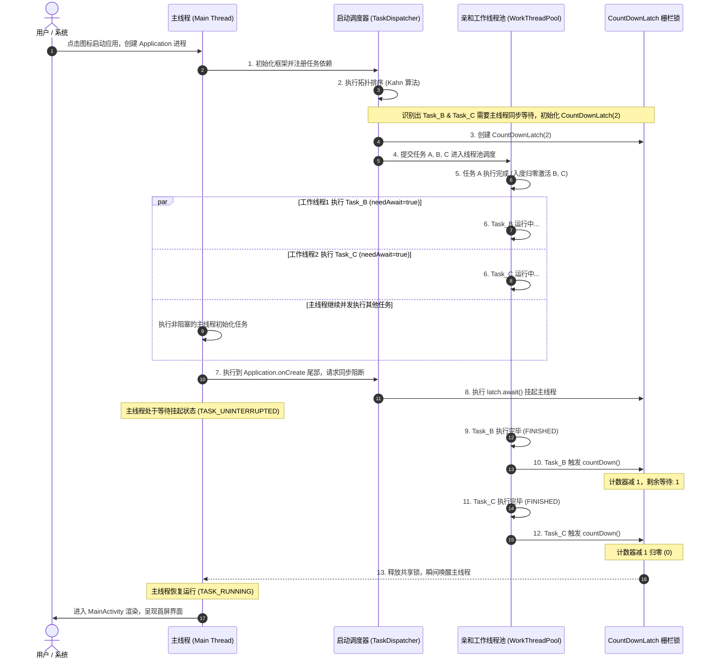

# Android 启动优化：基于 DAG 的智能异步初始化设计 with 落地

在移动端性能优化领域，“启动速度”是公认的第一体验防线。当用户点击桌面图标时，应用必须在极短时间内完成所有基础架构及业务组件的加载，并将首帧物理画面呈现给用户。

随着应用业务复杂度的急剧飙升，在 Application 阶段（如 `Application.onCreate`）静态加载的第三方 SDK 与业务模块动辄数十个。由于这些组件之间存在复杂的依赖关系，且传统方案采用纯粹的主线程串行同步初始化，导致主线程被 SharedPreferences 读取、SO 库装载、网络域名解析以及 Binder 跨进程同步调用等操作严重挂起。

然而，简易的多线程异步分发（如直接开启子线程或使用 Java 原生线程池）又是一场“无纪律的混乱灾难”：子线程间缺乏依赖控制，因依赖未就绪极易引发运行时 NullPointerException (NPE) 或 Crash 闪退；同时，由于启动期线程泛滥，引起高频的 CPU 上下文切换，反而导致系统整体启动效率劣化。

本文将以系统与底层的视角，探讨如何基于有向无环图（DAG）、Kahn 拓扑排序算法以及 Java 的 AQS 共享锁同步栅栏，构建一套高性能、高稳定、具备主动环路熔断机制的工业级智能异步初始化框架。

---

## 1. 启动期初始化混乱与串行阻塞瓶颈

### 1.1 串行同步初始化的底层阻塞本质

在大型 Android 应用程序中，`Application.onCreate()` 往往沦为各类 SDK 初始化的“垃圾堆”。开发人员往往通过硬编码方式在此处同步串行加载所有第三方和业务基础组件：

```kotlin
override fun onCreate() {
    super.onCreate()
    initAPM()          // 耗时 150ms：涉及物理文件读写与系统资源读取
    initNetwork()      // 耗时 100ms：涉及线程池构建与系统网络状态注册
    initDatabase()     // 耗时 250ms：涉及 SQLite 创建、DB 升级与 SQL 预编译
    initPush()         // 耗时 200ms：涉及 Binder 跨进程向 system_server 同步注册
    initImageLoader()  // 耗时 80ms
    initShareSDK()     // 耗时 120ms
    // ... 后续大量核心及边缘业务逻辑同步初始化
}
```

这种同步排队模式的耗时呈线性叠加，直接导致主线程严重阻塞。其底层的物理与系统级损耗主要体现在以下四个核心维度：

#### 1.1.1 JVM 类加载机制（Class Loading）与初始化开销
在 JVM 中，一个类在被首次主动引用时，必须经历“加载 - 验证 - 准备 - 解析 - 初始化”的完整生命周期。
*   **类装载器 ClassLoader 的查找路径**：当我们在主线程首次接触某个 SDK 的入口类时，系统类加载器 `PathClassLoader` 会通过双亲委派机制（Delegation Model）依次在 BootClassLoader 和应用自身的 Class Path 中查找 Class。在 Android 平台上，这涉及到在 APK 甚至多个 MultiDex（如 classes2.dex, classes3.dex 等）的 DEX 元素数组中进行线性检索，磁盘寻找与 I/O 读取非常密集。
*   **类解析与 DEX 验证（DEX Verification）**：在类被加载进内存后，ART 虚拟机会对该类的字节码执行极其严格的安全和结构验证。这一验证机制主要是为了防止恶意的字节码破坏 Dalvik 虚拟机的运行环境。在冷启动的极端瓶颈期，数百个类的字节码验证会消耗极其可观的 CPU 时钟周期。
*   **AOT 与 JIT 的运行期博弈**：虽然 Android 会在后台利用 Profile-Guided Optimization (PGO) 以及 AOT（Ahead-Of-Time）技术对常用类进行预编译（生成优化后的 `.oat` 文件，即物理机器码），但在冷启动的“冰冻期”，依然有相当多的边缘类未被编译。这部分未被编译的类在首次调用时，ART 只能采用解释模式（Interpreter）逐条翻译字节码执行，执行效率比机器码慢上数倍，这进一步放大了静态初始化代码的开销。
*   **ClassLoader 内部锁互斥（Lock Contention）**：在 JVM 层面，`java.lang.ClassLoader.loadClass` 内部为了防范多线程并发加载同名类而设计了同步锁：
    ```java
    protected Class<?> loadClass(String name, boolean resolve) throws ClassNotFoundException {
        synchronized (getClassLoadingLock(name)) {
            // ... 类查找与装载逻辑
        }
    }
    ```
    如果多线程并行加载尚未装载的类，这些线程可能会在 ClassLoader 的同步锁上产生激烈的锁竞争，导致本该并发执行的任务在 JVM 层面退化为串行，甚至引起短暂的互斥挂起。

#### 1.1.2 磁盘 I/O 阻塞（Disk I/O Block）与线程挂起
许多 SDK 在初次运行时会读取本地配置文件、初始化本地 SQLite/Room 数据库、或者访问 `SharedPreferences`。
*   **SharedPreferences 的锁开销**：当调用 `getSharedPreferences("name", MODE_PRIVATE)` 时，系统会启动一个后台线程将对应的整个 XML 文件一次性解析为内存中的 `Map`。但在该 Map 尚未完全构建好之前，如果主线程尝试去调用其 `getString()` 等获取方法，主线程会被强行 `wait()` 挂起（在 `SharedPreferencesImpl.java` 的同步锁中挂起）。
*   **内核态休眠（TASK_UNINTERRUPTIBLE）**：在 Linux 底层，由于磁盘寻道和物理读写的物理延迟，主线程会从运行态 `TASK_RUNNING` 被剥夺，切换到不可中断的睡眠状态 `TASK_UNINTERRUPTED`（即 D 状态），失去 CPU 调度优先权，从而加剧白屏感受。

#### 1.1.3 进程间通信（IPC Binder 调用）的同步延迟
推送、APM 监控、热修复等 SDK 在启动时，必须向系统服务进程 `system_server` 注册特定的 Callback（如网络状态变化监听器、系统广播监听等）。
*   **Binder 跨进程阻塞**：每一次 Binder 接口调用，都代表了一次跨进程的同步通信。主线程在发起 Binder 交易（Transaction）后，必须让出执行权，进入等待对端进程执行完对应方法并写入共享内存（Binder 驱动缓冲区）的挂起状态。一旦系统启动期由于多进程高并发导致 `system_server` 同样处于 CPU 饱和状态，Binder 通信的延迟可能从常规的 1-2 毫秒飙升到 100 毫秒以上。

#### 1.1.4 动态链接库（SO 库）装载与符号重定位
安全防刷、地图、音视频等 SDK 在初始化时会调用 `System.loadLibrary("xxx")`。
*   **dlopen 的物理开销**：这会在 Linux 层面触发 `dlopen` 系统调用，系统开始在磁盘上定位 SO 库，打开 ELF 格式的文件，并解析其程序头表（Program Header Table）。
*   **符号重定位与段对齐**：系统将 SO 库的代码段和数据段映射到物理内存，并对 SO 库中的导出符号进行链接和重定位。如果 SO 库体积庞大，包含数十万个导出符号，这一加载过程会导致 CPU 在主线程进行高密度的内存对齐与地址偏移计算，直接阻塞主线程的帧刷新时序。

---

### 1.2 简易多线程异步分发的性能漏洞与稳定性灾难

为了减轻主线程的压力，很多开发者会尝试采用“野路子”进行异步分发。最常见的做法就是直接开启独立的子线程或使用共享的并发线程池来包裹 SDK 的初始化代码：

```kotlin
override fun onCreate() {
    super.onCreate()
    
    // 盲目异步分发示例
    thread { initAPM() }
    thread { initNetwork() }
    thread { initDatabase() }
    
    // 或者投递给 CachedThreadPool
    executor.execute { initPush() }
    executor.execute { initShareSDK() }
}
```

这种缺乏依赖时序控制的异步分发，不仅无法带来真正的启动提速，反而会导致系统出现严重的稳定性问题与性能下滑：

#### 1.2.1 缺乏级联依赖控制导致的 Crash 崩溃
在实际业务场景中，SDK 之间存在着复杂的“级联依赖关系”。例如：
*   **网络库（Network）** 必须先完成初始化，**图片加载器（ImageLoader）** 和 **分享 SDK（ShareSDK）** 才能正常工作。
*   **APM 监控 SDK** 必须最先初始化，才能完整捕获后续所有 SDK 初始化的耗时与可能发生的崩溃崩溃。
*   **用户登录状态（UserSession）** 初始化完成后，**推送服务（Push）** 才能绑定具体的别名（Alias）进行精准推送。

在上述简易多线程代码中，各个子线程的执行顺序完全依赖于操作系统的内核线程调度算法。如果在低端机上，`Network` 初始化线程因为 CPU 时间片争抢失败而慢于 `ShareSDK` 初始化线程，那么当 `ShareSDK` 尝试去获取已配置的 HTTP 客户端实例时，就会因为对象尚未实例化而直接抛出 `NullPointerException`，导致应用在启动期间直接闪退。

#### 1.2.2 线程上下文切换（Context Switch）的开销雪崩
当应用启动时，系统正在全力以赴地为主线程分配 CPU 时间片，以完成 Activity 生命周期的流转与首帧视图的绘制。如果此时开发者在 Application 中瞬间开启了十几个物理线程，每个线程都疯狂争抢 CPU 资源，会导致 Linux 内核的 CPU 调度器（例如完全公平调度器 CFS）频繁地进行线程切换。

每一次线程上下文切换，CPU 都需要：
1.  保存当前线程的寄存器状态、程序计数器（PC）、堆栈指针。
2.  刷新 CPU 的虚拟内存页表缓存（TLB - Translation Lookaside Buffer）。
3.  将新线程的上下文信息载入寄存器。
4.  伴随线程切换带来的物理缓存失效（L1/L2/L3 Cache Line Invalidation），导致新线程读取内存时发生高频的 Cache Miss，必须重新从慢速的系统物理主存中读取数据。

这会导致 CPU 的有效计算时间被大量消耗在“保存-恢复-等待”的行政开销上，引起 CPU 忙等。在低端双核或四核处理器上，这种高频竞态会导致整体启动耗时比纯粹的主线程串行执行还要慢。

---

## 2. 基于有向无环图（DAG）的智能任务编排

为了解决各个 SDK 初始化任务之间错综复杂的级联依赖关系，我们需要引入图论中的数学模型——**有向无环图（DAG, Directed Acyclic Graph）**。

### 2.1 什么是 DAG 及其对 SDK 依赖的数学描述

在图论中，一个图由顶点（Vertex）和连接顶点的边（Edge）组成。
*   **有向图（Directed Graph）**：边具有方向性，从顶点 $U$ 指向顶点 $V$（记作 $U \to V$），表示一种单向的关系。
*   **无环图（Acyclic Graph）**：从任意顶点出发，沿着有向边前行，永远无法回到起点，即图中不存在任何环路（Loop）。

在异步初始化场景中，我们可以对 DAG 进行如下的业务映射：
1.  **顶点（Vertex / Node）**：代表一个独立的 SDK 初始化任务（如 `Task_Network`、`Task_Database` 等）。
2.  **有向边（Directed Edge）**：代表任务之间的前置依赖关系。如果存在有向边 $U \to V$，表示任务 $V$ 必须在任务 $U$ 执行完毕（进入 `FINISHED` 状态）后，才能开始执行。此时称 $U$ 是 $V$ 的**前置依赖（Predecessor）**，$V$ 是 $U$ 的**后置依赖/跟随者（Successor）**。
3.  **入度（In-Degree）**：指向该顶点的有向边数量。入度值代表了该任务当前还在等待的前置依赖任务数。例如，若任务 $V$ 依赖任务 $A$ 与 $B$，则 $V$ 的入度为 2。当且仅当一个任务的入度降为 0 时，说明它所有的前置任务均已执行完毕，该任务才被激活，具备了被调度的资格。
4.  **出度（Out-Degree）**：从该顶点出发指向其他顶点的有向边数量。出度值代表了该任务被多少个后续任务所依赖。出度越高的任务，一旦执行完毕，越能瞬间释放一大批后置任务的并发度，因此在调度策略上具有更高的执行优先级。

假设我们有 7 个 SDK 初始化任务，它们的依赖关系如下：
*   `Task_A` 无依赖；
*   `Task_B` 依赖 `Task_A`；
*   `Task_C` 依赖 `Task_A`；
*   `Task_D` 依赖 `Task_B` 和 `Task_C`；
*   `Task_E` 依赖 `Task_C`；
*   `Task_F` 依赖 `Task_D` 和 `Task_E`；
*   `Task_G` 依赖 `Task_F` 且必须在主线程执行。

这个级联依赖网络便构成了一个标准的 DAG，如下图所示：

```
     [Task_A] (入度:0, 出度:2)
      /     \
     v       v
 [Task_B]   [Task_C] (B入度:1, C入度:1)
    |       /    \
    v      v      v
 [Task_D]       [Task_E] (D入度:2, E入度:1)
    \      \      /
     \      v    v
      \--->[Task_F] (入度:2, 出度:1)
             |
             v
          [Task_G] (入度:1, 出度:0, 主线程强依赖)
```

---

### 2.2 拓扑排序（Topological Sort）深度解析

要将上述复杂的图状依赖网络，转换为多线程能够正确且无冲突执行的任务序列，必须对其进行**拓扑排序（Topological Sort）**。
拓扑排序是将一个 DAG 的顶点排成一个线性序列，使得对于图中的任意两个顶点 $U$ 和 $V$，如果存在一条有向边 $U \to V$，则在排序序列中 $U$ 必须出现在 $V$ 的前面。

进行拓扑排序最经典的算法之一是 **Kahn 算法（基于入度计数的贪心算法）**。以下是其物理演进的详细步骤：

#### 2.2.1 Kahn 算法动态降度剪边物理演进过程
1.  **初始化入度表与零入度队列**：
    *   统计图内所有节点的初始入度数，存储在一个哈希表或数组中。
    *   扫描所有节点，将所有初始入度为 0 的节点放入一个**零入度队列（Queue）**中。
2.  **循环出队与降度剪边**：
    *   当队列不为空时，从队列中弹出一个节点（记为 $U$）。
    *   将节点 $U$ 添加到拓扑输出序列（Result List）中。
    *   **动态剪边**：遍历节点 $U$ 的所有后置依赖节点（即出边指向的邻接节点，记为 $V$）。将节点 $V$ 在入度表中的入度值减 1（代表 $U$ 已执行完毕，断开了 $U \to V$ 这条依赖边）。
    *   **动态降度激活**：检查减 1 后节点 $V$ 的入度值。如果它的入度变成了 0，说明它的所有前置阻碍都已扫清，立刻将节点 $V$ 压入零入度队列中。
3.  **终止判定**：
    *   重复步骤 2，直到零入度队列为空。
    *   此时，如果输出序列中的节点总数等于图中的原始节点总数，说明排序成功，输出序列即为可行的执行路径。若小于原始节点总数，则说明图内存在环路（循环依赖）。

#### 2.2.2 7 个任务的 Kahn 算法演化顺序图解

针对上述 7 个 SDK 初始化任务，我们来一步步推演 Kahn 算法的物理降度与剪边过程：

##### 步骤 1：初始状态
*   **入度统计**：
    *   `A`: 0, `B`: 1, `C`: 1, `D`: 2, `E`: 1, `F`: 2, `G`: 1
*   **零入度队列**：`[A]`
*   **已排序序列**：`[]`

##### 步骤 2：弹出 A，断开 A->B 和 A->C
*   **降度计算**：
    *   `B` 的入度由 1 降为 0（激活，入队）
    *   `C` 的入度由 1 降为 0（激活，入队）
*   **零入度队列**：`[B, C]`
*   **已排序序列**：`[A]`

##### 步骤 3：弹出 B，断开 B->D
*   **降度计算**：
    *   `D` 的入度由 2 降为 1（未激活，继续等待）
*   **零入度队列**：`[C]`
*   **已排序序列**：`[A, B]`

##### 步骤 4：弹出 C，断开 C->D 和 C->E
*   **降度计算**：
    *   `D` 的入度由 1 降为 0（激活，入队）
    *   `E` 的入度由 1 降为 0（激活，入队）
*   **零入度队列**：`[D, E]`
*   **已排序序列**：`[A, B, C]`

##### 步骤 5：弹出 D，断开 D->F
*   **降度计算**：
    *   `F` 的入度由 2 降为 1（未激活）
*   **零入度队列**：`[E]`
*   **已排序序列**：`[A, B, C, D]`

##### 步骤 6：弹出 E，断开 E->F
*   **降度计算**：
    *   `F` 的入度由 1 降为 0（激活，入队）
*   **零入度队列**：`[F]`
*   **已排序序列**：`[A, B, C, D, E]`

##### 步骤 7：弹出 F，断开 F->G
*   **降度计算**：
    *   `G` 的入度由 1 降为 0（激活，入队）
*   **零入度队列**：`[G]`
*   **已排序序列**：`[A, B, C, D, E, F]`

##### 步骤 8：弹出 G，无出边
*   **零入度队列**：`[]`（为空，算法结束）
*   **已排序序列**：`[A, B, C, D, E, F, G]`
*   **验证**：已排序节点数 7 == 原始节点数 7。排序完美成功！

```mermaid
graph TD
    %% 阶段样式定义
    classDef default fill:#ECEFF1,stroke:#607D8B,stroke-width:2px,color:#37474F;
    classDef zeroIn fill:#E8F8F5,stroke:#117A65,stroke-width:2px,color:#117864;
    classDef finished fill:#EBEDEF,stroke:#BDC3C7,stroke-width:2px,color:#7F8C8D,stroke-dasharray: 5 5;
    
    subgraph 阶段1: 初始状态 (Queue: [A])
        A1(A In:0):::zeroIn --> B1(B In:1)
        A1 --> C1(C In:1)
        B1 --> D1(D In:2)
        C1 --> D1
        C1 --> E1(E In:1)
        D1 --> F1(F In:2)
        E1 --> F1
        F1 --> G1(G In:1)
    end

    subgraph 阶段2: 弹出 A 剪边 (Queue: [B, C])
        A2(A Done):::finished -. 剪边 .-> B2(B In:0):::zeroIn
        A2 -. 剪边 .-> C2(C In:0):::zeroIn
        B2 --> D2(D In:2)
        C2 --> D2
        C2 --> E2(E In:1)
        D2 --> F2(F In:2)
        E2 --> F2
        F2 --> G2(G In:1)
    end

    subgraph 阶段3: 弹出 B,C 剪边 (Queue: [D, E])
        A3(A Done):::finished
        B3(B Done):::finished -. 剪边 .-> D3(D In:0):::zeroIn
        C3(C Done):::finished -. 剪边 .-> D3
        C3 -. 剪边 .-> E3(E In:0):::zeroIn
        D3 --> F3(F In:2)
        E3 --> F3
        F3 --> G3(G In:1)
    end

    subgraph 阶段4: 弹出 D,E 剪边 (Queue: [F])
        A4(A Done):::finished
        B4(B Done):::finished
        C4(C Done):::finished
        D4(D Done):::finished -. 剪边 .-> F4(F In:0):::zeroIn
        E4(E Done):::finished -. 剪边 .-> F4
        F4 --> G4(G In:1)
    end

    subgraph 阶段5: 弹出 F 剪边 (Queue: [G])
        F5(F Done):::finished -. 剪边 .-> G5(G In:0):::zeroIn
    end
```

#### 2.2.3 Kahn 算法的复杂度深度剖析
*   **时间复杂度 $O(V + E)$**：Kahn 算法的执行时间与顶点数 $V$ 和边数 $E$ 呈线性关系。算法中每个顶点都会被且仅会被放入并取出“零入度队列”一次，这占用了 $O(V)$ 的时间；对于每个出队的顶点，都需要遍历其所有的出边进行剪边降度，所有出边的总数量即为 $E$，因此这占用了 $O(E)$ 的时间。总时间复杂度为 $O(V + E)$，即使在顶点数达到数百个的大型 App 中，排序动作在毫秒级内即可瞬间完成。
*   **空间复杂度 $O(V + E)$**：我们需要一个大小为 $V$ 的队列来缓存零入度节点，一个大小为 $V$ 的 Map 或数组来动态维护入度值，以及一个大小为 $V+E$ 的邻接表结构来存储图的拓扑关系。因此空间复杂度为 $O(V + E)$，内存消耗极低。

---

### 2.3 循环依赖（Circular Dependency）环路熔断机制

在大型团队多人协作开发中，配置冲突在所难免。如果开发者在配置任务依赖时，不小心写成了环路（例如：业务 A 依赖业务 B，业务 B 依赖业务 C，业务 C 又依赖业务 A），这会形成一个**有向环（Directed Cycle）**。

#### 2.3.1 环路依赖的物理危害
如果没有任何防御手段，环路依赖会导致系统在启动时陷入**死锁/假死（Dead Lock / Hang）**。在多线程调度中，A 在等待 C 完成，C 在等待 B 完成，B 在等待 A 完成。没有任何一个任务能够达到“入度为 0”的激活条件，整个线程池将由于没有任何任务可执行而进入永久空闲，而主线程则由于等待特定屏障而永久挂起（ANR 崩溃）。

#### 2.3.2 Kahn 算法在运行时的环路熔断机制
Kahn 算法本身天生具备**环路检测**能力。其熔断原理极其简单而扎实：
在有向环中，每个环内节点的入度永远不可能降为 0（因为它的上游依赖在环内，永远无法断开）。所以，环内所有的顶点都无法进入零入度队列。
外围拓扑排序结束后，我们只需要检查：
$$\text{已完成拓扑排序的节点总数} \neq \text{图的原始节点总数}$$
一旦不等，框架必须**立即抛出运行时异常（如 `CircularDependencyException`）强行熔断**。

#### 2.3.3 解耦循环依赖的经典重构策略
一旦检测到循环依赖，系统应该立刻熔断并报错。为了在架构上修复循环依赖，开发者通常可采取以下解耦策略：
1.  **接口提取与依赖注入（Dependency Injection / Interface Extraction）**：若 A 依赖 B 模块的某个具体实现，而 B 在初始化时又必须持有 A 的实例。可将 A 的核心服务提取为 `IServiceA` 接口并放入公共层，B 仅依赖 `IServiceA` 接口；在初始化完成后，再将 A 的真实实现动态注入到 B 中，实现时序上的解耦。
2.  **事件总线异步解耦（Event-Driven Decoupling）**：使用本地事件总线（如 LiveData、Flow 或 EventBus）。B 不需要直接依赖 A，而是仅仅在完成特定初始化步骤后，发布一个 `InitSuccessEvent` 广播，由 A 异步监听后触发自身的相关后续逻辑。
3.  **懒加载延迟化（Lazy Load）**：将循环依赖的链条中的某一个非关键任务延迟至首帧渲染完成后（即 IdleHandler 中）延迟加载，使其彻底脱离启动期的静态 DAG 图控制，从而安全打破环路。

---

## 3. 任务执行状态机与多线程栅栏（Barrier）同步机制

有了拓扑排序输出的可行序列，我们是否可以简单地把它们装载进线程池跑就完事了？答案是否定的。拓扑排序只是静态的依赖序列，但在多线程并发执行的动态运行期，任务的流转是复杂的。我们需要为每个任务引入一套严密的状态机管理，并在需要的时候挂起主线程，实现“主线程栅栏锁”。

### 3.1 异步任务调度流转过程中的状态机管理

在启动框架内部，每一个 `Task` 实体都应该维护一个内部状态，确保多线程并发访问时的可见性与原子性。我们定义以下四个核心状态：

```
      +-------+
      | IDLE  | (初始状态：表示任务创建完毕并向框架注册，尚无调度介入)
      +---+---+
          | 静态编排/进入调度队列
          v
     +----+----+
     | WAITING | (等待状态：该任务的前置依赖节点尚未全部执行完毕，入度 > 0)
     +----+----+
          | 前置依赖全部完成，入度归零，线程池调度分配 CPU 执行
          v
     +----+----+
     | RUNNING | (运行状态：任务正在线程池的某个线程或主线程中执行逻辑)
     +----+----+
          | 执行逻辑结束，释放锁，并向后继节点传递通知
          v
    +-----+----+
    | FINISHED | (完成状态：任务完全执行结束，入度贡献为零，不再参与状态流转)
    +----------+
```

*   状态机转换必须是**单向且不可逆**的：`IDLE` $\to$ `WAITING` $\to$ `RUNNING` $\to$ `FINISHED`。
*   为了保证状态转换在多线程并发下的线程安全，必须使用 `AtomicInteger` 或在互斥锁（ReentrantLock）的保护下更新状态。

---

### 3.2 主线程同步阻塞与唤醒机制（Wait-Notify 与 CountDownLatch）

在应用启动期，存在着一条极其核心的设计取舍：
**主线程强同步依赖**：有些任务虽然在后台线程执行，但在主线程的 `MainActivity` 渲染首帧或 `Application.onCreate` 结束前，**必须执行完毕**。
例如：
1.  **热修复 SDK（HotFix）**：必须完全加载补丁包，后续的类加载才安全，否则会发生补丁失效或类版本冲突。
2.  **网络域名解析与配置 SDK（DNS / DynamicConfig）**：如果主 Activity 启动时需要同步拉取首屏配置，该 SDK 必须先初始化就绪。

如果为了等待这些任务而把所有初始化都放在主线程同步串行，显然违背了异步优化的初衷。我们希望：
*   这些核心任务依然由线程池异步并发执行。
*   主线程在 Application 生命周期的末尾**选择性地挂起**，等待这些特定核心任务执行完毕。
*   一旦这些特定任务在子线程执行完毕，主线程被**瞬间唤醒**，继续后续的渲染流程。

#### 3.2.1 CountDownLatch 物理栅栏机制
传统的 `Thread.join()` 只能挂起当前线程直到目标线程完全死亡，无法做到“任务级”的挂起。而在多线程中，我们通过 **`CountDownLatch`** 能够完美地实现这一物理阻断与瞬间唤醒链路。

1.  **栅栏锁初始化**：框架在初始化调度器时，过滤出所有被标记为 `needAwait = true`（即需要主线程阻塞等待）的任务，统计这些任务的总数 $K$。
2.  **创建 CountDownLatch**：创建一个 `CountDownLatch(K)` 计数器。
3.  **主线程挂起（Blocking）**：在 `Application.onCreate()` 的最后，主线程调用 `latch.await(timeout, TimeUnit)`。此时，主线程会将自身的线程控制权让出，进入阻塞队列等待。
4.  **异步子线程唤醒（Notify）**：对于这 $K$ 个任务，当它们在工作线程中执行完毕并切为 `FINISHED` 状态时，在 `finally` 块中安全地触发 `latch.countDown()`。
5.  **AQS 级瞬间唤醒（Resume）**：当计数器值从 1 降为 0 的瞬间，处于底层 AQS 共享等待队列中的主线程被系统调度程序重新标记为 `TASK_RUNNING`，并在下一个 CPU 时间片到来时瞬间恢复执行。

#### 3.2.2 CountDownLatch 底层 AQS 锁机制深度剖析
`CountDownLatch` 的底层是通过 Java 的 **`AbstractQueuedSynchronizer` (AQS)** 框架来实现的共享锁（Shared Lock）控制。

##### 挂起物理时序
当主线程调用 `latch.await()` 时，其内部会发起一次 AQS 状态查询：
1.  **查询计数器**：调用 `Sync.tryAcquireShared(arg)`，该方法会判断当前状态值（即 `state`，这里就是倒计时数值）是否为 0。如果 `state != 0`，返回 `-1`。
2.  **加入等待双向队列**：因为返回了负数，主线程会触发 `AQS.doAcquireSharedInterruptibly(1)`，将主线程包装为一个 `SHARED` 类型的 Node，插入到 AQS 内部的 CLH 同步等待双向队列中（即尾部排队）。
3.  **陷入内核挂起（Park）**：在队列自旋中，如果判断前置节点为 `SIGNAL`，则调用底层的 `LockSupport.park(this)`。在 Linux 内核层面，这将调用 `sys_futex` 系统调用，使得主线程彻底被切出物理核心，休眠挂起，不再消耗任何 CPU。

##### 唤醒物理时序
当子线程完成任务，调用 `latch.countDown()` 时：
1.  **原子减 1**：触发 `Sync.tryReleaseShared(1)`。该方法通过 CAS（Compare-And-Swap）原子操作将 AQS 的 `state` 减 1。
2.  **触发唤醒机制**：如果减 1 后 `state == 0`，代表所有依赖任务均已结束，`tryReleaseShared` 返回 `true`，触发 `AQS.doReleaseShared()`。
3.  **传播性唤醒（Propagate）**：AQS 遍历双向队列的首个节点（即等待中的主线程），将其从 CLH 同步队列中移出，并触发底层的 `LockSupport.unpark(thread)`。在 OS 层面，这会再次通过内核 `sys_futex` 唤醒休眠的主线程。由于是共享模式，被唤醒的主线程在恢复执行后，若队列中还有其他挂起在同一栅栏处的共享节点（例如其他也在 await 的线程），会通过 AQS 的 `setHeadAndPropagate()` 机制将唤醒信号向下游扩散，实现零死角的并发同步。

#### 3.2.3 栅栏同步时序与生命周期流程图

下面的 Mermaid 序列图清晰地展示了主线程在启动期间，如何通过 `CountDownLatch` 在临界点挂起自身，并在工作线程完成关键任务后被瞬间唤醒的整个物理生命周期流程：



---

## 4. 启动专有线程池精细化调优与排队策略

启动期间的线程池，绝对不能等同于业务开发中使用的普通线程池。启动是一个短暂的、高并发、CPU 极其敏感的物理过程。对其参数调配和任务排队策略的精细化控制，是异步初始化框架的核心门槛。

### 4.1 为什么绝对禁止在启动期直接使用 `CachedThreadPool`？

`Executors.newCachedThreadPool()` 的底层配置是：核心线程数为 0，最大线程数为 `Integer.MAX_VALUE`，线程空闲存活时间 60 秒，任务阻塞队列使用 `SynchronousQueue`（即不缓存任务的同步传递队列）。

这种配置在启动期是灾难性的，原因如下：
1.  **线程无限制创建（Thread Explosion）**：由于 `SynchronousQueue` 的特性，一旦有大量初始化任务提交，只要当前没有空闲线程，线程池就会疯狂创建新的物理线程去执行任务。
2.  **虚拟内存溢出（OOM）风险**：在 Android 系统中，创建一个物理线程默认会分配 1MB 的栈空间（通过 pthread_create 映射物理内存）。如果瞬间创建上百个线程，在 32 位机器或内存紧张的低端机上，会直接因为 `OutOfMemoryError: pthread_create failed` 导致应用闪退。
3.  **CFS 时间片分流恶果**：大量的线程导致内核频繁进行上下文切换，如 1.2.2 节所述，CPU 大量时间空转在寄存器保存和 TLB 刷新上，使得高优先级的主线程迟迟无法获得足够的时间片，首屏渲染被严重拖后。

---

### 4.2 启动专用 CPU 亲和线程池参数调配

我们需要设计一个启动专用线程池，其核心思想是：**充分利用多核 CPU 的计算能力，同时严格限制线程总数，防止产生过度竞态**。

#### 4.2.1 移动端大小核架构对线程分配的物理挑战
现代移动端 SoC（System on Chip）大多采用大小核（Big.LITTLE 或 ARM DynamIQ）物理架构。
*   **性能差异**：大核主频极高且拥有更宽的指令总线，而小核主频低、功耗低。
*   **木桶效应的陷阱**：在启动期，如果无克制地生成七八个子线程，操作系统调度器可能会将某些关键的同步初始化任务分配到极慢的小核上运行，从而导致主线程在临界栅栏（Barrier）处因为等待该“小核任务”而迟迟无法被唤醒，木桶的短板效应暴露无遗。
*   **动态核心线程数计算公式**：为了在大核并发与小核瓶颈之间求得物理平衡，我们设定核心线程数 $N_{\text{core}}$ 基于系统逻辑核心数 $N$ 动态换算：

$$N_{\text{core}} = \max(2, \min(N - 1, 4))$$

对于四核设备，核心线程数为 3；对于八核及以上设备，核心线程数限制在 4 到 5。通过严格约束子线程最大并行度在 4 左右，可以最大化确保这些工作线程大部分被调度到中核或大核上，同时为主线程腾出 1-2 个专属物理大核心，以保证核心 Activity 帧渲染与流畅的交互输出。

#### 4.2.2 线程优先级与 Linux CFS 权重映射
我们必须在 `ThreadFactory` 中创建线程时，显式降低子线程的优先级。在 Android 系统中，线程优先级的 nice 值范围为 -20（最高优先级）到 19（最低优先级）：
*   **CFS 调度权重计算**：Linux CFS（完全公平调度器）根据以下数学模型来映射 nice 值与分配时间片的权重值关系：
    $$W_i = \frac{1024}{1.25^{\text{nice}}}$$
    假设主线程的 nice 值为 -10，其权重 $W_{\text{main}} \approx 9536$；而若子线程的 nice 值为 10（背景任务），其权重 $W_{\text{sub}} \approx 110$。这意味着在抢占同一个大核 CPU 的调度周期中，主线程所获得的 CPU 执行时长是该子线程的约 86 倍。
*   **优先级降级配置**：这能极好地保障主线程不因并发异步任务而产生卡顿。

```kotlin
Thread { runnable }.apply {
    name = "Startup-Worker-${threadCount.getAndIncrement()}"
    // 使用 android.os.Process 降级子线程优先级为 BACKGROUND (nice = 10)
    // 这可以让主线程 (nice = -10 或更优) 占有绝对的 CPU 统治权
    android.os.Process.setThreadPriority(android.os.Process.THREAD_PRIORITY_BACKGROUND)
}
```

---

### 4.3 优先级排队策略与出度（Out-Degree）权重计算

由于线程池核心线程数受限，当就绪的任务数量超过核心线程数时，多余的任务就会进入线程池的等待队列。
如果使用普通的 `LinkedBlockingQueue`（FIFO，先进先出），先进入队列的任务会先执行。但这在 DAG 调度中是不合理的。我们必须让**最紧急的任务优先出队执行**。

#### 4.3.1 出度（Out-Degree，被依赖权重）的紧急度数学模型
在图论中，一个顶点的出度（Out-Degree）越大，说明有越多的后续任务正在眼巴巴地等待它执行完毕。
例如：
*   `Task_Network` 的出度是 5（图片库、分享、推送、定位、APM 埋点都等着它）。
*   `Task_Location` 的出度是 0（没有任何任务依赖它）。

如果线程池空闲，应该优先调度 `Task_Network`。因为一旦 `Task_Network` 执行完毕，就能瞬间将 5 个任务的入度减 1，释放多线程的并发潜力。而如果先调度了 `Task_Location`，在它执行期间，那 5 个依赖网络库的任务只能在 `WAITING` 状态干等，导致并发链路发生实质性的断档。

#### 4.3.2 组合权重计算公式
为了实现这一策略，我们需要使用 **`PriorityBlockingQueue`**，并定义任务的比较优先级。
每个任务的比较权重由两部分组成：
1.  **出度权重（被依赖权重）**：通过静态图分析直接算出的出度值。
2.  **自定义紧急度（User Priority）**：开发者显式指定的优先级（如某些强同步任务虽然出度低，但主线程急需它）。

任务的最终权重计算公式为：
$$\text{Weight} = (\text{Out-Degree} \times W_{\text{out}}) + (\text{User-Priority} \times W_{\text{user}})$$
（通常 $W_{\text{out}} = 10, W_{\text{user}} = 1$，突出出度的决定性作用）。
在 `PriorityBlockingQueue` 中，权重值越大的任务越优先出队执行。

---

## 5. 工业级方案横向对比：Jetpack Startup vs Alpha vs Anchor

为了给企业级技术选型提供坚实的数据支撑，我们对目前业界主流的三种启动初始化方案进行深度横向对比：

| 对比维度 | Jetpack App Startup | 阿里 Alpha (开源方案) | 美团 Anchor (内部思想) |
| :--- | :--- | :--- | :--- |
| **核心定位** | 官方轻量级合并 Provider 工具 | 早期基于 DAG 的多线程调度库 | 高并发、高控制力的现代 DAG 编排框架 |
| **DAG 编排支持** | 仅支持简单的串行级联依赖 |  支持完整的 DAG 拓扑编排 |  支持完整的 DAG 拓扑编排 |
| **多线程并发能力** | ❌ 默认全部在主线程执行（需自行扩展线程调度） |  支持多线程并发执行 |  支持多线程并发执行 |
| **出度优先级调度** | ❌ 不支持 | ❌ 不支持（普通 FIFO 队列） |  支持基于出度的动态优先级调度 |
| **主线程阻塞唤醒 (Barrier)**| ❌ 不支持 |  支持通过指定同步任务阻塞 |  支持基于 `CountDownLatch` 的精准同步 |
| **环路检测与熔断** |  支持（检测到循环依赖直接报错）|  支持（Kahn 算法校验） |  支持（Kahn 算法 + 依赖链打印） |
| **性能监测 (APM)** | ❌ 无内置统计功能 |  支持内置各阶段耗时输出 |  支持详细的任务执行树生命周期耗时回溯 |
| **官方支持与维护度** |  Google 官方维护，API 极稳定 | ❌ 已停止维护（社区停留在数年前） | ❌ 仅有架构思想文章，无开源库成品 |
| **初始化拦截与动态降级**| ❌ 不支持 | ❌ 不支持 |  支持根据配置动态剔除或跳过特定任务 |
| **接入开销与复杂度** | 极低，适合简单依赖的轻量级 App | 中等，需配置 Task 派生类 | 较高，需定制整套动态执行树与线程池 |
| **适用场景** | 组件化开发中，避免各 SDK 重复配置 Provider| 遗留系统的多线程启动改造 | 大型/超大型复杂 App 启动管线重构 |

### 5.1 方案架构逻辑深度差异分析

#### 5.1.1 Jetpack App Startup 的设计局限
App Startup 的核心设计定位并非为了多线程并发提速，而是为了合并多个库的 `ContentProvider` 初始化动作。在 Google 开发者的架构设想中，如果一个 App 依赖了十几个库，每个库都各自声明一个 Provider 用来自动执行初始化（例如 Firebase, WorkManager, LeakCanary 等），主线程的 Application 阶段会被无序的 Provider 反射创建过程占满。
App Startup 通过合并所有的初始化到一个 `InitializationProvider` 中，实现了按需依赖顺序加载。然而在面对更复杂的业务流时，它无法原生处理以下两个工业级场景：
*   **工作线程分流**：它依然需要开发者手动创建并维护底层的并发队列，否则所有 SDK 依然被迫在主线程中排队。
*   **同步唤醒机制**：它没有任何基于 CountDownLatch 的主线程拦截与瞬间唤醒配置，无法将异步分发与同步卡点完美结合。

其 `InitializationProvider` 源码层面的核心逻辑非常直接：
```java
// 简化后的官方源码逻辑示意
@Override
public boolean onCreate() {
    Context context = getContext();
    if (context != null) {
        AppInitializer initializer = AppInitializer.getInstance(context);
        // 执行发现和串行构建
        initializer.discoverAndInitialize();
    }
    return true;
}
```
可以看到，在没有二次封装的情况下，它强制所有注册的 `Initializer` 都在调用主线程中运行。要想在子线程处理，必须开发者手动在 `Initializer.create()` 内包裹定制的线程调度。

#### 5.1.2 阿里 Alpha 的架构缺陷
Alpha 采用了基于 `Task` 的设计，将任务分为主线程和子线程。但其底层调度器直接基于 JDK 原生的 `ForkJoinPool` 或普通的 `ExecutorService`，且任务队列没有考虑出度的优先级，导致在多核处理器上无法最大化缩短“关键路径”。此外，项目年久失修，不兼容现代 Android 的许多特性（如 Kotlin Coroutines 混合调度）。

#### 5.1.3 美团 Anchor 的先进思想
美团技术团队分享的 Anchor 思想在图的度调度与关键路径规划上走在了前列。它指出：一个大型应用往往存在多条并发路径，但在所有路径中，耗时最长的那条串行链决定了整个系统的物理最短启动时间，这条链被称为**关键路径（Critical Path）**。
Anchor 框架的核心思想即是：
1.  **出度优先调度**：利用出度权重算法，在多核处理器上首先将具有极高连通度的任务塞满线程池的核心线程，缩短后续任务的等待阻碍。
2.  **阶段流控制（Stage Flow Control）**：不仅仅局限于 Application 阶段，还能将初始化链路划分为 `ApplicationonCreate`、`SplashShow`、`MainFirstFrame` 等多个物理阶段，在不同的阶段边界通过精细控制栅栏进行多线程屏障拦截与唤醒，实现真正的全链路多核并发。

---

## 6. 工程落地：基于 DAG 的工业级异步初始化框架完整 Kotlin 实现

为了将上述所有物理原理与设计思想转化为可实际运行的生产代码，下面设计并给出了一套完整的、无外部库依赖、高度优化的基于 DAG 的异步初始化框架 Kotlin 实现。

### 6.1 核心框架设计

代码包含以下几个核心设计模块：
1.  `Task`：抽象任务基类，定义任务属性（名称、是否主线程执行、依赖列表、优先级、出度等）。
2.  `TaskState`：任务执行状态机枚举。
3.  `TopologySorter`：Kahn 算法拓扑排序引擎，内置基于 DFS 的深度路径回溯环路检测与强熔断机制。
4.  `TaskDispatcher`：多线程调度中心，内置 CPU 亲和性线程池、出度优先级阻塞队列、主线程栅栏锁等。

### 6.2 完整 Kotlin 实现源码

```kotlin
package com.antigravity.startup.dispatcher

import android.os.Process
import android.util.Log
import java.util.concurrent.BlockingQueue
import java.util.concurrent.CountDownLatch
import java.util.concurrent.ExecutorService
import java.util.concurrent.PriorityBlockingQueue
import java.util.concurrent.ThreadFactory
import java.util.concurrent.ThreadPoolExecutor
import java.util.concurrent.TimeUnit
import java.util.concurrent.atomic.AtomicInteger
import java.util.concurrent.locks.ReentrantLock
import kotlin.concurrent.withLock

/**
 * 任务执行状态机
 */
enum class TaskState {
    IDLE,       // 闲置/已注册
    WAITING,    // 等待依赖完成
    RUNNING,    // 正在执行
    FINISHED    // 执行结束
}

/**
 * 抽象初始化任务基类
 */
abstract class Task(
    val taskName: String,
    val isRunOnMainThread: Boolean = false,
    val needAwait: Boolean = false, // 是否需要主线程等待其执行完成
    val userPriority: Int = 0       // 用户指定的优先级权重
) : Runnable, Comparable<Task> {

    // 内部依赖管理
    val predecessors = mutableListOf<Task>() // 前置依赖节点
    val successors = mutableListOf<Task>()   // 后置依赖节点（出度边）

    @Volatile
    var state: TaskState = TaskState.IDLE
        internal set

    // 动态入度计数，多线程安全
    private val inDegreeCount = AtomicInteger(0)
    
    // 该任务在 DAG 中的静态出度数（被依赖数）
    var outDegree: Int = 0
        internal set

    /**
     * 声明该任务所依赖的其他任务名称列表
     */
    open fun dependsOn(): List<String> = emptyList()

    /**
     * 具体的 SDK 初始化执行逻辑，由子类实现
     */
    abstract fun runTask()

    override fun run() {
        // 保证状态转换原子性
        state = TaskState.RUNNING
        val startTime = System.currentTimeMillis()
        try {
            runTask()
        } finally {
            state = TaskState.FINISHED
            val cost = System.currentTimeMillis() - startTime
            Log.d("TaskDispatcher", "✅ 任务 [$taskName] 执行完毕，耗时: ${cost}ms，运行于: ${Thread.currentThread().name}")
        }
    }

    internal fun setInDegree(degree: Int) {
        inDegreeCount.set(degree)
    }

    internal fun getInDegree(): Int = inDegreeCount.get()

    /**
     * 动态减少入度值。当入度减少为 0 时返回 true，表示该任务可以被激活调度。
     */
    internal fun decrementAndGetInDegree(): Boolean {
        return inDegreeCount.decrementAndGet() == 0
    }

    /**
     * 添加前置依赖
     */
    internal fun addPredecessor(task: Task) {
        if (!predecessors.contains(task)) {
            predecessors.add(task)
        }
    }

    /**
     * 添加后置依赖
     */
    internal fun addSuccessor(task: Task) {
        if (!successors.contains(task)) {
            successors.add(task)
            outDegree = successors.size
        }
    }

    /**
     * 计算任务的最终排序权重。
     * 出度（被依赖权重）乘以 10 作为核心紧急度，加上用户指定的优先级权重。
     */
    fun getSortWeight(): Int {
        return (outDegree * 10) + userPriority
    }

    /**
     * 在 PriorityBlockingQueue 中进行紧急度比较。
     * 权重值越大（即出度越高或用户优先级越高）的任务越优先出队执行。
     */
    override fun compareTo(other: Task): Int {
        return other.getSortWeight().compareTo(this.getSortWeight())
    }
}

/**
 * 拓扑排序引擎与环路检测器
 */
object TopologySorter {

    /**
     * 使用 Kahn 算法进行拓扑排序，并进行环路检测
     */
    fun sort(tasks: List<Task>): List<Task> {
        val result = mutableListOf<Task>()
        val zeroInDegreeQueue = ArrayDeque<Task>()

        // 1. 初始化入度与出度映射关系
        val inDegreeMap = mutableMapOf<Task, Int>()
        tasks.forEach { task ->
            // 解析配置中的依赖关系
            task.setInDegree(task.predecessors.size)
            inDegreeMap[task] = task.predecessors.size
            if (task.predecessors.isEmpty()) {
                zeroInDegreeQueue.addLast(task)
            }
        }

        // 2. 循环降度与剪边
        while (zeroInDegreeQueue.isNotEmpty()) {
            val current = zeroInDegreeQueue.removeFirst()
            result.add(current)

            current.successors.forEach { successor ->
                val currentInDegree = inDegreeMap[successor] ?: 0
                val nextInDegree = currentInDegree - 1
                inDegreeMap[successor] = nextInDegree
                if (nextInDegree == 0) {
                    zeroInDegreeQueue.addLast(successor)
                }
            }
        }

        // 3. 强熔断机制：环路检测
        if (result.size != tasks.size) {
            val cyclicTasks = tasks.filter { (inDegreeMap[it] ?: 0) > 0 }
            val circularRoute = findCircularDependencyRoute(cyclicTasks)
            throw CircularDependencyException(
                "❌ 启动拓扑排序失败：检测到任务图内存在环路（循环依赖）！\n" +
                "错误链路为: $circularRoute"
            )
        }

        return result
    }

    /**
     * 基于 DFS 的路径回溯，寻找并打印一条明确的闭环依赖路径
     */
    private fun findCircularDependencyRoute(cyclicTasks: List<Task>): String {
        val visited = mutableSetOf<Task>()
        val pathStack = mutableListOf<Task>()
        var foundCycle = false
        var cyclePath = ""

        fun dfs(node: Task) {
            if (foundCycle) return
            if (pathStack.contains(node)) {
                // 找到闭环起始点
                foundCycle = true
                val startIndex = pathStack.indexOf(node)
                val cycleList = pathStack.subList(startIndex, pathStack.size)
                cyclePath = (cycleList + node).joinToString(" -> ") { it.taskName }
                return
            }
            if (visited.contains(node)) return

            visited.add(node)
            pathStack.add(node)
            node.successors.forEach { nextNode ->
                if (cyclicTasks.contains(nextNode)) {
                    dfs(nextNode)
                }
            }
            pathStack.removeAt(pathStack.size - 1)
        }

        if (cyclicTasks.isNotEmpty()) {
            dfs(cyclicTasks.first())
        }
        return cyclePath
    }
}

/**
 * 环路依赖运行时异常
 */
class CircularDependencyException(message: String) : RuntimeException(message)

/**
 * 启动任务调度器核心控制中心
 */
class TaskDispatcher private constructor() {

    private val allTasks = mutableListOf<Task>()
    private val taskMap = mutableMapOf<String, Task>()
    
    // 主线程栅栏锁计数器
    private var awaitLatch: CountDownLatch? = null
    
    // 需要主线程阻塞等待的任务数量
    private var awaitTaskCount = 0

    // 线程安全锁
    private val lock = ReentrantLock()

    // 启动专用亲和工作线程池
    private val workerExecutor: ExecutorService by lazy {
        val cpuCount = Runtime.getRuntime().availableProcessors()
        // 核心线程数计算公式：max(2, min(cpuCount - 1, 4))
        val corePoolSize = Math.max(2, Math.min(cpuCount - 1, 4))
        val maximumPoolSize = corePoolSize + 1
        val keepAliveTime = 30L
        
        // 优先级阻塞队列，实现出度高者优先调度
        val workQueue: BlockingQueue<Runnable> = PriorityBlockingQueue()
        
        val threadFactory = object : ThreadFactory {
            private val threadCount = AtomicInteger(1)
            override fun newThread(runnable: Runnable): Thread {
                return Thread(runnable).apply {
                    name = "Startup-Worker-${threadCount.getAndIncrement()}"
                    // 降低内核调度优先级，保障主线程享有最大 CPU 时间片
                    Process.setThreadPriority(Process.THREAD_PRIORITY_BACKGROUND)
                }
            }
        }

        ThreadPoolExecutor(
            corePoolSize,
            maximumPoolSize,
            keepAliveTime,
            TimeUnit.SECONDS,
            workQueue,
            threadFactory,
            ThreadPoolExecutor.DiscardOldestPolicy() // 边缘策略
        )
    }

    companion object {
        @Volatile
        private var instance: TaskDispatcher? = null

        fun create(): TaskDispatcher {
            return instance ?: synchronized(this) {
                instance ?: TaskDispatcher().also { instance = it }
            }
        }
    }

    /**
     * 向调度器添加初始化任务
     */
    fun addTask(task: Task): TaskDispatcher = lock.withLock {
        allTasks.add(task)
        taskMap[task.taskName] = task
        if (task.needAwait) {
            awaitTaskCount++
        }
        return this
    }

    /**
     * 开始调度并执行任务图
     */
    fun start() {
        if (Thread.currentThread().name != "main") {
            throw IllegalStateException("❌ start() 必须在 Android 主线程调用！")
        }

        val totalStartTime = System.currentTimeMillis()

        // 1. 构建依赖图的邻接表关系
        buildTaskRelation()

        // 2. 执行静态拓扑排序与环路检测
        val sortedList = TopologySorter.sort(allTasks)

        // 3. 初始化主线程同步栅栏
        if (awaitTaskCount > 0) {
            awaitLatch = CountDownLatch(awaitTaskCount)
        }

        // 4. 将所有排好序的任务状态置为 WAITING，表明已入队
        sortedList.forEach { task ->
            task.state = TaskState.WAITING
        }

        // 5. 过滤出所有的初始零入度节点，启动并发分发
        val zeroInDegreeTasks = sortedList.filter { it.getInDegree() == 0 }
        
        Log.d("TaskDispatcher", "🚀 启动调度器开始运作，当前 CPU 核心数: ${Runtime.getRuntime().availableProcessors()}，初始启动任务数: ${zeroInDegreeTasks.size}")

        zeroInDegreeTasks.forEach { task ->
            dispatchTask(task)
        }

        // 6. 主线程选择性同步挂起
        if (awaitTaskCount > 0) {
            try {
                Log.d("TaskDispatcher", "⏳ 主线程进入挂起状态，等待 $awaitTaskCount 个核心任务完成...")
                // 设置 5 秒强力安全超时保护，防止因未知异常导致主线程无限卡死 ANR
                val success = awaitLatch?.await(5000, TimeUnit.MILLISECONDS) ?: false
                if (!success) {
                    Log.e("TaskDispatcher", "⚠️ 主线程等待超时！强行唤醒并跳过栅栏，保障用户基本交互。")
                } else {
                    Log.d("TaskDispatcher", "⚡ 核心任务全部完毕，主线程被成功唤醒，耗时: ${System.currentTimeMillis() - totalStartTime}ms")
                }
            } catch (e: InterruptedException) {
                Log.e("TaskDispatcher", "主线程等待中断", e)
            }
        }
    }

    /**
     * 构建依赖关系网络
     */
    private fun buildTaskRelation() {
        allTasks.forEach { task ->
            val dependencies = task.dependsOn()
            dependencies.forEach { depName ->
                val parentTask = taskMap[depName] ?: throw IllegalArgumentException(
                    "❌ 任务 [${task.taskName}] 所依赖的 [${depName}] 未向调度器注册！"
                )
                // 建立双向依赖边关系
                parentTask.addSuccessor(task) // parentTask 指向 task
                task.addPredecessor(parentTask) // task 依赖 parentTask
            }
        }
        // 初始化各个任务的入度值
        allTasks.forEach { task ->
            task.setInDegree(task.predecessors.size)
        }
    }

    /**
     * 分发任务执行
     */
    private fun dispatchTask(task: Task) {
        if (task.isRunOnMainThread) {
            // 主线程任务直接在本线程中同步运行
            Log.d("TaskDispatcher", "✈️ 主线程任务 [${task.taskName}] 开始执行...")
            task.run()
            onTaskFinished(task)
        } else {
            // 异步任务投递进亲和线程池
            Log.d("TaskDispatcher", "✈️ 异步任务 [${task.taskName}] 提交至线程池... (权重: ${task.getSortWeight()})")
            workerExecutor.execute(WrappedRunnable(task))
        }
    }

    /**
     * 当一个任务执行完毕后的回调处理（动态减边、降度、并递归激活后继节点）
     */
    private fun onTaskFinished(task: Task) {
        // 1. 如果该任务是主线程需要挂起等待的，倒计时减 1
        if (task.needAwait) {
            awaitLatch?.countDown()
        }

        // 2. 遍历所有后置依赖节点，执行降度剪边
        task.successors.forEach { successor ->
            val isZero = successor.decrementAndGetInDegree()
            if (isZero) {
                // 3. 如果后置任务的入度完全归零，说明前置依赖清空，可以立即调度
                dispatchTask(successor)
            }
        }
    }

    /**
     * 线程池执行的任务包装类，用以捕获异常并回调通知后继节点
     */
    private inner class WrappedRunnable(private val task: Task) : Runnable {
        override fun run() {
            try {
                task.run()
            } catch (t: Throwable) {
                Log.e("TaskDispatcher", "❌ 任务 [${task.taskName}] 在线程池执行中发生崩溃！", t)
            } finally {
                // 无论是否发生异常，都必须回调，断开依赖边，防止后继任务死锁
                onTaskFinished(task)
            }
        }
    }
}
```

### 6.3 核心源码设计之物理原理解析

为了更好地在团队内推广并维护这套自研的异步初始化框架，我们需要对上述 Kotlin 代码中的底层并发与算法设计进行细致剖析：

#### 6.3.1 动态入度管理的并发原子性保障
在多线程环境下，多个子线程会并发执行不同的任务。例如，若 `Task_D` 依赖于 `Task_B` 和 `Task_C`，当工作线程 1 执行完 `Task_B`、工作线程 2 执行完 `Task_C` 时，它们都会在 `finally` 中通过 `onTaskFinished()` 回调去操作 `Task_D` 的入度。
*   **AtomicInteger 的物理必要性**：代码中没有使用普通整型，而是使用了 `AtomicInteger(inDegreeCount)` 来管理任务入度。如果采用普通的 `var inDegree = 0`，在执行 `inDegree--` 时，CPU 底层执行的是“读取变量到寄存器 -> 寄存器减 1 -> 将新值写回内存”的三步非原子指令。当两个工作线程同时写回时，极易发生写覆盖（Lost Update），导致 `Task_D` 的入度虽然已经实际上归零，但在内存中数值依然为 1，从而导致 `Task_D` 永远无法被调度激活，导致系统进入永久性饥饿死锁。
*   **CAS 指令**：`AtomicInteger.decrementAndGet()` 底层使用了 CPU 硬件支持的 CAS（Compare-And-Swap）原子指令，能够在无锁的状态下，通过硬件级的总线锁或缓存一致性协议，保障高并发降度操作的安全与性能。

#### 6.3.2 强熔断 DFS 路径回溯机制的推演
当 `TopologySorter.sort` 执行完毕后，如果发现已排序的 `result.size` 小于原始 `tasks.size`，系统会判定存在环路，并触发 `findCircularDependencyRoute` 提取器。
*   **算法逻辑**：该方法基于深度优先遍历（DFS）思想。我们维护了一个 `pathStack`（模拟栈结构）记录当前向下深挖的递归路径，以及一个全局的 `visited` 集合记录已被探索过的任务节点。
*   **闭环判定原理**：当 DFS 从当前节点 `node` 深度向下探索时，会将 `node` 压入 `pathStack` 栈。如果其出度关联的后置节点 `nextNode` 已经存在于当前的 `pathStack` 栈中，说明我们沿着依赖方向绕了一圈，重新碰到了这条搜索链路上的祖先节点，根据图论，这**绝对证明了有向环的存在**。此时通过 `pathStack.indexOf(node)` 定位到环的起点，截取栈中这一截闭环路径并进行打印输出（如 `A -> B -> C -> A`），极速定位故障源。

#### 6.3.3 wrappedRunnable 的异常屏障设计
在 `WrappedRunnable` 的 `run()` 方法中，我们使用了 `try-catch-finally` 结构：
```kotlin
override fun run() {
    try {
        task.run()
    } catch (t: Throwable) {
        Log.e("TaskDispatcher", "...", t)
    } finally {
        onTaskFinished(task)
    }
}
```
*   **容错与反死锁**：在实际线上环境中，由于各种偶发的网络波动、数据库损坏、甚至手机内存溢出，某个 SDK 初始化阶段抛出异常（例如 NPE 或 RuntimeException）是难以完全避免的。
*   **死锁防范**：如果子线程因为抛出异常直接挂掉，而未能执行 `finally` 中的 `onTaskFinished(task)` 回调，那么所有后续依赖此任务的节点（例如主线程的 await 锁、或者依赖它的子任务）将永远无法接收到“降度”通知，导致整个应用在启动阶段永久死锁卡死。我们将回调放入 `finally` 中，作为最终的安全屏障，即使某个任务崩溃，也坚决不能带崩整条拓扑网络的调度流转。

---

### 6.4 最佳实践与框架接入示例

在真实的 Android Application 中，接入该框架非常自然。我们首先声明各个具体的 SDK 初始化任务子类，然后在 Application 中进行拓扑构建：

```kotlin
// 1. 声明 APM 监控任务（最优先级，且需主线程挂起等待）
class ApmInitTask : Task(taskName = "APM_SDK", needAwait = true, userPriority = 9) {
    override fun runTask() {
        // 模拟 APM 初始化
        Thread.sleep(150) 
    }
}

// 2. 声明网络库任务
class NetworkInitTask : Task(taskName = "Network_SDK", isRunOnMainThread = false) {
    override fun runTask() {
        Thread.sleep(100)
    }
}

// 3. 声明图片加载器任务（依赖网络库）
class ImageLoaderInitTask : Task(taskName = "ImageLoader_SDK") {
    override fun dependsOn(): List<String> = listOf("Network_SDK")
    override fun runTask() {
        Thread.sleep(80)
    }
}

// 4. 声明主线程渲染强同步任务（例如获取动态域名，依赖网络库，且需要在主线程完成）
class ConfigInitTask : Task(taskName = "Config_SDK", isRunOnMainThread = true, needAwait = true) {
    override fun dependsOn(): List<String> = listOf("Network_SDK")
    override fun runTask() {
        Thread.sleep(50)
    }
}

// 5. 在 Application 中进行装配
class MyApplication : android.app.Application() {
    override fun onCreate() {
        super.onCreate()
        
        // 触发智能编排调度
        TaskDispatcher.create()
            .addTask(ApmInitTask())
            .addTask(NetworkInitTask())
            .addTask(ImageLoaderInitTask())
            .addTask(ConfigInitTask())
            .start() // 这一步会瞬间拓扑排序并多线程并发执行，且在必要时挂起主线程
    }
}
```

---

## 7. 常见误区与方案权衡

在进行异步初始化框架落地时，开发者容易陷入以下几个误区，导致优化效果大打折扣或产生线上稳定性故障：

### 7.1 误区一：所有任务全部盲目异步化，忽略 ContentProvider 阻塞
有些第三方 SDK 开发者为了强行降低接入复杂度，在 SDK 内部使用了隐式的 `ContentProvider` 自启动初始化。如果你的异步初始化框架只管理了自己在 Application 中手动添加 of Task，那么这些 `ContentProvider` 会在 Application 的 `attachBaseContext` 之后、`onCreate` 之前**隐式串行执行**。
*   **原因剖析**：`ContentProvider` 的生命周期是由 AMS 主导，在 `ActivityThread.handleBindApplication` 阶段直接在主线程触发调用 `installContentProviders()`，这早于自定义 `Application.onCreate` 执行。这导致框架内部的图拓扑排序尚未启动，主线程便已经被这些 Provider 严重消耗。
*   **解决方案**：对于使用了 Provider 自启动的三方 SDK，可以通过在 `AndroidManifest.xml` 中将对应的 Provider 设置为 `tools:node="remove"` 强行移除，然后再包装成 `Task` 塞入本框架进行并发控制。

### 7.2 误区二：多线程栅栏没有设定“安全超时保护门槛”
在上面 Kotlin 的工程源码中，主线程的阻塞等待设置了 `awaitLatch?.await(5000, TimeUnit.MILLISECONDS)`。这是极其重要的**防御性编程**。
如果一个被标记为 `needAwait = true` 的子线程任务由于偶发性的死锁、网络超时或系统异常导致其执行逻辑卡死，或者 `countDown()` 丢失，若不设置超时，主线程将无限期挂起，直接导致系统弹出 **ANR（Application Not Responding）** 并被用户强退。设置 5 秒安全超时，即使发生灾难，也能保护应用正常进入交互。

### 7.3 误区三：不加克制地分配 Task，导致依赖拓扑过于细碎
将图的粒度拆得过细（例如把读一个普通的布尔值配置也设计成一个 Task）会导致调度器内部频繁执行图的剪边操作和线程池的上下文切换，甚至使得调度开销（Administration overhead）大于任务本身的执行时间。
*   **权衡原则**：通常只将耗时在 20ms 以上、或者有明确并发依赖阻断需求的模块设计为独立 Task；低于 10ms 的轻量级同步任务应合并或直接在主线程串行处理。

### 7.4 性能优化进阶：SO 库与类的异步预加载
对于因 SO 装载（`dlopen`）和类加载锁产生的主线程高频挂起，还可以通过在异步 `Task` 中引入预加载机制来进行极限调优：
1.  **DEX 预加载**：在 Application 的 `attachBaseContext` 的后台线程中，提前去引用启动期可能涉及到的所有核心业务类，触发虚拟机预先对其进行 Class Load，使后续主线程执行到对应逻辑时能够瞬间命中 Class 内存缓存，避免字节码验证引起的停顿。
2.  **SO 库预载入**：将不涉及底层互斥锁但耗时可观的 SO 库载入任务打包为异步 Task 提前在子线程触发加载，通过底层操作系统的 Page Cache 建立共享物理映射，主线程在后续真实调用时将直接复用该物理页面。

### 7.5 监控与治理：线上 APM 哨兵闭环
性能优化必须拥有完备的**度量与线上防回退闭环**。为了保证异步初始化框架发挥稳定作用，我们需要在线上建立 APM 哨兵：
1.  **全生命周期 Trace 记录**：在 `TaskDispatcher` 内部，通过集成 Android 系统的核心 `android.os.Trace.beginSection(taskName)` / `Trace.endSection()` 包装每一个 `Task` 执行。这能将我们的图调度拓扑流，直接渲染进系统底层的 Perfetto/Systrace 链路中，让开发者通过可视化界面清晰分析每个 CPU 核心在各启动节点上的任务填充率。
2.  **动态自愈式机型降级策略**：线上 APM 可以收集用户机型信息和启动阶段的 CPU 饱和度。一旦发现低端机型上由于大并发造成高频掉帧和调度卡顿，调度器可支持下发云端热配置，自动将某些优先级较低的异步任务临时剔除或降级为闲置状态下的 `IdleHandler`（主线程空闲时）延迟加载，平滑渡过冷启动阶段，保障基础体验的安全着陆。
