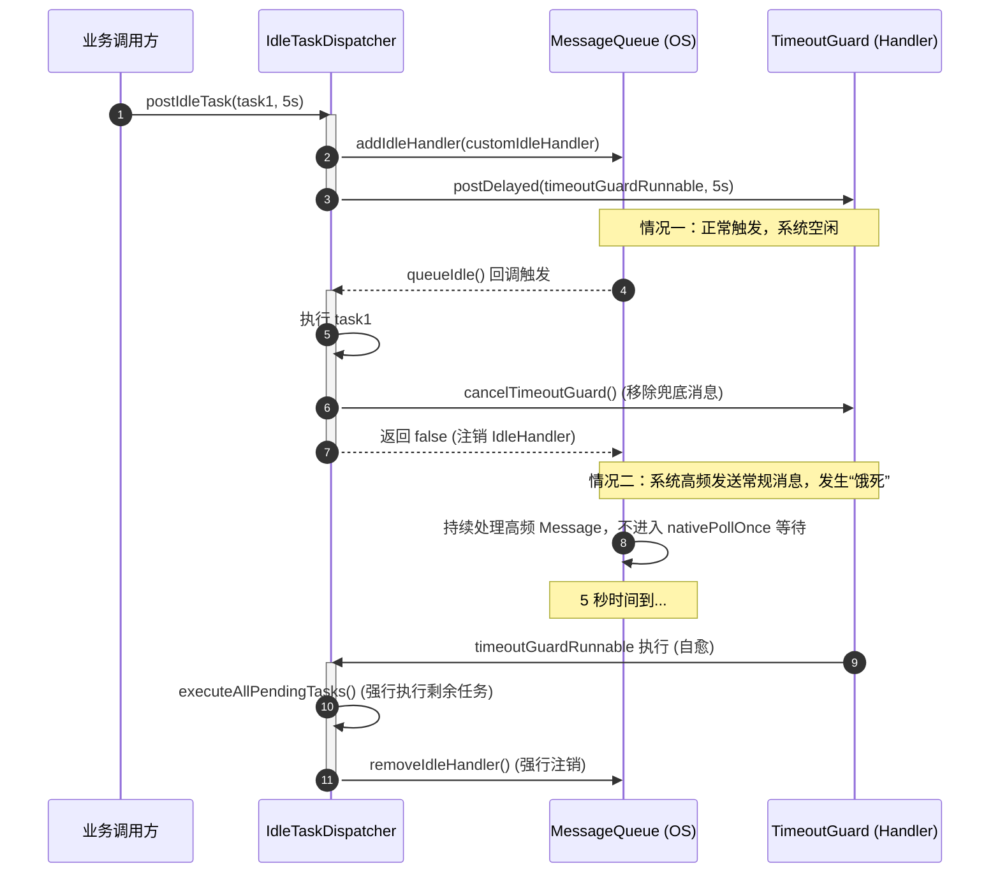
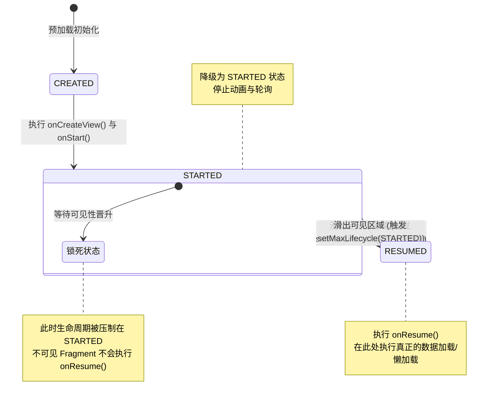

# 5.4.1.4 懒加载

在 Android 应用程序的启动性能优化中，“懒加载（Lazy Initialization / On-Demand Initialization）”代表着最核心的“减法哲学”。无论多核 CPU 技术如何演进，启动期的系统硬件资源（尤其是 CPU 时间片、I/O 带宽、内存带宽）始终是极端匮乏且处于高竞态状态的。即使我们将大量第三方 SDK 的初始化动作移至异步子线程（参见 [5.4.1.3 异步初始化](file:///Users/lizhiyang/Desktop/AndroidKnowledge/docs/5.Android/5.4.%E6%80%A7%E8%83%BD%E4%BC%98%E5%8C%96/5.4.1.%E5%90%AF%E5%8A%A8%E4%BC%98%E5%8C%96/5.4.1.3.%E5%BC%82%E6%AD%A5%E5%88%9D%E5%A7%8B%E5%8C%96.md)），也无法完全逃避多线程对 CPU 物理核心的疯狂争抢。

本篇将从物理硬件、操作系统内核、虚拟机底层字节码、Android 消息循环以及 Fragment 生命周期状态机等维度，深度解密懒加载的设计初衷、底层锁开销、MessageQueue 闲置通道防饿死自愈方案，以及现代 ViewPager2 的生命周期压制机制。

---

## 1. 启动期减法哲学与懒加载必要性

### 1.1 物理核心竞态与线程上下文切换（Context Switch）的本质
在 Android 设备的启动黄金期（从 `Application.attachBaseContext()` 触发，到首屏 Activity 的 `onWindowFocusChanged()` 被回调并完成第一帧物理绘制），主线程的运行顺畅程度直接决定了用户的首开观感。

很多开发者存在一个误区：**“只要把耗时任务挪到子线程，就不会影响主线程启动速度。”** 这种观点忽视了操作系统的物理调度成本。

CPU 物理核心的数量是有限的。目前主流的移动端处理器普遍采用大小核架构（例如 4 大核 + 4 小核，或者 1 超大核 + 3 大核 + 4 小核）。在启动期，系统会涌现大量的初始化任务：
1. **主线程**：需要进行大量的类加载（Class Loading）、反射（Reflection）、Asset 资源读取、首屏 View 树的 XML 解析与充气（Inflate）、Measure/Layout/Draw 遍历。
2. **系统服务线程**：Binder 线程池、GC 垃圾回收线程、Choreographer 渲染线程等。
3. **并发子线程**：由于异步初始化框架（如 Startup、AnchorTask 或自研拓扑图引导器）并发拉起的数十个 SDK 初始化子线程。

当**就绪状态的线程数量**远大于**物理 CPU 核心数**时，Linux 内核的 CFS（Completely Fair Scheduler，完全公平调度器）就会被迫进行高频的**时间片轮转调度**，导致**上下文切换（Context Switch）**次数飙升。

```
                       CPU 物理核心 (内核态调度)
                            │
            ┌───────────────┼───────────────┐
            ▼               ▼               ▼
      [线程 A (主)]    [线程 B (SDK-1)] [线程 C (SDK-2)]
       (保存寄存器)  ──► (恢复寄存器)
       (刷新 TLB  )  ──► (Cache 污染 )
            ▲                               │
            └───────────────────────────────┘
                     高频 Context Switch 损耗
```

一次物理上下文切换的开销在微秒级别，但在高并发的启动期，每秒可能发生数万次上下文切换，其物理损耗主要体现在：
* **寄存器状态的保存与恢复**：CPU 必须将当前执行线程的通用寄存器、程序计数器（PC）、堆栈指针（SP）等状态保存至内核栈中，并恢复新线程 of 寄存器状态。
* **CPU 高速缓存失效（Cache Pollution）**：由于新线程访问的数据和代码段与前一个线程完全不同，CPU 的 L1/L2/L3 Cache 会发生大量的未命中（Cache Miss），被迫从慢速的 LPDDR 物理内存中重新加载数据。
* **TLB（页表缓存）刷新**：如果发生进程间切换（即使是同进程的线程切换，也可能涉及用户态与内核态的频繁跳转），虚拟地址到物理地址的映射表缓存（Translation Lookaside Buffer）将被清空，导致后续内存访问耗时剧增。

### 1.2 异步初始化的物理局限与“并发灾难”
异步初始化虽然避免了主线程同步阻塞，但却加剧了**物理核心竞态**。高并发子线程在瞬间吃满 CPU 所有的物理大核，直接导致主线程无法分到足够的 CPU 时间片（即使主线程的调度优先级被设定为 `-20` 即 `THREAD_PRIORITY_AUDIO` 或 `-19` 即 `THREAD_PRIORITY_DISPLAY`，在大小核物理限制和严重的内存总线争抢下，依然会受到波及）。

此外，异步初始化经常涉及**隐式锁等待**。例如，主线程在执行到某个业务逻辑时，必须等待某个子线程异步初始化完成。此时主线程会被挂起（Block），直至子线程释放锁。这种“伪异步”不仅无法提升启动速度，反而引入了多线程锁竞争带来的额外 CPU 开销。

### 1.3 减法哲学的物理定义：按需（On-Demand）与闲置退避（Backoff）
为了实现最优的启动性能，我们必须将“并发控制”转化为“总量控制”，即遵循“启动期减法哲学”：
* **按需延迟（On-Demand）**：杜绝一刀切式的全量初始化。只有当用户真正触发了某个业务功能、或者页面真正被展示时，才触发对应 SDK 的初始化。如果用户本次启动仅使用了基础功能，那么其余 80% 的 SDK 应该终其一生不被加载。
* **闲置退避（Idle Backoff）**：对于那些“虽然启动期不需要，但后续可能很快被用到”的组件，我们不应该在主线程同步加载，也不应该立即拉起子线程，而是通过监听系统“喘息期”，在主线程彻底空闲或 CPU 负载降低时，再进行分批、退避式初始化。

---

## 2. 策略一：按需延迟初始化与 Kotlin by lazy 锁物理本质

### 2.1 什么是 On-Demand 延迟？
`On-Demand`（按需加载）指的是将对象的构造、配置以及重度资源的分配，推迟到其**首次被业务代码读取引用**的瞬间。在 Android 领域，这通常表现为：
* **SDK 初始化延迟**：在 `Application.onCreate()` 中仅注册一个接口或占位代理，当具体业务逻辑第一次调用 `SDK.getInstance().doAction()` 时，才在内部执行真正的配置读取、线程池创建和 Binder 绑定。
* **成员变量延迟**：对于 Activity/Fragment 中的 UI 控件、耗时业务组件，避免在构造函数或 `onCreate()` 中过早实例化，而是利用 Kotlin 属性委托推迟到使用时。

### 2.2 Kotlin `by lazy` 的编译器行为与字节码展开
Kotlin 中的 `by lazy` 是属性委托（Delegated Properties）的典型应用。当我们编写如下代码时：
```kotlin
val heavyComponent: HeavyComponent by lazy {
    HeavyComponent()
}
```
Kotlin 编译器在编译后，会将其转化为一个辅助的 `Lazy` 类型的委托属性对象。我们可以还原其 Java 伪代码来窥探其编译本质：
```java
public final class MyActivity {
   // 编译器生成的 Lazy 实例，命名规则为 属性名$delegate
   @NotNull
   private final Lazy heavyComponent$delegate;

   public MyActivity() {
      // 默认的 LazyThreadSafetyMode.SYNCHRONIZED 模式
      this.heavyComponent$delegate = LazyKt.lazy((Function0)(new Function0() {
         @Override
         public Object invoke() {
            return new HeavyComponent();
         }
      }));
   }

   @NotNull
   public final HeavyComponent getHeavyComponent() {
      Lazy var1 = this.heavyComponent$delegate;
      // 访问属性时，实际调用的是 Lazy 实例的 getValue() 方法
      return (HeavyComponent)var1.getValue();
   }
}
```
由此可见，每一次读取该属性，都会伴随着一次 `Lazy.getValue()` 的虚方法调用。在 `Lazy` 的底层实现中，根据传入的 `LazyThreadSafetyMode` 的不同，其物理表现和锁损耗有着天壤之别。

---

### 2.3 `LazyThreadSafetyMode.SYNCHRONIZED` 深度剖析（双重检查锁与 ARM 物理屏障）
默认情况下，若不指定模式，Kotlin 会采用 `LazyThreadSafetyMode.SYNCHRONIZED`。其底层实现为 `SynchronizedLazyImpl`，核心源码实现如下：

```kotlin
private class SynchronizedLazyImpl<out T>(initializer: () -> T, lock: Any? = null) : Lazy<T>, Serializable {
    private var initializer: (() -> T)? = initializer
    @Volatile private var _value: Any? = UNINITIALIZED_VALUE // 标记为 volatile 保证可见性与禁止重排
    private val lock = lock ?: this // 默认以当前实例作为锁对象

    override val value: T
        get() {
            val _v1 = _value
            if (_v1 !== UNINITIALIZED_VALUE) {
                @Suppress("UNCHECKED_CAST")
                return _v1 as T
            }

            return synchronized(lock) { // 获取同步锁
                val _v2 = _value
                if (_v2 !== UNINITIALIZED_VALUE) {
                    @Suppress("UNCHECKED_CAST")
                    _v2 as T
                } else {
                    val typedValue = initializer!!() // 执行用户传入的初始化 lambda
                    _value = typedValue
                    initializer = null // 及时释放 lambda 引用，防止内存泄漏
                    typedValue
                }
            }
        }
    ...
}
```

#### DCL（Double-Checked Locking）单例缓存物理本质
该模式是经典的双重检查锁。其物理层面的关键点在于：
1. **`@Volatile` 关键字与 ARM/x86 物理指令屏障**：
   在多核 CPU 架构下，为了提高指令执行效率，编译器和 CPU 会进行**指令重排（Instruction Reordering）**。在没有内存屏障保护的情况下，`_value = typedValue` 的赋值操作与 `HeavyComponent` 内部构造函数的执行顺序可能会被颠倒。即：可能先将分配的物理内存地址赋值给 `_value`，然后再执行构造函数中的初始化代码。如果此时另一个线程读取了 `_value`，由于其已不等于 `UNINITIALIZED_VALUE`，该线程将直接返回一个**尚未构造完毕的半成品对象**，导致致命崩溃。
   
   在 Android 设备主流的 **ARM 架构（ARMv7/ARMv8）** 中，采用的是**弱内存模型（Weak Memory Model）**。ARM 处理器允许非常激进的重排，并且不对普通内存的读写顺序做强保证。`volatile` 变量读写在编译为 ARM 汇编时，会强制插入特殊的内存屏障指令：
   * **写操作后**：会插入 `dmb ish`（Data Memory Barrier, Inner Shareable）或 `dmb ishst` 指令。该屏障会迫使当前 CPU 核心将所有的缓存写入（Store Buffer 中的内容）彻底刷新到 L1/L2 Cache 乃至物理内存中，以使得其他 CPU 核心立即可见。这被称为 **StoreStore 屏障** 与 **StoreLoad 屏障** 的物理实现。
   * **读操作前/后**：会插入 `dmb ish` 或者是 `dmb ishld` 指令（对应 **LoadLoad 屏障** 与 **LoadStore 屏障**）。这会强行冲刷当前核心的输入流水线（Pipeline），使 CPU 必须从 Cache 或主存中重新读取最新状态，禁止使用过期的本地寄存器副本。
   而在 **x86 架构**（强内存模型，如模拟器）中，普通读写天然是有序的，只有写写、读写之间有极少限制。因此 x86 仅在写操作后生成 `lock addl` 等指令来刷新 Store Buffer，其硬件开销比 ARM 相对较小。
   
2. **锁性能损耗**：
   虽然一旦初始化完成后，外层的 `_v1 !== UNINITIALIZED_VALUE` 快速判断可以避开 `synchronized` 同步块，但在属性**未完成初始化前**，多线程并发访问会产生极烈的锁争抢。
   * **监视器锁（Monitor Lock）开销**：`synchronized` 在 JVM 底层依赖操作系统的互斥锁（Mutex Lock）实现。当线程争抢失败时，会被系统挂起并移入锁池，此时发生**用户态到内核态的切换**。
   * **内存屏障开销**：即使属性已经初始化完成，每次读取该属性时，因为 `_value` 是 `volatile` 的，CPU 依然需要执行内存屏障指令，防止后续读写重排，这会对 CPU 的分支预测和乱序执行效率产生轻微的负面影响。

---

### 2.4 `LazyThreadSafetyMode.PUBLICATION` 深度剖析（无锁 CAS 与 ARM 独占监视器）
如果希望多线程能够并发初始化，同时只保留第一个成功初始化的实例，可以使用 `LazyThreadSafetyMode.PUBLICATION`。其底层实现为 `SafePublicationLazyImpl`：

```kotlin
private class SafePublicationLazyImpl<out T>(initializer: () -> T) : Lazy<T>, Serializable {
    @Volatile private var _value: Any? = UNINITIALIZED_VALUE
    private var initializer: (() -> T)? = initializer

    override val value: T
        get() {
            val value = _value
            if (value !== UNINITIALIZED_VALUE) {
                @Suppress("UNCHECKED_CAST")
                return value as T
            }

            val initializerValue = initializer
            if (initializerValue != null) {
                val newValue = initializerValue() // 允许多个线程并发调用构造 lambda
                // 基于 AtomicReferenceFieldUpdater 进行无锁 CAS 赋值
                if (valueUpdater.compareAndSet(this, UNINITIALIZED_VALUE, newValue)) {
                    initializer = null
                    return newValue
                }
            }
            @Suppress("UNCHECKED_CAST")
            return _value as T
        }

    companion object {
        private val valueUpdater = java.util.concurrent.atomic.AtomicReferenceFieldUpdater.newUpdater(
            SafePublicationLazyImpl::class.java,
            Any::class.java,
            "_value"
        )
    }
}
```

#### CAS（Compare-And-Swap）物理损耗与 ARM LL/SC 硬件细节
* **ARM 架构下的 LL/SC（Load-Link / Store-Conditional）物理机制**：
  在 x86 架构下，CAS 对应一条单步的汇编指令 `cmpxchg`，并通过 `lock` 前缀锁住总线（或独占缓存行）。
  而在 **ARM 架构** 中，并没有单条的 `cmpxchg` 指令。ARM 是通过 **LL/SC（Load-Link / Store-Conditional）** 的组合来实现 CAS 的，其对应指令为 **`LDREX`**（Load Register Exclusive）与 **`STREX`**（Store Register Exclusive）：
  1. 当 CPU 执行到 `compareAndSet` 时，首先调用 `LDREX` 从内存地址读取 `_value`，此时当前 CPU 核心的**独占监视器（Exclusive Monitor）** 会将该内存地址标记为“独占”。
  2. 随后执行 `STREX` 尝试将新计算出来的 `newValue` 写入该地址。在执行 `STREX` 时，独占监视器会校验该内存地址自 `LDREX` 执行以来是否被其他核心修改过。
  3. 如果没有被修改，`STREX` 写入成功并返回 `0`；如果有其他核心在此期间也执行了写入，独占标记将被清除，`STREX` 写入失败并返回 `1`。
  4. 如果写入失败，Java 层面的 `Updater` 就会宣告 CAS 失败。
* **重复执行 Lambda 的 CPU 开销（并发重复构造与内存抖动）**：
  这是该模式最大的隐患。如果有 5 个线程并发读取 `heavyComponent`，它们会**同时**进入 `val newValue = initializerValue()` 块，这意味着 `HeavyComponent()` 的构造函数会被**重复执行 5 次**。
  如果这个构造函数内包含重度 CPU 运算、I/O 操作（如读取本地配置文件、数据库查询）、或者分配了大量内存对象，会导致：
  1. **CPU 算力严重浪费**：4 个线程计算出的成品对象会在 CAS 失败后被无情丢弃，算力白白空耗。
  2. **内存抖动与频繁 GC**：瞬间产生的大量废弃对象会塞满 JVM 堆的 Eden 区，极易在启动期触发 GC（尤其是 Stop-The-World 的年轻代回收），拖慢主线程。
  3. **独占监视器重置开销**：多核高并发访问相同变量，会导致 Exclusive Monitor 频繁重置，硬件层面的重试带来不必要的时钟周期损耗。

---

### 2.5 `LazyThreadSafetyMode.NONE` 深度剖析（完全无锁）
在单线程（通常是 Android 的 UI 主线程）环境下，或者我们能够百分之百确定属性访问时机不会发生并发时，应该显式指定为 `LazyThreadSafetyMode.NONE`。其底层实现为 `UnsafeLazyImpl`：

```kotlin
internal class UnsafeLazyImpl<out T>(initializer: () -> T) : Lazy<T>, Serializable {
    private var initializer: (() -> T)? = initializer
    private var _value: Any? = UNINITIALIZED_VALUE

    override val value: T
        get() {
            if (_value === UNINITIALIZED_VALUE) {
                _value = initializer!!()
                initializer = null
            }
            @Suppress("UNCHECKED_CAST")
            return _value as T
        }
    ...
}
```

#### 物理优势与主线程懒加载首选
* **无任何锁屏障开销**：`_value` 没有被 `@Volatile` 修饰，没有 `synchronized` 同步块，没有 CAS `cmpxchg` 指令。它在机器码层面就是普通的寄存器读取、分支跳转和内存赋值。
* **CPU 缓存亲和度最高**：由于去除了内存屏障，编译器可以对这部分代码进行深度的乱序执行优化和循环展开，CPU 能够最大化利用自身的 L1 Cache。
* **Android 场景应用**：
  在 Activity 或 Fragment 中，凡是**仅在主线程生命周期回调中被访问**的属性（如：自定义 View 引用、Presenter、ViewModel 内部 UI 状态等），都应该无脑选择 `NONE` 模式。
  ```kotlin
  // 正确示例：仅在主线程使用的属性，使用 NONE 规避锁损耗
  val mainAdapter by lazy(LazyThreadSafetyMode.NONE) {
      MainListAdapter()
  }
  ```

---

### 2.6 三种 Lazy 模式物理对比与选型决策树

为了让开发者能够精准选型，下面对三种模式进行直观的物理对比：

| 模式 | 线程安全保证 | 底层锁机制 | 并发读取开销 | 并发写入开销 | 适用场景 |
| :--- | :--- | :--- | :--- | :--- | :--- |
| **SYNCHRONIZED** | 是 | `synchronized` + `volatile` 双重检查锁 | 极低（仅 volatile 屏障） | 高（需要争抢物理 Monitor 锁） | 跨多线程共享、且构造过程耗时的单例对象。 |
| **PUBLICATION** | 是 | `AtomicReferenceFieldUpdater` 无锁 CAS | 极低（仅 volatile 屏障） | 中（多线程并发构造，只保留首个） | 跨多线程共享、构造极其轻量、但不允许线程阻塞的场景。 |
| **NONE** | 否 | 无任何锁机制（不使用 volatile 与锁） | 无（普通变量访问） | 无（普通变量赋值） | **Android 主线程专用属性**（UI 控件、Adapter 等）。 |

下面是选择模式的决策流图：

```
                        开始属性懒加载选型
                                │
                                ▼
                     是否只在 Android 主线程访问？
                                ├──► 是 ──► [ LazyThreadSafetyMode.NONE ]
                                └──► 否
                                     │
                                     ▼
                            构造过程是否非常耗时？
                            (如包含 I/O、大量循环)
                                ├──► 是 ──► [ LazyThreadSafetyMode.SYNCHRONIZED ]
                                └──► 否 ──► [ LazyThreadSafetyMode.PUBLICATION ]
```

---

### 2.7 依赖注入框架（Dagger/Hilt）中的懒加载物理机制
在使用现代化依赖注入框架（如 Dagger2 / Hilt）时，默认的注入机制是“急切的”（Eager）。在注入一个类时，容器会立刻实例化其所有依赖项。
对于启动期，这可能会拉起整个庞大的依赖图（Dependency Graph），引起连锁实例化灾难。

为了规避此开销，Dagger 提供了 `dagger.Lazy<T>` 接口：
```kotlin
@Inject
lateinit var heavyManager: dagger.Lazy<HeavyManager>
```
在底层，Dagger 编译生成的注入代码会使用 `dagger.internal.DoubleCheck` 来包装该实例。
我们来看一下其底层 JVM 代码的物理实现：

```java
// dagger.internal.DoubleCheck
public final class DoubleCheck<T> implements Provider<T>, Lazy<T> {
    private static final Object UNINITIALIZED = new Object();
    private volatile Provider<T> provider;
    private volatile Object instance = UNINITIALIZED;

    public T get() {
        Object result = instance;
        if (result == UNINITIALIZED) {
            synchronized (this) {
                result = instance;
                if (result == UNINITIALIZED) {
                    result = provider.get(); // 真正实例化
                    instance = reentrantCheck(instance, result);
                    provider = null; // 释放 delegate 引用
                }
            }
        }
        return (T) result;
    }
}
```
其本质上与 Kotlin 的 `LazyThreadSafetyMode.SYNCHRONIZED` 极其相似，都是双重检查锁（DCL）的物理变种。
* **物理建议**：在 Hilt 注入大组件或仅在某些子功能触发才需要用到的类时，**强制使用 `dagger.Lazy`**。这可以让 Hilt 容器仅注入一个轻量的代理类，省去启动期大量辅助对象的内存分配和构造开销。

---

## 3. MessageQueue 空闲通道 IdleHandler 物理机理解密

### 3.1 `MessageQueue` 与 `Looper` 运行循环的核心源码物理时序
Android 的主线程本质上是由一个无限循环驱动的：`Looper.loop()` 驱动 `MessageQueue.next()` 不断提取消息并分发给对应的 `Handler` 处理。

要透彻理解 `IdleHandler` 的工作原理，必须直接进入 `MessageQueue.next()` 的源码临界区：

```java
// android.os.MessageQueue
Message next() {
    final long ptr = mPtr;
    if (ptr == 0) {
        return null;
    }

    int pendingIdleHandlerCount = -1; // 标记待执行的 IdleHandler 数量
    int nextPollTimeoutMillis = 0;
    for (;;) {
        // 核心步骤 1：利用 Linux epoll 机制挂起主线程，释放 CPU 占用
        nativePollOnce(ptr, nextPollTimeoutMillis);

        synchronized (this) {
            final long now = SystemClock.uptimeMillis();
            Message prevMsg = null;
            Message msg = mMessages;
            
            // 核心步骤 2：判断消息队列中的头部消息
            if (msg != null && msg.target == null) {
                // 遇到同步屏障（Sync Barrier），只寻找异步消息（Asynchronous Message）
                do {
                    prevMsg = msg;
                    msg = msg.next;
                } while (msg != null && !msg.isAsynchronous());
            }
            
            if (msg != null) {
                if (now < msg.when) {
                    // 当前消息执行时间未到，设定下一次唤醒的时间差值
                    nextPollTimeoutMillis = (int) Math.min(msg.when - now, Integer.MAX_VALUE);
                } else {
                    // 获取到可立即执行的消息，返回给 Looper.loop() 分发
                    mBlocked = false;
                    if (prevMsg != null) {
                        prevMsg.next = msg.next;
                    } else {
                        mMessages = msg.next;
                    }
                    msg.next = null;
                    msg.markInUse();
                    return msg;
                }
            } else {
                // 队列中没有任何消息，进入无限等待状态，直到有新消息加入并主动唤醒
                nextPollTimeoutMillis = -1;
            }

            // 核心步骤 3：判断是否满足触发 IdleHandler 的契约条件
            // 条件一：当前没有任何待执行消息（msg == null，或 msg 执行时间未到）
            // 条件二：pendingIdleHandlerCount 尚未初始化
            if (pendingIdleHandlerCount < 0
                    && (mMessages == null || now < mMessages.when)) {
                pendingIdleHandlerCount = mIdleHandlers.size();
            }
            
            if (pendingIdleHandlerCount <= 0) {
                // 如果没有注册任何 IdleHandler，则直接进入下一次循环去 native 挂起
                mBlocked = true;
                continue;
            }

            if (mPendingIdleHandlers == null) {
                mPendingIdleHandlers = new IdleHandler[Math.max(pendingIdleHandlerCount, 4)];
            }
            // 将注册的 IdleHandler 拷贝至临时数组中，避免在回调中因修改队列产生并发修改异常
            mPendingIdleHandlers = mIdleHandlers.toArray(mPendingIdleHandlers);
        }

        // 核心步骤 4：主线程在此处“喘息”，依次同步回调 IdleHandler 的 queueIdle()
        for (int i = 0; i < pendingIdleHandlerCount; i++) {
            final IdleHandler idler = mPendingIdleHandlers[i];
            mPendingIdleHandlers[i] = null; // 释放内存引用

            boolean keep = false;
            try {
                // 回调并获取返回值
                keep = idler.queueIdle();
            } catch (Throwable t) {
                Log.wtf(TAG, "IdleHandler threw exception", t);
            }

            if (!keep) {
                synchronized (this) {
                    // 若返回 false，直接从注册列表中移除，该 IdleHandler 仅执行一次
                    mIdleHandlers.remove(idler);
                }
            }
        }

        // 重置计数器，确保不会在同一轮 next() 循环中重复回调 IdleHandler
        pendingIdleHandlerCount = 0;
        // 因为执行了 IdleHandler 耗时，可能有新的 Message 已经到达，设置超时时间为 0，立即检查
        nextPollTimeoutMillis = 0;
    }
}
```

---

### 3.2 Linux `epoll_wait` 物理休眠与内核唤醒机制
当主线程在 `MessageQueue.next()` 中判定无消息可处理时，它并不会进行死循环以空耗 CPU（这会导致 CPU 单核占用率暴涨至 100%，引发严重发热）。

相反，主线程通过调用 `nativePollOnce` 进入**内核态挂起**，其底层依赖于 Linux 内核的 **epoll** 物理架构：

1. **红黑树与就绪队列（内核态）**：
   在 Native 层（`android_os_MessageQueue.cpp`）初始化时，主线程会通过系统调用 `epoll_create1` 建立一个内核级别的 epoll 句柄，并将代表主线程消息唤醒的文件描述符（`eventfd`，底层通过 `eventfd(0, EFD_NONBLOCK | EFD_CLOEXEC)` 创建）通过 `epoll_ctl` 注册进 epoll 内部的**红黑树（RB-Tree）**中。
2. **内核态挂起 `TASK_INTERRUPTIBLE`**：
   当 `nativePollOnce(ptr, nextPollTimeoutMillis)` 被触发时，底层执行 `epoll_wait` 系统调用。此时，内核调度器会将主线程的 `task_struct` 状态变更为 `TASK_INTERRUPTIBLE`，将其从 CPU 的活跃运行队列（`runqueue`）中调离，挂载到对应文件描述符的**等待队列链表（wait_queue）**中。此时主线程在硬件层面的 CPU 占用彻底归零。
3. **eventfd 内核唤醒**：
   当其他线程（如 Binder 线程或子线程）通过 `Handler.sendMessage()` 往主线程发送消息时，会调用 `enqueueMessage()`，并在 Native 层向 `eventfd` 写入一个 `8` 字节的 `1`。这会触发 Linux 内核的中断回调，内核检测到 `eventfd` 的读缓冲区变为可读，立即遍历等待队列，将主线程的 `task_struct` 状态重置为 `TASK_RUNNING`，重新送入主线程所属 CPU 核心的就绪队列中，等待 CFS 调度器分配时钟周期。

`IdleHandler` 就是在主线程**判断出没有可执行消息、即将执行系统调用进入内核态深度睡眠前的一刹那（即“黄昏期”）**被回调的。

---

### 3.3 核心安全防御：主线程“饿死（Starvation）”的物理成因
在理想情况下，`IdleHandler` 是极致优化的完美通道。但在真实的 Android 启动环境中，主线程的“饿死（Starvation）”是一个极其普遍的隐患：

```
时间轴 ──►
主线程 MessageQueue 队列状态：
[Msg A (属性动画)] ──► [Msg B (页面滑动)] ──► [Msg C (轮询请求)] ──► [Msg D (Choreographer VSYNC)]
 ─────────────────────────────────────────────────────────────────────────────►
 此时消息队列永远不为空，MessageQueue.next() 不断取出消息返回给 Looper.loop()。
 导致代码永远无法走到 "pendingIdleHandlerCount" 触发区。
 注册的 IdleHandler 任务被彻底饿死！
```

* **饿死成因**：
  如果应用在启动后，主线程持续处于高负载状态，例如：
  1. **动画未停止**：有一个 Lottie 动画或 `ValueAnimator` 正在以 60FPS/120FPS 高频运行，每隔 8ms/16ms 就会向 `MessageQueue` 邮寄一个 VSYNC 驱动消息。
  2. **高频轮询**：某些后台 SDK 启动后，通过 Handler 以极短的间隔（如 100ms）不断发送 Message 进行状态同步。
  3. **列表滑动**：用户在首屏加载完后立即开始页面滑动，系统高频发送 InputEvent 消息。

  此时，消息队列的头部永远有需要立即执行的消息，`MessageQueue.next()` 的 `msg` 永远不为空且 `now >= msg.when`。主线程将马不停蹄地处理这些常规 Message，**根本无法进入 nativePollOnce 挂起前的空闲判断区**。
  结果是：注册在 `IdleHandler` 中的核心初始化任务（例如：主界面次级 Tab 加载、上报埋点 SDK、缓存预热等）被**永久搁置**，甚至由于部分核心业务依赖这些初始化，导致后续业务流程直接卡死或报空指针异常。

---

### 3.4 超时自愈方案的设计与架构实现
为了攻克“饿死”这一物理缺陷，我们必须建立一个**“空闲优先，超时兜底”**的安全保护屏障。其设计思想如下：

1. **多任务队列化（Task Queueing）**：
   将所有的懒加载初始化任务封装为 `Runnable`，提交到一个专用的 `IdleTaskDispatcher` 中，统一管理。
2. **IdleHandler 主动触发**：
   向主线程 `MessageQueue` 注册一个 `IdleHandler`。在系统空闲时，分批取出任务并执行。
3. **延迟兜底消息（Handler Delay Guard）**：
   在提交任务的同时，启动一个兜底的定时器（利用一个独立的 `Handler` 发送一个 `GUARD_MESSAGE`，延迟时间一般设为 5000ms）。
4. **双向自愈与幂等执行**：
   * **情况 A（正常空闲）**：系统在 5000ms 内触发了 `IdleHandler`，任务全部执行完毕。此时，我们主动移除这个 `GUARD_MESSAGE` 延迟消息，避免二次执行。
   * **情况 B（发生饿死）**：系统极其繁忙，5000ms 到了 `IdleHandler` 依然没有被触发。此时 `GUARD_MESSAGE` 到达，它的 Runnable 被唤醒执行。在该兜底 Runnable 内部，它会**强行在主线程中一次性（或分批）同步执行所有未完成的懒加载任务**，并将已饿死的 `IdleHandler` 从 `MessageQueue` 中注销。

---

### 3.5 核心源码实现：带“超时兜底防饿死自愈”的 IdleHandler 任务队列
以下是完整的 Kotlin 实现方案，可在生产环境中直接作为底座框架使用：

```kotlin
package com.android.knowledge.performance.lazyload

import android.os.Handler
import android.os.Looper
import android.os.MessageQueue
import android.util.Log
import java.util.ArrayDeque
import java.util.Queue

/**
 * 带有超时自愈防御机制的空闲任务分发器
 * 核心原则：空闲优先执行（利用 IdleHandler），超时强制兜底（防饿死）
 */
object IdleTaskDispatcher {
    private const val TAG = "IdleTaskDispatcher"
    
    // 超时自愈阈值，默认 5000ms。如果在启动 5 秒内主线程一直没有闲置，则强行执行
    private const val DEFAULT_TIMEOUT_MS = 5000L
    
    // 待执行的任务队列
    private val taskQueue: Queue<Runnable> = ArrayDeque()
    
    // 标记当前是否已经向 MessageQueue 注册了 IdleHandler
    private var isIdleHandlerRegistered = false
    
    // 标记所有任务是否已经全部执行完毕（防止重复执行）
    @Volatile
    private var isAllTasksExecuted = false

    // 专用于发送兜底延迟消息的主线程 Handler
    private val mainHandler = Handler(Looper.getMainLooper())

    // 兜底任务：在超时时间到达时，强行把未执行的任务拉回主线程同步执行
    private val timeoutGuardRunnable = Runnable {
        synchronized(this) {
            if (isAllTasksExecuted) return@Runnable
            Log.w(TAG, "Timeout threshold reached, forcing execution of pending tasks to prevent starvation.")
            executeAllPendingTasks()
            unregisterIdleHandlerDirectly()
        }
    }

    // 核心 IdleHandler 契约实现
    private val customIdleHandler = MessageQueue.IdleHandler {
        synchronized(this@IdleTaskDispatcher) {
            if (taskQueue.isEmpty()) {
                Log.d(TAG, "All tasks completed via IdleHandler. No more idle callback needed.")
                isAllTasksExecuted = true
                cancelTimeoutGuard()
                isIdleHandlerRegistered = false
                return@IdleHandler false // 返回 false：自动从 MessageQueue 中注销自己
            }
            
            // 每次空闲回调只取出一个任务执行，防止单次空闲时间过长阻塞主线程
            val task = taskQueue.poll()
            if (task != null) {
                val startTime = System.currentTimeMillis()
                try {
                    task.run()
                } catch (e: Exception) {
                    Log.e(TAG, "Error executing idle task", e)
                }
                val costTime = System.currentTimeMillis() - startTime
                Log.d(TAG, "Executed 1 idle task, cost: ${costTime}ms. Remaining: ${taskQueue.size}")
                
                // 物理防御：如果单次任务执行过长（例如超过 16ms），我们认为主线程已经不再闲置
                // 为了防止主线程继续卡顿，我们本次回调结束，把剩余任务留到下一次空闲期
                if (costTime > 16) {
                    Log.w(TAG, "Task cost too long (${costTime}ms), yielding main thread for next frame.")
                }
            }
            
            // 若队列中还有任务，返回 true 保持注册状态，期待下一次空闲回调
            val hasMoreTasks = !taskQueue.isEmpty()
            if (!hasMoreTasks) {
                isAllTasksExecuted = true
                cancelTimeoutGuard()
                isIdleHandlerRegistered = false
            }
            return@IdleHandler hasMoreTasks
        }
    }

    /**
     * 向分发器提交一个懒加载任务
     * @param timeoutMs 自定义超时兜底时间，单位毫秒
     * @param task 具体的初始化任务 Runnable
     */
    fun postIdleTask(timeoutMs: Long = DEFAULT_TIMEOUT_MS, task: Runnable) {
        if (Looper.myLooper() != Looper.getMainLooper()) {
            throw IllegalStateException("IdleTaskDispatcher can only be used on Android Main Thread.")
        }

        synchronized(this) {
            if (isAllTasksExecuted) {
                // 如果启动流程已经走完且自愈已触发，新提交的任务直接降级为普通 Handler 消息执行
                Log.i(TAG, "Dispatcher already finished, executing task immediately.")
                mainHandler.post(task)
                return
            }

            taskQueue.add(task)
            
            // 开启超时兜底防饿死机制
            if (!isIdleHandlerRegistered) {
                Log.i(TAG, "Registering IdleHandler and scheduling timeout guard for ${timeoutMs}ms.")
                
                // 1. 注册 IdleHandler
                Looper.myQueue().addIdleHandler(customIdleHandler)
                isIdleHandlerRegistered = true
                
                // 2. 邮寄延迟安全气囊消息
                mainHandler.postDelayed(timeoutGuardRunnable, timeoutMs)
            }
        }
    }

    /**
     * 强行一次性同步执行所有队列中的任务（自愈核心）
     */
    private fun executeAllPendingTasks() {
        while (!taskQueue.isEmpty()) {
            val task = taskQueue.poll()
            if (task != null) {
                val start = System.currentTimeMillis()
                try {
                    task.run()
                } catch (e: Exception) {
                    Log.e(TAG, "Error executing force-task", e)
                }
                Log.d(TAG, "Force executed task cost: ${System.currentTimeMillis() - start}ms")
            }
        }
        isAllTasksExecuted = true
    }

    /**
     * 取消兜底定时器
     */
    private fun cancelTimeoutGuard() {
        mainHandler.removeCallbacks(timeoutGuardRunnable)
    }

    /**
     * 强行注销 IdleHandler
     */
    private fun unregisterIdleHandlerDirectly() {
        try {
            Looper.myQueue().removeIdleHandler(customIdleHandler)
        } catch (e: Exception) {
            Log.e(TAG, "Failed to remove IdleHandler manually", e)
        }
        isIdleHandlerRegistered = false
    }
}
```

#### 超时兜底自愈时序图
为了更清晰地表达其在 `MessageQueue.next()` 中与超时兜底消息的并发竞争及自愈过程，这里绘制了其物理时序流程：



---

### 3.6 物理误区一：`queueIdle` 中执行耗时 I/O 带来的“空闲卡顿”与 ANR 物理机制
许多开发者在使用 `IdleHandler` 时存在严重的认知偏差，认为“既然是空闲期，我就可以在 `queueIdle()` 内部肆无忌惮地执行重度初始化，比如解析大 JSON、同步读取 SharedPreferences、甚至是数据库 I/O”。

**这种做法极其危险，会直接引发 ANR（Application Not Responding）。**

* **主线程独占机制不变**：
  `queueIdle()` 是在**主线程**被回调的。当 `Looper` 发现空闲时，它会跳出 Native 挂起状态，在 Java 层串行调用所有注册的 `queueIdle`。这意味着，**在 `queueIdle` 执行期间，主线程是被该任务强行占用的**。
* **物理卡死过程**：
  假设我们在 `queueIdle` 中执行了一个耗时 `300ms` 的 I/O 操作。在这 `300ms` 内，用户突然用手指触摸了屏幕。
  1. 系统底层的 InputReader 进程捕获到触摸事件，通过 Socket 跨进程写入到应用进程的 `WindowInputEventReceiver`。
  2. 该 Receiver 向主线程 `MessageQueue` 邮寄了一个输入消息 `Message(what=INPUT_EVENT)` 并尝试唤醒主线程。
  3. 然而，此时主线程正在同步执行我们的 `queueIdle` 中的 I/O，**无法跳出当前代码块去调用 `MessageQueue.next()` 提取这个 INPUT_EVENT**。
  4. 用户在界面上看到的就是：无论怎么戳屏幕，界面都毫无响应。
  5. 如果输入事件在给定时间阈值内（Android 经典 ANR 阈值，高版本可能更短，参见 [AndroidVersionChangeLog.md](../../../../AndroidVersionChangeLog.md)）未能被主线程 Handler 分发处理，系统就会弹出 ANR 对话框。
* **物理准则**：
  * **禁止在 `queueIdle` 中执行任何阻塞主线程的操作（如同步 I/O、死循环、重度计算）**。
  * `IdleHandler` 仅适用于：
    1. **分发任务**：例如在 `queueIdle` 中启动一个低优先级的后台子线程，将耗时任务进一步转移。
    2. **轻量级初始化**：例如仅仅创建一个不需要读取磁盘的 Java 内存对象，或者改变某个状态标记。
    3. **UI 次级渲染**：例如让主线程去 inflate 那些首屏以下、用户滑动后才可见 of View 骨架屏。

---

### 3.7 物理误区二：SharedPreferences 懒加载与系统生命周期阻塞死锁
另一个极具微细性的暗雷是：在 `IdleHandler` 里异步执行 SharedPreferences (以下简称 SP) 的初始化和读取。

SP 的 `apply()` 写入虽然是异步的，但其底层的物理同步设计包含如下隐患：
1. 当调用 `SP.Editor.apply()` 时，SP 框架会把磁盘写入任务打包成一个 `Runnable`，送入全局的线程池中并发执行，但**同时**会把这个任务添加进 `QueuedWork` 队列中。
2. Android 的 `ActivityThread` 在调度 Activity 生命周期流转时，例如在 Activity `onStop`、`onPause` 或者 Service `onStop` / `onDestroy` 之前，主线程会强制同步调用 `QueuedWork.waitToFinish()`。
3. `waitToFinish()` 内部是一个死循环等待，它会**强行阻塞主线程**，直到 `QueuedWork` 队列中所有的异步磁盘写入任务全部执行完毕。
4. **死锁链条推导**：
   * 开发者为了优化启动，在 `IdleHandler` 中触发了 SP 懒加载，并调用了 `apply()` 修改了某些启动状态。
   * 由于系统此时相对闲置，用户突然按了 Home 键退回桌面，或者跳转到新页面，触发当前 Activity 的 `onStop`。
   * 主线程立刻执行 `ActivityThread.handleStopActivity` -> `QueuedWork.waitToFinish()`。
   * 此时 SP 的磁盘写入线程正在由于 CPU 竞态或者磁盘繁忙，未能及时完成写文件操作。
   * 主线程在 `waitToFinish()` 中被迫发生同步挂起，如果该 I/O 锁持续耗时超过 5 秒，**ANR 直接爆发**。

---

### 3.8 进阶演进：基于时间切片（Time Slicing）的 React Fiber 式空闲调度算法
如果在 `IdleHandler` 的队列里塞入了数十个小任务，即使单个任务很轻量（例如 2ms），但当它们累加起来时，依然有可能占满一次 VSYNC 信号周期（16.6ms / 8.3ms）。

为了进一步细化并发控制，可以引入**时间切片（Time Slicing）**算法：
* **核心物理机制**：
  在 `IdleHandler` 回调中，我们记录开始时间，并且每执行完一个微任务，就检测当前的耗时。如果检测到耗时超过了给定的警戒线（例如 `8ms`，预留一半时间给系统其他绘制任务），即便队列中依然有任务，我们也强行中断本次执行，并且返回 `true`。这能够最大程度腾出主线程时间，将剩余的任务让渡到下一个 Looper 喘息期执行。
```kotlin
// IdleHandler 时间切片核心判定逻辑
var elapsed = 0L
val startTime = System.nanoTime()
while (hasMoreTasks) {
    executeNextTask()
    elapsed = System.nanoTime() - startTime
    if (elapsed > 8 * 1000 * 1000L) { // 超过 8ms，强行让渡主线程
        Log.w(TAG, "Time slice exhausted. Yielding to main thread.")
        break
    }
}
```
通过这种微秒级的动态自适应退避，能够完全消除多任务累加带来的卡顿隐患。

---

## 4. 策略三：生命周期驱动型延迟（onWindowFocusChanged 与 View.post）

### 4.1 `View.post(Runnable)` 的物理本质与底层源码时序
很多开发者常用 `View.post { ... }` 来获取 View 的物理宽高。但你是否探究过，为什么在 `View.post` 的回调里，View 的 `width` 和 `height` 就一定有值了？它为什么能起到延迟初始化的作用？

在底层，`View.post(Runnable)` 的行为受到 View 自身 **Attach 状态**（即是否已经与 Window 窗口绑定）的绝对制约：

```java
// android.view.View
public boolean post(Runnable action) {
    final AttachInfo attachInfo = mAttachInfo;
    if (attachInfo != null) {
        // 场景一：View 已经 Attach 到 Window 上了，直接通过主线程 Handler 发送消息
        return attachInfo.mHandler.post(action);
    }

    // 场景二：View 尚未 Attach（例如在 Activity.onCreate / onStart 中调用）
    // 此时将任务存入临时的 RunQueue 中
    getRunQueue().post(action);
    return true;
}
```

---

### 4.2 `HandlerActionQueue` 暂存机制与首帧绘制的物理临界点
在 Activity 启动过程中，`onCreate` 时期 View 树刚刚被 `LayoutInflater` 创建出来，此时 `mAttachInfo` 必然为 `null`。因此，`View.post` 提交的任务会被拦截并送入 `HandlerActionQueue` 中缓存。

这个临时队列的任务，是在何时被释放并执行的？其物理调用链路如下：

```
Activity.onCreate() / onStart() / onResume()
       │  (此时调用 View.post()，任务进入 HandlerActionQueue)
       ▼
WindowManagerService 建立物理窗口，触发 ViewRootImpl.setView()
       │
       ▼
ViewRootImpl.performTraversals() 启动首帧绘制遍历
       │
       ├─► 步骤 1：触发 host.dispatchAttachedToWindow(mAttachInfo, ...)
       │          │
       │          ▼  (View 树深度遍历)
       │          View.dispatchAttachedToWindow()
       │                 │
       │                 ▼
       │                 mAttachInfo = info (完成绑定赋值)
       │                 mRunQueue.executeActions(info.mHandler) 
       │                 (将暂存的任务全部 post 进主线程 Handler 消息队列中)
       │
       ├─► 步骤 2：执行 performMeasure() -> 测量宽高
       ├─► 步骤 3：执行 performLayout()  -> 摆放位置
       └─► 步骤 4：执行 performDraw()    -> 绘制像素
       │
       ▼
下一轮 Looper 循环
       │
       ▼
执行刚才被 executeActions() 投递过来的 View.post 任务
(此时 Measure/Layout 已完毕，可安全获取真实宽高)
```

1. **`dispatchAttachedToWindow` 的时机**：
   在 `ViewRootImpl.performTraversals()` 开始时，系统首先发起整个 View 树的 `dispatchAttachedToWindow` 遍历。在此方法内部，View 会将内部的 `HandlerActionQueue`（即 `mRunQueue`）中的所有 `Runnable` 转移并真正的 `post` 到主线程的 `Handler` 中（即 `info.mHandler`）。
2. **绘制序列的同步锁**：
   在 `performTraversals` 内部，接着会同步执行 `performMeasure`、`performLayout`、`performDraw`。由于这是一个完整的系统回调，它被封装在一个同步块（或者是同步屏障保护的消息）中。
3. **下一次 VSYNC 与消息调度**：
   我们在第 1 步中被 `post` 到 Handler 消息队列中的那些懒加载任务，其物理顺序**排在当前绘制消息的后面**。因此，只有当整个 `performTraversals`（首帧 Measure、Layout、Draw）执行完毕、主线程交出控制权并进入下一轮 Looper 循环时，Handler 才会提取并执行这些 `View.post` 任务。
   * **安全性保证**：此时，View 已经完成了至少一次完整的 Measure 和 Layout，因此我们在 `Runnable` 内部获取 `view.width`，必然能够拿到物理测量的真实像素值。
   * **延迟性效果**：利用此原理，我们可以将一些与 View 强相关的、不影响首帧渲染的非核心配置（如：监听器绑定、焦点抢占、次级轮播图初始化），放在 `View.post` 中。只要 View 还没有进行 Attached（比如隐藏的 View），这些任务就不会被推入 Handler，从而节省了无谓的启动开销。

---

### 4.3 `onWindowFocusChanged` 物理分水岭：首帧可见性与焦点获取的真正时机
对于 Activity 而言，`onResume()` 绝不代表用户已经看到了界面。`onResume` 仅仅是 Activity 状态机中的一个逻辑环节，表明 Activity 已经准备好与用户交互，但此时窗口尚未完成首帧渲染，在物理屏幕上依然是一片空白（或者保留在前一个 Activity 的残影中）。

**`onWindowFocusChanged(hasFocus: Boolean)` 才是真正的分水岭：**
* **物理本质**：当该方法回调且 `hasFocus == true` 时，意味着 `WindowManagerService`（WMS）已经完成了窗口的布局计算，主线程通过 `ViewRootImpl` 已经把第一帧像素渲染写入了物理屏幕，且窗口拿到了系统的输入事件焦点。
* **最佳延迟加载落地点**：
  如果某些 SDK 的初始化必须要在主线程同步运行，或者有一些极其吃 CPU 资源的动画组件要开启，**强力推荐将其推迟到 `onWindowFocusChanged` 中触发**。这可以确保启动期的核心 CPU 周期百分之百地向首帧渲染倾斜。
  ```kotlin
  override fun onWindowFocusChanged(hasFocus: Boolean) {
      super.onWindowFocusChanged(hasFocus)
      if (hasFocus) {
          // 此时首帧已展示，用户已可交互，开始加载非核心业务
          startHeavyAnimations()
          initOptionalSdks()
      }
  }
  ```

---

## 5. 策略四：Fragment 懒加载演进与 ViewPager2 底层重构

### 5.1 传统的 Fragment 预加载灾难与 CPU/网络抢占
在复杂的 Android 首页架构中，`ViewPager + Fragment` 几乎是标配。然而，传统的 `ViewPager` 存在一个严重的性能杀手：**默认预加载（Offscreen Page Limit）**。

`ViewPager` 的 `offscreenPageLimit` 默认最小值为 `1`。也就是说，当用户进入 App 首页看到 Tab 0 时，ViewPager 会在后台**强制并行加载** Tab 1 的 Fragment。
* **物理损耗**：Tab 1 的 Fragment 会紧跟着执行 `onAttach`、`onCreate`、`onCreateView`、`onResume`。这导致主线程要在极短时间内解析两套 View 树 XML 布局，并拉起两套网络请求。
* **并发抢占**：在启动期多核 CPU 极其紧张的情况下，Tab 1 带来的并发渲染和网络 I/O，会严重分流 Tab 0（用户真正看到的页面）的带宽与 CPU 时间片，导致首屏渲染耗时翻倍，网络图片加载迟钝。

---

### 5.2 历史的包袱：`setUserVisibleHint` 脏标记方案的设计缺陷与生命周期状态机脱节
为了应对预加载，老一代 Android 开发者普遍使用 `setUserVisibleHint(isVisibleToUser: Boolean)` 来进行手动“懒加载”判断：

```kotlin
// 传统 ViewPager 中的 Fragment 懒加载实现（已被废弃，不推荐使用）
abstract class LegacyLazyFragment : Fragment() {
    private var isViewCreated = false
    private var isFirstLoad = true

    override fun onCreateView(inflater: LayoutInflater, container: ViewGroup?, savedInstanceState: Bundle?): View? {
        val root = inflater.inflate(layoutId, container, false)
        isViewCreated = true
        checkAndLoad()
        return root
    }

    override fun setUserVisibleHint(isVisibleToUser: Boolean) {
        super.setUserVisibleHint(isVisibleToUser)
        checkAndLoad()
    }

    private fun checkAndLoad() {
        // 由于 setUserVisibleHint 触发时机混乱，必须加入繁琐的脏标记
        if (userVisibleHint && isViewCreated && isFirstLoad) {
            lazyLoad()
            isFirstLoad = false
        }
    }

    abstract fun lazyLoad()
}
```

#### 该方案的致命痛点
1. **时序严重混乱**：
   `setUserVisibleHint` 的回调时序跟普通的 Fragment 生命周期大相径庭。在 ViewPager 初始化时，`setUserVisibleHint(false)` 甚至会在 `onAttach()` 之前被调用。这导致 `lazyLoad()` 触发时，`view` 可能根本没有被创建，如果不加 `isViewCreated` 脏标记判断，直接就会抛出 `NullPointerException`。
2. **生命周期状态机（Lifecycle.State）彻底脱节**：
   当一个 Fragment 处于“不可见预加载”状态时，它的 `Lifecycle.State` 依然会一路晋升到 `RESUMED`。这就产生了一个物理悖论：**系统认为该 Fragment 处于活跃态，可以响应 LiveData 观测；但实际上该 Fragment 在物理屏幕上是完全不可见的**。
   这会导致很多隐蔽的 Bug，例如：不可见的 Fragment 会收到 LiveData 的推送，从而在后台进行无谓的 UI 更新，空耗 CPU 算力。

---

### 5.3 现代的自愈：ViewPager2 配合 `setMaxLifecycle` 的源码解密
为了彻底解决上述痛点，Google 基于 `RecyclerView` 重构了 `ViewPager2`，并彻底废弃了 `setUserVisibleHint`。其核心武器是 AndroidX Fragment 1.1.0 引入的突破性 API：
`FragmentTransaction.setMaxLifecycle(Fragment fragment, Lifecycle.State state)`。

#### ViewPager2 底层重构核心解密
ViewPager2 通过其内部的桥接适配器 `FragmentStateAdapter` 统一管理 Fragment 事务。在滑动过程中，它会监听 RecyclerView 的滑动状态，并动态改变 Fragment 的最大生命周期状态：

```java
// FragmentStateAdapter.java 核心逻辑还原
void updateViewController(@NonNull Long itemId, @NonNull Fragment fragment) {
    FragmentTransaction transaction = mFragmentManager.beginTransaction();
    
    if (itemId == mCurrentItemId) {
        // 当前滑动到的可见 Fragment，将其最大生命周期解锁为 RESUMED
        transaction.setMaxLifecycle(fragment, Lifecycle.State.RESUMED);
    } else {
        // 处于预加载、不可见状态 of Fragment，其最大生命周期被强行锁定在 STARTED
        transaction.setMaxLifecycle(fragment, Lifecycle.State.STARTED);
    }
    
    transaction.commitNow();
}
```

在 `FragmentManagerImpl` 执行事务时，一旦检测到设置了 `maxState`，就会在生命周期流转方法 `moveToState()` 中加入强力干预：

```java
// FragmentManager.java (moveToState 关键判定源码剖析)
void moveToState(Fragment f, int newState, int nextAnim, int nextTransition, boolean always) {
    ...
    // 强制截断：目标生命周期 newState 绝对不能超过 mMaxState 限制
    if (f.mMaxState != null) {
        switch (f.mMaxState) {
            case CREATED:
                if (newState > Fragment.CREATED) {
                    newState = Fragment.CREATED;
                }
                break;
            case STARTED:
                if (newState > Fragment.STARTED) {
                    newState = Fragment.STARTED; // 强制压制在 STARTED，阻止进入 RESUMED
                }
                break;
            ...
        }
    }
    ...
}
```

---

### 5.4 状态流转时序图与开发者的自愈实践
通过这一机制，ViewPager2 将 Fragment 的可见性判断完美绑定到了系统的 `Lifecycle.State` 状态机上：



有了 `setMaxLifecycle` 的底层保障，开发者不再需要任何复杂的脏标记，也无需继承任何古怪的基类，仅需在 Fragment 的标准生命周期方法中编写懒加载逻辑即可实现完美自愈。

> [!WARNING]
> ViewPager2 底层使用的是 RecyclerView。在进行频繁切换或数据刷新时，可能会触发 DiffUtil 的差分计算，导致 Fragment 被快速 Detach 和 Attach。如果开发者在 `onResume` 里没有防重限制，会导致重复发起多次相同的网络请求。
> 因此，需要引入一个 `isDataLoaded` 的状态标记变量防止请求穿透。

以下是健壮的懒加载 Fragment 模版实现：

```kotlin
class ModernLazyFragment : Fragment(R.layout.fragment_lazy) {

    // 内存标记，防止用户来回滑动导致 onResume 重复触发无谓的网络请求
    private var isDataLoaded = false

    override fun onViewCreated(view: View, savedInstanceState: Bundle?) {
        super.onViewCreated(view, savedInstanceState)
        // 这里仅进行静态 View 的绑定，绝不请求数据，不抢占 CPU
        initStaticViews()
    }

    override fun onResume() {
        super.onResume()
        // 完美自愈：由于 setMaxLifecycle 的约束，只有当 Fragment 真正滑入可见区时，才会执行 onResume()
        if (!isDataLoaded) {
            loadDataFromNetwork()
            isDataLoaded = true
        } else {
            // 页面再次可见（如前台唤醒），仅执行局部刷新或恢复轮询
            resumeLocalTasks()
        }
    }

    override fun onPause() {
        super.onPause()
        // 当 Fragment 滑出屏幕时，自动降级至 STARTED 状态，调用 onPause
        // 在此处关闭轮询、停止视频播放或暂停动画，释放系统资源
        stopRefreshPoll()
    }
}
```

---

### 5.5 Android 12+ 引导联动自愈：SplashScreen 挂起机制
在 Android 12 中，系统强制引入了统一的 `SplashScreen` 引导图（参见 [AndroidVersionChangeLog.md](../../../../AndroidVersionChangeLog.md)）。
如果我们的冷启动流程中有部分核心数据被放置在 `IdleTaskDispatcher` 或异步懒加载中，我们可能希望 Splash Screen 持续显示，直到这些最关键的懒加载任务（或者超时兜底）执行完毕。

Android 提供了 `SplashScreen.setKeepOnScreenCondition` API：
```kotlin
// Activity.onCreate 启动自愈联动
val splashScreen = installSplashScreen()

// 挂载拦截器，只有当懒加载核心任务集加载完成时，Splash 界面才消逝
splashScreen.setKeepOnScreenCondition {
    !IdleTaskDispatcher.isFinished()
}
```

#### 底层拦截机制解密
`setKeepOnScreenCondition` 在底层实现非常精妙。它本质上是向 Activity 窗口的 `DecorView` 的 `ViewTreeObserver` 注册了一个 `OnPreDrawListener`。
* **阻断绘制原理**：
  当系统回调 `onPreDraw()` 时，它会执行我们传入的 lambda 条件判定。如果返回 `true`，代表条件满足，允许进行像素绘制；如果返回 `false`（即我们还没加载完），`ViewRootImpl` 就会**直接截断本次 performTraversals 流程中的绘制步骤（Draw Phase）**，并请求下一次 VSYNC 信号重新尝试。
  由于不执行 Draw，物理屏幕上会持续保留 SplashScreen 画面，直到条件返还为 `true`。
* **物理考量与避坑**：
  这个挂起时间**绝对不能太长**（推荐最大不超过 2 秒）。因为如果 `OnPreDrawListener` 持续返回 `false` 超过几秒钟，系统会判定应用窗口主线程发生无响应，极易诱发启动期卡死或 ANR。因此，必须将 `timeout` 兜底时间设置在合理区间，并与 `IdleTaskDispatcher` 的自愈机制双向联动。

---

## 6. 总结与最佳实践选型矩阵

懒加载是 Android 启动优化的精细化武器，我们不能奢望靠单一的手段解决所有的启动并发竞态。在实际工程落地中，应该针对不同的组件和生命周期场景，匹配最优的懒加载策略。

### 6.1 性能选型决策矩阵

为了帮助开发者在实际工程中做出正确的懒加载技术选型，特归纳如下矩阵：

| 懒加载分类 | 技术实现手段 | 底层机制 | 并发/锁开销 | 核心适用场景 | 避坑指南 |
| :--- | :--- | :--- | :--- | :--- | :--- |
| **单线程局部变量** | `by lazy(NONE)` | 完全无锁，无 volatile 屏障 | 无任何额外开销 | 仅在主线程访问的 View 控件、Adapter、UI 状态委托。 | **禁止**在多线程共享的属性上使用，否则会发生空指针或并发脏数据。 |
| **多线程安全单例** | `by lazy(SYNCHRONIZED)` | 双重检查锁（DCL） + `volatile` 内存屏障 | 首次访问有锁竞争，后续访问有 volatile 读开销 | 跨线程共享的全局业务 Manager、数据库 Helper、网络客户端。 | 若构造非常简单且无并发争抢，此锁会有微小浪费。 |
| **无阻塞并发构造** | `by lazy(PUBLICATION)` | CAS (`AtomicReferenceFieldUpdater`) | 无锁阻塞，但并发下 lambda 会被多次执行 | 仅允许单次成功的轻量级无锁缓存对象。 | **禁止**在 lambda 内放置耗时 I/O 或高内存分配的操作，防止重复执行造成 GC 抖动。 |
| **启动期延后调度** | `IdleTaskDispatcher` | `MessageQueue.IdleHandler` + Linux `epoll` | 零 CPU 抢占，完全利用空闲期 | 埋点上报 SDK、次级配置加载、次屏 UI 预加载、冷启动缓存预热。 | **必须**配置“超时防饿死自愈”机制；`queueIdle` 中**严禁**执行任何同步耗时 I/O。 |
| **UI 渲染驱动延迟** | `View.post` | `HandlerActionQueue` 挂载在首帧 Measure 前 | 极轻微的 Handler 消息循环转发开销 | 依赖 View 物理尺寸的逻辑（如弹窗定位、Choreographer 绘制联动）。 | 若 View 始终未 Attached，暂存的任务将永远不会执行。 |
| **首屏可见性驱动** | `onWindowFocusChanged` | WMS 窗口焦点分发事件 | 无 | 启动黄金期必须在主线程执行的、且不需要在首帧展示的重度 SDK。 | 如果在其中执行过多阻碍任务，会导致首帧展示后交互延迟。 |
| **多 Tab 页面切换** | `ViewPager2` + `setMaxLifecycle` | Fragment 状态机拦截阻断机制 | 极低（仅底层 Fragment 状态转换消耗） | 首页多 Tab 复杂 Fragment 架构。 | 抛弃老旧的 `setUserVisibleHint`；将数据加载和轮询控制彻底迁移至 `onResume` 与 `onPause`；增加 `isDataLoaded` 防重标志。 |

> [!IMPORTANT]
> 懒加载优化是“时间换空间”和“延迟处理”的工程折中。在使用懒加载时，应优先识别启动链路中的**非关键路径（Non-Critical Path）**。对于首屏渲染极其关键的组件，依然需要保持同步或快速异步加载，不可盲目套用懒加载导致首次点击卡顿率上升。

### 6.2 线上与线下性能监控与量化验证手段

为了确保懒加载改造不会引起“性能反噬”（例如因延迟执行导致后续点击时的响应迟钝，或者因多线程锁争抢导致 CPU 时间片白白浪费），我们必须建立全方位的监控量化验证手段：

#### 6.2.1 Systrace / Perfetto 线程状态与 VSYNC 联动监控
在开发阶段，推荐使用系统级 Trace 分析工具（如 Perfetto）对启动期进行精细观测。
* **打点代码埋入**：
  在每个懒加载任务执行的前后插入 `androidx.tracing.Trace` 打点：
  ```kotlin
  Trace.beginSection("IdleTask:InitRouterSDK")
  try {
      RouterSDK.init()
  } finally {
      Trace.endSection()
  }
  ```
* **Perfetto 视图分析**：
  - 打开编译出的 Trace 报表，定位到 `Main Thread`。
  - 寻找 `IdleHandler` 的回调周期。它们在 Perfetto 视图上会呈现为紧接在 `Choreographer#doFrame` 或常规事件分发之后的空白“缝隙”中。
  - 检查我们的 `IdleTask:XXX` 执行时，主线程状态是否为 `Running`，耗时是否严重超标。如果某个 `IdleTask` 耗时横跨了多个 VSYNC 周期（超过 16.6ms），且在它执行期间有 `DeliverInputEvent`（输入事件到达），主线程会瞬间转为 `Runnable`（就绪但未执行）或被输入事件强制截断，产生明显的卡顿红条。
  - 此外，观测 `CPU Frequency` 视图，检查在懒加载被超时兜底机制强行拉回主线程同步执行时，是否引起了 CPU 大核频率瞬间拉满，或者发生了锁竞争引起的 `Thread Block`。

#### 6.2.2 线上 Trace 埋点与 ANR 归因追踪
对于生产环境，我们需要通过 APM 工具进行线上宏观测：
* **耗时分布埋点**：
  在 `IdleTaskDispatcher` 执行每个任务时，统计其真实的物理执行时间（`Wall Time`）与 CPU 执行时间（`Thread Time`），并上报至 APM 后台。如果发现某款低端设备（例如 2 核或 4 小核的 Android Go 设备）的懒加载任务耗时呈现长尾分布（例如 90 分位值超过 100ms），则应该针对该机型降低兜底超时阈值，或将其进一步移出主线程。
* **ANR 栈归因**：
  如果在 ANR 堆栈日志中频繁出现 `QueuedWork.waitToFinish` 或者 `IdleTaskDispatcher.executeAllPendingTasks` 的堆栈，则说明：
  1. 懒加载的任务量依然过大，主线程在超时自愈时发生了雪崩式卡死。
  2. 某些在 `IdleHandler` 中初始化的第三方 SDK 在其内部调用了会触发同步 I/O 的操作（如 SP 的 `commit()` 或重度文件读取）。
  此时，必须对这些 SDK 进行二次隔离，将其放入真正的后台低优先级线程池中执行。

---

在开发或演进 Android 性能优化架构时，应持续配合 [5.4.1.1 启动时间统计](file:///Users/lizhiyang/Desktop/AndroidKnowledge/docs/5.Android/5.4.%E6%80%A7%E8%83%BD%E4%BC%98%E5%8C%96/5.4.1.%E5%90%AF%E5%8A%A8%E4%BC%98%E5%8C%96/5.4.1.1.%E5%90%AF%E5%8A%A8%E6%97%B6%E9%97%B4%E7%BB%9F%E8%AE%A1.md) 与 [5.4.1.2 启动链路分析](file:///Users/lizhiyang/Desktop/AndroidKnowledge/docs/5.Android/5.4.%E6%80%A7%E8%83%BD%E4%BC%98%E5%8C%96/5.4.1.%E5%90%AF%E5%8A%A8%E4%BC%98%E5%8C%96/5.4.1.2.%E5%90%AF%E5%8A%A8%E9%93%BE%E8%B7%AF%E5%88%86%E6%9E%90.md) 中提供的方法，对每一个懒加载改造后的节点进行线上线下耗时打点追踪，从而实现精细化、科学性的性能监控与调优。

