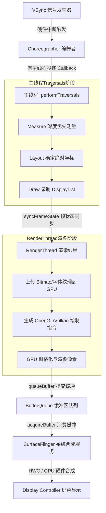
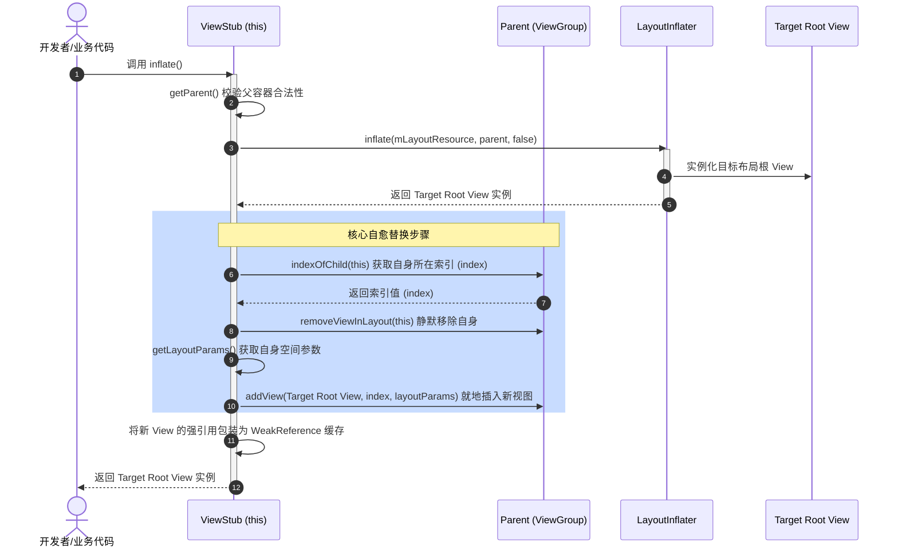

# 5.4.2.1 View绘制优化

在 Android 应用开发与性能调优的知识体系中，渲染卡顿与界面掉帧是直接触及用户体验生死的重大课题。Android 系统的流畅度，本质上取决于 CPU 与 GPU 能否在限定的时间窗口（例如 60Hz 刷新率对应的 16.6ms，亦或是 90Hz 对应的 11.1ms、120Hz 对应的 8.33ms）内，协作完成一帧画面的计算、栅格化并成功渲染上屏。

作为直接承载应用视觉呈现与交互逻辑的介质，View 树（View Hierarchy）的结构设计及其绘制效率，是主线程 CPU 算力消耗的绝对核心。如果布局结构混乱、嵌套深重、存在大范围的冗余测绘，主线程 of CPU 时间片将会在 Traversal 阶段被迅速耗尽，直接导致 Choreographer 错失 VSync 信号，界面产生灾难性的 Jank。

本文将从 UI 渲染管线的物理机制入手，由浅入深地剖析 Android View 树的底层测绘原理、双重测量的微观成因与指数级开销、三大布局优化标签的源码级替换闭环，并最终解密 ConstraintLayout 的 Cassowary 线性约束求解算法底座与优化边界。

---

## 1. UI 渲染管线与布局性能天花板

Android 系统的 UI 渲染是一个跨线程、跨进程，融合了 CPU 指令录制、RenderThread 指令编排、GPU 硬件栅格化以及系统级合成服务（SurfaceFlinger）的庞大流水线。



### 1.1 VSync 信号与 Choreographer 调度机制

在渲染管线的起点，是硬件显示面板（如 LCD 或 OLED）以固定的时钟频率产生的 **VSync（Vertical Synchronization，垂直同步）信号**。VSync 信号就像是整个渲染系统的节拍器。

1.  **硬件中断的传递**：显示硬件的垂直折返产生 VSync 硬件中断，系统的 `EventThread` 捕获该中断并进行分发，最终传递给应用进程的 `Choreographer`（系统编舞者）。
2.  **Looper 消息投递与同步屏障（Sync Barrier）**：
    当应用需要更新界面或请求布局时（例如调用了 `view.requestLayout()` 或 `view.invalidate()`），底层的请求会逐级往上回调至整个 View 树的根节点 `ViewRootImpl.requestLayout()`。在 `ViewRootImpl` 内部，会立即执行 `scheduleTraversals()`。该方法会做两件关键的事情：
    *   **开启同步屏障**：向主线程的 `MessageQueue` 投递一个同步屏障消息（Sync Barrier）。这是通过调用 `MessageQueue.postSyncBarrier()` 方法实现的。同步屏障消息是一个特殊的 Message（其 `target` 属性为 `null`），它一旦被插入队列首部，Looper 在进行消息轮询时，就会直接越过队列中所有的普通消息（如 Handler 普通发送的广播、网络回调消息等），只允许被标记为**异步消息（Asynchronous Message）**的事件通过。这确保了 UI 绘制在排队时拥有绝对的插队优先权。
    *   **向编舞者投递 Callback**：向 `Choreographer` 投递一个类型为 `CALLBACK_TRAVERSAL` 的运行请求。
3.  **VSync 触发渲染回调**：当下一个 VSync 信号的物理脉冲抵达进程时，`Choreographer` 内部的 `FrameDisplayEventReceiver`（它继承自 C++ 层的 `DisplayEventReceiver`，通过 Binder 或 Unix 域套接字本地管道接收底层的硬件中断事件）被唤醒。它在 `onVsync()` 方法中将渲染任务打包成一个异步 Message 投递到主线程。主线程的 `Looper` 遇到同步屏障后，会优先取出这个异步渲染消息，并立即调用 `ViewRootImpl.doTraversal()` -> `performTraversals()`，宣告渲染正式启动。

---

### 1.2 主线程三阶段的底层数据与控制流

`performTraversals()` 是整个 View 绘制体系的总入口。它以**深度优先遍历（DFS）**的策略，在 View 树上执行三个核心的遍历阶段：`performMeasure()`、`performLayout()` 和 `performDraw()`。

#### 1.2.1 Measure（测量阶段）
Measure 阶段的任务是确定 View 树中每一个节点所需的物理宽高。

*   **MeasureSpec 约束传递**：Android 使用 32 位的整型 `MeasureSpec` 来表达对 View 的宽高约束。其高 2 位代表 `SpecMode`（测量模式），低 30 位代表 `SpecSize`（测量尺寸）。
    *   **`EXACTLY`**（精确模式）：父容器已经为子视图决定了确切的物理尺寸。无论子视图期望多大，都必须被限制在这一尺寸内。通常对应于 XML 中的具体数值（如 `100dp`）或 `match_parent`。
    *   **`AT_MOST`**（最大模式）：子视图的最大物理尺寸不能超过父容器指定的限制，但它自己可以决定具体有多小。通常对应于 XML 中的 `wrap_content`。
    *   **`UNSPECIFIED`**（未指定模式）：父容器对子视图不施加任何物理约束。子视图想要多大就有多大。这通常出现在滚动的容器中（如 `ScrollView`、`RecyclerView`），允许子 View 极其自由地向纵深拉伸。
*   **计算矩阵与转换矩阵**：
    在 ViewGroup 的测量过程中，父视图会调用其 `getChildMeasureSpec()` 方法，将自身的 `MeasureSpec` 与子 View 在 XML 中声明的 `LayoutParams`（如 `layout_width`、`layout_height`）融合，从而算出子 View 的 `MeasureSpec`。
    
    以下为系统计算子 View MeasureSpec 的核心规则矩阵（即九宫格转换规则）：

| 父容器 SpecMode \ 子视图 LayoutParams | 具体数值 (dp / px) | `MATCH_PARENT` | `WRAP_CONTENT` |
| :--- | :--- | :--- | :--- |
| **`EXACTLY`** (父容器尺寸确定) | **`EXACTLY`** (大小为子 View 指定的值) | **`EXACTLY`** (大小为父容器剩余空间) | **`AT_MOST`** (最大为父容器剩余空间) |
| **`AT_MOST`** (父容器最大尺寸受限) | **`EXACTLY`** (大小为子 View 指定的值) | **`AT_MOST`** (最大为父容器剩余空间) | **`AT_MOST`** (最大为父容器剩余空间) |
| **`UNSPECIFIED`** (父容器无约束) | **`EXACTLY`** (大小为子 View 指定的值) | **`UNSPECIFIED`** (大小为 0 或子 View 期望) | **`UNSPECIFIED`** (大小为 0 或子 View 期望) |

*   **计算链条**：根据此矩阵计算出子 Spec 后，父容器调用子 View 的 `measure()` 方法，子 View 内部再回调执行 `onMeasure()`，最后调用 `setMeasuredDimension()` 将结果写入成员变量。

#### 1.2.2 Layout（布局阶段）
Layout 阶段的任务是根据测量出的尺寸，确定每一个 View 节点在屏幕坐标系中的绝对坐标：左（left）、上（top）、右（right）、下（bottom）。

*   **坐标赋值**：父容器在它的 `onLayout()` 方法中遍历所有的子 View，根据测量出的尺寸、自身特有的对齐规则（如居中、加边距等），计算出子 View 的相对坐标。
*   **坐标下发**：父容器调用子 View 的 `layout(l, t, r, b)`。在子 View 内部的 `layout()` 方法中，它会对比新旧坐标。若坐标发生改变，会调用 `setFrame(l, t, r, b)` 对自身的坐标进行修改，并将重新排布的标志位置位，接着调用自身的 `onLayout()`，让其下属的子视图进行相同的递归过程。

#### 1.2.3 Draw（绘制阶段）
Draw 阶段的任务是将 View 树的各种视觉呈现（如背景、文本、图片等）转化为绘制指令。

*   **软件渲染 vs 硬件加速**：
    *   **软件绘制（Software Rendering）**：主线程直接使用 CPU 调用 `Skia` 库，在 SurfaceFlinger 提供的内存 Bitmap（Canvas）上直接操作像素。这种方式绘制非常消耗 CPU 算力，并且无法发挥 GPU 强大的并行管线优势。
    *   **硬件加速（Hardware Acceleration）**（Android 3.0+ 引入，4.0+ 默认开启）：在硬件加速状态下，主线程的 Draw 过程被改造成了**指令录制**。主线程在遍历到每一个 View 时，会调用 `updateDisplayListIfDirty()`。该方法会获取一个专门用来录制硬件绘制命令的 `RecordingCanvas`。当 View 内部调用 `onDraw(canvas)` 时，诸如 `drawRect()`、`drawText()`、`drawBitmap()` 等方法并不会立刻引发显存的物理像素写入，而是将这些图形动作及其参数封装成一个个绘制节点（如 `DrawTextOp` 等），写入到该 View 的 `RenderNode` 中。
    *   所有 View 的 `RenderNode` 串联合并，最终生成了表示整帧画面的**`DisplayList`**。

---

### 1.3 RenderThread 渲染线程与 GPU 栅格化协同

Android 5.0 引入了 **`RenderThread`（渲染线程）**。它的核心作用是将主线程从繁重的 GPU 交互中解放出来，实现 CPU 录制与 GPU 渲染的并行执行。

1.  **帧同步（Sync Frame State）**：主线程完成 `DisplayList` 录制后，会向 `RenderThread` 发起绘制命令并进入同步状态。在这一极短的时间段内，主线程将刚才录制的整棵 View 树的 `DisplayList`（包含各个节点的属性、位移矩阵等数据）同步给 `RenderThread`。这一过程在性能监测（如 Systrace）中表现为 `syncFrameState`。
2.  **主线程释放**：一旦同步完成，主线程便可以从 `performTraversals()` 中返回，重新去处理用户的输入事件、动画运算或者网络数据回调，不需要等待具体的 GPU 指令执行完毕。
3.  **RenderThread 指令编排**：`RenderThread` 拥有自己的渲染队列。它读取主线程同步过来的 `DisplayList`，并借助底层的驱动（如 OpenGL ES 或 Vulkan 接口）构建对应的 GPU 图形操作命令。
4.  **属性动画与 RenderNode 节点矩阵优化**：
    在硬件加速开启时，每个 View 都有一个 C++ 层的 `RenderNode`。当我们在代码中执行 View 的位移、旋转、缩放、Alpha 渐变（如使用 `ObjectAnimator` 或调用 `view.setTranslationX(100f)`）时，系统**不会调用主线程的 requestLayout()，甚至连 invalidate() 都不需要触发重新录制 DisplayList**。
    因为这些几何属性是直接作为属性矩阵保存在 `RenderNode` 中的。主线程只需要通过 JNI 快速更新 Native 层该 `RenderNode` 的内部值，下一帧 `RenderThread` 绘制时就会自动应用这些新的位移与矩阵数据，从而实现了零主线程 CPU 开销的超顺滑属性动画。
5.  **底座升级：OpenGL ES 与 Vulkan 硬件渲染管线对比**：
    在 Android 10+，硬件渲染加速机制默认向 **Vulkan** 转移（此前默认为 OpenGL ES）。
    *   *OpenGL ES* 是一个单线程设计的状态机。RenderThread 在向 GPU 发送指令时，必须独占图形上下文，所有的对象状态切换非常频繁且耗时，CPU 侧存在显著的驱动协议层额外开销。
    *   *Vulkan* 是一种现代的多线程友好图形 API。它允许 RenderThread 将绘制命令录制并行化（利用 CPU 的多核心并发写入同一个 CommandBuffer），同时它极大地消减了图形驱动在 CPU 端的运行时消耗。这一底座改变，彻底释放了 RenderThread 自身的 CPU 占用率，在处理复杂的卡顿优化时，提供了更为坚实稳定的物理底座。
6.  **纹理上传（Texture Upload）**：在绘制之前，如果页面中包含未被 GPU 缓存过的 Bitmap，`RenderThread` 必须先调用显卡驱动，将内存中的 Bitmap 位图像素复制到 GPU 的显存中，这就是常见的 Texture Upload 开销。如果图片过大或过多，这会导致主线程在同步阶段发生严重阻塞，导致掉帧。
7.  **GPU 栅格化（Rasterization）**：GPU 接收到顶点数据与着色指令后，通过多级渲染管线进行栅格化，将复杂的矢量路径和图形矩阵转化为屏幕上的彩色像素，并将结果输出到 GraphicBuffer 缓冲区中。
8.  **BufferQueue 的提交与消费**：
    *   应用窗口对应的物理内存被组织在 `BufferQueue` 结构中。GPU 渲染完成后，`RenderThread` 将当前的 GraphicBuffer 从应用进程提交（`queueBuffer`）到 `BufferQueue` 中。
    *   **SurfaceFlinger 介入**：作为一个独立的系统服务进程，`SurfaceFlinger` 扮演着消费者的角色。当下一个 VSync-SF 信号到来时，它会取出已经提交的 Buffer（`acquireBuffer`）。
    *   **硬件合成与呈像**：`SurfaceFlinger` 联合底层的 **HWC（Hardware Composer，硬件合成器）**。HWC 能够直接通过硬件叠加图层（如应用窗口图层、状态栏图层、导航栏图层等）。在 HWC 无法直接合成的复杂场景下，系统会回退到使用 GPU 将各图层混合绘制到一个主 Framebuffer 中。最后，主 Framebuffer 被发送给屏幕的显示控制器（Display Controller），在下一次屏幕物理扫描时正式亮起上屏。

---

### 1.4 过深嵌套布局层级的物理缺陷与卡顿本质

在了解了完整的渲染管线后，我们就可以从微观和宏观两个维度分析为什么**过深的布局层级会导致主线程性能迅速恶化**：

*   **递归调用栈开销**：在 Measure、Layout、Draw 三个阶段中，系统都是通过深度优先遍历去遍历 View 树的。如果 View 树深度达到 10 层甚至 20 层以上，调用栈深度会以惊人的速度累加。这不仅会导致主线程执行每一个方法时需要不断的进行压栈和出栈操作，甚至在极少数内存极度紧张的情况下，会直接因为调用栈溢出而发生 `StackOverflowError` 崩溃。
*   **重复执行成本**：在 Android 的机制中，如果某个 View 触发了重绘，虽然有脏区控制（Dirty Area），但如果有属性的修改引发了 `requestLayout()`，这会导致从该节点开始往上一直到 `ViewRootImpl` 的所有父容器都被打上重新布局的标记。在下一轮 `performTraversals()` 中，所有被打标记的节点及其下属的所有子视图都必须重新执行一次完整的测量和布局。如果层级顺着父链传得深，影响的子树范围就极其庞大。
*   **主线程时钟被榨干**：每一次 View 节点的 `measure()` 和 `layout()`，都会伴随着 MeasureSpec 的重新计算、LayoutParams 的读取以及各种尺寸约束协商。当整个 View 树嵌套过深时，这些看似微小的算术运算和对象获取，在主线程 Looper 中会不断累积，最终使得整个 `performTraversals()` 的时间消耗越过 16.6ms（60Hz）的生命红线。
*   **渲染卡顿的最终形成**：一旦主线程消耗的时钟周期过长，在 VSync 信号抵达时，主线程可能还没来得及录制完 DisplayList，或者 RenderThread 还在同步状态中挣扎，导致无法按时向 `BufferQueue` 提交（`queueBuffer`）带有最新视觉内容的 GraphicBuffer。由于 Buffer 没准备好，`SurfaceFlinger` 在触发合成时只能复用上一帧的旧 GraphicBuffer，此时屏幕在这一周期内画面没有任何改变。这就是用户肉眼感知到的“掉帧”、“卡顿”或“瞬间卡死（Jank）”。

---

## 2. 双重测量（Double Measure）的微观开销与成因

在 Android View 的测量流程中，有一些布局容器为了能够精确地决定自身以及子 View 的尺寸，不得不对子 View 进行多次 `measure()` 调用。这种多次测量的现象通常被称为**双重测量（Double Measure）**。

---

### 2.1 RelativeLayout 的双向相对性与双重测量逻辑

`RelativeLayout`（相对布局）是 Android 中最典型的双重测量容器。它的核心设计理念是允许子视图之间建立横向和纵向的相对依赖关系，例如：

```xml
<TextView
    android:id="@+id/title"
    android:layout_width="wrap_content"
    android:layout_height="wrap_content"/>

<TextView
    android:id="@+id/desc"
    android:layout_width="match_parent"
    android:layout_height="wrap_content"
    android:layout_toRightOf="@id/title"
    android:layout_below="@id/title"/>
```

在上面的布局中，`desc` 的水平起点依赖于 `title` 的宽度，而其垂直起点依赖于 `title` 的高度。这就产生了一个在两个轴向上都交织存在的依赖图。为了能够正确计算出所有子 View 的相对位置，RelativeLayout 必须分步解决这些依赖。

#### 2.1.1 依赖图与拓扑排序
RelativeLayout 内部维护了一个 `DependencyGraph`（依赖图）。在测量开始时，它会首先将所有子 View 放入图结构中，并根据它们声明的 `layout_toRightOf`、`layout_toLeftOf`、`layout_above`、`layout_below` 等相对属性构建依赖边。然后，利用**拓扑排序（Topological Sort）**算法，生成一个用于水平测量的子 View 顺序链表（`mSortedHorizontalChildren`），以及一个用于垂直测量的顺序链表（`mSortedVerticalChildren`）。

#### 2.1.2 第一轮测量：水平方向确定
由于 RelativeLayout 的子 View 高度可能需要依据其宽度来决定（例如 wrap_content 的 TextView 宽度缩小时会换行，从而高度增大），RelativeLayout 必须先确定所有子 View 的宽度。

*   RelativeLayout 按照水平依赖图的拓扑顺序遍历子 View。
*   It will pass a temporary MeasureSpec. 因为此时高度是未确定的，RelativeLayout 通常会将高度的 SpecMode 设定为 `UNSPECIFIED`，或者传入一个临时尺寸。
*   子 View 接收到该约束后，执行第一次 `measure()`，返回并记录下它们期望的宽度。

#### 2.1.3 第二轮测量：垂直方向与最终尺寸确定
在得到了所有子 View 的水平宽度、左边界（left）和右边界（right）后，RelativeLayout 再次进行遍历。

*   这一次，RelativeLayout 根据已知的水平宽度，以及子 View 在垂直方向的依赖关系（如在谁的下方），计算出精确定位子 View 高度的约束条件。
*   它将包含精确尺寸信息的 WidthSpec 与 HeightSpec 再次传递给子 View，并触发第二次 `measure()`。
*   在这一轮测量后，子 View 才真正确定了其在屏幕上的最终尺寸和四个顶点的相对坐标。

> [!IMPORTANT]
> **默认行为开销**：RelativeLayout 的这一套双重测量逻辑是写死在它的 `onMeasure` 源码里的。这意味着，**即便你没有在布局中显式指定任何相对依赖，RelativeLayout 也会默认对几乎所有的直接子 View 执行两轮 measure()。**

---

### 2.2 LinearLayout 权重（layout_weight）测量的成因

与 RelativeLayout 无论如何都会双测不同，`LinearLayout`（线性布局）的测量模式取决于它是否使用了权重（`android:layout_weight`）。

#### 2.2.1 基础测量模式（一次测量）
如果 LinearLayout 内的所有子 View 都没有使用 `layout_weight` 属性，那么它的测量逻辑极其高效。LinearLayout 只需要顺着排列的方向（横向或纵向），对子 View 进行一次深度优先的测量，将其高度/宽度累加即可。这种情况下，测量开销是线性 $O(N)$ 的。

#### 2.2.2 权重分配模式（多次测量成因）
当 LinearLayout 的子 View 中哪怕只有一个设置了 `android:layout_weight` 属性，情况就会变得复杂。

根据 `LinearLayout.java` 的 `onMeasure` 源码，其内部通过标志位 `hasUnmeasuredChild` 标记存在需要通过权重重算尺寸的子节点，其执行逻辑如下：

*   **第一轮测量（剩余空间估算）**：LinearLayout 需要首先知道如果没有权重属性，其他 View 会占用多少空间，从而算出现在还有多少空间可供分配。
    *   LinearLayout 遍历所有子 View。如果某个子 View 声明了权重（如 `layout_weight="1"`）且其对应的尺寸被声明为 `0dp`（如垂直布局中的 `layout_height="0dp"`），系统会先跳过该 View 的大小测量，或者把它暂时当作大小为 0 的 View 来测量。
    *   而对于没有权重或具有具体尺寸的 View，则正常进行测量并累加它们的宽高。
    *   第一轮遍历结束时，LinearLayout 会算出所有普通子 View 占用的物理空间总和，并计算出**剩余可用空间（Remaining Space）**：
        $$delta = parentHeight - totalLength$$
*   **第二轮测量（权重精确拉伸）**：
    *   有了剩余空间数值后，LinearLayout 会再次遍历那些设置了 `layout_weight` 的子 View。
    *   它会根据每个子 View 占用的 weight 比例，计算出它应该被分配的额外高度/宽度。
    *   在源码中，系统对有 weight 的子 View 重新计算出分配后的最终大小 `newSize`：
        $$newSize = Math.max(0, childHeight + (weight \times delta) / totalWeight)$$
    *   因为有了新的精确尺寸（如分配到了 `120px` 空间），LinearLayout 必须以 `EXACTLY` 的模式重新构建 MeasureSpec，并再次调用 `child.measure()`，让子 View 根据新的分配值重新自我测量。
    *   如果不进行这第二次测量，像 TextView 等复杂 View 就无法知道自己被分配到的新宽度究竟能放多少个字符，也就无法正确执行内部的换行与重排。

---

### 2.3 双重测量在深层嵌套下导致主线程 CPU 算力空耗的数学推导

双重测量的开销在单层布局中并不明显，但随着 View 树嵌套层级的加深，其开销会以**指数级**的趋势迅速失控。

让我们通过一个严密的数学模型来推演双重测量的性能恶化本质：

假设我们在界面中设计了嵌套了 $d$ 层的布局。为了让模型简化且直观，我们假设这 $d$ 层布局**全部都是 RelativeLayout（即双重测量容器）**，且每一层容器都只包含一个下层子 RelativeLayout（即分叉因子 $k=1$ 的极简化单一链路）。

```
Root RelativeLayout (第 1 层)
   └─ Sub RelativeLayout (第 2 层)
         └─ ...
               └─ Leaf View (第 d 层)
```

设每次对任意一个节点执行 `measure()` 方法，其内部执行测量计算的固有开销为时间常数 $t$。

1.  **对于第 1 层（Root 节点）**：
    *   外部系统对 Root 节点调用了 1 次 `measure()`。
    *   Root 是 RelativeLayout，它的 `onMeasure` 机制强制对它的直接子节点（第 2 层）执行 2 次 `measure()`。
2.  **对于第 2 层（Sub 节点）**：
    *   第 2 层节点被父节点调用了 2 次 `measure()`。
    *   because 第 2 层节点本身也是 RelativeLayout，它每次被调用 `measure()` 时，都会对它的直接子节点（第 3 层）发起 2 次测量。
    *   因此，第 3 层的节点被触发测量的次数为：$2 \times 2 = 2^2 = 4$ 次。
3.  **依此类推**：
    *   第 3 层节点被测量了 $2^2$ 次，这导致第 4 层节点被触发测量的次数为 $2^2 \times 2 = 2^3 = 8$ 次。
    *   对于处在第 $d$ 层的最底层叶子 View（Leaf View），它被触发测量的总次数 $M(d)$ 的通项公式为：
        $$M(d) = 2^d$$

如果我们设定一个更符合真实业务场景的结构：树的深度为 $d$，每个父容器包含 $k$ 个直接子节点（分支因子为 $k$），且每一层都是 RelativeLayout。

对于位于第 $d$ 层的某一个特定叶子 View，由于其上方的每一代祖先都是双测容器，每一次祖先被测量都会让子树的测量频次翻倍。最底层的叶子 View 经历的测量次数依然符合指数规律：
$$M_{leaf} = 2^d$$

这产生了一个极其恐怖的微观算力黑洞。我们通过具体的数值进行对比：

| 嵌套深度 $d$ | 叶子 View 被测量次数 $2^d$ | 假设单次测量耗时 $t = 0.5\text{ms}$ 时的最底层总耗时 |
| :--- | :--- | :--- |
| **$d=1$** | $2^1 = 2$ | $1\text{ms}$ |
| **$d=3$** | $2^3 = 8$ | $4\text{ms}$ |
| **$d=5$** | $2^5 = 32$ | $16\text{ms}$ *(接近单帧 16.6ms 红线)* |
| **$d=8$** | $2^8 = 256$ | $128\text{ms}$ *(严重掉帧卡顿，肉眼可见卡死)* |
| **$d=10$** | $2^{10} = 1024$ | $512\text{ms}$ *(接近半秒无响应)* |

#### 2.3.1 为什么 View 的内部测量缓存（Measure Cache）无法拯救这种恶化？
Android 团队为了缓解这一问题，在 `View.java` 的 `measure()` 方法中引入了测量缓存机制：

```java
// View.java 核心缓存判定逻辑 (简化表达)
if ((mPrivateFlags & PFLAG_FORCE_LAYOUT) != PFLAG_FORCE_LAYOUT &&
        widthMeasureSpec == mOldWidthMeasureSpec &&
        heightMeasureSpec == mOldHeightMeasureSpec) {
    // 命中缓存，直接跳过 onMeasure() 的重算
    return;
}
```

但在深层嵌套的双重测量环境下，这个缓存机制几乎会**完全失效**：

1.  **模式不匹配**：RelativeLayout 的第一轮测量传入的高度 SpecMode 是 `UNSPECIFIED`，而第二轮测量传入的高度 SpecMode 是 `EXACTLY`。这意味着对于同一个 View，在同一次绘制流程（Traversal）中，第一轮与第二轮的 `MeasureSpec` 参数是发生改变的。缓存因为输入参数不一致而被判定失效，被迫重新执行 `onMeasure()`。
2.  **强制布局标记**：如果子 View 本身通过调用 `requestLayout()` 触发了更新，它会给自身及其所有祖先 View 打上 `PFLAG_FORCE_LAYOUT` 标记。这一标记会使得上述缓存判定中的第一个条件直接失败，即使 MeasureSpec warm-cached 完全相同，也必须强制重新执行完整的 `onMeasure()` 计算。

由于缓存失效，底层 View（如 TextView 这种包含了大量静态字符拆分、换行计算、多语言字体度量等昂贵 CPU 操作的 View）会被不厌其烦地执行几百甚至上千次。此时，主线程的 CPU 负载瞬间爆表，Looper 消息循环被完全堵死。Choreographer 错过了 VSync 的中断通知，GraphicBuffer 的渲染链路在主线程中断裂，从而在用户界面上产生了明显的画面撕裂、操作粘滞和明显的掉帧。

---

### 2.4 典型叶子 View 重复测量的 CPU 微观噩梦：TextView / StaticLayout 塑形分析

为什么说 TextView 这种看似寻常的叶子节点 View，在多次测量下是 CPU 性能的第一杀手？

当系统对一个 TextView 调用 `onMeasure` 时，其内部绝非仅仅进行简单的算术累加。对于 `wrap_content` 或者包含复杂富文本（`SpannableString`）的 TextView，它必须借助系统底层的 `StaticLayout`、`DynamicLayout` 或 `BoringLayout` 排版类进行极其重型的文本塑形与重排计算。

这一过程包括以下底层步骤：
1.  **字体度量解析（FontMetrics）**：读取当前字体文件（通常是 TrueType 或 OpenType 格式），计算每个字符的 Ascent, Descent, Leading 等垂直参数。
2.  **字符塑形与测量（Glyph Shaping）**：将输入的 Unicode 字符序列翻译为具体的字体网格（Glyph）。由于不同的语言和连字规则（如阿拉伯语、Emoji 等复合连字），排版引擎必须调用底层的 **HarfBuzz 渲染引擎** 进行字符宽度与位置的精确度量。
3.  **Hyphenation 断词排版**：对于英文等西文字符，如果一行排不下，系统要检测连字符的截断点（Hyphenation），这需要进行复杂的词典前缀匹配算法。
4.  **折行与段落布局生成（StaticLayout.generate）**：在得到字符宽度后，根据限制的最大宽度进行折行算法计算，最终算出每一行应该包含哪些字符，进而计算出整个文本块的物理包围盒宽高。

> [!NOTE]
> **重复计算代价**：上述所有算法在 CPU 侧都涉及到大量的 native 级运算。当 TextView 被双重测量乃至指数级多次测量时，一旦外界传入的测量宽度 Spec 发生哪怕 1 像素的变化，整个折行和 HarfBuzz 塑形逻辑就会彻底推倒重来。主线程 CPU 的算力在这一瞬间就会被这成千上百次 native 级别的重塑操作彻底抽干，这是双重测量导致卡顿的最典型微观罪证。

---

## 3. 三大布局优化标签的底层物理机理

为了解决由于层级嵌套导致的性能恶化，Android 提供了三大经典的布局标签：`<include>`、`<merge>` 和 `<ViewStub>`。它们在布局加载器（`LayoutInflater`）的解析过程中扮演着截然不同的物理角色。

---

### 3.1 `<include>`：布局复用与 LayoutParams 重写覆盖机制

`<include>` 标签常用于将通用的公共布局模块（如自定义的 ActionBar、Loading 界面等）拆分并复用到不同的页面中。

很多人在使用 `<include>` 时，常常会遇到这样一个经典问题：**为什么在 `<include>` 中设置的 `android:layout_width` 和 `android:layout_height` 不起作用，或者设置的 margin、gravity 等属性失效了？**

这需要通过走读 `LayoutInflater.parseInclude()` 的底层解析机制来解答。

#### 3.1.1 parseInclude() 的覆写逻辑剖析
当 `LayoutInflater` 在解析 XML 时，如果扫描到了 `<include>` 标签，它会执行以下核心物理操作：

1.  **加载子布局**：它取出 `<include>` 标签上声明的 `layout` 属性（指向另一个 XML 资源，如 `@layout/common_header`），并利用 `LayoutInflater` 对该目标子布局进行实例化。
2.  **获取属性集**：它首先尝试将 `<include>` 标签本身所具有的 XML 属性集合（AttributeSet attrs）解析出来。
3.  **尝试生成 LayoutParams**：
    ```java
    // 走读 LayoutInflater.java 中的核心解析逻辑
    ViewGroup.LayoutParams params = null;
    try {
        // 使用 include 所处的父容器（ViewGroup group）来根据 include 上的属性生成 LayoutParams
        params = group.generateLayoutParams(attrs);
    } catch (RuntimeException e) {
        // 如果父容器在生成参数时发生异常，则保留为 null
    }
    ```
4.  **两要素强判定（最关键）**：
    如果 `params` 生成成功，`LayoutInflater` 会通过如下判定逻辑决定是否将此 `params` 覆写到子布局的根 View 上：
    ```java
    if (params == null) {
        // 如果 include 标签上没有任何 layout_ 属性，则直接使用子布局根节点 XML 内部声明的参数
        child.setLayoutParams(childLayoutParams);
    } else {
        // 关键判定：必须同时成功解析出 width 与 height，否则覆写无效！
        if (params.width == ViewGroup.LayoutParams.FILL_PARENT || // 兼容老版本属性
            params.width == ViewGroup.LayoutParams.MATCH_PARENT ||
            params.width == ViewGroup.LayoutParams.WRAP_CONTENT ||
            params.width >= 0) {
            
            if (params.height == ViewGroup.LayoutParams.FILL_PARENT ||
                params.height == ViewGroup.LayoutParams.MATCH_PARENT ||
                params.height == ViewGroup.LayoutParams.WRAP_CONTENT ||
                params.height >= 0) {
                
                // 只有宽高两要素同时有效，才将包含 include 属性的 params 设置给子布局的根 View
                child.setLayoutParams(params);
            }
        }
    }
    ```

> [!WARNING]
> **覆盖规则的物理前提**：由源码可见，**如果你仅在 `<include>` 中声明了 `android:layout_margin="10dp"`，却忽略了声明 `android:layout_width` 和 `android:layout_height`，那么整个生成的 `params` 会因为宽高属性判定失败而无法应用，你设置的 margin 属性也会被系统直接丢弃。** 

因此，如果想让 `<include>` 标签上的任何 `layout_*` 属性覆盖子布局的默认属性，**必须同时声明 `layout_width` 和 `layout_height`**。

---

### 3.2 `<merge>` 消除冗余父容器底层物理机制

`<merge>` 标签是专门为了消除不必要的嵌套视图而设计的。它不能单独作为独立的 UI 组件存在，必须作为被载入布局的根节点。

#### 3.2.1 物理层级的消减对比
假设我们有一个通用的子布局，里面包含两个简单的元素，由于传统的 XML 解析器要求必须有且仅有一个根 View，在不使用 `<merge>` 的情况下，我们不得不加一个无意义的 `FrameLayout` 或 `LinearLayout` 去包裹它们：

```
没有使用 <merge> 的层级（左侧分支）：                 使用 <merge> 消除冗余后的层级（右侧分支）：
      ViewGroup (父容器)                                  ViewGroup (父容器)
            │                                                   │
     FrameLayout (冗余根)                                ┌──────┴──────┐
      ┌─────┴─────┐                                      │             │
   Button      TextView                               Button        TextView
```

可以看出，左侧分支在最终的 View 树中物理地多出了一层 `FrameLayout`，而在右侧分支中，子 View 被直接平铺在宿主容器内，物理嵌套层级被完美削减了一层。

#### 3.2.2 `LayoutInflater.inflate()` 对 `<merge>` 的源码走读与防御性校验
当 `LayoutInflater` 解析 XML 树并遇到根标签名为 `<merge>` 的节点时，它会进行以下严密的校验和逻辑处理：

```java
// 走读 LayoutInflater.java 中的 inflate() 核心代码
if (TAG_MERGE.equals(name)) {
    // 防御性判定：如果传入的父容器 root 为空，或者没有指示立即挂载（attachToRoot 为 false）
    if (root == null || !attachToRoot) {
        throw new InflateException("<merge /> can be used only with a valid "
                + "ViewGroup root and attachToRoot=true");
    }

    // 校验通过，直接开始解析 <merge> 内部的子 View 并将其“倒入”父容器中
    rInflate(parser, root, inflaterContext, attrs, false);
}
```

*   **为什么不能在 `root == null` 时实例化？**
    因为 `<merge>` 在 Android 视图体系中**没有任何一个与之相对应的实体类（如不存在 `MergeView.class`）**。它既没有 LayoutParams，也无法响应 Measure、Layout、Draw 流程。它在物理上仅仅是一个逻辑占位符。如果你试图调用 `LayoutInflater.inflate(R.layout.my_merge_layout, null)` 去加载一个 merge 布局，系统不知道该用什么类型的 LayoutParams 去解析它内部的子元素，更无法为其返回一个能够表示根视图的 Object，因此抛出 `InflateException`。
*   **在 `rInflate()` 方法中的解析过程**：
    在 `rInflate()` 方法内部，解析器会调用 `parser.next()` 越过 `<merge>` 这一层标签，直接循环读取其内部的真实子视图节点（如 Button、TextView 等）。对于每一个子视图，`LayoutInflater` 会根据当前的父容器 `root` 的类型实例化它们，并立即调用 `root.addView(child, tempParams)`。
    通过这套巧妙的逻辑，`<merge>` 的外壳在解析时被直接撕掉，里面的子 View 被直接、物理性地挂载到了真实的父布局中，完美达成了“零开销”消除冗余层级的目的。

---

### 3.3 `<ViewStub>` 轻量级延迟懒加载占位机理

在界面开发中，有些视图仅在特定场景下才会展示（如网络出错的 EmptyView、限时秒杀的横幅等）。如果一味地把这些视图隐藏（`View.GONE`），它们虽然不渲染，但**在 XML 解析时仍然会触发底层 View 对象的初始化、占用 JVM 堆内存，且依然存在于 View 树节点中被遍历**。

`<ViewStub>` 就是为了实现真正意义上的“延迟懒加载”而生的核心组件。

#### 3.3.1 为什么 ViewStub 极其轻量？
1.  **极简的对象结构**：`ViewStub` 继承自 `View`。它几乎没有声明复杂的成员变量，没有背景，也没有任何图片资源绑定。
2.  **不占用布局尺寸（零测量开销）**：
    在 `ViewStub.java` 中，它的 `onMeasure` 方法被重写得极其简单：
    ```java
    @Override
    protected void onMeasure(int widthMeasureSpec, int heightMeasureSpec) {
        // 无论父容器施加何种规格约束，ViewStub 都雷打不动地返回 0x0 的物理大小
        setMeasuredDimension(0, 0);
    }
    ```
3.  **零绘制开销**：
    `ViewStub` 在构造函数中显式地调用了 `setWillNotDraw(true)`，并且其 `draw()` 与 `onDraw()` 方法全为空实现，没有任何 Canvas 绘图指令，GPU 渲染流程完全跳过。
4.  **内存与树结构占位**：它的存在只是为了在 View 树上保留一个极轻量级的占位节点。

---

#### 3.3.2 `ViewStub.inflate()` 核心源码逐行剖析

当开发者需要将 `ViewStub` 指向的目标布局真正实例化并呈现时，会调用 `inflate()` 方法。以下是该核心方法的 Java 源码，配有详尽的行级中文注释，详细展示了其物理移除自身并就地 `addView` 的自愈替换闭环全过程：

```java
/**
 * 核心逻辑：将 ViewStub 从父容器中物理移除，就地载入并插入真正的目标布局
 * @return 替换后实例化的真正目标 Layout 的根 View 节点
 */
public View inflate() {
    // 1. 获取 ViewStub 当前在 View 树中的物理父容器
    final ViewParent viewParent = getParent();

    // 2. 防御判定：父容器必须非空且必须为 ViewGroup。
    // 如果为 null，通常意味着该 ViewStub 已经被加载过并从树中移除了，无法二次 inflate
    if (viewParent != null && viewParent instanceof ViewGroup) {
        // 3. 校验是否在 XML 中指定了要加载的目标布局资源 ID
        if (mLayoutResource != 0) {
            final ViewGroup parent = (ViewGroup) viewParent;
            
            // 4. 准备 LayoutInflater 实例，如果外部没注入特定的 Inflater，则根据当前上下文构建
            final LayoutInflater factory;
            if (mInflater != null) {
                factory = mInflater;
            } else {
                factory = LayoutInflater.from(mContext);
            }
            
            // 5. 重点：使用 inflate 解析目标布局。
            // 注意：attachToRoot 传入 false。我们必须手动且精准地将它插入到 ViewStub 原本所在的层级索引处
            final View view = factory.inflate(mLayoutResource, parent, false);

            // 6. 如果在 ViewStub 标签上定义了 android:inflatedId，
            // 则将解析出的目标布局根视图的 ID 改写为该 inflatedId，以便于开发者后续 findViewById
            if (mInflatedId != NO_ID) {
                view.setId(mInflatedId);
            }

            // 7. 物理替换闭环第一步：利用 parent 获取当前 ViewStub 自身在父容器子 View 数组中的精确索引位置
            final int index = parent.indexOfChild(this);

            // 8. 物理替换闭环第二步：将 ViewStub 自身从父容器中移除。
            // 注意：这里使用的是 removeViewInLayout 而不是普通的 removeView。
            // removeViewInLayout 是在布局阶段内安全移除的低开销 API，能防止多余的全局布局刷新请求（requestLayout）
            parent.removeViewInLayout(this);

            // 9. 物理替换闭环第三步：获取 ViewStub 自身的 LayoutParams。
            // 这是为了将 ViewStub 占位符上定义的位置和尺寸属性（如 layout_width 等）完整地遗传给新加载的目标布局
            final ViewGroup.LayoutParams layoutParams = getLayoutParams();
            if (layoutParams != null) {
                // 10. 如果有参数，将目标布局以完全相同的索引 index 和参数 layoutParams 添加到父容器中，完成就地替换
                parent.addView(view, index, layoutParams);
            } else {
                // 如果没有参数，直接添加
                parent.addView(view, index);
            }

            // 11. 利用弱引用保存对替换后 View 的引用。
            // 这样可以在 ViewStub 生命周期存续期间，通过 get() 依然能访问到替换后的真实 View，同时也防止了强引用导致的内存泄漏
            mInflatedViewRef = new WeakReference<View>(view);

            // 12. 触发监听器回调，通知外部此 ViewStub 已经成功完成了它的蜕变与替换任务
            if (mInflateListener != null) {
                mInflateListener.onInflate(this, view);
            }

            // 13. 返回成功替换并挂载上屏的目标布局根视图
            return view;
        } else {
            // 抛出异常：必须指定 layout 资源 ID，否则无法工作
            throw new IllegalArgumentException("ViewStub must have a valid layoutResource");
        }
    } else {
        // 抛出异常：已经被加载过，或者该 View 根本就没被加到任何一个 ViewGroup parent 容器中
        throw new IllegalStateException("ViewStub must have a non-null ViewGroup parent");
    }
}
```

---

#### 3.3.3 ViewStub 后的 GC 垃圾回收与内存泄漏防范
虽然 `ViewStub` 在执行 `inflate()` 时调用了 `parent.removeViewInLayout(this)` 从物理 View 树中移除了自身。但是，**从树中移除并不等同于对象被垃圾回收（GC）**。

在实际项目开发中，如果发生了以下场景，`ViewStub` 及其相关资源将长久滞留在内存中：
*   **Activity 强持有**：如果 Activity 成员变量强引用持有了该 ViewStub（例如使用 ViewBinding 或在 `onCreate()` 中通过 `findViewById` 绑定到了成员变量 `private ViewStub mErrorViewStub`），即便它已经不再处于 View 树中，由于父 Activity 依然强持有其引用，JVM 也绝对无法回收该 `ViewStub` 对象。
*   **Listener 的隐式泄漏**：如果调用了 `viewStub.setOnInflateListener(listener)`，而传入的 listener 是一个匿名内部类。匿名内部类会隐式持有外部 Activity 的引用。一旦 ViewStub 被泄露，这一条引用链就会连带锁死整个 Activity 导致致命的内存泄露。

> [!TIP]
> **最佳实践**：为了使 ViewStub 占位壳能够真正被 GC 回收，在 `ViewStub.inflate()` 完成视图替换后，**必须手动将持有 ViewStub 的外部引用变量置为 `null`**。由于源码中已将内部 parent 引用设空（即断开了与树根的物理绑定），变量置空后 ViewStub 对象就会彻底成为孤立无根的垃圾节点，在下一次 GC 触发时会被迅速回收。

---

#### 3.3.4 ViewStub 自愈替换时序流转

下面以时序图的形式展示 `ViewStub` 动态替换时的全链路流转过程，展现 `removeViewInLayout` 与 `addView` 的完美配合：



从源码走读和时序流转可以看出，`ViewStub` 在 `inflate()` 执行完毕后，它自身就已经彻底退出了当前的 View 树拓扑。这不仅在视觉上完成了懒加载的显示过程，更在物理结构上完成了一次静默替换，保证了视图结构的紧凑与高效。

---

## 4. 扁平化救赎：ConstraintLayout 与 Cassowary 线性等式求解算法

为了彻底打破“为了实现复杂相对位置而被迫疯狂嵌套”的物理魔咒，Android 团队推出了 `ConstraintLayout`（约束布局）。

ConstraintLayout 允许开发者在一层扁平的布局中，通过设置上下左右以及基准线（Baseline）等方向的多维约束，直接定义极为复杂的相对布局。

```
传统嵌套结构（RelativeLayout / LinearLayout 混杂）：      ConstraintLayout 扁平化结构：
           ConstraintLayout (根容器)                           ConstraintLayout (根容器)
                │                                                    │
        RelativeLayout                                     ┌─────────┼─────────┐
         ┌──────┴──────┐                                   │         │         │
    LinearLayout    TextView                            ButtonA   ButtonB   TextViewC
    ┌────┴────┐
 ButtonA   ButtonB
```

在一层扁平化结构下，View 树的 DFS 遍历深度骤降到 1，传统递归测量的栈空间开销与中间节点的重复测量耗时被彻底打平。

那么，ConstraintLayout 是如何在没有层级的情况下，计算出这些复杂的相对关系并确定各 View 的绝对物理坐标的？

这要归功于其底座——**Cassowary 线性约束求解算法**。

---

### 4.1 Cassowary 约束求解算法的底层原理

在传统的布局引擎中，计算过程是“**过程式（Procedural）**”的。例如：LinearLayout 必须按照顺序先算第一个 View 的大小，再把剩余的空间传给第二个 View。这种方式在面对循环依赖或者复杂的相对比例时，需要多次来回迭代，极易产生双重甚至多重测量。

而 ConstraintLayout 引入了“**约束满足（Constraint Satisfaction）**”的思想。它将整个界面中所有子 View 的坐标计算，看作是一个整体的数学方程组求解过程。

#### 4.1.1 布局约束的线性方程化
在 Cassowary 算法中，每一个子 View 的四个边界：左边界（$x_l$）、上边界（$y_t$）、宽度（$w$）、高度（$h$）都被抽象为一个个未知的**实数变量**。

我们在 XML 中声明的各种约束关系，都可以完美翻译成一阶线性等式（Linear Equations）或不等式（Linear Inequalities）：

*   **右对齐到 button 的左边加 8dp 边距**：
    $$x_{l\_this} = x_{r\_button} + 8$$
*   **宽度是 parent 的 50%**：
    $$w_{this} = 0.5 \times w_{parent}$$
*   **居中约束（左右两侧同时对齐到 parent 的左右边缘）**：
    $$x_{l\_this} - x_{l\_parent} = x_{r\_parent} - x_{r\_this}$$
*   **尺寸上下限约束**：
    $$w_{this} \ge 100$$
    $$w_{this} \le 500$$

对于一个包含了 $N$ 个 View 的界面，ConstraintLayout 会收集所有的属性声明，构建出一个包含数百个变量与数百个线性等式/不等式的庞大方程组。

---

#### 4.1.2 单纯形法（Simplex Method）与冲突裁决
Cassowary 算法的核心是线性规划单纯形法（Simplex Method）在图形布局中的变体。在实际布局中，约束之间可能会发生冲突。例如：屏幕总宽度只有 320dp，但某个 View 的左约束、右约束以及固定宽度 400dp 产生了矛盾。

为了在发生冲突时做出合理的抉择，Cassowary 算法引入了以下数学机制：

1.  **约束强度（Constraint Strength）**：
    算法为每条约束都定义了四个强度级别：
    *   `Required`（必须满足，物理硬约束，如果无法求解则布局崩盘）
    *   `Strong`（强约束）
    *   `Medium`（中等约束）
    *   `Weak`（弱约束）
    每一条在 XML 中设置的属性都会映射到这些强度上（例如百分比约束、Bias 偏向等）。
2.  **误差变量与松弛变量**：
    对于非 `Required` 的约束，算法允许它不完美满足。为了量化这个“不完美”的程度，算法在每个不等式中引入了**误差变量（Error Variable）** $d$。例如：
    对于等式 $x = y$，引入误差后写作 $x - y + d_{positive} - d_{negative} = 0$，其中 $d$ 为非负数。
3.  **目标函数（Objective Function）的建立**：
    算法在内存中构建一个全局的**目标函数**，其数学表达为最小化所有误差变量的加权和：
    $$\min \sum \left( Strength_i \times \left( d_{positive\_i} + d_{negative\_i} \right) \right)$$
    单纯形法的任务，就是在这个凸多面体可行域中，沿着边界逐步迭代寻找能够使该目标函数值最小的那个顶点。该顶点的坐标值，就是所有 View 在屏幕坐标系下的最优物理解。

---

#### 4.1.3 增量求解（Incremental Simplex）与代数求解推导实例
为了直观展示 Cassowary 增量消元的运行魅力，我们用一个具体的链式对齐场景进行代数推演。

假设父容器宽度为 $W_{parent} = 300$，内部平铺了三个按钮 A, B, C，它们的物理宽度已经被测量锁定为 $W_A = 50$, $W_B = 60$, $W_C = 70$。
我们在 XML 中将它们配置为两端贴边、水平链分布（Chain Style 为 Spread），这会建立如下未知变量和约束方程：
*   未知数：A 的左右坐标 $x_{Al}, x_{Ar}$；B 的左右坐标 $x_{Bl}, x_{Br}$；C 的左右坐标 $x_{Cl}, x_{Cr}$；以及按钮之间的均匀间隙 $s$。
*   等式组：
    1.  $x_{Ar} = x_{Al} + 50$ (A 宽度约束)
    2.  $x_{Br} = x_{Bl} + 60$ (B 宽度约束)
    3.  $x_{Cr} = x_{Cl} + 70$ (C 宽度约束)
    4.  $x_{Al} = 0$ (A 左边缘贴在 parent 左侧)
    5.  $x_{Cr} = 300$ (C 右边缘贴在 parent 右侧)
    6.  $x_{Bl} - x_{Ar} = s$ (A、B 间隙为 $s$)
    7.  $x_{Cl} - x_{Br} = s$ (B、C 间隙为 $s$)

**增量消元求解过程**：
1.  由式 4 得：$x_{Al} = 0$。
2.  代入式 1 得：$x_{Ar} = 0 + 50 = 50$。
3.  由式 5 得：$x_{Cr} = 300$。
4.  代入式 3 得：$x_{Cl} = 300 - 70 = 230$。
5.  将式 6 变形：$x_{Bl} = x_{Ar} + s = 50 + s$。
6.  将式 7 变形：$x_{Br} = x_{Cl} - s = 230 - s$。
7.  将 5 和 6 算出的 $x_{Bl}$ 与 $x_{Br}$ 代入式 2 的宽度等式中：
    $$230 - s = (50 + s) + 60$$
    $$230 - s = 110 + s$$
    $$2s = 120 \implies s = 60$$
8.  回代解出：
    *   $x_{Bl} = 50 + 60 = 110$
    *   $x_{Br} = 230 - 60 = 170$

最终，算法一次性解出了所有未知边界变量：
*   **按钮 A**：$[0, 50]$
*   **按钮 B**：$[110, 170]$
*   **按钮 C**：$[230, 300]$
*   **均匀间隙**：$60$

在 Cassowary 的实际运行中，整个过程无需通过 DFS 树遍历来向子 View 进行多次反复测量协商。当某项约束产生局部变动时，算法通过矩阵的初等行变换消元（Pivot），瞬间以极小的代价完成增量更新。这就是 ConstraintLayout 扁平化布局性能优越的最根本数学机制。

---

### 4.2 ConstraintLayout 二次测量边界与缓存优化

尽管 Cassowary 算法理论上可以实现单轮求解，但我们必须保持清醒的事实认知：**ConstraintLayout 在 Android 中机制上并不是绝对零双重测量的。**

#### 4.2.1 必须触发二次测量的物理场景
在某些特定的边界配置下，ConstraintLayout 依然需要对部分子 View 触发两轮或多轮的 `measure()`：

1.  **尺寸属性设置为 `WRAP_CONTENT`**：
    如果一个 View 的宽度被设置为 `WRAP_CONTENT`。在 Cassowary 的方程组中，这个 View 的宽度变量 $w$ 是一个无法仅通过相对边界推导出的自变量。
    为了知道它到底有多宽，ConstraintLayout 必须暂时打断全局等式求解：
    *   **第一步**：它必须对该 View 发起一次单独的 `measure(UNSPECIFIED)`，让该 View 的内部逻辑（例如 TextView 读出字体的长度）算出自身内容撑开后的期望大小。
    *   **第二步**：ConstraintLayout 捕获该测量值，作为一个常量约束条件代入到 Cassowary 求解器中，随后启动方程组求解，计算其他依赖它的 View 的坐标。
    *   **第三步**：在最终计算结果确定后，为了将真实的坐标与大小最终应用到这个 View 上，它通常还需要发起第二次测量以完成尺寸的更新。
2.  **特殊的约束比例（如 DimensionRatio 宽高比）**：
    当子 View 设置了 `app:layout_constraintDimensionRatio="H,16:9"` 且两个轴向的尺寸都不是固定值时，为了协调比例关系，布局引擎需要先测出其中一个轴向的临时尺寸，经过比例换算后再测第二次以纠正另一轴向的值。

#### 4.2.2 性能对比与权衡

虽然存在这些局部二次测量的场景，但其开销与传统的嵌套 RelativeLayout 存在本质上的区别：

*   **没有指数级累加效应**：because ConstraintLayout 只有扁平的一层，它的子 View 中哪怕有 WRAP_CONTENT 引起了二次测量，这个二次测量的深度只有 1。它不会像极深层嵌套 RelativeLayout 那样，把测量次数通过乘积效应放大到 $2^d$ 次。
*   **缓存优化机制与 Optimizer**：
    ConstraintLayout 内部设计了极其高效的 `Optimizer`（优化器）。在进入 Cassowary 繁重的线性代数矩阵运算前，优化器会对布局关系进行预处理：
    *   **直接约束优化（Direct Resolution）**：若某些 View 的约束链路非常直接（例如仅对齐到 parent），优化器会直接给其坐标赋值，跳过将约束注册进 Cassowary 的步骤。
    *   **测量缓存**：对于已经通过 Cassowary 算出的物理边界，只要外界容器的 MeasureSpec 和自身的约束参数没有发生改变，它会直接跳过重复的方程求解，极大地降低了 CPU 算力开销。

---

## 5. 总结与实践指南

在 Android 界面性能优化的实战中，View 绘制优化是一门需要结合源码机制与数据分析的工程艺术。通过上述对 UI 渲染管线、双重测量开销、三大布局标签以及约束布局底座的深度分析，我们可以总结出以下高价值的开发规范与调优清单：

### 5.1 布局调优黄金法则

1.  **保持扁平化，优先使用 ConstraintLayout**：
    对于结构复杂的界面，坚决抛弃多层嵌套的 RelativeLayout 与具有权重比例的 LinearLayout。用一层 ConstraintLayout 作为绝对的救赎。
2.  **细致运用 `<merge>` 与 `<include>`**：
    当一个可复用的子布局要被嵌入到另一个父容器中时，如果该子布局的根节点与父容器类型相同（例如都是垂直方向的 LinearLayout），子布局根节点必须声明为 `<merge>`。
    牢记在 `<include>` 中覆写任何 `layout_*` 属性时，**必须同时声明 `layout_width` 与 `layout_height`**。
3.  **用 `<ViewStub>` 替代 `GONE`**：
    对于非首屏展示的模块、网络状态异常界面、需要动态触发的浮层等，在 XML 中一律使用 `<ViewStub>` 占位。
    在调用 `ViewStub.inflate()` 时，最好捕获返回值并保留弱引用。**在加载完成后，立即将持有该 ViewStub 的外部强引用置空**，以使占位壳能被 JVM 及时 GC 回收，切断内存泄漏链条。
4.  **防范 `RelativeLayout` 的滥用**：
    避免将 RelativeLayout 作为页面的最顶层 Root 容器，尤其是在其内部还有较深子节点的情况下。如果必须使用简单布局，优先选择单次测量的 LinearLayout。

---

### 5.2 性能指标检查清单

在进行日常排查与性能回归时，应重点关注以下指标与诊断工具：

*   **显示布局边界（Show Layout Bounds）**：
    在开发者选项中开启此项。如果屏幕上密密麻麻充斥着红色、蓝色的小方框，说明嵌套层级和多余的包裹层已经非常严重，需要立刻用 `<merge>` 或 ConstraintLayout 重构。
*   **GPU 呈现模式分析（Profile GPU Rendering）**：
    观察柱状图中的 **绿线（16.6ms）** 或 **红线**。如果表示主线程 Measure/Layout 耗时的蓝色/绿色柱体频繁超越红线，说明主线程正在发生重复的重绘或严重的双重测量，应结合 Systrace/Perfetto 进行细致的 Trace 走读。
*   **Systrace / Perfetto 的 Measure 追踪**：
    如果 Trace 日志中某个 View 节点的 `onMeasure` 频繁出现且耗时达到了几毫秒，应立即排查该节点上方是否存在 RelativeLayout 或 LinearLayout weight 的嵌套组合，并着手进行扁平化改造。

通过践行这些底层的优化理念，我们才能在 Android 碎裂化的硬件环境中，打造出始终如一、丝滑顺畅的极致 UI 体验。

---
## 延伸阅读与参考资料
*   Android 官方性能优化文档: [Optimize layout hierarchies](https://developer.android.com/topic/performance/rendering/optimizing-layout-hierarchies)
*   Alan Borning 等人关于 Cassowary 约束求解算法的奠基论文：《Cassowary: A Constraint Solving Algorithm for User Interfaces》
*   Android 系统版本变更记录: [AndroidVersionChangeLog.md](file:///Users/lizhiyang/Desktop/AndroidKnowledge/AndroidVersionChangeLog.md)
