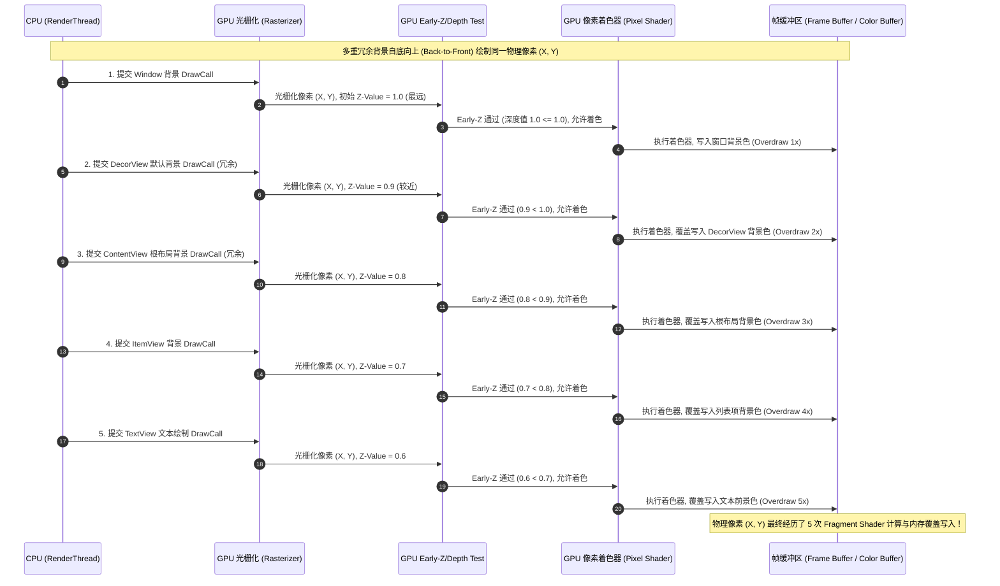
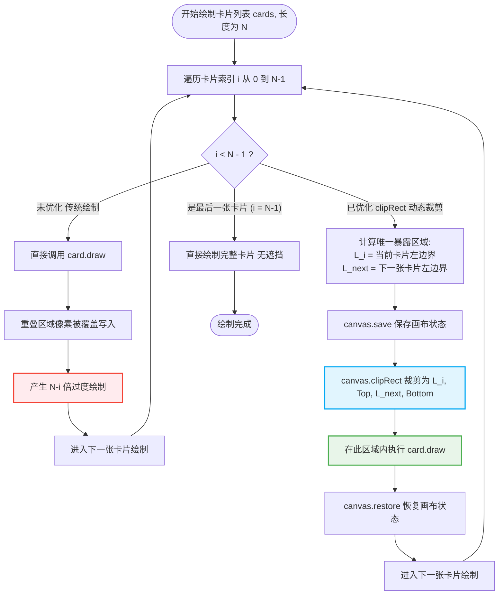

# 5.4.2.2 过度绘制

在 Android 系统的图形渲染与卡顿优化体系中，**过度绘制（Overdraw）**是一个极具代表性的性能瓶颈。过度绘制的优化不仅直接关系到 UI 界面的流畅度，更触及了移动端 GPU 硬件架构、图形渲染管线、显存总线带宽以及物理发热等多维度的底层技术。

本篇将以物理本质、硬件管线、系统渲染框架及实际代码自愈方案为核心，系统性地拆解 Android 过度绘制的成因、底层运行机制、量化调试手段以及高阶规避方案。

---

## 1. 过度绘制（Overdraw）的物理本质与 GPU 硬件损耗

### 1.1 物理像素的刷新机制
智能手机的物理屏幕（无论是 LCD 还是 OLED）本质上是一个由数以百万计的物理像素点组成的点阵发光矩阵。在每一个固定的 VSYNC（垂直同步信号）周期内，显示控制芯片（Display Controller）会从系统的帧缓冲区（Frame Buffer）中读取每个像素的 RGBA 颜色信息，并驱动相应的物理像素（即红、绿、蓝子像素）完成发光亮度和色彩的物理刷新。
- 在 60Hz 屏幕上，这个物理刷新的间隔约为 16.67ms。
- 在 120Hz 高刷屏上，这个间隔缩短到了 8.33ms。

要保证屏幕画面的流畅，GPU 必须在极短的 VSYNC 周期内，将一帧画面中所有像素的 RGBA 值计算完毕，并写入到准备好的帧缓冲区中。

### 1.2 过度绘制的定义与本质
**过度绘制（Overdraw）是指在单帧屏幕像素刷新过程中，同一个物理像素点被重复重写涂色多次的现象。**

从物理计算的角度来看，过度绘制意味着 GPU 的片段着色器（Fragment Shader / Pixel Shader）对屏幕上同一个空间坐标（X, Y）的像素点，执行了多次 RGBA 值的数学计算，并且每一次计算出来的颜色结果，都在图形内存（VRAM/System RAM）的帧缓冲区中对该像素进行了覆盖写入。



### 1.3 显存写入与热力学损耗
每一次片段着色和显存写入都是消耗硬件功耗的物理过程。当 GPU 频繁读写显存时，会产生以下直接物理损耗：
1. **热能损耗与电池消耗**：GPU 芯片内部的高速计算单元（ALU）以及显存总线控制器频繁切换状态，电荷移动在芯片微观导线上产生焦耳热（Joule Heating），导致芯片温度迅速上升，电池电量被剧烈消耗。
2. **SoC 温度红线降频**：移动设备的散热空间极其受限。当过度绘制引发的 GPU 功耗持续处于高位时，系统的温控策略（Thermal Throttling）会被触发，强制对 CPU 和 GPU 进行硬件降频。降频后的 GPU 算力进一步下跌，使得原本勉强不卡顿的界面瞬间出现严重的卡顿与断崖式掉帧。

---

## 2. GPU 渲染管线中的像素填充率（Fill Rate）赤字

### 2.1 像素填充率（Pixel Fill Rate）的数学模型
像素填充率是衡量 GPU 图形处理性能的核心指标之一，指 GPU 每秒能够向帧缓冲区（或芯片内 Tile Buffer）写入的像素数量。其理论最大值的计算模型如下：

$$\text{Fill Rate} = \text{GPU Frequency} \times \text{ROPs} \times \text{Pixels Per Clock}$$

其中：
- $\text{GPU Frequency}$ 是 GPU 的物理运行频率。
- $\text{ROPs}$（Raster Operations Processors）是光栅化操作处理器的数量。
- $\text{Pixels Per Clock}$ 是每个时钟周期内 ROPs 能够处理并写入缓冲区的最大像素数。

随着屏幕分辨率的飞速上升，像素填充率的物理赤字问题愈发突出。我们以一个实际场景进行数学推算：
- 假设某款中端手机的屏幕分辨率为 2K（$1440 \times 3120 \approx 4.49$ 百万像素），刷新率为 120Hz。
- 在完全没有过度绘制（即 Overdraw 为 1x）的完美状态下，仅用于维持屏幕正常刷新，GPU 每秒需要填充的物理像素数（基础填充率需求）为：

  $$\text{Base Fill Rate} = 4.49 \times 10^6 \times 120 = 5.39 \times 10^8 \text{ Pixels/s} \approx 539 \text{ MPixels/s}$$

- 在实际应用开发中，由于没有进行任何优化，某个复杂的列表滑动页面中，平均过度绘制达到了 4x。此时，GPU 实际需要承担的像素填充率需求为：

  $$\text{Required Fill Rate} = 539 \text{ MPixels/s} \times 4 = 2.156 \text{ GPixels/s}$$

对于很多移动端 GPU 而言，$2.156 \text{ GPixels/s}$ 的像素填充需求已经逼近甚至超出了其实际的物理填充极限。一旦 GPU 无法达到这一填充速率，管线内部就会发生阻塞，渲染时间开始超出 8.33ms 物理红线。

### 2.2 图形总线带宽（Memory Bandwidth）的瓶颈：Unified Memory 架构的代价
与台式机独立显卡拥有专用的、位宽巨大的高速显存（如 GDDR6）不同，智能手机等移动端设备普遍采用的是**统一内存架构（Unified Memory Architecture）**。在这种架构中，CPU 与 GPU 共享同一物理 LPDDR 内存芯片，并且共享相同的系统总线带宽。

当过度绘制产生高填充率需求时，GPU 会以极高的频率向 LPDDR 内存写入像素数据。我们来计算一下 $2.156 \text{ GPixels/s}$ 的物理填充率在 32 位色深（RGBA_8888 格式，每个像素 4 字节）下所产生的**像素写入带宽消耗**：

$$\text{Write Bandwidth} = 2.156 \text{ GPixels/s} \times 4 \text{ Bytes} = 8.624 \text{ GB/s}$$

在实际的渲染过程中，这只是显存带宽消耗的冰山一角。GPU 还必须承担以下带宽开销：
- **纹理采样读取带宽**：读取布局中的 PNG/JPEG 原始位图数据。
- **深度测试（Z-Buffer）读写带宽**：读取旧深度，写入新深度。
- **颜色混合（Alpha Blending）读取带宽**：在绘制半透明物体前，必须读取帧缓冲区中已有的背景颜色（Dest Color）。
- **帧缓冲输出与显示控制器读取带宽**：Display Controller 还需要不断读取帧缓冲区以输出到屏幕。

这使得实际的总图形带宽消耗轻松突破 $15 \sim 20 \text{ GB/s}$。由于移动端 LPDDR 的物理带宽上限通常仅为 $30 \sim 50 \text{ GB/s}$，且必须被 CPU 的各个核心（运行主线程、网络请求、序列化反序列化、GC 垃圾回收等）共同瓜分。一旦 GPU 抢占了过多的总线带宽，就会导致 **CPU 侧的内存访问延迟显著上升**。

表现为：主线程在执行正常的 Java/Kotlin 代码时，因为内存总线被 GPU 的像素读写阻塞而发生空转挂起（Memory Stall）。这直接拖慢了 CPU 端 `Choreographer` 渲染指令的构建速度，使卡顿问题由 GPU 侧蔓延至 CPU 侧。

### 2.3 像素着色器（Pixel Shader）空转与 VSYNC 超时掉帧的因果链条
当一个布局中存在多层重叠的不透明背景时，底层 View 对应的像素片段在被光栅化后，会通过片段着色器计算出 RGBA 值并写入 Tile Buffer。然而，紧接着上层的 View 又对同一像素位置发起了绘制指令。

这意味着，上一次片段着色器所消耗的寄存器资源、算术逻辑单元（ALU）周期，以及对高速缓存的读写工作，**完全没有体现在最终的用户屏幕上**，变成了毫无物理价值的“空转”（Shader Overhead）。

在 Android 的 `Choreographer` 渲染体系中：
1. 主线程（UI Thread）在收到 VSYNC-JVM 信号时，遍历 View 树，执行 `input` -> `animation` -> `measure` -> `layout` -> `draw`，将 CPU 端的绘制指令转化为 `DisplayList`。
2. 随后，`DisplayList` 被推送到渲染线程 `RenderThread`。
3. `RenderThread` 经过指令优化与合批，通过系统底层的 OpenGL ES 或 Vulkan 驱动，向 GPU 的命令队列（Command Queue）提交渲染指令。
4. 如果 GPU 此时由于大量的片段着色器空转和总线带宽阻塞，在 VSYNC-SF（SurfaceFlinger 消费帧）到来前无法将 Frame Buffer 准备完毕，双缓冲或三缓冲机制中的“空闲缓冲区”就会被全部耗尽。
5. 此时，`RenderThread` 在请求新的图形缓冲区（Graphics Buffer）时会被迫挂起等待（Block），主线程也因此无法开始下一帧的 `Choreographer` 循环，界面最终表现为卡顿、动画断续与严重丢帧。

---

## 3. GPU 硬件机制深潜：Z-Buffer 与 HSR 原理及失效分析

为了在硬件层面消灭不必要的像素着色开销，GPU 设计者引入了多种深度测试和遮挡剔除技术。然而，在 Android UI 渲染场景下，这些原本在 3D 游戏中大放异彩的硬件优化手段常常会遭遇“物理免疫”。

### 3.1 深度缓冲区（Z-Buffer）与 Early-Z 物理测试流程
在 3D 图形世界中，任何一个几何片元除了拥有屏幕二维坐标 $(X, Y)$ 外，还拥有一个代表距离虚拟相机远近的深度值 $Z$（Z-Value，通常范围为 $[0.0, 1.0]$，其中 0.0 表示最近，1.0 表示最远）。

深度缓冲区（Z-Buffer）是显存中一块与颜色缓冲区（Color Buffer）维度完全一致的二位数值矩阵，专门用来保存每个像素当前的最小深度值。

在最传统的图形渲染管线中，深度测试（Depth Test）发生在片段着色器（Fragment Shader）执行**之后**：
$$\text{顶点着色} \rightarrow \text{光栅化} \rightarrow \text{片段着色 (计算 RGBA)} \rightarrow \text{深度测试 (比较 Z-Value)} \rightarrow \text{写入 Color Buffer}$$
这种做法的致命缺点是：即使一个片元最终被测试判定为“被遮挡而不可见”，它也已经完整消耗了片段着色器的计算资源。

为了解决这一问题，现代 GPU 引入了 **Early-Z（提早深度测试）** 物理流程。其将深度测试节点大幅前移：
$$\text{顶点着色} \rightarrow \text{光栅化} \rightarrow \text{Early-Z 测试 (剔除被遮挡片段)} \rightarrow \text{片段着色 (仅对可见片段)} \rightarrow \text{写入 Color Buffer}$$
在光栅化之后，GPU 硬件单元首先将该片元的 $Z$ 值与 Z-Buffer 中的当前值进行比较。如果发现该片元的 $Z$ 值大于已写入的值（即该片元被更靠近屏幕的物体挡住了），则**直接物理丢弃该片元**，不再将其送入片段着色器。这一过程对消灭 3D 渲染中的遮挡过度绘制起到了决定性作用。

### 3.2 移动端 GPU 的 TBR/TBDR 架构与 HSR（隐藏面消除）
由于移动端设备对能效比（Perf/Watt）的极致苛求，主流移动 GPU 厂商（如 Imagination PowerVR、ARM Mali、Qualcomm Adreno）普遍采用了**分块渲染（TBR，Tile-Based Rendering）**或**分块延迟渲染（TBDR，Tile-Based Deferred Rendering）**架构。

- **TBR/TBDR 机制**：GPU 将完整的屏幕画面切分为数千个独立的微小网格（称为 Tile，通常为 $16 \times 16$ 或 $32 \times 32$ 像素）。在执行着色之前，GPU 会在 CPU 端指令的配合下，将一帧内所有的几何图形进行顶点着色，并按 Tile 归类保存到几何列表（Parameter Buffer）中。
- **HSR（Hidden Surface Removal，隐藏面消除）**：以 PowerVR 为代表的 TBDR 架构在硬件层层面对 Early-Z 进行了高阶升级。在对某个 Tile 进行像素着色前，HSR 硬件引擎会遍历该 Tile 内所有的几何多边形，计算出每一个像素位置上最终可见的唯一图元，并将被完全遮挡的图元在像素处理前全部物理剔除。这意味着，**理论上只有最终暴露在用户眼前的像素才会调用片段着色器计算颜色**，从而将 3D 渲染中的 Overdraw 降到了完美的 1x。

### 3.3 为什么在 Android 开发中 Early-Z 和 HSR 会失效？
尽管 Early-Z 和 HSR 在硬件层提供了如此强大的像素剔除能力，但在 Android 2D UI 开发中，它们却高概率地陷入瘫痪状态，迫使 GPU 必须执行从底向上的全覆盖渲染绘制。究其原因，主要有以下两点：

#### 3.3.1 混合模式（Alpha Blending）的降维打击
Early-Z 和 HSR 剔除优化赖以生存的数学物理前提是：**绘制的片元必须是完全不透明的（Opaque）**。
- 如果片元不透明，当新片元的深度更小时，它可以直接覆盖原有的颜色，旧片元便可以被安全丢弃。
- 然而，在 Android UI 界面中，**半透明混合（Alpha Blending）**无处不在：带 Alpha 通道的 PNG/WebP 图片、圆角控件的抗锯齿边缘、带透明度的背景色（如 `#50000000`）、渐变阴影、视图淡入淡出动画等。

当 GPU 渲染一个半透明的片元时，它无法直接用新颜色覆盖帧缓冲区中的原有颜色，而必须从帧缓冲区中读取出已有的背景色（Dest Color），并按照 Alpha 混合公式进行物理计算：

$$C_{\text{final}} = C_{\text{src}} \times \alpha + C_{\text{dest}} \times (1 - \alpha)$$

如果 GPU 此时使用 Early-Z 剔除了该半透明片元后面的底层物体，那么 $C_{\text{dest}}$ 将不复存在，混合计算就无法进行，渲染出的画面将出现大面积的黑洞或穿透性缺失。
因此，**只要渲染队列中存在半透明图元，GPU 就必须关闭 Early-Z 写入，强制使所有可能重叠的像素参与片段着色计算与颜色混合**，导致 Early-Z 机制彻底失效。

#### 3.3.2 自底向上（Back-to-Front）的渲染顺序与视图树 DFS 递归
Early-Z 能够发挥最大效能的另一个必要条件是：**绘制的顺序必须是 Front-to-Back（自前往后，即先画近处，再画远处）**。
- 如果先画最顶层的不透明卡片，Z-Buffer 会在对应位置写入极小的深度值。后续绘制底层的背景时，由于深度测试不通过，底层的像素着色器就会被全部丢弃。
- 但是，Android 2D UI 视图树的渲染顺序天生是 **Back-to-Front（自底向上，由远及近）** 的。Android 系统的 `ViewRootImpl` 沿着 View 树结构进行深度优先遍历（DFS）：

  $$\text{DecorView 背景} \rightarrow \text{根容器背景} \rightarrow \text{子布局背景} \rightarrow \text{子 View 背景} \rightarrow \text{文本/图片内容}$$

当 GPU 按照 CPU 发送的自底向上指令序列进行渲染时，其执行轨迹如下：
1. **渲染根容器背景**：此时 Z-Buffer 尚为空，根背景顺利通过深度测试，执行片段着色并写入帧缓冲。
2. **渲染子布局背景**：其层级高于根背景，深度值更小（表示更近），深度测试通过，再次执行片段着色并覆盖写入帧缓冲。
3. **渲染子 View**：同样通过测试，再次片段着色并覆盖写入。

在这个 Back-to-Front 的过程中，**每一个片元都在深度测试中顺利通关，没有触发任何剔除，但实际上它们在同一个物理像素坐标上被重复覆盖着色了多次。** 这种由 UI 树层级架构决定的绘制顺序，从物理设计上阻断了 Early-Z 优化的发挥空间。

---

## 4. 物理成因梳理与自愈排除方案

### 4.1 冗余背景（Redundant Backgrounds）的自愈方案

#### 4.1.1 冗余背景的层层覆盖成因
在 Android 开发中，由于历史遗留设计和不规范的主题设置，极易在系统底层形成多层看不见但却真实消耗 GPU 带宽的冗余背景：
1. **Window 默认背景**：在 `Theme`（如 `Theme.AppCompat.Light`）中，系统默认定义了 `android:windowBackground` 为纯白或灰色。当 `Activity` 启动时，`DecorView` 会默认将该背景 Drawable 绘制在最底层。
2. **DecorView 默认背景**：系统窗口容器内部会保留并绘制窗口背景。
3. **ContentView 容器背景**：`Activity` 的核心内容区域（`android.R.id.content`）有时会被框架层赋予默认背景。
4. **根布局背景**：开发者在编写 `activity_main.xml` 时，出于防透明考虑，经常会在最外层 Layout（如 `ConstraintLayout`）中显式声明 `android:background="@color/white"`。

这导致在一个最简单的纯白页面中，用户看到的虽然只有一层白底，但实际该区域已经被**绘制了 3 次**（Window 背景 -> ContentView背景 -> XML根布局背景），产生了 2x 的无效过度绘制。

#### 4.1.2 方法一：Activity 动态物理剥离 Window 背景
要消灭最底层的系统冗余背景，可以在 Activity 的生命周期 `onCreate()` 中，在调用 `setContentView()` 之后或之前，显式将 Window 的背景设为 `null`。

```kotlin
package com.example.androidknowledge

import android.os.Bundle
import androidx.appcompat.app.AppCompatActivity

class MainActivity : AppCompatActivity() {
    override fun onCreate(savedInstanceState: Bundle?) {
        super.onCreate(savedInstanceState)
        
        // 1. 物理移除 PhoneWindow 关联的 DecorView 默认窗口背景
        // 这一操作会将 DecorView 的 mBackground 成员变量置为 null，并清除背景绘制 flag。
        // 在后续的渲染循环中，DecorView.draw(Canvas) 会直接跳过底层窗口背景的渲染步骤。
        window.setBackgroundDrawable(null)
        
        // 2. 加载用户定义的业务布局，业务布局的最外层 Layout 将作为唯一的背景源
        setContentView(R.layout.activity_main)
    }
}
```

关于版本演进对背景绘制的影响，在 Android 5.0 (API 21) 引入 Material Design 之后，系统窗口默认会绘制一层透明度渐变的阴影或沉浸式底色，进一步增加了过度绘制的概率。更多关于 Android 5.0 平台渲染特征的变化，可参见 [AndroidVersionChangeLog](../../../AndroidVersionChangeLog.md#android-50--51api-21--22)。

#### 4.1.3 方法二：XML 主题级别剥离
对于庞大的项目，逐个在 Activity 中编写代码不够优雅。可以通过自定义应用主题，在 XML 中配置将窗口背景设为 `@null`，实现全局或 Activity 级别的物理剥离。

在项目的 `res/values/themes.xml`（或 `styles.xml`）中声明优化主题：

```xml
<resources>
    <!-- 基于 Material Components 的优化主题 -->
    <style name="Theme.App.Base" parent="Theme.MaterialComponents.DayNight.NoActionBar">
        <!-- 核心优化：将窗口的默认背景色设为 null -->
        <!-- 这能阻止 DecorView 在渲染第一步绘制默认的纯色背景，从而在整屏面积上消灭 1x 过度绘制 -->
        <item name="android:windowBackground">@null</item>
    </style>
</resources>
```

#### 4.1.4 方案避坑与折中（Edge Cases）
移除 `windowBackground` 虽然是性能优化的利器，但在部分边界场景下，如果不做折中处理，会导致严重的视觉缺陷：

- **冷启动黑/白屏闪烁问题**：
  在 Android 系统中，当用户从桌面点击 App 图标时，系统为了让界面响应“显得迅速”，会立即在屏幕上展示一个临时的 `Starting Window`（即闪屏预览窗口），此时真正的 App 进程可能还在初始化（Application 构造、Provider 初始化等）。
  - 这个 `Starting Window` 的背景色是直接从配置的主题属性 `android:windowBackground` 中读取的。
  - 如果我们将全局主题的 `android:windowBackground` 设为了 `@null`，系统将无法读取到有效的背景 Drawable，闪屏窗口将呈现为**纯黑色或一片虚无**，给用户带来“卡死”或“闪烁”的极差观感。
  - **避坑实践**：不要在 Application 的全局 BaseTheme 中直接设置 `android:windowBackground` 为 `@null`。我们应该为冷启动的 `SplashActivity`（或 Splash 框架）配置专属的带有精美 Logo 或背景的主题；而针对启动之后的所有普通业务 Activity（如首页、商品详情页等），配置去除窗口背景的主题，或者在代码中动态执行 `window.setBackgroundDrawable(null)`。

- **输入法弹出与 Dialog 弹出时的空白穿透**：
  当页面中包含 `EditText` 且用户唤起软键盘时，原有的布局会被压缩或向上平移。
  - 如果我们为了消灭过度绘制，同时移除了 Window 背景和根布局的背景（指望由子元素填充背景），那么当键盘弹起、页面动画缩放时，未被子 View 覆盖的物理屏幕空白区域将会显示系统的底色（通常是纯黑色）。
  - 这会产生极具破坏性的“黑框抖动”和“空白穿透”现象。
  - **折中优化准则**：在这类输入表单或动态动效页面中，**必须保留一层不透明底色**。合理的做法是：保留 Window 的默认背景，但**将 Activity 的根 XML 布局背景设为透明**（即 `android:background="@null"` 或不设置），让最外层 Layout 直接透出底层的 Window 背景，同样能消灭 1x 过度绘制，同时完美规避空白穿透。

---

### 4.2 动态裁剪与区域绘制优化（最核心，怎么做）

#### 4.2.1 重叠卡片（叠扑克牌）过度绘制模型分析
在常见的 UI 交互中，有一种“横向/纵向层叠卡片”的设计（例如扑克牌水平重叠排开，或者堆叠的商品优惠券卡片）。

```
+-------+   +-------+   +-------+   +-------+
| Card1 |   | Card2 |   | Card3 |   | Card4 |
|  [A]  |-->|  [B]  |-->|  [C]  |-->|  [D]  |
|       |   |       |   |       |   |       |
+-------+   +-------+   +-------+   +-------+
    |           |           |           |
 [被遮挡]     [被遮挡]     [被遮挡]     [完全暴露]
```

假设卡片总数为 $N$ 张，单张卡片尺寸为 $W \times H$，卡片横向层叠的水平间距（偏移量）为 $D$（$D < W$）。
如果我们直接在 Canvas 上循环绘制每一张卡片：
- 第 1 张卡片：绘制完整面积 $W \times H$。
- 第 2 张卡片：覆盖在其右侧，覆盖面积为 $(W - D) \times H$。
- 第 3 张卡片：再次覆盖前面的卡片。

对于被完全遮挡的右侧区域，它们会被后面的卡片重复重写涂色。在相同的物理像素点上，过度绘制的倍数随着卡片数量的增加而呈线性增长。如果绘制 5 张重叠卡片，最底部的卡片重叠区将被重复绘制 5 次，产生极为严重的过度绘制。

#### 4.2.2 Canvas 裁剪方案的底层机制：`Canvas.clipRect()`
为了消灭这种由于几何遮挡带来的过度绘制，Android 提供了 **`Canvas.clipRect(Rect)`** 物理裁剪机制。

当在 Canvas 上调用 `clipRect(left, top, right, bottom)` 时，Canvas 内部的裁剪状态栈会被修改。此后的所有绘制操作（包括 `drawRect`、`drawBitmap`、`drawText` 等），只有落在裁剪矩形内部的像素点才会被提交给 GPU 的片段着色器进行运算；落在裁剪矩形外部的片元会在光栅化后被硬件级剔除，不会消耗任何片段着色器的 ALU 周期，也无需向显存进行覆盖写入。

- **硬件加速性能支持**：在开启硬件加速的 Android 系统中，`Canvas.clipRect()` 在底层会被转化为 OpenGL 中的 `glScissor` 指令或 Vulkan 中的剪裁矩形设置。这是 GPU 硬件原生支持的剪裁测试（Scissor Test），其在渲染管线中的执行层级极高，几乎零开销，能瞬间阻断不可见片元的后续渲染。

#### 4.2.3 唯一暴露可见矩形（Visible Rectangle）的动态计算算法
要利用 `clipRect()` 消除重叠卡片的过度绘制，核心任务是在绘制每一张卡片前，**精确计算出它当前未被后续卡片遮挡的“唯一暴露可见矩形”**。

设卡片列表为 `cards`，索引 $i$ 范围为 $[0, N-1]$。卡片自底向上纵向重叠，绘制顺序同样为 $i$ 从 $0$ 到 $N-1$。
- 对于第 $i$ 张卡片（且 $i < N - 1$）：
  - 它的实际左边界为 $L_i = \text{paddingLeft} + i \times D$。
  - 下一张卡片（层级比它高，会挡住它右侧）的左边界为 $L_{i+1} = \text{paddingLeft} + (i + 1) \times D$。
  - 因此，第 $i$ 张卡片当前没有被遮挡的水平暴露区间就是 $[L_i, L_{i+1}]$。
  - 我们需要在绘制第 $i$ 张卡片前，将 Canvas 的裁剪区域限制为：
    
    $$\text{ClipRect}_i = [L_i, \text{top}, L_{i+1}, \text{bottom}]$$

- 对于最后一张卡片（$i = N - 1$）：
  - 因为它处于最顶层，没有被任何卡片遮挡，所以它的暴露区域就是它的完整物理边界：
    
    $$\text{ClipRect}_{N-1} = [L_{N-1}, \text{top}, L_{N-1} + W, \text{bottom}]$$



#### 4.2.4 工业级自定义 View 实现：`OverdrawCardGroupView` 完整 Kotlin 源码与行级中文注释
下面是具体的扑克牌横向叠加自定义 View 的 Kotlin 源码实现，详细演示了如何通过精确裁剪完全消除被遮挡区的过度绘制：

```kotlin
package com.example.androidknowledge.widget

import android.content.Context
import android.graphics.Canvas
import android.graphics.Color
import android.graphics.Paint
import android.graphics.Rect
import android.util.AttributeSet
import android.view.View

/**
 * 演示如何利用 Canvas.clipRect() 物理裁剪技术消除重叠卡片过度绘制的自定义组件。
 * 该 View 模拟了一个水平层叠排列的扑克牌组/卡片流。
 */
class OverdrawCardGroupView @JvmOverloads constructor(
    context: Context,
    attrs: AttributeSet? = null,
    defStyleAttr: Int = 0
) : View(context, attrs, defStyleAttr) {

    /**
     * 卡片数据实体类，包含卡片的标识、名称及填充颜色
     */
    class Card(val id: Int, val name: String, val color: Int)

    private val cards = mutableListOf<Card>()

    // 绘制卡片背景主体的填充画笔
    private val cardPaint = Paint(Paint.ANTI_ALIAS_FLAG).apply {
        style = Paint.Style.FILL
    }

    // 绘制卡片边缘黑色线框的线型画笔，用于增强层叠视觉分割感
    private val borderPaint = Paint(Paint.ANTI_ALIAS_FLAG).apply {
        style = Paint.Style.STROKE
        strokeWidth = 6f
        color = Color.parseColor("#212121") // 深灰色线框
    }

    // 绘制卡片左上角标志文字的画笔
    private val textPaint = Paint(Paint.ANTI_ALIAS_FLAG).apply {
        color = Color.WHITE
        textSize = 64f
        fontFamily = android.graphics.Typeface.create("sans-serif-black", android.graphics.Typeface.BOLD)
        textAlign = Paint.Align.LEFT
    }

    // 单张卡片的物理宽度与高度定义（单位：像素）
    private val cardWidth = 400
    private val cardHeight = 650

    // 相邻两张层叠卡片左边界的水平偏移步长（即每一张卡片水平暴露出来的宽度）
    private val cardOffset = 120

    // 用于绘制缓存的卡片外框边界矩形，避免在 onDraw 中频繁 new 产生 GC 抖动
    private val cardRectCache = Rect()

    init {
        // 构建 5 张重叠的卡片数据，颜色均采用明度较高的高饱和度色彩
        cards.add(Card(1, "A", Color.parseColor("#D32F2F"))) // 红色
        cards.add(Card(2, "K", Color.parseColor("#1976D2"))) // 蓝色
        cards.add(Card(3, "Q", Color.parseColor("#388E3C"))) // 绿色
        cards.add(Card(4, "J", Color.parseColor("#FBC02D"))) // 黄色
        cards.add(Card(5, "10", Color.parseColor("#7B1FA2"))) // 紫色
    }

    override fun onMeasure(widthMeasureSpec: Int, heightMeasureSpec: Int) {
        // 计算组件所需的总物理宽度：
        // 最后一张卡片的右边界 = (N - 1) * 偏移步长 + 单个卡片物理宽度
        val totalWidth = if (cards.isEmpty()) {
            0
        } else {
            (cards.size - 1) * cardOffset + cardWidth
        }
        val totalHeight = cardHeight + paddingTop + paddingBottom

        // 结合 MeasureSpec 的边界约束，解析并设定最终的 Measure 大小
        setMeasuredDimension(
            resolveSize(totalWidth + paddingLeft + paddingRight, widthMeasureSpec),
            resolveSize(totalHeight, heightMeasureSpec)
        )
    }

    override fun onDraw(canvas: Canvas) {
        super.onDraw(canvas)
        if (cards.isEmpty()) return

        val size = cards.size

        // 视图绘制逻辑：从底层卡片（索引 0）依次绘制到顶层卡片（索引 size - 1）
        for (i in 0 until size) {
            val card = cards[i]

            // 1. 计算当前卡片在画布上的完整左、上、右、下物理边界
            val left = paddingLeft + (i * cardOffset)
            val top = paddingTop
            val right = left + cardWidth
            val bottom = top + cardHeight

            // 2. 保存当前 Canvas 的图形上下文状态栈（包含当前的变换矩阵和裁剪区域）
            // 这是极其重要的，因为后面我们会执行 clipRect 强制修改剪裁区。
            // 绘制完本张卡片后，必须 restore 还原，否则后续卡片的绘制坐标和裁剪区将彻底混乱。
            canvas.save()

            // 3. 【核心物理优化】：计算并设置当前卡片专属的“唯一可见暴露矩形”
            if (i < size - 1) {
                // 如果不是最后一张卡片，说明它右侧肯定被下一张卡片遮挡。
                // 下一张卡片的左边界物理坐标为 nextLeft
                val nextLeft = paddingLeft + ((i + 1) * cardOffset)

                // 物理裁剪核心 API：
                // 将画布的可绘制矩形局限在 [当前卡片左边界, 下一张卡片左边界] 的水平区间内。
                // 此时，右侧被遮挡的那部分物理卡片像素，将直接在 GPU 的光栅化阶段被剔除，
                // 其对应的片段着色器计算消耗和帧缓冲内存写入将被彻底归零。
                canvas.clipRect(left, top, nextLeft, bottom)
            } else {
                // 如果是最后一张卡片（处于最顶层），没有任何元素遮挡它。
                // 它的唯一暴露区就是它的完整物理表面。我们直接将裁剪区域限制在它的完整边界上。
                canvas.clipRect(left, top, right, bottom)
            }

            // 4. 执行本卡片的内容绘制（由于 clipRect 的强行过滤，虽然我们调用了绘制整张卡片的 API，
            // 但 GPU 在物理层面只会绘制并着色 clipRect 暴露出的那一条窄窄的可见矩形区域）
            
            // 绘制卡片的主背景矩形
            cardPaint.color = card.color
            canvas.drawRect(
                left.toFloat(),
                top.toFloat(),
                right.toFloat(),
                bottom.toFloat(),
                cardPaint
            )

            // 绘制卡片的深色边框（辅助勾勒出卡片之间的重合层级线条）
            canvas.drawRect(
                left.toFloat(),
                top.toFloat(),
                right.toFloat(),
                bottom.toFloat(),
                borderPaint
            )

            // 绘制卡片左上角的标识文字（如 "A", "K" 等）
            // 这里的 textX 和 textY 必须保证在 clipRect 设定的可见暴露宽度内（即 left + 20f 在 nextLeft 左侧），
            // 否则文字也会被无情裁剪掉。
            val textX = left + 24f
            val textY = top + 80f
            canvas.drawText(card.name, textX, textY, textPaint)

            // 5. 恢复 Canvas 的状态栈，丢弃刚刚设置的裁剪限制，恢复原始画布区域，以便为绘制下一张卡片提供正常的绘制状态
            canvas.restore()
        }
    }
}
```

#### 4.2.5 裁剪机制的深度权衡：`clipRect()` 与 `clipPath()` 性能博弈、CPU 算力与 GPU 带宽的平衡推导
在实际的 UI 交互设计中，很多卡片是带有圆角的（即含有圆角卡片矩形）。此时，很多开发者会直观地选择使用 `Canvas.clipPath(Path)` 或者是 `Canvas.clipRoundRect()` 来精确匹配卡片的圆角边缘，以期实现“完美遮挡剔除”。

然而，这种设计在性能维度上是一场灾难。我们需要在 **CPU 计算开销**、**GPU 状态转换**以及**像素填充率**之间进行深度的博弈与定量推导：

1. **`clipRect` 与 `clipPath` 的硬件加速机理差异**：
   - **`clipRect`**：属于轴对齐矩形裁剪，直接映射为 GPU 的 `glScissor` 硬件裁剪寄存器测试。GPU 几乎在光栅化输入的同时瞬间完成判断，**时间复杂度为 $O(1)$，几乎没有任何硬件延迟与额外的显存开销**。
   - **`clipPath`**：由于 Path 具有任意不规则几何形状，GPU 无法通过简单的矩形边界测试解决。在开启硬件加速时，系统被迫采用以下高昂开销的链路之一：
     - **模板测试（Stencil Test）**：先清除模板缓冲区，再将不规则 Path 的顶点绘制进 Stencil Buffer 建立二进制像素遮罩，最后在绘制卡片时根据 Stencil 进行遮挡判定。这带来两次完整的绘制通道（Draw Pass）开销和昂贵的显存带宽吞吐。
     - **离屏 Alpha 纹理栅格化（Alpha Masking）**：系统在 CPU 端将该不规则 Path 栅格化为一张临时的单通道 Alpha A8 格式纹理（Texture Mask），然后将该纹理上传至 GPU，在 Fragment Shader 中进行多重采样与通道混合。这不仅会占用额外的 CPU 算力和物理内存，还会频繁触发 GPU 缓存清理（Cache Flush）和离屏缓冲区上下文切换（Context Switch）。
   - **结论**：**在卡顿优化实践中，严禁在 `onDraw` 绘制循环中频繁调用 `clipPath` 进行防过度绘制优化。**

2. **CPU 算力与 GPU 带宽的平衡模型推导**：
   每一次调用 `canvas.save()`、计算裁剪区域、修改 Canvas 状态栈并执行 `canvas.restore()`，都会增加 CPU 端的 DisplayList 指令构建和解析开销。
   我们假设：
   - 优化增加的 CPU 额外开销时间为 $\Delta T_{\text{cpu}}$。
   - 优化减少的 GPU 片段着色与显存写入时间为 $\Delta T_{\text{gpu}}$。
   - 优化只有在满足如下公式时才具有正向收益：

     $$\Delta T_{\text{gpu}} > \Delta T_{\text{cpu}}$$

   - 如果被遮挡的物理面积极其微小（例如一个 $10 \times 10$ 像素的重合区，折算到 GPU 片段着色开销只有微秒级），而为此执行的 CPU 矩阵坐标计算以及 Canvas 状态保存却消耗了主线程较多时间，那么这种“过度优化”反而会导致帧耗时拉长，得不偿失。
   - **裁剪优化黄金法则**：只有当**重叠区域的面积较大**（占整屏面积 10% 以上）或**重叠层数较多（超过 3 层）**时，进行动态 `clipRect` 裁剪优化才能带来显著的整机渲染性能提升。
   - **圆角卡片折中方案**：如果卡片带有圆角，最推荐的做法是**依然调用 `clipRect` 进行最大外接矩形裁剪**。虽然这会导致卡片边缘微小的圆角重合处发生极其微弱的 1x 过度绘制，但其综合性能表现远远优于使用 `clipPath`。

---

## 5. 调试与量化监控（怎么做）

### 5.1 开发者选项中的“调试 GPU 过度绘制”（Show GPU Overdraw）五色防线指标含义与耗能对照
Android 系统在开发者选项中内置了“调试 GPU 过度绘制”的直观可视化工具。开启后，系统会通过半透明的特定色彩覆盖整个屏幕，以展示每个物理像素点在这一帧内被绘制的物理次数：

| 覆盖颜色 | 含义 / 重复绘制次数 | 物理像素实际被写入次数 | 物理耗能对照 / 性能评估 |
| :--- | :--- | :--- | :--- |
| **无色** | **0x 过度绘制** | 绘制了 **1 次** | 最完美状态。该像素点只有一层不透明色彩填充，GPU 算力零浪费。 |
| **蓝色 (Blue)** | **1x 过度绘制** | 重复绘制了 **2 次** | 理想状态。例如纯色背景上覆盖了一层文本或小图标。这是 UI 界面正常运行的常规底线，通常无需优化。 |
| **绿色 (Green)** | **2x 过度绘制** | 重复绘制了 **3 次** | 中度过度绘制。通常见于带背景色的列表容器中，又承载了带背景的子 Item。应当在关键区域（如列表滑动页）中排查优化。 |
| **淡红色 (Light Red)**| **3x 过度绘制** | 重复绘制了 **4 次** | 重度过度绘制。像素点被着色并写入了 4 次。表明界面存在严重的背景层叠冗余或严重的布局嵌套。必须立即着手排查并移除无效背景。 |
| **深红色 (Red)** | **4x+ 过度绘制** | 重复绘制了 **5 次及以上** | 极度严重。同一像素位置发生了 5 次以上片段着色和显存吞吐。通常由于自定义 View 缺失裁剪或大量 View 互相大面积堆叠引发。会瞬间拖垮低端设备的 GPU 像素填充率，必须彻底物理重构。 |

在性能优化的实战中，我们追求的目标并不是“消灭所有的蓝色和绿色”（这在丰富交互的 UI 界面中是不可能的），而是**彻底消灭整片的淡红色，并坚决杜绝任何大面积深红色区域的出现**。

---

### 5.2 自动化监控与专项性能诊断
人眼观察“五色防线”无法满足持续集成（CI/CD）和自动化性能回归测试的需求。必须建立基于量化指标的监控与诊断方案。

#### 5.2.1 基于 `dumpsys gfxinfo` 的帧耗时量化监控
通过系统内置的 `gfxinfo` 工具，可以无侵入式地提取当前页面的渲染性能指标。

在测试脚本中，执行以下步骤：
1. **重置计数器**：
   ```bash
   adb shell dumpsys gfxinfo <package_name> reset
   ```
2. **模拟页面滑动或高频操作**（如使用 Monkey 或 UIAutomator 滑动列表）。
3. **输出性能报告**：
   ```bash
   adb shell dumpsys gfxinfo <package_name>
   ```

在输出的内容中，重点提取以下关键指标：
- **`Janky Frames`**：掉帧数。如果掉帧比例超过 5%，说明页面存在严重的卡顿问题。
- **`Percent percentile` 耗时分布**（特别是 90th, 95th, 99th percentile）：
  - **`Draw`**：代表 CPU 阶段构建 DisplayList 所耗费的时间。如果很高，说明 View 层级复杂或 `onDraw` 内部有对象分配。
  - **`Prepare`**：RenderThread 准备耗时。
  - **`Process`**：向 GPU 驱动程序发射 OpenGL/Vulkan 指令的耗时。
  - **`Execute`（或 `SwapBuffers`）**：**这是 GPU 真正执行渲染以及将 Buffer 交换回显示控制器所消耗的时间**。如果 `Execute` 阶段的耗时高居不下，且 `Draw` 时间很短，这代表 CPU 很快交出了指令，而 GPU 侧陷入了严重的渲染瓶颈。这正是过度绘制引发的**像素填充率赤字**和**图形总线带宽阻塞**的直接铁证。

#### 5.2.2 基于 Perfetto / Systrace 的系统级耗时跟踪
在专项调优过程中，使用 Perfetto / Systrace 可以在时间线上抓取更精准的 GPU 状态信号：
- 观察 RenderThread 的时序图，如果在 `eglSwapBuffers` 或 `queueBuffer` 等待处出现长达数毫秒甚至十数毫秒的阻塞（呈现为棕黄色 Block 状态）。
- 并且在 CPU 的内核调用栈上，发现 `ioctl` 处于挂起等待状态，这表示 GPU 的图形缓冲区已经被占满，GPU 尚未腾出多余的图形内存空间，主线程只能停摆等待。

---

## 6. 踩坑点、常见误区与高阶调优

### 6.1 误区：过度优化与完美主义的边界
在实际优化过程中，有的开发者为了追求极致的“纯蓝/无色”，会在自定义 View 的 `onDraw` 中写出极为冗长、多达数十行的坐标计算代码，甚至去动态计算每个字符、每条线条的可见遮挡交集。

这走入了另一个极端。这种极其复杂的 CPU 计算开销常常会远远超过节省那几个像素填充率带来的 GPU 收益。
- **优化边界原则**：**抓大放小**。我们应聚焦于大面积背景（如全屏的 Window 默认背景、大型背景图）、大层级嵌套（如多层 Layout 自带背景）、大重叠容器（如叠扑克牌、大图卡片流）。对于小的文字边缘重叠、局部的边框重叠，应予以容忍。

---

### 6.2 动态局部重绘与 `invalidate(Rect)` 在硬件加速下的失效与现代 RenderNode 机制
在 Android 早期基于 CPU 软渲染（Software Rendering）的时代，当 View 的部分区域发生改变时，开发者通常会调用 `invalidate(int l, int t, int r, int b)`。系统会把传入的 Rect 作为裁剪边界，只在该 Rect 范围内重画，以此大幅节省 CPU 绘图和像素填充开销。

**但是在现代 Android 硬件加速（Hardware Acceleration）渲染管线下，`invalidate(Rect)` 已经彻底失效。** 
- 当调用 `invalidate(Rect)` 时，系统底层会直接忽略传入的局部坐标参数，强行将整个 View 标记为无效（Invalid），并迫使 CPU 重新构建该 View 完整的 `DisplayList` 指令。
- **现代 Android 局部重绘的底层基石是 `RenderNode`**。
  在硬件加速下，每一个 View 的底层都关联了一个或多个 `RenderNode`（渲染节点）。当 View 的局部内容发生变化时：
  1. 系统只需要重新构建当前发生改变的这个 View 关联的 `RenderNode` 的 `DisplayList`。
  2. 对于树结构中的其他 View，由于其 `RenderNode` 的状态没有变化，RenderThread 会直接复用它们此前已经构建好的 DisplayList 缓存指令。
  3. 最终在 GPU 侧，通过指令合批，将所有未发生改变的 View 和已改变的 View 重新组合绘制。
- **高阶调优启示**：为了减少不必要的重画和 DrawCall 构建，应当**将频繁发生动画或状态变动的 UI 区域，拆分为独立的自定义 View 或 View 容器**，使其在系统底层拥有专属的、独立的 `RenderNode`。这能确保在局部变动时，其他不变的区域实现物理级的“指令复用”，避免大范围的 DisplayList 构建消耗。

---

### 6.3 `View.setAlpha()` 导致的离屏渲染（Offscreen Rendering）损耗与避坑方案
半透明绘制本身就会引发 GPU 的颜色混合（Blending）开销，然而直接在 View 容器上调用 `setAlpha(float alpha)` 还会触发更具破坏性的**离屏缓冲区（Offscreen Buffer / Layer）**开销。

当对一个包含多个子元素的 `ViewGroup` 设置 `setAlpha(0.5f)` 时，系统为了确保 ViewGroup 内部的子 View 之间不会发生透明度穿透叠加（即为了保证视觉上该容器作为一个整体进行 50% 半透明展示），处理流程如下：
1. **离屏渲染启动**：系统在显存中申请开辟一块临时的**离屏缓冲区（Offscreen Buffer / Framebuffer Object）**。
2. **绘制原始内容**：将 ViewGroup 及其子 View 以完全不透明（Alpha = 1.0）的状态完整绘制到这块离屏缓冲区中。在此期间，所有的过度绘制都会在离屏缓冲区上完整发生一遍。
3. **混合回帧缓冲**：GPU 切换当前渲染上下文，将离屏缓冲区作为一张纹理采样源，以 0.5 的 Alpha 透明度通过混合算法绘制到最终的物理 Frame Buffer 上。
4. **销毁缓冲区**：销毁或回收该临时离屏缓冲区。

```
[原始 ViewGroup + 子 View]
         │ (完全不透明绘制)
         ▼
 ┌───────────────┐
 │ 离屏缓冲区     │  <── 发生了一次完整的过度绘制与显存读写
 └───────────────┘
         │
         │ (采样纹理 + Alpha 0.5 混合)
         ▼
 ┌───────────────┐
 │ 主帧缓冲区     │  <── 再次发生写入，且伴随高昂的上下文切换开销
 └───────────────┘
```

这个过程引入了两次完整的渲染通道（Render Pass）以及高昂的 GPU 上下文切换（Context Switch）和物理显存分配开销，会导致帧耗时瞬间暴增，直接引发卡顿。

**避坑与替代方案**：
- **如果只是要设置背景半透明**：直接为背景设置带有 Alpha 值的颜色（如使用 `#80FFFFFF`，或者在代码中调用 `background.setAlpha(128)`），**绝不要**使用不透明背景再调用 `ViewGroup.setAlpha(0.5f)`。
- **对于 TextView 的文本透明**：直接在 `setTextColor()` 中传入带透明通道的 ARGB 颜色，避免调用 `setAlpha()`。
- **对于 ImageView 的位图透明**：直接调用 `ImageView.setImageAlpha(int)`，该 API 只是在绘制 Canvas 时修改了 Paint 的 alpha 参数，属于单次绘制级别的透明设置，**完全不会触发**复杂的离屏渲染机制。

---

### 6.4 9-Patch（点九图）透明区域的像素损耗与裁剪优化
点九图（.9.png）被广泛用于制作带阴影或特殊边框的背景。很多点九图的物理图片四周留有大面积的透明阴影边界。

- **隐形杀手**：对于 GPU 来说，虽然这些拉伸出来的透明像素是“看不见”的，但只要它被声明为了背景图的一部分，GPU 依然会严格执行纹理采样（Texture Sampling）和片段混合（Alpha Blending）计算。这会在控件四周产生极具隐蔽性的 Overdraw 损耗。
- **高阶调优方案**：
  1. **物理裁剪图片**：在 UI 资源设计阶段，要求设计师尽可能缩减点九图四周的透明宽度，将不发光、无阴影的透明多余像素裁剪干净。
  2. **矢量绘制替代**：对于纯色带圆角、纯色带边框的背景，坚决使用 XML 声明的 `GradientDrawable`（即 `<shape>` 标签）进行绘制。在硬件加速下，`ShapeDrawable` 的顶点和片段着色是由 GPU 依靠顶点着色器和像素着色器直接进行数学计算生成，不需要经历纹理内存载入、纹理采样等冗余环节，其渲染效能远超图片点九图。
