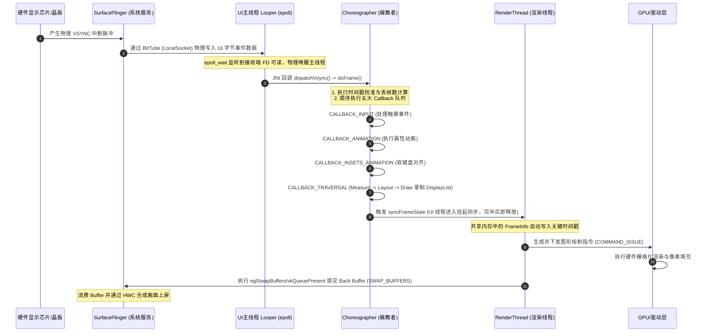
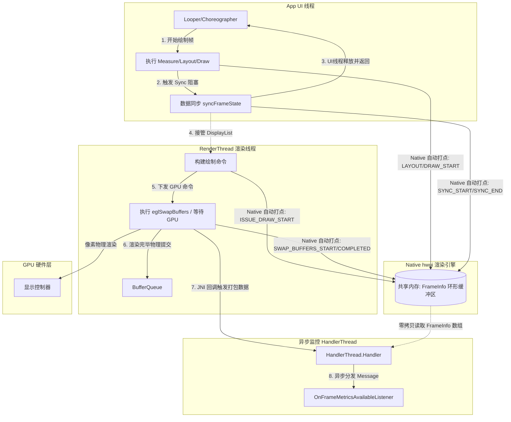

# 5.4.2.3 掉帧分析

在 Android 移动应用开发与性能调优 of 知识体系中，界面流畅度是直接触及用户交互体验生死的重大课题。当用户滑动列表、切换页面或执行转场动画时，如果界面出现肉眼可见的停顿、跳跃或黏滞感，这种现象在工程上被定义为掉帧（Jank / Frame Drop）。要系统性地治理掉帧，必须从屏幕刷新的物理世界出发，深入剖析系统底层的协同渲染管线，并掌握现代化的卡顿掉帧监控手段。

本文将从显示器扫描的物理世界入手，由浅入深地剖析双缓冲、三缓冲的流转状态机与时间解耦机制；走读 `Choreographer` 编舞者与系统 `VSYNC` 协同的 Native 到 Java 层完整时序链条；对比解析三代掉帧监控手段的物理原理；并通过精美的时序流转与架构图帮助读者构建全景认知；最后给出基于 `FrameMetrics` 的生产级异步监控 Kotlin 源码实践与方案对比。

---

## 1. 屏幕刷新物理世界与掉帧成因

要从微观上理解掉帧的物理定义，必须首先将视线投向硬件层面的显示器扫描原理与图像重现机制。

### 1.1 显示器物理扫描与图像重现机制
从阴极射线管（CRT）时代起，屏幕图像的重现就是通过电子枪发射电子束，在偏转线圈的控制下，从屏幕的左上角开始，自左向右、自上而下逐像素、逐行扫描。
*   **行同步信号（HSYNC, Horizontal Synchronization）**：当电子束完成某一行像素的物理扫描后，偏转线圈会使其快速折返至下一行的起点，这个折返的时机由 HSYNC 信号进行物理同步。
*   **场同步信号（VSYNC, Vertical Synchronization）**：当电子束完成全屏最后一行（右下角）的扫描后，需要重新回到屏幕左上角准备开始下一场（帧）的扫描，这一段电子束物理折返的过渡时间窗口被称为**垂直消隐期（Vertical Blanking Interval, VBI）**，而垂直消隐期的起点便由 VSYNC 信号物理定义。

现代液晶显示器（LCD/OLED）虽然不再有物理电子枪的偏转折返，但在其物理驱动芯片（TCON，时序控制器）中，依然严格沿用了这种逐行驱动（Gate Driver）与按列写入（Source Driver）的扫描控制逻辑。VSYNC 信号在现代显示设备中被保留下来，作为面板刷新周期物理对齐的绝对时钟节拍。

### 1.2 物理刷新率与帧预算的数学推导
显示器物理刷新率（Refresh Rate，以赫兹 Hz 为单位）决定了显示面板每秒请求刷新画面的物理频次。与此对应，**帧预算（Frame Budget）**指的是为了保证显示器在每一次 VSYNC 信号到来时都能展示出全新的一帧，CPU 和 GPU 协同计算、录制、渲染、合成这一帧图像所能消耗的最大物理时间上限。

其物理数学推导公式极为简单直观：
$$\text{FrameBudget} = \frac{1000 \text{ ms}}{\text{RefreshRate (Hz)}}$$

在历代 Android 设备的演进中，高刷新率屏幕已成为主流：
*   **60Hz 刷新率**：帧预算为 $\frac{1000}{60} \approx 16.67 \text{ ms}$。
*   **90Hz 刷新率**：帧预算为 $\frac{1000}{90} \approx 11.11 \text{ ms}$。
*   **120Hz 刷新率**：帧预算为 $\frac{1000}{120} \approx 8.33 \text{ ms}$。

随着物理刷新率的提升，每一帧的绝对帧预算在急剧缩短。例如在 120Hz 模式下，留给应用主线程、渲染线程以及 GPU 硬件渲染的全部时间仅为 **8.33 毫秒**。这意味着任何微小的 CPU 线程调度抖动、内存拷贝阻塞或复杂的布局测量，都会直接导致渲染管线崩溃，进而引发掉帧。由于人眼对高刷新率下连续画面中的异常闪烁更加敏感，高刷屏幕下的掉帧往往会带来比 60Hz 屏幕下更加突兀的“卡顿感”。

### 1.3 掉帧（Jank）的微观物理定义
在硬件层面上，显示器的物理扫描刷新是一个绝对恒定的物理时序（由高精度石英晶振控制）。当显示器完成当前场的扫描，进入垂直消隐期并发出 VSYNC 物理信号时，显示控制器（Display Controller）会去读取硬件图形帧缓冲区（FrameBuffer）的指针，试图将最新绘制好的像素数据输出到显示面板上。

如果此时，由于 CPU 在主线程执行了耗时 IO 操作、GPU 正在进行复杂的着色器计算，导致下一帧的像素数据尚未被完全绘制并写入 FrameBuffer 中，显示控制器为了维持物理扫描的连续性，只能强行**将当前已经在前台展示的旧帧数据再次读取并刷新到屏幕上**。

在微观物理现象中，这表现为同一个像素点的状态在两个或多个 VSYNC 周期内保持不变。而在用户的视网膜和视觉皮层成像中，本应平滑运动的物体在屏幕上的物理坐标发生了一次瞬间的“停顿”和随后的“位置突变”（跳跃）。这种在时间轴上空间位移的不连续性，被人类视觉捕获后，即被定义为**掉帧（Jank）**。

### 1.4 双缓冲与屏幕撕裂（Screen Tearing）的物理博弈
在极早期的单缓冲系统（Single Buffering）中，读写共用同一个 FrameBuffer。显示控制器在自上而下读取缓冲区像素进行屏幕刷新的同时，GPU 也在异步地向该缓冲区写入新一帧的数据。由于读取与写入是完全异步且速率不同的物理过程，显示控制器在扫描到屏幕某一行时，该行底部的缓冲区数据已经被 GPU 覆写成了新一帧的数据。这导致屏幕上半部分显示上一帧，下半部分显示新一帧，交界处产生水平方向上的严重切断或位移，称为**屏幕撕裂（Screen Tearing）**。

为了彻底解决撕裂，图形系统引入了**双缓冲机制（Double Buffering）**：
*   **前缓冲区（Front Buffer）**：专门供显示控制器读取，用于屏幕的物理扫描与像素重现。
*   **后缓冲区（Back Buffer）**：专门供 GPU 写入，用于执行图形命令 the physical 物理栅格化与像素渲染。

当 GPU 将 Back Buffer 填满（即一帧渲染完成）后，前后缓冲区会进行物理地址指针的对调，即**缓冲区交换（Buffer Swap）**。然而，双缓冲必须与 VSYNC 信号强行对齐。如果 Buffer Swap 可以在任意时刻发生，一旦交换发生在显示器扫描一帧的中间过程，撕裂依然会产生。因此，图形系统强行规定：**Buffer Swap 只能在收到 VSYNC 物理信号、显示器处于垂直消隐期（VBI）内进行**。这彻底消除了屏幕撕裂，但也为系统引入了“掉帧锁”和“CPU/GPU 饥饿”的副作用。

### 1.5 垂直同步 VSYNC 引入的掉帧锁与 CPU 饥饿
强制 VSYNC 同步消除了撕裂，但在双缓冲架构下，一旦发生掉帧，会引发一系列恶性锁效应：

#### 双缓冲掉帧锁（Double Buffer Lock）与 CPU 饥饿（Starvation）状态机剖析：
假设在一台 60Hz 刷新率的设备上，某一帧由于布局极其复杂，CPU + GPU 的物理绘制耗时达到了 20ms（超过了 16.67ms 的帧预算）：
1.  **VSync 0 周期**：屏幕正在显示 Front Buffer 中的第 0 帧。CPU/GPU 开始向唯一的 Back Buffer 中渲染第 1 帧。
2.  **VSync 1 信号到来**：由于第 1 帧的绘制需要 20ms，此时仅完成了 80%。系统检测到 Back Buffer 未就绪，无法进行 Buffer Swap。屏幕继续强行显示第 0 帧的旧像素（发生第 1 次掉帧）。
3.  **VSync 1 之后的等待期**：在接下来的 16.67ms 周期中，GPU 依然在占用着唯一的 Back Buffer，继续渲染第 1 帧剩余的 20% 数据（耗时约 3.33ms）。在此期间，主线程（CPU）其实已经完成了指令录制，处于完全闲置状态。然而，因为 Front Buffer 正在被显示控制器锁死读取，Back Buffer 正在被 GPU 写入并锁死，**系统中没有任何第三个空闲的 Buffer 可以让 CPU 提前开始第 2 帧的计算**！
4.  **CPU 发生物理饥饿（Starvation）**：CPU 只能被迫处于完全阻塞等待状态，直到下一个 VSYNC 信号到来，触发 Buffer Swap，Back Buffer 被释放，CPU 才能开始第 2 帧的工作。

这导致 CPU 的计算起跑线被严重向后拖拽了近 13.33ms，直接引发后续帧连续掉帧，形成恶性卡顿。

### 1.6 三缓冲（Triple Buffering）的引入与物理空间解耦
为了彻底打破双缓冲下掉帧锁导致的 CPU 物理饥饿，Android 在 [Android 4.1 (Project Butter)](../../../../AndroidVersionChangeLog.md#android-41--412api-16) 中引入了**三缓冲机制（Triple Buffering）**。在 Front Buffer 和唯一 Back Buffer 的基础上，新增了第三个缓冲区：**Third Buffer (或称 Back Buffer B)**。

#### 三缓冲状态机物理流转矩阵（60Hz 场景，以 A、B、C 三个缓冲区为例）：

| 物理时间轴 / 节拍 | 屏幕显示 (Front Buffer) | 后台就绪队列 (Back Buffer A) | CPU/GPU 渲染队列 (Back Buffer B) | 系统核心物理行为 |
| :--- | :--- | :--- | :--- | :--- |
| **VSync 0 到来** | 显示第 0 帧 (Buffer A) | 空闲 (Buffer B) | 渲染第 1 帧 (Buffer B) | 正常起步，CPU/GPU 占用 Buffer B |
| **VSync 1 到来** | **发生超时**，继续显示第 0 帧 (Buffer A) | 渲染未完成 (Buffer B) | 分配空闲 Buffer C，**开始渲染第 2 帧 (Buffer C)** | **打破双缓冲锁**：CPU 不需等待，利用 Buffer C 提前解耦执行下一帧 |
| **VSync 1 ~ 2 期间**| 显示第 0 帧 (Buffer A) | 第 1 帧绘制完毕 (Buffer B 就绪) | 渲染第 2 帧 (Buffer C 仍在计算) | Buffer B 完成渲染等待交换；CPU/GPU 继续利用 Buffer C 工作 |
| **VSync 2 到来** | 物理交换，显示第 1 帧 (Buffer B) | 空闲 (Buffer A 被释放) | 第 2 帧绘制完毕 (Buffer C 就绪) | Buffer A 重新空闲；第 2 帧就绪；**由于三缓冲，CPU 可立刻拿 Buffer A 渲染第 3 帧** |
| **VSync 3 到来** | 物理交换，显示第 2 帧 (Buffer C) | 空闲 (Buffer B 被释放) | 渲染第 3 帧 (Buffer A 仍在计算) | 流水线彻底铺平，消除了因单帧超时引起的后续帧连续掉帧 |

#### 三缓冲的物理极限与雪崩退化分析：
三缓冲的引入本质上是**用空间（额外的显存/内存物理空间）换取时间（CPU/GPU 的完全解耦并行）**。在 CPU 和 GPU 极其繁忙且出现单帧偶发耗时抖动时，三缓冲能够最大化利用物理硬件的并发能力，避免 CPU 因为“等锁/等缓冲”而造成的时间片浪费。

然而，三缓冲并非无限的容量，其物理承载上限依然是三个 Buffer。若 CPU/GPU 的整体负载过重，发生了持续的多帧严重超时（例如：在 60Hz 场景下，每一帧的计算和渲染物理耗时都达到了 35ms 以上），三缓冲的状态机将发生雪崩式退化：
1.  Buffer A 被屏幕锁定显示；Buffer B 已经绘制了第一帧但无法 Swap；Buffer C 正在被 CPU 写入第二帧。
2.  当下一个 VSYNC 信号到来时，由于第二帧的写入和渲染都没完成，系统无法交换，此时三个 Buffer 全部处于锁定占用状态，系统中已无任何多余的空闲缓冲区。
3.  此时，CPU 如果试图开始准备第三帧，它向 Graphic Buffer 生产者队列请求空闲 Buffer（`dequeueBuffer`）时，会被内核强行挂起并阻塞在 `IGraphicBufferProducer::dequeueBuffer` 跨进程 Binder 调用上。
4.  这导致三缓冲系统彻底退化，CPU 再次进入“物理饥饿”状态，其工作时序重新与 VSYNC 信号产生强行锁定绑定。

因此，三缓冲的核心作用是**抚平瞬时的、偶发性的卡顿抖动**，而对于持续的、系统性的超负荷渲染，三缓冲同样会退化为双缓冲的同步阻塞行为。同时，由于它允许 CPU 提前绘制并缓冲最多两帧 we 图像，当用户发起触摸事件（Input Event）时，这些输入事件只会在最新的那一帧中被计算，而该帧前面可能还排着两帧已经渲染好的画面。这会在客观上导致**输入物理延迟（Input Latency）增加一到两个 VSync 周期**。

---

## 2. Choreographer 底层时序与 VSYNC 协同机制

在系统软件层面，`Choreographer`（编舞者）是整个 Android 渲染管线物理时钟的“协调者”和“分发器”。它负责接收底层的 VSYNC 信号，并驱动应用主线程（UI Thread）进行有序的画面绘制。

### 2.1 Choreographer 的核心职责
`Choreographer` 作为一个 ThreadLocal 单例，与应用的主线程 Looper 深度绑定。它的核心职责是：**协调动画（Animation）、输入（Input）、绘制（Drawing）以及窗口 Insets 变化的时序，确保这些 UI 相关动作都以绝对一致的步调在 VSYNC 信号的垂直消隐期内安全触发**。

### 2.2 从 View 触发重绘到申请 VSYNC 的源码调用链
当应用层发起重绘（例如调用 `View.invalidate()` 或 `View.requestLayout()`）时，会沿着 View 树逐级向上回溯，最终交由 Root 节点 `ViewRootImpl` 触发 VSYNC 的物理申请。

#### 详细源码级调用时序流转：
```
[View.invalidate()]
       │
       ▼
[View.invalidateInternal()]
       │
       ▼
[ViewParent.invalidateChild()]
       │
       ▼
[ViewRootImpl.invalidateChildInParent()]
       │
       ▼
[ViewRootImpl.scheduleTraversals()] 
  ├── 1. postSyncBarrier() (投递同步屏障消息，屏蔽普通消息，保障UI异步消息绝对插队优先)
  └── 2. mChoreographer.postCallback(Choreographer.CALLBACK_TRAVERSAL, mTraversalRunnable, ...)
```

#### 走读 `Choreographer.postCallback()` 源码逻辑：
在 `Choreographer` 内部，通过 `postCallbackDelayedInternal()` 方法进行任务的注册与 VSYNC 的物理申请：

```java
private void postCallbackDelayedInternal(int callbackType,
        Object action, Object token, long delayMillis) {
    synchronized (mLock) {
        final long now = SystemClock.uptimeMillis();
        final long dueTime = now + delayMillis;
        // 1. 将任务封装为 CallbackRecord 并插入 mCallbackQueues[callbackType] 的链表队列中
        mCallbackQueues[callbackType].addCallbackLocked(dueTime, action, token);

        if (dueTime <= now) {
            // 2. 如果任务立即执行，则申请 VSYNC 信号
            scheduleFrameLocked(now);
        } else {
            // 3. 延时任务通过 Message 投递，到期后再申请 VSYNC
            Message msg = mHandler.obtainMessage(MSG_DO_SCHEDULE_CALLBACK, action);
            msg.arg1 = callbackType;
            msg.setAsynchronous(true); // 声明为异步消息，不受同步屏障限制
            mHandler.sendMessageAtTime(msg, dueTime);
        }
    }
}
```

在 `scheduleFrameLocked()` 中，如果当前没有处于 `doFrame` 流程，会调用 `scheduleVsyncLocked()`，最终委托给 Native 层的 `DisplayEventReceiver`：

```java
private void scheduleVsyncLocked() {
    if (mRunning) {
        // mDisplayEventReceiver 是 FrameDisplayEventReceiver 的实例，继承自 DisplayEventReceiver
        mDisplayEventReceiver.scheduleVsync();
    }
}
```

### 2.3 DisplayEventReceiver 物理通信与 UNIX Domain Socket 机制
`mDisplayEventReceiver.scheduleVsync()` 在 Native 层对应 `DisplayEventReceiver::scheduleVsync()`。这里存在一个核心的系统架构设计选择：**为什么高频的 VSYNC 信号传递使用 UNIX Domain Socket (LocalSocket) 进行物理跨进程通信，而不是 Binder？**

#### 为什么不使用 Binder？
1.  **协议与线程调度开销**：Binder 是一种为高吞吐、重量级事务（跨进程对象传输、生命周期同步）设计的 IPC 机制。Binder 通信涉及 Binder 线程池的线程唤醒、IPC 数据事务头解析、进程间内存映射（mmap）管理，以及全局 Binder 驱动锁（Mutex）的竞争。
2.  **高频抖动（Latency Jitter）**：VSYNC 信号的频率极高（120Hz 下每 8.33ms 触发一次），而传输的数据极其微小（仅 16 字节的 `DisplayEventReceiver::Event` 结构体，包含事件类型、发生时间戳、帧序号等）。若使用 Binder 进行每次 16 字节的高频同步传递，Binder 线程上下文切换开销将严重蚕食 CPU 算力，且由于多路复用下的锁竞争，其调度时延具有显著的不确定性（抖动），会导致应用无法在微秒级内稳定响应 VSYNC 脉冲。

#### BitTube 与 UNIX Domain Socket 套接字物理包细节：
在 Native 层，`BitTube`（定义在 `libs/gui/BitTube.cpp` 中）是对 UNIX Domain Socket 的高效物理封装。`BitTube` 在初始化时，会调用 Linux 标准套接字 API `socketpair(AF_UNIX, SOCK_SEQPACKET, 0, sockets)`。
*   `AF_UNIX` 声明这是本地 UNIX Domain 通信，数据包无需经过网络协议栈，只在本地内核缓冲区中进行双向或单向高速拷贝。
*   `SOCK_SEQPACKET` 保证了数据传输是有序的、可靠的且具有固定包界限（即每次读取到的必须是一个完整的数据包，不会出现流式传输中的半包或粘包问题）。
*   在传输 VSYNC 事件时，写入端发送的数据是 `DisplayEventReceiver::Event` 结构体，其物理大小固定为 16 或 24 字节。由于大小极其精简，且套接字接收缓冲区（SO_RCVBUF）默认远大于此大小，数据的写操作可以瞬间在 non-blocking（非阻塞）模式下完成。
*   主线程 Looper 在 Native 层的 `pollInner` 阶段，通过将该 socket 的可读 FD 挂载到系统的 `epoll` 内核事件表中。当 SurfaceFlinger 写入数据时，内核通过硬件中断直接调度 CPU，将阻塞在 `epoll_wait` 的 UI 主线程进程从挂起等待队列移动到就绪队列，实现微秒级（Microsecond-level）的超低响应延迟。

### 2.4 UI 主线程 Looper 的 epoll 唤醒与事件分发
在应用进程启动、主线程 Looper 初始化时，Native 层的 `Looper` (基于 C++ 实现的 `android::Looper`) 会通过 `epoll_ctl` 系统调用，将 BitTube 接收端的物理文件描述符（FD）注册 to Looper 的 `epoll` 实例监听列表中。

#### 物理唤醒与回调链路：
1.  主线程没有消息处理时，会在 Native 层的 `pollOnce()` 中通过 `epoll_wait` 阻塞，将 CPU 物理核心释放给系统。
2.  当 SurfaceFlinger 写入 VSYNC 数据到 BitTube 时，内核唤醒处于 `epoll_wait` 阻塞的主线程，主线程的 CPU 物理上下文被立刻恢复。
3.  Native 层 `Looper` 监听到 FD 可读，回调 `DisplayEventReceiver::handleEvent()`。
4.  在 `handleEvent` 中，读取数据并利用 JNI 方法 `dispatchVsync()`，跨越 JNI 边界回调到 Java 层 `DisplayEventReceiver` 的 `onVsync()`。

```java
// DisplayEventReceiver.java 内部 JNI 回调入口
private void dispatchVsync(long timestampNanos, long physicalDisplayId, int frame) {
    onVsync(timestampNanos, physicalDisplayId, frame);
}
```

在 `FrameDisplayEventReceiver`（`Choreographer` 的内部类）的 `onVsync()` 实现中：

```java
@Override
public void onVsync(long timestampNanos, long physicalDisplayId, int frame) {
    mTimestampNanos = timestampNanos;
    mFrame = frame;
    // 将自身作为 Runnable 投递到 FrameHandler 消息队列，或者直接在 Looper 循环中同步执行 doFrame()
    Message msg = Message.obtain(mHandler, this);
    msg.setAsynchronous(true); // 标记为异步消息，拥有同步屏障下的绝对插队特权
    mHandler.sendMessageAtTime(msg, timestampNanos / TimeUtils.NANOS_PER_MS);
}
```

### 2.5 doFrame() 源码深度剖析

当主线程 Looper 从消息队列中取出并分发 `FrameDisplayEventReceiver` 的消息时，会触发 `doFrame(long frameTimeNanos, int frame)` 的物理执行。

#### 2.5.1 时间戳校准的数学公式与动画步长抖动抑制
在 `doFrame` 内部，第一步就是进行物理时间戳的对比与校准：

```java
void doFrame(long frameTimeNanos, int frame) {
    final long startNanos;
    synchronized (mLock) {
        if (!mFrameScheduled) {
            return; // 防重复分发机制
        }
        
        long intendedFrameTimeNanos = frameTimeNanos;
        startNanos = System.nanoTime();
        // 1. 计算当前系统时间与底层传入的物理 VSYNC 时间戳的物理差值
        final long jitterNanos = startNanos - frameTimeNanos;
        
        // 2. 如果差值大于等于当前设备的物理帧间隔（mFrameIntervalNanos）
        if (jitterNanos >= mFrameIntervalNanos) {
            // 说明主线程在前一个周期内被其他耗时消息阻塞了，Looper 响应延迟导致丢帧
            final long lastFrameOffset = jitterNanos % mFrameIntervalNanos;
            // 3. 时间戳重新校准对齐：将时间轴拉回到最接近当前时间的虚拟 VSYNC 节点
            frameTimeNanos = startNanos - lastFrameOffset;
        }
        
        // 4. 保存对齐后的虚拟 VSYNC 时间戳，后续的动画和测量绘制都将以该 frameTimeNanos 为物理基准
        mFrameInfo.setVsync(intendedFrameTimeNanos, frameTimeNanos);
        // ...
    }
}
```

##### 物理合理性推导：
设物理 VSYNC 帧间隔为 $T_{\text{interval}}$（对于 60Hz 而言为 $16.67\text{ms}$，120Hz 对应 $8.33\text{ms}$）。当前 `doFrame` 真正被主线程 Looper 分发并执行的时刻为 $T_{\text{start}}$，底层硬件原本产生 VSYNC 脉冲的物理时间戳为 $T_{\text{vsync}}$。其调度延迟（Jitter）为：
$$\text{Jitter} = T_{\text{start}} - T_{\text{vsync}}$$
当 $\text{Jitter} \ge T_{\text{interval}}$ 时，判定主线程遭遇卡顿，已发生丢帧。Choreographer 引入的校准逻辑为：
$$\text{JitterOffset} = \text{Jitter} \bmod T_{\text{interval}}$$
$$T_{\text{adjusted\_vsync}} = T_{\text{start}} - \text{JitterOffset}$$
系统会将 $T_{\text{adjusted\_vsync}}$ 作为最终的 `FrameTime` 分发给所有的 Callback 队列。

属性动画（Animator）在计算当前帧 of 动画进度时，会使用如下公式：
$$\text{Progress} = \frac{T_{\text{frame}} - T_{\text{start\_anim}}}{\text{Duration}}$$
如果系统不做时间戳对齐，直接使用发生 30ms 卡顿后的 $T_{\text{start}}$ 代替 $T_{\text{frame}}$，则当前帧计算出的动画进度会突然前跳一大步，用户会在卡顿结束的瞬间看到物体发生了大范围的位移瞬移，产生肉眼可见的“跳帧闪烁”。而通过将 $T_{\text{adjusted\_vsync}}$ 强行对齐到最接近当前时间的虚拟 VSYNC 节拍点上，保证了 $T_{\text{frame}}$ 始终以物理帧间隔的整数倍进行平滑步进，从而在最大程度上铺平了卡顿后的动画过渡，抑制了视觉上的步长抖动。

#### 2.5.2 丢帧数计算与警告阈值
紧接着，Choreographer 会根据时间差计算当前这一帧落后了多少个物理 VSYNC 周期：

```java
final long skippedFrames = jitterNanos / mFrameIntervalNanos;
if (skippedFrames >= 1) {
    // 如果丢帧数大于等于设定阈值（默认系统预设为 30 帧）
    if (skippedFrames >= SKIPPED_FRAME_WARNING_LIMIT) {
        Log.i(TAG, "Skipped " + skippedFrames + " frames!  "
                + "The application may be doing too much work on its main thread.");
    }
}
```

#### 2.5.3 五大 Callback 队列的流转顺序与物理职责
在校准完时间并写入 `mFrameInfo` 后，`doFrame` 开始依次回调处理各种 UI 任务。这些任务被严密地划分为五大 Callback 队列，并严格按照物理优先级从前到后串行执行。

##### 1. `CALLBACK_INPUT`（物理输入事件）
*   **职责**：处理用户的 Touch、Key、Trackball 等原始物理输入事件。
*   **物理意义**：必须最先执行，因为用户的交互操作直接决定了 View 的属性状态（例如按下状态、滚动偏移等）。

##### 2. `CALLBACK_ANIMATION`（动画执行）
*   **职责**：触发 `ValueAnimator`、`ObjectAnimator` 以及各类自定义的属性动画更新。
*   **物理意义**：紧随输入事件执行，因为动画更新往往是由前一步的输入事件（如 Drag 触发惯性滑动）或定时器触发的，动画更新后的 View 状态直接影响后面的排版布局。

##### 3. `CALLBACK_INSETS_ANIMATION`（Insets 动画对齐）
*   **职责**：这是在 [Android 11 (API 30)](../../../../AndroidVersionChangeLog.md#android-11api-30) 中引入的全新回调类型。专门用于驱动窗口 Insets（如系统软键盘弹起、下滑）的物理过渡动画。
*   **物理意义**：在 Android 11 之前，软键盘（IME）的弹出和收起动作是系统级的行为，由 `WindowManagerService (WMS)` 和输入法服务在独立的窗口层级中控制。由于应用窗口与 IME 窗口的绘制完全异步，导致应用内输入框上移与软键盘升起的位移在时序上无法对齐，产生严重的黑边、抖动或撕裂感。`CALLBACK_INSETS_ANIMATION` 允许应用主线程通过 `WindowInsetsAnimation.Callback` 深度参与软键盘动画的每一帧生成，在每个 VSYNC 周期内分发软键盘当前的物理渐变位置，使应用内 View 能够与键盘同步计算 TranslationY 并在接下来的 `CALLBACK_TRAVERSAL` 中整体重绘。这保证了软键盘窗口与应用窗口在同一个 VSYNC 周期内物理对齐，实现了完美的像素级同步移动。

##### 4. `CALLBACK_TRAVERSAL`（绘制遍历）
*   **职责**：执行 View 树的 `performMeasure()`、`performLayout()` 和 `performDraw()` 物理遍历。
*   **物理意义**：将前几步确定的 View 状态（输入、动画、Insets 变化）转化为具体的物理物理宽高坐标，并最终录制生成绘图指令 DisplayList。

##### 5. `CALLBACK_COMMIT`（后置提交）
*   **职责**：在这一帧全部 Traversals 执行完毕后，进行一些状态的收尾、多窗口同步状态的物理提交。
*   **物理意义**：它是 VSYNC 周期在 UI 主线程中的最后一个环节，常用于在通知 RenderThread 开始渲染前，完成应用状态的一致性锁死。

#### 2.5.4 CallbackRecord 队列的提取防重入机制
在 `doFrame` 内部，执行每一种 Callback时，都会调用 `doCallbacks(int callbackType, long frameTimeNanos, long frameIntervalNanos)` 方法。该方法的内部设计堪称 Android Framework 并发与防重入设计的典范。

##### `doCallbacks` 核心防重入实现源码走读：
```java
void doCallbacks(int callbackType, long frameTimeNanos, long frameIntervalNanos) {
    CallbackRecord callbacks;
    synchronized (mLock) {
        final long now = SystemClock.uptimeMillis();
        // 1. 从全局队列中，一次性斩断并提取出所有执行时间戳已截止的 Callback 节点
        callbacks = mCallbackQueues[callbackType].extractQueueLocked(now);
        if (callbacks == null) {
            return;
        }
        mCallbacksRunning = true;
        // ...
    }
    
    // 2. 关键设计：释放全局 mLock 锁！在同步代码块外面，循环执行回调链表
    try {
        for (CallbackRecord c = callbacks; c != null; c = c.next) {
            // 执行具体的任务，如 mTraversalRunnable
            c.run(frameTimeNanos); 
        }
    } finally {
        synchronized (mLock) {
            mCallbacksRunning = false;
            // 3. 回收 CallbackRecord 节点到对象复用池
            recycleCallbackLocked(callbacks); 
        }
    }
}
```

##### 为什么要将 `c.run()` 移出 `synchronized` 同步锁？
1.  **防止重入锁死与死锁**：在 `c.run()` 的执行过程中，应用的代码可能会通过反射、第三方库再次向该 `Choreographer` 的同一队列投递新的 `Callback`（例如在动画的 `onAnimationEnd` 回调中开启一个新动画，再次调用 `postCallback`）。如果 `run()` 的执行被包裹在 `synchronized(mLock)` 锁中，新 post 进来的 Callback 在调用 `addCallbackLocked` 时也会试图去获取 `mLock`，这会导致主线程自身发生死锁，或者导致其他并发访问该 `Choreographer` 实例的后台线程被长时间挂起。
2.  **避免并发修改异常（ConcurrentModificationException）**：若在遍历单向链表队列的同时允许新的节点插入同一链表，会导致指针悬空或遍历混乱。`extractQueueLocked` 将满足执行时间的全部节点“一刀切”地提取为一个局部单向链表，使原队列重新变为空闲状态，完美的在无锁环境下实现了链表的安全遍历。

#### 2.5.5 Android 13 之后 Choreographer.FrameData 与多时间线演进：
自 [Android 13 (API 33)](../../../../AndroidVersionChangeLog.md#android-13api-33) 起，Google 对 `Choreographer` 的 `doFrame` 核心参数进行了重构。传统的 `doFrame` 仅接收单一的 `frameTimeNanos` 时间戳，而在 Android 13 中，其改为了接收一个统一封装的 `FrameData` 对象：

```java
// Android 13+ 新版 doFrame 参数
void doFrame(FrameData frameData) {
    // 包含当前帧的起止时间、唯一帧 ID 等
    long frameTimeNanos = frameData.getFrameTimeNanos();
    FrameTimeline[] timelines = frameData.getFrameTimelines();
    // ...
}
```

##### 为什么需要重构引入 `FrameData` 及其时间线数组（FrameTimeline）？
现代 Android 设备不仅支持 90Hz/120Hz 甚至自适应刷新率（LTPO），还在底层普遍采用帧流水线（Frame Pipelining）机制。这意味着，应用的一帧可能在未来不同的时间点被实际显示在屏幕上。
*   `FrameTimeline` 封装了 `vsyncId`、`expectedPresentationTimeNanos`（该帧预期在屏幕上重现的物理时间）以及 `deadlineNanos`（应用必须把这帧数据准备好并提交的最晚截止时间）。
*   这允许应用层（特别是游戏引擎或对时间极其敏感的高画质动效库）去读取多条可能的时间线。系统根据当前的系统负载，提前计算出应用应当在何时“截止渲染”。
*   如果当前负载高，应用可以主动从 `FrameTimelines` 中选择一条延迟时间较长、时间预算较宽的時間线进行数据计算，防止强行按高刷标准渲染而导致连续卡死。这是 Android 在高刷和多速率屏幕时代图形系统精细化演进的重大底层重构。

---

## 3. 三代卡顿掉帧监控手段的物理机制与原原理机制解析

在 Android 系统的演进中，针对界面卡顿与掉帧的监控手段经历了三代技术变革。

### 3.1 第一代：Choreographer.FrameCallback 监控

#### 3.1.1 物理监控机制与数学公式
第一代监控手段通过直接向 `Choreographer` 投递一个 `Choreographer.FrameCallback`，在每一帧的 `CALLBACK_ANIMATION` 执行周期内强行挂钩。当回调触发时，记录当前的物理系统纳秒时间戳，并与上一帧的时间戳进行差值计算。

##### 其数学公式如下：
$$\Delta t = T_{\text{current}} - T_{\text{previous}}$$
$$\text{SkippedFrames} = \max\left(0, \left\lfloor \frac{\Delta t - T_{\text{interval}}}{T_{\text{interval}}} \right\rfloor\right)$$

#### 3.1.2 核心代码实现
```kotlin
class FrameCallbackMonitor : Choreographer.FrameCallback {
    private var lastFrameTimeNanos: Long = 0
    private val frameIntervalNanos = (1000000000L / 60) // 假设物理 60Hz 屏幕
    
    fun start() {
        Choreographer.getInstance().postFrameCallback(this)
    }

    override fun doFrame(frameTimeNanos: Long) {
        if (lastFrameTimeNanos != 0L) {
            val jitterNanos = frameTimeNanos - lastFrameTimeNanos
            val skippedFrames = jitterNanos / frameIntervalNanos
            if (skippedFrames > 1) {
                Log.w("JankMonitor", "检测到掉帧！丢帧数: $skippedFrames, 耗时: ${skippedFrames * 16.67f} ms")
            }
        }
        lastFrameTimeNanos = frameTimeNanos
        // 必须在每一次回调末尾，重新投递自身，以维持不间断的帧监听
        Choreographer.getInstance().postFrameCallback(this)
    }
}
```

#### 3.1.3 第一代监控的三大物理局限性
1.  **非重绘期主线程卡顿盲区**：这是最致命的设计缺陷。`Choreographer.FrameCallback` 触发的前提是，应用进程向 SurfaceFlinger 申请了 VSYNC。**如果界面当前处于静止状态（用户没有操作，且无动画运行），应用就不会执行 scheduleTraversals()**。此时，如果主线程因为后台发起的网络请求、数据库事务同步或锁竞争而卡死了整整 5 秒钟，`doFrame()` 根本不会被调用，这导致监控组件出现“假死”，完全无法感知和上报主线程这 5 秒的致命卡死现场。
2.  **频繁消息投递开销与 GC 压力**：为了维持监听，必须在每一帧的末尾不断地向 `Choreographer` 的 MessageQueue 中投递消息，这会产生大量临时消息对象，在高刷设备上会引发不可忽视的系统 GC 压力与 Looper 消息调度开销。
3.  **缺乏细粒度耗时指标拆解**：第一代监控只能拿到两帧之间的绝对时间差，是一只“黑盒”。它无法告诉开发者这其中有多少时间花在了 Measure/Layout，有多少时间花在了 Draw，又有多少时间是因为 RenderThread 或是 GPU 侧的瓶颈导致的。

#### 3.1.4 补充：基于 Looper.Printer (BlockCanary) 的消息监控与 Heisenbug 痛点
作为第一代监控的延伸，经典的 BlockCanary 利用了 `Looper.setMessageLogging(Printer)` 机制：
*   **物理机制**：主线程 Looper 在分发每一个普通 Message 的 `dispatchMessage` 方法前后，都会打印特定格式的字符串（`>>>>> Dispatching to` 和 `<<<<< Finished to`）。通过注册自定义的 `Printer`，拦截这两段字符串的输出，计算两段日志输出之间的时间差 $\Delta t$。一旦 $\Delta t$ 超过预设阈值（例如 3000ms），则开启子线程高频地向虚拟机请求主线程的调用栈（Thread.dumpStack / Thread.getStackTrace()），从而捕获卡顿现场的调用路径。
*   **物理开销痛点（Heisenbug）**：由于主线程 Looper 处于极高频的消息循环中（每秒可能分发成百上千个微小的 Message），`Printer` 的频繁调用会导致系统底层在 Native 与 Java 之间进行海量的字符串拼接、内存分配与字符输出。这不仅会抢占 CPU 算力，还会导致主线程的 GC 压力剧增。更具破坏性的是，在这种监控状态下，由于监控本身引入的物理开销，原本勉强能够按时完成渲染的应用可能会频繁触发掉帧，从而将“卡顿假象”放大，这种因监控本身而改变被监控系统物理状态的行为在工程中称为 Heisenbug。另外，子线程随机采样主线程调用栈的准确率较低，常会抓取到非核心的等待栈（如 Looper.pollOnce），导致归因混乱。

---

### 3.2 第二代：FrameMetrics (API 24+)

在 [Android 7.0 (API 24)](../../../../AndroidVersionChangeLog.md#android-70--71api-24--25) 中，官方引入了 `FrameMetrics` API，这是硬件加速时代唯一能看清 RenderThread 与 GPU 行为的利器。

#### 3.2.1 硬件加速下 UI 线程与 RenderThread 的解耦原理
在 [Android 5.0 (API 21)](../../../../AndroidVersionChangeLog.md#android-50--51api-21--22]) 引入了 **`RenderThread`（渲染线程）**。
*   **UI 线程**：只负责解析 XML、测量（Measure）、布局（Layout）并构建显示列表（DisplayList），然后通过 `syncFrameState` 操作将 DisplayList 同步给 RenderThread。
*   **RenderThread**：独立运行，负责消耗 UI 线程同步过来的 DisplayList，并与 GPU 驱动通信，执行底层的 OpenGL ES 或 Vulkan 图形指令。
*   一帧的实际渲染生命周期被物理拆解并跨越了两个线程。

#### 3.2.2 共享内存与环形缓冲区的零拷贝零开销物理打点架构
`FrameMetrics` 的底层核心设计是**零开销打点（Zero-Overhead Profiling）**。
*   **Native 共享内存**：在 Native 层的 `hwui` 图形引擎中，为每个 Window 实例维护了一个固定大小的 `FrameInfo` 数组（基于共享内存）。
*   **自动打点**：当一帧在 CPU（UI 线程与 RenderThread）与 GPU 中流转时，硬件加速渲染引擎会在其经过的各个物理节点（例如：帧开始、同步开始、同步结束、指令下发、交换缓冲区等）自动往该共享内存的对应索引中写入高精度的纳秒级时间戳。这个打点过程完全由 Native C++ 引擎自动完成，**不需要在 Java 层进行任何反射或拦截，从而实现了真正的零 CPU 开销与零内存拷贝**。

#### 3.2.3 Native 层 hwui 引擎 FrameInfo 的物理存储与 SwapBuffers 拦截原理：
在 Native 层（`hwui` 库，代码定义在 `frameworks/base/libs/hwui/FrameInfo.h` 中），`FrameInfo` 结构体实际上是一个长度固定的 `int64_t` 长整型数组。当一帧渲染启动后，Native 层的渲染上下文（`CanvasContext`）开始在该数组中进行打点。
对 GPU 等待时间（`SWAP_BUFFERS_DURATION`）的测量，本质上是对图形渲染管线物理提交接口的拦截：
*   当 RenderThread 准备将这一帧画面的 DisplayList 发送给 GPU 驱动时，必须通过 EGL（对应 OpenGL ES 管道的 `eglSwapBuffers`）或 Vulkan WSI 接口（对应 `vkQueuePresentKHR`）来进行物理提交。
*   在调用 `eglSwapBuffers` 前，`CanvasContext` 会立刻读取当前的系统单调物理时钟（通过 `clock_gettime(CLOCK_MONOTONIC)`），写入 `FrameInfoIndex::SwapBuffersStart` 索引中。
*   当 `eglSwapBuffers` 完成了物理交换并返回后，再次读取时钟，写入 `FrameInfoIndex::FrameCompleted`。由于 `eglSwapBuffers` 在物理上会被 GPU 驱动阻塞，直到 GPU 释放出可供写入的 Back Buffer 或者是完成了一定程度的渲染排队（即满足 VSYNC 的同步等待），这部分的物理等待耗时就被精确地记录在 `SWAP_BUFFERS_DURATION` 中。这就为开发者提供了一条洞察 GPU 负载瓶颈和系统合成压力的物理窗口。

#### 3.2.4 9 大纳秒级时间指标的具体物理意义解析

| FrameMetrics 常量 (API 24+) | 物理起止打点节点 | 具体的物理意义说明 |
| :--- | :--- | :--- |
| **`UNKNOWN_DELAY_DURATION`** | `IntendedVsync` -> `Vsync` | **Looper 调度延迟**。从原本应该渲染这一帧的时间，到主线程真正开始处理这一帧的时间差，反映了 Looper 中前一个消息的耗时阻塞程度。 |
| **`INPUT_HANDLING_DURATION`**| `InputStart` -> `InputEnd` | **输入事件处理耗时**。主线程消耗在执行 `onTouchEvent` 等输入事件回调上的总物理时间。 |
| **`ANIMATION_DURATION`** | `AnimationStart` -> `AnimationEnd` | **动画更新耗时**。执行属性动画、ValueAnimator 等动画所消耗的物理时间。 |
| **`LAYOUT_MEASURE_DURATION`**| `MeasureStart` -> `MeasureEnd` | **测量与布局耗时**。执行 View 树 `onMeasure()` 和 `onLayout()` 遍历的总时间。 |
| **`DRAW_DURATION`** | `DrawStart` -> `DrawEnd` | **DisplayList 录制耗时**。执行 `onDraw()` 并将图形指令录制进 `RecordingCanvas` 的时间。 |
| **`SYNC_DURATION`** | `SyncStart` -> `SyncEnd` | **帧同步耗时**。UI 线程挂起，将 DisplayList 和 Bitmap 纹理数据同步拷贝到 RenderThread 的时间。**此时 UI 线程处于阻塞态**。 |
| **`COMMAND_ISSUE_DURATION`** | `IssueStart` -> `IssueEnd` | **指令下发耗时**。RenderThread 读取 DisplayList，生成并向 GPU 驱动程序发送 OpenGL/Vulkan 命令的时间。 |
| **`SWAP_BUFFERS_DURATION`** | `SwapStart` -> `SwapEnd` | **GPU 等待与 Buffer 交换耗时**。RenderThread 将缓冲区提交给系统合成器后，等待 GPU 完成全部渲染工作并释放缓冲区的耗时。**反映了 GPU 负载瓶颈**。 |
| **`TOTAL_DURATION`** | `IntendedVsync` -> `FrameCompleted` | **整帧总物理耗时**。从最初 VSYNC 脉冲发出到 GPU 物理渲染全部完成的完整生命周期时间。 |

#### 3.2.5 Window.OnFrameMetricsAvailableListener 的源码级工作流
当 GPU 完成 Buffer 交换并结束一帧的全部物理渲染后，RenderThread 会触发一个 JNI 回调，将 Native 共享内存中的打点数据打包封装为一个 Java 层的 `FrameMetrics` 对象。
1.  接着，系统使用我们在 Java 层通过 `window.addOnFrameMetricsAvailableListener(listener, handler)` 注册时传入的**异步 Handler**，向该 Handler 绑定的后台线程发送一个包含这帧数据的 Message。
2.  这使得掉帧数据的统计、分析和耗时判定完全脱离了主线程，**在后台 HandlerThread 中异步执行，保证了监控动作本身对应用性能的零干扰**。

---

### 3.3 第三代：Android 官方卡顿库 Jetpack JankStats 原理

随着移动应用复杂度的增加，原生 `FrameMetrics` 的两个物理局限性暴露了出来：
1.  **非 Activity 窗口监控盲区**：原生的 `FrameMetrics` 必须显式绑定在某个 `Window` 实例上。但在一个现代应用中，屏幕上可能同时存在多个 `Window`（例如：Dialog 弹窗、PopupWindow、悬浮窗、Toast 等）。如果仅对 `Activity.getWindow()` 注册监听，开发者将完全遗漏弹窗滑动或弹出时的卡顿数据。
2.  **缺乏业务上下文归因能力**：仅仅知道某一帧耗时了 50ms 是没有意义的，线上排查卡顿需要知道这 50ms 发生时，应用正在执行什么业务操作（如“正处于 Feed流滑动中”或“正在播放转场动画”）。

为了解决这些痛点，Jetpack 库中推出了第三代监控利器：`JankStats`。

#### 3.3.1 解决非 Activity 窗口监控痛点
`JankStats` 的物理底座依然是 `FrameMetrics`，但在初始化时，它利用了 `Window.Callback` 的动态代理模式（Proxy Pattern）：
*   **Window 动态捕获**：通过拦截应用中所有 `Window` 的创建行为，当 Dialog、PopupWindow 等新窗口被物理挂载到系统的 WindowManager 时，`JankStats` 会自动截获该窗口，并对其注册独立的 `OnFrameMetricsAvailableListener`，从而消除了多 Window 场景下的所有监控盲区。

#### 3.3.2 基于 PerformanceMetricsState 的 UI 状态绑定归因原理与并发无锁设计
`JankStats` 内部引入了 `PerformanceMetricsState`（性能度量状态机管理器）。为了保证状态绑定与查询本身对应用主线程的零干扰，该管理器采用了一套**并发无锁双重状态缓冲区（Lock-Free Concurrent Design）**：
*   **状态存储**：`PerformanceMetricsState` 底层维护了一个包含高精度纳秒级时间戳的并发跳表（`ConcurrentSkipListMap`）或者线程安全的双向队列，记录了每一次业务状态 `putState` 与 `removeState` 发生时的精确物理系统时间。
*   **物理关联归因**：当后台线程的 `FrameMetrics` 回调被触发时，`JankStats` 内部的状态调度器会在后台 HandlerThread 中将该帧的 `IntendedVsync` 和 `FrameCompleted` 时间范围作为过滤窗口，在状态链表中进行高精度的二分检索或时间交叉比对。它将在此时间跨度内依然处于“Active”状态的所有业务 Context 键值对提取出来，与掉帧数据合并生成一份包含**物理耗时指标 + 业务卡顿现场**的完整日志。
*   **状态聚类归因**：这种架构使得我们可以在后台服务器对海量的线上掉帧日志进行多维度的聚类分析。例如，可以通过如下数学模型，计算特定 UI 状态下卡顿发生的概率（卡顿率）：
    $$P(\text{Jank} \mid \text{State} = S) = \frac{N_{\text{Jank\_Frames\_with\_State\_S}}}{N_{\text{Total\_Frames\_with\_State\_S}}}$$
    这能帮助架构师瞬间揪出哪些业务场景（如：“State = LiveRoom_EnterAnimation”）才是吞噬 CPU 算力并导致大面积卡顿的“元凶”。

---

## 4. 渲染时序与物理架构图

### 4.1 物理 VSYNC 中断到 SurfaceFlinger 渲染提交完整时序流转图
下图详细展示了从底层硬件发生 VSYNC 中断，到 BitTube 通信唤醒 Looper，再到 Choreographer 队列式回调，以及最终由 RenderThread 同步并提交给 SurfaceFlinger 合成的完整物理时序：



---

### 4.2 FrameMetrics 底层共享内存打点与异步传递架构图
下图展示了 `FrameMetrics` 底层如何在 UI 线程、RenderThread 之间利用 Native 共享内存进行物理打点，并通过异步后台线程向应用层回调数据的物理架构：



---

## 5. 工程实践：利用 FrameMetrics 异步监控掉帧

在实际的生产环境中，要实现零主线程开销的掉帧监控，必须借助 `FrameMetrics` API。以下是实现的一个具备高精度、防内存泄漏、自动生命周期注册以及后台线程解耦的 `FrameMetricsMonitor` 完整 Kotlin 源码：

```kotlin
package com.android.knowledge.performance

import android.app.Activity
import android.app.Application
import android.os.Build
import android.os.Bundle
import android.os.Handler
import android.os.HandlerThread
import android.util.Log
import android.view.FrameMetrics
import android.view.Window
import androidx.annotation.RequiresApi
import java.lang.ref.WeakReference

/**
 * 生产级掉帧监控器：利用 FrameMetrics 实现零拷贝、零主线程干扰的异步卡顿打点。
 * 适配 API 24 以上硬件加速设备，自动绑定 Activity 生命周期，防止内存泄漏。
 */
@RequiresApi(Build.VERSION_CODES.N)
class FrameMetricsMonitor private constructor() : Application.ActivityLifecycleCallbacks {

    companion object {
        private const val TAG = "FrameMetricsMonitor"
        private const val THREAD_NAME = "frame-metrics-collector"
        
        @Volatile
        private var instance: FrameMetricsMonitor? = null

        fun getInstance(): FrameMetricsMonitor {
            return instance ?: synchronized(this) {
                instance ?: FrameMetricsMonitor().also { instance = it }
            }
        }
    }

    // 后台异步 HandlerThread，负责脱离主线程接收并分析掉帧数据
    private var handlerThread: HandlerThread? = null
    private var backgroundHandler: Handler? = null

    // 强绑定当前窗口的 Listener，用于生命周期解绑时防止引用泄漏
    private val metricsListeners = HashMap<Int, Window.OnFrameMetricsAvailableListener>()

    /**
     * 开启掉帧监控系统，必须在 Application.onCreate() 中调用
     */
    fun start(application: Application) {
        if (handlerThread == null) {
            handlerThread = HandlerThread(THREAD_NAME).apply {
                start()
                backgroundHandler = Handler(looper)
            }
        }
        // 自动注册全局 Activity 生命周期回调
        application.registerActivityLifecycleCallbacks(this)
        Log.i(TAG, "FrameMetrics 监控系统初始化成功。")
    }

    /**
     * 停止监控系统并释放后台线程
     */
    fun stop(application: Application) {
        application.unregisterActivityLifecycleCallbacks(this)
        handlerThread?.quitSafely()
        handlerThread = null
        backgroundHandler = null
        metricsListeners.clear()
        Log.i(TAG, "FrameMetrics 监控系统已停止。")
    }

    override fun onActivityCreated(activity: Activity, savedInstanceState: Bundle?) {}

    override fun onActivityStarted(activity: Activity) {
        val window = activity.window ?: return
        val handler = backgroundHandler ?: return
        val activityHashCode = activity.hashCode()

        // 动态获取当前设备的屏幕物理刷新率，用以实时计算帧预算
        val refreshRate = if (Build.VERSION.SDK_INT >= Build.VERSION_CODES.R) {
            // Android 11+ 优先使用 Display.getMode().getRefreshRate() 适应 LTPO 动态高刷变化
            activity.display?.mode?.refreshRate ?: 60f
        } else {
            @Suppress("DEPRECATION")
            window.windowManager.defaultDisplay.refreshRate
        }
        
        // 帧预算 (毫秒) = 1000 / 物理刷新率
        val frameBudgetMs = 1000f / refreshRate
        val activityName = activity.javaClass.simpleName

        // 创建专属的 FrameMetricsListener，防止直接引用 Activity 导致内存泄漏
        val weakActivity = WeakReference(activity)
        val metricsListener = Window.OnFrameMetricsAvailableListener { _, frameMetrics, _ ->
            val act = weakActivity.get()
            if (act != null) {
                // 执行异步掉帧分析
                analyzeFrame(act, activityName, frameMetrics, frameBudgetMs)
            }
        }

        // 保存监听器实例，便于在 onActivityStopped 中安全解绑
        metricsListeners[activityHashCode] = metricsListener
        
        // 向 Window 注册监听，指定由 backgroundHandler 对应的 HandlerThread 异步接收数据
        window.addOnFrameMetricsAvailableListener(metricsListener, handler)
    }

    override fun onActivityResumed(activity: Activity) {}

    override fun onActivityPaused(activity: Activity) {}

    override fun onActivityStopped(activity: Activity) {
        val window = activity.window ?: return
        val activityHashCode = activity.hashCode()
        val listener = metricsListeners.remove(activityHashCode)
        if (listener != null) {
            try {
                // 安全解绑，彻底切断 window -> listener -> HandlerThread 的引用链条，防止内存泄漏
                window.removeOnFrameMetricsAvailableListener(listener)
            } catch (e: Exception) {
                Log.e(TAG, "安全解绑 FrameMetrics 失败", e)
            }
        }
    }

    override fun onActivitySaveInstanceState(activity: Activity, outState: Bundle) {}

    override fun onActivityDestroyed(activity: Activity) {}

    /**
     * 核心掉帧分析逻辑，运行在后台 HandlerThread 中，绝对无主线程开销
     */
    private fun analyzeFrame(
        activity: Activity,
        activityName: String,
        frameMetrics: FrameMetrics,
        frameBudgetMs: Float
    ) {
        // 1. 获取整帧总物理耗时（单位：纳秒）
        val totalNs = frameMetrics.getMetric(FrameMetrics.TOTAL_DURATION)
        val totalMs = totalNs / 1_000_000f

        // 2. 判断该帧总耗时是否超出了当前屏幕的物理帧预算（如 60Hz 超过 16.67ms，120Hz 超过 8.33ms）
        if (totalMs > frameBudgetMs) {
            // 触发掉帧/卡顿判定，从 FrameMetrics 中提取 6 大核心物理耗时指标
            
            // Looper 调度延迟（VSYNC 到了但主线程 Looper 没空响应）
            val unknownDelayNs = frameMetrics.getMetric(FrameMetrics.UNKNOWN_DELAY_DURATION)
            // 输入事件处理耗时
            val inputNs = frameMetrics.getMetric(FrameMetrics.INPUT_HANDLING_DURATION)
            // 动画执行耗时
            val animNs = frameMetrics.getMetric(FrameMetrics.ANIMATION_DURATION)
            // 布局测量（Measure + Layout）耗时
            val layoutMeasureNs = frameMetrics.getMetric(FrameMetrics.LAYOUT_MEASURE_DURATION)
            // 渲染指令录制（Draw -> DisplayList）耗时
            val drawNs = frameMetrics.getMetric(FrameMetrics.DRAW_DURATION)
            // 帧数据向 RenderThread 同步耗时（UI主线程在此同步期间会被挂起阻塞）
            val syncNs = frameMetrics.getMetric(FrameMetrics.SYNC_DURATION)
            // RenderThread 向 GPU 驱动发送渲染指令耗时
            val commandIssueNs = frameMetrics.getMetric(FrameMetrics.COMMAND_ISSUE_DURATION)
            // GPU 物理渲染与 Buffer 交换耗时（反映显卡物理负载压力）
            val swapBuffersNs = frameMetrics.getMetric(FrameMetrics.SWAP_BUFFERS_DURATION)

            // 将所有纳秒值转换为毫秒值，便于可读性输出与日志监控
            val unknownDelayMs = unknownDelayNs / 1_000_000f
            val inputMs = inputNs / 1_000_000f
            val animMs = animNs / 1_000_000f
            val layoutMeasureMs = layoutMeasureNs / 1_000_000f
            val drawMs = drawNs / 1_000_000f
            val syncMs = syncNs / 1_000_000f
            val commandIssueMs = commandIssueNs / 1_000_000f
            val swapBuffersMs = swapBuffersNs / 1_000_000f

            // 计算丢失的物理帧数
            val skippedFrames = (totalMs / frameBudgetMs).toInt()

            // 格式化输出掉帧的微观物理指标日志
            Log.w(
                TAG,
                """
                === ⚠️ 检测到卡顿掉帧 [Activity: $activityName] ===
                整帧总耗时: ${String.format("%.2f", totalMs)} ms (物理帧预算: ${String.format("%.2f", frameBudgetMs)} ms, 约丢失 $skippedFrames 帧)
                [1] Looper调度延迟: ${String.format("%.2f", unknownDelayMs)} ms
                [2] 输入事件耗时:   ${String.format("%.2f", inputMs)} ms
                [3] 动画更新耗时:   ${String.format("%.2f", animMs)} ms
                [4] 布局与测量耗时: ${String.format("%.2f", layoutMeasureMs)} ms
                [5] 指令录制(Draw):  ${String.format("%.2f", drawMs)} ms
                [6] 数据同步(Sync):  ${String.format("%.2f", syncMs)} ms (UI主线程阻塞终点)
                [7] RT命令下发:     ${String.format("%.2f", commandIssueMs)} ms
                [8] GPU渲染&交换:    ${String.format("%.2f", swapBuffersMs)} ms (GPU瓶颈/SurfaceFlinger压力)
                -------------------------------------------------
                """.trimIndent()
            )
            
            // 【工程拓展提示】: 此处可以将格式化后的卡顿日志异步上传至线上 APM 卡顿治理后台，
            // 结合当前应用的 Activity 页面名称，实现大规模线上卡顿的精准统计与按耗时阶段的漏斗过滤。
        }
    }
}
```

---

## 6. 方案对比表格与总结

下表从多个物理和工程维度，对比了 Android 发展至今的主流卡顿监控方案：

### 6.1 四大卡顿监控方案对比矩阵

| 物理与工程评估维度 | 第一代 Choreographer.FrameCallback | 经典 Looper.Printer (BlockCanary) | 第二代 FrameMetrics (API 24+) | 第三代 Jetpack JankStats |
| :--- | :--- | :--- | :--- | :--- |
| **监控精度（Time Precision）** | 中等（仅能估算整帧差值） | 低（仅能检测 Looper 分发耗时） | **极高（纳秒级 9 大指标精确拆解）** | **极高（纳秒级 9 大指标精确拆解）** |
| **主线程开销（Main Thread Overhead）**| 较高（每帧需频繁投递/产生消息）| 中等（大量 String 拼接与日志写入开销）| **无（Native 层自动打点，无感）** | **无（Native 层自动打点，无感）** |
| **非重绘期卡顿盲区** | **有**（界面静止无 VSYNC 申请时失效） | 无（依靠 Looper 消息循环监听） | **有**（无 VSYNC 时不触发回调） | **有**（无 VSYNC 时不触发回调） |
| **RenderThread/GPU 监控能力** | 无（完全黑盒） | 无（完全黑盒） | **有（能精确反映 GPU/Swap 耗时）** | **有（能精确反映 GPU/Swap 耗时）** |
| **多 Window (Dialog/PopupWindow) 支持**| 仅限手动绑定 Window | 自动监听所有主线程 Looper 消息 | 仅限手动绑定 Window | **自动（内部实现 Window 监听代理）**|
| **业务状态上下文绑定归因** | 无 | 无 | 无 | **有（支持 PerformanceMetricsState）**|
| **系统版本兼容水位线** | Android 4.1+ (API 16) | Android 4.0+ (API 14) | [Android 7.0 (API 24)](../../../../AndroidVersionChangeLog.md#android-70--71api-24--25) | Android 7.0+ (API 24，旧版本退化) |

### 6.2 总结：掉帧治理的体系化思路
在移动端性能治理的物理世界中，没有任何一种监控方案能够完全覆盖所有的卡顿盲区。因此，科学的掉帧治理应当采取**组合拳**的策略：

1.  **对于线上大规模监控**：应首选基于 `FrameMetrics` 物理打点的 **Jetpack JankStats**，利用其零主线程干扰和业务上下文归因能力，在不增加线上 GC 和 CPU 开销的前提下，获取包含特定业务场景的掉帧占比，快速发现线上卡顿高频页面。
2.  **对于主线程严重卡死（ANR 级）的监控**：必须结合基于 **Looper.Printer**（或子线程 Looper 轮询）的方案，在主线程静止且无重绘时，依然能够监控非渲染期的主线程挂起事件，收集主线程的 Native/Java 调用栈以进行线下排查。
3.  **对于卡顿发生后的微观诊断**：应通过 Systrace 或 Perfetto，还原 UI 线程与 RenderThread 的物理流水线，查看是否因三缓冲满载导致的输入延迟，或者是否在 RenderThread 侧产生了因大 Bitmap 纹理上传导致的 `syncFrameState` 长时间阻塞，进而实现“监控发现 -> 耗时归因 -> 指标定位 -> 物理优化”的完整性能闭环。
