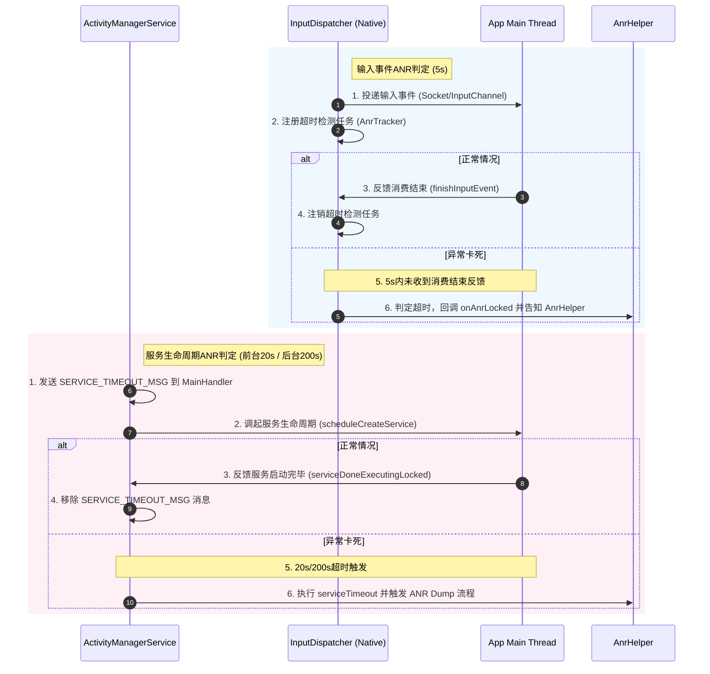
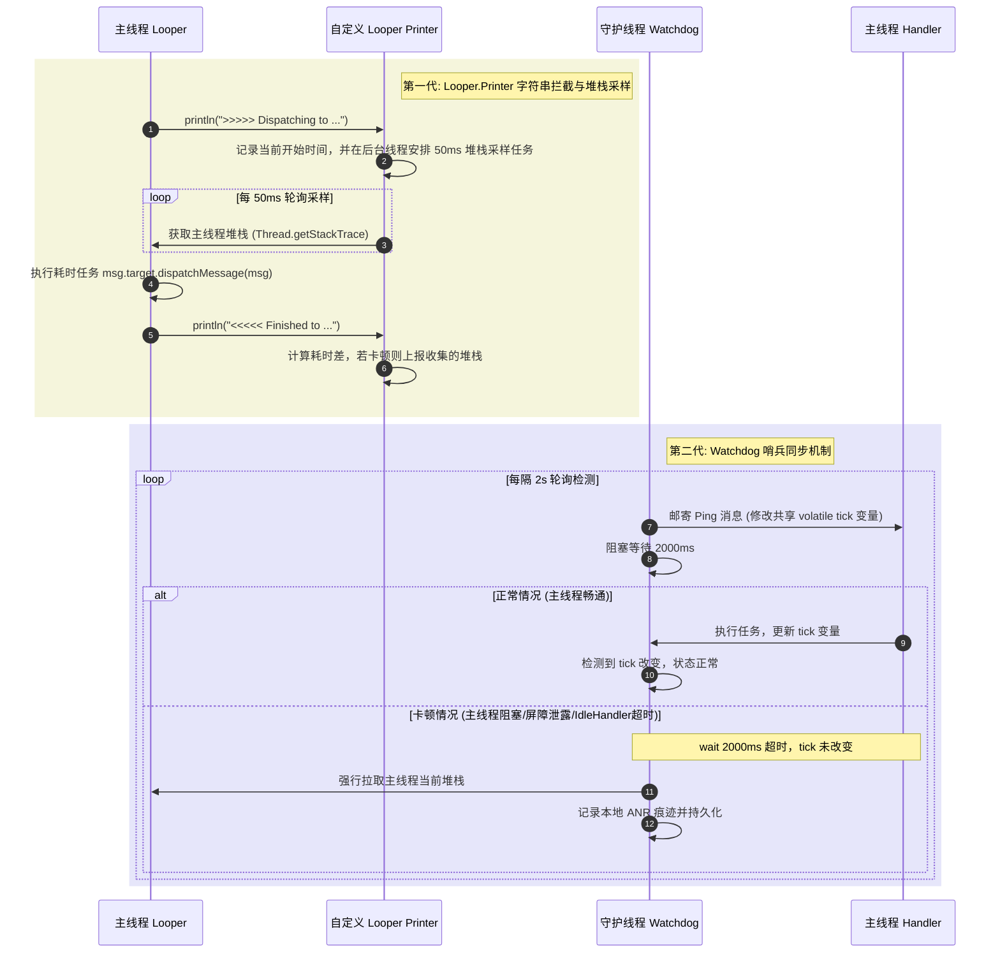
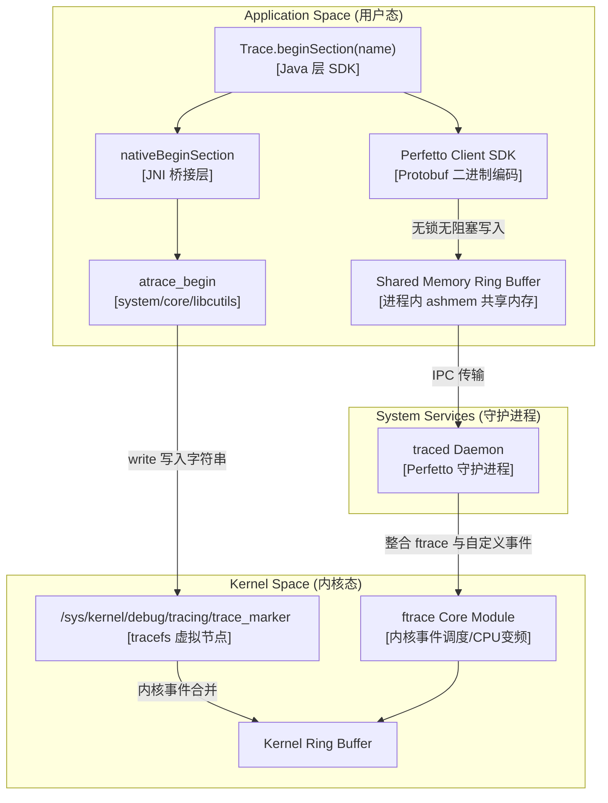

# 主线程耗时与卡顿优化

在 Android 性能优化领域，主线程耗时（Main Thread Block）是导致系统卡顿、掉帧以及 ANR（Application Not Responding）的最核心诱因。本篇文档将从物理瓶颈、系统 ANR 判定内核、StrictMode 拦截机制、三代线上卡顿监控方案设计、以及 Systrace/Perfetto 底层原理等维度，解密 Android 主线程耗时的底层机制与治理方案。

---

## 1. 主线程“黄金单线程模型”的物理瓶颈与 ANR 底层原理

### 1.1 为什么 Android UI 操作被限制在主线程？
Android 的 GUI 系统采用了经典的“黄金单线程模型”（Single Thread Model）。在框架设计中，所有对 View 树的修改（如更新文本、修改大小、请求重新布局等）都必须 in 主线程中进行。这一设计并非设计者随意为之，而是基于底层图形总线渲染架构和并发控制的深层考量，主要解决以下两个核心物理瓶颈：

#### 1.1.1 多线程并发修改 View 树导致的图形缓冲区总线死锁与 WMS 同步竞态
Android 的屏幕渲染本质上是应用进程与系统服务进程（如 `WindowManagerService`，简称 WMS）以及底层渲染引擎（`SurfaceFlinger`）共同协作的物理过程。
* **View 树的拓扑一致性瓶颈**：一个 Activity 的界面由复杂的 View 树构成（以 `ViewRootImpl` 为根节点）。在渲染一帧时，主线程需要依次遍历这棵树进行测量（`measure`）、布局（`layout`）和绘制（`draw`）。如果允许工作线程并发修改 View 树的拓扑结构（例如线程 A 正在删除一个子 View，而主线程正在进行 Layout 测量），将导致 View 树状态撕裂。
* **物理缓冲区死锁（BufferQueue Deadlock）与跨进程图形总线交互**：
  在底层的 Android 图形系统中，UI 的渲染结果最终会写入由 `Surface` 包装的 `GraphicBuffer` 中。这个 `GraphicBuffer` 是通过 `Binder` 与系统服务 `WindowManagerService` 以及 `SurfaceFlinger` 跨进程共享的。
  在图形传递模型中，底层通过 `BufferQueue` 机制管理图形缓冲区。`BufferQueue` 本质上是一个经典的生产者-消费者队列：应用进程充当生产者（`IGraphicBufferProducer`），`SurfaceFlinger` 充当消费者（`IGraphicBufferConsumer`）。
  `GraphicBuffer` 在其生命周期中会经历四个核心状态：
  1. **`FREE`**：缓冲区空闲，可供应用进程申请。
  2. **`DEQUEUED`**：应用调用 `dequeueBuffer()` 申请到了该缓冲区，此时该缓冲区正由应用主线程或 `RenderThread` 进行软件绘制或 GPU 渲染。
  3. **`QUEUED`**：应用绘制完毕，调用 `queueBuffer()` 将缓冲区放入队列，等待 `SurfaceFlinger` 消费。
  4. **`ACQUIRED`**：`SurfaceFlinger` 调用 `acquireBuffer()` 锁定缓冲区，执行硬件合成（HWC）及屏幕刷新。
  
  如果允许多线程并发修改 UI 树，那么多个工作线程在并发执行绘制时，会同时向底层服务发起 `dequeueBuffer()` 或 `queueBuffer()` 的跨进程 Binder 交互。当多线程并发锁定同一个 `Surface` 时，不仅会导致底层共享内存的读写锁冲突（总线死锁 Bus Deadlock），更会导致 `BufferQueue` 状态机逻辑发生错乱（例如在 `DEQUEUED` 状态下再次被另一个线程 `dequeue`），从而导致底层的 `Gralloc` 内存池资源死锁。
* **WMS 窗口状态机竞态与 BLAST 架构限制**：
  在现代 Android 版本（如 [Android 12/13](file:///Users/lizhiyang/Desktop/AndroidKnowledge/AndroidVersionChangeLog.md#android-12api-31)）中，系统全面推行了 **BLAST (BufferQueue Layer AS Transaction) 架构**。
  在 BLAST 架构下，`ViewRootImpl` 并不直接将缓冲区提交给 `BufferQueue` 通信，而是将所有的图形缓冲区变更（包括尺寸缩放、位置移动、裁切）封装在 `SurfaceControl.Transaction` 事务中，通过 WMS 将其发送给 SurfaceFlinger 进行同步合并。
  这一设计的目的是强制保证多个窗口（如 StatusBar, NavigationBar 以及 App 窗口）之间的像素同步，避免多窗口缩放、横竖屏旋转切换时的画面黑边与撕裂。
  然而，这套事务机制由 WMS 维护着一套强同步事务状态机（WMS Sync Transaction State Machine）。如果主线程在执行 Traversals 时，因为多线程修改 UI 导致 WMS 的状态事务同步超时（通常系统容忍上限为 5 秒），WMS 会直接挂起当前应用进程并抛出事务同步超时异常，直接引发系统级 ANR。
  更深层次上，在 BLAST 机制中，主线程需要调用 `BLASTBufferQueue::syncNextTransaction()` 将当前的 Buffer 提交与 Transaction 进行强绑定。若此时主线程被其他慢操作抢占，或者同步栅栏被挂起，应用进程在 native 层会陷入 `waitForTransaction()` 的无限期挂起状态，导致后续所有消息堆积并触发 ANR。

#### 1.1.2 绘制全链路与 RenderThread 同步开销机制
在 Android 5.0（API 21）中，系统引入了 `RenderThread`（渲染线程），专门负责向 GPU 提交绘制指令。关于该版本的变更信息，可参见 [AndroidVersionChangeLog.md#android-50--51api-21--22](file:///Users/lizhiyang/Desktop/AndroidKnowledge/AndroidVersionChangeLog.md#android-50--51api-21--22)。
虽然引入了 `RenderThread` 以减轻主线程在光栅化和纹理上传方面的负担，但主线程和 `RenderThread` 之间依然存在极其紧密的同步机制：
1. **构建 DisplayList**：主线程在执行 `ViewRootImpl.performTraversals()` 时，遍历 View 树，执行 `draw()` 方法，并把所有的绘制操作记录在一个 `DisplayList`（显示列表）中。
2. **同步渲染数据（Sync Frame Data）**：当主线程构建好这一帧的 `DisplayList` 后，会将其打包并向 `RenderThread` 发起同步请求。这个过程在 native 层由 `DrawFrameTask` 完成。
3. **主线程挂起等待**：在同步开始时，主线程会调用 `DrawFrameTask::run()`，并通过同步锁挂起（Block）自己，等待 `RenderThread` 完成当前这一帧的同步（`syncFrameState`）。
4. **渲染线程工作与唤醒**：`RenderThread` 在接收到主线程 of DisplayList 后，更新 native 层的渲染树信息，执行 hardware 硬件绘制。一旦数据更新同步完毕，`RenderThread` 会发送信号唤醒（Unblock）主线程。

这种机制意味着，如果 GPU 驱动发生阻塞、显存带宽吃紧，或者 `RenderThread` 正在忙于编译复杂的着色器（Shader Compilation），导致 `RenderThread` 执行 `syncFrameState` 耗时过长，主线程也会在 `DrawFrameTask` 的同步节点上被强行卡死。因此，主线程的耗时不仅取决于其自身的计算，还与 `RenderThread` 乃至底层硬件总线的反馈效率深度绑定。

---

### 1.2 主线程耗时与 Looper 消息阻塞的本质
主线程的运行生命周期本质上是一个由 `Looper.loop()` 驱动的无限死循环。主线程通过 `MessageQueue.next()` 从消息队列中提取消息。如果队列为空，主线程会通过 Linux 内核的 `epoll_wait` 挂起（在 Native 层阻塞在 eventfd 上），释放 CPU 时间片；一旦收到 Binder 驱动、输入设备或定时器的唤醒信号，主线程被唤醒并开始处理消息。

所有与用户交互相关的动作，包括：
1. **Activity/Fragment 生命周期回调**（如 `onCreate`、`onResume`、`onPause`）；
2. **View 树的构建与渲染**（如 `measure`、`layout`、`draw`）；
3. **输入事件分发**（如屏幕触摸 `TouchEvent`、物理按键 `KeyEvent`）；
4. **系统组件交互**（如广播分发 `onReceive`、服务生命周期 `onStartCommand`）。

最终都会被封装成 `Message` 投递到 `MessageQueue`，由主线程调用 `msg.target.dispatchMessage(msg)` 顺序执行。

如果某一个消息在执行时，由于发生**主线程磁盘 I/O**、**同步 Binder 调用（IPC 阻塞）**、**密集型反射运算**或**代码死锁**，导致该消息的执行时间过长，主线程将无法返回到 `Looper` 循环中去执行下一个就绪的消息。排在队列后方的输入消息、渲染消息就会被严重积压，导致界面迟迟无法刷新（掉帧卡顿），一旦超时时间达到阈值，便会触发系统级的 ANR 异常。

---

### 1.3 系统 ANR 的物理判定指标与源码级流程
当应用发生卡顿且超时达到系统容忍的上限时，系统服务会判定该进程为“无响应”状态并触发 ANR。ANR 的本质是一种系统级的“定时炸弹”超时监控机制。当系统向应用进程分发某个任务时，会在系统侧（如 `ActivityManagerService` 或 `InputDispatcher`）启动一个定时器；如果应用在限定时间内完成了任务并向系统反馈了 Ack 信号，系统就会将定时器拆除；否则，定时炸弹爆炸，触发 ANR Dump 流程。

下面深入 Android 源码级别，解密四大 ANR 判定机制的底层逻辑。



#### 1.3.1 输入超时 ANR（Input Dispatch Timeout）：5s
* **判定指标**：当输入事件（如点击、滑动、按键）分发给应用焦点窗口时，如果该事件在 **5秒** 内没有被应用消费完毕，或者在有新事件到来时，前一个事件尚未分发完毕，就会触发 Input ANR。
* **源码执行路径**：
  1. 底层输入服务位于 Native 层的 `frameworks/native/services/inputflinger/dispatcher/InputDispatcher.cpp`。
  2. 当 `InputDispatcher` 收到事件后，在 `InputDispatcher::dispatchOnceInnerLocked` 中寻找焦点窗口，并调用 `InputDispatcher::dispatchEventLocked`，通过以 Socket 形式建立 of `InputChannel` 将事件写入，投递给应用进程的 `ViewRootImpl`（其内部有 `InputEventReceiver` 监听 Socket fd 可读）。
  3. 与此同时，`InputDispatcher` 内部的 `AnrTracker` 会记录该分发事件的超时时间戳（分发时间 + 5000ms）。
  4. 如果应用主线程顺利处理完该输入事件，会调用 `InputEventReceiver.finishInputEvent()`，该方法通过 JNI 跨越用户态向 Socket 写入 Ack 信号。`InputDispatcher` 进而在 `InputDispatcher::handleReceiveCallback` 中接收到信号并移除对应的超时任务。
  5. 若主线程卡死，5s 内未发送 Ack 信号，`InputDispatcher` 内部在下一次循环中通过 `AnrTracker` 发现超时，触发 `InputDispatcher::onAnrLocked`。
  6. 通过 JNI 回调到 Java 层的 `InputManagerService`，最终调用 `ActivityManagerService.AnrHelper` 的 `appNotResponding` 方法，收集该进程的堆栈（发出 `SIGQUIT` 信号）。

#### 1.3.2 广播超时 ANR（BroadcastReceiver Timeout）：前台 10s / 后台 60s
* **判定指标**：在主线程中注册或声明的 `BroadcastReceiver.onReceive()` 执行时间超时。前台广播超时时间为 **10秒**，后台广播超时时间为 **60秒**（在某些存在积压的后台慢队列下，特定设备或版本可能根据队列长度和策略有所放宽，但核心判定逻辑依然是 10s/60s 延时消息）。有关不同 Android 版本的广播分发演进，可参见 [AndroidVersionChangeLog.md#android-16api-36](file:///Users/lizhiyang/Desktop/AndroidKnowledge/AndroidVersionChangeLog.md#android-16api-36) 的广播优先级与队列优化说明。
* **源码执行路径**：
  1. 位于 `frameworks/base/services/core/java/com/android/server/am/BroadcastQueue.java`。
  2. 当广播队列分发串行广播时，会调用 `processNextBroadcastLocked` 寻找合适的接收者。
  3. 在分发广播给应用进程前，调用 `setBroadcastTimeoutLocked`。该方法向 AMS 内部的 Handler 发送一个延迟的 `BROADCAST_TIMEOUT_MSG` 消息。
  4. 应用进程的主线程被 Binder 唤醒，调用 `BroadcastReceiver.onReceive()`。
  5. 执行完毕后，应用进程调用 `ActivityManager.getService().finishReceiver()` 跨进程通知 AMS。
  6. AMS 收到通知，调用 `cancelBroadcastTimeoutLocked` 清除该 `BROADCAST_TIMEOUT_MSG` 消息。
  7. 若主线程耗时导致 `finishReceiver` 未按时调用，`BROADCAST_TIMEOUT_MSG` 消息被消费，触发 `broadcastTimeoutLocked`，判定 ANR。

#### 1.3.3 服务超时 ANR（Service Timeout）：前台服务 20s / 后台服务 200s
* **判定指标**：Service 的各个生命周期方法（如 `onCreate`、`onStartCommand`、`onBind`）在主线程中执行超时。前台服务（Foreground Service）的限制更严苛，超时时间为 **20秒**；后台服务（Background Service）相对宽松，超时时间为 **200秒**。
* **源码执行路径**：
  1. 位于 `frameworks/base/services/core/java/com/android/server/am/ActiveServices.java`。
  2. 当 AMS 准备调起应用进程的某个 Service 时，在 `bumpServiceExecutingLocked` 方法中启动“定时炸弹”：
     ```java
     // 核心逻辑简写
     void scheduleServiceTimeoutLocked(ProcessRecord proc) {
         ...
         Message msg = mAm.mHandler.obtainMessage(ActivityManagerService.SERVICE_TIMEOUT_MSG);
         msg.obj = proc;
         mAm.mHandler.sendMessageDelayed(msg, proc.execServicesFg ? SERVICE_TIMEOUT : SERVICE_BACKGROUND_TIMEOUT);
     }
     ```
  3. 超时时间：前台服务 `SERVICE_TIMEOUT` = 20,000ms，后台服务 `SERVICE_BACKGROUND_TIMEOUT` = 200,000ms。关于前台服务类型的收紧，可以参见 [AndroidVersionChangeLog.md#android-14api-34](file:///Users/lizhiyang/Desktop/AndroidKnowledge/AndroidVersionChangeLog.md#android-14api-34)。
  4. 应用进程的主线程执行完毕该生命周期后，向 AMS 反馈 `serviceDoneExecuting`。
  5. AMS 在接收到通知后，调用 `serviceDoneExecutingLocked` 移除 Handler 中的 `SERVICE_TIMEOUT_MSG`。
  6. 若超时消息被消费，调用 `serviceTimeout` 启动 ANR 处理流程。

#### 1.3.4 内容提供者超时 ANR（ContentProvider Timeout）：20s
* **判定指标**：在应用进程拉起初始化时，所有的 ContentProvider 需要在主线程依次实例化并发布到 AMS。如果 20秒内未能成功发布，系统将杀掉该进程并记录发布超时。
* **源码执行路径**：
  1. 位于 `frameworks/base/services/core/java/com/android/server/am/ActivityManagerService.java` 的 `attachApplicationLocked` 中。
  2. 系统在准备拉起应用进程并让其初始化 Application 前，会发布一个 `CONTENT_PROVIDER_PUBLISH_TIMEOUT_MSG` 超时消息，延迟为 `CONTENT_PROVIDER_PUBLISH_TIMEOUT`（即 20 * 1000 毫秒）。
  3. 应用进程拉起后，在主线程 `ActivityThread.handleBindApplication` 中加载所有的 ContentProvider，调用它们的 `onCreate`，并调用 `ActivityManager.getService().publishContentProviders()` 发布给 AMS。
  4. AMS 移除该超时消息。如果主线程在初始化 ContentProvider 时执行了耗时 I/O 或数据库密集操作导致超时，AMS 将消费该消息，直接强行杀掉应用进程。

#### 1.3.5 系统 ANR 触发时的底层 Dump 机制
一旦判定发生 ANR，AMS 的 `AnrHelper` 会启动系统级 traces 收集流程：
1. **发送信号**：系统向超时进程发送 `SIGQUIT` 信号。
2. **挂起虚拟机（SuspendAll）**：虚拟机（ART）内部接收到信号后，首先发起 GC 安全点（SafePoint）同步，将该进程内的所有 Java 线程挂起。
3. **抓取堆栈（Dump traces）**：虚拟机内部调用底层 native 的 `StackVisitor` 对各个线程 of Java 栈帧进行遍历，同时获取 C/C++ 层的 Native 调用栈和持锁状态。这个 Dump 过程非常排他且耗费资源，还会读取当前进程的 CPU 使用率、内核上下文切换计数、`/proc/self/maps`（内存映射）等大量调试数据。
4. **生成文件**：将上述所得格式化后写入设备沙箱的 traces 文件中，并恢复线程运行（`ResumeAll`）。由于 Dump 动作需要在 SafePoint 挂起所有线程，这就解释了为什么当设备资源极度紧张时，ANR 的发生和 Dump 过程会导致整机出现明显的“二次短暂卡死”。

---

## 2. 线下严厉卡控：StrictMode（严苛模式）的底层拦截内核

### 2.1 什么是 StrictMode？
`StrictMode`（严苛模式）是 Android 平台提供的一种开发阶段检测工具。它能检测当前线程（特别是主线程）中发生的不合规物理操作，最常见的是：主线程进行磁盘物理 I/O（`read` / `write`）、网络通信（`Socket` 连接）、以及内存泄漏等。

一旦在被监控的线程中检测到违规行为，StrictMode 会根据配置的 Policy（策略）执行惩罚，如打印日志警告、弹框警告或直接让进程崩溃。

---

### 2.2 BlockGuard 与系统 I/O 劫持的底层架构
StrictMode 能够实现对主线程物理 I/O 操作的精准捕获，核心在于 Java 运行时环境（JVM/ART）底层的 `libcore` 库中挂载的 `libcore.io.BlockGuard` 拦截内核。这套架构巧妙地运用了装饰器（Decorator）设计模式，将系统底层的原生物理调用进行了拦截挂钩。

下面是 `BlockGuard` 拦截的详细工作原理：

#### 2.2.1 BlockGuard 线程局部变量与 Policy 掩码
`BlockGuard` 类内部维护了一个 `ThreadLocal` 变量，用于保存当前线程的策略：
```java
// libcore/luni/src/main/java/libcore/io/BlockGuard.java
public final class BlockGuard {
    private static final ThreadLocal<Policy> threadPolicy = new ThreadLocal<Policy>() {
        @Override protected Policy initialValue() {
            return LAX_POLICY; // 默认宽松策略，不拦截任何操作
        }
    };

    public static Policy getThreadPolicy() {
        return threadPolicy.get();
    }

    public static void setThreadPolicy(Policy policy) {
        if (policy == null) {
            throw new NullPointerException("policy == null");
        }
        threadPolicy.set(policy);
    }
    ...
}
```
当开发人员在代码中通过 `StrictMode.setThreadPolicy(new StrictMode.ThreadPolicy.Builder().detectDiskReads().penaltyDeath().build())` 开启严苛模式时，其实就是将一个包含 `DETECT_DISK_READ` 掩码标志的 `AndroidBlockGuardPolicy` 对象设置到了当前线程的 `ThreadLocal` 中。

#### 2.2.2 装饰器代理 BlockGuardOs 挂载
在 libcore 中，所有对操作系统的物理调用（如 `open`、`read`、`write`、`socket`）都封装在 `Os` 接口中，默认实现类为 `Linux`，它是一个 Native 类，负责调用物理内核的系统函数。

在进程启动初始化时（在 `RuntimeInit` 中），Java 运行时会将原本的 `Libcore.os` 替换为以 `BlockGuardOs` 封装的代理类：
```java
// libcore/luni/src/main/java/libcore/io/BlockGuardOs.java
public class BlockGuardOs extends ForwardingOs {
    public BlockGuardOs(Os os) {
        super(os); // 包装真正的底层的 Linux Os 实现
    }

    @Override
    public int read(FileDescriptor fd, byte[] bytes, int byteOffset, int byteCount) throws ErrnoException, InterruptedIOException {
        BlockGuard.getThreadPolicy().onReadFromDisk(); // 核心拦截点！
        return os.read(fd, bytes, byteOffset, byteCount); // 委托给真实的系统调用
    }

    @Override
    public int write(FileDescriptor fd, byte[] bytes, int byteOffset, int byteCount) throws ErrnoException, InterruptedIOException {
        BlockGuard.getThreadPolicy().onWriteToDisk(); // 核心拦截点！
        return os.write(fd, bytes, byteOffset, byteCount);
    }

    @Override
    public FileDescriptor open(String path, int flags, int mode) throws ErrnoException {
        BlockGuard.getThreadPolicy().onReadFromDisk();
        if ((flags & O_ACCMODE) != O_RDONLY) {
            BlockGuard.getThreadPolicy().onWriteToDisk();
        }
        return os.open(path, flags, mode);
    }
}
```
不仅如此，在 SQLite 绑定处（`android_database_SQLiteConnection.cpp`），JNI 调用底层物理磁盘写入时，也是通过调用 `BlockGuard` 回调来检测数据库操作是否在主线程中进行的。

#### 2.2.3 物理内核调用的拦截与堆栈追踪源码调用链
当我们在主线程中调用 `new FileInputStream(new File("/sdcard/test.txt")).read()` 时，其调用链路如下：
1. **Java 业务层调用**：`FileInputStream.read(byte[] b)`
2. **底层 IoBridge 桥接**：调用 `IoBridge.read(fd, ...)`
3. **Libcore 代理拦截**：调用 `Libcore.os.read(fd, ...)`。此时 `Libcore.os` 指向 `BlockGuardOs` 实例。
4. **触发 Policy 检查**：`BlockGuardOs.read` 内部调用 `BlockGuard.getThreadPolicy().onReadFromDisk()`。
5. **策略判定**：
   * 在主线程中，`BlockGuard.getThreadPolicy()` 返回 `AndroidBlockGuardPolicy`。
   * 该 Policy 内部检查它的掩码是否包含 `DETECT_DISK_READ`：
     ```java
     // android.os.StrictMode.java
     public void onReadFromDisk() {
         if ((mPolicyMask & DETECT_DISK_READ) == 0) {
             return; // 未开启检测，放行
         }
         // 快速判断，防止在同一次 Looper 消息中高频触发导致堆栈溢出或性能崩溃
         if (tooManyViolationsThisLoop()) {
             return;
         }
         // 抓取当前调用堆栈，并将其封装为 ViolationInfo
         ViolationInfo info = new ViolationInfo(new DiskReadViolation(), mPolicyMask);
         handleViolationWithPolicy(info);
     }
     ```
6. **惩罚执行**：
   * `handleViolationWithPolicy(info)` 将该违规信息根据当前的处罚策略执行：
     * **若设置了 `PENALTY_LOG`**：调用 `Log.w` 打印该违规的堆栈。
     * **若设置了 `PENALTY_DEATH`**：直接在当前线程抛出 `StrictModeViolationException` 导致 App 发生物理崩溃崩溃，或者调用 `Process.killProcess(Process.myPid())` 强行终止进程。
     * **若设置了 `PENALTY_DIALOG`**：向 AMS 发起违规跨进程调用，AMS 最终在系统界面弹窗提示违规。

#### 2.2.4 扩展检测：生命周期泄露与 Closeable 未关闭劫持
StrictMode 除了在 `BlockGuardOs` 中拦截物理 I/O 外，还能拦截内存及资源泄漏。其底层结合了 ART 的垃圾回收机制与 Finalizer/Cleaner 链路：
1. **Closeable 释放劫持**：对于 `SQLiteConnection`、`FileInputStream` 等资源，其内部通常持有 native 文件描述符（fd）。在它们的构造函数中，会调用 `CloseGuard.get().open("close")` 注册一个标记。当垃圾回收器准备回收一个没有被显式 `close()` 的对象时，该对象的 `finalize()` 方法被触发。在 `finalize()` 中会调用 `CloseGuard.warnIfOpen()`。如果发现该对象未关闭，CloseGuard 会将这一违规信息通过 `BlockGuard` 回调分发给 StrictMode，进而上报 `LeakedClosableViolation`。
2. **Activity 泄漏检测**：StrictMode 通过注册 `ActivityLifecycleCallbacks`，监控所有 Activity 的销毁事件。在 `onDestroy()` 后，它将销毁的 Activity 的 WeakReference 存入监控队列，并主动触发 GC。如果 GC 后，该 Activity 的弱引用依然没有被置空（仍能获取到实例），则判定该 Activity 发生了物理内存泄漏，收集引用链并抛出 `InstanceCountViolation`。

> [!IMPORTANT]
> **StrictMode 的物理边界限制**：由于 BlockGuard 是通过 Java 层的装饰器（`BlockGuardOs`）拦截 Java 方法实现的，它**只能拦截通过 JVM/ART 虚拟机中发起的物理 I/O 调用**。如果应用在 Native 层（通过 C/C++）直接调用标准库的 `open()`、`read()`、`write()`，或者底层的第三方 .so 库在 Native 层自主分配线程和读写磁盘，BlockGuard 是**无法感知和拦截**的。

---

## 3. 线上三代主线程卡顿监控手段源码解密

要在线上（Production）生产环境中准确搜集用户的卡顿率并抓取发生卡顿时的代码堆栈，业界经历了三代卡顿监控方案的演进。



### 3.1 第一代：Looper.Printer 字符串拦截（代表方案：BlockCanary）
第一代卡顿监控方案的核心原理是通过向主线程的 `Looper` 注入一个自定义的 `Printer`，从而获取每一个 `Message` 执行前后的精确时间戳。

#### 3.1.1 逐行拆解 `Looper.loop()` 源码
在 `Looper.java` 中，消息循环的核心实现代码如下：
```java
// android/os/Looper.java
public static void loop() {
    final Looper me = myLooper();
    ...
    final MessageQueue queue = me.mQueue;
    for (;;) {
        Message msg = queue.next(); // 物理阻塞点：从消息队列中取出下一条消息，可能会阻塞
        if (msg == null) {
            return;
        }

        // 触发点 1：消息派发前的 Printer 打印
        final Printer logging = me.mLogging;
        if (logging != null) {
            logging.println(">>>>> Dispatching to " + msg.target + " " +
                    msg.callback + ": " + msg.what);
        }
        ...
        // 核心执行体：在此处执行我们的 Handler 代码或生命周期回调
        msg.target.dispatchMessage(msg); 
        ...
        // 触发点 2：消息派发完成后的 Printer 打印
        if (logging != null) {
            logging.println("<<<<< Finished to " + msg.target + " " + msg.callback);
        }
    }
}
```

#### 3.1.2 注入自定义 Printer 监听机制
我们通过 `Looper.getMainLooper().setMessageLogging(new Printer() { ... })` 传入一个自定义的 Printer。在 `println(String x)` 回调中进行逻辑分发：
1. **匹配字符串 `>>>>> Dispatching to`**：代表主线程即将开始处理一条新消息，记录此时的系统时间戳 `startTime = System.currentTimeMillis()`。
2. **匹配字符串 `<<<<< Finished to`**：代表上一条消息处理完毕，记录结束时间戳 `endTime = System.currentTimeMillis()`。
3. **卡顿判定**：计算 `costTime = endTime - startTime`。如果 `costTime` 大于我们设定的卡顿阈值（例如 100ms），则判定在此消息执行期间发生了卡顿。

#### 3.1.3 主线程高频 StackTrace 采样机制与 STW 效应
仅仅获取卡顿的时间是没有意义的，我们需要定位是哪行代码导致了卡顿。
* **后台采样设计**：当我们匹配到 `>>>>> Dispatching to` 时，向一个后台守护线程（`HandlerThread`）发送一个延迟任务（如延迟 80ms 执行）。
* **抓取现场**：当延迟任务在后台被执行时，主线程若尚未回调 `<<<<< Finished to`，说明主线程正在卡顿。后台线程立刻调用 `Looper.getMainLooper().getThread().getStackTrace()` 获取当前主线程的调用栈并保存。
* **采样偏差与 GC/STW 负反馈**：为了获取更高精度的卡顿耗时分布，采样线程可以以 50ms 为周期，在消息处理期间高频拉取主线程堆栈。但这种高频拉取方式在底层需要频繁发起 JVM 的 SafePoint 同步，导致主线程在获取堆栈瞬间被迫发生短暂的 Stop-The-World（STW）挂起。如果在短时间内高频调用 `getStackTrace()`，这本身就会产生巨大的 CPU 开销并加剧主线程的掉帧，导致“卡顿监控本身造成了更严重的卡顿”。

#### 3.1.4 第一代方案的硬物理局限性
1. **GC 压力与内存抖动**：`Looper.loop()` 处于整个 App 消息吞吐的最前端。如果页面发生高频滑动，一秒内可能派发数百个消息。每次派发消息都会产生两次字符串拼接（即 `">>>>> Dispatching to ..."` 和 `"<<<<< Finished to ..."`），在内存中产生海量的临时 String 对象。这会触发 ART 虚拟机的频繁 GC，导致严重的内存抖动，监控组件反而成为了卡顿的源头。
2. **同步屏障（Sync Barrier）泄露漏报**：
   在 Android 中，系统为了保证 UI 绘制（Vsync）的最高优先级，会在 `MessageQueue` 中插入一个同步屏障（`target == null` 的特殊 Message）。一旦插入同步屏障，所有普通消息都将被挂起，只有异步消息才能被执行。关于高版本如 Android 17 的 Lock-free MessageQueue，可以参见 [AndroidVersionChangeLog.md#android-17-betaapi-37](file:///Users/lizhiyang/Desktop/AndroidKnowledge/AndroidVersionChangeLog.md#android-17-betaapi-37)。
   在源码实现中，插入同步屏障（`MessageQueue.postSyncBarrier()`）会向调用者返回一个唯一的 `token`，移除时必须传入此 token（`MessageQueue.removeSyncBarrier(token)`）。
   如果在组件销毁或页面切换时，由于逻辑异常未调用移除，就会发生**同步屏障泄露**。由于 `MessageQueue.next()` 无法越过该屏障分发普通的同步消息，主线程将完全卡死，用户无法交互。但在这种情况下，主线程没有任何消息在被分发，`dispatchMessage()` 并未被调用，所以 `Looper.loop()` 的 `logging.println` 根本不会输出，监控彻底失效。
3. **IdleHandler 耗时漏报**：
   当消息队列中无可执行消息时，主线程在 `MessageQueue.next()` 的内核挂起前，会依次取出注册的 `IdleHandler` 并执行其 `queueIdle()`。由于 `queueIdle` 是在 `next()` 方法内层运行 of，此时并没有在 `Looper.loop()` 的 `dispatchMessage` 包围圈中。所以当 `IdleHandler` 的实现非常耗时时，界面假死，但 Looper Printer 无法捕获任何数据，导致**漏报**。

---

### 3.2 第二代：Choreographer.FrameCallback 与 Watchdog 信号哨兵同步
为了解决第一代方案高频字符串拼接带来的 GC 开销以及无法覆盖同步屏障和 IdleHandler 的严重缺陷，第二代方案应运而生。

#### 3.2.1 Choreographer.FrameCallback 掉帧监控与 VSync 分发链
Choreographer 是 Android 系统的协调者，负责控制输入、动画和 Traversal 绘制的节奏。
当底层屏幕硬件发出 VSync 脉冲信号时，它通过 `DisplayEventReceiver` 唤醒 `Choreographer`，并在主线程投递一个 `FrameDisplayEventReceiver` Runnable。
主线程在执行该 Runnable 时，调用 `doFrame()`。
`doFrame` 内部分为四个核心 Callback 阶段：
1. `CALLBACK_INPUT`：处理手势输入。
2. `CALLBACK_ANIMATION`：执行属性动画。
3. `CALLBACK_TRAVERSAL`：遍历 View 树执行 measure/layout/draw。
4. `CALLBACK_COMMIT`：完成绘制数据的提交。

我们可以在主线程中向 Choreographer 注册一个 `FrameCallback`，其回调在 `CALLBACK_ANIMATION` 与 `CALLBACK_TRAVERSAL` 之间执行：
```kotlin
Choreographer.getInstance().postFrameCallback(object : Choreographer.FrameCallback {
    private var lastFrameTimeNanos: Long = 0
    override fun doFrame(frameTimeNanos: Long) {
        if (lastFrameTimeNanos != 0L) {
            val jitter = frameTimeNanos - lastFrameTimeNanos
            val frameCostMs = jitter / 1000000L
            if (frameCostMs > 16.6 * 3) {
                // 掉帧超过 3 帧，判定为一次绘制卡顿
            }
        }
        lastFrameTimeNanos = frameTimeNanos
        // 循环注册下一帧
        Choreographer.getInstance().postFrameCallback(this)
    }
})
```
但这依然无法抓取到卡顿发生时的瞬间堆栈。

#### 3.2.2 ViewTree 深度嵌套与重绘的物理损耗
在 `CALLBACK_TRAVERSAL` 阶段，主线程会触发 `performTraversals()`：
* **`performMeasure()` 阶段**：若 View 树深度嵌套（如大量 Relativelayout），会导致多次重复测量。带有 `layout_weight` 的 `LinearLayout`，父 View 会对其子 View 执行双重测量。如果嵌套过深，主线程 CPU 几乎全部耗费在递归的 `onMeasure` 逻辑中。
* **`performDraw()` 阶段**：主线程记录 Canvas 操作并转化为 `DisplayList` 指令。如果页面存在大量的无意义背景重叠（过度绘制 Overdraw），虽不会增加 CPU 指令记录开销，但会导致 RenderThread 在光栅化和与 GPU 通信时耗时激增，最终主线程在 `DrawFrameTask` 的等待处卡死。

#### 3.2.3 物理三缓冲机制（Triple Buffering）与 BufferQueue 饥饿卡顿
当屏幕刷新率为 60Hz 时，正常一帧必须在 16.6ms 内提交。若 CPU/GPU 处理超时（如耗时 20ms），下一帧的 VSync 信号到来时，由于前一帧占用的图形缓冲区尚未释放（没有处于 `FREE` 状态），系统将无法进行 `dequeueBuffer`。
为了平滑这一延迟，Android 引入了**三缓冲机制**（分配 3 块 GraphicBuffer 轮转）。即使当前有 Buffer 正在进行硬件合成，CPU 仍可以 dequeue 另一块空闲的 Buffer 开始下一帧的绘制。
然而，如果主线程积压的耗时消息过多，或者 CPU 遭到降频，3 个 Buffer 都会在短时间内被全部积压挂起（进入 `QUEUED` / `DEQUEUED` 状态），此时主线程一旦再次发起绘制调用 `dequeueBuffer()`，将在 Native 层被强行挂起（Block），直至上一帧被屏幕物理刷新释放，这种现象被称为 **BufferQueue 饥饿卡顿**（Buffer Queue Starvation）。

#### 3.2.4 Watchdog 信号哨兵同步机制
为了解决上述问题，引入了独立工作的后台守护线程（类似于系统的 Watchdog 机制，如 `ANR-WatchDog`）：
1. **工作模式**：守护线程在一个 `while(isRunning)` 循环中工作。
2. **邮寄 Ping 信号**：每次循环开始时，守护线程将一个共享的 volatile 变量标记重置（例如 `volatile int tick = 0`），并将一个修改此标志的任务投递到主线程 of Handler 中：
   ```kotlin
   mainHandler.post { tick = (tick + 1) % 10 }
   ```
3. **守护睡眠**：投递任务后，守护线程随之调用 `Thread.sleep(threshold)` 睡眠一个时间阈值（例如 2000ms 或 5000ms）。
4. **Pong 检查**：守护线程醒来后，检查共享变量 `tick` 是否被修改。
   * **若 `tick` 发生改变**：说明在守护线程睡眠的这段时间内，主线程成功执行了该任务，主线程是畅通的，继续下一次循环。
   * **若 `tick` 没有改变**：说明主线程卡在了该任务之前的某个地方，可能遭遇了死锁、物理 I/O 挂起、或是发生了同步屏障泄露、IdleHandler 耗时等情况。
5. **堆栈收集**：一旦检测到 `tick`没变，守护线程立刻调用 `Looper.getMainLooper().getThread().getStackTrace()` 将当前主线程的堆栈抓取出来，并进行持久化保存与上报。

---

### 3.3 第三代：基于 Linux 信号（SIGQUIT）监控与 ANR 痕迹解析
在大型工业级 APM 框架（如微信 Matrix、字节 APMInsight）中，为了在发生 ANR 时能够精准捕获当时最真实的现场（特别是主线程卡在 Native 层或 Binder IPC 上的堆栈），会采用 JNI 拦截 Linux 信号的黑科技方案。

#### 3.3.1 JNI 劫持 Linux SIGQUIT 信号
当系统判定进程发生 ANR 时，系统服务（AMS）会向该进程 the PID 发送 Linux 信号 `SIGQUIT`（信号值 3）。
在 ART 虚拟机内部，系统默认启动了一个名为 `SignalCatcher` 的守护线程。该线程在底层通过 `sigwait()` 挂起，专门监听 `SIGQUIT` 信号。
一旦 `SignalCatcher` 收到该信号，它会暂停进程中的所有 Java 线程（执行 Stop-The-World），然后通过 VM 的 internal 函数 Dump 所有线程的调用栈和锁状态，生成格式化的 trace 文本并写入系统的 `/data/anr/traces.txt`（高版本如 Android 10+ 路径可能变为随机生成的 `/data/anr/anr_xxx` 文件）。

#### 3.3.2 Native sa_sigaction 替换与转发机制
为了在系统生成 traces 之前抢先一步捕获 ANR 状态，APM 组件会在 Native 层使用 `sigaction` 对 `SIGQUIT` 进行拦截：
1. **信号注册**：在 Native 模块初始化时，调用系统函数 `sigaction` 替换原有的信号处理：
   ```c
   struct sigaction new_action, old_action;
   new_action.sa_sigaction = our_sigquit_handler; // 自定义信号处理函数
   new_action.sa_flags = SA_SIGINFO;
   sigaction(SIGQUIT, &new_action, &old_action); // 备份并注册
   ```
2. **在 `our_sigquit_handler` 中抢占式读取堆栈**：
   当应用发生 ANR 且系统向其发送 `SIGQUIT` 信号时，会首先进入我们自定义的 `our_sigquit_handler` 函数中。
   * **内核态读取**：此时，主线程通常正卡在 Native 的 Binder I/O 阻塞或底层锁中。我们可以通过读取 `/proc/self/stack` 获取主线程状态，并使用 native 层堆栈回溯机制（如 `libunwind` 库或基于 FP/LR 寄存器的栈帧回溯技术）抓取主线程最真实的 Native 调用栈。
3. **信号的还原与分发与版本兼容限制**：
   因为系统的 `SignalCatcher` 还需要依赖该信号来生成官方 of traces 并上报给系统的 AMS，如果我们拦截后不处理，系统将无法正确执行 ANR 处理流程。
   设置完成后，在自定义的 handler 抓取完堆栈后，我们需要调用：
   ```c
   // 1. 将信号处理函数还原为系统原先 the old_action
   sigaction(SIGQUIT, &old_action, NULL);
   // 2. 将信号重新发送给自己进程的 SignalCatcher 线程，使其继续原有的 Dump 逻辑
   pthread_kill(signal_catcher_thread_id, SIGQUIT);
   ```
   * **版本兼容与防重入设计**：在 [Android 12/13](file:///Users/lizhiyang/Desktop/AndroidKnowledge/AndroidVersionChangeLog.md#android-12api-31) 以上的高版本中，部分厂商的定制内核增强了 ANR 探测频率，可能导致进程连续收到多次 `SIGQUIT`。我们在 Native 信号处理函数中必须设计强同步排他锁，防止信号重入导致 native 线程自我死锁。

#### 3.3.3 traces.txt 痕迹深度解析逻辑与同步 Binder 挂起判定
系统生成的 `traces.txt` 包含了极多核心的底层指标，其结构典型格式如下：
```text
"main" prio=5 tid=1 Runnable
  | group="main" sCount=1 dsCount=0 flags=1 obj=0x738cb200 self=0xb400007e0c451000
  | sysTid=24785 nice=-10 cputime=12300 utime=10100 stime=2200 core=2 HZ=100
  | state=R schedstat=( 1234567 891011 123 ) utm=101 stm=22 core=2 HZ=100
  at android.os.MessageQueue.nativePollOnce(Native Method)
  at android.os.MessageQueue.next(MessageQueue.java:335)
  ...
```
* **sysTid**：对应 Linux 操作系统内核层分配给该线程的物理线程 LWP ID。
* **cputime**：指示该线程从被拉起至今所消耗的物理 CPU 时间片。如果抓取两次 traces 发现其 `cputime` 的数值一直在剧烈增长，说明主线程虽然卡顿，但在被分配 CPU 时间片，极可能陷入了死循环或密集计算（即“忙碌卡顿”）。如果 `cputime` 几乎未变，且线程状态处于 `nativePollOnce` 或 Binder 挂起（`state=S` 睡眠状态），则说明发生了“阻塞卡顿”。
* **同步 Binder 挂起判定**：
  若主线程卡在底层的同步 Binder 调用中，在 Java 堆栈中表现为 `BinderProxy.transactNative` 等挂起状态。由于 Android 的原生 Binder 跨进程同步通信**默认是没有超时限制的**，如果对端进程（例如 system_server）正在执行死锁代码或其 Binder 线程池因高并发彻底被侵占满，主线程将无限期等待。此时，我们需要在 `traces.txt` 中遍历所有的 `Binder_X` 线程状态，分析它们是否全部卡在 `ioctl` 状态上，以此来逆向推导是对端进程死锁导致了主线程的 ANR。

#### 3.3.4 高版本权限规避
在 [Android 10](file:///Users/lizhiyang/Desktop/AndroidKnowledge/AndroidVersionChangeLog.md#android-10api-29) 及以上版本中，系统对于 `/data/anr/` 目录进行了极为严苛的 SELinux 权限管控，非系统特权进程读取该目录会直接抛出 `Permission Denied`。
通过 Native 信号拦截黑科技，我们不需要拥有任何 `/data/anr/` 目录的读写权限。我们在自定义的 `our_sigquit_handler` 信号回调中，自己将主线程堆栈序列化为 ProtoBuf 或文本格式，直接写入到 App 专属的私有沙盒目录下（如 `/sdcard/Android/data/<package>/cache`），从而避开了高版本的系统目录读取限制。关于 Android 11 的包可见性等其他安全适配，可参见 [AndroidVersionChangeLog.md#android-11api-30](file:///Users/lizhiyang/Desktop/AndroidKnowledge/AndroidVersionChangeLog.md#android-11api-30)。

---

## 4. 线下殿堂级性能剖戏底座：Systrace 与 Perfetto 底层原理

在解决线上卡顿之前，开发人员往往需要利用线下性能分析工具对主线程耗时进行全方位拆解。



### 4.1 Systrace 的 Linux 内核 `ftrace` 与 `trace_marker` 机制
`Systrace` 是 Android 传统的平台级 Trace 采集工具，其底层基石是 Linux 内核的 `ftrace` 追踪框架。

#### 4.1.1 用户态跨越到内核态的物理写入路径
当我们在 Java 层代码中调用：
```java
Trace.beginSection("MyHeavyTask");
```
其底层的调用链路如下：
1. **Java 层封装**：调用 `android.os.Trace.beginSection(String sectionName)`，该方法快速通过 JNI 调用 Native 方法 `nativeBeginSection`。
2. **JNI 桥接**：在 `frameworks/base/core/jni/android_os_Trace.cpp` 中接收请求，调用底层的 `atrace_begin(ATRACE_TAG_APP, name)`。
3. **Native 系统库写入**：在 `system/core/libcutils/trace-dev.cpp` 中：
   * `atrace_begin` 会向一个全局打开的字符调试设备节点的文件描述符 `atrace_marker_fd` 写入一个格式化字符串：
     ```cpp
     // 写入格式为 B|<pid>|<name>，代表该 Section 开始
     write(atrace_marker_fd, buf, len);
     ```
   * 这个 `atrace_marker_fd` 对应的物理路径实际上就是 Linux 的 tracefs 调试节点：
     `/sys/kernel/debug/tracing/trace_marker`（高版本路径为 `/sys/kernel/tracing/trace_marker`）。

#### 4.1.2 ftrace 内核收集与 CPU 调度数据混合
`/sys/kernel/tracing/trace_marker` 是一个特殊的虚拟文件系统。往这个文件写数据时，并不会写入真实的物理闪存介质中，而是直接触发了内核中 `ftrace` 模块的拦截函数，将数据写入到内核级高速环形缓冲区 `Ring Buffer` 中。这使得这一 write 调用开销极小，仅为微秒级别。

与此同时，`ftrace` 在内核中还可以并行收集其他系统事件，包括：
* **`sched_switch`**：记录 CPU 当前核心上正在运行哪个线程，以及各个线程的上下文切换状态（Running, Runnable, Sleeping）。当主线程因为等待 CPU 执行而处于等待（Runnable）状态时，通过此标志一目了然。
* **`power/cpu_frequency`**：记录各个 CPU 物理核心当前的频率变动。
* **`workqueue`**：记录内核工作队列的执行状态。

最终，PC 端通过 python 脚本 `systrace.py` 从内核中拉取这些 ftrace 的二进制日志，将 `trace_marker` 里的 `B|<pid>|<name>`、`E`（结束）区间与 CPU 物理调度的上下文切换事件按时间戳强对齐，在 HTML 页面上以可视化瀑布图的形式呈现。由此，我们可以直观判断出，当主线程卡顿在某个 Trace 块时，主线程到底是处于 Running（CPU 忙碌），还是处于 Runnable（CPU 频率不足，排队等 CPU 分配时间片），或者是处于 Sleep/Blocked（正卡在磁盘 I/O 或 Binder IPC 等待中）。

---

### 4.2 Perfetto 的现代无侵入二进制流协议
由于 Systrace 依赖频繁的 `write` 系统调用向内核 `trace_marker` 写入字符串，每次 `write` 都需要发生一次 CPU 用户态与内核态的上下文切换，开销在超高频调用下依然不可忽视。为此，Android 9 开始引入了下一代平台追踪工具 `Perfetto`。

#### 4.2.1 共享内存 IPC 机制（Shared Memory IPC）
Perfetto 在架构上进行了彻底的升级：
1. **traced 系统守护进程**：系统中运行着一个高权限的系统守护进程 `traced`，负责统筹管理所有的数据收集。
2. **匿名共享内存（ashmem）**：当我们的 App 启动并加载 Perfetto 的客户端 SDK（或者利用系统默认的 `libperfetto`）时，SDK 会通过 Unix Domain Socket 向 `traced` 发起连接。
3. **共享缓冲区**：`traced` 服务端会利用匿名共享内存机制，为应用进程分配一块专属的、两端进程共享 of Ring Buffer（环形缓冲区）。

#### 4.2.2 高效的 Protobuf 二进制流写入
当应用在 Java 层或 Native 层调用 `Trace.beginSection` 时，Perfetto SDK 采用以下无锁无阻塞方式将数据搬移：
* **二进制编码**：SDK 内部不再将 Trace 内容拼接为庞大的字符串，而是利用极致剪裁的 Protocol Buffers 编码格式，将其序列化为二进制字节流。
* **零系统调用写入**：由于共享内存的存在，SDK 能够直接通过指针将这段 Protobuf 二进制流写入到这块共享 Ring Buffer 中。写入操作完全是在用户态（User Space）通过无锁队列完成的，**不需要任何 write() 系统调用**，也就没有用户态与内核态切换的开销。
* **按需消费**：当共享缓冲区被写到一定比例时，`traced` 守护进程会周期性读取共享内存中的二进制流，将其与内核 ftrace 导出的事件流统一打包，输出为一份压缩率极高的 `.perfetto-trace` 二进制追踪文件。这比 Systrace 的写入开销降低了 70% 以上，极大地避免了由于监控本身带来的卡顿抖动。

---

## 5. 实战与长效治理机制

### 5.1 实战：高可靠 `MainThreadBlockMonitor` 卡顿监控组件
为了实现线上和线下能够自动感知主线程卡顿、漏报率低且性能开销合理的卡顿监控，本节提供一个 Kotlin 编写的完整监控组件 `MainThreadBlockMonitor`。它将第一代 Looper Printer 监控（用于抓取消息卡顿堆栈）与第二代 Watchdog 机制（作为哨兵，覆盖同步屏障泄露与 IdleHandler 耗时卡顿）结合，实现了高精度、高可靠的卡顿监控物理闭环。

```kotlin
package com.android.performance.monitor

import android.os.Handler
import android.os.HandlerThread
import android.os.Looper
import android.util.Log
import android.util.Printer
import java.util.concurrent.atomic.AtomicBoolean

/**
 * 主线程卡顿监控组件
 * 核心原理：
 * 1. Looper.Printer 第一代字符串匹配机制：高精度监测 Handler 消息派发期间的耗时，通过后台线程定时轮询拉取堆栈。
 * 2. Watchdog 哨兵同步机制：独立守护线程周期性投递 Ping 消息，防止由于同步屏障泄露（Sync Barrier Leak）或
 *    IdleHandler 耗时导致第一代 Looper.Printer 异常失效的漏报情况。
 */
class MainThreadBlockMonitor private constructor() {

    companion object {
        private const val TAG = "MainThreadMonitor"
        
        // 判定卡顿的默认阈值（单位：毫秒）
        private const val DEFAULT_BLOCK_THRESHOLD_MS = 200L
        
        // 后台定时采样的频率（单位：毫秒）
        private const val STACK_SAMPLE_INTERVAL_MS = 50L

        val instance: MainThreadBlockMonitor by lazy(LazyThreadSafetyMode.SYNCHRONIZED) {
            MainThreadBlockMonitor()
        }
    }

    private var blockThresholdMs = DEFAULT_BLOCK_THRESHOLD_MS
    private val isMonitoring = AtomicBoolean(false)

    // 主线程 Handler
    private val mainHandler = Handler(Looper.getMainLooper())

    // 负责拉取和分析堆栈的后台守护线程
    private var monitorThread: HandlerThread? = null
    private var monitorHandler: Handler? = null

    // 存放消息处理开始时的时间戳
    @Volatile
    private var messageStartTime = 0L

    // 哨兵变量，用于 Watchdog 线程与主线程同步
    @Volatile
    private var watchdogTick = 0

    // 保存主线程的实例引用
    private val mainThread: Thread = Looper.getMainLooper().thread

    // 缓存多次抓取到的堆栈信息，用于多维去重和统计分析
    private val capturedStacks = mutableListOf<String>()

    /**
     * 初始化卡顿监控参数
     * @param thresholdMs 卡顿判定阈值
     */
    fun init(thresholdMs: Long = DEFAULT_BLOCK_THRESHOLD_MS) {
        this.blockThresholdMs = thresholdMs
    }

    /**
     * 开启监控
     */
    @Synchronized
    fun start() {
        if (isMonitoring.getAndSet(true)) {
            Log.w(TAG, "Monitor is already running.")
            return
        }

        Log.i(TAG, "Starting MainThreadBlockMonitor (Threshold = ${blockThresholdMs}ms)")

        // 1. 初始化后台采样线程
        monitorThread = HandlerThread("BlockMonitorWorker").apply { start() }
        monitorHandler = Handler(monitorThread!!.looper)

        // 2. 启动第一代 Looper.Printer 卡顿拦截器
        Looper.getMainLooper().setMessageLogging(LooperPrinterInterceptor())

        // 3. 启动第二代 Watchdog 信号哨兵
        startWatchdogWorker()
    }

    /**
     * 停止监控，清理资源
     */
    @Synchronized
    fun stop() {
        if (!isMonitoring.getAndSet(false)) {
            return
        }

        Looper.getMainLooper().setMessageLogging(null)
        monitorThread?.quitSafely()
        monitorThread = null
        monitorHandler = null
        capturedStacks.clear()
        Log.i(TAG, "MainThreadBlockMonitor stopped.")
    }

    /**
     * 定时堆栈采样 Runnable，运行在后台守护线程
     */
    private val stackSampleRunnable = object : Runnable {
        override fun run() {
            if (!isMonitoring.get()) return

            val elapsed = System.currentTimeMillis() - messageStartTime
            // 如果主线程还在处理当前消息，说明卡顿正在发生，赶紧抓取堆栈
            if (messageStartTime > 0L && elapsed < blockThresholdMs * 5) {
                captureMainThreadStack()
                // 安排下一次高频采样，实现 50ms 间隔轮询抓取
                monitorHandler?.postDelayed(this, STACK_SAMPLE_INTERVAL_MS)
            }
        }
    }

    /**
     * 抓取当前主线程的调用栈并去重保存
     */
    private fun captureMainThreadStack() {
        val stackTrace = mainThread.stackTrace
        val sb = StringBuilder()
        for (element in stackTrace) {
            sb.append("\tat ").append(element.toString()).append("\n")
        }
        val stackStr = sb.toString()
        if (stackStr.isNotEmpty()) {
            synchronized(capturedStacks) {
                // 简单去重：如果本次抓到的堆栈和上一次抓到的一致，就不重复添加
                if (capturedStacks.isEmpty() || capturedStacks.last() != stackStr) {
                    capturedStacks.add(stackStr)
                }
            }
        }
    }

    /**
     * 启动 Watchdog 线程，这是一个无限循环的工作线程
     * 用于主动给主线程投递 Ping 消息，防止 Looper.Printer 被屏蔽而引发的严重卡顿漏报
     */
    private fun startWatchdogWorker() {
        val watchdogInterval = blockThresholdMs
        Thread({
            while (isMonitoring.get()) {
                val currentTick = watchdogTick
                // 往主线程发送一个 Ping 信号（修改该 tick 变量）
                mainHandler.post {
                    watchdogTick = (watchdogTick + 1) % 100
                }

                try {
                    // 守护线程睡眠一个判定周期
                    Thread.sleep(watchdogInterval)
                } catch (e: InterruptedException) {
                    break
                }

                // 睡眠醒来，检查 tick 是否已被主线程更新
                if (watchdogTick == currentTick) {
                    // tick 未改变，说明主线程被阻塞（可能卡在非消息分发链路如同步屏障、IdleHandler）
                    Log.e(TAG, "Watchdog detected! Main thread blocked for over ${watchdogInterval}ms!")
                    
                    // 立即在当前工作线程中抓取主线程的堆栈
                    captureMainThreadStack()
                    
                    // 打印和上报卡死堆栈
                    reportBlockEvent(watchdogInterval, "Watchdog Alert (Potential Sync Barrier Leak or IdleHandler block)")
                }
            }
        }, "BlockMonitorWatchdog").start()
    }

    /**
     * 第一代方案 Looper.Printer 字符串解析器
     */
    private inner class LooperPrinterInterceptor : Printer {
        override fun println(x: String) {
            if (x.startsWith(">>>>>")) {
                // 消息开始执行
                messageStartTime = System.currentTimeMillis()
                synchronized(capturedStacks) {
                    capturedStacks.clear()
                }
                // 在后台线程启动延时采样：例如过 80ms 如果主线程没执行完，就开始轮询采堆栈
                monitorHandler?.removeCallbacks(stackSampleRunnable)
                monitorHandler?.postDelayed(stackSampleRunnable, blockThresholdMs / 2)

            } else if (x.startsWith("<<<<<")) {
                // 消息执行结束
                val endTime = System.currentTimeMillis()
                val startTime = messageStartTime
                messageStartTime = 0L // 重置
                
                // 移除后台未执行的采样任务
                monitorHandler?.removeCallbacks(stackSampleRunnable)

                if (startTime > 0L) {
                    val cost = endTime - startTime
                    if (cost > blockThresholdMs) {
                        // 判定发生了卡顿，上报堆栈
                        reportBlockEvent(cost, "Looper Message cost too long")
                    }
                }
            }
        }
    }

    /**
     * 打印并上报卡顿日志
     */
    private fun reportBlockEvent(costMs: Long, reason: String) {
        val stacksToReport = synchronized(capturedStacks) {
            ArrayList(capturedStacks)
        }
        if (stacksToReport.isEmpty()) {
            return
        }

        // 构建格式化的卡顿分析报告
        val reportBuilder = StringBuilder()
        reportBuilder.append("\n================= PERFORMANCE BLOCK REPORT =================\n")
        reportBuilder.append("Reason: $reason\n")
        reportBuilder.append("Block Cost Time: ${costMs}ms (Threshold = ${blockThresholdMs}ms)\n")
        reportBuilder.append("Captured Stacks Count: ${stacksToReport.size}\n")
        reportBuilder.append("----------------- Call Stack Timelines -----------------\n")
        
        // 输出各个时间点的堆栈抓取快照
        stacksToReport.forEachIndexed { index, stack ->
            reportBuilder.append("[Snapshot #${index + 1}]:\n")
            reportBuilder.append(stack)
            reportBuilder.append("--------------------------------------------------------\n")
        }
        reportBuilder.append("============================================================\n")

        // 统一输出到日志控制台，线上开发可对接服务器 APM SDK 上报接口
        Log.e(TAG, reportBuilder.toString())
    }
}
```

### 5.2 可变刷新率 (VRR) 与高刷屏下的卡顿判定动态演变
随着 90Hz、120Hz 甚至更高刷新率屏幕的全面普及，主线程留给每一帧的渲染耗时物理阈值大幅缩短。在经典的 60Hz 屏幕上，Vsync 信号周期为固定的 **16.6ms**；而在 120Hz 高刷屏下，单帧绘制耗时必须被死死卡控在 **8.3ms** 以内。这意味着：在 60Hz 设备上运行流畅（如耗时 10ms）的布局，在高刷设备上会产生 100% 的掉帧。
更为复杂的是，现代 Android 旗舰设备广泛支持**可变刷新率（VRR，Variable Refresh Rate）**与 LTPO 屏幕技术。系统会根据当前页面是否处于静止状态，动态将刷新率在 1Hz 到 120Hz 之间切换（如静止时降到 10Hz 以省电，触摸或滑动时瞬间拉升至 120Hz）。
如果 APM 监控组件死板地按照 8.3ms 的绝对耗时来判定丢帧，在静止的 10Hz 状态下（Vsync 间隔为 100ms），每一次轻微的 UI 状态变化都会被监控误判为严重的“卡顿掉帧”。
因此，现代高级 APM 监控体系必须引入**动态掉帧阈值算法**：通过底层 JNI 监听 `DisplayManager` 或借助 `Choreographer` 回调中带有的 `frameTimeNanos`（Vsync 戳间隔），实时计算当前的物理刷新率。只有当单帧耗时超过当前“动态刷新周期”的 N 倍（如在 120Hz 阶段超过 24ms，或在 60Hz 阶段超过 50ms）时，才判定为物理掉帧，从而保证了卡顿监控的准确性与低噪率。

---

## 6. 核心面试考察点与治理总结

在 Android 研发面试中，关于“主线程耗时与卡顿”的考察频率极高。以下为核心答题模板及总结：

### 6.1 黄金答题点：卡顿与 ANR 知识网
1. **主线程模型的缘起**：解释 View 树状态一致性以及底层 GraphicBuffer 锁物理争抢（BufferQueue 的 FREE-DEQUEUED-QUEUED-ACQUIRED 四状态机）与 BLAST 事务同步模型导致的总线死锁与 WMS 同步事务竞态，得出为何必须采用 `Looper-Handler` 串行驱动。
2. **四大 ANR 超时指标**：清晰罗列 Input（5s）、BroadcastReceiver（前台10s/后台60s）、Service（前台20s/后台200s）、ContentProvider（20s）的判定机制。指出系统采用“定时炸弹”超时监控，应用响应 Ack 撤销炸弹。同时理解底层 VM SuspendAll 执行 Dump 的开销瓶颈。
3. **StrictMode 拦截原理**：指出系统用装饰器模式将 `Libcore.os` 替换为 `BlockGuardOs`，在物理 open/read/write 执行前调用 `BlockGuard.getThreadPolicy().onReadFromDisk()`，读取 `ThreadLocal` 里的 Policy 掩码执行相应惩罚。同时，结合 VM Finalizer/CloseGuard 机制实现对未关闭 Closeable 资源的劫持。强调其**无法拦截 Native 物理 I/O** 的边界。
4. **卡顿监控的三代演进**：
   * **第一代**：Looper.Printer 字符匹配。指出其高频字符串拼接引发 GC 内存抖动，以及由于调用 `Thread.getStackTrace()` 导致 SafePoint 的 STW 效应；同时揭示同步屏障泄露（缺乏 token 移除）、IdleHandler 耗时造成**漏报**的物理缺陷。
   * **第二代**：Watchdog 守护线程哨兵同步。解释后台线程每周期 Ping-Pong 检测，配合 Choreographer FrameCallback 检测绘制以及三缓冲下的 BufferQueue 饥饿卡顿，优点是无 GC 且**能 100% 覆盖屏障泄露等 Printer 异常失效场景**。
   * **第三代**：Linux 信号劫持。Native 层使用 `sigaction` 拦截 `SIGQUIT`（信号 3），利用 Native 栈帧回溯（`libunwind`）抓取最真实的 Native 层 Binder 锁死现场，并在进程内沙盒中输出，规避 [Android 10+](file:///Users/lizhiyang/Desktop/AndroidKnowledge/AndroidVersionChangeLog.md#android-10api-29) 的 `/data/anr/` 权限封锁。同时剖析 `traces.txt` 中的 `sysTid` 和 `cputime`，区分“忙碌卡顿”与“阻塞卡顿”。
5. **Systrace 与 Perfetto 的底层物理闭环**：
   * **Systrace**：`Trace.beginSection` 通过 JNI 写入内核 `/sys/kernel/tracing/trace_marker` 节点，ftrace 收集并合并 `sched_switch`（CPU 调度）等内核事件生成瀑布图。
   * **Perfetto**：Android 9+ 引入，利用**匿名共享内存（ashmem）**建立应用与守护进程 `traced` 的 IPC 环形通道，采用高压缩比 **Protobuf 二进制流**在用户态无锁无阻塞写入，省去 Systrace 进入内核态的 context switch 开销，物理性能提升 70% 以上。
