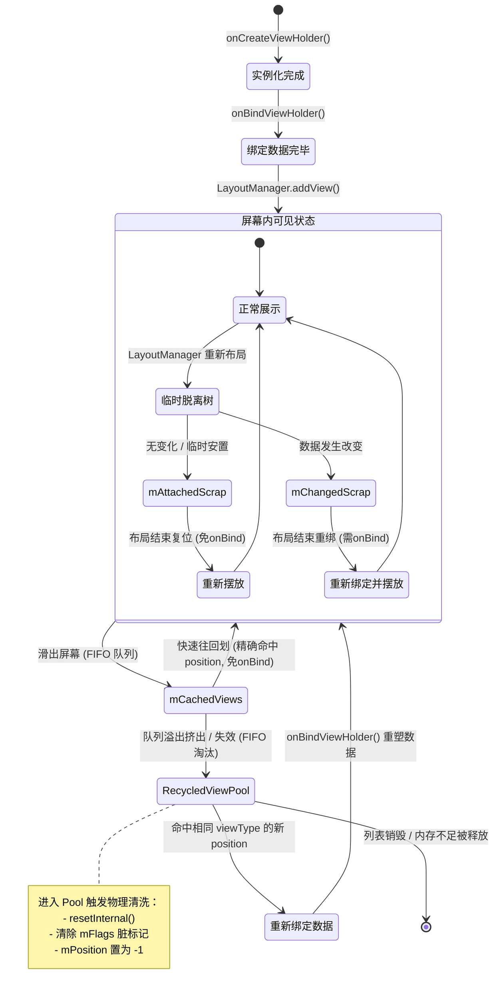
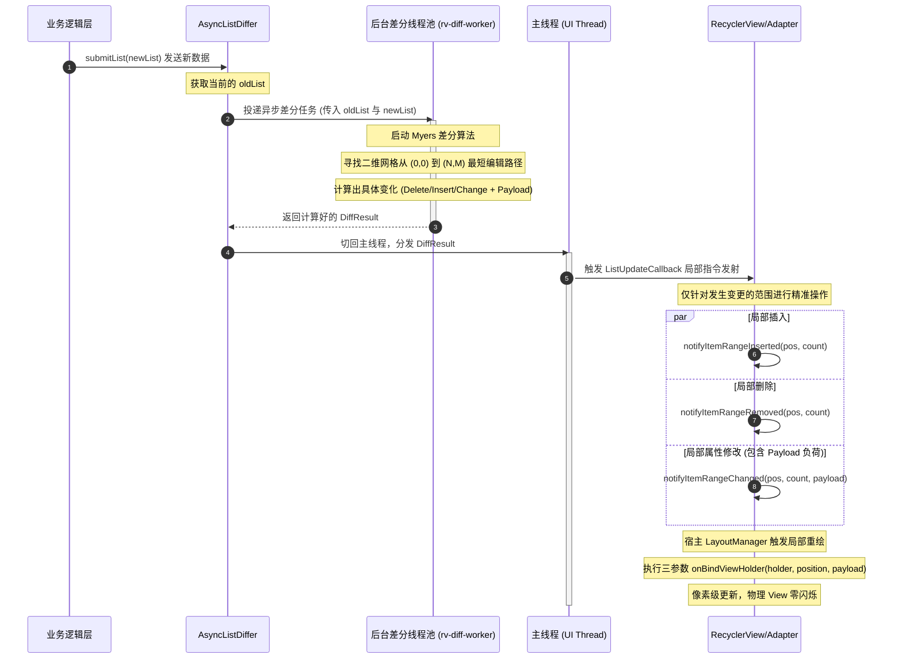

# 5.4.2.5 RecyclerView 优化

在 Android 的 UI 渲染架构中，列表（List）一直是人机交互最为频繁、承载数据密度最高的组件。从早期简陋的 `ListView` 到如今功能极其强大的 `RecyclerView`，其底层的演进不仅是 API 设计的重构，更是对 Android 渲染流水线、内存管理以及主线程调度机制的深度物理调优。

本篇将以系统底层的视角，深入剖析 RecyclerView 的复用哲学、四级缓存机制的底层源码与物理流转、预取机制（Prefetching）与 `GapWorker` 的物理调度、`DiffUtil` 与 Myers 差分算法的底层数学模型，并提供工业级的高性能异步刷新与 Payload 局部像素级防闪烁的完整实践指南。

---

## 1. 列表复用哲学与 ViewHolder 物理演进

### 1.1 ListView 核心工作机制及其历史局限性
在 Android 早期（Android 1.x / 2.x 时代），系统的内存和 CPU 资源极其匮乏。为了在有限的物理内存中展示成千上万条数据，`ListView` 引入了 `RecycleBin` 机制。

`ListView` 的核心思想是“只创建屏幕可见数量 + 少量缓冲区”的视图对象。当用户滑动列表时，滑出屏幕的 View 会被回收到 `RecycleBin` 中，而滑入屏幕的新 View 则通过 `getView(int position, View convertView, ViewGroup parent)` 中的 `convertView` 进行复用。

然而，ListView 的设计在应对复杂的现代应用时，暴露出了诸多致命的局限性：

1. **`findViewById` 的巨大树遍历开销**  
   在 ListView 的典型写法中，即使复用了 `convertView`，开发者依然需要通过 `convertView.findViewById(R.id.xxx)` 来获取子控件实例并进行数据填充。  
   `findViewById` 内部是通过**深度优先搜索（DFS）**算法遍历整个 View 树的。如果 Item 布局非常复杂、层级较深，每一次滑动滑入新 Item 时，高频调用的 DFS 遍历会严重抢占 CPU 周期，导致主线程瞬间掉帧。
   
2. **布局与数据绑定的物理耦合**  
   `getView()` 方法是一个典型的“巨无霸”函数，它同时承载了“物理视图的解析与创建（Layout Inflation）”和“视图属性的填充与绑定（Data Binding）”两大职责。对系统底层而言，它无法准确感知哪些操作是耗时的布局构建，哪些是轻量级的数据填充，从而无法在底层进行更细粒度的流水线式优化。

3. **多类型布局（Multi-ViewType）支持弱且缺乏类型安全**  
   虽然 ListView 提供了 `getItemViewType()` 和 `getViewTypeCount()`，但其在 `getView` 中完全依赖开发者手动进行类型判断与 `convertView` 的强制类型转换。这极易在运行期间抛出 `ClassCastException`，且代码嵌套极其臃肿。

4. **强制全量布局重构与 requestLayout 滥用**  
   当数据集发生任何局部变动时，ListView 唯一的通知方式是 `notifyDataSetChanged()`。该方法会无条件地将所有现存的子 View 标记为失效，并触发 ListView 自身的 `requestLayout()`。  
   这会导致整个视图树重新执行 `measure`（测量）和 `layout`（布局）计算，即便那些完全没有发生数据改变的 Item 也必须重新走一遍完整的测绘流程，造成极大的 CPU 开销。

5. **过渡动画完全缺失**  
   由于 ListView 无法识别 item 在逻辑数据集中的物理位移、删除或插入，它无法在两个数据集状态之间计算并绘制平滑的平移、渐变等过渡动画。Item 的显示状态是瞬间改变的，交互体验极为生硬。

---

### 1.2 RecyclerView 的核心设计：高内聚低耦合与物理层解耦
为了彻底解决 ListView 的上述物理缺陷，RecyclerView 将视图的生命周期进行了更为彻底的解耦，并在底层将“视图物理创建”与“数据填充绑定”进行了彻底的隔离：

```
                   ┌────────────────────────────────────────────────────────┐
                   │                 RecyclerView.Adapter                   │
                   └────────────────────────────────────────────────────────┘
                               /                                \
                 物理创建 (重量级)                             属性填充 (轻量级)
                             /                                    \
                            ▼                                      ▼
             ┌─────────────────────────────┐        ┌─────────────────────────────┐
             │    onCreateViewHolder()     │        │     onBindViewHolder()      │
             │   (XML解析、反射、物理实例化)   │        │     (属性赋值、轻量级填充)    │
             └─────────────────────────────┘        └─────────────────────────────┘
                            │                                      │
                            └──────────────────┬───────────────────┘
                                               │
                                               ▼
                                  ┌─────────────────────────┐
                                  │    ViewHolder (持有引用) │
                                  └─────────────────────────┘
```

#### 1. onCreateViewHolder(ViewGroup parent, int viewType) —— 物理视图创建
* **定位**：专门负责解析 XML 布局、反射实例化 View 物理树，并将其封装为 `ViewHolder`。
* **物理本质**：这是一个**重量级的 I/O 与反射操作**。加载 XML 涉及物理文件的磁盘读取（或缓存读取），解析 XML 标签并利用反射（`LayoutInflater`）生成 View 实例，接着构建子 View 之间的父子关系树。这一系列操作耗费了大量的 CPU 周期和物理内存。
* **设计初衷**：RecyclerView 在底层通过缓存机制，最大化地限制该方法的调用次数。通常情况下，该方法只会在初始化和缓存池为空时被调用，一旦物理 View 实例数量足够，便永远不再调用。

#### 2. onBindViewHolder(VH holder, int position) —— 数据属性绑定
* **定位**：专门负责将特定 position 的数据（Data Class/Entity）映射到已经创建好的 `ViewHolder` 物理 View 上。
* **物理本质**：这仅是一个**轻量级的 CPU 运算与字段赋值操作**（例如设置文本 `textView.setText()`、修改图片引用或控件可见性）。它不涉及任何 View 的实例化或布局树的重新构建。
* **设计初衷**：在快速滚动时，对于滑入屏幕的 Item，RecyclerView 会尽可能从缓存中直接拉取已有的物理 View，仅调用此方法进行快速的内存字段填充，从而极大地平滑了帧率曲线。

#### 3. ViewHolder 模式的强制与物理意义
在 RecyclerView 中，`ViewHolder` 成为了底层架构的核心一环，并且强制开发者继承使用。

`ViewHolder` 的物理本质是：**一个持有 Item View 及其所有子 View 引用的轻量级容器**。在 `onCreateViewHolder` 时，开发者一次性将所有子控件的物理引用通过 `findViewById` 检索出来，并作为 `ViewHolder` 的成员变量（或通过 ViewBinding/DataBinding 绑定）进行保存。

当 `onBindViewHolder` 被调用时，可以直接通过 `holder.textView.text = ...` 的方式进行赋值，彻底消除了深度优先遍历 View 树的 `findViewById` 耗时，将数据绑定的性能提升到了极致。

---

## 2. 四级缓存机制底层源码与物理流转

RecyclerView 的极致流畅度，几乎完全得益于其内部精密设计的四级缓存机制。负责管理这些缓存的核心类是 `RecyclerView.Recycler`。

### 2.1 四级缓存容器的源码定义与限制

在 `RecyclerView.Recycler` 内部，定义了如下几个核心的缓存容器：

```java
public final class Recycler {
    // 一级缓存：屏幕内草稿缓存（无开销）
    final ArrayList<ViewHolder> mAttachedScrap = new ArrayList<>();
    ArrayList<ViewHolder> mChangedScrap = null;

    // 二级缓存：滑动逃逸缓存（容量默认 2，免 onBind）
    final ArrayList<ViewHolder> mCachedViews = new ArrayList<>();

    // 三级缓存：开发者自定义缓存扩展（默认置空）
    private ViewCacheExtension mViewCacheExtension;

    // 四级缓存：复用池（按 viewType 分类缓存，容量默认 5，需重新 onBind）
    RecycledViewPool mRecyclerPool;
}
```

---

### 2.2 逐级缓存的物理机制与流转逻辑

#### 一级缓存：mAttachedScrap 与 mChangedScrap
* **定义**：它们是“屏幕内草稿缓存（Scrap）”。
* **生命周期与流转**：
  当 LayoutManager 触发重新布局（例如调用 `onLayoutChildren()`）时，会首先将所有当前正在屏幕上显示的 ViewHolder 临时移出并回收到 `mAttachedScrap` 或 `mChangedScrap` 中。LayoutManager 重新计算每个 Item 的坐标后，会直接从 Scrap 中检索并放回原位。
* **为什么是“无开销”的？**
  因为它们只是布局计算过程中的“临时寄存器”，发生在一次完整的绘制帧内部。存入和取出时不脱离 RecyclerView 树，也不需要执行任何 `onCreateViewHolder()` 和 `onBindViewHolder()`，其数据和状态完好如初。
* **物理分工与机制区别**：
  * **`mAttachedScrap`**：存储没有改变、未被标记为 invalid、可以直接复用的 ViewHolder。
  * **`mChangedScrap`**：存放数据发生了改变（例如通过 `notifyItemChanged` 触发）、被标记为 invalid 且必须通过 Adapter 重新绑定数据（`onBind`）的 ViewHolder。它主要用于配合 `ItemAnimator` 计算前后两个数据集状态下的过渡动画（比如淡出和淡入）。

#### 二级缓存：mCachedViews
* **定义**：它是“滑动逃逸缓存（CachedViews）”，默认容量上限为 **2**。
* **先进先出（FIFO）淘汰机制**：
  当用户向上滑动列表，Item A 从屏幕顶端完全滑出屏幕。LayoutManager 会将其回收，并优先存入 `mCachedViews`。当后续又有 Item B、Item C 相继滑出屏幕时，如果 `mCachedViews` 的容量超过了 2，队列头部的 Item A（即最老滑出的 ViewHolder）就会被“挤出”队列，降级存入第四级缓存 `RecycledViewPool` 中。
* **核心价值：豁免 `onBindViewHolder()`**：
  `mCachedViews` 保留了 ViewHolder 原本的 **数据绑定状态**、**位置信息（position）** 和 **mFlags 脏标记**。  
  如果用户在滑动时突然反向滑动（例如刚滑走又立即滑回来），由于 `mCachedViews` 中精准保留了 position 对应的 ViewHolder，它会被直接取出恢复显示。**整个过程不需要重新调用 `onBindViewHolder()`**，从而实现了零开销的数据复用。

#### 三级缓存：ViewCacheExtension
* **定义**：自定义缓存扩展。
* **物理边界与局限**：
  默认情况下它是 null。即使开发者设置了它，RecyclerView 在回收 ViewHolder 时**也不会自动调用**它来保存数据。它的回收逻辑完全需要开发者在外部手动控制。它仅仅在 `Recycler` 获取 View 时，作为一个额外的备用检索插槽。由于控制逻辑极难闭环且容易引起物理 View 的内存泄漏，在 99% 的工业调优中**不推荐使用**。

#### 四级缓存：RecycledViewPool
* **定义**：它是 RecyclerView 的“复用池（RecycledViewPool）”。
* **底层物理数据结构**：
  `RecycledViewPool` 内部通过一个 `SparseArray` 组织数据，Key 为 `viewType`，Value 为 `ScrapData`：
  ```java
  public static class RecycledViewPool {
      private static class ScrapData {
          final ArrayList<ViewHolder> mScrapHeap = new ArrayList<>();
          int mMaxScrap = 5; // 每个 viewType 默认的最大缓存容量为 5
          long mCreateRunningAverageNs = 0; // 创建平均耗时
          long mBindRunningAverageNs = 0;   // 绑定平均耗时
      }
      SparseArray<ScrapData> mScrap = new SparseArray<>();
  }
  ```
  这是多类型列表复用的物理底座。每一种 `viewType` 都有自己独立的 `mScrapHeap` 队列。

* **溢出降级与数据脏标记（mFlags）清除物理流转**：
  当二级缓存 `mCachedViews` 发生溢出（比如滑出屏幕的 Item 数量超出上限，或者该 Item 被标记为失效不可直接复用时），ViewHolder 就会被“冲刷/降级”到 `RecycledViewPool` 中。  
  在这个降级移送的过程中，RecyclerView 底层会调用 `RecycledViewPool.putRecycledView(ViewHolder scrap)`。而在将 ViewHolder 塞入 `mScrapHeap` 之前，必须执行一系列的“解绑与清洗”工作：
      - 调用 `ViewHolder.resetInternal()` 方法。
      - **清除所有核心数据标记**：在 `resetInternal()` 内部，ViewHolder 的所有数据状态会被彻底擦除。
        1. 清除 `mFlags` 中的所有标志位，如 `FLAG_BOUND`（标记是否已绑定数据）、`FLAG_UPDATE`、`FLAG_INVALID` 等。
        2. 将 `mPosition` 重置为 `NO_POSITION`（-1），抹除原本的逻辑位置。
        3. 解除与旧 Adapter 数据的全部引用。  
  
  **这一物理清洗使得 ViewHolder 重新变回了一个纯净的、仅有 View 物理骨架的“无状态空壳”**。它不再与特定的 position 绑定，因此可以被安全地分发给任何相同 `viewType` 的新 Item 复用。

* **核心代价：必须重新调用 `onBindViewHolder()`**：
  由于在存入 `RecycledViewPool` 时执行了物理清洗，ViewHolder 已经丢失了所有原有的数据状态。因此，当从 `RecycledViewPool` 中取出 ViewHolder 复用时，**必须且一定会重新执行 `onBindViewHolder()`** 来重新装载并绑定新 position 的数据。

---

### 2.3 多组件共享池（SharedPool）的物理架构设计
在复杂的 App 页面设计中，ViewPager 嵌套多个同构的 RecyclerView（如：商品分类 Tab 页，每个 Tab 对应的列表排版和样式完全一致）是非常经典的物理场景。

默认情况下，每个 RecyclerView 都会在内存中创建并独立维护一套 `RecycledViewPool`。如果每个 Tab 下的列表样式一致，当用户在 Tab 间来回切换时，系统不仅无法共享已创建的物理 View 实例，而且还会因为频繁的列表销毁和重建而导致大量重复的 `onCreateViewHolder()`，引发严重的内存抖动和 CPU 尖峰。

#### 物理共享池架构图：
```
       ┌──────────────────────── ViewPager ────────────────────────┐
       │                                                           │
       ├───────────────┬───────────────┬───────────────┬───────────┤
   RecyclerView A  RecyclerView B  RecyclerView C  RecyclerView D
       │               │               │               │
       └───────────────┼───────────────┼───────────────┘
                       │ (setRecycledViewPool)
                       ▼
         ┌──────────────────────────────────────────┐
         │       Shared RecycledViewPool            │
         │  - SparseArray<ScrapData>                │
         │  - Type A: [VH, VH, VH, VH, VH, ...]    │
         │  - Type B: [VH, VH, VH, ...]             │
         └──────────────────────────────────────────┘
```

#### 工业级 Kotlin 共享池实现方案：
```kotlin
class SharedPoolActivity : AppCompatActivity() {

    // 声明一个 Activity 生命周期的共享复用池
    private val sharedRecycledViewPool by lazy {
        RecyclerView.RecycledViewPool().apply {
            // 根据具体的 viewType 调优其最大容量上限
            // 假设样式 A 的 Item 在屏幕中展示密度较高，可以调大其池子大小
            setMaxRecycledViews(VIEW_TYPE_ITEM_A, 15)
            setMaxRecycledViews(VIEW_TYPE_ITEM_B, 10)
        }
    }

    private fun setupRecyclerView(recyclerView: RecyclerView) {
        recyclerView.apply {
            layoutManager = LinearLayoutManager(context)
            adapter = MyAdapter()
            
            // 关键物理优化：设置共享复用池
            setRecycledViewPool(sharedRecycledViewPool)
        }
    }
}
```

#### 物理收益：
1. **缩减 50% 以上的物理实例化开销**：当 RecyclerView A 滑出屏幕的 Item 降级存入共享池后，RecyclerView B 滑入新 Item 时直接从共享池中提取。这避免了物理 View 的重复销毁与反射创建。
2. **极大降低内存抖动**：由于限制了物理 View 实体的生命周期和实例总量，GC 触发的频次大幅度下降，有效避免了由于 JVM Stop-The-World（STW）带来的帧率抖动。

---

## 3. 缓存命中的核心源码走读与物理状态机

### 3.1 `tryGetViewHolderForPositionByDeadline` 检索流转链条
在滑动列表需要展出新 Item 时，RecyclerView 的 `LayoutManager` 会向 `Recycler` 申请对应 position 的 ViewHolder。其底层核心的检索函数为：  
`tryGetViewHolderForPositionByDeadline(int position, boolean dryRun, long deadlineNs)`。

其逐级 fallback 命中的物理查找逻辑如下：

1. **Step 1: 从 `mChangedScrap` 中检索**  
   若开启了 pre-layout（预布局，用于计算动画），且该 position 的 ViewHolder 发生了改变，则直接从 `mChangedScrap` 中取出。
   
2. **Step 2: 从 `mAttachedScrap` 中检索**  
   在没有改变的前提下，通过 position 或 itemId 到 `mAttachedScrap` 中查找对应的物理 ViewHolder。如果命中，直接复用。

3. **Step 3: 从 `mCachedViews`（二级缓存）中检索**  
   匹配 position 或 itemId。如果命中：
   * 物理状态：ViewHolder 完好，数据未脏。
   * **操作：豁免 `onBindViewHolder()`**，直接返回 ViewHolder 使用。

4. **Step 4: 从 `ViewCacheExtension`（三级缓存）中检索**  
   若开发者自定义了该扩展且能命中，则从中拉取。

5. **Step 5: 从 `RecycledViewPool`（四级缓存）中检索**  
   根据当前的 `viewType` 到对应的 `ScrapData` 队列中拉取空闲的 ViewHolder 物理实例。如果命中：
   * 物理状态：ViewHolder 数据已被清洗抹除。
   * **操作：必须执行 `onBindViewHolder()`** 重新绑定数据，然后返回。

6. **Step 6: Fallback 物理创建**  
   若以上所有缓存全部错失，则直接调用 `mAdapter.createViewHolder(parent, type)` 物理反射创建一个全新的 ViewHolder 实例，然后调用 `mAdapter.bindViewHolder()` 进行全量数据绑定。

---

### 3.2 ViewHolder 物理流转状态机图

以下展示了一个 `ViewHolder` 实例在其整个物理生命周期中，在各个缓存容器之间的升级、降级与轮转轨迹：



---

## 4. 预取机制（Prefetching）与 GapWorker 物理调度

在 Android Lollipop（API 21）引入硬件加速的 `RenderThread` 渲染架构起，Android 的绘制流程发生了根本性的改变。有关 Android 历史版本的渲染机制演进与详细 API 变更日志，可查阅 [AndroidVersionChangeLog.md](../../../AndroidVersionChangeLog.md)。

### 4.1 预取机制（Prefetching）的物理痛点与核心理念
在没有预取的情况下，主线程与渲染线程的工作流呈现出串行的空闲期浪费：

```
主线程(UI Thread):      |--帧N(测绘)--|-----------------(Sleep 睡觉)-----------------|--帧N+1(测绘+创建)--|
渲染线程(RenderThread):               |--帧N(GPU渲染)--|                                               |--帧N+1(GPU)--|
VSYNC 信号:            ▼                                                             ▼
```

如上图所示，当主线程在帧 N完成了 Layout 和 Draw 动作并将 DrawOp 传递给 RenderThread 后，主线程在下一次 VSYNC 信号到来前会处于大段的**完全闲置状态（Sleep）**。而在下一次 VSYNC 到来时，若下一帧恰好有新 Item 滑入屏幕，主线程不仅要处理原本的测量绘制，还要**临时**执行新 Item 的 `onCreateViewHolder` 与 `onBindViewHolder`，这极易导致当前帧耗时突破 16.6ms（或高刷屏幕下的 11.1ms/8.3ms），引发物理掉帧。

**预取机制的核心思想**就是榨取和利用这段主线程的“CPU 喘息空闲期”：

```
主线程(UI Thread):      |--帧N(测绘)--|--[GapWorker 异步预取 帧N+1]--|-----------|--帧N+1(直接从缓存读)--|
渲染线程(RenderThread):               |--帧N(GPU渲染)--------------|           |--帧N+1(GPU)---------|
VSYNC 信号:            ▼                                                   ▼
```

在主线程空闲期，Choreographer 将 `GapWorker` 任务发布 to 主线程。它在后台悄悄地对即将滑入屏幕的下一个 Item 提前执行 `onCreate` 与 `onBind`，并将生成的 ViewHolder 预先塞入 `mCachedViews`。当下一帧真正到来时，该 Item 只需要以零开销的方式从 `mCachedViews` 中直接取出使用，消除了主线程在 VSYNC 信号到来时的瞬时计算压强。

---

### 4.2 `GapWorker` 物理调度过程与源码级剖析
`GapWorker` 是一个实现了 `Runnable` 接口的单例，它在后台精密监控并调度着所有活动 RecyclerView 的滑动预取任务。

#### 1. 物理滑动速度与预取方向收集
当用户滑动 RecyclerView 时，`RecyclerView` 会将自身注册到 `GapWorker`，并在滑动事件中更新滑动向量（`dx`, `dy`）。  
`LayoutManager` 提供了收集下一个即将进入屏幕 Item 的接口：
```java
// LinearLayoutManager 内部实现
@Override
public void collectAdjacentPrefetchPositions(int dx, int dy, State state,
        LayoutPrefetchRegistry layoutPrefetchRegistry) {
    int delta = (mOrientation == HORIZONTAL) ? dx : dy;
    if (getChildCount() == 0 || delta == 0) {
        return;
    }
    // 依据滑动的速度和方向，计算出下一个逻辑 position
    final int layoutDirection = delta > 0 ? LAYOUT_END : LAYOUT_START;
    updateLayoutState(layoutDirection, Math.abs(delta), true, state);
    // 注册该 position 至 GapWorker 的任务列表中
    layoutPrefetchRegistry.addPosition(mLayoutState.mCurrentPosition, 
        Math.abs(mLayoutState.mScrollingOffset));
}
```

#### 2. VSYNC 时间线与 Deadline 安全熔断
Choreographer 在触发预取 Runnable 时，会传入下一帧 VSYNC 到来的纳秒绝对时间戳 `deadlineNs`。  
In `GapWorker.java` 内部的 `prefetch(long deadlineNs)` 中，执行了极为严苛的时间管理：
```java
void prefetch(long deadlineNs) {
    // 1. 收集所有关联的 RecyclerView 的预取任务并依据距离和紧迫度进行排序
    buildTaskList();
    
    // 2. 依次执行任务
    for (int i = 0; i < mTasks.size(); i++) {
        Task task = mTasks.get(i);
        if (task.view == null) {
            break; // 任务列表为空
        }
        
        // 【核心熔断检测】：执行每一个预取任务前，检测当前时间是否已经逼近或超过下一帧的 VSYNC 截止时间
        if (System.nanoTime() >= deadlineNs) {
            // 安全防线：如果 CPU 空闲期已被完全耗尽，则立即终止后续所有的预取任务，防止预取操作反向拖累主线程的正常渲染
            break; 
        }
        
        // 3. 安全时间内，执行物理预取
        flushTaskWithDeadline(task, deadlineNs);
    }
}
```

#### 3. 预取结果物理流入 `mCachedViews`
在 `flushTaskWithDeadline` 中，`GapWorker` 最终调用 `tryGetViewHolderForPositionByDeadline()` 去加载 ViewHolder。  
由于预取操作在调用时指定了 `deadlineNs`，如果 `onCreateViewHolder` 或 `onBindViewHolder` 耗时过长，底层的检索系统也会进行安全退避。  
一旦预取成功，该 ViewHolder 会直接被存入 `mCachedViews`。当下一帧 VSYNC 到来、列表真正滑动展开该 position 时，LayoutManager 便可以完美匹配并以免 bind 的姿态直接展出，极其流畅。

---

## 5. 局部刷新战役：DiffUtil 异步算法与 Payload 像素级防闪烁

在工业级开发中，数据流的变化是高频且复杂的。如何将数据的更新最优化地映射到 UI 物理渲染上，是避免卡顿的关键战役。

### 5.1 严禁调用 notifyDataSetChanged() 的物理原因
很多开发者图省事，在收到新数据时一律调用 `notifyDataSetChanged()`。在系统底层，这一操作无异于一场“UI 级别的核物理毁灭”：
1. **全量脏标记**：它会将当前所有屏幕上展示的 `ViewHolder` 的 flags 全部强制叠加 `FLAG_UPDATE` 和 `FLAG_INVALID`。
2. **布局彻底重构**：这会导致 `LayoutManager` 放弃当前的整个局部视图树，被迫执行一次全局的 `requestLayout()`。
3. **数据链式绑定**：所有的可见 Item 必须全量重新走一遍 `onBindViewHolder()`，哪怕其数据一成不变。这直接把本该平摊到多帧的 CPU 开销瞬间集中在当前帧，造成主线程发生长达 20ms - 50ms 的完全停顿（卡顿、掉帧）。
4. **动画全部扼杀**：因为 RecyclerView 无法获得前后两个数据集的逻辑映射关系，它将直接取消所有转场过渡动画，屏幕呈现出极其突兀的白屏闪烁与位置瞬移。

---

### 5.2 Myers 差分算法的深度数学模型
为了解决数据集比对的性能问题，Android 引入了 `DiffUtil`。其底层核心是 **Myers 差分算法**（Myers' Difference Algorithm）。

#### 1. 数学建模：编辑网格图（Edit Graph）
Myers 算法将比对两个列表（旧列表 $A$，长度 $N$；新列表 $B$，长度 $M$）的过程，抽象为在一个二维的编辑网格图中寻找一条**从左上角坐标 $(0,0)$ 到右下角坐标 $(N,M)$ 的最短物理路径**。

* **横向移动（Right）**：表示在旧列表中执行了**删除（Delete）**操作（由 $A$ 指向下一个）。
* **纵向移动（Down）**：表示在新列表中执行了**插入（Insert）**操作（引入了 $B$ 的新项）。
* **对角斜向移动（Diagonal）**：表示新旧列表在此处的 Item 属性物理一致，不需要任何编辑操作（**保持不变 Keep**）。对角线移动在算法中被视为“零开销”路径。

```
       旧列表 A (N=3):  [Item1]    [Item2]    [Item3]
                      0          1          2          3
  新列表 B (M=3): 0 ───┼──────────┼──────────┼──────────┐
                 │    │          │          │          │
        [Item1] 1 ────┼─ ↘ ──────┼──────────┼──────────┤  (↘ 表示对角线命中，Keep)
                 │    │  (Keep)  │          │          │
     [NewItem]  2 ────┼──────────┼──────────┼──────────┤
                 │    │          │          │          │
        [Item3] 3 ────┼──────────┼──────────┼─ ↘ ──────┤
                 │    │          │          │  (Keep)  │
                  └───┴──────────┴──────────┴──────────┘
```

#### 2. 算法执行效率与复杂度
* **贪婪搜索**：Myers 算法采用广度优先搜索（BFS）策略，按编辑步数 $D$（即增加和删除操作的总次数，也就是编辑路径长度）逐步向外扩张，寻找在 $D$ 步编辑内能够到达的最远路径（$D$-paths）。
* **空间压缩**：因为在相同的编辑步数下，可到达的对角线 $k = x - y$ 是奇偶交替存在的。Myers 算法仅需用一个一维数组 `V` 来记录在每条对角线 $k$ 上能够到达的最远 $x$ 坐标。
* **复杂度分析**：
  * **时间复杂度**：$O(N + D^2)$，其中 $N = M + N$（两个列表的总长度），$D$ 是新旧列表的编辑距离（差异元素的个数）。在差异极小的高频局部刷新场景中，$D$ 极小，算法能在不到 1ms 内瞬间完成。
  * **空间复杂度**：$O(D)$。

#### 3. 主线程 ANR 崩溃陷阱
虽然 Myers 算法极其优秀，但如果面临**大数据量列表**（例如 $N > 2000$）且**新旧列表差异巨大**（例如用户进行了大幅度的多维筛选、洗牌、或者完全重置，此时编辑距离 $D \approx N$）时，Myers 算法的时间复杂度会瞬间退化到 $O(N^2)$。  
这会导致 Diff 计算在主线程直接消耗 **30ms 甚至 100ms 以上** 的时间，破坏了 Android VSYNC 信号的渲染周期，产生严重的视觉卡死，频繁出现系统 ANR 弹窗。  
**结论**：在实际的工业开发中，**必须将 Diff 的计算彻底移入非主线程（后台线程池或 Kotlin 协程调度器）中运行**。

---

### 5.3 工业级 AsyncListDiffer 异步更新与 Payload 防闪烁实践

以下提供一套完整的、生产环境级别的 Kotlin 实践方案。该方案使用 `AsyncListDiffer` 配合自定义的 Kotlin 协程调度器，将 Myers 差分计算剥离至后台线程，并重写 `getChangePayload` 以实现像素级的局部刷新，彻底消除列表刷新时的 Item 闪烁。

#### 1. 数据实体定义
```kotlin
data class VideoItem(
    val id: String,
    val title: String,
    val likeCount: Int,
    val isLiked: Boolean
)
```

#### 2. DiffUtil.ItemCallback 及其 Payload 差异化提取
```kotlin
class VideoDiffCallback : DiffUtil.ItemCallback<VideoItem>() {

    // 判断两个对象是否代表同一个物理 Item（通常比对唯一 ID）
    override fun areItemsTheSame(oldItem: VideoItem, newItem: VideoItem): Boolean {
        return oldItem.id == newItem.id
    }

    // 判断两个对象的内容是否物理一致，如果不一致则会触发刷新
    override fun areContentsTheSame(oldItem: VideoItem, newItem: VideoItem): Boolean {
        return oldItem == newItem
    }

    // 核心物理优化：提取局部变更的 Payload
    override fun getChangePayload(oldItem: VideoItem, newItem: VideoItem): Any? {
        val payload = Bundle()
        
        // 仅在点赞数发生改变时，将其写入 Payload Bundle
        if (oldItem.likeCount != newItem.likeCount) {
            payload.putInt(KEY_LIKE_COUNT, newItem.likeCount)
        }
        // 仅在点赞状态发生改变时，将其写入 Payload Bundle
        if (oldItem.isLiked != newItem.isLiked) {
            payload.putBoolean(KEY_IS_LIKED, newItem.isLiked)
        }

        // 如果没有任何局部变化，返回 null 走默认的 ViewHolder 全量绑定流程
        return if (payload.isEmpty) null else payload
    }

    companion object {
        const val KEY_LIKE_COUNT = "key_like_count"
        const val KEY_IS_LIKED = "key_is_liked"
    }
}
```

#### 3. 生产级 Adapter 异步分流与局部刷新实现
```kotlin
class VideoAdapter : RecyclerView.Adapter<VideoAdapter.VideoViewHolder>() {

    // 声明一个 AsyncListDiffer 助手，将其配置为异步处理线程
    private val differ = AsyncListDiffer(
        this,
        AsyncDifferConfig.Builder(VideoDiffCallback())
            // 将 Diff 计算分配给协程的线程池（Dispatchers.Default），彻底解放主线程
            .setBackgroundThreadExecutor(
                Executors.newFixedThreadPool(2) { runnable ->
                    Thread(runnable, "rv-diff-worker")
                }
            )
            .build()
    )

    fun submitList(newList: List<VideoItem>) {
        // 将新列表数据安全地扔给 Differ 助手，Differ 会在后台线程异步执行 Myers 差分算法
        differ.submitList(newList)
    }

    override fun getItemCount(): Int = differ.currentList.size

    override fun onCreateViewHolder(parent: ViewGroup, viewType: Int): VideoViewHolder {
        val view = LayoutInflater.from(parent.context).inflate(R.layout.item_video, parent, false)
        return VideoViewHolder(view)
    }

    // 默认的物理全量绑定：当没有 Payload 负荷时，必须将所有子 View 字段全部重绘绑定
    override fun onBindViewHolder(holder: VideoViewHolder, position: Int) {
        val item = differ.currentList[position]
        holder.titleView.text = item.title
        holder.likeCountView.text = item.likeCount.toString()
        holder.likeIcon.setImageResource(
            if (item.isLiked) R.drawable.ic_liked_active else R.drawable.ic_liked_normal
        )
    }

    // 核心物理优化：三参数的 onBindViewHolder，负责提取 Payload 并执行像素级定向刷新
    override fun onBindViewHolder(
        holder: VideoViewHolder,
        position: Int,
        payloads: MutableList<Any>
    ) {
        if (payloads.isEmpty()) {
            // 如果 payloads 为空，说明这是一次全量的刷新（或者是初次加载），降级走双参数的全量绑定
            super.onBindViewHolder(holder, position, payloads)
        } else {
            // 获取最新的一份变更集
            val payload = payloads[0] as? Bundle ?: return
            
            // 像素级定向更新：只改变发生变化的 TextView 文本或 ImageView 资源，不重新测量物理 Item
            if (payload.containsKey(VideoDiffCallback.KEY_LIKE_COUNT)) {
                val likeCount = payload.getInt(VideoDiffCallback.KEY_LIKE_COUNT)
                holder.likeCountView.text = likeCount.toString()
            }
            
            if (payload.containsKey(VideoDiffCallback.KEY_IS_LIKED)) {
                val isLiked = payload.getBoolean(VideoDiffCallback.KEY_IS_LIKED)
                holder.likeIcon.setImageResource(
                    if (isLiked) R.drawable.ic_liked_active else R.drawable.ic_liked_normal
                )
            }
            // 此时，titleView 并没有被重新赋值，ImageView 的其他未变属性也完好未变。
            // 物理 View 树没有触发重测重绘，完美消除了刷新闪烁问题。
        }
    }

    class VideoViewHolder(itemView: View) : RecyclerView.ViewHolder(itemView) {
        val titleView: TextView = itemView.findViewById(R.id.tv_title)
        val likeCountView: TextView = itemView.findViewById(R.id.tv_like_count)
        val likeIcon: ImageView = itemView.findViewById(R.id.iv_like_icon)
    }
}
```

---

### 5.4 异步差分与局部发射时序图

以下展现了在 `AsyncListDiffer` 的支持下，数据差分计算在后台线程异步执行，并通过 `ListUpdateCallback` 精准向主线程发射局部刷新指令的完整物理时序：



---

## 6. 工业级开发避坑指南与极限调优方案

为了让 RecyclerView 的滑动帧率稳稳贴合屏幕刷新率（60FPS / 90FPS / 120FPS），在实际的 Android 工程实践中，我们需要避开以下几个经典的性能误区并采取极限优化方案：

### 6.1 彻底认清 `setHasFixedSize(true)` 的适用边界
许多开发者只要声明 RecyclerView 就会顺手写上 `setHasFixedSize(true)`。如果对其背后的机制缺乏深刻认识，会导致非常难以排查的 UI 变形或完全起不到优化作用。

* **物理本质**：  
  当 `hasFixedSize` 设置为 true 时，意味着 RecyclerView 的**宽度和高度在运行期间是完全固定且独立的，它绝不依赖于 Adapter 数据集的内容改变来重新测绘自身的大小**。
* **底层源码优化**：  
  如果设置了 true，当 Adapter 触发更新时，RecyclerView 不会向上调用系统的 `requestLayout()` 进行繁重的父布局重新测量，而是直接在内部进行子 View 的重新绘制。这极大地减免了整个 Activity 视图树的 Measure-Layout 级联拓扑计算。
* **致命误区**：  
  如果你的 RecyclerView 使用了 `wrap_content` 属性（高度由列表项自适应决定），或者你的 Item 布局高度是动态展开的（比如有“全文/收起”功能的动态文本），**一旦设置 true，会导致由于宽高计算被锁定，滑入屏幕的新 Item 布局被物理截断、挤压重叠或者留出大段空白**。

---

### 6.2 规避在 `onBindViewHolder` 中高频分配内存（内存抖动与 GC）
在 `onBindViewHolder` 内部创建匿名监听器对象，是 Android 内存抖动的头号凶手。

#### 错误示范（反面教材）：
```kotlin
override fun onBindViewHolder(holder: MyViewHolder, position: Int) {
    val item = dataList[position]
    
    // 【致命开销】：每次滑动都会在 JVM 堆内存中高频实例化一个匿名 OcrClickListener 对象。
    // 这将瞬间耗尽虚拟机的新生代内存（Eden区），引发高频的 Minor GC，使主线程频繁发生 Stop-The-World（STW）微小卡顿。
    holder.itemView.setOnClickListener {
        handleItemClick(item)
    }
}
```

#### 正确示范（黄金法则是：只在 onCreateViewHolder 中绑定一次）：
```kotlin
override fun onCreateViewHolder(parent: ViewGroup, viewType: Int): MyViewHolder {
    val view = LayoutInflater.from(parent.context).inflate(R.layout.item_layout, parent, false)
    val holder = MyViewHolder(view)
    
    // 【核心优化】：利用 holder 实例在其整个生命周期内只被物理创建一次的特性，
    // 将点击监听器与 ViewHolder 在物理上强绑定。
    holder.itemView.setOnClickListener {
        // 利用 bindingAdapterPosition 动态拉取当前被点击的物理位置
        val position = holder.bindingAdapterPosition
        if (position != RecyclerView.NO_POSITION) {
            val item = dataList[position]
            handleItemClick(item)
        }
    }
    return holder
}

override fun onBindViewHolder(holder: MyViewHolder, position: Int) {
    // 此时 onBind 只进行轻量级的属性赋值，不分配任何新对象，完美避开内存抖动
    holder.titleView.text = dataList[position].title
}
```

---

### 6.3 快速滑动时的图片加载智能降噪
在列表飞速滑动时（如惯性滑动 `SCROLL_STATE_SETTLING` 状态），主线程和 RenderThread 面临巨大的像素填充压强。如果图片库（Glide/Coil）仍然在后台线程高频地发起网络请求、读取磁盘并强行在主线程解析 Bitmap 写入 ImageView，会瞬间抢占 CPU 的轮询时间，导致严重的卡顿。

#### 优化方案：监听滑动状态智能挂起加载
```kotlin
class ImageScrollListener(private val context: Context) : RecyclerView.OnScrollListener() {
    override fun onScrollStateChanged(recyclerView: RecyclerView, newState: Int) {
        super.onScrollStateChanged(recyclerView, newState)
        when (newState) {
            // 当列表处于惯性飞奔状态下，强行通知图片库挂起所有加载请求
            RecyclerView.SCROLL_STATE_SETTLING -> {
                Glide.with(context).pauseRequests()
            }
            // 当列表停止滚动或用户用手指拖拽滑动时，立即恢复图片加载
            RecyclerView.SCROLL_STATE_IDLE, 
            RecyclerView.SCROLL_STATE_DRAGGING -> {
                Glide.with(context).resumeRequests()
            }
        }
    }
}

// 绑定至目标列表
recyclerView.addOnScrollListener(ImageScrollListener(context))
```
这一机制不仅可以显著提升列表飞速滚动时的流畅度，还能有效为后台线程网络 I/O 减负，节约用户流量。

---

### 6.4 扁平化 Item 布局与规避双倍测量（Double Measure）
LayoutManager 在对 Item 进行布局时，必须对每个 Item 进行测量。

1. **避免双重测量**：  
   在嵌套过多的 `LinearLayout`（使用了 `layout_weight` 属性）或复杂的 `RelativeLayout` 中，系统为了确定控件尺寸，被迫对子 View 进行**两次**完整的测量操作。这意味着布局层级越深，测量耗时呈指数级上升。
2. **扁平化结构**：  
   建议将 Item 布局的深度控制在 **2 层以内**（根布局 + 子内容布局）。引入 `ConstraintLayout`（约束布局）可以有效消除所有的嵌套结构，让视图树的高度降到最扁平，将测量时间缩减 40% 以上。
3. **慎用透明度（Alpha）**：  
   避免在 View 属性中直接调用 `setAlpha()`，这会导致 GPU 渲染管线执行**离屏渲染（Offscreen Rendering）**，强制开辟一块额外的临时缓冲区用于混合透明像素，对 GPU 填充率造成极大的浪费。如果需要半透明效果，应优先使用带有 Alpha 通道的十六进制颜色值（如 `#80000000`）来替代全局的 View 透明度设置。

---

## 7. 总结

RecyclerView 的优化并不是单一维度的代码堆砌，而是一套闭环的系统工程：
* **结构层**：理解物理视图创建与绑定的本质，通过 `onCreateViewHolder` 与 `onBindViewHolder` 的物理分离以及强制 `ViewHolder` 模式，将视图操作耗时降到最低。
* **缓存层**：灵活调配 `mCachedViews` 大小以豁免 onBind 过程，利用 `SharedRecycledViewPool` 缩减同构嵌套列表 50% 以上的物理创建开销。
* **调度层**：善用 Android 系统的 `GapWorker` 预取机制，平摊 VSYNC 空闲时段 of CPU 占用。
* **算法层**：通过异步 `AsyncListDiffer` 配合 Myers 差分算法解耦大列表比对的耗时，通过 Payload 进行定向像素级局部更新以彻底自愈刷新闪烁。

在开发中，时刻警惕内存抖动，杜绝在 `onBind` 中分配对象，结合滑动状态动态降噪图片加载。唯有在这些机制与细节上精耕细作，方能构建出在海量数据滚动下依然稳如磐石、丝滑如水的高性能列表体验。
