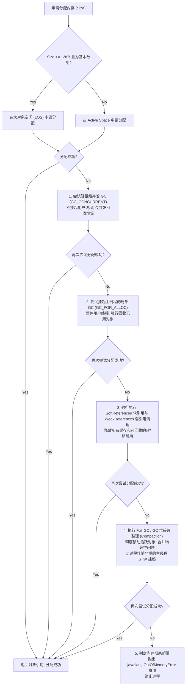
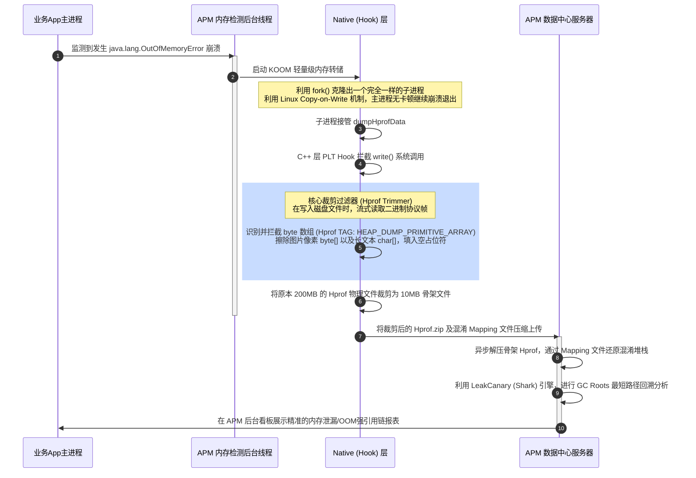

# 5.4.3.2 OOM

在 Android (ART/Dalvik) 虚拟机与 Linux 内核的世界中，`OutOfMemoryError`（简称 OOM）是应用程序稳定性最致命的杀手之一。当系统抛出 OOM 时，通常意味着虚拟机的堆内存空间或者进程的物理内存已经耗尽，且垃圾回收器（Garbage Collector）执行了多次 Full GC 并挂起所有线程之后，依然无法腾出足够的连续物理空间来容纳新申请的对象。

深入治理 OOM 绝非单纯的“增大内存分配限制”，而是一场涉及到 JVM/ART 堆空间分配机制、Linux 进程内存约束、图片文件像素编码、动态字节码插桩拦截以及线上 APM 大数据裁剪与自愈的系统性防卫战。本章将从物理边界、微观成因、线上三代治理体系及自愈防卫等多个维度，层层解密 Android OOM 的底层世界。

---

## 一、 OOM 物理边界与 ART 堆空间分配机制

在讨论 OOM 的具体治理方案前，必须明确 Android 进程所受到的物理内存约束及其内存分配流程。Android 并没有允许单个应用无限度地瓜分系统内存，而是对每个进程设定了硬性的虚拟机堆内存上限。

### 1. 堆空间限制的物理参数
系统在启动时，会读取 `/system/build.prop` 中的配置参数，这些参数在设备出厂时由厂商根据硬件物理内存大小进行适配：
*   **`dalvik.vm.heapstartsize`**：单应用进程启动时，虚拟机初始分配给其堆空间的物理内存大小。这通常是一个较小的值（例如 8MB 或 16MB），以保证进程能够快速拉起，并避免物理内存空耗。
*   **`dalvik.vm.heapgrowthlimit`**：普通应用程序堆内存最大可增长的绝对物理上限。一旦应用的内存占用超过这个阈值，即便物理内存还有空余，虚拟机也会无条件抛出 OOM 崩溃。这通常设定在 192MB、256MB 或 512MB 之间。
*   **`dalvik.vm.heapsize`**：在 AndroidManifest 的 `<application>` 标签中配置了 `android:largeHeap="true"` 的应用进程，其堆内存能够增长到的物理上限。该配置用于音视频编辑、重型 3D 游戏等大内存应用。

### 2. ART 虚拟机的物理堆隔离（Large Object Space 与 Active Space）
为了提高内存分配效率并减少垃圾回收（GC）时的内存整理开销，自 Android 5.0 采用 ART 虚拟机以来，堆空间在物理结构上被划分为多个子空间（Spaces）：
*   **`Active Space`**：也称为可分配空间，主要用于分配普通的中小型 Java 对象。该空间由垃圾回收器频繁管理，在 GC 时通常会执行对象的物理移动与内存整理，以消除碎片。
*   **`Large Object Space (LOS)`**：大对象空间。主要用于分配大于 12KB 且是连续的 byte 数组或 int 数组。在 Android 中，最典型的大对象就是 **Bitmap 像素数据数组（在某些 Android 版本中）**。
    *   *设计原因*：大对象在内存中占用的物理地址非常大。如果将大对象放入 Active Space，在 GC 进行内存整理（Compaction）时，物理拷贝几十兆的大对象会带来极高且致命的 CPU 挂起耗时。因此，LOS 中的对象在 GC 时**只会被回收，不会被物理移动**。这极大地减小了 GC 的 Stop-The-World（STW）时间，但代价是 LOS 容易产生严重的物理内存碎片。

### 3. 对象分配失败时 ART 虚拟机的 GC 救赎五步走
当开发者在代码中执行 `new` 或者进行 Bitmap 解码，试图申请一块物理内存时，ART 虚拟机会遵循以下底层逻辑进行“救赎”分配，如果每一步都失败，最终只能被迫抛出 OOM：



---

## 二、 三大核心 OOM 诱因与微观机制解密

在 Android 生产环境中，导致虚拟机内存暴涨并触火 OOM 的主要诱因可以归结为大图加载、内存泄漏积累以及强引用缓存滥用。

### 1. 大图加载与内存占用的数学本质
图片是引发 OOM 绝对的“头号杀手”。一张普通拍照生成的 JPG 图片，虽然在磁盘文件上的大小可能只有 2MB，但一旦加载进虚拟机内存解码成 Bitmap 之后，其所占用的物理内存大小将急剧膨胀，计算公式为：
$$\text{MemorySize} = \text{Width} \times \text{Height} \times \text{BytesPerPixel}$$

*   **BytesPerPixel（每像素字节数）**：由 `Bitmap.Config` 像素解码格式决定：
    *   `ARGB_8888`：每个像素占用 **4 字节**（8位 Alpha，8位红，8位绿，8位蓝）。这是 Android 系统默认的解码格式，色彩保真度最高。
    *   `RGB_565`：每个像素占用 **2 字节**（5位红，6位绿，5位蓝，无透明通道）。在不要求透明度的展示图上，可以将内存占用减半。
    *   `RGBA_F16`：每个像素占用 **8 字节**（半精度浮点数）。用于超高动态范围（HDR）图像，开销极大。
    *   `ALPHA_8`：每个像素占用 **1 字节**（仅包含 Alpha 通道）。常用于蒙版和阴影绘制。

*   *物理危害举例*：
    假设用户使用一部拍照分辨率为 $4000 \times 3000$（1200 万像素）的手机拍摄了一张照片。如果开发者没有进行任何下采样压缩，直接调用 `BitmapFactory.decodeFile()` 载入到堆中展示，其占用的堆内存为：
    $$4000 \times 3000 \times 4\text{ Bytes} = 48,000,000\text{ Bytes} \approx 45.77\text{ MB}$$
    对于一个默认 `heapgrowthlimit` 为 192MB 的进程来说，仅仅一张图就直接吞噬了近 **1/4** 的可用堆空间！

*   **内存碎片化（Memory Fragmentation）死结**：
    频繁地申请和释放大尺寸 Bitmap 还会导致严重的堆碎片化。即使系统此时的可用物理内存总和还有 50MB，但如果由于碎片化导致没有一块大于 45.77MB 的**连续**物理内存块，虚拟机在为该大图分配内存时，依然会直接触发 Full GC 并最终崩溃报错 OOM。

### 2. 本地内存泄漏积累的破水效应
内存泄漏（Memory Leak）本身不会瞬间引发 OOM，但它扮演了“破水效应”中不断蚕食防线的角色。当 Activity 被销毁后，如果其强引用依然被某个全局单例、常驻后台线程或静态 Handler 持有（参见 [5.4.3.1 内存泄漏.md](5.4.3.1.%E5%86%85%E5%AD%98%E6%B3%84%E6%BC%8F.md)），那么该 Activity 及其关联的整个 View 树与 Layout 资源都将被强行锁死在堆中。

随着用户频繁打开和关闭这个泄漏的 Activity，多倍 of Activity 实例在堆中积压，可用堆内存（Available Heap）被不断压缩。当可用堆空间被蚕食到仅剩几兆时，任何一次普通的对象 `new` 申请，都会直接触火 OOM 崩溃。

### 3. 不合理的内存缓存与强引用锁死
在大型应用开发中，为了避免频繁的网络 I/O，开发者常会自己设计内存缓存，例如使用静态 `HashMap` 缓存用户信息或已解码的图片。
*   *致命缺陷*：传统的 `HashMap` 内部所有的 Key 和 Value 都是**强引用**。如果没有为其设置最大容量控制（MaxSize）和淘汰策略，该 Map 将会变成一个无限增长的内存“黑洞”，持续积压对象，直到彻底撑爆进程的堆空间。
*   *自愈防护*：应当使用 `LruCache`（其内部使用 `LinkedHashMap` 记录访问顺序并实现 trim 淘汰）或 `WeakHashMap`（利用弱引用在 GC 发生时自动释放无用缓存），以防止缓存沦为 OOM 的制造者。

---

## 三、 线上 APM 三代 OOM 治理与自愈防线

在工业界大厂的生产环境中，治理 OOM 已经经历了三代的技术演进，从被动的卡顿监控，发展到了现代的字节码插桩大图动态检测、触顶自愈降级防护，以及 Native 层 Hprof 流式裁剪分析。

### 1. 第一代：大图尺寸超标运行时监测器（BitmapMonitor）
第一代方案主要针对最核心的大图问题。当一张过大的图片被放入比它小得多的 ImageView 中展示时，会产生严重的内存空耗。
*   *设计方案*：在运行时，自动捕获所有加载到屏幕上的 ImageView，动态比对 Bitmap 的真实分辨率与 ImageView 自身的物理长宽（像素数）。如果 Bitmap 分辨率大于 View 实际宽高的 2 倍（或者内存开销过大），则立即通过 APM 平台报警并上报堆栈，甚至在 Debug 模式下直接 Crash 阻断提交。
*   *字节码插桩插桩实现*：为了无缝嵌入整个工程，通常利用 Gradle 插件（ASM/Transform 机制），在编译期拦截项目中所有对 ImageView 的方法调用，将其重定向至 APM 的代理监测类。下面是 ImageView 拦截代理类的 Kotlin 完整源码实现：

```kotlin
package com.apm.memory

import android.graphics.Bitmap
import android.graphics.drawable.BitmapDrawable
import android.graphics.drawable.Drawable
import android.util.Log
import android.widget.ImageView
import java.lang.ref.WeakReference

/**
 * 运行时大图超标检测代理类
 * 通过字节码插桩重定向 ImageView 的 setImageDrawable/setImageBitmap 调用
 */
object BitmapMonitorProxy {

    private const val TAG = "BitmapMonitor"
    
    // 大图判定阈值：图片实际像素数超出 View 物理像素数的倍数
    private const val OVERSIZE_THRESHOLD = 2.0f
    
    // 图片物理内存占用警戒线（4MB）
    private const val MEMORY_WARN_LIMIT = 4 * 1024 * 1024

    @JvmStatic
    fun proxySetImageBitmap(imageView: ImageView, bitmap: Bitmap?) {
        if (bitmap != null) {
            checkBitmapSize(imageView, bitmap.width, bitmap.height, bitmap.byteCount)
        }
        imageView.setImageBitmap(bitmap)
    }

    @JvmStatic
    fun proxySetImageDrawable(imageView: ImageView, drawable: Drawable?) {
        if (drawable is BitmapDrawable) {
            val bitmap = drawable.bitmap
            if (bitmap != null) {
                checkBitmapSize(imageView, bitmap.width, bitmap.height, bitmap.byteCount)
            }
        }
        imageView.setImageDrawable(drawable)
    }

    /**
     * 核心检测逻辑
     */
    private fun checkBitmapSize(imageView: ImageView, bmpWidth: Int, bmpHeight: Int, byteCount: Int) {
        // 利用 post 机制，确保在 View 完成 measure 和 layout 确定实际物理宽高后再执行对比
        val viewRef = WeakReference(imageView)
        imageView.post {
            val view = viewRef.get() ?: return@post
            val viewWidth = view.width
            val viewHeight = view.height

            // 如果 View 尚未测量完成（宽度或高度为0），跳过检测以防除零异常
            if (viewWidth <= 0 || viewHeight <= 0) {
                return@post
            }

            // 计算图片和 View 的面积之比
            val bitmapArea = bmpWidth.toLong() * bmpHeight.toLong()
            val viewArea = viewWidth.toLong() * viewHeight.toLong()
            val scale = bitmapArea.toFloat() / viewArea.toFloat()

            // 规则1：图片面积超过 View 实际显示面积的 2 倍以上
            // 规则2：图片的绝对物理内存占用超过 4MB
            if (scale > OVERSIZE_THRESHOLD || byteCount > MEMORY_WARN_LIMIT) {
                val errorMessage = StringBuilder().apply {
                    append("【大图警告】检测到不合理的图片加载！\n")
                    append("View 实际物理尺寸: ${viewWidth}x${viewHeight} (px)\n")
                    append("Bitmap 真实分辨率: ${bmpWidth}x${bmpHeight} (px)\n")
                    append("面积超出比例: ${String.format("%.2f", scale)} 倍 (警戒线: $OVERSIZE_THRESHOLD 倍)\n")
                    append("内存占用: ${byteCount / 1024 / 1024} MB (警戒线: 4MB)\n")
                    append("调用堆栈归因:\n")
                }
                
                // 获取当前线程调用栈，剔除当前代理类方法，获取真实的业务调用行号
                val stackTrace = Thread.currentThread().stackTrace
                for (i in 3 until stackTrace.size) {
                    errorMessage.append("  at ${stackTrace[i]}\n")
                }

                // 打印至 Logcat
                Log.e(TAG, errorMessage.toString())
                
                // 【生产环境扩展】：在此处调用上报接口将 errorMessage 邮寄至 APM 后台监控平台
                // APMManager.reportImageIssue(errorMessage.toString())
            }
        }
    }
}
```

### 2. 第二代：内存触顶自愈降级防护罩（onTrimMemory 与自截杀）
第二代方案重点在于**防崩自愈**。在系统发生 OOM 之前，应用通常会有短暂的“内存触顶期”，此时系统会高频分发 `ComponentCallbacks2` 信号。
*   *设计理念*：建立应用进程内的“防洪堤防”。当监测到当前应用占用的内存比例已经逼近最大可增长上限（例如占用率达到 85%）时，强制启动全系统的自愈降级方案：释放所有非必要内存、动态降低后续图片解码清晰度，从而安全渡过危险期。

下面是工业级内存触顶自愈防护中心的 Kotlin 源码实现：

```kotlin
package com.apm.memory

import android.app.Application
import android.content.ComponentCallbacks2
import android.content.res.Configuration
import android.util.Log
import java.lang.ref.WeakReference

/**
 * 线上 APM 内存触顶降级自愈控制中心
 */
class MemoryGuardCenter private constructor() : ComponentCallbacks2 {

    companion object {
        private const val TAG = "MemoryGuard"
        
        // 临界内存占用比率（85%）
        private const val MEMORY_CRITICAL_RATIO = 0.85f

        val instance: MemoryGuardCenter by lazy(LazyThreadSafetyMode.SYNCHRONIZED) {
            MemoryGuardCenter()
        }
    }

    private var application: Application? = null
    
    // 保存可清理的内存组件（如自定义的 LruCache 缓存）的弱引用列表
    private val clearableTargets = mutableListOf<WeakReference<ClearableMemory>>()

    fun init(app: Application) {
        this.application = app
        app.registerComponentCallbacks(this)
        Log.i(TAG, "MemoryGuardCenter 已成功注册并启动监控。")
    }

    /**
     * 注册实现了清理接口的业务缓存类
     */
    fun registerClearable(target: ClearableMemory) {
        synchronized(clearableTargets) {
            clearableTargets.add(WeakReference(target))
        }
    }

    /**
     * 手动触发内存水位线监测与拦截
     */
    fun checkMemoryWatermark() {
        val runtime = Runtime.getRuntime()
        val totalMemory = runtime.totalMemory() // 已分配内存
        val freeMemory = runtime.freeMemory()   // 空闲内存
        val maxMemory = runtime.maxMemory()     // 虚拟机堆最大上限

        // 真实占用内存 = 已分配 - 空闲
        val usedMemory = totalMemory - freeMemory
        val ratio = usedMemory.toFloat() / maxMemory.toFloat()

        if (ratio >= MEMORY_CRITICAL_RATIO) {
            Log.w(TAG, "【内存警告】当前内存占用率已达 ${String.format("%.2f", ratio * 100)}% 逼近临界值，执行降级自愈！")
            executeUrgentSelfHealing()
        }
    }

    /**
     * 紧急执行内存自愈降级
     */
    private fun executeUrgentSelfHealing() {
        // 1. 遍历并释放所有已注册的业务缓存
        synchronized(clearableTargets) {
            val iterator = clearableTargets.iterator()
            while (iterator.hasNext()) {
                val target = iterator.next().get()
                if (target != null) {
                    try {
                        target.clearMemoryOnCritical()
                        Log.i(TAG, "自愈降级: 已释放组件缓存: ${target.javaClass.simpleName}")
                    } catch (e: Exception) {
                        Log.e(TAG, "清理组件异常", e)
                    }
                } else {
                    iterator.remove() // 移除已经被 GC 回收的垃圾引用
                }
            }
        }

        // 2. 主动触发 Glide/Coil 等图片加载框架的强行释放逻辑
        // Glide.get(application).clearMemory() // 必须在主线程调用

        // 3. 【高级降级】：通过全局标记修改，让后续解码的图片无条件退避至 RGB_565，减少一半内存
        ImageDecoderSettings.forceLowQuality = true

        // 4. 主动触发一次轻量垃圾回收（不建议频繁调用，此行为在触顶时仅做尝试）
        System.gc()
    }

    /**
     * 系统低内存回调接口拦截
     */
    override fun onTrimMemory(level: Int) {
        Log.w(TAG, "接收到系统 onTrimMemory 回调, Level = $level")
        when (level) {
            ComponentCallbacks2.TRIM_MEMORY_RUNNING_MODERATE,
            ComponentCallbacks2.TRIM_MEMORY_RUNNING_LOW -> {
                // 运行中内存偏低，释放非关键缓存
                checkMemoryWatermark()
            }
            ComponentCallbacks2.TRIM_MEMORY_RUNNING_CRITICAL,
            ComponentCallbacks2.TRIM_MEMORY_BACKGROUND -> {
                // 内存极度危急或应用已切入后台，强制执行最高级别的深度自愈清理
                Log.e(TAG, "运行内存极其危险 (CRITICAL)！执行最高级别强制自愈。")
                executeUrgentSelfHealing()
            }
        }
    }

    override fun onLowMemory() {
        Log.e(TAG, "接收到系统 onLowMemory() 极其危急信号，强制清除所有内存。")
        executeUrgentSelfHealing()
    }

    override fun onConfigurationChanged(newConfig: Configuration) {}

    /**
     * 清理接口规范
     */
    interface ClearableMemory {
        fun clearMemoryOnCritical()
    }
}

/**
 * 全局图片解码格式控制门禁类
 */
object ImageDecoderSettings {
    // 是否强行降低图片解码质量，在内存触顶自愈时被激活
    @Volatile
    var forceLowQuality = false
}
```

### 3. 第三代：线上 Hprof 裁剪、压缩与 OOM APM 闭环归因
当防御自愈失败，应用依然无可挽回地发生 OOM 崩溃时，我们需要收集最详尽的堆内存转储（Hprof）文件进行引用链归因。然而，传统的 Hprof 文件体积等同于应用崩溃时的堆内存大小（通常为 200MB ~ 500MB），将其上传至 APM 服务器不仅会消耗海量的网络带宽，而且极易再次导致上传组件本身也因为读入大文件而发生 OOM 崩溃。

针对这一痛点，微信 Matrix 以及快手 KOOM 研发出了**线上 Hprof 裁剪与压缩技术**，实现了轻量级 OOM APM 归因闭环：



#### Hprof 裁剪的关键机制：
*   **Linux `fork()` 子进程机制**：
    在发生 OOM 瞬间，主进程通过 `fork()` 物理克隆出一个子进程。由于 Linux 采用了 **Copy-on-Write（写时复制）** 机制，子进程与主进程共享同一个物理内存页表。此时，主进程可以直接执行崩溃上报并正常退出以恢复用户体验；而子进程在后台慢慢执行 `Debug.dumpHprofData()`。在这个过程中，子进程即使执行大文件读写操作，也**完全不会影响主进程，更不会造成 UI 卡死**。
*   **PLT/Inline Hook 拦截 write 系统调用**：
    在子进程执行 `dumpHprof` 时，APM 底层的 C++ 模块对底层的 `write()` 系统调用进行 Hook 拦截。
*   **基于二进制协议的流式裁剪（Hprof Trimmer）**：
    Hprof 文件是由一系列固定格式的二进制 Record 帧构成的。裁剪模块在 write 拦截中流式扫描 Record Header 的 `TAG`：
    *   当遇到 `TAG = 0x0C` (Primitive Array Dump) 即基本类型数组记录，且类型为 `Type = 8` (byte 数组) 时，说明当前写入的是**图片的原始像素数组**。
    *   裁剪模块直接将该 byte 数组的内容修改为全 $0$ 或清空，仅保留其数组长度和对象 ID 占位符。
    *   同理，将 `Type = 5` (char 数组) 即文本数组的内容进行清空，以抹去大段字符串数据。
    *   *物理效果*：数组占用了 Hprof 文件 90% 以上的体积，通过直接擦除这些“视觉与字符串像素原始数据”，而只保留“对象之间的引用持有关系链（骨架拓扑）”，能够直接将 200MB+ 的原始 Hprof 文件，暴力裁剪并压缩至 **5MB ~ 10MB** 左右。这极大提高了线上 APM 的数据上传成功率，并彻底消除了上传过程中的 OOM 隐患。

---

## 四、 方案对比与总结

为了在工程实践中选用最合理的技术路径治理内存与 OOM，我们需要对多种监控与治理方案进行横向的利弊对比：

| 评估维度 | 第一代大图监测 (BitmapMonitor) | 第二代自愈降级 (onTrimMemory) | 第三代 Hprof 裁剪 (Matrix/KOOM) | 传统 LeakCanary (线下版) |
| :--- | :--- | :--- | :--- | :--- |
| **工作阶段** | 运行时预防（检测不合理大图） | 运行时内存触顶自愈防御 | OOM 崩溃发生后的灾后归因分析 | 线下开发测试阶段拦截 |
| **物理性能开销** | 极低（仅 post 计算 scale） | 极低（低频接收系统信号） | 高（需要 dump 堆文件，需要 fork 子进程） | 极高（每次泄漏暂停 UI 5秒，遍历全堆） |
| **上传数据量** | 仅几KB的错误堆栈文本 | 无数据上传（仅本地状态流转） | 极轻量 Hprof 骨架压缩包 (5~10MB) | 原始超大 Hprof 文件 (100MB~300MB) |
| **防 OOM 核心手段** | 拦截大图像素越界 | 强制释放缓存，解码格式降级为 RGB_565 | 对 OOM 发生后的物理堆栈进行 100% 还原分析 | 线下暴露出引用链进行研发修复 |
| **适用环境** | 线上 APM 与 线下 QA 环境 | 线上生产环境兜底自愈 | 线上生产环境卡控与崩溃归因 | **仅限线下开发与 Debug 测试**，严禁带到线上 |
| **开发难度** | 中等（需配置字节码插桩代理） | 极简（注册 callbacks 即可） | 极高（涉及 Native hook 拦截与 Hprof 协议解析） | 极简（依赖引入即可） |

### 总结
内存治理与 OOM 防御是一个立体的防护网体系。在线下阶段，我们应当依赖 `LeakCanary` 和 `StrictMode` 拦截一切开发阶段的内存泄漏；在线上运行阶段，利用 **第一代大图监控** 卡控像素溢出，依托 **第二代内存触顶自愈系统** 在 85% 警戒线执行缓存释放与 RGB_565 降级以防无征兆崩溃；当崩溃无可避免地发生时，通过 **第三代 Hprof 线上裁剪技术** 提取骨架拓扑图，实现线上的 OOM 大数据归因并引导研发进行闭环修复。这三者相辅相成，才是现代 Android 工业级应用治理内存的最佳工程范式。

---

## 延伸阅读与参考资料
*   Android 虚拟机堆管理细节及 largeHeap 原理：[AndroidVersionChangeLog.md](../../../../../AndroidVersionChangeLog.md#android-50--51api-21--22)
*   大图加载与 Bitmap 复用池调优：[5.3.2.1.3.BitmapPool.md](../../5.3.主流三方开源库/5.3.2.图片加载/5.3.2.1.Glide/5.3.2.1.3.BitmapPool.md)
*   JVM 强/软/弱/虚引用的物理变迁与 ReferenceQueue 机制：[5.4.3.1.内存泄漏.md](5.4.3.1.%E5%86%85%E5%AD%98%E6%B3%84%E6%BC%8F.md)
