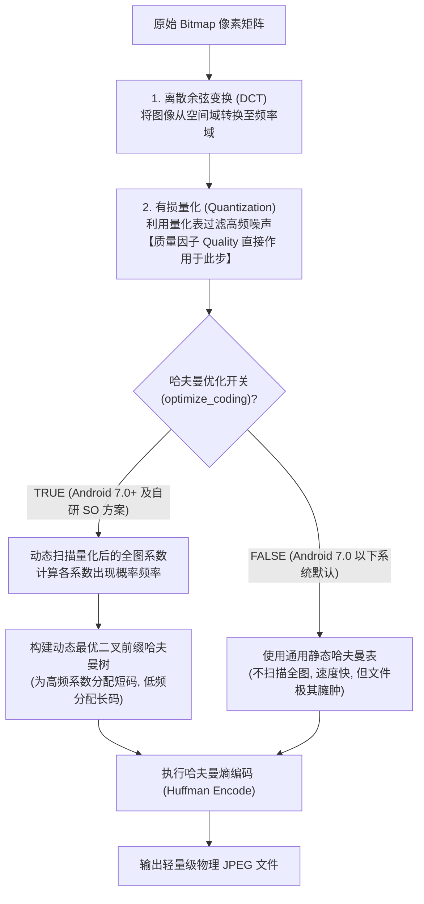

# 5.4.3.3 图片压缩

在 Android 应用程序中，图片始终是引起内存占用抖动（Memory Churn）与磁盘空间膨胀的头号要素。理解图片的压缩机制，不仅需要明白客户端应用层 API 的调用，更需要深入到系统的 C++ Native 层、Skia 图形引擎、以及底层的物理文件编码格式。

本章将系统性解密图片从磁盘文件到内存 Bitmap 载入过程中的**尺寸采样压缩**，以及写回磁盘时的**质量压缩**。我们将深度剖析 Skia 引擎中哈夫曼编码的编译历史悬案、主流图片格式的物理特质差异，并提供可以直接编译运行的工业级压缩实现方案。

---

## 一、 图像文件体积与内存占用的物理代差

在进入压缩算法细节前，必须厘清一个核心的物理事实：**图片在磁盘（或网络传输）中的文件体积，与它在内存中解码后的 Bitmap 占用，具有完全不同的物理量纲与计算规则。**

*   **磁盘/网络文件体积**：
    磁盘上的图片文件（如 `.jpg`、`.png`、`.webp` 等）是经过特定的**压缩编码算法**（有损或无损）处理后的二进制数据流。这些算法的目的是通过消除图像中的空间冗余、视觉冗余来尽量物理缩减文件大小（例如一张 1080p 的高精度风景照，通过 WebP 编码后在磁盘上可能只有 200KB）。
*   **内存 Bitmap 占用**：
    当应用需要将图片展示在屏幕上时，虚拟机必须通过 `BitmapFactory` 对其进行反序列化解码。解码后的 `Bitmap` 在堆内存中是以**一维原始像素矩阵数组**的形式物理存在的。其内存大小完全由图片的分辨率宽高和像素格式（BPP，Bytes Per Pixel）决定，与磁盘文件体积**毫无关系**。
    例如，上述 200KB 的 WebP 图片，如果其分辨率为 $1920 \times 1080$，采用默认的 `ARGB_8888` 格式解码后，在虚拟机内存中占用的空间为：
    $$1920 \times 1080 \times 4\text{ Bytes} = 8,294,400\text{ Bytes} \approx 7.91\text{ MB}$$
    这就解释了为什么 200KB 的图片在频繁加载时，依然能轻易引发主线程 Minor GC 甚至触顶 OOM。

因此，图片治理的核心任务包括：
1.  **尺寸采样压缩**：在解码阶段，控制载入内存的 Bitmap 像素分辨率，防止堆空间暴涨（降维减像素）。
2.  **质量压缩**：在持久化保存阶段，优化图像熵编码，减少写出到物理磁盘的文件大小（无损或微损剔除多余二进制）。

---

## 二、 尺寸采样压缩的底层源码与物理约束

尺寸采样压缩的核心目标是防止“将大分辨率图展示在小像素容器中”导致的内存空耗。

### 1. `inJustDecodeBounds = true` 的 Native 零开销原理
在解码一张大图前，我们通常需要先知道其分辨率，以计算出合理的采样率。
*   *设计缺陷*：如果直接调用 `decode` 获取 Bitmap 再读取宽高，会产生严重的内存开销和 GC Churn。
*   *物理自愈*：将 `BitmapFactory.Options.inJustDecodeBounds` 设为 `true`。
*   *底层 C++ 原理*：
    翻阅 AOSP 底层的 `BitmapFactory.cpp` 源码，其底层的 `doDecode` 方法在遇到 `inJustDecodeBounds == true` 时，会执行特殊的拦截逻辑：
    1.  流式扫描解析图像二进制文件的头部元数据帧。对于 JPEG 格式，扫描至 `SOI`（文件头标记）和 `SOF0`（帧图像开始标记），提取出其中的物理 Width、Height 和色彩通道信息。对于 PNG 格式，扫描至 `IHDR` 数据块（包含 Width/Height 4字节数据）。
    2.  将提取的分辨率写入 `Options` 的 `outWidth` 和 `outHeight`。
    3.  **直接返回 null**，越过底层的内存申请（`sk_sp<SkPixelRef>` 的物理分配）与解码像素填充过程。
    由于没有发生任何像素级的反序列化，这个操作的执行时间是微秒级的，且**零物理内存开销**。

### 2. `inSampleSize` 采样率的 2 的幂次物理限制
通过 `inSampleSize` 可以设置图片的采样率。例如设置 `inSampleSize = 4`，意味着图像的宽和高均被压缩到原来的 $1/4$，总像素数降为原来的 $1/16$，内存开销同步降为原来的 $1/16$。
*   *为什么必须是 2 的幂次？*
    在底层解码器（如 `libjpeg` 中的 `jpeg_read_scanlines`，或者 `libpng` 的插值处理器）中，降采样是在像素解码过程中直接执行的（Decimation）。
    为了实现最快速的像素剔除，底层采用位移操作（Bit Shifting）和最邻近插值（Nearest Neighbor Interpolation）算法。2 的幂次（1, 2, 4, 8, 16）在计算机二进制中仅相当于直接右移（`>>` 1, 2, 3 位）。
    如果开发者传递了非 2 的幂次参数（如 `inSampleSize = 3`），底层解码器为了执行效率，会直接**向下或向上取整为最接近的 2 的幂次值**（通常取整为 2 ），这也是为什么非 2 的幂次设置无法获得精确宽高比例的底层物理原因。

### 3. 工业级尺寸采样计算 Kotlin 实现
下面是满足宽高自适应对齐的 `calculateInSampleSize` 精确换算及尺寸解码的完整 Kotlin 源码：

```kotlin
package com.apm.image

import android.content.res.Resources
import android.graphics.Bitmap
import android.graphics.BitmapFactory
import android.util.Log

/**
 * 工业级图片尺寸采样压缩器
 */
object ImageResizer {

    private const val TAG = "ImageResizer"

    /**
     * 核心计算逻辑：基于目标宽高，计算出最佳的 2 的幂次 inSampleSize
     * @param options 已经过 inJustDecodeBounds = true 解析的配置
     * @param reqWidth 目标容器物理宽度 (px)
     * @param reqHeight 目标容器物理高度 (px)
     */
    fun calculateInSampleSize(options: BitmapFactory.Options, reqWidth: Int, reqHeight: Int): Int {
        // 原始图片物理分辨率
        val height = options.outHeight
        val width = options.outWidth
        var inSampleSize = 1

        if (height <= 0 || width <= 0) {
            return inSampleSize
        }

        // 如果原始分辨率大于目标分辨率，开始计算采样率
        if (height > reqHeight || width > reqWidth) {
            val halfHeight = height / 2
            val halfWidth = width / 2

            // 循环计算：每次乘以 2，直到采样后的宽高小于等于目标宽高
            // 使用 halfWidth 和 halfHeight 保证缩放后的尺寸不会小于目标需求
            while ((halfHeight / inSampleSize) >= reqHeight && (halfWidth / inSampleSize) >= reqWidth) {
                inSampleSize *= 2
            }
        }
        
        Log.d(TAG, "计算采样完成: 原始分辨率=${width}x${height}, 目标尺寸=${reqWidth}x${reqHeight}, 选定采样率=$inSampleSize")
        return inSampleSize
    }

    /**
     * 从资源文件中安全、轻量地解码大图
     */
    fun decodeSampledBitmapFromResource(
        res: Resources,
        resId: Int,
        reqWidth: Int,
        reqHeight: Int
    ): Bitmap {
        // 1. 开启只读边界标志
        val options = BitmapFactory.Options().apply {
            inJustDecodeBounds = true
        }
        
        // 此时仅解析头部元数据，返回 null 且零堆内存开销
        BitmapFactory.decodeResource(res, resId, options)

        // 2. 调用 calculateInSampleSize 计算最佳采样率
        options.inSampleSize = calculateInSampleSize(options, reqWidth, reqHeight)

        // 3. 关闭边界标志，执行真实解码
        options.inJustDecodeBounds = false
        
        // 建议使用 RGB_565 减少一半内存占用（非透明场景下）
        options.inPreferredConfig = Bitmap.Config.RGB_565

        return BitmapFactory.decodeResource(res, resId, options)
    }
}
```

---

## 三、 质量压缩与 libjpeg 哈夫曼编码（Huffman Coding）解密

质量压缩的本质是**调整文件保存时的有损量化比率，并不改变图像物理分辨率**。

### 1. `Bitmap.compress()` 的底层 C++ 调用链与物理耗时
当我们在 Java 层执行 `bitmap.compress(Bitmap.CompressFormat.JPEG, quality, out)` 时，其底层的物理流转链路如下：
1.  **Java 层**：`Bitmap.class` 内部通过 JNI 调用 `Bitmap.cpp` 中的 `Bitmap_write`。
2.  **Skia 引擎层**：通过 `SkImageEncoder` 寻找到 JPEG 的编码器代理 `SkJpegEncoder`。
3.  **C++ Native 层**：`SkJpegEncoder` 引入底层的开源 `libjpeg`（或现代的 `libjpeg-turbo`）C 库，执行原生的 JPEG 编码过程。
4.  **硬件层**：执行 CPU 算力密集型的离散余弦变换（DCT）与哈夫曼熵编码，最终流式写入物理磁盘中。

### 2. 哈夫曼编码（Huffman Coding）动态优化开关历史悬案
在 Android 7.0 之前，许多开发者会发现一个奇怪的物理现象：**在 Android 手机上对一张图片进行 JPEG 压缩保存，所得到的文件体积往往非常臃肿，即便把 Quality 调得很低，文件体积依然比 iOS 压缩出来的同等清晰度图片大 30% 以上。**

这背后隐藏着 Google 早期 AOSP 底层编译配置的一个“历史大坑”：
*   **物理瓶颈成因**：
    在哈夫曼熵编码（Huffman Coding）阶段，压缩引擎需要根据图像像素的出现频率，动态构建一棵不等长的最优二叉树（哈夫曼树）。然而，**构建哈夫曼树需要两轮全图扫描，是高密度的 CPU 计算过程。**
    在 Android 诞生之初（Android 1.0 ~ 6.0 时代），手机 CPU 硬件算力极其薄弱（多为单核 600MHz ~ 1GHz 架构）。为了照顾极速保存的体验，防止主线程保存图片时发生明显的“顿卡”，Google 强行在底层的 `libjpeg` 配置中，将动态哈夫曼优化开关 **`optimize_coding` 默认置为了 `FALSE`**。
*   *弊端*：
    关闭动态哈夫曼优化后，系统在压缩图片时，直接使用了一张**硬编码的、静态通用的哈夫曼编码表**。这张表对于绝大多数具体照片来说，根本不是最优二叉前缀码，这直接导致了压缩效率暴跌、同等质量下文件体积过度膨胀。
*   *解决与演进*：
    随着多核手机 CPU 算力的爆发（如 API 24 时代多核 2GHz+ 普及），这一限制在 **Android 7.0 之后被官方默认开启**（`optimize_coding` 设为了 `TRUE`）。
    对于低版本系统（Android 7.0 以下），大型互联网企业通常会**自己编译 Native 层的 `libjpeg-turbo` 共享库（.so）**，强行在代码中配置 `cinfo.optimize_coding = TRUE;` 来避开系统自带 Skia 的硬伤，实现高效的有损压缩。

#### 哈夫曼无损熵编码的代数物理原理：
在离散余弦变换（DCT）和量化器裁剪后，图像像素的高频噪声已被部分剔除，产生大量重复的零系数序列。哈夫曼编码通过统计这些量化系数出现的概率 $P(x_i)$：
1.  对概率高的符号，分配极短的二进制码字（如 $0$ 或 $10$）；
2.  对概率低的罕见符号，分配较长的码字（如 $111010$）；
3.  通过这种“非等长前缀编码”，消除编码冗余，在**完全不损失任何画质信息**的前提下，让二进制流文件物理体积直接压缩 30%~50%。



---

## 四、 核心 Native 质量压缩组件自研伪代码

为了在全版本 Android（尤其是低版本）设备上均能实现最高效的质量压缩，大厂通常会在 Native 层自己载入 `libjpeg-turbo` 库。下面是基于 C++ 的 Native 核心质量压缩实现逻辑：

```cpp
#include <jni.h>
#include <android/bitmap.h>
#include <stdio.h>
#include <setjmp.h>
#include "jpeglib.h" // 引入 Native libjpeg 头文件

// 用于错误处理的结构体
struct my_error_mgr {
    struct jpeg_error_mgr pub;
    jmp_buf setjmp_buffer;
};

typedef struct my_error_mgr *my_error_ptr;

METHODDEF(void) my_error_exit(j_common_ptr cinfo) {
    my_error_ptr myerr = (my_error_ptr) cinfo->err;
    (*cinfo->err->output_message) (cinfo);
    longjmp(myerr->setjmp_buffer, 1);
}

/**
 * JNI 实现：Native 高性能哈夫曼质量压缩
 */
extern "C"
JNIEXPORT jint JNICALL
Java_com_apm_image_ImageCompressor_nativeCompress(JNIEnv *env, jobject thiz, 
                                                 jobject bitmap, jint quality, 
                                                 jstring dst_path) {
    AndroidBitmapInfo info;
    void *pixels;
    
    // 1. 获取 Bitmap 信息与像素物理内存指针
    if (AndroidBitmap_getInfo(env, bitmap, &info) < 0) return -1;
    if (AndroidBitmap_lockPixels(env, bitmap, &pixels) < 0) return -2;

    const char *path = env->GetStringUTFChars(dst_path, nullptr);
    FILE *outfile = fopen(path, "wb");
    if (outfile == nullptr) {
        AndroidBitmap_unlockPixels(env, bitmap);
        env->ReleaseStringUTFChars(dst_path, path);
        return -3;
    }

    struct jpeg_compress_struct cinfo;
    struct my_error_mgr jerr;

    cinfo.err = jpeg_std_error(&jerr.pub);
    jerr.pub.error_exit = my_error_exit;

    if (setjmp(jerr.setjmp_buffer)) {
        jpeg_destroy_compress(&cinfo);
        fclose(outfile);
        AndroidBitmap_unlockPixels(env, bitmap);
        env->ReleaseStringUTFChars(dst_path, path);
        return -4;
    }

    // 2. 初始化 JPEG 压缩器
    jpeg_create_compress(&cinfo);
    jpeg_stdio_dest(&cinfo, outfile);

    cinfo.image_width = info.width;
    cinfo.image_height = info.height;
    cinfo.input_components = 3; // RGB 3通道
    cinfo.in_color_space = JCS_RGB;

    jpeg_set_defaults(&cinfo);
    jpeg_set_quality(&cinfo, quality, TRUE);

    // 【最核心物理步骤】：强行开启哈夫曼动态最优编码表优化
    // 这将强行触发二叉前缀树的动态扫描构建，直接缩减 30%+ 压缩文件体积
    cinfo.optimize_coding = TRUE; 

    jpeg_start_compress(&cinfo, TRUE);

    // 3. 逐行读取 Bitmap 像素并转换为 RGB 格式写入 JPEG
    int row_stride = info.width * 4; // ARGB_8888 占 4 字节
    JSAMPROW row_pointer[1];
    auto *data = (uint8_t *) pixels;
    auto *rgb_data = (uint8_t *) malloc(info.width * 3);

    while (cinfo.next_scanline < cinfo.image_height) {
        // 解构像素：将 ARGB_8888 剥离出 RGB 通道
        uint8_t *line = data + cinfo.next_scanline * row_stride;
        for (int i = 0; i < info.width; ++i) {
            rgb_data[i * 3 + 0] = line[i * 4 + 2]; // Red
            rgb_data[i * 3 + 1] = line[i * 4 + 1]; // Green
            rgb_data[i * 3 + 2] = line[i * 4 + 0]; // Blue
        }
        row_pointer[0] = rgb_data;
        jpeg_write_scanlines(&cinfo, row_pointer, 1);
    }

    // 4. 完成压缩，释放所有物理内存
    jpeg_finish_compress(&cinfo);
    jpeg_destroy_compress(&cinfo);
    free(rgb_data);
    fclose(outfile);
    
    AndroidBitmap_unlockPixels(env, bitmap);
    env->ReleaseStringUTFChars(dst_path, path);
    return 0; // 压缩成功
}
```

---

## 五、 四大图片格式的物理特质大矩阵

为了在不同的业务场景中选择最优的图片格式（例如大图首屏、占位符、半透明蒙版、高效存储），我们需要从物理层面对主流的四种图片编解码格式进行横向的对比分析：

| 物理维度 | JPEG | PNG | WebP | HEIF (Android 9+) |
| :--- | :--- | :--- | :--- | :--- |
| **压缩类型** | 有损压缩 | 无损压缩 | 有损 & 无损均支持 | 有损 & 无损均支持 |
| **透明通道 (Alpha)**| 不支持 | **支持** | **支持** | **支持** |
| **底层核心算法** | DCT (离散余弦) + 熵编码 | LZ77 游程字典 + DEFLATE | VP8 帧内空间预测 + 差分 | HEVC / H.265 块内预测与代数推演 |
| **压缩效率 (相同质量)**| 差（容易在复杂边缘产生模糊）| 极差（体积巨大，仅用于无损）| 极佳（相同质量体积比 JPEG 小 30%~50%） | **统治级**（体积仅为 WebP 的 50% 左右） |
| **CPU 解码能耗开销** | 极低（老旧格式，极度适配硬件）| 极低 | 中等（算力需求略大于 JPEG） | 极高（需要手机 Soc 提供专用硬件解码器） |
| **兼容性** | 100% 物理支持 | 100% 物理支持 | API 14+（完全支持为 API 18+）| Android 9.0+ (API 28+) |

### WebP 在平滑渐变处的“帧内预测（Intra-prediction）”算法物理优势
WebP 之所以能在相同画质下拥有对 JPEG 的降维打击级优势，核心源自其引入了现代视频编码（VP8）的**帧内预测（Intra-prediction）**算法：
*   *JPEG 缺点*：在压缩天空、皮肤等大面积平滑渐变的图像区域时，由于以 $8 \times 8$ 的小图像块（Block）独立进行离散余弦变换（DCT）和量化，在高质量要求下会导致频繁保存微小噪声，导致文件体积激增；而在低质量下会导致图像块边缘不连续，出现“马赛克”和“色块”。
*   *WebP 自愈*：WebP 放弃了独立的块变换。它将图像切分为多个 $4 \times 4$ 或 $16 \times 16$ 的宏块（Macroblock）。在编码当前宏块时，**直接提取其相邻已编码宏块的边界像素作为基准**，使用以下 4 种预测模式（水平预测、垂直预测、直流 DC 预测、True Motion 真实运动预测）在时空维度推演当前块的像素分布。
*   在完成数学预测后，WebP **仅将当前的预测残差数据（Residuals，即真实像素与预测像素的微小差值）送去执行有损压缩。** 由于残差数据中的高频冗余被彻底消除，包含大量的接近 0 的数值，这使得随后的熵编码能够物理输出极小体积的二进制数据流，实现了图像体积压缩的巨大革命。

---

## 延伸阅读与参考资料
*   Android 7.0 之后关于 `optimize_coding` 开启的版本变迁：[AndroidVersionChangeLog.md](../../../../../AndroidVersionChangeLog.md#android-70api-24)
*   大图加载在内存触顶自愈时的 RGB_565 降级治理：[5.4.3.2.OOM.md](5.4.3.2.OOM.md)
*   Glide 内部 BitmapPool 与 inBitmap 复用优化：[5.3.2.1.3.BitmapPool.md](../../5.3.主流三方开源库/5.3.2.图片加载/5.3.2.1.Glide/5.3.2.1.3.BitmapPool.md)
