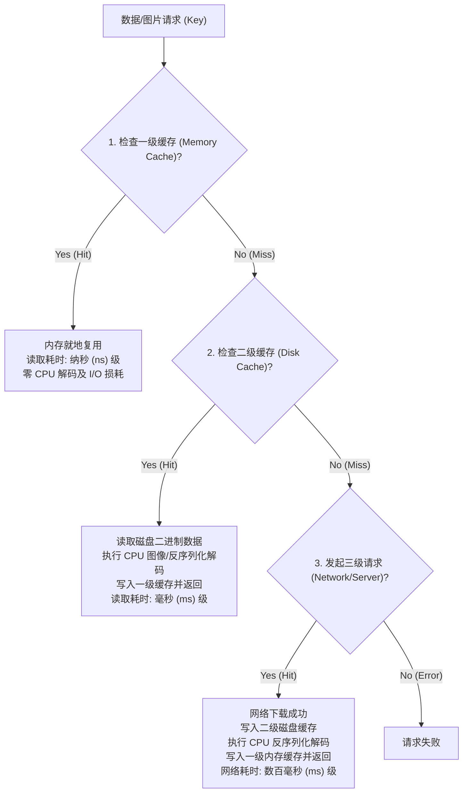
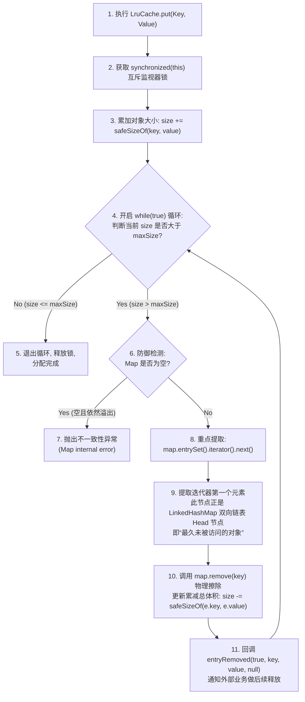

# 5.4.3.4 缓存策略

在移动端应用程序的性能治理中，缓存是平衡“网络带宽消耗、CPU 解码算力与系统物理内存”最核心的防线。一个优秀的缓存系统，必须建立在清晰的多级分层哲学之上，并妥善解决有限硬件空间与无限数据增长的核心矛盾。

本章将系统性解密 Android 原生内存缓存 `LruCache` 依靠 `LinkedHashMap` 动态重组指针的双向链表 LRU 算法，解密磁盘缓存 `DiskLruCache` 采用日志型目录重构（journal）与临时文件原子性重命名（rename）的物理抗灾防损机制，并提供可以直接运行的高并发双层缓存桥接 Kotlin 源码实现。

---

## 一、 缓存的分层哲学与硬件物理约束

缓存的核心设计目标是**“以空间换时间，用低廉的低能耗存储换取高代价的高能耗网络/算力传输”**。在 Android 平台中，通常采用三级分层缓存体系：



### 缓存面临的物理硬件硬约束：
1.  **一级内存缓存（LruCache）**：
    *   *物理介质*：运行内存（RAM）。
    *   *性能*：纳秒（ns）级，极快，直接持有 Java 对象强引用，免去一切反序列化和 I/O 开销。
    *   *空间约束*：受 `dalvik.vm.heapgrowthlimit` 虚拟堆空间上限的严重制约。因此，内存缓存必须设置最大水位线（MaxSize），并实时执行**动态淘汰**，以防应用进程被 OOM 强杀。
2.  **二级磁盘缓存（DiskLruCache）**：
    *   *物理介质*：闪存颗粒（ROM/NAND Flash）。
    *   *性能*：微秒到毫秒级，涉及物理磁盘 I/O 及 CPU 的反序列化（例如图片文件的 JPEG 解码）开销。
    *   *空间约束*：受用户手机存储空间的硬性制约。磁盘缓存也必须有最大字节数控制，并且必须具备极高的**断电/系统崩溃容灾抗损性**，以防日志损坏或文件写半截导致的磁盘格式异常。

---

## 二、 内存缓存之王：LruCache 与 LinkedHashMap 底层解密

Android 原生提供的 `LruCache<K, V>` 是内存治理的核心组件。其内部算法的执行，完全寄托在 Java 基础类 `LinkedHashMap` 精妙的双向链表指针移动之上。

### 1. LinkedHashMap 的散列表与双向链表融合拓扑
传统的 `HashMap` 仅通过散列表（数组+链表/红黑树）进行数据存储，其内部元素是无序的。
*   **LinkedHashMap 的物理重构**：
    `LinkedHashMap` 继承自 `HashMap`。它不仅保留了哈希查找的 $O(1)$ 性能，还在内部为每一个 `Entry` 结构体物理扩展了两个核心指针：
    ```java
    static class LinkedHashMapEntry<K,V> extends HashMap.Node<K,V> {
        LinkedHashMapEntry<K,V> before, after; // 维护双向循环链表的关键指针
        ...
    }
    ```
    在 LinkedHashMap 内部，所有的 Entry 节点，除了存在于哈希桶的桶链中，还被强行串联在一个**全局双向循环链表**中。

*   **`accessOrder = true` 的指针漂移控制（最核心）**：
    当在构造 `LinkedHashMap` 时传入 `accessOrder = true`，其排序方式将由默认的“插入顺序”切换为“**访问顺序（Access Order）**”。
    在访问顺序模式下，一旦外界调用了 `map.get(key)` 或 `map.put(key, value)` 成功命中某节点时，LinkedHashMap 内部会触发 `afterNodeAccess(Node e)` 回调。该回调会在 Native/JVM 的逻辑层面，执行 C 级指针般的重组：
    1.  提取目标节点 `e` 的 `before` 和 `after` 指针；
    2.  将被访问节点 `e` 从双向链表的当前位置脱离，将其前后节点进行对接；
    3.  将节点 `e` 重新插入到双向链表的**尾部（Tail）**。
    通过这个物理指针漂移设计，在双向循环链表中，**链表头部（Head）永远保留着最久未被访问的 Entry，而链表尾部（Tail）永远保留着刚刚被访问的活跃 Entry。**

### 2. LruCache 的同步锁与 trimToSize 溢出淘汰算法
由于 `LinkedHashMap` 内部的指针漂移设计涉及多步链表操作，它在多线程环境下是非线程安全的。尤其在 `accessOrder=true` 模式下，即便仅仅是只读的 `get()` 操作，也会实质性修改内部的指针结构，极易引发 `ConcurrentModificationException`。
*   *同步锁卡控*：
    Android `LruCache` 在设计上，所有的关键入口（`get`、`put`、`remove`）全都在方法内部加上了 **`synchronized(this)` 监视器锁**，以确保多线程高并发访问时的绝对一致性。
*   *trimToSize(maxSize) 淘汰细节*：
    每当我们调用 `put()` 向 LruCache 塞入新数据时，系统都会累加其 `size`。一旦 `size > maxSize` 触发溢出，LruCache 会在锁内开启一个无条件 `while(true)` 循环执行 `trimToSize()` 淘汰：



---

## 三、 持久化存储缓存：DiskLruCache 日志索引与原子写入

当数据需要写入磁盘持久化时，我们不能直接使用 JVM 级别的 `LruCache`，必须依赖 `DiskLruCache`。其底层最精妙的设计，莫过于日志型目录（journal）以及临时文件写入的物理原子重命名（rename）机制。

### 1. journal 日志文件的设计哲学与开机自愈重建
为什么 `DiskLruCache` 在闪存中不需要复杂的数据库（如 SQLite）来维护缓存索引？
*   **journal 设计原因**：
    数据库维护需要频繁地执行 B-Tree 索引重平衡及事务提交，对于高频的卡片/大图缓存来说，I/O 开销过于昂贵，且极易因为断电引发数据库损坏。
*   **journal 物理本质**：
    `DiskLruCache` 仅仅在磁盘缓存根目录下维护了一个名为 **`journal`** 的纯文本文件。该文件记录了每一次读、写、删的日志指令。
*   **journal 文件的 5 大行动指令**：
    ```text
    libcore.io.DiskLruCache
    1
    100
    1

    DIRTY 34028a2b537b020b61400d35e1d90f23
    CLEAN 34028a2b537b020b61400d35e1d90f23 4608
    READ 34028a2b537b020b61400d35e1d90f23
    DIRTY 2a09c8df39ac8930b209c30bc128f230
    REMOVE 2a09c8df39ac8930b209c30bc128f230
    ```
    *   `DIRTY`：准备写入某个缓存。表示该缓存正在被下载或生成，但**尚未完全写入成功**。
    *   `CLEAN`：写入成功。后面伴随着图片的字节数（如 4608 字节）。只有带有 `CLEAN` 标志的缓存才是可读的。
    *   `READ`：读取了一次该缓存。用于更新该缓存在内存 LinkedHashMap 中的活跃顺序。
    *   `REMOVE`：该缓存已被删除淘汰。

*   **开机自愈重建原理**：
    当应用启动、调用 `DiskLruCache.open()` 初始化时，系统会流式读取并解析这个 `journal` 文件的每一行：
    1.  读到 `DIRTY`：在内存中的 `LinkedHashMap` 里为该 Key 创建一个 Entry 占位符，但将其标记为不可用（由于只有 DIRTY 说明写入过程发生了断电或崩溃，是脏数据）。
    2.  读到 `CLEAN`：将该 Key 的 Entry 标记为可用，并记录其物理文件大小。
    3.  读到 `REMOVE`：从内存 LinkedHashMap 中剔除该 Key。
    4.  读到 `READ`：将该 Key 对应的节点移动到 LinkedHashMap 的 Tail。
    扫描完毕后，内存中便**重构出了一棵完美的、与物理磁盘缓存状态完全对齐的双向链表索引树**。紧接着，系统会遍历那些状态依然为 `DIRTY` 的键，将其在磁盘上的临时残留垃圾文件物理清除。

*   **`rebuildJournal()` 的高频退避优化**：
    随着读写增加，journal 日志会变得极其臃肿。当操作次数（redundantOpCount）累计达到 2000 次时，`DiskLruCache` 会在后台线程强行触发 `rebuildJournal()`：遍历当前内存中健康的 LinkedHashMap 目录树，清除所有的无用垃圾日志，并将所有可用的项以 `CLEAN` 指令重新生成一份干净、压缩的全新 journal 文件。

### 2. Editor 临时文件原子重命名机制（防损坏）
如果应用在网络下载大图并直接写入目标缓存文件 `34028a2b537b020b61400d35e1d90f23` 时，突然遭遇系统崩溃、断电、或者用户强杀进程：
*   *缺陷*：目标文件会被写入一半，成为损坏的残缺文件。下一次读取时，解码器会直接报错甚至崩溃。
*   *自愈解决（Editor 原子写入）*：
    `DiskLruCache` 通过 `Editor` 机制，提供了物理防损坏隔离：
    1.  当调用 `editor.newOutputStream(0)` 时，系统在磁盘上创建的是一个带有 **`.tmp`** 后缀的临时文件：`34028a2b537b020b61400d35e1d90f23.tmp`。所有的网络数据均流式写入此临时文件中。
    2.  如果在下载中途断线，该文件始终只是个 `.tmp` 临时文件，永远不会进入缓存读取队列（因为 journal 里只有该 Key 的 `DIRTY` 记录，没有 `CLEAN` 记录）。
    3.  当网络数据 100% 完整下载并写入结束后，业务层调用 `editor.commit()`。
    4.  在 `commit()` 内部，系统将调用操作系统的 Native 方法（在 Java 层对应 `File.renameTo()`），这在 Linux 内核底层会触发 `rename` 系统调用。
    5.  `rename()` 系统调用是**原子性的操作（Atomic Operation）**。在文件系统层面，它只修改了 inode 的指向，瞬间将 `34028a2b537b020b61400d35e1d90f23.tmp` 重命名为 `34028a2b537b020b61400d35e1d90f23`。
    由于该重命名操作在内核中要么完成，要么完全没有发生，这就从物理根源上**100% 避免了因中途写入中断产生残损缓存文件的致命隐患**。

---

## 四、 高并发工业级双层缓存桥接器 Kotlin 源码实现

在大型 Android 项目中，我们通常将 `LruCache`（一级内存缓存）与 `DiskLruCache`（二级磁盘缓存）联动使用，以保证读取性能并避免 OOM。

下面是带有自适应堆大小计算、线程安全、支持局部清理的 `DoubleCacheDispatcher` 完整 Kotlin 源码实现：

```kotlin
package com.apm.cache

import android.content.Context
import android.graphics.Bitmap
import android.graphics.BitmapFactory
import android.util.Log
import android.util.LruCache
import com.jakewharton.disklrucache.DiskLruCache
import java.io.File
import java.io.IOException
import java.io.InputStream
import java.io.OutputStream
import java.security.MessageDigest
import java.util.concurrent.locks.ReentrantReadWriteLock
import kotlin.concurrent.read
import kotlin.concurrent.write

/**
 * 工业级双层缓存分发处理器 (LruCache + DiskLruCache 联合桥接)
 * 具备线程安全读写锁控制与自适应 Heap 动态分配
 */
class DoubleCacheDispatcher private constructor(context: Context) {

    companion object {
        private const val TAG = "DoubleCache"
        
        // 磁盘缓存子目录名称
        private const val DISK_CACHE_DIR = "apm_disk_cache"
        
        // 磁盘最大缓存阈值 (100MB)
        private const val DISK_MAX_SIZE = 100 * 1024 * 1024.toLong()
        
        private const val APP_VERSION = 1
        private const val VALUE_COUNT = 1 // 每个 Key 对应一个物理文件

        @Volatile
        private var instance: DoubleCacheDispatcher? = null

        fun getInstance(context: Context): DoubleCacheDispatcher {
            return instance ?: synchronized(this) {
                instance ?: DoubleCacheDispatcher(context.applicationContext).also { instance = it }
            }
        }
    }

    // 一级内存缓存
    private val memoryCache: LruCache<String, Bitmap>
    
    // 二级磁盘缓存
    private var diskCache: DiskLruCache? = null

    // 读写锁：保护磁盘与内存多线程并发一致性
    private val rwLock = ReentrantReadWriteLock()

    init {
        // 1. 动态自适应分配一级内存缓存大小
        // 动态读取当前虚拟机分配的最大可用 Heap 堆大小的 1/8 作为缓存上限，防 OOM
        val maxMemory = Runtime.getRuntime().maxMemory()
        val cacheSize = (maxMemory / 8).toInt()
        
        memoryCache = object : LruCache<String, Bitmap>(cacheSize) {
            override fun sizeOf(key: String, value: Bitmap): Int {
                // 计算 Bitmap 占用的真实字节数
                return value.allocationByteCount
            }
        }
        Log.i(TAG, "一内存缓存配置完成，自适应上限大小: ${cacheSize / 1024 / 1024} MB")

        // 2. 初始化二级磁盘缓存
        try {
            val cacheDir = getDiskCacheDir(context, DISK_CACHE_DIR)
            diskCache = DiskLruCache.open(cacheDir, APP_VERSION, VALUE_COUNT, DISK_MAX_SIZE)
            Log.i(TAG, "二级磁盘缓存配置完成，保存目录: ${cacheDir.absolutePath}")
        } catch (e: IOException) {
            Log.e(TAG, "初始化二级磁盘缓存失败", e)
        }
    }

    /**
     * 写入缓存（高并发线程安全写入）
     */
    fun put(key: String, bitmap: Bitmap) {
        val cacheKey = hashKeyForDisk(key)
        
        // 一级内存写入（持有独占写锁）
        rwLock.write {
            memoryCache.put(cacheKey, bitmap)
            Log.d(TAG, "写入一级内存缓存成功, Key: $cacheKey")
        }

        // 二级磁盘异步写入（持有共享读锁即可，因为写锁由 DiskLruCache 内部同步锁保证）
        rwLock.read {
            val disk = diskCache ?: return
            var editor: DiskLruCache.Editor? = null
            try {
                // 1. 动态开启原子性 Editor 写入通道
                editor = disk.edit(cacheKey)
                if (editor != null) {
                    val outputStream: OutputStream = editor.newOutputStream(0)
                    // 2. 将 Bitmap 压缩格式写出到临时文件（.tmp）中
                    val compressSuccess = bitmap.compress(Bitmap.CompressFormat.PNG, 100, outputStream)
                    outputStream.flush()
                    outputStream.close()

                    if (compressSuccess) {
                        // 3. 100% 成功无损后，原子性 rename 物理转正
                        editor.commit()
                        Log.d(TAG, "写入二级磁盘缓存成功, Key: $cacheKey")
                    } else {
                        editor.abort()
                        Log.e(TAG, "Bitmap 压缩失败，废弃本次写入")
                    }
                }
            } catch (e: IOException) {
                Log.e(TAG, "写入磁盘缓存异常", e)
                try {
                    editor?.abort()
                } catch (ignored: Exception) {}
            }
        }
    }

    /**
     * 读取缓存（读写分离高并发卡控）
     */
    fun get(key: String): Bitmap? {
        val cacheKey = hashKeyForDisk(key)

        // 1. 尝试从一级内存中读取（读锁控制）
        rwLock.read {
            val memoryBitmap = memoryCache.get(cacheKey)
            if (memoryBitmap != null) {
                Log.d(TAG, "一级内存缓存命中 (Memory Cache Hit), Key: $cacheKey")
                return memoryBitmap
            }
        }

        // 2. 一级未命中，尝试从二级磁盘中读取（读锁控制）
        rwLock.read {
            val disk = diskCache ?: return null
            var inputStream: InputStream? = null
            try {
                val snapshot = disk.get(cacheKey)
                if (snapshot != null) {
                    Log.d(TAG, "二级磁盘缓存命中 (Disk Cache Hit), Key: $cacheKey")
                    inputStream = snapshot.getInputStream(0)
                    val diskBitmap = BitmapFactory.decodeStream(inputStream)
                    
                    if (diskBitmap != null) {
                        // 3. 回写到一级内存中，方便下次 $O(1)$ 快速检索
                        rwLock.write {
                            memoryCache.put(cacheKey, diskBitmap)
                        }
                        return diskBitmap
                    }
                }
            } catch (e: IOException) {
                Log.e(TAG, "读取磁盘缓存异常", e)
            } finally {
                try {
                    inputStream?.close()
                } catch (ignored: Exception) {}
            }
        }

        Log.w(TAG, "多级缓存未命中 (Cache Miss), Key: $cacheKey")
        return null
    }

    /**
     * 清理内存（在系统内存触顶时，提供外部组件回调清空内存）
     */
    fun clearMemory() {
        rwLock.write {
            memoryCache.evictAll()
            Log.i(TAG, "一级内存缓存已被强行完全清空回收。")
        }
    }

    /**
     * 辅助方法：生成缓存子目录
     */
    private fun getDiskCacheDir(context: Context, uniqueName: String): File {
        val cachePath = if (context.externalCacheDir != null) {
            context.externalCacheDir!!.path
        } else {
            context.cacheDir.path
        }
        return File(cachePath + File.separator + uniqueName)
    }

    /**
     * 辅助方法：将 URL 等复杂 Key 经过 MD5 编码，转化为安全的磁盘文件名
     */
    private fun hashKeyForDisk(key: String): String {
        return try {
            val digest = MessageDigest.getInstance("MD5")
            digest.update(key.toByteArray())
            val bytes = digest.digest()
            val sb = StringBuilder()
            for (b in bytes) {
                val hex = Integer.toHexString(0xFF and b.toInt())
                if (hex.length == 1) {
                    sb.append('0')
                }
                sb.append(hex)
            }
            sb.toString()
        } catch (e: Exception) {
            key.hashCode().toString()
        }
    }
}
```

---

## 延伸阅读与参考资料
*   Android 内存触顶信号 ComponentCallbacks2 深度治理：[5.4.3.2.OOM.md](5.4.3.2.OOM.md)
*   大图尺寸采样与 libjpeg-turbo 编译配置历史：[5.4.3.3.图片压缩.md](5.4.3.3.图片压缩.md)
*   Glide 开源图片加载框架中缓存复用池 BitmapPool 的设计：[5.3.2.1.3.BitmapPool.md](../../5.3.主流三方开源库/5.3.2.图片加载/5.3.2.1.Glide/5.3.2.1.3.BitmapPool.md)
