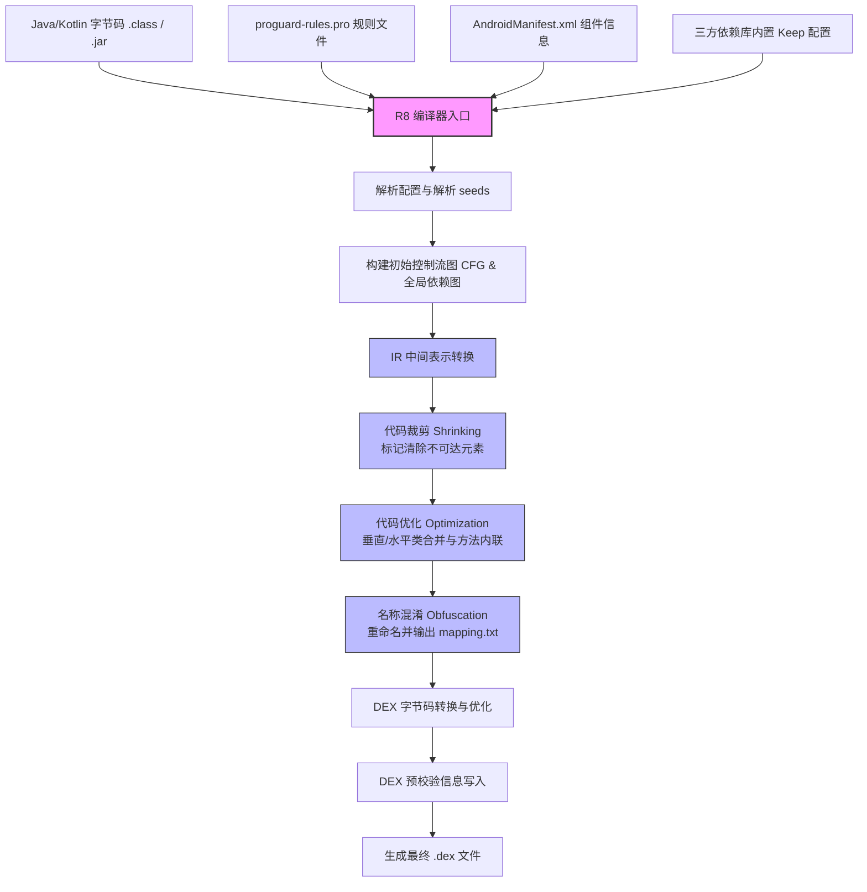
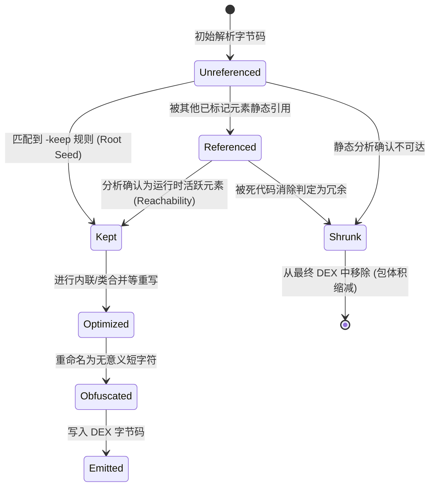

# 深入 Android 构建系统：R8 混淆压缩与优化机制的深度技术剖析

在现代 Android 应用开发中，性能优化与包体积压缩是衡量应用品质的核心指标。随着 Android 构建工具链的不断演进，R8 已经成为包体积优化、代码优化与安全防护的绝对核心。作为 ProGuard 的现代替代者，R8 深度融入了 Android Gradle Plugin (AGP) 构建流程。

本文将从历史演进、脱糖机制、底层工作机制与算法设计、Keep 规则精讲、深度优化与排障排查，以及案例对比等维度，对 R8 的混淆与压缩机制进行全方位的深度剖析，帮助开发者在实际工程中更好地进行包体积优化与排障。

---

## 第一部分：概念与背景——从 ProGuard 到 R8 的历史演进

要深刻理解 R8 的价值，首先需要梳理 Android 构建系统中字节码处理技术的发展脉络。

### 1. 编译链的演进历程

在早期的 Android 构建流程中，Java 源码被编译为 `.class` 文件后，包体积优化与混淆主要依赖 ProGuard，随后再通过 `dx` 编译器将优化后的字节码转换为 Android 设备可执行的 `.dex` 文件。这一阶段的编译链如下所示：

`Java 源码` $\rightarrow$ `javac` $\rightarrow$ `.class / .jar` $\rightarrow$ `ProGuard` $\rightarrow$ `优化后的 .class` $\rightarrow$ `dx 编译器` $\rightarrow$ `.dex 文件`

这种传统架构存在严重的物理缺陷与冗余开销：
* **多步骤冗余与性能开销**：ProGuard 与 `dx` 是两个完全独立的工具。ProGuard 读入字节码，对其进行分析、裁剪、优化并写回 `.class`，随后 `dx` 再次读入这些字节码，重新解析常量池并翻译为 DEX。这带来了大量的 I/O 操作和常量池的重复解析，导致编译耗时漫长。
* **脱糖（Desugaring）的复杂性与低效性**：随着 Java 8 语法的引入（例如 Lambda 表达式、默认接口方法、方法引用、Stream API 等），为了使这些现代语言特性能够在低版本 Android 系统上平稳运行，构建系统引入了“脱糖”技术。在旧的编译链中，脱糖是以独立插件的形式在编译期的早期阶段进行的。它会生成大量的合成类（Synthetic Classes），这无需多言地加重了后续 ProGuard 和 dx 编译器的处理负担，导致类数量和方法数进一步膨胀。
* **信息丢失与优化断层**：ProGuard 运行在 Java 字节码层面，对 Android 平台专属 of DEX 字节码特性（如寄存器分配、DEX 方法数限制、动态指令优化等）一无所知。这就导致 ProGuard 做出的某些优化决策在经过 `dx` 翻译后可能会失效，甚至在某些情况下会由于 dx 翻译 of 局限性引入额外的指令开销。

为了解决这些行业痛点，Google 启动了工具链重构计划：
1. **D8 编译器**：在 Android Studio 3.1 中，Google 引入了 D8 编译器以替代旧的 `dx`。D8 在编译速度、DEX 文件大小以及运行时性能上都取得了突破性的提升，并且高效地集成了脱糖过程，将脱糖推迟到生成 DEX 的阶段进行，减少了中间产物的生成。
2. **R8 优化器**：在 Android Studio 3.3 中，Google 首次引入了 R8 预览版，并在 3.4 版本中将其作为默认的混淆与压缩工具，彻底取代了 ProGuard + D8 的组合。

R8 将原本分立的混淆、优化、裁剪与 DEX 翻译四个步骤深度融合成一个单一的编译步骤：

`Java / Kotlin 源码` $\rightarrow$ `kotlinc / javac` $\rightarrow$ `.class` $\rightarrow$ `R8 编译器（合并了裁剪、优化、混淆与 DEX 翻译）` $\rightarrow$ `.dex 文件`

### 2. ProGuard 与 R8 的核心差异

R8 并不是 ProGuard 的简单升级，而是 Google 采用 Kotlin 重写的全新一代编译器。它们之间的核心差异如下表所示：

| 对比维度 | ProGuard + D8 / dx | R8 编译器 |
| :--- | :--- | :--- |
| **开发语言** | Java | Kotlin |
| **工作步骤** | 分立：先进行 Class-to-Class 优化，再进行 Class-to-DEX 翻译 | 合并：在将 Class 转换为 DEX 的过程中，同步进行一站式优化与混淆 |
| **编译耗时** | 较慢（由于存在多次 I/O 与重复的常量池解析） | 显著加快（单步处理，工作内存和 CPU 资源占用更低） |
| **优化深度** | 偏向于 Java 通用字节码优化 | 深度契合 Android 平台，能根据 DEX 指令集与寄存器特性进行专属优化 |
| **配置文件支持** | 采用 ProGuard 规则语法 | 完美向后兼容 ProGuard 规则语法，开发者无迁移成本 |
| **类合并与内联** | 相对局限，无法跨越 DEX 边界 | 支持深度的垂直/水平类合并，以及基于 DEX 指令数量的启发式方法内联 |

随着 Android 虚拟机从 Dalvik 彻底转向 ART（关于虚拟机的演进可参见根目录下的 [AndroidVersionChangeLog.md](../../../../../AndroidVersionChangeLog.md) 中关于 Android 5.0 默认 ART 运行时的记录），更紧凑的 DEX 结构与高效的类加载机制对编译器的要求越来越高。R8 正是在这种背景下诞生的，它使得包体积优化的效果和编译效率都得到了质的飞跃。

### 3. R8 的四大核心功能

R8 在工作时，主要通过以下四个核心功能对应用代码进行提炼与压缩：

#### ① Shrinking（代码裁剪 / 摇树优化）
代码裁剪通常被称为“摇树优化（Tree Shaking）”。R8 会静态分析应用在运行时所有可能的执行路径，构建出一个全局的可达性依赖图（Reachability Graph）。对于那些从任何入口点（如四大组件或显式指定的 Keep 入口）出发都无法触达的类、字段、方法和属性，R8 会判定其为死代码（Dead Code）并将其从最终的 `.dex` 文件中彻底移除。这不仅包括开发者自己未使用的代码，也包括引入的庞大第三方依赖库中未被调用的冗余代码。

#### ② Optimization（代码优化）
与单纯删除代码不同，代码优化会修改代码的逻辑结构以提升运行时效率并减小体积。R8 的优化手段非常丰富，包括：
* **方法内联（Method Inlining）**：将短小的方法体直接复制到调用处，消除方法调用时栈帧创建与销毁的开销。
* **类合并（Class Merging）**：将没有多态表现的父子类或者结构高度相似的兄弟类进行合并，减少 DEX 中类定义（Class Definition）的开销。
* **参数移除（Parameter Removal）**：如果方法的某个入参在方法体内从未被读取，R8 会重写该方法签名，将其从入参列表中剔除。
* **死代码消除（Dead Code Elimination, DCE）**：移除永远不会执行的分支（如 `if (false)` 分支）以及无副作用的冗余赋值。
* **值传播（Value Propagation）**：若能静态推断出某个方法总是返回固定常量，R8 会直接用该常量替换方法调用。

#### ③ Obfuscation（名称混淆）
混淆通过缩短类名、方法名和字段名来达到两个目的：
* **包体积缩减**：将冗长的全限定类名（如 `com.example.project.manager.NetworkStateManager`）重命名为无意义的极短字符（如 `a.b.c.a`）。这能显著减小 DEX 文件中字符串常量池（String Pool）的大小。
* **反编译防御**：使得反编译出来的 Java 代码极难阅读，虽然它不能改变代码的控制流逻辑，但能极大提升逆向工程的分析成本。

#### ④ Preverification（预校验）
预校验是针对 JVM 或 ART 运行时的类加载优化。在编译期，R8 会在生成的 class 属性中附带 StackMapTable 属性，声明每个基本块的本地变量和操作数栈的类型状态。这样，当 ART 在运行时加载类时，无需再耗费大量时间进行昂贵的数据流分析校验，只需进行简单的类型匹配即可，从而大幅缩短类加载的耗时，间接优化了应用的冷启动性能。

---

## 第二部分：工作机制与底层的设计取舍

为了用好 R8 并解决复杂项目中的混淆异常，我们必须探究其底层的编译优化机制与 Reachability 算法。

### 1. R8 端到端编译流程

R8 并非依次独立运行裁剪、优化和混淆，而是将它们交织在全局中间表示（Intermediate Representation, IR）的分析 and 重写过程中。

下面的流程图展示了 R8 编译优化的主要步骤：



#### 流程节点详细解读：
1. **解析种子（Seeds）**：R8 首先扫描 AndroidManifest.xml 以及所有的配置规则。AndroidManifest 中配置的四大组件（Activity, Service, Receiver, Provider）、Application 类以及在 `proguard-rules.pro` 中显式配置的 `-keep` 规则所指向的成员，会被标记为 **Root Seeds（根种子）**。
2. **IR 转换**：R8 将输入的 JVM 字节码解析并转换为一种基于 SSA（Static Single Assignment，静态单赋值）的 **R8 专属中间表示（IR）**。在 SSA 形式中，每个变量只被赋值一次。这为高阶数据流分析、常量折叠和逃逸分析提供了便利。
3. **可达性标记与裁剪**：从 Root Seeds 出发，沿着控制流图（CFG）遍历所有的方法调用、字段访问和类型实例化指令，标记所有活跃的节点。这一步确保了未被引用的代码不会进入后续阶段。
4. **多轮重写优化**：在 IR 层面执行方法内联、类合并、常量折叠等优化。这些优化往往是交织互动的。例如，某个类在合并后，其持有的方法可以进一步被内联到调用处；而内联完成后，又会暴露出新的无效分支，进而触发新一轮的死代码消除。
5. **DEX 翻译与混淆**：在优化后的 IR 上应用混淆规则，将保留下来的类、方法、字段名根据映射字典替换为短名称。最后，R8 将 IR 翻译为专为 Android 设计的 DEX 字节码，执行寄存器分配、DEX 块重组，最终输出 `.dex` 文件。

---

### 2. 脱糖（Desugaring）机制与 R8 的深度集成

脱糖是 Android 构建系统中极为特殊且重要的一环。在传统的编译体系中，脱糖是作为一个前置的独立字节码转换步骤运行的。然而，在 R8 一站式编译架构下，脱糖被完全集成到了 IR 级别的数据流分析中。

#### 为什么集成脱糖能带来巨大红利？
1. **减少无意义的“合成类（Synthetic Classes）”膨胀**：
   In Java, lambda expressions are implemented via the `invokedynamic` bytecode instruction. But in early Android runtimes, since Dalvik VMs didn't support it directly, desugaring had to convert each Lambda into a separate anonymous class (like `MyClass$$ExternalSyntheticLambda0`).
   如果在独立脱糖阶段生成了成百上千个这样的合成类，ProGuard 在分析时就需要为这些类逐一解析常量池和元数据，增加了大量的类定义开销。
   而 R8 在集成脱糖后，可以在生成 SSA IR 的过程中直接捕获 Lambda 表达式。如果发现该 Lambda 表达式极为短小，或者只在当前方法中被使用了一次，R8 就可以直接在 IR 层面执行** Lambda 内联（Lambda Inlining）**，将其方法体直接融入到宿主方法中，从源头上避免了合成类的创建。这直接降低了 DEX 中的 `class_def` 数量，优化了运行时的类加载开销。
2. **全局接口默认方法脱糖优化**：
   Java 8 允许在接口（Interface）中定义默认方法（Default Methods）。在低版本 Android 设备上，R8 通过为接口生成一个伴随类（Companion Class，如 `MyInterface$-CC`）来模拟默认方法的行为，并将所有对默认方法的调用改写为对伴随类静态方法的调用。
   在 R8 统一编译中，编译器能够静态推断出哪些类实现了该接口以及是否有重写该方法。如果发现整个应用中只有一个具体的实现类使用了该默认方法，R8 会直接执行类合并与内联，把伴随类中的静态方法直接合并到实现类中，并将调用指令重写，彻底消除了伴随类的体积占用。

---

### 3. Reachability（可达性分析）算法深度剖析

R8 裁剪功能的核心是其可达性分析算法。其本质是**基于不动点迭代的有向图遍历算法**。

为了直观地展示一个字节码元素（如类、方法或字段）在可达性分析过程中的状态变化，我们可以建立如下的状态与转换模型：



#### 算法运作步骤与数学逻辑描述：
假设整个应用程序中的所有类、方法、属性构成的集合为 $V$，静态引用关系构成的有向边集合为 $E$，由此形成一个全局依赖图 $G = (V, E)$。
可达性分析的核心目标是求解可达元素集合 $K \subseteq V$。其算法流程如下：

1. **初始化**：
   通过解析所有 Keep 规则，得到初始的根种子集合 $S_0$（例如四大组件、`-keep` 配置类等）。令活跃集 $K = S_0$，待处理队列 $Q = S_0$。
2. **迭代遍历（不动点循环）**：
   当队列 $Q$ 非空时，取出队首元素 $u \in Q$：
   * 扫描元素 $u$ 内部的字节码指令。例如，若 $u$ 是一个方法，扫描其包含的方法调用（`invoke`）、字段读写（`get/put`）、类实例化（`new`）等指令。
   * 对于每一个被指令引用的目标元素 $v \in V$：
     * 若 $v$ 尚未加入集合 $K$，则将 $v$ 标记为可达（即状态提升为 `Referenced`，若确认为活跃方法则进一步提升为 `Kept`），并将其加入队列 $Q$。
     * 若该调用是虚方法调用（Virtual Call），算法会根据当前的类型继承关系树，找到所有可能被实例化的具体实现子类，并将这些子类中重写的同名方法 $v'$ 一并标记为可达并入队。
3. **收敛判定**：
   当队列 $Q$ 最终为空，即再也没有任何新元素被标记为可达时，算法达到不动点收敛状态。
4. **清理（Sweep）**：
   集合 $V \setminus K$ 中的所有元素均判定为不可达。R8 在生成 DEX 字节码时会直接忽略这些元素，从而完成代码裁剪。

#### 静态分析的天然盲区：
可达性分析算法是基于**静态字节码扫描**的。这意味着它只能识别编译期确定的强引用关系。对于以下场景，静态分析器在没有额外信息的情况下无法推导出其可达性：
* **反射调用**：`Class.forName("com.example.Service").getMethod("init").invoke(null)`。在字节码中，这只是普通的字符串常量，静态分析器无法确知 `Service` 类和 `init` 方法被调用了。
* **JNI 调用**：C/C++ 层通过 JNI 环境反射 Java 类与方法。
* **序列化反序列化**：通过反射将 JSON 字符串转化为 Java Bean。

如果这些元素没有被匹配的 Keep 规则保护，R8 就会在 `Sweep` 阶段将其误杀，导致运行时抛出 `ClassNotFoundException` 或 `NoSuchMethodError`。

---

### 4. 底层优化算法的设计与取舍

R8 引入了多项单步编译架构下的深度优化算法。

#### ① Class Merging（类合并）
类合并包含垂直合并和水平合并两种模式：
* **垂直类合并（Vertical Class Merging）**：
  若类 `B` 继承自类 `A`，且在整个应用中，类 `A` 没有其他的子类，同时类 `A` 本身未被直接实例化（通常为抽象类或仅有子类实例化的父类），R8 会将类 `A` 与类 `B` 合并为一个新的类 `B'`。
  * *收益*：消除了类 `A` 的类定义信息（节省 DEX 中的 class_def 数据块）；在运行时，消除了多态调用的虚方法表（vtable）查找开销，部分虚方法调用被转化为直接调用（direct call）。
  * *取舍与代价*：这会使得反编译后的代码结构发生改变，原本的类层次结构被压平。如果在反射或某些依赖特定父类判断的框架中，可能会抛出类型不匹配异常。
  * *无法合并的限制条件*：如果子类和父类不在同一个 ClassLoader 中加载，或者父类在反射中被用作类型判定且未被保留，或者父类中存在静态方法而子类中有同名冲突，R8 将放弃合并。
* **水平类合并（Horizontal Class Merging）**：
  如果两个完全独立的类 `X` 和 `Y`，在结构上非常相似（例如它们包含相同数量和类型的字段，且方法签名基本一致），R8 会尝试将它们合并为一个单一的类 `XY`。
  * *收益*：大量结构类似的辅助类、工具类或 Bean 类被合并，大幅缩减了 Class Definitions 的数量，降低了 DEX 头的空间占用。
  * *内部实现机制*：为了区分合并前的 `X` 和 `Y` 实例，R8 会在合并后的类 `XY` 中引入一个整型的 `$classId` 字段。在构造函数中传入不同的 ID，而在原本各自特有的方法内部，通过对 `$classId` 进行 `switch` 分发来执行各自的逻辑。
  * *具体重写对比*：
    ```java
    // 原始设计
    class Dog { void bark() { System.out.println("Woof"); } }
    class Cat { void meow() { System.out.println("Meow"); } }
    
    // R8 合并后的等价逻辑
    class Animal {
        int $classId;
        Animal(int id) { this.$classId = id; }
        void makeSound() {
            switch(this.$classId) {
                case 0: System.out.println("Woof"); break;
                case 1: System.out.println("Meow"); break;
            }
        }
    }
    ```
  * *取舍与代价*：虽然减少了类定义的数量，但会导致合并后类的方法体变大（引入了分支逻辑），在某些极端情况下可能会略微降低方法执行的缓存局部性。

#### ② Inlining（方法内联）
方法内联是编译器最核心的优化之一。R8 采用启发式算法来决定是否执行内联。
* **内联的启发式规则（Heuristics）**：
  R8 在扫描到方法调用时，会根据以下因素对该方法进行评分：
  * *方法大小*：通常，方法的 DEX 指令字节数越小（如小于 16 字节），其被内联的优先级越高。
  * *调用频次*：只被调用过一次的方法（Single Caller Method）会被无条件内联。
  * *控制流复杂度*：含有复杂 `try-catch` 块、`synchronized` 锁指令或者深度递归的方法，内联评分会非常低。
  * *修饰符*：`private`、`static` 以及 `final` 方法比虚方法（Virtual Method）更容易内联，因为它们在编译期就已经确定，没有动态多态分发的问题。
* **内联的正面效益**：
  * 消除运行时压栈、出栈、参数传递以及寄存器保护的开销。
  * 将方法体放入调用处后，能暴露出更多局部优化机会。例如将参数传递变为常量引用，从而触发死代码消除。
* **内联的负面影响（编译膨胀）**：
  如果一个指令数较多的方法在多处被调用，盲目内联会导致该方法的字节码被复制多份，反而导致最终的 DEX 体积显著膨胀。因此，R8 对多处调用的方法设定了严格的指令上限（Code Size Limit）。

---

## 第三部分：Keep 规则与配置详解

正确配置 Keep 规则是掌控 R8 编译器的关键。只有理解了不同规则的底层差别，才能写出精准、安全且体积最大化缩减的配置。

### 1. 通用 Keep 语法对比

许多开发者在配置混淆时，容易混淆 `-keep`、`-keepclassmembers` 以及 `-keepclasseswithmembers`。这三者在控制“类本身”与“类成员”的保留策略上有着本质的不同。

我们以一个具体的 Java 类为例：
```java
package com.example.demo;

public class DataProcessor {
    private String name;
    private int runCount;

    public DataProcessor() {}
    public void startProcess() {}
    private void calculate() {}
}
```

以下是三类 Keep 指令作用于该类时的行为差异：

#### ① `-keep`
* **语法格式**：`-keep class com.example.demo.DataProcessor { *; }`
* **保留行为**：保留类名 `com.example.demo.DataProcessor` 不被混淆，同时类内部的构造函数、字段 `name`、`runCount`，以及方法 `startProcess`、`calculate` 均被完整保留，免受裁剪、优化与混淆。
* **应用场景**：所有需要由外部模块反射实例化，或 JNI 动态调用的核心入口类。

#### ② `-keepclassmembers`
* **语法格式**：
  ```proguard
  -keepclassmembers class com.example.demo.DataProcessor {
      *** startProcess();
  }
  ```
* **保留行为**：**前提是类本身被保留了**（即通过其他引用或 keep 规则使其未被裁剪），此时才会保留类内部的 `startProcess()` 方法名不被混淆与裁剪。如果 `DataProcessor` 本身没有在代码中被强引用，且没有其他 keep 规则保护它，那么整个类连同 `startProcess()` 方法会被一起裁剪掉。
* **应用场景**：针对已被保留的数据 Bean 实体类，仅需要保留其无参构造函数以供反射实例化，或是保留含有特定注解的字段。

#### ③ `-keepclasseswithmembers`
* **语法格式**：
  ```proguard
  -keepclasseswithmembers class * {
      native <methods>;
  }
  ```
* **保留行为**：**只有当类中包含了所有指定的成员（此处为 native 方法）时**，才保留该类以及这些成员不被混淆和裁剪。如果一个类中没有声明 native 方法，该类将不受此规则的任何保护。
* **应用场景**：批量查找并保留项目中所有定义了 JNI 接口方法的类及该方法。

#### 带 `names` 后缀的修饰规则（Conditional Obfuscation）：
`-keepnames`、`-keepclassmembernames`、`-keepclasseswithmembernames` 的工作机制是：**仅当元素未被裁剪（Shrunk）时，防止其被重命名（混淆）**。
如果某个类未在任何地方使用，且配置了 `-keepnames`，该类**依然会被裁剪删除**；但如果它被保留下来了，其名字必须保持原样。这为仅要求保留名字以防反射崩溃，同时又希望享受 Tree Shaking 裁剪红利的类提供了优雅的解决方案。

---

### 2. 混淆通配符匹配规则

为了精确控制 Keep 范围，必须熟练掌握 R8 的通配符系统：

| 通配符 | 匹配类型与范围 | 具体匹配示例说明 |
| :--- | :--- | :--- |
| `*` | 匹配任意字符，**但不跨越包分隔符（`.`）** | `com.example.*` 匹配 `com.example.User`，但不匹配 `com.example.detail.Order` |
| `**` | 匹配任意字符，**支持跨越包分隔符** | `com.example.**` 匹配 `com.example` 及其所有子包下的任意类 |
| `***` | 匹配**任意类型**（含基本数据类型、数组、类） | `*** getValues()` 匹配返回值是 `int`、`String[]` 或 `User` 的方法 |
| `...` | 匹配**任意数量、任意类型**的参数列表 | `void set*(...)` 匹配 `set()`、`set(int)`、`set(String, double)` |
| `<init>` | 匹配**所有的构造方法** | `<init>(...)` 匹配该类所有的有参和无参构造方法 |
| `<fields>` | 匹配**所有的字段** | `private <fields>;` 匹配类中所有私有声明的字段 |
| `<methods>`| 匹配**所有的方法** | `public <methods>;` 匹配类中所有公开的方法 |

#### 通配符搭配使用进阶：
* 匹配特定父类的所有子类：
  ```proguard
  # 保留所有继承自 BaseViewModel 的类名及其构造函数
  -keep class * extends com.example.base.BaseViewModel {
      <init>(...);
  }
  ```
* 匹配被特定注解修饰的类和成员：
  ```proguard
  # 保留所有带有 @KeepInject 注解的方法
  -keepclassmembers class * {
      @com.example.anno.KeepInject <methods>;
  }
  ```

---

### 3. 主流第三方库混淆配置原理解析

在 Android 工程中，盲目复制第三方库的混淆规则而不理解其原理，是导致包体积无法降下来（因为过度 keep）或线上频繁崩溃的主因。我们以 Gson 和 Retrofit 为例进行深度剖析。

#### ① Gson 混淆配置与反序列化陷阱

若不对 Gson 的 Bean 类进行保护，混淆打包后会遇到两大陷阱：
* **数据丢失与字段为 null 陷阱**：
  Gson 默认利用反射去读取 Java 类的字段名称，并作为 Key 与 JSON 字符串进行配对。如果一个 Bean 被混淆，Gson 尝试在类中寻找匹配的原始字段，结果无法找到，最终反序列化出来的实例中字段全部保持为 null。
* **无参构造函数丢失导致 Unsafe 实例化崩溃**：
  Gson 在实例化一个类时，会通过反射寻找该类的无参构造函数。如果该构造函数被 R8 的 Tree Shaking 裁剪掉了，Gson 会降级使用 `sun.misc.Unsafe.allocateInstance()` 强行在堆内存中分配对象。这种方式绕过了类的构造函数执行，可能导致类的内部初始化逻辑失效，且在某些严格的安全策略下会直接抛出安全异常。

##### 解决方案与精细化配置：
```proguard
# 1. 保证实体类属性上的 @SerializedName 注解不被裁剪和优化
-keepattributes *Annotation*,Signature

# 2. 保留特定实体包下的所有 Bean 类的属性名与无参构造方法
# 避免直接 keep 整个类，仅保留需要反射的属性和初始化方法，使类名本身依然可以被混淆
-keepclassmembers class com.example.project.model.** {
    @com.google.gson.annotations.SerializedName <fields>;
    <init>();
}
```

#### ② Retrofit 反射与动态代理崩溃

Retrofit 的工作模式是基于 Java **动态代理**。它在运行时读取开发者定义的 Interface 声明：
```java
public interface ApiService {
    @GET("user/info")
    Call<UserResponse> getUserInfo(@Query("uid") String userId);
}
```
* **崩溃原因**：
  Retrofit 会解析方法上的注解（`@GET`）和参数上的注解（`@Query`）。同时，它通过反射获取方法的 **泛型返回值类型（Generic Return Type）**，即 `UserResponse`，以便选择合适的 `Converter`（如 GsonConverterFactory）将网络数据反序列化为实体。
  如果 `ApiService` 被混淆，方法名变成 `a`，参数名被擦除，泛型 Signature 被删除，Retrofit 将无法解析出请求 of URL 路径和参数 Key，也无法得知该将结果转换为哪个具体类，最终导致请求抛出参数解析异常或类型转换异常（ClassCastException）。

##### 解决方案与精细化配置：
```proguard
# 1. 保留 Signature 泛型签名属性以及注解属性，这是 Retrofit 解析返回值的基石
-keepattributes Signature, *Annotation*, InnerClasses, EnclosingMethod

# 2. 保留网络接口声明的类名与方法名不被混淆与裁剪
-keep interface com.example.project.net.** {
    <methods>;
}
```

#### ③ Kotlin 元数据（Kotlin Metadata）的深度保留原理与坑点
Kotlin 编译器在编译 Kotlin 类时，会在生成的字节码类上附带一个 `@kotlin.Metadata` 注解。该注解内部的数据是一串用 Protocol Buffer 协议序列化的二进制信息，声明了该类的 Kotlin 专属语言特性（例如：哪些属性是 `val` 或 `var`、是否为可空类型、默认参数的值、是否为 `suspend` 挂起函数以及 inline 类元信息等）。
* **为什么反射 Kotlin 代码必须保留它？**：
  在使用 Kotlin 反射、Kotlin 协程或者依赖元数据分析的序列化框架（如 Moshi、KotlinX Serialization）时，若去掉了这个注解，框架在运行时就无法得知当前方法的挂起特性或属性的可空性校验，从而引发严重的运行时解析失败。
* **R8 对 Metadata 的专项压缩改写**：
  如果无脑保留 `*Annotation*`，那么 Metadata 注解中的庞大二进制数据会原封不动打包进 APK，导致极大的包体积开销。
  R8 引入了**元数据改写（Metadata Rewriting）**功能。R8 会在混淆重命名类和属性的同时，自动解析 `@kotlin.Metadata` 的内部结构，将里面硬编码的原始类名和方法名同步改写为混淆后的短名称，并将未被引用的语言特性声明直接裁剪掉。这样既保证了反射框架的正常工作，又极大压实了元数据本身的体积。
  * *最佳配置实践*：
    如果你确实需要在运行时反射 Kotlin 类（例如使用了依赖注入框架或特定的反射序列化库）：
    ```proguard
    # 保留 Kotlin 元数据以支持运行时反射和协程特性
    -keepattributes RuntimeVisibleAnnotations, RuntimeVisibleParameterAnnotations
    ```
    如果你完全不需要动态反射 Kotlin 类的元信息，则应该通过显式排除来进一步压缩体积：
    ```proguard
    # 在不需要反射 Kotlin 特性的项目中丢弃 Metadata
    -keepattributes !kotlin.Metadata
    ```

---

### 4. 反射与 JNI 场景的混淆避坑

#### ① 反射（Reflection）与 R8 的冲突
动态反射是静态分析的天然屏障。比如：
```java
// 动态获取类
Class<?> clazz = Class.forName("com.example.dynamic.Processor");
// 动态调用方法
Method method = clazz.getMethod("executeTask", String.class);
method.invoke(clazz.newInstance(), "data");
```
对于这段代码，R8 在编译时无法确认字符串 `"com.example.dynamic.Processor"` and `"executeTask"` 代表的是具体的类和方法。如果没有 Keep 规则，R8 在 Tree Shaking 阶段会将 `Processor` 判定为无用代码直接删除。

##### 正确配置：
```proguard
-keep class com.example.dynamic.Processor {
    public void executeTask(java.lang.String);
}
```

#### ② JNI（Java Native Interface）的静态注册与动态注册陷阱

JNI 用于 Java 与 C/C++ 互调，也是混淆问题的高发区。
* **静态注册（Static Registration）**：
  Native 方法在 C/C++ 层必须遵循特定的命名规范：`Java_包名_类名_方法名`。
  例如 Java 类为 `com.example.jni.NativeLib`，方法为 `public native void init()`，Native 对应函数名为 `Java_com_example_jni_NativeLib_init`。
  if `NativeLib` 的类名或方法名被 R8 混淆，其类名变成 `a`，方法名变成 `b`，JVM 在运行时加载 `.so` 库后，会去寻找 `Java_a_b` 函数。由于 `.so` 库中的符号名是硬编码的 `Java_com_example_jni_NativeLib_init`，两者匹配失败，系统直接抛出 `java.lang.UnsatisfiedLinkError`。
* **动态注册（Dynamic Registration）**：
  在 C/C++ 层的 `JNI_OnLoad` 中，通过调用 `RegisterNatives` 动态将 C 函数与 Java 方法绑定。
  ```cpp
  // Native 代码示例
  static JNINativeMethod gMethods[] = {
      {"nativeExecute", "(Ljava/lang/String;)I", (void*)nativeExecute}
  };
  
  JNIEXPORT jint JNICALL JNI_OnLoad(JavaVM* vm, void* reserved) {
      JNIEnv* env;
      if (vm->GetEnv((void**)&env, JNI_VERSION_1_6) != JNI_OK) return JNI_ERR;
      // 若 Java 类 com/example/jni/NativeBridge 在混淆中类名改变，FindClass 将抛出 Fatal 异常而闪退
      jclass clazz = env->FindClass("com/example/jni/NativeBridge");
      if (clazz == NULL) return JNI_ERR;
      // 注册绑定。若 Java 方法名被改为其他字符，RegisterNatives 将直接崩溃
      if (env->RegisterNatives(clazz, gMethods, 1) < 0) return JNI_ERR;
      return JNI_VERSION_1_6;
  }
  ```
  如果 Java 层对应的 `nativeExecute()` 方法名被混淆，在 `RegisterNatives` 执行时，系统会直接崩溃，导致应用在冷启动时闪退。

##### 避坑金律：
```proguard
# 只要类中定义了原生 native 方法，就完整保留该类名以及其中的所有 native 方法名
-keepclasseswithmembernames class * {
    native <methods>;
}
```

---

### 5. 动态 Keep 规则生成机制（Consumer Keep Rules）

为了解决“多模块/第三方 AAR 混淆规则零散难管理”的问题，Android Gradle Plugin 引入了 **Consumer Keep Rules（消费者混淆规则）**。

#### 工作原理：
当你在开发一个 Android Library (AAR) 时，可以在该模块的 `build.gradle` 中通过 `consumerProguardFiles` 属性指定一个混淆规则文件：
```groovy
android {
    defaultConfig {
        // 定义该库自身的混淆规则
        proguardFiles getDefaultProguardFile('proguard-android-optimize.txt'), 'proguard-rules.pro'
        // 定义将打包进 AAR、并自动应用到“引用该库的 App 项目”中的混淆规则
        consumerProguardFiles 'consumer-rules.pro'
    }
}
```
当该 Library 被打包为 AAR 时，`consumer-rules.pro` 的内容会被打包写入到 AAR 内部的 `META-INF/proguard/` 路径下。

当主工程（App Module）在执行构建并开启 R8 混淆时，R8 会在解析主工程的 `proguard-rules.pro` 的同时，自动解压并合并所有依赖的 AAR 内部的 `META-INF/proguard/` 规则文件。
* *优势*：第三方库的开发者可以直接决定哪些类需要被 keep，主工程的开发者无需手动配置第三方库的混淆规则，实现了“开箱即用”，极大降低了因依赖升级而导致混淆配置过期的风险。

---

## 第四部分：R8 深度优化与排障

在开启混淆优化的项目中，崩溃堆栈往往会变成难以辨认的乱码，而且优化手段可能会带来意想不到的副作用。掌握高阶的调试与排障手段是资深 Android 工程师的必备技能。

### 1. Mapping 映射文件结构解析

在打包开启混淆的应用时，R8 会在 `build/outputs/mapping/release/` 目录下生成一个关键的记录文件：`mapping.txt`。

该文件是一份单向名称替换的字典，其核心结构如下所示：
```text
com.example.project.manager.UserManager -> com.example.project.a.a:
    int mUserCount -> a
    java.lang.String mToken -> b
    35:42:void <init>() -> <init>
    48:60:com.example.project.model.User getUserInfo(java.lang.String) -> a
    65:70:void clearSession() -> b
```

#### 结构深度解读：
* 首行声明：原始类名 `UserManager` 被映射为了短类名 `com.example.project.a.a`。
* 属性映射：字段 `mUserCount` 映射为 `a`，`mToken` 映射为 `b`。
* 方法及行号区间映射：这是 Retrace 能够精准还原堆栈的关键。`48:60:com.example.project.model.User getUserInfo(java.lang.String) -> a` 表示：
  原始代码中，`getUserInfo` 方法的声明范围在原文件的第 48 行至第 60 行之间，混淆后的方法名为 `a`。
  当运行时崩溃发生在该方法的第 52 行时，编译后的字节码中对应位置可能被重写，但 R8 会在 DEX 中保留一份行号映射。Retrace 读入这行配置，便能判断崩溃发生在原始方法的第 52 行。

---

### 2. Retrace 堆栈还原实战与自动化工作流

当混淆包在线上发生 Crash 时，抓取到的堆栈往往是乱码：
```text
Exception in thread "main" java.lang.NullPointerException
    at com.example.project.a.a.a(Unknown Source:12)
    at com.example.project.main.MainActivity.onCreate(Unknown Source:5)
```

为了还原其真实面貌，我们需要使用 Android SDK 中提供的 **Retrace 工具**。

#### 使用步骤：
1. **获取工具**：Retrace 脚本位于 Android SDK 目录下的 `tools/proguard/bin/retrace.sh` (macOS/Linux) 或 `tools/proguard/bin/retrace.bat` (Windows)。另外，命令行独立版的 `retrace` 也可以通过 Command Line Tools 获取。
2. **执行还原命令**：
   在终端中运行以下命令，其中第一个参数为对应的 `mapping.txt` 路径，第二个参数为包含混淆堆栈的文本文件：
   ```bash
   ./retrace.sh -verbose /path/to/mapping.txt /path/to/obfuscated_stacktrace.txt
   ```
3. **还原后的清晰输出**：
   ```text
   Exception in thread "main" java.lang.NullPointerException
       at com.example.project.manager.UserManager.getUserInfo(UserManager.java:55)
       at com.example.project.main.MainActivity.onCreate(MainActivity.java:28)
   ```

#### 生产环境自动化对接（Firebase Crashlytics / Bugly）：
在线上监控体系中，手动用命令行还原堆栈效率极低。Firebase Crashlytics 等崩溃收集服务提供了自动化上传 mapping 接口。
在 App 的 `build.gradle` 中，引入插件后可以配置自动化任务：
```groovy
// 启用 Crashlytics 符号上传
android {
    buildTypes {
        release {
            minifyEnabled true
            firebaseCrashlytics {
                mappingFileUploadEnabled true
            }
        }
    }
}
```
当执行 `assembleRelease` 时，Gradle 会自动将生成的 `mapping.txt` 接口异步上传至 Firebase 符号库，线上用户发生崩溃时，控制台展示的直接就是还原后的源码栈追踪，极大提升了排障响应速度。

#### 深度解析：方法内联后的“虚拟堆栈（Virtual Stack Frames）”还原机制
许多开发者会好奇：**当方法被内联优化后，它的方法体在字节码中已经不复存在，那么它抛出异常时，Retrace 是如何得知这个丢失的方法栈的？**
R8 采用了**虚拟堆栈映射技术**。在编译期，当方法 `C` 被内联进方法 `B`，而 `B` 又被内联进方法 `A` 时，R8 会在生成 DEX 字节码的过程中对行号表（LineNumberTable）做特殊的偏移映射编码。
例如，R8 会把内联后的合并方法体的行号区间进行映射划分：
* 行号 `1:10` 代表 `A` 自身的原本行号。
* 行号 `1001:1020` 代表内联进来的 `B` 的第 `1` 至 `20` 行。
* 行号 `2001:2015` 代表内联进来的 `C` 的第 `1` 至 `15` 行。

当运行期在方法 `A` 内部由于内联的 `C` 代码触发异常时，虚拟机抛出的 Crash 物理行号可能是 `2005`。
Retrace 工具读入 `mapping.txt` 中类似如下的定义：
```text
com.example.ClassA -> a:
    1:10:void methodA() -> a
    1001:1020:void methodB():12 -> a
    2001:2015:void methodC():5 -> a
```
通过对比发现行号 `2005` 落在 `2001:2015` 区间内，Retrace 就能用算法反向合成出**三层调用深度**的虚拟栈帧：
```text
    at com.example.ClassA.methodC(ClassA.java:5)
    at com.example.ClassA.methodB(ClassA.java:12)
    at com.example.ClassA.methodA(ClassA.java:8)
```
这完美地解决了由于深度内联优化导致真实调用链丢失的问题。

---

### 3. R8 优化副作用与异常排查

由于 R8 执行了积极的类合并、方法内联以及类型推导，在某些边缘场景下可能会引发意想不到的运行时异常。

#### ① NullPointerException (NPE) 的排查
* **成因一（行号偏移）**：
  由于方法内联，原本属于方法 `B` 内的空指针异常在抛出时，其物理栈帧实际上是宿主方法 `A`。如果在配置中移除了行号保留规则，那么 Crash 堆栈中将丢失关键的行号，导致开发者误以为是方法 A 发生了空指针。
* **成因二（空检查指令擦除）**：
  R8 在静态分析时，若推断某个对象“在所有执行分支中都不可能为 null”，为了追求极致性能，它可能会直接将后续的 `if (obj == null)` 判断整块删除。但在包含动态代理、反射或非安全 JNI 注入的场景下，该对象在运行时确实可能为 `null`，从而在后续的属性访问处抛出意想不到的 NPE。
* **排查手段**：
  首先定位该段代码是否发生了**方法内联**或**分支擦除**。可以通过诊断工具输出的优化信息，或者尝试临时对该类配置 `-keep` 进行隔离测试，若配置 keep 后 Crash 消失，则表明是过度优化所致。

#### ② ClassCastException (CCE) 的排查
* **成因（类合并导致类型歧义）**：
  假设项目中有两个无关的接口 `ILogger` 和 `IWriter`，且在静态分析中，它们都只有同一个实现类 `CommonHandler`。R8 可能会执行水平合并，将这两个接口整合成一个接口，或者直接将它们“拍平”合并到 `CommonHandler` 中。
  如果在运行时，代码中存在通过 `Class.forName()` 动态加载类并进行强转的操作（例如 `ILogger logger = (ILogger) myPluginInstance;`），而该插件实例是动态从 assets 加载的，其原本实现的是独立的 `ILogger`。由于编译期主包中的 `ILogger` 已经被 R8 合并抹去，强转指令在执行时就会因为类型不匹配抛出 `ClassCastException`。
* **解决方案**：
  对于参与反射转换的接口和多态类，必须使用 `-keep` 明确禁止其参与类合并优化：
  ```proguard
  # 禁止特定接口被合并或消除
  -keep,allowobfuscation interface com.example.plugin.ILogger
  ```

#### ③ NoSuchMethodError (NSME) 与 NoSuchFieldError (NSFE) 的排查
* **成因（死代码误杀）**：
  这通常是动态调用（例如通过 Map 映射方法名，或者反射根据字符串获取 Method）的经典代价。R8 无法在编译期为动态反射建立依赖连线，因此判定该方法无用并将其裁剪。
* **排查手段**：
  利用下文提到的 `-printusage` 文件，检索报错的方法名是否出现在被裁剪的名单中。若是，则需补充对应的 `-keepclassmembers` 规则。

#### 调试信息保留——必不可少的 ProGuard 声明：
为了确保 Crash 堆栈在 Retrace 后拥有极高的可读性，在 `proguard-rules.pro` 中**必须**配置以下保留属性：
```proguard
# 1. 保留源文件名和行号表（Retrace 还原堆栈行号的关键）
-keepattributes SourceFile,LineNumberTable

# 2. 保留 Kotlin 协程和反射需要的 Metadata，防止运行时由于找不到 Kotlin 属性元数据而崩溃
-keepattributes RuntimeVisibleAnnotations,RuntimeVisibleParameterAnnotations

# 3. 保留泛型签名（防止 Retrofit/Gson 等库无法获取泛型真实类型）
-keepattributes Signature
```

---

### 4. 深度诊断工具使用（-printseeds / -printusage / -dontwarn）

当混淆包出现异常，或者你想探究“为什么包体积还是很大，到底是什么规则阻碍了优化”时，R8 提供的诊断机制是终极武器。

在 `proguard-rules.pro` 中，可以加入以下诊断配置指令：

#### ① `-printseeds`
* **用法**：`-printseeds seeds.txt`
* **诊断作用**：该指令会让 R8 在构建时，将所有匹配到 Keep 规则而被判定为 **Root Seeds（入口点）** 的类、方法和字段输出到指定文件。
* **实战价值**：
  如果你发现某个庞大的第三方库完全没有被混淆和裁剪，你可以打开 `seeds.txt`，搜索该库的类名。如果它出现在文件中，说明主项目或某个 AAR 内部配置了过于宽泛的 `-keep` 规则（例如 `-keep class com.huge.sdk.** { *; }`），从而可以直接顺藤摸瓜定位到“元凶”规则并进行精简。

#### ② `-printusage`
* **用法**：`-printusage unused.txt`
* **诊断作用**：该指令会让 R8 将所有在 Tree Shaking（裁剪）阶段**被判定为死代码并被删除**的类、方法和字段输出到指定文件。
* **实战价值**：
  当运行时抛出 `NoSuchMethodError` 时，直接在 `unused.txt` 中检索报错的方法。如果找到了，说明该方法确实被 R8 误杀删除了，此时你需要为其补充一条精准的 Keep 规则以保护它免遭裁剪。

#### ③ `-whyareyoukeeping`
* **用法**：`-whyareyoukeeping class com.example.MyClass`
* **诊断作用**：这是调试混淆时最强大的指令。它会在构建编译的控制台日志中，详细打印出 **R8 决定保留这个类的完整引用链条（Reference Path）**。
* **输出示例**：
  ```text
  com.example.MyClass is kept because:
  is referenced in method com.example.main.MainActivity.onClick()
  which is referenced in class com.example.main.MainActivity
  which is kept by keep rule: -keep class com.example.main.MainActivity { *; }
  ```
* **实战价值**：
  当你想精简体积却无法删除某个未使用类时，加入该指令，控制台会指出它被保留的具体引用链，指明了解耦方向。

#### ④ 深度剖析：`-dontwarn` 的滥用与正规解法
在编译过程中，R8 可能会发出诸如 `Warning: com.library.A: can't find referenced class com.missing.B` 的警告，并因为这些警告直接中断构建。
很多开发者会习惯性地使用全局屏蔽指令：
```proguard
# 极其危险的万能屏蔽指令
-dontwarn **
```
* **滥用后果**：
  `-dontwarn` 的真正含义是告诉 R8：“我知道这个类引用的类在编译路径上缺失了，但不要因为这个报错，我确信运行时不会发生对缺失类的调用。”
  如果滥用全局屏蔽，当第三方库引用的关键依赖在运行时确实不存在时，R8 强行打出包去，用户一旦在运行时访问了相关方法，将直接抛出致命的 `java.lang.NoClassDefFoundError`。
* **正规解法**：
  应当针对性地对确定在运行时不会调用的缺失包或类配置窄范围的 `-dontwarn`，或者在依赖树中补齐缺少的库，绝不应一刀切屏蔽全局警告。
  ```proguard
  # 仅针对特定的、不影响主流程的缺失依赖类进行警告屏蔽
  -dontwarn com.library.unstable.**
  ```

#### ⑤ 混淆优化与 Gradle 构建缓存及增量编译的关系
R8 是一个对 CPU 和内存开销极大的编译任务。在日常开发构建中，为了保证开发效率，Gradle 引入了增量编译（Incremental Build）和构建缓存（Build Cache）。
* **增量构建下的 R8 限制**：
  在代码修改较少时，R8 能够自动定位到被修改的类，并仅对其及直接关联的控制流依赖图（CFG）进行“局部重构”。但在这种增量模式下，某些全局优化算法（如跨模块的方法内联、全局水平类合并）将无法完全执行，以防止出现局部的混淆映射表断开。
* **生产 CI/CD 环境的避坑建议**：
  因为构建缓存可能保留之前增量分析时的局部优化状态，这在极少见的边缘场景下，可能会导致发布包中出现难以重现的运行时 CCE 或 NullPointerException。
  因此，在持续集成（CI/CD）或发布正式生产包时，**强烈建议执行 `./gradlew clean assembleRelease`**，彻底废弃构建缓存与增量目录，使 R8 执行最彻底的、面向全局拓扑依赖的不动点可达性分析，以保证生产包的体积最大化缩减与运行时绝对稳定。

---

## 第五部分：案例与对比——混淆优化的实际收益

为了直观展示 R8 的优化成效，我们以一个包含常见三方依赖库（OkHttp, Retrofit, Gson, Glide, RxJava）的实际 Android 商业项目为例，进行混淆配置前后的量化数据对比。

### 1. 包体积与构建指标对比

以下是在相同环境下，项目采用不同编译配置打包输出的真实指标对比：

| 编译配置模式 | 最终 APK 体积 | DEX 文件大小 | 类（Classes）数量 | 方法（Methods）数量 | 全量编译耗时 |
| :--- | :--- | :--- | :--- | :--- | :--- |
| **未开启混淆压缩** <br/> `minifyEnabled false` | 24.8 MB | 14.2 MB | 22,450 个 | 125,800 个 | ~48 秒 |
| **开启裁剪与混淆 (无优化)** <br/> `-dontoptimize` 开启 | 13.5 MB | 6.8 MB | 11,200 个 | 58,400 个 | ~65 秒 |
| **全量启用 R8 优化与混淆** <br/> `minifyEnabled true` | **9.2 MB** | **4.1 MB** | **7,800 个** | **34,100 个** | **~85 秒** |

#### 数据深度分析与结论：
1. **DEX 体积的大幅缩减**：
   在全量启用 R8 优化的配置下，DEX 文件大小从 14.2 MB 锐减到 4.1 MB，**缩减率高达 71%**。这直接印证了 Tree Shaking（裁剪）与名称混淆缩短字符串常量池对于体积压缩的巨大威力。
2. **方法数的锐减与单分包优化**：
   方法总数从 125,800 个锐减至 34,100 个。在未开启混淆时，由于方法数远超 65,536 的物理限制，项目必须采用 MultiDex 分包。而在全量启用 R8 后，方法数降至 3 万余个，这使得应用可以轻松适配单 DEX 结构，消除了运行时加载多个二级 DEX 所带来的性能与内存损耗。
3. **构建耗时的设计取舍**：
   从编译耗时来看，全量启用 R8 导致打包耗时从 48 秒增加到了 85 秒。这是因为 R8 需要执行复杂的全局可达性分析、控制流图重写、内联判定以及迭代优化。
   * *设计取舍与开发策略*：
     这种构建时间的增加是换取极致包体积和运行时性能的合理代价。在日常的 **Debug 开发阶段**，建议配置 `minifyEnabled false` 以追求极致的编译反馈速度；而在 **Release 线上发布阶段**，则必须配置 `minifyEnabled true` 并启用全部优化，以换取极佳的用户下载体验和运行性能。

---

### 2. 常见误区之滥用 `-dontoptimize`

在项目开发中，当开启 R8 后遇到反射崩溃、类强转崩溃或堆栈无法还原等棘手问题时，部分开发者为了赶进度，会在 `proguard-rules.pro` 中简单粗暴地加入 `-dontoptimize` 这一配置。

#### 滥用该规则的严重后果：
1. **完全丧失 R8 的运行效率红利**：
   `-dontoptimize` 会直接命令 R8 编译器关闭所有代码重写优化，包括方法内联（Inlining）、垂直/水平类合并、死代码消除、无用参数擦除等。这会导致打包出来的 DEX 内部依然充斥着大量的空调用栈、无用中间变量以及冗余虚方法。
2. **包体积缩减遭遇瓶颈**：
   从上方的对比表格可以看出，在配置了 `-dontoptimize` 后，DEX 大小为 6.8 MB，而全量优化下为 4.1 MB。禁用优化使得项目损失了近 **40% 的潜在体积优化收益**。此外，未被重写的冗余指令也会加重 ART 虚拟机在安装时执行 AOT（Ahead-Of-Time）编译或在运行时执行 JIT 编译的资源开销，损害了运行时的效率。
3. **正确姿势**：
   遇到优化引起的运行时 Crash，绝不应一刀切地关闭全局优化。应当通过前文介绍的 `-printseeds`、`-printusage` 诊断文件，定位到发生异常的具体类或方法，通过精细配置 `-keep` 或通过局部的优化限制规则（如 `-keep,allowobfuscation`）来隔离问题类，最大程度地保留全局优化的成果。

---

### 3. 典型错误示例：滥用全局通配符 `-keep class *`

另一个极易陷入的配置误区是“过度 Keep”：
```proguard
# 错误示范：为了防崩溃，直接保留所有类及其所有成员
-keep class ** { *; }
```
配置该规则后，整个项目的 Tree Shaking 裁剪和混淆功能将被彻底废弃。R8 此时退化为了一个纯粹的 Class 到 DEX 的翻译工具，包体积优化收益直接归零。

在编写规则时，应始终遵循 **最小权限原则 (Least Privilege Principle)**：只 Keep 必须进行反射、JNI 或序列化交互的核心边界类，其余所有业务逻辑代码，应毫无保留地交给 R8 进行裁剪、优化和混淆，从而为用户带来极其轻量、安全且流畅的 Android 应用运行体验。
