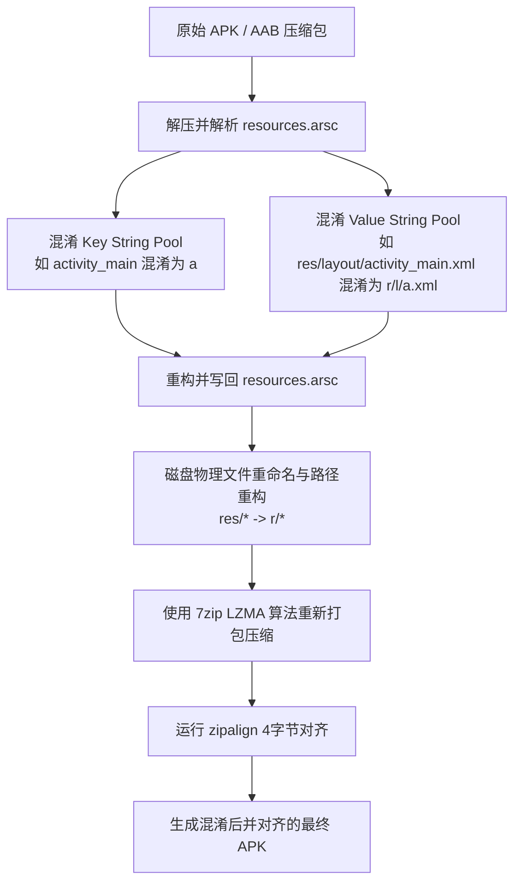
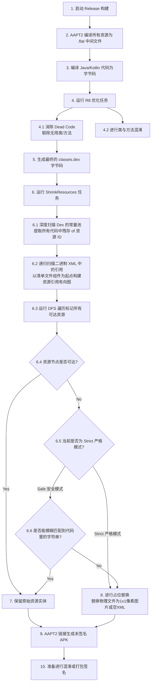
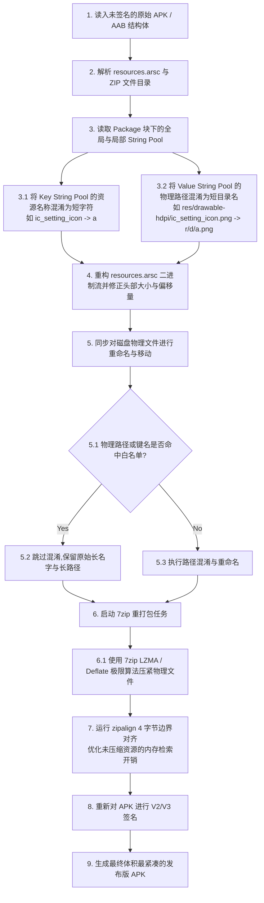

# 5.4.4.2 资源压缩

移动应用（App）的包体积大小是影响用户下载转化率、存留率乃至运行期内存占用的核心指标之一。在 Android 应用的包结构中，除了负责执行逻辑 of Dex 文件外，资源文件（如图片、布局 XML、音视频以及资源索引表 `resources.arsc`）物理上占据了安装包体积的半壁江山，甚至在许多重 UI 的应用中占比高达 70% 以上。

因此，对 Android 资源进行深度的压缩与优化，是包体积优化链路中回报率最高、效果最显着的手段。本文将从 Android 资源编译体系的底层原理出发，深入剖析资源缩减（Resource Shrinking）、资源混淆（AndResGuard 等）的运行机制、严格与安全模式的取舍、现代资源的格式转换以及在大型项目中的工程化实践与排障手段。

---

## 第一部分：Android 资源体系与包体积痛点

要深入理解资源压缩的底层机制，必须先厘清 Android 系统的资源编译打包流程，以及资源在运行期是如何被索引、定位和加载的。

### 1. AAPT 与 AAPT2 的资源编译打包流程

在早期 Android 构建体系中，AAPT（Android Asset Packaging Tool）负责将项目中的资源进行打包。AAPT 的工作方式相对粗暴：它将所有的资源文件视为一个整体，在编译时进行全量扫描与打包。任何一个资源的微小改动，都会导致整个资源包的重新编译。这种单阶段的编译模式在项目规模扩大后，不仅导致构建时间极长，也无法进行细粒度的增量构建与缓存复用。

为了解决这些痛点，Android Gradle 插件（AGP）引入了 **AAPT2**。AAPT2 将原有的单阶段资源打包过程拆分为两个独立的阶段：**编译（Compile）**与**链接（Link）**。

#### 编译阶段（Compile）
编译阶段的目标是将项目中的各个资源文件单独编译为一种中间二进制格式（以 `.flat` 为后缀的扁平化文件）。
* **XML 资源**：诸如布局（Layout）、菜单（Menu）、动画（Animator）等 XML 文件，在编译阶段会被解析并转化为一种专有的二进制 XML 格式。这种格式预先对 XML 节点进行了符号化处理，将标签名和属性名映射到预定义的字符索引，并剔除了无用的空格与注释。使得 Android 系统在运行期解析 XML 时的速度大为提升。
* **图片资源**：对于 PNG 等图片，AAPT2 在编译阶段会使用内置 of 优化器进行无损压缩。例如，它会尝试降低图片的颜色深度，或者通过移除不必要的元数据（Metadata，如 EXIF 信息）来减小物理体积。
* **构建优势**：由于编译是针对单个文件进行的，因此当某个资源文件被修改时，Gradle 只需要对该文件重新运行 `aapt2 compile` 命令生成对应的 `.flat` 文件，而无需触及其他未变动的资源，从而实现了真正的增量构建，并能极大地复用 Gradle 构建缓存。

#### 链接阶段（Link）
链接阶段的目标是将第一阶段生成的所有 `.flat` 中间二进制文件、三方依赖库（AAR）中附带的 `.flat` 资源，以及项目根目录的 `AndroidManifest.xml` 进行合并与解析。
* **交叉引用解析**：AAPT2 会在这个阶段校验资源之间的引用关系。例如，某个布局 XML 中引用的 `@drawable/btn_bg` 是否真实存在，或者某个主题（Theme）中继承的父属性是否合法。如果发现悬空的引用，链接阶段会直接报错中断构建。
* **符号表合并与资源 ID 分配**：AAPT2 会为每一个唯一的资源分配一个 32 位的整型 ID，并将这些 ID 的映射关系写入 `R.java`（在现代构建中表现为更轻量级的 `R.txt`，并最终在编译代码时直接将 ID 值内联进 Dex 字节码中）。
* **生成产物**：链接阶段最终会把所有通过链接校验的二进制资源打包进一个单一的未签名 APK 结构中，并生成用于在运行时快速检索资源的**资源索引表文件** `resources.arsc`。如果构建的是 Android App Bundle (AAB)，AAPT2 会输出 ProtoBuf 格式的资源结构，以便 Google Play 在云端进行后续的分割与分发。

### 2. resources.arsc 的底层二进制结构与工作机制

`resources.arsc` 是整个 Android 资源系统的核心。它扮演着“字典”的角色，记录了所有资源 ID 与实际物理资源文件路径（或直接值）之间的映射关系。

#### resources.arsc 的 Chunk 结构
`resources.arsc` 是一个扁平的二进制流，其内部是由一个个被称为 **Chunk（块）** 的数据结构嵌套或并列组合而成的。每个 Chunk 都遵循统一的头部定义，包含类型标识、头部大小和当前 Chunk 的总大小：

```cpp
struct ResChunk_header {
    uint16_t type;       // Chunk 类型标识，如全局字符串池、Package 包、Type 类型等
    uint16_t headerSize; // 当前 Chunk 头部的字节大小
    uint32_t size;       // 当前 Chunk（包含其所有子 Chunk）的总字节大小
};
```

整个 `resources.arsc` 的二进制流主要包含以下几个核心 Chunk：
1. **ResTable_header**：整个文件的表头，定义了该 `resources.arsc` 的基本信息，以及包含的包（Package）数量。
2. **ResStringPool_header（全局值字符串池）**：存放所有资源的值，尤其是所有非内联资源的相对路径字符串（例如 `"res/drawable-xxhdpi/ic_logo.png"`）。在 arsc 中，具体的资源项并不会直接存储这个长路径字符串，而是存储该字符串在全局字符串池中的索引值（Index），以此来消除冗余字符，大幅度压缩文件元数据。
3. **ResTable_package（资源包块）**：代表一个资源包命名空间。一个 APK 中通常只包含一个 Package，其默认的 Package ID 为 `0x7f`（系统资源通常为 `0x01`）。该 Chunk 内部又包含了两个非常关键的局部字符串池：
   * **类型字符串池（Type String Pool）**：存储资源类型名称，例如 `"attr"`, `"drawable"`, `"layout"`, `"string"` 等。
   * **键字符串池（Key String Pool）**：存储资源项的键名，即我们在代码中使用的变量名，例如 `"app_name"`, `"activity_main"`, `"primary_color"` 等。
4. **ResTable_typeSpec（类型规格块）**：用于标识某一类资源类型（如 layout）下的资源项在不同配置规格（Configuration）下的差异。例如，它决定了某个资源项是否同时拥有默认分支、横屏分支（-land）以及多国语言分支。
5. **ResTable_type（类型信息块）**：紧跟在 `typeSpec` 后面，实际存放资源项数据的结构。如果一个资源在默认、zh-rCN、en-rUS 等多种配置下都有不同的表现，那么就会有多个 `ResTable_type` 块来分别对应这些配置。每个 `ResTable_type` 内部都包含一个 Entry 数组，Entry 结构体中可能是一个直接的值（如 `Color` 或 `Dimens`），也可能是一个指向全局字符串池的索引（如图片或布局文件的路径）。

#### 运行期的资源检索与物理寻址过程
在 Android 运行期，系统分配给每个资源的 Resource ID 都是一个 32 位的无符号整型（以十六进制表示为 `0xPPTTEEEE`）：
* **Package ID（`PP`，占 1 字节）**：代表包命名空间。如 `0x7f` 代表当前应用，`0x01` 代表系统。
* **Type ID（`TT`，占 1 字节）**：代表资源类型。如 `0x02` 代表 `drawable`，`0x03` 代表 `layout`。
* **Entry ID（`EEEE`，占 2 字节）**：代表该类型下的具体资源项的索引号。

当我们在代码中调用 `context.getDrawable(R.drawable.ic_logo)` 时，系统底层通过 C++ 层的 `ResTable` 和 `AssetManager` 进行检索，寻址过程如下：
1. **定位 Package**：系统通过 Resource ID 的前两位（如 `0x7f`）在 `resources.arsc` 中定位对应的 `ResTable_package` 块。
2. **定位 Type**：通过中间两位（如 `0x02`）在 Package 内部找到对应的 `ResTable_typeSpec`，确认该类型的配置规格。
3. **匹配 Configuration**：系统获取设备当前的运行期配置（如语言为简体中文、屏幕密度为 xxhdpi、屏幕方向为竖屏），并在多个并列的 `ResTable_type` 块中，通过二进制规格过滤算法，筛选出与当前设备环境匹配度最高的那个 `ResTable_type` 块。
4. **解析 Entry**：通过 Resource ID 的后四位（如 `0x0001`）作为 Entry 数组的索引偏移量，找到对应的 `ResTable_entry` 结构体。
5. **读取资源**：
   * 如果该资源是一个**值资源**（如颜色值 `#FF0000`），系统可以直接从 Entry 携带的 `Res_value` 结构中读取出数值，完全无需任何磁盘 I/O。
   * 如果该资源是一个**文件资源**（如图片或 XML 布局），Entry 的 `Res_value` 会包含一个指向全局值字符串池的索引号。系统通过该索引号在 `ResStringPool` 中取得对应的物理文件路径（如 `"res/drawable-xxhdpi/ic_logo.png"`），随后通过 `AssetManager` 打开 APK 中的对应压缩文件实体并进行解码加载。

这种基于偏移量和索引表的“物理寻址”机制非常高效，完全避免了在运行期进行耗时的字符串哈希碰撞和字典搜索。但也正因如此，一旦我们编译好了代码，**所有资源的整型 ID 就不能发生任何改变**，否则在运行期就会引发严重的资源错乱或崩溃。

### 3. 资源对包体积的影响

资源在包体积中的痛点主要体现在以下几个维度：
* **多分辨率图片冗余**：为了保证应用在不同屏幕密度的设备上都能有清晰的显示效果，开发者通常需要提供 mdpi、hdpi、xhdpi、xxhdpi 等多套位图资源。这些图片在打包时会原封不动地放入 APK 中。对于一个用户而言，他下载的 APK 里有 80% 的图片资源是他的屏幕密度永远用不到的。
* **重复资源累积**：在大型工程的组件化开发中，不同业务模块（AAR）由不同的团队独立维护。由于缺乏全局的资源管控，各个模块可能会引入视觉上完全相同但命名互异的图片（例如 `ic_back_arrow.png` 与 `navigation_back.png`），这在构建合并资源时会产生大量无意义的堆积。
* **resources.arsc 的无节制膨胀**：随着项目的多语种支持增加、资源的增多，`resources.arsc` 块结构中的 Entry 数量以及各种配置下的 `ResTable_type` 块会呈几何级数增长。由于 `resources.arsc` 在打包时默认是**不进行压缩**的（为了在运行期能通过 `mmap` 直接映射入内存进行快速寻址），因此它的每一个字节都会 100% 地反映在 APK 的下载体积中。在某些大型 App 中，`resources.arsc` 的原始大小甚至会突破 20MB，成为优化工作中极难啃下的硬骨头。

---

## 第二部分：资源压缩与优化机制

了解了资源体系的痛点后，我们来看 Android 构建体系及业界为解决这些问题所提供的各种资源优化与压缩机制。

### 1. Resource Shrinking 资源缩减原理

**Resource Shrinking** 是 Android Gradle 插件（AGP）自带的资源缩减机制，用于自动识别并剔除项目中未被使用的资源文件。

#### 资源缩减的工作流程与依赖性
在构建流水线中，资源缩减任务（`ShrinkResources`）的执行必须依赖于代码混淆任务（如 R8 或 ProGuard）。其根本原因在于：**代码中对资源的引用是以 `R.java` 中内联的整型常量形式存在的。**

如果先进行资源缩减，此时所有的类和方法都完好无损，资源缩减器会认为所有声明的代码都可能被执行，因而无法判定哪些资源是真正无用的。只有在 R8/ProGuard 执行完毕后，那些未被调用的死代码（Dead Code）、无用的 Activity、甚至整个废弃的业务模块被彻底删除，对应的资源 ID 常量也就随之在字节码中消失。此时，资源缩减器才能通过扫描最终的 Dex 字节码，精确捕获所有残留的资源 ID。

#### 资源引用图（Resource Usage Graph）构建与 Reachability 判定算法
Resource Shrinker 的核心是一个基于**有向图可达性分析（Reachability Analysis）**的判定算法。其工作机制如下：
1. **收集代码引用（Roots）**：
   资源缩减器首先将所有在运行期必然会被系统调用的资源作为**根节点（Roots）**。这些根节点包括：
   * `AndroidManifest.xml` 中声明的所有组件（Activity、Service 等）所引用的 Theme、Icon、RoundIcon。
   * 自定义 View 的布局文件。
   * 特殊保留的资源（如在 `keep.xml` 中声明的资源）。
2. **扫描字节码常量池**：
   缩减器会深度遍历 R8 输出的所有 `.dex` 文件，扫描其中的常量池（Constant Pool）以及操作码（特别是 `ldc` 指令）。只要发现有整型值与 `R.txt` 中分配给某个资源的 ID 相同，就会将该资源 ID 标记为“代码可达”。
3. **递归扫描资源文件引用**：
   在根节点和代码可达节点确定后，缩减器会递归解析这些资源文件内部的 XML 结构。例如：`activity_main.xml` 中引用了 `@layout/header_view`，而 `header_view.xml` 内部又引用了 `@drawable/avatar`。这种引用链条会在资源引用图上添加一条条有向边：

   $$\text{activity\_main} \rightarrow \text{header\_view} \rightarrow \text{avatar}$$

4. **可达性判定**：
   构建出完整的资源引用图后，缩减器从所有的根节点出发，沿着有向边进行深度优先搜索（DFS）或广度优先搜索（BFS）遍历。遍历结束后，所有未被标记为“可达”的资源节点，即判定为无用资源。

### 2. 严格模式（Strict Mode）与安全模式（Safe Mode）的差别

为了防止开发者在代码中通过反射等动态手段获取资源导致运行期崩溃，Resource Shrinker 提供了两种完全不同的安全策略：

#### 安全模式（Safe Mode）
安全模式是 AGP 的默认工作模式。在这种模式下，缩减器会采取非常保守的“模糊匹配”策略：
* **字符串常量扫描**：缩减器会分析代码中所有的 String 常量。如果代码中出现了字符串 `"btn_"`，且项目中存在名为 `btn_login`、`btn_logout`、`btn_register` 的图片资源，缩减器会保守地认为开发者可能会在运行期使用反射或 `getIdentifier()` 动态拼接出这些资源的名称，因此会把项目中所有以 `"btn_"` 开头的资源全部保留。
* **缺陷**：这导致资源缩减的效率大打折扣。很多已经废弃的资源，仅因为名字前缀与代码中某个字符串相符，就被错误地保留了下来。

#### 严格模式（Strict Mode）
严格模式会完全停用这种模糊匹配。
* **精准引用**：只有那些在代码中被明确引用（如 `R.drawable.xxx`）或者在 `keep.xml` 中被显式列出的资源，才会被判定为可达。任何通过字符串拼接、动态反射获取的资源，如果未在白名单中声明，都会被无情剔除。
* **物理文件的占位替换机制与底层数据重写**：
  在判定资源无用后，Resource Shrinker 并不能直接将对应的 Entry 从 `resources.arsc` 中抹除。正如前文所述，删除 arsc 中的 Entry 会导致后续的资源 ID 重新排布，从而使 Dex 中早已编译好的整型常量 ID 指向错误的物理资源。
  为了解决这一矛盾，缩减器采用了一种精妙的**占位替换（Placeholder Replacement）**策略：
  * 它保持 `resources.arsc` 的二进制结构不变，资源 ID 依然完好保留。
  * 对于**文件型资源**（如布局、图片），它会将无用的文件替换为一个极小的文件。例如：无用的 `unused_layout.xml` 会被替换成一个仅包含空节点的二进制 XML 流（通常是预编译好的极简字节流，约 100 字节），以确保系统在读取和解析时不会引发空指针异常；无用的图片 `unused_image.png` 会被替换成一张 1x1 像素的透明 PNG 图片（仅有几十字节）。
  * 对于**值型资源**（如字符串、颜色、尺寸），由于它们的值是直接内嵌在 `resources.arsc` 内部的，无法通过文件替换来优化。为了解决这个问题，严格模式下的 Resource Shrinker 会改写 `resources.arsc`，将这些无用 Entry 的具体值清空（例如将字符串置为空字串 `""`，将颜色值设为透明色 `0x00000000`），从而间接减小 `resources.arsc` 自身的大小。

### 3. 资源混淆（AndResGuard 等）的修改原理

与 R8 混淆 Java/Kotlin 类名和方法名类似，资源混淆的核心目标是缩短资源项的名称及其在 APK 内部的物理文件路径。目前业界最常用的工具是微信开源的 **AndResGuard** 及其针对 AAB 格式的衍生工具 **AabResGuard**。



#### AndResGuard 混淆流程解析
如上图所示，资源混淆的底层工作流主要包含以下步骤：
1. **解析 resources.arsc**：
   工具首先将 APK 或 AAB 文件解包，读入 `resources.arsc` 的二进制数据。
2. **重写全局字符串池（Value String Pool）**：
   将所有的资源路径进行缩短。例如，将 `"res/drawable-xxhdpi/activity_settings_background.png"` 替换为 `"r/d/a.png"`。这不仅极大地缩短了字符串长度，还将原本深浅不一的目录结构统一扁平化到了短目录 `r/` 下。
3. **重写键字符串池（Key String Pool）**：
   将资源项的键名进行混淆。例如，将 `activity_settings_background` 混淆为单一短字符 `a`。
4. **重构二进制数据并修正物理路径**：
   修正 `resources.arsc` 中所有受影响 of Chunk 偏移量和头部大小，生成新的混淆后 `resources.arsc` 文件。同时，在物理文件系统上，将 `res/drawable-xxhdpi/activity_settings_background.png` 重命名并移动至 `r/d/a.png` 路径下。
5. **重打包与 7zip 极限压缩**：
   在将所有文件名和路径重构后，AndResGuard 会利用 **7zip** 的高压缩率算法（主要是 LZMA 或优化的 Deflate 算法）重新生成压缩包。因为所有的路径和文件名都变为了超短字符，且具有极高的一致性，这使得压缩算法能够获得更高的字典匹配率，从而大幅提升压缩比。
6. **Zipalign 对齐**：
   最后，工具必须对重打包后的 APK 运行 `zipalign` 动作。对于未压缩的资源（特别是混淆后的 `resources.arsc`），确保它们在 APK 二进制边界上以 4 字节的倍数对齐，使得 Android 系统在运行期可以通过底层的 `mmap` 进行高效的内存指针映射，直接读取资源，避免发生多余的内存拷贝和 CPU 寻址开销。

### 4. 现代资源优化（WebP/VectorDrawable 转换）

除了结构和路径层面的优化，资源实体本身的格式进化也是体积优化的关键一环。

#### WebP 格式的压缩优势与编解码开销
WebP 是由 Google 推出的一种现代图像格式，在 Android 平台上有着极佳的系统支持度（各版本兼容细则可参见根目录下的 [AndroidVersionChangeLog.md](../../../../AndroidVersionChangeLog.md)）。
* **有损 WebP（Lossy WebP）**：其核心算法源自 VP8 视频编码的帧内预测。它通过预测相邻像素块的走向，仅记录残差值，在大幅度丢弃高频视觉冗余信息的同时，保持了极佳的边缘平滑度。在同等视觉质量（SSIM 结构相似性）下，有损 WebP 的体积比 PNG 小 30%~50%，比 JPEG 小 25%~34%。
* **无损 WebP（Lossless WebP）**：利用空间变换、颜色变换以及哈夫曼编码进行压缩，不损失任何原始像素信息。其体积通常比 PNG 小 26% 左右。
* **编解码开销的权衡**：
  由于 WebP 的预测编码算法远比 PNG 的简单过滤（Filter + Deflate）复杂，因此在运行期加载 WebP 时，CPU 的解码时间通常会比 PNG 高出 10%~20%。但在移动端，真正的性能瓶颈往往在磁盘 I/O（读取大图）以及网络传输上。小体积带来的 I/O 耗时缩减，往往能够完全弥补并超越 CPU 解码带来的额外开销。因此，将 PNG 全面替换为 WebP 是非常划算的。

#### VectorDrawable 矢量图的工作原理与设计边界
VectorDrawable 是 Android 5.0 (API 21) 引入的矢量图支持（关于 API 21 的机制变化请查阅 [AndroidVersionChangeLog.md](../../../../AndroidVersionChangeLog.md)）。
* **几何绘制原理**：与保存像素点的位图（PNG/WebP）不同，矢量图本质上是一个 XML 格式的文本文件。它使用一系列的数学几何指令（如 `M` 代表移动，`L` 代表画线，`C` 代表贝塞尔曲线）来描述图形的轮廓和填充色。
* **无可比拟的体积优势**：一个复杂的位图可能需要几百 KB 甚至数 MB，且需要适配 5 套密度。而同样视觉效果的 VectorDrawable 通常只有几百字节到几 KB，并且只有一份文件，支持无级缩放而不产生任何锯齿或模糊。
* **CPU 栅格化瓶颈（设计边界）**：
  在运行期，系统必须将 XML 中的数学指令转化为像素点并渲染到屏幕上，这个过程称为**栅格化（Rasterization）**。如果一个矢量图非常复杂，包含了上千个 path 节点、大量的渐变色、阴影以及复杂的曲线，运行时 CPU 就需要进行大量的浮点数数学计算。这会导致主线程严重阻塞，引起界面卡顿甚至掉帧。
  * **适用场景**：单色或简单色彩的 Icon、基础的线性几何图形、简单的装饰性背景。
  * **禁用场景**：高分辨率照片、包含细腻纹理和光影的写实插画、含有极多 path 节点的复杂折线图。
  * **版本兼容性**：在 Android 5.0 以下系统兼容上，如果配置 `vectorDrawables.useSupportLibrary = true`，编译链会逆向兼容，而较老版本中由于没有硬件加速支持，渲染开销会成倍放大。

---

## 第三部分：配置与实现方法

在日常工程开发中，除了常规的配置外，还需要结合去重插件、WebP 转换权衡以及各类反射失效排障等实践，形成一套多维度的资源优化方案。

### 1. shrinkResources 的开启与依存关系

在项目的模块化构建中，我们通常在主 App 模块的 `build.gradle` 文件中配置资源缩减：

```groovy
android {
    buildTypes {
        release {
            // 必须首先开启代码混淆与无用代码剔除
            minifyEnabled true
            
            // 开启资源缩减，剔除无用资源
            shrinkResources true
            
            proguardFiles getDefaultProguardFile('proguard-android-optimize.txt'), 'proguard-rules.pro'
        }
    }
}
```

> [!IMPORTANT]
> **强依存关系**：如果在配置中将 `minifyEnabled` 设为 `false`，而将 `shrinkResources` 设为 `true`，构建时 Gradle 会直接抛出异常，或在编译期产生警告并使资源缩减完全失效。

### 2. keep.xml 的精细化配置与通配符语法

当我们在项目里启用了严格模式（`strict`）后，为了防止那些通过动态反射或者类似 `getIdentifier()` 拼接获取的资源被错误删除，我们需要在项目中提供一个配置文件：`res/raw/keep.xml`。该文件不会被打包进最终的 APK，仅在构建期的 `ShrinkResources` 任务中生效。

```xml
<?xml version="1.0" encoding="utf-8"?>
<resources xmlns:tools="http://schemas.android.com/tools"
    tools:shrinkMode="strict"
    tools:keep="@layout/activity_dynamic_*,@drawable/ic_status_level_*,@string/error_msg_code_*"
    tools:discard="@layout/unused_legacy_main,@drawable/test_image" />
```

#### 配置语法解析：
* **`tools:shrinkMode`**：显式指定为 `strict` 启用严格缩减模式；如果设为 `safe` 则退回安全模糊匹配模式。
* **`tools:keep`**：显式声明需要强行保留的资源列表。多个资源之间使用英文逗号 `,` 分隔。
  * 支持通配符 `*`。例如：`@drawable/ic_status_level_*` 代表所有以 `ic_status_level_` 开头的 drawable 图片都必须保留，即便是通过反射加载也不会被删除。
* **`tools:discard`**：强制废弃列表。即便在代码中存在对这些资源的引用，但在缩减阶段依然强制将其替换为占位文件。这在测试期或需要临时下线某些资源时非常实用。

### 3. 资源混淆工具 AndResGuard / AabResGuard 接入与白名单

为了进一步压缩资源名称与物理路径，我们在 Gradle 脚本中引入 AndResGuard 插件。

#### 引入插件依赖
在项目根目录的 `build.gradle` 中添加插件依赖：

```groovy
buildscript {
    dependencies {
        classpath 'com.tencent.mm:AndResGuard-gradle-plugin:1.2.21'
    }
}
```

#### 在 App 模块中进行配置
在 `app/build.gradle` 中应用插件并声明混淆规则：

```groovy
apply plugin: 'AndResGuard'

andResGuard {
    // 映射关系文件，若不指定则每次构建随机生成
    mappingFile = null
    
    // 是否启用资源混淆
    use7zip = true
    useSign = true
    keepRoot = false // 是否保留 res 根目录名，false 会改为 r

    // 声明哪些资源不能被混淆（白名单）
    whiteList = [
        // 1. 必须保留的应用 icon 属性，防止系统桌面快捷方式等找不到图标
        "*.R.mipmap.ic_launcher",
        "*.R.mipmap.ic_launcher_round",
        
        // 2. 微信、支付宝等第三方 SDK 反射获取的固定资源名称
        "*.R.string.umeng_*",
        "*.R.layout.umeng_*",
        "*.R.drawable.social_share_*",
        
        // 3. 项目内部通过反射动态加载的资源
        "*.R.drawable.ic_status_level_*",
        "*.R.layout.dynamic_dialog_*"
    ]
    
    // 需要进行 7zip 极限压缩的文件匹配规则
    compressFilePattern = [
        "*.png",
        "*.jpg",
        "*.jpeg",
        "*.gif",
        "*.resources.arsc" // 极其重要：AndResGuard 允许将 arsc 进行压缩打包
    ]
    
    // 7zip 路径配置（如果不配置则使用内置的）
    sevenzip {
        artifact = 'com.tencent.mm:SevenZip:1.2.21'
    }
}
```

### 4. 动态资源下发方案

对于超大型的 App（如国民级社交或电商应用），即使进行了极限的资源压缩，包体积可能依然超标。此时，必须采用**动态下发**的方式，将非核心资源移出安装包。

#### AAB 与 Play Feature Delivery 原理
在出海或 Google Play 渠道项目中，推荐采用 Google 官方的 **Android App Bundle (AAB)** 格式。
* **Split APKs 机制**：用户下载的不再是一个巨大的单体 APK，而是由 Google Play 服务根据用户的设备特征动态组装的 APK 集合。
  * **Base APK**：包含应用的核心代码和基础资源。
  * **Configuration APKs**：包含特定屏幕密度（DPI）、特定 CPU 架构（ABI，如 arm64-v8a）、特定多国语言的资源分片。用户如果是 xxhdpi 且系统语言为英文，系统就只会下发对应的 Configuration 分片，从而过滤掉所有无关的语言包和高/低密度图片。在服务端，Google 使用官方工具 `Bundletool` 对 AAB 包进行分割算法处理，自动化生成相应的 Split APKs。
  * **Dynamic Feature APKs**：对于不需要在首次安装时启用的业务模块，开发者可以配置为“按需下载”（On-Demand）。当用户在应用内点击特定功能时，才通过 `Play Core` 接口向 Google 服务请求下载对应的分片并动态合并装载。

#### 国内自研动态资源下发方案（基于 AssetManager 反射）
由于国内缺乏统一的 Google Play 服务，国内大厂通常在自研的插件化或热修复框架中实现类似的动态资源下发：
1. **资源独立打包**：将非核心的图片、特效、换肤包等资源单独打包成一个未签名的 `.apk` 或 `.zip` 格式的资源包，托管在云端服务器。
2. **下载与解密**：应用在后台静默下载该资源包至内部存储目录。
3. **反射注入 AssetManager**：
   在不同 Android 版本上，`AssetManager` 的构造和方法调用有很大差异：
   * 在 Android 5.0 至 7.0 期间，我们可以直接通过反射调用系统的 `AssetManager` 并调用隐藏的 `addAssetPath` 方法，将外部资源包的路径注入到当前应用的资源体系中。
   * 在 Android 8.0 及以后，`AssetManager` 的内部结构发生了重构，很多反射路径需要调整，其默认无参构造函数变为私有或被废弃，需要反射其隐藏的静态方法进行实例化（详见底层的 [AndroidVersionChangeLog.md](../../../../AndroidVersionChangeLog.md)）。
   * 核心注入代码：
   ```java
   try {
       AssetManager assetManager = AssetManager.class.newInstance();
       Method addAssetPath = AssetManager.class.getDeclaredMethod("addAssetPath", String.class);
       addAssetPath.setAccessible(true);
       // 注入外部下载的插件 apk 路径
       int cookie = (Integer) addAssetPath.invoke(assetManager, pluginPath);
       
       // 用这个新的 assetManager 创建一个新的 Resources 实例提供给插件组件使用
       Resources customResources = new Resources(assetManager, 
           context.getResources().getDisplayMetrics(), 
           context.getResources().getConfiguration());
   } catch (Exception e) {
       e.printStackTrace();
   }
   ```

4. **多进程同步与 Package ID 冲突解决**：
   * **多进程同步加载**：当 App 存在多进程架构（如主进程、Push 进程、Web 进程）时，必须在每个进程的 `Application` 初始化阶段或者动态下发成功时，广播通知各进程的 `AssetManager` 同步调用反射加载方法，否则子进程在访问该外部资源时会因为无法在自身的物理偏移表中找到对应的 Entry 而引发崩溃。
   * **Package ID 冲突**：AAPT 默认将所有编译的资源 Package ID 设为 `0x7f`。如果宿主 App 注入了一个同样是 `0x7f` 的插件 APK，系统就会因为 ID 冲突而无法正确寻址，导致资源错乱。
     * **解决方案**：在编译插件资源包时，修改 AAPT2 参数，为其指定一个独立的 Package ID（如通过在 Gradle 中配置 `aaptOptions.additionalParameters "--package-id", "0x80"`）。这样，宿主使用 `0x7f`，第一个插件使用 `0x80`，第二个插件使用 `0x81`，在运行期就能实现完美隔离，彻底避免冲突。

---

## 第四部分：多维度资源优化实践

在日常工程开发中，除了常规的配置外，还需要结合去重插件、WebP 转换权衡以及各类反射失效排障等实践，形成一套多维度的资源优化方案。

### 1. 重复资源去重插件原理

在多人协作的大型项目中，存在大量内容完全一致但被开发人员命名的不同名称的图片文件。为了在构建期将这些重复资源彻底清除，业界开发了“重复资源去重插件”（基于 Gradle Task）。

#### 去重插件核心原理
该插件的工作逻辑切入在编译流程的资源合并（Merge Resources）任务之后，具体的运作机制如下：
1. **MD5 校验和扫描**：
   当 Gradle 执行完 `mergeReleaseResources` 任务后，所有的三方库资源和主工程资源都会被收集到 `build/intermediates/incremental/mergeReleaseResources/merged.dir` 目录下。此时，去重插件会扫描该目录下的所有图片和文件，并计算每个文件的 **MD5 校验和（Checksum）**。
2. **构建重复映射表**：
   以 MD5 作为 Key，物理路径列表作为 Value，构建一个 Map。如果某个 MD5 下对应了多个物理文件，说明这些图片内容是绝对一模一样的（例如 `pic_a.png` 与 `pic_b.png`）。
3. **保留单一样本，物理去重**：
   插件会在重复的文件列表中，选择其中一个作为“保留样本”（如 `pic_a.png`），并将其余重复的物理文件从构建输出目录中彻底删除。
4. **arsc 二进制路径重定向（重归属）**：
   这是去重插件最关键的一步。此时如果直接编译，由于 `pic_b.png` 已经被删除了，链接器会报错。
   插件会解析链接阶段生成的 `resources.arsc` 二进制流。在 arsc 的全局值字符串池（Value String Pool）中，找到对应 `pic_b.png` 路径的字符串项，**将其物理路径修改为指向 `pic_a.png` 的物理路径。**
   * **指针重写算法**：由于 Value String Pool 是以相对偏移量组织的，修改路径字符串的长度可能会改变整个 String Pool 块的长度。因此，去重插件通常采用两种手段：一是将原有的 `pic_b.png` 字符就地改写为指向已有的 `pic_a.png`，由于长度不同，需要重新计算该 String 块的偏移量数组（Offsets Array）并重新序列化整个 `ResStringPool`；二是将两者重定向至一处后，对后面的所有 Chunk 进行数据指针的整体位移调整，以保证二进制结构的合法性。
5. **最终效果**：
   在最终打包出来的 APK 中，虽然我们在代码中依然可以通过 `R.drawable.pic_a` 和 `R.drawable.pic_b` 这两个完全不同的 ID 去调用图片，但在 APK 的 zip 包体内，实际上只存放了一份 `pic_a.png` 物理图片文件，实现了 100% 的无缝物理去重。

### 2. WebP 压缩比与质量权衡

PNG 转 WebP 是降低图片体积最有效的策略之一。但在实际执行转换时，我们需要在**压缩比率（压缩后的大小）**与**质量失真度**之间做好精准的权衡。

#### 行业实践参数建议
* **有损 WebP 的质量（Quality）参数**：
  * 推荐在项目全局使用 **`75` ~ `80`** 之间的质量因子。
  * **实验数据**：在这个区间内，WebP 能够获得性价比最高的压缩率（相比 PNG 通常可减少 60% 以上的体积），同时其 SSIM 质量指数能保持在 0.95 以上，人眼在手机屏幕上几乎无法分辨任何细节流失。
  * **风险警戒线**：如果质量参数设置低于 `70`，在图片的高对比度区域（如文字边缘、清晰线条处）会产生非常明显的边缘模糊和伪影（Artifacts），导致应用界面产生严重的廉价感。
* **无损 WebP 适用场景**：
  * 对于带有极细腻渐变通道的透明图、高清的企业 Logo、或者需要进行扫描解码的**二维码图片**，强烈建议配置为**无损 WebP**。
  * 如果对二维码图片进行有损 WebP 压缩，其边缘由于 VP8 块级压缩会产生像素溢出和失真，在部分低端机或暗光环境下，会导致扫码器因无法精确识别边缘而解码失败。
* **多维格式特性对比表**：

| 格式类型 | 压缩比率（相对于 PNG） | 运行期解码/渲染开销 | 边缘清晰度与还原度 | 最佳适用场景 |
| :--- | :--- | :--- | :--- | :--- |
| **PNG** | 100%（基准） | 极低（系统原生优化好） | 极佳 | 极小尺寸图、需要像素级保真的系统级 Icon |
| **WebP (无损)** | 60% ~ 75% | 中等（CPU 解码开销小幅上升） | 极佳 | 高清 Logo、二维码、高渐变半透明装饰图 |
| **WebP (有损-80%)** | 20% ~ 40% | 中高（需运行期 VP8 帧内预测解码）| 良好（高对比度边缘有轻微伪影）| 引导页大图、电商商品主图、大背景图 |
| **VectorDrawable**| < 1%（仅包含文本指令）| 极高（尤其是路径复杂、图层过多时）| 完美（支持无极缩放，完全不失真） | 单色 Icon、简易的界面几何线条、极简动画 |

### 3. 反射获取资源 ID 失败与 getIdentifier 兼容性排障

当我们在项目里同时启用了严格资源缩减（Strict Shrinking）和 AndResGuard 资源混淆后，运行期最常遇到的问题就是反射获取资源 ID 失败，抛出 `Resources$NotFoundException` 或直接导致 NullPointer 崩溃。

#### 根源分析
1. **严格资源缩减导致的“占位空文件”**：
   在 Strict Mode 下，代码里如果只使用 `getResources().getIdentifier("ic_level_" + level, "drawable", packageName)`，Resource Shrinker 在分析有向图时，认为 `ic_level_1`、`ic_level_2` 等图片在字节码中没有任何直接的 `R.drawable.ic_level_x` 引用，因而判定它们全部是废弃的。
   缩减器会将这些图片在物理上替换为 1x1 像素的空图片，甚至将 XML 布局文件替换为 0 字节的空文件。当运行期代码使用 getIdentifier 获取到 ID，并尝试去 inflate 这个布局时，系统会因为读取到 0 字节损坏文件而直接崩溃。
2. **资源混淆导致的“Key 丢失”**：
   AndResGuard 会将 resources.arsc 中 Key String Pool 下的键名 `ic_level_1` 混淆为短字符 `a`。
   而在代码中，`getIdentifier("ic_level_1", "drawable", ...)` 传入的依然是明文字符串 `"ic_level_1"`。系统在 arsc 中按照明文去检索键值，由于键名已经被改为了 `"a"`，检索结果会直接返回 0。随后代码尝试使用 ID 0 去加载资源，系统瞬间抛出 `Resources$NotFoundException`。

#### 排障与定位路径
1. **查看构建日志与映射表**：
   * **R8 资源输出**：检查构建生成的 `build/outputs/mapping/release/resources.txt` 映射表。在文件中搜索对应的资源名，确认其是否被标记为 `Replaced`（被占位替换）或者 `Skipped`。
   * **AndResGuard 映射表**：检查混淆输出的 `resource_mapping_*.txt`。确认你的资源名是否被混淆，例如：
     ```text
     res/drawable-xxhdpi/ic_level_1.png -> r/d/a.png
     ic_level_1 -> a
     ```
2. **动态日志与 Layout Inspector 拦截**：
   * 在使用 `getIdentifier` 的封装工具类中，添加异常断点日志：
     ```java
     int resId = context.getResources().getIdentifier(name, defType, defPackage);
     if (resId == 0) {
         Log.e("ResourceError", "资源未找到，可能被混淆或剔除: " + name);
     }
     ```
   * 使用 Android Studio 的 Layout Inspector 捕获运行期的界面组件，查看其最终渲染的 Drawable 对象是否已被退化为了 `BitmapDrawable (1x1)`，以此来判定是否触发了占位替换。

#### 兼容防范策略
* **严格落实 keep.xml 白名单**：
  只要项目中有使用反射拼接获取资源的场景，必须第一时间在 `res/raw/keep.xml` 中将该前缀对应的所有资源全部加入强行保留白名单：
  ```xml
  <resources xmlns:tools="http://schemas.android.com/tools"
      tools:keep="@drawable/ic_level_*" />
  ```
* **同步配置 AndResGuard 白名单**：
  同样，为了防止资源名被混淆，必须在 `app/build.gradle` 的 `andResGuard` 闭包中加入对应的白名单规则：
  ```groovy
  andResGuard {
      whiteList = [
          "*.R.drawable.ic_level_*"
      ]
  }
  ```
* **代码容错与降级**：
  在代码编写阶段，应彻底杜绝不加判断就直接使用 `getIdentifier` 返回值进行布局 inflate 或图片设置的粗暴做法。必须提供降级兜底方案，例如：
  ```java
  int resId = context.getResources().getIdentifier("ic_level_" + level, "drawable", context.getPackageName());
  if (resId != 0) {
      imageView.setImageResource(resId);
  } else {
      // 降级使用默认的默认图标，防止直接崩溃
      imageView.setImageResource(R.drawable.ic_default_level);
  }
  ```

---

## 第五部分：案例与总结

通过结合上述所有机制，我们可以在实际工程中取得极其显着的包体积缩减效果。

### 1. 大型应用优化实战数据对比

以下为某款中大型电商类 App（优化前包体积约 105MB）在落地全面资源优化前后的多维度指标对比数据：

| 优化维度 | 优化前大小 / 状态 | 优化后大小 / 状态 | 体积缩减量 / 缩减率 | 核心采取措施 |
| :--- | :--- | :--- | :--- | :--- |
| **整体安装包大小 (APK)** | 105.4 MB | 58.2 MB | **-47.2 MB (44.7%)** | 全局联动优化、WebP 转换、资源混淆 |
| **图片资源文件 (res/drawable*)** | 56.8 MB | 21.1 MB | **-35.7 MB (62.8%)** | 75% 有损 WebP 转换、重复图片物理去重、部分替换为 Vector |
| **resources.arsc 文件** | 8.2 MB (无压缩) | 1.9 MB (7zip压缩) | **-6.3 MB (76.8%)** | AndResGuard 混淆路径与键名、开启 7zip 极限压缩 |
| **三方 SDK 冗余资源** | 12.4 MB | 3.1 MB | **-9.3 MB (75.0%)** | 开启 R8 + 严格资源缩减（Strict Mode） |
| **多语言配置表** | 4.2 MB | 0.8 MB | **-3.4 MB (80.9%)** | 使用 AAB 动态分发，过滤非目标市场的语言包 |

### 2. 研发阶段的最佳实践 Checklist

为了防止包体积在后续的业务迭代中发生严重的反弹，团队必须将资源优化融入到整个软件开发生命周期（SDLC）与 CI/CD 自动化流水线中。

#### 1. 研发阶段 Lint 拦截机制与全生命周期治理
* **PNG 图片拦截**：在项目中配置自定义 Lint 规则，禁止开发者直接提交 PNG 格式的资源（极小的 Icon 除外）。一旦检测到新增图片不是 WebP 或 VectorDrawable，在 Git Commit 时直接打断提交。
* **未引用资源检测**：每周定期运行 `./gradlew lint` 任务，自动扫描并输出未引用的垃圾资源报告，督促业务开发人员进行物理删除，而不是仅仅依赖构建期的占位替换。
* **包体积预算制分工**：在大型协作团队中，建立“包体积预算制”。根据业务线模块划分体积上限（如 A 业务线最高占用 5MB，B 业务线最高 3MB），一旦超出上限，必须由业务线负责人主导优化或下线冗余资源。

#### 2. CI 自动化包体积监控体系
* **包体积流水线监控**：在每次向主干（Main/Master）分支合并 Merge Request 时，流水线会自动运行编译并统计最终 APK/AAB 的体积。
* **设定体积红线**：一旦某次提交导致安装包体积的增量超过阈值（例如单次提交增量大于 `100KB`），流水线会自动发送报警通知给代码审查人（Code Reviewer），并强制阻塞合并，直到提交者给出合理的解释或进行了资源裁剪。
* **大图强控阈值**：禁止在工程中放入单张超过 `150KB` 的图片资源。如果确实需要展示高清长图，必须通过网络接口动态下载，或向架构组专门申请特批。

---

## 资源优化流程与架构演进图

以下通过两个 Mermaid 流程图，分别展示项目构建期**资源缩减与 R8 的联动流程**以及**AndResGuard 资源混淆的详细步骤**，以辅助日常开发与架构设计。

### 1. 资源缩减与 R8 代码混淆联动流程



#### 流程图一解析：
该流程图直观地展示了为什么资源缩减任务不能脱离 R8 独立运行。构建流程首先通过 R8 裁减掉无用的类和方法，从根本上消除了它们内部携带的资源 ID 常量。随后，Resource Shrinker 深度扫描生成的 Dex 常量池，构建引用有向图，并在严格模式下直接对不可达资源执行占位替换，从而确保在不破坏 `resources.arsc` ID 编排的前提下，物理体积降到最低。

---

### 2. AndResGuard 资源混淆与 7zip 压缩重构流程



#### 流程图二解析：
该流程图刻画了 AndResGuard 对 APK/AAB 内部结构的重构路线。AndResGuard 的底层逻辑不只是对文件进行简单的重命名，而是深度改写了 `resources.arsc` 中的键字符串池与值字符串池，使得整个资源的物理引用路径在全局发生变化。在此基础上，通过白名单策略保护反射字段不发生错乱，最后通过 7zip 的 LZMA 强力压缩和系统的 4 字节边界对齐（zipalign），以确保极高的压缩比和卓越运行期加载效率。
