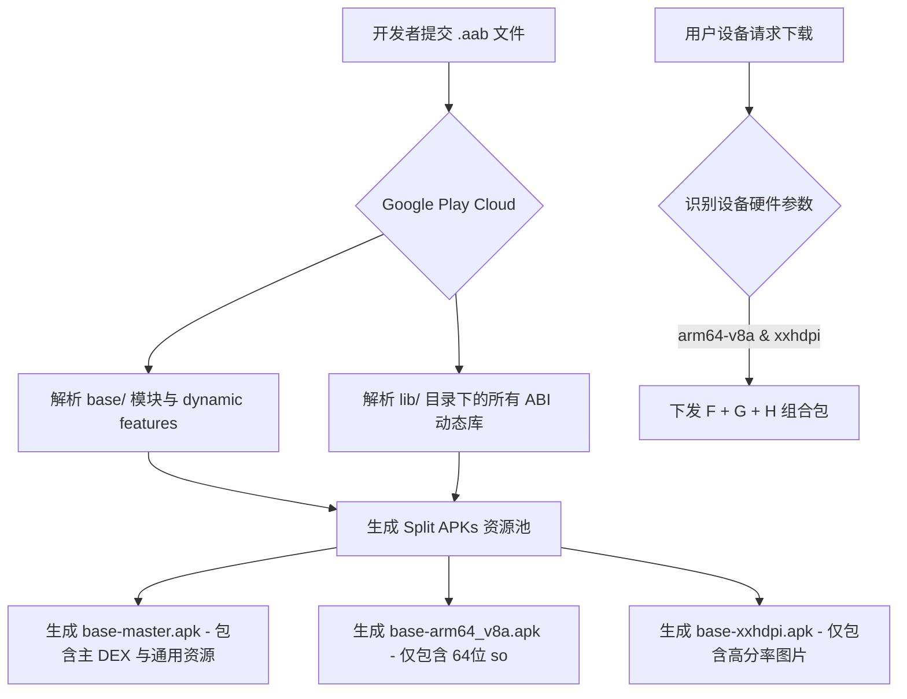
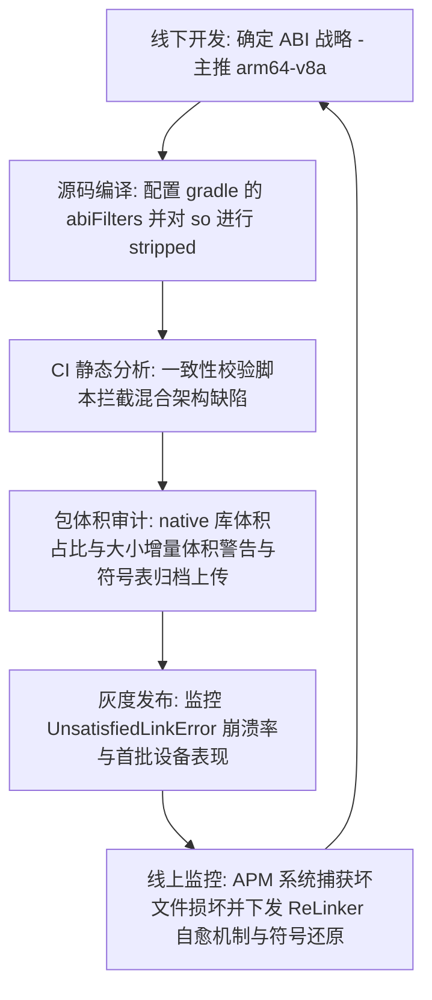

# 5.4.4.3 ABI 治理

在 Android 应用性能优化与稳定性保障的体系中，**ABI（Application Binary Interface，应用二进制接口）治理**是包体积优化与运行时稳定性治理的关键环节点。随着 Android 设备硬件架构的演进、Google 官方对 64 位生态的强制推行以及国内主流应用商店对 64 位适配的硬性要求，如何科学、高效地管理和优化 native 动态链接库（.so 文件），已成为衡量一个中大型 App 架构成熟度的重要指标。

本文将从 CPU 架构与 ABI 基础出发，深入剖析 Android 系统下 `.so` 库的加载机制与兼容损耗，分析混合架构带来的稳定性灾难，并详尽阐述单 ABI 策略、App Bundle 动态交付、多渠道分包以及 So 动态下发等主流治理方案的落地细节与原理，最后提供一套系统级的排障与监控闭环方案。

---

## 第一部分：CPU 架构与 Android ABI 基础

### 1. ABI 的本质与范畴
在软件开发中，我们常用 **API（Application Programming Interface）** 来约定源代码级别的调用接口。例如，在 C 语言中声明的函数 `int calculate_sum(int a, int b)` 或 Java 中的方法，只要源代码符合这些声明，就能够通过编译器的语法检查。

而 **ABI（Application Binary Interface，应用二进制接口）** 则是二进制目标代码级别的约束与契约。它规定了编译后的机器码在特定硬件和操作系统环境下如何互操作。一个编译好的 `.so` 动态链接库，其机器指令、符号表以及对系统服务的调用方式，都必须与运行它的操作系统及 CPU 硬件完全匹配。ABI 涵盖的核心范畴包括：

*   **机器指令集（ISA, Instruction Set Architecture）**：CPU 能够直接识别并执行的机器指令集合。例如，ARMv7-A 架构的 A32/T32 指令集，与 ARMv8-A 架构的 A64 指令集在指令格式、寄存器编址及操作码上存在物理层面的区别。
*   **数据类型的物理表示（Data Representation）**：各种基本数据类型（如 `int`、`long`、`float`、指针等）在内存中占用的字节数、字节对齐规则（Alignment）以及字节序（Endianness，Android 统一采用小端字节序 Little-endian）。
*   **函数调用约定（Calling Convention）**：规定了函数在调用时如何传递参数、如何获取返回值以及栈帧的位置布局。
    *   在 32 位 ARM ABI 中，前 4 个参数通过通用寄存器 `r0` ~ `r3` 传递，超出的参数通过栈传递，返回值写入 `r0`。
    *   在 64 位 ARM64 ABI 中，前 8 个参数通过 `x0` ~ `x7` 传递，超出的参数通过栈传递，返回值写入 `x0`。
    *   调用约定还明确了哪些寄存器由调用者保存（Caller-saved，如 `x0`-`x18`），哪些由被调用者保存（Callee-saved，如 `x19`-`x29`）。
*   **系统调用接口（Syscall Interface）**：应用态代码如何触发软中断（如 ARM 中的 `SVC` 指令）进入内核态，系统调用号（Syscall Numbers）的分配以及通过哪些寄存器传递调用参数。
*   **目标文件格式（Object File Format）**：Android 平台统一采用 ELF（Executable and Linkable Format）格式作为共享库和可执行文件的物理组织结构。
*   **动态链接与符号解析（Dynamic Linking & Symbol Resolution）**：定义了动态链接器（Linker）如何在程序加载运行时，定位并链接共享库之间的符号引用，以及全局偏移表（GOT, Global Offset Table）与程序链接表（PLT, Procedure Linkage Table）的运作机制。

### 2. Android 平台支持的 ABI 类型及演进历史
Android 系统在不同的发展阶段支持过多种 CPU 架构的 ABI，下表整理了这些 ABI 的核心特征及历史现状：

| ABI 名称 | 目标 CPU 架构 | 指令集特性与关键技术 | 历史与当前现状 |
| :--- | :--- | :--- | :--- |
| **armeabi** | ARMv5TE 及以上 | 32 位 ARM，使用软浮点（soft-float），不支持硬件浮点数计算，性能极差。 | Android 8.0（API 26）彻底废弃，NDK r17 中移除。 |
| **armeabi-v7a** | ARMv7-A | 32 位 ARM，引入硬件浮点协处理器（VFPv3-D16）与 NEON 向量指令集（SIMD），支持 Thumb-2 指令集以优化体积。 | 目前仍作为低端机和旧设备兼容的 32 位主力 ABI，但逐步被边缘化。 |
| **arm64-v8a** | ARMv8-A / ARMv9-A | 64 位 ARM，引入 A64 指令集。通用寄存器从 16 个增至 31 个，浮点/向量寄存器翻倍至 32 个 128 位寄存器（v0-v31），支持硬件 AES/SHA 加密加速，支持突破 4GB 虚拟内存寻址。 | 绝对的主流。自 2019 年起 Google 强制要求上架应用必须支持 64 位；现代设备的主力架构。 |
| **x86** | IA-32 (Intel 32位) | 32 位 x86 指令集，支持 MMX, SSE, SSE2, SSE3。 | 主要用于早期少量的 Intel 处理器平板/手机，以及主流 PC 开发环境下的 Android 模拟器。 |
| **x86_64** | x86-64 (Intel 64位) | 64 位 x86 指令集，支持 SSE4, AVX。 | 现代高性能 Android 模拟器（基于 KVM / AEHD 虚拟化）的首选 ABI。 |
| **mips** | MIPS32 | 32 位 MIPS 架构。 | NDK r17 弃用，NDK r18 彻底移除。 |
| **mips64** | MIPS64 | 64 位 MIPS 架构。 | NDK r17 弃用，NDK r18 彻底移除。 |

#### 强推 64 位的时代背景与硬件驱动
Google 早在 2019 年便开启了全面的 64 位化进程，并在后续的版本演进中不断强化该策略。在 [AndroidVersionChangeLog.md](../../../../../AndroidVersionChangeLog.md) 中可以看到，从 Android 15 开始，部分纯 64 位硬件平台（如 Google Pixel 7/8/9 搭载的 Tensor 芯片）直接从底层的 System Image 级移除了对 32 位运行时的支持，强行尝试运行 32 位应用会直接遭遇安装失败或在启动时崩溃。

推行纯 64 位不仅是软件生态演进的要求，更是硬件厂商架构升级的必然结果。现代 CPU 微架构（如 ARM Cortex-X3、Cortex-A715 及后续的 A720/X4 等核心）已经在物理层面上**完全移除了 32 位译码器**。如果 OS 仍然保留 32 位支持，一旦运行 32 位进程，系统将无法调度这些高性能的大核，而只能被迫限制在仅保留 32 位物理兼容的低能耗小核（如 Cortex-A510）上运行，这会导致 32 位应用在高端新设备上遭遇严重的性能缩水与能效损耗。

此外，Android 15 和 Android 16 对 16 KB 页大小（16 KB memory page size）的支持，同样也是 ABI 治理中的一项重大变革。关于 16 KB 页大小的细节在本文后文有详尽分析，这也是 64 位原生硬件性能释放的又一关键底层底座。

#### ARMv8 与 ARMv9 硬件级安全扩展对 ABI 治理的深远影响
随着芯片架构步入 ARMv9 时代，64 位原生 ABI 还在硬件级别带来了革命性的安全扩展技术，这些是在 32 位兼容模式下完全无法染指的底层能力：
1.  **MTE（Memory Tagging Extension，内存标记扩展）**：
    这是 ARMv8.5 和 ARMv9 引入的重磅硬件防御机制。它在内存分配时为每块物理内存盖上一个 4 位的“标签（Tag）”，并在寻址指针的高位中存入对应的标签。当 CPU 通过该指针发起访问时，硬件会在单周期内校验指针中的 Tag 与内存实际 Tag 是否匹配，如果不匹配则直接触发硬中断异常。这使得 Use-After-Free（释放后使用）与 Out-of-Bounds（越界访问）等导致绝大部分 Native 崩溃的内存安全问题在运行期无所遁形。
2.  **PAC（Pointer Authentication Code，指针签名认证）**：
    利用指针中未使用的上位比特，将函数返回地址等关键指针与 CPU 内部密钥进行硬件加密生成签名。在执行返回指令前对签名进行硬件校验，一旦发现被缓冲区溢出恶意篡改，直接触发硬崩溃，彻底根治了面向返回导向编程（ROP）的控制流劫持攻击。
3.  **BTI（Branch Target Identification，分支目标识别）**：
    标记合法的间接跳转分支目标，强力限制任意跳转攻击。

在 NDK 编译配置中，团队需要配合 `-march=armv8.5-a+memtag` 或 `-march=armv9-a+memtag` 指令集参数才能激活这些硬件加固保护。这些特性不仅需要现代 64 位操作系统内核，更需要**完全运行于 64 位原生 ABI 状态下**。一旦回退到 AArch32 状态运行 32 位动态库，上述所有硬件安全长城都将彻底退化、失效。这在安全性维度上提供了无可辩驳的 64 位化技术推力。

### 3. Native 动态链接库 `.so` 的加载机制
在 Java/Kotlin 层面，我们加载 native 库主要通过以下两个静态方法：
*   `System.loadLibrary(String libname)`：传入库的简写名称（例如输入 `foo`，系统会自动组装为 `libfoo.so`），并在系统的默认寻找路径及 APK 的 lib 目录下进行检索。
*   `System.load(String filename)`：传入外部存储或私有存储中 `.so` 文件在物理文件系统中的绝对路径（如 `/data/data/com.example/files/libfoo.so`），直接对该路径进行映射加载。

#### 虚拟机底层的调用链路与源码剖析
以 Android 系统的 Runtime 源码为例，`System.loadLibrary` 的底层核心执行链路如下：

```
[Java 空间] System.loadLibrary(libname)
    ↓
[Java 空间] Runtime.getRuntime().loadLibrary0(VMStack.getCallingClassLoader(), libname)
    ↓
[Java 空间] ClassLoader.findLibrary(libname) ── 通过 DexPathList 寻找 .so 的物理文件系统绝对路径
    ↓
[Java 空间] Runtime.nativeLoad(filename, classLoader) ── 触发 JNI 调用
    ↓
[Native 空间] java_lang_Runtime.cc -> Runtime_nativeLoad(...)
    ↓
[Native 空间] java_vm_ext.cc -> JavaVMExt::LoadNativeLibrary(...)
    ↓
[Native 空间] dlopen(path, RTLD_NOW) ── 调用动态链接器加载 ELF 文件并进行符号重定位
    ↓
[Native 空间] dlsym(handle, "JNI_OnLoad") ── 寻找 JNI_OnLoad 函数指针并执行以完成动态注册
```

当 `ClassLoader` 为 `PathClassLoader` 时，寻找 `.so` 的逻辑由 `dalvik.system.DexPathList` 类完成。在 `DexPathList` 的初始化阶段，它会扫描应用的安装目录（`/data/app/~~.../lib/`）、系统的共享库目录（`/system/lib/`、`/vendor/lib/` 或对应的 64 位 `lib64`）以及在清单文件中声明的 Native 库路径，最终填充进 `nativeLibraryDirectories`（`List<File>` 结构）和 `nativeLibraryPathElements`（`Element[]` 结构）中。

#### JNI 注册机制对体积与性能的底层影响
Native 方法的注册有**静态注册**与**动态注册**两种实现形式，它们在链接库的二进制结构及加载性能上表现迥异：
*   **静态注册**：遵循特定的命名规范（如 `Java_com_example_Foo_bar`）。当 Java 层首次调用该 native 方法时，虚拟机通过 `dlsym` 遍历 `.so` 的动态符号表（`.dynsym`）以查找匹配的符号名称。
    *   *缺点*：由于每一个 native 方法都需要在符号表中暴露出极其冗长的全路径字符串名称，这会导致 `.so` 库的导出符号表（`.dynsym`）和动态符号字符串表（`.dynstr`）体积急剧膨胀。此外，首次调用时的符号查找极耗时。
*   **动态注册**：在 C++ 代码中，显式提供一个 `JNI_OnLoad` 函数，并在其中调用 `env->RegisterNatives`，通过一个 `JNINativeMethod` 结构体数组显式将 Java 方法与 C++ 对应函数的内存指针绑定。
    *   *优势*：由于不需要按命名规范暴露导出符号，编译时可以通过设置符号可见性（例如在 GCC/Clang 中配置 `-fvisibility=hidden` 编译参数）将大部分函数符号隐藏，只暴露 `JNI_OnLoad`。这极大地精简了 `.so` 的导出符号表大小，对 native 体积瘦身有着质的提升，且运行时不再需要经历繁琐的动态符号搜寻，执行效率更高。

JNI 静态注册与动态注册的代码结构对比如下：

```cpp
// 1. 静态注册示例：符号表中将物理暴露长字符串，增加包体积
extern "C" JNIEXPORT jint JNICALL
Java_com_example_abimanager_NativeHelper_calculateSum(JNIEnv *env, jobject thiz, jint a, jint b) {
    return a + b;
}

// 2. 动态注册示例：符号表可以隐藏，仅通过结构体在运行时绑定，有效缩减符号体积
jint native_calculate_sum(JNIEnv *env, jobject thiz, jint a, jint b) {
    return a + b;
}

static const JNINativeMethod gMethods[] = {
    {"calculateSum", "(II)I", (void*)native_calculate_sum}
};

JNIEXPORT jint JNICALL JNI_OnLoad(JavaVM* vm, void* reserved) {
    JNIEnv* env = nullptr;
    if (vm->GetEnv((void**)&env, JNI_VERSION_1_6) != JNI_OK) {
        return JNI_ERR;
    }
    jclass clazz = env->FindClass("com/example/abimanager/NativeHelper");
    if (env->RegisterNatives(clazz, gMethods, 1) < 0) {
        return JNI_ERR;
    }
    return JNI_VERSION_1_6;
}
```

#### 动态链接器（Linker）的工作原理
当虚拟机最终执行 C 库的 `dlopen` 时，控制权将被转交给系统的动态链接器（位于 `/system/bin/linker` 或 `/system/bin/linker64`）。在动态链接器的内部实现中，Linker 会为每一个已加载的 `.so` 动态库维护一个 `soinfo` 结构体对象。这个 `soinfo` 实例是整个 Linker 空间的核心纽带，它记录了该库的加载基址（`base`）、大小（`size`）、Program Header Table 的地址（`phdr`）、重定位表地址、动态符号表（`symtab`）以及该库所依赖的其他 native 库的 `soinfo` 节点指针等元数据。

Linker 的加载与符号解析过程可细分为五个核心步骤：

1.  **解析 ELF 头部（ELF Header）**：读取目标 `.so` 文件的头部数据，校验魔数（`7f 45 4c 46`，即 `\x7fELF`），获取 `Program Header Table (PHT)` 的偏移地址和大小。
2.  **分配内存与映射（Memory Mapping）**：Linker 遍历 PHT，识别所有类型为 `PT_LOAD` 的段（Segment）。这些段承载了只读的代码段（`.text`）和可读写的数据段（`.data`/`.bss`）。Linker 调用 `mmap` 系统调用，将这些段映射到当前进程的虚拟地址空间。
3.  **递归加载依赖项（Loading Dependencies）**：读取 `.so` 的 `.dynamic` 节（Section），寻找所有标记为 `DT_NEEDED` 的项。每一项代表该库依赖的其它共享库（例如 `liblog.so`、`libc.so`）。Linker 会递归地去指定目录寻找并调用 `dlopen` 加载这些依赖项。
4.  **符号重定位（Symbol Relocation）**：由于动态库在编译时无法得知其在虚拟内存中的实际装载地址（以 PIC 位置无关代码方式编译），Linker 必须解析重定位表（如 `.rel.dyn`、`.rel.plt`、`.rela.dyn`、`.rela.plt`）。Linker 遍历符号表（`.dynsym`） and 全局偏移表（GOT），把调用到的外部函数、全局变量的真实内存地址填入 GOT 条目中。
    *   *立即绑定与延迟绑定*：传统 Linux 系统中，动态链接器为了加快程序启动，默认使用延迟绑定（Lazy Binding）——即只有在首次执行某外部函数时，才通过 `PLT` 桩代码去解析重定位。然而在 Android 平台中，出于安全加固（防止 GOT 覆写攻击，配合 `GNU_RELRO` 保护机制）和性能吞吐考量，Android Linker 默认在 `dlopen` 期间对所有符号进行**立即绑定（Eager Binding）**。这在一定程度上加重了 `dlopen` 时的初始化开销，但在运行期保证了极速的符号访问与极高的安全性。
5.  **执行初始化（Initialization）**：重定位完成后，Linker 会依次调用该 `.so` 中 `.init` and `.init_array` 节区所指向的所有初始化函数（这其中包括 C++ 全局/静态变量的构造函数）。之后，控制权返还给虚拟机，虚拟机通过 `dlsym` 寻找 `JNI_OnLoad` 入口点，并传入 `JavaVM` 指针以允许 Native 层执行动态注册。

---

## 第二部分：ABI 兼容性与包体积冲突

### 1. CPU 的向下兼容性与 AArch64 / AArch32 切换原理
ARM64-v8a 架构的 CPU 采用了一种硬件向下兼容的机制来执行 32 位（armeabi-v7a）的指令。这种兼容性转换物理实现上并不是通过软件模拟，而是完全由物理 CPU 核心的**指令执行状态（Execution State）** 切换来支持。

*   **AArch64 与 AArch32 执行状态**：ARMv8-A 定义了两个执行状态。AArch64 运行 64 位指令集（A64），AArch32 运行 32 位指令集（A32 和 T32/Thumb）。
*   **物理寄存器映射**：在 AArch32 状态下，程序可见 16 个 32 位通用寄存器（`r0` ~ `r15`）。在物理硬件层面上，这些 32 位寄存器是直接映射到 AArch64 下 31 个 64 位通用寄存器（`x0` ~ `x30`）的低 32 位上，如下图所示：

```
AArch64 寄存器状态 (64-bit)
+--------------------------------------------+
| x0 (64-bit)                                | -> r0  (32-bit, AArch32)
+--------------------------------------------+
| x1 (64-bit)                                | -> r1  (32-bit, AArch32)
+--------------------------------------------+
| ...                                        |
+--------------------------------------------+
| x14 (64-bit)                               | -> r14 (32-bit, AArch32)
+--------------------------------------------+
| [ 未映射/在 AArch32 状态下不可用 ]           | (x15 - x30 寄存器被物理锁定)
+--------------------------------------------+
```

这意味着在 AArch32 状态下，CPU 只能访问少于一半的通用寄存器，并且每个寄存器的上半部分（第 32 到 63 位）是完全不可达的。这大大限制了编译器的寄存器分配空间，导致了更多的内存装载与写入（Spilling），降低了执行能效。

*   **执行状态切换开销（Context Switch Penalty）**：AArch64 与 AArch32 状态的转换**不能**在运行期平滑完成，它必须伴随着**异常等级（Exception Level, EL）** 的改变。
    一个 32 位的用户态 App 运行在 EL0 级别。当它发起系统调用（Syscall）时，CPU 会捕获该异常并跳转到运行在 EL1（通常是 64 位 AArch64 模式）的 Linux 内核。内核处理完毕后，执行异常返回指令（`ERET`），CPU 再次发生状态切换，退回到 32 位的 EL0。这种频繁的跨状态异常陷阱不仅会带来严重的流水线停顿（Pipeline Flush），还会导致分支预测器（Branch Target Buffer）及 TLB 缓存的失效，带来额外的 CPU 周期损耗。

*   **调度偏好与“大核围观、小核挨饿”现象**：
    由于主流 ARM 芯片厂商（自 ARM Cortex-X2/A710 开始）逐步剥离大核的 32 位物理译码器，只有少数超低功耗小核（如 Cortex-A510）保留了 AArch32 执行能力。
    这导致当一个包含 32 位 native 依赖的程序在现代手机上启动时，操作系统的任务调度器（Scheduler）**只能将其绑定在小核心上运行**。当该程序发起密集的图像运算或编解码任务时，即使大核心处于闲置状态，也完全无法分配给该进程。这造成了物理层面大核闲置、小核满载的瓶颈，直接诱发界面卡顿与极高的发热能耗。

*   **虚拟内存寻址空间的局限**：32 位进程受限于 $2^{32}$ 的地址空间，最大虚拟内存仅为 4GB。在除去系统保留、ART 堆内存和栈空间后，留给 Native 堆分配的连续地址空间往往不足 2GB。一旦加载大型 C++ 库（如游戏引擎、端侧模型、GIS 地图），极易因虚拟地址空间耗尽而抛出 `std::bad_alloc` 类型的 `OOM`。

### 2. 多套 ABI 并存带来的包体积冗余
由于不同 ABI 对应的指令集与二进制格式存在物理差异，如果我们希望同一个 App 能在各种架构的设备上获得最优性能，就必须在打包时将同一份 C++ 源码用不同的交叉编译器编译出多套 `.so` 文件。

如果不加控制，APK 构建产物的 `lib/` 目录下会包含多套 ABI 的 `.so`。例如：
```
app.apk
  └─ lib/
       ├─ armeabi-v7a/
       │    ├─ libopencv_java4.so  (15 MB)
       │    └─ libffmpeg.so        (12 MB)
       ├─ arm64-v8a/
       │    ├─ libopencv_java4.so  (18 MB)
       │    └─ libffmpeg.so        (14 MB)
       └─ x86/
            ├─ libopencv_java4.so  (16 MB)
            └─ libffmpeg.so        (13 MB)
```
在该例中，仅这两个库就在单个 APK 中造成了高达 $88 \text{ MB}$ 的体积占用，其中冗余比例超过了 $60\%$。包体积的膨胀对应用的下载转化率（尤其是国内非 Wi-Fi 环境下的即时下载）以及低端设备的安装成功率有着直接的负面冲击。

### 3. 混合架构的稳定性灾难（UnsatisfiedLinkError）
混合架构（Hybrid Architecture）是指在应用的安装包中，某些 `.so` 库只提供了 32 位版本，而另一些 `.so` 库则同时提供了 32 位和 64 位版本，或者相反。这种混乱的库依赖管理往往是引发线上大量 `UnsatisfiedLinkError` 的根本诱因。

#### 底层决策逻辑
当 Android 系统安装或启动应用时，`PackageManagerService` (PMS) 与虚拟机加载器会对 APK 中的 `lib/` 目录进行拓扑扫描。假设当前运行在一台 64 位 ARM 设备上，其支持的 ABI 列表为：`[arm64-v8a, armeabi-v7a]`。

1.  **ABI 决定阶段**：系统首先在 APK 的 `lib/` 下寻找 `arm64-v8a` 目录。如果该目录**存在**（哪怕里面只有一个很小的 `libdummy.so`），系统就会认为该应用完全适配了 64 位架构。
2.  **绑定路径**：系统将该进程的主要 ABI 设置为 `arm64-v8a`，并在安装或启动该应用时，**仅**将 `lib/arm64-v8a/` 目录下的 `.so` 解压到应用的私有 Native 库路径（或在未开启解压时通过 mmap 直接定位到该目录）。此时，**系统会完全忽略 `lib/armeabi-v7a/` 目录下的任何文件**。
3.  **加载崩溃**：如果此时应用在运行过程中，业务逻辑调用了 `System.loadLibrary("ffmpeg")`，而 `ffmpeg` 库在构建时仅放置在 `lib/armeabi-v7a/` 下，并未被编译成 64 位放入 `lib/arm64-v8a/`。系统在 64 位寻址目录中无法找到该动态库，将直接抛出崩溃：

```java
java.lang.UnsatisfiedLinkError: dalvik.system.PathClassLoader[DexPathList[[zip file "/data/app/~~com.example/base.apk"],nativeLibraryDirectories=[/data/app/~~com.example/lib/arm64, /system/lib64, /system/system_ext/lib64]]] couldn't find "libffmpeg.so"
```

---

## 第三部分：ABI 治理方案与落地配置

### 1. 单 ABI 策略（arm64-v8a 独占）
对于绝大多数非工具类、非特定垂直领域的现代主流 App 而言，采用**仅保留 `arm64-v8a`** 的单 ABI 策略，是性价比最高的治理手段。

*   **技术合理性**：根据行业内各大统计平台及头部 App 的线上数据，2026 年底，国内 64 位 ARM 设备（即支持 `arm64-v8a`）的活跃占比已基本超越 $99.5\%$。极少数仅支持 32 位的设备主要集中在淘汰边缘的超低端山寨机或极老旧的库存设备中。
*   **体积效益最大化**：只打包 `arm64-v8a`，可以彻底砍掉 `armeabi-v7a` 及其他 ABI 目录，立竿见影地缩减 $40\%$ ~ $50\%$ 的 native 包体积。
*   **防呆防崩溃**：彻底统一为单 ABI 后，消除了由于多 ABI 缺失引起的 `UnsatisfiedLinkError`。

#### Gradle 落地配置
在主工程模块的 `build.gradle` (或 `build.gradle.kts`) 中，在 `defaultConfig` 闭包下使用 `ndk.abiFilters` 声明要保留的架构：

```groovy
android {
    compileSdk 34

    defaultConfig {
        applicationId "com.example.abimanager"
        minSdk 21
        targetSdk 34
        
        ndk {
            // 核心配置：只打包 arm64-v8a 架构的 so 库，其余全部在编译/打包期被过滤掉
            abiFilters "arm64-v8a"
        }
    }
}
```

### 2. 深度体积瘦身：C++ 编译器优化与 Stripping 治理
即使我们锁定了单 ABI，native 库所占用的物理体积依然有巨大的压榨空间。以下是高级 native 治理中必不可少的编译器优化策略与 CMake 配置示例：

*   **符号裁剪（Stripping）**：
    默认情况下，C++ 编译器生成的 `.so` 库中包含了大量的调试符号信息（如 `.debug_*` 段）以及局部符号表。
    在构建打包过程中，必须执行 `strip` 阶段以剔除这些无效符号。Android Gradle 插件在发布 Release 包时会自动调用对应平台的 strip 工具。然而，对于由独立构建系统预编译的第三方 `.so` 库，必须在 CI/CD 流水线中强制使用 NDK 工具链中的 `llvm-strip` 工具进行处理：
    `llvm-strip --strip-unneeded libxxx.so`
*   **激进的大小优化（-Oz 编译标志）**：
    Clang 编译器提供了 `-Os`与 `-Oz`（激进的体积优化）标志。使用 `-Oz` 会进行指令合并和代码收缩，相比默认的 `-O3` 乃至 `-Os`，可以为 `.so` 文件缩减 $5\%$ ~ $12\%$ 的物理空间。
*   **摇树优化与符号隐藏（-fvisibility=hidden）**：
    为了在动态链接时能够自动剥离死代码，需要在编译期开启以下两个标志：
    `-ffunction-sections`（将每个函数编译进独立的段）与 `-fdata-sections`（将每个数据项编译进独立的段）。
    在链接时，添加链接参数 `-Wl,--gc-sections`，链接器在链接阶段会自动扫描整个依赖树，并将所有未被调用的函数段物理剪除。
    同时，全局配合 `-fvisibility=hidden` 参数将除核心 JNI 入口（`JNI_OnLoad`）外的所有 C/C++ 方法标记为“隐藏”，防止它们暴露出外部导出符号，这能极大地缩减动态符号表的大小。
*   **链接时优化（LTO, Link-Time Optimization）**：
    开启 `-flto` 标志后，编译器能够突破源文件（编译单元 `.cpp`）的边界，在链接期进行跨文件的全局内联优化、控制流深度精简与垃圾代码消除。这对于大型 C++ 框架可以带来超过 $15\%$ 的体积缩减。

以下是一个推荐在生产环境配置的编译大小优化 CMakeLists.txt 模板：

```cmake
# CMakeLists.txt 编译器体积优化配置
if(CMAKE_BUILD_TYPE STREQUAL "Release")
    # 1. 激进体积优化 Oz
    set(CMAKE_CXX_FLAGS "${CMAKE_CXX_FLAGS} -Oz")
    set(CMAKE_C_FLAGS "${CMAKE_C_FLAGS} -Oz")
    
    # 2. 开启独立 Section 配合死代码裁剪
    set(CMAKE_CXX_FLAGS "${CMAKE_CXX_FLAGS} -ffunction-sections -fdata-sections")
    set(CMAKE_C_FLAGS "${CMAKE_C_FLAGS} -ffunction-sections -fdata-sections")
    set(CMAKE_SHARED_LINKER_FLAGS "${CMAKE_SHARED_LINKER_FLAGS} -Wl,--gc-sections")
    
    # 3. 隐藏非导出符号
    set(CMAKE_CXX_FLAGS "${CMAKE_CXX_FLAGS} -fvisibility=hidden")
    
    # 4. 开启链接时优化 LTO
    set(CMAKE_CXX_FLAGS "${CMAKE_CXX_FLAGS} -flto")
    set(CMAKE_SHARED_LINKER_FLAGS "${CMAKE_SHARED_LINKER_FLAGS} -flto")
endif()
```

### 3. C++ 运行时标准支持库（STL）的选型治理
在 Android NDK 开发中，如何配置 C++ 标准库（STL）的链接方式，同样也是决定 native 体积与稳定性的核心痛点：

*   **静态链接 (`libc++_static.a`)**：
    每个编译出来的 `.so` 库都会独立将自己所需的 STL 代码静态打包合并进去。
    *   *技术风险*：如果应用内同时包含多个自定义的 `.so`，或者混入了第三方 SDK 的 `.so`，每个库都各自静态打包了一套 STL。这不仅会造成严重的代码冗余和包体积浪费，更致命的是，**各个动态库将各自拥有一套独立的全局状态**（例如异常捕获表、内存分配器、`std::cout` 缓冲区）。一旦在不同的 `.so` 库边界之间传递标准容器对象，会导致极难排查的内存越界、异常错配与双重释放崩溃。
*   **动态链接 (`libc++_shared.so`)**：
    所有 native 库在编译时，统一通过动态链接方式共享全局唯一的 `libc++_shared.so`。
    *   *核心优势*：完全规避了跨库传递标准库对象时的内存不一致隐患，并且由于全局只有一份标准库物理机器码，可以为多 so 应用节省大量重复体积。
    *   *治理要点*：若采用动态下发方案，必须确保 `libc++_shared.so` 处于优先加载列表中。且如果引入了第三方 SDK 内置的 `libc++_shared.so`，需要严格核对其编译版本，防止因 NDK 版本冲突引起的 dlopen 重定位失败。

### 4. Google Play 推荐：Android App Bundle (AAB) 分发机制
如果应用分发的主要渠道是 Google Play，那么最完美的解决方案就是采用 **Android App Bundle (AAB)**。

AAB 是一种经过编译的归档文件（`.aab`），其内部包含了应用的所有编译好的代码与资源，但保持着松散的模块化结构。

#### Dynamic Delivery (动态交付) 工作流
当开发者将 `.aab` 提交至 Google Play 控制台后，Google Play 在云端使用官方的 `bundletool` 工具对其进行解构和重新组装：



### 5. 国内多渠道 Splits APK 分包配置
由于国内缺乏 Google Play 这样能统一支持 App Bundle 的应用分发市场，可以使用 Gradle 的 **Splits 拆包机制**。

#### Gradle Build Splits 配置示例
```groovy
android {
    splits {
        abi {
            enable true
            reset()
            include "armeabi-v7a", "arm64-v8a"
            universalApk true
        }
    }
}

applicationVariants.all { variant ->
    variant.outputs.all { output ->
        def abiFilter = output.getFilter(com.android.build.OutputFile.FilterType.ABI)
        def baseName = "abimanager-v${variant.versionName}-${variant.buildType.name}"
        if (abiFilter != null) {
            output.outputFileName = "${baseName}-${abiFilter}.apk"
        } else {
            output.outputFileName = "${baseName}-universal.apk"
        }
    }
}
```

---

## 第四部分：So 动态下发与加载方案

### 1. 动态下发（So-on-Demand）架构设计
对于部分体积异常庞大但使用频次较低的 Native 模块，将其固化在 APK 内会严重损害包体积。此时，**动态下发方案（So-on-Demand）** 是业界公认的最佳实践。

其整体架构设计包含云端匹配、网络安全下载、完整性校验及本地私有路径管理。

#### 动态库版本升级与覆盖安装（Upgrade & Overlay Installation）机制
在动态下发的工程实践中，**动态库的清理与更新升级**是极易被开发团队忽视的稳定性隐患。
*   *场景冲突*：当 App 覆盖安装升级（例如从 `v1.0.0` 升级至 `v1.1.0`）后，新版本的 Java/Kotlin JNI 接口可能调整了方法签名，或是 C++ 代码重构了底层数据结构。如果此时直接去加载之前缓存在物理存储路径下的旧 `.so` 库，会导致 JVM 在调用 native 方法时抛出 `NoSuchMethodError`，或是因为底层内存对齐破坏引发进程崩溃（SIGSEGV）。
*   *自愈升级设计*：客户端必须在本地私有目录中写入一份描述文件（如 `metadata.json`），记录当前已加载的每个动态 `.so` 文件的版本号、MD5 签名以及装载它的 **App 版本号（versionCode）**。
    每次 App 启动执行 native 注入前，首先核对当前系统运行的 `Context.getPackageManager().getPackageInfo().versionCode` 是否与本地描述文件中记录的 versionCode 完全一致。一旦发现 versionCode 发生了改变，说明该应用经历了解包覆盖升级，客户端必须**立刻清空整个动态 `.so` 库的本地缓存文件夹**，重新去云端拉取匹配当前最新版本包的 native 资源，以防止新旧库版本交叉混用造成的稳定性灾难。

### 2. 动态加载技术实现与 ClassLoader / PathList 寻址原理

#### `System.load` 的局限性与 Linker 运行机理
使用 `System.load(String filename)` 传入绝对路径进行映射加载的方式，在底层是直接将目标路径传递给系统的动态链接器（Linker）进行 `dlopen`。然而，它存在一个致命缺陷：**无法自动处理链接库依赖**。
如果 `libtest.so` 在编译时依赖了另外一个自定义库 `libdependency.so`，当执行 `System.load` 加载 `libtest.so` 时，动态链接器 Linker 在其系统默认检索路径及当前 Java ClassLoader 已经绑定的物理路径中找不到 `libdependency.so`，加载过程就会直接中断，抛出 `dlopen failed: library "libdependency.so" not found` 崩溃。

#### ClassLoader 反射注入方案原理与内存拓扑
在 ClassLoader 的寻址链条中，`BaseDexClassLoader` 持有一个 `DexPathList` 实例（名为 `pathList`）。在 Android 6.0 之后，`DexPathList` 引入了 `nativeLibraryPathElements` 数组（元素类型为 `Element`，内部包装了 `NativeLibraryElement`），系统在进行 `findLibrary` 检索时会遍历这个数组。

其在 JVM 中的内存拓扑结构关系如下：
```
[PathClassLoader 实例]
   └─ pathList (DexPathList)
        ├─ nativeLibraryDirectories (List<File>)
        └─ nativeLibraryPathElements (Element[] 数组)
             ├─ [0] -> 代表 APK 解压后的 libs 路径的 Element 实例
             ├─ [1] -> 代表系统 /vendor/lib64 路径的 Element 实例
             └─ [2] -> 代表系统 /system/lib64 路径的 Element 实例
```
只要我们利用反射，将动态下发的物理目录通过底层的 `makePathElements` 封装成一个全新的 `Element` 对象，并将其插队拼接到 `nativeLibraryPathElements` 数组的**最前端**，系统之后在调用 `System.loadLibrary` 时，就会率先去我们的外部私有目录下检索，并且 Linker 在自动加载依赖项时，也能顺着这个注入的路径顺利解析出所需的其他 native 库，从而实现依赖自动寻址。

#### 绕过系统的 Hidden API 反射限制原理
从 Android 9 开始，系统对非公开 SDK 接口的反射调用（Hidden API Restrictions）进行了强力拦截。由于我们调用的 `DexPathList`、`makePathElements` 以及 `nativeLibraryPathElements` 全都属于被限制访问的私有黑名单 API，在实际开发中，直接使用反射会抛出 `NoSuchFieldException` 或 `NoSuchMethodException`。

在底层逻辑中，系统是通过判定 Java 调用栈（Call Stack）的 ClassLoader 类型来甄别反射发起方的。如果发起方不属于系统引导类加载器（BootClassLoader），系统就会拒绝访问私有成员。为解决此兼容性拦截，生产环境通常采用以下两种机制进行豁免：
1.  **元反射（Meta-Reflection / 双重反射）**：
    由于 `Class.class.getDeclaredMethod` 本身属于系统公开的安全 API，但如果我们在 Java 层使用 `getDeclaredMethod` 去反射获取 `getDeclaredMethod` 自身，然后再用这个反射出来的反射方法去执行对私有 API 的调用，调用栈上的直接发起者就变成了系统的反射机制自身，从而成功欺骗了系统的 Hidden API 安全检查逻辑。
2.  **NDK 层修改 JVM Flags**：
    在 Native 层通过解析并动态链接 `libart.so` 中的 `art::Runtime` 实例符号，直接在进程内存中修改其隐藏的 `disable_hidden_api_checks` 成员变量值为 `true`，从而在 native 层面彻底关闭当前进程的 Hidden API 校验，一劳永逸。

#### 生产环境级反射注入源码实现
下面给出了一套生产环境级别的反射注入适配工具类，支持 Android 5.0 (API 21) 至 Android 15/16 的主流版本，提供了完善的异常降级保障：

```java
package com.example.abimanager;

import android.os.Build;
import android.util.Log;
import java.io.File;
import java.io.IOException;
import java.lang.reflect.Array;
import java.lang.reflect.Field;
import java.lang.reflect.Method;
import java.util.ArrayList;
import java.util.Arrays;
import java.util.Collections;
import java.util.List;

/**
 * 生产环境级 So 动态注入加载器
 * 核心原理：反射修改 BaseDexClassLoader 内部的 DexPathList，将外部 so 目录注入到寻址列表的最前端
 */
public final class DynamicSoLoader {
    private static final String TAG = "DynamicSoLoader";

    public static void installSoPath(ClassLoader classLoader, File folderDir) throws Throwable {
        if (folderDir == null || !folderDir.exists() || !folderDir.isDirectory()) {
            throw new IllegalArgumentException("无效的动态库存储目录: " + folderDir);
        }

        Field pathListField = findField(classLoader, "pathList");
        Object dexPathList = pathListField.get(classLoader);
        if (dexPathList == null) {
            throw new IllegalStateException("未能获取 ClassLoader 内部的 DexPathList 实例");
        }

        if (Build.VERSION.SDK_INT >= Build.VERSION_CODES.M) {
            Field elementsField = findField(dexPathList, "nativeLibraryPathElements");
            Object[] originalElements = (Object[]) elementsField.get(dexPathList);

            Object[] newElements;
            try {
                Method makeElementsMethod = findMethod(dexPathList, "makePathElements", List.class);
                newElements = (Object[]) makeElementsMethod.invoke(null, Collections.singletonList(folderDir));
            } catch (NoSuchMethodException e) {
                Log.w(TAG, "未找到 makePathElements(List) 方法，尝试兼容 Android 6.0/7.0 签名");
                Method makeElementsMethod = findMethod(dexPathList, "makePathElements", List.class, File.class, List.class);
                List<IOException> suppressedExceptions = new ArrayList<>();
                newElements = (Object[]) makeElementsMethod.invoke(null, Collections.singletonList(folderDir), null, suppressedExceptions);
            }

            if (newElements == null || newElements.length == 0) {
                throw new IllegalStateException("反射生成 nativeLibraryPathElements 失败");
            }

            Object[] combinedElements = (Object[]) Array.newInstance(
                    originalElements.getClass().getComponentType(),
                    originalElements.length + newElements.length
            );
            System.arraycopy(newElements, 0, combinedElements, 0, newElements.length);
            System.arraycopy(originalElements, 0, combinedElements, newElements.length, originalElements.length);

            elementsField.set(dexPathList, combinedElements);
            Log.i(TAG, "Android 6.0+ So 目录反射注入成功: " + folderDir.getAbsolutePath());

        } else {
            Field dirsField = findField(dexPathList, "nativeLibraryDirectories");
            File[] originalDirs = (File[]) dirsField.get(dexPathList);

            File[] combinedDirs = new File[originalDirs.length + 1];
            combinedDirs[0] = folderDir;
            System.arraycopy(originalDirs, 0, combinedDirs, 1, originalDirs.length);

            dirsField.set(dexPathList, combinedDirs);
            Log.i(TAG, "Android 5.x So 目录反射注入成功: " + folderDir.getAbsolutePath());
        }
    }

    private static Field findField(Object instance, String name) throws NoSuchFieldException {
        for (Class<?> clazz = instance.getClass(); clazz != null; clazz = clazz.getSuperclass()) {
            try {
                Field field = clazz.getDeclaredField(name);
                if (!field.isAccessible()) {
                    field.setAccessible(true);
                }
                return field;
            } catch (NoSuchFieldException e) {
                // 忽略
            }
        }
        throw new NoSuchFieldException("无法在 " + instance.getClass() + " 中检索到字段: " + name);
    }

    private static Method findMethod(Object instance, String name, Class<?>... parameterTypes) throws NoSuchMethodException {
        for (Class<?> clazz = instance.getClass(); clazz != null; clazz = clazz.getSuperclass()) {
            try {
                Method method = clazz.getDeclaredMethod(name, parameterTypes);
                if (!method.isAccessible()) {
                    method.setAccessible(true);
                }
                return method;
            } catch (NoSuchMethodException e) {
                // 忽略
            }
        }
        throw new NoSuchMethodException("无法在 " + instance.getClass() + " 中检索到方法: " + name);
    }
}
```

### 3. Android 动态链接器的 Namespace 隔离限制
自 Android 7.0 (API 24) 开始，系统动态链接器引入了基于命名空间（Namespace-based）的隔离机制。
普通 App 只能访问由系统公开暴露出来的 Native 库（如 `libc.so`、`libm.so`、`liblog.so` 等标准 NDK 库）。
如果 App 试图通过反射或者硬编码路径调用系统内部非公开的 Native 库（例如 `libart.so`），即使文件物理存在，动态链接器 Linker 在执行 `dlopen` 时也会抛出命名空间隔离的报错：
`dlopen failed: library "libart.so" is not accessible for the namespace "classloader-namespace"`

对 ABI 治理的影响：当我们在设计动态下发 `.so` 或插件化加载时，如果所下发的 C++ 库试图依赖或调用系统非公开的 .so 库，就会直接触发 Namespace 崩溃。我们必须在 Native 层通过符号地址搜寻动态绑定等技术来避开系统默认的加载路径隔离检查。

### 4. ReLinker 库深度解析与系统 Bug 规避
ReLinker 的加载过程并没有直接委托给 `System.loadLibrary`，而是通过在 Java 层实现了一个轻量级的 ELF 文件解析器（`ElfParser`）来递归解析 `.so` 头部的 `DT_NEEDED` 项，并手动解压加载所有依赖项。

以下为 ReLinker 用于递归解析并自愈依赖的 ELF 解析部分关键数据读取流程伪代码：

```java
// ReLinker 内部解析 ELF 格式以检索依赖的简化逻辑
public class ElfParser {
    public List<String> parseDependencies(File soFile) throws IOException {
        try (RandomAccessFile raf = new RandomAccessFile(soFile, "r")) {
            // 1. 读取魔数，前 4 字节
            byte[] magic = new byte[4];
            raf.readFully(magic);
            if (magic[0] != 0x7f || magic[1] != 'E' || magic[2] != 'L' || magic[3] != 'F') {
                throw new IOException("Not a valid ELF file");
            }
            
            // 2. 判断 32 还是 64 位 (第 5 个字节)
            byte elfClass = raf.readByte();
            boolean is64Bit = (elfClass == 2);
            
            // 3. 定位 Program Header Table 并检索 PT_DYNAMIC 段
            // 根据 32/64 位执行不同的偏移运算
            long phoff = is64Bit ? read64(raf, 32) : read32(raf, 28);
            int phnum = is64Bit ? read16(raf, 56) : read16(raf, 44);
            
            long dynamicAddr = 0;
            long dynamicSize = 0;
            // 遍历 Program Header 找到类型为 PT_DYNAMIC (2) 的段
            for (int i = 0; i < phnum; i++) {
                long type = is64Bit ? read32(raf, phoff + i * 56) : read32(raf, phoff + i * 32);
                if (type == 2) {
                    dynamicAddr = is64Bit ? read64(raf, phoff + i * 56 + 8) : read32(raf, phoff + i * 32 + 8);
                    dynamicSize = is64Bit ? read64(raf, phoff + i * 56 + 40) : read32(raf, phoff + i * 32 + 20);
                    break;
                }
            }
            
            // 4. 解析 .dynamic 段中的 DT_NEEDED
            List<String> neededLibs = new ArrayList<>();
            // 读取到对应偏移的字符串表，解析依赖文件名，在此省略具体指针换算
            return neededLibs;
        }
    }
    
    private int read16(RandomAccessFile raf, long offset) throws IOException { /* ... */ return 0;}
    private long read32(RandomAccessFile raf, long offset) throws IOException { /* ... */ return 0;}
    private long read64(RandomAccessFile raf, long offset) throws IOException { /* ... */ return 0;}
}
```

---

## 第五部分：排障、监控与治理闭环

### 1. `UnsatisfiedLinkError` 系统级排障指南
当遭遇 `UnsatisfiedLinkError` 时，可参考下表快速排查：

| 报错日志特征 | 根本原因物理推导 | 解决思路与排查工具链 |
| :--- | :--- | :--- |
| `findLibrary returned null` | 寻址列表及系统的默认检索路径中，完全找不到该 `.so` 的物理文件。 | 1. 确认生成 APK 是否漏掉了该 `.so`。<br>2. 检查编译时的过滤策略。 |
| `dlopen failed: library "libxxx.so" not found` | 目标 `.so` 已打开，但其依赖的 `libxxx.so` 缺失。 | 1. 使用 `readelf -d` 查看依赖的 `NEEDED` 项。<br>2. 确保依赖库一同打包。 |
| `dlopen failed: "libxxx.so" has bad ELF magic` | `.so` 二进制文件头部魔数损坏（常见于下载或写入异常）。 | 1. 在下载模块中加入 MD5 强效校验。<br>2. 本地使用 `file` 命令验证。 |
| `dlopen failed: text relocations` | `.so` 编译时未配置 `-fPIC` 标志，导致包含文本重定位信息，Android 6.0 以上强行禁止。 | 1. 检查编译参数，确保开启了 `-fPIC`。<br>2. 使用 `readelf -d | grep TEXTREL` 检查。 |

### 2. 线上真实排障案例复盘

#### 案例一：三方广告 SDK 64位缺失引发的崩溃
*   **背景**：某应用为响应国内商店 64 位指标，在工程中配置了 `abiFilters "arm64-v8a"`。
*   **故障现象**：灰度发布后，64 位手机上加载广告页面发生大规模 `UnsatisfiedLinkError` 闪退。
*   **分析与解决**：广告 SDK 仅提供了 32 位的 `libadutils.so`。在主工程配置仅打包 `arm64-v8a` 后，APK 的 `lib/arm64-v8a` 目录中缺乏该 `.so`。由于系统在 64 位环境下不会去 `armeabi-v7a` 寻找，最终导致了崩溃。联系广告 SDK 服务商提供对应的 `arm64-v8a` 版本后解决。

#### 案例二：老旧 Native 库 text relocations 引发 Android 6.0+ 崩溃
*   **背景**：团队在一款历史遗留项目中升级 targetSdkVersion 至 30 后，发现 Android 6.0 (API 23) 及以上版本的设备上，核心音频解码模块一经调用就发生闪退。
*   **日志表现**：`java.lang.UnsatisfiedLinkError: dlopen failed: "/data/app/.../libaudio.so" has text relocations`。
*   **分析与解决**：由于该 native 库包含数十个手写的 ARM 汇编函数，早期的编译器默认未指定 `-fPIC`，Linker 在加载时需要频繁修改只读代码段以完成地址修正。Android 6.0 之后对此进行了强制封禁，引起直接闪退。定位到该模块后，在编译参数中添加 `-fPIC` 强制开启位置无关代码，并优化重写了相对寻址的汇编指令，重新编译发布后故障消除。

#### 案例三：Native 内存异常监控机制的 ABI 兼容与隔离
*   **背景**：App 在集成 Google Breakpad 捕获线上 C++ 崩溃（SIGSEGV）时，发现大量低端 32 位设备在遭遇异常后，捕获到的 Minidump 文件大小为 0 字节，无法解析。
*   **分析与解决**：Breakpad 的信号处理器（Signal Handler）在注册时需要读取当前 CPU 的上下文结构体（`ucontext_t`）。而在 32 位与 64 位下，该结构体内部的寄存器字段（如 32 位下的 `arm_r0` 与 64 位下的 `regs` 数组）完全不同。如果我们在打包时混淆了 Breakpad 库的版本，或者没有为 32 位单独编译与之匹配的 native 提取模块，在触发硬件信号回调时，就会因为寄存器寻址越界引发二次崩溃。解决办法是为各 ABI 分别编译独立的 Breakpad 核心，保证崩溃收集逻辑本身的绝对安全。

### 3. Native 安全加固与混淆对 ABI 治理的体积影响
在中大型 App 的开发中，为了保证算法安全性，通常会对核心的 `.so` 进行安全加固和混淆，但这会对 ABI 治理带来极大的体积冲击：

*   **OLLVM 混淆对代码体积的膨胀**：
    使用 Obfuscator-LLVM (OLLVM) 对 C++ 代码进行混淆时，其最常用的手段是控制流平坦化（Control Flow Flattening）、虚假控制流注入（Bogus Control Flow）和指令替换。
    *   *副作用*：这些机制会在编译期间生成海量的无用控制块、繁琐的 switch-case 跳转以及冗余的指令序列，导致编译产出的机器码指令成倍增加。实践表明，一段经由深度混淆的 native 代码，其物理 `.so` 体积可能会发生 **200% 到 400% 的急剧膨胀**。
    *   *治理对策*：在 ABI 体积治理中，**切忌对整个 native 库进行全局盲目混淆**。应当利用编译器的 `attribute` 或在混淆配置文件中进行精确过滤，仅对承载了核心加解密、安全鉴权、核心数据签名等高敏感函数的局部基本块实施混淆，而对常规的网络、渲染、工具类 native 代码保持普通编译，从而在“安全性”与“包体积”之间达成最佳的工程平衡。
*   **壳程序（Shelling）对动态装载的稳定性冲击**：
    加壳方案会对真实的 `.so` 二进制流进行加密打包，并在启动时由一个外壳 native 程序执行动态解密，再利用其自定义的 Linker 机制在内存中装载还原。
    *   *技术要点*：由于加壳后系统默认的 dlopen 无法探测到真实的动态库依赖，这会对前文所述的 ClassLoader 反射注入提出更高的要求，必须确保壳 Linker 的内存寻址能力与系统的 classloader-namespace 机制完美兼容，防止加壳引起的二次 UnsatisfiedLinkError。

### 4. App 动态化框架与 ABI 治理的深度交叉
随着工程规模的发展，很多中大型 App 引入了插件化框架（如 Shadow、RePlugin）或热修复框架（如 Tinker）。这进一步推高了 ABI 治理的拓扑复杂度。

*   **插件化中的 ABI 约束契约**：
    在插件化架构中，插件 APK 是在运行时被动态加载的，它可能携带了其特有的 `.so` 动态库。
    *   *致命冲突*：由于 Android 进程在启动时其主要 ABI（PRIMARY_ABI）已经被宿主 App 的 `lib` 目录结构所唯一锁定。如果宿主 App 仅打包了 `arm64-v8a`，即以 64 位进程启动，那么在此进程中启动的任何插件，其内部的 native 依赖**必须同样是 64 位的 `arm64-v8a`**。如果拉取到了仅含 32 位的插件，在 dlopen 加载时会立刻遭遇 UnsatisfiedLinkError 崩溃。因此，插件的分发与下发策略必须严密配合宿主的 ABI 属性，由云端管理后台统一进行分发拦截。
*   **热修复对 Native 库的劫持（Overlay）**：
    热修复框架如果需要修复 native 库中的 Bug，其底层核心思路是在运行时通过网络拉取新的补丁 `.so` 库，并再次利用反射机制将补丁文件夹注入到 `DexPathList` 的 `nativeLibraryPathElements` 的**最前端**。通过插队寻址，在下一次调用 System.loadLibrary 时，链接器会优先定位到补丁目录下的新版本链接库，从而实现对系统原有旧 Bug 库的“劫持替换”。

### 5. dladdr 接口与运行时 JNI 寻址诊断
在对复杂的 JNI 异常进行定位时，尤其是在混合架构或热修复场景下，开发者有时需要知道当前运行的某段 Native 代码究竟是从物理磁盘的哪个 `.so` 库、甚至是哪一个内存函数符号中执行出来的。此时，NDK 提供的 `dladdr` 接口是不可或缺的利器。

`dladdr(const void* addr, Dl_info* info)` 接收一个运行时内存指针（例如一个 JNI 函数的跳转地址），并尝试将其还原为调用元信息写入 `Dl_info` 结构体：
```cpp
typedef struct {
    const char* dli_fname;  // 符号所在的共享库绝对文件路径
    void*       dli_fbase;  // 共享库被加载到内存的起始基址
    const char* dli_sname;  // 最近的导出符号名称
    void*       dli_saddr;  // 导出符号的内存起始地址
} Dl_info;
```
利用这一机制，APM 监控系统可以实现在 native 异常发生时，实时打印出崩溃地址所归属的 `.so` 物理路径，为动态下发场景下库文件的路径排障提供了最直接的线上自检诊断手段。

### 6. CI/CD 工作流中的 So 监控与报警

#### 生产级 ABI 一致性静态检测脚本 (Python)
以下是一段可以直接集成在构建脚本中的 Python 检测工具，它不仅核对各个 ABI 目录下的文件命名是否对称，还会读取 ELF 头部数据，提取并校验其编译架构是否真实符合所在物理目录的要求：

```python
#!/usr/bin/env python3
# -*- coding: utf-8 -*-

import os
import sys
import zipfile
import struct

def get_so_elf_arch(zip_file, zip_path):
    try:
        with zip_file.open(zip_path) as f:
            header = f.read(64)
            if len(header) < 52:
                return "Unknown (Too short)"
            if header[0:4] != b'\x7fELF':
                return "Not an ELF file"
            ei_class = header[4]
            if ei_class == 1:
                e_machine = struct.unpack('<H', header[18:20])[0]
            elif ei_class == 2:
                e_machine = struct.unpack('<H', header[18:20])[0]
            else:
                return f"Invalid ELF class: {ei_class}"

            if e_machine == 40:
                return "armeabi-v7a (ARM32)"
            elif e_machine == 183:
                return "arm64-v8a (ARM64)"
            elif e_machine == 3:
                return "x86 (Intel32)"
            elif e_machine == 62:
                return "x86_64 (Intel64)"
            else:
                return f"Other machine code: {e_machine}"
    except Exception as e:
        return f"Parse Error: {str(e)}"

def verify_apk_abi_consistency(apk_path):
    print(f"[ABI Check] 开始静态分析并校验 APK: {apk_path}")
    if not os.path.exists(apk_path):
        print(f"[Error] 目标 APK 文件路径不存在: {apk_path}")
        sys.exit(1)

    abi_map = {}
    so_info = {}

    with zipfile.ZipFile(apk_path, 'r') as zf:
        for file_info in zf.infolist():
            filename = file_info.filename
            if filename.startswith("lib/") and filename.endswith(".so"):
                parts = filename.split('/')
                if len(parts) >= 3:
                    abi_name = parts[1]
                    so_name = parts[2]
                    
                    if abi_name not in abi_map:
                        abi_map[abi_name] = set()
                    abi_map[abi_name].add(so_name)

                    real_arch = get_so_elf_arch(zf, filename)
                    so_info[filename] = real_arch

    if not abi_map:
        print("[ABI Check] 未在包内检测到任何 native 库。")
        return True

    print("[ABI Check] 扫描到以下各架构及库文件详情:")
    for abi, so_list in abi_map.items():
        print(f"  - {abi}: 包含 {len(so_list)} 个 so 库")
        for so in so_list:
            full_path = f"lib/{abi}/{so}"
            print(f"    * {so} -> 真实编译架构: {so_info.get(full_path)}")

    # 1. 校验各 ABI 目录下的 so 命名是否完全对称
    abis = list(abi_map.keys())
    has_error = False

    for i in range(len(abis)):
        for j in range(i + 1, len(abis)):
            abi1, abi2 = abis[i], abis[j]
            diff1 = abi_map[abi1] - abi_map[abi2]
            diff2 = abi_map[abi2] - abi_map[abi1]

            if diff1:
                print(f"[Error] 发现非对称依赖! [{abi1}] 中存在但 [{abi2}] 中缺失: {diff1}")
                has_error = True
            if diff2:
                print(f"[Error] 发现非对称依赖! [{abi2}] 中存在但 [{abi1}] 中缺失: {diff2}")
                has_error = True

    # 2. 校验 so 的真实编译架构与其存放的物理目录是否相符
    for full_path, arch in so_info.items():
        dir_abi = full_path.split('/')[1]
        if dir_abi == "arm64-v8a" and "ARM64" not in arch:
            print(f"[Error] 架构错配! 文件 {full_path} 存放在 arm64-v8a 目录下，但真实架构为: {arch}")
            has_error = True
        elif dir_abi == "armeabi-v7a" and "ARM32" not in arch:
            print(f"[Error] 架构错配! 文件 {full_path} 存放在 armeabi-v7a 目录下，但真实架构为: {arch}")
            has_error = True

    if has_error:
        print("[ABI Check] 静态分析失败: 发现严重的二进制不一致或架构配置缺陷，构建强行中断！")
        sys.exit(1)
    else:
        print("[ABI Check] 验证成功: APK 内部 native 库列表完全一致且无错配项。")
        return True

if __name__ == "__main__":
    if len(sys.argv) < 2:
        print("Usage: python abi_verifier.py <path_to_apk>")
        sys.exit(1)
    verify_apk_abi_consistency(sys.argv[1])
```

#### 包体积常态化监控与 Unstripped 符号化闭环
在构建流水线中，不仅要度量 `.so` 体积增量，还必须对**已裁剪符号的线上 Native 崩溃堆栈进行闭环符号化还原**：

1.  **分流备份机制**：
    构建系统在编译 Native 代码时，在 `build/intermediates/cmake/release/obj/` 下会留存一份未裁剪（Unstripped）的 `.so` 动态库文件，其中完整保留了用于调试的函数名和代码行号映射（DWARF 调试信息）。而打包入 APK 里的则是经过裁切的 Stripped 动态库。
2.  **符号表备份**：
    在 CI/CD 阶段，必须自动将每一次发布版本对应的 `Unstripped` 动态库压缩归档，或者提取其符号表文件（`.sym`）自动上传至 Bugly、Firebase Crashlytics 或自研的 APM 监控后台。
3.  **线上崩溃还原**：
    当线上用户发生 Native 崩溃，APM 获取到的往往只是十六进制的物理指令偏移地址：
    `#03 pc 000000000005a3bc /data/app/~~/lib/arm64/libeffect.so`
    监控后台接收到日志后，配合对应的符号表，利用 NDK 提供的 `addr2line` 工具可在云端秒级还原出源码函数以及出错代码行：
    `aarch64-linux-android-addr2line -C -f -e libeffect.so 0x5a3bc`
    此符号化自愈检索链路是保证 native 线上稳定性排查效率的关键所在。

### 7. ABI 治理闭环模型
真正高效的 ABI 治理不是一次性的专项工作，而是一套覆盖开发、编译、提测、灰度到线上运维的**全生命周期闭环体系**：



---

## 常见误区与方案权衡

在制定团队的 ABI 治理方案时，应当避免以下几个常见的认知陷阱：

### 1. 误区一：armeabi-v7a 编译出来的库，在 64 位设备上运行由于向下兼容所以性能一致
*事实*：正如本文第二部分所述，32 位代码运行在 64 位 CPU 上不仅无法利用其翻倍的通用寄存器和更先进的 NEON/加密指令，而且会因为 Exception Level 切换而导致显著的执行效能下降与功耗上升。对于计算密集型的逻辑（如图像处理、矩阵运算），64 位原生的性能提升幅度可达 $30\%$ ~ $50\%$。因此，向下兼容仅仅是“能跑”，绝对不等于“跑得快”。

### 2. 误区二：动态下发 so 可以把所有的 native 库都剥离出去，实现极限包体积优化
*权衡与安全痛点*：So 动态下发不仅带来了复杂的网络下载与解压缩保障逻辑，还极大地推高了应用的冷启动及核心业务流的“前置等待损耗”。基础底座类 `.so`（如核心 Crash 监控、核心网络库、关键的基础性能监控）如果被动态下发，会导致在 Native 库就位之前发生的崩溃无法被有效捕获，从而造成极大的稳定性监控盲区。因此，**只有非核心业务、大体积的独立功能库才适合采用动态下发策略**。

### 3. 误区三：Android 15/16 推进 16 KB 内存页对齐，只需要在 NDK 重新编译即可，体积无任何影响
*物理约束与原理剖析*：
页表映射（Page Table Mapping）是虚拟内存与物理内存交互的底层物理纽带。在 16 KB 页大小下，内存页的物理粒度由 4096 字节陡增至 16384 字节。为了让动态链接器能够在 16 KB 物理边界上调用 `mmap` 进行段装载，编译出的 ELF 文件在其 Program Header Table 中定义的各个段（Segment）之间必须塞入大量的空白 Padding 以满足物理对齐。
这在带来 TLB (Translation Lookaside Buffer) 命中率飙升和计算效率提升（约 5%~10%）的同时，代价就是 `.so` 二进制文件的体积会发生 $5\%$ ~ $15\%$ 的物理膨胀，这也意味着团队在推进 16 KB 适配时必须将该体积溢出纳入版本包体积预算中，而不是无痛平移。

### 4. 误区四：将 32 位 so 复制并重命名放入 64 位（arm64-v8a）目录，可以“欺骗”系统成功加载
*绝对反例*：有些不规范的三方库提供商或开发团队，在无法获取 64 位源码又急于通过 64 位上架审核的情况下，会铤而走险将 32 位的 `.so` 直接复制并重命名放入打包的 `lib/arm64-v8a` 目录中。
这在运行时是极其低级的错误。64 位的动态链接器 Linker 在 `dlopen` 解析 ELF 头部时，一旦校验出该文件的 `EI_CLASS` 属性为 `1`（即 ELFCLASS32，代表 32 位机器文件），而 Linker 本身是 ELFCLASS64 的，会直接报错强行终止进程：
`dlopen failed: "libxxx.so" is 32-bit instead of 64-bit`。这种欺骗手段不仅无法工作，还极大地增加了线上的稳定性排查难度。

### 总结
ABI 治理在 Android 应用的性能表现、稳定性与包体积优化中扮演着不可替代的角色。对于现代应用，我们强烈推荐**首选 arm64-v8a 单 ABI 策略**；对于复杂的庞大模块，设计并实现一套**基于 ClassLoader 注入与 ReLinker 自愈的 So 动态下发方案**；并在 CI/CD 流程中建立严密的**一致性静态监控与体积报警哨兵**，从而打造起一套坚固、绿色的二进制层治理闭环。
