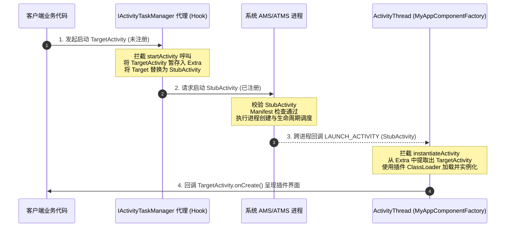
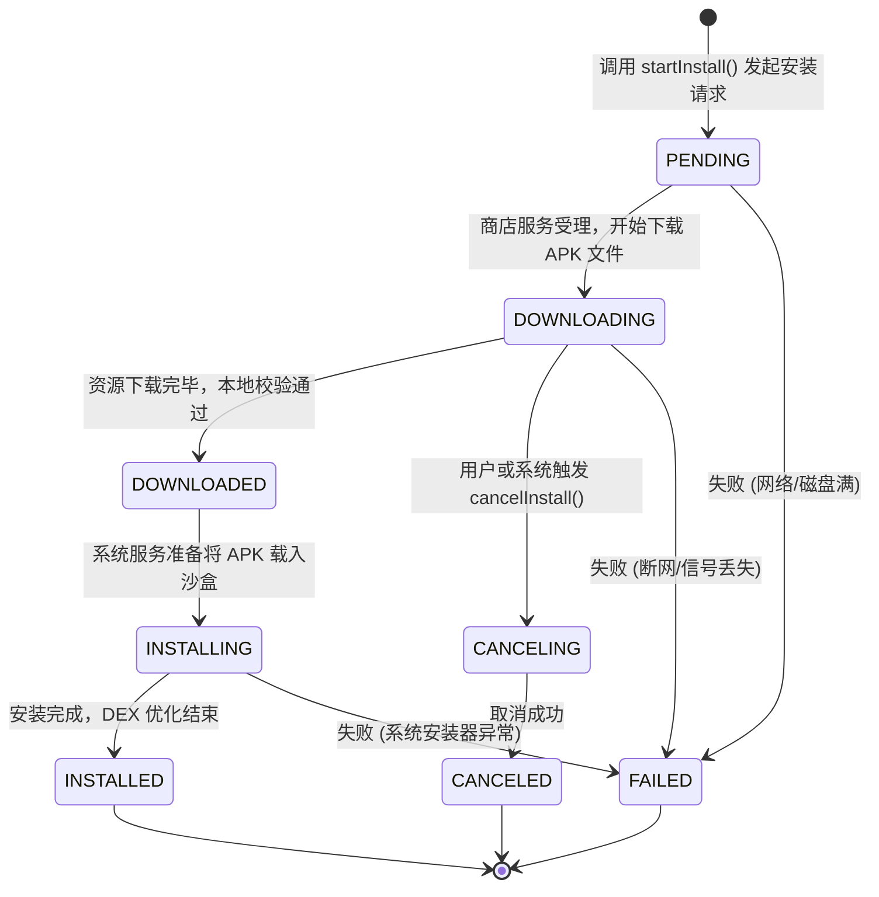
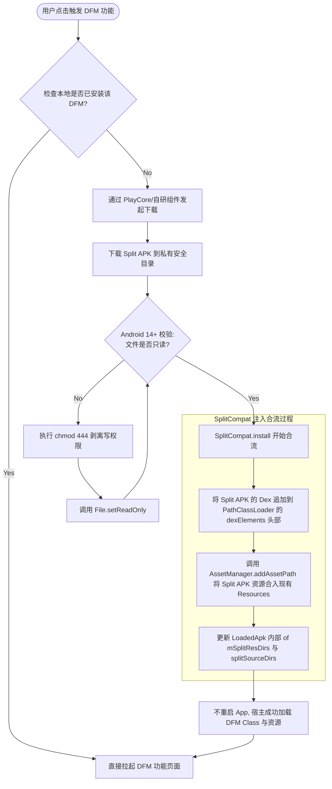

# 动态特性

## 一、Android 动态化演进与分类

Android 动态化技术是指在应用运行期间，动态地加载、解析和执行外部代码与资源的技术。它是移动互联网黄金时代大厂敏捷迭代、包体积优化和线上容灾的集大成者。其核心诉求是**突破 Android 系统静态安装与编译的物理边界**，以实现减小首包体积、动态分发业务、秒级热修复线上故障等战略目标。

### 1.1 动态化技术的演进脉络

自 Android 诞生以来，动态化技术在开发者的奇思妙想与系统安全边界的收紧中，经历了十余年的“猫鼠游戏”与技术迭代。其演进路线可分为四个清晰的阶段：

```
┌────────────────────────────────────────────────────────────────────────┐
│                      第一阶段：方法数突破与 MultiDex 时代                  │
│                                                                        │
│  - 背景：Dalvik 虚拟机 LinearAlloc 限制，单 DEX 方法数上限 65535。     │
│  - 技术：官方推出 MultiDex 方案；早期热修复与插件化萌芽。               │
│  - 特点：重点解决“应用装不进去”的物理限制，初步摸索 ClassLoader 拼接。   │
└──────────────────────────────────┬─────────────────────────────────────┘
                                   │
                                   ▼
┌────────────────────────────────────────────────────────────────────────┐
│                        第二阶段：热修复与插件化爆发期                      │
│                                                                        │
│  - 背景：敏捷开发兴起，发版周期长，线上 Bug 无法即时修复。             │
│  - 技术：Tinker、Robust、AndFix、DroidPlugin、Shadow 等框架百花齐放。  │
│  - 特点：大量使用 AMS Hook、ClassLoader 强行插桩、Native 方法指针替换。 │
└──────────────────────────────────┬─────────────────────────────────────┘
                                   │
                                   ▼
┌────────────────────────────────────────────────────────────────────────┐
│                      第三阶段：官方介入与非 SDK 接口封杀                    │
│                                                                        │
│  - 背景：Android 9+ 限制非 SDK 接口（隐藏 API）；黑科技 Hook 稳定性雪崩。 │
│  - 技术：Google 推广 Android App Bundle (AAB) 与 Dynamic Features。    │
│  - 特点：引入 Split APKs 机制，提供官方标准的动态特性模块（DFM）下发。 │
└──────────────────────────────────┬─────────────────────────────────────┘
                                   │
                                   ▼
┌────────────────────────────────────────────────────────────────────────┐
│                      第四阶段：安全合规与 W^X 权限规范                     │
│                                                                        │
│  - 背景：Android 14+ 限制动态代码加载（DCL）权限；16 KB 内存页对齐。     │
│  - 技术：官方 DFM 方案趋于成熟；国内方案走向“AAB编译 + 自研下发加载”。  │
│  - 特点：DCL 文件强制只读，运行期安全沙盒化，安全成为架构设计首要指标。 │
└────────────────────────────────────────────────────────────────────────┘
```

1. **第一阶段：方法数突破与 MultiDex 时代（2012 - 2014）**  
   在早期 Android 平台中，Dalvik 虚拟机在编译时将 Java 字节码打包为单一的 `classes.dex` 文件。受限于 DEX 规范，单个 DEX 中的方法数引用的最大值被限定为 65535（16 位寄存器的上限）。随着应用体积的增长，巨型 App 面临“无法编译”或“低版本 Android 设备无法安装（LinearAlloc 缓冲区溢出）”的窘境。虽然 Google 后来推出了官方的 `MultiDex` 支持库，但这仅仅是静态分包，并没有解决动态分发和秒级更新的诉求。
   
2. **第二阶段：热修复与插件化爆发期（2014 - 2018）**  
   在这个移动 App 爆发式增长的时期，大厂团队追求极致 of 敏捷开发。为了能随时发布新功能或修复线上致命 Bug，开发者绕过系统限制，挖掘出了大量的“黑科技”：
   - **热修复**：利用 ClassLoader 底层 `dexElements` 数组的前端插桩（如 Tinker）或 Native 层 `ArtMethod` 结构体成员指针的替换（如 AndFix、Sophix），实现不发版即时修复。
   - **插件化**：在宿主 App 壳内，利用反射和代理机制欺骗系统的 `ActivityManagerService`（AMS），从而在不安装的情况下启动和运行外部的插件 APK（如 RePlugin、Shadow、VirtualApk）。
   
3. **第三阶段：官方介入与系统收紧期（2018 - 2021）**  
   黑科技的泛滥给 Android 系统的安全与稳定性带来了灾难性后果。从 Android 9.0 开始，Google 引入了“非 SDK 接口访问限制”（即隐藏 API 封杀），使用反射或 Hook 系统未公开的类/方法会被系统拦截，导致大量插件化框架崩溃。作为替代，Google 官方在发布 Android 8.0/9.0 时，全面主推 **Android App Bundle (AAB)** 和 **Dynamic Features (DFM)**。DFM 利用系统原生的 Split APKs 机制，在安全的框架内实现按需下发。
   
4. **第四阶段：安全合规与 W^X 权限规范期（2021 至今）**  
   随着对移动隐私和系统防篡改要求的提升，Android 14 开始强制执行“DCL 动态代码加载只读限制”，践行了 **W^X (Write XOR Execute)** 权限安全规范，即可写文件不可执行，可执行文件不可写。这直接堵死将下载的 DEX/APK 存放在可写目录并直接加载的传统后门。同时，Android 15+ 引入的 16 KB 页内存对齐，要求所有编译出来的 Native so 库必须满足 16 KB 对齐，使得动态下载 Native 库的适配要求进一步提高。

---

### 1.2 热修复、插件化与动态特性（DFM）对比

三种动态化技术路线在设计初衷、工作机制及应用场景上有着本质的差异，它们各自解决不同的业务痛点：

| 维度 | 热修复 (Hot Fix) | 插件化 (Pluginization) | 动态特性 (DFM) |
| :--- | :--- | :--- | :--- |
| **核心诉求** | 修复线上紧急 Bug，避免用户重新下载完整包。 | 业务线解耦、超大包体拆分、业务动态按需下发。 | 减小首包体积，非核心业务动态按需下发。 |
| **技术本质** | 类加载器插桩、字节码插桩或 Native 指针替换。 | 运行一个完全独立、未在 Manifest 注册的完整宿主外 APK。 | 基于系统原生的 Split APKs 机制，在同一进程沙盒中动态合流。 |
| **系统侵入性** | 高（需要 Hook ClassLoader 或 ART 虚拟机底层结构）。 | 极高（深度 Hook 四大组件启动链路、PMS 及资源系统）。 | 极低（使用官方 SplitCompat API 或是系统原生的 Split 安装服务）。 |
| **稳定性与维护成本**| 中等。高版本需应对隐藏 API 限制，但有成熟商业化方案。 | 极高。随着系统升级，反射和 Hook 点极易失效，崩溃率高。 | 极低。由于是系统级原生支持，稳定性极高，维护成本低。 |
| **代码与资源隔离** | 资源与代码均与宿主完全合并，不进行隔离。 | 资源、代码与 Manifest 与宿主高度隔离，拥有独立的 ClassLoader 与 AssetManager。 | 编译期强制单向依赖，运行时代码与资源与宿主合流。 |
| **国内渠道支持度** | 高（国内各大应用商店允许接入合规的热修复 SDK）。 | 低（容易触发各大应用商店“动态加载恶意代码”的红线）。 | 需自研下发（国内无 Google Play 服务，无法使用 Play Core 自动下载）。 |

---

## 二、底层机制与设计取舍

要深刻理解 Android 动态化的本质，必须剖析其底层的三大核心技术关卡：类加载机制（代码）、资源映射机制（资源）以及四大组件生命周期的托管代理（组件）。

### 2.1 ClassLoader 隔离与双亲委派模型

Android 系统的类加载器在 Java 原生双亲委派模型的基础上，结合 ART 虚拟机的特点进行了深度定制。

#### 2.1.1 双亲委派模型的 Java 源码级解析
在 Java 以及 Android 中，类加载都遵循“先委托父加载器，父加载器无法加载时再由自身加载”的逻辑。以下是 `java.lang.ClassLoader.loadClass` 的核心执行逻辑：

```java
// java.lang.ClassLoader 的标准双亲委派实现
protected Class<?> loadClass(String name, boolean resolve) throws ClassNotFoundException {
    // 1. 首先检查该类是否已经被当前类加载器加载过
    Class<?> c = findLoadedClass(name);
    if (c == null) {
        try {
            if (parent != null) {
                // 2. 如果存在父类加载器，则委派给父类加载器尝试加载
                c = parent.loadClass(name, false);
            } else {
                // 3. 如果无父加载器，则委托给 BootClassLoader 加载
                c = findBootstrapClassOrNull(name);
            }
        } catch (ClassNotFoundException e) {
            // 父类加载器抛出异常说明它在其类路径中找不到该类
        }

        if (c == null) {
            // 4. 如果父类加载器和系统核心类库都无法加载，则调用自身的 findClass
            c = findClass(name);
        }
    }
    return c;
}
```

#### 2.1.2 BaseDexClassLoader 与 DexPathList 的源码级寻址机制
在 Android 中，加载外部代码（DEX 或 APK）的核心是 `dalvik.system.BaseDexClassLoader`。其内部持有一个 `DexPathList` 实例（名为 `pathList`）。
当类加载器通过双亲委派最终需要自身加载而调用 `findClass(String name)` 时，底层的核心查找到达 `DexPathList` 的 `findClass` 方法：

```java
// 简化后的 DexPathList 内部源码寻址逻辑
public Class<?> findClass(String name, List<Throwable> suppressed) {
    // 遍历 Element 数组，每个 Element 代表一个 DEX 文件
    for (Element element : dexElements) {
        Class<?> clazz = element.findClass(name, definingContext, suppressed);
        if (clazz != null) {
            return clazz; // 找到即刻返回，实现优先加载
        }
    }
    if (dexElementsSuppressedExceptions != null) {
        suppressed.addAll(Arrays.asList(dexElementsSuppressedExceptions));
    }
    return null;
}
```

#### 2.1.3 InMemoryDexClassLoader 与内存代码加载机制
除了传统的从本地物理文件加载 DEX 外，自 Android 8.0（API 26）起，系统引入了 `dalvik.system.InMemoryDexClassLoader`。它允许应用直接从内存中的 `ByteBuffer` 数组来加载类。
- **工作机制**：开发者可以将网络下载的 DEX 加密数据在内存中进行解密，直接将其以 `ByteBuffer` 的形式投递给 `InMemoryDexClassLoader`，而不需要将明文 DEX 写入闪存磁盘。
- **安全价值**：由于避免了文件在闪存的物理落地，该机制是国内移动应用加固（壳防护）以及防逆向分析、动态核心算法加密等安全领域的绝对技术支柱。通过将代码段完全隐藏在 RAM 中，大大提高了破解者进行静态反编译和动态脱壳的门槛。

#### 2.1.4 经典痛点：Dalvik 时代的 `CLASS_ISPREVERIFIED` 错误与解决方案
在 Android 5.0 之前的 Dalvik 虚拟机中，有一个经典的热修复技术痛点。
- **起因**：在 APK 安装时，Dalvik 会执行 `dexopt` 优化。如果类 A 的方法中引用的所有类（比如类 B）都在同一个 `classes.dex` 中，那么类 A 就会被打上一个 `CLASS_ISPREVERIFIED` 的标记，以加快运行时的访问速度。
- **冲突**：如果我们只下发了一个包含修复后的类 B 的补丁包（位于独立的 `patch.dex` 中），宿主的 ClassLoader 此时优先加载了补丁中的类 B。当类 A 试图调用类 B 时，虚拟机发现类 A 所在的 DEX（宿主 classes.dex）与类 B 所在的 DEX（patch.dex）不一致，但类 A 身上又带有 `CLASS_ISPREVERIFIED` 的标记。虚拟机会立即抛出 `java.lang.IllegalAccessError` 并闪退。
- **黑科技解决**：以 Tinker 为首的早期框架，在编译期使用字节码插桩技术（如 ASM），在所有类的构造函数中强行引入一个对外部独立 DEX（例如 `hack.dex`）中某个空类的引用。由于引用了外部 DEX 的类，系统在 `dexopt` 时便不会将这些类标记为 `CLASS_ISPREVERIFIED`。这虽然成功绕过了限制，但也因为牺牲了 `dexopt` 优化导致性能有所损耗。

#### 2.1.5 ART 时代的 Method Inline（方法内联）与 AOT 编译挑战
Android 5.0+ 引入 ART 虚拟机后，`CLASS_ISPREVERIFIED` 不复存在，但迎来了更加棘手的 AOT（Ahead-Of-Time）和 JIT（Just-In-Time）混合编译问题：
- **方法内联**：ART 虚拟机会在应用空闲且充电时，对常用代码进行 Profile-guided 编译，直接将部分简短的方法进行“内联”优化（即把被调用方法的字节码直接展开到调用处）。如果我们在运行时强行通过 ClassLoader 注入补丁类，那些在编译期已经被内联的方法依然保留着有 Bug 的旧代码，补丁根本不会被执行。
- **全量 DEX 合成（DexMerge）的诞生**：
  为彻底解决内联与 AOT 的副作用，Tinker 放弃了简单的 `dexElements` 头部插桩，改为在后台线程将宿主原本的 `classes.dex` 与下发的 `patch.dex` 进行全量差分合成，融合成一个全新的 `classes_merged.dex`。在运行时，框架直接用这个全新的合并 DEX 替换掉宿主 ClassLoader 的整个 `dexElements`。虽然该方案规避了内联问题，但带来了合成时极高的内存消耗与本地磁盘 I/O 压力。

#### 2.1.6 经典热修复方案的双雄对抗：Robust 与 Sophix 深度剖析
为了对抗 AOT 编译和方法内联的干扰，业界衍生出了两种完全不同的极致热修复方案：

##### 一、 美团 Robust 的编译期方法插桩方案
Robust 另辟蹊径，完全不依赖于底层的类加载器替换，而是将修复眼光投向了 Java 语言的控制流本身：
- **原理**：在编译阶段，Robust 通过自定义的 Gradle 插件，使用 ASM 字节码技术在 App 中每个方法的开头处都强行插入一段“分支跳转”代码。其伪代码如下：
  ```java
  public class OrderService {
      // 编译期为每个类自动生成的重定向接口对象
      public static ChangeQuickRedirect changeQuickRedirect;

      public double calculatePrice(long orderId) {
          // 如果发现该字段不为空，说明该方法需要被热修重定向
          if (changeQuickRedirect != null) {
              if (PatchProxy.isSupport(new Object[]{orderId}, this, changeQuickRedirect, false, 123, ...)) {
                  // 直接通过代理分发到下载的补丁类中执行新逻辑
                  return ((Double) PatchProxy.accessDispatch(new Object[]{orderId}, this, changeQuickRedirect, false, 123, ...)).doubleValue();
              }
          }
          // 正常的旧业务逻辑
          return orderId * 0.9;
      }
  }
  ```
- **优缺点评价**：
  - **优势**：由于它在正常的 Java 代码逻辑内进行条件跳转，完全不需要 Hook 任何系统的私有成员，因此具有**接近 100% 的高稳定性**，完全无视 Android 系统升级和 ART 方法内联的干扰。
  - **劣势**：每个方法都被强行塞入代码，导致包体积膨胀、方法数暴增，且无法动态新增类的方法或字段。

##### 二、 阿里 Sophix 的底层 ArtMethod 内存结构替换方案
Sophix 则将 Hook 技术发挥到了 C++ 的极限层：
- **原理**：Java 中的每个方法在 ART 虚拟机底层都对应着一个 C++ 的 `ArtMethod` 结构体。该结构体中包含一个关键成员指针 `entry_point_from_quick_compiled_code_`，它指向该方法编译后的机器码执行首地址。
- **操作**：Sophix 在 Native 层直接获取 Bug 方法的 `ArtMethod` 结构体指针，和补丁方法的 `ArtMethod` 指针。然后直接在内存中将 Bug 方法的整个结构体成员变量的所有值，强行覆写为新方法的对应值。这样，当虚拟机再次调用旧方法时，实际上读取的是新方法的配置，从而完美跳转到新代码去执行。
- **难点与对抗**：不同的 Android 版本和手机厂商会对 `ArtMethod` 结构体进行私有定制，增减字段导致内存偏移量完全不同。Sophix 必须在运行时通过动态计算（例如在内存中放置两个连续 of dummy 方法，计算它们指针之间的距离）来确定 `ArtMethod` 在当前手机上的精确大小，否则一旦写错内存就会造成虚拟机瞬间崩溃。

#### 2.1.7 宿主与插件 Native so 库（动态链接库）加载机制与 Hook
在动态化架构下，除了 Java 代码的加载，动态模块中包含的 Native `.so` 库的加载也极其复杂。
- **so 寻址原理**：当调用 `System.loadLibrary("lib_name")` 时，系统最终会在 `BaseDexClassLoader` 的 `DexPathList` 内部维护的 `nativeLibraryPathElements` 目录数组中进行查找。
- **ABI（CPU 架构）冲突大坑**：
  Android 进程在启动时会根据主 APK 包含的 ABI 类型确定运行在 32 位还是 64 位模式下。如果主包只包含了 32 位（`armeabi-v7a`）的 so 库，系统会以 32 位进程启动应用。此时，即使动态下载并加载了 64 位（`arm64-v8a`）的插件 so 库，加载时也会抛出 `UnsatisfiedLinkError` 错误。
- **so 动态注入 Hook 实现**：
  自研框架在下载含有 so 的 APK 后，必须将其解压，提取出与当前进程 ABI 匹配的 `.so` 文件，存放于私有目录下。然后通过反射修改宿主 ClassLoader 内部 `DexPathList` 的 `nativeLibraryDirectories`，将该私有目录追加到数组中，才能保证 `System.loadLibrary` 正常寻送到该 so 库。

#### 2.1.8 单 ClassLoader 模式与多 ClassLoader 模式的选择
在动态加载的架构设计上，存在两条截然不同的路线：

##### 一、 单 ClassLoader 模式（合流拼接）
- **特点**：将所有动态加载的 DEX 统一并入宿主的 `PathClassLoader` 的 `dexElements` 中。
- **优势**：各动态模块之间的代码可以直接互相引用，无需特殊的通信接口，开发体验与开发单体 App 无异。
- **劣势**：模块之间完全没有物理隔离，容易发生同名类冲突；大版本升级时极易受 ART 编译优化的干扰。

##### 二、 多 ClassLoader 模式（沙盒隔离）
- **特点**：每个动态模块/插件拥有自己独立的 `DexClassLoader`，其 parent 指向宿主的 `PathClassLoader`。
- **优势**：模块与模块之间完全隔离，防范了类冲突；模块可在不需要时被卸载（通过清理 ClassLoader 的引用并触发 GC），有利于内存优化。
- **劣势**：打破了直接调用的可能。子类加载器可以访问父类加载器（宿主）的代码，但父类加载器无法直接获取子类加载器的代码。模块间的通信必须通过严格的反射或面向接口下沉的方式进行。

---

### 2.2 资源 ID 碰撞与 AssetManager 运行时重组

Android 系统在编译资源时，AAPT/AAPT2 会将所有的 layout、xml、drawable、string 等资源分配唯一的 32 位整型 Resource ID，结构如下：

$$\text{Resource ID} = \text{Package ID (8-bit)} \mid \text{Type ID (8-bit)} \mid \text{Entry ID (16-bit)}$$

- **PP (Package ID)**：代表包空间。系统库的 `PP` 统一为 `0x01`；普通 App 在编译时默认分配为 `0x7f`。
- **TT (Type ID)**：代表资源类型，如 `0x03` 为 layout，`0x06` 为 string。
- **EEEE (Entry ID)**：该类型下资源的线性索引号。

#### 2.2.1 碰撞隐患与 AAPT2 的 Package ID 动态分配
如果动态特性模块（DFM）与宿主都是使用默认的 `0x7f` 作为 Package ID 独立编译的，那么两者的资源 ID 必然会在 `TT` 和 `EEEE` 字段发生重合。一旦将动态模块的 APK 合入宿主的 `AssetManager`，系统在通过 `R.layout.xxx` 寻址时，就会因为 ID 相同而解析出完全错误的资源，从而引发 UI 错乱甚至类型不匹配导致的 Crash。

**官方 AAPT2 规避机制**：
Google 官方的 DFM 编译方案彻底解决了这一问题。在多模块 AAB 构建时，Gradle 会分析整体的模块依赖关系，并调用 AAPT2 编译器为每个 DFM 指定唯一的 Package ID。
- **宿主 Base**：固定为 `0x7f`。
- **动态特性模块 A**：动态分配为 `0x80`。
- **动态特性模块 B**：动态分配为 `0x81`。

在编译出的最终 `.arsc` 中，所有的资源 ID 已经在高 8 位（PP 段）上天然避开，彻底在编译期消除了碰撞的隐患。

#### 2.2.2 运行时资源重映射与 C++ 层的 AssetManager 重构
对于国内自研下发框架，若无法借助 Google Play 自动管理 Package ID 分配，则需要从 Java 和 C++ 两个层层面对 `AssetManager` 进行重构：
1. **老版本（Android 5.0 - 7.0）**：
   在 Java 层通过反射创建一个新的 `AssetManager` 实例，接着通过反射调用隐藏方法 `addAssetPath(String path)`，将宿主的 APK 路径和已下载的 DFM APK 路径依次传入。最后，利用这个 `AssetManager` 重建一个 `Resources` 对象并替换宿主的 Application 中的 `mResources`。
2. **高版本（Android 8.0 及以上）**：
   `AssetManager` 的底层实现发生了彻底改变，Java 层移除了直接持有 C++ 指针的字段，取而代之的是 `AssetManager2` 的 Native 实现。此时，旧 of `addAssetPath` 机制如果被频繁调用，极易遇到系统的私有 API 拦截。官方的 `SplitCompat` 库在高版本上主要是反射修改 `ResourcesManager` 的 `mResourceImpls` 映射表，并将新的 Split APK 路径注入到宿主的 `ApplicationInfo.splitSourceDirs` 和 `LoadedApk` 的 `mSplitResDirs` 中，由系统内部底层的 `AssetManager2` 自动完成目录合并。

##### 避坑：资源加载的缓存失效与主线程卡顿
在调用 `AssetManager.addAssetPath` 或修改系统 `mResourceImpls` 映射之后，虽然资源实现了合流，但会带来性能上的副作用。
- **失效代价**：新资源的注入会强制清空系统 `ResourcesImpl` 内部的所有缓存。这包括已经被解析并缓存的 XML 布局视图（`XmlBlock`）、九宫格位图缓存（`DrawableCache`）以及字体缓存等。
- **性能滑坡**：缓存清理的瞬间，如果用户正在滑动列表或切换页面，系统被迫在主线程重新执行大量的资源解析与解码，会造成一瞬间的帧率下挫（掉帧/卡顿）。
- **优化手段**：在非主线程的后台，提前使用重映射后的 `Resources` 实例去预加载（Warmup）常用的动态资源，迫使系统完成二次缓存建立，从而规避用户的操作卡顿。

---

### 2.3 组件生命周期的代理与拦截机制（四大组件 Hook）

Android 系统的核心安全规则之一：**所有组件的启动都必须在 `AndroidManifest.xml` 中静态注册**。为了能够在运行时拉起动态模块中未注册的 Activity 或 Service，框架必须在应用进程与 `SystemServer` 进程的通信链路中进行拦截和替换。

#### 2.3.1 突破 AMS 校验的 StubActivity 占位方案
这是经典的插件化黑科技。以 Activity 启动为例，拦截与代换分为两个核心阶段：

##### 第一阶段：在 AMS 校验之前进行“偷梁换柱”
1. 用户在业务层发起启动未在宿主 Manifest 中注册的插件页面：`startActivity(Intent(context, PluginActivity.class))`。
2. 此时，Hook 本进程的 `IActivityTaskManager`（Android 10+）或 `IActivityManager`（Android 8.0 及以下）的 Binder 代理对象。
3. 当执行到 `startActivity` 方法时，拦截该 Intent，将其真正的目标 `PluginActivity` 作为 Extra 参数塞入 Intent 的属性中。
4. 创建一个新的 Intent，将目标 Class 修改为已在宿主 Manifest 中静态注册过的占位 Activity（如 `StubActivity`）。
5. 将修改后的 Intent 交付给系统的 `startActivity`。AMS 收到请求后，会检查宿主 Manifest，发现 `StubActivity` 已经注册，校验放行。

##### 第二阶段：在 Class 实例化之前进行“还原真身”
1. 传统机制在 Android 9.0 以下版本中：
   框架会 Hook `ActivityThread` 内部 Handler `mH` 的 `mCallback`，拦截 `LAUNCH_ACTIVITY`（常量值为 100）消息，将 Intent 中的 `StubActivity` 还原为 `PluginActivity`。
2. Android 9.0 引入了系统级事务调度器 `ClientTransaction`，使得 Activity 的启动逻辑被彻底颠覆。

#### 2.3.2 深度解析：Android 9.0+ `ClientTransaction` 事务模型对 Handler Hook 的颠覆与适配
在 Android 9.0（API 28）及以上版本中，Google 对四大组件在客户端的生命周期回调进行了重构。
- **变化**：`ActivityThread$H` 中不再发送诸如 `LAUNCH_ACTIVITY` (100)、`RESUME_ACTIVITY` (107) 等细分的消息，取而代之的是统一发送一个值为 `EXECUTE_TRANSACTION`（值为 159）的 Message。这个 Message 的 `obj` 字段承载了一个系统的 `ClientTransaction`（客户端事务）对象。
- **执行链路**：
  `ActivityThread$H.handleMessage(msg)` -> 调度给 `TransactionExecutor.execute(transaction)` -> 遍历执行事务中的 `mActivityCallbacks`（回调项，如 `LaunchActivityItem`）与 `mFinalStateRequest`（最终状态请求，如 `ResumeActivityItem`）。
- **兼容适配 Hook 方案**：
  传统的 Hook Handler 拦截 100 消息失效后，必须针对 159 消息进行反射解析：
  1. 在自定义的 `Handler.Callback` 中，若 `msg.what == 159`，将 `msg.obj` 强转或反射转换为 `ClientTransaction`。
  2. 通过反射调用 `ClientTransaction.getCallbacks()` 获取其包含的 `List<ClientTransactionItem>` 列表。
  3. 遍历列表，寻找到 `LaunchActivityItem` 的实例（该类代表启动 Activity 的动作）。
  4. 反射获取 `LaunchActivityItem` 内部的私有成员 `mIntent` 字段。
  5. 从 `mIntent` 的 Extra 中解出真正需要启动的插件 `PluginActivity` 类名，将其重设回 `mIntent` 的 Component，以此骗过后续的实例化流程。

##### 优雅降级：Android 9.0+ 官方 AppComponentFactory 机制
相比极其易碎的 Handler Hook 方案，Android 9.0 后最推荐的方案是继承官方提供的 `AppComponentFactory`：
```kotlin
override fun instantiateActivity(cl: ClassLoader, className: String, intent: Intent): Activity {
    // 如果检测到是占位 Activity，则从 Extra 中取出真实的插件 Activity 类名
    if (className == "com.example.stub.StubActivity") {
        val realActivityName = intent.getStringExtra("KEY_REAL_ACTIVITY")
        if (!realActivityName.isNullOrEmpty()) {
            // 核心点：利用插件对应的独立 ClassLoader 加载该类
            val pluginCl = PluginManager.getClassLoaderForModule("feature_im")
            return pluginCl.loadClass(realActivityName).newInstance() as Activity
        }
    }
    return super.instantiateActivity(cl, className, intent)
}
```
这种官方提供的代理工厂机制稳定性极佳，完全不受底层 `ClientTransaction` 事务结构变化的影响。

我们用时序图来更直观地展现这一四大组件 Hook 替换的底层交互机制：



#### 2.3.3 其它三大组件的 Hook 与代理设计
四大组件的工作原理各异，除了 Activity 之外，其它组件 of 动态加载也有其特定的应对模式：
- **Service（服务）**：
  Service 的生命周期极为依赖 `ActiveServices` 和底层的 `ServiceRecord`。因为 Service 没有像 Activity 那样的组件实例化工厂 `AppComponentFactory`，且其生命周期完全由 `system_server` 的进程驱动。为了加载插件 Service，框架通常在 `IActivityManager` 代理中拦截 `startService` 和 `bindService`，将其全部定向到同一个宿主中的静态占位 Service（如 `StubService`）。在 `StubService` 的 `onStartCommand` 方法中，框架手动创建插件 Service 的实例，并手动代为回调其 `onCreate`、`onStartCommand` 和 `onDestroy`。这种方式相当于在应用进程内自己实现了一个微型的“Service 管理器”。
- **BroadcastReceiver（广播接收者）**：
  静态注册的广播接收者无法在运行时动态注入。然而，广播接收者天然支持**动态注册**（即调用 `Context.registerReceiver()`）。因此，框架完全不需要 Hook 系统服务，只需解析插件 APK 中的 Manifest，提取出其中的 BroadcastReceiver 及其对应的 `IntentFilter`，在宿主 Application 启动时自动调用 `registerReceiver` 在代码中动态注册即可。
- **ContentProvider（内容提供者）**：
  ContentProvider 的初始化非常早，甚至优先于 `Application.onCreate()`。插件的 ContentProvider 通常在宿主 Manifest 中注册一个占位 Provider（如 `StubContentProvider`）。当外部应用通过 `ContentResolver` 发起跨进程查询时，`StubContentProvider` 会根据 URI 参数解析出真正要调用的插件 Provider，并将请求转发（Forwarding）给真实的插件 Provider 实例。

#### 2.3.4 非 SDK 接口限制与元反射（Meta-Reflection）对抗
由于上述组件 Hook 大量反射了系统非公开的方法和成员变量（如 `ActivityThread.mH` 等），Android 9.0 引入的隐藏 API 限制成了这套黑科技的拦路虎。
- **限制机制**：系统通过分级列表（白名单、浅灰名单、深灰名单、黑名单）来管控反射。如果反射的成员属于深灰或黑名单，反射调用会抛出 `NoSuchMethodException`。
- **对抗手段（元反射）**：
  为了豁免隐藏 API 限制，自研框架往往利用了系统底层的“漏洞”。例如，在系统的 native 层中，对隐藏 API 的调用权限检查是基于**发起反射的类的 ClassLoader**。如果发起反射的类属于系统的核心库（其 ClassLoader 为 null 或者是 `BootClassLoader`），则允许访问任何私有成员。
  通过“元反射（Double Reflection）”，即“利用反射去反射 `Class.getDeclaredMethod`”，或是调用 `VMRuntime.getRuntime().setHiddenApiExemptions` 传入 `L`（豁免所有类），便可以绕过该检查。但这种方案随着 Android 大版本的更迭，正在面临被彻底封杀的风险，在工程实践中应尽量避免使用。

---

## 三、Google Play 动态特性模块（DFM）与按需下发

在官方倡导的现代 Android 交付机制中，**Android App Bundle (AAB)** 加上 **Dynamic Feature Modules (DFM)** 已经成为了兼顾包体积优化与系统安全性的首选方案。

### 3.1 AAB（Android App Bundle）格式与编译产物剖析

AAB（`.aab`）并不是一个可以直接在设备上安装的 APK。它是一个用于给 Google Play Console 提交的**发布格式**。

其内部文件树结构深度契合分包下发的思想：
- **`base/` 目录**：包含基础 APK（宿主）的代码和资源。所有的基本依赖库、核心 UI 和通用的网络、持久化组件都应收纳于此。
- **`feature_name/` 目录**：例如 `feature_im/`。结构与 `base` 类似，包含了该特性模块专有的 Java/Kotlin 代码（DEX）、独占资源、Assets 文件 and 独占的 Manifest。
- **`BUNDLE-METADATA/` 目录**：包含供构建工具和应用商店使用的重要映射元数据，如 ProGuard 混淆的 mapping.txt 映射表、以及物理资源文件的索引。
- **`BundleConfig.pb`**：Protocol Buffers 格式 of 配置文件，详细记录了整个 bundle 的配置信息、各特性模块的依赖拓扑结构、以及支持的拆分维度。

#### DFM 构建配置详解
要将一个业务模块声明为动态特性模块，其 Gradle 的配置与常规模块不同：
1. **在宿主（Base）的 `build.gradle` 中声明子模块**：
   ```groovy
   android {
       ...
       // 声明该应用包含的动态特性模块工程路径
       dynamicFeatures = [':feature_im', ':feature_video']
   }
   ```
2. **在特性模块（如 `:feature_im`） 的 `build.gradle` 中引入专属插件**：
   ```groovy
   // 必须应用 dynamic-feature 插件，而不是 application 或 library
   plugins {
       id 'com.android.dynamic-feature'
   }
   
   dependencies {
       // 强行单向依赖宿主 app 模块
       implementation project(':app')
   }
   ```
3. **特性模块的 `AndroidManifest.xml` 中配置下发条件**：
   ```xml
   <manifest xmlns:android="http://schemas.android.com/apk/res/android"
       xmlns:dist="http://schemas.android.com/apk/distribution"
       package="com.example.im">
   
       <!-- 动态特性交付规则配置 -->
       <dist:module
           dist:instant="false"
           dist:title="@string/title_feature_im">
           <dist:delivery>
               <!-- 声明该模块为按需下载 (On-Demand) -->
               <dist:on-demand />
               <!-- 亦可配置条件下载限制，例如要求具备相机硬件且 SDK >= 24 的设备才自动下发 -->
               <dist:conditions>
                   <dist:min-sdk dist:value="24"/>
                   <dist:device-feature dist:name="android.hardware.camera"/>
               </dist:conditions>
           </dist:delivery>
           <!-- fusing 表示如果设备版本低于 Android 5.0 (不支持 Split)，是否将此模块合并进入主包中 -->
           <dist:fusing dist:include="true" />
       </dist:module>
   </manifest>
   ```

---

### 3.2 Split APKs 机制与 BundleTool 的分包策略

Google Play 动态特性的技术支柱是 Android 5.0 (API 21) 引入的 **Split APKs** 机制。系统允许在同一个应用沙盒下安装多个关联的 APK。这些 APK 共享相同的签名、包名 and 沙盒数据存储区，但各自包含不同的部分。

当开发者将 AAB 上传至 Google Play Console 时，Google Play 会在后台使用 `bundletool` 工具对其进行分析，并根据设备特征自动拆分为三大类 APK：

1. **Base APK**：应用的核心代码 and 资源，所有设备在首次安装时必须下载的“主包”。
2. **Configuration APKs**：适配特定设备配置的 APK。例如，只包含目标设备的屏幕密度（如 `xhdpi`）、CPU 架构（如 `arm64-v8a`）以及系统当前选择的语言资源的 APK。用户下载时，系统只会把和自己设备匹配 of Config APK 分发下去，从而避免下载多余 of CPU 架构 so 和高分辨率资源，大幅缩小包体积。
3. **Dynamic Feature APKs**：对应 DFM 模块。仅在用户需要使用该功能时，才在运行时动态地下载并安装。

#### 系统版本与 Split APKs 的底层兼容性演进
不同的 Android 系统版本对 Split APKs 的支持与加载存在技术断层：
- **Android 5.0 以下（API < 21）**：系统底层的 PackageManager 无法识别多个 Split APK。因此，DFM 必须在 AAB 编译期开启 `fusing` 机制。云端会自动把动态模块的代码和资源合并入 Base 主包，用户以传统的单体大 APK 方式下载安装，**不支持按需下发**。
- **Android 5.0 - 7.1（API 21 - 25）**：系统在安装时支持安装多个 Split APK，但在应用运行时，底层不支持热加载新加入的 Split APK。`SplitCompat` 在此版本段会退化为经典的“插件化” Hook 方案，反射追加 `dexElements` 并反射调用 `AssetManager.addAssetPath` 以实现不重启合流。
- **Android 8.0+（API >= 26）**：系统底层原生支持了运行时热注入。`SplitCompat` 仅需要修改 `ApplicationInfo.splitSourceDirs` 并清理 `ResourcesManager` 缓存，其余工作均由 ART 虚拟机和系统底层的 `AssetManager2` 自动接管，安全且极其稳定。

---

### 3.3 Play Core SDK 的按需下载与状态机实现

在运行时，动态特性模块并不是默认存在的。App 需要在需要使用该功能的瞬间，通过 `Play Core SDK` (如今已细分为 `Play Feature Delivery` 库) 主动向 Play 商店发起下载安装请求。

#### 3.3.1 核心状态监听与状态转移解析
客户端必须通过 `SplitInstallManager` 注册一个全局的监听器，以监控下载和安装的每个细节。核心状态变化如下：



#### 3.3.2 异常情况与防御性设计
在生产环境中，调用 `SplitInstallManager` 必须处理一系列棘手的边缘异常：
- **`ERROR_INSUFFICIENT_STORAGE`（存储不足）**：用户的手机磁盘空间已满，无法下载或安装 DFM。此时必须引导用户清理缓存。
- **`ERROR_NETWORK_ERROR`（网络故障）**：下载过程中连接中断。需要提供“断点续传”或“引导用户重试”的 UI 机制。
- **`ERROR_API_NOT_AVAILABLE`（服务不可用）**：设备上没有 Google Play 服务，或者应用不是从官方商店安装的。这在国内的设备上极为普遍，必须做好优雅降级的处理。

---

### 3.4 国内自研下发框架设计参考

针对国内安卓应用市场缺失 Google Play 服务的特殊现状，国内大厂普遍采用一套**“编译期沿用官方规范，运行期走自研通道”**的平替方案：

1. **编译期（Gradle 改造）**：
   在工程中依然创建普通的 Dynamic Feature 模块，编译输出为 AAB 格式。此时，AAPT2 会为各个模块分配非 `0x7f` 的 Package ID。
2. **构建提取期（Gradle Plugin 拦截）**：
   编写自定义的 Gradle 插件，在打包流程的 `packageRelease` 任务之后，使用 `bundletool` 命令行工具将 AAB 解构为 APK 集合。接着，插件会把这些动态特性的 `split.apk` 文件提取出来，进行二次压缩与签名（以防被篡改），并自动将它们上传到企业自己的 CDN 服务器上。宿主的主 APK 则像往常一样发布到腾讯应用宝、华为应用市场等。
3. **运行时（自研加载机制）**：
   - **分发下载**：当宿主需要启用某个模块时，使用自研的 HTTP/HTTPS 下载组件，将对应的 `split.apk` 从公司 CDN 下载到应用的私有缓存目录（如 `/data/data/packagename/files/dynamic_features/`）。
   - **代码加载**：在 5.0+ 设备上，利用系统底层的 `split` 安装机制进行局部安装；或直接通过反射，将新 APK 的 DEX 文件追加到宿主 ClassLoader 的底层 `dexElements` 中。
   - **资源加载**：利用反射，调用 `AssetManager` 的 `addAssetPath`，将下载 of APK 路径合入全局 of `Resources` 中，实现无感知合流。

#### 自研框架反射 LoadedApk 与 ResourcesManager 核心源码实现
为了让资源和代码在不重启 App 的情况下合流，自研方案需要深度操纵系统的资源管理者。以下为核心 Java 加载实现原理：
```java
public static void injectApkResources(Context context, String apkPath) {
    try {
        // 1. 反射获取当前 ActivityThread 实例
        Class<?> activityThreadClass = Class.forName("android.app.ActivityThread");
        Method currentActivityThreadMethod = activityThreadClass.getDeclaredMethod("currentActivityThread");
        currentActivityThreadMethod.setAccessible(true);
        Object currentActivityThread = currentActivityThreadMethod.invoke(null);

        // 2. 反射获取 LoadedApk 映射表
        Field mPackagesField = activityThreadClass.getDeclaredField("mPackages");
        mPackagesField.setAccessible(true);
        Map<?, WeakReference<?>> mPackages = (Map<?, WeakReference<?>>) mPackagesField.get(currentActivityThread);

        for (Map.Entry<?, WeakReference<?>> entry : mPackages.entrySet()) {
            Object loadedApk = entry.getValue().get();
            if (loadedApk != null) {
                // 3. 反射获取 mSplitResDirs 资源目录字段并追加下载的 apk 路径
                Field mSplitResDirsField = loadedApk.getClass().getDeclaredField("mSplitResDirs");
                mSplitResDirsField.setAccessible(true);
                String[] splitResDirs = (String[]) mSplitResDirsField.get(loadedApk);
                
                String[] newDirs;
                if (splitResDirs == null) {
                    newDirs = new String[]{apkPath};
                } else {
                    newDirs = new String[splitResDirs.length + 1];
                    System.arraycopy(splitResDirs, 0, newDirs, 0, splitResDirs.length);
                    newDirs[splitResDirs.length] = apkPath;
                }
                mSplitResDirsField.set(loadedApk, newDirs);
            }
        }

        // 4. Hook 系统的 ResourcesManager 清理并刷新资源缓存
        Class<?> resourcesManagerClass = Class.forName("android.app.ResourcesManager");
        Method getInstanceMethod = resourcesManagerClass.getDeclaredMethod("getInstance");
        getInstanceMethod.setAccessible(true);
        Object resourcesManager = getInstanceMethod.invoke(null);

        // 清理 mResourceImpls 以迫使系统重建对应的资源实例
        Field mResourceImplsField = resourcesManagerClass.getDeclaredField("mResourceImpls");
        mResourceImplsField.setAccessible(true);
        if (mResourceImplsField.get(resourcesManager) instanceof Map) {
            Map<?, ?> impls = (Map<?, ?>) mResourceImplsField.get(resourcesManager);
            impls.clear();
        }
        
        Log.i("DFM", "Resources merge completed successfully.");
    } catch (Exception e) {
        Log.e("DFM", "Failed to merge resources: " + e.getMessage());
    }
}
```

---

## 四、动态特性架构下的工程实践与避坑指南

动态特性（DFM）的引入不仅仅是一次技术升级，更是一次对**工程架构解耦**的终极考验。

### 4.1 依赖反转与跨模块解耦架构

因为 DFM 必须单向依赖 Base 模块，导致 Base 模块无法在静态期引用 DFM 模块中的任何类。为了实现“宿主拉起动态特性”，必须在架构上引入接口下沉和依赖反转。

#### 4.1.1 SPI 与 ServiceLoader 的具体工程配置
SPI (Service Provider Interface) 是一种将服务的定义与实现分离的高效解耦方案。

##### 步骤 1：在下沉的基础模块（Base）中定义协议接口
```kotlin
package com.example.base.service

import android.content.Context

interface IIMService {
    fun openChatRoom(context: Context, chatGroupId: String)
    fun isUserActive(): Boolean
}
```

##### 步骤 2：在 DFM 模块中实现接口并注册
在 `feature_im` 模块中实现上述接口：
```kotlin
package com.example.im

import android.content.Context
import android.content.Intent
import com.example.base.service.IIMService

class IMServiceImpl : IIMService {
    override fun openChatRoom(context: Context, chatGroupId: String) {
        val intent = Intent(context, IMChatRoomActivity::class.java).apply {
            putExtra("GROUP_ID", chatGroupId)
        }
        context.startActivity(intent)
    }

    override fun isUserActive(): Boolean = true
}
```
接着，在 `feature_im` 模块的 `src/main/resources/META-INF/services/` 目录下新建一个纯文本文件，命名为接口的全限定名：
`com.example.base.service.IIMService`
文件内容为实现类的全路径类名：
`com.example.im.IMServiceImpl`

##### 步骤 3：在宿主中按需加载并调用
当模块完成动态安装后，宿主可以通过 `ServiceLoader` 反射加载：
```kotlin
import com.example.base.service.IIMService
import java.util.ServiceLoader

fun tryToStartChat(context: Context, groupId: String) {
    try {
        // 利用宿主的 ClassLoader 查找实现类
        val loader = ServiceLoader.load(IIMService::class.java, IIMService::class.java.classLoader)
        val imService = loader.firstOrNull()
        if (imService != null) {
            imService.openChatRoom(context, groupId)
        } else {
            Log.e("DFM", "IM Service implementation not found. DFM may not be loaded.")
        }
    } catch (e: Exception) {
        Log.e("DFM", "Error loading service: ${e.message}")
    }
}
```

#### 4.1.2 动态路由在 DFM 中的适配（以 ARouter 为例）
大厂通常采用路由框架（如 ARouter、WMRouter）进行页面跳转。这些框架一般是在编译期通过 APT/KSP 扫描 `@Route` 注解，并在生成类中注册路径映射。
- **问题**：在 DFM 模式下，由于 DFM 中的路由类在宿主编译时完全不可见，宿主启动时执行的 `ARouter.init(application)` 根本无法扫描到 DFM 中的路由信息。
- **解决**：在 DFM 动态加载并调用 `SplitCompat.install(context)` 成功后，必须手动触发**动态路由注册**：
  ```kotlin
  fun registerDfmRoutes() {
      try {
          // 反射调用由 APT 在 DFM 中生成的路由注册组类
          val dfmRouteGroup = Class.forName("com.alibaba.android.arouter.routes.ARouter$$Group$$feature_im")
          val groupInstance = dfmRouteGroup.newInstance() as IRouteGroup
          
          // 将 DFM 路由组动态注入 ARouter 的 Warehouse 路由仓库中
          val warehouseClass = Class.forName("com.alibaba.android.arouter.core.Warehouse")
          val groupsField = warehouseClass.getDeclaredField("groupsIndex")
          groupsField.isAccessible = true
          val groupsIndex = groupsField.get(null) as MutableMap<String, Class<out IRouteGroup>>
          
          // 将 IM 路由组注入
          groupsIndex["im"] = dfmRouteGroup.javaClass as Class<out IRouteGroup>
          Log.i("Route", "DFM routes injected successfully.")
      } catch (e: Exception) {
          Log.e("Route", "Failed to inject DFM routes: ${e.message}")
      }
  }
  ```

---

### 4.2 反射、R8 优化与混淆避坑指南

R8 优化器具有强大的 **Tree Shaking（摇树优化）** 能力。如果在静态编译期发现某个类或接口在宿主代码中“没有任何显式调用关系”，R8 会判定其为死代码并将其剥离。对于大量依赖 SPI（ServiceLoader）和反射机制的 DFM 架构，R8 很容易在编译 Base 包时把 Base 中的接口或者 DFM 独占的代码结构直接砍掉。

为了防止编译混淆导致的“运行时找不到实现类”，需要在 `proguard-rules.pro` 中进行严密配置：

```proguard
# 1. 保护公共服务接口不被混淆，保留完整包名和类名
-keep public interface com.example.base.service.** { *; }

# 2. 保护所有实现了基础服务的子类及其无参构造函数，防止反射实例化失败
-keepclassmembers class * implements com.example.base.service.** {
    public <init>();
}

# 3. 保护动态路由框架自动生成的映射类，防止被 R8 Tree Shaking 优化删除
-keep class com.alibaba.android.arouter.routes.** { *; }

# 4. 保护 DFM 中被反射拉起的具体实现类
-keep class com.example.im.IMServiceImpl {
    public <init>();
    public *;
}

# 5. 保留 JNI 签名和方法，防止动态加载的 so 库找不到 native 实现
-keepattributes *Annotation*,Signature,InnerClasses,EnclosingMethod
-keepclasseswithmembernames class * {
    native <methods>;
}
```

---

### 4.3 SplitCompat 兼容性与 DCL 限制

当动态特性模块被下载到本地并调用安装后，如果应用当前正在运行，新的代码和资源是不会自动被当前运行的 ClassLoader 和 AssetManager 感知的。直接调用会发生 `ClassNotFound` 错误。

#### 4.3.1 Android 14+ 动态代码加载（DCL）的只读文件权限强制收紧
自 [Android 14 (API 34)](../../../../../AndroidVersionChangeLog.md#android-14api-34) 起，Android 系统为了对抗利用动态代码加载注入恶意软件的攻击，实施了严厉的运行时保护：
- **安全约束**：所有动态加载的代码文件（DEX, JAR, APK），其在被类加载器（如 `DexClassLoader`）加载之前，**必须将其文件权限修改为“只读”**。如果该文件的属性对当前 App 仍是“可写”的，类加载器的构造器会直接抛出 `SecurityException` 并导致应用闪退。
- **底层依据**：这是系统安全防御中 **W^X（Write XOR Execute）** 原则的全面落地。如果一个文件在内存/文件系统中同时具备可写和可执行权限，黑客便可通过缓冲区溢出漏洞改写该文件并执行任意指令。

#### 4.3.2 适配 Android 14+ 的 DCL 权限防御方案
当我们的自研分发框架完成 CDN 下载后，必须在执行加载前，使用以下防御性 Kotlin 代码将文件锁定为只读：

```kotlin
import android.content.Context
import android.util.Log
import dalvik.system.DexClassLoader
import java.io.File

fun loadDfmDexSafely(context: Context, downloadFile: File) {
    if (!downloadFile.exists()) {
        Log.e("DCL", "DEX file does not exist.")
        return
    }

    // 1. Android 14+ 适配：如果是可写的，强行剥离写权限，将其设为只读
    if (downloadFile.canWrite()) {
        val success = downloadFile.setReadOnly()
        if (!success) {
            // 在某些定制系统（如部分国产 ROM）上，Java API 可能会设置失败，尝试调用底层 Native Shell 执行修改
            try {
                val process = Runtime.getRuntime().exec("chmod 444 ${downloadFile.absolutePath}")
                val exitCode = process.waitFor()
                if (exitCode != 0) {
                    Log.w("DCL", "Chmod failed with exit code: $exitCode")
                }
            } catch (e: Exception) {
                Log.e("DCL", "Failed to execute chmod: ${e.message}")
            }
        }
    }

    // 2. 防御性校验：只有文件被确认锁定为只读，才允许递交类加载器
    if (!downloadFile.canWrite()) {
        try {
            val dexCl = DexClassLoader(
                downloadFile.absolutePath,
                context.codeCacheDir.absolutePath, // 优化输出路径必须指向系统分配的代码缓存区
                null,
                context.classLoader
            )
            // 执行后续的类加载与 SPI 实例化
            val implClass = dexCl.loadClass("com.example.im.IMServiceImpl")
            Log.i("DCL", "Class loaded successfully on Android 14+")
        } catch (e: Exception) {
            Log.e("DCL", "DCL execution error: ${e.message}")
        }
    } else {
        // 安全拦截，防止触发系统的 SecurityException 闪退
        throw SecurityException(
            "Security Risk: Dynamic loading of writable file is blocked. File: ${downloadFile.absolutePath}"
        )
    }
}
```

#### 4.3.3 Android 15 / Android 16 的 16 KB 页内存对齐适配对 Native 动态加载的冲击
在 [Android 15 (API 35)](../../../../../AndroidVersionChangeLog.md#android-15api-35) 以及 [Android 16 (API 36)](../../../../../AndroidVersionChangeLog.md#android-16api-36) 中，Google 开始推进对 **16 KB memory page size (16 KB 物理内存页大小)** 的支持。
- **机制改变**：传统的 Android 系统只支持 4 KB 的内存页大小。随着现代移动处理器的升级， 16 KB 页面大小可显著改善系统整理内存和执行文件映射（mmap）时的 I/O 效率。
- **致命影响**：如果动态下发的插件 APK 中包含 Native `.so` 动态链接库，且这些 so 库在编译时仅按 4 KB 页面对齐（这是旧版 NDK 默认的），那么当应用试图在 16 KB 页设备上加载该 so 库时，系统会瞬间抛出以下错误并崩溃：
  `dlopen failed: "xxx.so" has invalid ELF header (page size not aligned)`
- **开发者适配指南**：
  在编译动态下发的 Native 代码时，必须升级至 NDK r27+ 或更高版本，并在 `CMakeLists.txt` 或 `Android.mk` 中显式指定 ELF 对齐参数：
  ```cmake
  # 在 CMake 编译脚本中强行设置 16 KB 对齐
  set(CMAKE_SHARED_LINKER_FLAGS "${CMAKE_SHARED_LINKER_FLAGS} -Wl,-z,max-page-size=16384")
  ```
  否则，在较新硬件架构上动态加载 Native 库将面临完全崩溃的命运。

#### 4.3.4 自研动态分发体系下的签名校验与防篡改安全防线
动态特性的自由下发是一把双刃剑。若没有严密的防校验流程，黑客便可通过劫持 CDN 或中间人攻击，将包含恶意代码的篡改包推给客户端动态执行。为此，自研下发通道必须建立起三道防线：
1. **防线一：签名证书一致性验证**  
   在加载任何动态 APK 之前，客户端必须通过 `PackageManager` 提取本进程宿主的签名证书哈希，并同样提取待加载 APK 文件的签名证书。如果两者的 Certificate SHA-256 不一致，说明补丁/动态 APK 是由其它私钥签名的，应立即拦截。
   ```kotlin
   fun verifyApkSignature(context: Context, apkPath: String): Boolean {
       val pm = context.packageManager
       // 获取宿主证书
       val hostInfo = pm.getPackageInfo(context.packageName, PackageManager.GET_SIGNATURES)
       val hostSign = hostInfo.signatures[0].toByteArray()
       
       // 获取插件证书
       val pluginInfo = pm.getPackageArchiveInfo(apkPath, PackageManager.GET_SIGNATURES)
       if (pluginInfo == null || pluginInfo.signatures.isEmpty()) return false
       val pluginSign = pluginInfo.signatures[0].toByteArray()
       
       // 比对二进制指纹是否一致
       return hostSign.contentEquals(pluginSign)
   }
   ```
2. **防线二：哈希摘要校验**  
   分发接口中不仅提供下载链接，还必须带上该 APK 物理文件的 SHA-256 摘要哈希。下载完成后，客户端计算本地物理文件的 SHA-256，进行二次一致性验证，以防传输文件被恶意篡改或发生下载损坏。
3. **防线三：安全路径限制（防御 TOCTOU 攻击）**  
   下载完成的 `.apk` 或 `.dex` 必须**只存放于应用的私有内部存储空间**（如 `/data/data/packagename/files/` 目录下）。绝对禁止存放在 SD 卡等外部公共存储目录。外部目录对系统内拥有存储权限的其它 App 均是可见且可写的。黑客可以在应用执行哈希和签名校验通过之后、类加载器真正执行加载之前的微秒级“时间差”内，在后台偷偷将文件掉包（此即经典的 **TOCTOU - Time-of-Check to Time-of-Use** 竞态条件攻击）。

### 4.4 动态模块的高级工程运维：本地开发调试与内存动态卸载

在巨型 App 中，如何高效调试 DFM 以及在不需要时进行模块的干净卸载，是工程化落地必须闭环的技术细节。

#### 4.4.1 Google 官方 DFM 本地 Local Testing 联调模式
如果直接将包含 DFM 的应用安装至本地，在没有 Google Play 分发服务支持下，调用 `startInstall()` 会瞬间报错失败，严重制约本地联调。
- **配置方法**：
  在主模块（Base）的 `build.gradle` 中，配置 bundle 切包参数：
  ```groovy
  android {
      bundle {
          language { enableSplit = true }
          density { enableSplit = true }
          abi { enableSplit = true }
      }
  }
  ```
- **调试构建**：
  使用 `bundletool` 构建本地 Mock 集合：
  `bundletool build-apks --bundle=app.aab --output=app.apks --local-testing`
  带上 `--local-testing` 参数后，`SplitInstallManager` 内部会自动切换至**沙盒 Mock 测试模式**。它不会尝试向 Google Play Console 联网，而是直接在本地沙盒环境中读取并加载模拟的 Split APK，极大地缩短了调试反馈弧。

#### 4.4.2 内存中动态特性模块的“彻底卸载”与 GC 释放
为了降低常驻内存开销，对于低频使用的功能（如 DFM 游戏中心），在使用完毕后必须支持在不重启 App 的情况下执行彻底的卸载：
- **API 级别卸载**：
  调用官方的延迟卸载 API：`splitInstallManager.deferredUninstall(listOf("feature_game"))`。这会通知应用商店在后台空闲时从存储中删除物理 APK 文件。
- **内存回收（最深的大坑）**：
  即便物理 APK 在后台被删除，由于 Java 虚拟机（ART）的特性，**任何已经被加载的类（Class）是绝对无法在内存中被单独释放的。要释放类占用的内存，必须回收加载它的整个 ClassLoader。**
  为了在多 ClassLoader 模式下彻底卸载模块并让 JVM 垃圾回收器（GC）释放其内存：
  1. **切断强引用**：应用必须切断所有从宿主、其它模块或系统核心（如全局 Service 缓存、ARouter 路由表、EventBus 事件总线、广播过滤器）指向该 DFM 类及其实例对象的**所有强引用**。
  2. **卸载 ClassLoader**：将指向该 DFM 专属 `DexClassLoader` 的变量置为 `null`。
  3. **触发回收**：当系统内存紧张或显式调用 `System.gc()` 时，GC 检测到整个 DFM 类加载器已经变成“不可达（Unreachable）”状态，虚拟机会自动回收该 ClassLoader 及其加载的所有 Class 类元数据，彻底释放 JVM 方法区和堆内存。

##### 防御 DFM 卸载时的 ClassLoader 内存泄漏
在进行动态卸载的工程实践中，最常遇到的滑铁卢就是类加载器回收失效。
- **泄漏成因**：如果 DFM 模块中的某个类实例（比如一个事件监听器 `EventListener`）被无意中注册到了宿主的全局单例（如 `SensorManager`、`NotificationManager` 或者是宿主公共的全局 `EventBus` 缓存）中。当卸载模块时，即便我们将 `DexClassLoader` 强行置为空，但宿主的强引用链依旧牢牢拉扯着这个监听器实例。由于对象依然可达，垃圾回收器拒绝回收该实例。而该实例持有着其对应 Class 的引用，Class 又持有着加载它的 ClassLoader 的强引用。最终导致**整个 ClassLoader（连同模块中所有的类和字节码）都无法被回收**，造成了极其严重的内存泄漏。
- **解决方针**：在卸载前，必须严密执行反注册（Unregister）清理所有强引用；在模块与宿主交叉引用的场景中，优先使用 `WeakReference`（弱引用）承载，从而在卸载的第一时间打断引用链，保障虚拟机的彻底回收。

---

## 五、典型案例与技术对比

### 5.1 某大型 App 的 DFM 优化案例数据对比

以下是某千万级 DAU 社交资讯类 App 将其“即时通讯/社区”（15MB）、“短视频拍摄/AR滤镜”（22MB）、“游戏中心”（16MB）拆分为 DFM 按需下载模块后的真实生产数据对比：

#### 5.1.1 包体积精简维度
通过对核心与非核心业务的物理剥离，首包体积大幅瘦身，直接反哺了商业转化率：

| 优化指标 | DFM 拆分前 (全量静态打包) | DFM 拆分后 (首包/核心包) | 优化幅度 |
| :--- | :--- | :--- | :--- |
| **AAB 原始总体积** | 128 MB | 128 MB | - |
| **首包下载体积 (Base APK)** | 85 MB | 32 MB | **-62.3%** |
| **应用市场下载转化率** | 72% | 91.5% | **+19.5%** |
| **主 DEX 方法数总和** | 185,000 | 72,000 | **-61.0%** |
| **本地安装占用空间** | 240 MB | 85 MB | **-64.5%** |

#### 5.1.2 启动与运行性能维度
包体积的减小，带来了运行时资源占用的剧烈下降：

```
                    冷启动耗时对比 (ms)
优化前  ████████████████████████ 1200ms
优化后  █████████████ 650ms (提升 45.8%)

                    首包运行时内存开销 (MB)
优化前  ██████████████████████████████ 320MB
优化后  ██████████████████ 190MB (提升 40.6%)
```

- **冷启动性能提升**：冷启动时间直接缩短了 **45.8%**。由于主 DEX 骤减，ART 虚拟机在应用启动时需要进行字节码校验（Class Verification）和 JIT 编译的方法总数呈线性下降，文件 I/O 带来的寻道时间也大为缩短。
- **Dirty RAM 内存开销**：应用启动时的常驻内存减少了 **130MB**。未使用的 DFM 代码和占用的静态大图资源未被加载进内存，有效降低了低内存设备上的 OOM 发生率。

---

### 5.2 三种动态化路线综合优缺点对照表

下表对“热修复”、“插件化（自研 Hook）”与“官方 DFM（AAB）”进行了全维度的总结：

| 评估维度 | 热修复 (Hot Fix) | 插件化 (Pluginization) | 官方 DFM (AAB) |
| :--- | :--- | :--- | :--- |
| **方案定位** | 线上缺陷修复机制。 | 巨型 App 业务解耦与全动态分发。 | 官方推荐的包体积瘦身与按需下载。 |
| **对包体积优化贡献** | 无。甚至会因为补丁包带来额外开销。 | 极高。可按需动态下载任意业务。 | 极高。设备配置自适应分发 + 按需下发。 |
| **模块更新能力** | 高。支持静默下发与热更新。 | 高。可完全绕过应用商店更新模块。 | 低/受限。更新 DFM 通常需要宿主版本一致，受 Play 商店控制。 |
| **系统稳定性** | 高（字节码插桩 Robust 稳定性接近 100%）。 | 极低。高版本系统更新极易导致 Hook 点失效。 | 极极高。系统级原生支持，几乎无碎片化 Crash。 |
| **国内商店合规风险** | 低。主流市场对合法 Bug 修复补丁包持宽容态度。 | 极高。常被判定为“动态加载恶意代码”而被下架。 | 零风险。官方推荐的合规交付方式。 |
| **测试与维护成本** | 中等。需要做好每次混淆 Mapping 的映射保存。 | 极大。每次 Android 系统大版本升级都需要全量回归。 | 低。只需保证编译期单向依赖与 ProGuard 规则正确。 |

---

### 5.3 动态交付合流与注入核心时序

为了让读者更直观地理解运行时已下载的 DFM 模块是如何在不重启应用的情况下被激活并实现代码/资源合流的，我们用以下流程图进行拆解说明：



**核心流程节点详解**：
1. **DFM 检测（节点 2）**：框架首先检查 `SplitInstallManager` 维护 the 本地缓存状态。如已安装，则直接路由跳转；否则进入下载通道。
2. **DCL 安全锁定（节点 5/6/7）**：对应 [Android 14 (API 34)](../../../../../AndroidVersionChangeLog.md#android-14api-34) 的新规。如果是自研下发通道，下载的 `.apk` 文件默认具有可写权限，必须在此处显式剥离写权限（chmod 444 / File.setReadOnly），将文件安全地变更为只读状态，防御系统的 `SecurityException` 拦截。
3. **`SplitCompat` 底层合流（节点 9/10/11）**：这是整个流程中最核心的“魔术”所在。它在不销毁当前进程的前提下：
   - 将新下发的 APK 里的 DEX 文件反射插桩到当前 ClassLoader 的最前端，使得接下来的类搜索能够立即成功。
   - 修改了 `AssetManager` 的底层资源寻址路径数组，让系统的资源查找能够顺着新路径找到动态模块里的 layout 和图片，实现代码和资源的同时在线合流。
