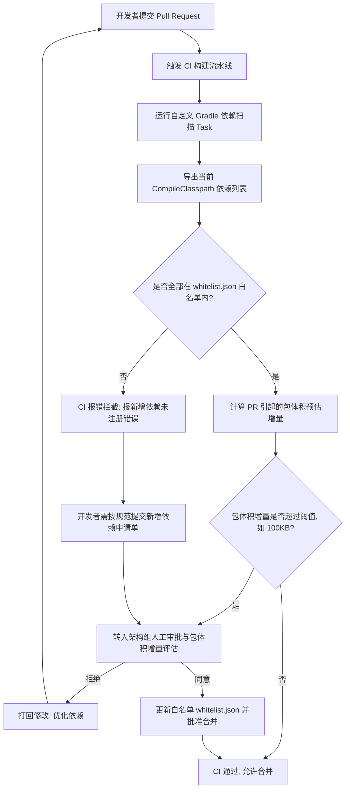

# 5.4.4.5 依赖瘦身

In Android 应用的日常开发与迭代中，引入第三方开源库或内部组件是提高交付效率、避免重复造轮子的核心手段。然而，随着项目规模的扩大与迭代周期的拉长，由于缺乏统一的管理规范与准入卡控，三方依赖的无序增长往往会成为包体积膨胀的“重灾区”。本篇将从依赖膨胀的本质原因出发，深度剖析依赖库的物理构成、诊断排查工具、实战瘦身手段以及企业级 CI/CD 自动化治理机制，帮助开发者系统性地为 Android 项目进行依赖瘦身。

---

## 第一部分：Android 项目依赖现状与包体积黑洞

### 1. 依赖膨胀的诱因
现代 Android 开发高度依赖开源生态（如 Android Jetpack、Kotlin 协程、OkHttp、Retrofit、Glide 以及各类三方 SDK）。在 Gradle 构建系统中，开发者仅需在 `build.gradle` 中写入一行 `implementation '...'` 即可完成依赖引入。这种极低的准入门槛导致了以下依赖膨胀的常见诱因：
- **粗放式开发与敏捷妥协**：在高度紧凑的产品迭代周期中，开发人员往往会选择引入包含很多冗余模块的底层库。例如，仅仅为了在本地使用一个简单的 Base64 编码工具而引入了整个 Apache Commons 库；或者为了展示一个简单的饼图而把整个包含海量 unused 图表类型的重型图表库打包进来。这种“头疼医头、脚疼医脚”的粗放式开发使得项目体积在短时间内迅速膨胀。
- **缺乏版本与依赖隔离**：子模块或三方 SDK 内部隐式引入了大量未知的传递依赖（Transitive Dependencies）。随着 SDK 的不断升级，这些传递依赖在后台悄无声息地迭代并膨胀。开发团队往往只注意到直接依赖的版本升级，却忽略了由于级联依赖导致的“暗度陈仓”式的体积增长。
- **多模块大仓架构的“黑盒效应”**：在现代大型 Android 项目中，为了提高编译速度与团队协作效率，普遍采用单体大仓向微模块（Micro-modules）架构演进的策略。每个业务模块独立开发并声明自己的依赖，最后在 App Shell 模块进行依赖汇聚。由于各模块之间缺乏统一的依赖管控，很容易在不同的业务模块中重复声明性质相同但品牌不同的第三方库（如有些模块使用 Gson，另一些使用 Fastjson，还有一些使用 Moshi），最终在 App 壳工程中全部汇集，造成极其严重的体积浪费。
- **历史债务堆积与生命周期缺失**：由于团队人员流动或项目演进，许多曾经为了某项已下线业务（如旧版推送服务、已经废弃的支付渠道或过时的第三方统计插件）引入的 SDK，因为缺乏清晰的架构审计和依赖生命周期管理，没人敢轻易删除，长期遗留在构建脚本中，成为无用的“僵尸依赖”。
- **单元测试和调试工具的泄漏**：部分开发者在配置依赖时，未能严格区分 `implementation`、`testImplementation` 与 `debugImplementation`，导致本应只在开发 and 测试阶段使用的调试工具（如日志抓取器、模拟定位插件、内存分析器等）被直接打包到了 Release 产物中，增加了包体积的同时也带来了安全合规隐患。

### 2. 依赖膨胀带来的多维开销
依赖膨胀不仅直接导致包体积（APK/AAB）的增大，还对开发效率与运行时性能造成了全方位的负面影响：

```
┌─────────────────────────────────────────────────────────────┐
│                       依赖膨胀的多维开销                    │
└──────────────────────────────┬──────────────────────────────┘
                               │
         ┌─────────────────────┼─────────────────────┐
         ▼                     ▼                     ▼
   【包体积开销】         【编译与构建开销】       【运行时性能开销】
  - APK/AAB 物理增大     - 依赖图解析时间增加    - 类加载检索耗时增加
  - 降低下载与安装转化   - D8/R8 编译处理变慢    - 占用虚拟内存(LinearAlloc)
  - 运行时解压占用空间   - 编译缓存命中率下降    - 导致方法数溢出/冷启动变慢
```

- **包体积开销**：
  - **直接物理体积增加**：打包进 APK 的 class 字节码、Native 库（.so 文件）、静态资源（layout、drawable、assets）直接推高了应用在应用商店的包体积。包体积的增加会直接拉低 Google Play 商店的下载转化率和安装成功率。在网络环境较差、流量资费昂贵的地区，体积大小直接决定了用户是否会下载该应用。
  - **安装后占用空间膨胀**：在 Android 系统上，APK 被安装后，ART 虚拟机通常会通过 AOT（Ahead-of-Time）编译或 JIT（Just-in-Time）模式对字节码进行二次编译，生成 `.odex` 或 `.vdex` 文件。这些编译产物所占据的实际磁盘空间往往是原始 APK 物理体积的数倍，极易引发用户设备的存储空间不足警告，从而导致应用被优先卸载。
- **编译与构建开销**：
  - **Gradle 配置阶段变长**：在构建初期，Gradle 需要对整个依赖树进行拓扑排序与冲突仲裁。当依赖项达到数百个时，仅仅解析依赖图的配置阶段就可能消耗数秒甚至数十秒，这在日常编译时体验非常糟糕。
  - **D8 与 R8 阶段编译耗时剧增**：在混淆和脱糖（Desugaring）阶段，R8/ProGuard 需要读取所有依赖库的字节码，构建完整的类关系图，并进行死代码消除（Tree Shaking）和混淆优化。特别是脱糖过程（将 Java 8 语法及 API 适配到低版本 Android 系统上）需要引入大量的 Stub 类和兼容方法。依赖库类数量的激增会导致编译内存消耗巨大，拉长全量编译时间，严重阻碍本地构建调试的反馈速度。如果 JVM 堆内存分配不足，频繁触发 Full GC 甚至会导致构建挂起。
  - **缓存配置与增量编译失效**：当依赖项过多且版本混乱时，依赖链条中任何一个微小节点的改动，都会引起 Gradle 任务输入（Task Input）的变化，导致本地增量构建时大量的 Task 缓存失效，被迫重新执行昂贵的编译任务，极大地削弱了团队的开发效率。
- **运行时与性能开销**：
  - **类加载延迟与 DEX 检索损耗**：在 MultiDex 项目中，DexPathList 中的每个 DEX 对应一个 Element。检索类时，从前到后依次调用 `dex.findClass()`。如果前几个 DEX 文件里塞满了第三方依赖库的无用类，而 App 核心启动所需要的类被排到了后面的 DEX，那么在冷启动阶段加载核心类时，系统将不得不前前后后检索数万次无用索引。这种由于依赖无序打包导致的“DEX 结构失衡”是冷启动卡顿的元凶之一。
  - **方法区与运行期内存占用**：Android 系统在运行期需要把 DEX 中的 `ArtMethod` 结构以及类元数据加载到虚拟内存的 `LinearAlloc`（Dalvik）或 Metaspace/Mempool 区域。类和方法的过度膨胀不仅会占用宝贵的系统运行内存，还可能直接导致老旧设备上发生 `LinearAlloc` 溢出崩溃，使得应用启动即闪退。此外，过多的方法数还会使得 JIT 编译器的内存和 CPU 占用率攀升，间接导致冷启动期间的整体发热与卡顿。

### 3. 依赖库的物理构成深度拆解
要对依赖进行瘦身，必须明确三方库（以 Android 特有的 AAR 格式为例）引入后的物理构成。当我们解压一个 AAR 文件时，通常会看到以下核心文件：
- **`classes.jar`**：包含所有的 Java/Kotlin 编译后的 `.class` 字节码。
- **`jni/`**：存放各种 CPU 架构（如 `arm64-v8a`、`armeabi-v7a`、`x86`、`x86_64`）的 Native 动态链接库 `.so` 文件。
- **`res/` 与 `assets/`**：包含 SDK 自带的布局文件、图片、多语言字符串等资源文件。
- **`resources.arsc`**（在打包进 APK 后汇总）：资源索引表。
- **`AndroidManifest.xml`**：SDK 自带的清单文件，会在打包时由 Gradle 的 Manifest Merger 自动合并入 App 的主清单中。如果 SDK 声明了不必要的权限或未指明 `android:exported`，不仅会增加包大小，还可能带来安全合规隐患。
- **`R.txt`**：资源 ID 映射表。

#### 关于 assets 目录下的静态文件体积优化与过滤
许多第三方开源库为了在运行时快速加载，会在其 assets 目录下放置庞大的内置字体文件（.ttf）、预置的本地数据库文件（.db）或是海量的 JSON 预置配置文件。如果应用中存在多个依赖了这些 AAR 的子模块，即使我们并不需要这些预置资源，它们也会在最终打包时被全量合入 APK 中。针对 assets 的这一体积泄漏问题，我们应当在打包时使用 Gradle 构建脚本对这些不需要的静态资源执行强行裁剪，或者对其进行全局去重和无损压缩，从物理上杜绝静态资源的打包堆积。

#### AAR Manifest 合并产生的隐藏包体积与安全开销
在编译打包阶段，Gradle 的 `processReleaseManifest` 任务会将所有依赖 AAR 中的 `AndroidManifest.xml` 文件合并到最终的 App 清单中。许多第三方 SDK 在其内部声明了大量本不属于其核心功能的常驻 `Service`、`Receiver` 甚至过度的隐私权限（如获取地理位置、读取手机状态等）。

这些被合并的组件不仅使得 APK 物理清单体积增大，更严重的是，它们会在应用启动时被系统自动解析。有些 `Service` 声明了自启动拉活或位于独立进程，这会导致应用启动即触发多个无关的子进程，造成物理内存被极大程度侵占。

针对此问题，我们需要在 App 的 `AndroidManifest.xml` 中利用 `tools:node="remove"` 指令，强行剥离这些隐藏在 AAR 内部的无用组件：
```xml
<manifest xmlns:android="http://schemas.android.com/apk/res/android"
    xmlns:tools="http://schemas.android.com/tools">
    
    <!-- 强制移除三方 SDK 内部隐式引入的不安全组件 -->
    <service
        android:name="com.some.heavy.sdk.BackgroundService"
        tools:node="remove" />
</manifest>
```

#### 包体积黑洞：R 字段膨胀原理与机制解析
在 Android 早期设计中，子模块或三方 AAR 库为了能够独立编译，其内部生成的 R 类中的资源 ID 并不是 `final` 常量，而是非 final 的 `int` 变量。这主要是为了在最终打包成 App 时，由打包工具统一分配不冲突的资源 ID 并重新写入。

这意味着，在 Library 子模块的字节码中，所有对资源（如 `R.layout.activity_main`）的引用都不能在编译期被直接内联（Inline）为数值，而是必须通过读取 `R.layout.activity_main` 这个静态变量来获取。

当 App 依赖了大量的 AAR 时，Gradle 在合并打包时会为每个 AAR 的包名下生成一份对应的 `R.class` 文件。这意味着即使多个库之间没有资源冲突，每个库的 R 类中也都会复制一份它所能访问到的所有资源 ID 声明。

假设我们有一个主工程和 50 个子模块，每个子模块都声明了一些资源。如果子模块 A 依赖了子模块 B，B 依赖了 C，在没有进行优化的情况下，子模块 C 中的资源 ID 会被逐级复制到 B、A 以及主工程的 R 类中。这会在编译后产生大量的 `R$layout`、`R$id`、`R$drawable` 内部类。

```
假设模块依赖路径：App -> Module A -> Module B -> Module C
如果未开启优化，资源 ID 的生成情况如下：
┌─────────────────────────┐     ┌─────────────────────────┐
│     Module C R类        │ ──> │     Module B R类        │ (复制 C 的所有资源 ID)
└─────────────────────────┘     └─────────────────────────┘
             │                               │
             ▼                               ▼
┌─────────────────────────┐     ┌─────────────────────────┐
│     Module A R类        │ ──> │       App R类           │ (合并复制 A、B、C 所有 ID)
└─────────────────────────┘     └─────────────────────────┘
```

这种几何级数的字段复制，在没有 R8 极致优化的情况下，会直接塞满 DEX 文件的限制（65536 方法数限制），迫使项目过早拆分 MultiDex，并且这些无用的 R 类字节码在运行时会常驻内存，成为名副其实的“包体积黑洞”。

在编译期，当开启了非传递性 R 类（Non-transitive R Class）后，子模块的 R 类将只包含自己模块内声明的资源，而不会包含其依赖模块的资源。这使得 R 类的字段数大为减少。

#### 开启非传递性 R 类的代价与迁移挑战
配置非传递性 R 类非常简单，只需在项目根目录的 `gradle.properties` 中添加：
```properties
android.nonTransitiveRClass=true
```
然而，开启该配置后，业务代码中所有跨模块引用资源的写法都会被强制重构。例如，若子模块 A 想要使用子模块 B 中的资源，在过去可以直接使用本模块的 `R.string.btn_name`，但在开启非传递性 R 类后，必须显式写为 `com.example.moduleb.R.string.btn_name`。

对于一个存量巨大的历史项目，这往往意味着成千上万个编译报错。为了平滑迁移，通常需要利用 Android Studio 内置的迁移工具（**Refactor -> Migrate to Non-Transitive R Classes**）进行全局符号重构。

---

## 第二部分：依赖分析与诊断方法

在着手对依赖进行“切除”之前，首先需要使用精确的诊断工具对项目的依赖树以及最终生成的 APK 进行全方位透视。

### 1. Gradle 依赖树排查技巧
Gradle 提供了 `dependencies` 任务来输出依赖关系树，但如果不加筛选，终端将输出铺天盖地的信息，极难阅读。以下是高效排查依赖树的实用技巧：

#### 指定模块与配置（Configuration）
针对特定变体（如 Release 编译和运行时）进行依赖树分析，避免 Debug 独占库（如 LeakCanary）的干扰。
```bash
# 针对 app 模块的 releaseRuntimeClasspath 配置进行分析并导出
./gradlew :app:dependencies --configuration releaseRuntimeClasspath > deps.txt
```
*注：`releaseRuntimeClasspath` 代表 Release 包在运行期所需的全部依赖，这是最接近 APK 最终打包内容的物理依赖树。而 `releaseCompileClasspath` 则代表编译期间可见的 Classpath，分析这两者的差异能帮我们理清哪些依赖是编译期不需要但运行时必不可少的。*

#### 定位特定的冲突库来源（Dependency Insight）
当我们在依赖树中发现某个不期望出现的库被间接引入了，我们可以使用 `dependencyInsight` 任务来精准定位其引入链路。例如，排查是哪个依赖带入了旧版本的 `okio`：
```bash
./gradlew :app:dependencyInsight --dependency okio --configuration releaseRuntimeClasspath
```
该命令会逆向打印出所有引入 `okio` 的依赖链条，使我们能清晰地看到到底是谁在背后“暗度陈仓”。

#### 识别依赖冲突与仲裁符号
在输出的依赖树文件中，会包含特殊的符号，我们需要准确理解它们的含义：
- **`(*)`**：表示该依赖项已被省略（Omitted）。这是因为该依赖在树的其他分支中已经出现过，且版本完全一致，Gradle 为了防止信息冗余，不再展开其子树。
- **`->`**：表示版本冲突仲裁。例如 `com.squareup.okio:okio:1.14.0 -> 3.0.0`，说明有其他模块引入了更高版本的 Okio 3.0.0，Gradle 自动将此处的 1.14.0 升级到了 3.0.0。

---

### 2. 重复类冲突（Duplicate Class Found）诊断与处理
当项目中不同的三方依赖包内部包含了相同包名和类名的 Class 时，编译阶段会抛出著名的 `Duplicate class found` 错误。

#### 场景与成因剖析
1. **源码级重复打包**：一些不规范的开源库在发布 AAR 时，为了省事，直接将某些公共开源组件（如 Gson 或特定 Util 类）的源码拷贝到了自己的包名路径下，而我们的主项目又恰好依赖了官方的 Gson。
2. **相同库的不同 Artifact 冲突**：例如旧版的 `org.json:json` 和 Android 系统的内置 JSON 类冲突；或者 `com.google.guava:listenablefuture` 与 `guava` 主包之间的类重复。
3. **同库重命名与集团化冲突**：某些大型互联网公司对基础库进行重命名后重新发包，例如把 `okhttp` 重新打包成内部专属的 `network-sdk`，导致两套代码包名不同，但包含完全一样的 Class 结构，这种隐性的重复类不仅撑大了体积，还极易在运行时因为 ClassLoader 的随机加载导致行为不一致。

#### 解决方案
利用 Gradle 的 `dependencySubstitution`（依赖替换）规则，在依赖决议期间强制将冲突的库替换为统一 My Artifact，从而在源头上杜绝重复类的引入：
```kotlin
// build.gradle.kts 示例
configurations.all {
    resolutionStrategy {
        dependencySubstitution {
            // 将旧版的 listenablefuture 替换为空壳或最新的 guava 模块，防止重复打包
            substitute(module("com.google.guava:listenablefuture:1.0"))
                .using(module("com.google.guava:listenablefuture:9999.0-empty-to-avoid-conflict-with-guava"))
        }
    }
}
```

---

### 3. 自动化依赖分析工具：Dependency Analysis Gradle Plugin
手动分析依赖树和 APK 极其繁琐，且很难发现哪些声明的依赖实际上从未被使用。由 Tony Robalik 开发的开源 Gradle 插件 `Dependency Analysis Gradle Plugin`（通常简称为 DAGP）是目前治理依赖的利器。

#### 诊断原理与 ASM 字节码分析深度剖析
DAGP 的底层工作机制非常硬核。它在 Gradle 编译任务完成后，利用 ASM 字节码解析框架读取生成的所有 `.class` 文件。

对于每一个 Class，ASM 的 `ClassReader` 会按照 JVM 规范读取其二进制结构：从前 4 字节的魔数 `0xCAFEBABE` 开始，依次解析常量池（Constant Pool）、访问标志、类索引、超类索引、接口索引表、字段表和方法表。

在类解析过程中，DAGP 实现了自定义的 `ClassVisitor`，在访问方法的指令集时，通过拦截常量池中的 `CONSTANT_Class_info`（类描述符）和 `CONSTANT_Methodref_info`（方法调用引用），记录下该类中所有外部引用的类的包名和类名。

接着，它会读取当前模块的 `compileClasspath` 和 `runtimeClasspath` 中所有依赖项的 Class 内容，并将两者进行交叉比对。通过这种静态分析，它能极其精准地诊断出项目中依赖声明的四大核心问题：

- **Unused dependencies**：声明了但代码中完全没有直接使用的依赖。在多模块组件化项目中，这通常是直接拷贝依赖配置导致的，完全可以安全移除。
- **Used transitive dependencies**：代码中实际使用了该库的类，但它是通过其他依赖间接传递进来的，项目并未在 `build.gradle` 中直接声明。这是一种非常危险的隐患，因为一旦直接依赖的库升级并移除了该传递依赖，项目将发生编译报错。建议将其改为显式声明。
- **Runtime-only dependencies**：代码中没有直接引用该库的任何 API，但该库是运行时必不可少的（例如通过反射加载的驱动、JDBC、或者基于 Java SPI 机制的组件），应将声明方式从 `implementation` 优化为 `runtimeOnly`，缩短编译期 Classpath，加速构建。
- **Duplicate dependencies**：检测项目依赖中是否存在多个相同功能的库或重复的 class。

#### 插件高级配置（Kotlin DSL 示例）
我们在集成 DAGP 时，为了避免它对某些特殊的反射调用库进行误报（例如因为反射而在代码中没有静态引用），可以通过 `dependencyAnalysis` 配置块定制扫描规则与排除策略：
```kotlin
// build.gradle.kts 示例
dependencyAnalysis {
    issues {
        all {
            onAny {
                // 仅输出警告，不打断本地编译，在 CI 阶段可以通过严格模式卡控
                severity("warn")
            }
            onUnusedDependencies {
                // 忽略特定的必须保留在 Classpath 中的底层库（如安全合规库）
                exclude("com.example.security:base-security-sdk")
            }
        }
    }
}
```

---

### 4. Gradle 版本冲突仲裁机制及对体积的隐性影响
Gradle 拥有一套自动处理版本冲突的机制，深入理解这一机制是进行依赖瘦身的重要基础。

#### 高版本优先决议（Highest Version Wins）与图算法
当 Gradle 构建依赖图时，它会进行广度优先遍历（BFS）。当它在依赖图中发现同一个依赖项（以 `group:name` 为标识）存在多个不同的版本时，默认会触发版本决议机制。在没有任何干预的情况下，Gradle 会将所有低版本升级为当前依赖图中声明的最高版本。

#### 为什么高版本优先会导致潜在的运行时崩溃？
尽管高版本优先保证了类不会发生物理重复打包，但如果高版本库删除了某些被废弃的 API（即二进制不兼容的更新），而被动升级的低版本模块在运行时仍尝试通过反射或直接调用这些已不存在的 API，就会在运行时抛出 `NoSuchMethodError` 或 `NoClassDefFoundError`，导致应用崩溃。这往往强迫开发团队为了兼容性而不得不引入更多的桥接包或旧版兼容库，从而进一步恶化了包体积。

---

## 第三部分：依赖瘦身实战方法

针对诊断发现的问题，我们可以采取以下针对性的实战手段来剔除冗余依赖，完成包体积瘦身。

### 1. exclude 剔除传递依赖与禁用传递依赖机制
在依赖三方 SDK 时，经常会遇到 SDK 内捆绑了我们不需要的组件，或者与项目中已有的基础库版本冲突的情况。使用 `exclude` 规则可以强制在编译和打包时剔除这些冗余项。

#### 单个依赖剔除示例（Groovy & Kotlin DSL）
以下是剔除三方分享 SDK 中自带的旧版 `support-v4` 和不需要的支付组件的示例：

::::tabs
:::tab Groovy
```groovy
dependencies {
    implementation('com.share.sdk:social-sdk:2.5.0') {
        // 排除指定的传递依赖模块
        exclude group: 'com.android.support', module: 'support-v4'
        exclude group: 'com.share.sdk', module: 'social-payment'
        exclude group: 'com.google.android.gms', module: 'play-services-maps'
    }
}
```
:::
:::tab Kotlin DSL
```kotlin
dependencies {
    implementation("com.share.sdk:social-sdk:2.5.0") {
        // Kotlin 中的 exclude 语法
        exclude(group = "com.android.support", module = "support-v4")
        exclude(group = "com.share.sdk", module = "social-payment")
        exclude(group = "com.google.android.gms", module = "play-services-maps")
    }
}
```
:::
::::

#### 全局 Configurations 排除示例
如果项目中某些库含有安全漏洞，或者团队决定全局弃用某个废弃库，可以通过全局 Configuration 配置进行批量拦截和剔除：
```groovy
// build.gradle (Groovy)
subprojects {
    project.configurations.all { configuration ->
        // 全局剔除老旧的 JSON 库，防止编译类冲突
        configuration.exclude group: 'org.json', module: 'json'
        // 全局排除 commons-logging，改用更轻量的 slf4j
        configuration.exclude group: 'commons-logging', module: 'commons-logging'
        // 排除废弃的 Apache HttpClient 遗产包
        configuration.exclude group: 'org.apache.httpcomponents', module: 'httpclient'
    }
}
```

#### 激进的“重症”治理：禁用传递依赖 (`transitive = false`)
在极端情况下，若某个第三方依赖内部捆绑了极多且混乱的传递依赖，而我们希望完全由本地手动精准接管，可以通过 `transitive = false` 彻底关掉该依赖项的传递拉取机制：
```kotlin
dependencies {
    implementation("com.some.heavy.sdk:messy-sdk:1.0.0") {
        // 强行关闭传递依赖解析，此时该 SDK 依赖的其它库全部不会被拉取
        isTransitive = false
    }
    // 我们必须在下方手动补全 Messy-SDK 运行所绝对必须的子依赖项
    implementation("com.squareup.okhttp3:okhttp:4.9.3")
}
```
*注：此方法属于非常规的“重症”手段。使用它要求架构师对目标三方库的运行时依赖关系有极其透彻的理解，否则会因为缺失传递依赖导致运行时 `NoClassDefFoundError`。*

---

### 2. Jetifier 机制的构建损耗与瘦身改造
在从 Android 旧版 Support 库向 AndroidX 库迁移的过程中，为了兼容仍在使用 `android.support.*` 包名的旧三方 SDK，Gradle 提供了 Jetifier 转换工具：
```properties
android.enableJetifier=true
```

#### Jetifier 工作机制与弊端
In 编译依赖决议阶段，Jetifier 会拦截所有下载下来的三方 AAR 依赖，将其解压，用 ASM 字节码重写框架将里面字节码中所有的旧版包名引用物理改写为对应的 `androidx.*` 路径，然后重新打包缓存到本地。

这种“运行时即时重构”带来了极大的负面开销：
- **编译耗时大幅拉长**：首次构建或清理缓存后的编译过程会拉长数分钟甚至半小时以上。
- **内存泄漏与缓存膨胀**：Jetifier 会产生大量冗余的 AAR 副本缓存，挤占磁盘空间，并频繁触发编译期的 JVM OOM 崩溃。

#### 瘦身行动：关闭 Jetifier
进行依赖瘦身的一大核心动作即是：**彻底清理掉需要依赖 Jetifier 才能运行的陈旧 SDK，完成 AndroidX 原生化改造**。当全量依赖均支持 AndroidX 包名后，在 `gradle.properties` 中关闭该配置，可直接释放显著的编译能效并减少打包冗余：
```properties
android.enableJetifier=false
```

---

### 3. 三方 SDK 的轻量替代方案与二次封装
选择一个库，就是选择了一份包体积契约。在满足业务需求的前提下，应优先选择方法数少、无庞大传递依赖、体积更小的轻量级替代方案。

#### 常见三方依赖库轻量化替代对比表
下表列出了 Android 开发中几种常见的重型库及其推荐的轻量替代方案：

| 原始重型库 | 物理体积 (参考) | 推荐轻量替代方案 | 物理体积 (参考) | 替换收益与技术考量 |
| :--- | :--- | :--- | :--- | :--- |
| **Jackson / Gson** | ~1.5 MB / ~300 KB | **Moshi / Kotlinx Serialization** | ~120 KB / ~150 KB | Jackson 包含了大量的反射逻辑和生成代码，且体积偏大。Kotlinx Serialization 是 Kotlin 官方编译器插件，在编译期生成序列化适配器代码，**零反射开销**，对 Kotlin 支持完美。 |
| **Guava** | ~3.0 MB | **Kotlin 标准库 / 原生 API** | 0 (已内置) | Guava 提供了海量 Java 集合与并发工具，但在现代 Android 中，绝大多数需求可以用 Kotlin 标准库（如 `filter`、`map`） and Android 的系统 API 直接实现，不应为了个别工具方法引入整个 Guava。 |
| **RxJava 2 / 3** | ~2.2 MB | **Kotlin Coroutines / Flow** | ~300 KB | RxJava 拥有庞大的操作符类集合和复杂的调用链，会产生海量的方法数。协程与 Flow 在语言级提供了异步数据流支持，不仅代码更简洁易读，且体积仅为 RxJava 的十几分之一。 |
| **Glide / Fresco** | ~1.0 MB / ~3.5 MB | **Coil** | ~150 KB | Coil（Coroutines Image Loader）是专为 Kotlin 开发的轻量图片加载库，体极精简。它通过复用项目已有的 OkHttp 作为底层网络请求器，避免了 Glide 自带网络引擎的体积浪费，且直接复用了协程进行线程调度。 |

#### 深度技术剖析：Moshi 替换 Gson 的包体积价值
Gson 在反序列化时高度依赖反射机制。为了让混淆器 R8 不在编译期将反序列化所需的实体类（POJO）的方法和字段优化掉，开发者必须在 `proguard-rules.pro` 中写入极为宽泛的 `-keep` 规则。这直接导致大批原本可以被 R8 混淆、内联甚至 Tree Shaking 抹除的实体类及其相关的方法被迫原封不动地打包进 APK 中。

相比之下，Moshi 推荐使用编译期代码生成方式（通过 `moshi-kotlin-codegen` 开启 APT 编译期处理）。它会在编译期为每一个 POJO 类生成一个专用的 `JsonAdapter`。这些生成的适配器类是完全类型安全的，并且可以被 R8 深度混淆。更重要的是，它**不需要**对 POJO 类进行宽泛的 `-keep` 限制，从而释放了 R8 的优化潜力，间接带来了数 MB 的体积收益。

#### Coil 图片库的体积与架构优势
Coil 是完全基于 Kotlin 协程开发的图片加载库。相比于 Glide 庞大的包体积（包含数千个方法以及自定义的复杂线程池和网络连接管理），Coil 实现了极其轻量化的架构：
- **复用已有网络客户端**：Coil 没有内置独立的主动网络请求引擎，而是强制复用项目中已有的 `OkHttp` 实例。这直接避免了打包两套网络拦截器与连接池的体积浪费。
- **复用协程调度器**：Coil 利用 Kotlin 协程的 `Dispatchers.IO` 进行异步调度，完全丢弃了 Glide 中为了兼容老旧 Java 线程模型而自研的极其繁重的 ThreadPoolExecutor 封装，使方法数大幅度缩减。

#### 编译产物对比：RxJava 对比协程与 Flow
在传统的 RxJava 链式调用中，每一个简单的操作符（如 `.map()`、`.filter()`）在底层的编译产物中，都会对应生成一个继承自 `Observable` 的独立子类（例如 `ObservableMap`、`ObservableFilter` 等）。在混淆脱糖之后，这些操作符不仅会生成大量的 `.class` 文件，还会留下极长的方法调用栈，严重撑大了应用的方法数（Method Count）。

相比之下，Kotlin 协程由于编译器在编译期对 `suspend` 关键字进行了状态机转换（CPS 变换，Continuation-Passing Style），所有的挂起与恢复逻辑最终只会被编译为少量的状态机类和 `Continuation` 接口实现。这使得原本用 RxJava 编写的繁琐异步逻辑，换用协程和 Flow 重新编写后，方法数和类数量可以暴跌 70% 以上，效果极其显著。

#### 自研轻量级 SDK 的私有 Maven 托管与重构
对于一些必须要引入但功能严重过载的三方 SDK（例如仅仅为了获取一个设备指纹，就引入了包含推送、分享、统计、埋点全家桶的重型 SDK），团队在完成“静态反编译与二次组装”或“定制化裁剪”后，建议采用以下长效维护方案：
1. **私有 Maven 托管**：将裁剪后的纯净版二进制 AAR 重新定义包名，上传至团队私有的 GitLab/Gitee Package Registry 仓库，实现工程版本化跟踪，切忌直接以本地 Jar/AAR 形式散落各模块中。
2. **桩代码 (Stub) 编写**：若其它间接依赖的模块需要引用该 SDK 原本已被裁剪掉的非核心 API 导致编译失败，可在基础通用层编写简单的“空操作占位类与桩方法”，以保证 Classpath 的编译期一致性，防止因强行“剪枝”导致的编译冲突。

---

### 4. Gradle dependencyConstraints 约束锁版
为了防止依赖版本在多模块中因为 Gradle 的仲裁机制而发生“漂移”，也为了避免被动升级，建议在根目录的构建脚本中配置 `dependencyConstraints`（依赖约束）。

#### 配置约束锁版示例
```kotlin
// 根目录 build.gradle.kts
subprojects {
    dependencies {
        constraints {
            // 锁定全局的 Gson 版本为 2.9.0
            implementation("com.google.code.gson:gson:2.9.0") {
                because("限制全局 Gson 版本，杜绝因为依赖仲裁导致的版本无序升级")
            }
            // 限制 OkHttp 版本，防止某些子模块擅自升级引入不兼容的二进制变更
            implementation("com.squareup.okhttp3:okhttp:4.9.3") {
                because("统一网络库版本，确保兼容性并优化连接池复用")
            }
        }
    }
}
```

#### 使用 Bill of Materials (BOM) 进行多模块统一锁版
在大型组件化项目中，我们可以设计一个专用的 `platform` 模块（类似于 Maven 的 BOM），通过定义统一的依赖版本平台，让其他所有子模块都导入此平台，从而实现依赖版本的高度一致性：
```kotlin
// 业务子模块 build.gradle.kts
dependencies {
    // 引入统一的版本控制平台，不需要指定具体版本号
    implementation(platform(project(":dep-platform")))
    implementation("com.squareup.okhttp3:okhttp")
    implementation("com.google.code.gson:gson")
}
```

#### `dependencyConstraints` 与 `force` 的设计权衡
在过去，开发者常使用 `force = true` 来强制锁定版本：
```groovy
// 废弃的强制决议写法
configurations.all {
    resolutionStrategy {
        force 'com.google.code.gson:gson:2.9.0'
    }
}
```
它们的底层运行机制和设计取舍存在很大差异：
- **`force = true`**：属于**硬性覆盖**。无论项目中是否真的需要这个库，也不管其他依赖库要求的版本范围，Gradle 都会无条件将该库加入依赖图并强制使用该版本。这会破坏 Gradle 的版本协商链路，如果强制降级了一个不兼容的主版本，极易在运行时抛出 `LinkageError`，且排查困难。
- **`dependencyConstraints`**：属于**软性约束**。它只有在依赖图的某处**已经显式声明**了该依赖（无论是直接还是传递）时，才会生效并限制其版本。如果项目中没有任何地方引入该依赖，约束配置**不会**主动把它拉取并打包进应用。因此，它是一种更为安全、优雅的版本控制机制。

---

### 5. CI/CD 静态扫描与依赖白名单机制
依赖瘦身往往呈现“治理时效果显著，迭代三个月后再次回弹”的现象。要保持依赖瘦身的成果，必须在 CI（持续集成）流水线中配置自动卡点卡线任务，将依赖治理制度化。

#### 依赖白名单静态扫描机制
我们可以通过编写自定义的 Gradle Task，在执行 Release 编译之前，对该打包变体的全部 Classpath 依赖进行扫描。一旦发现有未在 `whitelist.txt` 配置文件中备案的新增依赖，立即中断构建并报错。

#### 白名单配置文件格式（`dependency_whitelist.txt` 示例）
白名单配置通常采用简单的行匹配格式，支持通配和按模块拦截：
```text
# 核心网络和 JSON 解析库
com.squareup.okhttp3:okhttp
com.google.code.gson:gson
com.squareup.moshi:moshi

# 允许引入的官方 Jetpack 架构组件
androidx.lifecycle:lifecycle-livedata
androidx.room:room-runtime
```

#### 企业级卡控流水线的闭环流控
在规范的工业级开发流程中，依赖的控制应该形成闭环：
1. **本地开发阶段**：开发者若需引入新依赖，首先在本地触发扫描任务。若未授权，本地编译将被拦截。
2. **提交评估单**：开发者提交 Pull Request 时，CI 系统会分析该分支引起的依赖图变化，并自动计算出物理体积增量。若体积增量超过设定阈值（如 100KB），则强制触发卡点。
3. **架构组人工评审与备案**：架构组评审新依赖的合法性、安全合规性及体积开销，审批通过后，将新依赖信息合并入 `dependency_whitelist.txt` 白名单文件中，此时该 PR 才能成功合入主分支。

---

## 第四部分：NDK 依赖与 Native 库瘦身

在包含音视频、地图、人脸识别、跨端引擎（如 Flutter、React Native）的 Android 项目中，Native 动态链接库（.so）通常占据了 APK 物理体积的 50% 以上。针对 NDK 依赖，我们需要采取特殊的瘦身策略。

### 1. 三方库捆绑 so 包拆分与二次封装
多数打包发布到 Maven 的 AAR 库为了兼容性，会在 `jni/` 目录下放置四种 CPU 架构的 so 库：`armeabi-v7a` , `arm64-v8a` , `x86` , `x86_64`。

#### ABI 过滤配置
在当前的移动设备生态中，`x86` 和 `x86_64` 主要用于模拟器，而 `armeabi-v7a` 属于 32 位老旧架构。目前，主流的现代 Android 手机都已经全面支持 64 位的 `arm64-v8a` 架构，且各大主流应用商店已出台政策，强制要求提供 64 位版本的 App。关于 Android SDK 各版本及架构迁移的具体节点，可参考 [AndroidVersionChangeLog.md](../../../../AndroidVersionChangeLog.md)。

在 App 的 `build.gradle` 中，必须通过 `ndk.abiFilters` 强制过滤，防止无用的 so 被打包入 APK：

```kotlin
android {
    defaultConfig {
        ndk {
            // 仅打包 64 位 arm64-v8a 架构的 so 库，彻底剪除 32 位及模拟器架构
            abiFilters.addAll(setOf("arm64-v8a"))
        }
    }
}
```
*注：如果在国内市场分发，可以直接采用单 `arm64-v8a` 策略。如果需要兼容极少数老旧 32 位设备，可选择打包双架构，或利用 Google Play 的 App Bundle (AAB) 动态分发技术，由商店在下载时自动匹配对应 ABI。*

#### 32 位与 64 位 so 混包的灾难性后果
在 Android 系统中，当应用启动时，系统会根据应用安装目录下的 `lib/` 文件夹中存在的 so 库来决定为该应用分配 32 位还是 64 位的虚拟机运行环境。

如果我们的 App 声明了支持 `arm64-v8a` 和 `armeabi-v7a`，但是在打包时，由于某个三方不规范的 SDK 只提供了 32 位的 `libx.so`，而其他库都提供了 64 位的 `liby.so`。这会导致在 64 位手机上，系统检测到包里有 64 位目录，于是以 64 位模式启动 App。然而，当代码执行到加载 `libx.so` 时，动态链接器会因为在 64 位 Classpath 下找不到 64 位的 `libx.so`（它只有 32 位版本）而直接抛出 `UnsatisfiedLinkError` 崩溃。

因此，实施严格的 `abiFilters` 过滤，不仅能实现显著的瘦身效果（剔除不必要的架构目录可直接减少 50% 以上的 so 体积），更是保证应用运行期稳定性的核心手段。

#### 动态链接库的符号裁剪 (Strip)
许多三方 AAR 中的 so 库在出厂编译时，并没有剔除 C++ 的调试符号信息（Debug Symbols）和符号表。这会导致 so 文件的体积大出数倍。我们可以利用 NDK 工具链中的 `strip` 工具在打包阶段强制移除这些无用信息：
```groovy
// build.gradle (Groovy)
android {
    // 强制打包时对所有 so 库运行 strip，剔除调试符号
    packagingOptions {
        doNotStrip "*/极少数因反射或动态寻址需要保留符号的库.so"
    }
}
```

#### C++ 运行时库链接策略的选择
在编译 C++ 代码时，NDK 支持两种 C++ 标准库链接方式：
- **`static` 链接 (`libc++_static.a`)**：将 C++ 标准库直接静态编译链接到每个 `.so` 库中。
- **`shared` 链接 (`libc++_shared.so`)**：所有的 `.so` 库都动态链接到同一个共享的 `libc++_shared.so` 库上。

**设计取舍**：如果项目中只包含一个单独的 `.so` 动态链接库，使用静态链接可以避免多余的动态库加载开销，有利于微幅瘦身。但如果项目高度模块化，引入了多个包含 Native 代码的三方库，若每个三方库都静态链接了 `libc++_static`，会导致 C++ 标准库代码在每个 so 库中都重复拷贝一份，造成极大的空间浪费，甚至在不同 so 之间传递 C++ 对象（如 `std::string`）时引发运行时崩溃。在此种场景下，必须在所有模块中统一配置为**动态链接共享库**模式，由 App 统一打包一个 `libc++_shared.so`，从而实现数 MB 的体积缩减。

#### 隐藏 JNI 导出符号（Visibility = Hidden）
默认情况下，C/C++ 代码编译后，所有的 C++ 类方法和全局函数符号都会被写入 ELF 共享库的导出表（Export Table）中，以便外部解析。这会导致 so 文件中存有海量冗余的方法签名长字符串。

针对此问题，我们应在 `CMakeLists.txt` 中配置 `-fvisibility=hidden` 编译参数：
```cmake
set(CMAKE_CXX_FLAGS "${CMAKE_CXX_FLAGS} -fvisibility=hidden")
```
开启该参数后，除了显式标记了 `JNIEXPORT` 关键字的 JNI 入口方法外，其他的内部 C++ 辅助函数符号表全部会被强制隐藏，使 ELF 符号表（Symbol Table）的大小瞬间缩减 30% 以上，不仅优化了包体积，还显著提高了 Native 代码的反编译难度。

#### CMake 编译优化级别精细化控制（-Os 替代 -O3）
在 Native 编译参数中，默认的 Release 模式通常会使用 `-O3` 级别的全方位速度优化。这会引发编译器进行大量的循环展开和函数暴力内联，从而生成冗余的方法指令机器码。

在进行体积深度瘦身时，应当修改为 `-Os`（Optimize for Size）优化级别。其能指示 CMake 链接器在保持 90% 以上执行速度的同时，竭尽全力缩减代码长度。配合 `-fdata-sections` 和 `-ffunction-sections` 以及链接器的 `--gc-sections` 物理死代码消除参数，可消除所有未被引用的 Native 函数段，为 so 文件带来 15% - 40% 的体积下降。

---

### 2. Native 库动态下发方案与 ReLinker 实践
为了追求包体积的极致优化，对于非启动必须的重型 so 依赖（如特效滤镜、OCR 识别、游戏引擎等），业界普遍采用**动态下发方案**，即把 so 库从 APK 中剥离，在应用运行期间从 CDN 异步下载并加载。

#### ELF 文件结构与动态加载机制
Linux 下的 `.so` 动态链接库采用 ELF (Executable and Linkable Format) 文件格式。在 ELF 文件的头部信息中，包含一个名为 `.dynamic` 的段（Section）。该段内含有一系列的标记项，其中类型为 `DT_NEEDED` 的标记记录了该 so 库运行所依赖的其他共享库名称。

当我们调用 `System.load("/data/.../liba.so")` 时，系统底层的 Linker 会解析 `liba.so` 的 ELF 头部，发现它依赖了 `libb.so`。此时，Linker 会按照系统的默认检索路径（通常是 `/system/lib/`、`/vendor/lib/` 等）去寻找 `libb.so`。如果 `libb.so` 是和 `liba.so` 一起下载并放在我们自定义的沙盒路径下的，系统动态链接器就无法找到它，抛出致命的 `UnsatisfiedLinkError`。

#### 绝对路径加载与系统寻址的底层权衡
使用绝对路径 `System.load(String filename)` 能够直接越过系统动态链接器对默认检索路径（由环境变量 `LD_LIBRARY_PATH` 指定，包含 APK 的 `lib` 目录、`/system/lib`、`/vendor/lib` 等）的扫描限制，直接定位到应用的私有沙盒目录加载指定 so 库。

然而，这也带来了一个权衡损耗：系统 linker 原本拥有的动态链接缓存库（通过 dlopen 缓存加载过的共享库指针）对该自定义绝对路径通常无法完美加速。如果频繁地对大 so 文件进行动态 load/unload 操作，会带来额外的 I/O 吞吐损耗和轻微的运行时性能开销。因此，该下发方案通常仅针对一次性加载后驻留内存的重型第三方 Native 组件，而不建议用于频繁交互的底层高频通信 so。

#### 解决方案：ReLinker 深度实践与系统缺陷规避
为了解决动态加载 so 的级联依赖寻址问题，推荐使用开源的 `ReLinker` 库。它重写了 Android 的 so 加载逻辑。它在加载 so 前，会通过纯 Java/Kotlin 代码解析 ELF 的二进制格式，手动提取出它的 `DT_NEEDED` 依赖链条。然后，在开发者指定的自定义沙盒目录下进行拓扑排序，按依赖顺序优先加载底层的被依赖 so，最后加载目标 so，完美解决了级联寻址失败的问题。

此外，Android 5.0 至 7.0 的早期系统（具体 API 变更可参考 [AndroidVersionChangeLog.md](../../../../AndroidVersionChangeLog.md)）自带的链接器 `linker` 存在大量的安全加载缺陷，在特定厂商设备上读取临时目录或私有空间中的 AAR 动态释放 so 时，会因为缓存未及时同步而偶发加载失败。ReLinker 对这些老旧系统缺陷进行了完美的 Java 层兼容性重试规避，极大地保障了线上稳定性。

```kotlin
// ReLinker 动态加载示例
ReLinker.apks(context)
    .loadLibrary("a", object : ReLinker.LoadListener {
        override fun success() {
            // 加载成功，安全调用 Native 方法
        }
        override fun failure(t: Throwable) {
            // 加载失败处理
        }
    })
```

---

### 3. 调试测试工具的沙盒隔离原理
像 `LeakCanary`、`Flipper` 这种辅助开发工具，往往包含大量的调试界面、数据库检测工具以及后台监控服务。如果 release 包中带有这些依赖，不仅会使包体积平白增大 2-5MB，还会向外界暴露大量的调试接口，构成极大的安全合规隐患。

#### `debugImplementation` 底层隔离原理
`debugImplementation` 声明的依赖只会在 debug 变体构建时参与编译并打包，而在 release 变体中完全被排除。

#### No-op 变体的工程设计模式与实现
为了解决在 Release 编译时因为找不到 Debug 下的类而导致编译报错（例如代码中调用了 `LeakCanary.showLeakDisplayActivity()`），这些工具库官方通常会提供一个 `no-op` 版本的变体（例如 `com.squareup.leakcanary:leakcanary-android-no-op:x.x`）。

我们将它配置为 `releaseImplementation` 级别。在 Release 编译时，打包进去的其实是这个空壳，既保证了代码能正常通过编译，又几乎没有引入任何体积和运行时开销。

---

## 第六部分：治理机制与案例

### 1. 依赖树清理实战效果数据
以下是某中型 Android 项目在经历系统性依赖治理后的对比数据表：

| 优化维度 | 治理前数据 | 治理后数据 | 优化差值 / 降幅 | 关键优化动作 |
| :--- | :--- | :--- | :--- | :--- |
| **APK 物理体积** | 48.5 MB | 22.1 MB | -26.4 MB (-54.4%) | 剔除冗余 SDK，过滤并动态下发 Native .so，开启 R8 极致死代码消除。 |
| **DEX 数量** | 3 个 | 1 个 | -2 个 | 优化 R 字段，使用 DAGP 清理了 27 个未使用声明依赖。 |
| **总方法数 (Methods)** | 148,500 | 62,300 | -86,200 (-58.0%) | 清除 Jackson，使用 Moshi 代替；排除 support 库，全局向 AndroidX 迁移。 |
| **冷启动平均耗时** | 1,450 ms | 980 ms | -470 ms (-32.4%) | 瘦身后的单 DEX 减少了 ClassLoader 检索开销，且避免了冗余 SDK 的 Application 初始化。 |
| **全量编译构建耗时** | 310 s | 145 s | -165 s (-53.2%) | 编译期 Classpath 极大缩减，减轻了 D8 脱糖和 R8 树抖动的分析负担。 |

---

### 2. Gradle 依赖版本冲突仲裁与调优逻辑
下面的结构图展示了当项目发生同一个库多版本冲突时，Gradle 默认的仲裁机制以及我们如何通过技术手段实施干预：

```mermaid
graph TD
    A[开始 Gradle 依赖解析] --> B{是否存在同库不同版本冲突?}
    B -- 否 --> C[正常下载并打包]
    B -- 是 --> D{是否声明了 Dependency Constraints 约束?}
    D -- 是 --> E[强制解析为约束指定的版本]
    D -- 否 --> F{是否在依赖节点声明了 exclude 排除规则?}
    F -- 是 --> G[剔除被排除的传递依赖]
    F -- 否 --> H{是否声明了 force = true 强制决议?}
    H -- 是 --> I[强制使用 force 指定的版本]
    H -- 否 --> J[按默认"高版本优先 Highest Version Wins"原则决议]
    E --> K[合并依赖图]
    G --> K
    I --> K
    J --> K
    K --> L[检查是否引入未预期的传递依赖或导致 API 不兼容]
    L --> M[结束解析]
```

**解析逻辑说明**：
- 在依赖解析阶段，若无任何干预，Gradle 将无条件采用最右侧的分支（最高版本优先），导致版本被动升级。
- 为了从源头卡控体积，架构组应通过 `dependencyConstraints` 约束锁版或 `exclude` 剔除，强制使依赖解析走向定制化分支，剪除冗余的传递叶子节点，从而把控最终打包进 DEX 的代码。

---

### 3. CI/CD 自动化依赖包体积卡控流水线
为防止依赖体积回弹，将依赖引入规范化，团队需要在持续集成流水线中配置自动卡点卡线任务，其工作流逻辑如下：



**卡点流程控制节点说明**：
1. **依赖白名单（`whitelist.json` / `whitelist.txt`）比对**：将解析出来的编译依赖库签名与已备案的白名单库进行强匹配，任何未经审核的 `implementation` 都会在编译前被检测到并直接中断 CI 流程。
2. **包体积增量评估阈值卡控**：若检测到合法的依赖引入（或版本升级），CI 自动比对前后构建出的 APK 物理体积。若体积增量超过预设卡线值（如 100KB），则强行拦截合并，进入架构组人工评审流程。
3. **闭环链路治理**：这套机制保证了只有“必要的、经过轻量化评估的、无冲突的”三方库依赖才能合并入主干代码，从源头上保障了 Android 包体积的健康与稳定。通过这样全生命周期、自动化卡点与架构控制相结合的工程手段，才能真正堵住依赖膨胀的体积黑洞，实现长效、良性的依赖瘦身。
