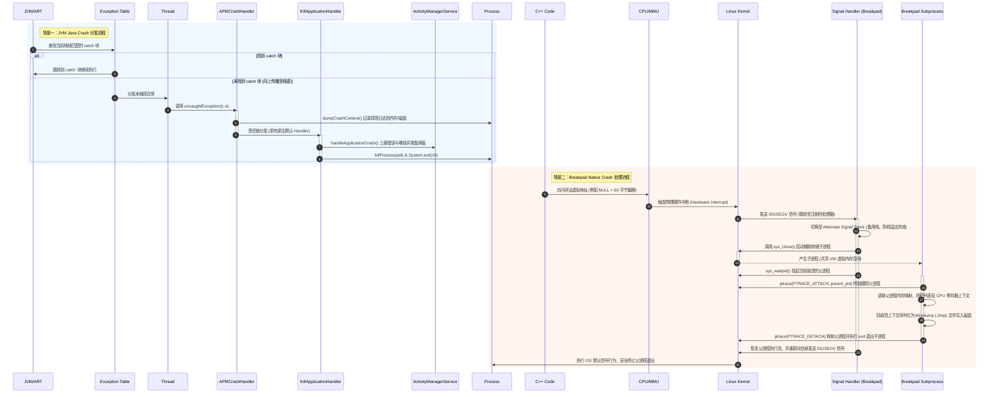

# Crash 收集分析

在移动互联网时代，App 的稳定性是衡量用户体验最核心的指标之一。高崩溃率（Crash Rate）会直接导致用户流失、应用商店评分下跌，甚至带来直接的商业损失。因此，构建一套高可用、低损耗、信息完备 of Crash 收集与治理体系，是每个中大型 Android 研发团队的核心工作。

本文将从 Android 异常与崩溃分类、崩溃捕获的底层机制与原理、崩溃分析与堆栈还原实践、APM 崩溃治理与防崩闭环，以及真实案例分析与故障复盘五个维度，对 Android 平台的 Crash 收集分析进行系统性、深度剖析。

---

## 1. Android 异常与崩溃分类

在 Android 系统中，崩溃（Crash）本质上是正在运行的进程因为某些未处理的异常或受系统强制干预，导致进程异常退出。根据发生崩溃的运行环境和触发原因，通常可以将其分为 **Java 崩溃**、**Native 崩溃**、**ANR** 和 **OOM** 四大类。

```
                                      ┌─── Java 崩溃 (JVM 未捕获异常 Throwable)
                                      ├─── Native 崩溃 (C/C++ 硬件/软件异常，触发 Linux 信号)
Android 异常与崩溃 (Crash Life Cycle) ───┼─── ANR (主线程消息卡顿，触发系统 SIGQUIT 信号)
                                      └─── OOM ─┬─ Java OOM (ART 堆内存耗尽)
                                                └─ Native OOM (虚拟内存耗尽/线程数超限/FD泄露)
```

### 1.1 Java 崩溃 (Java Crash)
Java 崩溃发生于 Android 的虚拟机（Dalvik / ART）中。它的本质是应用程序的代码在运行过程中，由于逻辑错误或系统限制抛出了一个 `java.lang.Throwable` 或其子类（主要指 `RuntimeException` 和 `Error`），并且这个异常在当前的调用栈中没有被任何 `catch` 块捕获。
* **JVM 中的 Throwable 分类**：
  * `Error`：代表 JVM 级别严重的系统故障，如 `OutOfMemoryError`、`StackOverflowError`。这类问题通常是由于系统资源耗尽或底层机制受限引起的，应用一般无法或者不应该尝试去捕获它。
  * `Exception`（尤其是 `RuntimeException`）：代表程序逻辑错误或运行时状态异常，如 `NullPointerException`、`IndexOutOfBoundsException`。这类问题必须在开发阶段通过健全的代码逻辑去避免，或者在合理位置捕获。
* **分发链路**：一旦异常未能被应用代码捕获，最终会被分发给虚拟机定义的默认未捕获异常处理器（`Thread.UncaughtExceptionHandler`），由其接管崩溃现场并强退进程。
* **常见原因**：`NullPointerException`（空指针解引用）、`IndexOutOfBoundsException`（数组/列表越界）、`ClassCastException`（类型转换错误）、`IllegalArgumentException`（非法参数传入）等。

### 1.2 Native 崩溃 (Native Crash)
Native 崩溃指发生在 C/C++ 编写的动态链接库（`.so` 文件）中的崩溃。由于 Native 代码是直接编译为机器码并运行在 CPU 之上的，其崩溃不再由 ART 虚拟机托管，而是由操作系统内核（Linux Kernel）进行底层干预。
* **物理机制**：Native 崩溃通常源于 CPU 执行了非法指令（如未定义的机器码）、尝试读写非法内存地址（如只读区域或未映射的地址空间）等硬件异常。此时，MMU（内存管理单元）或 CPU 的异常处理模块会捕获硬件中断，内核随之接管，并向引发异常的特定线程发送一个特定的 Linux 信号（Signal）。
* **进程退出**：如果应用程序没有主动为该信号注册自定义的信号处理器（Signal Handler），或者信号处理器没有阻止进程的退出，操作系统就会按照该信号的默认行为，立即强制终止进程的执行，并可能在后台写入 core dump。

### 1.3 ANR (Application Not Responding)
ANR 虽然通常不属于传统的代码抛出式 Crash，但在用户体验和稳定性治理层面，它被视作一种严重的“卡死型”崩溃。
* **发生原理**：Android 系统的主线程负责所有的 UI 渲染和用户交互。如果主线程在特定的超时时间内未能处理完队列中的消息，系统底层的生命周期管理服务（如 `ActivityManagerService`，简称 AMS）就会判定应用无响应。
* **ANR 的四种主要超时类型**：
  * **Service Timeout**：前台 Service 在 20 秒内、后台 Service 在 200 秒内未执行完生命周期回调。
  * **BroadcastTimeout**：前台 BroadcastReceiver 在 10 秒内、后台 BroadcastReceiver 在 60 秒内未处理完 `onReceive()`。
  * **ContentProvider Timeout**：ContentProvider 在 20 秒内没有发布（Publish）成功。
  * **InputDispatching Timeout**：用户的按键或触摸事件在 5 秒内没有被消费完毕。
* **收集方式**：一旦判定 ANR，系统会向目标进程发送 `SIGQUIT` 信号（信号值为 3）。进程接收到信号后，ART 虚拟机会暂停所有线程，将堆栈回溯信息输出到系统底层的 traces 文件中。

### 1.4 OOM (Out of Memory)
OOM 是内存溢出。在 Android 平台，OOM 分为 Java 虚拟机的 OOM 和 Native 层的 OOM。
* **Java OOM**：当应用申请的 Java 对象大小超过了 ART 虚拟机分配的单个进程堆上限（由系统 `dalvik.vm.heapsize` 或 `dalvik.vm.heapgrowthlimit` 决定）时抛出。此崩溃属于 Java 异常，但由于发生时堆内存往往已经极其紧张，收集分析该 Crash 时的分配与读写极其容易发生二次崩溃。
  * `Java heap space`：对象过多或大对象无法分配。
  * `GC overhead limit exceeded`：垃圾回收时间占比超过 98%，但回收的内存不到 2%，说明堆空间已近极限。
  * `Unable to create new native thread`：无法创建新线程。这通常是因为进程线程数已达上限，或者虚拟内存空间不足以分配线程栈（每个线程默认分配 1MB 栈空间）。
* **Native OOM**：当 C/C++ 代码申请内存（如通过 `malloc` 或 `new`）失败，或者单个进程的虚拟内存空间（32位系统下为 3GB 或 4GB，64位系统下理论上极大但受内核配置和 32位 App 兼容限制）耗尽时发生。此外，Android 进程中文件描述符（FD）达到系统限制（通常为 1024），也会导致 Native 申请资源失败进而抛出 Native OOM 崩溃。

---

### 1.5 Crash 收集的生命周期：Trap -> Dump -> Report
一个成熟的稳定性 APM 监控框架，其对 Crash 收集的生命周期必须包含三个标准阶段：

1. **捕获 (Trap) 阶段**
   * **任务**：监听并截获系统底层的异常事件。
   - Java 崩溃通过重写 `Thread.setDefaultUncaughtExceptionHandler` 拦截未捕获异常。
   - Native 崩溃通过注册 Linux 信号处理函数（调用 `sigaction`）拦截致命信号。
   - ANR 通过监听系统 traces 目录的文件变动（在低版本 Android 系统中）或在 Native 层拦截 `SIGQUIT` 信号。
2. **记录 (Dump) 阶段**
   * **任务**：收集崩溃瞬间的“现场证据”，写入本地持久化存储。
   - 该阶段需要确保信息收集的高完整度与异步信号安全。
   - **收集内容**：当前崩溃线程的堆栈、所有活跃线程的堆栈、CPU 寄存器状态、物理内存与虚拟内存状态、当前 Activity 生命周期状态、自定义的业务日志（Logcat、面包屑埋点）以及机器硬件设备信息。
   - **生成文件**：Native 崩溃通常会生成结构化的 Minidump 二进制文件（`.dmp`）。
3. **上传 (Report) 阶段**
   * **任务**：在下一次 App 启动或在崩溃发生后（如果进程没有立即被杀），将本地 Dump 好的崩溃日志加密、压缩并安全地传输给 APM 后端服务。
   - **技术挑战**：需要规避网络拥堵、服务熔断、本地文件损坏、以及由于连续崩溃导致的“崩溃死循环（Crash Loop）”等边缘问题。

---

## 2. 崩溃捕获的底层机制与原理

### 2.1 JVM 异常分发与 Thread.UncaughtExceptionHandler 机制

#### 2.1.1 JVM 中的异常传播流程
在 Java 虚拟机中，当一条指令抛出异常（例如执行了被除数为零的除法指令，或手动 `throw new RuntimeException()`）时，ART 虚拟机会首先查找当前执行的方法的**异常表（Exception Table）**。
* 如果在当前方法帧中找到了与该异常匹配的 `catch` 处理器，则程序指针直接跳转到该 `catch` 块的代码继续执行。
* 如果未找到匹配的 `catch` 块，当前方法栈帧出栈，虚拟机回到调用该方法的上一级方法栈帧，重复该匹配过程。
* 如果异常一直向上传播到当前线程最底层的入口方法（通常是 `Thread.run()` 或 `main()` 静态方法）仍未被捕获，虚拟机就会将当前异常分发给该线程的未捕获异常处理器。

#### 2.1.2 异常处理器的层级设计
Java 允许我们在三个层级上配置未捕获异常处理器：

```
                    ┌──────────────────────────────────────────────┐
                    │  1. 线程私有处理器                            │
                    │  thread.getUncaughtExceptionHandler()        │
                    └──────────────────────┬───────────────────────┘
                                           │ 若为 null，则查找
                                           ▼
                    ┌──────────────────────────────────────────────┐
                    │  2. 线程组处理器                             │
                    │  thread.getThreadGroup() (实现了 Handler)    │
                    └──────────────────────┬───────────────────────┘
                                           │ 若未处理，则查找
                                           ▼
                    ┌──────────────────────────────────────────────┐
                    │  3. 全局默认处理器                            │
                    │  Thread.getDefaultUncaughtExceptionHandler() │
                    └──────────────────────────────────────────────┘
```

1. **Thread-specific Handler**：通过 `thread.setUncaughtExceptionHandler()` 针对某个特定的线程设置处理器。
2. **ThreadGroup Handler**：如果线程私有的处理器为 `null`，JVM 将分发给当前线程所属的 `ThreadGroup`，它本身实现了 `Thread.UncaughtExceptionHandler`。
3. **Default Handler**：如果 `ThreadGroup` 依然没有能够处理该异常（即它的父线程组也未处理），则它会分发给全局默认的未捕获异常处理器（通过 `Thread.setDefaultUncaughtExceptionHandler()` 注册）。

#### 2.1.3 Thread.java 底层分发源码分析
当 JVM 需要向某个线程分发未捕获异常时，会调用 `Thread.dispatchUncaughtException` 方法。其 Android Framework 内部的简化源码逻辑如下：
```java
// 简化自 Framework 源码 Thread.java
public final void dispatchUncaughtException(Throwable e) {
    // 1. 优先回调 PreHandler (主要用于系统级崩溃计数，应用一般无法直接拦截此钩子)
    Thread.UncaughtExceptionHandler initialUeh =
            Thread.getUncaughtExceptionPreHandler();
    if (initialUeh != null) {
        try {
            initialUeh.uncaughtException(this, e);
        } catch (RuntimeException | Error ignored) {
            // 忽略 PreHandler 内部发生的任何错误
        }
    }
    // 2. 调用当前线程设置的 Handler 链
    getUncaughtExceptionHandler().uncaughtException(this, e);
}
```
如果在当前线程（`Thread.currentThread()`）上没有通过 `setUncaughtExceptionHandler` 显式设置处理器，`getUncaughtExceptionHandler()` 默认会回退到它所在的 `ThreadGroup`，其处理逻辑如下：
```java
// ThreadGroup.java 中的默认实现
public void uncaughtException(Thread t, Throwable e) {
    if (parent != null) {
        // 递归分发给父线程组
        parent.uncaughtException(t, e);
    } else {
        // 如果没有父线程组，最终回退到全局的 DefaultUncaughtExceptionHandler
        Thread.UncaughtExceptionHandler ueh =
            Thread.getDefaultUncaughtExceptionHandler();
        if (ueh != null) {
            ueh.uncaughtException(t, e);
        } else if (!(e instanceof ThreadDeath)) {
            // 如果连全局默认的 Handler 也没有，直接打印堆栈到标准错误流中
            System.err.print("Exception in thread \"" + t.getName() + "\" ");
            e.printStackTrace(System.err);
        }
    }
}
```

#### 2.1.4 Android 系统默认的 KillApplicationHandler
在 Android 应用进程启动时，系统框架会在 `RuntimeInit.java` 的 `commonInit()` 中注册一个默认的全局处理器：
```java
// 简化自 Framework 源码 RuntimeInit.java
private static class KillApplicationHandler implements Thread.UncaughtExceptionHandler {
    @Override
    public void uncaughtException(Thread t, Throwable e) {
        try {
            // 1. 弹出应用崩溃的“已停止运行”对话框，通知用户，并输出日志
            // 2. 调用 ActivityManagerService 报告崩溃
            ActivityManager.getService().handleApplicationCrash(
                    mApplicationObject, new ParcelableCrashInfo(e));
        } catch (Throwable t2) {
            // 忽略尝试通知 AMS 时发生的二次异常
        } finally {
            // 3. 强杀进程，确保不产生半死不活的僵尸界面或死锁状态
            Process.killProcess(Process.myPid());
            System.exit(10);
        }
    }
}
```

#### 2.1.5 自定义拦截与链式分发设计及 SDK 冲突防范
任何商业化的 Crash SDK（如 Sentry、Crashlytics、Bugly）或自研 APM 监控框架，都必须注册自己的 `UncaughtExceptionHandler`。为了避免覆盖系统中原有的崩溃上报、日志打印和弹窗逻辑，必须使用**责任链模式**进行代理分发：

```java
public class APMCrashHandler implements Thread.UncaughtExceptionHandler {

    private final Thread.UncaughtExceptionHandler mDefaultHandler;

    public APMCrashHandler() {
        // 保存系统或之前注册的默认 Handler 实例
        mDefaultHandler = Thread.getDefaultUncaughtExceptionHandler();
    }

    public void init() {
        // 将自定义的 Handler 注册为系统全局默认的处理器
        Thread.setDefaultUncaughtExceptionHandler(this);
    }

    @Override
    public void uncaughtException(Thread thread, Throwable throwable) {
        try {
            // 1. 执行自定义的崩溃现场采集逻辑（注意：避免在捕获逻辑中抛出异常）
            dumpCrashContext(thread, throwable);
        } catch (Exception ex) {
            // 防止 Dump 本身发生异常导致无法调用后续的处理链
        } finally {
            // 2. 必须将异常回传给原先的 DefaultHandler，让系统走正常的弹窗、强杀流程
            if (mDefaultHandler != null) {
                mDefaultHandler.uncaughtException(thread, throwable);
            } else {
                // 如果没有原生的默认 Handler，必须手动杀进程
                android.os.Process.killProcess(android.os.Process.myPid());
                System.exit(10);
            }
        }
    }

    private void dumpCrashContext(Thread thread, Throwable throwable) {
        // 实现具体的日志写盘、堆栈遍历、状态收集逻辑...
    }
}
```
* **多 SDK 冲突治理**：如果应用中集成了多个第三方 SDK，且它们均盲目强行覆盖 `Thread.setDefaultUncaughtExceptionHandler` 却在最后未将调用回传给原有的 Handler 节点，就会导致先注册的 SDK 彻底失效，崩溃日志丢失。最佳实践是在注册时严格检测当前已有的 Handler 是否已被非本系统的 Handler 代理，并在调用时完成级联传递；同时，APM 模块应尽量在 Application 初始化最早期执行注册，并在执行期间进行二次抢占修复。

---

### 2.2 Linux 信号机制与 Native 崩溃捕获

#### 2.2.1 Linux 信号（Signal）底层本质与软硬件中断
Linux 信号是类 Unix 操作系统中的一种**异步事件通知机制**。当 C/C++ 代码执行了某些非法操作，或者 CPU 执行流水线在运行进程指令时遇到异常（例如地址对齐错误、无效指令、虚拟内存未映射等），硬件设备 MMU（内存管理单元）或 ALU（算术逻辑单元）会向 CPU 发送硬件中断信号。

内核接收到中断后，挂起当前运行线程的上下文，将其中断原因映射为特定的 Linux 信号值，并修改该进程在内核中的信号挂起位图（Pending Signal Bitmap）。在当前线程下一次发生状态切换，即从内核态返回用户态的临界点（如执行完某个系统调用、或者发生一次时钟中断），内核会检索挂起的信号图谱，并跳转到对应的信号处理函数（Signal Handler）执行。

#### 2.2.2 信号处理的上下文切换流程
当信号处理器执行时，操作系统内核会在当前线程的栈空间（或指定的备用信号栈）上临时开辟一个名为 **Signal Frame** 的栈帧，并将崩溃瞬间的全部 CPU 寄存器上下文和现场状态拷贝到 `ucontext_t` 结构体中，随后以参数形式传递给用户态的自定义信号处理函数。当处理函数执行完毕，它会隐式执行一个 `sigreturn` 系统调用，引导内核清理 Signal Frame 并将线程状态恢复。

#### 2.2.3 常见导致 Native 崩溃的致命信号
在 Native 代码中，如果发生了严重的段错误或违规调用，系统将发送如下信号强制终止进程。在稳定性治理中，我们重点关注这五个信号：

| 信号名 | 信号值 | 对应宏定义 | 触发原因 | 典型场景 |
| :--- | :--- | :--- | :--- | :--- |
| **`SIGSEGV`** | 11 | Segmentation Violation | 访问了无效或无权限的虚拟内存地址 | 空指针解引用、野指针操作、读写只读段、数组越界。 |
| **`SIGABRT`** | 6 | Abort Signal | 进程主动调用 `abort()` 函数或 libc 检测到自身断言失败 | C++ 代码中抛出未捕获的异常、底层内存越界分配、Double Free。 |
| **`SIGBUS`** | 7 | Bus Error | 硬件层面的物理总线错误，通常因地址对齐错误或物理页面缺失引起 | 非对齐的内存访问；在 `mmap` 一个文件后，文件在磁盘上被截断，此时访问该内存区域。 |
| **`SIGFPE`** | 8 | Floating Point Exception | 算术运算发生了不可恢复的硬件错误 | 整数除以零（在 C/C++ 中）、浮点数下溢/溢出。 |
| **`SIGILL`** | 4 | Illegal Instruction | CPU 执行了无法识别的机器指令或损坏的二进制代码 | 编译出来的二进制包与当前手机 CPU 架构不匹配（如 Arm64-v8a 运行了非法 Neon 指令）、缓冲区溢出覆盖了栈上的返回地址。 |

#### 2.2.4 sigaction 注册机制与三参数处理函数
在 C/C++ 层，我们通过 POSIX 标准接口 `sigaction` 来捕获这几个信号。不推荐使用老旧的 `signal` 函数，因为它的兼容性较差，且不支持获取崩溃时的寄存器上下文。

`struct sigaction` 结构体在底层包含了核心的处理函数指针成员：
```c
struct sigaction {
    union {
        void (*sa_handler)(int);
        // 如果 sa_flags 设置了 SA_SIGINFO，系统将回调三参数的 sa_sigaction 指针
        void (*sa_sigaction)(int, siginfo_t *, void *);
    } __sigaction_handler;
    sigset_t sa_mask; // 执行处理函数期间需要临时屏蔽的信号集，防信号嵌套死锁
    int sa_flags;     // 包含 SA_SIGINFO、SA_ONSTACK 等关键配置参数
    void (*sa_restorer)(void); // 内核专用的恢复指针，执行完成后供系统调用返回
};
```

通过配置该结构体，我们可以实现更加精细化的信号捕获控制。下面是实现三参数捕获的注册代码：
```c
#include <signal.h>
#include <stdio.h>
#include <string.h>
#include <unistd.h>

// 声明旧的信号处理器结构，以便进行链式分发
static struct sigaction old_actions[NSIG];

// 三参数的原型
void native_crash_handler(int signum, siginfo_t* info, void* reserved) {
    // 1. 获取崩溃瞬间的寄存器状态
    ucontext_t* context = (ucontext_t*)reserved;
    
    // 从 context 中读取 PC 寄存器的值
    // 在 ARM64 下，PC 寄存器代表崩溃瞬间执行的指令地址
#if defined(__arm__)
    uintptr_t pc = context->uc_mcontext.arm_pc;
#elif defined(__aarch64__)
    uintptr_t pc = context->uc_mcontext.pc;
#elif defined(__i386__)
    uintptr_t pc = context->uc_mcontext.gregs[REG_EIP];
#elif defined(__x86_64__)
    uintptr_t pc = context->uc_mcontext.gregs[REG_RIP];
#endif

    // 2. 从 siginfo_t 中读取更多的错误上下文
    // 对于 SIGSEGV，info->si_addr 代表引起段错误的物理故障内存地址
    void* fault_address = info->si_addr;
    int error_code = info->si_code; // 区分是地址未映射还是权限错误

    // 3. 收集崩溃上下文，写盘 Dump...
    // WARNING: 这里必须保证是异步信号安全的 (Async-Signal-Safe)

    // 4. 链式分发：调用之前的信号处理器
    if (old_actions[signum].sa_sigaction != NULL) {
        old_actions[signum].sa_sigaction(signum, info, reserved);
    } else if (old_actions[signum].sa_handler != SIG_DFL && old_actions[signum].sa_handler != SIG_IGN) {
        old_actions[signum].sa_handler(signum);
    } else {
        // 如果旧的处理器是默认行为，则恢复默认行为并重新给自己发该信号，使进程退出
        struct sigaction recovery;
        memset(&recovery, 0, sizeof(recovery));
        sigemptyset(&recovery.sa_mask);
        recovery.sa_handler = SIG_DFL;
        sigaction(signum, &recovery, NULL);
        kill(getpid(), signum);
    }
}

void register_native_handlers() {
    struct sigaction act;
    memset(&act, 0, sizeof(act));
    
    // sa_mask 用来设置在执行信号处理函数期间屏蔽哪些信号，防止信号重入导致死锁
    sigemptyset(&act.sa_mask);
    sigaddset(&act.sa_mask, SIGSEGV);
    sigaddset(&act.sa_mask, SIGABRT);
    sigaddset(&act.sa_mask, SIGBUS);
    
    // 设置 SA_SIGINFO 标志，使得信号处理函数能接收三参数，从而获得 CPU 上下文 (ucontext_t)
    // 设置 SA_ONSTACK 标志，使得信号处理函数在备用信号栈上运行
    act.sa_flags = SA_SIGINFO | SA_ONSTACK;
    act.sa_sigaction = native_crash_handler;

    int fatal_signals[] = {SIGSEGV, SIGABRT, SIGBUS, SIGFPE, SIGILL};
    for (int i = 0; i < sizeof(fatal_signals)/sizeof(int); ++i) {
        int sig = fatal_signals[i];
        // 注册新信号处理函数，并保存旧的信号处理逻辑
        sigaction(sig, &act, &old_actions[sig]);
    }
}
```

关于 API `sigaction` 的运行效果和底层的操作系统兼容性设计变化，可以参见 [AndroidVersionChangeLog.md](../../../../../AndroidVersionChangeLog.md) 了解高版本 Android 系统关于 JNI 调用 and 信号控制的沙盒限制机制。

---

### 2.3 Breakpad 底层 Dump 机制

Google Breakpad 是目前全球工业界最广泛采用的 C/C++ 崩溃捕获开源库。其底层核心理念是：**尽可能使用极少、极轻量的操作将崩溃上下文 Dump 出来，其余复杂的堆栈还原和符号表转换全部移到后台（离线）完成。**

#### 2.3.1 异步信号安全（Async-Signal-Safe）与死锁风险
当进程运行在信号处理函数中时，它处于一个极其脆弱的“临界状态”。此时：
* **静态与动态资源分配禁令**：崩溃的起因可能就是堆损坏（Heap Corruption）。在 Handler 中调用 `malloc` 可能会导致死锁，因为 `malloc` 内部的 Mutex 互斥锁可能正被发生崩溃的线程持有。
* **调用限制**：我们只能调用被 POSIX 标准规定为“异步信号安全”（Async-Signal-Safe）的系统调用（如 `write`、`open`、`read`、`sys_clone` 等），不能使用诸如 `printf`、`sprintf`、`fopen` 等标准 C/C++ 库函数。

#### 2.3.2 Breakpad 克隆子进程（`sys_clone`）机制与死锁规避
为了绕过在崩溃进程内部进行复杂操作带来的不确定性和死锁风险，Breakpad 创新性地引入了克隆子进程的 Dump 机制。
* **为什么不能使用 fork()**：
  在多线程程序中，`fork()` 只会复制调用它的那个线程到子进程，而其他所有线程都会默默地在子进程中“消失”。如果其他线程在崩溃的瞬间恰好持有了某个互斥锁（如 `malloc` 的全局内存分配锁），在子进程中，由于持有锁的线程并不存在，该锁将被永远锁死。一旦子进程内部隐式调用了任何可能申请内存的函数，就会陷入无休止的死锁状态。
* **sys_clone 的优势**：
  Breakpad 通过调用底层的系统调用 `sys_clone` 创建一个紧密关联的子进程，它共享父进程的内存地址空间（相当于一个特殊的“线程”），同时能够拥有独立的进程 ID，这为利用 `ptrace` 进行观察提供了物理基础。

```
[崩溃发生 (父进程)] ─► 捕获信号 ─► 调用 sys_clone() 克隆 ─► [子进程] 
                                                               │
                                                               ▼
[父进程挂起] ◄──────────────── ptrace(ATTACH) ◄────────── 子进程隔离环境
   │                                                           │
   ▼ 读取内存、寄存器                                            ▼
[生成 .dmp 文件] ◄─────────────────────────────────────────────┘
```

1. **调用 `sys_clone`**：当 Native 信号被捕获时，Breakpad 的信号处理程序并不在当前进程中进行文件解析或回溯堆栈，而是直接通过系统调用 `sys_clone` 创建出一个子进程。
2. **使用特有的 clone 标志**：
   ```c
   // 简化伪代码
   int flags = CLONE_VM | CLONE_FS | CLONE_FILES | CLONE_SIGHAND | CLONE_THREAD;
   sys_clone(child_stack_ptr, flags, ...);
   ```
   * *注意*：为了让子进程拥有读取父进程全部地址空间的权限，这里使用了 `CLONE_VM` 等标志，使得子进程与父进程共享内存映射表，但它具有自己独立的调用栈和线程 ID。
3. **ptrace 关联与 Dump**：
   * 崩溃的主进程线程在克隆完子进程后，会立即挂起（`sys_waitpid`）。
   * 克隆出的子进程作为一个干净的“收集员”，通过 `ptrace`（进程跟踪）手段附加到挂起的父进程上。
   * 子进程直接读取父进程的虚拟内存空间，抓取各个线程的 CPU 寄存器上下文和调用栈信息。
   * 子进程将抓取的信息序列化，写入磁盘文件，生成标准的 Minidump (`.dmp`) 文件。
   * 写入完成后，子进程退出，父进程恢复并正常执行后续的旧信号处理器以退出自身。
4. **优势**：
   * **防死锁**：所有写文件、解析结构的操作全部在子进程中进行，避免了在崩溃的父进程中执行复杂分配造成的挂起或死锁。
   - **高成功率**：即便父进程的主线程栈已经损坏或内存发生混乱，子进程作为独立执行单元，其运行依旧稳定。

#### 2.3.3 备用信号栈（Alternate Signal Stack）防堆栈溢出
如果 Native 崩溃是由无限递归导致的**堆栈溢出（Stack Overflow）**引起的，崩溃发生时，系统已经无法在该线程的默认栈上分配执行信号处理函数的空间。这会导致信号被内核直接递送失败，App 被系统静默强杀，无法生成 Dump。

Breakpad 以及成熟的 APM 框架 of 解决思路是为每个线程注册备用信号栈：
1. **申请备用栈**：在应用启动时，使用 `malloc` 或 `mmap` 在堆区分配一块固定大小的内存（例如 16KB 或 64KB）。
2. **注册备用栈**：调用系统函数 `sigaltstack`，将这块内存注册为该线程的备用信号栈。
```c
stack_t ss;
ss.ss_sp = malloc(SIGSTKSZ); // 申请备用栈空间
ss.ss_size = SIGSTKSZ;
ss.ss_flags = 0;
if (sigaltstack(&ss, NULL) == 0) {
    // 备用信号栈注册成功
}
```
3. **启用标志**：在调用 `sigaction` 注册致命信号时，必须添加 `SA_ONSTACK` 标志。
4. **运行机制**：当崩溃发生且默认栈满时，内核会自动将执行流切换至 `sigaltstack` 注册的备用栈空间来运行 `native_crash_handler`，从而确保堆栈溢出的崩溃现场依旧能被成功记录下来。

#### 2.3.4 Breakpad Minidump (`.dmp`) 文件结构剖析
Breakpad 写入的 Minidump 文件是一个紧凑的二进制结构，主要由以下四个部分构成：

1. **Header (头部)**：包含文件标识（"MDMP" 字符）、版本号、Stream 的数量，以及指向 Directory 的偏移量。
2. **Directory (目录表)**：相当于文件系统的索引区，由多个 `MinidumpDirectory` 结构体组成，每个结构体记录了一个特定的数据流（Stream）的类型、大小以及在文件中的字节偏移量。
3. **Streams (数据流)**：核心的数据集，常见的 Stream 包含：
   * `ThreadListStream`：保存崩溃时刻进程中所有线程的信息。包括每个线程的 TID、当前栈的上下边界，以及寄存器上下文（`RawContext`）。
   - `ModuleListStream`：保存崩溃时刻进程加载的每一个动态链接库（`.so` 文件）的文件路径、虚拟内存加载基地址、文件大小，以及每个 so 对应的唯一 Build ID（用于匹配符号表）。
   - `SystemInfoStream`：手机硬件架构（ARM, ARM64, X86 等）、操作系统大版本号。
   - `ExceptionStream`：记录抛出崩溃信号的线程 ID、致命信号编号（如 `SIGSEGV`）、引发异常的物理内存地址（`si_addr`）以及崩溃瞬间该线程的 CPU 寄存器帧。

---

## 3. 崩溃分析与堆栈还原实践

原始收集上来的 Java 崩溃堆栈是经过 R8 混淆的，而 Native 崩溃堆栈则仅仅是一串无法直视的十六进制内存偏移量地址。堆栈还原的目的就是将这些“天书”翻译成人类能看懂的代码行号与符号。

### 3.1 Java 崩溃堆栈还原

#### 3.1.1 为什么需要 R8/ProGuard 混淆
在 Release 打包时，为了减小 APK 大小（通过缩短类与方法名）并提高反编译门槛，通常会开启 `minifyEnabled true`。编译工具链（如 R8）会将原本具名的方法和类替换为 `a`、`b`、`c` 等简短无意义的字符。

#### 3.1.2 mapping.txt 文件的内部结构
R8 编译结束后，会在 `build/outputs/mapping/release/` 下生成 `mapping.txt`。这个文件是单向映射文件，主要包含：
* **类名映射**：`com.example.myapp.MainActivity -> com.example.myapp.a`
* **字段映射**：`java.lang.String mUserName -> b`
* **方法与行号映射**：
  ```
  com.example.myapp.MainActivity -> com.example.myapp.a:
      15:18:void onCreate(android.os.Bundle) -> onCreate
      20:25:void testCrash() -> a
  ```
  *注意*：由于多段代码内联（Method Inlining），在编译阶段，多个小方法的代码行可能会被插入到调用它的上级方法中。这样，同一行物理行号可能会映射到多个逻辑代码方法中。因此，在 Mapping 文件中会包含专门的区间行号重映射关系（如 `15:18` 代表混淆后的行号，对应到混淆前的逻辑行号），保证还原的精准度。

#### 3.1.3 使用 retrace 命令行工具还原
Android SDK 提供了位于 `tools/proguard/bin/retrace.sh`（或 `cmdline-tools` 目录下）的还原脚本。其基本使用方式为：
```bash
retrace.sh -verbose mapping.txt obfuscated_trace.txt
```
**`retrace` 工作原理**：读取混淆的崩溃日志文件 `obfuscated_trace.txt`，用正则表达式解析出符合混淆类名与行号特征的字符串，然后对照 `mapping.txt` 文件中的映射规则，将其还原为原始长类名、方法名和代码行号。

---

### 3.2 Native 崩溃堆栈符号化

当 Native 发生崩溃时，Dump 写出的 `.dmp` 文件或者 `logcat` 日志往往只提供崩溃线程的 PC 寄存器值以及堆栈调用序列（Backtrace）。例如：
```
#00 pc 000000000004c1a8  /data/app/.../libnative-lib.so (offset 0x4c000)
#01 pc 000000000004d3bc  /data/app/.../libnative-lib.so
```
十六进制的 `000000000004c1a8` 是崩溃瞬间执行指令在动态链接库内部的**相对偏移量地址**。

#### 3.2.1 Stripped 与 Unstripped 的差异
在 Android NDK 开发中，编译会产生两个版本的 `.so` 动态链接库：
* **Unstripped 库**（未裁减库）：位于 `app/build/intermediates/cmake/debug/obj/` 或配置的 `ndk-build` 的 `obj/local/` 目录下。该库包含了完整的 `DWARF`（Debugging Information Format）符号调试信息，体积庞大，保留了 `.debug_info`、`.debug_line` 等调试段。
* **Stripped 库**（已裁减库）：通过 `strip` 命令行工具移除了所有调试符号和调试段，只保留运行所必需的动态链接信息。打包进 APK 的是 Stripped 库，体积较小。

#### 3.2.2 符号化还原算法与底层原理（基于 ASLR）
符号化（Symbolication）的本质就是在一个具有 DWARF 格式的 Unstripped 库中，查询特定的偏移量地址 `0x4c1a8` 对应于源文件中的哪一行代码。
* **ASLR 机制的影响**：
  Android 系统在加载 `.so` 文件时，出于安全考虑，会采用 **ASLR（Address Space Layout Randomization，地址空间布局随机化）**。这意味着动态链接库每次在内存中被加载的基地址（Base Address）都是完全随机的。
* **偏移量计算公式**：
  由于基地址是随机的，崩溃现场获取到的 PC 寄存器绝对地址也是不断变化的。但指令在 ELF 文件内部的相对偏移量（Relative Offset）是固定不变的。其计算公式为：
  $$\text{相对偏移量 (Relative Offset)} = \text{崩溃瞬间 PC 绝对地址} - \text{动态链接库内存加载基地址}$$
* **DWARF 行号程序映射**：
  `.debug_line` 段包含一张特殊的映射状态机。符号化工具通过执行状态机的字节码，就可以重构出相对偏移地址到代码源文件路径、行号的完整对应关系。

#### 3.2.3 常用 Native 符号化还原工具

##### 1. `addr2line` 工具
`addr2line` 是 GNU Binary Utilities 里的核心工具（在 Android NDK 的 `toolchains` 目录下能找到对应 CPU 架构的版本，如 `aarch64-linux-android-addr2line`）。
* **使用语法**：
  ```bash
  # -C 表示 C++ 符号反混淆 (Demangle)
  # -f 表示显示函数名
  # -e 指定未裁减的 unstripped so 路径
  aarch64-linux-android-addr2line -C -f -e /path/to/unstripped/libnative-lib.so 0x4c1a8
  ```
  **输出示例**：
  ```
  CrashTestClass::performAction()
  /Users/dev/workspace/MyApplication/app/src/main/cpp/native-lib.cpp:42
  ```

##### 2. `ndk-stack` 工具
`ndk-stack` 是 Android NDK 提供的封装工具，可以直接解析完整的 `logcat` 日志，自动匹配 `unstripped` 库并还原整段 Native 堆栈。
* **使用语法**：
  ```bash
  ndk-stack -sym /path/to/unstripped/libs/arm64-v8a -dump crash_log.txt
  ```
  该命令会自动扫面 `crash_log.txt` 中所有的 Backtrace 帧，对于匹配到符号文件夹下同名的 so，自动调用底层符号化逻辑进行堆栈整体格式化转换。

##### 3. `minidump_stackwalk` 与 `dump_syms`（Breakpad 全家桶）
在线上 APM 平台处理 `.dmp` 文件时，通常在 Linux 后台服务器部署 Breakpad 工具链：
1. **提取符号**：在编译 CI 阶段，使用 Breakpad 的 `dump_syms` 工具从 unstripped so 中提取符号，生成 `.sym` 文件（一种纯文本的符号表文件）。
2. **符号表内部结构**：
   `.sym` 文件是一行行纯文本数据，具有特定格式，用于离线还原：
   * `MODULE os arch id name`：描述当前 ELF 文件的系统、芯片架构、Build ID 及文件名。
   * `FILE number name`：分配一个文件编号给特定的源码源文件路径。
   * `FUNC address size parameter_size name`：定义 C++ 函数的起始相对偏移地址、大小和反混淆后的函数名。
   * `address line_number file_number`：定义特定的相对指令偏移地址对应的源文件行号和源文件编号。
3. **离线解析**：当服务端收到客户端上报的 `.dmp` 文件时，调用 `minidump_stackwalk` 指向对应的 `.sym` 目录：
   ```bash
   minidump_stackwalk crash.dmp /path/to/symbols/ > reconstructed_stack.txt
   ```
   该工具会自动读取 `.dmp`，分析出崩溃线程的寄存器和调用栈，自动寻找匹配 Build ID 的 `.sym` 文件进行每一帧地址的符号还原，最终直接输出完整的带源文件名、行号、函数名的排障堆栈。

---

### 3.3 现场上下文日志与辅助信息抓取

仅有代码堆栈，在面对多线程竞态、内存碎片泄露或用户特殊操作路径导致的崩溃时，往往无济于事。APM SDK 必须在崩溃发生时，将当前进程的**空间环境上下文**一并抓取上报。

#### 3.3.1 崩溃现场虚拟存储空间分析 (`/proc/self/maps`) 与高版本读取替代
对于 Native 崩溃，内存映射布局是极关键的信息。读取进程的 `/proc/self/maps` 可以看到：
* 当前进程已加载了哪些 so 动态链接库，加载基地址是什么。
* 进程堆（Heap）、线程栈（Stack）的大小以及读写执行（rwxp）权限。
* **高版本 Android 限制与 dl_iterate_phdr 替代**：
  在 Android 11 及以上系统版本中，出于数据沙盒与隐私防范控制限制，系统限制了应用直接读取自身 `/proc/self/maps` 的频率或直接进行了封禁（详情参阅 [AndroidVersionChangeLog.md](../../../../../AndroidVersionChangeLog.md) 了解系统内核加固变动）。
  为了解决此问题，现代 APM 底层会通过直接调用内核的 `dl_iterate_phdr` API 来动态遍历当前进程所加载的所有 ELF 共享库程序头，该 API 在崩溃处理中是异步信号安全的：
  ```c
  #include <link.h>
  
  int module_callback(struct dl_phdr_info *info, size_t size, void *data) {
      // info->dlpi_name 代表动态库文件路径
      // info->dlpi_addr 代表动态库加载到内存中的基地址 (Base Address)
      // 可以直接在内存中记录这些数据，从而免于读取 /proc/self/maps 文件
      return 0;
  }
  
  void dump_loaded_modules() {
      dl_iterate_phdr(module_callback, NULL);
  }
  ```

#### 3.3.2 环形缓冲区（Ring Buffer）实现高性能日志采集
为了排查崩溃，研发人员通常需要追溯崩溃发生前 100 行的 Logcat 输出或业务轨迹（面包屑日志）。
* **设计陷阱**：如果每一次业务打点或打印 Log 都实时写入本地磁盘，会导致严重的磁盘 I/O 争抢，从而拖慢 App 的流畅度，甚至增加耗电。
* **解决方案**：在内存中实现一个大小固定的环形缓冲区（Ring Buffer）。
  * 所有的业务点、Logcat 日志在生成时直接以低成本写入 Ring Buffer（覆盖最老的数据）。
  - 当 Trap 到 Crash 事件时，Dump 模块直接读取内存中的 Ring Buffer 状态，一次性将这部分日志持久化写入 Crash 日志文件。
  - 这种“平时轻量写内存，崩溃一次写磁盘”的逻辑，既避免了 I/O 损耗，又确保了崩溃现场上下文的可追溯性。

#### 3.3.3 基于 mmap 的高性能日志框架应用
为了从根本上规避应用崩溃瞬间内存日志无法写盘丢失的问题，很多 APM 系统（如腾讯 Logan、微信 Xlog）采用了基于 `mmap` 的高性能日志系统。
* **mmap 原理**：`mmap` 是一种内存映射文件的方法，它将一个文件或者其它对象映射到进程的虚拟地址空间。进程写日志时，只需要往这块特殊的内存地址写数据即可。
* **零丢失特性**：因为这一块内存空间实际上是由 Linux 内核管理的 Page Cache。当应用程序由于 Crash 被系统强杀时，Linux 内核并没有死，内核会自动回收该进程的资源，并在适当时间（或进程销毁阶段）自动将 Page Cache 中的脏页同步刷新回磁盘，确保了崩溃瞬间日志数据的完整记录。

#### 3.3.4 其他关键运行状态指标
* **进程信息**：主进程还是子进程，进程在线存活时长（UpTime）。
* **物理内存**：当前整机的可用物理内存（MemAvailable），进程占用的虚拟内存（VSS）、常驻物理内存（RSS）、私有物理内存（USS）。
* **系统句柄 (FD) 监控**：当前进程已打开的文件描述符数量（可通过遍历 `/proc/self/fd/` 目录下的软链接数获取），如果该数值接近 1024 或更高，预警 FD 泄露崩溃。
* **线程状态**：当前进程的线程总数（通过 `/proc/self/status` 中的 `Threads` 字段获取），以及所有线程的运行状态（RUNNABLE, WAITING, BLOCKED）。
* **设备与网络**：OS 版本、API 级别、ROM 厂商、电池温度、充电状态、Wi-Fi/4G/5G 状态、当前前台 Activity 节点。

---

## 4. APM 崩溃治理与防崩闭环

稳定性治理的目标不仅仅是“忠实地记录每一次崩溃”，更重要的是主动防御崩溃、降低崩溃率，并使研发流程形成自动化闭环。

### 4.1 SafeLooper 机制防主线程崩溃

#### 4.1.1 什么是 SafeLooper 机制
Android 应用的主线程是一个由消息循环驱动的线程，核心是由 `Looper.loop()` 执行的无限 `for` 循环：
```java
// 简化自主线程 Looper.loop() 原理
public static void loop() {
    final Looper me = myLooper();
    final MessageQueue queue = me.mQueue;
    for (;;) {
        Message msg = queue.next(); // 阻塞获取消息
        if (msg == null) return;
        msg.target.dispatchMessage(msg); // 分发消息到 Handler 执行
    }
}
```
如果在某个消息的 `dispatchMessage` 执行中（例如 Activity 的生命周期回调，或者点击事件的回调）抛出了未捕获异常，`loop()` 循环就会终止，进而触发 `KillApplicationHandler` 杀死整个进程。

SafeLooper 的思路是：**接管主线程的 MessageQueue 消息循环，捕获每次消息执行过程中抛出的异常，从而防止应用闪退。**

```java
// SafeLooper 核心原理伪代码
public static void installSafeLooper() {
    new Handler(Looper.getMainLooper()).post(new Runnable() {
        @Override
        public void run() {
            // 在主线程的消息循环内部，再次开启一个无限循环
            while (true) {
                try {
                    // 主动调用 Looper.loop() 去消费后续的消息
                    Looper.loop();
                } catch (Throwable throwable) {
                    // 拦截了主线程抛出的所有异常！防止了 App 崩溃
                    APMCrashCollector.reportHandledException(throwable);
                    
                    // 注意：此时可能由于某个生命周期事件中断导致界面渲染异常，需妥善评估
                }
            }
        }
    });
}
```

#### 4.1.2 SafeLooper 的致命局限性与风险
很多初创团队把 SafeLooper 当作“免死金牌”，但这在大型、高品质 App 治理中是**极其危险且不被推荐**的，主要原因如下：

1. **状态不一致与死锁**：
   如果崩溃发生在 Android Framework 的生命周期分发过程中（例如 `ActivityThread.handleResumeActivity`），此时 Activity 已经处于半初始化状态，强行 catch 异常后，主线程的消息循环虽然恢复了，但 Activity 的状态机已经被破坏，用户将看到一整片**黑屏或白屏**，此时 App 的不可用状态比闪退更糟糕。
2. **Choreographer 绘制链路中断**：
   如果异常发生在 View 树的 `onMeasure`、`onLayout` 或 `onDraw` 流程中，拦截异常会导致当前帧的绘制被丢弃。这会导致主线程无法继续触发下一帧的 `vsync` 信号，界面自此开始**彻底卡死**，不再响应任何用户交互。
3. **反射接管的系统兼容限制**：
   很多 SafeLooper 实现需要反射接管 `MessageQueue.mMessages` 等系统隐藏 API。在 Android 9.0+ 引入非公开 API 限制后，这种反射容易被系统直接拦截，甚至在某些定制系统上会因为兼容性问题引发额外的崩溃。
4. **二次崩溃与逻辑混乱**：
   由于前面的异常消息执行到一半被强行中断，对象的状态与底层的 C++ 状态可能发生严重不一致，后续的所有业务点击都会持续抛出空指针或状态异常，导致产生大量的连带崩溃。
5. **适用边界**：
   SafeLooper 只建议用于兜底外部第三方 SDK 引起的、与生命周期和核心绘制无关的非关键消息异常（例如某些三方 SDK 注册的无伤大雅的消息发送）。必须配合严格的**灰度观察**和**熔断降级策略**。

---

### 4.2 稳定性关键指标体系

为了量化 App 的稳定性，必须建立科学的指标维度：

1. **UV 崩溃率 (User-based Crash Rate)**
   $$\text{UV 崩溃率} = \frac{\text{发生崩溃的去重设备数 (User View)}}{\text{总活跃去重设备数 (Active User)}} \times 100\%$$
   * **作用**：反映崩溃对真实用户体验的总体影响范围。是 APM 考核的最核心指标。
2. **PV 崩溃率 (Session-based Crash Rate)**
   $$\text{PV 崩溃率} = \frac{\text{发生崩溃的次数 (Page View)}}{\text{总启动次数 (Session)}} \times 100\%$$
   * **作用**：反映应用的单次使用质量。对于重度使用户，PV 崩溃率更容易反映高频崩溃。
3. **启动阶段崩溃率 (Launch Crash Rate)**
   $$\text{启动阶段崩溃率} = \frac{\text{App 启动 2 秒内发生崩溃的设备数}}{\text{总启动去重设备数}} \times 100\%$$
   * **作用**：衡量最致命的启动阶段崩溃。用户一旦遇到启动崩溃，往往会直接卸载 App。
4. **Crash Loop (启动连续崩溃率)**
   指设备在打开 App 5秒内发生崩溃，且连续发生 2 次以上的设备占比。这是最致命的崩溃，会导致用户完全无法使用 App，必须设立极高级别的熔断机制（如清除本地缓存、启动安全模式）。

---

### 4.3 自动化 CI 上传符号表闭环

在团队协作开发中，手动去编译服务器上找 `mapping.txt` 或者 unstripped 库是非常低效的。现代 APM 框架会依托 CI/CD 流程实现全自动符号表上传闭环。

```
[开发者 Git Push]
       │
       ▼
[CI/CD 构建服务器] 
  ├── 1. 编译 Release APK
  ├── 2. 触发 Gradle Task 提取符号文件
  │     ├── R8 -> 提取 mapping.txt
  │     └── NDK -> 运行 dump_syms 提取 .sym 符号表
  └── 3. 校验并打包 (生成唯一 Build ID)
       │
       ├─────────────────────────────────┐
       ▼                                 ▼
  [APK 发布至应用商店]               [符号文件自动上报至 APM 服务端]
       │                                 │
  [用户端崩溃 Dump]                       │ 离线符号化解析
  [.dmp / 混淆堆栈] ───► [APM 平台接收] ◄────┘
```

1. **编译提取**：在 CI 流程（如 Jenkins、GitLab CI）中执行 Gradle 编译任务：
   ```bash
   ./gradlew assembleRelease
   ```
2. **Gradle 插件监听**：在 App 的 `build.gradle` 中配置 APM 厂商提供的 Gradle 插件。该插件会注册在编译完成（`minifyReleaseWithR8` 或 `externalNativeBuildRelease` 任务成功）后的钩子。
3. **唯一 Build ID 注入**：
   * 插件会在 Java 字节码以及生成的 C++ 库中自动写入一个编译期生成的随机 UUID（称为 `Build ID` 或 `Build Signature`）。
   - 对于 Native 库，插件通过编译选项注入唯一的 GNU Build ID。我们可以通过在 Linux 下运行命令读取 `.note.gnu.build-id` 段来获取这个 ID：
     ```bash
     readelf -n libnative-lib.so
     ```
     该命令输出中会包含类似于下面的 NT_GNU_BUILD_ID：
     `Build ID: 8c56e30b62e49c71a3618df32f8194488827c1a8`
4. **全自动网络上报**：Gradle 插件读取配置好的 API Token，在 CI 服务器完成打包后，静默将对应的 `mapping.txt` 与经过压缩的 Native 符号表（`.sym`）自动上传到 APM 的后台服务器中。
5. **闭环还原**：当用户发生崩溃上报时，崩溃包中会携带该 Build ID。APM 后台服务器仅需根据 Build ID 检索本地的符号表数据库，即可自动、秒级完成崩溃堆栈的无感符号化还原。

---

## 5. 案例与故障复盘

### 5.1 Native 崩溃分发及 Breakpad 处理机制

下面的 Mermaid 时序图详细展现了当 Android 应用程序在 Java 层抛出未捕获异常，以及在 Native C/C++ 层触发段错误时，系统底层至 APM 收集框架的完整分发与处理逻辑：



#### 5.1.2 异常与崩溃分发时序步骤详解
结合上图所示，当发生崩溃时，底层的分发与捕获步骤如下：

1. **场景一：JVM Java Crash 分发时序**
   - **步骤 1-2**：代码抛出未捕获异常时，ART 虚拟机会首先检索 Exception Table 进行当前栈帧的 catch 匹配。如果命中，直接跳转运行 catch 块。
   - **步骤 3**：如果遍历方法栈底依然未捕获，虚拟机将异常交由当前线程的 `Thread` 对象进行分发。
   - **步骤 4-5**：`Thread` 分发逻辑首先调用自定义注册的全局 `APMCrashHandler` 的 `uncaughtException`。它会执行本地 Dump，将当前 Activity 栈、基本硬件参数、环形缓冲区日志等写入文件。
   - **步骤 6**：自定义 Handler 在完成 Dump 后，利用责任链设计将 Throwable 抛给初始化时保存的系统原生 `KillApplicationHandler`。
   - **步骤 7-8**：`KillApplicationHandler` 内部通过 Binder 通信通知服务端的 `ActivityManagerService` 记录错误快照、打印 Logcat 异常栈并拉起“已停止运行”的弹窗，最终执行 `killProcess` 安全强杀当前进程，防止僵尸界面残留。

2. **场景二：Breakpad Native Crash 转储时序**
   - **步骤 9-10**：C/C++ 代码因越界等行为触碰物理硬件异常，MMU 产生中断信号，被操作系统内核（Kernel）截获。
   - **步骤 11**：内核挂起当前线程的用户态执行，根据已注册的 `sigaction` 映射表，跳转执行 Breakpad 注册的 `Signal Handler`。
   - **步骤 12**：如果崩溃本身属于栈溢出，默认栈将无法分配 Signal Frame。因为配置了 `SA_ONSTACK`，内核会自动将执行空间切换至预先申请的 **Alternate Signal Stack**（备用信号栈），保障信号处理器成功运行。
   - **步骤 13-15**：处理函数在备用栈中执行 `sys_clone` 快速克隆出子进程。为了避免死锁，主进程调用 `sys_waitpid` 主动进入挂起状态，由隔离出来的子进程接手转储工作。
   - **步骤 16-17**：子进程调用 `ptrace` 附加到挂起的父进程上，读取其共享的 VM 内存数据，获取所有线程的 TID、栈区间和崩溃瞬间的寄存器快照。
   - **步骤 18**：子进程将捕获的二进制数据序列化为 `.dmp` Minidump 文件持久化写盘，并释放 `ptrace` 关联，退出子进程。
   - **步骤 19-20**：父进程从挂起中恢复，将信号行为重置为系统默认（`SIG_DFL`），并重新对自己投递一次相同的 `SIGSEGV` 信号，引发进程走内核标准的异常退出流程，释放物理内存。

---

### 5.2 故障排查案例一：Native 层 OOM 导致的崩溃

#### 5.2.1 故障表现
某社交类 Android App 灰度版本中，部分高端机型出现高频闪退，日志中无任何 Java Stacktrace。在 Logcat 中仅能观察到如下信息：
```
pid: 24151, tid: 24200, name: RenderThread  >>> com.social.myapp <<<
signal 6 (SIGABRT), code -6 (SI_TKILL), fault addr --------
Abort message: 'GL error: Out of memory!'
```
虽然有崩溃信号 `SIGABRT`，但堆栈指向了底层的渲染库 `libhwui.so` 的内存分配。崩溃直接发生于 Native 层，属于典型的 Native OOM。

#### 5.2.2 排查过程
1. **分析 `.dmp` 文件中的 ModuleList**：
   * 通过 Breakpad 工具链离线还原 Dump 文件。在崩溃线程的寄存器上下文中，发现崩溃是由于 C++ 的 `std::bad_alloc` 异常被抛出，表明进程在尝试 `new` 申请内存时失败，引发 `abort()`。
2. **分析现场虚拟内存映射 (`/proc/self/maps` 或 dl_iterate_phdr)**：
   * 从 Dump 现场附带的 maps 日志中，发现该进程的虚拟内存空间（Virtual Memory Address Space）并没有达到 32位系统下 3GB/4GB 的上限（高端机为 64位系统，限制更高），表明**虚拟内存没有耗尽**。
3. **分析系统状态数据**：
   * 查看崩溃现场的设备系统指标，发现整机的可用物理内存（MemAvailable）极其充足（大于 1.5GB）。这排除了系统因为整机物理内存不足导致的 OOM（即没有被系统的 Low Memory Killer 强杀）。
4. **分析线程数与文件描述符 (FD)**：
   * 查看 Dump 文件自带的系统状态信息，发现崩溃瞬间的线程总数（`/proc/self/status` 中的 `Threads` 值）高达 **3120 个**！
   * Android 系统出于安全与稳定考虑，会对单个进程能创建的线程总数做硬性限制（根据手机厂商不同，通常在 1024 到 32768 之间。在高版本系统上，往往限制在 2000-3000 左右，详情可参阅 [AndroidVersionChangeLog.md](../../../../../AndroidVersionChangeLog.md) 了解系统对底层内核参数的演进）。
   * 进程因为创建了过多的线程，导致内核中该用户的进程虚拟内存段无法为新线程分配栈空间（每个线程默认分配 1MB 的栈空间，3000个线程意味着仅栈空间就需要占用 3GB 的虚拟内存，且内核无法为新的 LWP 结构分配系统资源），最终导致 C++ 层在申请内存（为线程或渲染资源）时直接抛出 OOM，触发 `SIGABRT` 崩溃。

#### 5.2.3 根因定位与修复
* **根因**：App 内部集成的某个第三方推送 SDK 存在逻辑漏洞。在特定网络重连场景下，会以“每秒 10 个”的速度无限创建名为 `work_thread` 的工作线程，且没有配置线程池回收机制，导致线程数在短时间内迅速突破系统红线。
* **解决手段**：
  1. 升级第三方推送 SDK 至修复版本。
  2. 在 APM 监控框架中加入“线程数超限预警”。当检测到应用线程数超过 800 个时，主动拉取线程堆栈进行聚合上报，提前暴露潜在的线程泄露风险。

---

### 5.3 故障排查案例二：野指针（Use-After-Free）导致的 SIGSEGV 崩溃与 JNI 局部引用溢出

#### 5.3.1 故障表现
某音视频剪辑 App 在用户点击“导出视频”按钮后，有 1% 的概率发生闪退。后台 APM 收集到如下 Native 堆栈：
```
Signal 11 (SIGSEGV), code 1 (SEGV_MAPERR), fault addr 0x3c
#00 pc 00000000000a2bf4  /data/app/.../libvideo-engine.so (Decoder::decodeFrame(unsigned char*)+84)
#01 pc 00000000000a35c8  /data/app/.../libvideo-engine.so (ExportTask::run()+112)
```

#### 5.3.2 排查与根因分析
1. **信号与错误码分析**：
   * 崩溃信号为 `SIGSEGV`，错误码为 `SEGV_MAPERR`（表示访问了未映射的虚拟地址空间）。
   * 引发崩溃的物理故障地址 `fault addr` 为 `0x3c`（十进制 the 60）。
2. **分析汇编指令与寄存器上下文**：
   * 将 `libvideo-engine.so` 的 Unstripped 库放入 `objdump` 中反汇编，或通过 `addr2line` 查找 `0x0a2bf4`：
     ```bash
     aarch64-linux-android-addr2line -C -f -e libvideo-engine.so 0x0a2bf4
     ```
     发现对应的汇编指令为：
     ```assembly
     ldr x0, [x1, #60]  ; 从寄存器 x1 指向的内存地址偏移 60 字节处读取数据写入 x0
     ```
     此时，崩溃瞬间的寄存器状态显示，`x1` 寄存器的值为 `0x0000000000000000`（即 NULL）。
   * **逻辑推导**：`x1` 为 `NULL`，试图访问 `NULL + 60` 字节（即偏移量 `0x3c`）处的内存，进而触发了段错误（`SIGSEGV`）。
3. **定位业务代码**：
   * 对应源码 `Decoder::decodeFrame` 第 42 行：
     ```cpp
     void Decoder::decodeFrame(unsigned char* outBuffer) {
         // ...
         int format = this->mMediaCodecContext->format; // 崩溃点
         // ...
     }
     ```
     `mMediaCodecContext` 结构体指针在多线程异步导出的过程中已经被另一个线程释放（Delete 并置空，或者直接成为了野指针）。当前线程在执行 `decodeFrame` 时，`mMediaCodecContext` 指针为 `NULL`，执行 `this->mMediaCodecContext->format`（`format` 在结构体中的偏移量恰好是 60 字节）时，直接触发了内存越界访问。

#### 5.3.3 解决手段与 JNI 生命周期管理及防溢出

##### 1. 内存与指针修补
引入 C++11 的智能指针 `std::shared_ptr` 与 `std::weak_ptr` 管理 `MediaCodecContext` 对象的生命周期，避免在多线程环境下直接操作原始野指针。在调用 decode 逻辑前，通过 `lock()` 确认上下文对象是否依然存活，确保内存访问的绝对安全。

##### 2. JNI 跨线程引用与局部引用溢出规避
* **跨线程全局引用**：在 C++ 异步线程回调 Java 层时，不能直接跨线程保存局部引用（Local Reference，如 `jobject`）。必须通过 `env->NewGlobalRef(obj)` 创建全局引用，并且在对象销毁阶段显式调用 `env->DeleteGlobalRef(globalObj)` 进行释放。否则，Java 对象一旦被 JVM 垃圾回收，C++ 端继续持有并读写该引用就会导致 JVM 的 JNI 检测抛出 `Abort` 崩溃（触发 `SIGABRT` 信号）。
* **JNI 局部引用表溢出防范**：
  在 ART 中，当从 Java 代码调用 C/C++ 接口时，系统会为当前线程创建固定大小（主线程通常是 512 个）的局部引用表。如果在 C++ 循环中频繁调用 JNI 产生新的 Java 对象或引用，而未及时释放，就会导致表溢出产生崩溃。
  * 错误示例：
    ```cpp
    for (int i = 0; i < 1000; ++i) {
        jstring str = env->NewStringUTF("data"); // 不断产生未释放的局部引用！
        // ... 未调用 env->DeleteLocalRef(str);
    }
    ```
  * 正确做法：在大循环中使用 `PushLocalFrame` / `PopLocalFrame` 划定生命周期边界：
    ```cpp
    for (int i = 0; i < 1000; ++i) {
        if (env->PushLocalFrame(16) < 0) {
            break; // 局部帧分配失败
        }
        jstring str = env->NewStringUTF("data");
        // ... 业务操作
        env->PopLocalFrame(NULL); // 自动释放该帧生命周期内申请的所有局部引用
    }
    ```

---

## 6. 总结与常见误区

在 Android 稳定性治理的道路上，我们需要规避以下两个典型误区：

1. **盲目拦截，粉饰太平**
   有些团队为了追求“KPI 指标上的零崩溃”，在 Java 层甚至 Native 层大范围使用异常拦截兜底（如过度依赖 SafeLooper，或者将所有 Native 信号处理改写为静默忽略）。这种手段并没有真正解决问题，反而会导致 App 处于“不可见、不可控制”的严重卡死和脏数据状态，损害用户体验。
2. **缺乏多端闭环思维**
   崩溃上报上来了，却因为没有自动化上传符号表，堆栈全部是十六进制地址；或者因为缺少设备 CPU、物理内存、句柄数（FD）等辅助诊断指标，导致研发人员面对“段错误”一筹莫展。

唯有建立 **“端侧高可靠捕获 -> 本地多维度 Dump -> CI/CD 符号自动上报 -> 后台自动还原解析 -> 报警与看板降级机制”** 的全链路闭环，方能助力团队系统性地打赢应用稳定性治理的持久战。
