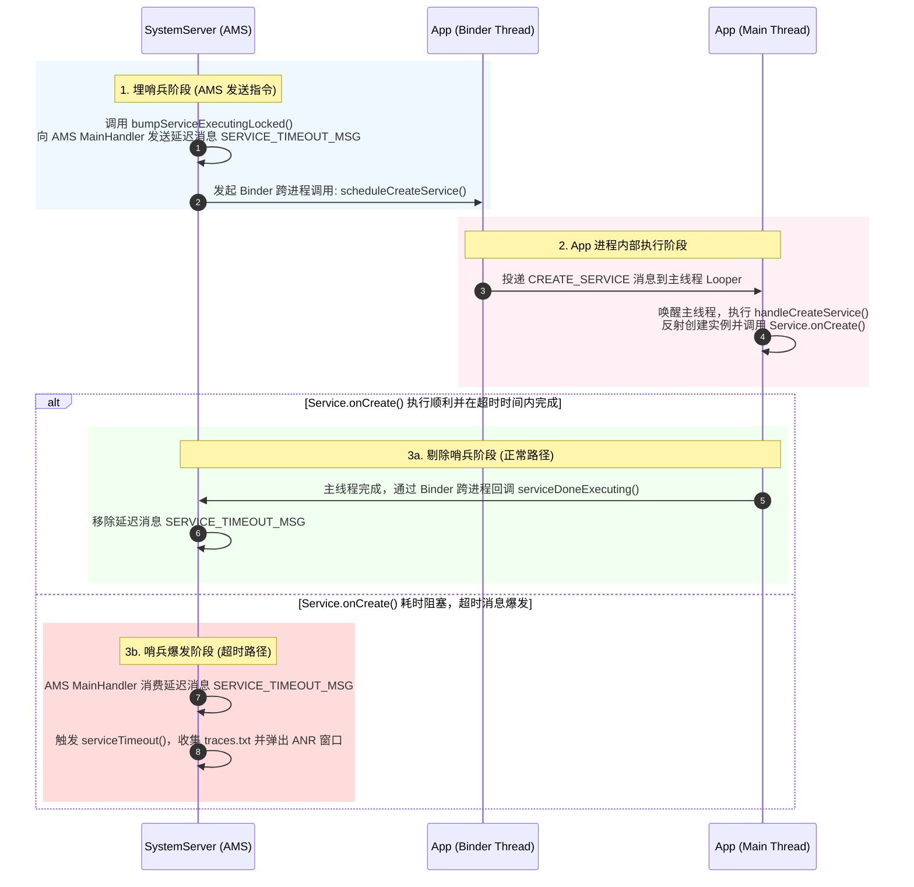
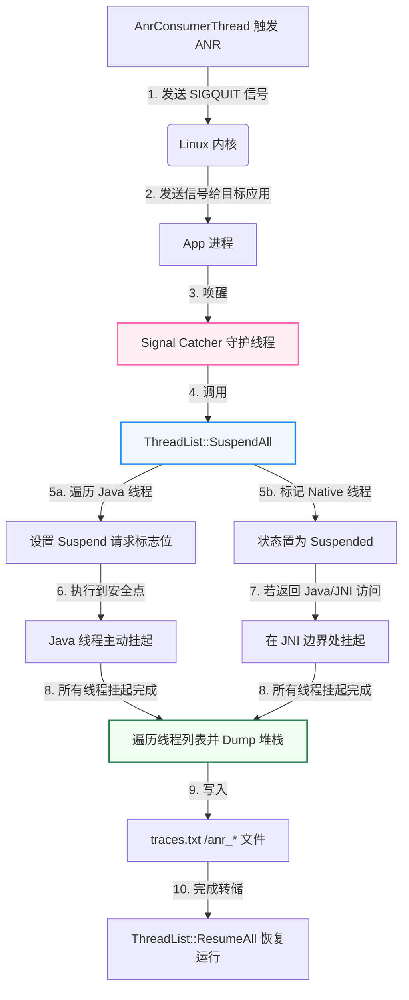

# 5.4.5.2 ANR定位

## 第一部分：Android ANR 概念与四大超时场景

### 1.1 主线程 Looper 的工作机制与卡顿卡死

Android 应用的 UI 交互和生命周期分发高度依赖于主线程（UI 线程）的循环机制。这个机制的核心由 `Looper`、`MessageQueue` 和 `Handler` 共同支撑。理解主线程如何运转，是深刻认识应用程序无响应（Application Not Responding，简称 ANR）的基石。

#### 1.1.1 Looper 消息循环底层原理
在应用进程启动时，系统会在 `ActivityThread.main()` 方法中调用 `Looper.prepareMainLooper()` 和 `Looper.loop()`，为当前线程开启消息循环。
```java
// ActivityThread.java 中的简化入口
public static void main(String[] args) {
    ...
    Looper.prepareMainLooper();
    ActivityThread thread = new ActivityThread();
    thread.attach(false, startSeq);
    ...
    Looper.loop();
    throw new RuntimeException("Main thread loop unexpectedly exited");
}
```
`Looper.loop()` 是一个死循环，它不断调用 `MessageQueue.next()` 来检索下一个需要执行的消息（`Message`）。当检索到消息后，通过 `msg.target.dispatchMessage(msg)` 将消息分发给目标 Handler 对象的 `handleMessage(Message)` 或其回调函数来执行。

#### 1.1.2 深入 Native Looper 与 epoll_wait 挂起机制
当 `MessageQueue.next()` 中暂时没有消息可处理，或者下一条消息是未来某时间点执行的延迟消息时，主线程不能一直占用 CPU 资源进行空转。为此，Android 的消息队列设计了 Java 层与 Native 层的混合双向控制：
1. **Java 层挂起入口**：在 `MessageQueue.next()` 中，当没有即时消息可执行时，会调用 Native 方法 `nativePollOnce(mPtr, nextPollTimeoutMillis)`。这里的 `mPtr` 是 Native 层 `NativeMessageQueue` 对象的指针地址，而 `nextPollTimeoutMillis` 则是主线程允许休眠的最大毫秒数（如果是 `-1`，则代表无限期休眠直到被主动唤醒；如果是 `0`，则代表不休眠立即返回；如果是正数，则代表休眠该时长后自动唤醒）。
2. **Native 层核心实现与初始化**：在 Native 层的 `frameworks/base/core/jni/android_os_MessageQueue.cpp` 中，`android_os_MessageQueue_nativePollOnce` 将请求转发给 `NativeMessageQueue::pollOnce`。随后，`NativeMessageQueue` 会委派给 Native 层的 `android::Looper` 对象（定义在 `system/core/libutils/Looper.cpp`）。
   * **构造与 epoll 建立**：Native Looper 在初始化时，其构造函数会调用 `rebuildEpollLocked()`。它通过系统的 `epoll_create1(EPOLL_CLOEXEC)` 创建一个 epoll 监听实例。
   * **创建唤醒通道**：为了能从睡眠中被其他线程唤醒，Looper 在构造中还会调用 `eventfd(0, EFD_NONBLOCK | EFD_CLOEXEC)` 创建一个用于内部线程唤醒的文件描述符 `mWakeEventFd`，并使用 `epoll_ctl` 将其注册到 epoll 监听列表中，监听 `EPOLLIN`（可读）事件。
3. **基于 epoll_wait 的内核挂起**：Native Looper 最终在 `Looper::pollInner(int timeoutMillis)` 中通过 Linux 内核的 `epoll_wait` 系统调用进行挂起：
   ```cpp
   struct epoll_event eventItems[EPOLL_MAX_EVENTS];
   int eventCount = epoll_wait(mEpollFd.get(), eventItems, EPOLL_MAX_EVENTS, timeoutMillis);
   ```
   这里的 `mEpollFd` 是主线程 Looper 所监听的 epoll 文件描述符。主线程在该调用处会被操作系统内核置为睡眠状态（Sleeping），并释放其占用的 CPU 时间片。此时在系统堆栈上，主线程通常呈现为 `native` 状态或在系统调用中挂起。
4. **唤醒路径的运作**：当其他线程向主线程投递消息时（调用了 `enqueueMessage`），为了及时打断主线程的睡眠，会调用 Native Looper 对象的 `wake()` 方法。该方法内部会通过 `write(mWakeEventFd, &one, sizeof(one))` 向唤醒文件描述符中写入一个 `1`。由于写入操作触发了可读状态，内核会立刻唤醒阻塞在 `epoll_wait` 中的主线程，使其从 `nativePollOnce` 返回到 Java 层的消息队列处理流程中。

#### 1.1.3 卡顿卡死与 ANR 的根本成因
在 `Looper.loop()` 执行期间，任何一个分发下来的消息执行时间过长，都会阻碍主线程进入下一次 `next()` 循环。
* **卡顿的产生**：如果一条消息（例如包含自定义 View 的绘制逻辑或一个轻微的计算任务）执行时间超过了 16.6ms（在 60Hz 刷新率下）或 8.3ms（在 120Hz 刷新率下），就会导致主线程错过了 VSync 信号带来的界面渲染消息，此时用户感知到的是画面掉帧、滑动卡顿。
* **ANR 的产生**：如果某一条消息执行了极长时间（例如阻塞式磁盘 I/O、复杂的数据库事务、主线程同步锁竞争、死循环、等待网络数据返回），或者由于某种原因主线程直接卡死在某些 Native 方法中。主线程在此期间无法回到消息循环的起点。此时，当系统向该应用发送输入事件（如触摸屏幕、按下按键）或者发送组件生命周期通知时，这些新进来的事件或消息只能在 `MessageQueue` 中排队等待。由于主线程迟迟不能消费它们，一旦等待时间超过了系统设定的最大允许时间，系统便判定该应用已经失去响应能力，进而引发 ANR 流程。

---

### 1.2 四大超时场景深度剖析

Android 系统中定义了四种可以触发 ANR 的核心场景。系统服务（主要在 `ActivityManagerService`，简称 AMS）为这四类场景分别设定了不同的前后台超时阈值，并在底层采用了一套严格的定时逻辑来约束应用的行为。

| ANR 超时场景 | 前台超时阈值限制 | 后台超时阈值限制 | 核心控制类与关键管理方法 | 超时监控判定底层原理 |
| :--- | :--- | :--- | :--- | :--- |
| **InputDispatching** | **5 秒** (5000ms) | 不区分前后台（统一为 5 秒） | `InputDispatcher.cpp`<br>`ActivityManagerService.java` | Native 层利用 `AnrTracker` 实时跟踪事件分发，5s 内无响应且有后续事件等待时由 Native 触发 ANR 判定。 |
| **Service** | **20 秒** (20000ms) | **200 秒** (200000ms) | `ActiveServices.java`<br>`ActivityManagerService.MainHandler` | 启动 Service 时“埋哨兵”（发送 `SERVICE_TIMEOUT_MSG` 延迟消息），完成后“剔除哨兵”，超时则触发 ANR。 |
| **BroadcastReceiver** | **10 秒** (10000ms) | **60 秒** (60000ms) | `BroadcastQueue.java`<br>`BroadcastQueueImpl.java` | 串行广播分发时，向 `BroadcastHandler` 发送 `BROADCAST_TIMEOUT_MSG` 延迟消息，应用处理完后通过 Binder 剔除。 |
| **ContentProvider** | **20 秒** (20000ms) | 不区分前后台（统一为 20 秒） | `ActivityManagerService.java`<br>`ActivityThread.java` | 启动应用进程时发送 `CONTENT_PROVIDER_PUBLISH_TIMEOUT_MSG`。若 20s 内应用未发布其 Provider 则杀进程。 |

#### 1.2.1 InputDispatching Timeout（输入事件超时）
与其他组件由 AMS 纯 Java 计时管理不同，输入事件的超时完全由运行在 SystemServer 进程中的 Native 服务 `InputDispatcher`（源码位于 `frameworks/native/services/inputflinger/dispatcher/InputDispatcher.cpp`）进行调度和超时计算。
* **设计目的**：为了保证用户交互的即时反馈。如果用户点击屏幕后系统长时间没有响应，会极大破坏用户体验。
* **超时判定细节**：当 `InputDispatcher` 试图向一个焦点窗口分发按键或触摸事件时，它会记录该事件的分发开始时间戳。如果该窗口的输入通道（InputChannel）被判定为“不可用”（例如主线程 Looper 正在卡顿，导致无法从 Socket 中读取新的输入事件），且同时满足以下两个条件之一，系统就会判定发生输入超时：
  1. 当前窗口存在一个正在等待应用消费的输入事件，且分发等待时间已经超过了 5 秒的阈值。
  2. 队列中积压了新的输入事件，但由于前一个分发给该应用的输入事件一直没有收到应答（Finish Callback），导致新事件在 `InputDispatcher` 内部的队列中发生积压，积压等待时间达到 5 秒。
* **源码流程追踪**：
  在 `InputDispatcher.cpp` 的 `dispatchOnceFilterLocked` 和 `processAnrsLocked` 方法中，会持续扫描正在分发的事件列表。当判定超时后，`InputDispatcher` 将会回调 `InputManagerService` 的 Java 层接口，进而将 ANR 事件报告给 AMS 端的 `AnrController` 或直接调用 `ActivityManagerService.inputDispatchingTimedOut()`。

#### 1.2.2 Service Timeout（服务超时）
在 Android 中，Service 是用来在后台执行长生命周期操作的组件。然而，Service 的生命周期回调（如 `onCreate()`、`onStartCommand()`、`onBind()`）均是在主线程的 Looper 循环中同步执行的。如果这些生命周期方法中含有耗时行为，会引发 Service Timeout。
* **前后台阈值划分**：
  * **前台 Service**：20 秒。即应用在调用 `startForegroundService()` 启动前台服务时，系统要求极快的响应速度，避免阻塞用户的感知。关于前台服务类型的收紧，可以参考 [AndroidVersionChangeLog.md](file:///Users/lizhiyang/Desktop/AndroidKnowledge/AndroidVersionChangeLog.md) 中关于 Android 14（API 34）的前台服务声明限制。
  * **后台 Service**：200 秒。允许更宽裕的初始化和启动缓冲。
* **AMS 源码控制逻辑**：
  Service 的生命周期由 AMS 内部的 `ActiveServices.java` 类管理。
  1. **埋哨兵**：当准备启动或绑定一个 Service 时，系统会在 `ActiveServices.realStartServiceLocked(ServiceRecord r, ...)` 中开始执行进程启动或绑定。在该方法中，会调用：
     ```java
     bumpServiceExecutingLocked(r, fg, "create");
     ```
     `bumpServiceExecutingLocked` 内部会根据 Service 的重要性（是否是前台应用启动的，或者该 Service 自身是否属于前台服务）计算出超时时间（`procState` 关联），然后向 AMS 的主 Handler（即 `mAm.mHandler`）发送一个延迟消息：
     ```java
     Message msg = mAm.mHandler.obtainMessage(ActivityManagerService.SERVICE_TIMEOUT_MSG);
     msg.obj = r;
     mAm.mHandler.sendMessageAtTime(msg, r.executingStart + (fg ? SERVICE_TIMEOUT : SERVICE_BACKGROUND_TIMEOUT));
     ```
  2. **剔除哨兵**：如果应用进程收到 Binder 命令后，在主线程中顺利创建并初始化了该 Service，其 `ActivityThread` 会通过 Binder向 AMS 反馈，触发 `ActiveServices.serviceDoneExecutingLocked(r, ...)` 的执行。在这一步中，系统会调用：
     ```java
     mAm.mHandler.removeMessages(ActivityManagerService.SERVICE_TIMEOUT_MSG, r);
     ```
     从而将之前“埋下”的延迟超时消息从消息队列中移除。
  3. **哨兵爆发**：如果应用主线程在处理 `onCreate` 等生命周期时陷入卡顿（如执行了 `Thread.sleep` 或同步等待），导致 AMS 的 `mAm.mHandler` 在设定的时间（20s 或 200s）之后依然没有收到 `serviceDoneExecuting` 的 Binder 反馈，该 `SERVICE_TIMEOUT_MSG` 就会被 Handler 消费，最终执行 `ActiveServices.serviceTimeout(ProcessRecord proc)`，判定该进程发生 ANR。

#### 1.2.3 BroadcastReceiver Timeout（广播接收器超时）
当应用进程接收到串行广播（Ordered Broadcast）时，其 `onReceive()` 方法也是运行在主线程中的。如果 `onReceive()` 执行时间超出阈值，将造成整个系统的广播链条受阻。
* **前后台阈值划分**：
  * **前台广播**：10 秒。
  * **后台广播**：60 秒。
* **串行与并行广播的分发差异**：
  在 `BroadcastQueue` 中，系统将广播分为并行广播（Parallel Broadcast）与串行广播（Ordered Broadcast）。
  * **并行广播**：系统在分发时，通过 Binder 驱动将广播一次性并发投递给所有注册的接收者，不需要等待任何接收者执行完。由于其分发是完全异步非阻塞的，系统在底层没有为并行广播设置针对单个 `onReceive` 方法的超时哨兵。然而，如果大量的并行广播处理积压，导致应用主线程 CPU 被占满，仍可能诱发输入超时等二次 ANR。
  * **串行广播**：系统必须严格保证接收者按照优先级顺序，挨个执行 `onReceive()`。只有前一个执行完并返回了 finish 反馈，系统才会去分发给下一个接收者。这种“链式”分发如果其中一环卡死，整条链路就会断裂，从而严重拖累整个系统。因此，系统必须为其设立超时检测机制。
* **AMS 源码控制逻辑**：
  广播的分发是由 `BroadcastQueue` 控制的。
  1. **埋哨兵**：在向具体的串行广播接收者分发广播时，系统通过 `BroadcastQueue.processNextBroadcastLocked(boolean fromMsg)` 处理队列。当向特定进程发送广播后，在 `BroadcastQueue.scheduleBroadcastTimeoutLocked(BroadcastRecord r)` 中发送延迟消息：
     ```java
     long timeoutTime = r.receiverTime + (mDelayUntilBehindNext + mTimeoutPeriod);
     Message msg = mHandler.obtainMessage(BROADCAST_TIMEOUT_MSG, this);
     mHandler.sendMessageAtTime(msg, timeoutTime);
     ```
  2. **剔除哨兵**：应用主线程在 `ActivityThread.handleReceiver()` 中执行完 `BroadcastReceiver.onReceive()` 后，最终通过 Binder 调用 `ActivityManagerService.finishReceiver()`。AMS 接收到后在 `BroadcastQueue.processNextBroadcastLocked` 中再次处理，移除 `BROADCAST_TIMEOUT_MSG`。
  3. **哨兵爆发**：若超时消息触发，调用 `BroadcastQueue.broadcastTimeoutLocked(boolean fromMsg)`，若当前进程的接收器依然在运行，就会判定该进程发生 ANR。

#### 1.2.4 ContentProvider Timeout（内容提供者发布超时）
当一个应用被拉起启动，且其 `AndroidManifest.xml` 中声明了非 `lazy` 加载的 `ContentProvider` 时，系统在拉起该应用进程到应用可以开始响应四大组件请求之间，必须等待该应用将其所有的 ContentProvider 发布成功。
* **传统阈值**：固定为 20 秒，前后台一致。
* **超时判定与源码逻辑**：
  1. 当 AMS 在 `ActivityManagerService.startProcessLocked()` 成功拉起一个新进程后，会向自身的 Handler 发送一个延迟 20 秒的消息 `CONTENT_PROVIDER_PUBLISH_TIMEOUT_MSG`。
  2. 新进程启动后，主线程在 `ActivityThread.handleBindApplication()` 中执行应用的初始化逻辑，并调用 `installContentProviders()` 加载当前进程的所有 Provider，最后通过 Binder 回调 AMS 的 `publishContentProviders()` 方法。
  3. 如果应用主线程在 `Application.onCreate()` 或 Provider 的 `onCreate()` 中卡住（例如进行了大量同步初始化），导致 20 秒内没有向 AMS 发布 Provider，AMS 的 Handler 将会处理 `CONTENT_PROVIDER_PUBLISH_TIMEOUT_MSG`，直接调用 `processContentProviderPublishTimeoutLocked()`。由于 ContentProvider 是进程间数据共享的核心，若发布失败，系统不会让应用半死不活地运行，而是直接终止（Kill）该进程，并在日志中记录发布超时 ANR。

---

## 第二部分：系统底层埋哨兵与超时剔除处理机制

### 2.1 双向契约机制与工作流

系统服务（运行于 SystemServer 进程中）与应用进程（运行于 App 进程中）之间的生命周期及事件分发是一种典型的“双向契约机制”。系统作为调度者，确保在发出指令后的一定时间内必须收到 App 的完成反馈。我们将以 Service 的启动（`StartService`）为例，描述“埋哨兵”与“剔除哨兵”的完整工作流。

#### 2.1.1 Service 启动的埋哨兵与剔除哨兵机制
1. **指令发起与埋哨兵**：AMS 收到来自其他组件的 `startService` 请求，在内部调度中决定启动目标 Service。AMS 在向 App 进程发送 Binder 调用（如 `scheduleCreateService`）的前一刻，同步在 SystemServer 的主 Handler 队列中发送一个延迟消息（超时哨兵）。
2. **应用进程主线程执行**：App 进程 of Binder 线程接收到 `scheduleCreateService` 的 IPC 请求后，会向 App 进程的主线程 Handler 发送一个 `CREATE_SERVICE` 消息。主线程被唤醒，开始执行 `ActivityThread.handleCreateService()`。这其中包含了加载 Service 类、反射创建 Service 实例、调用 `Service.attach()` 以及最终调用 `Service.onCreate()`。
3. **完成反馈与剔除哨兵**：当 `Service.onCreate()` 执行完毕，主线程继续执行 `ActivityThread` 中的后续流程，通过 Binder 回调 AMS 的 `serviceDoneExecutingLocked()`。AMS 接收到这个 IPC 信号后，把对应的 `SERVICE_TIMEOUT_MSG` 超时消息从 SystemServer 进程的 Handler 中移除（剔除哨兵）。

#### 2.1.2 哨兵机制的 Mermaid 工作流图

下面的 Mermaid 流程图清晰展示了 SystemServer 进程与 App 进程在 Service 启动流程中，通过 Binder 跨进程通信完成“埋哨兵”与“剔除哨兵”的双向契约机制。



---

### 2.2 Android 11 AnrHelper 机制的演进

在较早的 Android 版本中，当发生 ANR 时，SystemServer 的 AMS 线程是在检测到超时的当下，同步地执行整个 ANR 判定流程（包括向目标进程以及关键系统进程发送 SIGQUIT 信号、等待各进程转储 trace 堆栈、将数据收集起来写入磁盘，并最终决定是否弹出无响应 Dialog 或杀死进程）。

#### 2.2.1 引入 `AnrHelper` 的背景
在同步处理机制下，因为收集堆栈和处理 I/O 极其耗时，AMS 会在长达数秒的时间内持有 AMS 的主锁（`ActivityManagerService` 全局锁）。在这个过程中：
* 任何其他进程通过 Binder 想要与 AMS 通信（如启动 Activity、注册 BroadcastReceiver、访问 Service）都将被阻塞，挂起在 Binder 驱动中等待锁释放。
* 这种大规模的锁竞争导致了严重的连锁反应，使得系统级别的关键服务也被卡死，引发了系统“假死”，极易触发 SystemServer 自身的 Watchdog 重启。
关于 Android 11（API 30）在系统隐私及框架上的行为演进，请参阅 [AndroidVersionChangeLog.md](file:///Users/lizhiyang/Desktop/AndroidKnowledge/AndroidVersionChangeLog.md)。

#### 2.2.2 `AnrHelper` 的架构设计与异步处理
为了彻底解决这一痛点，Android 11 引入了 `AnrHelper` 工作机制。
* **独立消费线程与轮询队列**：`AnrHelper` 内部定义并维护了一个独立的后台工作线程，称为 `AnrConsumerThread`。它内部包含一个基于 BlockingQueue 的任务队列 `mAnrRecords`。
* **异步队列解耦**：当 AMS 中的四大超时场景爆发（例如 `serviceTimeout` 触发）时，系统不再同步调用耗时的 trace 转储逻辑。AMS 仅需将本次 ANR 的元数据（包括卡死进程的 `ProcessRecord`、超时原因、时间戳等）封装成一个 `AnrRecord` 对象。
* **锁的释放**：AMS 将该 `AnrRecord` 快速放入 `AnrHelper` 内部的待处理队列中。因为这一步仅仅是内存队列的入队操作，极其短暂，所以 AMS 可以迅速释放其全局主锁，继续去响应其他进程的 Binder 请求。
* **AnrConsumerThread 调度**：`AnrConsumerThread` 在其 `run()` 方法中执行无限循环，调用 `mAnrRecords.take()`。当队列有数据时被唤醒，在不持有 AMS 主锁的情况下，异步、独立地调用 `AppErrors.appNotResponding()`，执行后文所述的 `SIGQUIT` 信号发送和堆栈收集工作。这样成功将“ANR 处理逻辑”与“系统核心逻辑”在锁的层面上进行了解耦。

---

### 2.3 ART 虚拟机 Signal Catcher 线程与 SuspendAll 原理

一旦 `AnrConsumerThread` 在后台接管了 ANR 记录，它就需要向发生卡死的 App 进程获取其当前的 Java 线程堆栈，以便于分析出卡死的根源。为此，系统会借助 Linux 的信号机制与 ART 虚拟机的协作。

#### 2.3.1 Signal Catcher 守护线程对 SIGQUIT 的监听流程
1. **信号发送**：AMS 通过 C++ 的 `kill(pid, SIGQUIT)` 或者 `tgkill` 向目标 App 进程发送一个 `SIGQUIT`（信号 3）信号。
2. **Signal Catcher 的接收**：当 ART 虚拟机在 App 进程中被初始化启动（`Runtime::Start()`）时，会创建一个专门用于监听系统信号的守护线程，即 `Signal Catcher`（其源码位于 `art/runtime/signal_catcher.cc`）。
3. **sigwait 挂起监听**：`Signal Catcher` 线程在其主循环中，通过 `sigwait()` 系统调用把自己挂起，进入阻塞状态，专门监听 `SIGQUIT` 和 `SIGUSR1` 等信号。因为该线程的大部分生命周期都在内核中被挂起，所以它平时对进程的 CPU 资源消耗几乎为零。
4. **触发 Dump 流程**：一旦 App 进程接收到 `SIGQUIT`，Linux 内核会打断处于 `sigwait` 状态的 `Signal Catcher` 线程，使其返回并开始执行转储（Dump）堆栈和 GC 状态的流程。

#### 2.3.2 ThreadList::SuspendAll() 挂起 Java 线程的底层原理
要想准确无误地打印出所有 Java 线程当前的函数调用链，必须让所有线程停在某个确定的、其局部变量和调用栈不会再发生变化的时刻。这个状态被称为安全点（Safe Point）。如果在转储栈时线程依然在并发地向前运行，垃圾回收器或转储器获取到的栈帧将会是一个碎片化的、甚至是不合法的状态。因此，ART 必须执行 `SuspendAll` 挂起进程中除自身外的所有 Java 线程。

1. **核心方法**：挂起由 `art/runtime/thread_list.cc` 中的 `ThreadList::SuspendAll(const char* cause, ...)` 负责。
2. **设置安全点挂起标志**：ART 遍历当前虚拟机的线程列表。对于每一个正在运行 Java 代码的线程，ART 会在线程对应的内存结构中修改其“挂起请求”（Suspend Request）计数。
3. **安全点检测机制在底层的实现**：
   * **编译代码中的安全点检测**：ART 的 JIT 或 AOT 编译器在生成机器码时，会在关键路径上（如方法调用入口、循环的回跳处）插入安全点检测指令（Safe Point Checks）。
     * **显式检测与隐式检测（Implicit Checks）**：早期的虚拟机使用显式条件跳转指令。自 Android 9.0 以后，ART 广泛采用了隐式检测技术：编译器在安全点处插入一条读取虚拟机特定的“受保护内存页”（Suspend Page）的汇编指令（如读取某个被保护的空内存地址）。在正常运行状态下，该内存页可读，指令执行开销近乎为零。当需要挂起所有 Java 线程时，系统通过 `mprotect` 系统调用把该页的权限修改为不可读。此时，任何运行到安全点指令的 Java 线程试图读取该页时，都会触发硬件级别的段错误（SIGSEGV）。ART 的信号处理器拦截到此段错误信号后，识别出这是挂起请求，进而将该线程转换为 `Suspended` 状态并挂起。
   - **解释执行下的检测**：对于正在由解释器（Interpreter）执行的 Java 线程，其解释执行的核心循环在每分发一条字节码指令之前，都会去检测当前线程结构体中的挂起标志。如果被置位，解释器就暂停指令执行，主动走入休眠。
4. **处于 Native 状态的线程处理**：如果某个 Java 线程当前正在通过 JNI 执行底层的 Native 代码，它本身实际上并没有在运行 Java 字节码。因此，`SuspendAll` 会将其状态直接标记为 `Suspended`，但并不打断其 Native 代码的物理执行（因为 Native 代码无法直接操作 Java 堆，是内存安全的）。但是，一旦该线程从 Native 函数返回，或者试图通过 JNI 环境访问 Java 对象时，在 JNI 边界处的桩代码（Trampoline）会立即拦截该线程，并将其物理挂起，直到 `ResumeAll` 被调用。
5. **挂起超时控制**：`SuspendAll` 会通过条件变量循环等待，直到所有 Java 线程的挂起计数均达到要求。如果某些线程因为处于死锁、密集的非安全点计算、或陷入了死循环中无法响应挂起指令，`SuspendAll` 将会在超时（通常为 5 秒）后放弃强行等待，打印类似 `"Thread suspend timeout"` 的警告，并强行继续进行转储以防卡死 Signal Catcher。

#### 2.3.3 traces.txt 文件的生成与演进
在成功挂起所有 Java 线程之后，`Signal Catcher` 会遍历线程列表，依次转储每个线程的 Java 栈帧、Nice 值、CPU 调度状态，并将其格式化。

从 Android 的演进历史来看，trace 文件的存储机制和读取权限经历了数次关键的安全收紧，这些变化直接影响了线上监控工具的实现方式：
* **Android 8.0 之前（API < 26）**：系统 trace 默认保存在固定的 `/data/anr/traces.txt` 文件中。该文件属于追加（Append）模式写入。每一次应用发生 ANR 时，系统都将新的 trace 堆栈追加到该文件的尾部。当时，应用进程本身对于 `/data/anr/traces.txt` 具有“可读”权限。因此，很多稳定性监控 SDK 是通过使用 `FileObserver` 监听该文件，一旦该文件被写入，便立即读取其尾部数据来捕获 ANR 堆栈。
- **Android 8.0（API 26）起**：出于隐私安全考虑（traces.txt 中可能包含其他进程的敏感数据），系统废弃了 `/data/anr/traces.txt` 的追加写入，改为由系统的 `dumpstate` 或专有服务在 `/data/anr/` 目录下生成独立且带时间戳和 PID 的文件（例如 `/data/anr/anr_2026-06-28-20-42-12-123`）。同时，系统移除了普通应用对 `/data/anr/` 目录的任何读取权限，只有 root 用户或 `system` 权限的进程才能访问。关于 Android 8.0 的后台和安全性变化细节，可以参考 [AndroidVersionChangeLog.md](file:///Users/lizhiyang/Desktop/AndroidKnowledge/AndroidVersionChangeLog.md)。
- **Android 10 与 11（API 29/30）**：权限和沙盒约束进一步增强，应用无法通过任何传统的文件读取方式直接获取 ANR 堆栈，`FileObserver` 方案彻底在无 root 的线上设备中失效。

#### 2.3.4 Signal Catcher 转储工作流 Mermaid 流程图



---

## 第三部分：traces.txt 核心指标分析

### 3.1 traces.txt 文件结构与线程状态解构

当 ANR 发生并完成转储后，系统生成的 traces 文件是解决无响应问题的最权威的第一手凭证。必须能够准确解构并读懂 traces 文件的每一行元数据。

#### 3.1.1 头部全局元数据
每个 traces 文件的开头都会包含类似如下的系统级和进程级全局信息：
```text
----- pid 12345 at 2026-06-28 20:42:12 -----
Cmd line: com.example.android.stability
Build fingerprint: 'google/redfin/redfin:11/RQ3A.210605.005/7374993:user/release-keys'
ABI: 'arm64'
Build type: user
```
* **Cmd line**：发生 ANR 的应用包名。
* **Build fingerprint**：设备的固件版本指纹，对于定位是否是特定厂商设备、特定 OS 版本的兼容性问题非常有用。

#### 3.1.2 线程段落的元数据解析
接下来是每个具体线程的堆栈信息块。我们以发生 ANR 概率最高的主线程 `main` 为例进行深度解剖：
```text
"main" prio=5 tid=1 Runnable
  | group="main" sCount=0 dsCount=0 flags=1 obj=0x72cb25a8 self=0x7b33d01cc0
  | sysTid=12345 nice=-10 cgrp=default sched=0/0 handle=0x7b6f634d80
  | state=R schedstat=( 4568912389 123984102 1530 ) utm=410 stm=46 core=3 HZ=100
  | stack=0x7fc0d2e000-0x7fc0d30000 stackSize=8MB
  | held mutexes= "mutator lock"(shared held)
  at com.example.stability.MainActivity.heavyComputation(MainActivity.java:78)
  at com.example.stability.MainActivity.access$000(MainActivity.java:32)
  ...
```

1. **第一行**：
   * `"main"`：线程名称。
   * `prio=5`：Java 线程优先级（默认为 5，数值越小优先级越低，Java 层 1-10 映射到 Native 层的 nice 值）。
   * `tid=1`：ART 虚拟机内部为该线程分配的唯一 ID 编号。
   * `Runnable`：该线程在 Java 层和虚拟机的逻辑状态。
2. **第二行**：
   * `group="main"`：线程组名称。
   * `sCount=0`：挂起计数（Suspended Count）。当该值为 `0` 时，说明当前没有被虚拟机挂起；若大于 0，说明处于被挂起流程中。
   * `self=0x7b33d01cc0`：该线程对应的 Native 空间中 `art::Thread` 指针的内存地址。
3. **第三行**：
   * `sysTid=12345`：内核线程的唯一 ID（LWP ID，Light Weight Process ID）。在 Linux 系统中，每一个 Java 线程物理上都对应一个轻量级进程，`sysTid` 就是这个轻量级进程的 PID。在分析系统 CPU 占用或者使用 `strace` 追踪线程时，必须使用该值，而不是 `tid`。
   * `nice=-10`：内核调度优先级。范围在 `-20`（优先级最高，CPU 时间片分配最多）到 `19`（优先级最低）之间。主线程的 nice 值通常为 `-10`（具有高优先调度权），而普通工作线程默认为 `0`，后台线程可能为 `10`。
   * `cgrp=default`：线程所属的 Linux Control Group 进程控制组（例如前台组、后台组等，决定其基础资源配额）。
4. **第四行**：
   * `state=R`：内核调度状态。代表 Linux 系统底层的真实物理状态（具体含义见下表）。
   * `schedstat`：CPU 调度计数器信息，是分析 CPU 饥饿的黄金指标（下文详述）。
   * `core=3`：该线程在发生 Dump 的那个瞬间，正运行在多核 CPU 的哪一个物理核心上（这里指核心 3）。
5. **第五行**：
   * `held mutexes`：当前线程持有的互斥锁。`"mutator lock"(shared held)` 是 ART 内部的垃圾回收和内存分配基础锁，通常是以共享（shared）模式持有，属于正常现象。

---

### 3.2 线程调度状态与 JVM/ART 状态对照

线程状态的分析需要结合 traces 里的逻辑状态（第一行最后）与内核物理状态（第三行 state 字段）一同判断。

| JVM / ART 逻辑状态 | 内核物理状态字段 | 内核状态代表含义 | 诊断 ANR 时的参考意义 |
| :--- | :--- | :--- | :--- |
| **Runnable** | `state=R` | Running 或 Ready to Run（就绪/运行中） | 说明主线程处于可用状态，但如果一直耗在这里，通常意味着主线程在执行极其耗时的死循环、大量密集计算或频繁的数据序列化操作。 |
| **Runnable** | `state=D` | Uninterruptible Sleep（不可中断睡眠） | 线程正在等待硬件级 I/O 资源（如 Flash、网卡、内存分页缺页中断），无法被信号打断。这是典型的 **I/O 卡死** 状态。 |
| **Blocked / Monitor** | `state=S` | Interruptible Sleep（可中断睡眠） | 线程被 Java synchronized 锁或者 Concurrent 包的 ReentrantLock 挂起，正在等待其他线程释放锁资源。 |
| **Waiting / TimedWait** | `state=S` | Interruptible Sleep（可中断睡眠） | 调用了 `Object.wait()` 或 `LockSupport.park()`，或者正在 Looper 的 `epoll_wait` 里睡眠。需要排查唤醒信号是否丢失，或者等待的后台任务是否卡死。 |
| **Native** | `state=R` 或 `state=S` | 正在执行 C++ / C / Rust 底层 Native 代码 | 线程跳转到了 Native 空间。如果卡在这里，说明 Native 函数库（如视频解码、图像处理、混音库）中存在死锁、网络同步套接字挂起或死循环。 |

---

### 3.3 锁竞争信息深度拆解

锁竞争是导致线上 ANR 最常见的原因之一。在 traces.txt 中，如果主线程因为锁阻塞而被挂起，其堆栈信息中会暴露出非常清晰的“等待锁”与“持有锁”的关系链。

#### 3.3.1 synchronized 锁竞争 Trace 特征
当主线程等待 synchronized 锁时，其状态通常为 `Blocked`。其堆栈头部如下所示：
```text
"main" prio=5 tid=1 Blocked
  | group="main" sCount=1 dsCount=0 flags=1 obj=0x72cb25a8 self=0x7b33d01cc0
  | sysTid=12345 nice=-10 cgrp=default sched=0/0 handle=0x7b6f634d80
  | state=S schedstat=( 1204859 891024 15 ) utm=0 stm=0 core=3 HZ=100
  - waiting to lock <0x0a12b3c4> (a java.lang.Object) held by thread 12 (Thread-2)
  at com.example.stability.MainActivity.onClicked(MainActivity.java:45)
```
* **`- waiting to lock <0x0a12b3c4>`**：主线程正在排队等待进入一个 synchronized 保护的区域。它等待的锁对象的内存地址（ART 中该对象的哈希码/内部映射地址）是 `<0x0a12b3c4>`。
* **`held by thread 12 (Thread-2)`**：系统非常智能地追溯到，此时这个锁对象的拥有者是内部 `tid` 为 `12` 的那个名为 `Thread-2` 的线程。

有了这个线索，我们必须立即在 traces.txt 文件中通过全局搜索 `tid=12` 或 `"Thread-2"`，找到该线程的堆栈：
```text
"Thread-2" prio=5 tid=12 Runnable
  | group="main" sCount=0 dsCount=0 flags=1 obj=0x72a5b1c0 self=0x7b33df5a00
  | sysTid=12399 nice=0 cgrp=default sched=0/0 handle=0x7b6e124d80
  | state=R schedstat=( 9857410298 2389120 1892 ) utm=890 stm=95 core=1 HZ=100
  - locked <0x0a12b3c4> (a java.lang.Object)
  at com.example.stability.NetWorker.writeDataToDatabase(NetWorker.java:102)
```
* **`- locked <0x0a12b3c4>`**：该工作线程持有了主线程梦寐以求的锁 `<0x0a12b3c4>`。
* **诊断分析**：可以看到，该工作线程当前正在 `writeDataToDatabase` 中执行数据库写入操作，可能因为数据库写锁耗时，或者工作线程优先级太低（nice=0）拿不到足够的 CPU 时间片，导致该方法迟迟无法执行完毕。主线程因为等锁被挂起，最终导致系统在 5s 内无法消费输入事件，从而产生 ANR。

#### 3.3.2 锁膨胀与 Monitor 底层机制
在 ART 虚拟机内部，Java 的锁经历了偏向锁（Biased Lock，已废弃）、轻量级锁（Thin Lock）和重量级锁（Fat Lock）的演进。
* **Thin Lock 阶段**：每个 Java 对象头中都有一个 32 位的 Lock Word。在 Thin Lock 状态下，Lock Word 的高位部分保存着持有该锁的线程的内部 ID（Thread ID），低位保存着重入计数和锁状态标志。
* **锁膨胀过程**：如果另一个线程也试图获取该锁，它会发现 Lock Word 中的 Thread ID 不属于自己，由此判定发生锁竞争，启动锁膨胀机制。
  * **创建 Native 锁**：ART 虚拟机会调用 `art::Monitor::Inflate()` 方法，在 C++ 堆空间中动态分配一个重量级锁结构 `art::Monitor` 实例。
  * **锁定字指向 Monitor**：通过原子操作 CAS 将对象头部的 Lock Word 转换为 Fat Lock 状态，其内容被修改为指向该 Native `art::Monitor` 对象的指针。
  * **挂起与休眠**：未抢占到锁的线程会被加入到 `art::Monitor` 实例的等待队列中。在此处，线程会执行 `futex` 系统调用（通过 `futex_wait` 指令）进入 Linux 内核睡眠（S 状态）。直到持有锁的线程执行完临界区代码，在退出锁时调用 `futex_wake` 将其唤醒。在这个过程中， traces.txt 中由于读取到了 `art::Monitor` 中记录的等待和持有关系，就会打印出包含具体锁地址与持有者 tid 的 `waiting to lock` 结构。

---

### 3.4 schedstat 字段与 CPU 饥饿及内核状态诊断

在许多情况下，主线程堆栈打印出来可能非常正常（例如处于等待 Looper 的 `epoll_wait` 状态，即 `state=S`，调用链在 `MessageQueue.next()` 处），甚至没有任何死锁和耗时调用。然而，应用依然判定了 ANR。这时，极有可能是因为整个系统资源耗尽，导致主线程发生了 **CPU 饥饿**，或者被严重的 I/O 所拖累。这一切，都隐藏在 `schedstat` 和 `state` 这两个内核级指标中。

#### 3.4.1 schedstat 三个核心数值深度剖析
`schedstat` 格式为：`schedstat=( RunTime WaitTime Timeslices )`。
我们以主线程的这一行数据为例：
```text
schedstat=( 4568912389 123984102 1530 )
```
1. **第一位数值（RunTime = 4,568,912,389 ns）**：
   * 该内核线程从制造至今，在物理 CPU 上实际得到运行的累计纳秒数。这里约为 4.56 秒。
2. **第二位数值（WaitTime = 123,984,102 ns）**：
   * 该内核线程处于 CPU 调度就绪队列中，因为等待 CPU 核心被释放而处于“可运行但未运行”状态的累计纳秒数。这里约为 0.12 秒。
3. **第三位数值（Timeslices = 1530 次）**：
   * 该线程在物理 CPU 上被内核调度器轮转调度的总次数。

#### 3.4.2 如何诊断 CPU 饥饿（CPU Starvation）
* **饥饿的表现**：如果在应用卡顿或 ANR 期间，连续转储的几次 trace 中，主线程的 **WaitTime（第二位数值）急剧上升**，且增量极大（例如在 5s 的 ANR 窗口内，WaitTime 增加了 4.5s），而 RunTime 几乎不怎么增长。这代表主线程绝大部分时间都已经做好了运行的准备，但是内核调度器根本分配不到 CPU 时间片给它。
* **底层调度算法逻辑（Nice 与 CFS）**：
  在 Linux 内核的完全公平调度器（CFS，Completely Fair Scheduler）中，系统会根据线程的 `nice` 值来分配 CPU 时间片所占的权重。nice 值越小（如主线程 nice=-10），其对应的权重越大，CFS 越会优先调度它；而普通工作线程（nice=0）或后台线程（nice=10）的权重较低。然而，当系统内的高优先级任务过多，或者后台短时间创建了极其繁多的子进程/线程，导致就绪队列极度拥堵时，即使 nice=-10 的主线程也会在排队队列中产生等待（即 WaitTime 骤增）。
* **根因排查方向**：
  * **自身进程内抢占**：检查应用内是否有后台工作线程创建过多，或者有些子线程正在执行无休止的密集计算（如在 nice=0 的工作线程中执行死循环，把 CPU 核心占满）。
  * **系统级抢占**：系统整体负载过高（Load Average 极高）。可能是由于系统内存不足（Low Memory），引发了频繁的内存页置换，导致内核的交换守护线程（如 `kswapd0`）疯狂占用 CPU 核心；或者是其他高优先级的系统服务正在处理复杂事务，抢占了应用进程的配额。

#### 3.4.3 如何诊断内核态 I/O 阻塞（state=D）
当主线程内核状态显示为 `state=D` 时，表明它正处于 Linux 所谓的“不可中断睡眠”（Uninterruptible Sleep）状态。
* **物理机制**：处于 D 状态的线程，是在等待硬件级别的数据返回（通常是闪存 Flash 的读写操作，或者块设备驱动层面的阻塞）。为了防止内核状态不一致，Linux 规定处于这种状态的线程是无法被任何用户态信号（包括 SIGQUIT 或杀进程信号 SIGKILL）打断的。
* **典型诱因**：
  * 主线程在加载一个巨大的数据库，或者在写一个非常大的日志文件。
  * 磁盘空间不足或碎片化严重，导致写入发生文件块的重新寻址，耗时猛增。
  * 进程频繁进行内存换页（Paging In/Out），主线程访问的 Java 堆内存块刚好被置换到了 swap 分区或 zRAM 中，在读取时触发缺页中断，被迫等待磁盘读取完成。
* **traces 中的排查要点**：
  如果主线程堆栈停在 Native 方法或 I/O 方法，且 `state=D`，则毋庸置疑是 I/O 卡顿引起了 ANR。必须将相关的文件读取或数据库操作挪到工作线程执行。

---

## 第四部分：线上 ANR 监控捕获方案

### 4.1 线上 traces.txt 读取受限的背景与痛点

正如前文所述，随着 Android 系统的版本迭代，Google 在隐私安全上采取了越来越严格的沙盒限制：
* 自 Android 8.0（API 26）开始，普通应用无法读取 `/data/anr/` 目录。
* 自 Android 10/11 起，存储隔离（Scoped Storage）以及包可见性等安全策略的收紧，让传统的系统级 trace 文件监听彻底在线上环境成为不可能。
线上监控工具（APM）为了能够采集到发生 ANR 时的线程堆栈和状态，必须绕过系统 `/data/anr/` 目录的依赖，在进程内部利用各种机制“自救”。

---

### 4.2 Native 拦截 SIGQUIT 信号机制与信号链设计

这是目前市面上主流大厂 APM（如腾讯 Matrix、字节跳动 APM 等）所采用的、能够获取到最接近系统原生 ANR 堆栈的监控方案。

#### 4.2.1 信号拦截与信号链（Signal Chaining）工作原理
1. **接管 SIGQUIT**：在 Native 层，应用通过 `sigaction(SIGQUIT, &new_action, &old_action)` 注册我们自定义的信号处理函数。当系统发出 `SIGQUIT` 时，我们的自定义处理函数会率先被操作系统调度执行。
2. **避免冲突的信号链设计**：
   * **痛点**：如果我们拦截了 `SIGQUIT` 并且处理完之后直接退出，系统原生的 `Signal Catcher` 将永远收不到这个信号。这样系统就无法在 `/data/anr/` 目录下生成为系统诊断所用的 trace 文件，甚至会导致 AMS 误判定应用的 ANR 处理失败而延长卡死流程。
   * **解决方案**：为了与虚拟机的 `Signal Catcher` 保持和谐，APM 必须实现信号链。我们在自定义函数中获取主线程当前的堆栈和状态，并将其保存到我们自己的内存区或本地文件之后，必须通过还原或转发，将信号传递给 `old_action`（即 ART 虚拟机原有的信号处理器）。
   * 经典的实现逻辑是在自定义处理函数尾部：
     ```cpp
     // 处理完我们的 trace 收集逻辑后，将信号传递给 ART 原先的 handler
     if (old_action.sa_sigaction) {
         old_action.sa_sigaction(sig, info, context);
     } else if (old_action.sa_handler) {
         old_action.sa_handler(sig);
     }
     ```

#### 4.2.2 异步信号安全（Async-Signal-Safe）防死锁问题
这是 Native 信号拦截方案中最关键的技术难点。
* **何为异步信号安全**：信号的递达是异步的，可以打断线程执行的任意一条指令。如果一个线程在主堆中调用 `malloc()` 时，刚好持有了堆内存分配锁（Heap Lock），在此瞬间被 `SIGQUIT` 中断，操作系统强行将该线程切入我们的信号处理器。如果在我们的自定义信号处理器中，又一次调用了 `malloc()` 或者使用了 `new`，那么由于堆锁已经被当前线程自己持有，信号处理器会永远等待堆锁释放，从而陷入**自重入死锁**（Self-Deadlock）。
* **信号安全锁死的原因**：`malloc` 底层维护的是全局空闲链表，必须通过一个内部锁保护。当中断抢占发生时，锁正被当前主线程自己占用，信号处理器重入分配内存就会触发死锁。
* **严禁调用的非安全函数列表**：在信号拦截的处理器中，严禁调用一切非异步信号安全的函数。这包括但不限于：`malloc`、`free`、`realloc`、`new`、`delete`、`printf`、`std::cout` 及其它带内部缓冲的 I/O（如 `fopen` 等），以及 `pthread_mutex_lock` 等带有自旋或互斥休眠的普通线程锁。同时，由于 JVM 环境访问（JNI）底层涉及大量的内存分配和锁操作，也绝对不能在信号处理器中发起任何 JNI 交互。
* **APM Native 层的防死锁避坑设计**：
  1. **预分配内存**：用于保存 trace 数据的缓冲区、结构体等，必须在应用初始化阶段（即信号未发生时）提前在堆内存中分配妥当，绝不在 Handler 内部动态申请内存。
  2. **系统调用替代封装库**：在信号处理器中写入文件时，绝对不能使用带有缓冲缓冲区的 `fwrite` 或 `std::ofstream`，必须直接使用 Linux 内核的 `write()` 或 `syscall(__NR_write, ...)` 系统调用。
  3. **利用 Native 栈回溯**：通过直接读取 CPU 寄存器（如 FP 栈帧指针）或使用底层的 `libcorkscrew` / `libunwind` 库来异步回溯栈帧，避免任何 Java 层的交互。

---

### 4.3 Looper Printer 与后台 Watchdog 方案对比

除了底层的 Native 信号拦截，应用层通常还会结合 Java 层的卡顿监控方案，以便双重保障。

#### 4.3.1 Looper Printer 方案（如 BlockCanary）
* **原理**：Android 的 `Looper.loop()` 在每个 Message 执行前后，都会调用 `Printer` 进行日志输出：
  ```java
  // Looper.java 源码片段
  final Printer logging = me.mLogging;
  if (logging != null) {
      logging.println(">>>>> Dispatching to " + msg.target + " " + msg.callback + ": " + msg.what);
  }
  
  msg.target.dispatchMessage(msg);
  
  if (logging != null) {
      logging.println("<<<<< Finished to " + msg.target + " " + msg.callback);
  }
  ```
  通过向主线程 Looper 注入自定义的 `Printer` 对象（通过 `Looper.getMainLooper().setMessageLogging(customPrinter)`），可以在收到 `>>>>>` 时记录时间戳并在后台线程启动定时器，如果在收到 `<<<<<` 时时间差超过阈值（如 3 秒），则在后台抓取主线程堆栈。
* **卡顿监控的“观测者效应”与开销**：
  当 BlockCanary 或自定义卡顿监控检测到消息执行超过 1 秒时，通常会在后台线程中发起堆栈采集。后台线程调用 `mainThread.getStackTrace()`。在 Java 虚拟机（ART）中，该方法的底层实现需要向主线程投递挂起信号，迫使主线程进入 Safe Point 安全点进行局部挂起以收集堆栈。如果在应用卡顿频繁期间，后台线程频繁抓取主线程的 Java 堆栈，会不断造成主线程被短时间中断挂起，这反而会恶化卡顿，产生“观测者效应”，即监控工具自身的开销加重了卡顿，甚至间接导致了 ANR 的爆发。
* **致命死角**：
  1. **Looper 外部卡死**：如果主线程卡死发生在 `Looper.loop()` 运行之前，或者是在 Native 层被挂起而没有返回到消息循环中，由于没有消息在分发，`Printer` 的回调根本不会触发，监控失效。
  2. **IdleHandler 卡死**：当 `MessageQueue` 没有即时消息时，会执行注册的 `IdleHandler.queueIdle()` 回调。这一步是不处于 `dispatchMessage` 的统计区间内的。如果 `queueIdle()` 耗时极长，Looper Printer 无法捕获。
  3. **消息堆积型卡死（Queue Delay）**：假设有 1000 个消息，每个消息只耗时 10ms，但它们积压在队列中，导致最后一个绘制事件或输入事件需要等 10s 才能被消费，从而触发 ANR。在 Looper Printer 看来，每一个单独的消息执行时间都只有 10ms（非常完美），它不会触发任何卡顿报警，但应用实际上已经卡死。

#### 4.3.2 后台 Watchdog 线程方案（如 Matrix TraceCanary）
* **原理**：在后台启动一个独立的监控线程，循环往主线程发送一个轻量级的 Ping 消息（或者直接周期性地检测主线程 Looper 的执行序号）。后台线程每次发送后，睡眠一段时间（如 1 秒）。当睡眠醒来后，检测该 Ping 消息是否被主线程处理完毕。如果发现没有被处理，且连续数次判定超时，则判定主线程发生卡死，立即强制抓取主线程当前的 Java 堆栈进行上报。
* **对比分析**：
  * **优点**：可以完美捕获 IdleHandler 卡死、消息堆积引发的等待延迟、以及 Looper 外部的大多数卡死状态，是应用层监控最全面的手段。
  * **缺点**：由于抓取堆栈是由后台线程定时触发的，当抓到堆栈时，可能与真实的卡死时刻存在几百毫秒的时间偏差，偶尔会抓到“退化”后的无害堆栈（非第一现场）。

---

### 4.4 Android 11 ApplicationExitInfo 机制与 Trace 流读取

自 Android 11（API 30）起，Google 为应用开发者提供了一个非常强大且合规的官方 ANR 收集通道，这就是 `ApplicationExitInfo`。这一 API 能够极大解决高版本系统下 traces 无法读取的痛点。关于 Android 11 的包可见性和历史进程退出状态获取，请参阅 [AndroidVersionChangeLog.md](file:///Users/lizhiyang/Desktop/AndroidKnowledge/AndroidVersionChangeLog.md)。

#### 4.4.1 核心工作流
当应用在运行时不幸发生 ANR，并且进程被系统杀死（或用户强杀）后，在下一次应用冷启动时，APM SDK 可以执行如下的拉取逻辑：
1. **拉取退出信息**：通过系统服务 `ActivityManager`，调用 `getHistoricalProcessExitReasons` 获取该应用在最近一段时间内的历史进程退出记录列表。
   ```java
   ActivityManager am = (ActivityManager) getSystemService(Context.ACTIVITY_SERVICE);
   List<ApplicationExitInfo> exitInfos = am.getHistoricalProcessExitReasons(
       null, // 获取当前应用包名下的所有进程
       0,    // 对应的 PID（0 代表不限制）
       10    // 期望拉取的最大记录条数
   );
   ```
2. **过滤 ANR 类型**：遍历该列表，寻找 `ApplicationExitInfo.getReason()` 等于 `REASON_ANR` 的记录。
3. **读取 Trace 字节流**：
   一旦匹配到 ANR 记录，应用可以直接调用该对象的 `getTraceInputStream()` 方法：
   ```java
   for (ApplicationExitInfo info : exitInfos) {
       if (info.getReason() == ApplicationExitInfo.REASON_ANR) {
           InputStream traceStream = info.getTraceInputStream();
           if (traceStream != null) {
               // 读取该输入流，即可获得系统为我们本次 ANR 转储的完整 native traces 数据
               String traceContent = readStreamToString(traceStream);
               uploadAnrTraceToServer(traceContent, info.getTimestamp());
           }
       }
   }
   ```

#### 4.4.2 方案价值与局限性
* **价值**：这是完全由系统底层安全备份并提供的 Trace 流，不涉及任何危险信号拦截，100% 保证了系统兼容性与稳定性，同时数据最为精准（是系统原生 Dump 的数据）。
* **局限性**：该机制是**滞后性**的。应用只能在“下一次冷启动”时才能读取并上报。如果用户发生 ANR 后直接卸载了应用，或者从此不再打开，该数据将无法被上报。因此，线上生产环境中，通常将 Native 信号拦截方案（保证即时上报）与 `ApplicationExitInfo` 方案（保障高版本系统上的高保真还原）进行结合使用。

---

## 第五部分：案例与防爆闭环

### 5.1 案例一：主线程与工作线程死锁诊断

#### 5.1.1 异常现象与 traces.txt 堆栈还原
线上 APM 平台捕获到一次高频的 ANR 崩溃，经过聚类，提取出的主线程 `main` 堆栈如下：
```text
"main" prio=5 tid=1 Blocked
  | group="main" sCount=1 dsCount=0 flags=1 obj=0x72a3e140 self=0xb4000078b548b200
  | sysTid=23451 nice=-10 cgrp=default sched=0/0 handle=0x7b23c21d80
  | state=S schedstat=( 125492 84901 24 ) utm=0 stm=0 core=3 HZ=100
  - waiting to lock <0x0d4f28a1> (a com.example.stability.UserManager) held by thread 18 (AsyncTask #1)
  at com.example.stability.UserManager.getUserInfo(UserManager.java:30)
  - locked <0x0c8b41f2> (a com.example.stability.ConfigManager)
  at com.example.stability.MainActivity.onSettingChanged(MainActivity.java:124)
  at com.example.stability.MainActivity$1.onClick(MainActivity.java:56)
  ...
```
我们在 trace 中继续搜索持有锁 `0x0d4f28a1` 的 `thread 18`：
```text
"AsyncTask #1" prio=5 tid=18 Blocked
  | group="main" sCount=1 dsCount=0 flags=1 obj=0x72a3e680 self=0xb4000078b54aa100
  | sysTid=23488 nice=10 cgrp=default sched=0/0 handle=0x7b21021d80
  | state=S schedstat=( 4892102 1204891 350 ) utm=1 stm=0 core=1 HZ=100
  - waiting to lock <0x0c8b41f2> (a com.example.stability.ConfigManager) held by thread 1 (main)
  at com.example.stability.ConfigManager.updateConfig(ConfigManager.java:45)
  - locked <0x0d4f28a1> (a com.example.stability.UserManager)
  at com.example.stability.UserManager.lambda$doBackgroundSync$0(UserManager.java:82)
  ...
```

#### 5.1.2 逐行诊断分析
1. **主线程状态分析**：
   * 主线程状态为 `Blocked`，表示正因等待监视器锁而挂起。
   * 正在等待锁 `<0x0d4f28a1>`（这是一个 `UserManager` 类的单例对象锁），此时被 `thread 18` 持有。
   * 主线程已经成功持有了锁 `<0x0c8b41f2>`（这是一个 `ConfigManager` 的锁）。
2. **工作线程状态分析**：
   * 工作线程 `AsyncTask #1`（tid=18）同样处于 `Blocked` 状态。
   * 正在等待锁 `<0x0c8b41f2>`，而该锁当前被主线程 `thread 1` 持有。
   * 工作线程已经成功持有了锁 `<0x0d4f28a1>`。
3. **根因定位**：
   * 这是一个经典的**环状死锁**（Deadlock）。主线程持有 `ConfigManager` 锁去申请 `UserManager` 锁；工作线程持有 `UserManager` 锁去申请 `ConfigManager` 锁。两者在没有释放已持有锁的前提下，互相等待对方释放锁，导致无限期挂起。
4. **解决方案**：
   * **消除嵌套锁**：在重构中避免在持有一个锁的同时去申请另一个锁。
   * **统一加锁顺序**：如果必须嵌套，必须规定所有线程必须以相同的顺序进行加锁操作（如统一先锁 UserManager，再锁 ConfigManager）。
   * **锁超时机制**：将 `synchronized` 关键字升级为 `ReentrantLock`，并在加锁时使用 `tryLock(long timeout, TimeUnit unit)` 设置超时，避免在发生异常时将主线程无限期锁死。

---

### 5.2 案例二：主线程 SharedPreferences 耗时 I/O 导致 wait 卡死

#### 5.2.1 异常现象与 traces.txt 堆栈还原
某电商应用在用户退出页面时，频繁发生 ANR，APM 抓取到的主线程堆栈如下：
```text
"main" prio=5 tid=1 Waiting
  | group="main" sCount=1 dsCount=0 flags=1 obj=0x72a3e140 self=0xb4000078b548b200
  | sysTid=15672 nice=-10 cgrp=default sched=0/0 handle=0x7b23c21d80
  | state=S schedstat=( 18940258 2459012 342 ) utm=1 stm=0 core=2 HZ=100
  at java.lang.Object.wait(Native Method)
  - waiting on <0x04ba12ef> (a java.lang.Object)
  at java.lang.Thread.parkFor$(Thread.java:2137)
  at sun.misc.Unsafe.park(Unsafe.java:358)
  at java.util.concurrent.locks.LockSupport.park(LockSupport.java:190)
  at java.util.concurrent.locks.AbstractQueuedSynchronizer.parkAndCheckInterrupt(AbstractQueuedSynchronizer.java:868)
  at java.util.concurrent.locks.AbstractQueuedSynchronizer.doAcquireSharedInterruptibly(AbstractQueuedSynchronizer.java:1021)
  at java.util.concurrent.locks.AbstractQueuedSynchronizer.acquireSharedInterruptibly(AbstractQueuedSynchronizer.java:1328)
  at java.util.concurrent.CountDownLatch.await(CountDownLatch.java:231)
  at android.app.QueuedWork.waitToFinish(QueuedWork.java:245)
  at android.app.ActivityThread.handleStopActivity(ActivityThread.java:4520)
  ...
```

#### 5.2.2 逐行诊断分析
1. **主线程状态分析**：
   * 主线程处于 `Waiting` 状态。
   * 底层调用链指向 `QueuedWork.waitToFinish()`，最终阻塞在 `CountDownLatch.await()` 上。
2. **底层原理透视**：
   * 当开发者调用 `SharedPreferences.Editor.apply()` 时，系统会将修改任务提交到内存，并在后台异步线程中将其写入磁盘（这原本是一个非阻塞操作）。
   * 然而，为了确保应用退出或 Activity 销毁时数据不会丢失，Android 系统在 Activity 的 `onStop()`、`onDestroy()`，以及 Service 的 `onStartCommand()` 等生命周期结束时，会在 `ActivityThread` 中隐式调用 `QueuedWork.waitToFinish()`。
   * `QueuedWork` 内部维护了一个 `sPendingWorkFinishers` 队列。每一个 `apply()` 产生的文件写入任务都会向其中加入一个等待锁（CountDownLatch）。
   * `waitToFinish` 会遍历该队列，在主线程中**强制同步等待**所有的异步写入任务在磁盘上落盘完成。
   * 如果此时应用中频繁调用了 `apply`，或者写入的数据量过大，加之系统整体 I/O 负载较高，主线程在此处就会发生严重的挂起，从而导致 ANR。
3. **解决方案**：
   * **迁移 DataStore / MMKV**：强烈建议废弃 `SharedPreferences`，改用以 mmap（内存映射文件）为基础的 `MMKV` 或者是基于协程非阻塞写入的 `Jetpack DataStore`，从根本上杜绝生命周期处的同步等待。
   - **优化写入频率**：对于高频变化的配置（如进度条进度、界面临时状态），不要每次变化都调用 `apply`，而是在页面退出或变化结束时执行一次写入，或者仅写入内存，适时落盘。
   - **反射干预（临时手段）**：在低版本且无法立即迁移的工程中，可以通过反射获取 `QueuedWork` 内部的 `sPendingWorkFinishers` 队列并调用 `clear()` 将其清空，使得 `waitToFinish` 直接跳过等待，以牺牲极小概率的数据丢失为代价，保住主线程不崩溃。

---

### 5.3 线上 APM 平台防爆闭环管理

仅仅能够定位单个 ANR 案例是不够的，工业级开发必须构建一套自动化的防爆闭环治理系统，以确保线上稳定性的持续可控。


#### 5.3.1 核心稳定性监控指标
* **ANR 率**：$\text{ANR 率} = \frac{\text{发生 ANR 的总次数}}{\text{当天活跃设备数}} \times 100\%$。这是评估应用整体稳定性的黄金指标，通常要求控制在万分之二（0.02%）甚至更低。
* **慢方法率**：统计主线程执行耗时超过 500ms 的函数的发生频率。
* **掉帧率（SFD）**：连续丢帧超过 3 帧以上的用户比例。

#### 5.3.2 堆栈自动聚类算法
当每天有数以万计的 ANR 日志上报时，后台系统不能人工去逐条查看，必须进行自动聚类：
1. **提取核心特征**：系统会过滤掉堆栈中的通用系统框架类（如 `android.os.`、`java.lang.`、`android.app.` 等）。
2. **定位业务代码行**：从栈顶向下扫描，寻找第一个非系统级的、属于应用自身业务包名（例如 `com.example.stability.`）的代码行。
3. **哈希计算**：将该业务方法名加上类名作为“特征码”，计算 MD5 值作为聚类 ID。系统会自动将相同聚类 ID 的 ANR 归并为一个工单，并展示其影响的用户数和设备分布。

#### 5.3.3 智能根因分析与分发闭环
* **根因画像**：APM 后台根据上报的 traces 中 `schedstat` 的变化、`state=D` 的比例、以及是否包含 `waiting to lock` 关键字，将该类 ANR 自动打上标签（如：*死锁卡顿*、*磁盘 I/O 卡顿*、*CPU 饥饿卡顿*）。
* **自动化派发**：根据聚类堆栈中核心业务代码对应的 Git Blame 提交记录，自动识别出最近的代码修改人，并将工单自动指派给对应的研发小组或研发人员。
* **效果验证**：研发修复并合入代码后，系统会追踪新版本发布后的 ANR 率变化，若该聚类 ID 在新版本中不再出现，工单自动关闭，实现“预防 - 拦截 - 分析 - 派发 - 解决 - 验证”的闭环稳定性治理流程。
