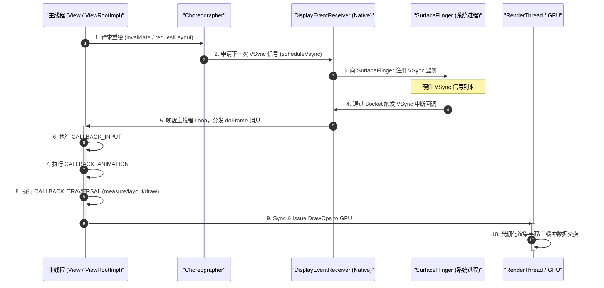
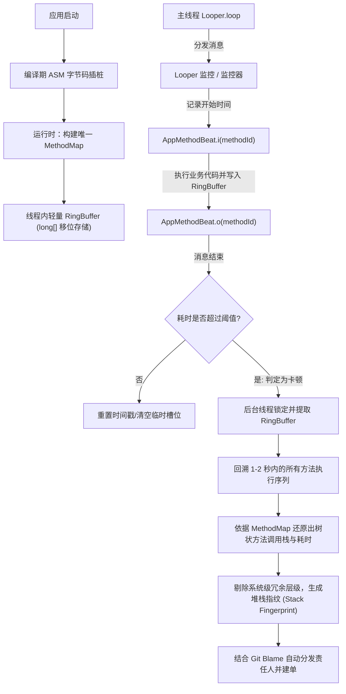

# 5.4.5.3 卡顿监控

在 Android 性能优化与稳定性治理的体系中，流畅度是直接关系到用户体验的核心指标。卡顿（Jank）与应用无响应（ANR）不仅会导致用户流失率上升，更是应用架构缺陷、线程调度合理性以及代码执行效率的直接体现。建立一套能够覆盖线下开发诊断、线上灰度与生产环境监控的卡顿监控治理闭环体系，是保障大型应用稳定运行的基石。

本文将从底层的图形渲染与屏幕显示机制出发，深度剖析卡顿产生的微观本质；对比分析行业主流的卡顿监控与堆栈定位方案；解析优秀开源框架（如 Matrix）的核心设计思想；并结合线下诊断工具与线上归因分发体系，提供一套系统化的卡顿治理实践指南。

---

## 第一部分：UI 绘制卡顿成因与屏幕显示机制

### 1. 流畅度的黄金标准与丢帧定义

在移动设备上，流畅度通常用帧率（Frames Per Second, FPS）来衡量。长期以来，60Hz（即每秒刷新 60 次）是 Android 系统的黄金标准，这意味着系统必须在约 **16.67ms** 内完成一帧的完整渲染流程。随着硬件的升级，90Hz（11.11ms）、120Hz（8.33ms）甚至更高刷新率的屏幕已成为主流，这给系统的图形渲染链条带来了成倍的性能压力。

然而，平均帧率的高低并不能完全反映用户的真实感受。在人眼视觉感知中，相邻两帧之间的耗时波动（Variance）比绝对帧率（Mean Frame Rate）更加敏感。生理心理学研究表明，人眼在跟随屏幕上的运动物体（如列表滑动）时，如果某两帧之间的时间间隔突然拉长（例如从 16.7ms 突变到 100ms），视网膜上的运动补偿机制就会被打断，大脑会感知到明显的“跳跃”或“断档”感。这种在平均高帧率背景下突然发生的帧间隔异常，在 Android 系统中被称为**瞬态卡顿（Jank）**或**丢帧（Frame Drop）**。

在现代高刷新率（如 120Hz）设备中，由于采用了动态刷新率（Variable Refresh Rate, VRR）技术，系统会根据用户的触控状态和画面内容动态切换屏幕刷新率。当用户手指触碰屏幕的瞬间，系统会将刷新率从闲置状态的 10Hz/30Hz 瞬间拉升到 120Hz。这一频率切换的硬件响应时间如果与应用的主线程重绘请求发生时序冲突，就会在第一帧产生严重的“瞬时卡顿”，这是高刷时代性能治理面临的新挑战。

---

### 2. 深入理解图形渲染显示流程

Android 的图形渲染管线极其复杂，从应用层发出绘制指令到物理屏幕上显示像素，需要 CPU、GPU、RenderThread 以及系统级合成器进程 SurfaceFlinger 的高效协作。



#### CPU 端的渲染树构建与绘制录制
当应用触发 UI 更新（例如调用了 `invalidate()` 或 `requestLayout()`）时，主线程（UI 线程）开始执行重绘逻辑。在 Android 的硬件加速架构中（自 Android 3.0 引入，详情请参考 [AndroidVersionChangeLog.md](../../../../../AndroidVersionChangeLog.md)），主线程的 `View.draw()` 并不是直接将图像绘制到物理缓冲区，而是通过 `RecordingCanvas` 将当前 View 的绘制指令（如 `drawRect`、`drawBitmap`、`drawText` 等）录制为 `DrawOp`（绘制操作），并保存在 `RenderNode` 中。所有的 View 节点对应的 `RenderNode` 共同构成了一棵 **DisplayList 树**。这种将绘制逻辑与底层光栅化解耦的设计，使得系统可以对绘制指令进行缓存和重排，极大地提升了二次重绘的性能。

#### RenderThread 的异步渲染与命令提交
在 Android 5.0（Lollipop）版本中，系统引入了独立的渲染线程 **RenderThread**（详情请参考 [AndroidVersionChangeLog.md](../../../../../AndroidVersionChangeLog.md)）。主线程完成 DisplayList 树的构建或更新后，会调用 native 方法 `nSyncAndDrawFrame()`，将主线程 of UI 状态和 DisplayList 数据同步（Sync）给 `RenderThread`。在同步期间，主线程会被短暂阻塞，一旦同步完成，主线程即可被释放，继续去处理其他的用户输入或常规消息，而不需要等待 GPU 渲染完成。

`RenderThread` 拥有独立的渲染上下文和底层的 GPU 绘图 API。它会对 DisplayList 树进行遍历优化（如合并相似的 DrawCall、剔除视口外的不可见 View），并将这些指令转译为底层的 OpenGL ES 或 Vulkan（在 Android 9.0 及以上版本中广泛引入，详情请参考 [AndroidVersionChangeLog.md](../../../../../AndroidVersionChangeLog.md)）指令提交给 GPU。此外，诸如大位图的纹理上传（Texture Upload）也是在 RenderThread 中完成的，这通常是卡顿的一个隐蔽来源。

#### GPU 的光栅化与像素合成
GPU 收到 RenderThread 提交的渲染命令后，利用其高度并发的计算单元执行顶点着色（Vertex Shading）和片段着色（Fragment Shading），将矢量图形和纹理转换为二维像素网格数据（即光栅化 Rasterization）。渲染完成后的像素数据被存入由图形驱动分配的图形缓冲区（Graphic Buffer）。

#### SurfaceFlinger 的窗口合成与显示
`SurfaceFlinger` 是 Android 系统的合成器进程。每一个应用窗口在底层都对应一个 `Surface`，每个 `Surface` 拥有一个 `BufferQueue`。应用作为生产者，将 GPU 绘制完毕的图形缓冲区入队（queueBuffer）到 `BufferQueue` 中；`SurfaceFlinger` 作为消费者，在 VSync 信号到来时从 `BufferQueue` 中取出最新的 Graphic Buffer（acquireBuffer）。

`SurfaceFlinger` 会通过硬件合成器（Hardware Composer, HWC）将多个窗口层级（例如应用的主 Activity 窗口、系统的 StatusBar 状态栏窗口、NavigationBar 导航栏窗口等）合成在一起。如果某些复杂的层级无法通过 HWC 进行硬件合成，`SurfaceFlinger` 将回退到使用 GPU 来完成混合与合成，并将最终的像素流写入显示控制器的帧缓冲区（FrameBuffer），由屏幕刷新控制器输出到物理屏幕上。

---

### 3. 双重缓冲、三重缓冲与 CPU/GPU 排队延迟阻滞

为了消除屏幕扫描期间因为 GPU 写入与屏幕读取冲突导致的**画面撕裂（Screen Tearing）**，Android 系统引入了**垂直同步信号（VSync）**和**双重缓冲（Double Buffering）**机制（详情请参考 [AndroidVersionChangeLog.md](../../../../../AndroidVersionChangeLog.md) 中关于 Android 4.1 黄油计划 Project Butter 的描述）。

#### 双重缓冲机制 the 局限性与缓冲区阻滞（Buffer Stalling）
双重缓冲包含一个前缓冲区（FrontBuffer，供屏幕控制器读取并显示）和一个后缓冲区（BackBuffer，供 GPU 写入像素数据）。当屏幕控制器读取 FrontBuffer 的同时，GPU 向 BackBuffer 进行绘制。只有当 VSync 信号到达，且此时 GPU 已经将 BackBuffer 填满时，系统才会交换（Swap）这两个缓冲区的角色，屏幕开始读取新的一帧。

如果在某一帧的渲染中，因为 CPU 计算过长或 GPU 负载过重，导致渲染耗时超过了 16.6ms，在下一个 VSync 信号到来时，BackBuffer 还没有被 GPU 填满，那么缓冲区交换（Swap）就会失败。屏幕控制器在接下来的 16.6ms 周期内只得继续读取并显示 FrontBuffer 的老数据，这便产生了一次**丢帧（Jank）**。

在双缓冲架构下，此时会引发连锁反应：由于 BackBuffer 仍然被 GPU 占用写入，而 FrontBuffer 正在被屏幕读取，系统此时没有第三个空闲的 Graphic Buffer 可用。主线程（CPU）在试图获取下一个缓冲区以提交新绘制指令时，会被阻塞在 `dequeueBuffer` 系统调用中，直到下一个 VSync 到来、GPU 完成当前帧绘制并释放缓冲区。这种因为缺乏可用缓冲区而导致 CPU 和 GPU 被迫停工等待的现象，被称为**缓冲区阻滞（Buffer Stalling）**。它会导致系统资源的严重浪费，并容易引发连续的丢帧。

#### 三重缓冲（Triple Buffering）的设计折中
为了解决 Buffer Stalling，Android 在黄油计划中引入了**三重缓冲（Triple Buffering）**。系统在 FrontBuffer 和 BackBuffer 之外，额外提供了一个 ThirdBuffer。

当 FrontBuffer 正在被显示器读取、BackBuffer 被 GPU 锁定写入且发生超时丢帧时，CPU 不再需要挂起等待，而是可以立即从底层的 Binder 调用中获取空闲的 ThirdBuffer，开始并行计算下一帧的渲染数据。这极大地提高了 CPU 和 GPU 的并发吞吐率，能够有效铺平由于单帧偶发超时带来的卡顿抖动。

然而，三重缓冲也带来了显而易见的副作用——**显示延迟（Input Latency）**。由于图形管道中积压了三个缓冲区，用户的操作（如在物理屏幕上滑动手指）所产生的输入事件，在主线程和 GPU 中被处理后，需要经过更长的数据通道才能在 FrontBuffer 中被屏幕控制器读取。这意味着用户会感受到画面有轻微的“粘滞感”和“跟手度下降”。这是典型的用“交互延迟”换取“视觉流畅度”的设计取舍（Trade-off）。

---

### 4. Choreographer 工作机理与帧回调流程

Choreographer（编舞者）是应用层图形渲染的控制枢纽。它负责协调主线程的执行节奏，确保 UI 的更新、动画的计算以及 View 树的遍历都与屏幕的硬件 VSync 信号严格对齐。

#### VSync 信号的请求与分发
当 View 发起重绘请求时，最终会调用到 `ViewRootImpl.scheduleTraversals()`。该方法会向 `Choreographer` 注册一个回调。`Choreographer` 内部的 Native 桥接类 `FrameDisplayEventReceiver` 会向 SurfaceFlinger 发送一个 VSync 信号请求。

这是一个**按需注册**的机制。如果页面是静止的，Choreographer 不会向系统申请 VSync，主线程就会处于闲置或处理普通消息的状态，从而有效降低系统的能耗。只有在接收到重绘请求后，SurfaceFlinger 才会监听下一次硬件 VSync 中断。

当硬件 VSync 信号产生时，SurfaceFlinger 通过 Domain Socket 将消息发送给应用的 Native 进程。Native 层的 `DisplayEventReceiver` 收到信号后，通过 Epoll 机制唤醒主线程的 MessageQueue，并将一个 Runnable 封装为高优先级的异步消息（Asynchronous Message）插入消息队列头部，以便主线程能够第一时间响应。

Choreographer 在 Android 系统演进中起到了承前启后的作用。例如在 Android 6.0 引入的动态刷新率支持（详情参考 [AndroidVersionChangeLog.md](../../../../../AndroidVersionChangeLog.md)）中，Choreographer 开始支持根据当前的物理显示状态来调节 doFrame 的节拍，保证了在不同的物理刷新率下，帧回调周期的计算能够动态适配。

#### doFrame 的执行优先级序列
主线程 Looper 处理该消息时，会调用 `Choreographer.doFrame(long frameTimeNanos, int frame)`。`doFrame` 内部维护了五个不同的 Callback 队列，并按照以下严格的顺序依次出队执行：

1.  **`CALLBACK_INPUT`**：处理触摸手势事件（Touch, Key Event）。保证交互的第一手响应在渲染前生效。
2.  **`CALLBACK_ANIMATION`**：执行动画回调。所有基于 `ValueAnimator` 或 `ObjectAnimator` 的属性计算都在这一阶段进行，确保动画帧率与刷新率完美对齐。
3.  **`CALLBACK_INSETS_ANIMATION`**：计算系统窗口（如软键盘弹出或状态栏缩入）过渡动画时的布局偏移。
4.  **`CALLBACK_TRAVERSAL`**：核心遍历阶段。调用 `ViewRootImpl.performTraversals()`，从而递归执行整个 View 树的 `measure`、`layout` 和 `draw` 过程，生成最新的 DisplayList。
5.  **`CALLBACK_COMMIT`**：用于提交渲染数据。主要处理一些在 Traversals 结束后、下一帧开始前需要同步的任务。

从时序上讲，如果主线程正在执行一个耗时的 Handler 消息（例如同步读取 SharedPreferences 或解析一个复杂的 JSON 字符串，耗时 50ms），即使 VSync 信号到来且 doFrame 消息已经进入消息队列，Looper 也会因为正在执行的前一个消息而被阻塞。这种 doFrame 被延迟调度、导致 View 树遍历无法在规定的 16.6ms（或高刷下的 8.33ms）内开始并结束的现象，正是卡顿与丢帧的最直接成因。

在图 1 的时序机制中：步骤 1-3 完成了 UI 变化对 VSync 的注册，步骤 4-5 展示了 VSync 到来后通过 Linux Socket epoll 机制唤醒应用主线程并分发 doFrame 消息的过程，步骤 6-8 表明了 Choreographer 内部严格按照优先级处理帧回调的拓扑序，最后步骤 9-10 描述了渲染管道与图形缓冲的交换。如果步骤 5 的 Looper 循环因为其他耗时业务发生阻塞，则后续步骤 6-10 将整体向后移位，直接触发 Buffer Stalling 丢帧。

---

## 第二部分：卡顿检测与定位方案

为了治理卡顿，首先必须建立精准的检测与定位（抓取堆栈）手段。在 Android 演进过程中，行业内探索出了多种不同的技术方案。

---

### 1. Looper Printer 耗时字符串过滤原理与 BlockCanary 演进

#### 底层原理
Android 主线程的运转完全依赖于 `Looper.loop()` 的消息循环。在 `loop()` 的核心代码中，消息执行的前后会通过 `Looper` 内部设置的 `Printer` 输出日志：

```java
// Looper.java 核心源码结构示意
public static void loop() {
    final Looper me = myLooper();
    // ...
    final Printer logging = me.mLogging;
    for (;;) {
        Message msg = queue.next(); // 可能会阻塞
        // ...
        if (logging != null) {
            logging.println(">>>>> Dispatching to " + msg.target + " " +
                    msg.callback + ": " + msg.what);
        }
        
        // 核心执行体
        msg.target.dispatchMessage(msg);
        
        if (logging != null) {
            logging.println("<<<<< Finished to " + msg.target + " " + msg.callback);
        }
        // ...
    }
}
```

自定义一个 `Printer` 实例，并通过 `Looper.getMainLooper().setMessageLogging(printer)` 挂载到主线程 Looper 上。通过匹配日志字符串的特征，在收到带有 `>>>>>` 的日志时记录开始时间戳 $T_{\text{start}}$，在收到带有 `<<<<<` 的日志时记录结束时间戳 $T_{\text{end}}$。若时间差 $\Delta T = T_{\text{end}} - T_{\text{start}}$ 超过了设定的卡顿阈值（如 200ms），则判定发生了一次卡顿。

#### BlockCanary 的演进与抓栈机制
BlockCanary 框架是对这一机制的经典实现。为了能够定位卡顿的具体代码，BlockCanary 会在判定发生卡顿后，从其维护的后台线程中抓取主线程的堆栈信息。其常规工作流程为：
1.  当主线程监听到消息开始（匹配到 `>>>>>`）时，向后台采样线程发送一个延迟的任务（Delay 为卡顿阈值，如 200ms）。
2.  若消息在 200ms 内正常执行完毕（匹配到 `<<<<<`），则在后台线程中取消该延迟任务。
3.  若消息执行超过 200ms，后台线程的延迟任务被触发，开始调用 `Thread.currentThread().getStackTrace()`（或在子线程中对主线程进行抓栈）来获取主线程当前的调用栈，并将其持久化到本地。

#### 方案的致命缺陷
虽然 Looper Printer 方案简单易行且侵入性低，但在高并发、高稳定性要求的工业级应用中，它暴露出了三个致命的缺陷：

*   **监控范围存在严重的盲区**：Looper Printer 只能监控到 `msg.target.dispatchMessage(msg)` 这段代码的执行耗时。但是在 `Looper.loop()` 中，还有许多耗时发生在消息分发之外。例如，主线程中 `IdleHandler` 的执行逻辑（在消息队列暂时无消息时执行空闲任务）、系统的同步屏障（Sync Barrier）发生泄漏导致主线程无限等待的阶段、以及 Native 层 Input 事件的派发过程，这些耗时完全不会被 `dispatchMessage` 覆盖。这导致很多真实的卡顿甚至主线程死锁无法被该方案感知。
*   **字符串拼接带来的 GC 开销与内存抖动**：每一条 Message 的分发，无论其耗时是 0.1ms 还是 100ms，都会触发 `Looper` 内部对两个字符串的拼接并调用 `println`。在复杂的列表滑动场景下，主线程每秒可能分发数百条消息，这会导致海量的 String 对象被创建，造成严重的内存抖动，进而频繁触发 ART 虚拟机的垃圾回收（GC），这反而成为了卡顿的“制造者”。
*   **抓栈时机滞后导致的误报率高**：由于采用的是“卡顿触发后才抓取堆栈”的滞后触发模式，当子线程被 CPU 调度并成功抓取主线程堆栈时，卡顿的第一现场可能已经过去，主线程已经进入了下一个完全无关的消息处理中，抓取到的堆栈往往是“无辜的”系统调用栈或工具类，误报率极高。

---

### 2. Choreographer 帧率（FPS）与丢帧监控

#### 底层原理
Choreographer 方案聚焦于“最终的渲染表现”而非“单个消息的耗时”。其实现方式是利用 `Choreographer.getInstance().postFrameCallback(FrameCallback)` 在每一帧的开始前注册一个回调：

```java
public class FrameRateMonitor implements Choreographer.FrameCallback {
    private long mLastFrameTimeNanos = 0;
    
    @Override
    public void doFrame(long frameTimeNanos) {
        if (mLastFrameTimeNanos != 0) {
            long jitterNanos = frameTimeNanos - mLastFrameTimeNanos;
            long vsyncIntervalNanos = 16666666; // 假设 60Hz 屏幕
            if (jitterNanos > vsyncIntervalNanos) {
                // 计算丢帧数
                long droppedFrames = (jitterNanos / vsyncIntervalNanos) - 1;
                if (droppedFrames > 0) {
                    // 上报丢帧事件
                }
            }
        }
        mLastFrameTimeNanos = frameTimeNanos;
        // 循环注册，监听下一帧
        Choreographer.getInstance().postFrameCallback(this);
    }
}
```

通过计算前后两次帧回调的时间差值，对比当前设备的标准 VSync 周期（由 `WindowManager.getDefaultDisplay().getRefreshRate()` 获取，适配高刷屏幕），即可得出这一帧真正的耗时以及丢帧数。

#### 适用场景与局限性
该方案能极度敏锐地感知到页面滑动时的微卡顿，是衡量线上产品流畅度的最客观指标，常用于大盘 FPS 和 Jank 率的统计。

然而，其局限性也非常明显：它**只能发现丢帧，却无法定位成因**。它只提供了一个宏观的丢帧数字，却完全不知道是哪个类、哪个函数引发了主线程阻塞。此外，`FrameCallback` 本身也是运行在主线程的。如果主线程发生严重卡死（如发生了耗时 5 秒的同步 I/O 阻塞），`doFrame` 回调根本没有机会被 Looper 调度执行，整个监控模块将陷入“失联”状态，无法在卡顿中实时获取任何信息，必须依赖外部的看门狗线程。

---

### 3. 子线程高频采样主线程堆栈（StackSampler）

#### 工作原理
为了克服 Looper Printer “卡顿后抓栈”带来的第一现场缺失问题，StackSampler 采用了**多步滑动窗口采样**机制。

采样线程独立于主线程运行，在主线程执行消息的过程中，以固定的频率（例如每 20ms）对主线程的调用栈进行抓取，并将获取到的堆栈保存在一个固定容量的环形队列（RingBuffer）中。

如果主线程 Message 正常在阈值内结束，则直接清空该 RingBuffer；如果主线程消息耗时超过阈值（如 200ms），则停止采样，并将 RingBuffer 中保存的、过去 200ms 内的数张堆栈切片拼装输出。通过比对多张堆栈切片中的重复函数，可以清晰地还原出主线程在这 200ms 内的“函数调用耗时走势图”。

#### ART 虚拟机的安全点（Safepoint）暂停开销与 Stop-The-World
虽然滑动窗口采样极大地提高了堆栈还原的精准度，但它引入了更严重的性能损耗——**Safepoint 挂起开销**。

当在 Java 层调用 `Thread.getStackTrace()` 获取主线程堆栈时，ART 虚拟机（以及 JVM）为了保证读取到正确的寄存器和内存状态，必须使目标线程暂停运行（Suspend Thread）。为了安全地暂停目标线程，虚拟机要求主线程必须运行到最近的一个**安全点（Safepoint）**并挂起。

这意味着，主线程会被强制发生一次**Stop-The-World（STW）**。如果采样频率设置过高（如 10ms 或 20ms），主线程在执行正常的业务逻辑时，就会频繁地被采样线程强行挂起，产生严重的二次卡顿。这种由于监控本身带来的卡顿，极大地限制了 StackSampler 在生产环境的线上部署。

#### 优化演进：Native 信号级抓栈
为了降低 Safepoint 的开销，现代高性能 APM 框架会选择在 Native 层通过 Unix 信号机制实现轻量级抓栈。通过 `sigaction` 注册 `SIGPROF` 或 `SIGURG` 信号，在子线程通过 `pthread_kill` 向主线程发送该信号。主线程收到信号后，会立即中断当前指令执行，并跳转到信号处理函数（Signal Handler）中。在信号处理函数内，直接拷贝寄存器中的 PC（程序计数器）和 SP（堆栈指针），通过解析 DWARF 调试信息在 Native 层面直接完成调用栈展开（Stack Unwinding）。这种方式完全绕过了 ART 的 Java 层 Safepoint 挂起机制，将抓栈的性能开销降低了两个数量级，使线上高频采样成为可能。

---

### 4. 基于 Atrace / Systrace 的轻量级切片监控

#### Atrace 的底层机制
Android 系统内置的 Systrace 主要是基于 Linux 内核的 **Ftrace** 机制实现的。在 Java 层，系统提供的 `Trace.beginSection(String sectionName)` 和 `Trace.endSection()` 最终是通过 JNI 调用到 Native 层，向系统的 `/sys/kernel/debug/tracing/trace_marker` 写入特定格式的字符串（例如 `B|pid|sectionName` 表示进入，`E` 表示退出）。这些字符串会被 Linux 内核的 Ftrace 缓冲区捕获，并最终生成包含时间轴的方法级切片图。

#### 线上轻量级切片实现原理与 Hook 技术细节
在线上生产环境中，由于权限限制，应用无法直接向内核的 `trace_marker` 文件执行写操作。为了实现类似的切片监控，APM 框架通常采用了一种“虚拟 Atrace”方案：

1.  **编译期字节码插桩**：在 Gradle 构建阶段，利用 ASM 框架遍历所有的 Class 字节码，自动在每个方法的入口处插入自定义的记录代码，在方法的出口处（包括所有的 `return` 和 `throw` 分支）插入结束记录代码。
2.  **Native 挂钩与拦截（Hook）**：为了在 Native 层实现对 `write` 系统调用的拦截，APM 框架通常使用 **PLT Hook（Procedure Linkage Table Hook）** 或 **Inline Hook** 技术。在 ELF 格式的共享库中，外部函数调用都是通过 PLT 表和 GOT（Global Offset Table）表进行间接寻址的。PLT Hook 通过直接修改 GOT 表中 `write` 的函数入口地址，将其替换为监控框架的代理函数地址。当 `android.os.Trace` 向 `/sys/kernel/debug/tracing/trace_marker` 写入数据时，调用会被代理函数捕获。代理函数会解析写入的字符串（如以 `B` 开头的代表方法进入，`E` 代表方法退出），并将这些数据存入内存缓冲中，然后直接返回，从而绕过了真正的内核文件写入。而 Inline Hook 则是直接修改 `libc.so` 中 `write` 函数的指令前几个字节，将其覆写为跳转到代理函数的汇编指令。这两种技术中，PLT Hook 稳定性更好但只能拦截动态链接库导入的方法，而 Inline Hook 可以拦截所有的底层调用，但实现复杂度高，且在多线程并发执行时极易产生指令竞态冲突导致 Crash。实际框架中通常以 PLT Hook 拦截特定动态库的 `write` 为主。
3.  **内存环形缓冲**：Hook 函数直接将该 Trace 事件和高精度时间戳（通过 `clock_gettime(CLOCK_MONOTONIC)` 获取）拦截并写入到应用自身的内存 Buffer 中，而不再真正调用底层的磁盘文件写入。
4.  **切片回溯**：当主线程被判定卡顿时，直接从内存 Buffer 中读取该时段内所有方法的进入/退出事件，即可还原出极高精度且完全没有第一现场丢失的方法耗时时序图。其开销相比于 `Thread.getStackTrace()` 降低了 90% 以上。

---

## 第三部分：核心监控框架对比与实现

### 1. 方案设计取舍对比

在实际架构设计中，必须根据使用场景在性能损耗、精准度、捕获能力等方面做深入的取舍：

| 评估维度 | Looper Printer 方案 | VSync Choreographer 方案 | Native 采样（StackSampler） | 编译期插桩 + 内存回溯（Matrix） |
| :--- | :--- | :--- | :--- | :--- |
| **监控粒度** | Message 级别 | 帧（VSync 间隔）级别 | 线程堆栈级别 | 方法（Method）级别 |
| **CPU 损耗** | 中等（高频字符串拼接） | 极低（仅单次回调） | 高（Safepoint 挂起） | 极低（纯内存位移写入） |
| **内存开销** | 中等（易引发频繁 GC） | 极小 | 极小 | 中等（Method Map 映射表） |
| **轻度卡顿敏感度** | 差（无法捕获单帧微卡） | 极高（帧超时即捕获） | 差（短时间卡顿易漏过） | 极高（结合 Choreographer 触发） |
| **重度卡顿捕获** | 能（单次消息超时即捕获） | 弱（主线程卡死时失效） | 极强（看门狗独立唤醒） | 极强（看门狗配合内存 Dump） |
| **堆栈还原能力** | 弱（只能捕获滞后堆栈） | 无 | 强（展示函数调用走势） | 极强（还原精准的方法执行树） |
| **适用边界** | 仅限于 Looper 循环内 | 适合线上流畅度大盘指标 | 适合线下调试/Root设备 | 适合线上/线下深度卡顿治理 |

---

### 2. Matrix 卡顿监控设计思想解析

微信开源的 Matrix 框架中的 `TraceCanary` 模块，代表了目前 Android 卡顿监控的极高技术水平。它完美融合了编译期插桩、高效内存结构设计以及 Looper 事件驱动机制，解决了上述多种传统方案的瓶颈。



#### 字节码插桩与 Method Map 映射
Matrix 在打包阶段使用自定义的 Gradle 插件，通过 ASM 库扫描项目中所有的 Class 文件。为了避免将长方法名直接写入字节码导致的方法区内存膨胀和方法数超限（65535 限制），Matrix 引入了 **Method Map 映射表**：

1.  给项目中的每个类、每个方法分配一个全局唯一的整型 ID（`MethodId`，占用 20 位，支持多达 1,048,576 个方法）。
2.  在编译期，将所有的方法名与其 `MethodId` 的映射关系输出到一个文本文件中（如 `methodMapping.txt`），作为后续堆栈还原的字典。
3.  在每个方法的入口处插入字节码指令：`AppMethodBeat.i(methodId)`。
4.  在每个方法的出口处（包括所有分支的 `return` 和 `throw` 指令）插入字节码指令：`AppMethodBeat.o(methodId)`。

这种 Method Map 的设计在大型工程中极具价值。在百万级代码量的大型应用中，一个普通的方法名（如 `com.example.business.module.detail.ProductDetailFragment.onViewCreated`）在内存中作为字符串存储时会消耗大量堆内存。如果在主线程运行的每一次方法调用都生成字符串，或者直接将全路径方法名存入内存缓存中，瞬间就会引发 OOM。通过在编译期输出的 `methodMapping.txt`，客户端在运行时只需传输和存储 20 位的整型 ID，极大地降低了数据传输包体大小和运行时的内存占用。当数据被上报到 APM 后台服务器时，服务器再利用 `methodMapping.txt` 对这些 MethodId 进行映射反解，还原出易于开发人员阅读的方法名。这种“编译期压缩、运行时传递 ID、服务端反解还原”的思路，也是大型商业级监控系统的标准工程实践。

为了保证性能，Matrix 提供了精细的**插桩黑名单与过滤机制**。对于非常简单的方法（例如纯 Getter/Setter、空构造函数、不包含其他方法调用的轻量工具函数），Matrix 在编译期会计算其指令长度，若低于预设阈值，则直接跳过，不做字节码注入，以此最大程度地降低运行时的方法调用开销。

#### 内存中的零对象 RingBuffer 设计
如果在主线程的每个方法调用中都创建 Java 对象来记录进入和退出状态，会导致严重的 OOM 或垃圾回收抖动。为了实现极致的零对象分配，Matrix 在底层设计了一个基于主线程私有的整型数组：`long[]` 构成的 **RingBuffer**。

数组中的每一个 `long` 元素占用 64 位，利用高度紧凑的**位运算**来存储一次方法调用事件的信息：

*   **`MethodId`**：占用前 20 位，用来标识具体执行的方法。
*   **`IsIn`**：占用第 21 位，`0` 表示进入方法（`i` 插入点），`1` 表示退出方法（`o` 插入点）。
*   **`TimeOffset`**：占用后 43 位，用来记录该事件发生的时间戳相对于帧开始时间戳的偏移量（微秒级或毫秒级）。

通过位操作进行数据的打包和解包：
$$\text{Data} = (\text{MethodId} \ll 44) \mid (\text{IsIn} \ll 43) \mid \text{TimeOffset}$$

当主线程执行方法时，只是对这个大整型数组进行循环的槽位覆盖和写入，这期间不产生任何临时的 Java 对象，CPU 执行效率极高，且完全不会引起 ART 虚拟机的 GC 标记开销。

#### 事件驱动的方法树回溯
当主线程因为 Looper 监控或 Choreographer 丢帧监控判定发生卡顿（例如某次 Loop 消息耗时突破 700ms）时，监控模块会向子线程发出 Dump 请求。

子线程会在内存中“锁定”当前的 RingBuffer，并将其中的 `long` 数组数据读取出来。由于 RingBuffer 中完整记录了过去 1-2 秒内主线程中所有方法的进入和退出序列，子线程可以通过这些数据进行逆向压栈和出栈操作，从而完美构建出这 1-2 秒内的完整**树状方法调用关系与绝对时间开销**。

在图 2 中展现了该工作流的生命周期。从编译期的 MethodMap 构建和 ASM 插桩（步骤 A-B），到运行时高效的 RingBuffer 数据吞吐（步骤 C-D）。在主线程 Looper.loop 驱动的实际业务执行中（步骤 E-H），监控机制通过 AppMethodBeat 紧凑的位存储，规避了常规 Java 抓栈带来的 Stop-The-World 问题。如果发生卡顿，后台线程提取 RingBuffer（步骤 K-M），并计算核心特征节点与其前后 3 层的指纹归归（步骤 N），结合 Git Blame 数据库信息，实现线上故障到责任人的无缝建单分发闭环。

这使得 Matrix 能够捕获到真实的“第一现场”，彻底解决了由于采样滞后导致的归因错误。

---

## 第四部分：线下卡顿诊断与调优

相比于线上监控，线下调试可以使用系统提供的高特权级工具，对系统内核和运行状态进行多维度的切片诊断。

---

### 1. 底层切片诊断工具的实战应用

*   **Systrace 经典时序流分析**：Systrace 是基于 Linux Ftrace 构建的诊断利器。在分析时，通过查看 HTML/Chrome 跟踪视图，可以直观地观察主线程（UI Thread）在任意微秒级时刻的操作系统调度状态。
*   **Perfetto 现代追踪平台**：Perfetto 是 Google 推出的下一代性能分析平台（在 Android 9.0 中作为内置组件引入，详情请参考 [AndroidVersionChangeLog.md](../../../../../AndroidVersionChangeLog.md)）。它支持更长的时间跨度记录，并允许通过标准 SQL 语句对线程状态、Binder IPC 和系统 CPU 调度进行数据查询。
*   **CPU Profiler（System Trace）**：Android Studio 内置 of Profiler 提供了 System Trace 视图，能够显示与 Systrace 相同的内核线程调度状态。

#### 关键的线程调度状态识别
在 System Trace 的时间轴上，主线程（UI Thread）上的每一个耗时条都会被赋予不同的颜色，用以代表线程在内核中的实际运行状态，这是线下卡顿定位的关键破案线索：

1.  **绿色（Running - 正在运行）**：
    *   **内核释义**：线程此时正在占用某个 CPU 核心执行具体指令。
    *   **调优方向**：如果主线程长时间处于绿色，说明主线程正在执行 CPU 密集型任务。需要排查是否有大位图的压缩/解压、复杂的算法计算、频繁的字符串正则匹配、或者是大量 JSON 数据的序列化与反序列化。
2.  **蓝色（Runnable - 就绪待执行）**：
    *   **内核释义**：主线程的代码已准备就绪，可以被 CPU 调度，但因为当前系统中所有 CPU 核心都处于满载状态（例如后台有十几个线程在进行大文件的 IO 压缩或网络并发读写），主线程无法争抢到 CPU 时间片，必须在操作系统的调度队列中排队等待。
    *   **调优方向**：这说明系统当前负载过高。需要排查应用中是否有滥用线程池、后台子线程没有合理限制并发数量等情况。可以通过为子线程设置合理的线程优先级（通过 `Process.setThreadPriority(Process.THREAD_PRIORITY_BACKGROUND)` 将子线程设置为后台优先级，减少其与主线程的 CPU 时间片争抢）来解决。
3.  **橙色（Uninterruptible Sleep - D 状态 / IO Wait）**：
    *   **内核释义**：线程正在执行内核级系统调用，通常是在等待硬件设备（主要是闪存 Flash 芯片）的数据读写返回。此时线程处于不可中断的睡眠状态，CPU 不会对其分配时间片。
    *   **调优方向**：主线程中存在同步的文件读取、数据库查询或 SharedPreferences 的同步 `commit`。由于硬件读写的物理限制，主线程在此期间只能傻傻等待。优化方式是必须将所有的 I/O 操作（包括 SharedPreferences 的读写、日志的同步落地、文件的拷贝等）移至子线程中异步进行。
4.  **紫色（Sleeping / Monitor Wait - 锁等待与休眠）**：
    *   **内核释义**：主线程被 Java 的同步锁（`synchronized`）或 JUC 重入锁（`ReentrantLock`）阻塞，或者调用了 `Object.wait()` 正在等待被其他线程唤醒。
    *   **调优方向**：主线程与后台线程发生了严重的锁争抢。需要定位锁的 Owner（持有该锁的子线程）。如果 Owner 线程因为优先级低而迟迟得不到 CPU 调度，或者 Owner 线程正在锁内执行耗时的 I/O 操作，就会直接拖死主线程。优化方式是尽量采用无锁化设计（如单线程化写）、缩小锁的粒度、或者使用并发读写容器（如 `CopyOnWriteArrayList`）。

---

### 2. 线下调优黄金法则与典型性能杀手

#### Binder 调用耗时（主线程 IPC）
在 Android 架构中，与系统服务（如 `PackageManagerService`、`WindowManagerService`、`ActivityManagerService`）通信必须通过 Binder IPC。

当主线程调用 `context.getPackageManager().queryIntentActivities()` 或读取 `TelephonyManager` 的状态时，主线程会发生一次 Binder 阻塞调用。在 Systrace 中，这表现为一段 `binder transaction`。

在系统繁忙、CPU 饥饿或低端设备上，原本预计 2ms 结束的 Binder 调用，其耗时可能瞬间膨胀到 150ms 以上。因此，**严禁在主线程的生命周期回调中、滑动事件响应中调用任何需要 IPC 的系统 API**。对于必须获取的系统属性，应当在启动阶段的子线程中进行缓存。

#### 无用 measure/layout 与 View 树优化
当 View 发生改变时，重绘阶段的 `performTraversals()` 会递归遍历整棵 View 树。

如果 View 树的层级太深，或者在布局中过多地使用了不合理的 `RelativeLayout` 导致系统不得不进行二次 Measure（RelativeLayout 为了确定子 View 的相对位置，默认会对所有直接子 View 进行两次测量），那么 Measure 的时间开销会呈指数级增长。

优化方案是使用 `ConstraintLayout` 实现扁平化布局，将 View 树的深度控制在 8 层以内；使用 `<merge>` 标签消除冗余的父容器；对网络异常、空白页等非常用页面使用 `<ViewStub>` 标签进行延迟懒加载。

#### 过度绘制（Overdraw）调优
过度绘制是指屏幕上的某个像素点在单帧内被重复绘制了多次。在开发者选项中开启“调试 GPU 过度绘制”后，可以通过颜色直观判断（红色代表该像素在当前帧被绘制了 4 次及以上，说明存在严重的浪费）。

优化过度绘制的手段包括：
1.  移除 Activity 根窗口默认的 Background（在 Theme 中设置 `android:windowBackground="@null"`），避免根 View 与 Activity 背景发生重叠绘制。
2.  移除布局中各子容器重合的 `android:background` 属性。
3.  对于自定义 View，通过 `Canvas.clipRect()` 限制 Canvas 的绘制区域，只对发生改变的脏区（Dirty Area）进行更新。

#### 硬件解码与多媒体调优
在播放超高清视频或展示大尺寸 GIF/WebP 动图时，如果使用 `MediaCodec` 硬解，硬解的配置（`configure()`）和数据缓冲区排队（`queueInputBuffer`）可能会在主线程引发卡顿。

调优方案是将解码器实例的创建、控制和数据解析操作全部放至子线程中运行，并利用 `Surface` 接口（配合 `SurfaceView` 或 `TextureView`）将解码出的像素缓冲区直接提交给 GPU 完成合成，实现解码与主线程 UI 的完全解耦。

---

## 第五部分：案例与监控闭环

有效的卡顿治理，不能只依靠开发人员线下零散的修修补补，必须建立线上监控大盘、日志归因和问题追踪的完整闭环体系。

---

### 1. 线上卡顿监控指标与自动分发体系

为了量化大盘流畅度，业界通常定义了三个核心的线上性能监控指标：

*   **Jank 帧率（Jank Rate）**：把单帧耗时超过 3 倍标准 VSync 间隔（在 60Hz 设备上即为单帧耗时 $\ge 50\text{ms}$，在 120Hz 设备上即为单帧耗时 $\ge 25\text{ms}$）的帧定义为 Jank 帧。
    $$\text{Jank Rate} = \frac{\text{Jank 帧总数}}{\text{渲染帧总数}} \times 100\%$$
*   **冻结帧率（Freeze Rate）**：单帧耗时超过 700ms 的帧数占总帧数的比例。冻结帧往往伴随着用户明显的顿挫感甚至是 ANR。
*   **慢消息比例（Slow Message Rate）**：主线程 Looper 中执行耗时 $\ge 200\text{ms}$ 的消息在所有被执行消息中的占比。

#### 自动归因系统与堆栈指纹（Stack Fingerprint）生成
当线上千万级活跃用户每天产生海量的卡顿日志上报时，如果依靠人工去阅读堆栈并分发 Bug，治理成本是不可接受的。必须建立基于**堆栈指纹（Stack Fingerprint）**的自动归因分发体系：

1.  **堆栈噪点剔除**：将上报的方法树或调用栈进行预处理，过滤掉通用的系统级入口（如 `android.os.Looper.loop`、`android.os.Handler.handleMessage`、`java.lang.reflect.Method.invoke` 等），这些属于对定位无帮助的无用信息。
2.  **特征节点识别**：自顶向下遍历调用栈，寻找**第一个非系统定义的、且其包名属于当前应用业务包名（例如 `com.example.app.*`）的方法**。这个方法被定义为这次卡顿的**核心特征节点**。
3.  **计算堆栈指纹**：为了防止该特征节点是一个极其通用的基类方法，系统会截取特征节点及其紧密关联的前后各 2 层调用路径，拼接成文本后计算其 MD5 值，即为该卡顿的**堆栈指纹（Stack Fingerprint）**。
4.  **自动分发建单**：后台监控系统在收到卡顿上报后，根据堆栈指纹对卡顿进行去重合并。同时，结合编译打包时生成的 Git 映射信息（利用 Git 插件提取出特征节点类文件的最后一次修改提交记录和开发者 Blame 邮箱），自动通过看板工具（如 Jira）将该卡顿问题建单并精准分发给对应的开发者，实现全自动的闭环追踪。

---

### 2. 典型卡顿案例调优实践

#### 案例一：SharedPreferences 同步等待引发的 ANR
*   **现象**：线上后台统计到大量的 ANR 日志，且堆栈几乎无一例外卡在 Activity 生命周期的 `onStop` 或 `onPause`，堆栈中显示主线程卡在 `android.app.QueuedWork.waitToFinish(QueuedWork.java)`。
*   **根源剖析**：
    在 Android 中，当调用 `SharedPreferences.Editor.apply()` 时，系统会先将修改更新到内存的 Map 中，并将磁盘写入任务封装为 Runnable 放入一个单线程池（由 `QueuedWork` 调度）中异步执行。
    虽然 `apply()` 本身是异步的，但为了确保在 Activity 生命周期切换（如跳转到下一个页面，当前 Activity 执行 `onStop`）时，数据能确保写入磁盘不丢失，Android 系统在 `ViewRootImpl` 准备执行生命周期时，会在主线程中强制调用 `QueuedWork.waitToFinish()`，同步等待那个磁盘单线程池中的所有 Runnable 执行完毕。
    如果有大量的 `apply` 操作被频繁触发，或者磁盘由于高负载导致写入速度极慢，主线程就会发生死等，从而触发严重的 ANR 崩溃（更多系统设计变化可链接至 [AndroidVersionChangeLog.md](../../../../../AndroidVersionChangeLog.md) 了解）。
*   **解决方案**：
    1.  紧急避险：在 Native 层 Hook `QueuedWork` 内部的 `sPendingWorkFinishers` 队列，在 `onStop` 前将其清空，避免死等。但此方案有丢失数据的风险。
    2.  彻底重构：弃用系统的 SharedPreferences，整体迁移到基于 mmap（内存映射）技术的腾讯 **MMKV**。MMKV 的每次修改都会利用 mmap 机制直接写入内存缓存区，由操作系统内核的页缓存同步刷盘，避免了线程切换与同步等待开销，彻底解决了 `QueuedWork` 导致的 ANR 顽疾。

#### 案例二：列表快速滑动时的内存抖动与 GC 卡顿
*   **现象**：用户在快速滑动资讯类长列表时，画面有明显的瞬态顿挫感，FPS 曲线呈现锯齿状波动。
*   **根源剖析**：
    在 RecyclerView 滚动的过程中，`onBindViewHolder(ViewHolder holder, int position)` 会被以极高的频次调用。
    在开发中，为了图方便，开发人员在该方法内直接进行了大量的字符串拼接操作（例如 `holder.title.setText("第 " + position + " 条: " + data.getTitle())`），或者在此处频繁创建临时的日期格式化对象 `SimpleDateFormat`，以及进行复杂的局部数据 Model 转换。
    这导致在几秒钟内，主线程内存中产生了几十万个生存周期极短的 Java 对象，内存空间被迅速耗尽。这会频繁触发 ART 虚拟机的 GC 回收动作。

    这里需要说明的是，虽然现代 ART 虚拟机（如 Android 8.0 引入的 Concurrent Copying GC，详情参考 [AndroidVersionChangeLog.md](../../../../../AndroidVersionChangeLog.md)）已经将大部分垃圾标记和整理操作放到了 GC 后台线程并发执行，以尽量减少对主线程的暂停影响。但是，并发 GC 并不能做到完全的“无感”。在 GC 启动的初始阶段（Initial Mark）需要扫描根对象，以及在 GC 的收尾阶段（Reclaim Phase）更新对象引用地址时，ART 依然会触发 `SuspendAll` 挂起所有的 Java 线程。这两次短暂的挂起（Stop-The-World）虽然通常只有 1~3ms，但如果因为内存抖动太厉害，一秒内触发了 10 次以上的 GC，累计的挂起时间就会达到 20~30ms。这已经超出了 16.6ms 的 VSync 周期，从而让主线程丢失渲染时间片，形成肉眼可见的瞬态卡顿。
*   **解决方案**：
    1.  **零对象分配原则**：严禁在 `onBindViewHolder` 中执行任何具有 `new` 关键字的对象创建操作。
    2.  **复用格式化工具**：将 `SimpleDateFormat` 等昂贵的对象设置为 `ThreadLocal` 变量或全局静态常量，避免重复实例化。
    3.  **字符串拼接优化**：使用 `StringBuilder` 或预先在数据模型（Model）转换层在子线程处理好最终展示的 String，让 `onBindViewHolder` 只承担纯粹的赋值操作。
    4.  **RecyclerView 预取（Prefetch）**：开启布局管理器的 Prefetch 机制，使系统能够在主线程空闲时，提前在子线程完成下一页数据的绑定与测量工作。

#### 案例三：冷启动阶段主线程执行类加载与反射卡顿
*   **现象**：应用冷启动耗时大幅超标，主线程的 CPU 时间条长达数秒处于绿色（Running），Systrace 堆栈显示大量的耗时在 `ClassLoader.findClass` 和 `Class.forName`。
*   **根源剖析**：
    冷启动是类加载最密集的阶段。许多第三方 SDK 在初始化时，为了降低模块间的耦合，大量使用了反射机制来进行类的探测和实例化。
    在 Android 中，类加载涉及从 APK 压缩包（ZIP 文件）中读取 dex 数据、进行字节码格式验证、解析符号引用等一系列操作。特别是在非预编译模式下，会伴随着显著的磁盘 I/O。
    在冷启动期间，如果主线程集中进行大量的类加载和反射，会让 CPU 负载瞬间拉满，导致启动界面白屏时间长、首帧渲染极慢。
*   **解决方案**：
    1.  **消除反射**：在线上环境，通过 Gradle 插件在编译期自动生成静态的实例化代码（类似于 Dagger 编译期生成的工厂类），避免运行时使用反射查找。
    2.  **启动框架解耦**：使用 App Startup 启动框架，对有依赖关系的 SDK 进行拓扑排序，并在合理的子线程池中并发执行初始化逻辑。
    3.  **类预加载**：对于主线程中必定会用到的核心业务类，在 Application 初始化的第一阶段，在子线程中通过 `Class.forName()` 进行后台预加载，利用底层的类缓存机制，消除主线程首次访问时的类加载延迟。
