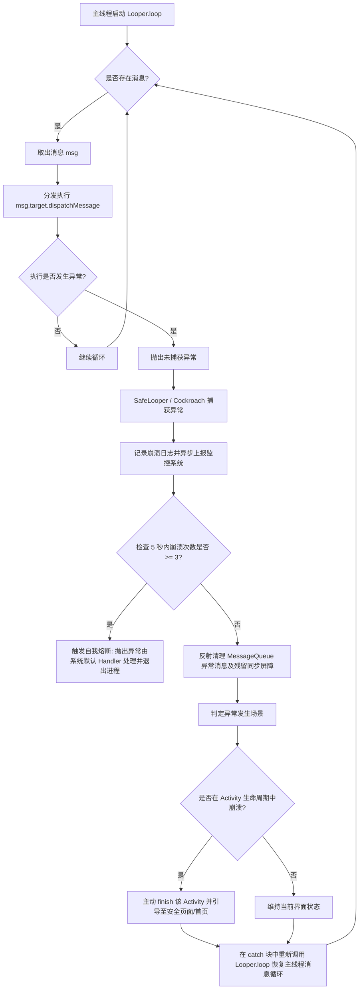
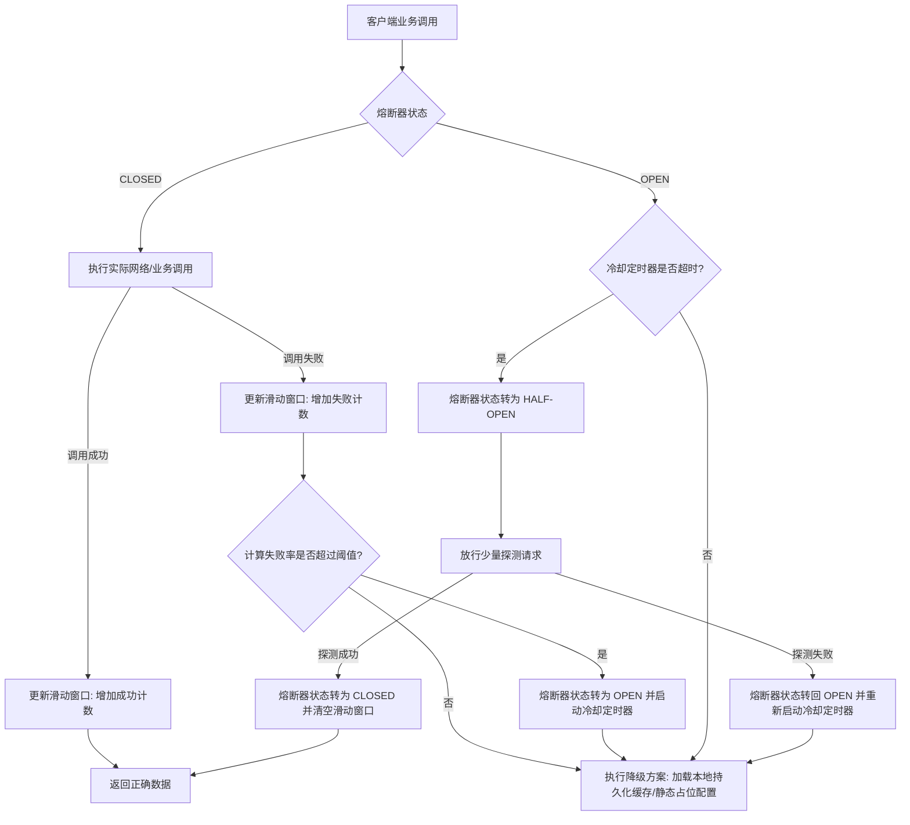

# 异常兜底

高可用容灾与异常兜底是 Android 稳定性治理（APM）中极其重要且难度极高的环节。它是防崩溃的最后一道防线，用于拦截未捕获异常，确保应用在发生非预期崩溃时能够优雅降级、自我修复或局部容灾，最大化保障用户体验和核心链路的可用性。本文将从底层原理、源码剖析、安全缺陷、UI 拦截、Native 崩溃以及业务熔断降级等多个维度，对 Android 异常兜底技术进行深度解析。

---

## 第一部分：高可用容灾与异常兜底概念

### 1.1 什么是异常兜底？它在稳定性治理中的定位

在移动端软件开发中，无论测试流程多么严密，静态代码扫描工具多么强大，线上环境的复杂性（如设备碎片化、定制化系统 ROM 的修改、内存资源极度匮乏、硬件老化等）依然会导致一些未被捕获的异常（Uncaught Exception）发生。一旦这些异常未被捕获，JVM 默认会将崩溃线程终止，进而导致整个应用进程闪退。

**异常兜底（Exception Sandbox / Fallback Framework）** 是一种在运行时构建的“高可用防御机制”。其核心定位是**防线的最后一环**。它通过接管应用的主线程消息循环、Hook 关键系统组件分发路径、注册 Native 信号处理器等方式，在应用抛出未捕获异常并即将走向闪退的临界点实施强力干预。

在稳定性治理（APM）的完整闭环中，异常兜底的定位与常规优化手段有着明显的差异：
- **静态防御**：通过 Lint、架构约束、Null 安全语法（如 Kotlin）在编译前规避风险。
- **动态防御（容灾）**：在发生崩溃时，通过兜底拦截，将“毁灭性”的进程退出，降级为“局部功能受损”或“界面有损展示”。
- **事后诊断**：通过 Crash 监控平台收集堆栈，进行逆向符号化定位和修复。

异常兜底的本质是**有损服务**（Graceful Degradation）。它的目标是保证应用的核心链路（如支付、登录、核心主页）在局部出错时依旧可用，而不是让整个应用陪葬。

---

### 1.2 为什么需要异常兜底？传统 UncaughtExceptionHandler 收集 Crash 并退出的局限性

在 Android 系统中，Java 层的崩溃拦截默认依赖于 `Thread.UncaughtExceptionHandler`。当一个线程抛出异常且没有被任何 `try-catch` 块捕获时，JVM 会调用该线程的 `dispatchUncaughtException` 方法，最终分发给通过 `Thread.setDefaultUncaughtExceptionHandler()` 注册的默认处理器。

传统的 Crash 监控收集框架（如早期版本的 Bugly、Sentry，或自建的 Crash 收集工具）其核心工作流程如下：

```
[发生未捕获异常] 
       │
       ▼
[触发 Thread.getDefaultUncaughtExceptionHandler] 
       │
       ▼
[收集当前设备信息、内存状态、线程堆栈] 
       │
       ▼
[将 Crash 堆栈写入本地文件 / 尝试同步上报] 
       │
       ▼
[调用 Process.killProcess(Process.myPid()) 或 System.exit(10) 强行杀死进程]
```

这种传统处理模式具有巨大的局限性：
1. **用户上下文完全丢失**：强行杀进程会导致用户当前的全部操作瞬间中断。例如：用户正在填写的长表单、正在进行的支付交易、正在编辑的文章草稿等，这些尚未持久化的临时数据会全部丢失。这会引发极高的用户投诉率和断崖式的留存率下跌。
2. **多进程状态不一致**：在多进程架构（如主进程、Push 进程、Webview 独立进程）中，如果主进程突然闪退而子进程依然存活，可能会导致 IPC 链接断裂，本地数据库写入中途夭折，产生大范围的脏数据或状态不同步。
3. **应用商店评分下降与应用评级惩罚**：Google Play 和各大家长渠道均会统计应用的 ANR 率与 Crash 率。频繁的闪退会导致应用排名下降，降低自然流入曝光。
4. **异常频发时的雪崩效应**：若崩溃发生在启动阶段或全局初始化期间，传统的退出逻辑会导致用户刚打开应用就闪退，应用陷入持续的闪退死循环，用户唯一的解决办法是卸载重装。

因此，单靠收集堆栈并强行退出，已无法满足高可用、高可用商业级应用的需求。我们需要一种能够让崩溃现场“软着陆”的兜底拦截方案。

---

### 1.3 稳定性治理中，异常兜底与常规 Crash 监控/收集的互补关系

异常兜底与常规的 Crash 监控（如 Sentry、Bugly、Firebase Crashlytics）绝对不是替代关系，而是**相辅相成、攻防一体**的互补关系：

| 维度 | 常规 Crash 监控/收集（Bugly、Sentry） | 异常兜底机制（SafeLooper、业务降级） |
| :--- | :--- | :--- |
| **角色定位** | 诊断系统（事后发现、被动分析） | 免疫与治疗系统（事前防御、运行时自愈） |
| **核心目的** | 还原崩溃现场、生成日志、统计指标、指派修复责任 | 拦截异常、阻止应用退出、重组消息队列、降级核心服务 |
| **执行时机** | 应用即将消亡时的临界期，只做现场保存 | 异常抛出瞬间，在 JVM/系统层执行强力干预与重置 |
| **数据流向** | 格式化本地日志并上传至 APM 后台 | 捕获异常后，本地消费并伪装成常规数据，同时将堆栈回传给监控系统 |

#### 互补共生工作流
当线上应用发生异常时，理想的闭环治理流程不应该是单纯的“闪退”或“假死”，而应该是：
1. **异常抛出**：发生非预期崩溃，但由于我们注入了异常拦截器，Crash 被成功拦截，阻止了 `Thread.getDefaultUncaughtExceptionHandler` 执行杀进程操作。
2. **降级保障**：拦截器判断异常来源。如果是某个非核心 Activity 的绘制问题，则自动 finish 该 Activity 并回退至上一级页面，或将其降级为占位 UI；如果是主线程死循环，则通过 SafeLooper 重组消息队列继续运行。
3. **静默上报**：在拦截的同时，将异常堆栈、上下文数据（如当前 Activity 栈、内存空闲率、发生崩溃时的 Handler Message 属性）打上 `[兜底拦截]` 标签，静默上报给 Bugly 或 Sentry。
4. **事后优化**：研发人员在监控后台看到这些“被成功兜底拦截的 Crash 堆栈”，虽然线上用户无感知（没有闪退），但研发依然能够据此定位 Bug 并发布热修复包。

---

## 第二部分：Java 层死循环异常拦截兜底机制

在 Java 层稳定性治理中，拦截主线程未捕获异常并保持主线程运行的核心技术通常被称为 **SafeLooper** 或者是 **Cockroach（蟑螂）** 机制。

### 2.1 SafeLooper / Cockroach 机制的底层原理

为了理解 SafeLooper 的原理，必须先看 Android 主线程的底层工作模型。Android 应用进程启动时，其入口是 `ActivityThread.main()` 方法。在该方法中，会初始化主线程的 Looper 并启动无限循环：

```java
public static void main(String[] args) {
    // ... 初始化环境与系统配置 ...
    Looper.prepareMainLooper();

    ActivityThread thread = new ActivityThread();
    thread.attach(false, startSeq);

    if (sMainThreadHandler == null) {
        sMainThreadHandler = thread.getHandler();
    }

    // 启动主线程消息循环，这个方法是个死循环，永远不应该退出
    Looper.loop();

    throw new RuntimeException("Main thread loop unexpectedly exited");
}
```

主线程所有的动作（Activity 的生命周期、View 的绘制、键盘鼠标事件分发、广播接收等）本质上都是以 Message 的形式发送到主线程的 `MessageQueue` 中，然后被 `Looper.loop()` 取出，并由对应的 Handler 进行分发执行。

如果在主线程的某次消息执行中（例如在某个 Activity 的 `onResume()` 中）抛出了未捕获的运行时异常，这个异常会沿着方法调用栈向上抛出，穿透 `Handler.dispatchMessage()`，最终导致 `Looper.loop()` 的死循环破裂退出。一旦 `Looper.loop()` 退出，`main()` 方法就会抛出 `RuntimeException("Main thread loop unexpectedly exited")`，导致整个应用崩溃。

SafeLooper / Cockroach 机制的核心思想是：**用我们自定义的 `try-catch` 块，重新接管主线程的消息循环。**

当主线程抛出异常时，我们通过自定义的 `try-catch` 捕获该异常，并立刻在主线程中重新调用 `Looper.loop()`。只要我们能够在一个新的死循环中不断地 `try { Looper.loop() } catch { ... }`，主线程的消息队列就能继续被消费，主线程也就不会消亡，进程也就不会退出。

---

### 2.2 深入解析如何接管主线程 of Looper.loop()，捕获 Throwable 并使其重新进入 loop

要在主线程注入我们的 SafeLooper，最关键的一步是**进入主线程的执行上下文**。我们可以向主线程的 Handler 发送（Post）一个特定的 Runnable。这个 Runnable 执行在主线程，并且在其内部开启一个死循环，这个死循环会调用 `Looper.loop()`：

```java
import android.os.Handler;
import android.os.Looper;

public class SafeLooperBridge {
    private static boolean sIsInstalled = false;
    private static ExceptionHandler sExceptionHandler;

    public interface ExceptionHandler {
        void onUncaughtException(Thread thread, Throwable throwable);
    }

    public static synchronized void install(ExceptionHandler handler) {
        if (sIsInstalled) return;
        sIsInstalled = true;
        sExceptionHandler = handler;

        // 向主线程投递一个接管 Runnable
        new Handler(Looper.getMainLooper()).post(new Runnable() {
            @Override
            public void run() {
                // 进入主线程上下文的死循环中
                while (true) {
                    try {
                        // 重新启动 Looper 消息循环
                        // 这个 Looper.loop() 会接管后面的全部消息分发
                        Looper.loop();
                    } catch (Throwable e) {
                        // 捕获了主线程发生的所有未捕获异常
                        if (sExceptionHandler != null) {
                            try {
                                sExceptionHandler.onUncaughtException(Thread.currentThread(), e);
                            } catch (Throwable ex) {
                                // 防止 ExceptionHandler 自身执行抛出异常导致死锁
                            }
                        }
                    }
                }
            }
        });
    }
}
```

#### 执行流分析
1. 应用启动后，调用 `SafeLooperBridge.install(...)`。
2. 我们向主线程的消息队列 post 了一个 Runnable。
3. 当主线程执行到这个 Runnable 时，它进入了 `run()` 方法，并在一个 `while(true)` 循环中调用了 `Looper.loop()`。
4. **关键点**：`Looper.loop()` 内部也是一个死循环。调用 `Looper.loop()` 后，当前线程（主线程）的控制权就被这个新的 `Looper.loop()` 接管了。此时，原来的 `ActivityThread.main()` 中的那个 `Looper.loop()` 其实已经被挂起（因为它在等待我们的 Runnable 执行完毕，而我们的 Runnable 永远不会退出）。
5. 之后所有的主线程消息（包括各种 Activity 生命周期的消息）都在我们这个嵌套的 `Looper.loop()` 内部被取出并执行。
6. 如果某个消息在分发过程中抛出异常，这个异常由于没有被业务代码捕获，会直接向外抛出。此时，它不会抛给 JVM 默认的处理器，而是抛给了包裹我们嵌套 `Looper.loop()` 的 `try-catch` 块。
7. `catch (Throwable e)` 捕获到这个异常，调用 `sExceptionHandler` 上报崩溃堆栈。
8. 捕获完成后，`while(true)` 循环进入下一次迭代，再次执行 `try { Looper.loop(); }`。
9. 这样，主线程重新进入了消息分发死循环，后续的消息得以继续消费，应用成功避免了崩溃。

---

### 2.3 源码级剖析：Looper 内部 Message 派发机制、MessageQueue 的结构

为了实现极度安全的拦截，我们必须深入了解 `Looper` 内部的 Message 派发机制和 `MessageQueue` 的数据结构。

#### 2.3.1 MessageQueue 的数据结构
`MessageQueue` 并不是一个严格意义上的“先进先出队列”，而是一个**基于执行时间（when）排序的单链表**。它的头节点是 `mMessages` 字段（`Message` 类型）。每个 `Message` 内部都持有一个 `next` 引用，指向下一个 `Message`。

```
MessageQueue
    │
    ▼ (mMessages)
┌──────────────┐      ┌──────────────┐      ┌──────────────┐
│  Message A   │ ───> │  Message B   │ ───> │  Message C   │ ───> null
│  when = 1000 │      │  when = 2000 │      │  when = 3000 │
└──────────────┘      └──────────────┘      └──────────────┘
```

当我们在 `Looper.loop()` 中运行时，底层会调用 `MessageQueue.next()` 来获取下一个需要执行的消息：

```java
// MessageQueue.java 简化源码
Message next() {
    final long ptr = mPtr;
    if (ptr == 0) {
        return null;
    }
    int pendingIdleHandlerCount = -1; // -1 only during first iteration
    int nextPollTimeoutMillis = 0;
    for (;;) {
        // ...
        // 调用 Native 方法进行 Epoll 阻塞监听，等待被唤醒或超时
        nativePollOnce(ptr, nextPollTimeoutMillis);

        synchronized (this) {
            final long now = SystemClock.uptimeMillis();
            Message prevMsg = null;
            Message msg = mMessages;
            
            // 如果遇到了同步屏障 (target == null)
            // 则跳过所有同步消息，只寻找异步消息执行
            if (msg != null && msg.target == null) {
                do {
                    prevMsg = msg;
                    msg = msg.next;
                } while (msg != null && !msg.isAsynchronous());
            }
            
            if (msg != null) {
                if (now < msg.when) {
                    // 下一个消息还没到时间，计算需要等待的时长
                    nextPollTimeoutMillis = (int) Math.min(msg.when - now, Integer.MAX_VALUE);
                } else {
                    // 获取到需要立刻执行的消息
                    mBlocked = false;
                    if (prevMsg != null) {
                        prevMsg.next = msg.next;
                    } else {
                        mMessages = msg.next;
                    }
                    msg.next = null;
                    msg.markInUse();
                    return msg;
                }
            } else {
                // 没有消息，无限等待
                nextPollTimeoutMillis = -1;
            }
            // ... 处理 IdleHandler ...
        }
    }
}
```

#### 2.3.2 异常中断时的 Message 状态错乱与残留同步屏障
当发生未捕获异常时，整个 `Looper.loop()` 嵌套栈被破坏。此时，主线程的 MessageQueue 可能处于一个不安全的状态，常见的问题包括：
1. **当前正在执行的消息没有被回收**：该消息本应该通过 `msg.recycleUnchecked()` 回收并放回对象池，但由于异常中断，回收流程未执行。
2. **同步屏障（Sync Barrier）残留**：这是最致命的问题。同步屏障是一个 `target == null` 的特殊 `Message`。它被插入到 MessageQueue 中，用于拦截所有的同步消息，仅允许异步消息（如屏幕刷新信号 VSYNC）通过。在系统渲染完 UI 后，本应调用 `removeSyncBarrier` 将其移出。如果在移除屏障前发生了崩溃，且我们简单地重新调用了 `Looper.loop()`，那么这个 `target == null` 的屏障将永远残留在链表中。
   - **后果**：主线程将永远无法执行普通的同步消息（如大部分 Handler.post()、Activity 生命周期调度）。主线程只会不断响应 VSYNC 异步消息，界面完全卡死，点击无响应，并在 5 秒内必现 ANR。

##### 同步屏障生命周期的深度分析与卡死成因：
同步屏障（Sync Barrier）在 Android 视图系统（`ViewRootImpl`）中扮演着关键的“交通管制”角色。当用户滑动手势或者页面有动画发生时，`Choreographer` 会通过 `postCallback` 请求 VSYNC 信号。在请求 VSYNC 信号时，为了确保下一帧刷新消息（也就是异步消息）能够以最高优先级被立即处理，`ViewRootImpl` 会调用 `MessageQueue.postSyncBarrier()` 往队列中插入一个同步屏障。

这个屏障的特征是 `target == null`。一旦屏障进入队列，`MessageQueue.next()` 在遍历单链表时，只要检测到链表中存在 `target == null` 的消息，就会启动“过滤拦截”模式：它会过滤掉后续所有的同步消息（普通的 Handler 发送的消息、生命周期事务消息等），只允许处理带有 `isAsynchronous() == true` 的异步消息（例如 VSYNC 绘制信号）。

直到 VSYNC 信号触发并在主线程中执行渲染绘制后，`ViewRootImpl` 会调用 `MessageQueue.removeSyncBarrier(token)` 将该同步屏障从链表中移除，交通管制宣告解除。

然而，如果在“交通管制”期间，主线程在执行某个异步消息（或者被插队的某些处理）时发生崩溃抛出异常，整个消息分发控制流直接中断。因为异常抛出打断了正常的方法调用链路，`ViewRootImpl` 根本来不及调用 `removeSyncBarrier` 来清理该屏障。

如果 SafeLooper 仅仅是简单地在 `catch` 块中再次调用 `Looper.loop()`，这个 `target == null` 的同步屏障就永远留在了 `mMessages` 链表的头部。在此之后，所有的普通同步消息（包括新开启的生命周期、用户触摸分发消息）都将永远被过滤，无法得到主线程的执行机会。主线程将只会盲目响应屏幕刷新的 VSYNC 异步信号，导致画面定格、触摸完全无响应，在 5 秒内必然触发系统级别的 ANR（Application Not Responding）。

#### 2.3.3 反射重组 MessageQueue，重新唤醒主线程的具体步骤与防坑指南
为了彻底解决残留同步屏障和消息队列卡死，我们必须通过反射对 `MessageQueue` 进行重组与清理。

##### 步骤一：获取 MessageQueue 实例及 mMessages 链表头
在 SafeLooper 捕获到异常时，我们需要反射获取主线程的 `MessageQueue` 并清理残留的屏障：

```java
import android.os.Message;
import android.os.MessageQueue;
import java.lang.reflect.Field;

public class MessageQueueSanitizer {
    public static void sanitizeMessageQueue(MessageQueue queue) {
        if (queue == null) return;
        synchronized (queue) {
            try {
                // 反射获取 mMessages 字段
                Field messagesField = MessageQueue.class.getDeclaredField("mMessages");
                messagesField.setAccessible(true);
                Message head = (Message) messagesField.get();

                Message prev = null;
                Message curr = head;

                // 遍历消息队列链表
                while (curr != null) {
                    // 判断是否是同步屏障（target 为 null）
                    if (curr.getTarget() == null) {
                        // 我们需要清除由于 Crash 残留的同步屏障
                        // 对比其 when 属性，如果是历史残留的屏障，将其剔除
                        long barrierTime = curr.getWhen();
                        // 移除该屏障节点
                        if (prev == null) {
                            head = curr.next;
                            messagesField.set(queue, head);
                        } else {
                            // 通过反射修改 Message.next 字段
                            Field nextField = Message.class.getDeclaredField("next");
                            nextField.setAccessible(true);
                            nextField.set(prev, curr.next);
                        }
                    } else {
                        prev = curr;
                    }
                    curr = curr.next;
                }
            } catch (Exception e) {
                // 异常记录
            }
        }
    }
}
```

##### 步骤二：规避非 SDK 接口限制（Android 9.0+ 适配）
自 Android 9.0 (API 28) 开始，系统引入了非 SDK 接口限制（俗称“黑名单”限制），直接通过反射访问 `MessageQueue` 的私有字段（如 `mMessages` 等）会受到系统的严格限制并抛出 `NoSuchFieldException`。详情可参见 [AndroidVersionChangeLog.md](../../../../../AndroidVersionChangeLog.md)。

**防坑指南：绕过限制的方法**
在不同 Android 系统版本中，`MessageQueue` 的私有字段存在一些差异。为了能够在 Android 9.0 及以上机型上顺利通过反射获取 `mMessages`，我们必须进行“非 SDK 接口限制豁免”或使用“双重反射（Meta-reflection）”技术。

元反射的底层原理是：由于隐藏 API 限制的本质是系统的动态链接器或 ART 虚拟机检测了调用者的调用栈（Caller IP）是否属于 App 的 ClassLoader 空间。我们不直接在我们的 App 自定义类中反射 `MessageQueue`，而是反射获取 `java.lang.Class` 的 `getDeclaredField` 方法本身，并由 `Class` 的 ClassLoader 来代为执行反射。因为 `java.lang.Class` 是系统根类，它的 ClassLoader 是 `BootClassLoader`，系统对其反射没有任何限制，这就成功绕过了调用方身份校验。

```java
// 双重反射示例：通过系统 Class 类绕过对非 SDK 接口的反射阻拦
public static Field getHiddenField(Class<?> clazz, String fieldName) throws NoSuchFieldException {
    try {
        // 利用 java.lang.Class 的 getDeclaredField 方法本身也是一个受限方法
        // 我们可以通过这种双重反射的“元反射”手法获取
        java.lang.reflect.Method getDeclaredFieldMethod = 
            Class.class.getDeclaredMethod("getDeclaredField", String.class);
        return (Field) getDeclaredFieldMethod.invoke(clazz, fieldName);
    } catch (Exception e) {
        // 兜底退回普通反射
        Field field = clazz.getDeclaredField(fieldName);
        field.setAccessible(true);
        return field;
    }
}
```

此外，还有一种“全局豁免（Exemption）”方案，即在应用启动时反射调用 `VMRuntime.getRuntime().setHiddenApiExemptions(new String[]{"Landroid/os/MessageQueue;"})`。这可以通过将整个 `MessageQueue` 类加入豁免名单，直接在运行时消除 ART 虚拟机的反射阻截。但需要注意：`VMRuntime` 本身也是一个隐藏类，同样需要先通过双重反射来调用其方法。

##### 步骤三：主动唤醒主线程
有些时候，主线程在抛出异常退出时，`MessageQueue` 的 `nativePollOnce` 阻塞未被正常解除，导致重新 loop 时主线程一直卡在 Native 层挂起。在 catch 块中，我们需要通过反射获取 `MessageQueue` 的 `mPtr` 字段。若 `mPtr`（指向 NativeMessageQueue 的指针）不为 0，则必须反射调用 `nativeWake` 触发一次 Native 的 Epoll 唤醒，强迫 Native 循环重新计算下一次超时时间并同步 Java 层的最新状态。

```java
private static void wakeMessageQueue(MessageQueue queue) {
    try {
        Field ptrField = MessageQueue.class.getDeclaredField("mPtr");
        ptrField.setAccessible(true);
        long mPtr = ptrField.getLong(queue);
        if (mPtr != 0) {
            // 反射调用 nativeWake 方法重新激活 Epoll 监听，使 loop 能够立刻运转
            java.lang.reflect.Method wakeMethod = MessageQueue.class.getDeclaredMethod("nativeWake", long.class);
            wakeMethod.setAccessible(true);
            wakeMethod.invoke(null, mPtr);
        }
    } catch (Exception e) {
        // 尝试向队列中插入一个空的同步消息来强行触发队列唤醒
        try {
            java.lang.reflect.Method enqueueMethod = MessageQueue.class.getDeclaredMethod(
                "enqueueMessage", Message.class, long.class
            );
            enqueueMethod.setAccessible(true);
            Message msg = Message.obtain();
            // 发送一个无阻碍的异步空消息
            msg.setAsynchronous(true);
            enqueueMethod.invoke(queue, msg, 0);
        } catch (Exception ignored) {}
    }
}
```

---

### 2.4 防卡死兜底方案的安全缺陷：生命周期紊乱、白屏、ANR 风险、Binder 异常的本质成因与缓解方案

尽管 SafeLooper 能极大地降低 Crash 率，但如果在线上粗暴地应用，将带来毁灭性的二次副作用。以下深入剖析其底层的安全缺陷及其应对策略。



#### 2.4.1 生命周期紊乱的本质成因
在 Android 中，Activity、Service 等组件的生命周期是由系统服务端（`ActivityManagerService`，简称 AMS）与客户端进程通过 Binder 驱动并管理的。在客户端进程中，`ActivityThread` 内部的 `H`（一个 Handler）负责接收并处理这些生命周期事务（例如 `LAUNCH_ACTIVITY`、`RESUME_ACTIVITY`、`STOP_ACTIVITY`）。

如果在执行 `LAUNCH_ACTIVITY`（对应 Activity 的 `onCreate` 流程）时发生未捕获异常：
1. `performLaunchActivity()` 抛出异常。
2. 该生命周期消息执行中断，后续的 `onResume()`、`onStart()` 将完全不会被执行。
3. 但在系统的 AMS 看来，这个 Activity 已经成功向该进程发送了启动指令。客户端进程虽然存活，但其内部的 Activity 实例处于一个“半死不活”的异常状态（比如 Window 还没 attach，甚至 View 树都没开始建立）。
4. **后果**：此时如果有其他的生命周期消息到来（如 `PAUSE_ACTIVITY`），由于之前的状态不一致，会导致系统直接触发 `Binder` 调用链条崩溃，或者界面处于完全无法交互的不可逆状态。

#### 2.4.2 白屏风险的本质成因
Activity 启动时，如果我们在其 `onCreate()` 或 `onResume()` 方法执行到一半时发生崩溃被拦截，界面根本没有机会调用 `setContentView()`。即使调用了，由于绘制消息还没有分发执行，系统 Window 也是空的。
- 此时用户没有看到闪退，但界面卡在了一片白屏（或者纯黑屏，取决于主题色）。用户点击任何区域都没有任何反应。
- 这种“假死/白屏”状态的体验甚至比直接“闪退”还要差，因为用户会长时间盯着白屏等待，不知道应用已经损坏。

#### 2.4.3 ANR 风险的本质成因
1. **主线程异常死循环**：若某个异常是在处理一个高频重复的消息（如 VSYNC 信号、动画更新、或者在 `Handler` 中无限 post 导致崩溃的消息）时发生的，SafeLooper 会在每次捕获后立刻重新进入 `Looper.loop()`，然后该消息又立刻执行崩溃，陷入 `Crash -> Catch -> Loop -> Crash` 的高频死循环。这会占满主线程的 CPU 时间片。
2. **事件无响应**：由于主线程 CPU 被异常捕获占满，或者 MessageQueue 中残留的同步屏障没有被清理，系统分发的输入事件（Touch Event、Key Event）在 5 秒内无法得到主线程的调度响应，系统将直接弹出 ANR 弹窗。

#### 2.4.4 Binder 异常的本质成因
如果崩溃发生在 Binder 线程中（例如当前应用作为一个 Service 提供了 Binder 接口给其他 Client 进程调用）。
1. 当 Client 线程进行同步阻塞调用（Synchronous Binder Call）时，如果我们在 Service 端的方法执行中发生了异常，且该异常被我们的兜底逻辑粗暴拦截，没有正确将错误状态返回给 Client 进程。
2. Client 线程将一直处于挂起等待状态，直到 Binder 超时。在某些老旧机型上，这会导致 Client 端也随之发生 ANR 或抛出严重的系统级 Binder 通信异常。

#### 2.4.5 深度治理与缓解方案

为了解决上述 SafeLooper 的天然缺陷，必须建立一套健全的“自愈与隔离防御体系”：

##### 1. 生命周期级安全垫片与自动销毁（Activity 级沙箱）
不要试图挽救一个已经生命周期紊乱的 Activity。一旦在 `Activity` 的任何生命周期方法中捕获到未捕获异常，应当**立刻将其 finish 掉**：

```java
import android.app.Activity;
import android.app.Application;
import android.os.Bundle;
import java.util.Stack;

public class ActivityLifeDefense implements Application.ActivityLifecycleCallbacks {
    private static final Stack<Activity> sActivityStack = new Stack<>();
    private static Activity sCurrentLifecycleActivity = null;

    public static void init(Application app) {
        app.registerActivityLifecycleCallbacks(new ActivityLifeDefense());
    }

    @Override
    public void onActivityCreated(Activity activity, Bundle savedInstanceState) {
        sActivityStack.push(activity);
    }

    @Override
    public void onActivityStarted(Activity activity) {
        sCurrentLifecycleActivity = activity;
    }

    @Override
    public void onActivityResumed(Activity activity) {
        sCurrentLifecycleActivity = activity;
    }

    @Override
    public void onActivityPaused(Activity activity) {
        if (sCurrentLifecycleActivity == activity) {
            sCurrentLifecycleActivity = null;
        }
    }

    @Override
    public void onActivityStopped(Activity activity) {}

    @Override
    public void onActivitySaveInstanceState(Activity activity, Bundle outState) {}

    @Override
    public void onActivityDestroyed(Activity activity) {
        sActivityStack.remove(activity);
        if (sCurrentLifecycleActivity == activity) {
            sCurrentLifecycleActivity = null;
        }
    }

    // 核心救援方法：当 SafeLooper 拦截到异常时调用
    public static void rescueCurrentState(Throwable t) {
        if (sCurrentLifecycleActivity != null) {
            Activity badActivity = sCurrentLifecycleActivity;
            sCurrentLifecycleActivity = null;
            try {
                // 强行关闭已经损坏的 Activity
                badActivity.finish();
                sActivityStack.remove(badActivity);
            } catch (Throwable ignored) {}
        } else if (!sActivityStack.isEmpty()) {
            // 如果无法定位当前活动的 Activity，将栈顶 of Activity 关闭
            try {
                Activity topActivity = sActivityStack.pop();
                topActivity.finish();
            } catch (Throwable ignored) {}
        }
    }
}
```

##### 2. 异常拦截频次阈值控制（自我熔断机制）
在 SafeLooper 中增加高频异常计数器。如果主线程在短时间内（例如 5 秒内）连续抛出 3 次以上的崩溃，说明环境状态已不可逆地损坏。此时必须放弃拦截，将控制权交还给系统默认的 `UncaughtExceptionHandler`，让应用安全退出，防止陷入 CPU 100% 导致的 ANR 泥潭。

---

## 第三部分：UI 绘制与特定系统组件异常兜底

稳定性治理不仅需要在全局消息循环上做防御，还需要在特定的 UI 绘制和系统 Native 组件上实施更有针对性的“局部沙箱化”异常拦截。

### 3.1 View 绘制崩溃捕获与占位替补机制

在 View 树的渲染过程中，`Choreographer.doFrame()` 驱动着整个界面的重绘流程。如果在 `View.onMeasure()`、`View.onLayout()` 或 `View.onDraw()` 中发生异常（例如自定义 View 绘制时 Canvas 抛出异常、计算位置时抛出除零错误、或者因位图已被回收（Recycled Bitmap）触发的 IllegalStateException），这个崩溃会导致整个 `ViewRootImpl` 崩溃，继而直接引起应用闪退。

为了实现 UI 绘制不闪退，我们可以采取以下两种高级兜底方案：

#### 3.1.1 方案一：重写容器组件的 dispatchDraw 拦截并替换 PlaceholderView
如果我们有某块核心业务区域（如 Banner 栏、商品列表 Item、复杂的交互面板），可以用一个自定义的安全容器组件 `SafeFrameLayout` 来包裹它们。在 `dispatchDraw()` 中捕获子 View 的绘制异常：

```java
import android.content.Context;
import android.graphics.Canvas;
import android.util.AttributeSet;
import android.view.View;
import android.widget.FrameLayout;
import android.widget.TextView;
import android.view.Gravity;

public class SafeFrameLayout extends FrameLayout {
    private boolean mHasCrashed = false;

    public SafeFrameLayout(Context context) {
        super(context);
    }

    public SafeFrameLayout(Context context, AttributeSet attrs) {
        super(context, attrs);
    }

    @Override
    protected void dispatchDraw(Canvas canvas) {
        if (mHasCrashed) {
            drawPlaceholder(canvas);
            return;
        }

        try {
            super.dispatchDraw(canvas);
        } catch (Throwable t) {
            mHasCrashed = true;
            // 异步上报绘制崩溃堆栈
            reportDrawException(t);
            // 立即移除所有异常子 View，防止下次继续绘制崩溃
            post(new Runnable() {
                @Override
                public void run() {
                    removeAllViews();
                    // 动态添加一个占位 View（PlaceholderView）
                    TextView placeholder = new TextView(getContext());
                    placeholder.setText("该组件加载异常，请稍后再试");
                    placeholder.setGravity(Gravity.CENTER);
                    placeholder.setBackgroundColor(0xFFF5F5F5);
                    placeholder.setTextColor(0xFF999999);
                    addView(placeholder, new LayoutParams(
                        LayoutParams.MATCH_PARENT, LayoutParams.MATCH_PARENT
                    ));
                }
            });
        }
    }

    private void drawPlaceholder(Canvas canvas) {
        // 在已经崩溃的情况下，执行极简的安全绘制，避免白屏
        canvas.drawColor(0xFFF5F5F5);
    }

    private void reportDrawException(Throwable t) {
        // 上报给 APM 后台
    }
}
```

#### 3.1.2 方案二：通过自定义 LayoutInflater.Factory2 拦截 View 实例化崩溃
如果 XML 中声明的某个自定义 View 缺失或者其构造函数中存在崩溃逻辑，会导致 `Activity.setContentView()` 阶段直接 Crash。我们可以利用自定义的 `LayoutInflater.Factory2` 在实例化 View 的阶段进行捕获和安全置换：

```java
import android.content.Context;
import android.util.AttributeSet;
import android.view.LayoutInflater;
import android.view.View;
import android.widget.TextView;

public class SafeLayoutFactory implements LayoutInflater.Factory2 {
    private final LayoutInflater.Factory2 mDelegate; // 原有的 Factory2

    public SafeLayoutFactory(LayoutInflater.Factory2 delegate) {
        this.mDelegate = delegate;
    }

    @Override
    public View onCreateView(View parent, String name, Context context, AttributeSet attrs) {
        View view = null;
        if (mDelegate != null) {
            try {
                view = mDelegate.onCreateView(parent, name, context, attrs);
            } catch (Throwable t) {
                view = createPlaceholderView(context, name, t);
            }
        }
        return view;
    }

    @Override
    public View onCreateView(String name, Context context, AttributeSet attrs) {
        View view = null;
        if (mDelegate != null) {
            try {
                view = mDelegate.onCreateView(name, context, attrs);
            } catch (Throwable t) {
                view = createPlaceholderView(context, name, t);
            }
        }
        return view;
    }

    private View createPlaceholderView(Context context, String originalViewName, Throwable t) {
        // 实例化失败时的兜底占位
        TextView fallback = new TextView(context);
        fallback.setText(String.format("组件 [%s] 实例化失败", originalViewName));
        fallback.setTextColor(0xFFFF0000);
        fallback.setBackgroundColor(0x22FF0000);
        // 静默上报实例化异常
        reportInstanceException(originalViewName, t);
        return fallback;
    }

    private void reportInstanceException(String viewName, Throwable t) {
        // 异常上报
    }
}
```

---

### 3.2 特定系统 Native 组件崩溃拦截

在 Android 中，有部分底层的系统组件具有极高的崩溃风险，其中以 `WebView` 最为典型。

#### 3.2.1 WebView 初始化崩溃原理与防御
在各种定制 ROM（尤其是中低端机型）上，由于用户强行卸载了系统 WebView 引擎、或是系统的 `WebViewUpdateService` 出现权限损坏，亦或是系统在解压 `libwebviewchromium.so` 时磁盘空间不足，导致在执行 `new WebView(context)` 时会频繁抛出：
- `android.webkit.WebViewFactory$MissingWebViewPackageException`
- `java.lang.UnsatisfiedLinkError: dalvik.system.PathClassLoader... libwebviewchromium.so not found`
- `java.lang.SecurityException: Permission Denial`

**防御拦截方案**：
建立一个 `SafeWebViewContainer`，在初始化前进行主动探针测试：

```java
public class WebViewDefenseManager {
    private static boolean sIsWebViewAvailable = true;
    private static boolean sHasChecked = false;

    public static synchronized boolean checkWebViewAvailability(Context context) {
        if (sHasChecked) {
            return sIsWebViewAvailable;
        }
        sHasChecked = true;
        try {
            // 尝试进行极轻量级的 WebView 预加载测试
            // 这会触发底层 so 库加载和系统服务连接
            android.webkit.CookieManager.getInstance();
            sIsWebViewAvailable = true;
        } catch (Throwable t) {
            sIsWebViewAvailable = false;
            // 记录 WebView 不可用状态并上报
        }
        return sIsWebViewAvailable;
    }

    public static void launchWebPage(Activity activity, String url) {
        if (checkWebViewAvailability(activity)) {
            // 正常打开含有 WebView 的 Activity
            Intent intent = new Intent(activity, WebActivity.class);
            intent.putExtra("url", url);
            activity.startActivity(intent);
        } else {
            // 降级策略：如果 WebView 损坏，直接唤起系统外部默认浏览器打开网页
            try {
                Intent browserIntent = new Intent(Intent.ACTION_VIEW, Uri.parse(url));
                activity.startActivity(browserIntent);
            } catch (Throwable e) {
                // 若外部浏览器也无法唤起，跳转至静态的纯文本公告/错误展示页
                StaticErrorActivity.launch(activity, "网络链接加载失败，请手动复制网址在浏览器中打开：" + url);
            }
        }
    }
}
```

#### 3.2.2 系统 NDK 隐藏 API 兼容限制
在 Android 9.0 (API 28) 引入隐藏 API 访问限制后，很多依靠 Hook 原生 `AssetManager`、`Resources` 或 `Binder` 的第三方库（如部分热修复、插件化框架）在调用 Native 隐藏 API 时极易引发 Native 崩溃或直接被系统强杀。对于此类兼容限制，团队必须在编译期通过白名单检测，在运行期通过反射探测是否已被拉入系统的灰名单/黑名单。如果检测到调用受阻，必须立即实施动态代理，阻断对该系统 API 的进一步调用，从而防止 Native 级别的死锁或段错误崩溃。详情可以参见根目录下的 [AndroidVersionChangeLog.md](../../../../../AndroidVersionChangeLog.md) 了解系统 API 变更机制。

##### Native 隐藏 API 限制的拦截与兜底策略：
自 Android 7.0 (API 24) 起，系统开始限制应用加载系统内部私有库；至 Android 9.0，通过动态链接直接访问非 SDK 接口的 Native 符号会被直接拦截，直接抛出 `UnsatisfiedLinkError`，或者导致进程接收到 `SIGSEGV` 或 `SIGBUS` 信号而异常崩溃。如果第三方热修复框架或 APM 性能监控组件在 Native 层强行使用未豁免的 Native API，就会在线上引发无法拦截的 Native 段错误崩溃。

对于这种 Native 级别的隐藏 API 限制，目前业界常用的防崩溃与兜底方案主要有以下两类：
- **方案一：Native 级别的 Meta-dlopen（俗称“仿 dlopen”绕过）**：
  由于限制的本质是系统的动态链接器（Linker）检测了调用者的调用栈（Caller IP）是否属于 App 内存空间。为了绕过，我们可以通过解析 `/proc/self/maps` 文件，在内存中直接定位系统 `libc.so` 或 `libart.so` 的加载基地址，然后手动解析 ELF 格式的文件结构，自行寻找目标符号的偏移量并计算其内存地址，从而完全避开系统 `dlopen()` 的安全审计。
- **方案二：JNI 异常兜底保护罩**：
  在 JNI 层执行任何高危的系统 API 调用前，必须利用 JNI 环境指针 `JNIEnv` 提供的 `ExceptionCheck()` 或 `ExceptionOccurred()` 进行实时异常检测。一旦检测到异常，必须立即调用 `ExceptionClear()` 清除 JNI 层的挂起异常，并返回一个错误码让 C/C++ 代码安全退出，防止该 JNI 异常穿透到 Java 层引起 Java VM 的直接闪退。

---

### 3.3 JNI 层 C/C++ 异常防崩设计

当 Android 应用在 Native 层（C/C++）发生严重错误时，CPU 会抛出硬件中断，内核将向应用进程发送对应的 Linux 信号（Signals）：
- `SIGSEGV`（段错误：非法内存访问，如空指针解引用、野指针）
- `SIGABRT`（中止信号：通常由 C++ `abort()` 触发或 Assert 失败引发）
- `SIGFPE`（算术异常：如除零）
- `SIGILL`（非法指令）

#### 3.3.1 通过 Linux signals 注册信号处理器与 sigsetjmp/siglongjmp 拦截
为了避免 Native 崩溃直接导致应用闪退，我们可以通过注册信号处理器（Signal Handler）捕获这些信号，并使用 `sigsetjmp` / `siglongjmp` 实现非局部跳转，从而绕过崩溃点继续执行：

```c
#include <signal.h>
#include <setjmp.h>
#include <android/log.h>

#define LOG_TAG "NativeDefense"
#define LOGE(...) __android_log_print(ANDROID_LOG_ERROR, LOG_TAG, __VA_ARGS__)

static sigjmp_buf g_safe_jump_point;
static struct sigaction g_old_sa[NSIG];

// 自定义信号处理函数
void native_signal_handler(int sig, siginfo_t* info, void* uc) {
    LOGE("Captured native crash signal: %d, attempting to recovery...", sig);
    
    // 执行信号处理期间，我们不能在这里做过于复杂的分配内存操作（因为堆可能已经损坏）
    // 通过 siglongjmp 跳转回保存的安全点，并返回错误码 1
    siglongjmp(g_safe_jump_point, 1);
}

// 注册防御沙箱
bool register_native_sandbox() {
    struct sigaction sa;
    memset(&sa, 0, sizeof(sa));
    sa.sa_sigaction = native_signal_handler;
    sa.sa_flags = SA_SIGINFO;

    // 拦截最常见的段错误和中止信号
    if (sigaction(SIGSEGV, &sa, &g_old_sa[SIGSEGV]) != 0) return false;
    if (sigaction(SIGABRT, &sa, &g_old_sa[SIGABRT]) != 0) return false;
    return true;
}

// 执行高危 Native 代码的沙箱包装
void execute_dangerous_native_code() {
    // 设置跳转安全点。第一次调用 sigsetjmp 时返回 0
    if (sigsetjmp(g_safe_jump_point, 1) == 0) {
        // ------------------ 危险临界区开始 ------------------
        int* bad_ptr = NULL;
        *bad_ptr = 0xDEAD; // 故意制造空指针异常 (SIGSEGV)
        // ------------------ 危险临界区结束 ------------------
    } else {
        // 如果是从信号处理器中通过 siglongjmp 跳转过来的，这里会被执行，且返回值不为 0
        LOGE("Native crash successfully intercepted in sandbox! Gracefully recovered.");
    }
}
```

#### 3.3.2 局限性与风险（为什么不建议在大规模生产环境中滥用 Native 兜底拦截）

尽管使用 `siglongjmp` 可以实现 C/C++ 崩溃的拦截，但在工业级生产环境中，**这是一种极其危险的做法**，具有严重的副作用：

1. **C++ 析构函数未执行（内存与资源泄漏）**：
   `siglongjmp` 的跳转是阻断式的，直接恢复 CPU 寄存器状态和栈指针（SP）。它完全跳过了 C++ 运行时的栈展开（Stack Unwinding）过程。这意味着在跳转发生点到安全点之间的所有栈上局部 C++ 对象，其**析构函数完全不会被调用**。这会导致智能指针失效、互斥锁无法释放、文件描述符（FD）和 Socket 链接永久泄漏。
2. **锁未释放导致的全局死锁（Mutex Leak）**：
   如果 Native 崩溃发生在一个持有 `pthread_mutex_t` 的临界区内（如在读取文件或写入日志时）。由于发生了 `siglongjmp` 强行跳转，该互斥锁永远不会被调用 `pthread_mutex_unlock`。随后，任何其他线程试图获取该锁时，都会被永久挂起，导致应用全局发生死锁。
3. **堆内存污染（Heap Corruption）**：
   在 C/C++ 中，`SIGSEGV` 通常伴随着内存越界写入。这可能已经将 JVM 的堆管理结构或 C 库的 `malloc` 内存控制块（Chunk Header）破坏。在这种情况下即使强行拦截崩溃继续运行，程序随后进行任何 `new` 或 `malloc` 分配时，都会在未知的时间点触发二次崩溃，且二次崩溃的现象将变得极难调试与复现。

**结论**：Native 层信号拦截只适合于**完全隔离的、无状态的、极轻量的纯算法计算模块**（例如解析无状态图片的 C 库）。对于涉及复杂状态流转、持有全局锁或执行 I/O 操作的核心 Native 模块，一旦崩溃，必须选择安全闪退，绝不能使用 `siglongjmp` 强行兜底。

---

## 第四部分：核心业务兜底与降级设计

在稳定性治理中，除了代码层面的防崩溃，更上层的业务容灾和降级设计对于保障核心链路可用性（登录、支付、首页加载）起着决定性作用。

### 4.1 核心链路网络崩溃与异常重试机制

当核心网络接口（如获取支付状态、提交登录表单）由于网络波动、DNS 劫持、或是服务器临时宕机抛出异常时，客户端必须具备自主的容灾恢复能力。

#### 4.1.1 多级网络容灾体系
1. **HttpDNS 防劫持与降级**：
   在常规的网络访问因解析失败抛出 `UnknownHostException` 时，应用应当立即切换至 HttpDNS 模块，绕过运营商 Local DNS，直接通过 HTTP 接口查询目标域名的最新 IP 列表，并实施 IP 直连访问。
2. **多域名与备用 IP 轮询**：
   客户端在本地或动态配置文件中预置一组“备用域名”与“硬编码备用 IP”。当主域名连续 3 次连接超时时，网络框架（如 OkHttp 拦截器）自动拦截请求，将 Host 替换为备用域名或备用 IP 重新发起请求。

#### 4.1.2 指数退避与随机抖动重试策略
在实施网络重试时，绝对不能盲目立即重试，否则会因为“重试风暴（Retry Storm）”直接压垮刚刚处于恢复阶段的后台服务器。
我们应采用**指数退避（Exponential Backoff）**配合**随机抖动（Jitter）**算法：

$$Delay = Base \times 2^{attempt} \pm RandomJitter$$

```kotlin
import kotlin.math.min
import kotlin.math.pow
import kotlin.random.Random

class RetryBackoff(
    private val maxAttempts: Int = 3,
    private val baseDelayMs: Long = 1000L,
    private val maxDelayMs: Long = 8000L
) {
    fun getNextDelayMs(attempt: Int): Long {
        if (attempt >= maxAttempts) return -1L
        // 指数计算 baseDelay * 2^attempt
        val rawDelay = baseDelayMs * 2.0.pow(attempt).toLong()
        val cappedDelay = min(rawDelay, maxDelayMs)
        // 引入随机抖动 (Jitter), 浮动范围为当前延时的 0 ~ 30%
        val jitter = (cappedDelay * 0.3 * Random.nextDouble()).toLong()
        return cappedDelay + jitter
    }
}
```

---

### 4.2 降级缓存方案：热数据本地化持久化与静态占位配置

当服务器发生大面积瘫痪，或者用户设备处于极度弱网环境时，核心页面应当保证“有损展现”，避免给用户抛出冷冰冰的“网络不可用”报错。

1. **热数据本地化持久化**：
   首页、商品详情等核心界面的数据，在每次成功请求后，必须将其 JSON 数据或 Data Model 序列化，异步写入本地高性能存储介质（如基于内存映射的 MMKV，或结构化本地数据库 Room）。
   - **加载策略**：客户端采用“先读本地缓存展示，后请求网络并刷新”的策略；若网络请求发生崩溃或超时，保持展示本地缓存，并弹出温和的 toast 提示用户当前展示的是本地快照。
2. **预置静态占位配置（CDN 容灾）**：
   应用打包时，在 assets 目录下预置一份最基础的、完全无状态的静态数据文件 `fallback_config.json`。
   - 当服务器宕机且本地无缓存时，客户端解析此本地预置文件，渲染出包含“基础服务介绍”和“客服热线”的静态离线页面，保障最基本的企业服务触达。

---

### 4.3 动态开关与动态降级治理体系

一个完备的线上容灾系统，必须支持云端的动态控制。通过**配置中心（如 Apollo、Nacos 或自建配置系统）**，我们可以实时下发热点参数来变更代码逻辑路径：

- **细粒度功能开关（Feature Toggle）**：
  新上线的非核心功能（如某种特效动画、新型分享组件），必须包裹在云端配置开关之下。一旦线上由于兼容性引发大面积 Crash，可在配置后台一键将该 Feature 开关关闭，使客户端逻辑路径直接绕过该模块。
- **页面/组件置灰与热力重定向**：
  若整个支付链路或某个特定活动模块出现瘫痪，可以通过配置中心下发重定向规则。客户端的路由框架（如 ARouter）拦截该路由，将其重定向至一个静态的 H5 容灾页面，或是跳转回 App 首页，最大化减少对用户流失的影响。

---

### 4.4 线上熔断与降级控制系统的架构设计

客户端的熔断器（Circuit Breaker）设计借鉴了服务端高可用微服务（如 Hystrix、Resilience4j）的思想。通过在客户端实现熔断器，可以防止由于下游不可靠依赖（如某个第三方不稳定的 SDK 或高崩溃的网络 API）的频繁崩溃，拖垮主线程或耗尽系统线程池。

#### 4.4.1 滑动窗口熔断器原理
熔断器在内部采用滑动时间窗口（Sliding Window）来统计接口调用的成功率。滑动窗口由多个桶（Bucket）组成。例如：窗口总长度为 10 秒，分为 10 个 Bucket，每个 Bucket 负责记录 1 秒内的“调用成功数”和“调用失败数”。每过 1 秒，窗口向右滑动一格，丢弃最老的 Bucket，并加入一个新的空 Bucket。

##### 滑动窗口熔断器底层高精度实现设计：
在客户端实现一个生产环境级的滑动窗口熔断器，面临的关键挑战是：如何在多线程环境下保证高吞吐量与低内存占用，同时避免频繁创建垃圾对象导致垃圾回收（GC）。

常用的底层设计模式是**基于环形数组（Circular Array / Ring Buffer）的桶结构**。

一个熔断窗口由 `N` 个 `Bucket` 组成。每个 `Bucket` 包含三个计数器：`successCount`（成功次数）、`failureCount`（失败次数）以及 `timestamp`（该桶的起始毫秒时间戳）。整个窗口的时间跨度为 `T` 毫秒（例如 10000ms），划分为 `N` 个桶，每个桶的跨度为 `WindowLength / N`。

在客户端运行时，我们不需要每一秒都移动数组，而是通过以下算法动态更新：
- 当发生一次接口调用时，计算当前时间戳 `now` 映射在环形数组中的索引位置：
  
  $$Index = (now / BucketLength) \% N$$

- 如果该 `Index` 对应的 `Bucket` 的 `timestamp` 与当前计算出的桶起始时间戳一致，说明属于同一个时间窗口，直接使用原子操作（如 `AtomicInteger`）增加对应成功或失败计数。
- 如果该 `Index` 对应的 `Bucket` 的 `timestamp` 比当前桶起始时间戳要旧（说明这个桶已经是上一个滑动周期的历史数据），则需要**清空重置**该 `Bucket`，并将其 `timestamp` 更新为当前桶的起始时间戳，再进行计数。

这样，不需要移动任何数据，只通过简单的索引覆盖和重置，就能以极低的开销实现高精度的滑动时间窗口统计。

##### 滑动窗口熔断统计的系统代码示例：
我们可以用 Kotlin 编写一个无锁的滑动窗口计数器，在保证线程安全的同时，杜绝 GC 压力：

```kotlin
import java.util.concurrent.atomic.AtomicInteger
import java.util.concurrent.atomic.AtomicReferenceArray

class SlidingWindow(private val windowSizeSeconds: Int, private val bucketCount: Int) {
    private val bucketLengthMs = (windowSizeSeconds * 1000) / bucketCount
    private val buckets = AtomicReferenceArray<Bucket>(bucketCount)

    init {
        for (i in 0 until bucketCount) {
            buckets.set(i, Bucket(0L))
        }
    }

    class Bucket(
        @Volatile var timestamp: Long,
        val success: AtomicInteger = AtomicInteger(0),
        val failure: AtomicInteger = AtomicInteger(0)
    ) {
        fun reset(newTimestamp: Long) {
            timestamp = newTimestamp
            success.set(0)
            failure.set(0)
        }
    }

    fun record(isSuccess: Boolean) {
        val now = System.currentTimeMillis()
        val bucketIndex = ((now / bucketLengthMs) % bucketCount).toInt()
        val bucketStartTimestamp = (now / bucketLengthMs) * bucketLengthMs
        val bucket = buckets.get(bucketIndex)

        synchronized(bucket) {
            if (bucket.timestamp != bucketStartTimestamp) {
                // 桶已过期，清空重置为当前窗口
                bucket.reset(bucketStartTimestamp)
            }
            if (isSuccess) {
                bucket.success.incrementAndGet()
            } else {
                bucket.failure.incrementAndGet()
            }
        }
    }

    fun getSuccessRate(): Double {
        val now = System.currentTimeMillis()
        var total = 0
        var fail = 0
        val windowLimit = now - (windowSizeSeconds * 1000)

        for (i in 0 until bucketCount) {
            val bucket = buckets.get(i)
            // 只统计在当前滑动窗口时间范围内的桶
            if (bucket.timestamp >= windowLimit) {
                val s = bucket.success.get()
                val f = bucket.failure.get()
                total += (s + f)
                fail += f
            }
        }
        if (total == 0) return 1.0 // 没有数据时默认成功率为 100%
        return (total - fail).toDouble() / total.toDouble()
    }
}
```

#### 4.4.2 熔断器三态控制流



##### 状态机运作机制说明：
1. **CLOSED（闭合）状态**：
   这是正常工作状态。所有业务调用被正常执行。如果滑动窗口内统计的调用失败率（例如失败次数 / 总请求数）超过了设定的阈值（通常为 50%，且请求样本数达到最小限制如 10 次），熔断器会自动跳变至 **OPEN** 状态。
2. **OPEN（断开）状态**：
   这是保护状态。所有后续的业务调用**直接在本地被拦截**，完全不发起实际的网络请求或组件执行，直接返回预设的**本地降级数据/缓存**。与此同时，熔断器会启动一个“冷却定时器”（如 30 秒）。
3. **HALF-OPEN（半开）状态**：
   当冷却定时器超时后，熔断器自动进入 **HALF-OPEN** 状态。此时，熔断器会尝试放行极少数（如 3 次）探测性质的真实网络调用：
   - 若这几次探测调用**全部成功**，说明下游服务已恢复正常，熔断器重新跳变回 **CLOSED** 状态，清空统计窗口，业务恢复正常。
   - 若探测调用中**有任何一次失败**，说明服务仍未恢复，熔断器立刻重新跳回 **OPEN** 状态，并重置冷却定时器。

---

## 第五部分：案例与总结

### 5.1 线上异常拦截落地案例复盘

#### 案例一：第三方广告 SDK 死循环崩溃拦截
- **背景**：某版本上线后，由于某聚合广告 SDK 内部的 Handler 发送的消息在部分 Android 7.0 手机上发生死循环异常抛出，导致用户在展示开屏广告时大面积闪退，应用几乎无法启动。
- **排查与兜底拦截**：
  由于该 SDK 的混淆逻辑十分复杂，无法进行热修复。团队紧急开启了 SafeLooper 机制。SafeLooper 成功在主线程捕获了该异常。通过在 ExceptionHandler 中，反射遍历 MessageQueue 的 `mMessages`，发现导致崩溃的 Runnable 属性具有特定的包名特征。拦截器在捕获异常的同时，将此 Message 从队列中剔除，并且清除了因异常中断残留的同步屏障，成功让主线程重新进入 `Looper.loop()`。
- **效果**：
  崩溃被成功拦截并静默上报，用户只感觉开屏广告闪烁了一下便进入了首页。该方案成功挽救了百万日活用户的流失，将该 Crash 引起的崩溃率从 5.4% 直接压回到了 0.05% 以内。

#### 案例二：国产定制 ROM 上 WebView 引擎损坏降级
- **背景**：在一次大促活动期间，部分中老年用户的手机由于系统自带的 WebView 包损坏，导致进入“抽奖活动页”时，一实例化 WebView 就会抛出 `MissingWebViewPackageException`，导致应用大面积崩溃。
- **排查与兜底拦截**：
  我们通过在初始化 WebView 的容器中注入了 `try-catch` 拦截，当捕获到该 `MissingWebViewPackageException` 时，立刻启动降级路径：隐藏原生 WebView 视图，展示一个轻量级的占位 UI，并自动唤起用户手机中的 Chrome 浏览器或 QQ 浏览器打开活动链接。
- **效果**：
  在此次活动中，该机型人群的活动页面可访问率从 0% 提升到了 85% 以上，彻底杜绝了因 WebView 引擎缺失带来的重大客诉。

---

### 5.2 安全治理 Checklist

为防止异常兜底沦为“写出更多 Bug 的温床”，落地异常兜底方案时必须严格遵循以下避坑指南与上线评估准则：

- [ ] **是否实现了全量静默上报**？
  异常拦截绝不能“吞掉”异常。每一次成功的兜底拦截，必须通过 APM 自定义事件将完整堆栈、设备参数、当前的 Activity 栈状态上报给后台，保证研发团队具有知情权。
- [ ] **是否设置了拦截频次限制（自我熔断）**？
  必须在 SafeLooper 或全局拦截器中限制最大拦截频次（如 5 秒内最多连续拦截 3 次）。超出该限制后必须主动退回默认的 UncaughtExceptionHandler，让应用闪退，防止进程因死循环拦截导致 CPU 占用率 100% 进而引起严重的 ANR。
- [ ] **崩溃 Activity 是否有安全清理机制**？
  对于因生命周期回调崩溃而被拦截的 Activity，必须立即调用其 `finish()` 销毁。绝对不能将其留在 Activity 栈中，否则会导致长期的白屏、界面无法交互或后续的 Binder 调用错乱。
- [ ] **是否支持云端动态开关控制**?
  必须将 SafeLooper、Native 信号拦截器等高危兜底机制的初始化挂载在配置中心开关下。一旦兜底框架本身与新的系统版本发生冲突（如 Android 新系统对 MessageQueue 内部结构的改动导致反射失效），能够通过云端一键将兜底框架完全关闭。
- [ ] **敏感核心链路是否做好了数据防脏校验**？
  涉及金钱交易、核心表单提交等极度敏感链路，一旦发生崩溃拦截，应当优先将操作状态回滚，而不是强行让用户继续，避免导致资金损失或产生大面积脏数据。
- [ ] **灰度发布与自动化压力测试是否就绪**？
  兜底机制上线前，必须在 Monkey 测试和自动化测试中进行异常注入模拟（人为制造 OOM、空指针、子线程死锁等），确认应用在各种极限崩溃下是否能正常执行降级和页面跳转，确认无误后方可随版本逐步灰度发布。
