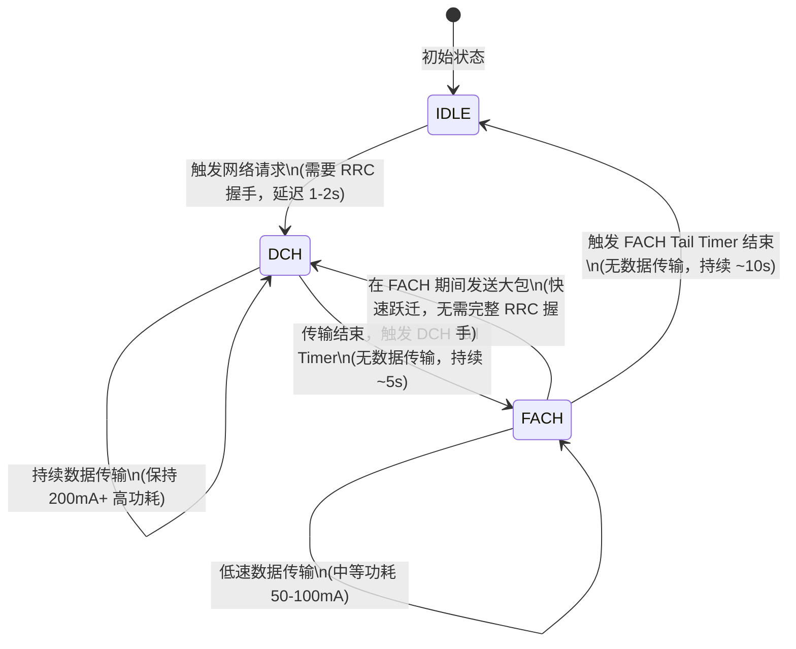
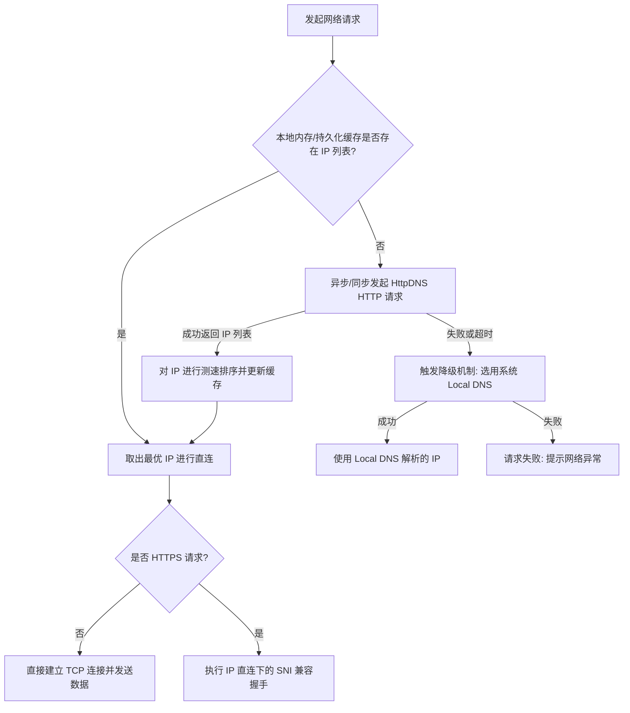

# 5.4.6.1 网络优化

移动互联网时代，网络连接的质量直接决定了应用的用户体验。对于 Android 应用而言，网络优化不仅仅是“让请求变快”，更是一项涉及无线电物理特性、网络传输协议、数据序列化效率、域名解析机制、连接复用策略以及设备功耗控制的系统性工程。

本篇文章将从底层原理出发，深度剖析 Android 网络传输的物理痛点与功耗开销，探讨网络协议的选型与调优，分析数据序列化及通道优化方案，拆解 DNS 优化与 OkHttp 连接池复用的底层源码，并最终给出弱网自适应与 APM 监控闭环的落地实践。

---

## 第一部分：Android 网络传输痛点与开销

### 1. 移动网络的物理特性与应用层冲击
与有线网络或相对稳定的固定 Wi-Fi 相比，蜂窝移动网络（如 4G/5G）的物理信道处于一个极其复杂的开放空间中。这导致了移动网络具有以下显著的物理特性，并对应用层的传输性能造成了巨大的冲击：

#### 1.1 高延迟与 RTT 剧烈抖动
蜂窝网络的无线信号需要在移动终端（UE）与基站（NodeB/eNodeB/gNodeB）之间通过电磁波传播。由于无线电波的反射、折射、散射以及障碍物阻挡，信号会经过多条路径到达接收端，这被称为**多径干扰**。
此外，随着终端的物理移动，信号强度会发生周期性或随机性的衰落（包括快衰落如瑞利衰落，以及慢衰落如阴影效应）。
为了在不稳定的无线信道中保证数据传输的正确性，物理层和数据链路层设计了复杂的混合自动重传请求（HARQ）与前向纠错（FEC）机制。当物理层检测到误码时，会在空口进行重传。这种空口重传对于应用层是不可见的，但它会导致**往返时延（RTT, Round-Trip Time）**发生剧烈的抖动，从几十毫秒骤增至数秒。
对于基于 TCP 的应用层请求，RTT 的剧烈抖动会直接破坏 TCP 的重传超时（RTO）估算算法，导致不必要的 TCP 重传，或者在真正丢包时响应过慢，使得拥塞窗口（CWND）频繁减半，严重压制了网络吞吐量。

#### 1.2 高丢包率的惩罚
在移动蜂窝网络中，丢包往往不是由于网络拥塞引起的，而是由于无线信道的突发干扰、小区切换（Handover）期间的信令交互、或者越区覆盖导致的信号脱网。
传统的 TCP 拥塞控制算法（如 NewReno, Cubic）默认将任何丢包都视为“网络拥塞”的信号。一旦发生丢包，TCP 就会大幅度减小拥塞窗口，并进入慢启动或拥塞避免阶段。在移动网络这种“非拥塞性物理丢包”频发的场景下，传统 TCP 算法会导致带宽利用率极低，应用层感知到的表现就是网络极其卡顿。

---

### 2. 移动蜂窝网络 Radio 状态机工作原理
为了在“保证网络响应速度”与“延长移动设备电池寿命”之间取得平衡，3GPP 规范为移动终端的无线信道定义了一套复杂的无线资源控制（RRC, Radio Resource Control）状态机。了解这套状态机的工作原理，是进行网络功耗优化的理论基石。

#### 2.1 三大核心状态及其功耗特征
在 3G/4G 蜂窝网络中，终端的射频调制解调器（Modem/Radio）主要在以下三种状态之间进行切换：

1. **DCH（Dedicated Channel，专用信道状态）**：
   - **功耗特征**：极高（通常在 200mA 到 400mA 之间，具体取决于发射功率和频段）。
   - **工作机制**：终端被分配了专用的物理信道资源。此时，射频芯片全力工作，支持高速率、双向的持续数据传输。
2. **FACH（Forward Access Channel，前向接入信道状态）**：
   - **功耗特征**：中等（通常为 DCH 状态的 25% 到 50%，约 50mA 到 100mA）。
   - **工作机制**：终端与基站之间没有分配专用的物理信道，而是共享一个公共的慢速信道。此时传输速率非常低，仅适用于传输极少量的控制信令或极小的数据包。
3. **IDLE（空闲状态）**：
   - **功耗特征**：极极低（通常仅为几毫安，甚至小于 1mA）。
   - **工作机制**：射频芯片的大部分模块被关闭。终端不会与基站进行任何活跃的数据交互，仅仅在特定的时间窗口被唤醒，去监听基站的寻呼信道（Paging Channel），以检查是否有呼入的电话、短信或推送数据。

#### 2.2 状态跃迁与 Tail Time（尾流时间）机制
无线电芯片在不同状态之间的转换并不是瞬间完成的，每次从低功耗状态（如 IDLE）跃迁到高功耗状态（如 DCH），都需要经历复杂的网络寻呼、身份验证、资源申请等 RRC 连接建立过程，这会带来大约 **1 秒到 2 秒的信令时延**。
为了避免因为用户频繁发起微小的网络请求而导致 Radio 在 IDLE 和 DCH 之间频繁切换（这不仅会带来巨大的延迟，还会因为频繁的 RRC 握手消耗更多电量），运营商的基站网络控制器设计了 **Tail Time（尾流时间）** 机制。

当终端完成数据传输后，Radio 不会立刻释放资源回到 IDLE 状态，而是启动一个定时器，保持当前的高功耗状态一段时间，以等待可能接踵而至的新数据。典型的跃迁过程如下：



1. **IDLE -> DCH**：当应用层发起网络请求时，Radio 从 IDLE 被唤醒，经过信令交互进入 DCH 状态，开始传输数据。
2. **DCH -> FACH**：当应用层数据发送完毕后，Radio 进入 **DCH 尾流（DCH Tail Time）** 阶段。在这段期间内（例如 5 秒），如果没有新的数据传输，定时器超时，Radio 会降级到功耗较低的 FACH 状态。
3. **FACH -> IDLE**：在 FACH 状态下，如果再次经历了一段尾流时间（例如 10 秒）且没有任何数据交互，Radio 才会彻底释放无线资源，回到最省电的 IDLE 状态。

#### 2.3 5G NR 下新增的 RRC_INACTIVE（去激活）状态
在 5G NR（New Radio）规范中，3GPP 为了解决 4G LTE 在建连延迟和功耗之间的妥协，引入了一个全新的状态：**RRC_INACTIVE（去激活状态）**。

- **状态特点**：在该状态下，终端与基站之间的射频链路虽然已经关闭，功耗几乎与 IDLE 状态相同（几个 mA 级），但**终端（UE）和基站（gNB）双方都持久保留了用户的无线上下文信息（UE Context）**（包括安全参数、密钥、临时 IP 地址等）。同时，5G 核心网依然认为该设备处于在线状态。
- **状态跃迁优势**：当有新数据需要发送时，终端无需再从零开始进行完整的 RRC 建连握手（省略了身份认证、安全密钥重协商等繁琐步骤），只需向基站发送一个简短的 `RRCConnectionResume` 消息即可。唤醒耗时从 4G LTE 时代的 **1 秒到 2 秒骤降到 10ms - 20ms** 级别。这不仅大幅提升了首包发送速度，也极大地改善了频繁小包通信下的设备整体功耗。

#### 2.4 电量尾流效应（Tail Effect）定量分析
“尾流时间”虽然降低了信连时延，但它引入了可怕的**尾流效应（Tail Effect）**。在这段尾流期间，即使没有一个字节的数据在传输，终端的射频模块依然以 DCH 或 FACH 级别的功耗在空耗电量。

我们来进行一次定量的功耗对比分析：
假设某 Android 应用为了维持与服务器的某种状态同步，或者拉取配置，设计了如下的网络请求逻辑：**每隔 15 秒发起一次网络请求，每次请求仅发送并接收 1KB 的数据**。

我们来计算在该设计下，Radio 的功耗表现：
- **请求执行阶段**：假设 1KB 的数据在 DCH 状态下传输完毕需要 **0.1 秒**。
- **DCH 尾流阶段**：传输结束后，Radio 保持在 DCH 状态等待 **5 秒**，此时没有数据传输，却在以 DCH 级别的电流（如 200mA）消耗电量。
- **FACH 尾流阶段**：DCH 尾流结束后，Radio 降级到 FACH 状态并保持 **10 秒**，此时以 FACH 级别的电流（如 50mA）消耗电量。
- **状态统计**：
  $$\text{单次请求周期} = 0.1\text{s (传输)} + 5\text{s (DCH尾流)} + 10\text{s (FACH尾流)} = 15.1\text{s}$$
  这意味着，在一个 15 秒的循环周期里，Radio 状态分布为：
  - **DCH 状态时间**：$0.1\text{s} + 5\text{s} = 5.1\text{s}$ （占比大约 34%）
  - **FACH 状态时间**：$9.9\text{s}$ （占比大约 66%）
  - **IDLE 状态时间**：$0\text{s}$ （占比 0%）

**结论**：在这个场景下，尽管每 15 秒只有极短的 0.1 秒在进行有意义的数据传输，但因为尾流效应的存在，**Radio 永远无法休眠，一直被锁定在高/中功耗状态，导致设备的电池电量在短时间内被迅速榨干**。

#### 2.5 降低功耗的优化思想
针对 Radio 状态机的工作特性，网络功耗优化应遵循“**集中传输，长久休眠**”的黄金法则：
1. **批处理合并请求（Bundle Connections）**：
   将原本零散、高频的非即时性请求（如埋点上报、日志收集、非紧急状态同步）在本地队列中累积，直到达到一定数量或时间阈值，或者等到系统被其他核心业务唤醒时，再合并成一次请求批量发送。这样可以共享同一次 RRC 跃迁的尾流时间，让 Radio 有更长的时间停留在 IDLE 状态。
2. **预加载（Pre-fetching）**：
   在用户浏览列表或执行某项操作时，预测其下一步行为（例如阅读小说的下一章、观看视频的下一个片段），提前将数据一次性全部拉取下来。这样在未来的几分钟内，用户在本地阅读/观看时，Radio 可以一直处于 IDLE 状态，避免频繁唤醒。
3. **自适应心跳机制**：
   即时通讯（IM）类应用需要定时发送心跳包以维持 TCP 长连接的活跃状态（防止 NAT 网关超时释放连接）。然而，固定周期的心跳包（如每 4 分钟一次）在弱网或网络频繁切换时，会带来极大的电量损耗。优化思想是采用**自适应心跳算法**：通过逐步延长心跳间隔来探测当前网络下 NAT 门限的最大值（例如从 4 分钟开始，依次尝试 5 分钟、6 分钟、8 分钟，直到出现连接断开，再回退到安全值）。在检测到屏幕关闭、设备静止或接入 Wi-Fi 时，动态调整心跳频率，极大减少唤醒次数。

---

## 第二部分：网络请求协议选型与调优

应用层与传输层协议的选择，直接决定了网络数据包的组织方式与传输效率。本节深入对比 HTTP/1.1、HTTP/2 和 HTTP/3 的底层设计及优化点。

### 1. HTTP/1.1 的历史局限性与痛点
虽然 HTTP/1.1 引入了 `Connection: keep-alive`，使得底层 TCP 连接在请求结束后不被立即关闭，从而避免了每次请求都进行三次握手的开销，但它在设计上面面临着难以解决的效率瓶颈：

#### 1.1 并发连接的巨大开销
在 HTTP/1.1 中，**一条 TCP 连接在同一时刻只能处理一个 HTTP 请求/响应**。如果客户端需要并发请求多个资源（如一张网页上的多张图片），必须建立多条 TCP 连接。
为了防止客户端过度消耗服务器资源以及加剧本地系统的资源占用，浏览器和 Android 的网络库（如 OkHttp）对单个域名下的最大并发连接数做出了硬性限制（在 OkHttp 中，默认的 `maxRequestsPerHost` 为 5）。
当需要加载的资源超过这个限制时，后续请求必须在队列中排队等待前面的请求结束。
此外，建立多条 TCP 连接意味着需要多次进行 TCP 三次握手和 TLS 握手，不仅增加了整体的网络延迟，还消耗了更多的内存缓冲区，且多条连接同时进行拥塞控制时会相互争抢带宽，容易在本地网关造成排队延迟。

#### 1.2 管道化（Pipelining）的夭折
为了解决上述并发问题，HTTP/1.1 曾设计了**管道化（Pipelining）**机制：允许客户端在不等待前一个请求响应返回的情况下，在同一条 TCP 连接上连续发送多个 HTTP 请求。
然而，管道化要求**服务器必须严格按照收到请求的顺序来返回响应**。如果队列中的第一个请求在服务器端处理得非常慢（例如需要执行耗时的数据库查询），那么即使后续的请求已经处理完毕，它们的响应也必须被压在服务器的缓冲区中无法发送，这被称为**应用层队头阻塞（Head-of-line blocking）**。
因为这个致命缺陷，加上许多中间代理服务器对管道化支持不佳，管道化技术在实际生产中几乎从未被广泛采用。

---

### 2. HTTP/2 的多路复用与机制演进
HTTP/2 协议通过在应用层和传输层之间引入**二进制分帧层（Binary Framing Layer）**，彻底改写了 HTTP 的传输规则。

#### 2.1 二进制分帧与多路复用
HTTP/2 将所有传输的信息分割为更小的**帧（Frame）**，例如首部帧（HEADERS Frame）和数据帧（DATA Frame）。这些帧都采用二进制编码，而非 HTTP/1.1 的纯文本格式。
在二进制分帧层中，引入了**流（Stream）**的概念。流是已建立的 TCP 连接双向传输的逻辑通道，它可以承载双向的维度消息。每个帧都携带一个唯一标识符：**Stream ID**。

```
+-------------------------------------------------------------+
|                        TCP Connection                       |
|  +--------------------+  +--------------------+  +-------+  |
|  | Stream 1 (Request) |  | Stream 3 (Request) |  |  ...  |  |
|  | [HEADERS] [DATA...]  |  | [HEADERS] [DATA...]  |  |  ...  |  |
|  +--------------------+  +--------------------+  +-------+  |
+-------------------------------------------------------------+
```

有了 Stream ID，客户端和服务器就可以把不同请求的帧交错混合在一起，通过**同一条 TCP 连接**发送出去。接收端收到这些帧后，根据 Stream ID 将它们重新组装成完整的请求或响应。
这种**多路复用（Multiplexing）**机制允许客户端在单条 TCP 连接上并发发起成百上千个请求，并且响应的返回顺序互不干扰，从而彻底消除了 HTTP/1.1 的应用层队头阻塞问题。

#### 2.2 头部压缩 HPACK 原理
在 HTTP/1.1 中，每次请求都需要携带大量的 Header 字段（如 User-Agent, Cookie, Accept-Encoding 等），这些字段通常是重复且冗余的，浪费了大量的带宽。
HTTP/2 引入了 **HPACK** 压缩算法，其核心思想是让客户端和服务器共同维护两个字典：
1. **静态字典（Static Table）**：
   预定义了 61 个最常见的 Header 字段和值的映射关系（例如 `:method: GET` 映射为索引 2，`:status: 200` 映射为索引 8）。如果请求匹配到静态字典中的内容，传输时只需要发送一个字节的索引号即可。
2. **动态字典（Dynamic Table）**：
   用于存放连接建立后，双方交互过程中新出现的自定义 Header 字段（如特定的 Token, 自定义 User-Agent 等）。动态字典会随着连接的持续而不断更新。如果某个 Header 第一次被发送，双方会将其加入动态字典，后续请求只需发送其对应的索引号。
3. **哈夫曼编码（Huffman Coding）**：
   对于字典中未命中的字段值（如具体的 URL 路径或 Cookie 值），HPACK 会使用一套专门为 HTTP 首部定制的静态哈夫曼编码表进行压缩，进一步减少传输体积。

#### 2.3 致命缺陷：TCP 层的队头阻塞（TCP HOL Blocking）
尽管 HTTP/2 在应用层解决了队头阻塞，但它将所有的“鸡蛋”都放在了“一个 TCP 连接”这一个篮子里。这导致它在不稳定的网络环境（高丢包率、弱网）下，性能可能还不如 HTTP/1.1：
- TCP 是一个**面向连接的、可靠的、字节流协议**。它必须保证数据包的绝对有序性。
- 当底层的 TCP 数据包在传输过程中丢失时，接收端的操作系统内核 TCP 缓冲区会暂停向应用层提交后续已经到达的包，直到丢失的包被发送端重传并成功接收（即滑动窗口阻塞）。
- 在 HTTP/2 中，因为所有流（Stream）都在这条唯一的 TCP 连接上运行，**一旦底层发生丢包，整条 TCP 连接都会被挂起，导致该连接上的所有 Stream 全部被阻塞**。而在 HTTP/1.1 下，如果建立了 5 条 TCP 连接，其中一条丢包，只影响该连接上的请求，其余 4 条连接依然能正常传输。

---

### 3. HTTP/3 (QUIC) 的革命性设计
为了彻底根治 TCP 层的队头阻塞，并降低连接建立延迟，基于 UDP 协议的 **HTTP/3 (QUIC, Quick UDP Internet Connections)** 应运而生。

#### 3.1 基于 UDP 协议的重新设计
传统 TCP 协议栈固化在操作系统的内核中，升级极其缓慢。为了规避这一限制，QUIC 选择在应用层（用户态）基于 **UDP** 协议实现了一套具备可靠传输、拥塞控制和多路复用的传输层协议。

#### 3.2 流级别独立的重传与流控
QUIC 同样保留了 Stream 的概念，但它在流的设计上做出了本质的改变：
- **独立的序列号空间**：在 QUIC 中，每个 Stream 都拥有自己独立的 Packet 序号以及独立的可靠性校验机制。
- 当某个 Stream 发生丢包时，QUIC 仅会对该 Stream 进行重传并阻塞该 Stream 的数据读取。**其他没有发生丢包的 Stream 依然可以并行传输和处理，不受任何影响**。
这就从传输层彻底解决了 TCP 队头阻塞的问题，在丢包率达到 10% 以上的弱网环境下，HTTP/3 的吞吐量和延迟表现远超 HTTP/2。

#### 3.3 连接迁移（Connection Migration）
传统 TCP 连接由**四元组**（源 IP、源端口、目的 IP、目的端口）唯一确定。在移动场景下，当用户走出家门，手机从 Wi-Fi 网络自动切换到 4G/5G 蜂窝网络时，手机的 IP 地址必然发生改变。这意味着原有的 TCP 连接瞬间失效，客户端必须重新与服务器进行 TCP 三次握手和 TLS 握手以重建连接，导致业务发生明显的瞬时卡顿。

QUIC 放弃了四元组作为连接标识符，而是引入了一个 **64位或128位无符号整数的 Connection ID (CID)**：
- CID 由客户端和服务器协商产生，并在整个连接的生命周期内保持不变。
- 当手机从 Wi-Fi 切换到蜂窝网络时，虽然客户端的源 IP 和源端口发生了变化，但客户端发送的 UDP 数据包中依然携带原有的 Connection ID。
- 服务器收到数据包后，根据 Connection ID 识别出这是之前的连接，并无缝更新路由表，继续传输数据。整个过程**不需要重新握手，业务层完全无感知**，实现了真正的无缝连接迁移。

#### 3.4 用户态拥塞控制与 BBR 算法原理
与 TCP 的拥塞控制机制深植于操作系统内核不同，QUIC 的拥塞控制是在用户态实现的。这意味着开发者可以在不升级操作系统内核的情况下，非常方便地热插拔和调优拥塞控制算法。

在移动弱网下，传统的**基于丢包（Loss-based）**的拥塞控制算法（如 Cubic）会遭遇毁灭性打击。因为无线物理信道因干扰而丢包是家常便饭，并非网络队列溢出引发。Cubic 一旦检测到丢包，就会将发送窗口（CWND）瞬间砍半，导致网速断崖式下跌。

HTTP/3 (QUIC) 默认推荐了谷歌的 **BBR（Bottleneck Bandwidth and Round-trip propagation time）** 算法：
- **模型驱动而非丢包驱动**：BBR 并不关注是否丢包，它通过实时交替测量两个核心物理极限指标：**最大瓶颈带宽（BtlBw）** 与 **最小往返延迟（RTprop）**，从而在本地实时构建一个网络的数学模型。
- **数学模型控制**：BBR 控制发送端发送的数据包总量恰好等于当前的 **BDP（带宽时延乘积）**：
  $$\text{BDP} = BtlBw \times RTprop$$
  这样能够让管道刚刚好被数据填满，而不会在任何路由器或基站网关的缓冲区中产生排队积压。这使得在高丢包率（如 15% 物理丢包）的恶劣蜂窝网络下，BBR 依然能维持高吞吐，保证业务请求不卡顿。

#### 3.5 0-RTT 极速建连
在传统的 TCP + TLS 1.2 握手过程中，客户端和服务器需要进行多次往返通信才能完成密钥交换并开始发送应用数据：
- TCP 握手：1 RTT
- TLS 握手：2 RTT
- **总延迟**：3 RTT

而在 HTTP/3 中，QUIC 将传输握手与加密握手（TLS 1.3）合二为一：
- **首次连接（1-RTT）**：客户端与服务器首次握手时，需要 1 个 RTT 来交换密钥材料，并在握手成功后，服务器会向客户端分发一个加密的 **Session Ticket**。
- **后续连接（0-RTT）**：当客户端再次连接该服务器时，可以将之前保存的 Session Ticket 与应用层请求数据（如 HTTP GET）打包在同一个 UDP 数据包（Client Hello）中直接发送给服务器。服务器解密验证成功后，直接返回数据。**客户端在发送数据前不需要等待服务器的任何响应，延迟为 0 RTT**。

---

## 第三部分：数据序列化与通道优化

网络传输的效率不仅取决于通过什么协议传输，还取决于传输的数据格式大小以及本地解析的效率。

### 1. Protocol Buffers (Protobuf) 编解码深度剖析
对于移动端而言，数据量的大小直接影响到弱网下的传输成功率，而解析数据的 CPU 耗时则直接影响到界面的流畅度。谷歌推出的 Protocol Buffers 是目前公认最高效的序列化方案之一。

#### 1.1 Varint 编码原理
Varint（Variable-length quantity）是一种用一个或多个字节序列化整数的方法。它的核心思想是：**数值越小，占用的字节数越少**。

对于 32 位整型，在 Java 中不论数值大小，均强制占用 4 个字节。但实际业务中，我们传输的大部分整数（如状态值、数量、年龄、布尔值）都很小。Varint 编码规则如下：
1. 每个字节的最高位（MSB, Most Significant Bit）作为**标志位**：
   - **MSB = 1**：表示后续的字节也是该数字的一部分。
   - **MSB = 0**：表示当前字节是该数字的最后一个字节。
2. 字节的低 7 位（bit 0 - bit 6）用于存放实际的数据。

##### 示例推导：编码正整数 300
我们来看看十进制数 300 是如何被 Varint 编码的：
1. 300 的二进制表示为：`0000 0001 0010 1100` （占 2 个字节）。
2. 从低位开始，每 7 位进行截取：
   - 低 7 位：`010 1100`
   - 高位剩余部分：`0000 001` -> `000 0010`
3. 按照 Varint 规则拼接：
   - 第一个字节（不是最后一个字节，MSB 设为 1）：`1` + `010 1100` = `1010 1100` (十六进制 `0xAC`)
   - 第二个字节（是最后一个字节，MSB 设为 0）：`0` + `000 0010` = `0000 0010` (十六进制 `0x02`)
4. 最终编码后的二进制数据为：`1010 1100 0000 0010`（即 `0xAC 0x02`）。原本需要 4 字节的 300，现在仅占用 **2 字节**。

#### 1.2 ZigZag 编码原理与负数处理
Varint 编码有一个巨大的死穴：**负数**。
在计算机中，负数是以补码形式表示的。例如 -1 的 32 位二进制表示为 `1111 1111 1111 1111 1111 1111 1111 1111`（高位全是 1）。
如果直接使用 Varint 编码，因为高位全是 1，Varint 会认为这是一个非常大的整数，从而必须用满 **10 个字节** 来表示它（对于 64 位表示），这比原始的 4 字节还要大得多！

为了解决这个问题，Protobuf 引入了 **ZigZag** 编码。ZigZag 的原理是**将有符号的整数映射为无符号的整数**，使得绝对值较小的负数能够映射为较小的正整数，从而可以被 Varint 高效编码。其映射规则为：

$$\text{ZigZag}(n) = \begin{cases} 2n & (n \ge 0) \\ 2|n| - 1 & (n < 0) \end{cases}$$

换句话说，0 映射为 0，-1 映射为 1，1 映射为 2，-2 映射为 3，2 映射为 4，以此类推。正数映射为偶数，负数映射为奇数。

##### 位运算实现公式推导（32位整型）：
$$\text{ZigZag}(n) = (n \ll 1) \oplus (n \gg 31)$$

> [!NOTE]
> 这里的 `>>` 是算术右移，对于负数，右移会在高位补 1。例如，对于 32 位负数，`n >> 31` 的结果是 `0xFFFFFFFF`（即 -1）；对于正数，结果是 `0x00000000`（即 0）。

##### 实例推导：负数 -1
我们用位运算公式推导 $n = -1$ 的 ZigZag 过程：
1. $n = -1$，其 32 位二进制补码为：`1111 1111 1111 1111 1111 1111 1111 1111`
2. $n \ll 1$ （左移 1 位，低位补 0）：`1111 1111 1111 1111 1111 1111 1111 1110`
3. $n \gg 31$ （算术右移 31 位，高位补 1）：`1111 1111 1111 1111 1111 1111 1111 1111`
4. 两者进行异或（$\oplus$）操作：
   `1111 1111 1111 1111 1111 1111 1111 1110`
   $\oplus$
   `1111 1111 1111 1111 1111 1111 1111 1111`
   =
   `0000 0000 0000 0000 0000 0000 0000 0001` (十进制 1)
5. 将得到的 1 再通过 Varint 编码，仅占用 **1 字节** 即可。

#### 1.3 深度对比 JSON 序列化
在移动端性能优化中，Protobuf 与 JSON 的选择不仅关系到带宽，更直接影响 CPU 和内存性能：

| 维度 | JSON | Protocol Buffers (Protobuf) |
| :--- | :--- | :--- |
| **数据格式** | 纯文本，带有大量的花括号、引号及冗余 Key | 紧凑的二进制流，没有 Key 字符串，用 Tag 代替 |
| **带宽消耗** | 较大，冗余元数据多 | 极小，通常仅为 JSON 的 20% - 40% |
| **序列化原理** | 解析字符、匹配括号、动态构建对象树 | 根据定义好的 Field Tag 和二进制偏移直接读取写入 |
| **反射损耗** | GSON/Jackson 等框架大量使用反射生成对象，耗费 CPU | 自动生成 Java 编解码类，完全避免反射，运行效率高 |
| **内存抖动** | 解析时会创建大量临时 String 对象，导致 GC 频繁触发 | 直接操作原始 byte 数组，内存分配极少，GC 压力小 |

---

### 2. 压缩算法对比：Gzip 与 Brotli
在通过网络传输文本数据（如 JSON/XML/HTML）时，开启压缩是减小传输体积最直接的方法。

#### Gzip (DEFLATE 算法)
Gzip 采用的是 DEFLATE 算法，它结合了 **LZ77**（查找并替换重复的字符串）与 **哈夫曼编码**。Gzip 的优点是通用性极强，几乎所有的 Web 服务器以及客户端网络库都默认支持。但是，Gzip 对冗余文本的压缩率存在上限。

#### Brotli
Brotli 是谷歌推出的一种专为现代网络设计的无损压缩算法：
- **静态字典技术**：Brotli 的核心亮点是其内置了一个包含超过 13000 个常用单词、HTML 标记、CSS 属性、以及通用 HTTP 响应头的**静态词典**。在压缩文本时，如果遇到这些词汇，压缩引擎只需写入指向静态字典的索引即可，无需动态构建匹配。
- **上下文建模**：Brotli 使用了二阶上下文建模技术，能更精准地预测字符出现的概率。
- **压缩率对比**：在压缩 JSON 或 HTML 文本时，Brotli 的压缩体积比 Gzip 小 **17% 到 25%**。
- **性能折中（Trade-off）**：
  Brotli 拥有 11 个压缩等级。**高等级下 Brotli 的压缩速度显著慢于 Gzip**，但其**解压速度极快且内存开销很小**。因此，Brotli 非常适用于“一次压缩、多次分发”的静态资源加载，或者服务器计算资源充足、而移动客户端急需节省流量和解压耗时的 API 接口场景。

---

### 3. HTTP 缓存与客户端二级缓存调优
减少请求最好的方法就是“不发起请求”。合理设计缓存是提升网络响应速度和节省电量的关键。

#### 3.1 HTTP 标准缓存机制
1. **强缓存**：
   - 客户端收到响应后，若包含 `Cache-Control: max-age=3600`，说明该缓存在 3600 秒内有效。在此期间，客户端再次请求该资源时，直接从本地缓存读取，不与服务器发生任何网络交互，返回 `200 OK (from disk cache)`。
2. **协商缓存**：
   - 当强缓存过期后，客户端需要向服务器验证本地缓存是否依然有效。
   - 客户端在请求头中携带 `If-None-Match`（对应上一次响应的 `ETag` 唯一哈希值）或 `If-Modified-Since`（对应上一次响应的 `Last-Modified` 时间）。
   - 如果服务器发现资源并未发生修改，则返回 **`304 Not Modified`**，且不携带 Response Body，客户端继续使用本地缓存。若发生修改，则返回 `200 OK` 及最新数据。

#### 3.2 客户端基于 OkHttp Interceptor 的自定义二级缓存
在 Android 开发中，某些老旧的后台接口并未遵循 HTTP 缓存规范（例如没有下发 `Cache-Control` 头）。此时，我们可以通过 OkHttp 的**拦截器（Interceptor）**在客户端强行修改缓存行为，并将缓存持久化到本地的 `DiskLruCache` 中。

以下是一个完整的自定义缓存拦截器实现，支持在有网时缓存数据，在无网时强制读取本地缓存的“离线模式”：

```kotlin
import okhttp3.CacheControl
import okhttp3.Interceptor
import okhttp3.Response
import java.io.IOException
import java.util.concurrent.TimeUnit

class CacheControlInterceptor(private val networkAvailable: () -> Boolean) : Interceptor {

    @Throws(IOException::class)
    override fun intercept(chain: Interceptor.Chain): Response {
        var request = chain.request()

        // 1. 离线策略：若当前无网络，强制读取本地缓存（即使缓存已过期）
        if (!networkAvailable()) {
            request = request.newBuilder()
                .cacheControl(
                    CacheControl.Builder()
                        .onlyIfCached() // 仅读取缓存，不发起网络请求
                        .maxStale(30, TimeUnit.DAYS) // 允许读取过期 30 天内的缓存
                        .build()
                )
                .build()
        }

        val response = chain.proceed(request)

        // 2. 在线策略：如果服务器没有返回 Cache-Control，我们手动在拦截器中为响应添加缓存头
        if (networkAvailable()) {
            val maxAge = 60 // 在线时，缓存有效时间设为 60 秒
            return response.newBuilder()
                .removeHeader("Pragma") // 移除干扰缓存的旧协议头
                .removeHeader("Cache-Control")
                .header("Cache-Control", "public, max-age=$maxAge")
                .build()
        } else {
            // 离线状态下，修改响应头以允许使用过期的缓存
            val maxStale = 24 * 60 * 60 * 30 // 30天
            return response.newBuilder()
                .removeHeader("Pragma")
                .removeHeader("Cache-Control")
                .header("Cache-Control", "public, only-if-cached, max-stale=$maxStale")
                .build()
        }
    }
}
```

---

## 第四部分：DNS 优化与连接复用机制

域名解析（DNS）是网络请求的第一步，这一步如果慢了，后续所有的高速通道都将无从谈起。

### 1. Local DNS 的痛点与灾难
在默认情况下，Android 系统通过运营商分配的 Local DNS 进行域名解析。然而，在移动网络下，Local DNS 存在三大严重痛点：
1. **域名劫持**：
   部分劣质的省网运营商为了谋取利益，会劫持 DNS 解析请求，将你的 API 域名解析到带有广告的网页、钓鱼网站，或者竞争对手的服务器上。
2. **解析延迟高**：
   在移动蜂窝网络下，Local DNS 的解析需要经过移动网关，逐级向上发起递归查询。在网络信号较差时，一次简单的 DNS 查询延迟可能高达 **500ms 到 3s**，这在极速体验中是无法接受的。
3. **跨网解析与缓存失效**：
   - **跨网解析**：当用户切换网络时，Local DNS 分配可能滞后，导致电信的用户被解析到了联通的 CDN 节点，数据传输绕了半个中国，速度大打折扣。
   - **TTL 缓存失效**：许多运营商为了降低自己的 DNS 服务器压力，会强行忽略域名配置的 TTL（生存时间），缓存过期时间被强制延长至数天，导致后端服务器 IP 变更时，客户端迟迟无法获取最新 IP。

---

### 2. HttpDNS 机制的引入与设计
为了解决 Local DNS 的乱象，**HttpDNS** 技术应运而生。其核心思想是：**绕过运营商的 DNS 解析通道，直接通过安全的 HTTP/HTTPS 协议向高可用的第三方 DNS 解析集群发起域名查询请求。**

#### 2.1 HttpDNS 核心流程与降级机制
1. **异步解析**：在应用启动或需要发起网络请求时，后台线程异步请求 HttpDNS 接口，获取域名对应的 IP 列表，并缓存在内存中，避免在主线程或网络请求发起时发生同步阻塞。
2. **IP 测速排序**：HttpDNS 服务器通常会返回多个候选 IP。客户端在本地对这些 IP 进行并发 Ping 探测，或尝试 TCP 握手建连，根据建连耗时对 IP 列表进行优胜劣汰的动态排序，优先使用响应最快的 IP。
3. **高可用降级**：如果 HttpDNS 服务器因网络问题请求失败、或者解析超时，客户端必须能够立刻无缝降级到系统原生的 Local DNS 解析（使用 `InetAddress.getAllByName()`），确保业务不被中断。

以下是 HttpDNS 的解析、缓存与 IP 直连的完整控制流程图：



---

### 3. IP 直连下的 SNI 握手失败兼容解决方案
在实施 HttpDNS 方案时，最棘手的问题出现在 **HTTPS 协议的 IP 直连** 场景中。

#### 3.1 SNI 握手失败的根源
SNI（Server Name Indication）是 TLS 协议的扩展。在 HTTPS 请求中，一台物理服务器的单个 IP 地址可能同时托管了多个不同域名（虚拟主机）的 SSL 证书。
为了让服务器知道该返回哪一个域名的证书，客户端必须在 TLS 握手的第一步（Client Hello）中，通过 SNI 字段明确告诉服务器它要访问的**域名**。

如果在 HttpDNS 方案中，我们简单地把请求的 URL 从 `https://example.com/api` 替换成 `https://192.168.1.1/api`，就会发生以下灾难：
1. 客户端建立 Socket 连接的目标 IP 是 `192.168.1.1`。
2. 在发起 TLS 握手时，客户端的 SSL 引擎会将 URL 中的 Host（此时已经是 IP `192.168.1.1`）作为 SNI 字段写入 Client Hello。
3. 服务器收到请求后，看到 SNI 字段是 IP 地址，无法识别出具体的域名，因此无法匹配到正确的 SSL 证书。服务器只能随机返回一个默认的证书，或者直接拒绝连接。
4. 客户端校验服务器返回的证书时，发现证书上的域名（`*.example.com`）与请求的主机名（IP `192.168.1.1`）不匹配，抛出 **`SSLPeerUnverifiedException`** 异常，导致 TLS 握手失败。

#### 3.2 方案一（最优雅方案）：自定义 OkHttp 的 `Dns` 接口
在 OkHttp 中，最完美且无侵入的解决方案是直接实现 OkHttp 的 `Dns` 接口。**这种方案不需要修改任何业务请求的 URL。**

```kotlin
import okhttp3.Dns
import java.net.InetAddress
import java.net.UnknownHostException

class OkHttpHttpDns : Dns {
    @Throws(UnknownHostException::class)
    override fun lookup(hostname: String): List<InetAddress> {
        // 1. 调用 HttpDNS 服务获取域名的 IP 列表
        val ipList = HttpDnsProvider.getIpsByHost(hostname)
        
        if (!ipList.isNullOrEmpty()) {
            val inetAddresses = ArrayList<InetAddress>()
            for (ip in ipList) {
                // 将 IP 字符串包装为 InetAddress，这样 OkHttp 内部在建立 Socket 时会直接使用该 IP
                inetAddresses.add(InetAddress.getByName(ip))
            }
            return inetAddresses
        }
        
        // 2. 如果 HttpDNS 未命中或失败，自动降级回系统的 Local DNS
        return Dns.SYSTEM.lookup(hostname)
    }
}

// 使用方式：
// val okHttpClient = OkHttpClient.Builder()
//     .dns(OkHttpHttpDns())
//     .build()
```
##### 为什么此方案没有 SNI 问题？
因为我们没有修改 URL（URL 依然是 `https://example.com/api`），OkHttp 内部创建 SSL 套接字以及执行 TLS 握手时，获取到的 Host 依然是域名的字面量 `example.com`。
OkHttp 只是在需要将域名解析为 IP 以建立底层 TCP 连接时，调用了我们自定义的 `dns.lookup()`。因此，底层的 TCP Socket 连接到了 HttpDNS 解析出来的 IP，而 TLS 握手中的 SNI 字段依然是正确的 `example.com`。

#### 3.3 方案二（硬替换 URL 场景）：自定义 `SSLSocketFactory` 与 `HostnameVerifier`
如果你使用的网络框架不支持直接重写 DNS 解析接口，而必须采用手动将 URL 替换为 IP 的方式，你就必须通过反射或者特定平台 API 来定制 TLS 的握手过程。

在 Android 平台上，底层的 SSL 实现通常基于 **Conscrypt** 引擎。我们需要在自定义的 `SSLSocketFactory` 中，对于通过 IP 创建的 Socket，强行通过反射重写其内部关联的 `peerHost`（目标主机名），以确保 SNI 扩展的正确性。

以下是该方案的兼容反射实现伪代码和逻辑分析：

```java
import java.io.IOException;
import java.net.InetAddress;
import java.net.Socket;
import java.net.UnknownHostException;
import java.lang.reflect.Method;
import javax.net.ssl.SSLSocket;
import javax.net.ssl.SSLSocketFactory;

public class SniCompatSslSocketFactory extends SSLSocketFactory {
    private final SSLSocketFactory delegate;
    private final String originalHostname;

    public SniCompatSslSocketFactory(SSLSocketFactory delegate, String originalHostname) {
        this.delegate = delegate;
        this.originalHostname = originalHostname;
    }

    @Override
    public String[] getDefaultCipherSuites() {
        return delegate.getDefaultCipherSuites();
    }

    @Override
    public String[] getSupportedCipherSuites() {
        return delegate.getSupportedCipherSuites();
    }

    @Override
    public Socket createSocket(Socket socket, String host, int port, boolean autoClose) throws IOException {
        // 在 IP 直连场景下，这里的 host 参数已经是解析后的 IP 地址
        // 我们需要创建底层的 SSLSocket
        Socket sslSocket = delegate.createSocket(socket, originalHostname, port, autoClose);
        
        if (sslSocket instanceof SSLSocket) {
            SSLSocket s = (SSLSocket) sslSocket;
            try {
                // 针对 Android 平台底层的 Conscrypt 引擎，通过反射调用 setHostname 方法
                // 这会强制重写 Client Hello 中的 SNI 扩展为我们原始的域名（如 example.com）
                Method setHostnameMethod = s.getClass().getMethod("setHostname", String.class);
                setHostnameMethod.invoke(s, originalHostname);
            } catch (Exception e) {
                // 兼容非 Conscrypt 的其他 SSL 实现（如普通 JVM 的 JSSE）
                try {
                    // 尝试通过反射设置 SSLParameters 的 serverNames 属性（Java 8+ 标准 API）
                    javax.net.ssl.SSLParameters sslParameters = s.getSSLParameters();
                    // 这里由于涉及 SNIHostName 类，可以使用反射动态构造
                    Class<?> sniHostNameClass = Class.forName("javax.net.ssl.SNIHostName");
                    java.lang.reflect.Constructor<?> constructor = sniHostNameClass.getConstructor(String.class);
                    Object sniHostName = constructor.newInstance(originalHostname);
                    
                    java.util.List<Object> serverNames = new java.util.ArrayList<>();
                    serverNames.add(sniHostName);
                    
                    Method setServerNamesMethod = sslParameters.getClass().getMethod("setServerNames", java.util.List.class);
                    setServerNamesMethod.invoke(sslParameters, serverNames);
                    s.setSSLParameters(sslParameters);
                } catch (Exception ex) {
                    // 反射失败时的降级日志处理
                }
            }
        }
        return sslSocket;
    }

    // 实现其余的 createSocket 重载方法...
    @Override
    public Socket createSocket(String host, int port) throws IOException, UnknownHostException { return null; }
    @Override
    public Socket createSocket(String host, int port, InetAddress localHost, int localPort) throws IOException, UnknownHostException { return null; }
    @Override
    public Socket createSocket(InetAddress host, int port) throws IOException { return null; }
    @Override
    public Socket createSocket(InetAddress address, int port, InetAddress localAddress, int localPort) throws IOException { return null; }
}
```

##### 配合自定义 `HostnameVerifier`
仅仅修复 SNI 还不够，当 TLS 握手完成后，系统会默认调用 `HostnameVerifier` 来检查你当前请求 of Host 是否与证书中的域名一致。
因为你的请求 URL 已经被替换为了 IP，系统默认的验证器会去校验这个 IP 是否存在于证书中，这必然失败。因此我们必须手动重写校验逻辑：

```kotlin
import javax.net.ssl.HostnameVerifier
import javax.net.ssl.HttpsURLConnection
import javax.net.ssl.SSLSession

class SniCompatHostnameVerifier(private val originalHostname: String) : HostnameVerifier {
    override fun verify(hostname: String?, session: SSLSession?): Boolean {
        // 忽略传入的 IP（hostname 此时是 IP 字符串）
        // 强制使用原始域名 originalHostname 与服务器证书中的域名进行校对
        return HttpsURLConnection.getDefaultHostnameVerifier().verify(originalHostname, session)
    }
}
```
**安全警告**：切记千万不能在 `verify` 方法中直接返回 `true`！这会彻底关闭 HTTPS 的安全验证，使得应用面临极易被中间人攻击（MITM）的灾难性安全隐患。

---

### 4. OkHttp ConnectionPool 底层源码深度剖析
保持 TCP 连接的复用，是降低网络时延、节省设备电量最有效的方式。OkHttp 内部通过 `ConnectionPool` 实现了自动维护长连接的生命周期。我们来深入剖析其底层源码实现。

#### 4.1 核心数据结构
在 OkHttp 的连接池中，所有的物理连接都存放在 `RealConnectionPool` 中，其内部的数据结构是一个双端队列：

```java
// RealConnectionPool.java 源码片段
private final Deque<RealConnection> connections = new ArrayDeque<>();
```
每个 `RealConnection` 代表一条底层的 TCP/TLS 链路，它持有了物理 Socket 引用。

#### 4.2 垃圾清理的守护线程：标记-清除算法的变体
在没有活跃请求时，长连接不能无限制地一直保持开放，否则会耗尽服务器的连接表资源，且本地 Socket 的维护也会带来 CPU 唤醒功耗。
OkHttp 在后台启动了一个清理线程，通过一个基于**引用计数**与**标记-清除（Mark and Sweep）**思想的守护任务 `cleanupRunnable`，定期对队列中的连接进行扫描与回收。

我们来看核心的清理逻辑实现细节：

```java
// 核心逻辑的中文逻辑还原及伪代码
long cleanup(long now) {
    int inUseConnectionCount = 0;
    int idleConnectionCount = 0;
    RealConnection longestIdleConnection = null;
    long longestIdleDurationNs = Long.MIN_VALUE;

    synchronized (this) {
        // 遍历所有连接进行“标记”与“计算”
        for (RealConnection connection : connections) {
            // 1. 检查当前连接上的活跃调用数
            int references = pruneAndGetTransmittersReferenceCount(connection, now);
            
            if (references > 0) {
                // 说明该连接当前正有活跃的请求在使用
                inUseConnectionCount++;
                continue;
            }

            // 说明该连接当前是“闲置”状态
            idleConnectionCount++;

            // 2. 寻找闲置时间最长的连接
            long idleDurationNs = now - connection.idleAtNanos;
            if (idleDurationNs > longestIdleDurationNs) {
                longestIdleDurationNs = idleDurationNs;
                longestIdleConnection = connection;
            }
        }

        // 3. 判断是否需要执行“清除”
        if (longestIdleDurationNs >= this.keepAliveDurationNs
            || idleConnectionCount > this.maxIdleConnections) {
            // 闲置最长的连接已经超过了最大存活期限，或者闲置连接数超过了设定的最大阀值
            // 从队列中移除该连接，准备进行物理关闭
            connections.remove(longestIdleConnection);
        } else if (idleConnectionCount > 0) {
            // 池中有闲置连接，但尚未达到清理的时限
            // 返回下一次需要唤醒并检测的时间差值
            return this.keepAliveDurationNs - longestIdleDurationNs;
        } else if (inUseConnectionCount > 0) {
            // 所有连接都在使用中，不需要清理
            // 返回一个长存活时间，等待连接变为空闲时再次触发清理
            return this.keepAliveDurationNs;
        } else {
            // 池为空，清理线程退出
            cleanupRunning = false;
            return -1;
        }
    }

    // 4. 在同步锁外物理关闭 Socket，防止锁粒度过大导致网络主线程阻塞
    closeQuietly(longestIdleConnection.socket());
    return 0; // 立即再次触发下一次清理检测
}
```

##### 活跃引用计数原理：`pruneAndGetTransmittersReferenceCount`
OkHttp 如何精确判断一条连接在当前时刻有没有被请求使用？
它利用了**弱引用列表**。在 `RealConnection` 中，维护了一个弱引用列表：

```java
// RealConnection 内部的 Calls 弱引用列表
public final List<Reference<RealCall>> calls = new ArrayList<>();
```
当一个网络请求 `RealCall` 开始占用该连接时，会在该列表中添加一个 `RealCall` 的弱引用（在旧版本中是 `Transmitter` 弱引用）。
当请求结束时，对应的引用会被从列表中移除。

以下是 `pruneAndGetTransmittersReferenceCount` 的源码逻辑拆解：
1. 清理线程通过遍历该列表中的 `WeakReference`：
2. 如果弱引用的 `get()` 方法返回了 `null`，这说明持有该物理连接的 `RealCall` 已经被 GC 回收了，但没有主动调用 close。这判定为一次**泄漏的连接（Leaked Connection）**。
3. 清理线程会把这个失效的弱引用从列表中移除，并打印警告。
4. **如果遍历结束后，弱引用列表的数量为 0，就意味着当前没有活跃的请求引用此连接，该连接被标记为 Idle（闲置状态）。**

```java
// pruneAndGetTransmittersReferenceCount 逻辑演示
private int pruneAndGetTransmittersReferenceCount(RealConnection connection, long now) {
    List<Reference<RealCall>> references = connection.calls;
    for (int i = 0; i < references.size(); ) {
        Reference<RealCall> reference = references.get(i);

        if (reference.get() != null) {
            i++;
            continue;
        }

        // 判定泄漏，移除已失效的弱引用
        references.remove(i);
        connection.noNewExchanges = true; // 标记此连接不能再被承载新请求

        // 若列表为空，说明连接已无活跃引用，标记闲置起始纳秒
        if (references.isEmpty()) {
            connection.idleAtNanos = now - keepAliveDurationNs;
            return 0;
        }
    }
    return references.size();
}
```

#### 4.3 清理守护线程的执行与休眠计算
清理线程是一个单线程的 Executor，它在有连接创建时被激活：
1. 每次有新的连接被放进 `ConnectionPool` 时，或者有连接变为 Idle 状态时，如果发现清理线程不在运行，就会被唤醒。
2. 清理方法 `cleanup()` 返回的 `long` 型数值代表了下一次需要执行清理的时间差：
   - 若返回正数 $T$，清理线程将调用 `wait(T)` 进入休眠，并在 $T$ 毫秒后被自动唤醒执行下一次清理。
   - 若返回 $-1$，说明当前池中没有任何连接了，清理线程彻底停止运行，直到下一次有新连接创建时被再次触发。

#### 4.4 Keep-Alive 调优策略
在移动端复杂的弱网或断网场景下，默认的连接池配置（默认最大空闲连接数 `maxIdleConnections = 5`，最大闲置时间 `keepAliveDuration = 5分钟`）可能并不适用：
- **弱网环境**：网络抖动大，重新建连的延迟非常高。可以考虑适当调大 `maxIdleConnections`（如 8 或 10），并在非后台状态下适度延长 `keepAliveDuration`，以最大化复用已建立的物理长连接。
- **后台省电模式**：如果应用进入后台，应主动调用 `ConnectionPool.evictAll()` 强制清空连接池，物理关闭所有的长连接 Socket。这不仅能释放服务器连接，更能避免 Radio 射频模块被后台偶发的无效保活连接唤醒，极大地延长设备的待机时间。

---

## 第五部分：弱网与监控闭环

### 1. 弱网自适应质量调度策略
当应用检测到当前处于弱网环境时，应当启动主动的防御性策略，确保核心业务的可用性。

#### 1.1 请求裁剪与媒体降级
- **图片加载框架联动**：在检测到弱网（POOR）状态下，自动将图片请求拦截，将其后缀改为低分辨率格式，或者强制使用 WebP 甚至高效的 HEIF 格式。对于非核心的静态装饰图，可以直接放弃加载。
- **音视频自适应码率**：将播放器的拉流协议切换至自适应码率（ABR）模式，从 1080P 自动降级至 540P 或 360P。

#### 1.2 业务分级与预加载挂起
- 暂停一切非急需的后台预加载任务（如静默下载离线包、静默加载下一页广告）。
- 将埋点上报、应用运行日志上报等辅助网络流量挂起，直到网络状态恢复为 GOOD 时再批量发送。

#### 1.3 指数退避重试（Exponential Backoff）
在网络严重受限或服务器故障时，如果立即高频进行重试，不仅会白白消耗电量，还会因为拥塞导致网络更加恶化。应当使用**指数退避重试算法**：

$$T_{\text{wait}} = \min(T_{\text{max}}, T_{\text{base}} \times 2^{\text{attempt}})$$

在重试间隔中引入一定的随机抖动（Jitter），避免大量客户端在同一时刻并发重试，导致后端服务器发生“雪崩效应”。

---

### 2. 网络质量梯度检测度量
为了实施自适应调度，客户端必须能够在运行期准确度量当前的“网络质量梯度”。

#### 2.1 度量指标的数学模型与滤波
不能单纯依靠系统提供的网络类型（如 4G, 5G, Wi-Fi）来判定网速，因为连接着 Wi-Fi 但网速极慢的“假 Wi-Fi”现象十分普遍。我们必须基于应用层真实的请求耗时来进行度量。
1. **度量指标**：
   - **RTT（往返时间）**：通过统计 TCP 建连时间或 HTTP 发送至接收首字节的时间（TTFB）。
   - **吞吐量（Throughput）**：在一段时间内传输的字节数除以耗时。
2. **数据降噪（滑动加权中位数算法）**：
   由于网络请求中存在突发的异常极大值（如因为某次偶发丢包导致 RTT 暴增至 5s），如果直接计算平均值，会导致评估结果严重失真。
   通常采用**滑动窗口算法**，保留最近 $N$ 次（如 10 次）成功请求的耗时数据，去除最大和最小值后，计算中位数，或者采用滑动指数加权平均值（EWMA）：

   $$RTT_{\text{smooth}} = (1 - \alpha) \times RTT_{\text{smooth}} + \alpha \times RTT_{\text{new}}$$

   其中 $\alpha$（如 0.2）为权重系数，使得越新的网络表现对当前评估的影响越大。

#### 2.2 状态划分与广播
根据计算出的 $RTT_{\text{smooth}}$ 将网络质量划分为 5 个梯度：

```
EXCELLENT (RTT < 150ms)  --> 极佳网络，可全力预加载与高清展示
GOOD      (RTT < 300ms)  --> 良好网络，常规展示与正常预加载
MODERATE  (RTT < 600ms)  --> 普通网络，限制高清资源，暂停非必要预加载
POOR      (RTT >= 600ms) --> 严重弱网，启动重试退避，强行降级为文本及低清模式
UNKNOWN   (无数据)       --> 未知状态，采用保守策略
```
每次状态发生跃迁时，通过本地广播（LocalBroadcastManager）或 Flow/LiveData 向业务侧分发状态变化，使各模块能够做出实时调整。

---

### 3. APM 网络监控闭环：OkHttp EventListener 实践
要评估网络优化的效果，建立全链路的 APM（Application Performance Monitoring）监控机制是必不可少的。

OkHttp 提供了极其强大的 `EventListener` 接口，它为网络请求的每一个关键节点都预留了回调。通过实现该接口，我们可以对每个请求进行无侵入的“精密计时”，抓取全链路耗时。

以下是一个完整的自定义 `EventListener` 监控模块的 Kotlin 实现：

```kotlin
import okhttp3.*
import java.io.IOException
import java.net.InetAddress
import java.net.Proxy
import java.util.concurrent.ConcurrentHashMap
import java.util.concurrent.atomic.AtomicLong

class NetworkMonitorListener : EventListener() {

    // 记录每个阶段的开始时间戳
    private val timeMap = ConcurrentHashMap<String, Long>()
    private val requestId = AtomicLong(0)

    private fun recordTime(phase: String) {
        timeMap[phase] = System.nanoTime()
    }

    private fun getDurationMs(startPhase: String, endPhase: String): Long {
        val start = timeMap[startPhase] ?: return -1
        val end = timeMap[endPhase] ?: return -1
        return (end - start) / 1_000_000 // 转换为毫秒
    }

    override fun callStart(call: Call) {
        requestId.incrementAndGet()
        recordTime("callStart")
    }

    override fun dnsStart(call: Call, domainName: String) {
        recordTime("dnsStart")
    }

    override fun dnsEnd(call: Call, domainName: String, inetAddressList: List<InetAddress>) {
        recordTime("dnsEnd")
    }

    override fun connectStart(call: Call, inetSocketAddress: java.net.InetSocketAddress, proxy: Proxy) {
        recordTime("connectStart")
    }

    override fun secureConnectStart(call: Call) {
        recordTime("secureConnectStart")
    }

    override fun secureConnectEnd(call: Call, handshake: Handshake?) {
        recordTime("secureConnectEnd")
    }

    override fun connectEnd(
        call: Call,
        inetSocketAddress: java.net.InetSocketAddress,
        proxy: Proxy,
        protocol: Protocol?
    ) {
        recordTime("connectEnd")
    }

    override fun requestHeadersStart(call: Call) {
        recordTime("requestHeadersStart")
    }

    override fun requestHeadersEnd(call: Call, request: Request) {
        recordTime("requestHeadersEnd")
    }

    override fun requestBodyStart(call: Call) {
        recordTime("requestBodyStart")
    }

    override fun requestBodyEnd(call: Call, byteCount: Long) {
        recordTime("requestBodyEnd")
    }

    override fun responseHeadersStart(call: Call) {
        recordTime("responseHeadersStart")
    }

    override fun responseHeadersEnd(call: Call, response: Response) {
        recordTime("responseHeadersEnd")
    }

    override fun responseBodyStart(call: Call) {
        recordTime("responseBodyStart")
    }

    override fun responseBodyEnd(call: Call, byteCount: Long) {
        recordTime("responseBodyEnd")
    }

    override fun callEnd(call: Call) {
        recordTime("callEnd")
        reportMetrics(call, null)
    }

    override fun callFailed(call: Call, ioe: IOException) {
        recordTime("callEnd")
        reportMetrics(call, ioe)
    }

    /**
     * 计算并输出/上报该次请求的全链路指标数据
     */
    private fun reportMetrics(call: Call, exception: IOException?) {
        val totalTime = getDurationMs("callStart", "callEnd")
        val dnsTime = getDurationMs("dnsStart", "dnsEnd")
        val tcpConnectTime = getDurationMs("connectStart", "connectEnd")
        val tlsHandshakeTime = getDurationMs("secureConnectStart", "secureConnectEnd")
        val rttTime = getDurationMs("requestHeadersEnd", "responseHeadersStart") // 近似首包时间 (TTFB)
        
        val url = call.request().url.toString()
        val isSuccessful = exception == null

        // 打印详细的监控日志，实际生产中可将其打包上传至 APM 后台
        val logBuilder = StringBuilder()
            .append("APM Network Log [Request ID: ${requestId.get()}] \n")
            .append("-> URL: $url \n")
            .append("-> Success: $isSuccessful \n")
            .append("-> Total Duration: ${totalTime}ms \n")
            .append("-> DNS Resolve Time: ${if (dnsTime != -1L) "${dnsTime}ms" else "Cached/Direct"} \n")
            .append("-> TCP Connect Time: ${if (tcpConnectTime != -1L) "${tcpConnectTime}ms" else "Reused Link"} \n")
            .append("-> TLS Handshake Time: ${if (tlsHandshakeTime != -1L) "${tlsHandshakeTime}ms" else "No TLS/Reused"} \n")
            .append("-> TTFB (Server RTT): ${rttTime}ms")

        if (exception != null) {
            logBuilder.append("\n-> Exception: ${exception.javaClass.simpleName} - ${exception.message}")
        }

        println(logBuilder.toString())
    }

    // 工厂类，用于 OkHttpClient 注册
    class Factory : EventListener.Factory {
        override fun create(call: Call): EventListener {
            return NetworkMonitorListener()
        }
    }
}
```

通过这一层面的全链路无侵入监控，团队可以轻松搜集到海量用户的真实网络数据，从而能够快速发现“某省移动网用户在 TLS 阶段耗时普遍偏高”、“某版本 API 解析导致大面积超时”等线上顽疾，为持续的技术改造提供坚实的数据支撑，最终完成性能优化的闭环管理。
