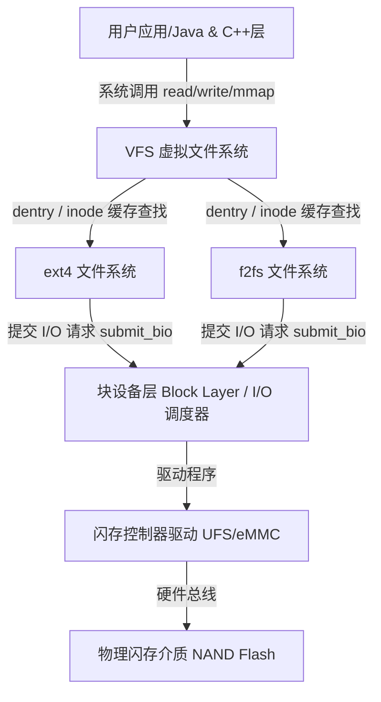
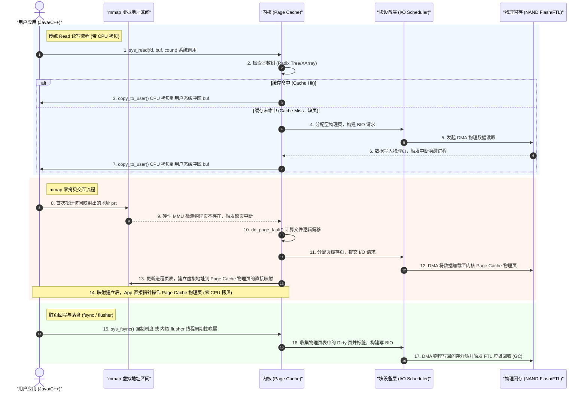

# Android I/O 性能优化与底层内核深度剖析

在 Android 移动端性能优化中，I/O（输入/输出）优化是极具挑战性且与底层系统机理结合最为紧密的方向之一。I/O 性能不仅直接决定了应用的冷热启动速度、数据加载响应时间，更与系统的流畅度（卡顿、ANR）、功耗和闪存寿命（Wear Leveling）息息相关。

由于移动端设备普遍采用 NAND Flash 闪存作为存储介质，其物理特性与传统的机械硬盘（HDD）有着本质的区别，甚至与 PC 端的固态硬盘（SSD）相比也有独特的功耗与通道限制。如果在开发过程中对操作系统的 I/O 机制、缓存机制以及文件系统的底层原理缺乏深刻认识，就极易在主线程中埋下隐患，导致严重的性能卡点。

本文将从 Linux/Android 底层内核存储机制出发，层层向上剖析主线程 I/O 阻塞的诊断方法，深入拆解 mmap 零拷贝机制的底层原理，分析 Java/C++ 层面的读写细节调优，并最终结合 SQLite/DB 的高并发实践，提供一整套系统化、可独立阅读的 Android I/O 性能优化深度技术正文。

---

## 第一部分：Linux/Android I/O 体系与底层存储机制

Linux 的 I/O 体系是一个高度分层、结构严密的复杂系统。在 Android 平台上，虽然运行的是基于移动端闪存优化过的具体文件系统（如 ext4 或 f2fs），但其底层的 I/O 框架依然完全遵循 Linux 内核的标准设计。

### 1. VFS（虚拟文件系统）架构与分层设计

Linux 内核为了屏蔽底层各种物理存储介质（如 UFS/eMMC 闪存、SD 卡、RAM）以及不同文件系统（如 ext4, f2fs, vfat, sysfs, procfs）的差异，在用户空间与物理存储层之间引入了 **VFS（Virtual File System，虚拟文件系统）** 抽象层。



VFS 对上层暴露了统一的 POSIX API（如 `open`, `read`, `write`, `close`, `lseek`, `mmap` 等系统调用），而对下层则定义了一组抽象的接口规范。任何具体文件系统只需要实现这套规范中的函数指针，就可以无缝接入内核。VFS 的核心由以下四大关键数据结构维系：

1. **`struct super_block`（超级块）**：代表一个已挂载的具体文件系统的整体元数据，例如文件系统的大小、块大小、挂载状态等。它包含了指向该文件系统操作方法 `super_operations` 的指针。
2. **`struct inode`（索引节点）**：代表文件系统中的一个具体“物理文件”实体。每个文件在磁盘上都有一个唯一的 inode，记录了文件的元数据信息，如文件大小、创建/修改时间、读写权限、属主，以及最重要的——指向文件数据块在物理磁盘上具体位置的指针或映射关系（extents）。值得注意的是，inode 中**不包含文件名**，文件名和目录关系由 dentry 维护。
3. **`struct dentry`（目录项）**：代表文件系统路径中的一个节点（可以是目录，也可以是文件）。它用于将文件名与对应的 inode 关联起来。例如，路径 `/data/data/com.pkg/files/test.txt` 在查找时，VFS 会将其拆分为五个 dentry 对象（`\`, `data`, `data`, `com.pkg`, `files`, `test.txt`），逐级查找。为了避免高昂的磁盘路径解析开销，内核维护了 **dcache（Directory Entry Cache）**，将解析过的路径名与 inode 缓存于内存中。
4. **`struct file`（文件描述符的内核态具现）**：代表一个进程打开的“文件上下文”。每当进程调用 `open()`，内核就会在进程的打开文件描述符表（fd table）中分配一个 fd，并在内核中创建对应的 `struct file`。它包含了文件的打开模式（只读、只写等）、当前的读写指针偏移量（f_pos）、指向对应 dentry 的指针以及文件操作方法 `file_operations`。

当用户应用发起 `read()` 系统调用时，VFS 的处理逻辑如下：
* 首先，内核在进程的 fd table 中定位到相应的 `struct file`。
* 然后，通过 `struct file` 指向的 `dentry` 找到对应的 `inode`。
* 接着，检查 `inode` 关联的缓存信息。如果需要进行物理读取，则调用当前文件系统特有的 `file_operations` 中的 `read` 方法（例如 `ext4_file_read_iter` 或 `f2fs_file_read_iter`），向下传递请求。

#### Ext4 与 F2FS 文件系统的设计哲学差异

在 Android 设备上，主要存在两种主流的具体物理文件系统：**Ext4** 与 **F2FS**。它们的设计哲学和底层机理存在显著区别，直接影响了 I/O 写入时的底层开销。

| 维度 | Ext4 文件系统 | F2FS 文件系统 (Flash-Friendly File System) |
| :--- | :--- | :--- |
| **核心设计哲学** | 基于传统磁头寻道的磁盘设计的“原地更新 (Write-In-Place)”文件系统。修改数据时，直接覆盖物理块上的旧数据。 | 专为 NAND 闪存设计的“日志结构 (Log-Structured / Write-Out-Of-Place)”文件系统。所有修改都以追加写入的方式写入新的空闲块中。 |
| **元数据更新机制** | 通过 Journal 机制（日志）保障一致性。每次写入文件都需要在 Journal 区 and Data 区分别写入，产生额外的随机写入开销。 | 采用双检查点（Double Checkpoints）机制。通过元数据追加与滚动回滚，将随机元数据更新转换为顺序写入。 |
| **小文件随机写性能** | 表现一般。由于原地更新会导致大量碎片和小块的随机寻址写入，在闪存介质上性能容易退化。 | 极佳。通过 6 个不同的活跃 Segment 收集不同冷热程度的数据，最大程度地将随机小写入在内存中聚合成顺序写入提交。 |
| **垃圾回收 (GC) 开销** | 无。由于是原地覆盖，由底层闪存的 FTL（闪存转换层）独自承担物理块的擦除与回收，文件系统层不感知。 | 存在文件系统级的 GC。当系统剩余空闲空间不足时，需要搬移段（Segment）以整理出完整的空闲块。GC 会带来额外的后台 I/O 负载。 |
| **主要应用场景** | Android 早期及当前中低端设备；系统分区（只读或写少读多场景）。 | 现代 Android 设备（尤其是旗舰机型）的 `/data` 数据分区，能显著提升用户长期使用手机后的读写吞吐量。 |

### 2. Page Cache（页缓存）机制原理

为了缓解 CPU 运行速度与物理磁盘/闪存读写速度之间极其悬殊的硬件鸿沟，Linux 引入了 **Page Cache（页缓存）**。Page Cache 是 Linux 内核管理的最主要也是最庞大的缓存系统，它以内存的“物理页”（Page Frame，通常是 4KB）为单位，缓存对磁盘文件的读写数据。

#### 2.1 address_space 核心桥梁

每个 inode 内部都包含一个非常关键的结构体：`struct address_space`（通常命名为 `i_mapping`）。它是连接物理磁盘文件与内存 Page Cache 的核心桥梁。

`address_space` 并不直接指代某个物理地址空间，而是指代“该文件所有被缓存的内存页与磁盘数据块的映射管理”。它的内部主要包含：
* **`page_tree`（基数树 Radix Tree，在现代内核中升级为 XArray）**：用于将文件内部的逻辑偏移量（例如文件的第 0 到 4095 字节，即 page index = 0）快速映射到对应的物理内存页（`struct page`）。这使得内核可以在 $O(\log N)$ 的时间复杂度内，通过文件偏移量检索出该部分内容是否已被缓存。
* **`a_ops`（指向 `address_space_operations` 的指针）**：定义了该文件系统进行页面操作的底层函数，如 `readpage`（将文件页从磁盘读入内存页）、`writepage`（将内存页写回磁盘）、`set_page_dirty`（将页面标脏）。

#### 2.2 缺页中断与数据读写机制

当用户程序执行传统的 `read(fd, buf, count)` 系统调用时，其底层的内存流转与 CPU 拷贝流程如下：

1. **查缓存**：内核通过 `fd` 找到对应的 `file`、`inode` 与 `address_space`，计算出请求数据在文件中的页索引（page index），在 `page_tree` 中检索该索引对应的物理页 `page` 是否存在。
2. **命中 Page Cache**：如果该物理页存在，且标记为 `Up-to-date`（数据是最新的），内核会直接调用 `copy_to_user()` 将该物理页的数据通过 CPU 拷贝（CPU Copy）复制到用户空间提供的缓冲区 `buf` 中。这期间**不发生任何物理磁盘 I/O**。
3. **未命中 Page Cache（缺页/触发 I/O）**：如果基数树中没有对应的物理页，说明数据还在磁盘上。
   - 内核会在 Page Cache 中分配一个新的空白页（`struct page`），将其挂载到基数树的对应位置。
   - 调用文件系统 `address_space_operations` 的 `readpage` 接口，构建 **BIO (Block I/O)** 请求提交给块设备层。
   - 块设备驱动通过 **DMA (Direct Memory Access，直接内存访问)** 硬件机制，直接将物理闪存中的文件数据读取到刚才分配的 Page Cache 物理页中。在此期间，用户进程会被挂起，置于 `TASK_UNINTERRUPTIBLE`（即 D 状态，不可中断睡眠），等待 DMA 传输完成的中断信号。此时，由于 CPU 无需参与数据搬运，能有效减轻处理器开销。
   - 数据读取完毕后，内核唤醒该进程，再通过 CPU 拷贝将 Page Cache 中的数据复制到用户态的 `buf` 中。

当执行 `write(fd, buf, count)` 系统调用时，过程正好相反：
1. 内核在 Page Cache 中查找或分配对应的物理页。
2. 通过 `copy_from_user()` 将用户态 `buf` 中的新数据拷贝到该 Page Cache 页中（CPU 拷贝）。
3. 该页在内存中被修改后，内核将其标记为 **Dirty（脏页）**，并将其加入到系统的脏页链表中。
4. **系统调用直接返回**。对于应用程序而言，写入操作已经“完成”，这是一种极其高效的**异步写入**机制。然而，此时数据实际上仅存在于易失性的 RAM（内存）中，尚未安全落盘。

### 3. Dirty Page（脏页）与内核 flusher 线程异步回写机制

驻留在内存 Page Cache 中的脏页，必须在合适的时机写入到非易失性的闪存介质中，以防断电数据丢失并释放宝贵的内存空间。Linux 内核负责这项工作的是一组被称为 **`flusher`（在现代内核中表现为 `bdi-writeback` 机制下的后台工作线程 `wb_workfn`）** 的内核线程。

#### 3.1 脏页回写的触发时机

内核通过一系列关键的参数来精细控制脏页回写的节奏，这些参数可以通过 Android 系统的 `/proc/sys/vm/` 节点进行查看和配置：

* **定时被动唤醒回写**：
  * **`dirty_writeback_centisecs`（默认值通常为 500，即 5 秒）**：后台回写线程周期性唤醒的时间间隔。每隔 5 秒，系统会唤醒一次 flusher 线程，检查是否有符合回写条件的脏页。
  * **`dirty_expire_centisecs`（默认值通常为 3000，即 30 秒）**：脏页的生命周期（过期时间）。当一个页面被标脏的时间超过 30 秒时，在下一次 flusher 唤醒时会被强制刷盘。
* **内存水位主动触发回写**：
  * **`dirty_background_ratio`（默认值通常为 10%）**：系统异步回写的水位线。当内存中脏页的总大小占系统“可用内存（可用物理内存 + 缓存页 - 无法回收的内存）”的比例达到 10% 时，系统会立刻主动唤醒 flusher 线程，在后台异步地将脏页刷盘，直到脏页比例回落至该比例以下。此时，**用户写操作不会被阻塞**。
  * **`dirty_background_bytes`**：与 `dirty_background_ratio` 互斥，以具体字节数作为异步回写触发线。
* **内存危机强制同步回写（致命的阻塞源）**：
  * **`dirty_ratio`（默认值通常为 20%）**：系统同步回写的硬性水位线。当脏页占系统总可用内存的比例暴涨达到 20% 时，说明当前脏页产生的速度远远超过了后台回写线程的刷盘速度。此时，系统会启动“限流保护”，**所有发起 write 系统调用的用户进程将被强行阻塞**。写进程不仅不能立刻返回，还被迫参与到脏页的同步回写（Direct Writeback）中，直到脏页占比降下来。对于 Android 而言，这会导致主线程直接卡死数百毫秒甚至数秒。
  * **`dirty_bytes`**：与 `dirty_ratio` 互斥，以具体字节数作为同步回写硬限制。

### 4. Direct I/O（直接 I/O）规避缓存的作用与限制

既然 Page Cache 会带来额外的 CPU 拷贝开销，且在大内存占用时可能触发前台同步写阻塞，Linux 提供了一种绕过 Page Cache 的机制——**Direct I/O（直接 I/O）**。在 C++ 层打开文件时，如果传入 `O_DIRECT` 选项，即开启该模式。

#### 4.1 Direct I/O 的工作原理与限制

当使用 Direct I/O 读写文件时，用户空间的数据缓冲区 `buf` 必须通过 DMA 直接与底层的块设备控制器进行交互，从而跳过了 Page Cache。

然而，由于 DMA 硬件控制器直接操作物理扇区，Direct I/O 带有极其严苛的物理对齐限制：
1. **地址对齐**：用户态用于接收/发送数据的缓冲区内存起始地址，必须是块设备逻辑扇区大小（在现代闪存上通常为 512 字节或 4KB）的整数倍。
2. **偏移对齐**：文件读写指针的逻辑偏移量（file offset）必须对齐扇区边界。
3. **长度对齐**：每次读写的字节长度（count）必须是扇区大小的整数倍。

如果不满足以上任何一条限制，内核的 `read` / `write` 调用就会直接返回 `-EINVAL` 错误。

#### 4.2 移动端闪存（NAND Flash）下的 Direct I/O 劣势

在移动端 Android 环境下，对于绝大多数应用而言，**严禁或应极力避免使用 Direct I/O**。原因如下：

1. **缺乏缓冲导致随机小 I/O 恶化**：移动端应用最常见的读写场景是碎片化的小数据操作（如修改 KV 键值、更新 SQLite B-Tree 的几个叶子节点、写入一行日志等，大小往往只有几十字节到几 KB）。在没有 Page Cache 缓冲的情况下，每次小写入都会成为一次独立的物理写入，直接触达闪存主控。
2. **闪存物理特性导致的写入放大与寿命骤减**：闪存（NAND Flash）具有“写前必擦（Erase-before-write）”的特性。物理擦除的最小单位是块（Block，通常为 2MB - 8MB），而读写的最小单位是页（Page，4KB - 16KB）。在 Direct I/O 下，高频的随机小写入会迫使闪存主控（FTL）频繁地把数据在物理块之间搬移、擦除、重写，导致剧烈的**写入放大（Write Amplification）**。这不仅令 I/O 写入性能断崖式下跌，还会加速闪存颗粒的磨损，严重缩短手机的物理寿命。
3. **缺乏预读（Read-Ahead）**：Page Cache 拥有强大的智能预读算法（根据顺序读取历史，自动提前将相邻的数据页读入内存）。而 Direct I/O 剥夺了这一机制，在顺序读取大文件时，频繁触发物理读取，无法有效利用硬件通道的总线带宽。

---

## 第二部分：主线程 I/O 阻塞黑洞与诊断

### 1. 为什么主线程进行 I/O 会导致 ANR/卡顿

在 Android 应用开发中，“主线程严禁进行 I/O 操作”是一条广为人知的铁律。然而，理解其背后的耗时量级和系统调度细节，才能在开发中做出正确的架构抉择。

#### 1.1 UI 渲染时间窗口与 I/O 耗时的冲突

Android 的 UI 渲染遵循严格的 VSync 信号机制。现代手机屏幕刷新率普遍达到 90Hz、120Hz 甚至更高。在不同刷新率下，主线程更新一帧画面的时间窗口极其苛刻：
* **60Hz**：每帧只有 **16.6 毫秒**
* **90Hz**：每帧只有 **11.1 毫秒**
* **120Hz**：每帧只有 **8.3 毫秒**

主线程的 Looper 在接收到 VSync 信号时，会通过 Choreographer 触发 UI 布局计算、测量、绘制及向 RenderThread 提交渲染命令的操作。如果在主线程的代码执行链路中夹杂了任何物理 I/O，哪怕只是一次极小的 `read()` 系统调用，其耗时极易突破这一时间窗。

我们来看硬件级别的典型耗时对比：

| 硬件操作 | 耗时量级 | 换算为 120Hz 渲染帧（8.3ms） |
| :--- | :--- | :--- |
| **CPU 寄存器访问** | ~0.5 ns | 忽略不计 |
| **CPU L1 缓存命中** | ~1 ns | 忽略不计 |
| **内存（RAM）访问** | ~50 - 100 ns | 忽略不计 |
| **闪存（UFS 3.0 / 4.0）随机读取 4KB** | ~100 - 300 $\mu$s | 约占用单帧时间窗口的 1.2% - 3.6%（最佳无竞争状态） |
| **闪存（UFS 3.0 / 4.0）随机写入 4KB** | ~500 $\mu$s - 2 ms | 约占用单帧时间窗口的 6% - 24% |
| **发生 I/O 竞争或物理闪存 GC 时** | **10 ms - 200 ms 甚至更高** | **丢失 1 - 24 帧（引发严重视觉卡顿）** |

一旦主线程 Looper 在执行某个消息（Message）时被 I/O 系统调用阻塞，当前帧的渲染就会被延后。由于 UI 线程处于忙碌或阻塞状态，VSync 信号到来时无法得到及时响应，屏幕只能继续显示上一帧的静态画面，这就是用户直观感受到的“掉帧”或“卡顿”。

#### 1.2 Looper 等待 I/O 时的内核阻塞状态

当主线程执行 I/O 系统调用而无法立即获取数据时（例如触发了 Page Cache 缺页中断，或者需要等待块设备驱动将数据写回闪存），内核会将该主线程的状态从 `TASK_RUNNING`（可运行状态）切换为 `TASK_UNINTERRUPTIBLE`（不可中断睡眠状态，即进程列表中著名的 `D` 状态）。

处于 `D` 状态的线程会被移出 CPU 的运行队列（Runqueue），挂载到块设备的等待队列中。在此状态下，该线程**不消耗任何 CPU 时间片**，但也**无法响应任何软件信号（包括操作系统的中断）**。直到磁盘硬件 DMA 传输完成并触发物理中断，内核的中断处理程序才会将主线程重新唤醒，变回 `TASK_RUNNING` 并加入 CPU 调度队列中。

如果主线程因为 `D` 状态被挂起超过 5 秒，且在此期间用户进行了触摸屏或按键等操作，系统的 `InputDispatcher` 会发现派发给当前应用的输入事件队列未被消费。一旦输入事件的等待时间超过了 **5 秒（5000 毫秒）**的上限值，系统便会判定应用无响应，抛出灾难性的 **ANR (Application Not Responding)** 弹窗。

### 2. 闪存（UFS/eMMC）的随机读写性能抖动

在实际的生产环境中，用户的设备并不是只有我们的应用在独占运行。高并发的系统环境和闪存自身的物理特性，会使得磁盘 I/O 的实际耗时产生极其剧烈的“性能抖动（Spike）”。

#### 2.1 移动端多任务环境下的 I/O 竞争与 IOPS 崩塌

当手机后台存在其他进程进行高强度磁盘活动（例如：Google Play 正在静默下载并安装应用、系统在同步云端照片、应用本身在进行大文件下载或数据库批量写入）时，系统的 I/O 通道会发生极严重的竞争。

虽然 UFS 存储设备支持命令队列（Command Queue）技术，可以并行处理多个 I/O 请求，但物理存储的总带宽和主控的并发吞吐能力是有限的。在高负载下：
* 块设备层的 I/O 调度器（如 BFQ 或 Kyber）会尝试在不同进程之间分配时间片或限制带宽。这会导致前台主线程的 I/O 请求在块设备层排队等待，延迟成倍上升。
* UFS 的**随机读写 IOPS**（每秒输入输出操作数）会因为指令队列的交错冲突而大幅衰减。原本在空闲时仅需 200 微秒的 4KB 读取，在多任务竞争下耗时可能会飙升至 50 毫秒以上。

#### 2.2 闪存 GC、TRIM 缺失与物理擦写抖动

闪存（NAND Flash）的物理存储单元不能像内存那样直接覆盖写入。在写入数据之前，存储单元必须处于清除（Erase）状态。由于擦除操作是以块（Block，一般为数兆字节）为单位，而写入是以页（Page，一般为 4KB/16KB）为单位，这就引入了 FTL（闪存转换层）的**垃圾回收（Garbage Collection, GC）**机制。

* **物理 GC 延迟**：当手机存储空间趋于饱满，或者由于长时间频繁写入导致空闲物理块不足时，闪存主控在接受新的写入指令时，必须在硬件层面启动 GC：读取包含有效数据的物理块，将有效数据搬移到另一个空闲块，然后再将原物理块整体擦除。这一物理搬移和擦除过程非常缓慢，会导致突发的写入延迟爆表（Latency Spike）。
* **TRIM 机制的影响**：当 Android 应用删除文件时，文件系统仅仅是在元数据（inode）中将这些块标记为“空闲”，底层闪存的 FTL 并不知道这些块已经失效。如果系统没有定期运行 **TRIM** 机制（Android 系统通常在手机闲置且充电时，通过后台守护进程 `fstrim` 运行），FTL 就会浪费大量的硬件性能去搬运和维护这些“已被删除”的无效数据，导致闪存碎片化加剧，随机写入性能雪上加霜。
* **热限频（Thermal Throttling）**：如果应用在短时间内发起海量的物理写入，闪存芯片与主控芯片会因高速运转产生大量热量。当温度达到阈值时，闪存主控会强行降低工作频率和总线带宽以保护硬件，导致 I/O 读写速度瞬间跌入低谷。

### 3. StrictMode 运行时与编译期 I/O 检查诊断原理

为了帮助开发者在开发阶段及早暴露并消灭主线程 I/O 问题，Android 提供了一个强力的监控工具：`StrictMode（严苛模式）`。

#### 3.1 StrictMode 的原理与 Hook 机制

`StrictMode` 允许开发者配置两类策略：`ThreadPolicy`（监控当前线程的特定操作，如磁盘读写、网络访问）和 `VmPolicy`（监控应用级别的内存泄露、文件描述符泄露等）。其检测主线程 I/O 的核心原理是基于 Android 的底层库 `libcore` 中的 **`BlockGuard`** 机制。

`BlockGuard` 是 Android 系统中用于拦截和监视线程活动的关键接口。在 Android 系统的 Java 核心库实现中，所有涉及底层文件系统和网络套接字（Socket）的系统调用（如 `read`, `write`, `fsync`, `connect` 等），都在底层封装类 `BlockGuardOs`（继承自 `ForwardingOs`）中进行了代理封装。

以写文件为例，在系统的系统调用链路中，会首先获取当前线程的 `BlockGuard` 策略：

```java
// 系统底层的 libcore.io.BlockGuardOs 实现片段
@Override
public int write(FileDescriptor fd, ByteBuffer buffer) throws ErrnoException, InterruptedIOException {
    // 1. 获取当前线程 of BlockGuard 策略
    BlockGuard.Policy policy = BlockGuard.getThreadPolicy();
    // 2. 触发 Policy 的磁盘写入回调
    policy.onWriteToDisk();
    // 3. 执行真正的底层内核系统调用
    return os.write(fd, buffer);
}
```

#### 3.2 诊断违规的抛出与惩罚判定

当我们在应用启动时，通过以下代码开启 StrictMode 磁盘读写监控：

```java
StrictMode.setThreadPolicy(new StrictMode.ThreadPolicy.Builder()
        .detectDiskReads()  // 监控磁盘读
        .detectDiskWrites() // 监控磁盘写
        .penaltyLog()       // 违规时打印日志
        .penaltyDeath()     // 违规时直接让应用崩溃（适用于测试阶段）
        .build());
```

1. **Policy 判定**：当主线程通过 Java IO/NIO 或系统组件读取文件时，底层会触发 `policy.onReadFromDisk()` 或 `policy.onWriteToDisk()`。
2. **堆栈判定与检查**：`AndroidBlockGuardPolicy` 会首先检查当前执行的线程是否为主线程。如果是，它会检查该线程策略掩码中是否包含 `DETECT_DISK_READ` 或 `DETECT_DISK_WRITE` 标志。
3. **违规分发（Violation）**：一旦判定违规，它会捕获当前的线程堆栈，生成一个 `Violation` 对象（如 `DiskReadViolation` 或 `DiskWriteViolation`）。
4. **执行惩罚**：根据配置的惩罚策略（Penalty），如果配置了 `penaltyLog()`，则通过 `Log.d` 输出带有完整调用链的警告日志；如果配置了 `penaltyDeath()`，则通过 `Process.killProcess(Process.myPid())` 强行终止应用。

有关 StrictMode 在特定 Android 版本上的底层行为变更，例如反射限制或更严格的调用栈回溯限制，可以参考根目录下的 [AndroidVersionChangeLog.md](../../../../../AndroidVersionChangeLog.md)。

### 4. Systrace/Perfetto 监控 I/O 等待方法

虽然 StrictMode 能够找出 Java 层的 I/O 违规，但对于 C++ 动态库、系统框架内部或由于 I/O 竞争导致的性能瓶颈，我们需要借助专业的系统性能追踪工具——**Systrace / Perfetto** 进行可视化诊断。

#### 4.1 在 Trace 图表中识别 I/O 阻塞

在抓取到的 Perfetto/Systrace 追踪图表中，我们可以通过以下步骤精确诊断 I/O 问题：

1. **观察主线程状态颜色**：
   * **绿色（Running）**：代表线程正在 CPU 上正常执行计算任务，这是健康的。
   * **蓝色（Runnable）**：代表线程已经准备就绪，但正在等待被 CPU 调度。如果这个状态很长，说明 CPU 资源极度紧张。
   * **浅灰色/白底（Sleeping）**：代表线程正在等待某个锁或处于主动睡眠（如 `Thread.sleep`），或者是阻塞在等待队列上。
   * **橙色/橙红色（Uninterruptible Sleep / D State）**：这是**诊断 I/O 阻塞的关键信号**。如果前台应用的主线程（通常是 `ui` 或包名主线程）频繁出现较长的橙色条段，说明主线程正在发生不可中断的内核等待。

```
主线程状态图示:
┌─────────────────┬─────────────────────────────────┬─────────────────┐
│  Running (绿)   │   Uninterruptible Sleep (D, 橙)  │   Running (绿)  │
└─────────────────┴─────────────────────────────────└─────────────────┘
                  ▲                                 ▲
            发起 read 系统调用                 内核 I/O 完成唤醒
            (触发 Block Guard)                 (io_schedule 结束)
```

2. **定位内核函数**：
   在 CPU Profile 或 Thread State Detail 面板中，选中处于 `D` 状态的时间段，查看底层的内核调用栈（Kernel Stack Trace）。如果包含以下关键函数，则是典型的 I/O 等待：
   * **`io_schedule`**：线程由于等待 I/O 完成而被挂起，这是最明确的 I/O 等待标识。
   * **`blk_mq_make_request`** / **`submit_bio`**：块设备层正在生成并提交 I/O 请求，说明此时正在与设备驱动进行交互。
   * **`ext4_file_write_iter`** / **`f2fs_file_write_iter`**：具体文件系统的读写迭代器被调用。
   * **`sync_file_range`** / **`sys_fsync`**：说明线程正在同步执行物理刷盘，此时 CPU 必须挂起等待物理闪存写入确认。

3. **结合系统 I/O 吞吐指标**：
   在 Perfetto 的左侧监控面板中，展开 `Ftrace` 或 `Block Devices`（块设备）指标。如果看到块设备的写请求深度（Queue Depth）很高，或者系统的物理写入速度（`Disk Write`）陡增，同时伴随前台应用主线程的 `D` 状态，就能百分之百确定是外部的 I/O 竞争或过高强度的磁盘写入把主线程拖慢了。

---

## 第三部分：mmap (Memory Mapping) 机制底层原理

为了彻底解决传统 I/O 频繁的系统调用开销与内存拷贝带来的性能问题，**mmap (Memory Mapping，内存映射)** 技术成为了高性能移动端存储方案的核心基石。

### 1. 系统调用 mmap() 将文件映射进虚地址空间

传统 I/O（`read` / `write`）是面向文件描述符和缓冲区的操作，而 `mmap()` 则是一种完全不同的思维方式：它将一个物理文件的全部或部分内容，直接映射到进程的用户空间虚拟地址空间中。

```mermaid
graph TD
    subgraph 虚拟内存空间 (User Space)
        AddrRange[vm_area_struct 映射区间] -->|虚地址映射| PageTable[进程页表 Page Table]
    end
    subgraph 内核与物理空间 (Kernel & Hardware)
        PageTable -->|指向映射的物理页| PageCache[OS Page Cache / 物理页]
        PageCache -->|块设备层 DMA 读写| Disk[物理磁盘 / 闪存]
    end
    Process[进程 C++/Java] -->|直接指针读写| AddrRange
```

当进程调用 `mmap(addr, length, prot, flags, fd, offset)` 时，内核底层的流转过程如下：

1. **寻找并分配虚拟地址空间**：内核在调用进程的虚拟地址空间中，寻找一片连续的空闲地址，并创建一个名为 **`vm_area_struct`** 的结构体，用于描述这一段被文件映射的虚拟内存区域。
2. **建立关联**：将分配的 `vm_area_struct` 关联到文件的 `struct file`。此时，**内核并没有将任何文件内容拷贝到内存中**，甚至没有分配物理页框，仅仅是建立起了“虚拟地址到物理文件的映射描述”。
3. **初次访问与缺页中断（页表建立）**：
   * 当进程尝试用指针去读写这段虚拟内存（例如：访问映射出的内存指针 `ptr` 处的字节）时，CPU 的 **MMU (Memory Management Unit，内存管理单元)** 会去查找该地址在当前进程的“页表（Page Table）”中对应的物理页。
   - 由于此时物理页根本没有分配，硬件会立刻触发一个 **缺页中断 (Page Fault)**。
   - 内核的缺页中断处理程序（`do_page_fault`）被唤醒，它会根据该虚拟地址所在的 `vm_area_struct`，计算出其对应于目标文件的具体逻辑偏移量。
   - 内核在 Page Cache 中查找该偏移对应的物理页。若不存在，则在物理内存中申请一个空白物理页，并通过内核底层的块设备接口向闪存提交 BIO 读取请求，通过 DMA 将文件数据加载到该物理页中。
   - 接着，内核修改当前进程的物理页表，建立起该虚拟地址到 Page Cache 物理页的映射关系，并将对应的页表项标记为有效。
   - 缺页中断返回，CPU 重新执行刚才被中断的访存指令，此时指针访问就能顺理成章地直接读写物理内存中的数据。

### 2. 减少内核空间到用户空间的数据拷贝原理

mmap 最具革命性的优势在于**零拷贝（Zero-Copy）**特性。我们通过对比传统读写与 mmap 读写的数据流向来深刻理解这一优势。

#### 2.1 传统 read 系统调用的数据流向（2 次拷贝，2 次上下文切换）
* **第 1 阶段**：用户态切内核态。DMA 将物理闪存的数据拷贝到内核空间的 Page Cache。
* **第 2 阶段**：内核将数据从内核态的 Page Cache 中，通过 CPU 拷贝（`copy_to_user`）复制到用户空间的缓存区中（如应用的 `byte[]` 数组）。
* **代价**：当文件很大时，大量的 CPU 拷贝不仅平白无故消耗大量 CPU 时钟周期，更会使 CPU 的 L1/L2 缓存被污染，大幅降低系统效率。

#### 2.2 mmap 映射后读写的数据流向（零用户态拷贝）
* 由于进程的虚拟内存空间通过页表直接映射到了内核空间的 Page Cache 物理页，进程读取这段内存，就等于**直接访问** Page Cache。
* **数据流向**：物理闪存 -> DMA 拷贝 -> Page Cache（即进程虚拟空间对应的物理内存）。
* **代价**：**完全消除了内核空间到用户空间的 CPU 拷贝过程**。数据只需从物理介质通过 DMA 读取到 Page Cache 一次，后续的读写全部由物理硬件（MMU）通过地址映射转换完成。

### 3. 崩溃时数据自愈刷盘保障

许多开发者担心，使用 mmap 直接操作内存，在应用发生崩溃（Crash）或被系统强杀（OOM Killer）时，会不会导致数据丢失？

#### 3.1 进程崩溃与内核生命周期的解耦
答案是：**数据绝对不会因为应用崩溃或被强杀而丢失。**

mmap 映射所指向的物理内存，在内核的管理范畴内完全属于 **Page Cache**。既然它是 Page Cache，其生命周期就与具体的应用进程完全脱钩，而是与操作系统的内核绑定：
* 当应用进程因为 NullPointerException、Native Crash 或被系统 OOM 强杀而终止时，操作系统内核会清理该进程的虚拟内存空间，回收其对应的页表结构。
* 但是，内核并不会回收已经变脏的 Page Cache 物理页。这些物理页会被留在内核的脏页链表中。
* 内核后台的 flusher 线程依然会像对待普通文件写入一样，在后台轮询中定期将这些脏页安全回写到物理闪存上。对于应用层而言，这提供了天然的“崩溃自愈”机制。

#### 3.2 极端灾难：系统死机与整机掉电（Power Loss）的防范
然而，如果发生整机掉电、电池断电或手机主板死机重启等物理灾难，由于 RAM 是易失性介质，驻留在内存中还未回写物理介质的脏页将**彻底丢失**。

为了防范这一问题，mmap 提供了主动刷盘的系统调用：`msync()`。

```c
// C++ 代码：同步刷盘示例
int ret = msync(mapped_ptr, length, MS_SYNC);
```

* **`MS_ASYNC`（异步刷盘）**：通知内核将指定区域的脏页加入回写队列，系统调用立刻返回。它并不能绝对保证立刻落盘。
* **`MS_SYNC`（同步刷盘）**：主线程会被强行挂起，直到该映射区域的所有脏页物理写入到闪存并由主控返回“已写入”信号后才返回。这会带来类似于 `fsync()` 的高昂物理 I/O 开销，应避免在主线程中频繁调用。

### 4. 微信高性能日志组件 Xlog、腾讯 MMKV 基于 mmap 的性能跨越式设计取舍

由于 mmap 完美的零拷贝与崩溃自愈特性，国内一线技术团队研发了多个极具代表性的开源存储组件，成为了 Android 性能优化史上的教科书式案例。

#### 4.1 腾讯 MMKV 深度剖析（SharedPreferences 的终结者）

Android 原生的 SharedPreferences（简称 SP）在性能上存在诸多致命的设计弊端：
1. **XML 粗暴解析与全量内存常驻**：SP 在初始化时，会起一个单线程去全量读取 XML 文件，并将其全部解析为内存中的 `Map`。如果 SP 文件很大（如数兆），会长时间阻塞主线程（调用 `getXXX()` 时若读取未完成会一直被锁阻塞）。
2. **全量覆写导致 I/O 爆炸**：哪怕你仅仅修改了 SP 中的一个布尔值 Key，在调用 `commit()` 或 `apply()` 时，SP 都会将内存中完整的 `Map` 序列化为 XML 文本，然后**整个重写一遍文件**。这造成了极其可怕的写入放大，并且频繁申请垃圾内存。
3. **主线程 `apply` 卡顿黑洞**：许多人认为 `apply()` 是异步的，不会引发卡顿。其实不然。SP 为了确保应用在组件切换时数据已经落盘，在 `apply` 任务提交给后台线程后，会在 `QueuedWork` 队列中放入一个等待锁。当 Activity 走向 `onStop`、`onDestroy` 或 Service 销毁时，系统框架会调用 `QueuedWork.waitToFinish()`，**强制主线程挂起等待所有异步写入任务完成**。这直接导致了线上大量的 ANR。

##### MMKV 的应对之道与机制

```
SharedPreferences 写入流程 (全量覆盖):
[修改单 KV] ──> [内存 Map 更新] ──> [全量 XML 序列化] ──> [fsync 全盘重写] ──> (ANR 隐患)

MMKV 写入流程 (增量追加):
[修改单 KV] ──> [Protobuf 编码] ──> [直接追加写入 mmap 映射页] ──> (内存级写入，零阻塞)
```

MMKV 针对上述痛点进行了颠覆性的设计：
* **mmap 内存映射**：MMKV 利用 `mmap` 将一个 KV 存储文件映射进进程内存中。读操作无需任何系统调用，直接从映射的内存指针中通过偏移检索，速度与读内存 `Map` 无异。
* **Protocol Buffers (Protobuf) 紧凑编码**：舍弃了臃肿的 XML。MMKV 内部使用极度紧凑的 Protobuf 二进制格式来存储键值对。
* **增量追加（Append-Only）**：当写入或更新 KV 时，MMKV 并不重写整个文件，而是直接在映射内存的尾部追加写入编码后的二进制数据。例如，原文件包含 `k1=v1`，更新 `k1=v2` 时，直接在尾部追加 `k1=v2`。读取时，MMKV 从尾部向前反向解析，以最后一次出现的 Key 的 Value 为准。这种追加写将随机修改完美转换为单次的内存追加，极其高效。
* **空间扩容与垃圾回收（Compaction）**：
  * **扩容**：由于是追加写入，文件终会满。当物理映射空间不足时，MMKV 在 C++ 层通过系统调用 `ftruncate()` 扩大物理文件大小，然后再调用 `munmap` 释放旧映射并重新调用 `mmap` 映射这片扩容后的内存。
  * **Compaction（去重重排）**：当文件满且无效 Key-Value 占比（即被废弃的旧键值历史）达到阈值时，MMKV 会触发 Compaction：在内存中对所有有效的最新 Key-Value 进行梳理，过滤掉所有过期和重复的数据，重新序列化为最紧凑的状态，然后**一次性覆盖写入**映射空间，并阶段性截断（Truncate）文件，释放物理空间。

#### 4.2 微信高性能日志组件 Xlog 剖析

在大型应用中，日志记录（Log）是一个非常高频的动作。为了排查线上偶发崩溃，我们需要尽可能详尽地记录运行日志。然而，频繁的日志写入是磁盘 I/O 的重度杀手。

##### 传统日志方案的死穴
* **方案 A（直接物理写入 + fsync）**：安全性极高，但主线程频繁发生 I/O 等待，卡顿严重，吞吐量极低。
* **方案 B（内存 Buffer 缓存 + 异步线程刷盘）**：性能很好，但一旦应用崩溃（Crash）或被 OOM 强杀，内存 Buffer 中的日志尚未落盘，导致排查崩溃最核心的崩溃前日志丢失。

##### Xlog 的两全其美之策

Xlog 巧妙利用 mmap 破解了这一僵局：
* **日志零拷贝写入**：Xlog 初始化时映射一个固定大小（如 150KB）的日志缓存文件到内存。当应用调用 `Log.d` 写入日志时，直接在 C++ 层通过 `memcpy` 将日志文本复制到 mmap 映射出的内存区中。这仅是一次轻微的内存拷贝，没有任何系统调用，性能与内存 Buffer 方案完全一致。
* **崩溃自愈**：当应用 Crash 时，由于数据已经在 Page Cache 中，内核会自动将其安全写回磁盘。Xlog 从根本上解决了崩溃前日志丢失的痛点。
* **安全防护——流式压缩与流式加密**：
  * 如果我们直接把明文日志写入 mmap 区域，在物理落盘前，这片物理内存如果被恶意读取或者手机 Root 后被提取，会造成隐私泄露。而且明文占用物理空间大，物理回写开销高。
  * Xlog 引入了**流式压缩（zlib 变种）与流式加密（ECDH 秘钥协商 + AES）**。日志进入 mmap 区域之前，必须在 C++ 层先进行压缩并用协商出的密钥加密。
  * **关键设计**：Xlog 在物理内存映射区中，**直接以压缩和加密后的密文流形式存放数据**。这保证了即使系统异常断电、物理内存被 Dump，或者数据被中途提取，攻击者得到的也只是一堆毫无意义的乱码。同时，因为数据已被高度压缩，物理刷盘的数据量大幅减小，进一步降低了物理 I/O 的功耗与时延。

---

## 第四部分：Java/C++ 读写细节调优

在日常的业务代码编写中，一些看似微小的读写 API 选择，在海量执行或大文件读取下，会对性能造成决定性的影响。

### 1. FileInputStream/FileOutputStream 的物理 I/O 开销

Java 经典的 `FileInputStream` 和 `FileOutputStream` 是极其基础的文件流操作接口，但它们的原始设计极易被滥用。

#### 1.1 系统调用陷入开销
如果你直接使用以下方式去读取一个文件：

```java
// 严禁在生产中使用的单字节读取
FileInputStream fis = new FileInputStream(file);
int b;
while ((b = fis.read()) != -1) {
    // 处理字节
}
```

这段代码在底层会发生灾难性的后果：
* **`read()` 方法是一个 Native 方法**。每一次调用该方法读取一个字节，都会跨越一次 JNI（Java Native Interface）边界，并产生一次 `read()` 系统调用。
* **系统调用开销**：执行系统调用意味着 CPU 需要从用户态切换到内核态。这期间需要保存用户态 CPU 寄存器的上下文，切换页表基地址，跳转到系统调用向量表，并在执行完毕后恢复上下文切回用户态。
* 如果一个文件只有 1MB 大小，这段代码将会触发 **1,048,576 次 JNI 切换与 1,048,576 次用户态到内核态的上下文切换**。这会导致 CPU 负荷暴增，99.9% 的时间都在做无意义的状态转换，执行速度极慢。

### 2. BufferedInputStream/BufferedOutputStream 内部缓冲区大小调优

为了解决上述问题，我们必须使用缓冲区技术，而在 Java 中对应的具体工具即为包装类 `BufferedInputStream` / `BufferedOutputStream`。

#### 2.1 缓存区对齐原理
缓存流的原理是：内部持有一个 `byte[] buf` 数组。当读取数据时，它会一次性调用底层的系统调用读取一块数据填满缓冲数组，后续的 `read()` 实际上是直接从这个内存数组中读取。当数组被消费完毕时，再发起下一次物理系统调用。

但是，这个缓冲数组的大小应当设置为多少？

* **默认值**：在 Java JDK 的实现中，`BufferedInputStream` 的默认内部缓冲区大小为 **8192 字节（8KB）**。
* **物理页对齐（Page-Aligned）**：
  操作系统的 Page Cache 是以 4KB 为物理单位进行调度的。同样，现代 UFS 闪存的扇区和 Page 大小也是 4KB 或其整数倍。
  * 如果我们设置的缓冲区大小不是 4KB 的整数倍（例如设置为 5KB 或 7KB），那么在进行物理读写时，数据在物理地址上会发生错位。
  * 一个 5KB 的写入请求，在 Page Cache 中需要跨越并污染两个 4KB 的内存页，导致内核必须在底层执行“读取-修改-合并-回写”的额外操作。
  * 因此，**所有的缓冲区大小必须是 4KB 的整数倍**。

#### 2.2 调优实践策略
在移动端 Android 环境下，由于大文件（如音频、视频、离线包）读写的增多，默认的 8KB 缓存往往不能发挥最高性能。推荐的优化方案为：

```java
// 根据场景合理调整缓冲区大小
int bufferSize = 16 * 1024; // 16KB 适用于中等配置文件或图片
// 对于大型视频/压缩包读取，推荐 32KB 或 64KB
int largeBufferSize = 64 * 1024; 

BufferedInputStream bis = new BufferedInputStream(new FileInputStream(file), bufferSize);
```

在大文件（> 10MB）读写中，将缓冲区从 8KB 提升至 32KB 或 64KB，可以显著减少系统调用次数，使吞吐量提升 20% - 40%。但是，不建议盲目设置过大（如 1MB），因为这会平白无故占用宝贵的 Java 堆内存，增加垃圾回收（GC）的压力。

### 3. 合理选择 NIO 的 Channel 与 DirectBuffer

Java NIO 引入了 `Channel`（通道）与 `Buffer`（缓冲区）的概念，旨在提供更加接近底层的非阻塞和直接物理操作能力。

#### 3.1 HeapByteBuffer（堆内存）与 DirectByteBuffer（堆外内存）的区别
当我们在 Java 层执行 I/O 操作时，可以使用两种不同内存载体的 Buffer：
* **`ByteBuffer.allocate(capacity)`**：分配 `HeapByteBuffer`，即内存直接在 JVM/ART 的 Java 堆（Heap）中分配。
* **`ByteBuffer.allocateDirect(capacity)`**：分配 `DirectByteBuffer`，即内存直接通过 C++ 的 `malloc` 在操作系统的堆（堆外内存）中分配。

为什么在进行高频物理 I/O 时，直接使用堆外内存性能更高？

##### 传统 HeapByteBuffer 物理读写的隐秘开销
当我们将一个位于 Java 堆中的 `HeapByteBuffer` 传给 `FileChannel.write()` 时，底层其实默默执行了以下步骤：
1. **GC 移动风险**：Java 堆内存是由 ART 虚拟机管理的。在 I/O 操作进行期间，底层的 DMA 异步数据传输需要一个绝对固定、不会发生改变的物理内存地址。然而，ART 的垃圾回收器在执行整理时，随时可能会移动堆中对象以消除内存碎片，导致原本的 `byte[]` 物理地址发生漂移。
2. **临时的堆外拷贝**：为了防止地址漂移，JVM 会在底层的 JNI 实现中，默默在操作系统的堆外分配一块临时的物理内存（被标记为固定，不能移动，即 pinning）。
3. **数据复制**：JVM 把 Java 堆内 Buffer 中的数据通过 CPU 拷贝，复制到这块临时的堆外内存中。
4. **提交 DMA**：将该堆外物理内存地址传给底层的系统调用，由 DMA 传输到闪存中。
5. **物理释放**：系统调用返回后，再将临时的堆外内存释放。

```
HeapByteBuffer 写入链路 (包含二次拷贝):
[Java 堆内 byte[]] ──(CPU 拷贝)──> [系统堆外临存 (Pinning)] ──(DMA 拷贝)──> [物理磁盘]

DirectByteBuffer 写入链路 (零 CPU 拷贝):
[系统堆外物理页] ────────────────────────────────────────(DMA 拷贝)──> [物理磁盘]
```

##### DirectByteBuffer 的优势
`DirectByteBuffer` 内部保存了由操作系统直接分配的堆外物理内存地址。
* **直接 DMA**：因为这段内存不受 JVM 垃圾回收器的移动控制，内核可以直接获取该物理地址并提交给 DMA 执行数据传输。
* **零额外拷贝**：完全消除了“Java 堆内 -> 堆外”这一层多余的 CPU 内存复制开销，消除了网络或磁盘 I/O 的性能开销。

##### 局限性与风险
直接堆外内存虽然性能优越，但也伴随着不容忽视的开发风险：
1. **分配与回收成本极高**：通过系统调用向操作系统申请内存页并建立虚拟地址映射，其初始化开销比单纯在 Java 堆上分配一个对象要慢数倍。因此，**DirectBuffer 必须配合内存池/缓存复用机制使用**，严禁在业务中频繁分配和销毁。
2. **垃圾回收隐患**：DirectBuffer 的生命周期不由 Java GC 直接控制。它的回收依赖于 Java 层持有的一个虚引用 `Cleaner`（通常在垃圾回收时，由后台线程调用 `sun.misc.Cleaner` 释放底层的 Native 内存）。如果在短期内大量分配 DirectBuffer 且没有及时回收，极易发生“Java 堆内存十分充足，但物理堆外内存已耗尽”导致的物理 **OOM (Out of Memory)** 闪退。

### 4. fsync() 与 fdatasync() 的底层性能差别与安全界线

在确保数据安全的开发中，我们通常需要调用文件落盘控制接口。在 Linux 平台上，主要对应 `fsync()` 与 `fdatasync()` 两个系统调用。在 C++ 层或通过 `FileDescriptor.sync()` 在 Java 层暴露，我们需要知道它们对底层造成的物理开销差异。

#### 4.1 fsync(int fd)
* **行为**：强制将指定文件在 Page Cache 中的所有脏数据写回非易失性的物理闪存上，**并且**将该文件的元数据（inode 信息，例如：文件的最后修改时间 `mtime`、最后访问时间 `atime`、文件的物理占位大小、目录项等）也同步强制写回闪存。
* **物理开销**：在 F2FS 或 Ext4 文件系统上，这意味着不仅要写入文件数据 block，还要在日志区（Journal / Checkpoint）写入 inode 元数据的变更。这会在闪存的 FTL 中触发**多次物理寻址和写入事务**，耗时极高，通常在 5ms - 100ms 之间。

#### 4.2 fdatasync(int fd)
* **行为**：只强制将文件在 Page Cache 中的**脏数据块**写回物理闪存上。对于文件的元数据变更，如果**不影响后续数据读取的正确性**，它就不会同步写入。
* **安全界线与优化空间**：
  例如，我们仅仅是向一个已经创建好并分配合理大小的文件中修改或追加了数据，而文件的所有权、权限、甚至文件长度（如果我们是就地修改的话）没有发生实质性改变。此时调用 `fdatasync()`，内核就不会去刷写 inode 的修改时间戳，从而**省去了至少一次物理元数据的日志同步开销**。
  在海量数据追加写入或高性能 DB 场景下，用 `fdatasync()` 替代 `fsync()`，可以显著降低物理磁盘的 I/O 次数，使得性能提升高达 30% 以上，同时能够为应用的数据完整性提供足够的安全保障。

---

## 第五部分：SQLite/DB 读写调优与案例

SQLite 数据库是 Android 应用最重要的数据持久化容器，它在并发访问时的 I/O 处理机制，直接决定了数据交互模块的性能上限。

### 1. SQLite 事务处理的 Journal 模式 vs WAL（Write-Ahead Logging）模式性能对比

在 SQLite 中，为了保证数据库的 ACID 属性（特别是原子性与持久性），系统在写入数据时必须记录日志。主要存在两类截然不同的日志回滚管理机制。

#### 1.1 Rollback Journal（回滚日志模式，如 DELETE, TRUNCATE, PERSIST）

这是 SQLite 的默认机制。其基本写操作流程如下：

```
Rollback Journal 事务流程:
[读 DB Page 到内存] ──> [原始 Page 备份到 -journal 文件] ──> [fsync 物理落盘 -journal] ──> 
[修改内存 Page] ──> [修改后 Page 写入 DB 主文件] ──> [fsync 物理落盘 DB] ──> [删除 -journal 文件]
```

1. **写前备份**：当准备修改数据库的某个页面（Page）时，SQLite 首先把该页面在修改前的原始数据拷贝出来，写入一个独立的 `-journal` 日志文件中。
2. **第一阶段刷盘**：调用 `fsync()`，确保 `-journal` 文件中的原始数据完整安全落盘。
3. **就地修改**：修改内存中的页面，并将其写入物理数据库（DB）主文件的相应位置。
4. **第二阶段刷盘**：再次调用 `fsync()`，确保修改后的新数据在 DB 主文件中完整落盘。
5. **清理日志**：删除 `-journal` 文件（或清空其头部），完成事务提交。

##### 致命缺陷
* **极低的物理写入吞吐**：完成一次极其微小的事务提交，底层的物理闪存需要承受**至少两次高昂的 `fsync()` 同步阻塞刷盘**，且包含大量的随机写入。这使得写入性能极大受限于闪存的随机写入时延。
* **读写完全排他**：在 Rollback Journal 模式下，读和写使用的是同一个数据库主文件。为了防止数据不一致，写事务在进行期间会持有一个**排他锁（EXCLUSIVE LOCK）**，这会**完全阻塞所有的读操作**；反之，读操作持有的共享锁也会阻塞写操作。这在多线程并发场景下简直是卡顿的温床。

#### 1.2 WAL（Write-Ahead Logging，预写日志模式）

自 Android 4.0 起，SQLite 提供了对 **WAL** 模式的完整支持。其设计机制是一种“非原地覆盖”的追加写入策略：

```
WAL 模式事务流程:
[修改内存 Page] ──> [直接追加写入 -wal 文件] ──> [fsync 物理落盘 -wal] ──> (主文件不受影响)
```

1. **追加写入日志**：所有的修改都不会直接触碰主数据库文件，而是以追加（Append）的方式，直接写入一个独立的 `-wal` 日志文件中。
2. **单次刷盘**：事务提交时，仅需要对 `-wal` 文件进行一次顺序写入和 `fsync()`。
3. **共享内存映射（`-shm`）**：
   为了加快读取速度，SQLite 引入了一个 `-shm`（Shared Memory，共享内存）索引文件。该文件利用 `mmap` 技术映射到多个并发进程/线程的内存空间中，用于维护 `-wal` 文件中数据的物理索引。
4. **并发读写分离**：
   * **读流程**：当需要读取某个页面时，SQLite 会同时通过 `-shm` 查询该页是否在 `-wal` 文件中存在最新的修改副本。若存在，直接从 `-wal` 中读取；若不存在，则从主 DB 文件中读取。
   * **性能突破**：**读操作完全不影响写操作，写操作也完全不阻塞读操作**。实现了真正的读写并发。

##### 优缺点与方案权衡
* **优势**：
  * 写入吞吐量呈十倍至数十倍提升。因为所有的写事务都变成了在 `-wal` 尾部的顺序追加写入。顺序 I/O 在 NAND 闪存上是极其高效的，最大程度规避了 FTL 的物理垃圾回收。
  * 极大缓解多线程并发查询的等待开销，有效避免了由于锁竞争引发的主线程卡顿。
* **弊端与需要权衡的边界**：
  * **Checkpoint 机制开销**：随着时间推移，`-wal` 文件会无限膨胀。SQLite 需要通过 **Checkpoint（检查点）** 机制，将 `-wal` 文件中的增量更新页同步合并（Replay）回主的 `.db` 数据库文件中，然后再清空 WAL 日志。
  * **读取性能轻微退化**：由于 B-Tree 的节点分散在主 DB 文件和 `-wal` 文件两处，如果 `-wal` 文件体积变得特别庞大（例如 > 50MB），每一次读取查询都需要在 `-shm` 共享内存中进行复杂的二分检索与页面拼接，导致随机读取的耗时显著增加。因此，必须配置合理的 Checkpoint 步长（SQLite 默认通常为 1000 页），并避免在后台执行永无休止的长事务，以给系统自动触发 Checkpoint 的机会。

### 2. 批量插入调优：使用显式事务（Explicit Transaction）

在进行大量数据（如初始化数据库、同步网络数据、拉取好友列表）插入时，很多开发者会直接循环调用 `db.insert()`。

```java
// 严禁在大批量数据中使用的隐式事务
for (Data data : list) {
    db.insert("table_name", null, data.toContentValues());
}
```

#### 2.1 隐式事务的灾难
在 SQLite 的设计中，如果你没有显式为写操作包裹事务，SQLite 就会默认将每一条 SQL 语句视作一个独立的事务。这意味着，如果 `list` 中有 1000 条数据，这段代码在底层就会触发 **1000 次完整的数据库写入事务流程**。
* 在 Rollback Journal 模式下，会产生 **2000 次底层的物理 `fsync()` 调用**。
* 即便在高效的 WAL 模式下，也会产生 **1000 次物理追加写与 1000 次磁盘刷盘操作**。
* 其耗时极易拉长到 10 秒以上，主线程必定卡死，并严重发热、损耗电池和闪存寿命。

#### 2.2 显式事务的威力
优化方案极其简单但效果惊人——使用显式事务将整个循环包裹起来：

```java
// 正确的批量插入优化
db.beginTransaction(); // 1. 显式开启事务，获取写入排他锁
try {
    for (Data data : list) {
        db.insert("table_name", null, data.toContentValues());
    }
    db.setTransactionSuccessful(); // 2. 标记事务成功
} finally {
    db.endTransaction(); // 3. 提交事务，触发单次物理刷盘并释放锁
}
```

* **优化机理**：开启事务后，SQLite 不再对每一条单步插入操作进行磁盘物理落盘，而是暂时将修改缓存在 SQLite 引擎的内存 Cache 中。只有当调用 `endTransaction()` 且标记了成功时，SQLite 才会开启底层 I/O 流程，将这 1000 条数据的修改**一次性顺序写入磁盘，仅触发一次物理磁盘 `fsync()`**。
* **效果对比**：1000 条数据批量插入的整体耗时将直接从 **10秒 缩减到 50毫秒**，吞吐性能爆表提升 200 倍。

---

## 总结：Page Cache 与 mmap 零拷贝交互工作流

为了将整篇正文的体系进行闭环组织，我们用这幅整体架构工作流图，将传统 I/O、mmap、以及 SQLite Page 缓冲的数据流动逻辑进行系统化总结：



在这幅时序工作流图中：
1. **步骤 1 至 7** 展示了传统 `read` 系统调用在缓存命中的轻量与未命中时的系统调度阻塞路径。深刻说明了为什么不加控制的物理 read 会将用户线程直接拉入不可中断睡眠（D 状态），进而导致卡顿甚至 ANR。
2. **步骤 8 至 14** 描述了 `mmap` 的生命周期演变：首次读取触发缺页中断并完成硬件物理映射建立，此后应用程序可以直接对内核 Page Cache 进行无拷贝的直接指针访存，消除了 JNI 边界转换与 `copy_to_user` 的 CPU 开销。
3. **步骤 15 至 17** 阐述了不论是主动触发 `fsync` 还是后台内核线程定时运行，都会经历将 Page Cache 的 Dirty 脏页重放回物理底层的全链路流程，并最终触达闪存主控的物理写前必擦（FTL）开销。

在 Android 性能优化与持久化架构设计中，**没有唯一的银弹，只有基于物理硬件和操作系统机理的精细折中**。合理设计数据结构，在主线程屏蔽一切阻塞物理 I/O，并善用 mmap 与 WAL 等优秀存储范式，才是保障移动端体验极致流畅的根本基石。
