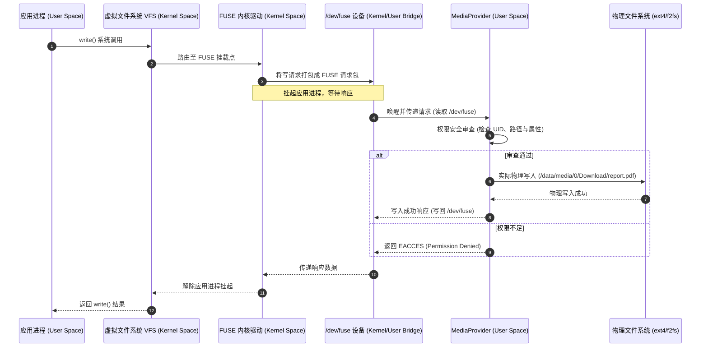
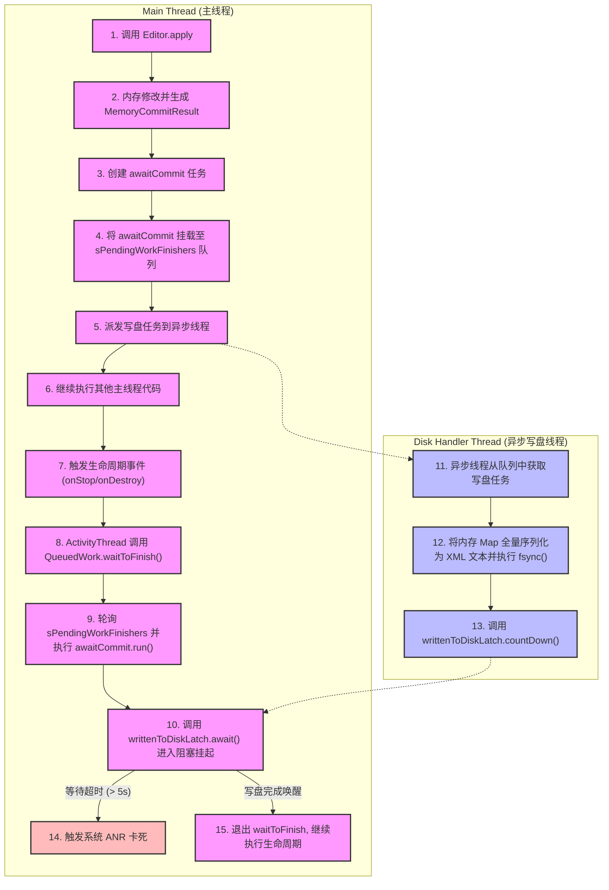
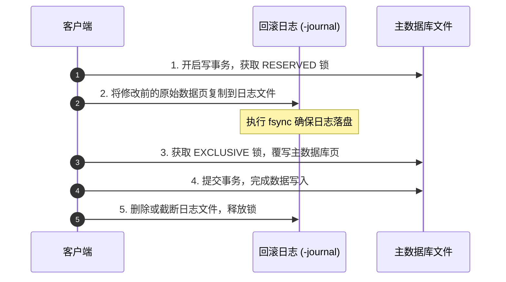
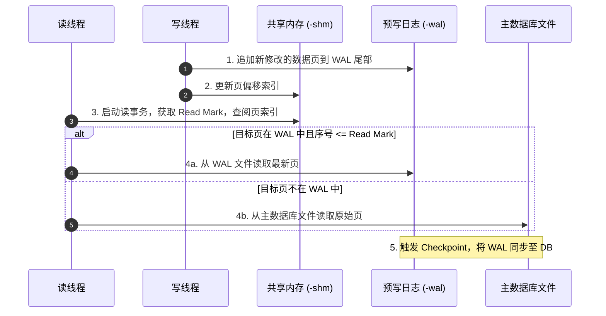

# Android 存储优化深度技术实践指南

> 本文针对 Android 存储系统进行全方位、深层级的解析。从系统底层的存储物理拓扑演进和分区存储（Scoped Storage）的 FUSE 重定向机制，到轻量级 KV 存储组件 SharedPreferences 的设计硬伤与 ANR 治理，再到高性能 MMKV 存储与 SQLite/Room 数据库性能调优，最后到闪存（NAND Flash）文件系统物理特性与线上/线下存储清理治理，为 Android 开发者建立一套闭环、科学的存储优化知识体系。

---

## 第一部分：Android 存储架构及分区存储适配

在 Android 系统的性能优化与架构演进中，存储系统的调整无疑是影响最深远、涉及面最广的领域之一。随着系统安全隐私红线的不断收紧，Android 存储架构经历了一场从“完全开放”到“深度沙箱化”的剧烈变革。对于开发者而言，理解存储架构的物理演进、系统沙箱的安全机制、以及分区存储（Scoped Storage）的底层 I/O 重定向原理，是进行高性能、高稳定性应用开发的基础。

### 1. Android 存储架构演进：从物理分离到逻辑隔离

Android 的存储拓扑在概念上始终分为**内部存储（Internal Storage）**和**外部存储（External Storage）**。然而，随着手机硬件工艺的发展以及系统对隐私要求的提升，这两个概念的物理实体和挂载逻辑发生了根本性的变化。

#### 1.1 早期 Android（2.x - 4.x）：物理分离的双空间时代
在智能手机发展的初期，机身内置的闪存芯片（Flash Rom）容量极度受限（通常仅有 256MB 至 2GB）。
* **内部存储**：对应物理 Flash 芯片上的 `/data` 分区。系统将其作为应用私有数据的存放地。因为空间狭小，早期用户经常遇到“手机存储空间不足”的系统警告。
* **外部存储**：主要依靠可物理插拔的 SD 卡（Secure Digital Card）。系统将外部 SD 卡挂载在 `/mnt/sdcard` 或 `/sdcard` 路径下。其物理格式通常为 FAT32。FAT32 文件系统天生不支持类 Unix 系统的 POSIX 权限管理（即无法对文件设置 Owner、Group 以及读写执行权限）。

在这一时期，内部存储与外部存储是真正的**物理隔离**。应用访问外部存储时，几乎没有任何细粒度的权限限制，只要声明了 `android.permission.WRITE_EXTERNAL_STORAGE` 权限，即可对整张物理 SD 卡进行肆无忌惮的读写。

#### 1.2 中期 Android（4.4 - 9.0）：虚拟化与模拟外部存储的普及
随着手机一体化设计 and 内置闪存（eMMC / UFS）容量的激增，独立的物理 SD 卡插槽开始逐渐淡出旗舰机型。为了兼容旧有的存储开发习惯，Android 引入了**模拟外部存储（Emulated External Storage）**机制。
* 物理上，手机只有一块内置闪存。系统通常将这块闪存划分为多个逻辑分区，其中 `/data` 分区占据了绝大部分空间。
* 系统在物理的 `/data/media` 目录上，通过 `sdcardfs`（一种堆叠文件系统，用以模拟 FAT32 行为）或者用户态守护进程，虚拟并挂载出一个外部存储视图，映射路径通常为 `/storage/emulated/0`（其中 `0` 代表当前主用户的 User ID）。

虽然物理上内部存储与外部存储合并在同一块芯片甚至同一个物理分区上，但在 Android 框架层和权限层，它们依然是相互独立的。因为 `sdcardfs` 的存在，外部存储依然被视为一个行为类似于 FAT32 的“共享大硬盘”。只要应用获得了存储权限，就能够遍历 `/sdcard` 下的所有目录，这导致了以下严重痛点：
1. **垃圾文件泛滥**：应用可以随意在 `/sdcard` 根目录下创建自定义文件夹（如 `/sdcard/Temp_A/`），且在应用被卸载时，这些垃圾文件不会被系统自动清理，导致用户存储空间被永久蚕食。
2. **隐私泄露灾难**：任何拥有读写权限的应用，都可以暗中扫描用户的相册（DCIM）、下载目录（Download）甚至是其他应用写在外部存储上的敏感日志和临时文件，导致个人隐私近乎处于裸奔状态。

#### 1.3 现代化 Android（10 及以上）：全面分区存储时代
为了彻底解决上述痛点，系统在 [Android 10](../../../../AndroidVersionChangeLog.md#android-10api-29) 中引入了分区存储（Scoped Storage），并在 [Android 11](../../../../AndroidVersionChangeLog.md#android-11api-30) 中将其设为强制执行。外部存储的公共大空间被收窄，取而代之的是受控的媒体库访问（MediaStore API）和应用专属的外部沙箱目录。存储架构从过去的“物理隔离、逻辑共享”进化为了“物理融合、安全沙箱化隔离”。

---

### 2. 沙箱内部存储：安全与 UID 隔离机制

内部存储是 Android 系统的基石，主要供应用存放私密、敏感且不应被其他应用或用户直接看到的数据。其核心物理设计和安全防线由 Linux 的 UID 隔离与严格的目录权限共同筑起。

#### 2.1 物理挂载路径剖析
在 Android 应用中，通过 `Context` 实例提供的 API 可以获取内部存储的专属路径：
* `context.getFilesDir()`：返回应用存放持久化私有文件的物理路径，形如 `/data/user/0/<package_name>/files`。
* `context.getCacheDir()`：返回应用存放临时缓存文件的物理路径，形如 `/data/user/0/<package_name>/cache`。

这里的 `/data/user/0` 是多用户架构的产物。在单用户或默认主用户模式下，系统会在根目录建立软链接，将传统物理路径 `/data/data/<package_name>` 指向 `/data/user/0/<package_name>`。如果手机启用了多用户模式（例如访客模式、工作资料或应用双开分身），系统会为新用户分配不同的 User ID（例如 `10`），此时该用户的应用专属路径将映射为 `/data/user/10/<package_name>/files`。

#### 2.2 UID 隔离机制与 Linux 目录权限
Android 安全模型的核心建立在 Linux 进程隔离之上。系统在安装应用时，`PackageManagerService` 会为每个应用分配一个唯一的系统用户 ID（UID），通常在 `10000` 到 `19999` 之间（例如 `u0_a123`）。
* **进程隔离**：当应用启动时，系统会 fork 出一个新的 Zygote 进程，并将该进程的 UID 设置为该应用专属的 UID。这意味着该应用的所有代码都运行在这个受限的 UID 进程中。
* **目录权限控制**：内部存储分区（通常是 ext4 或 f2fs 文件系统）完全支持 POSIX 权限。当系统为应用创建 `/data/user/0/<package_name>` 目录时，会将其 Owner 设为该应用的 UID，并将目录权限设置为 **`700` (`rwx------`)**。
  * `r` (Read)：允许读取目录下的文件列表。
  * `w` (Write)：允许在目录下创建、删除、重命名文件。
  * `x` (Execute)：允许进入该目录并访问其子项。
  
  由于权限为 `700`，意味着**除了 Owner（该应用自身）和系统的超级用户（Root）之外，任何其他 UID 运行的进程都无法读取或写入该目录下的任何文件**。即使其他应用尝试通过直接的 C 语言 `open()` 系统调用去访问该路径，Linux 内核的文件系统权限检查器也会在第一时间拦截并返回 `Permission Denied` 错误。

#### 2.3 数据分类与适用场景
根据生命周期和安全性，内部沙箱存储数据可细分为两类：
* **敏感私密数据**：
  * **SharedPreferences**：底层为 XML 文件，通常存放应用的配置项、用户的 Token、敏感的开关标志。
  * **数据库文件（SQLite / Room）**：存储应用的核心关系型数据。
  * **密钥与证书**：配合 `AndroidKeyStore` 使用的加密数据。
  
  这些文件天生存放在内部沙箱中，安全性极高。在未 Root 的设备上，其他应用绝对无法窃取。
* **临时缓存数据**：
  * 存放于 `getCacheDir()` 下的文件。该目录的特点是**不保证持久存在**。当系统遭遇极度低内存/低磁盘空间时，系统的 `CachedDataCleaner` 服务会根据 LRU（最近最少使用）算法，自动扫描并清理这些缓存目录以释放空间。
  * 开发者必须在该目录下实施严格的生命周期管理，避免将核心业务数据放置在此处，并定期在应用层面主动清理垃圾缓存。

---

### 3. 外部存储分区化机制 (Scoped Storage) 底层探秘

为了彻底斩断应用对外部存储（`/sdcard`）的无序访问，Android 10/11 引入了分区存储。然而，这一变革并非仅仅是 SDK 权限 API 的修改，而是一次底层的存储虚拟化重构。

#### 3.1 底层隔离核心原理：FUSE 与 MediaProvider
在早期的 Android 系统中，外部存储主要通过 Linux 内核态的 `sdcardfs` 进行权限包装。但在分区存储下，为了实现高度动态的、细粒度的权限控制，Android 引入了 **FUSE（Filesystem in Userspace，用户空间文件系统）** 挂载机制，并由系统的守护进程 `MediaProvider` 来实现用户态的文件系统逻辑。

我们通过一个具体的场景来理解其底层交互链路：应用尝试使用底层的 POSIX I/O 接口向 `/storage/emulated/0/Download/report.pdf` 写入数据。



当应用调用标准 I/O 接口时，执行步骤如下：
1. 应用发出 `write` 系统调用，目标路径为 `/storage/emulated/0/...`。
2. Linux 内核的 VFS（虚拟文件系统）识别到该路径处于 FUSE 挂载点下，将请求分发给内核态的 `FUSE` 驱动。
3. `FUSE` 内核驱动将该文件操作请求打包（包含操作类型、Target Path、调用者 UID、偏移量等），并将其放入 `/dev/fuse` 设备的待处理队列中，同时**将发起请求的应用进程挂起（进入不可中断的睡眠状态）**。
4. 运行在用户态 of 系统守护进程 `MediaProvider` 通过多路复用（如 `epoll`）监听 `/dev/fuse`。它读取到该请求包，并在用户态进行权限审查。
5. **权限审查机制**：`MediaProvider` 拥有系统的特权，能够读取应用的包名、运行时权限状态。它会判断：该应用是否在申请专属的外部沙箱目录？如果是公共媒体目录，该应用是否拥有 `READ_EXTERNAL_STORAGE` 或拥有该文件的 Owner 标记？
6. 如果审查通过，`MediaProvider` 会在后台通过系统的物理挂载路径（真实的物理分区 `/data/media/0/Download/report.pdf`，采用 ext4 或 f2fs 读写）代表应用执行真正的 I/O 操作。
7. `MediaProvider` 将底层的物理执行结果（成功或错误码）打包，写回 `/dev/fuse`。
8. 内核态的 `FUSE` 驱动接收到响应，将数据拷贝回应用进程的缓冲区，并唤醒挂起的应用进程。应用进程的 `write` 调用终于返回。

#### 3.2 双重挂载视图与 I/O 吞吐量骤降原因分析
上述 FUSE 重定向过程在提供极其灵活的安全审查能力的同时，也带来了严重的性能副作用。在高频、大批量的 I/O 读写场景下，性能损耗尤为突出，主要原因如下：

* **多次上下文切换（Context Switch）**：
  原本普通的物理文件系统读写，只需发生 `应用进程用户态 <-> 内核态` 的 2 次上下文切换。而在 FUSE 架构下，由于需要唤醒并运行用户态的 `MediaProvider`，上下文切换次数暴增为：
  `应用进程用户态 -> 内核态(FUSE驱动) -> 用户态(MediaProvider) -> 内核态(物理文件系统) -> 用户态(MediaProvider) -> 内核态(FUSE驱动) -> 应用进程用户态`。高频的上下文切换会导致 CPU 寄存器和 TLB（页表缓存）频繁刷新，产生巨大的 CPU 额外开销。
* **多次内存拷贝（Page Copy）**：
  在 FUSE 模式下，数据无法实现“直通”拷贝。以读操作为例，数据必须先从物理介质读入物理内核页缓存，再拷贝到 `MediaProvider` 的用户态缓冲区；接着通过 `/dev/fuse` 拷贝回内核 FUSE 驱动的临时页面，最后才能拷贝到应用进程的用户态内存中。这种多次的内存搬运，在传输大文件或高频小文件时，会迅速占满 CPU 内存带宽。
* **系统调用阻塞**：
  由于每一次 I/O 操作都要等待 `MediaProvider` 进程的调度与排队处理，如果 `MediaProvider` 进程繁忙或被锁竞争阻塞，所有进行外部存储读写的应用进程都将被迫挂起，导致严重的卡顿。

#### 3.3 版本兼容适配路径
为了兼顾老旧应用的存活与新系统的安全要求，系统在不同版本中提供了不同的适配策略：

* **过渡期：[Android 10](../../../../AndroidVersionChangeLog.md#android-10api-29)**
  系统引入了过渡配置项 `android:requestLegacyExternalStorage="true"`。当应用将此属性写入 `AndroidManifest.xml` 时，即使运行在 Android 10 设备上，系统也会为其恢复传统的外部存储视图，避开分区存储的 FUSE 重定向。
* **强制期与 FUSE 优化：[Android 11](../../../../AndroidVersionChangeLog.md#android-11api-30)**
  * **强制分区存储**：对于 Target SDK 为 30 及以上的应用，`requestLegacyExternalStorage` 属性失效，强制开启分区存储。
  * **直接 File API 支持与直通（Bypass）优化**：谷歌意识到 FUSE 的性能退化过于严重，因此在 Android 11 的内核级 FUSE 驱动中进行了重构。系统支持应用继续使用传统的 Java `File` API（如 `new FileInputStream(path)`）访问外部存储中的媒体文件。当 FUSE 驱动发现应用拥有该文件的物理访问权限时，会在内核态建立**直通（Bypass）路由**，后续的数据读写直接绕过用户态的 `MediaProvider`，由内核直接与底层物理文件系统对接。这极大地缓解了内存拷贝和上下文切换带来的性能雪崩。
  * **全局管理权限**：针对文件管理器、备份类应用，Android 11 引入了全新的特权权限 `android.permission.MANAGE_EXTERNAL_STORAGE`。应用在获得用户手动授权后，可以获得除其他应用私有沙箱之外的全局外部存储读写权限。

---

### 4. 持久化读写权限的性能影响与大批量读写优化策略

在分区存储环境下，访问外部存储的 API 发生了解耦。不同的 API 选择，对应用的 I/O 性能有着决定性的影响。

#### 4.1 存储 API 性能损耗对比与根源剖析

| 访问方式 | 适用场景 | 底层交互特点 | 性能损耗级别 | 损耗根源 |
| :--- | :--- | :--- | :--- | :--- |
| **直接 File API** (Android 11+) | 应用专属外部沙箱或已授权的公共媒体文件 | 内核态直通机制（Bypass FUSE 用户态），直接操作物理路径 | **中等** | 首次打开文件需经过 FUSE 权限鉴定，后续读写有轻微的内核封装开销。 |
| **MediaStore API** | 插入、查询相册图片/视频，将文件放入公共 Download 目录 | 通过 `ContentResolver` 与 `MediaProvider` 发生 Binder IPC 跨进程通信，伴随 SQLite 数据库插入操作 | **高** | 每次操作涉及 Binder 序列化/反序列化、进程上下文切换，以及 MediaStore 数据库读写的锁竞争。 |
| **SAF (Storage Access Framework)** | 由用户跨目录任意选择文件夹/文件进行读写 | 涉及系统的 DocumentsUI 授权进程、目标 DocumentProvider 以及应用本身的多进程 Binder 循环通信 | **极高 (性能雪崩)** | 遍历目录时，每一次 `DocumentFile.listFiles()` 都会在后台触发一次 Binder 查询以解析文档元数据，大批量操作下性能呈指数级衰减。 |

#### 4.2 大批量文件读写与遍历的性能优化策略

在处理如大文件解压、多日志合并、媒体文件批量同步等大 I/O 负载场景时，如果直接在外部存储挂载路径或使用低效 API 循环读写，会导致严重的耗时甚至触发 ANR。以下是行之明显的优化方案：

##### 策略一：内部沙箱暂存法（避开 FUSE 与 Binder）
这是解决大批量写入性能瓶颈最有效的“黄金法则”。
* **核心思路**：将高频的、碎碎的写操作全部局限在应用私有的内部存储沙箱内（如 `Context.getCacheDir()`）。内部存储完全走直接的 VFS 物理写入，不受 FUSE 拦截，且不存在跨进程通信。
* **执行步骤**：
  1. 在 `context.getCacheDir()` 下创建一个临时文件。
  2. 使用标准的 `FileOutputStream` / `BufferedOutputStream` 将大批量数据（如解压的子文件、高频追加的日志）写入该临时文件。此阶段 I/O 速率达到物理极限。
  3. 待所有数据写入并校验完毕后，调用 `MediaStore` API 在公共媒体库中创建一个空白的目标占位 URI。
  4. 通过 `ContentResolver.openOutputStream(uri)` 获取输出流。
  5. 使用通道传输（如 `FileChannel.transferTo()`）或者大缓冲区（8KB+）将内部临时文件一次性流式拷贝到外部存储。由于此时是一次性连续写入，大大降低了权限校验与 Binder 调用的频次。
  6. 清理内部临时文件。

##### 策略二：使用 MediaStore 批量接口与批处理
当需要对媒体库执行大批量元数据更改（如批量插入 100 张图片、批量重命名文件）时，切忌在 `for` 循环中单步调用 `resolver.insert()`。
* **使用批处理操作**：
  利用 `ContentResolver.applyBatch(authority, operations)` 将多次插入、修改操作封装进一个 `ArrayList<ContentProviderOperation>` 中，一次性提交给 `MediaProvider`。这样可以将多进程 Binder 交互的次数压缩为 1 次，同时 `MediaProvider` 内部会在同一个 SQLite 事务中执行这些操作，避免了频繁的事务提交与磁盘刷盘（fsync），性能可提升数倍。
* **利用 Android 11 批量修改权限 API**：
  在 Android 11+ 中，如果需要修改或删除不属于本应用的媒体文件，切忌单步尝试并捕获 `RecoverableSecurityException`。应使用 `MediaStore.createTrashRequest()`、`MediaStore.createWriteRequest()` 或 `MediaStore.createDeleteRequest()` 获取一个批量授权的 `PendingIntent`，一次性向用户请求对这批文件的操作权限。

##### 策略三：规避 SAF 目录深度遍历与 DocumentFile 滥用
`DocumentFile` 提供了类似于 `java.io.File` 的封装，但在分区存储下，它的很多方法（如 `exists()`、`isDirectory()`、`length()`）在底层都是一次独立的 `ContentProvider` 查询。
* **禁止深度遍历**：避免使用 `DocumentFile.fromTreeUri()` 之后递归调用 `listFiles()`。如果必须读取某个 SAF 目录下的所有文件，应直接使用 `ContentResolver.query(childrenUri, ...)` 查询该目录下所有子节点的 Cursor，手动遍历 Cursor 解析出文件信息。这可以将原本 $O(N)$ 次的 Binder 通信降低为 1 次 Cursor 传输，彻底防止 UI 线程在大文件夹下卡死。

通过以上对 Android 存储架构历史演进、沙箱安全机制、底层 FUSE 拦截原理以及 API 性能瓶颈的系统化梳理，我们可以清晰地认识到，在现代化 Android 系统中，**“将频繁的 I/O 限制在内部沙箱，将大批量的外部交互合并为单次流式操作/批处理”**是保证存储性能不受 Scoped Storage 惩罚的唯一科学路径。

---

## 第二部分：SharedPreferences（SP）底层设计缺陷与卡死 ANR 治理

### 1. SharedPreferences 底层原理与写盘机制

`SharedPreferences`（下文简称 `SP`）是 Android 系统提供的一种轻量级 KV 存储方案。在底层设计上，`SP` 采用的是“内存全量缓存 + 磁盘 XML 全量落盘”的机制。

当应用调用 `Context.getSharedPreferences()` 时，系统会初始化一个 `SharedPreferencesImpl` 对象。该对象在内存中放置了一个 `HashMap<String, Object>` 作为缓存，所有的读操作（如 `getString()`、`getInt()` 等）都是直接从这个内存 `HashMap` 中读取的。这意味着 `SP` 的读操作非常快，仅存在一次内存查找的开销。

然而，`SP` 的写盘机制却极其粗犷。当开发者通过 `SharedPreferences.Editor` 进行数据修改并提交时，无论修改的数据量有多小（哪怕只是修改或新增了一个 Byte 的 Key-Value 对），`SP` 在落盘时都会将内存中完整的 `HashMap` 重新序列化为 XML 格式的文本，并全量覆盖写入磁盘文件。

这种设计存在两个严重的瓶颈：
* **CPU 瓶颈**：随着业务的发展，`SP` 文件中存储的数据量可能会不断增加。全量落盘意味着每次修改都会触发整个 `HashMap` 的 XML 序列化操作，这涉及大量的字符串拼接和 I/O 序列化计算，极易导致 CPU 占用率飙升，特别是在中低端设备上。
* **磁盘 I/O 瓶颈**：全量覆盖写入需要将整个 XML 文件完整地写入磁盘。这不仅会消耗大量的磁盘写带宽，还会因为频繁的 `fsync()` 系统调用导致闪存（Flash Memory）寿命受损，并在系统 I/O 繁忙时引发严重的磁盘阻塞。

---

### 2. 阻塞 ANR 底层源码深度剖析

#### 2.1 EditorImpl.apply() 的异步执行机制
为了避免在主线程中执行耗时的磁盘 I/O，Android 引入了 `apply()` 方法。与同步落盘的 `commit()` 不同，`apply()` 是一个异步提交操作。下面是其核心源码执行链路的深度解构：

当调用 `SharedPreferencesImpl.EditorImpl.apply()` 时，系统首先会在内存中进行同步修改，将数据更新到内存缓存中，并生成一个 `MemoryCommitResult` 结构。随后，它会创建一个名为 `awaitCommit` 的 `Runnable`，并将其挂载到全局的 `QueuedWork` 队列中。

```java
// SharedPreferencesImpl.java 中的核心逻辑简化
public void apply() {
    final MemoryCommitResult mcr = commitToMemory();
    final Runnable awaitCommit = new Runnable() {
            public void run() {
                try {
                    mcr.writtenToDiskLatch.await(); // 等待写盘任务完成
                } catch (InterruptedException ignored) {
                }
            }
        };

    QueuedWork.addFinisher(awaitCommit);

    Runnable postWriteRunnable = new Runnable() {
            public void run() {
                awaitCommit.run();
                QueuedWork.removeFinisher(awaitCommit);
            }
        };

    SharedPreferencesImpl.this.enqueueDiskWrite(mcr, postWriteRunnable);
    // ...
}
```

在上面的代码中，`QueuedWork.addFinisher(awaitCommit)` 将写盘任务的结束标记挂载到了 `QueuedWork` 内部的 `sPendingWorkFinishers` 队列中（以 `awaitCommit` 形式存在）。接着，系统通过 `enqueueDiskWrite()` 将真正的写盘任务（封装在 `postWriteRunnable` 中）提交到单线程的线程池 `QueuedWork.queue()`（Android 8.0 之后引入了 `HandlerThread` 架构的 `sHandler`）中去异步执行。

#### 2.2 异步写盘为何会阻塞主线程？剖析 QueuedWork.waitToFinish() 机制
虽然写盘任务被放入了异步线程，但为了保证组件生命周期结束时数据已经安全落盘，Android 系统在关键生命周期的流转中强行加入了等待机制。

当 Activity 执行到 `onStop()`、`onDestroy()`，或者 Service 执行到 `onStartCommand()`、`onDestroy()` 等生命周期阶段时，系统通过 `ActivityThread` 最终会调用 `QueuedWork.waitToFinish()` 方法。该方法的目的非常明确：**必须等待所有提交的 SP 写盘任务完成，才能继续执行接下来的生命周期逻辑**。

以下是 `QueuedWork.waitToFinish()` 在 Android 8.0+ 版本的核心实现简化：

```java
public static void waitToFinish() {
    Handler handler = getHandler();
    synchronized (sLock) {
        if (handler != null) {
            handler.removeMessages(QueuedWork.Handler.MSG_RUN);
        }
    }
    try {
        Runnable finisher;
        while ((finisher = sPendingWorkFinishers.poll()) != null) {
            finisher.run(); // 同步执行，阻塞在这里
        }
    } finally {
        // ...
    }
}
```

分析该机制的致命缺陷：
1. **同步锁等待**：主线程在生命周期切换时，执行到 `waitToFinish()`，会进入一个 `while` 循环，从 `sPendingWorkFinishers` 队列中不断取出 `awaitCommit` 的 `Runnable` 并调用其 `run()` 方法。
2. **I/O 阻塞传递**：`awaitCommit` 的 `run()` 方法内部调用了 `mcr.writtenToDiskLatch.await()`。这是一个阻塞的锁等待，它在等待异步写盘线程（在 `writeToFile()` 完成后）调用 `countDown()`。
3. **ANR 触发**：如果此时系统 I/O 负载极高（例如其他应用正在进行大文件读写），或者当前应用的 `SP` 文件非常大导致写入耗时极长，异步写盘线程在执行 `writeToFile()` 时会被卡在内核态的 `write()` 或 `fsync()` 阶段。主线程的 `await()` 就无法被唤醒，进而直接导致主线程被卡死在 `waitToFinish()` 中。一旦卡死时间超过系统的阈值（如 Activity 启动/停止组件超时），系统就会直接抛出 `ANR`（Application Not Responding）。

为了更直观地展现这一致命过程，以下是 **SP 异步落盘与 QueuedWork.waitToFinish() 阻塞主线程的工作流** 对比图：



##### 流程图详细节点解析与逻辑闭环说明
* **节点 1 至 4 (主线程提交)**：主线程发起 `apply()` 后，并不直接写盘，而是快速将包含 `writtenToDiskLatch` 的 `awaitCommit` 挂载到全局静态集合 `sPendingWorkFinishers` 中。这一步是为了确保即便主线程离开当前作用域，系统仍然能追踪到未落盘的异步任务。
* **节点 5 至 6 (异步分流)**：主线程通过线程池或 Handler 将具体的写盘逻辑派发给 `Disk Handler Thread`。在此期间，主线程是非阻塞的，能够正常响应用户交互或执行后续代码 (节点 6)。
* **节点 7 至 10 (生命周期截获与阻塞)**：这是 `ANR` 产生的核心温床。一旦组件发生生命周期切换（如用户按下 Home 键返回桌面导致 Activity 执行 `onStop`），`ActivityThread` 会强行插手。它调用 `waitToFinish()` 试图清空 `sPendingWorkFinishers`。当主线程调用 `await()` 时，其执行权被剥夺，彻底进入挂起（Blocking）状态，等待异步写盘线程的信号。
* **节点 11 至 13 (异步写盘执行)**：异步线程从队列中取出写盘任务，将全部 KV 重新拼接为 XML 并落盘。如果写盘非常顺利，它会执行 `countDown()` 唤醒主线程（节点 15）。
* **节点 14 (ANR 闭环逻辑)**：如果节点 12 发生磁盘 I/O 阻塞（例如由于 Flash 垃圾回收、I/O 竞争或大文件全量写入慢），`countDown()` 迟迟无法执行。主线程将被死死卡在节点 10。当主线程被阻塞时间超过 5 秒（在 Service 的一些生命周期中超时甚至更短），Android 系统的 `AnrTracker` 就会被触发，导致应用弹出 `ANR` 对话框或被直接强杀。

#### 2.3 getSharedPreferences() 首次加载阻塞
除了 `apply()` 带来的生命周期卡死外，`SP` 在初始化时也存在严重的阻塞隐患。

当调用 `getSharedPreferences()` 时，系统会启动一个子线程去读取对应的 XML 文件并解析为内存 `Map`。在这个子线程工作期间，`SharedPreferencesImpl` 内部的 `mLoaded` 变量为 `false`。

如果此时主线程（或任何其他线程）试图调用 `getString()`、`put()` 等方法，这些方法内部会首先触发 `awaitLoadedLocked()`：

```java
private void awaitLoadedLocked() {
    while (!mLoaded) {
        try {
            mMtx.wait(); // 锁等待，阻塞当前线程
        } catch (InterruptedException unused) {
        }
    }
}
```

如果 `SP` 文件非常大，或者磁盘在启动时面临严重的 I/O 竞争，子线程解析 XML 文件的过程就会变慢。此时，主线程的任何读写请求都会被无条件挂起在 `mMtx.wait()` 上。由于这发生在主线程初始化阶段，极易导致应用在冷启动时出现卡顿甚至冷启动 `ANR`。

---

### 3. 治理与替换策略

#### 3.1 反射代理 QueuedWork 方案
为了彻底消灭 `waitToFinish()` 带来的生命周期卡死，行业内曾流行一种“黑科技”方案：**反射代理 `QueuedWork` 并清理其等待队列**。

其核心思路是在 App 初始化时，通过 Java 反射机制获取 `QueuedWork` 类中的静态成员变量 `sPendingWorkFinishers`，然后将其清空或者替换为一个自定义的空队列实现（例如重写 `add()` 和 `poll()` 方法使其不执行任何实质操作）。

以下是该反射方案的代码示意：

```java
public static void hackQueuedWork() {
    try {
        Class<?> queuedWorkClass = Class.forName("android.app.QueuedWork");
        Field finishersField = queuedWorkClass.getDeclaredField("sPendingWorkFinishers");
        finishersField.setAccessible(true);
        
        if (Build.VERSION.SDK_INT >= Build.VERSION_CODES.O) {
            // Android 8.0+ 是 LinkedList
            LinkedList<Runnable> checkers = (LinkedList<Runnable>) finishersField.get(null);
            synchronized (queuedWorkClass) {
                checkers.clear(); // 清空或用代理 LinkedList 替换
            }
        } else {
            // Android 8.0 以下是 ConcurrentLinkedQueue
            ConcurrentLinkedQueue<Runnable> checkers = (ConcurrentLinkedQueue<Runnable>) finishersField.get(null);
            checkers.clear();
        }
    } catch (Exception e) {
        e.printStackTrace();
    }
}
```

##### 兼容性风险与弊端分析
虽然该方案能立竿见影地解决 `ANR`，但也引入了极高风险的副作用：
1. **系统级兼容性问题**：Android 系统的底层代码是不受兼容性白名单保护的。例如，从 Android 7.x 的 `ConcurrentLinkedQueue` 到 Android 8.0+ 的 `LinkedList` 结构，再到 Android 10.0+ 系统对非公开 API 反射（`Hidden API` 限制）的封锁，反射代理方案随时可能因为系统升级而彻底失效，甚至引发 `NoSuchFieldException` 等运行时异常崩溃。
2. **严重的数据丢失隐患**：`sPendingWorkFinishers` 的设计初衷是为了确保应用组件在退出前数据已被安全写入磁盘。如果反射清空了该队列，系统将不再等待写盘直接结束生命周期。当用户按下 Home 键返回桌面，系统可能会立即将该应用进程杀掉（如低内存杀进程）。此时，在异步线程中排队等待写入的数据将彻底丢失，从而导致配置损坏或丢失，破坏了数据的持久性（Durability）保证。

因此，反射代理方案只能作为一种临时治理的权宜之计，不能作为长期的架构方案。

#### 3.2 无缝幂等迁移方案
根本的解决办法是将 `SP` 整体替换为现代的高性能 KV 库，如 `MMKV`。在替换过程中，必须设计一套**多线程安全、幂等且支持故障自愈**的无缝迁移机制。

1. **迁移状态标记（幂等性）**：为了防止重复迁移造成性能损耗或数据覆盖，需要在目标存储介质中引入一个独立的迁移标志位（如 `sp_migrated_to_mmkv_[sp_name]`）。每次启动时，首先读取该标志位，若为 `true` 则直接跳过迁移。
2. **多线程与锁机制**：在执行迁移时，必须持有全局的进程内锁，防止多线程并发读写正在迁移的旧 `SP` 文件。
3. **自愈与回滚机制**：迁移过程中可能遇到磁盘空间不足、文件损坏或迁移中途发生崩溃。必须采用分步提交（先写临时文件，校验无误后再覆盖重命名）的方式，并在捕获到异常时记录失败日志，重试 3 次，若均失败则考虑回滚并继续使用旧的 `SP`，防止迁移卡死启动链路。

---

## 第三部分：MMKV 高性能存储与多进程方案

### 1. MMKV 底层设计与高性能秘诀

腾讯开源的 `MMKV` 是为了替代传统 `SP` 而设计的高性能通用 KV 组件。它在读写性能上相比 `SP` 有着数量级的提升，其底层核心设计主要依赖于 **`mmap` 内存映射** 与 **Protobuf 增量序列化**。

#### 1.1 mmap（内存映射）原理
在 Linux/Android 系统中，传统的磁盘文件 I/O 读写（如 `read()`/`write()`）需要经过两次数据拷贝，并且涉及用户态与内核态的频繁切换：
$$\text{磁盘文件} \longleftrightarrow \text{内核页缓存 (Page Cache)} \longleftrightarrow \text{用户态内存空间}$$

而 `mmap`（Memory Map）是一种直接将磁盘物理文件映射到进程虚拟内存地址空间的系统调用。

```
+-------------------------------------------------------------+
|                     应用进程虚拟内存空间                    |
|  [虚拟内存地址 (Pointer ptr)]                              |
+-------------------------------------------------------------+
                               | (直接映射，无 CPU 拷贝)
                               v
+-------------------------------------------------------------+
|                     内核页缓存 (Page Cache)                 |
+-------------------------------------------------------------+
                               | (内核自动/手动异步刷盘)
                               v
+-------------------------------------------------------------+
|                         物理磁盘文件                        |
+-------------------------------------------------------------+
```

当 `MMKV` 初始化时，它会通过 `mmap()` 建立虚拟地址指针到物理磁盘文件的映射关系。此后：
1. **零拷贝写入**：写入 KV 时，`MMKV` 只需要将数据直接写入该虚拟内存指针对应的内存区域。这省去了传统 `write()` 系统调用中“用户空间数据拷贝到内核空间”的步骤，实现了真正的零拷贝（Zero-Copy）写入。
2. **操作系统内核保障**：写入到 `mmap` 内存中的数据会直接变成内核的“脏页”（Dirty Page）。Linux 操作系统的内核会在后台通过 `pdflush`/`flusher` 线程以极高优先级自动将脏页同步（Sync）落盘。
3. **进程崩溃不丢数据**：即使应用进程由于发生 OOM、Crash 被异常强杀，只要操作系统内核本身没有崩溃，内核依然会负责将 Page Cache 中的脏数据完整地刷入磁盘物理介质中，确保了数据的安全性。

#### 1.2 Protobuf 增量序列化（Append-only）
除了物理 I/O 层面使用 `mmap` 外，`MMKV` 在数据结构上也做到了极致优化。

与 `SP` 将整个 Map 转化为大文本 XML 的思路不同，`MMKV` 内部采用 Google 的 `Protocol Buffers` (简称 `Protobuf`) 作为序列化协议。更重要的是，它采用了**增量尾部追加（Append-only）**的写入模式。

在 MMKV 文件中，数据的存储格式紧凑地遵循 `[Key长度][Key内容][Value长度][Value内容]` 的字节流序列。

* **修改/新增操作**：当写入一个新的 KV，或者修改已有 Key 的 Value 时，`MMKV` 不会去修改文件中原有的数据，而是直接将最新编码后的 `[Key长度][Key内容][Value长度][Value内容]` 数据流追加到当前文件的末尾。
* **读取操作**：在加载文件时，`MMKV` 会从头到尾顺序扫描整个字节流，依次解析出 KV 放入内存 Map 中。如果在尾部扫描到了相同 Key 的新数据，它会直接覆盖掉之前读取的旧数据。这样，内存中始终保留的都是最新的值。

这种 Append-only 的设计将每次写操作的耗时降到了极低，因为它只需要在内存中追加少量字节，完全避免了全量序列化的开销。

#### 1.3 空间整理（Defragmentation）与垃圾回收
由于每次修改数据都是在尾部追加，同一个 Key 的多次修改会在文件中产生大量的历史无效冗余数据，导致文件体积不断膨胀。

为了解决这个问题，`MMKV` 设计了高效的空间整理与垃圾回收机制：
1. **触发阈值**：当再次写入新 KV 时，如果发现 `mmap` 分配的当前文件空间已不足以容纳新数据，或者文件的冗余率（无效数据大小 / 整个文件大小）达到了特定比例，就会自动触发空间整理。
2. **排重重整**：`MMKV` 会在内存中对当前的 Map 进行一次排重清洗，剔除所有被覆盖的旧数据，仅保留最新有效的 KV 数据。
3. **清空重写**：接着，它会直接清空映射文件的全部内容，并将这些排重后的有效数据一次性全量写入文件的头部，释放出尾部大量的闲置空间。如果重整后的空间仍然不足，MMKV 会通过 `ftruncate()` 扩大物理文件，并重新执行 `mmap` 以分配更大的虚拟内存块（每次按页面大小的整数倍扩容）。

为了清晰展现整个运行流程，以下是 **MMKV mmap 映射与尾部追加增量写工作流**：

```mermaid
graph TD
    %% 样式定义
    classDef memory fill:#bbf,stroke:#333,stroke-width:2px;
    classDef disk fill:#fbb,stroke:#333,stroke-width:2px;
    classDef logic fill:#ffb,stroke:#333,stroke-width:2px;

    subgraph "Initialization (初始化阶段)"
        A[1. MMKV 初始化] --> B[2. 打开物理文件 open]
        B --> C["3. 系统调用 mmap(addr, length, PROT_READ|PROT_WRITE, MAP_SHARED, fd)"]
        C --> D["4. 建立虚拟内存与物理文件的映射, 获取指针 ptr"]:::memory
        D --> E["5. 从头顺序解析 Protobuf 字节流, 构建内存 Map"]:::memory
    end

    subgraph "Write Workflow (增量写入与整理)"
        F[6. 应用调用 put 写入/更新 KV] --> G["7. 序列化为 Protobuf [K长度|Key|V长度|Value]"]
        G --> H{"8. 当前 mmap 文件空间是否足够?"}:::logic
        
        H -- "足够 (空间充足)" --> I["9. 直接将字节 data 写入 ptr 指向的尾部物理地址"]:::memory
        I --> J["10. 操作系统内核脏页落盘 (Page Cache -> Disk)"]:::disk
        J --> K[11. 内存 Map 同步更新并返回成功]:::memory
        
        H -- "不足 (触发空间整理)" --> L["12. 触发空间整理 (Defragmentation)"]:::logic
        L --> M["13. 内存 Map 纯净排重 (仅保留最新 KV)"]:::memory
        M --> N["14. 清空 mmap 内存, 全量重写排重后的 Protobuf 数据"]:::memory
        N --> O{"15. 重写后空间是否仍然不足?"}:::logic
        O -- "是" --> P["16. 物理文件 ftruncate 扩容"]:::disk
        P --> Q["17. 重新 mmap 扩容虚拟地址空间"]:::memory
        Q --> I
        O -- "否" --> I
    end
```



##### 流程图详细节点解析与逻辑闭环说明
* **节点 1 至 4 (初始化映射)**：在应用启动并初始化 `MMKV` 时，通过 C++ 层直接发起系统调用 `mmap`。内核为该文件分配 `Page Cache` 并将对应的虚拟内存段暴露给应用进程。这确保了后续所有的底层读写都演化为直接的内存指针移动，避开了传统的 `read/write` 频繁态切换。
* **节点 5 (内存树建立)**：在内存中构建轻量级缓存 Map。由于此时只需要按序解析结构紧凑 of Protobuf 数据流，加载速度远快于庞大的 XML 解析。
* **节点 6 至 11 (增量追加环)**：这是 `MMKV` 高性能写操作的最优路径。一旦判定文件空闲空间足够（节点 8 为“足够”），数据以 Protobuf 结构被复制到指针 `ptr` 尾部偏移量中（节点 9）。操作系统内核的后台线程自动负责将这些映射后的内存页脏数据同步到物理闪存介质上（节点 10），无需主线程承担磁盘挂起的代价。
* **节点 12 至 17 (自适应扩容与整理闭环)**：当空间耗尽时（节点 8 为“不足”），系统并不会像 SP 一样卡死或报错，而是主动执行 `Defragmentation` 垃圾回收（节点 12-13），丢弃旧数据的存储副本，重新在起点整齐写入。如果清洗后数据依然放不下，则通过 `ftruncate` 指令改变底层物理文件大小（节点 16），重新映射，再流入写入通道（节点 9）。这形成了一个完美的自适应循环。

---

### 2. 多进程方案与同步机制

在多进程场景下，传统的 `SP` 即使使用 `MODE_MULTI_PROCESS` 也会经常发生数据丢失或冲突，因为 `SP` 根本没有实现可靠的跨进程读写锁同步。而 `MMKV` 设计了一套高度精密的多进程并发方案。

#### 2.1 跨进程共享内存指针与文件描述符锁（flock）
由于不同进程的虚拟内存空间是相互隔离 of，一个进程直接修改 `mmap` 内存指针，另一个进程无法实时同步自己内存中的缓存 `Map`。

为了解决多进程的并发问题，`MMKV` 巧妙地引入了以下同步构件：
1. **元数据控制区**：`MMKV` 在物理文件的头部，专门划定了一块全局共享的元数据控制区。该区域存有当前文件的版本号（`Sequence Number`）、文件大小以及校验和（`CRC`）。
2. **文件描述符锁 (flock)**：在多进程环境（`MMKV_MULTI_PROCESS`）下，`MMKV` 通过 Linux 的 `flock()` 对映射文件加锁。`flock` 支持：
   * **共享锁 (Shared Lock)**：即读锁。多个进程可以同时持有读锁来安全地读取数据。
   * **排他锁 (Exclusive Lock)**：即写锁。在写入或更新数据时加锁，此时其他任何进程既不能写入也不能读取。

#### 2.2 进程级读写锁同步与版本号机制
为了避免每次读取都频繁调用 `flock` 影响性能，`MMKV` 结合文件锁与版本号实现了精妙的“读写同步与按需重载”机制：

* **进程写操作**：
  1. 进程 A 准备写入数据，首先通过 `flock(fd, LOCK_EX)` 申请排他锁（写锁）。
  2. 申请成功后，修改文件头部的版本号（将 `Sequence Number` 递增 1）。
  3. 将 Protobuf 增量数据追加到 `mmap` 尾部，并在更新完成后释放排他锁 `flock(fd, LOCK_UN)`。
* **进程读操作**：
  1. 当进程 B 尝试读取某个 KV 时，它首先通过 `flock(fd, LOCK_SH)` 申请共享锁（读锁）。
  2. 加锁成功后，读取文件头部元数据区的 `Sequence Number`，并与自身内存中缓存的版本号进行比对。
  3. 如果版本号未变，说明没有其他进程修改过文件，直接从进程 B 自身的内存 Map 中查找并返回，不需要重新读取磁盘。
  4. 如果版本号增加，说明在上次读取后有其他进程写入了新数据。进程 B 会立即读取文件尾部新增的增量 Protobuf 数据流，解析并更新自己内存中的 Map，然后更新本地的版本号记录，最后释放共享锁。

这种利用版本号比对的机制，保证了多进程之间数据的高实时一致性，同时又极大地降低了锁的开销。

#### 2.3 自愈机制与防死锁设计

##### flock 锁的天然自愈与死锁防范
跨进程锁最大的痛点在于：若持有排他锁的进程由于不可抗力（如系统 OOM、遭遇强杀）突然死亡，锁无法被显式释放，很容易导致其他正在等待该锁的进程陷入无限死锁状态。

在 `MMKV` 的多进程方案中，利用 `flock` 的系统特性完成了天然的死愈保护：
* **生命周期绑定**：Linux 系统的 `flock` 锁是与打开的**文件描述符 (File Descriptor, FD)** 绑定的。当持有锁的进程被 Kill 掉时，操作系统内核会自动回收该进程占用的所有系统资源，其中包括自动关闭其所有打开的 FD。一旦该进程的写锁 FD 被关闭，内核便会自动将对应的文件锁释放。
* **死锁防范**：通过这种机制，其他进程就能在持有锁进程死亡后，立即从阻塞中恢复，重新争夺锁所有权，从而在物理层面彻底消灭了多进程死锁的硬性隐患。

##### 多进程 Mutex 的 Robust 恢复
在一些要求极致性能的场合，如果 `MMKV` 在多进程共享内存中使用了 pthread 互斥锁（`pthread_mutex_t` 配合 `PTHREAD_PROCESS_SHARED` 属性），如果进程崩溃在临界区内，互斥锁会被标记为 `EOWNERDEAD`（损坏状态）。

为了自愈这一状态，`MMKV` 在加锁时会进行状态捕获：
1. 如果 `pthread_mutex_lock()` 返回 `EOWNERDEAD`，说明上一个持有锁的进程已经死亡且锁处于损坏状态。
2. `MMKV` 会在捕获该错误后，立即调用 `pthread_mutex_consistent()` 接口，强制重置互斥锁状态，使其重新恢复为可用且一致的状态。
3. 随后，`MMKV` 会对文件的 `CRC` 校验码进行重新计算与比对。如果发现由于崩溃导致最后一次写入的 Protobuf 尾部数据损坏，它会通过头部保存的有效长度，将数据截断（Truncate）并回滚到损坏前的安全版本，实现数据的自愈。

这种从物理层（操作系统内核 FD 回收）到协议层（CRC 校验与截断回滚）的双重自愈设计，使得 `MMKV` 在极其复杂的多进程场景下，依然能够保持极高的健壮性与抗损能力。

---

## 第四部分：SQLite 与 Room 持久化数据库治理

在 Android 移动端应用中，随着业务复杂度的提高，本地持久化数据的存储与检索频率呈现指数级增长。作为 Android 官方推荐的持久化方案，`Room` 库在底层依然依赖于轻量级关系型数据库 `SQLite`。在大数据量场景下，数据库如果治理不当，极易成为引发应用界面卡顿、`ANR` 甚至 `OOM` 的性能瓶颈。本章节将深入探讨 `SQLite` 日志模式的优化、`Cursor` 内存瓶颈分析以及索引失效与宽表拆分设计。

---

### 4.1 SQLite 日志模式优化：从 Rollback Journal 到 WAL

在事务型数据库中，为了保证事务的原子性（Atomicity）和持久性（Durability），数据库必须实现一种能够应对系统崩溃的故障恢复机制。`SQLite` 主要支持两种日志管理模式：**Rollback Journal（回滚日志模式）** 与 **WAL（Write-Ahead Logging，预写日志模式）**。

#### 1. Rollback Journal（回滚日志模式）工作流
回滚日志是 `SQLite` 默认的历史工作模式。在此模式下，写事务并不直接在数据库主文件上进行修改，而是采取先备份、再修改、后提交的策略。以 `DELETE` 或 `TRUNCATE` 日志模式为例，其具体读写工作流如下：

1. **日志备份**：将待修改的数据页（Pages）从主数据库复制到回滚日志文件（`<db-name>-journal`）中。
2. **强制同步**：同步日志文件到磁盘（执行 `fsync`）。
3. **覆写数据**：获取主数据库 `EXCLUSIVE` 锁，将新数据覆写进主数据库物理页。
4. **日志清理**：提交后删除（`DELETE` 模式）或截断（`TRUNCATE` 模式）日志文件。若事务异常中断，重启时则利用日志文件还原回滚。



**回滚日志模式的物理局限**在于其**读写互斥**。在整个写事务运行期间，为了防止读取到脏数据，写入者必须持有排他锁，这使得任何读事务都无法启动。反之，如果系统正处于读取状态（持有共享锁 `SHARED`），写事务也无法升级其锁权限以覆写主数据库。这种强互斥性会导致严重的线程等待和数据库锁竞争，成为卡顿的根源。

#### 2. WAL（Write-Ahead Logging）读写分离机制
为了解决回滚日志模式下的读写互斥痛点，`SQLite` 引入了 `WAL` 模式。它的核心思想是“**先写日志，不改主表**”。

在 `WAL` 模式下，所有的修改数据页都会顺序追加到一个额外的预写日志文件（`<db-name>-wal`）中。同时，为了加速对这些临时数据页的定位，`SQLite` 在内存中维护了一个关联的索引结构，该结构会通过内存映射与一个磁盘共享内存文件（`<db-name>-shm`）保持同步。

`WAL` 模式的具体读写工作流如下：

1. **写操作**：数据追加至 `-wal` 尾部，并在 `-wal` 上调用 `fsync`，随后在 `-shm` 中更新数据页索引偏移。
2. **读操作**：记录“读取标记”（Read Mark），查阅 `-shm`。若数据页存在于 Read Mark 之前的 `-wal` 中则直接读取 `-wal`，否则读取主数据库文件。
3. **检查点**：当 `-wal` 达到阈值时，执行 `Checkpoint` 将已提交的页同步回主数据库，并重置写入指针循环使用。



#### 3. WAL 的读写分离优势与 Android 场景下的性能表现
`WAL` 模式最大的技术优势在于**读不锁写，写不锁读**。读事务启动后，它看到的是数据库在某一个特定时间点的快照，写事务的并发追加并不会破坏这个快照。这意味着，在主线程进行读取查询时，后台线程可以毫无阻碍地进行大规模的数据插入或更新，两者能够并行执行，极大地减少了主线程被数据库锁阻塞的时间，从而能有效避免因数据库操作超时引发的 `ANR`。

然而，在 Android 环境下，`WAL` 模式也存在明显的**局限性**：
* **多进程局限性**：`WAL` 模式强依赖于 `-shm` 共享内存文件来实现多线程间的无锁快速检索。如果 Android 应用设计为多进程架构（例如主进程与后台 Service 进程同时读写同一个数据库），这就要求不同进程能够以完全一致的地址空间映射来共享该内存。如果文件系统不支持共享内存的内存映射，或者跨进程共享内存机制出现异常，`SQLite` 就会被迫退化为回滚日志模式。
* **额外文件开销与 WAL 膨胀**：`WAL` 模式引入了额外的 `-wal` 和 `-shm` 文件，增加了文件句柄的占用。更致命的是，如果应用中存在一个耗时极长的读事务（或者因为未正确关闭 `Cursor` 导致读事务一直存活），`SQLite` 的 `Checkpoint` 机制为了防止读取到脏数据，将无法把该读事务可见的 Read Mark 之后的数据页同步回主数据库。这会导致后续的写事务只能持续往 `-wal` 尾部追加，导致 `-wal` 文件无限膨胀，严重占用磁盘空间，并且会导致数据库查询性能发生断崖式下跌。

在 `Room` 框架中，如果需要启用或精细控制 `WAL` 模式，通常在配置 `RoomDatabase.Builder` 时，通过调用 `setJournalMode()` 方法，或者在数据库打开的回调中直接通过执行 `PRAGMA journal_mode=WAL;` 来显式配置。对于大文件的写入或高频并发写入场景，配合合适的 Checkpoint 策略（如调用 `PRAGMA wal_autocheckpoint` 设置合理的自动检查点阈值，默认通常为 1000 页）是保证数据库健康稳定的关键。

---

### 4.2 SQLite Cursor 内存瓶颈与 ANR 机制剖析

在 Android 的数据交互体系中，任何关系型数据库的查询结果集都是通过 `Cursor`（游标）对象向上传递的。而在框架底层，`Cursor` 的实体数据容器是 `CursorWindow`。

#### 1. CursorWindow 的内存管理机制
`CursorWindow` 底层基于 Android 匿名共享内存（ashmem）实现。在执行查询时，应用并非将全部数据直接载入 Java 堆，而是建立一块共享内存区域封装为 `CursorWindow`，由 C++ 层进行数据读写。

```
+-----------------------------------------------------------------------+
|                       Application Process                             |
|  Java: sqliteCursor.moveToNext()                                      |
|            |                                                          |
|            v (JNI Call)                                               |
|  C++: CursorWindow (Read raw row data from Ashmem)                    |
+------------------------------------+----------------------------------+
                                     |
                                     | (Binder IPC / Shared Memory Map)
                                     v
+------------------------------------+----------------------------------+
|                     system_server / Database Provider                 |
|  C++: CursorWindow (Allocated via ashmem, 2MB size limit)              |
|  C++: Read bytes from SQLite engine and fill windows                  |
+-----------------------------------------------------------------------+
```

`CursorWindow` 在早期的 Android 系统中限制了默认的最大容量为 **2MB**。它的分配和回收主要发生在 Native 空间。当我们在 Java 层创建一个 `Cursor` 时，底层会伴随一个 `CursorWindow` 的 Native 内存分配，其通过 `Binder` 跨进程通信（IPC）机制将该共享内存的句柄（File Descriptor）传递给客户端应用进程，从而实现客户端进程无拷贝读取服务端填充的数据。

#### 2. 大字段与跨页边界的性能噩梦
当表设计不合理（例如存储了过长的 JSON 字符串、高分辨率的二进制图片 Blob、或者是未做截断的富文本）时，`CursorWindow` 的默认限制将触发以下性能问题：

1. **跨越页边界导致的物理 Page 频繁申请**：`SQLite` 数据库以页（Page，通常为 4KB）为单位组织数据。当单行数据中的某一个字段超出了页大小时，该字段的数据会被拆分存储到多个溢出页（Overflow Pages）中。在查询时，底层引擎需要频繁地通过链表指针在不同的物理数据页之间跳转读取，导致严重的随机磁盘 I/O。
2. **CursorWindow 频繁分页加载与 Binder 传输**：当单行数据体积过大（例如单行数据达到 500KB），2MB 限制的 `CursorWindow` 顶多只能容纳 4 行数据。此时，如果应用调用 `Cursor` 的 `moveToNext()` 遍历 100 条数据，当遍历到第 5 条时，当前的 `CursorWindow` 会发生缓存未命中。底层的 `CursorToBulkCursorAdaptor` 就会通过 `Binder` IPC 向底层数据库服务发起一次跨进程请求，清空当前的共享内存，并重新从 SQLite 引擎中加载接下来的 4 条数据。这会导致在遍历过程中频繁发生跨进程通信，并且伴随着大量的 Native 内存分配和数据反序列化拷贝，从而引发严重的 CPU 抖动、主线程卡顿乃至 `ANR`。
3. **CursorWindow 截断异常与 OOM**：如果表中的某一个单行数据非常极端，单行的总体积直接超过了 `CursorWindow` 的 2MB 上限，底层在尝试填充该行时，会因为空间不足且无法单行分页，抛出经典的 `CursorWindowAllocationException` 或者导致数据读取截断，返回异常的空数据或引发 native 内存溢出 `OOM`。
4. **Native 内存泄漏**：`CursorWindow` 的生命周期是绑定在 Java 层 `Cursor` 的销毁上的。如果在发生异常的 catch 块中忘记在 finally 中调用 `close()` 关闭 `Cursor`，底层关联的 `ashmem` 文件描述符和 C++ 内存空间将无法释放，累积之后将耗尽进程的文件句柄，直接造成应用崩溃。

#### 3. 彻底规避 Cursor 内存瓶颈的工程策略
为了防止 `CursorWindow` 导致的内存抖动和卡顿，必须在架构设计层面实施以下防线：
* **Blob 二进制数据外置存储（关键手段）**：严禁在数据库中以 `BLOB` 类型直接存储大图、音频、长文本等大体量对象。标准的做法是将这些大文件保存在应用的沙箱存储目录（如 `context.filesDir`），在数据库的对应表中只保存文件的**相对路径或绝对路径**。读取时，先通过 Room 查询到相对路径，再通过文件 I/O 流异步加载文件内容。
* **精细化查询投影（Select Projection）**：在编写 Room DAO 时，坚决杜绝 `SELECT *` 这种方式。如果表中有部分列是较长的文本，但在商品列表展示时只需要标题和价格，就必须定义一个仅包含标题与价格的轻量级 POJO 类，利用 Room 的 Query 机制只投影对应的两列：
  ```kotlin
  @Query("SELECT id, title, price FROM goods_table")
  fun getLightweightGoodsList(): List<GoodsBriefInfo>
  ```
* **分页加载机制**：对于可能存在成千上万条记录的结果集，应配合 Jetpack `Paging` 库进行流式分页加载，或者手动通过 `LIMIT` 和 `OFFSET` 进行小批量查询。这样能确保 `CursorWindow` 中始终只保持极低的数据量，彻底消除 Binder 频繁传输的压力。

---

### 4.3 数据库索引与大宽表设计

除了数据传输过程的瓶颈外，底层的检索效率也直接决定了读写耗时。索引设计不当或者数据表结构过于臃肿，是导致数据库查询耗时呈线性退化的物理诱因。

#### 1. 数据库索引工作原理：基于 B-Tree 的二分检索
SQLite 底层通过 B-Tree 组织索引。未建索引时，数据页在磁盘上无序分布，检索只能通过时间复杂度为 O(N) 的全表扫描（Table Scan）完成。

当针对某一列（如 `user_id`）建立索引后，`SQLite` 会在底层额外维护一棵以 `user_id` 值为 Key、以数据行唯一标识 `rowid` 为 Value 的 B-Tree。由于 B-Tree 节点是有序排列的，查询引擎可以使用类似二分查找的逻辑，将查找时间复杂度降低至 $O(\log N)$。

然而，索引是一把双刃剑。索引文件会占用额外的磁盘空间，更重要的是，当对表进行 `INSERT`、`UPDATE`、`DELETE` 等写操作时，数据库不仅要修改主表的数据，还需要同步更新 B-Tree 上的节点，这会引入额外的写开销和物理页重排耗时。

#### 2. 索引失效的常见场景与规避
以下是 Android 开发中极易踩坑的四大索引失效场景：

##### (1) 模糊查询的前导通配符 (`LIKE '%xxx'`)
如果模糊查询的通配符放在最前面（例如 `LIKE '%John'`），因为 B-Tree 是按字符的升序排列的，前缀不确定意味着无法确定查找的起点，因此无法利用索引，被迫走全表扫描。
* **优化策略**：若必须使用前缀匹配，可以采用 `LIKE 'John%'`，这种方式下，SQLite 优化器可以将其转化为范围查询，从而正常走索引。

##### (2) 隐式类型转换 (Implicit Type Conversion)
当查询过滤条件的数据类型与索引列定义的类型不匹配时，SQLite 会触发隐式转换。例如，`user_code` 列定义为 `TEXT` 类型且建了索引，但编写的查询语句为：
```sql
SELECT * FROM user WHERE user_code = 12345; -- 传入了整型 12345
```
为了进行数值比较，SQLite 必须对表中每一行的 `user_code` 进行转换后再对比，从而使得原本的 B-Tree 索引完全失效。
* **优化策略**：保证传入的参数类型与字段类型严格一致，在 SQL 中对常量加上单引号：`user_code = '12345'`。

##### (3) 最左前缀法则失效 (Leftmost Prefix Rule)
当我们创建了包含多列的复合索引（例如 `CREATE INDEX idx_user ON user(company_id, dep_id, age)`）时，这棵 B-Tree 是首先按 `company_id` 排序，在 `company_id` 相同的节点内按 `dep_id` 排序，最后按 `age` 排序。
如果我们的查询条件没有包含最左边的 `company_id`，而是直接写：
```sql
SELECT * FROM user WHERE dep_id = 10 AND age > 20;
```
由于没有 `company_id` 的约束，复合索引的最左前缀法则失效，优化器将无法使用该索引。
* **优化策略**：在设计复合索引时，必须将过滤频率最高、区分度最大的列放在最左侧，并在查询时确保首列参与过滤。

##### (4) 在索引列上进行函数计算或数学运算
如果在 `WHERE` 子句中对索引列应用了函数或数学运算，例如：
```sql
SELECT * FROM user WHERE upper(name) = 'TOM';
-- 或者
SELECT * FROM user WHERE age + 1 > 18;
```
由于索引 B-Tree 中只存储了 `name` 或 `age` 的物理值，计算会导致数据库必须对每一行的值计算出结果后再行比对，这同样会让索引报废。
* **优化策略**：将逻辑移至等号右侧，或者由业务层在传入参数前完成计算：
  ```sql
  SELECT * FROM user WHERE age > 17;
  ```

#### 3. 大宽表设计的性能损耗与拆分思路
在大宽表设计中，字段多达几十甚至上百列。这种设计的致命弊端在于，不仅会导致我们在不需要完整数据时因为 `SELECT *` 导致 `CursorWindow` 的 2MB 物理空间被迅速挤爆，更严重的是，过多的列会导致每一行的数据在磁盘物理页中跨越更宽的字节长度。当数据库读取一条记录时，I/O 子系统必须加载更多的无关物理页，导致缓存命中率骤降。

为了解决大宽表带来的性能损耗，在持久化层应贯彻**主表与扩展表（垂直拆分）**的设计思想：

```
+-------------------------+          +----------------------------------------------+
|       主表 (Main)        |          |                 扩展表 (Detail)              |
+-------------------------+ 1 <---> 1 +----------------------------------------------+
|  id  |  title  |  price  |          |  id  |  desc (长文本)  |  ext_json  | config  |
+-------------------------+          +----------------------------------------------+
```

* **主表（Main Table）**：仅存储高频检索、区分度高、占用空间极小的核心列（例如主键 ID、商品标题、状态码、时间戳等）。在商品展示列表等高频读取界面，只对主表进行查询。这样单行数据字节极小，一个 `CursorWindow` 可以装载大量数据，实现流畅的无卡顿滑动。
* **扩展表（Extension Table）**：与主表通过一对一（1:1）的外键关联，专门存放低频访问、体量庞大的属性列（如详细的长文本介绍、复杂的配置项、以及大文件路径）。只有当用户点击列表项进入详情页时，才异步发起一次针对扩展表的二次查询。这种按需延迟加载的策略，能够最大化释放磁盘 I/O 压力。

---

## 第五部分：文件空间清理、监控与碎片整理

在移动端设备中，应用除了依赖数据库外，还产生大量的临时文件，如图片缓存、离线下载包、网络响应缓存、日志文件以及临时解压包。移动设备所采用的闪存介质具备其特有的物理特性，如果缺乏合理的清理、监控和文件碎片整理机制，随着时间推移，闪存性能会大幅衰减。

---

### 5.1 闪存（NAND Flash）文件系统碎片化与 GC 物理本质

不同于传统机械硬盘（HDD）可以通过磁头移动在任意物理扇区上覆盖写入，移动端设备（Android 手机）普遍采用的 **NAND Flash 闪存芯片** 受制于其微观物理结构的限制，必须遵循“**写前必擦（Write-after-Erase）**”的物理定律。

#### 1. 闪存的组织结构与垃圾回收（GC）机制
闪存芯片的存储单元由**块（Block）**和**页（Page）**组成：
* **页（Page）**：是闪存进行读取和写入的最小单元，常见大小为 4KB 或 8KB。
* **块（Block）**：是闪存进行擦除（Erase）的最小单元，一个 Block 通常由 64 或 128 个 Page 组成。

由于写前必擦限制，闪存转换层（FTL）无法直接覆写 Page。修改数据时，必须在已擦除的干净 Block 中写入新 Page，原 Page 则标记为“无效”（Invalid）。

随着随机写入积累，脏 Block 渐多，FTL 会在后台启动垃圾回收（GC）：
1. FTL 选中一个包含无效页较多的脏 Block。
2. 将该 Block 中所有标记为“有效”的数据页读取出来，复制 to 另一个干净的 Block 中。
3. 对原 Block 执行彻底的物理擦除，将其重新标记为完全干净、可写的 Block。

```
[ 脏 Block A ]                                     [ 干净 Block B ]
+------------------------------------+             +------------------------------------+
| Page 1: 有效  --> 读取并复制 ----+ |             | Page 1: 空闲 (写入有效 Page 1)       |
| Page 2: 无效                       |             | Page 2: 空闲 (写入有效 Page 3)       |
| Page 3: 有效  --> 读取并复制 --+  |             | Page 3: 空闲                        |
| Page 4: 无效                   |  |             | Page 4: 空闲                        |
+--------------------------------+--+-------------+------------------------------------+
                                 |  |
                                 v  v
                           进行物理擦除 (Erase)
                                 |
                                 v
                           [ 完全干净 Block A ]
```

这种频繁的“读取-复制-擦除”过程会导致严重的**写放大（Write Amplification）**。当设备可用空间越低时，为了写入少量数据，FTL 必须迁移大量的有效 Page，导致写放大系数呈几何级数增长。这不仅会严重加速闪存芯片的物理磨损，更致命的是，**GC 过程会强行占用硬件总线带宽，阻塞上层应用发起的正常 I/O 读写请求**。这种在硬件层发生的 I/O 阻塞（I/O Stall），是导致 Android 应用在滑动或冷启动时产生卡顿的幕后黑手。

#### 2. 文件系统碎片化（Disk Fragmentation）的演进
在软件层面，Android 设备的常见文件系统有 `EXT4` 和专门针对闪存优化的 `F2FS`（Flash-Friendly File System）。

尽管 `F2FS` 采用了基于日志结构文件系统（LFS）的设计，将小文件的随机写入汇聚为顺序的段（Segment）写入，从而极大地缓解了写放大，但当面对**长时间、高频度的随机读写**（例如高频写入崩溃日志、小文件网络缓存的频繁增删、SQLite 数据库的高频提交事务）时，文件系统在逻辑上连续的簇在物理存储上依然会被打散，分布在不连续的闪存块中，形成大量的**物理碎片空洞**。

当磁盘存储空间占用率极高（例如超过 80% 或 90%）时，文件系统的可用块空间已经支离破碎。此时，系统无法找到连续的物理块，被迫拆分成无数个小碎片进行随机写入。这会导致顺序读写性能退化，且物理 GC 负载骤增，从而导致应用加载和冷启动出现明显的延迟。

---

### 5.2 线下 CI 重复文件与大文件静态检测机制

为了防止包体臃肿以及应用安装后初始空间的无节制占用，治理存储的动作必须左移到开发阶段。在持续集成（CI）阶段，构建流水线应引入静态扫描机制，拦截不合理的文件合规性。

#### 1. 扫描流程与 Gradle 插件实现原理
我们在 CI 构建中，可以编写自定义的 `Gradle` 插件，挂载在打包生命周期中的 `packageRelease` 或 `assembleRelease` 任务之后。该插件会对生成的 `APK` 产物进行解包与静态扫描。

其核心扫描逻辑如下：
1. **解压遍历**：解压生成的 APK，遍历物理文件（排除签名文件）。
2. **MD5 查重**：对文件计算 MD5 哈希。若相同 MD5 映射了多个不同的文件路径，则判定项目存在重复资源。
3. **大文件检测**：对比文件单体体积与告警阈值（如图片限 150KB），拦截高危类型。
4. **无用资源扫描**：结合混淆报告与资源索引，分析并剔除未被使用的废弃资源。

#### 2. CI 告警与熔断机制
在 CI 执行完毕后，插件会生成一份详细的报告。若检测到重复文件累计体积超过了限定门槛（如 1MB），或者存在单体超标的巨型文件，CI 流水线将**强制熔断（Build Failure）**，阻止该分支合并或发布，避开开发人员通过配置 `R8`、剔除冗余依赖、或将静态大文件改为动态下发来瘦身。

---

### 5.3 线上存储监控与动态清理调度设计

由于用户环境的复杂性，线下治理无法覆盖用户在使用过程中的空间膨胀。因此，线上必须构建一套高效率、低消耗的“扫描-预警-清理”闭环调度系统。

#### 1. 线上存储扫描的性能陷阱与优化
很多应用为了了解沙箱内各业务线的空间占用，会在后台执行全盘目录扫描。如果是使用 Java/Kotlin 的标准 API：
```kotlin
// 这种写法线上极其危险！会引发频繁的 JVM 对象分配和慢 JNI 调用
val files = File(context.filesDir.parent).walkBottomUp().toList()
```

这种做法包含两个致命缺陷：
* **JVM 堆内存溢出与频繁 GC**：当应用沙箱内的小文件很多时，`walkBottomUp` 会在 Java 堆内存中瞬间创建出大量的 `File` 实例。这会造成严重的内存抖动，触发频繁的垃圾回收。
* **高频 JNI 边界开销**：Java 层每次查询文件大小，都需要通过 JNI 跨越到 Native 层的系统调用，往返数万次会消耗极大的 CPU 时间片，导致主线程卡死甚至引发 `ANR`。

##### 优化方案一：基于 C/C++ 的 Native 目录扫描
为了彻底消除 Java 对象分配的开销，我们可以通过 NDK 编写一个 Native 扫描工具。在 C/C++ 层，使用 POSIX 标准的 `opendir()` 和 `readdir()` 函数直接读取目录流。

```cpp
#include <dirent.h>
#include <sys/stat.h>
#include <string>

long long getDirectorySizeNative(const char* dirPath) {
    DIR* dir = opendir(dirPath);
    if (!dir) return 0;
    
    long long totalSize = 0;
    struct dirent* entry;
    struct stat fileStat;
    
    while ((entry = readdir(dir)) != nullptr) {
        if (strcmp(entry->d_name, ".") == 0 || strcmp(entry->d_name, "..") == 0) {
            continue;
        }
        
        std::string fullPath = std::string(dirPath) + "/" + entry->d_name;
        
        if (entry->d_type == DT_DIR) {
            totalSize += getDirectorySizeNative(fullPath.c_str());
        } else {
            if (lstat(fullPath.c_str(), &fileStat) == 0) {
                totalSize += fileStat.st_size;
            }
        }
    }
    closedir(dir);
    return totalSize;
}
```

通过 Native 扫描，所有的路径拼接、文件类型辨别、状态获取都在系统层完成，避免了 JVM 的内存负担。实测表明，在万级小文件目录下，Native 扫描的耗时仅为 Java 遍历的 **10% ~ 15%**。

##### 优化方案二：多协程并发分发与 CPU 保护
若无法使用 Native，在 Kotlin 层可将顶级目录（如 `files`、`cache`、`databases`）作为多个独立的扫描根节点，利用 Kotlin 协程的 `Dispatchers.IO` 进行并发遍历。
为了防止并发过多导致 CPU 满载，我们必须通过协程的并发限制（如使用 `Semaphore` 限制最大并发数为 3）来平滑系统的 CPU 占用，且执行时必须配合挂起函数主动让出执行权，杜绝占用主线程。

#### 2. 动态清理调度策略设计：基于阈值与生命周期的分级治理
线上清理不能采取粗暴的一刀切删除，否则会严重破坏用户体验。我们应当建立一套**空间预警分级机制**，针对 TTL（生存时间，如 1~3 天）已过和优先级（P0/P1/P2，P2 为非关键缓存）不同的文件打上标签，动态调度清理任务。

| 预警级别 | 触发条件 | 调度执行策略 |
| :--- | :--- | :--- |
| **轻度预警** (Level-1) | 手机剩余空间 < 20% <br> 或应用沙箱占用 > 500MB | 1. 扫描并强制删除所有超出 TTL 生命周期的 P2 缓存文件。<br>2. 限制新的预加载行为。 |
| **中度预警** (Level-2) | 手机剩余空间 < 10% <br> 或应用沙箱占用 > 1GB | 1. 在轻度策略基础上，针对所有 P2 级别文件启动 **LRU 淘汰算法**。<br>2. 优先清理最久未使用的图片、音频缓存，强制释放 P2 目录中占比最大的前 30% 空间。 |
| **重度预警** (Level-3) | 手机剩余空间 < 5% <br> （极度危险） | 1. 直接清空所有 P2 级别目录。<br>2. 开始对 P1 级别文件（离线包）执行按需淘汰。<br>3. 在 UI 界面弹出提示，引导用户手动管理空间，并暂停高耗空间的后台同步任务。 |

#### 3. 基于 WorkManager 的无感调度系统
为了防止扫描与清理任务影响用户正在进行的前台操作，所有的清理逻辑应当封装为 `WorkManager` 的 `Worker`。

通过设置合理的物理约束条件（Constraints），将扫描与清理任务调度在**设备空闲、连接充电器且处于 Wi-Fi 网络**时静默运行。这样，频繁的文件删除 I/O 和闪存物理 GC 就会在深夜或息屏状态下执行，使用户对磁盘整理过程完全无感。

```kotlin
val cleanupConstraints = Constraints.Builder()
    .setRequiresDeviceIdle(true)       // 核心：要求设备必须处于空闲状态，避免抢占前台 I/O
    .setRequiresCharging(true)         // 核心：要求连接充电器，避免 GC 额外消耗电量
    .build()

val cleanupWorkRequest = OneTimeWorkRequestBuilder<StorageCleanWorker>()
    .setConstraints(cleanupConstraints)
    .build()

WorkManager.getInstance(context).enqueueUniqueWork(
    "PeriodicStorageCleanup",
    ExistingWorkPolicy.KEEP,
    cleanupWorkRequest
)
```

通过这套机制，我们将“检测-评估-轻度清理-强力淘汰-硬件保护”串联在一起，能够使应用即便在高度碎片化、低可用空间的极端机器上，依然能保持高效平稳的运行性能。
